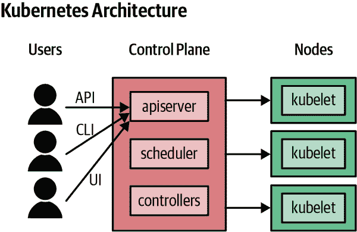

# 第三章：获得 Kubernetes

> 困惑是知识的开始。
> 
> 卡里尔·贾伯兰

Kubernetes 是云原生世界的操作系统，为运行容器化工作负载提供可靠且可扩展的平台。但是，您应该如何运行 Kubernetes 呢？您应该自己托管它吗？在云实例上？在裸金属服务器上？还是应该使用托管的 Kubernetes 服务？或者使用基于 Kubernetes 的托管平台，并通过工作流工具、仪表板和 Web 界面进行扩展？

一个章节要回答这么多问题，确实有点多，但我们会尽力而为。

在这里需要注意的是，我们不会特别关注 Kubernetes 本身的技术细节，比如构建、调优和故障排除集群等。有许多优秀的资源可以帮助您解决这些问题，我们特别推荐 Brendan Burns 和 Craig Tracey 的书籍 [*管理 Kubernetes：在现实世界中操作 Kubernetes 集群*](http://shop.oreilly.com/product/0636920146667.do)（O'Reilly）。

相反，我们将专注于帮助您了解集群的基本架构，并提供您在决定如何运行 Kubernetes 时所需的信息。我们将概述托管服务的利弊，并探讨一些流行的供应商。

如果您想运行自己的 Kubernetes 集群，我们列出了一些最佳安装工具，可帮助您设置和管理集群。

# 集群架构

您知道 Kubernetes 将多个服务器连接成一个*集群*，但集群是什么，它是如何工作的呢？对于本书的目的来说，技术细节并不重要，但您应该了解 Kubernetes 的基本组件及其如何组合在一起，以便了解在构建或购买 Kubernetes 集群时的选择。

## 控制平面

集群的核心是*控制平面*，它负责运行 Kubernetes 所需的所有任务：调度容器、管理服务、处理 API 请求等（见 图 3-1）。

###### 图 3-1\. Kubernetes 集群如何工作

控制平面实际上由多个组件组成：

`kube-apiserver`

这是控制平面的前端服务器，处理 API 请求。

`etcd`

这是 Kubernetes 存储其所有信息的数据库：存在哪些节点，集群上存在哪些资源等。

`kube-scheduler`

这决定了新创建的 Pod 运行在哪里。

`kube-controller-manager`

这负责运行资源控制器，如部署。

`cloud-controller-manager`

这与云提供商交互（在基于云的集群中），管理负载均衡器和磁盘卷等资源。

生产集群中的控制平面组件通常在多台服务器上运行，以确保高可用性。

## 节点组件

运行用户工作负载的集群成员称为*工作节点*。

Kubernetes 集群中的每个工作节点都运行以下组件：

`kubelet`

这负责驱动容器运行时启动在节点上调度的工作负载，并监控其状态。

`kube-proxy`

这执行网络魔术，路由请求在不同节点上的 Pod 之间，以及 Pod 与互联网之间。

*容器运行时*

实际上启动和停止容器并处理它们的通信。历史上最流行的选项是 Docker，但 Kubernetes 也支持其他容器运行时，如[containerd](https://containerd.io)和[CRI-O](https://oreil.ly/RsqHR)。

除了运行不同的容器化组件外，运行控制平面组件的节点与运行应用程序负载的工作节点之间没有固有的区别。通常情况下，运行控制平面组件的节点不会同时运行用户创建的工作负载，除非是非常小的集群（如 Docker Desktop 或 Minikube）。

## 高可用性

正确配置的 Kubernetes 集群具有多个控制平面节点，使其具备*高可用性*；也就是说，如果任何一个节点失败或关闭，或者其上的某个控制平面组件停止运行，集群仍将正常工作。一个高可用的控制平面还将处理控制平面节点正常工作但无法与其他节点通信的情况，这是由于网络故障引起的*网络分区*。

`etcd`数据库在多个节点上复制，并且可以在个别节点失败的情况下继续运行，只要仍然有超过一半原始数量的`etcd`副本的仲裁可用。

如果所有这些都配置正确，控制平面可以在单个节点重新启动或临时失败时继续运行。

### 控制平面故障

控制平面损坏并不一定意味着您的应用程序将停机，尽管这可能会导致奇怪和不稳定的行为。

例如，如果您停止集群中所有控制平面节点，那么工作节点上的 Pod 将继续运行——至少一段时间。但是，您将无法部署任何新的容器或更改任何 Kubernetes 资源，并且诸如 Deployments 的控制器将停止工作。

因此，控制平面的高可用性对于正常运行的集群至关重要。您需要有足够的控制平面节点可用，以便即使其中一个失败，集群也能保持*仲裁*；对于生产集群，可行的最小数量是三个（参见“最小的集群”）。

### 工作节点故障

相比之下，任何单个工作节点的故障实际上并不重要，只要应用程序配置为以多于一个副本运行。只要控制平面仍在工作，Kubernetes 将检测到故障并将节点的 Pod 重新调度到其他地方。

如果同时有大量节点故障，这可能意味着集群不再具备运行您所需的所有工作负载所需的足够资源。幸运的是，这种情况并不经常发生，即使发生了，Kubernetes 也会尽可能地保持您的 Pods 运行，同时替换缺失的节点。

不过，需要记住的是，工作节点越少，每个节点代表的集群容量比例就越大。你应该假设单节点故障随时可能发生，特别是在云环境下，同时两个故障也不是闻所未闻的事情。

一种罕见但完全可能发生的故障是失去整个云*可用区*。云供应商如 AWS 和 Google Cloud 在每个地区提供多个可用区，每个大致对应一个数据中心。因此，与其将所有工作节点放在同一区域，不如将它们分布在两个甚至三个区域更明智。

### 信任，但需验证

尽管高可用性应该使您的集群能够在丢失一些节点时继续运行，但*实际测试*这一点始终是明智的。在计划的维护窗口期间或在非高峰时段，尝试重启一个工作节点，看看会发生什么。（希望是什么也不会发生，或者对您的应用程序用户不可见的情况。）然后，如果可以的话，尝试重启一个控制平面节点，看看在节点宕机时是否能够继续运行`kubectl`命令。

对于更严格的测试，重启控制平面节点之一。（如 Amazon EKS、Azure AKS 或 Google Kubernetes Engine（GKE）等托管服务，在本章后面我们将进一步讨论）不允许您这样做。不过，一个生产级别的集群应该可以毫无问题地经受住这一点。

# 自托管 Kubernetes 的成本

对于考虑在 Kubernetes 中运行生产工作负载的任何人来说，最重要的决定是*买还是建？*您应该自己运行集群，还是付钱给其他人来运行？让我们看看一些选项。

最基本的选择是自托管的 Kubernetes。通过*自托管*，我们指的是您个人或您组织内的一个团队，在您拥有或控制的机器上安装和配置 Kubernetes，就像您可能对使用的任何其他软件（如 Redis、PostgreSQL 或 NGINX）所做的那样。

这种选择为您提供了最大的灵活性和控制权。您可以决定运行哪些版本的 Kubernetes，启用哪些选项和功能，何时以及是否升级集群等。但是，正如我们将在下一节中看到的那样，也存在一些显著的缺点。

## 比你想象的工作要多

自托管选项还需要最大的资源，包括人力、技能、工程时间、维护和故障排除。仅仅设置一个工作的 Kubernetes 集群非常简单，但这距离一个为生产准备好的集群还有很长一段路。您至少需要考虑以下几个问题：

+   控制平面是否具有高可用性？也就是说，如果任何节点宕机或变得无响应，您的集群是否仍然可以工作？您是否仍然可以部署或更新应用程序？您的运行中的应用程序是否在没有控制平面的情况下仍然具有容错能力？（参见“高可用性”。）

+   您的工作节点池是否高可用？也就是说，如果故障导致多个工作节点或甚至整个云可用性区域宕机，您的工作负载是否会停止运行？您的集群是否会继续工作？它是否能够自动提供新节点来修复自身，还是需要手动干预？

+   您的集群是否安全设置？其内部组件是否使用 TLS 加密和受信任的证书进行通信？用户和应用程序在集群操作中是否具有最低权限和权限？容器安全默认设置是否正确？节点是否不必要地访问控制平面组件？对底层的`etcd`数据库的访问是否得到适当的控制和认证？

+   您的集群中的所有服务是否安全？如果它们可以从互联网访问，它们是否经过适当的身份验证和授权？对集群 API 的访问是否严格限制？

+   您的集群是否符合规范？它是否符合 Cloud Native Computing Foundation 定义的 Kubernetes 集群标准？（详见“一致性检查”。）

+   您的集群节点是否完全由配置管理，而不是通过命令式 shell 脚本设置然后被遗忘？每个节点上的操作系统和内核是否已更新，并已应用安全补丁等。

+   您的集群中的数据是否有适当的备份，包括任何持久存储？您的恢复过程是什么？您多久测试一次还原？

+   一旦您有一个运行的集群，如何随时间维护它？如何提供新节点？如何推出现有节点的配置更改？如何推出 Kubernetes 更新？如何根据需求进行伸缩？如何执行策略？

## 这不仅仅是关于初始设置

现在请注意，您不仅需要在首次设置第一个集群时注意这些因素，而且需要在未来所有集群的所有时间内注意。当您对 Kubernetes 基础架构进行更改或升级时，您需要考虑对高可用性、安全性等的影响。

您需要设置监控系统，以确保集群节点和所有 Kubernetes 组件正常工作。您还需要一个警报系统，以便员工可以在白天或夜晚处理任何问题。

Kubernetes 仍在快速发展中，新功能和更新正在不断发布。您需要将您的集群与这些保持最新，并了解这些更改如何影响您的现有设置。您可能需要重新配置您的集群以充分利用最新的 Kubernetes 功能。

仅仅读几本书或文章、正确配置集群然后就了事是远远不够的。你需要定期测试和验证配置——比如随机关闭任意一个控制平面节点，并确保一切仍然正常运行。

自动弹性测试工具，如[Netflix 的 Chaos Monkey](https://oreil.ly/WbiHD)，可以通过定期随机杀死节点、Pods 或网络连接来帮助实现这一点。根据您的云服务提供商的可靠性，您可能会发现 Chaos Monkey 是不必要的，因为定期的真实世界故障也将测试您的集群和运行在其上的服务的弹性（参见“混沌测试”）。

## 工具不能全面替代您的工作

有很多工具——大量的工具——可以帮助您设置和配置 Kubernetes 集群，并且它们中的许多都自称是更多或少的点-and-click、零工作量、即时解决方案。不幸的是，在我们看来，绝大多数这些工具只解决了简单的问题，而忽略了困难的问题。

另一方面，功能强大、灵活、企业级的商业工具往往非常昂贵，甚至可能不向公众开放，因为销售托管服务比销售通用的集群管理工具能够赚取更多的钱。

## Kubernetes 之难

Kelsey Hightower 的 [*Kubernetes 之难*](https://oreil.ly/Chk5v) 教程可能是熟悉 Kubernetes 集群所有底层组件的最佳方法之一。它展示了涉及的各个移动部件的复杂性，并且对于任何考虑自行运行 Kubernetes，即使是作为托管服务的人来说，这都是一种值得进行的练习，以便深入了解其底层运作方式。

## Kubernetes 是困难的

尽管普遍认为设置和管理 Kubernetes 是简单的，事实上 *Kubernetes 很难*。考虑到它的功能，它设计得相当简单和良好，但它必须处理非常复杂的情况，这导致了复杂的软件。

毫无疑问，学习如何正确管理自己的集群以及从日常到月常的实际操作，都需要大量的时间和精力投入。我们不想阻止您使用 Kubernetes，但我们希望您清楚地了解到运行 Kubernetes 自身所涉及的成本和收益，以帮助您做出明智的决策。与使用托管服务相比，这将有助于您对自行托管的成本和收益有一个清晰的理解。

## 行政开销

如果您的组织规模较大，有足够资源为专门的 Kubernetes 集群运维团队提供支持，这可能不是一个大问题。但对于中小企业，甚至只有少数工程师的初创企业来说，自行管理 Kubernetes 集群的行政开销可能是难以承受的。

###### 提示

考虑到预算有限和 IT 运营可用人员的数量，您希望将多少资源用于管理 Kubernetes 本身？这些资源是否最好用于支持您业务的工作负载？您是否可以通过自己的员工或使用托管服务更具成本效益地运营 Kubernetes？

## 从托管服务开始

您可能会有些惊讶，一个 Kubernetes 的书籍中，我们建议您不要运行 Kubernetes！至少，不要自己运行控制平面。基于我们在前面章节中阐述的原因，我们认为使用托管服务很可能比自行托管 Kubernetes 集群更具成本效益。除非您想要在 Kubernetes 上进行一些奇怪和实验性质的操作，而这些操作没有任何托管提供商支持，否则基本上没有理由选择自托管的路线。

###### 提示

根据我们的经验，以及我们在写作本书时采访的许多人的经验，托管服务是运行 Kubernetes 的最佳方式，毋庸置疑。

如果您在考虑 Kubernetes 是否适合您，使用托管服务是一个很好的尝试方式。您可以在几分钟内获得一个完全工作、安全、高可用、生产级的集群，每天只需几美元。（大多数云服务提供商甚至提供免费的层级，让您在数周或数月内运行 Kubernetes 集群而无需支付任何费用。）即使您在试用期后决定更喜欢运行自己的 Kubernetes 集群，托管服务也会向您展示应该如何完成。

另一方面，如果您已经尝试过自行设置 Kubernetes，您会对托管服务如何简化流程感到高兴。您可能没有建造自己的房子；当别人可以更便宜、更快速地为您建造更好的结果时，为什么要自己建造集群呢？

在接下来的部分中，我们将概述一些最流行的托管 Kubernetes 服务，告诉您我们对它们的看法，并推荐我们的最爱。如果您仍不确定，本章的后半部分将探讨您可以使用的 Kubernetes 安装程序（参见“Kubernetes 安装程序”）。

在此我们应该声明，作者中没有任何人与任何云服务提供商或商业 Kubernetes 供应商有所关联。没有人支付我们来推荐他们的产品或服务。这里的观点是我们自己的观点，基于个人经验以及我们在撰写本书时与数百名 Kubernetes 用户交流的观点。

当然，在 Kubernetes 的世界中，事情进展迅速，托管服务市场尤其竞争激烈。预计这里描述的特性和服务会迅速变化。这里列出的列表并不完整，但我们已尽力包含我们认为最佳、最广泛使用或其他重要的服务。

# 托管 Kubernetes 服务

托管的 Kubernetes 服务几乎消除了您设置和运行 Kubernetes 集群的所有管理开销，特别是控制平面部分。实际上，托管服务意味着您支付给其他人（如 Microsoft、Amazon 或 Google）来为您运行集群。

## 谷歌 Kubernetes 引擎（GKE）

正如您期望的那样，作为 Kubernetes 的创始人，谷歌提供了一个[完全托管的 Kubernetes 服务](https://oreil.ly/srHGH)，与谷歌云平台（GCP）完全集成。您可以使用 GCP Web 控制台`gcloud CLI`或它们的[Terraform 模块](https://oreil.ly/xPD8J)部署集群。几分钟之内，您的集群将准备就绪。

谷歌负责监视和替换失败的节点，并自动应用安全补丁。您可以设置集群在您选择的维护窗口自动升级到最新版本的 Kubernetes。

为了实现延长的高可用性，您可以创建*多区域*集群，将工作节点分布在多个故障区域（大致相当于各个数据中心）。即使整个故障区域受到故障的影响，您的工作负载也将继续运行。

## 集群自动缩放

GKE 还提供了一个集群自动缩放选项（参见“自动缩放”）。启用自动缩放后，如果有待处理的工作负载正在等待节点变为可用状态，系统将自动添加新节点以满足需求。

相反，如果有多余的容量，自动缩放器将会将 Pod 整合到较少的节点上，并删除未使用的节点。由于 GKE 的计费是基于工作节点的数量，这有助于您控制成本。

## Autopilot

谷歌还为 GKE 提供了一个名为*Autopilot*的层级，将托管服务推进了一步。虽然大多数托管方案负责管理控制平面节点，但 Autopilot 还完全管理工作节点。您按照 Pod 请求的 CPU 和内存计费，实际的工作节点 VM 对您来说是抽象的。对于希望拥有 Kubernetes 灵活性但不太关心容器最终运行的基础服务器的团队来说，这是一个值得考虑的选项。

## 亚马逊弹性 Kubernetes 服务（EKS）

亚马逊长期以来也一直提供托管容器集群服务，但直到最近，唯一的选择是弹性容器服务（ECS），这是亚马逊在 EC2 虚拟机上运行容器的专有技术。虽然完全可用，[ECS](https://aws.amazon.com/ecs)不如 Kubernetes 强大或灵活，显然连亚马逊自己也认为未来是 Kubernetes，因此推出了弹性 Kubernetes 服务（EKS）。

今天，亚马逊拥有最流行的公共云服务，大多数运行 Kubernetes 的云部署都在 AWS 上进行。如果您已经在 AWS 上建立了基础设施，并计划将应用程序迁移到 Kubernetes，则 EKS 是一个明智的选择。亚马逊负责管理控制平面节点，而您将容器部署到 EC2 实例的工作节点上。

如果您希望设置 [使用 CloudWatch 进行集中日志记录](https://oreil.ly/3cux9) 或 [集群自动缩放](https://oreil.ly/dNxd2)，则需要在集群启动后进行配置。这使得其不如市场上其他托管服务提供的“电池包含”体验多，但根据您的环境和用例，您可能希望自定义或省略这些功能。

部署 EKS 集群有几种选择，包括使用 AWS 管理控制台，`aws` 命令行工具，名为 [`eksctl`](https://eksctl.io) 的开源命令行工具，以及流行的 [EKS Terraform 模块](https://oreil.ly/ZupGB)。每种工具都可以自动化创建所需的各种 IAM、VPC 和 EC2 资源，以建立一个功能正常的 Kubernetes 集群。`eksctl` 还可以处理设置额外的组件，如 CloudWatch 日志记录或在集群配置过程中安装各种附加组件，使其成为一个更为全面的开箱即用 Kubernetes 体验。

## Azure Kubernetes Service (AKS)

[Azure Kubernetes Service (AKS)](https://oreil.ly/f1Eab) 是 Microsoft 在 Azure 上托管 Kubernetes 集群的选项。AKS 传统上在其 GKE 或 EKS 竞争对手之前支持较新版本的 Kubernetes。您可以通过 Azure Web 界面或使用 Azure `az` 命令行工具创建集群，或使用他们的 [Terraform AKS 模块](https://oreil.ly/rKCtD)。

与 GKE 和 EKS 一样，您可以选择交由管理控制平面节点，并且您的计费基于集群中的工作节点数量。AKS 还支持 [集群自动缩放](https://oreil.ly/997iu)，根据使用情况调整工作节点数量。

## IBM 云 Kubernetes 服务

作为一家庄重的公司，IBM 在托管 Kubernetes 服务领域不容忽视。[IBM 云 Kubernetes 服务](https://oreil.ly/i5d38) 相当简单直接，可以在 IBM Cloud 中设置一个纯净的 Kubernetes 集群。

您可以通过默认的 Kubernetes CLI 和提供的命令行工具或基本 GUI 访问和管理 IBM Cloud 集群。没有真正突出的功能能够将 IBM 的服务与其他主要云提供商的服务区分开来，但如果您已经在使用 IBM Cloud，这是一个合乎逻辑的选择。

## DigitalOcean Kubernetes

DigitalOcean 以提供简单的云服务而闻名，并为开发者提供优秀的文档和教程。最近，他们开始提供名为 [DigitalOcean Kubernetes](https://oreil.ly/nGwZj) 的托管 Kubernetes 服务。与 AKS 类似，他们不收取托管控制平面节点的运行费用，您只需为应用程序运行的工作节点付费。

# Kubernetes 安装程序

如果托管或托管式集群不适合您，那么您将需要考虑某种级别的 Kubernetes 自助托管：即，在自己的机器上设置和运行 Kubernetes。

除了学习和演示目的外，几乎不可能完全从头部署和运行 Kubernetes。绝大多数人使用其中一个或多个可用的 Kubernetes 安装工具或服务来设置和管理他们的集群。

## kops

[kops](https://oreil.ly/pP3GI) 是一个用于自动化创建 Kubernetes 集群的命令行工具。它是 Kubernetes 项目的一部分，并且作为一个 AWS 特定工具已经存在很长时间，但现在也开始为包括 Google Cloud、DigitalOcean、Azure 和 OpenStack 在内的其他提供商添加 alpha 和 beta 支持。

kops 支持构建高可用性集群，使其适用于生产 Kubernetes 部署。它使用声明性配置，就像 Kubernetes 资源本身一样，并且不仅可以提供必要的云资源和设置集群，还可以扩展节点、调整大小、执行升级和其他有用的管理员任务。

就 Kubernetes 的整个世界而言，kops 正在快速发展，但它是一个相对成熟且复杂的工具，被广泛使用。如果您计划在 AWS 上运行自托管 Kubernetes，kops 是一个不错的选择。

## Kubespray

[Kubespray](https://oreil.ly/tFRoX)（以前称为 Kargo）是 Kubernetes 项目下的一个工具，用于轻松部署生产就绪的集群。它提供了许多选项，包括高可用性，并支持多个平台。

Kubespray 专注于在现有机器上安装 Kubernetes，特别是本地和裸金属服务器。然而，它也适用于包括私有云（运行在您自己服务器上的虚拟机）在内的任何云环境。它使用 Ansible Playbooks，因此如果您有使用 Ansible 进行服务器配置管理的经验，那么这将是一个值得探索的选择。

## kubeadm

[kubeadm](https://oreil.ly/MeyTC) 是 Kubernetes 发行版的一部分，旨在帮助您按照最佳实践安装和维护 Kubernetes 集群。kubeadm 不会为集群本身提供基础设施，因此适合在裸金属服务器或任何云实例上安装 Kubernetes。

本章提到的许多其他工具和服务在内部使用 kubeadm 来处理集群管理员操作，但是如果你愿意，你也可以直接使用它。

## Rancher Kubernetes Engine (RKE)

[RKE](https://oreil.ly/K09qx)旨在成为一个简单快速的 Kubernetes 安装程序。它不会为你提供节点，并且你必须自己在节点上安装 Docker，然后才能使用 RKE 安装集群。RKE 支持 Kubernetes 控制平面的高可用性。

## Puppet Kubernetes 模块

Puppet 是一个功能强大、成熟、复杂的通用配置管理工具，被广泛使用，并拥有一个庞大的开源模块生态系统。官方支持的[Kubernetes 模块](https://oreil.ly/6KgK0)在现有节点上安装和配置 Kubernetes，包括对控制平面和`etcd`的高可用性支持。

# 购买或自建：我们的建议

这必然是一个快速浏览一些管理 Kubernetes 集群的选项，因为提供的服务范围广泛且多样化，而且一直在不断增长。然而，我们可以根据常识原则提出一些建议。其中之一是 [*减少运行的软件*](https://oreil.ly/egxan) 的理念。

## 减少运行的软件

> 减少运行的软件理念有三个支柱，所有这些支柱都将帮助你操控时间并击败你的敌人。
> 
> 1.  选择标准技术
> 1.  
> 1.  外包未区分的繁重工作
> 1.  
> 1.  创造持久的竞争优势
> 1.  
> Rich Archbold

虽然使用创新性的新技术很有趣和令人兴奋，但从商业角度来看并不总是明智的。使用众所周知的软件通常是一个好主意。它可能有效，可能得到很好的支持，并且你不会成为承担风险和处理不可避免的错误的那个人。

如果你运行容器化工作负载和云原生应用程序，Kubernetes 是最稳定的选择，最好的方式。鉴于此，你应该选择最成熟、稳定和广泛使用的 Kubernetes 工具和服务。

*未区分的繁重工作* 是亚马逊创造的一个术语，用来表示所有的辛勤工作和努力，比如安装和管理软件，维护基础架构等等。这项工作没有什么特别之处；对你来说和对其他任何公司来说都一样。这项工作会花费你的钱，而不是让你赚钱。

减少运行的软件理念认为你应该外包未区分的繁重工作，因为从长远来看这样会更便宜，并且它释放了可以用来专注于核心业务的资源。

## 如果可以的话，使用托管的 Kubernetes

考虑到减少软件运行的原则，我们建议您将 Kubernetes 集群操作外包给托管服务。安装、配置、维护、保护、升级和使您的 Kubernetes 集群可靠是重复且繁重的工作，因此对于几乎所有企业来说，自行操作并不合理。

> 云原生是通过不运行不区分您的内容来加速您的业务的实践。它不是一个云提供商，不是 Kubernetes，不是容器，不是技术。
> 
> [贾斯汀·加里森](https://oreil.ly/Zdlmn)

## 但是供应商锁定呢？

如果您选择了特定供应商（例如 Google Cloud）的托管 Kubernetes 服务，那么会不会将您锁定到该供应商，从而减少未来的选择？未必。Kubernetes 是一个标准平台，因此您构建的任何应用程序和服务都可以在任何其他经过认证的 Kubernetes 提供商系统上运行，可能需要进行一些微小的调整。

托管 Kubernetes 是否会使您更容易陷入锁定，而不是自己运行 Kubernetes 集群？我们认为情况恰恰相反。自主托管 Kubernetes 涉及大量的机械操作和配置维护，所有这些都与特定云提供商的 API 密切相关。例如，在 AWS 上部署虚拟机来运行 Kubernetes，与在 Google Cloud 上执行相同操作需要完全不同的代码。某些 Kubernetes 设置助手（如本章提到的一些）支持多个云提供商，但也有很多不支持。

Kubernetes 的一部分目的是抽象出底层基础设施的技术细节，并为开发人员提供一个标准且熟悉的界面，无论是在 Azure 上运行还是在您自己的金属裸机服务器上运行，它都以相同的方式工作。

只要您设计应用程序和自动化以针对 Kubernetes 本身而不是直接针对云基础设施，您就可以尽可能地摆脱供应商锁定。每个基础设施提供商对于计算、网络和存储的定义都有所不同，但对于 Kubernetes 来说，这些只是 Kubernetes 清单的微小调整而已。大多数 Kubernetes 部署无论在何处运行，工作方式都是相同的。

## 金属裸机和本地部署

您可能会感到惊讶，云原生实际上并不需要完全“在云端”，即将您的基础设施外包给 Azure 或 AWS 等公共云提供商。

许多组织在裸机硬件上运行其基础设施的部分或全部，无论是在数据中心共享托管还是在本地部署。我们在本书中讨论的关于 Kubernetes 和容器的所有内容同样适用于内部基础设施以及云环境。

您可以在自己的硬件机器上运行 Kubernetes；如果预算有限，甚至可以在一堆树莓派上运行它（图 3-2）。一些企业运行着*私有云*，由本地硬件托管的虚拟机组成。

###### 图 3-2\. 预算有限下的 Kubernetes：一个树莓派集群（摄影：David Merrick）

## 多云 Kubernetes 集群

在一些组织中，开发人员将应用程序部署到包括公共云和私有本地环境在内的多种基础设施类型上。由于 Kubernetes 可以在任何地方运行，它已成为在多云或混合云情况下标准化体验的有用工具。有可用的工具可以更轻松地管理在这些环境中运行的不同 Kubernetes 集群的工作负载。

### VMware Tanzu

VMware 传统上与制作管理虚拟机和相关 VM 基础设施的工具有关。他们现在还有用于 Kubernetes 环境的工具套件 Tanzu。具体而言，[Tanzu Mission Control](https://oreil.ly/o3Bym)允许您集中管理多个 Kubernetes 集群，无论它们在何处运行。还有用于构建、部署和监控容器化工作负载的工具。

## OpenShift

[OpenShift](https://www.openshift.com)不仅仅是一个托管的 Kubernetes 服务：它是一个完整的*平台即服务*（PaaS）产品，旨在管理整个软件开发生命周期，包括持续集成和构建工具、测试运行器、应用程序部署、监控和编排。

OpenShift 可以部署到裸金属服务器、虚拟机、私有云和公共云上，因此您可以创建一个跨越所有这些环境的单一 Kubernetes 集群。这使其成为非常大型组织或具有非常异构基础设施的组织的不错选择。

## Anthos

类似于 VMware Tanzu，Google 的[Anthos](https://cloud.google.com/anthos)工具使得可以在多个云中心地管理运行在多个云环境中（如 GKE、AWS 和本地 Kubernetes 环境）的 Kubernetes 工作负载。它们还允许您将本地基础设施连接到 Google Cloud 提供的其他服务，如托管的容器注册表、构建管道工具和网络层。

大多数中小型团队可能不需要立即专注于多云基础设施。这些类型的环境带来了额外的复杂性和成本。我们建议从基础知识开始，并逐步构建。将您的应用程序置于容器中，并部署到托管的 Kubernetes 云服务中，已经在为未来灵活性做好了准备，即使将来可能需要在多个云中同时运行您的应用程序。

## 如果必须的话，请使用标准的 Kubernetes 自托管工具

如果您已经知道自己有特殊需求，意味着托管的 Kubernetes 提供不适合您，那么只有在这种情况下才应考虑自己运行 Kubernetes。

如果情况是这样，您应该选择最成熟、功能强大且广泛使用的工具。我们建议先使用 kubeadm，然后将其与 kops 或 Kubespray 进行比较，看看它们是否符合您的需求。

另一方面，如果您需要跨多个云或平台（包括裸机服务器）扩展集群，并希望保持选项开放，考虑研究 VMware Tanzu 或 Google Anthos。由于大部分 Kubernetes 的管理开销在于设置和维护控制平面，这是一个很好的折中方案。

# 无集群容器服务

如果您真的想要最小化运行容器工作负载的开销，还有一种完全托管的 Kubernetes 服务的更高级别。这些被称为*无集群*服务，例如 Azure Container Instances（ACI）、AWS Fargate 和 Google Cloud Run。虽然在幕后确实有一个集群，但您不能通过`kubectl`等工具访问它。相反，您只需指定要运行的容器镜像以及一些参数，如应用程序的 CPU 和内存需求，服务将处理其余部分。

这些类型的托管服务非常适合快速启动和运行容器，但您可能会遇到某些云提供商在网络或存储方面的限制，因此可能需要转向更强大和灵活的解决方案，例如完整的 Kubernetes 平台。

## AWS Fargate

根据亚马逊的说法，“Fargate 就像 EC2，但不是虚拟机，而是容器。”与 ECS 不同，无需自己规划集群节点然后将它们连接到控制平面。您只需定义一个任务，这本质上是一组关于如何运行您的容器镜像的指令，并启动它。按照任务消耗的 CPU 和内存资源的秒计费。

可以说[Fargate](https://aws.amazon.com/fargate)适合简单、自包含、长时间运行的计算任务或批处理作业（如数据处理），不需要太多定制或与其他服务集成。它也非常适合构建容器，这些容器往往生命周期短暂，并且在无法自我管理工作节点的开销合理情况下使用。

如果您已经在使用带有 EC2 工作节点的 ECS，转换到 Fargate 将免去您需要规划和管理这些节点的麻烦。

## Azure 容器实例（ACI）

[微软的 Azure 容器实例（ACI）](https://oreil.ly/9sFxO)服务与 Fargate 类似，但还提供与 Azure Kubernetes Service（AKS）的集成。例如，您可以配置 AKS 集群，在 ACI 内部生成临时额外的 Pod 来处理需求的峰值或突发。

同样地，您可以在 ACI 中以临时方式运行批处理作业，而无需在没有工作要做时保留空闲节点。Microsoft 将这种理念称为*无服务器容器*，但我们发现这个术语既令人困惑（*无服务器*通常指云函数或作为服务的函数[FaaS]），又不准确（还是有服务器存在；只是您无法访问它们）。

ACI 还与 Azure 事件网格集成，这是 Microsoft 的托管事件路由服务。使用事件网格，ACI 容器可以与云服务、云函数或在 AKS 中运行的 Kubernetes 应用程序进行通信。

您可以使用 Azure 函数创建、运行或传递数据给 ACI 容器。这样做的好处是，您可以从云函数运行任何工作负载，而不仅仅是使用官方支持的（*祝福*）语言，如 Python 或 JavaScript。

如果您能将工作负载容器化，就可以将其作为云函数运行，并使用相关工具。例如，Microsoft Power Automate 甚至允许非程序员以图形方式构建工作流程，连接容器、函数和事件。

## Google Cloud Run

类似于 ACI 和 Fargate，Google Cloud Run 是另一个“容器即服务”的选择，将所有服务器基础设施都隐藏起来。您只需发布一个容器映像，并告诉 Cloud Run 在每个传入的 Web 请求或接收到的[Pub/Sub](https://cloud.google.com/pubsub)消息上运行该容器，它们的托管消息总线服务。默认情况下，启动的容器在 5 分钟后超时，尽管您可以将其延长至 60 分钟。

# 摘要

Kubernetes 无处不在！我们在广阔的 Kubernetes 工具、服务和产品领域中的旅程必然简要，但希望您觉得它有用。

尽管我们尽力使产品和功能的覆盖率尽可能更新，但世界变化迅速，我们预计即使在您阅读本文时，很多事情也会发生变化。

然而，我们认为基本观点是站得住脚的：如果服务提供商能够更好地、更便宜地管理 Kubernetes 集群，那么自己管理可能并不值得。

在我们为迁移到 Kubernetes 的公司提供咨询的经验中，这通常是一个令人惊讶的想法，或者至少不是许多人想到的。我们经常发现，组织已经开始使用诸如 kops 之类的自托管集群工具迈出第一步，但并没有真正考虑使用像 GKE 这样的托管服务。这确实值得考虑。

需要记住的更多事项：

+   Kubernetes 集群由*控制平面*和*工作节点*组成，用于运行工作负载。

+   生产集群必须具有*高可用性*，这意味着控制平面节点的故障不会丢失数据或影响集群的操作。

+   从简单的演示集群到准备好处理关键生产工作负载的集群还有很长的路要走。高可用性、安全性和节点管理只是其中的一些问题。

+   管理自己的集群需要大量的时间、精力和专业知识投入。即便如此，仍有可能出错。

+   像 GKE、EKS、AKS 和其他类似的托管服务为你做了所有繁重的工作，成本比自行托管低得多。

+   如果你必须自行托管你的集群，**kops** 和 **Kubespray** 是成熟且广泛使用的工具，可以在 AWS 和 Google Cloud 上提供和管理生产级集群。

+   像 VMware Tanzu 和 Google Anthos 这样的工具使得在多个云和本地基础设施上集中管理运行的 Kubernetes 集群成为可能。

+   没有充分的业务理由，请不要自行托管你的集群。如果你选择自行托管，请不要低估初始设置和持续维护的工程时间成本。
