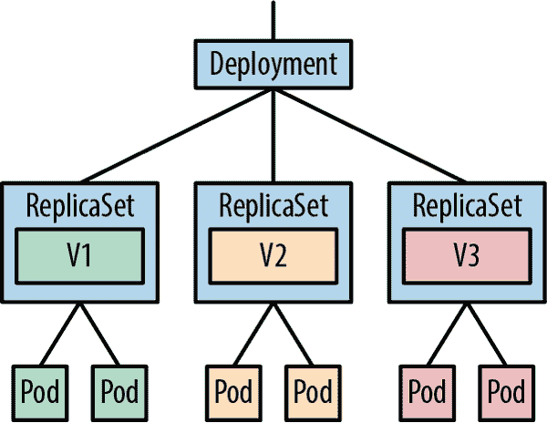
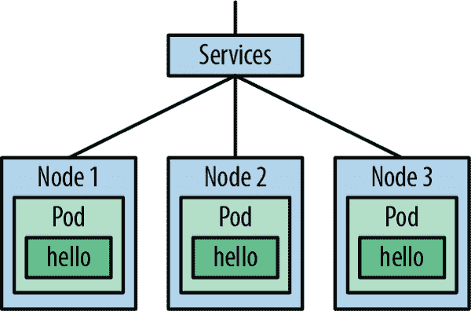

# 第四章：使用 Kubernetes 对象工作

> 我不明白为什么人们害怕新想法。我害怕旧想法。
> 
> 约翰·凯奇

在第二章中，您构建并部署了一个应用程序到 Kubernetes。在本章中，您将学习涉及该过程的基本 Kubernetes 对象：Pods、Deployments 和 Services。您还将了解如何使用基本的 Helm 工具来管理 Kubernetes 中的应用程序。

在“运行演示应用程序”示例中工作后，你应该在 Kubernetes 集群中运行一个容器镜像，但实际上是如何工作的呢？在幕后，`kubectl run`命令创建了一个称为 Deployment 的 Kubernetes 资源。那么它是什么？Deployment 如何实际运行您的容器镜像？

# 部署

回想一下您如何使用 Docker 运行演示应用程序。`docker container run`命令启动了容器，并且直到您使用 `docker stop` 命令停止它。

但是假设容器因其他原因退出：可能是程序崩溃，或者系统错误，或者您的机器磁盘空间不足，或者宇宙射线在错误的时刻击中了您的 CPU（不太可能，但确实会发生）。假设这是一个生产应用程序，这意味着现在有不愉快的用户，直到有人可以到终端并输入 `docker container run` 命令再次启动容器。

这是一种不令人满意的安排。您真正想要的是一种监督程序，它不断检查容器是否在运行，并且如果它停止，立即重新启动。在传统服务器上，您可以使用诸如 `systemd`、`runit` 或 `supervisord` 等工具来实现此目的；Docker 有类似的工具，而 Kubernetes 也有一个监督功能：Deployment。

## 监督和调度

对于 Kubernetes 需要监督的每个程序，它都会创建一个相应的部署对象，记录有关程序的一些信息：容器镜像的名称，您想要运行的副本数，以及启动容器所需的其他任何信息。

与部署资源一起工作的是一种称为*控制器*的 Kubernetes 组件。控制器基本上是一段代码，连续运行在循环中，监视它们负责的资源，确保它们存在且正常工作。如果某个特定的部署由于某种原因没有足够的副本运行，控制器将创建一些新的副本。（如果由于某种原因有太多副本，控制器将关闭多余的副本。无论哪种情况，控制器都会确保实际状态与期望状态匹配。）

实际上，一个 Deployment 并不直接管理副本：相反，它会自动创建一个称为 ReplicaSet 的关联对象来处理。我们稍后会在 “ReplicaSets” 中详细讨论 ReplicaSets，但由于通常只与 Deployments 交互，让我们先更熟悉它们。

## 重新启动容器

乍一看，Deployments 的行为方式可能有些令人惊讶。如果您的容器完成工作并退出，Deployment 将重新启动它。如果它崩溃，或者您用信号杀死它，或者用 `kubectl` 终止它，Deployment 将重新启动它。（这是您在概念上应该考虑的方式；实际情况略微复杂，我们会看到的。）

大多数 Kubernetes 应用程序设计为长时间运行和可靠性，所以这种行为是有道理的：容器可能因各种原因退出，在大多数情况下，人工操作员只需重新启动它们，这也是 Kubernetes 默认的操作方式。

可以为单个容器更改此策略：例如，从不重新启动它，或者仅在失败时重新启动它，而不是正常退出时（参见 “Restart Policies”）。然而，默认行为（始终重新启动）通常是您想要的。

Deployment 的任务是监视其关联的容器，并确保指定数量的容器始终运行。如果数量不足，它会启动更多。如果数量过多，它会终止一些。这比传统的监督程序类型更强大和灵活。

## 创建 Deployments

请在您的本地 Kubernetes 环境中使用我们的演示容器镜像创建一个 Deployment，这样我们就可以深入了解它们的工作原理：

```
`kubectl create deployment demo --image=cloudnatived/demo:hello`
deployment.apps/demo created
```

您可以通过运行以下命令查看当前 *namespace* 中所有活动的 Deployments（参见 “Using Namespaces”）：

```
`kubectl get deployments`
NAME   READY   UP-TO-DATE   AVAILABLE   AGE demo   1/1     1            1           37s
```

要获取有关此特定 Deployment 的更详细信息，请运行以下命令：

```
`kubectl describe deployments/demo`
Name:                   demo Namespace:              default ... Labels:                 app=demo Annotations:            deployment.kubernetes.io/revision: 1 Selector:               app=demo ...
```

正如您所见，这里有很多信息，大部分对现在来说并不重要。不过，让我们更仔细地看一下`Pod Template`部分：

```
Pod Template:
 Labels:  app=demo
 Containers:
 demo:
 Image:        cloudnatived/demo:hello
 Port:         <none>
 Host Port:    <none>
 Environment:  <none>
 Mounts:       <none>
 Volumes:        <none>
...
```

你知道 Deployment 包含了 Kubernetes 运行容器所需的信息，这就是它的作用。但是 Pod 模板是什么？实际上，在我们回答这个问题之前，什么是 Pod？

# Pods

*Pod* 是代表一个或多个容器组的 Kubernetes 对象（pod 也是鲸群的名称，这与 Kubernetes 隐约的海洋比喻相符）。

为什么 Deployment 不直接管理单个容器？答案是有时一组容器需要一起调度，在同一个节点上运行，并在本地通信，可能共享存储。这就是 Kubernetes 开始超越直接在主机上运行容器（例如 Docker）的地方。它管理整个容器组合、它们的配置和存储等，跨越一个节点集群。

例如，博客应用程序可能有一个容器用于将内容与 Git 存储库同步，以及一个 NGINX Web 服务器容器用于向用户提供博客内容。由于它们共享数据，这两个容器需要在一个 Pod 中一起调度。但在实际操作中，许多 Pod 只有一个容器，就像本例一样。（详见 “Pod 中应该包含什么？”）

因此，Pod 规范（*spec*）包含一个 `containers` 列表，在我们的例子中只有一个容器，即 `demo`：

```
demo:
 Image:        cloudnatived/demo:hello
```

`Image` 规范是我们在 Docker Hub 上的演示 Docker 容器镜像，这是 Kubernetes 部署启动 Pod 并保持其运行所需的所有信息。

这是一个重要的观点。`kubectl create deployment` 命令实际上并没有直接创建 Pod。相反，它创建了一个部署，然后部署创建了一个副本集，再由副本集创建了 Pod。部署是你期望状态的声明：“应该有一个运行着 `demo` 容器的 Pod。”

# 副本集

部署并不直接管理 Pod。这是副本集对象的工作。

副本集负责一组相同的 Pod 或 *副本*。如果 Pod 的数量（与规范相比）太少（或太多），副本集控制器将启动（或停止）一些 Pod 以纠正情况。

部署反过来管理副本集，并控制更新时副本的行为——例如，通过部署新版本的应用程序来进行滚动更新（参见 “部署策略”）。当你更新部署时，会创建一个新的副本集来管理新的 Pod，更新完成后，旧的副本集及其 Pod 将被终止。

在 图 4-1 中，每个副本集（V1、V2、V3）代表应用程序的不同版本，并伴随其对应的 Pod。



###### 图 4-1\. 部署、副本集和 Pod

通常情况下，你不会直接与副本集进行交互，因为部署工作已经为你完成了这些工作——但了解它们是非常有用的。

# 维护期望状态

Kubernetes 控制器会持续检查每个资源指定的期望状态与集群的实际状态是否一致，并进行必要的调整以保持同步。这个过程称为 *协调循环*，因为它会无限循环，试图协调实际状态与期望状态。

例如，当你首次创建 `demo` 部署时，没有 `demo` Pod 在运行。因此 Kubernetes 会立即启动所需的 Pod。如果 Pod 停止，只要部署仍然存在，Kubernetes 就会再次启动它。

现在让我们通过手动删除 Pod 来验证一下。首先，检查 Pod 是否确实在运行：

```
`kubectl get pods --selector app=demo`
NAME                    READY   STATUS    RESTARTS   AGE demo-794889fc8d-5ddsg   1/1     Running   0          33s
```

请注意，Pod 的名称对你来说将是唯一的。你也可以通过运行以下命令查看创建此 Pod 的副本集：

```
`kubectl get replicaset --selector app=demo`
NAME              DESIRED   CURRENT   READY   AGE demo-794889fc8d   1         1         1       64s
```

看看 ReplicaSet 如何具有与上述 demo Pod 名称的开头部分匹配的随机生成 ID？在这个示例中，`demo-794889fc8d` ReplicaSet 创建了一个名为`demo-794889fc8d-5ddsg`的 Pod。

现在，运行以下命令以删除 Pod：

```
`kubectl delete pods --selector app=demo`
pod "demo-794889fc8d-bdbcp" deleted
```

再次列出 Pods：

```
`kubectl get pods --selector app=demo`
NAME                    READY     STATUS        RESTARTS   AGE demo-794889fc8d-qbcxm   1/1       Running       0          5s demo-794889fc8d-bdbcp   0/1       Terminating   0          1h
```

您可能会注意到原始 Pod 正在关闭（其状态为`Terminating`），但它已被一个新的 Pod 替换，该 Pod 只有五秒钟的历史。您还可以看到新的 Pod 具有相同的 ReplicaSet，`demo-794889fc8d`，但有一个新的唯一 Pod 名称`demo-794889fc8d-qbcxm`。这就是协调循环在工作。

通过创建的部署告诉 Kubernetes，`demo` Pod 应该*始终*运行一个副本。它听信于你的话，即使你自己删除了 Pod，Kubernetes 也会假设你可能犯了一个错误，并帮助你启动一个新的 Pod 来替换它。

当您完成对部署的实验后，请使用以下命令关闭并清理：

```
`kubectl delete all --selector app=demo`
pod "demo-794889fc8d-qbcxm" deleted deployment.apps "demo" deleted replicaset.apps "demo-794889fc8d" deleted
```

# Kubernetes 调度程序

我们说过类似*部署将创建 Pods*和*Kubernetes 将启动所需的 Pod*，但并没有真正解释它是如何发生的。

Kubernetes *调度器*是此过程的负责部分。当一个部署（通过其关联的 ReplicaSet）决定需要一个新的副本时，它会在 Kubernetes 数据库中创建一个 Pod 资源。同时，这个 Pod 被添加到一个队列中，这就像调度器的收件箱。

调度器的工作是监视其未调度 Pod 的队列，从中获取下一个 Pod，并找到一个节点来运行它。它将使用一些不同的标准，包括 Pod 的资源请求，来选择一个合适的节点，假设有一个可用的（我们将在第五章详细讨论此过程）。

一旦 Pod 已在节点上调度，运行在该节点上的 kubelet 将接管并负责实际启动其容器（参见“节点组件”）。

当你删除一个 Pod 在“维持期望状态”中时，ReplicaSet 发现并开始替换它。它*知道*一个`demo` Pod 应该在其节点上运行，如果找不到，则会启动一个。 （如果您完全关闭节点会发生什么？它的 Pods 将变为未调度状态，并重新进入调度程序的队列，以重新分配到其他节点。）

Stripe 工程师 Julia Evans 已经清楚地解释了[Kubernetes 中调度工作的方式](https://oreil.ly/APoqF)。

# YAML 格式的资源清单

现在你知道如何在 Kubernetes 中运行应用程序了，就这样了吗？你完成了吗？还不完全。使用`kubectl create`命令创建一个部署是有用的，但有限制。假设你想要改变部署规范中的某些内容：比如镜像名称或版本。你可以删除现有的部署（使用`kubectl delete`）并创建一个新的，带有正确字段的部署。但我们来看看我们是否能做得更好。

因为 Kubernetes 本质上是一个*声明式*系统，持续地将实际状态与期望状态进行协调，你只需改变期望的状态——即 Deployment 规范——Kubernetes 就会完成其余的工作。你如何做到这一点呢？

## 资源即数据

所有 Kubernetes 资源，如部署或 Pod，在其内部数据库中都以记录的形式表示。协调循环会监视数据库中这些记录的任何更改，并采取适当的行动。事实上，`kubectl create`命令所做的就是在数据库中添加一个与部署对应的新记录，然后由 Kubernetes 完成其余的工作。

但是你不需要使用`kubectl create`来与 Kubernetes 交互。你还可以直接创建和编辑资源*清单*（资源期望状态的规范）。你可以（而且应该）将清单文件保存在版本控制系统中，而不是运行命令以进行即时更改，你可以修改你的清单文件，然后告诉 Kubernetes 读取更新的数据。

## 部署清单

Kubernetes 清单文件的通常格式是 YAML，尽管它也可以理解 JSON 格式。那么部署的 YAML 清单文件是什么样的呢？

看一下我们的演示应用示例（*hello-k8s/k8s/deployment.yaml*）：

```
apiVersion: apps/v1
kind: Deployment
metadata:
  name: demo
  labels:
    app: demo
spec:
  replicas: 1
  selector:
    matchLabels:
      app: demo
  template:
    metadata:
      labels:
        app: demo
    spec:
      containers:
        - name: demo
          image: cloudnatived/demo:hello
          ports:
          - containerPort: 8888
```

乍一看，这看起来很复杂，但它主要是样板文件。唯一有趣的部分与你已经以各种形式看到的相同信息：容器镜像名称和端口。当你之前将这些信息提供给`kubectl create`时，它在幕后创建了这个 YAML 清单的等效项，并将其提交给 Kubernetes。

## 使用 kubectl apply

要充分利用 Kubernetes 作为声明式基础设施即代码系统的全部功能，请自行向集群提交 YAML 清单，使用`kubectl apply`命令。

试试我们的示例部署清单，在[demo 仓库](https://oreil.ly/LAI8f)中的*hello-k8s/k8s/deployment.yaml*中。¹

在你克隆的演示存储库中运行以下命令：

```
`cd hello-k8s`
`kubectl apply -f k8s/deployment.yaml`
deployment.apps "demo" created
```

几秒钟后，`demo` Pod 应该已经在运行了。

```
`kubectl get pods --selector app=demo`
NAME                   READY   STATUS    RESTARTS   AGE demo-c77cc8d6f-nc6fm   1/1     Running   0          13s
```

不过我们还没结束，因为为了使用 web 浏览器连接到`demo` Pod，我们将创建一个 Service，这是一个 Kubernetes 资源，允许你连接到部署的 Pod（稍后详细说明）。

首先，让我们探讨一下什么是 Service，以及为什么我们需要它。

## 服务资源

假设你想要与 Pod 进行网络连接（比如我们的示例应用程序）。你该如何做？你可以找到 Pod 的 IP 地址，并直接连接到该地址和应用程序的端口号。但是当 Pod 重新启动时，IP 地址可能会更改，因此你需要不断查找以确保它是最新的。

更糟糕的是，可能会有多个 Pod 的副本，每个副本都有不同的地址。需要联系 Pod 的每个其他应用程序都必须维护这些地址的列表，这听起来并不是一个好主意。

幸运的是，有一种更好的方法：Service 资源为你提供一个单一且不变的 IP 地址或 DNS 名称，将自动路由到任何匹配的 Pod。稍后在“Ingress”中，我们将讨论 Ingress 资源，它允许更高级的路由和使用 TLS 证书。

但现在，让我们更仔细地看一看 Kubernetes Service 是如何工作的。

你可以将 Service 理解为类似于 Web 代理或负载均衡器，将请求转发到一组*后端* Pod（参见图 4-2）。但它并不限于 Web 端口：Service 可以将流量从任何端口转发到任何其他端口，详细信息在规范的 `ports` 部分描述。



###### 图 4-2\. Service 为一组 Pod 提供了持久的终结点

这是我们演示应用程序的 Service 的 YAML 清单：

```
apiVersion: v1
kind: Service
metadata:
  name: demo
  labels:
    app: demo
spec:
  ports:
  - port: 8888
    protocol: TCP
    targetPort: 8888
  selector:
    app: demo
  type: ClusterIP
```

你可以看到它在某些方面与我们之前展示的 Deployment 资源相似。但是，`kind` 是 `Service`，而不是 `Deployment`，而 `spec` 只包括 `ports` 列表，加上 `selector` 和 `type`。

如果你放大一点，你会看到 Service 将其端口 8888 转发到 Pod 的端口 8888：

```
...
ports:
- port: `8888`
  protocol: TCP
  targetPort: `8888`
```

`selector` 部分告诉 Service 如何将请求路由到特定的 Pods。请求将转发到任何匹配指定标签集的 Pods；在这种情况下，只有 `app: demo`（参见“标签”）。在我们的示例中，只有一个匹配的 Pod，但如果有多个 Pods，Service 将每个请求发送到随机选择的一个。（参见 2）

在这方面，Kubernetes Service 有点像传统的负载均衡器，事实上，Service 和 Ingress 都可以自动创建云负载均衡器（参见“Ingress”）。

目前，要记住的主要内容是，Deployment 管理应用程序的一组 Pod，而 Service 为这些 Pod 提供单一的请求入口点。

现在，可以应用清单，创建 Service：

```
`kubectl apply -f k8s/service.yaml`
service "demo" created 
`kubectl port-forward service/demo 9999:8888`
Forwarding from 127.0.0.1:9999 -> 8888 Forwarding from [::1]:9999 -> 8888
```

与之前一样，`kubectl port-forward` 将把 `demo` Pod 连接到本地机器上的一个端口，这样你就可以用你的 Web 浏览器连接到 *http://localhost:9999/*。

一旦确认一切都正常工作，运行以下命令清理，然后继续下一节：

```
`kubectl delete -f k8s/`
deployment.apps "demo" deleted service "demo" deleted
```

###### 提示

你可以像之前一样使用带有标签选择器的 `kubectl delete` 来删除匹配选择器的所有资源（参见 “标签”）。或者，你可以像这样使用 `kubectl delete -f`，用一个清单目录。所有清单文件描述的资源都将被删除。

## 使用 kubectl 查询集群

`kubectl` 工具是 Kubernetes 的瑞士军刀：它应用配置，创建、修改和销毁资源，并且还可以查询集群关于现有资源及其状态的信息。

我们已经看到如何使用 `kubectl get` 查询 Pod 和 Deployment。您还可以使用它查看集群中存在的节点。

如果你正在运行 minikube，它应该看起来像这样：

```
`kubectl get nodes`
NAME       STATUS   ROLES                  AGE   VERSION minikube   Ready    control-plane,master   17d   v1.21.2
```

如果要查看所有类型的资源，请使用 `kubectl get all`。（实际上，这并不会显示 literally *all* 的资源，只是最常见的类型，但目前我们不会对此挑剔。）

要查看单个 Pod（或任何其他资源）的详细信息，请使用 `kubectl describe`：

```
`kubectl describe pod/demo-dev-6c96484c48-69vss`
Name:         demo-794889fc8d-7frgb Namespace:    default Priority:     0 Node:         minikube/192.168.49.2 Start Time:   Mon, 02 Aug 2021 13:21:25 -0700 ... Containers:
 demo: Container ID:   docker://646aaf7c4baf6d... Image:          cloudnatived/demo:hello ... Conditions:
 Type           Status Initialized    True Ready          True PodScheduled   True ... Events:
 Type    Reason     Age   From               Message ----    ------     ----  ----               ------- Normal  Scheduled  1d    default-scheduler  Successfully assigned demo-dev... Normal  Pulling    1d    kubelet            pulling image "cloudnatived/demo... ...
```

在示例输出中，您可以看到 `kubectl` 提供了有关容器本身的一些基本信息，包括其镜像标识符和状态，以及发生在容器中的事件的有序列表。（我们将在 第七章 中详细了解 `kubectl` 的强大功能。）

## 将资源提升到下一个级别

现在，您已经知道如何使用声明性 YAML 清单将应用程序部署到 Kubernetes 集群了。但是这些文件中存在大量重复：例如，您多次重复了名称 `demo`、标签选择器 `app: demo` 和端口 `8888`。

你不应该只需在 Kubernetes 清单中指定这些值一次，然后在所需的任何地方引用它们吗？

例如，如果能定义类似 `container.name` 和 `container.port` 的变量将会很棒，然后在 YAML 文件中需要它们的任何地方使用它们。然后，如果需要更改应用程序的名称或监听的端口号，您只需在一个地方进行更改，所有清单将自动更新。

幸运的是，有一个工具可以做到这一点，在本章的最后一节中，我们将展示它能做些什么。

# Helm：一个 Kubernetes 包管理器

Kubernetes 的一个流行的包管理器称为 Helm，它的工作方式与我们在前一节中描述的完全相同。你可以使用 `helm` 命令行工具来安装和配置应用程序（无论是你自己的还是别人的），还可以创建称为 Helm *charts* 的包，这些包完全指定了运行应用程序所需的资源、其依赖关系和可配置的设置。

Helm 是 Cloud Native Computing Foundation 项目家族的一部分（参见 “Cloud Native”），这反映了其稳定性和广泛采用。

###### 注意

需要注意的是，与像 APT 或 Yum 这类工具使用的二进制软件包不同，Helm 图表实际上并不包括容器映像本身。相反，它只包含有关映像位置的元数据，就像 Kubernetes 的 Deployment 一样。

当您安装图表时，Kubernetes 本身将从您指定的位置定位并下载二进制容器映像。事实上，Helm 图表实际上只是 Kubernetes YAML 清单的便捷包装。

## 安装 Helm

按照[Helm 安装说明](https://oreil.ly/NgSTe)为您的操作系统进行操作。

要验证 Helm 是否已安装并正在工作，请运行：

```
`helm version`
version.BuildInfo{Version:"v3...GoVersion:"go1.16.5"}
```

一旦此命令成功，您就可以开始使用 Helm 了。

## 安装 Helm 图表

我们的演示应用程序的 Helm 图表会是什么样子？在 *hello-helm3* 目录中，您会看到一个 *k8s* 子目录，前一个示例中 (`hello-k8s`) 只包含用于部署应用程序的 Kubernetes 清单文件。现在它包含一个 Helm 图表，在 *demo* 目录中：

```
`ls k8s/demo`
Chart.yaml  production-values.yaml  staging-values.yaml  templates  values.yaml
```

我们将在“Helm 图表的内容是什么？”中看到所有这些文件的用途，但现在让我们使用 Helm 安装演示应用程序。首先，清理之前部署的资源：

```
`kubectl delete all --selector app=demo`
```

然后运行以下命令：

```
`helm upgrade --install demo ./k8s/demo`
NAME: demo LAST DEPLOYED: Mon Aug  2 13:37:21 2021 NAMESPACE: default STATUS: deployed REVISION: 1 TEST SUITE: None
```

如果您使用之前学到的 `kubectl get deployment` 和 `kubectl get service` 命令，您会看到 Helm 已创建了一个 Deployment 资源（启动一个 Pod）和一个 Service，就像之前的示例中一样。`helm upgrade --install` 命令还会创建一个 Kubernetes Secret，类型为 `helm.sh/release.v1` 以跟踪发布。

## 图表、仓库和发布

这些是您需要了解的三个最重要的 Helm 术语：

+   *图表* 是一个 Helm 包，包含在 Kubernetes 中运行应用程序所需的所有资源定义。

+   *仓库* 是可以收集和共享图表的地方。

+   *发布* 是在 Kubernetes 集群中运行的图表的特定实例。

Helm 资源与 Docker 容器有一些相似之处：

+   Helm *仓库* 是存储和从客户端下载图表的服务器，类似于容器注册表存储和提供 Docker Hub 等容器映像。

+   当图表安装到集群中时，称为 Helm *发布*，就像发布 Docker 映像作为运行中容器一样。

Helm 图表可以从仓库服务器下载并安装，也可以通过指向文件系统上包含 Helm YAML 文件的本地路径直接安装。

一个图表可以在同一集群中安装多次。例如，您可能会为不同的应用程序运行多个 Redis 图表副本，每个副本作为不同网站的后端。每个独立的 Helm 图表实例都是一个不同的发布。

您可能还希望在集群中集中安装一些所有应用程序都使用的内容，例如 [Prometheus](https://oreil.ly/Ys0Xu) 用于集中监控，或者 [NGINX Ingress Controller](https://oreil.ly/ZSpg6) 用于处理传入的 Web 请求。

## 列出 Helm 发布

要随时检查您正在运行的发布版本，请运行 `helm list`：

```
`helm list`
NAME  NAMESPACE REVISION  UPDATED STATUS    CHART demo  default   1         ...     deployed  demo-1.0.1
```

要查看特定发布的确切状态，请运行 `helm status`，然后输入发布的名称。您将看到与首次部署发布时相同的信息。

本书后面，我们将向您展示如何为您的应用构建自己的 Helm 图表（请参阅 “Helm 图表的内容是什么？”）。现在，只需知道 Helm 是从公共图表中安装应用的便捷方式。

许多流行的应用程序托管在各种 Helm 仓库中，并由包提供者维护。您可以添加 Helm 仓库并安装其图表，您也可以为自己的应用程序托管和发布自己的 Helm 图表。

###### 提示

您可以在 [Artifact Hub](https://artifacthub.io) 上看到许多流行 Helm 图表的示例，这是另一个 CNCF 项目。

# 总结

本书主要讲述如何使用 Kubernetes，而不是深入探讨 Kubernetes 的工作原理。我们的目标是向您展示 Kubernetes 能够*做*什么，并迅速带您达到可以在生产环境中运行真实工作负载的水平。然而，了解一些您将要使用的主要组件（如 Pods 和 Deployments）也是很有用的。在本章中，我们简要介绍了一些最重要的内容。我们还推荐 [*管理 Kubernetes*](https://oreil.ly/Fxs6E)、[*生产 Kubernetes*](https://oreil.ly/ZsROQ) 和 [*Kubernetes the Hard Way* 仓库](https://oreil.ly/Chk5v)，供那些希望更加熟悉 Kubernetes 内部工作机制的人使用。

尽管像我们这样的极客对这项技术如此迷人，但我们也对完成工作感兴趣。因此，我们并没有详尽地覆盖 Kubernetes 提供的每一种资源，因为种类实在是太多了，而且其中许多您几乎肯定用不上（至少目前还用不上）。

我们认为您现在需要了解的关键点有：

+   Pod 是 Kubernetes 中的基本工作单元，指定了一个或多个通信容器的组合，它们一起被调度。

+   Deployment 是一个高级 Kubernetes 资源，以声明方式管理 Pod，进行部署、调度、更新并在必要时重新启动它们。

+   Service 是 Kubernetes 中负载均衡器或代理的等效物，通过单一、著名且持久的 IP 地址或 DNS 名称将流量路由到其匹配的 Pods。

+   Kubernetes 调度器会监视尚未在任何节点上运行的 Pod，找到合适的节点，并指示该节点上的 kubelet 运行该 Pod。

+   资源如部署（Deployments）在 Kubernetes 的内部数据库中以记录形式表示。在外部，这些资源可以以 YAML 格式的文本文件（称为*清单*）表示。清单是资源期望状态的声明。

+   `kubectl`是与 Kubernetes 交互的主要工具，允许您应用清单、查询资源、进行更改、删除资源以及执行许多其他任务。

+   Helm 是一个 Kubernetes 包管理器。它简化了配置和部署 Kubernetes 应用程序，允许您使用一组捆绑的清单和模板来生成参数化的 Kubernetes YAML 文件，而不是自己维护原始的 YAML 文件。

¹ *k8s*，发音为*kates*，是*Kubernetes*的常见缩写，遵循将单词缩写为*数字代号*的极客模式：它们的第一个和最后一个字母，以及中间字母的数量（*k-8-s*）。也可以参见*i18n*（国际化）、*a11y*（可访问性）和*o11y*（可观察性）。

² 这是默认的负载均衡算法；Kubernetes 1.10+版本还支持其他算法，如*最小连接*。更多信息请参阅[Kubernetes 文档](https://oreil.ly/YZDrx)。
