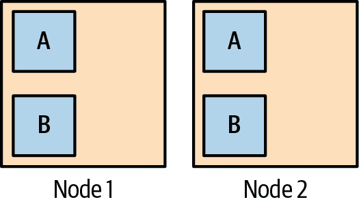
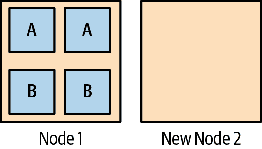
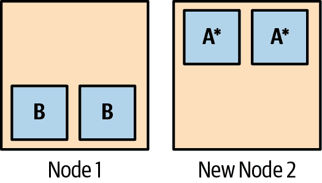

# 第五章：管理资源

> 对于那个对于他来说，有的从来不算多。
> 
> 伊壁鸠鲁

在本章中，我们将看看如何充分利用您的集群：如何管理和优化资源使用，如何管理容器的生命周期，以及如何使用命名空间来分区集群。我们还将概述一些技术和最佳实践，以降低集群成本，同时尽可能地发挥其性能。

您将学习如何使用资源请求、限制和默认设置，以及如何通过垂直 Pod 自动缩放器优化它们；如何使用就绪探针、存活探针和 Pod 破坏预算来管理容器；如何优化云存储；以及何时如何使用可抢占或预留实例来控制成本。

# 理解资源

假设您有一个具有一定容量的 Kubernetes 集群，并且具有适当大小的节点数量。如何从中获得最大的性价比？也就是说，在确保有足够的余地应对需求峰值、节点故障和糟糕的部署的同时，如何为您的工作负载充分利用可用的集群资源？

要回答这个问题，把自己放在 Kubernetes 调度器的位置上，试着从它的角度看事物。调度器的工作是决定在哪个节点上运行特定的 Pod。是否有任何节点有足够的空闲资源来运行这个 Pod？

除非调度器知道 Pod 需要多少资源才能运行，否则无法回答这个问题。一个需要 1 GiB 内存的 Pod 无法被调度到只剩下一百 MiB 空闲内存的节点上。

同样，当一个贪婪的 Pod 占用了太多资源并使同一节点上的其他 Pod 饥饿时，调度器必须能够采取行动。但太多是多少？为了有效地调度 Pod，调度器必须了解每个 Pod 的最小和最大允许的资源需求。

这就是 Kubernetes 资源请求和限制发挥作用的地方。Kubernetes 理解如何管理两种资源：CPU 和内存。还有其他重要类型的资源，比如网络带宽、磁盘 I/O 操作（IOPS）和磁盘空间，这些可能在集群中引起争用，但 Kubernetes 还没有一种方法来描述 Pod 对这些资源的需求。

## 资源单位

Pod 的 CPU 使用量通常用 CPU 单位来表示，就像你预期的那样。在 Kubernetes 中，1 个 CPU 单位等同于一个 AWS 虚拟 CPU（vCPU）、一个 Google Cloud Core、一个 Azure vCore，或者支持超线程的裸金属处理器上的一个超线程。换句话说，Kubernetes 术语中的 *1 CPU* 意味着你认为的那样。

因为大多数 Pod 不需要整个 CPU，请求和限制通常用 *millicpus*（有时称为 *millicores*）表示。内存以字节为单位进行测量，或者更方便地，以 *mebibytes*（MiB）为单位。

## 资源请求

Kubernetes 的 *资源请求* 指定了 Pod 运行所需的最小资源量。例如，请求 `100m`（100 毫核）和 `250Mi`（250 MiB 内存）意味着 Pod 不能被调度到没有足够这些资源的节点上。如果没有足够容量的节点可用，Pod 将保持在 `pending` 状态，直到有足够的资源为止。

例如，如果所有集群节点都有两个 CPU 内核和 4 GiB 内存，那么请求 2.5 个 CPU 的容器将永远无法被调度，请求 5 GiB 内存的容器也是如此。

让我们看看资源请求应用到我们的演示应用会是什么样子：

```
spec:
  containers:
  - name: demo
    image: cloudnatived/demo:hello
    ports:
    - containerPort: 8888
    `resources``:`
      `requests``:`
        `memory``:` `"``10Mi``"`
        `cpu``:` `"``100m``"`
```

## 资源限制

*资源限制* 指定了 Pod 允许使用的最大资源量。尝试使用超过其分配的 CPU 限制的 Pod 将被 *限制*，从而降低其性能。

尝试使用超过允许的内存限制的 Pod 将被终止。如果可以重新调度终止的 Pod，那么就会重新调度。实际上，这可能意味着 Pod 只是在同一节点上重新启动。

有些应用程序，如网络服务器，可以根据需求的增加而随时间消耗更多资源。指定资源限制是防止这些资源需求大的 Pod 使用超过集群容量的公平份额的好方法。

这里是一个在演示应用上设置资源限制的例子：

```
spec:
  containers:
  - name: demo
    image: cloudnatived/demo:hello
    ports:
    - containerPort: 8888
    `resources``:`
      `limits``:`
        `memory``:` `"``20Mi``"`
        `cpu``:` `"``250m``"`
```

确定为特定应用设置什么样的限制是观察和判断的问题（见“优化 Pods”）。

Kubernetes 允许资源 *过度提交*；也就是说，节点上所有容器的资源限制总和可以超过该节点的总资源。这是一种赌博：调度程序打赌，大多数情况下，大多数容器不需要达到其资源限制。

如果这种赌博失败，并且总资源使用接近节点的最大容量时，Kubernetes 将开始更积极地终止容器。在资源压力条件下，已超过其请求但未达到限制的容器可能仍会被终止。

## 服务质量

根据 Pod 的请求和限制，Kubernetes 将其分类为以下几种[服务质量（QoS）类](https://oreil.ly/x0m1T)之一：*Guaranteed*、*Burstable* 或 *BestEffort*。

当请求匹配限制时，一个 Pod 被分类为 Guaranteed 类，意味着控制平面认为它是最重要的 Pod 之一，将尽最大努力确保 Pod 只有在超过指定限制时才会被终止。对于高度关键的生产工作负载，您可能希望考虑设置限制和请求以匹配，以便优先调度这些容器。

突发型 Pod 的优先级低于保证型 Pod，如果节点上有空余容量，Kubernetes 将允许它们“突发”超出其请求直至其限制。如果 Pod 使用的资源超过了请求，如果控制平面需要为更高 QoS 类别的 Pod 腾出位置，则可能会终止 Pod。

如果 Pod 没有指定任何请求或限制，它被视为*最佳努力*，这是最低优先级。允许 Pod 使用节点上可用的任何 CPU 和内存，但当集群需要为更高的 QoS Pod 腾出空间时，它将首先被终止。

# 最佳实践

对于您的容器，始终指定资源请求和限制。这有助于 Kubernetes 适当地调度和管理您的 Pod。

# 管理容器生命周期

我们已经看到，当 Kubernetes 知道 Pod 的 CPU 和内存需求时，它可以最好地管理您的 Pod。但它还必须知道容器何时工作：即，当它正常运行并准备好处理请求时。

容器化应用程序经常会进入卡住状态，此时进程仍在运行，但没有提供任何请求服务。Kubernetes 需要一种方法来检测此情况，以便重新启动容器以解决问题。

## 存活探针

Kubernetes 允许您在容器规范的一部分指定一个*存活*探针：一个健康检查，用于确定容器是否存活（即，正在工作）。

对于 HTTP 服务器容器，存活探针规范通常看起来像这样：

```
livenessProbe:
  httpGet:
    path: /healthz
    port: 8888
  initialDelaySeconds: 3
  periodSeconds: 3
  failureThreshold: 2
```

`httpGet` 探针对您指定的 URI 和端口进行 HTTP 请求；在这种情况下是对端口 8888 上的 `/healthz`。

如果您的应用程序没有用于健康检查的特定端点，您可以使用 `/` 或应用程序的任何有效 URL。不过，通常的做法是专门创建一个 `/healthz` 端点以此为目的。（为什么是 `z`？只是为了确保它不会与类似 `health` 的现有路径发生冲突，比如可能是关于健康信息的页面）。

如果应用程序响应 HTTP 2xx 或 3xx 状态码，Kubernetes 将认为它是存活的。如果它响应其他任何内容，或者根本没有响应，则容器被视为死亡，并将重新启动。

## 探测延迟和频率

Kubernetes 应该多快开始检查您的存活探针？没有应用可以立即启动。如果 Kubernetes 在启动容器后立即尝试存活探针，很可能会失败，导致容器重新启动，这种循环将永远重复！

`initialDelaySeconds` 字段让您告诉 Kubernetes 在尝试第一个存活探针之前等待多长时间，避免这种*死循环*的情况。从 Kubernetes 1.20 版本开始，还有一个专门的 `startupProbe` 功能，用于配置探测器以确定应用程序何时已完成启动。有关更多详情，请参见 “启动探针”。

Kubernetes 不应该以每秒数千次的频率向您的应用程序发送`healthz`端点的请求，这不是一个好主意。您的健康检查端点应该快速且不会给应用程序增加明显的负载。您不希望因为您的应用程序因应对大量健康检查而繁忙而导致用户体验受损。`periodSeconds`字段指定应定期检查活动探针的频率；在此示例中，每三秒钟检查一次。

`failureThreshold`允许您设置探测器在 Kubernetes 将应用程序视为不健康之前可以失败多少次。默认值为三次，这允许应用程序出现一些小问题，但您可能需要根据调度程序在确定应用程序健康性方面做出决策时希望的侵略性来调整此值。

## 其他类型的探针

`httpGet`并不是唯一可用的探针类型；对于不使用 HTTP 的网络服务器，您可以使用`tcpSocket`：

```
livenessProbe:
  tcpSocket:
    port: 8888
```

如果到指定端口的 TCP 连接成功，则容器处于运行状态。

您还可以在容器内运行任意命令，使用`exec`探针：

```
livenessProbe:
  exec:
    command:
    - cat
    - /tmp/healthy
```

`exec`探针在容器内部运行指定的命令，并且如果命令成功（即以零状态退出），则探针成功。通常情况下，`exec`更适用作为就绪探针，我们将在下一节中看到它们的用法。

## 就绪探针

与活动探针相关但语义不同的是*就绪探针*。有时，应用程序需要向 Kubernetes 发出信号，表示它暂时无法处理请求；可能是因为它正在执行一些长时间的初始化过程，或者在等待某个子进程完成。就绪探针用于执行此功能。

如果您的应用程序在准备好服务之前不开始侦听 HTTP，则您的就绪探针可以与活动探针相同：

```
readinessProbe:
  httpGet:
    path: /healthz
    port: 8888
  initialDelaySeconds: 3
  periodSeconds: 3
```

如果容器未能通过其就绪探针，则将其从匹配 Pod 的任何服务中移除。这就像从负载均衡池中移除失败节点一样：在就绪探针再次成功之前，不会向 Pod 发送任何流量。请注意，这与`livenessProbe`不同，因为失败的`readinessProbe`不会杀死并重新启动 Pod。

通常情况下，当 Pod 启动时，Kubernetes 会在容器进入运行状态后立即开始向其发送流量。然而，如果容器有就绪探针，则 Kubernetes 会等待探针成功之后再开始向其发送任何请求，以确保用户不会看到来自未就绪容器的错误。这对于零停机升级非常重要（有关详细信息，请参阅“部署策略”）。

一个未准备好的容器仍将显示为`Running`，但`READY`列将显示一个或多个未准备好的容器在 Pod 中：

```
`kubectl get pods`
NAME             READY     STATUS    RESTARTS   AGE readiness-test   0/1       Running   0          56s
```

###### 注意

就绪性探针应该仅返回 HTTP `200 OK`状态。虽然 Kubernetes 本身将 2xx 和 3xx 状态码都视为*就绪*，但云负载均衡器可能不会这样。如果您正在使用与云负载均衡器配对的 Ingress 资源（参见“Ingress”），并且您的就绪性探针返回 301 重定向，负载均衡器可能标记所有您的 Pod 为不健康。确保您的就绪性探针只返回 200 状态码。

## 启动探针

除了具有`initialDelaySeconds`的活跃性探针外，Kubernetes 还提供了另一种确定应用程序何时完成启动的方法。某些应用程序需要更长的初始化时间，或者您可能希望在应用程序中的一个特殊端点中仪表化检查启动状态，这与其他活跃性和就绪性检查不同。

当配置了`startupProbe`时，`livenessProbe`将等待它成功后才开始进行活跃性检查。如果它从未成功过，则 Kubernetes 将杀死并重启 Pod。

`startupProbe`的语法与活跃性和就绪性探测类似：

```
livenessProbe:
  httpGet:
    path: /healthz
    port: 8888
  failureThreshold: 2

startupProbe:
  httpGet:
    path: /healthz
    port: 8888
  failureThreshold: 10
```

在这个例子中，注意我们的`livenessProbe`将在`failureThreshold`达到两次失败后将 Pod 标记为不健康，但我们在`startupProbe`中为应用程序提供更多启动时间，例如`failureThreshold: 10`。这希望能防止 Pod 可能启动不够快速，否则`livenessProbe`可能会在其有机会运行之前放弃并重新启动它。

## gRPC 探针

尽管许多应用程序和服务通过 HTTP 进行通信，但现在越来越流行使用[Google 远程过程调用（gRPC）](https://grpc.io)协议，特别是用于微服务。gRPC 是由 Google 开发并由 Cloud Native Computing Foundation 托管的高效、可移植的二进制网络协议。

`httpGet`探针在 gRPC 服务器上无法工作，虽然你可以使用`tcpSocket`探针，但这只能告诉你能否连接到套接字，而不能确认服务器本身是否工作。

gRPC 有一个标准的健康检查协议，大多数 gRPC 服务支持。要使用 Kubernetes 的活跃性探针来查询此健康检查，您可以使用[`grpc-health-probe`工具](https://oreil.ly/sJp7V)。如果将该工具添加到您的容器中，您可以使用`exec`探针进行检查。

## 基于文件的就绪性探针

或者，您可以让应用程序在容器文件系统上创建一个名为*/tmp/healthy*之类的文件，并使用`exec`就绪性探针检查该文件是否存在。

这种就绪探针非常有用，因为如果您想临时将容器停止以调试问题，您可以附加到容器并删除*/tmp/healthy*文件。下一个就绪探针将失败，Kubernetes 将从任何匹配的服务中删除容器。（然而，更好的方法是调整容器的标签，使其不再匹配服务：参见“服务资源”。）

您现在可以随意检查和排除容器故障。完成后，您可以终止容器并部署修复版本，或者将探针文件放回原位，以便容器可以再次开始接收流量。

# 最佳实践

使用就绪探针和存活探针告知 Kubernetes 何时准备好处理请求，或者何时出现问题需要重新启动。还要考虑在更广泛的生态系统中您的应用程序如何运行以及失败时应采取的措施。如果您的探针相互连接并共享依赖关系，可能会导致级联失败场景。

## minReadySeconds

默认情况下，容器或 Pod 在其就绪探针成功时被视为就绪。在某些情况下，您可能希望运行容器一段时间以确保其稳定。在部署期间，Kubernetes 会等到每个新 Pod 准备就绪后再启动下一个（参见“滚动更新”）。如果有一个有问题的容器立即崩溃，这将停止滚动更新，但如果它需要几秒钟才能崩溃，所有它的副本可能会在您发现问题之前完成部署。

为了避免这种情况，您可以在容器上设置`minReadySeconds`字段。容器或 Pod 在其就绪探针运行了`minReadySeconds`（默认为 0）之后才被认为是就绪的。

## Pod 中断预算

有时候，尽管 Pod 仍然活着并且就绪（称为*驱逐*过程），Kubernetes 也需要停止它们。例如，在升级之前可能会排空它们所在的节点，需要将 Pod 迁移到另一个节点。

然而，这不一定会导致应用程序的停机时间，只要保持足够的副本运行即可。您可以使用`PodDisruptionBudget`资源来指定对于给定应用程序，您可以在任何给定时间内失去多少个 Pod。

例如，您可能会指定一次不超过应用程序 Pod 总数的 10%可以被中断。或者您可能希望指定，只要至少有三个副本始终运行，Kubernetes 可以驱逐任意数量的 Pod。

### minAvailable

下面是一个 PodDisruptionBudget 的示例，使用`minAvailable`字段指定要保持运行的最小 Pod 数量：

```
apiVersion: policy/v1beta1
kind: PodDisruptionBudget
metadata:
  name: demo-pdb
spec:
  `minAvailable``:` `3`
  selector:
    matchLabels:
      app: demo
```

在这个示例中，`minAvailable: 3`指定了至少需要三个匹配标签`app: demo`的 Pod 始终运行。Kubernetes 可以驱逐尽可能多的`demo` Pod，只要始终保留至少三个。

### maxUnavailable

相反，您可以使用 `maxUnavailable` 来限制 Kubernetes 可以驱逐的 Pod 的总数或百分比：

```
apiVersion: policy/v1beta1
kind: PodDisruptionBudget
metadata:
  name: demo-pdb
spec:
  `maxUnavailable``:` `10%`
  selector:
    matchLabels:
      app: demo
```

在这里，不允许一次驱逐超过 10% 的 `demo` Pod。不过，这仅适用于所谓的 *自愿驱逐*；也就是说，由 Kubernetes 启动的驱逐。例如，如果一个节点遭遇硬件故障或被删除，那么其上的 Pod 将被迫驱逐，即使这可能违反了中断预算。

由于 Kubernetes 倾向于在节点之间均匀分布 Pod，其他条件相同的情况下，考虑集群需要多少个节点时，这是值得注意的。如果您有三个节点，其中一个节点的故障可能导致您失去三分之一的所有 Pod，并且这可能不足以维持可接受的服务水平（参见 “高可用性”）。

# 最佳实践

为您的业务关键应用程序设置 PodDisruptionBudgets，以确保始终有足够的副本来维护服务，即使 Pod 被驱逐。

# 使用命名空间

另一个管理集群资源使用的非常有用的方法是使用 *namespaces*。Kubernetes 命名空间是将集群分区为不同子部分的一种方式，您可以根据需要来使用它们。

例如，您可能为应用程序的不同版本测试而拥有不同的命名空间，或者每个团队单独一个命名空间。正如 *namespace* 这个术语所暗示的那样，一个命名空间中的名称对另一个命名空间是不可见的。

这意味着您可以在 `prod` 命名空间中有一个名为 `demo` 的服务，而在 `test` 命名空间中有另一个名为 `demo` 的服务，它们之间不会有任何冲突。

要查看集群上存在的命名空间，请运行以下命令：

```
`kubectl get namespaces`
NAME           STATUS    AGE default        Active    1y kube-public    Active    1y kube-system    Active    1y
```

您可以将命名空间视为计算机硬盘上的文件夹。虽然您*可以*将所有文件放在同一个文件夹中，但这会很不方便。查找特定文件会耗费时间，而且很难看出哪些文件与其他文件属于同一组。命名空间将相关资源分组在一起，并使其更容易处理。但与文件夹不同，命名空间不能嵌套。

## 使用命名空间

到目前为止，在使用 Kubernetes 时，我们总是使用 *default namespace*。如果在运行 `kubectl` 命令时未指定命名空间（例如 `kubectl run`），则命令将在默认命名空间上运行。如果您想知道 `kube-system` 命名空间是什么，请注意 Kubernetes 内部系统组件运行在这里，以使它们与您自己的应用程序分开。

相反，如果您使用 `--namespace` 标志（或简称 `-n`）指定了命名空间，那么您的命令将使用该命名空间。例如，要获取 `prod` 命名空间中 Pod 的列表，请运行：

```
`kubectl get pods --namespace prod`
```

## 我应该使用什么样的命名空间？

您完全可以自行决定如何将您的集群划分为命名空间。一个直观的想法是为每个应用程序或团队创建一个命名空间。例如，您可以创建一个`demo`命名空间来运行演示应用程序。您可以使用类似以下内容的 Kubernetes 命名空间资源创建命名空间：

```
apiVersion: v1
kind: Namespace
metadata:
  name: `demo`
```

要应用此资源清单，请使用`kubectl apply -f`命令（有关此命令的更多信息，请参阅“YAML 格式的资源清单”）。您可以在演示应用程序仓库的*hello-namespace*目录中找到本节所有示例的 YAML 清单：

```
`cd demo/hello-namespace`
`ls k8s`
deployment.yaml    limitrange.yaml    namespace.yaml     resourcequota.yaml service.yaml
```

您还可以进一步为应用程序在每个环境中运行创建命名空间，例如`demo-prod`、`demo-staging`、`demo-test`等。您可以使用命名空间作为一种临时的*虚拟集群*，并在完成后删除命名空间。但是要小心！删除命名空间会删除其中的所有资源。您真的不希望对错误的命名空间运行该命令。（请参阅“引入基于角色的访问控制（RBAC）”了解如何在单个命名空间上授予或拒绝用户权限。）

在当前版本的 Kubernetes 中，目前没有办法*保护*诸如命名空间之类的资源免受删除（尽管有关于此功能的[提案](https://oreil.ly/vk69W)正在讨论中）。因此，请不要删除命名空间，除非它们确实是临时的，并且您确定它们不包含任何生产资源。

# 最佳实践

为您的每个应用程序或基础架构的每个逻辑组件创建单独的命名空间。不要使用默认命名空间：这样做容易出错。

如果您需要阻止特定命名空间中的所有网络流量的进出，您可以使用[Kubernetes 网络策略](https://oreil.ly/WOiKZ)来强制执行此操作。

## 服务地址

尽管命名空间在逻辑上相互隔离，它们仍然可以与其他命名空间中的服务通信。您可能还记得从“服务资源”中，每个 Kubernetes 服务都有一个关联的 DNS 名称，您可以使用它来与之通信。连接到主机名`demo`将连接到其名称为`demo`的服务。这在不同命名空间之间是如何工作的？

服务 DNS 名称始终遵循此模式：

```
SERVICE.NAMESPACE.svc.cluster.local
```

`.svc.cluster.local` 部分是可选的，命名空间也是如此。但是，如果您想与`prod`命名空间中的`demo`服务通信，例如，您可以使用：

```
demo.prod
```

即使您有一打名为`demo`的不同服务，每个服务都在自己的命名空间中，您可以将命名空间添加到服务的 DNS 名称中，以明确指定您要使用的服务。

## 资源配额

除了限制单个容器的 CPU 和内存使用量外（您可以在“资源请求”中了解更多信息），您还可以（并且应该）限制给定命名空间的资源使用情况。做法是在命名空间中创建一个 ResourceQuota。

这里是一个 ResourceQuota 示例：

```
apiVersion: v1
kind: ResourceQuota
metadata:
  name: demo-resourcequota
spec:
  hard:
    pods: "100"
```

将此清单应用于特定命名空间（例如 `demo`）会在该命名空间内设置一次性运行的一百个 Pod 的硬限制。（请注意，ResourceQuota 的 `metadata.name` 可以是您喜欢的任何内容。它影响的命名空间取决于您将清单应用于哪些命名空间。）

```
`cd demo/hello-namespace`
`kubectl create namespace demo`
namespace "demo" created `kubectl apply --namespace demo -f k8s/resourcequota.yaml`
resourcequota "demo-resourcequota" created
```

现在，Kubernetes 将阻止任何可能超出 `demo` 命名空间配额的 API 操作。例如，ResourceQuota 的示例将该命名空间的 Pod 限制为 100 个，因此如果已经有 100 个 Pod 在运行，并且尝试启动一个新的 Pod，您将看到如下错误消息：

```
Error from server (Forbidden): pods "demo" is forbidden: exceeded quota:
demo-resourcequota, requested: pods=1, used: pods=100, limited: pods=100
```

使用 ResourceQuotas 是阻止一个命名空间中的应用程序获取过多资源并使集群其他部分资源匮乏的好方法。

您还可以限制命名空间中 Pod 的总 CPU 和内存使用量。这对于在许多不同团队共享 Kubernetes 集群的大型组织中进行预算编制非常有用。团队可能需要设置他们将用于其命名空间的 CPU 数量，如果超出配额，他们将无法使用更多集群资源，直到增加 ResourceQuota。

Pod 限制对于防止配置错误或输入错误导致生成大量可能无限的 Pod 非常有用。很容易忘记从常规任务中清理某些对象，并且有一天发现您的集群中有成千上万个这样的对象。

# 最佳实践

在每个命名空间使用 ResourceQuotas 来强制限制可以在该命名空间运行的 Pod 数量。

要检查特定命名空间中是否激活了 ResourceQuota，请使用 `kubectl describe resourcequotas` 命令：

```
`kubectl describe resourcequota -n demo`
Name:       demo-resourcequota Namespace:  demo Resource    Used  Hard --------    ----  ---- pods        1     100
```

## 默认资源请求和限制

预先了解您的容器资源需求并不总是容易的。您可以使用 LimitRange 资源为命名空间中的所有容器设置默认请求和限制：

```
apiVersion: v1
kind: LimitRange
metadata:
  name: demo-limitrange
spec:
  limits:
  - default:
      cpu: "500m"
      memory: "256Mi"
    defaultRequest:
      cpu: "200m"
      memory: "128Mi"
    type: Container
```

###### 提示

与 ResourceQuotas 类似，LimitRange 的 `metadata.name` 可以是您想要的任何内容。例如，它不对应 Kubernetes 命名空间。只有在您将清单应用于特定命名空间时，LimitRange 或 ResourceQuota 才会生效。

任何在命名空间中不指定资源限制或请求的容器将从 LimitRange 继承默认值。例如，未指定 `cpu` 请求的容器将从 LimitRange 继承 `200m` 的值。类似地，未指定 `memory` 限制的容器将从 LimitRange 继承 `256Mi` 的值。

理论上，您可以在 LimitRange 中设置默认值，而不必为各个容器指定请求或限制。但这并不是好的做法：应该能够查看容器规范并了解其请求和限制，而不必知道是否存在 LimitRange。只使用 LimitRange 作为防范措施，以防容器所有者忘记指定请求和限制而产生问题。

# 最佳实践

在每个命名空间中使用 LimitRanges 设置容器的默认资源请求和限制，但不要依赖它们；把它们视为最后的手段。始终在容器规范本身中指定明确的请求和限制。

# 优化集群成本

在《集群大小和扩展》（ch06.html#sizing）中，我们概述了选择集群初始大小以及随着工作负载演变而进行扩展的一些考虑因素。但是，假设您的集群大小正确，并且具有足够的容量，那么如何以最具成本效益的方式运行它呢？

## Kubecost

当多个应用程序和团队共享同一集群时，了解运行 Kubernetes 基础设施所涉及的总成本往往是困难的。

幸运的是，有一个名为 [Kubecost](https://oreil.ly/j4ppy) 的工具可用于跟踪每个命名空间、标签甚至容器级别的成本。 [Kubecost](https://www.kubecost.com) 目前免费提供单个集群版本，并提供支持更大环境的付费版本。

## 优化部署

你真的需要这么多副本吗？这似乎是一个显而易见的问题，但是集群中的每个 Pod 都会使用一些资源，这些资源因此无法提供给其他一些 Pod。

有时为了确保个别 Pods 失效时服务质量不会降低，或在滚动升级期间，会诱人地为所有内容运行大量副本。此外，副本越多，您的应用程序可以处理的流量就越多。

但是您应该明智地使用副本。您的集群只能运行有限数量的 Pods。将它们分配给真正需要最大可用性和性能的应用程序。

如果在升级期间某个 Deployment 短暂下线并不重要，那么它就不需要很多副本。令人惊讶的是，大量的应用程序和服务完全可以仅靠一个或两个副本运行得非常好。

检查每个 Deployment 配置的副本数量，并询问：

+   这项服务的性能和可用性的业务需求是什么？

+   我们能用更少的副本满足这些要求吗？

如果一个应用程序在处理需求时遇到困难，或者在升级 Deployment 时用户遇到太多错误，那么它需要更多副本。但在许多情况下，在性能下降开始显著之前，您可以显著减少 Deployment 的规模。

在《自动扩展》（ch06.html#autoscaling）的后续部分中，我们将介绍如何利用自动缩放在您知道使用率低时节省成本的方法。

# 最佳实践

对于满足性能和可用性需求的给定 Deployment，请使用最少数量的 Pods。逐渐减少副本数量，直到刚好满足您的服务级别目标为止。

## 优化 Pods

在本章的前面，我们强调了为容器设置正确的资源请求和限制的重要性，在“资源请求”部分。如果资源请求过小，你很快就会知道：Pods 开始失败。然而，如果它们过大，你第一次知道可能是在收到每月的云账单时。

你应该定期审查各种工作负载的资源请求和限制，并将它们与实际使用情况进行比较。

大多数托管的 Kubernetes 服务都提供一种仪表板，显示容器随时间的 CPU 和内存使用情况——我们将在“监控集群状态”中详细了解更多。

你也可以使用 Prometheus 和 Grafana 构建自己的仪表板和统计信息，我们将在第十五章中详细介绍这一点。

设置最佳的资源请求和限制有点像艺术，对每种工作负载的答案都会有所不同。有些容器可能大部分时间处于空闲状态，偶尔会因处理请求而使资源使用率急剧上升；而其他一些可能会持续忙碌，并逐渐使用更多内存直至达到限制。

一般情况下，你应该将容器的资源限制设置在它在正常运行中使用的最大值略高一点。例如，如果某个容器在几天内的内存使用从未超过 500 MiB，你可以将其内存限制设置为 600 MiB。

###### 注意

到底应不应该为容器设置限制？一派观点认为，在生产环境中容器不应该有任何限制，或者限制应该设置得非常高，以至于容器永远不会超过它们。对于非常大和资源密集型的容器而言，这可能有些道理，但我们认为还是最好设置限制。没有限制的话，一个有内存泄漏或使用过多 CPU 的容器可能会吞噬节点上所有可用的资源，从而使其他容器陷入饥饿状态。

为了避免“资源吞噬者”的情况，将容器的限制设置为正常使用量的略高一点。这将确保只要容器正常工作，就不会被杀死，但如果出现问题，仍会最大限度地减少影响范围。

请求设置比限制更不那么关键，但也不应设置得过高（因为 Pod 将永远不会被调度），或者过低（因为超出请求的 Pods 会首先被驱逐）。

## 垂直 Pod 自动缩放器

Kubernetes 有一个名为[垂直 Pod 自动缩放器](https://oreil.ly/lQtDN)的插件，可以帮助你确定资源请求的理想值。它会监视指定的部署，并根据实际使用情况自动调整其 Pod 的资源请求。它有一个 dry-run 模式，只会提出建议，而不会实际修改正在运行的 Pods，这可能非常有帮助。

## 优化节点

Kubernetes 可以处理各种节点大小，但某些节点的性能可能会优于其他节点。为了获得最佳的集群容量性价比，你需要观察你的节点在实际需求条件下的表现，特别是在特定的工作负载下。这将帮助你确定最具成本效益的实例类型。

值得记住的是，每个节点都必须安装操作系统，这会消耗磁盘、内存和 CPU 资源。Kubernetes 系统组件和容器运行时也是如此。节点越小，这些开销在其总资源中所占比例越大。

因此，较大的节点可以更具成本效益，因为它们的更多资源可用于你的工作负载。但需要注意的是，丢失一个单独的节点会对集群的可用容量产生更大的影响。

较小的节点还具有更高百分比的*滞留资源*：未使用的内存空间和 CPU 时间的片段，但任何现有的 Pod 都无法使用它们。

一个很好的[经验法则](https://oreil.ly/tTwpL)是节点应该足够大，可以运行至少五个典型的 Pod，以保持被滞留资源的比例在 10%或更低。如果节点可以运行 10 个或更多的 Pod，则滞留资源将低于 5%。

Kubernetes 的默认限制是每个节点最多支持 110 个 Pod。尽管可以通过调整`kubelet`的`--max-pods`设置来增加此限制，但某些托管服务可能不支持此操作，建议除非有强烈理由，否则最好遵循 Kubernetes 的默认设置。

每个节点的 Pod 限制意味着你可能无法利用云服务提供商的最大实例大小。相反，考虑运行一些更多的较小节点，以获得更好的利用率。例如，与其运行 8 vCPUs 的 6 个节点，不如运行 4 vCPUs 的 12 个节点。

###### 提示

查看每个节点的资源利用率百分比，可以使用你的云服务提供商的仪表板或`kubectl top nodes`命令。使用中央处理器（CPU）百分比越大，利用率就越高。如果你的集群中较大的节点利用率更高，你可能会建议移除一些较小的节点，并用较大的节点替换它们。

另一方面，如果较大的节点利用率低，你的集群可能过载，因此可以移除一些节点或将其变小，从而减少总成本。

# 最佳实践

较大的节点通常更具成本效益，因为系统开销消耗它们资源的比例较低。根据你的集群的实际使用情况来选择节点大小，目标是每个节点支持 10 到 100 个 Pod。

## 优化存储

一个经常被忽视的云成本是磁盘存储的成本。云服务提供商为其不同的实例大小提供不同数量的磁盘空间，并且大规模存储的价格也不同。

虽然通过 Kubernetes 的资源请求和限制可以实现相当高的 CPU 和内存利用率，但对于存储来说却并非如此，许多集群节点在磁盘空间方面明显过度配置。

不仅许多节点的存储空间超过了他们的需求，存储类别也可能是一个因素。大多数云提供商根据每秒 I/O 操作数（IOPS）或带宽分配不同类别的存储。

例如，使用持久磁盘卷的数据库通常需要非常高的 IOPS 评级，以便快速、高吞吐量地访问存储。这是昂贵的。通过为不需要那么多带宽的工作负载提供低 IOPS 存储，你可以节省云成本。另一方面，如果你的应用因为花费大量时间等待存储 I/O 而表现不佳，你可能需要提供更多的 IOPS 来处理这个问题。

你的云端或 Kubernetes 提供商控制台通常可以显示你的节点实际使用了多少 IOPS，你可以利用这些数据来帮助决定在哪里削减成本。

理想情况下，你应该能够为需要高带宽或大量存储的容器设置资源请求。然而，目前 Kubernetes 并不支持这一点，尽管未来可能会添加对 IOPS 请求的支持。

# 最佳实践

不要使用比你实际需要更多存储的实例类型。根据你实际使用的吞吐量和空间，提供尽可能小的、IOPS 最低的磁盘卷。

## 清理未使用的资源

随着你的 Kubernetes 集群的扩展，你会发现许多未使用或者*遗失*的资源潜伏在黑暗的角落里。随着时间的推移，如果这些遗失的资源不被清理掉，它们将开始占据你整体成本的重要部分。

在最高层面上，你可能会发现一些云实例并不属于任何一个集群；当一台机器不再使用时，很容易忘记终止它。

其他类型的云资源，如负载均衡器、公共 IP 和磁盘卷，即使未被使用也会花费你的资金。你应定期审查每种资源类型的使用情况，以找到并移除未使用的实例。

同样地，在你的 Kubernetes 集群中可能有一些 Deployments 和 Pods 实际上并没有被任何 Service 引用，因此无法接收流量。

即使未运行的容器镜像也会占据节点的磁盘空间。幸运的是，当节点开始磁盘空间不足时，Kubernetes 会自动清理未使用的镜像。¹

### 使用所有者元数据

减少未使用资源的一个有用方法是制定一个组织范围的政策，要求每个资源都必须附带有关其所有者的信息标签。你可以使用 Kubernetes 的注解来实现这一点（参见“标签和注解”）。

例如，你可以像这样为每个 Deployment 添加注解：

```
apiVersion: apps/v1
kind: Deployment
metadata:
  name: my-brilliant-app
  annotations:
    example.com/owner: "Customer Apps Team"
...
```

所有者元数据应指定联系此资源的人员或团队。这无论如何都很有用，但对于识别被弃用或未使用的资源尤为方便。（请注意，最好使用您公司的域名作为自定义注释的前缀，例如`example.com`，以防止与其他可能具有相同名称的注释发生冲突。）

您可以定期查询集群中所有没有所有者注释的资源，并列出它们以供潜在终止。特别严格的政策可能会立即终止所有没有所有者的资源。但是，刚开始时不要太严格：开发者的好意至关重要，甚至比集群容量更为重要。

# 最佳实践

在所有资源上设置所有者注释，提供有关在资源出现问题时应联系的人员信息，或者如果看起来资源已被弃用且可能要终止。

### 查找未充分利用的资源

一些资源可能接收到非常低水平的流量，甚至没有。也许它们由于标签变更而与服务前端断开连接，或者可能是临时的或实验性的。

每个 Pod 应该公开其接收请求的数量作为指标（参见第十六章了解更多信息）。利用这些指标找出接收流量低或零的 Pods，并列出可能可以终止的资源。

您还可以在网页控制台上检查每个 Pod 的 CPU 和内存利用率，并找出集群中利用率最低的 Pods。那些什么也不做的 Pods 可能不是资源的好利用方式。

如果 Pods 具有所有者元数据，请联系它们的所有者，了解这些 Pods 是否真的需要（例如，它们可能是一个仍在开发中的应用程序）。

您可以使用另一个自定义的 Kubernetes 注释（例如 `example.com/lowtraffic`）来识别未收到请求但由于某种原因仍然需要的 Pods。

# 最佳实践

定期审查您的集群，找出未充分利用或被遗弃的资源并将其清理。所有者注释可以提供帮助。

### 清理已完成的作业

Kubernetes 作业（参见“作业”）是只运行一次并且不会重新启动的 Pods。然而，作业对象仍然存在于 Kubernetes 数据库中，一旦完成的作业数量达到一定量，这可能会影响 API 的性能。您可以通过 `ttlSecondsAfterFinished` 设置告诉 Kubernetes 在作业完成后自动删除它们：

```
apiVersion: batch/v1
kind: Job
metadata:
  name: demo-job
spec:
  ttlSecondsAfterFinished: 60
  template:
    spec:
      containers:
...
```

在这个例子中，当您的作业完成时，将在 60 秒后自动删除。

## 检查备用容量

集群中应始终保留足够的备用容量以处理单个工作节点的故障。要检查这一点，请尝试排空您的最大节点（参见 “缩减”）。一旦所有 Pod 已从节点驱逐出去，请检查所有应用程序是否仍然以配置的副本数处于工作状态。如果不是这样，则需要向集群添加更多的容量。

如果在节点故障时没有足够的空间重新安排其工作负载，您的服务最多可能会受到降级，最坏情况下可能会不可用。

## 使用预留实例

一些云服务提供商根据机器的生命周期提供不同的实例类别。*预留* 实例在价格和灵活性之间进行权衡。

例如，AWS 的预留实例价格约为 *按需* 实例（默认类型）的一半。您可以为不同的时间段（一年、三年等）预留实例。AWS 的预留实例具有固定的大小，因此如果在三个月后发现需要更大的实例，您的预订将大部分被浪费。

Google Cloud 的预留实例等同于 *承诺使用折扣*，允许您预付一定数量的虚拟 CPU 和内存。这比 AWS 的预约更加灵活，因为您可以使用比预定资源更多的资源；您只需为未被预订的部分支付正常的按需价格。

当您知道未来的需求时，预留实例和承诺使用折扣可能是一个不错的选择。然而，对于您最终没有使用的预订，没有退款，并且您必须提前支付整个预订期限的费用。因此，您应该只选择预订实例的期限，期间您的需求不太可能发生显著变化。

然而，如果您能提前一两年进行规划，使用预留实例可能会带来可观的节省。

# 最佳实践

当您的需求未来一两年内不太可能改变时，请使用预留实例——但明智地选择您的预订，因为一旦进行了预订，它们就无法更改或退款。

## 使用抢先（竞价）实例

*竞价* 实例（AWS 的称呼）或谷歌术语中的 *抢先 VM* 提供了不保证可用性的服务，并且其生命周期通常有限。因此，它们代表了价格和可用性之间的权衡。

竞价实例价格便宜，但可能随时暂停或恢复，并可能完全终止。幸运的是，Kubernetes 设计为在失去单个集群节点时提供高可用性服务。

### 可变价格或可变抢占

因此，竞价实例可以是您集群的一种具有成本效益的选择。对于 AWS 竞价实例，每小时的定价根据需求变化。当某个特定区域和可用性区域内某种实例类型的需求高时，价格将上涨。

另一方面，Google Cloud 的抢占式 VM 是按固定费率计费，但抢占率会有所变化。Google 表示，平均而言，[每周大约有 5-15% 的节点会被抢占](https://oreil.ly/egdN8)。但抢占式 VM 的价格可能比按需实例便宜高达 80%，具体取决于实例类型。

### 抢占节点可以将您的成本减少一半

因此，使用抢占节点来减少 Kubernetes 集群的成本可以是一种非常有效的方法。虽然您可能需要运行更多的节点来确保您的工作负载能够抵御抢占，但有人说总体而言每个节点的成本可以降低 50%。

您可能还会发现使用抢占节点是将一些混乱工程引入您的集群的好方法（参见“混乱测试”）—前提是您的应用程序首先准备好接受混乱测试。

请记住，您始终应该有足够的非抢占节点来处理集群的最小工作负载。永远不要赌上您无法承受失去的东西。如果您有大量抢占节点，可能最好使用集群自动缩放，以确保任何抢占的节点尽快被替换（参见“自动缩放”）。

理论上，*所有*您的抢占节点可能会同时消失。因此，尽管可以节省成本，但建议将您的抢占节点数量限制在集群的三分之二以下，比如说。

# 最佳实践

通过使用抢占式或 spot 实例来降低成本，但不要超出您能承受的范围。也始终保留一些非抢占节点。

### 使用节点亲和性来控制调度

您可以使用 Kubernetes *节点亲和性* 来确保无法容忍故障的 Pod 不会被[调度到抢占节点上](https://oreil.ly/i52Wu)（参见“节点亲和性”）。

例如，Google Kubernetes Engine (GKE) 的抢占节点带有标签 `cloud.google.com/gke-preemptible`。要告诉 Kubernetes 永远不要在这些节点上调度 Pod，请将以下内容添加到 Pod 或 Deployment 规范中：

```
affinity:
  nodeAffinity:
    requiredDuringSchedulingIgnoredDuringExecution:
      nodeSelectorTerms:
      - matchExpressions:
        - key: cloud.google.com/gke-preemptible
          operator: DoesNotExist
```

`requiredDuringScheduling...` 亲和性是强制性的：具有此亲和性的 Pod 将*永远*不会被调度到不匹配选择器表达式的节点上（称为*硬亲和性*）。

或者，您可能希望告诉 Kubernetes 您的一些次要 Pod，可以容忍偶尔的故障，应优先在抢占节点上调度。在这种情况下，您可以使用相反意义的*软亲和性*：

```
affinity:
  nodeAffinity:
    preferredDuringSchedulingIgnoredDuringExecution:
    - preference:
        matchExpressions:
        - key: cloud.google.com/gke-preemptible
          operator: Exists
      weight: 100
```

这实际上意味着“如果可以的话，请在可抢占节点上调度此 Pod；如果不行，那也无妨。”

# 最佳实践

如果您正在运行抢占节点，请使用 Kubernetes 节点亲和性确保关键工作负载不会被抢占。

## 保持工作负载的平衡

我们已经讨论了 Kubernetes 调度器所做的工作，确保工作负载尽可能平均地分布在许多节点上，并尝试将副本 Pod 放置在不同的节点上以实现高可用性。

总体而言，调度器表现出色，但还有一些边缘情况需要注意。

举个例子，假设你有两个节点，以及两个服务 A 和 B，每个服务都有两个副本。在一个平衡的集群中，每个节点上会有一个服务 A 的副本，以及一个服务 B 的副本（图 5-1）。如果一个节点发生故障，服务 A 和 B 仍然可用。



###### 图 5-1\. 服务 A 和 B 在可用节点上保持平衡

到目前为止，一切都很好。但假设节点 2 确实发生故障。调度器会注意到服务 A 和 B 都需要一个额外的副本，而现在只有一个节点可以为它们创建，因此它就这么做了。现在节点 1 上运行着两个服务 A 的副本和两个服务 B 的副本。

现在假设我们启动一个新节点来取代故障的节点 2。即使它可用，上面也不会有任何 Pod。调度器从不将正在运行的 Pod 从一个节点移动到另一个节点。

现在我们有一个[不平衡的集群](https://oreil.ly/JWbpO)，所有的 Pod 都在节点 1 上，而节点 2 上没有任何 Pod（图 5-2）。



###### 图 5-2\. 节点 2 故障后，所有副本都迁移到节点 1

更糟糕的是，假设你对服务 A 部署了一个滚动更新（我们称新版本为服务 A*）。调度器需要为服务 A* 启动两个新的副本，等待它们启动完成，然后终止旧的副本。新的副本将在哪里启动？在新的节点 2 上，因为它是空闲的，而节点 1 已经运行了四个 Pod。因此，两个新的服务 A* 的副本在节点 2 上启动，而旧的副本从节点 1 上移除（图 5-3）。



###### 图 5-3\. 在服务 A* 上线后，集群仍然不平衡

现在你处于一个糟糕的情况中，因为服务 B 的两个副本都在同一个节点（节点 1），而服务 A* 的两个副本也在同一个节点（节点 2）。虽然你有两个节点，但没有高可用性。无论是节点 1 还是节点 2 的故障都会导致服务中断。

这个问题的关键在于，调度器永远不会将运行中的 Pod 从一个节点移动到另一个节点，除非出于某种原因需要重新启动。此外，调度器旨在将工作负载均匀分布在节点上的目标，有时会与维护个别服务的高可用性发生冲突。

解决这个问题的一种方法是使用名为[Descheduler](https://oreil.ly/hCSK9)的工具。您可以定期运行此工具作为 Kubernetes 作业，它将尽力通过找到需要移动的 Pod 并杀死它们来重新平衡集群。

Descheduler 具有各种您可以配置的策略和政策。例如，一个策略寻找未充分利用的节点，并杀死其他节点上的 Pod 以强制它们重新调度到空闲节点上。

另一个策略寻找重复的 Pod，即在同一节点上运行两个或更多个相同 Pod 的副本，并将其驱逐。这解决了我们示例中出现的问题，即工作负载在名义上平衡，但实际上两个服务都不是高度可用的。

# 摘要

Kubernetes 在可靠、高效的方式下运行工作负载方面做得相当不错，几乎不需要手动干预。只要提供给调度器准确的容器资源需求估计，您基本上可以让 Kubernetes 自行处理。

您本来会花在解决运营问题上的时间现在可以更好地利用，比如开发应用程序。谢谢，Kubernetes！

了解 Kubernetes 如何管理资源是构建和正确运行集群的关键。最重要的要点是：

+   Kubernetes 根据请求和限制为容器分配 CPU 和内存资源。

+   容器的请求是其运行所需的最小资源量。其限制指定其允许使用的最大量。

+   最小化的容器镜像构建、推送、部署和启动速度更快。容器越小，潜在的安全漏洞就越少。

+   存活探针告诉 Kubernetes 容器是否正常工作。如果容器的存活探针失败，它将被杀死并重新启动。

+   就绪探针告诉 Kubernetes 容器已准备好并能够提供请求。如果就绪探针失败，容器将从引用它的任何服务中移除，使其与用户流量断开连接。

+   启动探针类似于存活探针，但仅用于确定应用程序是否已完成启动并准备好存活探针接管检查状态。

+   PodDisruptionBudgets 允许您限制一次停止的 Pod 数量，以保持应用程序的高可用性。

+   命名空间是逻辑上划分集群的一种方式。您可以为每个应用程序或一组相关应用程序创建一个命名空间。

+   要引用另一个命名空间中的服务，您可以使用类似于这样的 DNS 地址：*`SERVICE.NAMESPACE`*。

+   ResourceQuotas 允许您为给定命名空间设置整体资源限制。

+   LimitRanges 指定命名空间中容器的默认资源请求和限制。

+   设置资源限制，使您的应用程序几乎达到但不超过正常使用中的限制。

+   不要分配比您所需更多的云存储，并且除非对您的应用程序性能至关重要，否则不要配置高带宽存储。

+   在所有资源上设置所有者注释，并定期扫描集群以查找无主资源。

+   查找并清理不再使用的资源（但请与它们的所有者确认）。

+   如果能够长期规划您的使用情况，预留实例可以为您节省费用。

+   预留实例可以立即为您节省费用，但要做好它们突然消失的准备。使用节点亲和性，将对故障敏感的 Pod 保持远离预留节点。

¹ 您可以通过调整[`kubelet`垃圾回收](https://oreil.ly/Pjfrj)设置来自定义此行为。
