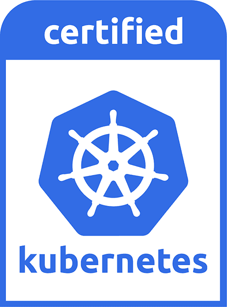

# 第六章：操作集群

> 如果俄罗斯方块教会了我什么，那就是错误会积累起来，成就却会消失。
> 
> Andrew Clay Shafer

一旦您拥有了一个 Kubernetes 集群，如何确保它运行良好并且在需求增加时进行扩展，同时保持云成本最低？在本章中，我们将探讨运行 Kubernetes 集群以处理生产工作负载所涉及的问题，以及一些可以帮助您的工具。

正如我们在第三章中看到的，关于您的 Kubernetes 集群有许多重要事项需要考虑：可用性、认证、升级等等。如果您正在使用我们推荐的良好托管的 Kubernetes 服务，大部分这些问题应该已经为您解决了。

然而，您对集群实际做什么取决于您。在本章中，您将学习如何确定集群的大小和扩展，检查它的*符合性*，以及使用*混沌猴*测试基础设施的弹性。

# 集群大小和扩展

您的集群需要多大？对于自托管的 Kubernetes 集群和几乎所有托管服务来说，集群的持续成本直接取决于其节点的数量和大小。如果集群的容量过小，您的工作负载将无法正常运行，或在高负载下失败。如果容量过大，您将浪费金钱。

适当地确定集群的大小和扩展非常重要，所以让我们看看涉及到的一些决策。

## 容量规划

估算您需要的容量的一种方法是考虑运行相同应用程序所需的传统服务器数量。例如，如果您当前的架构在 10 个独立的云虚拟机实例上运行，您可能不需要超过 10 个类似大小的节点在您的 Kubernetes 集群中运行相同的工作负载，再加上另外 1 或 2 个用于冗余。事实上，您可能甚至不需要那么多，因为 Kubernetes 将均匀地在所有机器上平衡容器，因此可以实现比传统服务器更高的利用率。但是，要为优化容量调整您的集群可能需要一些时间和实际经验。

### 最小的集群

当您首次设置一个集群时，您可能会用它来玩耍、实验，并弄清楚如何运行您的应用程序。因此，在您确定需要多少容量之前，您可能不需要在大型集群上花费大量资金。

最小可能的 Kubernetes 集群是单节点。这将允许您尝试 Kubernetes 并运行开发中的小工作负载，就像我们在第二章中看到的那样。然而，单节点集群在节点硬件故障或 Kubernetes API 服务器或 kubelet（负责在每个节点上运行工作负载的代理守护进程）失败时没有恢复能力。

如果你正在使用像 GKE、EKS 或 AKS 这样的托管 Kubernetes 服务（参见“托管的 Kubernetes 服务”），那么你不需要担心控制平面节点的预配问题：这些已经为你完成了。另一方面，如果你正在构建自己的集群，你需要决定如何布置控制平面。

构建一个具有弹性的 Kubernetes 集群的最低控制平面节点数量为三个。一个不够弹性，两个可能在哪个是领导者上发生分歧，因此至少需要三个节点。

虽然你可以在这样小的 Kubernetes 集群上进行有用的工作，但并不推荐这样做。更好的做法是增加一些工作节点，以便你自己的工作负载不会与 Kubernetes 控制平面竞争资源。

只要你的集群控制平面高度可用，你可以只用一个工作节点，但至少两个节点是合理的最低要求，以保护节点故障并允许 Kubernetes 运行每个 Pod 的至少两个副本。节点数量越多越好，尤其是因为 Kubernetes 调度程序不能始终确保工作负载在所有可用节点上完全平衡（参见“保持你的工作负载平衡”）。

### K3S

当涉及到轻量级集群时，像[K3s](https://k3s.io)这样的工具是值得一试的。它将所有的 Kubernetes 组件打包到一个单一的二进制文件中，非常适合在隔离或资源受限的环境中使用。

# 最佳实践

Kubernetes 集群至少需要三个节点来运行控制平面组件，以实现高可用性，对于处理更大的集群工作负载，可能需要更多节点。两个工作节点是确保你的工作负载对单个节点故障具有容错能力的最低要求，而三个工作节点则更好。

### 最大的集群

Kubernetes 集群的规模是否有限制？简短的回答是有，但你几乎肯定不必担心；Kubernetes 1.22 版本正式支持多达 5,000 个节点的集群。

因为集群需要节点之间的通信，可能的通信路径数量以及基础数据库的累积负载随集群大小呈指数增长。虽然 Kubernetes 在超过 5,000 个节点时可能仍然能够正常工作，但不能保证能够处理生产工作负载或响应足够快。

Kubernetes 文档建议，[支持的集群配置](https://oreil.ly/NapFi)最多不超过 5,000 个节点，总共不超过 150,000 个 Pods，总共不超过 300,000 个容器，并且每个节点最多不超过 100 个 Pods。值得注意的是，集群越大，对控制平面节点的负载就越大；如果你负责运行自己的控制平面，它们需要非常强大的机器来应对数千个节点的集群。

# 最佳实践

为了最大可靠性，请确保您的 Kubernetes 集群小于 5,000 个节点和 150,000 个 Pod（对大多数用户来说并非问题）。如果您需要更多资源，请运行多个集群。

### 联邦集群

如果您有极具挑战性的工作负载或需要在大规模运行，这些限制可能会成为您的实际问题。在这种情况下，您可以运行多个 Kubernetes 集群，并在必要时*联邦*它们，以便工作负载可以在集群之间复制。

联邦提供了在两个或多个集群之间保持同步运行相同工作负载的能力。如果您需要在不同的云提供商、为了弹性或在不同的地理位置使用 Kubernetes 集群，则此功能可能非常有用，以减少用户的延迟。即使单个集群失败，联邦集群组也可以继续运行。

您可以在 Kubernetes [文档](https://oreil.ly/QdAB2)中详细了解*集群联邦*。

对于大多数 Kubernetes 用户来说，联邦不是他们需要关注的事项，在实践中，大多数非常大规模的用户能够通过多个未联邦的每个几百到几千个节点的集群来处理他们的工作负载。通常，与大型集中式联邦集群相比，为团队或应用程序边界提供更容易管理的较小分隔集群是更好的选择。

# 最佳实践

如果您需要在多个集群之间复制工作负载，可能是为了地理冗余或延迟原因，请使用联邦。然而，大多数用户不需要将他们的集群联合起来。

### 我需要多个集群吗？

除非您在非常大规模上运作，如我们在前一节和“多云 Kubernetes 集群”中提到的，您可能不需要超过一个或两个集群：也许一个用于生产，一个用于暂存和测试。

为了便利和资源管理的简易性，您可以使用命名空间将您的集群划分为逻辑分区，我们在“使用命名空间”中详细介绍了这一点。除了少数情况外，管理多个集群通常不值得管理开销。

在某些特定情况下，例如安全性和法规合规性，您可能希望确保一个集群中的服务绝对与另一个集群中的服务隔离（例如处理受保护健康信息时，或由于法律原因无法从一个地理位置传输数据到另一个地理位置）。在这些情况下，您需要创建单独的集群。对于大多数 Kubernetes 用户来说，这不会成为问题。

# 最佳实践

除非您真正需要完全隔离一个工作负载或团队的另一个工作负载或团队，否则请使用单个生产和单个暂存集群。如果您只是想要将集群分区以便管理，请改用命名空间。

## 节点和实例

给定节点的容量越大，它可以执行的工作就越多，容量以可用的 CPU 核心数（虚拟或其他方式）、可用内存和较少的磁盘空间来表达。但例如，是否更好地运行 10 个非常大的节点，而不是 100 个较小的节点？

### 选择正确的节点大小

Kubernetes 集群的节点大小没有普遍适用的标准。答案取决于您的云或硬件提供商以及您特定的工作负载。

不同实例大小的每单位容量成本可能会影响您决定节点大小的方式。例如，一些云提供商可能会为较大的实例大小提供轻微折扣，因此如果您的工作负载非常计算密集，可能比在许多较小的节点上运行它们更便宜。

集群中所需的节点数量也会影响节点大小的选择。要获得 Kubernetes 提供的诸如 Pod 复制和高可用性等优势，您需要将工作分布在多个节点上。但如果节点有太多空闲容量，那将是浪费金钱。

如果您需要至少 10 个节点以实现高可用性，但每个节点只需要运行几个 Pod，则节点实例可以非常小。另一方面，如果您只需要两个节点，您可以使它们非常大，并且可能通过更有利的实例定价节省金钱。

# 最佳实践

使用提供商提供的最经济节点类型。通常，更大的节点会更便宜，但如果您只有少数节点，您可能希望添加一些较小的节点，以增加冗余性。

### 云实例类型

因为 Kubernetes 组件本身（例如 kubelet）使用了一定量的资源，并且您需要一些备用容量来执行有用的工作，所以您的云提供商提供的最小实例大小可能不适合 Kubernetes。

对于小型集群（总节点数约为五个以内），控制平面应至少具有两个 CPU 和两个 GiB 内存，较大的集群则需要更多的内存和 CPU 以供每个控制平面节点使用。

对于较大的集群，可能有几十个节点，为您配置两到三种不同的实例大小可能是有意义的。这意味着 Kubernetes 可以在大节点上安排需要大量内存的计算密集工作负载的 Pod，从而使较小的节点可以处理较小的 Pod（见“节点亲和性”）。这样做可以使 Kubernetes 调度程序在决定在哪里运行给定的 Pod 时具有最大的自由选择。

### 异构节点

并非所有节点都是相同的。您可能需要一些具有特殊属性的节点，比如图形处理单元（GPU）。GPU 是高性能的并行处理器，广泛用于计算密集型问题，与图形无关，比如机器学习或数据分析。

您可以使用 Kubernetes 中的*资源限制*功能（参见“资源限制”）指定某个 Pod 至少需要一个 GPU，例如。这将确保这些 Pod 仅在启用 GPU 的节点上运行，并优先于可以在任何节点上运行的 Pod。

大多数 Kubernetes 节点可能运行各种 Linux，适用于几乎所有应用程序。请记住，容器不是虚拟机，因此容器内部的进程直接在底层节点的操作系统内核上运行。例如，Windows 二进制文件无法在 Linux Kubernetes 节点上运行，因此如果需要运行 Windows 容器，必须为其提供 Windows 节点。

# 最佳实践

大多数容器都是为 Linux 构建的，因此您可能希望主要运行基于 Linux 的节点。您可能需要添加一两种特殊类型的节点来满足特定的需求，例如 GPU 或 Windows。

### 裸金属服务器

Kubernetes 最有用的一个特性之一是其能力，即连接各种大小、架构和能力不同的机器，提供一个统一的、逻辑的机器，可以在其上运行工作负载。虽然 Kubernetes 通常与云服务器相关联，但许多组织在数据中心拥有大量物理裸金属机器，这些机器可能潜在地被整合成 Kubernetes 集群中。

我们在第一章中看到，云技术将资本支出基础设施（作为资本支出购买机器）转变为运营支出基础设施（作为运营支出租用计算能力），这在财务上是合理的。但是，如果你的企业已经拥有大量裸金属服务器，你不需要立刻将它们写下：相反，考虑将它们加入到 Kubernetes 集群中（参见“裸金属和本地”）。

# 最佳实践

如果您有硬件服务器有空余容量，或者您尚未完全准备好完全迁移到云上，可以使用 Kubernetes 在现有机器上运行容器工作负载。

## 扩展集群

选择合理的集群初始大小，并选择合适的工作节点实例大小的正确组合，这就是结局了吗？几乎肯定不是：随着时间的推移，您可能需要根据需求变化或业务需求来扩展或缩小集群。

### 实例组

向 Kubernetes 集群添加节点非常容易。如果您运行的是自托管集群，可以使用 kops 等集群管理工具（参见“kops”）来执行此操作。kops 具有*实例组*的概念，这是一组特定实例类型的节点（例如，`m5.large`）。托管服务如 GKE 也具有相同的功能，称为*节点池*。Elastic Kubernetes Service (EKS) 工具 `eksctl` 将此概念称为[*nodegroup*](https://oreil.ly/mRr0j)。

您可以通过更改组的最小和最大大小，或更改指定的实例类型，或同时更改两者来缩放实例组或节点池。

### 缩减

原则上，缩减 Kubernetes 集群也没有问题。你可以告诉 Kubernetes*排空*你想要移除的节点，这将逐渐关闭或将运行中的 Pods 移动到其他地方。

大多数集群管理工具将会自动为您执行节点排空，或者您可以使用`kubectl drain`命令自行执行。一旦成功排空节点并且在集群的其他部分有足够的空闲容量来重新调度被注定的 Pods，您可以终止它们。

为了避免过度减少给定服务的 Pod 副本数，您可以使用 PodDisruptionBudgets 指定可用 Pod 的最小数量，或者任何时候可以*不可用*的最大 Pod 数（参见“Pod Disruption Budgets”）。

如果排空节点会导致 Kubernetes 超出这些限制，排空操作将阻塞，直到您更改限制或在集群中释放更多资源。

排空允许 Pods 优雅地关闭，清理自身并保存必要的状态。对于大多数应用程序来说，这比简单关闭节点更可取，后者会立即终止 Pods。

# 最佳实践

当您不再需要节点时，请不要直接关闭它们。首先进行排空以确保它们的工作负载迁移到其他节点，并确保集群中仍有足够的剩余容量。

### 自动缩放

大多数云服务提供商支持自动缩放：根据某些度量标准或时间表自动增加或减少实例的数量。例如，AWS 自动缩放组（ASG）可以维护一定数量的最小和最大实例，以便如果一个实例失败，将启动另一个实例来替代它，或者如果运行的实例过多，则关闭一些实例。

或者，如果您的需求根据时间的不同波动，您可以安排组在指定的时间增长和收缩。您还可以根据需要动态配置扩展组的缩放：例如，如果平均 CPU 利用率在 15 分钟内超过 90％，则可以自动添加实例，直到 CPU 使用率低于阈值。需求再次降低时，可以缩小组来节省成本。

Kubernetes 有一个 Cluster Autoscaler 附加组件，像 kops 这样的集群管理工具可以利用它来实现云自动缩放，而像 AKS 这样的托管集群也提供自动缩放的功能。

然而，要正确设置自动缩放的参数可能需要一些时间和实验，并且对许多用户来说可能根本不需要。大多数 Kubernetes 集群从小规模开始，并逐渐通过在资源使用增长时逐个添加节点来单调增长。

对于大规模用户或需求高度变化的应用程序来说，集群自动缩放是一个非常有用的功能。

# 最佳实践

不要因为功能存在就启用集群自动缩放，除非你已经确定你需要它。除非你的需求或工作负载非常变化，否则你可能不需要它。首先通过手动缩放你的集群，并且在了解你的规模需求随时间变化的感觉时逐渐习惯于监控使用情况。

# 一致性检查

Kubernetes 不是 Kubernetes？Kubernetes 的灵活性意味着有许多不同的方法来设置 Kubernetes 集群，这可能会导致潜在问题。如果 Kubernetes 要成为一个通用平台，你应该能够将工作负载在任何 Kubernetes 集群上运行，并且它应该按照你期望的方式工作。这意味着相同的 API 调用和 Kubernetes 对象必须可用，它们必须具有相同的行为，它们必须按照广告的方式工作，等等。

幸运的是，Kubernetes 本身包含一个测试套件，用于验证给定 Kubernetes 集群是否 *符合规范*；也就是说，它满足了给定 Kubernetes 版本的一组核心要求。这些一致性测试对于 Kubernetes 管理员非常有用。

如果你的集群未通过这些测试，那么你的设置中存在问题需要解决。如果它通过了测试，知道它是符合规范的可以让你确信为 Kubernetes 设计的应用程序将与你的集群一起工作，并且你在集群上构建的东西也将在其他地方正常工作。

## CNCF 认证

云原生计算基金会（CNCF）是 Kubernetes 项目和商标的官方所有者（见 “云原生”），并且为与 Kubernetes 相关的产品、工程师和供应商提供各种认证。

### Certified Kubernetes

如果你使用托管或部分托管的 Kubernetes 服务，请检查它是否带有 Certified Kubernetes 标志和标志（见图 6-1）。这表示供应商和服务符合 CNCF 规定的 [Certified Kubernetes 标准](https://oreil.ly/NKgpp)。



###### 图 6-1\. Certified Kubernetes 标志表示产品或服务经 CNCF 批准。

如果产品名称中含有 *Kubernetes*，它必须经过 [CNCF 的认证](https://oreil.ly/A5Mku)。这意味着客户清楚地知道他们得到了什么，并且可以确信它与其他符合规范的 Kubernetes 服务可以互操作。供应商可以通过运行 Sonobuoy 一致性检查工具（见 “使用 Sonobuoy 进行一致性测试”）进行自我认证。

Certified Kubernetes 产品还必须跟踪 Kubernetes 的最新版本，至少每年提供更新。不仅托管服务可以带有 Certified Kubernetes 标志，分发版和安装工具也可以。

### Certified Kubernetes 管理员（CKA）

要成为认证的 Kubernetes 管理员（CKA），您需要证明自己具备管理生产环境中的 Kubernetes 集群的关键技能，包括安装和配置、网络、维护、API 知识、安全性和故障排除。任何人都可以参加 CKA 考试，该考试在线进行，包括一系列具有挑战性的实际测试。有关如何培训和注册参加考试的更多信息，请访问[CNCF 网站](https://oreil.ly/810Ot)。

CKA 考试以其全面、具有挑战性的声誉而闻名。您可以确信，任何获得 CKA 认证的工程师确实了解 Kubernetes。如果您在 Kubernetes 上运行业务，请考虑将一些员工通过 CKA 项目，特别是直接负责管理集群的人员。

### Kubernetes 认证服务提供商（KCSP）

供应商可以申请成为 Kubernetes 认证服务提供商（KCSP）程序的一部分。供应商必须是 CNCF 会员，提供企业支持（例如通过向客户现场提供现场工程师），积极参与 Kubernetes 社区，并雇用三名或更多 CKA 认证工程师才有资格。

# 最佳实践

查找 Certified Kubernetes 标记以确保产品符合 CNCF 标准。寻找 KCSP 认证供应商，如果您正在招聘 Kubernetes 管理员，请寻找 CKA 资格。

## 使用 Sonobuoy 进行符合性测试

如果您管理自己的集群，或者即使使用托管服务但想要确保它配置正确且更新到最新，您可以运行 Kubernetes 符合性测试来证明它。运行这些测试的标准工具是[*Sonobuoy*](https://oreil.ly/dS40G)。

Sonobuoy 使用 CLI 工具和您的`kubectl`认证来在集群内运行测试。安装完成后，您可以使用以下命令运行测试套件：

```
`sonobuoy run`
 ... INFO[0000] created object name=sonobuoy namespace= resource=namespaces
 ...
```

创建一个新的命名空间，启动 Sonobuoy pods，并开始运行测试。您可以使用`kubectl`查看：

```
`kubectl get pods -n sonobuoy`
NAME       READY   STATUS    RESTARTS   AGE sonobuoy   1/1     Running   0          14s ...
```

完整的测试套件可能需要一个小时或更长时间才能完成！您可以在`sonobuoy run`命令中添加`--mode quick`标志来运行单个测试以验证连接性。

一旦符合性测试完成，您可以使用`retrieve`命令查看结果，该命令将结果保存到本地文件中。然后，您可以使用`results`命令检查该输出：

```
`results=$(sonobuoy retrieve)`
`sonobuoy results $results`
Plugin: e2e Status: passed Total: 5771 Passed: 1 Failed: 0 ...
```

后来，在“集群安全扫描”中，我们将涵盖专注于扫描集群潜在安全问题的类似工具。与 Sonobuoy 一起使用时，这些工具可以更好地展示您的集群可能与当前 Kubernetes 合规性最佳实践不符的地方。

# 最佳实践

在首次设置集群后运行 Sonobuoy，以验证其是否符合标准并且一切正常。定期再次运行以确保没有符合性问题。

## Kubernetes 审计日志记录

假设您在集群上发现了问题，比如一个您不认识的 Pod，您想知道它来自哪里。如何查明谁在集群上做了什么？[Kubernetes 审计日志](https://oreil.ly/3NS5l)会告诉您。

启用审计日志记录后，所有对集群 API 的请求将被记录，包括时间戳，请求者（服务帐户）、请求详细信息（如查询的资源）以及响应内容。

审计事件可以发送到您的中央日志系统，您可以像处理其他日志数据一样对其进行过滤和警报（参见第十五章）。一个良好的托管服务，如 GKE，默认情况下将包括审计日志记录，但否则您可能需要自行配置集群以启用它。

# 混沌测试

我们在“信任，但要验证”中指出，验证高可用性的唯一真实方法是关闭一个或多个集群节点，看看会发生什么。同样适用于您的 Kubernetes Pod 和应用程序的高可用性。例如，您可以随机选择一个 Pod，终止它，然后检查 Kubernetes 是否重新启动它，并且您的错误率不受影响。

手动执行这项工作耗时且您可能会不自觉地保留那些您知道对应用至关重要的资源。为了进行公正的测试，必须自动化该过程。

这种对生产服务的自动化、随机干扰有时被称为*混沌猴子*测试，以 Netflix 开发的同名工具命名，用于测试其基础架构：

> 想象一只猴子进入数据中心，这些托管我们在线活动所有关键功能的服务器农场。猴子随机地拔掉电缆，摧毁设备...
> 
> IT 经理面临的挑战是设计他们负责的信息系统，使其能够在这些猴子到来时仍然正常工作，而谁也不知道它们何时到来以及它们将摧毁什么。
> 
> 安东尼奥·加西亚·马丁内斯，《混沌猴子》

除了**混沌猴子**本身会随机终止云服务器外，Netflix 的*猴子军团*还包括其他*混沌工程*工具，如 Latency Monkey，引入通信延迟以模拟网络问题，Security Monkey，查找已知漏洞，以及 Chaos Gorilla，将整个 AWS 可用区关闭。

## 只有生产才是真正的生产

您也可以将混沌猴子的想法应用于 Kubernetes 应用程序。虽然您可以在预发布集群上运行混沌工程工具以避免干扰生产环境，但这只能告诉您有限的信息。要了解您的生产环境，您需要在生产中进行测试：

> 许多系统过于庞大、复杂和成本高昂，难以克隆。想象一下尝试为测试复制 Facebook（带有其多个全球分布的数据中心）。
> 
> 用户流量的不可预测性使得模拟变得不可能；即使您可以完美重现昨天的流量，您仍无法预测明天的流量。只有生产环境才是真正的生产环境。
> 
> [Charity Majors](https://oreil.ly/88wsu)

此外，需要注意的是，为了使您的混沌实验最有用，需要进行自动化和持续的。仅仅运行一次并决定您的系统从此可靠是不够的：

> 自动化混沌实验的整个目的是，您可以一遍又一遍地运行它们，以建立对系统的信任和信心。不仅要展现新的弱点，还要确保您已经克服了首次出现的弱点。
> 
> [Russ Miles（ChaosIQ）](https://oreil.ly/dq0Ij)

您可以使用几种工具来自动执行集群的混沌工程。以下是几个选项。

## chaoskube

[*chaoskube*](https://oreil.ly/ffcdM) 在您的集群中随机杀死 Pod。默认情况下，它以干预运行模式操作，显示它将要执行的操作，但实际上不终止任何内容。

您可以根据标签（参见 “标签”）、注释和命名空间配置 chaoskube，以包括或排除 Pod，并避免特定的时间段或日期（例如，不要在平安夜杀死任何内容）。默认情况下，它可能会杀死任何命名空间中的任何 Pod，包括 Kubernetes 系统 Pod，甚至 chaoskube 本身。

一旦您满意 chaoskube 的筛选配置，您可以禁用干预运行模式并让其运行。

chaoskube 安装和设置简单，是开始混沌工程的理想工具。

## kube-monkey

[*kube-monkey*](https://oreil.ly/HGmrb) 在预设时间运行（默认为工作日上午 8 点），并创建一个部署计划表，将在当天的其余时间段内（默认为上午 10 点到下午 4 点）进行目标部署。与其他一些工具不同，kube-monkey 是基于选择加入的方式工作：只有通过注释明确启用 kube-monkey 的 Pod 将被目标化。

这意味着在开发特定应用程序或服务过程中，您可以添加 kube-monkey 测试，并根据服务设置不同的频率和攻击级别。例如，以下 Pod 上的注释将设置平均故障间隔（MTBF）为两天：

```
kube-monkey/mtbf: *`2`*
```

`kill-mode` 注释允许您指定将在部署的 Pod 中杀死多少个，或者最大百分比。以下注释将杀死目标部署中最多 50% 的 Pod：

```
kube-monkey/kill-mode: "random-max-percent"
kube-monkey/kill-value: 50
```

## PowerfulSeal

[*PowerfulSeal*](https://oreil.ly/Wwe31) 是一个开源的 Kubernetes 混沌工程工具，可以以交互和自主两种模式工作。交互模式允许您探索集群并手动破坏以查看发生了什么。它可以终止节点、命名空间、部署和单个 Pod。

自动模式使用一组由您指定的策略：操作哪些资源，避免哪些资源，何时运行（例如，您可以配置仅在工作时间内，例如周一至周五运行），以及采取多大程度的侵略性（例如，杀死所有匹配的部署的一定百分比）。PowerfulSeal 的策略文件非常灵活，几乎可以设置任何可以想象到的混沌工程场景。

# 最佳实践

如果您的应用程序需要高可用性，请定期运行诸如 chaoskube 之类的混沌测试工具，以确保意外的节点或 Pod 故障不会引起问题。确保事先与负责操作集群和受测应用程序的人员进行清晰沟通。

# 概要

确定如何规模化和配置您的第一个 Kubernetes 集群可能非常困难。您可以做出许多选择，但实际获得生产经验之前，您不会真正知道您将需要什么。

我们不能为您做出这些决策，但希望我们至少给了您在做出决策时一些有用的思考方向：

+   在配置生产 Kubernetes 集群之前，请考虑需要多少节点以及节点的大小。

+   您至少需要三个控制平面节点（除非您使用托管服务），至少需要两个（理想情况下是三个）工作节点。当您只运行少量小工作负载时，这可能使 Kubernetes 集群显得有点昂贵，但不要忘记内置的弹性和扩展的优势。

+   Kubernetes 集群可以扩展到成千上万个节点和数十万个容器。

+   如果您需要超出此范围，请使用多个集群（有时也需要出于安全或合规性原因）。如果需要在集群之间复制工作负载，可以使用联合。

+   Kubernetes 不仅适用于云端，它也可以在裸金属服务器上运行。如果您有空置的服务器，为什么不使用呢？

+   您可以手动扩展和缩小集群，而不会遇到太多麻烦，而且您可能不必经常这样做。当工作负载增长和缩小时，自动缩放功能非常有用。

+   Kubernetes 供应商和产品有一个明确定义的标准：CNCF 认证的 Kubernetes 标志。如果您没有看到这个标志，请问原因。

+   混沌测试是一个随机关闭 Pod 并查看您的应用程序是否仍在运行的过程。这是有用的，但云端也有自己的混沌测试方式，而无需您要求。
