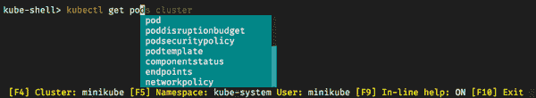

# 第七章 Kubernetes 强大工具

> 我的机械师告诉我，“我修不好你的刹车，所以我把你的喇叭声音调得更大了。”
> 
> Steven Wright

人们经常问我们，“关于所有这些 Kubernetes 工具怎么办？我需要它们吗？如果需要，具体是哪些？它们都做什么？”

在本章中，我们将探索帮助你使用 Kubernetes 工作的工具和实用程序的一小部分。我们将向你展示一些与 `kubectl` 相关的高级技术，以及一些实用工具，如 `jq`、`kubectx`/`kubens`、`kube-ps1`、Click、`kubed-sh`、Stern 和 BusyBox。

# 精通 `kubectl`

我们已经在第二章遇到了 `kubectl`，由于它是与 Kubernetes 交互的主要工具，你可能已经对基础知识感到很舒服。现在让我们看看 `kubectl` 的一些更高级特性，包括一些对你来说可能是新的技巧和窍门。

## Shell 别名

大多数 Kubernetes 用户为了简化操作，首先做的事情之一就是为 `kubectl` 命令创建一个 shell 别名。例如，在我们的 *.bash_profile* 或 *.zshrc* 文件中设置了以下别名：

```
alias k=*`kubectl`*
```

不必为每个命令都完整输入 `kubectl`，我们可以简单地使用 `k`：

```
`k get pods`
```

如果有一些你经常使用的 `kubectl` 命令，你可能也喜欢为它们创建别名。这里有一些可能的例子：

```
alias kg=*`kubectl` `get`*
alias kgdep=*`kubectl` `get` `deployment`*
alias ksys=*`kubectl` `--namespace``=``kube-system`*
alias kd=*`kubectl` `describe`*
```

谷歌工程师 Ahmet Alp Balkan 想出了一个逻辑的[别名系统](https://oreil.ly/KoGV0)，并创建了一个脚本为你生成所有这些别名（目前大约有八百个别名）。

当然你不一定非得用它们；我们建议你从 `k` 开始，并为你经常使用的命令添加易记的别名。

## 使用短标志

像大多数命令行工具一样，`kubectl` 支持许多标志和开关的缩写形式。这可以节省很多输入时间。

例如，你可以将 `--namespace` 标志缩写为 `-n`（见“使用命名空间”）：

```
`kubectl get pods -n kube-system`
```

使用 `kubectl` 常见的一种方式是使用 `--selector` 标志来操作符合一组标签的资源（见“标签”）。幸运的是，这可以缩短为 `-l`（`labels`）：

```
`kubectl get pods -l "environment=staging"`
```

## 缩写资源类型

使用 `kubectl` 的常见方式是列出各种类型的资源，例如 Pods、Deployments、Services 和命名空间。通常的方法是使用 `kubectl get` 后跟，例如 `deployments`。

为了加快速度，`kubectl` 支持这些资源类型的简写形式：

```
`kubectl get po`
`kubectl get deploy`
`kubectl get svc`
`kubectl get ns`
```

其他有用的缩写包括 `no` 代表 `nodes`，`cm` 代表 `configmaps`，`sa` 代表 `serviceaccounts`，`ds` 代表 `daemonsets`，`pv` 代表 `persistentvolumes`。

## 自动完成 `kubectl` 命令

如果你使用 `bash` 或 `zsh` shell，你可以让它们自动完成 `kubectl` 命令。运行以下命令查看如何为你的 shell 启用自动完成：

```
`kubectl completion -h`
```

按照说明操作，你应该可以按 Tab 键来完成部分 `kubectl` 命令。现在试试吧：

```
`kubectl cl<TAB>`
```

命令应该完成到 `kubectl cluster-info`。

如果您只键入 `kubectl` 并按两次 Tab 键，您将看到所有可用的命令：

```
`kubectl <TAB><TAB>`
alpha           attach          cluster-info    cordon          describe   ...
```

您可以使用相同的技术列出可以与当前命令一起使用的所有标志：

```
`kubectl get pods --<TAB><TAB>`
--all-namespaces   --cluster=   --label-columns=   ...
```

实用地，`kubectl` 也会自动完成 Pod、Deployment、命名空间等名称：

```
`kubectl -n kube-system describe pod <TAB><TAB>`
event-exporter-v0.1.9-85bb4fd64d-2zjng kube-dns-autoscaler-79b4b844b9-2wglc fluentd-gcp-scaler-7c5db745fc-h7ntr ...
```

## 获取帮助

最好的命令行工具包括详尽的文档，`kubectl` 也不例外。您可以通过 `kubectl -h` 获得所有可用命令的完整概述：

```
`kubectl -h`
```

您可以进一步获取每个命令的详细文档，包括所有可用选项和一组示例，只需键入 `kubectl COMMAND -h`：

```
`kubectl get -h`
```

## 获取 Kubernetes 资源的帮助

除了自身文档，`kubectl` 还可以为 Kubernetes 对象（如 Deployments 或 Pods）提供帮助。`kubectl explain` 命令将显示指定类型资源的文档：

```
`kubectl explain pods`
```

您可以使用 `kubectl explain RESOURCE.FIELD` 获取资源特定字段的更多信息。实际上，您可以通过 `explain` 深入到任何您想要的程度：

```
`kubectl explain deploy.spec.template.spec.containers.livenessProbe.exec`
```

## 显示更详细的输出

您已经知道 `kubectl get` 将列出各种类型的资源，如 Pods：

```
`kubectl get pods`
NAME                    READY     STATUS    RESTARTS   AGE demo-54f4458547-pqdxn   1/1       Running   6          5d
```

通过使用 `-o wide` 标志，您可以查看每个 Pod 运行在哪个节点上的额外信息：

```
`kubectl get pods -o wide`
NAME                    ... IP           NODE demo-54f4458547-pqdxn   ... 10.76.1.88   gke-k8s-cluster-1-n1-standard...
```

（为了节省空间，我们已经省略了您在没有 `-o wide` 的情况下看到的信息。）

根据资源类型的不同，`-o wide` 将显示不同的信息。例如，使用节点时：

```
`kubectl get nodes -o wide`
NAME       STATUS   ROLES          AGE   VERSION   INTERNAL-IP... minikube   Ready    control-plane  40d   v1.21.2   192.168.49.2...
```

## 使用 JSON 数据和 jq 工作

`kubectl get` 的默认输出格式是纯文本，但它也可以以 JSON 格式打印信息：

```
`kubectl get pods -n kube-system -o json`
{
 "apiVersion": "v1", "items": [ { "apiVersion": "v1", "kind": "Pod", "metadata": { "creationTimestamp": "2021-07-16T03:07:53Z", ...
```

不出所料，这会产生大量输出（在我们的集群上大约五千行）。幸运的是，由于输出是广泛使用的 JSON 格式，您可以使用其他工具来过滤它，如非常有用的 `jq`。

如果您尚未安装 [`jq`](https://stedolan.github.io/jq)，可以按照您系统的惯例方式（macOS 上 `brew install jq`，Debian/Ubuntu 上 `apt install jq` 等）进行[安装](https://stedolan.github.io/jq/download)。

一旦安装了 `jq`，您可以使用它来查询和过滤 `kubectl output`：

```
`kubectl get pods -n kube-system -o json | jq '.items[].metadata.name'`
"coredns-558bd4d5db-2m5tv" "etcd-minikube" "kube-apiserver-minikube" "kube-controller-manager-minikube" ...
```

`jq` 是一个非常强大的工具，用于查询和转换 JSON 数据。

例如，按每个节点上运行的 Pod 数列出最繁忙的节点：

```
`kubectl get pods -o json --all-namespaces | jq '.items | ` `group_by(.spec.nodeName) | map({"nodeName": .[0].spec.nodeName,` `"count": length}) | sort_by(.count) | reverse'`
```

有一个方便的 [在线 playground](https://jqplay.org)，您可以在其中粘贴 JSON 数据并尝试不同的 `jq` 查询，以获得您想要的确切结果。

如果您没有 `jq`，`kubectl` 也支持 [JSONPath 查询](https://oreil.ly/s7xIv)。JSONPath 是一种 JSON 查询语言，虽然不如 `jq` 强大，但用于快速的一行命令很有用：

```
kubectl get pods -o=jsonpath=*{.items[0].metadata.name}*
demo-66ddf956b9-pnknx
```

## 观察对象

当您等待一堆 Pod 启动时，每隔几秒钟就需要不停地输入 `kubectl get pods...` 来查看是否有任何进展，这可能很烦人。

`kubectl` 提供了 `--watch` 标志（简称 `-w`），以免您不得不这样做。例如：

```
`kubectl get pods --watch`
NAME                      READY     STATUS           RESTARTS   AGE demo-95444875c-z9xv4   0/1       ContainerCreating   0          1s ... [time passes] ... demo-95444875c-z9xv4   0/1       Completed           0          2s demo-95444875c-z9xv4   1/1       Running             0          2s
```

每当匹配的 Pod 的状态发生变化时，你将在终端上看到更新。（查看 “使用 kubespy 监视 Kubernetes 资源” 以了解一种优雅的观察资源的方法。）

## 描述对象

想要获取有关 Kubernetes 对象的详细信息，你可以使用 `kubectl describe` 命令：

```
`kubectl describe pods demo-d94cffc44-gvgzm`
```

`Events` 部分特别适用于排查工作不正常的容器问题，因为它记录了容器生命周期的每个阶段，以及发生的任何错误。

# 使用资源

到目前为止，你主要使用 `kubectl` 进行查询或列出事物，以及使用 `kubectl apply` 应用声明性 YAML 文件。然而，`kubectl` 也有一整套 *命令式* 命令：直接创建或修改资源的操作。

## 命令式的 kubectl 命令

我们在 “运行演示应用” 中展示了一个例子，使用 `kubectl run` 命令，该命令隐式创建一个 Pod 来运行指定的容器。

你也可以使用 `kubectl create` 明确地创建大多数资源：

```
`kubectl create namespace my-new-namespace`
namespace "my-new-namespace" created
```

类似地，`kubectl delete` 将删除一个资源：

```
`kubectl delete namespace my-new-namespace`
namespace "my-new-namespace" deleted
```

`kubectl edit` 命令赋予你查看和修改任何资源的权力：

```
`kubectl edit deployments my-deployment`
```

这将使用默认编辑器打开一个 YAML 清单文件，代表指定的资源。

这是查看任何资源配置的详细方法，但你也可以在编辑器中进行任何喜欢的更改。当你保存文件并退出编辑器时，`kubectl` 将更新资源，就像你对资源的清单文件运行了 `kubectl apply` 一样。

如果引入了任何错误，比如无效的 YAML，`kubectl` 将告诉你，并重新打开文件让你修复问题。

## 不适用命令式命令的时机

在本书中，我们强调了使用 *声明性* 基础设施即代码的重要性。因此，我们不建议使用命令式的 `kubectl` 命令并不足为奇。

虽然它们对于快速测试或尝试想法可能非常有用，但是命令式命令的主要问题在于没有一个单一的 *真实来源*。无法知道谁在集群上什么时候运行了哪些命令，以及效果如何。一旦运行任何命令式命令，集群的状态就会与存储在版本控制中的清单文件不同步。

下次有人应用 YAML 清单时，无论你以命令方式做了哪些更改，它们都将被覆盖和丢失。这可能导致意外的结果，对关键服务可能造成不利影响：

> 当服务负载突然增加时，Alice 作为值班人员。 Alice 使用 `kubectl scale` 命令将副本数从 5 增加到 10。 几天后，Bob 在版本控制中编辑 YAML 清单以使用新的容器镜像，但他没有注意到文件中的副本数目前是 5，而不是生产中的 10。 Bob 继续进行部署，这使得副本数量减少了一半，导致立即的过载或故障。
> 
> Kelsey Hightower 等人，《Kubernetes 上手指南》

Alice 在她进行命令式更改后忘记更新版本控制中的文件，但这很容易做到，尤其是在事故的压力下（参见 “On-Call Should Not Be Hell”）。 现实生活并不总是遵循最佳实践。

同样，在重新应用清单文件之前，Bob 应该使用 `kubectl diff` 检查差异（参见 “Diffing Resources”）以查看将发生的更改。 但如果你没有预料到会有不同的东西，很容易忽视它。 也许 Bob 没有读过这本书。

避免这种问题的最佳方法是始终通过编辑和应用版本控制下的资源文件进行更改。 我们稍后会在 “GitOps” 中详细介绍。

# 最佳实践

不要在生产集群上使用 `kubectl` 命令式命令，如 `create` 或 `edit`。 相反，始终使用带有 `kubectl apply`（或 Helm charts）的版本控制的 YAML 清单管理资源。

## 生成资源清单

即使我们不建议使用命令式模式的 `kubectl` 对集群进行更改，但当从头开始创建 Kubernetes YAML 文件时，命令式命令可以节省大量时间。

而不是在空文件中键入大量样板代码，您可以使用 `kubectl` 为您生成 YAML 清单，为您提供一个起点：

```
`kubectl create deployment  demo --image=cloudnatived/demo:hello`
`--dry-run=client -o yaml`
    `>deployment.yaml`
```

`--dry-run=client` 标志告诉 `kubectl` 不实际创建资源，而只是打印出它将要创建的内容。 `-o yaml` 标志以 YAML 格式给出资源清单。 `>` 字符将命令的输出写入文件，然后您可以使用该文件进行任何编辑，最后应用它以在集群中创建资源。

## 导出资源

除了帮助您创建新的资源清单外，`kubectl` 还可以为已经存在于集群中的资源生成清单文件。 例如，也许您使用命令式命令 (`kubectl create`) 创建了一个 Deployment，编辑并调整它以获得正确的设置，现在您想要编写一个声明性 YAML 清单以添加到版本控制中。

要执行此操作，请使用 `kubectl get` 命令的 `-o` 标志：

```
`kubectl create deployment newdemo --image=cloudnatived/demo:hello`
deployment.apps/newdemo created `kubectl get deployments newdemo -o yaml >deployment.yaml`
```

此输出将包含一些额外信息，例如可以删除的 `status` 部分（在保存到其他清单文件之前），更新并应用于 `kubectl apply -f`。

如果您到目前为止一直在使用命令式 `kubectl` 命令来管理您的集群，并且希望切换到我们在本书中推荐的声明式风格，这是一个很好的方法。使用 `kubectl` 带有 `-o` 标志导出集群中的所有资源到清单文件中，如示例所示，您就可以做好准备了。

## 资源差异比较

在使用 `kubectl apply` 应用 Kubernetes 清单之前，查看集群上确切会发生什么变化非常有用。`kubectl diff` 命令将为您完成这项工作：

```
`kubectl diff -f deployment.yaml`
-  replicas: 10 +  replicas: 5
```

您可以使用此 `diff` 输出来检查您所做的更改是否会产生您预期的效果。此外，它还会在实际资源的状态与 YAML 清单不同步时发出警告，这可能是因为自上次应用它以来有人通过命令方式编辑了它。

# 最佳实践

使用 `kubectl diff` 在将任何更新应用到生产集群之前检查将会发生的变化。

# 与容器一起工作

大多数 Kubernetes 集群中的操作发生在容器内部，因此当出现问题时，很难看到发生了什么。以下是使用 `kubectl` 与运行中容器一起工作的几种有用方法。

## 查看容器的日志

当您尝试使一个容器正常工作但其行为不符合预期时，其中一个最有用的信息源是容器的*日志*。在 Kubernetes 中，日志被认为是容器写入*标准输出*和*标准错误*流的内容；如果您在终端中运行程序，这些内容就是您在终端中看到的打印输出。

在生产应用程序中，特别是分布式应用程序，您需要能够聚合来自多个服务的日志，将它们存储在持久性数据库中，并进行查询和图形化显示。这是一个重要的话题，我们将在第十五章中详细讨论。

尽管如此，检查特定容器的日志消息仍然是一个非常有用的故障排除技术，您可以直接使用 `kubectl logs` 命令，后跟 Pod 的名称：

```
`kubectl logs -n kube-system --tail=20 kube-dns-autoscaler-69c5cbdcdd-94h7f`
autoscaler.go:49] Scaling Namespace: kube-system, Target: deployment/kube-dns autoscaler_server.go:133] ConfigMap not found: configmaps "kube-dns-autoscaler" k8sclient.go:117] Created ConfigMap kube-dns-autoscaler in namespace kube-system plugin.go:50] Set control mode to linear linear_controller.go:59] ConfigMap version change (old:  new: 526) - rebuilding
```

大多数长时间运行的容器会生成*大量*的日志输出，因此通常您会希望仅限于最近的几行，可以使用 `--tail` 标志，就像这个例子一样。（这些容器日志会显示时间戳，但在这里我们已经对其进行了修剪以适应页面上的消息。）

若要在容器运行时观看其输出并将日志实时流式传输到您的终端，请使用 `--follow` 标志（简写为 `-f`）：

```
`kubectl logs --namespace kube-system --tail=10 --follow etcd-docker-for-desktop`
etcdserver: starting server... [version: 3.1.12, cluster version: 3.1] embed: ClientTLS: cert = /var/lib/localkube/certs/etcd/server.crt, key = ... ...
```

只要使用 `kubectl logs` 命令并带有 `--follow` 标志持续运行，您将继续看到来自 Pod 的任何新输出。

查看 Kubernetes API 服务器的日志尤为有用；例如，如果您遇到 RBAC 权限错误（参见“引入基于角色的访问控制（RBAC）”），它们将显示在这里。如果您可以访问控制平面节点，则可以在 `kube-system` 命名空间中找到 `kube-apiserver` Pod，并使用 `kubectl logs` 查看其输出。

如果您正在使用托管服务，控制平面节点对您不可见，请查阅提供商的文档，了解如何查找控制平面日志。

###### 小贴士

当 Pod 中有多个容器时，您可以使用 `--container` 标志（简写为 `-c`）指定您想查看日志的容器：

```
`kubectl logs -n kube-system metrics-server`
    `-c metrics-server-nanny`
...
```

对于更复杂的日志监控，您可能需要使用类似 Stern 这样的专用工具（参见 “Stern”）。

## 附加到容器

当查看容器的日志不足以解决问题时，您可能需要将本地终端连接到容器中。这样可以直接查看容器的输出。要执行此操作，请使用 `kubectl attach`：

```
`kubectl attach demo-54f4458547-fcx2n`
Defaulting container name to demo. Use *`kubectl describe pod/demo-54f4458547-fcx2n`* to see all of the containers in this pod. If you don't see a command prompt, try pressing enter.
```

## 使用 kubespy 观察 Kubernetes 资源

当您部署 Kubernetes 清单的更改时，通常会有一段焦虑的等待期，以查看接下来会发生什么。

在部署应用程序时，通常需要在幕后执行许多操作，例如 Kubernetes 创建资源、启动 Pods 等等。

因为这种情况是 *自动完成* 的，就像工程师们常说的那样，很难分辨发生了什么。`kubectl get` 和 `kubectl describe` 可以为您提供单个资源的快照，但我们真正想要的是一种能实时查看 Kubernetes 资源状态变化的方法。

这里介绍了 [kubespy](https://oreil.ly/YqyBk)，这是来自 Pulumi 项目的一个很棒的工具。¹ kubespy 能够监视集群中的单个资源，并展示它随时间的变化情况。

例如，如果将 kubespy 指向一个 Service 资源，它会显示 Service 创建时的情况，当其分配了 IP 地址时，以及连接其终端节点时的情况，等等。

## 转发容器端口

我们之前在 “运行演示应用” 中使用过 `kubectl port-forward`，将 Kubernetes Service 转发到本地机器上的某个端口。但是，您也可以用它来转发容器的端口，如果您想直接连接到特定的 Pod。只需指定 Pod 名称以及本地和远程端口即可：

```
`kubectl port-forward demo-54f4458547-vm88z 9999:8888`
Forwarding from 127.0.0.1:9999 -> 8888 Forwarding from [::1]:9999 -> 8888
```

现在您本地机器上的 9999 端口将会被转发到容器上的 8888 端口，并且您可以用浏览器连接它，例如。

## 在容器上执行命令

容器的隔离性在您需要运行可靠、安全工作负载时非常有用。但当某些问题出现时，你却看不到问题所在，这可能会有点不便。

当您在本地机器上运行程序时，如果它表现不正常，您可以利用命令行的强大功能来进行故障排除：您可以用 `ps` 查看运行中的进程，用 `ls` 和 `cat` 列出和显示文件，甚至可以用文本编辑器直接编辑文件。

在容器出现故障时，很多时候需要在容器中运行一个 shell，以便进行此类交互式调试。

使用 `kubectl exec` 命令，您可以在任何容器中运行指定的命令，包括 shell：

```
`kubectl run alpine --image alpine --command -- sleep 999`
pod/alpine created 
`kubectl get pods`
NAME     READY   STATUS    RESTARTS   AGE alpine   1/1     Running   0          39s 
`kubectl exec -it alpine -- /bin/sh`
/ # `ps`
PID   USER       TIME COMMAND
 1 root       0:00 sleep 999 7 root       0:00 /bin/sh 11 root       0:00 ps
```

如果 Pod 中有多个容器，`kubectl exec` 默认会在第一个容器中运行命令。或者，你可以使用 `-c` 标志指定容器：

```
`kubectl exec -it -c container2 POD_NAME -- /bin/sh`
```

（如果容器没有 shell，请参阅 “将 BusyBox 添加到您的容器”。）

## 用于故障排除的运行容器

除了在现有容器上运行命令之外，有时还可以在集群中运行像 `wget` 或 `nslookup` 这样的命令，以查看你的应用程序的结果。你已经学会了如何使用 `kubectl run` 在集群中运行容器，但这里有一些用于调试目的的有用的一次性容器命令示例。

首先，让我们运行一个演示应用实例进行测试：

```
`kubectl run demo --image cloudnatived/demo:hello --expose --port 8888`
service/demo created pod/demo created
```

`demo` 服务应已分配一个 IP 地址和一个名为 `demo` 的 DNS 名称，可从集群内部访问。让我们通过在容器内运行 `nslookup` 命令来检查一下：

```
`kubectl run nslookup --image=busybox:1.28 --rm -it --restart=Never \` `--command -- nslookup demo`
Server:    10.79.240.10 Address 1: 10.79.240.10 kube-dns.kube-system.svc.cluster.local 
Name:      demo Address 1: 10.79.242.119 demo.default.svc.cluster.local
```

好消息是：DNS 名称有效，因此我们应该能够使用 `wget` 进行 HTTP 请求并查看结果：

```
`kubectl run wget --image=busybox:1.28 --rm -it --restart=Never \` `--command -- wget -qO- http://demo:8888`
Hello, 世界 pod "wget" deleted
```

你可以看到这些 `kubectl run` 命令使用了一组常见的标志：

```
kubectl run NAME --image=IMAGE `--rm -it --restart=Never --command -- ...`
```

这些命令做什么？

`--rm`

这告诉 Kubernetes 删除此命令创建的附加容器的资源，以免占用节点的本地存储空间。

`-it`

这将以交互方式（`i`）在终端（`t`）中运行容器，以便你在自己的终端中看到容器的输出，并且如果需要，可以向其发送按键。

`--restart=Never`

这告诉 Kubernetes 在容器退出时跳过其通常的重新启动行为。由于我们只想运行容器一次，我们可以禁用默认的重启策略。

`--command --`

这指定要运行的命令，而不是容器的默认入口点。`--` 后面的所有内容将作为命令行传递给容器，包括参数。

## 使用 BusyBox 命令

尽管你可以运行任何可用的容器，但 `busybox` 镜像特别有用，因为它包含了最常用的 Unix 命令，如 `cat`、`echo`、`find`、`grep` 和 `kill`。你可以在它们的网站上查看完整的 [BusyBox 命令](https://oreil.ly/KiiEE) 列表。

BusyBox 还包括一个轻量级的类似 bash 的 shell，称为 `ash`，与标准的 `/bin/sh` shell 脚本兼容。因此，要在集群中获取交互式 shell，你可以运行：

```
`kubectl run busybox --image=busybox:1.28 --rm -it --restart=Never /bin/sh`
```

因为从 BusyBox 镜像运行命令的模式总是相同的，你甚至可以为其制作一个 shell 别名（参见 “Shell 别名”）：

```
alias bb=*kubectl run busybox --image=busybox:1.28 --rm -it --restart=Never
    --command --*
bb nslookup demo
...
bb wget -qO- http://demo:8888
...
bb sh
If you don't see a command prompt, try pressing enter.
/ #
```

## 将 BusyBox 添加到您的容器

如果你的容器已经有一个 shell（例如，如果它是从 Linux 基础镜像构建的，比如 `alpine`），那么你可以通过运行

```
kubectl exec -it *POD_NAME*-- /bin/sh
```

但是，如果容器中没有 */bin/sh* 怎么办？例如，如果您正在使用如 “理解 Dockerfile” 中描述的极简、scratch 镜像。

使您的容器易于调试的最简单方法，同时保持镜像非常小，就是在构建时将 `busybox` 可执行文件复制到其中。它仅有 1 MiB，这对于拥有一个可用的 shell 和一组 Unix 实用程序来说是一个小代价。

在前面讨论多阶段构建时，您学到可以使用 Dockerfile 的 `COPY --from` 命令将文件从先前构建的容器复制到新容器中。这个命令的一个较少为人知的特性是，您还可以从任何公共镜像复制文件，而不仅限于本地构建的镜像。

以下 Dockerfile 显示了如何在演示镜像中执行此操作：

```
FROM golang:1.17-alpine AS build

WORKDIR /src/
COPY main.go go.* /src/
RUN CGO_ENABLED=0 go build -o /bin/demo

FROM scratch
COPY --from=build /bin/demo /bin/demo
`COPY` `--from``=``busybox:1.28` `/bin/busybox` `/bin/busybox`
ENTRYPOINT ["/bin/demo"]
```

在这里，`--from=busybox:1.28` 引用了公共 BusyBox 库镜像。² 您可以从任何喜欢的镜像中复制文件（例如 `alpine`）。

现在，您仍然拥有一个非常小的容器，但您也可以通过运行以下命令在其上获取一个 shell：

```
kubectl exec -it *POD_NAME* -- /bin/busybox sh
```

而不是直接执行 `/bin/sh`，您可以执行 `/bin/busybox`，然后是您想要的命令名称；在这种情况下，是 `sh`。

## 在容器上安装程序

如果您需要一些不包含在 BusyBox 中或者在公共容器镜像中不可用的程序，您可以运行 Linux 镜像，比如 `alpine` 或 `ubuntu`，然后在其上安装您需要的任何内容：

```
`kubectl run alpine --image alpine --rm -it --restart=Never /bin/sh`
If you don't see a command prompt, try pressing enter. / # `apk --update add emacs`
```

请记住，这些临时调试容器可能需要以 root 用户身份运行，以便安装新包，而且一旦容器退出，容器内的任何更改都会丢失。这个过程仅适用于一次性故障排除会话，而不是您希望在集群上持续运行的应用程序。

# 上下文与命名空间

到目前为止，在本书中我们一直在使用单个 Kubernetes 集群，并且您运行的所有 `kubectl` 命令自然应用于该集群。

那么，当您拥有多个集群时会发生什么呢？例如，也许您在本地测试机器上有一个 Kubernetes 集群，在云中有一个生产集群，也许还有一个用于暂存和开发的远程集群。`kubectl` 如何知道您指的是哪一个？

要解决这个问题，`kubectl` 有*上下文*。上下文是集群、用户和命名空间的组合（参见 “使用命名空间”）。

当您运行 `kubectl` 命令时，它们始终在*当前上下文*中执行。让我们看一个例子：

```
`kubectl config get-contexts`
CURRENT   NAME                CLUSTER        AUTHINFO     NAMESPACE
 gke                 gke_test_us-w  gke_test_us  myapp *         docker-for-desktop  docker-for-d   docker-for-d
```

这些是 `kubectl` 当前知道的上下文。每个上下文都有一个名称，并指向一个特定的集群，一个用于认证到该集群的用户名，以及集群内的一个命名空间。正如您可能期望的那样，`docker-for-desktop` 上下文指的是我的本地 Kubernetes 集群。

当前上下文在第一列中用 `*` 显示（在示例中为 `docker-for-desktop`）。如果现在运行 `kubectl` 命令，它将在 Docker Desktop 集群中的默认命名空间中执行（因为 `NAMESPACE` 列为空，表示上下文指向默认命名空间）：

```
kubectl cluster-info
Kubernetes control plane is running at *https://192.168.49.2:8443*
CoreDNS is running at *https://192.168.49.2:8443/api/v1/namespaces/*...

To further debug and diagnose cluster problems, use 'kubectl cluster-info dump'.
```

您可以使用 `kubectl config use-context` 命令切换到另一个上下文：

```
`kubectl config use-context gke`
Switched to context "gke".
```

可以将上下文想象为书签：它们可以让你轻松切换到特定的集群和特定的命名空间。要创建新的上下文，请使用 `kubectl config set-context`：

```
`kubectl config set-context myapp --cluster=gke --namespace=myapp`
Context "myapp" created.
```

现在每当切换到 `myapp` 上下文时，当前上下文将是 Docker Desktop 集群上的 `myapp` 命名空间。

如果忘记了当前上下文是什么，可以使用 `kubectl config current-context` 命令查看：

```
`kubectl config current-context`
myapp
```

## kubeconfig 文件

这些不同 Kubernetes 集群的上下文默认存储在一个文件（或多个文件）中，通常位于您的机器上的 *~/.kube/config*。如果希望使用不同的路径，可以自定义 `KUBECONFIG` 环境变量，具体见管理 kubeconfig 文件的 [文档](https://oreil.ly/lZ0Lc)。

## kubectx 和 kubens

如果你像我们一样以键盘为生，可能不喜欢多敲击键盘。为了快速切换 `kubectl` 上下文，可以使用 `kubectx` 和 `kubens` 工具。在 GitHub 上查看 [说明](https://oreil.ly/CAGwf) 安装 `kubectx` 和 `kubens`。

现在可以使用 `kubectx` 命令切换上下文：

```
`kubectx docker-for-desktop`
Switched to context "docker-for-desktop".
```

`kubectx` 的一个很好的功能是 `kubectx -` 可以切换到先前的上下文，因此可以快速在两个上下文之间切换：

```
`kubectx -`
Switched to context "gke". `kubectx -`
Switched to context "docker-for-desktop".
```

只需`kubectx`命令，将显示所有已存储的上下文，并突出显示当前上下文。

切换命名空间比切换上下文更常见，因此 `kubens` 工具非常适合这种情况：

```
`kubens`
`default`
kube-public kube-system 
`kubens kube-system`
Context "docker-for-desktop" modified. Active namespace is "kube-system". 
`kubens -`
Context "docker-for-desktop" modified. Active namespace is "default".
```

您也可以使用 [`krew`](https://oreil.ly/JOhBN) 包管理工具来安装它们，它会打开一个整个生态系统的有用插件，使得与 Kubernetes 工作更轻松。

###### 小贴士

`kubectx`和`kubens`工具各有所长，是 Kubernetes 工具箱中非常实用的补充。使用`krew`可以轻松安装类似的辅助工具。

## kube-ps1

如果使用 `bash` 或 `zsh` shell，还有一个小 [实用工具](https://oreil.ly/Pfgnm)，它将当前的 Kubernetes 上下文添加到您的提示符中。

安装了 `kube-ps1` 后，你将不会忘记当前所在的上下文：

```
`source "/usr/local/opt/kube-ps1/share/kube-ps1.sh"`
`PS1="[$(kube_ps1)]$ "`
[(⎈ |docker-for-desktop:default)] `kubectx cloudnativedevops`
Switched to context "cloudnativedevops". (⎈ |cloudnativedevops:myapp)
```

# Kubernetes Shell 和工具

在普通 shell 中使用 `kubectl` 对于大多数需要在 Kubernetes 集群中执行的任务来说已经足够，但也有其他选择。

## kube-shell

如果 `kubectl` 自动完成功能对你来说还不够，还有 [`kube-shell`](https://oreil.ly/klA3D)，这是一个 `kubectl` 的包装器，为每个命令提供可能的完成选项的弹出菜单（见 图 7-1）。



###### 图 7-1\. `kube-shell` 是一个交互式的 Kubernetes 客户端。

## Click

[*Click*](https://oreil.ly/ilnpq) 提供了更复杂的 Kubernetes 终端体验。

Click 就像是一个交互式的 `kubectl` 版本，它*记住*了你正在处理的当前对象。例如，在 `kubectl` 中想要查找和描述一个 Pod，通常需要先列出所有匹配的 Pods，然后复制并粘贴感兴趣的 Pod 的唯一名称到一个新命令中。

相比之下，使用 Click，你可以通过键入其编号（例如，`1` 表示第一个项目）来选择列表中的任何资源。这样选择后，当前的资源就是所选的资源，默认情况下，下一个 Click 命令将操作该资源。为了更轻松地找到你想要的对象，Click 支持通过正则表达式进行搜索。

## kubed-sh

虽然 `kube-shell` 和 Click 提供了一些了解 Kubernetes 的本地 shell 功能，[`kubed-sh`](https://kubed.sh)（发音为 *kube-dash*）是一个更有趣的想法：一种在集群内部运行的 shell。

`kubed-sh` 将拉取并运行必要的容器来执行 JavaScript、Ruby 或 Python 程序在你的当前集群上。例如，你可以在本地机器上创建一个 Ruby 脚本，并使用 `kubed-sh` 将该脚本作为 Kubernetes 部署执行。

## Stern

虽然 `kubectl logs` 是一个有用的命令（参见 “查看容器日志”），但它并不像它本应该那样方便。例如，在使用它之前，你首先需要找出你想要查看日志的 Pod 和容器的唯一名称，并在命令行中指定这些信息，通常意味着至少要复制并粘贴一次。

另外，如果你使用 `-f` 来跟踪特定容器的日志，当容器重新启动时，你的日志流将停止。你需要找出容器的新名称，然后再次运行 `kubectl logs` 来跟踪它。而且你一次只能跟踪一个 Pod 的日志。

一个更复杂的日志流工具可以让你通过匹配它们的名称或标签的正则表达式来指定一组 Pods，并且即使个别容器被重新启动，它也能持续流式传输日志。

幸运的是，这正是 [Stern](https://oreil.ly/5fNnO) 工具所做的。Stern 尾随匹配正则表达式的所有 Pods 的日志（例如 `demo.*`）。如果 Pod 中有多个容器，Stern 将显示每个容器的日志消息，以其名称为前缀。

`--since` 标志允许你限制输出到最近的消息（例如在上述示例中为最近 10 分钟内的消息）。

与使用正则表达式匹配特定 Pod 名称不同，你可以使用任何 Kubernetes 标签选择器表达式，就像使用 `kubectl` 一样。结合 `--all-namespaces` 标志使用，这非常适合查看多个容器的日志。

# Kubernetes IDEs

随着您对 Kubernetes 的使用越来越多，您将迅速发现需要有效地查找、查看和编辑涉及的所有 YAML 清单的方法。您将在不同的命名空间和集群之间跳转。您喜爱的文本编辑器和`kubectl`可能是您所需的一切，但也有一些很棒的工具值得尝试，这些工具为与 Kubernetes 交互添加了漂亮的功能和可视化效果。

## Lens

[Lens](https://oreil.ly/5JwOQ)是一个 GUI 应用程序，像高级可视化器和 IDE 一样专为与 Kubernetes 集群交互而制作。您可以将其用作仪表板资源管理器，查看集群内部的运行情况。Lens 使得在不同上下文和命名空间之间快速切换变得容易，并包括一个集成的终端，您可以用于`kubectl`。

## VS Code Kubernetes 扩展

[VS Code](https://oreil.ly/4sQU3)是一个流行的文本编辑器，拥有庞大的扩展生态系统，可以为几乎所有内容提供扩展。就像[Lens](https://oreil.ly/5JwOQ)，你可以使用[Kubernetes 扩展](https://oreil.ly/4sQU3)作为集群的仪表板工具。它还包括与 Azure 的特殊集成，用于创建 AKS 集群和直接部署应用程序。

# 构建您自己的 Kubernetes 工具

结合像`jq`和标准的 Unix 工具集（`cut`，`grep`，`xargs`等）这样的查询工具，`kubectl`可以用于对 Kubernetes 资源进行一些相当复杂的脚本编写。正如我们在本章中看到的那样，还有许多第三方工具可用于自动化脚本的一部分。

然而，这种方法有其局限性。为交互式调试和探索编写巧妙的单行命令和临时 shell 脚本是可以的，但它们可能难以理解和维护。

对于自动化生产工作流程的真实系统程序，我们强烈建议您使用真实的系统编程语言。Go 是一个合乎逻辑的选择，因为它足够好用于 Kubernetes 的作者们——当然，Kubernetes 还包含了用于 Go 程序的[功能齐全的客户端库](https://oreil.ly/XYJYq)。

因为`client-go`库为您提供了对 Kubernetes API 的完全访问权限，您可以像`kubectl`一样做任何事情，甚至更多。以下片段展示了如何列出集群中的所有 Pods，例如：

```
...
podList, err := clientset.CoreV1().Pods("").List(metav1.ListOptions{})
if err != nil {
    log.Fatal(err)
}
fmt.Println("There are", len(podList.Items), "pods in the cluster:")
for _, i := range podList.Items {
    fmt.Println(i.ObjectMeta.Name)
}
...
```

您还可以创建或删除 Pods、Deployments 或任何其他资源。您甚至可以实现自己的自定义资源类型。

如果您需要一个在 Kubernetes 中缺失的功能，可以使用客户端库自行实现。

其他编程语言，如 Python，Java 和 dotnet，也有官方的[Kubernetes 客户端库](https://oreil.ly/vRTPf)，您可以以同样的方式使用。还有社区维护的其他编程语言的库。

# 总结

Kubernetes 工具种类繁多，每周都会有新工具发布。再看到另一个貌似离不开的工具时，你可能会感到有些厌倦。

事实上，大多数这些工具你都不需要。Kubernetes 本身通过 `kubectl` 就能完成你大部分需求。其余的只是为了好玩和方便而已。

没有人知道所有事情，但每个人都知道一些事情。在撰写本章时，我们整合了许多经验丰富的 Kubernetes 工程师的技巧和窍门，来自书籍、博客文章和文档，以及我们自己的一两个小发现。我们向每个人展示过，无论多么专家，至少都学到了一些有用的东西。这让我们感到高兴。

值得花点时间来熟悉 `kubectl` 并探索其可能性；它是你使用最多的最重要的 Kubernetes 工具。

以下是几个最重要的要点需要知道：

+   `kubectl` 包含了关于自身的完整详尽文档，可以使用 `kubectl -h` 获取，以及关于每个 Kubernetes 资源、字段或特性的文档，使用 `kubectl explain`。

+   例如在脚本中需要对 `kubectl` 输出进行复杂的过滤和转换时，可以选择 JSON 格式，使用 `-o json`。有了 JSON 数据，你可以使用像 `jq` 这样的强大工具来查询。

+   `kubectl --dry-run=client` 选项结合 `-o YAML` 可以使用命令式命令生成 Kubernetes 清单文件。例如，对于新应用程序的清单文件创建，这可以大大节省时间。

+   你也可以使用 `-o` 标志将现有资源转换为 YAML 清单，使用 `kubectl get`。

+   `kubectl diff` 将告诉你如果应用清单会发生什么*变化*，而不会实际更改它。

+   你可以使用 `kubectl logs` 查看任何容器的输出和错误消息，使用 `--follow` 标志连续流式传输它们，或者使用 Stern 进行更复杂的多 Pod 日志尾随。

+   当需要调试问题容器时，可以使用 `kubectl attach` 来附加到容器上，或者使用 `kubectl exec -it ... -- /bin/sh` 在容器上获取 shell。

+   你可以使用 `kubectl run` 运行任何公共容器镜像来帮助解决问题，包括多才多艺的 BusyBox 工具，其中包含了所有你喜欢的 Unix 命令。

+   Kubernetes 上下文就像书签，标记着你在特定集群和命名空间中的位置。你可以使用 `kubectx` 和 `kubens` 工具方便地在上下文和命名空间之间切换。

+   Click 是一个强大的 Kubernetes shell，提供了所有 `kubectl` 的功能，但增加了状态：它记住了从一个命令到下一个命令选择的当前对象，因此你不必每次都指定它。

+   Lens 是一个出色的独立应用程序，可以用来管理 Kubernetes 集群。VS Code 也有一个 Kubernetes 扩展，让你可以在代码旁边与你的集群交互。

+   Kubernetes 设计为可以通过代码自动化和控制。当你需要超出 `kubectl` 提供的功能时，Kubernetes 的 `client-go` 库可以让你通过 Go 代码完全控制集群的每个方面。

¹ [Pulumi](https://www.pulumi.com) 是一个云原生基础设施即代码框架。

² BusyBox 图像版本在 1.28 之后在 Kubernetes 中存在 [DNS 查询问题](https://oreil.ly/XxKDS)。
