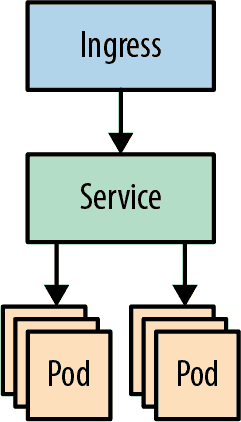

# 第九章：管理 Pods

> 没有大问题，只有很多小问题。
> 
> 亨利·福特

在前一章中，我们详细介绍了容器，并解释了在 Kubernetes 中，容器如何组合在一起形成 Pods。Pods 还有一些其他有趣的方面，我们将在本章中介绍，包括标签、使用节点亲和性指导 Pod 调度、使用污点和容忍来阻止 Pods 在特定节点上运行、使用 Pod 亲和性将 Pods 保持在一起或分开、以及使用诸如 DaemonSets 和 StatefulSets 等 Pod 控制器编排应用程序。我们还将介绍一些高级网络功能，包括 Ingress 控制器和服务网格工具。

# 标签

你知道 Pod（以及其他 Kubernetes 资源）可以附加标签，并且这些标签在连接相关资源（例如，将请求从 Service 发送到适当的后端）中起着重要作用。让我们在本节中更详细地了解标签和选择器。

## 什么是标签？

> 标签是附加到对象（例如 Pods）的键/值对。标签旨在用于指定对象的标识属性，这些属性对用户来说是有意义且相关的，但并不直接向核心系统提供语义。
> 
> Kubernetes [文档](https://oreil.ly/C4j1y)

换句话说，标签存在是为了为资源打上对我们有意义的信息，但它们对 Kubernetes 来说没有特别的意义。例如，通常会为 Pod 打上它们所属的应用程序的标签：

```
apiVersion: v1
kind: Pod
metadata:
  labels:
    `app``:` `demo`
```

现在，单独看这个标签没有任何效果。它作为文档仍然很有用：某人可以查看这个 Pod 并查看它运行的应用程序。但是标签的真正威力是在我们与*选择器*一起使用它时才体现出来。

## 选择器

选择器是匹配标签（或一组标签）的表达式。这是一种通过它们的标签指定一组资源的方法。例如，Service 资源有一个选择器，用于标识它将发送请求到的 Pods。还记得我们在“Service 资源”中的演示 Service 吗？

```
apiVersion: v1
kind: Service
...
spec:
  ...
  `selector``:`
    `app``:` `demo`
```

这是一个非常简单的选择器，匹配所有具有`app`标签且其值为`demo`的资源。如果一个资源根本没有`app`标签，它将不会匹配这个选择器。如果它有`app`标签，但其值不是`demo`，它也不会匹配选择器。只有符合条件的资源（在本例中为 Pod）才会匹配，所有这些资源都将被此 Service 选中。

标签不仅仅用于连接 Service 和 Pod；当使用`kubectl get`命令查询集群时，你可以直接使用它们，使用`--selector`标志：

```
`kubectl get pods --all-namespaces --selector app=demo`
NAMESPACE   NAME                    READY     STATUS    RESTARTS   AGE demo        demo-5cb7d6bfdd-9dckm   1/1       Running   0          20s
```

你可能还记得从“使用简短标志”中学到的，`--selector`可以缩写为`-l`（用于***标签***）。

如果你想查看 Pod 上定义的标签，可以使用`kubectl get`命令的`--show-labels`标志：

```
`kubectl get pods --show-labels`
NAME                    ... LABELS demo-5cb7d6bfdd-9dckm   ... app=demo,environment=development
```

## 更高级的选择器

大多数情况下，像`app: demo`这样的简单选择器（称为*等值选择器*）就足够了。你可以结合不同的标签来创建更具体的选择器：

```
`kubectl get pods -l app=demo,environment=production`
```

这将仅返回具有`app: demo`和`environment: production`标签的 Pods。这在 YAML 中等效于（例如在服务中）：

```
selector:
  `app``:` `demo`
  `environment``:` `production`
```

像这样的等值选择器是 Service 中唯一可用的一种，但对于与`kubectl`进行交互式查询或更复杂的资源（如 Deployments），还有其他选项。

其中一个是选择*不相等*的标签：

```
`kubectl get pods -l app!=demo`
```

这将返回所有具有与`demo`不同值的`app`标签的 Pods，或者根本没有`app`标签的 Pods。

你还可以请求处于*集合*中的标签值：

```
kubectl get pods -l `` `*environment in (staging, production)*` ``
```

在 YAML 中的等效方式如下：

```
selector:
  `matchExpressions``:`
  `-` `{``key``:` `environment``,` `operator``:` `In``,` `values``:` `[``staging``,` `production``]``}`
```

你还可以请求不在给定集合中的标签值：

```
kubectl get pods -l `` `*environment notin (production)*` ``
```

这在 YAML 中的等效方式如下：

```
selector:
  `matchExpressions``:`
  `-` `{``key``:` `environment``,` `operator``:` `NotIn``,` `values``:` `[``production``]``}`
```

你可以在“使用节点亲和性控制调度”中看到另一个使用`matchExpressions`的例子。

## 标签的其他用途

我们已经看到如何使用`app`标签将 Pods 与 Services 链接起来（实际上，你可以使用任何标签，但`app`很常见）。但标签还有哪些其他用途呢？

在我们的演示应用程序的 Helm 图表中（参见“Helm 图表的内部结构是什么？”），我们设置了一个`environment`标签，例如可以是`staging`或`production`。如果你在同一个集群中运行 staging 和 production Pods（参见“我需要多个集群吗？”），你可能希望使用这样的标签来区分这两个环境。例如，你的服务选择器可能是：

```
selector:
  app: demo
  environment: production
```

如果没有额外的`environment`选择器，该服务将匹配具有`app: demo`的所有 Pods，包括可能不想要的 staging Pods。

根据你的应用程序，你可能希望使用标签以多种不同的方式对资源进行分组。以下是一些例子：

```
metadata:
  labels:
    app: demo
    tier: frontend
    environment: production
    version: v1.12.0
    role: primary
```

这允许你沿着这些不同的维度查询集群，了解正在发生的情况。

你也可以将标签用作金丝雀部署的一种方式（参见“金丝雀部署”）。如果你想向仅有少量 Pods 中部署新版本的应用程序，你可以使用像`track: stable`和`track: canary`这样的标签来进行两个独立的部署。

如果你的服务选择器只匹配`app`标签，它将发送流量到所有匹配该选择器的 Pods，包括`stable`和`canary`。你可以逐步增加`canary` Pods 的副本数量，以逐渐增加`canary` Pods 的比例。一旦所有运行中的 Pods 都在 canary 轨道上，你可以将它们重新标记为`stable`，然后开始下一个版本的过程。

## 标签和注释

你可能想知道标签和注释之间的区别是什么。它们都是提供有关资源元数据的键值对集合。

不同之处在于*标签标识资源*。它们用于选择相关资源组，例如服务的选择器中的标签。另一方面，注释用于非标识信息，供 Kubernetes 外的工具或服务使用。例如，在“Helm 钩子”中，有一个使用注释来控制 Helm 工作流程的示例。

因为标签通常用于对 Kubernetes 的内部查询是性能关键的，所以对有效标签有一些相当严格的限制。例如，标签名称限制为 63 个字符，尽管可以通过 DNS 子域的可选 253 字符前缀来扩展，用斜杠字符与标签分隔。标签只能以字母或数字（字母或数字）开头，并且只能包含字母数字字符以及破折号、下划线和点号。标签值也有[类似的限制](https://oreil.ly/pR82Y)。

实际上，我们怀疑您会因为标签字符用尽而遇到问题，因为常见使用的大多数标签只是一个单词（例如，`app`）。

# 节点亲和力

我们在“使用节点亲和力控制调度”中简要提到了节点亲和力，与可抢占节点有关。在那一节中，您学习了如何使用节点亲和力优先在特定节点上调度 Pod（或者不调度）。现在让我们更详细地看一下节点亲和力。

在大多数情况下，您不需要节点亲和力。Kubernetes 在将 Pod 调度到正确节点方面非常聪明。如果所有节点都同样适合运行特定 Pod，则无需担心此问题。

然而，也有例外情况（例如上一个示例中的可抢占节点）。如果重新启动 Pod 成本高昂，您可能希望尽可能避免将其调度到可抢占节点上；可抢占节点可能在没有警告的情况下从集群中消失。您可以使用节点亲和力表达这种偏好。

Kubernetes 中有两种类型的亲和力：硬和软，分别称为：

+   `requiredDuringSchedulingIgnoredDuringExecution`（硬）

+   `preferredDuringSchedulingIgnoredDuringExecution`（软）

记住，`required`表示硬亲和力（规则*必须*满足才能调度此 Pod），而`preferred`表示软亲和力（*最好*满足规则，但不是必须的）可能会有所帮助。

###### 提示

硬亲和力和软亲和力类型的长名称表明这些规则适用于*调度*期间，但不适用于*执行*期间。也就是说，一旦将 Pod 调度到满足亲和性的特定节点上，它将保留在那里。如果在 Pod 运行时发生变化导致规则不再满足，Kubernetes 不会移动 Pod。

## 硬亲和力

亲和性通过描述您希望 Pod 在其上运行的节点类型来表达。可能有关于您希望 Kubernetes 为 Pod 选择节点的几条规则。每个规则都使用`nodeSelectorTerms`字段表示。这里是一个例子：

```
apiVersion: v1
kind: Pod
...
spec:
  affinity:
    nodeAffinity:
      requiredDuringSchedulingIgnoredDuringExecution:
        nodeSelectorTerms:
        - matchExpressions:
          - key: "topology.kubernetes.io/zone"
            operator: In
            values: ["us-central1-a"]
```

只有在`us-central1-a`区域的节点才会匹配此规则，因此总体效果是确保此 Pod 仅在该区域中调度。

## 软亲和性

软亲和性的表达方式基本相同，只是每个规则被分配一个从 1 到 100 的数值*权重*，以确定其对结果的影响。这里是一个例子：

```
preferredDuringSchedulingIgnoredDuringExecution:
- `weight``:` `10`
  preference:
    matchExpressions:
    - key: "topology.kubernetes.io/zone"
      operator: In
      values: ["us-central1-a"]
- `weight``:` `100`
  preference:
    matchExpressions:
    - key: "topology.kubernetes.io/zone"
      operator: In
      values: ["us-central1-b"]
```

因为这是一个“preferred…”规则，它是软亲和性：Kubernetes 可以将 Pod 调度到任何节点，但它会优先选择符合这些规则的节点。

您可以看到这两条规则具有不同的`weight`值。第一条规则的权重是 10，但第二条规则的权重是 100。如果有符合两条规则的节点，Kubernetes 会给予第二条规则匹配的节点 10 倍的优先级（位于可用性区`us-central1-b`）。

权重是表达您偏好的相对重要性的一种有用方式。

# Pod 亲和性和反亲和性

我们已经看到您可以使用节点亲和性来引导调度程序向或远离在某些类型节点上运行 Pod。但是是否可以根据节点上已经运行的其他 Pod 来影响调度决策呢？

有时，一些 Pod 对在同一个节点上一起工作更好；例如，像 Redis 这样的 Web 服务器和内容缓存。如果您可以向 Pod 规范添加信息，告诉调度程序它希望与匹配特定标签集的 Pod 一起放置，那将非常有用。

相反，有时您希望 Pod 避免彼此。在“保持工作负载平衡”中，我们看到如果 Pod 副本最终在同一节点上结束，而不是分布在整个集群中可能会出现的问题。您能告诉调度程序避免在已经运行同一 Pod 的另一个副本的节点上调度 Pod 吗？

这正是您可以通过 Pod 亲和性做的事情。像节点亲和性一样，Pod 亲和性被表达为一组规则：要么是硬要求，要么是带有一组权重的软偏好。

## 保持 Pod 在一起

首先考虑第一个案例：将 Pod 一起调度。假设您有一个标记为`app: server`的 Pod，这是您的 Web 服务器，另一个标记为`app: cache`的 Pod，这是您的内容缓存。即使它们在不同的节点上，它们仍然可以一起工作，但如果它们在同一个节点上会更好，因为它们可以在不经过网络的情况下进行通信。您如何要求调度程序将它们放在一起？

下面是所需的 Pod 亲和性的示例，作为`server` Pod 规范的一部分表达。如果将其添加到`cache`规范或两个 Pod 都添加，效果将完全相同：

```
apiVersion: v1
kind: Pod
metadata:
  name: server
  labels:
    app: server
...
spec:
  affinity:
    `podAffinity``:`
      `requiredDuringSchedulingIgnoredDuringExecution``:`
        `labelSelector``:`
        `-` `matchExpressions``:`
          `-` `key``:` `app`
            `operator``:` `In`
            `values``:` `[``"``cache``"``]`
        `topologyKey``:` `kubernetes.io/hostname`
```

这种亲和性的整体效果是确保如果可能的话，`server` Pod 将安排在同时运行有带有 `cache` 标签的 Pod 的节点上。如果没有这样的节点，或者没有匹配的节点具有足够的空闲资源来运行 Pod，则无法运行。

在现实生活中，这可能不是您想要的行为。如果两个 Pod 绝对必须共存，请将它们的容器放在同一个 Pod 中。如果它们只是最好共存，请使用软 Pod 亲和性（`preferredDuringSchedulingIgnoredDuringExecution`）。

## 保持 Pod 分开

现在让我们看看反亲和性的情况：保持某些 Pod 分开。与其使用 `podAffinity`，我们使用 `podAntiAffinity`：

```
apiVersion: v1
kind: Pod
metadata:
  name: server
  labels:
    app: server
...
spec:
  affinity:
    `podAntiAffinity``:`
      `requiredDuringSchedulingIgnoredDuringExecution``:`
        `labelSelector``:`
        `-` `matchExpressions``:`
          `-` `key``:` `app`
            `operator``:` `In`
            `values``:` `[``"``server``"``]`
        `topologyKey``:` `kubernetes.io/hostname`
```

这与之前的例子非常相似，只是它是 `podAntiAffinity`，因此表达了相反的意义，匹配表达式也不同。这次，表达式是：“`app` 标签必须具有 `server` 的值。”

这种亲和性的效果是确保 Pod *不会*被安排在符合此规则的任何节点上。换句话说，不能将带有 `app: server` 标签的 Pod 安排在已运行 `app: server` Pod 的节点上。这将在集群中平均分布 `server` Pod，但可能会以所需副本数量为代价。

## 软反亲和性

然而，我们通常更关心是否有足够的副本可用，而不是尽可能公平地分配它们。硬规则并不是我们真正想要的。让我们稍微修改一下，使其成为软反亲和性：

```
affinity:
  `podAntiAffinity``:`
    `preferredDuringSchedulingIgnoredDuringExecution``:`
    `-` `weight``:` `1`
      `podAffinityTerm``:`
        `labelSelector``:`
        `-` `matchExpressions``:`
          `-` `key``:` `app`
            `operator``:` `In`
            `values``:` `[``"``server``"``]`
        `topologyKey``:` `kubernetes.io/hostname`
```

请注意，现在规则是 `preferred...`，而不是 `required...`，使其成为软反亲和性。如果可以满足规则，将会满足，但如果不能，Kubernetes 仍将安排 Pod。

因为这是一种偏好，我们指定一个 `weight` 值，就像我们为软节点亲和性所做的一样。如果有多个亲和性规则需要考虑，Kubernetes 将根据您为每条规则分配的权重进行优先级排序。

## 何时使用 Pod 亲和性

就像节点亲和性一样，您应将 Pod 亲和性视为特殊情况的精细调整增强。调度程序已经很擅长放置 Pod，以获得集群的最佳性能和可用性。Pod 亲和性限制了调度程序的自由度，以换取一个应用程序来换取另一个应用程序。

# 污点和容忍性

在“节点亲和性”中，您了解到 Pod 的一个属性可以将其引导向（或远离）一组节点。相反，*污点* 允许节点根据节点的某些属性排斥一组 Pod。

例如，您可以使用污点来保留特定节点：仅用于特定类型的 Pod 的节点。如果节点上存在某些问题，例如低内存或缺乏网络连接，Kubernetes 也会为您创建污点。

要向特定节点添加污点，请使用 `kubectl taint` 命令：

```
`kubectl taint nodes docker-for-desktop dedicated=true:NoSchedule`
```

这会在 `docker-for-desktop` 节点上添加一个名为 `dedicated=true` 的污点，并设置效果为 `NoSchedule`：除非具有匹配的 *容忍*，否则现在无法在此处安排任何 Pod。

要查看特定节点上配置的污点，请使用 `kubectl describe node...`。

要从节点上删除一个污点，请重复执行 `kubectl taint` 命令，但在污点名称后加上一个减号：

```
`kubectl taint nodes docker-for-desktop dedicated:NoSchedule-`
```

容忍是描述 Pod 的属性，用于描述它们与之兼容的污点。例如，要使 Pod 能够容忍 `dedicated=true` 污点，请将此添加到 Pod 的规范中：

```
apiVersion: v1
kind: Pod
...
spec:
  `tolerations``:`
  `-` `key``:` `"``dedicated``"`
    `operator``:` `"``Equal``"`
    `value``:` `"``true``"`
    `effect``:` `"``NoSchedule``"`
```

这实际上是在说：“此 Pod 允许在具有效果为 `NoSchedule` 的 `dedicated=true` 污点的节点上运行。”由于容忍 *匹配* 了污点，因此可以安排该 Pod。任何没有这种容忍的 Pod 将不被允许在带有污点的节点上运行。

当由于有污点的节点而无法运行 Pod 时，它将保持 `Pending` 状态，并且在 Pod 描述中会看到类似以下的消息：

```
Warning  FailedScheduling  4s (x10 over 2m)  default-scheduler  0/1 nodes are
available: 1 node(s) had taints that the pod didn't tolerate.
```

污点和容忍的其他用途包括标记具有专用硬件（如 GPU）的节点，并允许某些 Pod 容忍某些节点问题。

例如，如果一个节点掉线，Kubernetes 会自动添加污点 `node.kubernetes.io/unreachable`。通常情况下，这会导致其 `kubelet` 从节点上驱逐所有 Pod。然而，您可能希望保持某些 Pod 运行，希望网络能在合理时间内恢复。为此，您可以为这些 Pod 添加与 `unreachable` 污点匹配的容忍。

您可以在 Kubernetes [文档](https://oreil.ly/qbqpz) 中了解有关污点和容忍的更多信息。

# Pod 控制器

在本章中我们已经讨论了许多关于 Pod 的内容，这是有道理的：所有 Kubernetes 应用程序都在一个 Pod 中运行。但您可能会想，为什么我们还需要其他类型的对象呢？仅仅为一个应用程序创建一个 Pod 并运行它就足够了吗？

这实际上是直接使用 `docker container run` 运行容器时得到的结果，正如我们在 “运行容器映像” 中所做的那样。它有效，但非常有限：

+   如果容器由于某些原因退出，您必须手动重新启动它。

+   如果手动运行它们，那么您的容器只有一个副本，而且无法在多个副本之间进行负载均衡。

+   如果要高可用的副本，您必须决定在哪些节点上运行它们，并注意保持集群的平衡。

+   当您更新容器时，必须小心依次停止每个运行中的映像，拉取新映像并重新启动它。

这正是 Kubernetes 通过*控制器*来为您处理的工作。在“ReplicaSets”中，我们介绍了 ReplicaSet 控制器，它管理特定 Pod 的一组副本。它持续工作以确保始终存在指定数量的副本，如果副本不足，则启动新副本；如果副本过多，则停止部分副本。

您现在还熟悉了 Deployment，正如我们在“Deployments”中看到的，它管理 ReplicaSets 来控制应用程序更新的推出。当您更新 Deployment 时，例如使用新的容器规范，它会创建一个新的 ReplicaSet 来启动新的 Pod，并最终关闭管理旧 Pod 的 ReplicaSet。

对于大多数简单应用程序来说，Deployment 就足够了。但在本节中，我们将简要介绍一些其他有用的 Pod 控制器。

## DaemonSets

假设您希望将所有应用程序的日志发送到集中式日志服务器，如 Elasticsearch-Logstash-Kibana（ELK）堆栈或诸如 Datadog 这样的 SaaS 监控产品（见“Datadog”）。有几种方法可以做到这一点。

每个应用都可以包含连接到日志服务、认证、写日志等代码，但这样会导致大量重复的代码，效率低下。

或者，您可以在每个 Pod 中运行一个额外的容器作为日志代理（这称为*sidecar*模式）。这意味着应用程序不需要内置如何与日志服务通信的知识，但这也意味着您可能会在节点上运行几个相同的日志代理副本。

由于它只是管理与日志服务的连接并将日志消息传递给它，因此您实际上只需要在每个节点上有一个日志代理副本。这是一个如此常见的需求，以至于 Kubernetes 为此提供了一个特殊的控制器对象：*DaemonSet*。

###### 提示

术语*守护进程*传统上指运行在服务器上处理诸如日志记录之类的长时间后台进程，因此类比，Kubernetes 的 DaemonSets 在集群中的每个节点上运行一个*守护进程*容器。

一个 DaemonSet 的清单，正如您可能期望的那样，看起来非常像 Deployment 的清单：

```
apiVersion: apps/v1
kind: DaemonSet
metadata:
  name: fluentd-elasticsearch
  ...
spec:
  ...
  template:
    ...
    spec:
      containers:
      - name: fluentd-elasticsearch
        ...
```

当需要在集群的每个节点上运行一个 Pod 的副本时，请使用 DaemonSet。如果您运行的是一个应用程序，维护指定数量的副本比确切地在哪个节点上运行 Pod 更重要，请改用 Deployment。

## StatefulSets

像 Deployment 或 DaemonSet 一样，StatefulSet 是一种 Pod 控制器。StatefulSet 添加的功能是能够按特定顺序启动和停止 Pod。

例如，使用 Deployment 时，所有 Pod 都以随机顺序启动和停止。对于无状态服务来说，这是可以接受的，因为每个副本都是相同的，执行相同的工作。

然而，有时您需要按特定编号顺序启动 Pod，并能够通过其编号进行识别。例如，分布式应用程序（如 Redis、MongoDB 或 Cassandra）会创建自己的集群，并需要能够通过可预测的名称识别集群领导者。

对于这种情况，StatefulSet 是理想选择。例如，如果您创建一个名为 `redis` 的 StatefulSet，第一个启动的 Pod 将被命名为 `redis-0`，Kubernetes 将等待该 Pod 准备就绪后再启动下一个，即 `redis-1`。

根据应用程序的不同，您可以利用这一特性以可靠的方式对 Pod 进行集群化。例如，每个 Pod 可以运行一个启动脚本，检查它是否正在 `redis-0` 上运行。如果是，则它将成为 Redis 集群的领导者。如果不是，则将尝试通过联系 `redis-0` 作为副本加入集群。

在 Kubernetes 中，每个 StatefulSet 的副本必须在下一个开始之前运行并准备就绪，类似地，在终止 StatefulSet 时，将按相反顺序关闭副本，并等待每个 Pod 完成后再继续。

除了这些特殊属性外，StatefulSet 看起来与普通的部署（Deployment）非常相似：

```
apiVersion: apps/v1
kind: StatefulSet
metadata:
  name: redis
spec:
  selector:
    matchLabels:
      app: redis
  serviceName: "redis"
  replicas: 3
  template:
    ...
```

要能够通过可预测的 DNS 名称（如 `redis-1`）访问每个 Pod，还需要创建一个 `clusterIP` 类型为 `None` 的服务（称为 *无头服务*）。

使用非无头服务（nonheadless Service），您会得到一个单一的 DNS 条目（比如 `redis`），它负载均衡到所有后端 Pod。使用无头服务时，您仍然会得到单一的服务 DNS 名称，但同时还会为每个编号的 Pod（比如 `redis-0`、`redis-1`、`redis-2`等）得到单独的 DNS 条目。

需要加入 Redis 集群的 Pod 可以特定地联系 `redis-0`，但只需要负载均衡 Redis 服务的应用程序可以使用 `redis` DNS 名称与随机选择的 Redis Pod 进行通信。

StatefulSets 还可以管理其 Pod 的磁盘存储，使用 VolumeClaimTemplate 对象自动创建 PersistentVolumeClaim（参见“持久卷”）。

## 作业

Kubernetes 中另一个有用的 Pod 控制器类型是作业（Job）。与部署（Deployment）运行指定数量的 Pod 并持续重启不同，作业仅运行指定次数的 Pod。完成后，作业被认为已完成。

例如，批处理任务或队列工作 Pod 通常启动，完成工作，然后退出。这是由作业管理的理想候选者。

控制作业执行的两个字段是 `completions` 和 `parallelism`。首先，`completions` 确定指定 Pod 需要成功运行的次数，然后作业才被认为已完成。默认值为 1，意味着 Pod 将运行一次。

`parallelism` 字段指定一次应该运行多少个 Pod。同样，默认值为 1，意味着一次只会运行一个 Pod。

例如，假设您想运行一个队列工作 Job，其目的是从队列中消耗工作项。您可以将 `parallelism` 设置为 10，并且不设置 `completions`。这将启动 10 个 Pod，每个 Pod 将继续从队列中消耗工作，直到没有更多的工作可做，然后退出，此时 Job 将完成：

```
apiVersion: batch/v1
kind: Job
metadata:
  name: queue-worker
spec:
  completions: 10
  template:
    metadata:
      name: queue-worker
    spec:
      containers:
        ...
```

另外，如果您想运行一个单独的一次性任务，您可以将 `completions` 和 `parallelism` 都设置为 1。这将启动一个 Pod 的副本，并等待其成功完成。如果它崩溃、失败或以任何非成功的方式退出，Job 将重新启动它，就像 Deployment 一样。只有成功的退出才算作所需的 `completions` 数量。

如何启动一个 Job？您可以通过使用 `kubectl` 或 Helm 应用 Job 清单来手动执行它。另外，Job 可能会被自动触发；例如您的持续部署流水线（参见第十四章）。

当您的 Job 完成时，如果您希望 Kubernetes 在完成后自动清理，您可以使用 `ttlSecondsAfterFinished` 设置。一旦作业退出后指定的秒数过去，它将自动被删除。您还可以将 `ttlSecondsAfterFinished` 设置为 `0`，这意味着您的 Job 将在完成后立即被删除。

当您需要定期运行 Job，例如在一天的特定时间或给定间隔内，Kubernetes 还提供了 `CronJob` 对象。

## CronJobs

在 Unix 环境中，定时作业由 `cron` 守护进程运行（其名称来自希腊语单词 χρόνος，意思是“时间”）。因此，它们被称为 *CronJobs*，而 Kubernetes 的 `CronJob` 对象正是做同样的事情。

`CronJob` 的样子是这样的：

```
apiVersion: batch/v1
kind: CronJob
metadata:
  name: demo-cron
spec:
  schedule: "*/1 * * * *"
  jobTemplate:
    spec:
      containers:
      ...
```

在 `CronJob` 清单中要查看的两个重要字段是 `spec.schedule` 和 `spec.jobTemplate`。`schedule` 字段指定作业将使用与 Unix `cron` 实用程序相同的[格式](https://oreil.ly/TaRek)运行的时间表。

`jobTemplate` 指定要运行的 Job 的模板，与普通的 Job 清单完全相同（参见“Jobs”）。

## 水平 Pod 自动伸缩器

请记住，Deployment 控制器维护指定数量的 Pod 副本。如果一个副本失败，将启动另一个副本以取代它，以实现目标副本数。

在 Deployment 清单中设置了所需的副本数，并且我们已经看到，您可以根据流量情况调整此值以增加 Pod 的数量，或者在 Pod 无人使用时减少以缩减 Deployment。

但是，如果 Kubernetes 可以自动调整副本数量，以响应增加的需求呢？这正是 [水平 Pod 自动伸缩器](https://oreil.ly/d4cEE) 的作用。(*水平* 扩展指调整服务的副本数量，与 *垂直* 扩展形成对比，后者根据 CPU 或内存大小调整单个副本的大小。)

水平 Pod 自动缩放器（HPA）会监视指定的 Deployment，不断监视给定的度量标准，以确定是否需要增加或减少副本数量。

最常见的自动缩放指标之一是 CPU 利用率。记住来自“资源请求”的内容，Pod 可以请求一定数量的 CPU 资源；例如，500 毫核。随着 Pod 的运行，其 CPU 使用率会波动，这意味着在任何给定时刻，Pod 实际上使用了其原始 CPU 请求的一部分百分比。

您可以根据此值自动缩放 Deployment：例如，您可以创建一个 HPA，该 HPA 的目标是 Pod 的 80% CPU 利用率。如果 Deployment 中所有 Pod 的平均 CPU 使用率仅为其请求量的 70%，HPA 将通过减少目标副本数来进行缩减。如果 Pod 的工作负载不太重，我们就不需要那么多 Pod，HPA 可以将它们缩减。

另一方面，如果平均 CPU 利用率为 90%，这超过了 80% 的目标，因此我们需要增加更多的副本，直到平均 CPU 使用率降下来。HPA 将修改 Deployment 以增加目标副本数。

每当 HPA 确定需要进行缩放操作时，它将根据实际度量值与目标的比率调整副本数。如果 Deployment 与目标 CPU 利用率非常接近，HPA 只会添加或删除少量副本；但如果它明显偏离，HPA 将以更大的数量进行调整。

HPA 使用另一个名为 Metrics Server 的流行 Kubernetes 项目来获取其自动缩放决策所需的数据。您可以按照 [metrics-server 仓库](https://oreil.ly/6nZ20) 中的说明进行安装。

这是基于 CPU 利用率的 HPA 示例：

```
apiVersion: autoscaling/v2beta2
kind: HorizontalPodAutoscaler
metadata:
  name: demo-hpa
spec:
  scaleTargetRef:
    apiVersion: apps/v1
    kind: Deployment
    name: demo
  minReplicas: 1
  maxReplicas: 10
  metrics:
  - type: Resource
    resource:
      name: cpu
      target:
        type: Utilization
        averageUtilization: 80
```

这里的有趣字段包括：

+   `spec.scaleTargetRef` 指定要缩放的 Deployment

+   `spec.minReplicas` 和 `spec.maxReplicas` 指定缩放的限制

+   `spec.metrics` 确定用于缩放的度量标准

尽管 CPU 利用率是最常见的缩放指标，但您可以使用 Kubernetes 可用的任何度量标准，包括内置的*系统度量*，如 CPU 和内存使用情况，以及应用程序特定的*服务度量*，您可以从应用程序定义并导出（参见第十六章）。例如，您可以根据应用程序的错误率或每秒传入请求的数量进行缩放。

您可以在 Kubernetes [文档](https://oreil.ly/17zTB) 中详细了解自动缩放器和自定义度量标准。

### 根据已知计划进行自动缩放

`HorizontalPodAutoscaler`与`CronJob`结合使用时，在应用程序的流量模式基于一天中的时间可预测的情况下非常有用。例如，如果您确切地知道每天早上 8 点之前需要 20 个 Pod 处于运行状态以处理一大波请求，那么您可以创建一个`CronJob`，在这个时间之前使用内部服务帐户运行`kubectl`命令进行扩展（参见“Pod Service Accounts”）：

```
apiVersion: batch/v1
kind: CronJob
...
args:
  - "kubectl patch hpa service-hpa --patch *`{``\"``spec``\"``:{``\"``minReplicas``\"``:20}}`*"
...
```

然后，您可以在业务结束时创建类似的`CronJob`来缩减`minReplicas`。当与如“Autoscaling”中讨论的集群自动缩放结合使用时，您可以使用这个技巧来节省总计算成本。

对于您的用例来说，使用普通的 HPA 而不是 cron 可能运行良好，但请记住，扩展新节点和 Pods 并不会立即发生。在您已经知道将需要一定容量来处理即将到来的负载高峰的情况下，添加一个`CronJob`可以确保您在高峰开始时所有资源都已经运行。

## 操作员和自定义资源定义（CRDs）

我们在“StatefulSets”中看到，虽然标准的 Kubernetes 对象如 Deployment 和 Service 对于简单的无状态应用程序很好，但它们也有它们的限制。一些应用程序需要多个协作的 Pods，这些 Pods 必须按特定顺序初始化（例如，复制的数据库或集群服务）。

对于需要更复杂管理或复杂资源类型的应用程序，Kubernetes 允许您创建自己的新类型的对象。这些被称为*自定义资源定义*（CRDs）。例如，Velero 备份工具创建并使用它称为`Configs`和`Backups`的新自定义 Kubernetes 对象（参见“Velero”）。

Kubernetes 被设计为可扩展的，您可以自由地定义和创建任何类型的对象，使用 CRD 机制。一些 CRD 只是存在来存储数据，就像 Velero 的`BackupStorageLocation`对象一样。但是您可以更进一步，创建像 Deployment 或 StatefulSet 一样作为 Pod 控制器的对象。

例如，如果您想要创建一个控制器对象，在 Kubernetes 中设置复制的高可用性 MySQL 数据库集群，您会如何去做呢？

第一步是为您的自定义控制器对象创建一个 CRD。为了使其起作用，您需要编写一个与 Kubernetes API 通信的程序。正如我们在“Building Your Own Kubernetes Tools”中看到的那样，这很容易做到。这样的程序被称为*操作员*（可能是因为它自动执行人类操作员可能执行的动作）。

您可以在[OperatorHub.io 站点](https://operatorhub.io)看到社区构建和维护的大量 Operator 示例。这是一个包含数百个 Operator 的仓库，您可以在您的集群上安装它们，或者只需浏览它们的代码以获取构建您自己 Operator 的想法。

# Ingress

虽然服务（见“服务资源”）用于在集群内部路由*内部*流量（例如，从一个微服务到另一个微服务），Ingress 用于将*外部*流量路由到您的集群，并将其路由到适当的微服务（见图 9-1）。您可以将 Ingress 的概念看作是一个负载均衡器，与 Service 协调工作，根据其标签选择器将来自外部客户端的请求发送到正确的 Pod。所有这些都是通过一个 Ingress 控制器来实现的，我们稍后会详细介绍。现在，让我们看看典型的 Ingress 资源是如何在集群外部暴露您的应用程序的。



###### 图 9-1\. Ingress 资源

这是一个通用 Ingress 资源的清单：

```
apiVersion: networking.k8s.io/v1
kind: Ingress
metadata:
  name: demo-ingress
spec:
  rules:
    - http:
        paths:
          - path: /
            pathType: Prefix
            backend:
              service:
                name: demo-service
                port:
                  number: 8888
```

此示例中的这个 Ingress 查看名为`demo-service`的 Service，然后该 Service 使用选择器标签和就绪状态（见“就绪探针”）来确定适合接收请求的 Pod。不符合`demo-service`中定义的选择器标签的 Pod 以及具有失败的“就绪”状态的任何 Pod 将不会接收任何请求。除了基本的请求路由外，Ingress 还可以处理更高级的任务，例如管理 SSL 证书、速率限制以及与负载均衡器常见相关的其他功能。这些功能的具体实现由 Ingress 控制器处理。

## Ingress 控制器

Ingress 控制器负责管理集群中的 Ingress 资源。根据您运行集群的位置以及您需要的功能，您使用的控制器可能会有所不同。

通常，选择要使用的 Ingress 控制器，并配置控制器的行为，是通过 Ingress 清单中的注释来完成的。例如，要在 EKS 集群中使用面向公众的 AWS 应用负载均衡器，您可以添加类似以下的注释：

```
...
kind: Ingress
metadata:
  name: demo-aws-ingress
  annotations:
    kubernetes.io/ingress.class: alb
    alb.ingress.kubernetes.io/scheme: internet-facing
...
```

每个 Ingress 控制器都有其自己的一组注释，用于配置该控制器提供的各种功能。

在 GCP 中托管的 GKE 集群可以使用[Google Cloud 的负载均衡器控制器（GLBC）](https://oreil.ly/CsWhb)来处理 Ingress 资源。AWS 有一个类似的产品，我们之前提到过叫做[AWS 负载均衡器控制器](https://oreil.ly/ttxp4)，而 Azure 也有其自己的[应用程序网关 Ingress 控制器（AGIC）](https://oreil.ly/7u1qA)。如果您使用其中一个主要的公共云提供商，并且有需要将应用程序暴露在集群外部的情况，我们建议首先探索使用您的云提供商维护的特定 Ingress 控制器。

您还可以选择在集群内安装和使用不同的 Ingress 控制器，甚至如果需要，可以运行多个控制器。有[许多不同的 Ingress 控制器选项](https://oreil.ly/Eu9k0)，其中一些较受欢迎的包括：

[nginx-ingress](https://oreil.ly/ZSpg6)

NGINX 长久以来一直是一款流行的负载均衡工具，甚至在 Kubernetes 出现之前也是如此。`nginx-ingress`项目由 Kubernetes 社区维护。

[NGINX Ingress 控制器](https://oreil.ly/8k7JH)

这个控制器由 NGINX 公司本身支持。这个项目与前面段落提到的 Kubernetes 社区项目有一些区别。

[Contour](https://oreil.ly/wbTye)

Contour 实际上在底层使用另一个工具叫做[Envoy](https://www.envoyproxy.io)来代理客户端和 Pod 之间的请求。

[Traefik](https://oreil.ly/PBTPR)

这是一个轻量级的代理工具，还可以自动管理您的 Ingress 的 TLS 证书。

[Kong](https://oreil.ly/DQ2KE)

Kong 托管了[Kong 插件中心](https://docs.konghq.com/hub)，其中的插件与他们的 Ingress 控制器集成，用于配置 OAuth 认证、LetsEncrypt 证书、IP 限制、指标和其他负载均衡器的有用功能。

[HAProxy](https://oreil.ly/IbvBL)

多年来，HAProxy 一直是另一款流行的负载均衡工具，他们也为 Kubernetes 提供了自己的 Ingress 控制器以及一个 Helm 图表，用于在您的集群中安装它。

## Ingress 规则

Ingress 还可以用于将流量转发到不同的后端服务，具体取决于您指定的某些规则。其中一个常见用法是根据请求 URL 将请求路由到不同的位置，称为*fanout*：

```
apiVersion: networking.k8s.io/v1
kind: Ingress
metadata:
  name: fanout-ingress
spec:
  rules:
  - http:
      paths:
      - path: /hello
        backend:
          serviceName: hello
          servicePort: 80
      - path: /goodbye
        backend:
          serviceName: goodbye
          servicePort: 80
```

## 使用 Ingress 终止 TLS

大多数 Ingress 控制器还可以使用传输层安全性（TLS）（前身为安全套接层[SSL]协议）来保护连接。这通常使用一个 Kubernetes Secret（我们将在“Kubernetes Secrets”中介绍）来存储证书和密钥的内容，并在 Ingress 清单的`tls`部分进行配置：

```
apiVersion: networking.k8s.io/v1
kind: Ingress
metadata:
  name: demo-ingress
spec:
  tls:
  - secretName: demo-tls-secret
  backend:
    serviceName: demo-service
    servicePort: 80
...
---
apiVersion: v1
kind: Secret
type: kubernetes.io/tls
metadata:
  name: demo-tls-secret
data:
  tls.crt: LS0tLS1CRUdJTiBDRV...LS0tCg==
  tls.key: LS0tLS1CRUdJTiBSU0...LS0tCg==
```

### 使用 Cert-Manager 自动化 LetsEncrypt 证书

如果您想要使用流行的[Let's Encrypt](https://letsencrypt.org)颁发机构（或其他 ACME 证书提供者）自动请求和更新 TLS 证书，您可以使用[`cert-manager`](http://docs.cert-manager.io/en/latest)。

如果在您的集群中运行`cert-manager`，它将自动检测没有证书的 TLS 入口，并从指定的提供者请求证书。它还可以在证书接近到期时自动续订这些证书。

# 服务网格

Kubernetes 的 Ingress 和 Services 可能是从客户端到您的应用程序路由请求所需的全部内容，这取决于您组织的复杂性。但是，有一个越来越大的兴趣集中在一个称为*服务网格*的新概念上。服务网格负责管理更复杂的网络操作，例如限流和加密微服务之间的网络流量。服务网格工具还可以为流经网络的请求添加度量和日志记录，跟踪请求花费的时间长短，或跟踪请求从何处开始以及沿途通过各种微服务的路径。某些服务网格工具可以处理失败请求的自动重试，并具有根据需要拒绝或阻止入站或出站请求的能力。

有几种实现服务网格的选项，我们将在这里列出。我们预计服务网格工具的领域将继续在未来几年迅速发展，并将成为任何云原生基础架构堆栈的核心部分。如果您刚开始部署几个应用程序，那么您可能只需使用 Kubernetes 提供的标准服务和入口资源即可开始。但是，如果您发现自己需要深入研究服务网格的这些更高级功能，这些都是一些值得探索的好选择。

## Istio

Istio 是与提供服务网格相关的最早的工具之一。它作为许多托管 Kubernetes 集群的可选附加组件提供，包括[GKE](https://oreil.ly/BnQMV)。如果您想自己安装 Istio，请参阅[Istio 安装文档](https://oreil.ly/SWldX)获取更多信息。[*Istio: Up and Running*](https://oreil.ly/KuTMV)（O'Reilly 出版社）是学习有关 Istio 及与服务网格通常相关的更广泛概念的好书。

## Linkerd

[Linkerd](https://linkerd.io)提供了许多关键的服务网格功能，但与 Istio 相比，它的占用空间更小，复杂性更低。它可用于设置服务之间的互相 TLS，收集请求速率和延迟的度量，蓝绿部署以及请求重试。

## Consul Connect

在 Kubernetes 广为人知和使用之前，HashiCorp 提供了一个名为 Consul 的流行工具，专注于服务发现。它处理应用程序的健康检查和在分布式计算环境中自动路由请求到正确位置。这部分功能现在在 Kubernetes 中已经本地化处理，但 Consul 现在扩展到包括一个名为 [Consul Connect](https://oreil.ly/vxlsB) 的新工具，具有服务网格功能。如果您运行在 Kubernetes 之外的混合环境中的应用程序，或者已经熟悉使用 Consul，则可以考虑探索 Consul Connect 作为您的服务网格的价值。

## NGINX 服务网格

除了 Ingress 控制器外，NGINX 还为 Kubernetes 提供了一个完整的 [服务网格](https://oreil.ly/HOmvE) 产品。它还使用 sidecar 模式，其中一个 NGINX 容器与您的应用程序并行运行，并处理网络流量的路由。该服务网格容器提供 mTLS 加密、流量分割能力，并跟踪网络性能指标以进行可观察性分析。

# 摘要

最终，在 Kubernetes 中一切都围绕着运行 Pods 进行。这些 Pods 可以使用 Kubernetes 控制器和对象进行配置和管理，无论是长期运行的进程还是短期作业和 CronJobs。更复杂的设置可能使用自定义资源定义和运算符。将网络请求路由到 Pods 包括使用 Services 和 Ingress 控制器。

需要记住的基本思想：

+   Labels 是标识资源的键值对，可以与选择器一起使用以匹配指定组的资源。

+   Node affinities 吸引或排斥 Pods 到或远离具有指定属性的节点。例如，您可以指定 Pod 只能运行在指定可用区的节点上。

+   虽然硬节点亲和性可以阻止 Pod 运行，但软节点亲和性更像是对调度器的建议。您可以将多个具有不同权重的软亲和性组合起来。

+   Pod 亲和性表达了希望将 Pods 调度到与其他 Pods 相同节点上的偏好。例如，受益于在同一节点上运行的 Pods 可以使用 Pod 亲和性来表达这一点。

+   Pod anti-affinities 反对其他 Pods 而不是吸引它们。例如，对相同 Pod 副本的反亲和性可以帮助在集群中均匀地分布您的副本。

+   Taints 是一种标记节点特定信息的方式，通常涉及节点问题或故障。默认情况下，Pods 不会被调度到有 taint 的节点上。

+   Tolerations 允许一个 Pod 被调度到具有特定 taint 的节点上。您可以使用这种机制仅在专用节点上运行某些 Pods。

+   DaemonSets 允许您在每个节点上调度一个 Pod 的副本（例如日志代理）。

+   StatefulSets 按特定编号顺序启动和停止 Pod 副本，允许您通过可预测的 DNS 名称来访问每个副本。这对于集群应用程序（如数据库）非常理想。

+   作业（Jobs）在完成之前运行一个 Pod（或指定次数）。类似地，CronJobs 定期在指定的时间运行一个 Pod。

+   水平 Pod 自动缩放器（HPA）监视一组 Pod，试图优化给定的指标（如 CPU 利用率）。它们增加或减少所需的副本数量以达到指定的目标。

+   自定义资源定义（CRD）允许您创建自己的自定义 Kubernetes 对象，以存储您希望的任何数据。运算符是 Kubernetes 客户端程序，可以为您的特定应用程序实现编排行为。OperatorHub.io 是搜索社区构建的运算符的绝佳资源。

+   Ingress 资源根据一组规则将请求路由到不同的服务，例如匹配请求 URL 的部分。它们还可以为您的应用程序终止 TLS 连接。

+   Istio、Linkerd 和 Consul Connect 是高级服务网格工具，为微服务环境提供网络功能，如加密、QoS、指标、日志记录以及更复杂的路由策略。
