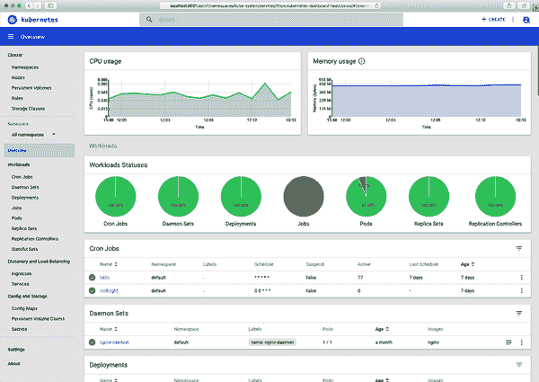

# 第十一章：安全性、备份和集群健康

> 如果您认为技术可以解决您的安全问题，那么您不了解这些问题，也不了解技术。
> 
> Bruce Schneier，《应用密码学》

在本章中，我们将探讨 Kubernetes 中的安全性和访问控制机制，包括基于角色的访问控制（RBAC），概述一些漏洞扫描工具和服务，并解释如何备份您的 Kubernetes 数据和状态（甚至更重要的是如何恢复）。我们还将介绍一些有用的获取集群信息的方法。

# 访问控制和权限

小型科技公司往往从只有少数几名员工开始，每个人都对每个系统有管理员访问权限。

随着组织的增长，最终会变得明显，不是每个人都拥有管理员权限都不是一个好主意：某人很容易犯错并改变不该改变的东西。同样适用于 Kubernetes。

## 通过集群管理访问

保护您的 Kubernetes 集群的最简单和最有效的方法之一是限制谁可以访问它。通常有两组人需要访问 Kubernetes 集群：*集群操作员* 和 *应用开发者*，他们通常在工作职能中需要不同的权限和特权。

此外，您可能会有多个部署环境，如生产环境和暂存环境。这些独立的环境将根据您的组织需求需要不同的策略。生产环境可能仅限于某些个人，而暂存环境可能对更广泛的工程师开放。

正如我们在“我是否需要多个集群？”中看到的，通常为生产和暂存或测试单独设置集群是个好主意。如果某人在暂存环境中意外部署了导致集群节点崩溃的东西，它不会影响生产环境。

如果一个团队不应该访问另一个团队的软件和部署流程，那么每个团队可以拥有自己专用的集群，甚至不需要在其他团队的集群上拥有凭证。

这无疑是最安全的方法，但额外的集群伴随着一些权衡。每个集群都需要打补丁和监控，而许多小集群的效率往往不如大集群高。

## 引入基于角色的访问控制（RBAC）

您还可以通过控制谁可以在集群内执行特定操作来管理访问，使用 Kubernetes 的基于角色的访问控制（RBAC）系统。

RBAC 的设计目的是为特定用户（或与自动化系统关联的服务账户）授予特定权限。例如，如果需要，您可以授予特定用户在集群中列出所有 Pod 的能力。

关于 RBAC 的第一点和最重要的事情是，它应该被启用。RBAC 在 Kubernetes 1.6 中作为设置集群的选项引入。但是，您的集群是否实际启用了此选项取决于您的云提供商或 Kubernetes 安装程序。

如果您正在运行自托管集群，请尝试使用以下命令查看集群是否已启用 RBAC：

```
`kubectl describe pod -n kube-system -l component=kube-apiserver`
Name:         kube-apiserver-docker-for-desktop Namespace:    kube-system ... Containers:
 kube-apiserver: ... Command: kube-apiserver ... --authorization-mode=Node,RBAC
```

如果`--authorization-mode`不包含`RBAC`，则您的集群未启用 RBAC。请查阅安装程序的文档，了解如何重新构建已启用 RBAC 的集群。

没有 RBAC，任何具有访问集群权限的人都有权执行任何操作，包括运行任意代码或删除工作负载。这可能不是您想要的。

## 理解角色

因此，假设您已启用 RBAC，它是如何工作的？了解最重要的概念是*用户*、*角色*和*角色绑定*。

每次连接到 Kubernetes 集群时，您都会作为特定用户进行。您如何对集群进行身份验证取决于您的提供者；例如，在 GKE 中，您使用`gcloud`工具获取访问特定集群的访问令牌。在 EKS 中，您使用 AWS IAM 凭据。集群中还有服务账户；例如，每个命名空间都有一个默认的服务账户。用户和服务账户都可以拥有不同的权限集。

这些由 Kubernetes 的*角色*管理。角色描述了特定的权限集。Kubernetes 包含一些预定义的角色供您使用。例如，`cluster-admin`角色适用于超级用户，允许访问和更改集群中的任何资源。相比之下，`view`角色可以列出和检查给定命名空间中的大多数对象，但不能修改它们。

您可以在命名空间级别（使用`Role`对象）或整个集群范围内（使用 ClusterRole 对象）定义角色。以下是授予任何命名空间中 Secrets 读取权限的 ClusterRole 清单示例：

```
kind: ClusterRole
apiVersion: rbac.authorization.k8s.io/v1
metadata:
  name: secret-reader
rules:
- apiGroups: [""]
  resources: ["secrets"]
  verbs: ["get", "watch", "list"]
```

## 将角色绑定到用户

如何将用户与角色关联？您可以使用角色绑定来实现。就像角色一样，您可以创建一个适用于特定命名空间的`RoleBinding`对象，或者适用于集群级别的 ClusterRoleBinding。

以下是 RoleBinding 清单示例，它在`demo`命名空间中仅为`daisy`用户分配`edit`角色：

```
kind: RoleBinding
apiVersion: rbac.authorization.k8s.io/v1
metadata:
  name: daisy-edit
  namespace: demo
subjects:
- kind: User
  name: daisy
  apiGroup: rbac.authorization.k8s.io
roleRef:
  kind: ClusterRole
  name: edit
  apiGroup: rbac.authorization.k8s.io
```

在 Kubernetes 中，权限是*累加的*；用户起初没有权限，您可以使用 Roles 和 RoleBindings 为其添加权限。您不能从已经拥有权限的人那里减去权限。

###### 提示

您可以在 Kubernetes 的[文档](https://oreil.ly/SOxYN)中详细了解 RBAC 的详情，以及可用的角色和权限。

## 我需要哪些角色？

那么在您的集群中应该设置哪些角色和绑定？预定义的角色`cluster-admin`、`edit`和`view`可能已经涵盖了大多数需求。要查看特定角色具有哪些权限，请使用`kubectl describe`命令：

```
`kubectl` `describe` `clusterrole/edit`
Name:         edit
Labels:       kubernetes.io/bootstrapping=rbac-defaults
Annotations:  rbac.authorization.kubernetes.io/autoupdate=true
PolicyRule:
  Resources   ... Verbs
  ---------   ... -----
  bindings    ... [get list watch]
  configmaps  ... [create delete deletecollection get list patch update watch]
  endpoints   ... [create delete deletecollection get list patch update watch]
  ...
```

您可以为组织内的特定人员或工作角色（例如开发者角色）或个别团队（例如 QA 或安全团队）创建角色。

## 保护对 cluster-admin 的访问

谁有权限访问 `cluster-admin` 角色要非常小心。这是集群超级用户，相当于 Unix 系统上的 root 用户。他们可以对任何东西进行任何操作。永远不要将此角色授予不是集群运营商的用户，尤其是不要将此角色授予可能暴露在互联网上的应用程序服务账号，比如 Kubernetes 仪表盘（参见 “Kubernetes 仪表盘”）。

###### 警告

不要通过不必要地授予 *cluster-admin* 来解决问题。在诸如 Stack Overflow 等网站上可能会找到一些错误的建议。面对 Kubernetes 权限错误时，一个常见的应对方式是将 `cluster-admin` 角色授予应用程序。*不要这样做*。是的，它可以让错误消失，但这是以绕过所有安全检查并可能打开集群给攻击者的风险为代价的。相反，应该授予应用程序最少所需的权限角色。

## 应用程序和部署

在 Kubernetes 中运行的应用通常不需要任何特殊的 RBAC 权限。除非另有指定，所有的 Pod 都会作为其命名空间中的 `default` 服务账号运行，该账号没有任何关联角色。

如果您的应用程序因某种原因需要访问 Kubernetes API（例如需要列出 Pod 的监控工具），请为该应用程序创建一个专用的服务账号，使用 `RoleBinding` 将其关联到必要的角色（例如 `view`），并限制它只能访问特定的命名空间。

那么，部署应用程序到集群需要哪些权限呢？最安全的方式是只允许连续部署工具来部署应用程序（参见 第十四章）。它可以使用专用的服务账号，在特定命名空间内具有创建和删除 Pod 的权限。

`edit` 角色非常适合此用途。具有 `edit` 角色的用户可以在命名空间中创建和销毁资源，但不能创建新的角色或向其他用户授予权限。

如果没有自动化的部署工具，并且开发人员必须直接部署到集群中，他们还需要在适当的命名空间中拥有编辑权限。基于应用程序的基础，逐个应用程序授予这些权限；不要在整个集群范围内授予任何人编辑权限。那些不需要部署应用程序的人默认只能具备 `view` 角色。

理想情况下，应该设置一个集中化的 CI/CD 部署流程，这样开发人员就不需要直接在 Kubernetes 上进行部署。我们将在 第十四章 和 “GitOps” 中更详细地介绍这一点。

# 最佳实践

确保 RBAC 在所有集群中启用。只将`cluster-admin`权限授予实际需要完全控制集群的用户。如果您的应用程序需要访问集群资源，请为其创建服务账户，并将其绑定到只在需要的命名空间中拥有所需权限的角色。

## RBAC 故障排除

如果您正在运行一个不支持 RBAC 或者您仍在调试自己应用程序所需权限的旧第三方应用程序，可能会遇到 RBAC 权限错误。这些错误看起来如何？

如果一个应用程序请求执行它没有权限做的 API 请求（比如列出节点），它将会从 API 服务器看到*Forbidden*错误响应（HTTP 状态码 403）：

```
Error from server (Forbidden): nodes.metrics.k8s.io is forbidden: User
"demo" cannot list nodes.metrics.k8s.io at the cluster scope.
```

如果应用程序没有记录这些信息，或者您不确定哪个应用程序失败了，可以检查 API 服务器的日志（详见“Viewing a Container’s Logs”了解更多信息）。它将记录包含`RBAC DENY`字符串及错误描述的消息：

```
`kubectl logs -n kube-system -l component=kube-apiserver | grep "RBAC DENY"`
RBAC DENY: user "demo" cannot "list" resource "nodes" cluster-wide
```

（在 GKE 集群或任何不提供对控制平面访问的托管 Kubernetes 服务上，您将无法执行此操作：请参阅您的 Kubernetes 提供商的文档，了解如何访问 API 服务器日志。）

`kubectl`还包括一个有用的命令来测试权限，称为`auth can-i`。这允许您使用当前角色尝试 Kubernetes 操作，或者测试其他人的权限以查看他们的角色是否允许特定命令：

```
[source, console, subs="quotes"]
*kubectl auth can-i list secrets*
yes
*kubectl auth can-i create deployments --as test-user*
no
```

RBAC 以复杂而闻名，但其实并不是。只需授予用户所需的最低权限，保持`cluster-admin`安全，一切都会好起来的。

# 集群安全扫描

为了检查潜在的已知安全问题，有工具可以扫描您的集群，并通知您检测到的任何问题。

## Gatekeeper/OPA

2021 年 2 月，CNCF 毕业了 [Open Policy Agent (OPA)](https://www.openpolicyagent.org) 项目，这意味着它符合被包括在其他官方采纳的 CNCF 项目旁边的标准和成熟度。OPA 是一个 *策略引擎* 工具，允许您为您的任何云原生工具（包括 Kubernetes）定义安全策略。

[Gatekeeper](https://oreil.ly/vosvu)是一个相关项目，它将 OPA 引擎作为本地资源在 Kubernetes 中运行。

例如，使用 Gatekeeper，您可以添加以下约束来阻止在特定命名空间中运行使用`latest`标签的容器（详见“The latest Tag”了解更多信息）：

```
apiVersion: constraints.gatekeeper.sh/v1beta1
kind: K8sDisallowedTags
metadata:
  name: container-image-must-not-have-latest-tag
spec:
  match:
    kinds:
      - apiGroups: [""]
        kinds: ["Pod"]
    namespaces:
      - "my-namespace"
  parameters:
    tags: ["latest"]
```

在 [`gatekeeper-library` repo](https://oreil.ly/PPDYg) 中维护了许多其他的针对 Kubernetes 的特定策略。其他示例包括确保所有 Pod 具有已知的一组标签，或强制容器来自可信任的注册表源列表。你还可以考虑使用 OPA 来审计和保护你的非 Kubernetes 云资源。

## kube-bench

[kube-bench](https://oreil.ly/IFV8p) 是一个用于按照由网络安全中心（CIS）制定的一组基准审计你的 Kubernetes 集群的工具。实际上，它验证你的集群是否按照安全最佳实践进行了设置。虽然你可能不需要这样做，但你可以配置 kube-bench 运行的测试，甚至添加自己的测试，以 YAML 文档的形式指定。

与 “使用 Sonobuoy 进行一致性测试” 类似，kube-bench 在你将 Job 部署到 Kubernetes 并检查结果时运行。根据 [存储库文档](https://oreil.ly/8zI5c) 下载适合你集群的适当的 Job YAML 文件，并将其安装到你的集群中：

```
`kubectl apply -f job.yaml`
job.batch/kube-bench created 
`kubectl logs job/kube-bench`
... == Summary total == 63 checks PASS 13 checks FAIL 46 checks WARN 0 checks INFO ...
```

然后，你可以阅读日志，了解 kube-bench 发现的任何警告或失败的具体信息。

## Kubescape

这个领域的另一个工具称为 [Kubescape](https://oreil.ly/Bt9be)，它检查你的集群是否根据最近在 [CIS 基准](https://oreil.ly/vT8Kl) 中定义的标准安全。它会告诉你关于以 root 权限运行的容器、任何可能不安全的公开端口、检查你的认证和审计日志设置是否安全配置等内容，这些项目都在 CIS 检查清单中定义。

# 容器安全扫描

如果你在集群中运行第三方软件，检查其安全问题和恶意软件是明智之举。但即使是你自己的容器也可能包含你不知道的软件，也需要进行检查。

## Clair

[Clair](https://oreil.ly/RDSHS) 是 CoreOS 项目生产的开源容器扫描器。它静态分析容器镜像，即在实际运行之前，看看它们是否包含已知不安全的软件或版本。

你可以手动运行 Clair 来检查特定镜像是否存在问题，或将其集成到你的持续交付流程中，在部署之前测试所有镜像（参见 第十四章）。

另外，Clair 可以连接到你的容器注册表，扫描推送到其中的任何镜像并报告问题。

值得一提的是，你不应该自动信任基础镜像，比如`alpine`。Clair 预装了许多流行基础镜像的安全检查，如果你使用的镜像存在已知漏洞，它会立即告诉你。

## Aqua

[Aqua 容器安全平台](https://oreil.ly/rLSPJ) 是一种全方位的商业容器安全解决方案，允许组织扫描容器以检测漏洞、恶意软件和可疑活动，同时提供策略执行和合规性监管。

顺理成章地，Aqua 的平台与您的容器注册表、CI/CD 管道以及包括 Kubernetes 在内的多个编排系统集成。

Aqua 还提供 [Trivy](https://oreil.ly/T4bSS)，这是一个可以添加到您的容器镜像中的免费工具，用于扫描安装的软件包，以检测来自 Aqua 安全平台使用的同一数据库中已知的漏洞。

如果您想让 Trivy 扫描特定的 Docker 镜像，请安装 CLI 工具并运行：

```
`trivy image [YOUR_CONTAINER_IMAGE_NAME]`
```

您还可以使用它来扫描 Dockerfile、Terraform 文件甚至您的 Kubernetes 清单中的安全问题和错误配置：

```
`trivy config [YOUR_CODE_DIR]`
```

另一个方便的来自 Aqua 的开源工具是 [kube-hunter](https://kube-hunter.aquasec.com)，旨在发现 Kubernetes 集群本身的安全问题。如果您将其作为容器在集群外的机器上运行，就像攻击者可能会做的那样，它将检查各种问题：证书中的公开电子邮件地址、不安全的仪表板、开放的端口和端点等。

## Anchore Engine

[Anchore Engine](https://oreil.ly/O0ik7) 是一个开源工具，用于扫描容器镜像，不仅用于已知的漏洞，还可以识别容器中存在的一切内容的*物料清单*，包括库、配置文件和文件权限。您可以使用此工具根据用户定义的策略验证容器：例如，您可以阻止包含安全凭据或应用程序源代码的任何镜像。

## Synk

Docker 与 [Synk](https://snyk.io) 合作，将漏洞扫描直接添加到 `docker` CLI 工具中。您可以使用 `docker scan` 命令扫描任何镜像：

```
`docker scan golang:1.17-alpine`

Testing golang:1.17-alpine... 
Package manager:   apk Project name:      docker-image|golang Docker image:      golang:1.17-alpine Platform:          linux/amd64 Base image:        golang:1.17.1-alpine3.14 
✓ Tested 15 dependencies for known vulnerabilities, no vulnerable paths found.
```

Synk 将告诉您在镜像中发现的已知安全问题和弃用问题：

```
`docker scan golang:1.14-alpine`
... Tested 15 dependencies for known vulnerabilities, found 10 vulnerabilities. 
Base Image          Vulnerabilities  Severity golang:1.14-alpine  10               2 critical, 5 high, 2 medium, 1 low 
Recommendations for base image upgrade: 
Minor upgrades Base Image            Vulnerabilities  Severity golang:1.17.0-alpine  0                0 critical, 0 high, 0 medium, 0 low
```

这可以是将一些基本安全扫描快速轻松地添加到您的 Docker 工作流程以及您的 CI/CD 管道中的一种方法。

# 最佳实践

不要从不受信任的源运行容器，或者当您不确定其中包含什么内容时。运行像 Clair 或 Synk 这样的扫描工具来检查所有容器，特别是您自己构建的那些容器，确保基础镜像或依赖项中没有已知的漏洞。

# 备份

您可能想知道在云原生架构中是否仍然需要备份。毕竟，Kubernetes 本身是可靠的，可以处理一次丢失多个节点的情况，而不会丢失状态，甚至不会显著降低应用程序性能。

此外，Kubernetes 是一种声明性的基础架构即代码系统。所有 Kubernetes 资源都由存储在可靠数据库（`etcd`）中的数据描述。如果某些 Pod 被意外删除，它们的监控 Deployment 将从数据库中保存的规范重新创建它们。

## 我需要备份 Kubernetes 吗？

那么，您是否仍然需要备份？是的。例如，存储在持久卷上的数据容易出现故障（参见“持久卷”）。虽然您的云供应商可能会提供名义上高可用的卷（例如跨两个不同可用性区域复制数据），但这并非备份。

让我们重申这一点，因为这并不明显：

###### 警告

*复制并非备份*。尽管复制可以保护您免受底层存储卷的故障影响，但它无法防止您在 Web 控制台误点击而意外删除卷，例如。

复制也不能防止配置错误的应用程序覆盖其数据，或者操作员在运行具有错误环境变量的命令时意外删除生产数据库而不是开发数据库。（[这种情况发生过](https://oreil.ly/0bxEk)，可能比任何人愿意承认的频繁¹)

## 备份 `etcd`

正如我们在“高可用性”中看到的，Kubernetes 将其所有状态存储在 `etcd` 数据库中，因此任何此处的故障或数据丢失都可能是灾难性的。这是为什么我们建议您使用保证 `etcd` 和控制平面可用性的托管服务的一个非常好的理由（参见“如果可以，请使用托管 Kubernetes”）。

如果您自己运行控制平面节点，则需要负责管理 `etcd` 集群和复制。即使定期进行数据快照，仍然需要一定时间来检索和验证快照，重建集群并恢复数据。在此期间，您的集群可能会不可用或严重降级。

这就是为什么非常重要，您要将您的 Kubernetes 清单和 Helm 图表存储在源代码控制中，并实施高效的部署流程，以便在出现 `etcd` 问题时能够快速恢复和运行您的集群。我们将在第十四章中进一步介绍此内容。

# 最佳实践

使用托管或即插即用服务提供商运行带有 `etcd` 集群和备份的控制平面节点。如果您自己运行它们，请务必确保您知道自己在做什么。弹性的 `etcd` 管理是一项专业工作，如果做错，后果可能很严重。

## 备份资源状态

除了 `etcd` 故障外，还有一个问题是保存您的各个资源的状态。例如，如果您误删了错误的 Deployment，您将如何重新创建它？

在本书中，我们强调了 *基础设施即代码* 范式的价值，并建议您始终通过应用存储在版本控制中的 YAML 清单或 Helm 图表来声明式管理您的 Kubernetes 资源。

理论上，为了重新创建集群工作负载的完整状态，您应该能够检出相关版本控制存储库，并应用其中的所有资源。*理论上*。

## 备份集群状态

实际上，并非您在版本控制中拥有的所有内容都在您的集群中运行。某些应用程序可能已经停止服务，或者被更新版本替换。有些可能尚未准备好部署。

我们在整本书中建议您避免直接更改资源，而是应用来自更新的清单文件的更改（参见 “不要使用命令式命令”）。但人们并不总是遵循好的建议。

在任何情况下，很可能在应用程序的初始部署和测试过程中，工程师可能会动态调整设置，如副本数和节点亲和性，并且只有在确定了正确值后才将它们存储在版本控制中。

假设你的集群完全关闭，或者所有资源都被删除（希望这种情况不太可能，但这是一个有用的思想实验）。你能多快重新创建它？

即使您有一个设计优良且最新的集群自动化系统，可以重新部署所有内容到一个新的集群，您如何 *知道* 这个集群的状态与丢失的状态匹配？

一种帮助确保这一点的方法是对正在运行的集群进行快照，以便以后在出现问题时进行参考。

## 大型和小型灾难

很少可能会整个丢失整个集群：成千上万的 Kubernetes 贡献者已经努力确保这种情况不会发生。

更有可能的情况是你（或者你最新的团队成员）可能会意外删除一个命名空间，无意中关闭一个 Deployment，或者在 `kubectl delete` 命令中错误地指定了一组标签，导致删除的东西比预期的更多。

不管原因是什么，灾难确实会发生，所以让我们看看一个可以帮助您避免它们的备份工具。

## Velero

[Velero](https://velero.io)（前身为 Ark）是一个可以备份和恢复集群状态及持久数据的免费开源工具。

Velero 在您的集群中运行，并连接到您选择的云存储服务（例如，Amazon S3 或 Azure Storage）。

前往 [velero.io 网站](https://velero.io/docs/main) 获取在您的平台上设置 Velero 的说明。

### 配置 Velero

在使用 Velero 之前，您需要在 Kubernetes 集群中创建一个 `BackupStorageLocation` 对象，告诉它备份存储位置（例如，AWS S3 云存储桶）。这里有一个配置 Velero 将备份到 `demo-backup` 存储桶的示例：

```
apiVersion: velero.io/v1
kind: BackupStorageLocation
metadata:
  name: default
  namespace: velero
spec:
  provider: aws
  objectStorage:
    bucket: demo-backup
  config:
    region: us-east-1
```

您必须至少拥有一个名为 `default` 的存储位置，尽管您可以添加其他任何您喜欢的名称。

Velero 还可以备份您的持久卷的内容。要告诉它存储它们的位置，您需要创建一个 `VolumeSnapshotLocation` 对象：

```
apiVersion: velero.io/v1
kind: VolumeSnapshotLocation
metadata:
  name: aws-default
  namespace: velero
spec:
  provider: aws
  config:
    region: us-east-1
```

### 创建一个 Velero 备份

使用`velero backup`命令创建备份时，Velero 服务器会查询 Kubernetes API 以检索与您提供的选择器匹配的资源（默认情况下，它备份所有资源）。您可以备份一组命名空间或整个集群：

```
`velero backup create demo-backup --include-namespaces demo`
```

然后，它将根据您配置的 BackupStorageLocation 将所有这些资源导出到云存储桶中的一个命名文件中。还将备份到您配置的 VolumeSnapshotLocation 中的持久卷的元数据和内容。

或者，您可以备份集群中除了指定命名空间（例如，`kube-system`）以外的所有内容。您还可以安排自动备份：例如，您可以让 Velero 每晚或每小时备份您的集群。

每个 Velero 备份都是完整的，而不是增量备份。因此，要恢复备份，您只需要最近的备份文件。

### 恢复数据

使用`velero backup get`命令可以列出您的可用备份。要查看特定备份中的内容，请使用`velero backup download`：

```
`velero backup download demo-backup`
Backup demo-backup has been successfully downloaded to $PWD/demo-backup-data.tar.gz
```

下载的文件是一个* tar.gz *归档文件，您可以使用标准工具解压并检查。如果您只想要特定资源的清单，例如，您可以从备份文件中提取它，并使用`kubectl apply -f`单独恢复它。

要恢复整个备份，`velero restore`命令将启动该过程，并且 Velero 将重新创建指定快照中描述的所有资源和卷，跳过任何已经存在的内容。

如果资源*存在*，但与备份中的资源不同，Velero 会警告您，但不会覆盖现有资源。因此，例如，如果您想要将运行中的部署状态重置为最新快照中的状态，请首先删除运行中的部署，然后使用 Velero 恢复。

或者，如果您正在恢复一个命名空间的备份，可以首先删除该命名空间，然后恢复备份。

### 恢复过程和测试

您应该编写详细的逐步过程描述如何从备份中恢复数据，并确保所有员工都知道在哪里找到此文档。当灾难发生时，通常是在不方便的时间，关键人员不可用，每个人都处于恐慌状态，您的程序应该如此清晰和精确，以至于可以由不熟悉 Velero 甚至 Kubernetes 的人员执行。

每个月，通过让不同团队成员执行恢复过程来运行恢复测试，对一个临时集群。这可以验证您的备份有效，并且恢复过程正确，确保每个人都熟悉如何操作。

### 安排 Velero 备份

所有备份都应自动化，Velero 也不例外。您可以使用`velero schedule create`命令安排定期备份：

```
`velero schedule create demo-schedule --schedule="0 1 * * *" --include-namespaces` `demo`
Schedule "demo-schedule" created successfully.
```

`schedule` 参数指定何时运行备份，使用 Unix `cron` 格式（参见 “CronJobs”）。例如，`0 1 * * *` 每天 01:00 运行备份。

要查看你计划中的备份，请使用 `velero schedule get`。

### Velero 的其他用途

尽管 Velero 在灾难恢复方面非常有用，但你也可以使用它来迁移资源和数据从一个集群到另一个。

定期进行 Velero 备份还可以帮助你了解你的 Kubernetes 使用情况随时间的变化，比如将当前状态与一个月前、六个月前和一年前的状态进行比较。

快照也可以是审计信息的有用来源：例如，在给定日期或时间运行的集群中有什么在运行，以及集群状态如何以及何时发生了变化。

# 最佳实践

定期使用 Velero 备份你的集群状态和持久数据：至少每天一次。至少每月运行一次恢复测试。

# 监控集群状态

监控云原生应用是一个重要的主题，正如我们将在 第十五章 中看到的那样，包括可观察性、指标、日志、跟踪和传统的封闭箱监控。

然而，在本章中，我们只关心监控 Kubernetes 集群本身：集群的健康状况、单个节点的状态以及集群的利用率和其工作负载的进度。

## kubectl

我们在 第二章 中介绍了无价的 `kubectl` 命令，但我们还没有探索完它的所有可能性。除了作为 Kubernetes 资源的通用管理工具外，`kubectl` 还可以报告有关集群组件状态的有用信息。

### 控制平面状态

`kubectl get componentstatuses` 命令（或简称 `kubectl get cs`）提供了控制平面组件的健康信息——调度程序、控制器管理器和 `etcd`：

```
`kubectl get componentstatuses`
NAME                 STATUS    MESSAGE              ERROR controller-manager   Healthy   ok scheduler            Healthy   ok etcd-0               Healthy   {"health": "true"}
```

如果任何控制平面组件出现严重问题，这很快就会显现出来，但仍然有必要能够检查和报告它们，作为集群的一种顶级健康指标。

如果你的任何控制平面组件状态不为 `Healthy`，则需要修复。对于托管 Kubernetes 服务，这种情况不应该发生，但对于自托管集群，你将需要自行处理。

### 节点状态

另一个有用的命令是 `kubectl get nodes`，它将列出集群中的所有节点，并报告它们的状态和 Kubernetes 版本：

```
`kubectl get nodes`
NAME             STATUS   ROLES                  AGE   VERSION docker-desktop   Ready    control-plane,master   24d   v1.21.4
```

由于 Docker Desktop 集群只有一个节点，所以这个输出并不特别具有信息量；让我们看一下来自一个小型 GKE 集群的输出，以获得更现实的数据：

```
`kubectl get nodes`
NAME                                         STATUS   ROLES   AGE  VERSION gke-k8s-cluster-1-n1-standard-2-pool--8l6n   Ready    <none>  9d   v1.20.2-gke.1 gke-k8s-cluster-1-n1-standard-2-pool--dwtv   Ready    <none>  19d  v1.20.2-gke.1 gke-k8s-cluster-1-n1-standard-2-pool--67ch   Ready    <none>  20d  v1.20.2-gke.1 ...
```

请注意，在 Docker Desktop 的 `get nodes` 输出中，节点的 *角色* 显示为 `control-plane`。理所当然的是，因为只有一个节点，那必定是控制平面和唯一的工作节点。

在托管 Kubernetes 服务中，通常无法直接访问控制平面节点。因此，`kubectl get nodes` 仅列出工作节点。

如果任何节点显示 `NotReady` 状态，则存在问题。重新启动节点可能会修复问题，但如果无效，则可能需要进一步调试——或者您可以删除它，然后创建一个新节点。

若要详细排查不良节点问题，您可以使用 `kubectl describe node` 命令获取更多信息：

```
`kubectl describe nodes/gke-k8s-cluster-1-n1-standard-2-pool--8l6n`
```

这将显示节点的内存和 CPU 容量，以及当前由 Pod 使用的资源。

### 工作负载

您可能还记得来自 “使用 kubectl 查询集群” 的内容，您也可以使用 `kubectl` 列出集群中所有 Pod（或任何资源）。在该示例中，您仅列出了默认命名空间中的 Pod，但 `--all-namespaces` 标志（或简写为 `-A`）将允许您查看整个集群中的所有 Pod：

```
`kubectl get pods --all-namespaces`
NAMESPACE     NAME                          READY  STATUS           RESTARTS  AGE cert-manager  cert-manager-cert-manager-55  1/1    Running          1         10d pa-test       permissions-auditor-15281892  0/1    CrashLoopBackOff 1720      6d metrics-api   metrics-api-779758f445        3/3    Running          5         20d ...
```

这可以为您提供集群中正在运行的内容以及任何 Pod 级别的问题的概述。例如，在示例中，如果像 `permissions-auditor` Pod 这样的 Pod 不处于 `Running` 状态，则可能需要进一步调查。

`READY` 列显示 Pod 中实际运行的容器数与配置数的比较。例如，`metrics-api` Pod 显示 `3/3`：3 个容器中的 3 个正在运行，因此一切正常。

另一方面，`permissions-auditor` 显示 `0/1` 容器就绪：0 个容器正在运行，但需要 1 个。状态在 `STATUS` 列中显示原因为 `CrashLoopBackOff`，容器无法正常启动。

当容器崩溃时，Kubernetes 将尝试以递增的时间间隔重新启动它，从 10 秒开始，并每次加倍，最多达到 5 分钟。这种策略称为*指数回退*，因此会显示 `CrashLoopBackOff` 状态消息。

## CPU 和内存利用率

您可以通过 `kubectl top` 命令查看集群的另一个有用视图。对于节点，它将显示每个节点的 CPU 和内存容量，以及当前使用量：

```
`kubectl top nodes`
NAME                           CPU(cores)   CPU%      MEMORY(bytes)   MEMORY% gke-k8s-cluster-1-n1-...8l6n   151m         7%        2783Mi          49% gke-k8s-cluster-1-n1-...dwtv   155m         8%        3449Mi          61% gke-k8s-cluster-1-n1-...67ch   580m         30%       3172Mi          56% ...
```

对于 Pod，它将显示每个指定 Pod 正在使用的 CPU 和内存：

```
`kubectl top pods -n kube-system`
NAME                                    CPU(cores)   MEMORY(bytes) event-exporter-v0.1.9-85bb4fd64d-2zjng  0m           27Mi fluentd-gcp-scaler-7c5db745fc-h7ntr     10m          27Mi fluentd-gcp-v3.0.0-5m627                11m          171Mi ...
```

用于广泛查看集群和 Pod 健康状况的另一个有用工具是使用 “Lens”。

## 云提供商控制台

如果您正在使用云提供商提供的托管 Kubernetes 服务，那么您将可以访问一个基于 web 的控制台，该控制台可以显示有关您的集群、节点和工作负载的有用信息。

您还可以列出节点、服务和集群的配置详细信息。这与使用 `kubectl` 工具获取的信息基本相同，但云控制台还允许您执行管理任务：创建集群、升级节点以及日常管理集群所需的一切。

## Kubernetes 仪表板

[Kubernetes 仪表盘](https://oreil.ly/3ty9U)是一个基于 Web 的用户界面，用于 Kubernetes 集群（图 11-1）。如果您运行自己的 Kubernetes 集群，而不是使用托管服务，则可以运行 Kubernetes 仪表盘，以获得与托管服务控制台基本相同的信息。



###### 图 11-1\. Kubernetes 仪表盘显示关于您的集群的有用信息

如您所料，仪表盘允许您查看集群、节点和工作负载的状态，方式与`kubectl`工具类似，但具有图形界面。您还可以使用仪表盘创建和销毁资源。

由于仪表盘公开了关于您的集群和工作负载的大量信息，因此正确保护它非常重要，并且绝不能将其暴露在公共互联网上。仪表盘允许您查看 ConfigMaps 和 Secrets 的内容，其中可能包含凭据和加密密钥，因此您需要像对待这些秘密本身一样严格控制对仪表盘的访问。

2018 年，安全公司 RedLock 发现了数百个[Kubernetes 仪表盘控制台](https://oreil.ly/3me4L)可以通过互联网访问而没有任何密码保护，其中包括一个由特斯拉公司所有。他们从中提取了云安全凭证，并使用这些凭证访问了更多的敏感信息。

# 最佳实践

如果您不必运行 Kubernetes 仪表盘（例如，如果您已经有由 GKE 等托管服务提供的 Kubernetes 控制台），则不要运行它。如果确实需要运行，确保它具有[最低权限](https://oreil.ly/aCZ1e)，并且永远不要将其暴露在互联网上。而是通过`kubectl proxy`访问它。

## Weave Scope

[Weave Scope](https://oreil.ly/01cLN)是一个出色的可视化和监控工具，适用于您的集群，实时显示节点、容器和进程的地图。您还可以查看指标和元数据，甚至可以使用 Scope 启动或停止容器。

## kube-ops-view

[kube-ops-view](https://oreil.ly/pmTGh)为您提供集群中正在发生的情况的可视化：节点信息、每个节点上的 CPU 和内存利用率、每个节点正在运行的 Pod 数量以及这些 Pod 的状态。这是获取集群概览及其运行情况的好方法。

## node-problem-detector

[node-problem-detector](https://oreil.ly/rE7Sl)是一个 Kubernetes 附加组件，可以检测并报告几种节点级问题：硬件问题（如 CPU 或内存错误）、文件系统损坏以及卡住的容器运行时。

当前，node-problem-detector 通过向 Kubernetes API 发送事件来报告问题，并配有一个 Go 客户端库，您可以用它来与自己的工具集成。

尽管 Kubernetes 目前对来自节点问题检测器的事件不采取任何行动，但未来可能会进一步集成，使调度器能够避免在有问题的节点上运行 Pod，例如。

# 进一步阅读

Kubernetes 的安全和集群管理是一个复杂和专业的主题，我们在这里只是浅尝辄止。这确实值得一本专门的书…… 而且已经有了。安全专家 Liz Rice 和 Michael Hausenblas 合著了优秀的[*Kubernetes Security*](https://www.oreilly.com/library/view/kubernetes-security/9781492039075/)（O’Reilly），涵盖了安全集群设置、容器安全、密钥管理等内容。

另一个很好的资源是[*Production Kubernetes*](https://www.oreilly.com/library/view/production-kubernetes/9781492092292//)（O’Reilly），由 Josh Rosso、Rich Lander、Alex Brand 和 John Harris 合著。我们强烈推荐这两本书。

# 总结

安全不是一个产品或一个最终目标，而是一个需要知识、思考和关注的持续过程。容器安全也不例外，确保安全的机制可以供你使用。如果你已经阅读并理解了本章的信息，你就知道如何在 Kubernetes 中安全配置你的容器了——但我们确信你明白，这只是安全流程的开始，而不是结束。

主要事项

+   RBAC 在 Kubernetes 中为你提供了细粒度的权限管理。确保启用，并使用 RBAC 角色仅授予特定用户和应用所需的最低权限。

+   容器并非神奇免于安全和恶意软件问题。使用扫描工具来检查你在生产环境中运行的任何容器。

+   使用 Kubernetes 并不意味着你不需要备份。使用 Velero 来备份你的数据和集群状态。它对于在集群之间移动内容也很方便。

+   `kubectl` 是一个强大的工具，可用于检查和报告集群及其工作负载的各个方面。熟悉 `kubectl`。你们将会一起花费很多时间。

+   使用你的 Kubernetes 提供商的 Web 控制台和 `kube-ops-view` 查看图形化概览。如果使用 Kubernetes Dashboard，请像保护云凭证和加密密钥一样保护它的安全性。

¹ 参见 David Cassel 在 2017 年 6 月 10 日发表的文章“初级开发人员误删生产数据库”，文章发表在 [thenewstack.io blog](https://thenewstack.io) 上。
