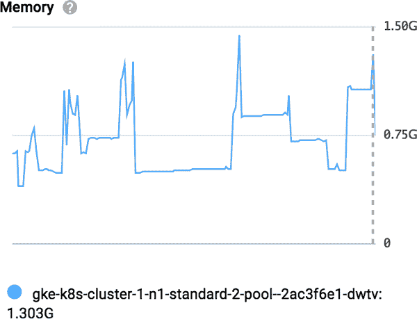
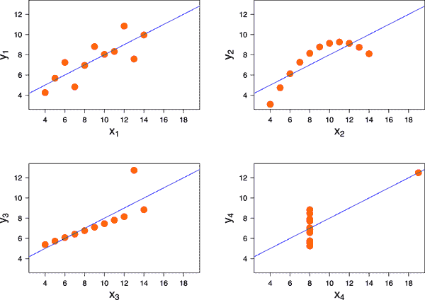
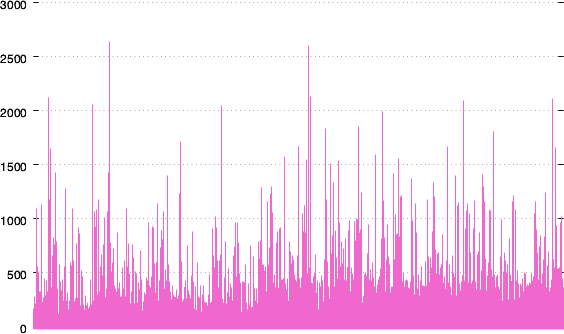
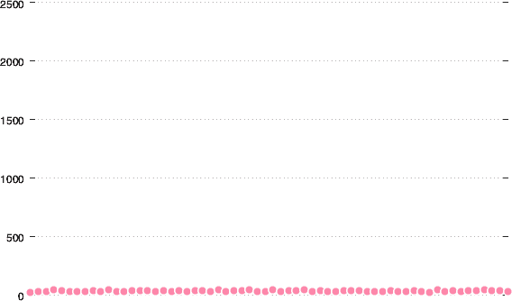
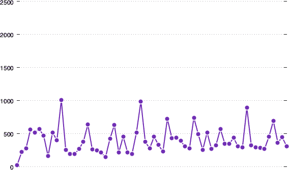
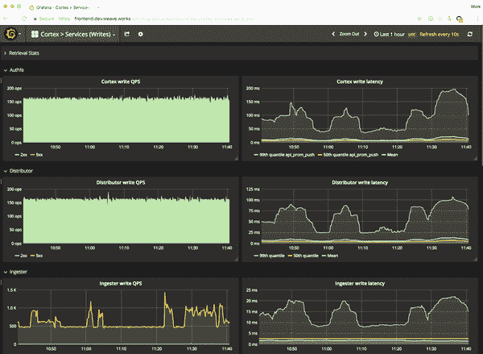
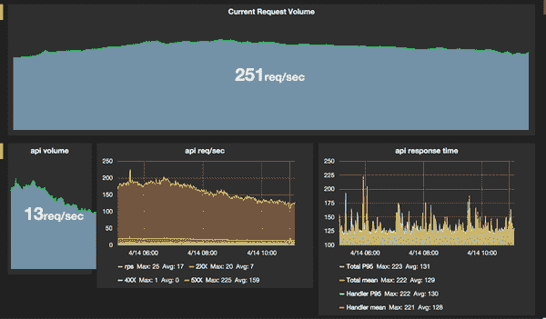
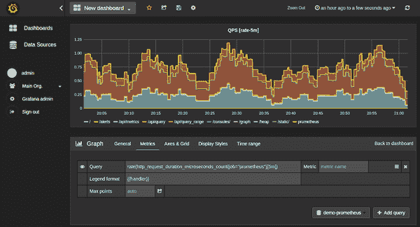
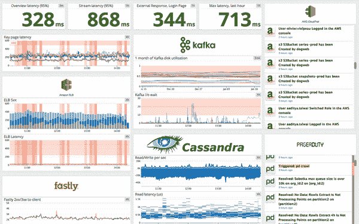
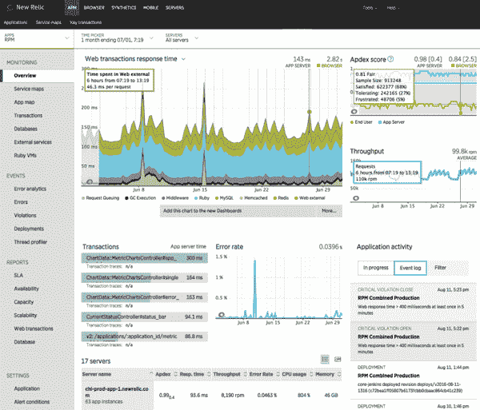

# 第十六章\. Kubernetes 中的度量标准

> 可能你对某一主题的了解非常深入，以至于你变得完全无知。
> 
> 弗兰克·赫伯特，《沙丘星际：教会堂》

在本章中，我们将深入探讨我们在第十五章中引入的度量标准概念，并详细介绍适用于 Kubernetes 的细节：有哪些类型的度量标准，哪些对于云原生服务很重要，如何选择要关注的度量标准，如何分析度量标准数据以获取可操作信息，以及如何将原始度量标准数据转换为有用的仪表板和警报？最后，我们将概述一些度量工具和平台的选项。

# 究竟什么是度量标准？

正如我们在“引入度量标准”中看到的那样，度量标准是特定事物的数值度量。传统服务器世界中一个熟悉的例子是特定机器的内存使用情况。如果当前只有 10%的物理内存分配给用户进程，那么机器有多余的容量。但如果内存使用率达到 90%，那么机器可能相当忙碌。

因此，度量标准可以为我们提供的一种宝贵信息是特定时刻正在发生的事情的快照。但我们可以做得更多。内存使用情况会随着工作负载的启动和停止而不断上下波动，但有时我们感兴趣的是随时间的内存使用量的*变化*。

## 时间序列数据

如果你定期采样内存使用情况，可以创建该数据的*时间序列*。图 16-1 展示了谷歌 Kubernetes 引擎节点内存使用时间序列数据的图表，跨越了一周的时间。这比一些瞬时值更能清晰地展示发生了什么。

###### 图 16-1\. GKE 节点内存使用的时间序列图

对于云原生可观察性目的而言，大多数我们感兴趣的度量标准都以时间序列形式表示，并且它们都是数值。例如，与日常日志数据不同，度量标准是可以进行数学和统计处理的值。

## 计数器与量规

它们是什么样的数字？虽然某些数量可以由整数表示（例如一台机器中的物理 CPU 数量），但大多数需要有小数部分，为了避免处理两种不同类型的数字，度量标准几乎总是表示为浮点十进制值。

鉴于此，度量标准值主要有两种类型：*计数器*和*量规*。计数器只能增加（或重置为零）；它们适用于测量诸如请求服务的次数和接收到的错误数等事物。另一方面，量规可以上下变动；它们适用于连续变化的数量，例如内存使用量，或者用于表达其他数量的比率。

对于一些问题，答案只能是是或否：例如特定端点是否响应 HTTP 连接。在这种情况下，适当的度量标准将是一个量规，其取值范围有限：可能是 0 和 1。

例如，一个端点的 HTTP 检查可以被命名为`http.can_connect`，当端点响应时，其值可能为 1，否则为 0。

## 度量能告诉我们什么？

度量有什么用处？嗯，正如我们在本章前面看到的那样，度量可以告诉你什么时候出了问题。例如，如果你的错误率突然上升（或者对支持页面的请求突然激增），这可能表明存在问题。你可以根据阈值为某些度量自动生成警报。

但是度量也可以告诉你事物的运行情况，例如你的应用程序当前支持多少个同时用户。这些数字的长期趋势对操作决策和业务智能都是有用的。

# 选择好的度量标准

起初，你可能会认为“如果度量好，那么越多的度量肯定会更好！”但事实并非如此。你不能监控所有东西。例如，Google Cloud 的运维套件捕获了关于你的云资源的数百种内置度量数据，包括：

`instance/network/sent_packets_count`

每个计算实例发送的网络数据包数量

`storage/object_count`

每个存储桶中对象的总数

`container/cpu/utilization`

一个容器当前使用的 CPU 分配的百分比

列表[继续](https://oreil.ly/QBgM0)（而且还会继续）。即使你能同时显示所有这些度量的图表，那需要一个像房子那么大的显示屏，你也不可能从中获取有用的信息。为了做到这一点，我们需要*专注*于我们关心的度量子集。

当你观察自己的应用程序时，你应该关注什么？只有你自己能回答这个问题，但我们有一些可能有帮助的建议。在本节的其余部分，我们将概述一些面向不同受众并设计以满足不同需求的可观测性常见度量模式。

值得一提的是，这是一次完美的 DevOps 协作机会，你应该在开发初期开始思考和讨论你将在开发开始时需要哪些度量标准，而不是在最后（参见“共同学习”）。

## 服务：RED 模式

大多数使用 Kubernetes 的人都在运行某种类型的 Web 服务：用户发出请求，应用程序发送响应。*用户*可以是程序或其他服务；在基于微服务的分布式系统中，每个服务向其他服务或中央 API 网关服务器发出请求，并使用结果返回信息给更多服务。无论哪种方式，这都是一个请求驱动的系统。

对于一个请求驱动的系统，了解什么是有用的？

+   显而易见的是请求的数量。

+   另一个是各种方式失败的请求数量；也就是说，*错误*的数量。

+   第三个有用的指标是每个请求的*持续时间*。这为您提供了一个了解服务表现如何以及用户可能感到多么不满意的概念。

*Requests-Errors-Duration*（RED）模式是一个经典的可观察性工具，可以追溯到在线服务的早期阶段。[Google 的*Site Reliability Engineering*书籍](https://oreil.ly/zD72v)讨论了四个黄金信号，基本上是请求、错误、持续时间和*饱和度*（我们稍后会谈论饱和度）。

引入了**RED**首字母缩写的工程师 Tom Wilkie 在一篇博客文章中阐述了该模式背后的原理：

> 为什么你应该为每个服务测量相同的指标？每个服务不是都很特别吗？从监控的角度来看，将每个服务都视为相同，能够提高运营团队的可扩展性。通过使每个服务看起来、感觉起来和品尝起来都相同，这减少了响应事件的认知负荷。顺便说一句，如果你对所有服务都采取相同的对待方式，许多重复性任务就可以自动化。
> 
> Tom Wilkie

那么我们究竟如何测量这些数字呢？由于总请求数量只会增加，查看请求*速率*更为有用：例如每秒请求数量。这为我们提供了一个有意义的概念，即系统在给定时间间隔内处理了多少流量。

因为错误率与请求率相关，所以测量错误作为请求的百分比是个好主意。因此，例如，典型的服务仪表板可能显示：

+   每秒接收的请求数

+   返回错误的请求百分比

+   请求的持续时间（也称为*延迟*）

## 资源：USE 模式

你已经看到**RED**模式为你提供了关于你的服务性能和用户体验的有用信息。你可以将其视为一种自上而下查看可观察性数据的方法。

另一方面，由 Netflix 性能工程师 Brendan Gregg 开发的[USE 模式](https://oreil.ly/PpB0f)是一种自下而上的方法，旨在帮助分析性能问题并找出瓶颈。USE 代表利用率（Utilization）、饱和度（Saturation）和错误（Errors）。

与服务不同，我们在 USE 中关注的是*资源*：更低级别的基础设施服务器组件，如 CPU 和磁盘，或网络接口和链路。这些任何一个都可能成为系统性能的瓶颈，而 USE 指标将帮助我们找出是哪个：

利用率

资源忙于服务请求的平均时间，或者当前正在使用的资源容量。例如，一个已经使用 90%的磁盘将具有 90%的利用率。

饱和度

资源过载的程度，或等待此资源可用的请求队列长度。例如，如果有 10 个进程在等待在 CPU 上运行，那么它的饱和度值为 10。

错误

某资源上操作失败的次数。例如，具有一些坏扇区的磁盘可能有 25 次读取失败的错误计数。

对系统中关键资源进行这些数据测量是发现瓶颈和可能即将发生的问题的好方法。低利用率、无饱和度和无错误的资源可能是正常的。任何偏离这一情况的都值得关注。例如，如果您的某个网络链路饱和，或者出现大量错误，可能会影响整体性能问题：

> USE 方法是一种简单的策略，您可以用来对系统健康进行全面检查，识别常见的瓶颈和错误。它可以早期部署，快速识别问题区域，然后可以根据需要深入研究其他方法。
> 
> USE 方法的优势在于其速度和可见性：通过考虑所有资源，您不太可能忽视任何问题。然而，它只能发现某些类型的问题——瓶颈和错误——应将其视为更大工具箱中的一个工具。
> 
> Brendan Gregg

## 业务指标

我们已经研究了应用和服务指标（“服务：RED 模式”），这些指标可能对开发人员最感兴趣，以及基础设施指标（“资源：USE 模式”），这些对运维和平台工程师有帮助。但是业务方面呢？可观测性是否能帮助管理人员和高管了解业务绩效，并为业务决策提供有用的输入？哪些指标可以为此做出贡献呢？

大多数企业已经跟踪他们关心的关键绩效指标（KPI），如销售收入、利润率和客户获取成本。这些指标通常来自财务部门，不需要开发人员和基础设施人员的支持。

此外，应用和服务还能生成其他有用的业务指标。例如，像软件即服务（SaaS）产品这样的订阅业务需要了解其订阅者的数据：

+   漏斗分析（有多少人访问了登陆页面、有多少点击了注册页面、有多少完成了交易等）

+   注册和取消的速率（流失率）

+   每位客户的收入（用于计算月度重复收入、每位客户的平均收入和客户的生命周期价值）

+   帮助和支持页面的效果（例如，“此页面是否解决了您的问题？”的回答是“是”的百分比）

+   *系统状态*公告页面的流量（在出现故障或服务降级时通常会激增）

大部分信息通常更容易通过从您的应用生成实时指标数据来收集，而不是通过处理日志和查询数据库来分析。当您为生成指标的应用程序添加工具时，不要忽视对业务重要的信息。

在业务和客户参与专家需要的可观察性信息以及技术专家需要的信息之间，并没有必然的清晰界限。实际上，它们之间存在很多重叠。最好在早期阶段与所有利益相关者讨论指标，并就需要收集的数据、收集频率、聚合方式等达成一致。

尽管如此，这两个（或更多）群体对您正在收集的可观察性数据有不同的问题需要解决，因此每个群体都需要其数据的独特视图。您可以使用常见的*数据湖*为每个不同的群体创建仪表板（参见“使用仪表板绘制指标”）和报告。

## Kubernetes 指标

我们已经从一般术语上讨论了可观察性和指标，并查看了不同类型的数据及其分析方法。那么所有这些如何适用于 Kubernetes 呢？对 Kubernetes 集群来说，值得跟踪的指标是什么，它们能帮助我们做出什么样的决策？

在最低层次上，一个名为`cAdvisor`的工具监控每个集群节点上运行的容器的资源使用情况和性能统计信息，例如每个容器使用的 CPU、内存和磁盘空间。

Kubernetes 本身通过查询 kubelet 获取并使用这些`cAdvisor`数据，用于关于调度、自动伸缩等方面的决策。但是，您也可以将这些数据导出到第三方指标服务，在那里您可以绘制图表并对其进行警报。例如，跟踪每个容器使用的 CPU 和内存将非常有用。

您还可以使用一个名为[`kube-state-metrics`](https://oreil.ly/ZW25p)的工具来监视 Kubernetes 本身。它监听 Kubernetes API 并报告关于逻辑对象（如节点、Pod 和部署）的信息。这些数据对于集群可观察性也非常有用。例如，如果为某个部署配置了副本，但由于某些原因（可能是集群容量不足），当前无法调度，您可能希望了解这一情况。

通常情况下，问题不在于缺少指标数据，而在于决定关注、跟踪和可视化哪些关键指标。以下是一些建议。

### 集群健康指标

要在顶层监控您集群的健康状态和性能，您至少应该关注以下内容：

+   节点数量

+   节点健康状态

+   每个节点和整体的 Pod 数量

+   每个节点的资源使用/分配情况，以及总体情况

这些概览指标将帮助您了解您的集群的性能如何，是否有足够的容量，其使用情况随时间的变化如何，以及是否需要扩展或减少集群。

如果您正在使用像 GKE 这样的托管 Kubernetes 服务，不健康节点将会自动检测并自动修复（前提是为您的集群和节点池启用了自动修复）。然而，了解是否出现异常故障仍然很有用，这可能表明存在潜在问题。

### 部署指标

对于所有您的部署，了解以下信息是很值得的：

+   部署数量

+   每个部署的配置副本数量

+   每个部署的不可用副本数量

如果您在 Kubernetes 中启用了某些自动缩放选项，能够随时间跟踪这些信息尤为有用（参见“自动缩放”）。特别是关于不可用副本的数据将帮助您警觉容量问题。

### 容器指标

在容器级别，了解以下信息最为有用：

+   每个节点和总体上的容器/Pods 数量

+   每个容器的资源使用与其请求/限制的比较（参见“资源请求”）

+   容器的活跃性/准备性

+   容器/Pod 的重启次数

+   每个容器的网络收发流量和错误

因为 Kubernetes 会自动重新启动失败或超出资源限制的容器，您需要知道这种情况发生的频率。过多的重新启动可能表明特定容器存在问题。如果某个容器经常超出其资源限制，这可能是程序错误的迹象，或者可能只是需要增加资源限制，如提供更多内存。

### 应用程序指标

无论您的应用程序使用哪种语言或软件平台，可能都有一个库或工具可供您导出自定义指标。这些主要用于开发人员和运维团队，以便了解应用程序的活动情况、频率及其持续时间。这些是性能问题或可用性问题的关键指标。

选择要捕获和导出的应用程序指标取决于您的应用程序具体的功能。但是有一些常见模式。例如，如果您的服务从队列中消费消息、处理它们，并根据消息采取某些操作，您可能希望报告以下指标：

+   接收到的消息数量

+   成功处理的消息数量

+   等待处理的消息数量

+   无效或错误消息的数量

+   处理每条消息的时间

+   生成的成功操作数量

+   失败操作的数量

同样地，如果您的应用程序主要是请求驱动的，可以使用 RED 模式（参见“服务：RED 模式”）：

+   收到的请求

+   返回的错误

+   每个请求处理的时间

在开发的早期阶段，很难知道哪些指标会对您有用。如果不确定，请记录一切。对于大多数应用程序来说，输出指标相对便宜，对于时间序列数据库来说也很容易存储；您可能会因为当时看似不重要的指标数据而在很长一段时间后发现一个意想不到的生产问题。

> 如果它移动，就对其进行图形化。即使它不动，也要将其图形化，因为它未来可能会移动。
> 
> [劳里·丹尼斯](https://oreil.ly/HTMse)（彭博社）

如果您要求您的应用程序生成业务指标（请参阅“业务指标”），您也可以将这些计算并导出为自定义指标。

另一个可能对业务有用的事情是查看您的应用程序如何根据您与客户的任何服务级别目标（SLO）或服务级别协议（SLA）以及供应商服务如何根据 SLO 执行的表现。您可以创建一个自定义指标来显示目标请求持续时间（例如，200 毫秒），并创建一个仪表板，将其叠加在实际当前性能之上。

### 运行时指标

在运行时级别，大多数指标库还会报告有关程序正在执行的有用数据，例如：

+   进程/线程/goroutine 数量

+   堆和栈的使用情况

+   非堆内存使用情况

+   网络 I/O 缓冲池

+   垃圾收集器运行和暂停持续时间（适用于垃圾收集语言）

+   正在使用的文件描述符/网络套接字

这种信息对于诊断性能不佳甚至崩溃非常有价值。例如，长时间运行的应用程序通常会逐渐使用更多内存，直到由于超出 Kubernetes 资源限制而被终止并重新启动。应用程序运行时指标可能会帮助您准确找出内存消耗情况，特别是与应用程序正在执行的操作相关的自定义指标结合使用时。

现在您对值得捕获的指标数据有了一些了解，接下来我们将看看如何使用这些数据：换句话说，如何分析它。

# 分析指标

数据并非理解的同义词。为了从我们捕获的原始数据中获取有用的信息，我们需要对其进行聚合、处理和分析，这意味着对其进行统计分析。统计学可能是一门棘手的生意，特别是在抽象层面上，因此让我们通过一个具体的例子来阐明这一讨论：*请求持续时间*。

在“服务：RED 模式”中，我们提到您应该跟踪服务请求的持续时间指标，但我们没有明确说明如何做到这一点。我们究竟是什么意思*持续时间*？通常，我们对用户等待获取某些请求响应的时间感兴趣。

例如，在网站中，我们可以将*持续时间*定义为用户连接到服务器并服务器首次开始发送响应数据之间的时间。（用户的总等待时间实际上比这更长，因为建立连接需要一些时间，读取响应数据并在浏览器中呈现也需要时间。尽管如此，我们通常无法访问这些数据，所以我们只捕捉我们能够的。）

每个请求的持续时间都不同，那么我们如何将数百甚至数千个请求的数据聚合为一个单一的数字呢？

## 简单平均值有什么问题？

显而易见的答案是取平均值。但仔细观察后，*平均*意味着并不一定简单。统计学中一个古老的笑话是，平均人的腿略少于两条。换句话说，大多数人的腿比平均值多。这怎么可能？

大多数人有两条腿，但有些人只有一条或没有，这会降低整体平均值。（可能有些人有超过两条腿，但更多的人有少于两条腿。）简单的平均值并不能为我们提供关于人群中腿的分布或大多数人腿拥有体验的有用信息。

平均值也有多种类型。你可能知道，普通的*平均*概念指的是*均值*。一组值的均值是所有值的总和除以值的数量。例如，三个人的组合的平均年龄是他们年龄总和除以 3。

另一方面，*中位数*指的是将集合分成两个相等的部分的值，一个部分包含大于中位数的值，另一个部分包含较小的值。例如，在任何一群人中，一半人的身高高于中位身高，根据定义，另一半则更矮。

## 均值、中位数和异常值

采用直接平均值（均值）作为请求持续时间的方法有什么问题？其中一个重要问题是均值很容易被*异常值*所偏离：一两个极端值可以大幅扭曲平均值。

因此，中位数比均值受异常值影响小，是平均度量指标更有帮助的一种方式。如果某项服务的中位数延迟为一秒，那么有一半的用户经历的延迟小于一秒，另一半则更多。

图 16-2 展示了平均值可能会误导的情况。这四组数据的均值相同，但在图形上看起来截然不同（统计学家将此例称为*安斯库姆四重奏*）。顺便说一句，这也是演示绘制数据的重要性，而不仅仅查看原始数字的好方法。

###### 图 16-2\. 这四个数据集的均值（平均值）相同 [(图像](https://oreil.ly/ieutR)，由 Schutz，CC BY-SA 3.0 提供)。

## 发现百分位数

当我们讨论观察请求驱动系统的指标时，我们通常更感兴趣的是知道用户体验的*最坏*延迟，而不是平均值。毕竟，对于那些可能经历 10 秒或更长延迟的小群体来说，中位数延迟 1 秒并没有什么安慰之处。

获得这些信息的方法是将数据分解为*百分位数*。第 90 百分位数延迟（通常称为*P90*）是高于 90%用户体验到的值。换句话说，10%的用户将会经历高于 P90 值的延迟。

用这种语言表达，中位数就是第 50 百分位数，或者 P50。在可观察性中经常测量的其他百分位数是 P95 和 P99，分别是 95th 和 99th 百分位数。

## 应用百分位数到指标数据

Travis CI 的 Igor Wiedler 提供了一个不错的[demonstration](https://igor.io/latency)，从一个 10 分钟内向生产服务的 135,000 次请求数据集开始（图 16-3）。正如您所见，这些数据杂乱而波动，并且从原始状态很难得出任何有用的结论。

###### 图 16-3\. 135,000 次请求的原始延迟数据，以毫秒为单位

现在让我们看看如果我们将这些数据在 10 秒间隔内进行平均化会发生什么（图 16-4）。这看起来很不错：所有数据点都在 50 毫秒以下。因此看起来大多数用户的延迟都在 50 毫秒以下。但这真的是这样吗？

###### 图 16-4\. 相同数据的平均（均值）延迟，每 10 秒一个间隔

现在让我们绘制 P99 延迟。这是观察到的最大延迟，如果我们舍弃最高 1%的样本。看起来完全不同（图 16-5）。现在我们看到一个崎岖的模式，大多数值聚集在 0 到 500 毫秒之间，有几个请求尖峰接近 1,000 毫秒。

###### 图 16-5\. 相同数据的 P99（99th 百分位数）延迟

## 我们通常希望知道最坏的情况

由于我们会特别注意到慢的网络请求，所以 P99 数据很可能给我们提供用户体验延迟的更真实的图像。例如，考虑一个每天有 100 万页面浏览量的高流量网站。如果 P99 延迟为 10 秒，则有 10,000 个页面视图需要超过 10 秒。这是很多不满意的用户。

但情况变得更糟：在分布式系统中，每个页面视图可能需要完成数十甚至数百个内部请求。如果每个内部服务的 P99 延迟为 10 秒，并且每个页面视图进行 10 个内部请求，那么慢页面视图的数量每天将增加到 100,000 个。现在大约有 10%的用户感到不满意，这是一个[大问题](https://oreil.ly/zO9HV)。

## 超越百分位数

许多指标服务实施的百分位数延迟的一个问题是，请求往往在本地进行采样，然后在中心进行统计聚合。因此，您最终得到的 P99 延迟是每个代理报告的 P99 延迟的平均值，可能涵盖数百个代理。

嗯，百分位数已经是一个平均值了，试图平均这些平均值是一个众所周知的[统计陷阱](https://oreil.ly/ZHCMU)。结果未必与实际平均值相同。

根据我们选择如何聚合数据，最终的 P99 延迟数字可能会相差多达 10 倍。这对于得出有意义的结果并不吉利。除非您的指标服务接收每个原始事件并生成真正的平均值，否则这个数字将是不可靠的。

工程师 [Yan Cui](https://oreil.ly/XgFDV) 建议更好的方法是监控出现了什么问题，而不是正常情况：

> 作为监控应用程序性能的主要指标，我们可以使用什么来替代百分位数呢？当应用程序性能开始下降时，我们可以接收警报吗？
> 
> 如果您回顾您的 SLO 或 SLA，您可能有类似于“99% 的请求应在 1 秒或更短时间内完成”的要求。换句话说，允许超过 1%的请求花费超过 1 秒的时间完成。
> 
> 那么，如果我们监控超过阈值的请求百分比呢？当我们的 SLA 违反时，我们可以在预定义的时间窗口内触发警报，当该百分比大于 1%时。
> 
> Yan Cui

如果每个代理提交一个总请求数量的指标和超过阈值的请求数量，我们可以有用地对这些数据进行平均处理，以生成超过 SLO 的请求百分比，并对其进行警报。

# 使用仪表板图形化指标

到目前为止，在本章中，我们已经了解了为什么指标很有用，应该记录哪些指标以及一些有用的统计技术来批量分析它们。这都很好，但我们实际上要做什么来利用所有这些指标呢？

答案很简单：我们将对它们进行图表化处理，将它们分组到仪表板中，并可能对其进行警报。我们将在下一节讨论警报，但现在让我们看看一些图表化和仪表板技术和工具。

## 对所有服务使用标准布局

当您拥有多个服务时，始终以相同的方式布局您的仪表板是有意义的。响应现场页的人员可以一眼看到受影响服务的仪表板，并立即知道如何解释它，而不必熟悉该特定服务。

在 [Weaveworks 博客文章](https://oreil.ly/GTzpX) 中，Tom Wilkie 建议以下标准格式（见 图 16-6）：

+   每个服务一行

+   左侧是请求和错误率，错误率是请求的百分比

+   右侧是延迟

###### 图 16-6\. Weaveworks 建议的服务仪表板布局

你不必使用这个精确的布局；重要的是每个仪表板都采用相同的布局，并且每个人都熟悉它。你应该定期审查你的关键仪表板（至少每周一次），查看上周的数据，这样每个人都知道*正常*的样子。

*请求、错误、持续时间* 仪表板对服务非常有效（见 “服务：RED 模式”）。对于资源，如集群节点、磁盘和网络，通常最有用的信息是*利用率、饱和度、错误*（见 “资源：USE 模式”）。

## 构建一个主要仪表板的信息辐射器

如果你有一百个服务，你就有一百个仪表板，但你可能不经常看它们。仍然很重要将这些信息提供出来（例如帮助发现哪个服务出现故障），但在这个规模上，你需要一个更一般的概览。

为了做到这一点，请制作一个主要的仪表板，显示所有服务的请求、错误和持续时间，汇总显示。不要使用任何复杂的东西，如堆叠面积图表；坚持使用简单的总请求数、总错误百分比和总延迟的折线图。这些比复杂图表更容易解释，也更准确。

理想情况下，您将使用一个*信息辐射器*（也称为墙板或大型可见图表）。这是一个大屏幕，显示着关键的可观察性数据，对相关团队或办公室的每个人都可见。或者，对于分布式团队，也许这是监控网站的主页，每个人在首次登录时都会看到。信息辐射器的目的是：

+   一目了然地显示当前系统状态

+   为了明确传达团队认为重要的度量标准

+   让人熟悉*正常*的样子

这个辐射屏幕上应该包括什么？只有关键信息。*关键*，既指*真正重要*，也指*生命体征*：告诉你关于系统生命的信息。

您将在医院床边看到的生命体征监视器是一个很好的例子。它们显示人类的关键指标：心率、血压、氧饱和度、体温和呼吸频率。还有许多其他指标可以用于追踪患者，它们在医学上有重要的用途，但在主要仪表板级别，这些是关键的指标。任何严重的医学问题都会在这些指标中的一个或多个中显示出来；其他一切都是诊断的问题。

同样，您的信息辐射器应显示业务或服务的生命体征。如果有数字，可能不应超过四到五个数字。如果有图表，可能不应超过四到五个图表。

人们往往会试图把太多信息塞进仪表板中，使其看起来复杂和技术性。这不是目标。目标是专注于少数几个关键点，并使它们在整个房间内易于看到（参见图 16-7）。

## 会出故障的仪表板

除了主要信息辐射器和单个服务和资源的仪表板之外，您可能还希望创建特定指标的仪表板，这些指标告诉您关于系统的重要信息。您可能已经能够根据系统架构考虑到其中一些事项。但另一个有用的信息来源是*会出故障的东西*。

###### 图 16-7。由[Grafana Dash Gen](https://oreil.ly/lyEwc)生成的信息辐射器示例

每当发生事故或停机时，都要寻找一项或多项指标，这些指标本应在事先警告您此问题。例如，如果生产停机是由于服务器磁盘空间耗尽引起的，那么服务器磁盘空间图可能会事先警告您可用空间趋向下降并进入停机领域。

我们在这里讨论的不是在几分钟甚至几个小时内发生的问题；这些通常会被自动警报捕捉到（参见“关于指标的警报”）。相反，我们关注的是在几天或几周内逐渐接近的缓慢移动的冰山。这些是危险，如果您不注意并采取避免行动，它们将在最糟糕的时刻击沉您的系统。

事故发生后，总是要问：“如果我们事先知道这个问题会有什么预警？” 如果答案是你已经拥有但没有注意到的一些数据，那么就采取行动突出显示这些数据。仪表板是实现这一目标的一种可能方式。

虽然警报可以告诉您某个值已超过预设阈值，但您可能并不总能事先知道危险级别。图形让您可以可视化该值在长时间内的行为，并帮助您在实际影响系统之前检测到问题趋势。

# 关于指标的警报

也许你会感到惊讶，我们在大部分章节中都在讨论可观察性和监控，却没有提到警报。对于一些人来说，警报就是监控的全部。我们认为这种理念需要改变，原因有几点。

## 警报存在哪些问题？

警报表示从稳定的工作状态中出现了一些意外偏离。好吧，分布式系统没有那种状态！

正如我们所提到的，大规模分布式系统从来不完全处于*正常运行*状态；它们几乎总是处于部分降级服务状态（参见“云原生应用永远不“正常””）。它们有如此多的指标，如果每次某个指标超出正常限制就发出警报，你每天都会发送数百页没有任何好处：

> 人们过度对自己发出警报，因为他们的可观察性有问题，他们不信任他们的工具能够可靠地调试和诊断问题。因此，他们会收到数十甚至数百个警报，他们通过模式匹配来寻找问题根本原因的线索。他们在盲目飞行。在我们所有人都朝着混乱的未来快速前进的情况下，你实际上必须有纪律地减少*更多*的分页警报，而不是增加。请求速率、延迟、错误率、饱和度。
> 
> [Charity Majors](https://oreil.ly/FiRbV)

对于一些不幸的人来说，值班警报是生活的一部分。这不仅仅因为人性的明显原因是一件坏事。警报疲劳在医学上是一个众所周知的问题，医护人员可能会因为不断的警报而迅速变得麻木，导致在真正出现问题时更容易忽略严重情况。

要使监控系统有用，它必须具有非常高的信号与噪声比。虚假警报不仅令人恼火，而且危险：它们降低了对系统的信任，并使人们认为可以安全地忽略警报。

过多、持续不断和无关紧要的警报是[三里岛核事故](https://oreil.ly/cXEOk)的一个主要因素，即使单个警报设计良好，操作员同时收到过多警报也可能会感到不堪重负。

警报应该有一个非常简单的含义：[*现在需要由人来采取行动*](https://oreil.ly/pMZqD)。

如果不需要采取任何行动，就不需要警报。如果行动需要在*某个时候*进行，但现在不需要，那么可以将警报降级为较低优先级的通知，比如电子邮件或聊天消息。如果可以由自动化系统执行操作，则应该自动化：不要唤醒宝贵的人类。

## 值班不应该成为地狱

虽然作为 DevOps 哲学的关键部分，对自己的服务负责任是一个好主意，但同样重要的是，值班应该尽可能少地带来痛苦。

警报页面应该是一种罕见和特殊的情况。当它们确实发生时，应该有一个既定而有效的处理程序，尽量减少响应者的压力。

没有人应该全天候值班。如果情况如此，可以增加轮换人数。你不需要成为专家就可以值班：你的主要任务是对问题进行分类，决定是否需要采取行动，并将其升级给合适的人员。

尽管值班的负担应该公平分配，但人们的个人情况有所不同。如果你有家庭或工作外的其他承诺，可能不那么容易参加值班。需要仔细和敏感的管理来安排值班，以确保对每个人都公平。

如果工作涉及到值班，那么在雇佣该人时应当明确告知。对于值班轮班的频率和情况的期望应当写入他们的合同。雇佣某人从事严格的九点到五点工作，然后又决定让他们在晚上和周末值班，这是不公平的。

值班应当得到适当的补偿，可以是现金、调休或其他有意义的福利。无论您是否真正收到任何警报，当您值班时，在某种程度上您都在工作。

每个人在值班时的时间应该有严格限制。拥有更多空闲时间或精力的人可能愿意自愿帮助减少同事的压力，这很好，但不要让任何人承担过多的责任。

认识到当您让人们值班时，您正在花费人力资本。要明智地使用它。

## 紧急、重要和可行动的警报

如果警报如此可怕，为什么我们还要讨论它们呢？好吧，您仍然需要警报。事情会出错、爆炸、崩溃和停顿——通常发生在最不方便的时候。

可观察性是很棒的，但如果您没有寻找问题，那么您就找不到问题。仪表板很好用，但您不会付钱让某人整天盯着仪表板看。要检测当前发生的停机或问题，并引起人类注意，基于阈值的自动警报是最佳选择。

例如，您可能希望系统在某个服务的错误率在某段时间内超过 10%时向您发出警报，比如五分钟。当某个服务的 P99 延迟超过某个固定值，比如 1000 毫秒时，您可能会生成一个警报。

一般来说，如果一个问题对业务有实际或潜在的影响，并且需要立即采取行动，那么它有可能成为紧急警报通知的候选。

不要对每一个指标都发出警报。在数百甚至数千个指标中，您应该只有少数几个可以生成警报的指标。即使它们生成了警报，也不一定意味着您需要给某人发出页面。

页面应该仅限于*紧急*、*重要*和*可行动*的警报：

+   重要但不紧急的警报可以在正常工作时间内处理。只有不能等到早晨的事情才需要页面。

+   紧急但不重要的警报并不值得唤醒某人。例如，一个很少使用且不影响客户的内部服务的失败。

+   如果没有立即可以采取的行动来修复它，那么对此发出页面毫无意义。

对于其他情况，您可以发送异步通知：电子邮件、聊天消息、支持票据、项目问题等等。如果您的系统正常工作，这些通知将及时被查看和处理。不需要通过响亮的警报声在半夜唤醒某人，使其皮质醇水平飙升。

## 跟踪您的警报、非工作时间页面和唤醒

您的人员对您的基础设施同样至关重要，事实上，更为重要。因此，监控您的人员情况与监控您的服务情况一样是有意义的。

在给定周发送的警报数量是系统整体健康和稳定性的良好指标。紧急页面的数量，特别是在非工作时间、周末和正常睡眠时间发送的页面数量，是您团队整体健康和士气的良好指标。

您应该为紧急页面设置预算，特别是在非工作时间，应该非常低。每周每个值班工程师收到一到两个非工作时间页面可能是限制。如果您经常超过这个限制，您需要修复警报、修复系统或增加更多工程师。

至少每周审核所有紧急页面，并修复或消除任何虚假警报或不必要的警报。如果您不认真对待这一点，人们也不会认真对待您的警报。如果您经常因不必要的警报打断人们的睡眠和私人生活，他们会开始寻找更好的工作。

# 指标工具和服务

现在让我们具体讨论一些问题。您应该使用哪些工具或服务来收集、分析和传达指标？在“不要建立自己的监控基础设施”中，我们指出面对普通问题时，应该使用普通解决方案。这是否意味着您一定要使用像 Datadog 或 New Relic 这样的第三方托管指标服务呢？

这里的答案并不那么明确。尽管这些服务提供了许多强大的功能，但在大规模使用时可能会很昂贵。是否运行您自己的指标服务器的决定在很大程度上取决于您的情况，包括您管理的应用数量以及您正在收集的数据量。如果您决定建立自己的指标基础设施，有一个优秀的免费开源产品可供选择。

## Prometheus

在云原生世界中，事实上的标准指标解决方案是[Prometheus](https://prometheus.io)。它被广泛使用，特别是在 Kubernetes 上，几乎所有东西都可以以某种方式与 Prometheus 互操作，因此在考虑指标监控选项时，这是您应该首先考虑的东西。

Prometheus 是一个基于时间序列指标数据的开源系统监控和警报工具包。Prometheus 的核心是一个收集和存储指标的服务器。它还有各种其他可选组件，如一个警报工具([Alertmanager](https://oreil.ly/jaKyF))，以及针对诸如 Go 之类的编程语言的客户端库，您可以用它来为您的应用程序添加仪表。

这听起来可能有些复杂，但实际操作中非常简单。您可以使用[社区 Helm 图表](https://oreil.ly/P2Qym)在您的 Kubernetes 集群中一条命令安装 Prometheus。它将自动从集群中收集指标，还会从您指定的任何应用程序中收集数据，使用一个称为*抓取*的过程。

Prometheus 通过在预设端口向您的应用程序进行 HTTP 连接并下载可用的指标数据来抓取指标。然后它将数据存储在其数据库中，您可以随时查询、绘制或进行警报。

###### 提示

Prometheus 收集指标的方法称为*拉取*监控。在这种方案中，监控服务器会联系应用程序并请求指标数据。相反的方法称为*推送*，被一些其他监控工具如 StatsD 所使用，其工作方式正好相反：应用程序联系监控服务器并发送指标数据。Prometheus 还通过其[Pushgateway](https://oreil.ly/NAucC)组件支持推送模型。

就像 Kubernetes 本身一样，Prometheus 也受到 Google 自家基础设施的启发。它是在 SoundCloud 开发的，但是它吸收了来自一个名为 Borgmon 的工具的许多想法。正如其名所示，Borgmon 旨在监控 Google 的 Borg 容器编排系统（见“从 Borg 到 Kubernetes”）。

> Kubernetes 直接建立在 Google 十年的自家集群调度系统 Borg 的经验基础上。Prometheus 与 Google 的联系则要松散得多，但它从 Borgmon 中汲取了大量灵感，这是 Google 在大约同一时期提出的内部监控系统。用一个非常粗糙的比较来说，你可以说 Kubernetes 是面向凡人的 Borg，而 Prometheus 是面向凡人的 Borgmon。它们都是“第二代系统”，试图在保留优点的同时避免祖先们的错误和死胡同。
> 
> [Björn Rabenstein](https://www.oreilly.com/ideas/google-infrastructure-for-everyone-else)（SoundCloud）

您可以在其[网站](https://prometheus.io)上了解更多关于 Prometheus 的信息，包括如何在您的环境中安装和配置它的说明。

虽然 Prometheus 本身专注于收集和存储指标的工作，但也有其他高质量的开源选项用于绘图、仪表板和警报。[Grafana](https://grafana.com)是一个强大而能干的时序数据绘图引擎（见图 16-8）。

Prometheus 项目包括一个名为[Alertmanager](https://oreil.ly/jaKyF)的工具，它与 Prometheus 配合良好，但也可以独立运行。Alertmanager 的工作是接收来自多个来源（包括 Prometheus 服务器）的警报，并对其进行处理（见“基于指标进行警报”）。

处理警报的第一步是去重。然后，Alertmanager 可以将其检测到的警报分组为相关的警报；例如，主要的网络中断可能会导致数百个单独的警报，但 Alertmanager 可以将所有这些警报组合成单个消息，以便响应人员不会被页面所淹没。

最后，Alertmanager 将处理过的警报路由到适当的通知服务，例如 PagerDuty、Slack 或电子邮件。

令人方便的是，Prometheus 指标格式得到了广泛的工具和服务支持，这种事实上的标准现在已成为 OpenMetrics 的基础，OpenMetrics 是一个云原生计算基金会项目，旨在生产度量数据的中立标准格式。许多受欢迎的托管监控工具，如 Amazon CloudWatch、Operations Suite、Datadog 和 New Relic，都可以导入和理解 Prometheus 数据。

###### 图 16-8\. 显示 Prometheus 数据的 Grafana 仪表板

## Google Operations Suite

Operations Suite 之前被称为 Stackdriver，虽然现在是 Google 的一部分，但并不仅限于 Google Cloud：它也与 AWS 兼容。Cloud Monitoring 组件可以收集、绘制和警报来自各种来源的指标和日志数据。它会自动发现和监视您的云资源，包括虚拟机、数据库和 Kubernetes 集群。Operations Suite 将所有这些数据汇集到一个中央网络控制台，您可以在其中创建自定义仪表板和警报。

Operations Suite 理解如何从诸如 PostgreSQL、NGINX、Cassandra 和 Elasticsearch 等流行软件工具中获取运营指标。如果您想包含自己应用程序的自定义指标，可以使用 Operations Suite 的客户端库导出您想要的任何数据。它还提供了运行托管的 Prometheus 实例的能力，使您可以继续使用现有的 Prometheus 导出器和 Grafana 仪表板。

如果您使用 Google Cloud，Operations Suite 对所有与 GCP 相关的指标免费；对于自定义指标或来自其他云平台的指标，您需要按每月监控数据的兆字节支付费用。

## AWS CloudWatch

亚马逊自己的云监控产品 CloudWatch 具有与 Operations Suite 类似的功能集。它与所有 AWS 服务集成，您可以使用 CloudWatch SDK 或命令行工具导出自定义指标。

CloudWatch 提供了免费套餐，允许您以五分钟的间隔收集基本指标（例如 VM 的 CPU 利用率），一定数量的仪表板和警报等等。除此之外，您需要按指标、仪表板或警报每月支付费用，还可以按实例支付高分辨率指标（每分钟间隔）的费用。

[CloudWatch](https://aws.amazon.com/cloudwatch) 是基础但有效的。如果您的主要云基础设施是 AWS，CloudWatch 是开始使用指标的良好选择，并且对于小型部署可能是您所需要的全部。

## Azure Monitor

[Azure Monitor](https://oreil.ly/FPvPR) 是微软的等同于 GCP 的 Operations Suite 或 AWS 的 CloudWatch 的产品。它收集来自所有 Azure 资源（包括 Kubernetes 集群）的日志和指标数据，并允许您对其进行可视化和警报。它还提供基于 Prometheus 的指标抓取器，这样您就不需要在应用程序中使用其他工具进行仪表化，如果您已经配置了 Prometheus 的话。

## Datadog

与像 Operations Suite 和 CloudWatch 这样的云提供商内置工具相比，[Datadog](https://www.datadoghq.com) 是一个非常复杂和强大的监控和分析平台。它为超过 250 个平台和服务提供集成，包括所有主要提供商的云服务以及流行的软件，如 Jenkins、NGINX、Consul、PostgreSQL 和 MySQL。

Datadog 还提供应用程序性能监控（APM）组件，以及一个日志聚合产品，旨在帮助您监视和分析应用程序的性能。无论您使用 Go、Java、Ruby 还是任何其他软件平台，Datadog 都可以从您的软件中收集指标、日志和跟踪数据，并为您解答以下问题：

+   我的服务的特定个体用户的用户体验如何？

+   在特定端点上，哪些 10 个客户端看到了最慢的响应？

+   我的各种分布式服务中哪些正在导致请求的总体延迟？

除了通常的仪表化（见图 16-9）和警报功能（可通过 Datadog API 和客户端库自动化，包括 Terraform），Datadog 还提供由机器学习驱动的异常检测功能，它还支持从您的应用程序收集 Prometheus 指标。

###### 图 16-9\. Datadog 仪表板

## New Relic

New Relic 是一个非常成熟和广泛使用的指标平台，专注于应用程序性能监控（APM）。它的主要优势在于诊断应用程序和分布式系统内部的性能问题和瓶颈（见图 16-10）。然而，它也提供基础设施指标和监控、警报、软件分析等所有您所期望的功能。

如果您正在寻找高级企业指标平台，您可能会看向 New Relic（稍微更加关注应用程序）或 Datadog（稍微更加关注基础设施）。两者都提供良好的基础设施即代码支持；例如，您可以使用官方 Terraform 提供程序为 New Relic 和 Datadog 创建监控仪表板和警报。

###### 图 16-10\. New Relic APM 仪表板

# 摘要

许多工程师喜欢的一句话是“量一次，砍两次”。在云原生世界中，如果没有适当的指标和可观测性数据，很难知道发生了什么。另一方面，一旦打开了指标的闸门，信息过载可能和信息不足一样无用。

关键是首先收集正确的数据，以正确的方式处理它，用它来回答正确的问题，在正确的方式下可视化它，并在正确的时间用它向正确的人员发出关于正确事项的警报。

如果你在这一章中忘记了其他所有内容，请记住这一点：

+   专注于每个服务的关键指标：请求量，错误率和持续时间（RED）。对于每个资源：利用率，饱和度和错误（USE）。

+   为你的应用程序安装仪表，以公开自定义指标，既用于内部可观测性，也用于业务 KPI。

+   有用的 Kubernetes 指标包括，在集群级别，节点数量，每个节点的 Pod 数量，以及节点资源的使用情况。

+   在部署级别，跟踪部署和副本，特别是不可用的副本，这可能表明存在容量问题。

+   在容器级别，跟踪每个容器的资源使用情况，活跃/准备状态，重启次数，网络流量和网络错误。

+   为每个服务构建一个仪表板，使用标准布局和主要信息显示器，报告整个系统的重要信息。

+   如果你基于指标发出警报，警报应该是紧急的，重要的，并且可操作的。警报噪音会造成疲劳并损害士气。

+   跟踪和审查团队接收的紧急页面数量，特别是在周末和休息日的唤醒。

+   云原生世界中的事实标准指标解决方案是 Prometheus，并且几乎所有内容都使用 Prometheus 数据格式。

+   流行的第三方托管指标服务包括 Google Operations Suite，Amazon CloudWatch，Datadog 和 New Relic。

¹ [辛普森悖论的维基百科条目](https://oreil.ly/ZHCMU) 提供了更多信息。
