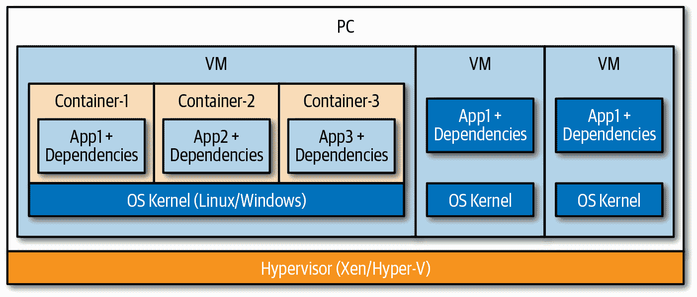
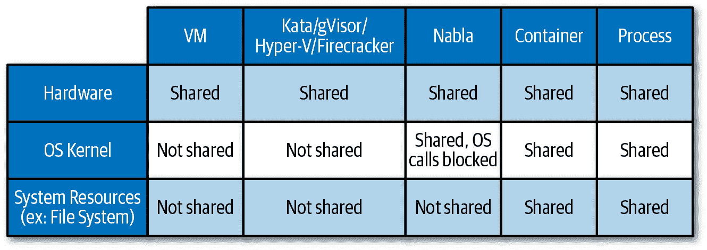
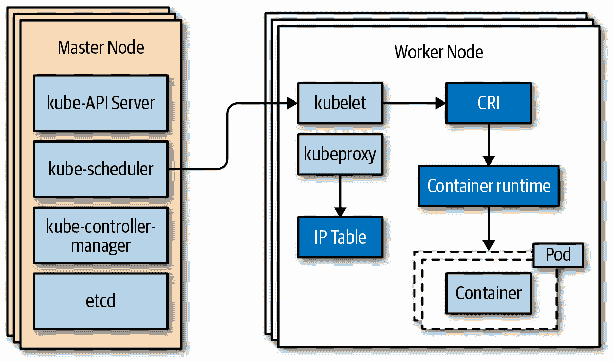
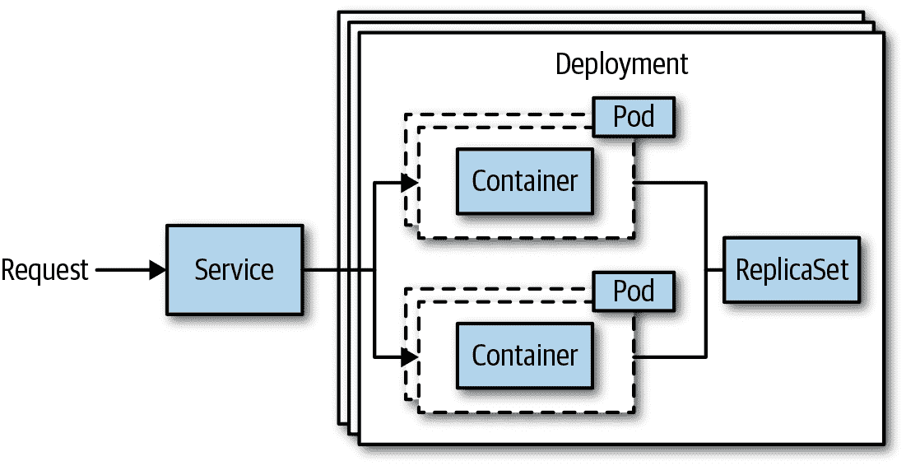
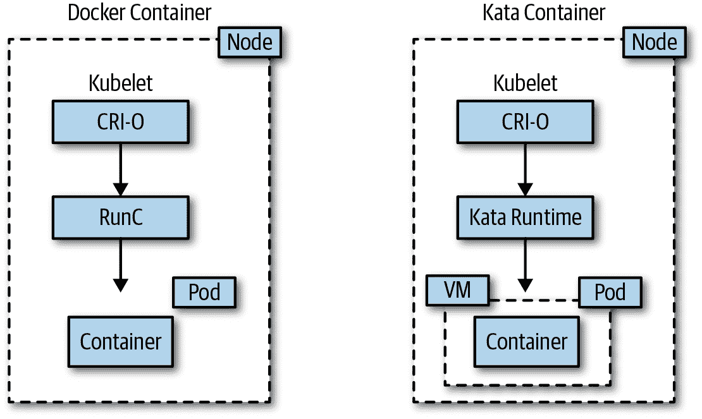
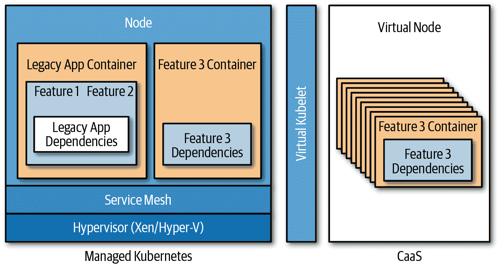
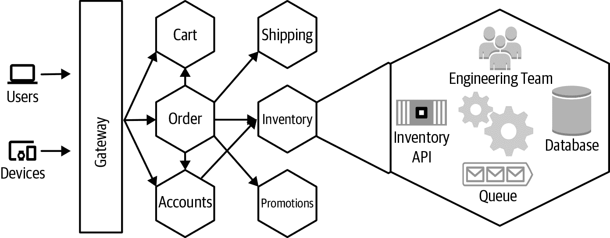

# 第二章：基础知识

正如在第一章中讨论的，云原生应用是分布式的，并利用云基础设施。有许多技术和工具用于实现云原生应用，但从计算角度看，主要是*函数*和*容器*。从架构角度来看，*微服务架构*已经非常流行。往往这些术语被误用，并经常被认为是同一回事。事实上，函数和容器是不同的技术，每种技术都有其特定的用途，而微服务则描述了一种架构风格。因此，了解如何最佳地使用函数和容器，以及*事件*或*消息传递*技术，使开发者能够以最高效和敏捷的方式设计、开发和运行新一代基于云原生微服务的应用程序非常重要。为了做出正确的架构决策来设计这些类型的应用程序，理解基础术语和技术的基础知识至关重要。本章解释了与云原生应用程序一起使用的重要技术，并通过概述微服务架构风格来结束。

# 容器

起初，容器是由创业公司和云原生公司推广的，但在过去几年中，容器已成为应用现代化的代名词。如今，几乎没有公司不在使用容器或至少考虑将来使用容器，这意味着架构师和开发者都需要理解容器提供和不提供的内容。

如今，人们在谈论容器时，大多数时候指的是“Docker 容器”，因为 Docker 确实使容器变得流行起来。然而，在 Linux 操作系统（OS）世界中，容器已有十多年的历史。容器最初的想法是将操作系统切片，以便可以安全地运行多个应用程序而彼此不干扰。这种所需的隔离是通过命名空间和控制组来实现的，这些是 Linux 内核的功能。命名空间允许切片化操作系统的不同组件，从而创建隔离的工作空间。控制组则允许对资源利用进行精细化控制，有效地防止一个容器占用所有系统资源。

由于与内核特性的交互并不完全符合我们所说的开发者友好，Linux 容器（LXC）被引入以抽象化组合现在通常称为“容器”的各种技术基础的复杂性。最终，Docker 通过引入开发者友好的内核特性打包，使容器成为主流。Docker 将容器定义为“标准化的软件单元”。“软件单元”——或者更准确地说，运行在容器内的服务或应用程序——具有对自己独立的操作系统结构的全面私密访问。换句话说，您可以将容器视为封装的、可单独部署的组件，在同一内核上以隔离的实例运行，并在操作系统级别进行虚拟化。

###### 图 2-1\. 单个主机上的 VM 和容器

此外，容器采用写时复制文件系统策略，允许多个容器共享相同的数据，操作系统将数据的副本提供给需要修改或写入数据的容器。这使得容器在内存和磁盘空间使用方面非常轻量化，从而导致更快的启动时间，这是使用容器的重要好处之一。其他好处包括*确定性部署*，允许在不同环境间的可移植性、隔离性以及更高的密度。对于现代云原生应用来说，容器镜像已成为封装应用或服务代码、运行时、依赖关系、系统库等的部署单元。由于它们快速的启动时间，容器成为规模化应用场景的理想技术。图 2-1 展示了单个主机上虚拟机（VMs）和容器之间的区别。

## 容器隔离级别

因为容器基于操作系统虚拟化，在同一主机上运行时它们共享相同的内核。尽管这对大多数场景来说提供了足够的隔离，但它无法达到基于硬件虚拟化选项（例如 VM）提供的隔离级别。以下是将 VM 作为云原生应用基础的一些不足之处：

+   VM 的启动可能需要相当长的时间，因为它们会启动完整的操作系统。

+   VM 的大小可能是一个问题。一个 VM 包含整个操作系统，其大小可能轻易达到几个千兆字节。跨网络复制此映像（例如，如果它们存储在中央映像库中）将需要大量时间。

+   VM 的扩展具有其挑战性。扩展（增加更多资源）需要配置和启动一个新的、更大的 VM（更多的 CPU、内存、存储等）。扩展输出可能不足以快速响应需求；新实例的启动需要时间。

+   VMs 拥有更多的开销，例如内存、CPU 和磁盘资源。这限制了密度，即在单个主机上运行的 VM 数量。

需要在硬件虚拟化级别上实现高隔离的最常见场景是敌对多租户场景，在这些场景中，通常需要防止对同一主机或共享基础设施上其他目标的恶意逃逸和突破尝试。云提供商一直在内部使用技术来提供 VM 级别的隔离，同时保持容器的预期速度和效率。这些技术被称为*Hyper-V 容器*、*沙箱容器*或*MicroVMs*。以下是最流行的 MicroVM 技术（无特定顺序）：

[Nabla 容器](https://nabla-containers.github.io/)

这些技术利用 unikernel 技术实现更好的隔离，具体来自[Solo5 项目](https://github.com/Solo5/solo5)，限制容器对主机内核的系统调用。Nabla 容器运行时（runc）是一个符合 Open Container Initiative（OCI）标准的运行时。稍后本章节将更详细地解释 OCI。

[Google's gVisor](https://github.com/google/gvisor)

这是一个用 Go 语言编写的容器运行时和用户空间内核。这个新内核是一个“用户空间”进程，处理容器的系统调用需求，防止直接与主机操作系统交互。gVisor 运行时（runSC）是一个符合 OCI 规范的运行时，它也支持 Kubernetes 编排。

[Microsoft 的 Hyper-V 容器](https://oreil.ly/5njcd)

几年前引入的 Microsoft 的 Hyper-V 容器基于 VM Worker Process（*vmwp.exe*）。这些容器提供完整的 VM 级隔离，并且符合 OCI 规范。至于在生产环境中在 Kubernetes 中运行[Hyper-V 容器](http://bit.ly/33vZb7U)，你需要等待 Kubernetes 在 Windows 上的普及。

[Kata 容器](https://katacontainers.io/)

Kata 容器结合了 Hyper.sh 和 Intel 的 clear 容器技术，提供经典的硬件辅助虚拟化。Kata 容器兼容 OCI 规范的 Docker 容器和 Kubernetes 的 CRI。

亚马逊的 Firecracker

Firecracker 正在为亚马逊的 Lambda 基础设施提供动力，并且已经在 Apache 2.0 许可下开源。Firecracker 是一个用户态 VM 解决方案，建立在 KVM API 之上，旨在以类似于 Kata 容器等更隔离的容器技术的方式运行现代 Linux 内核。请注意，截至目前，无法在 Kubernetes、Docker 或 Kata 容器中使用 Firecracker。

Figure 2-2 提供了这些技术的隔离级别概述。

###### 图 2-2\. 虚拟机、容器和进程的隔离级别

## 容器编排

要管理规模化的容器生命周期，您需要使用容器编排器。容器编排器的任务如下：

+   向集群节点上的容器进行供应和部署

+   容器资源管理，即将容器放置在提供足够资源的节点上，或者在节点资源限制达到时将容器移动到其他节点

+   对容器和节点进行健康监控，以便在容器或节点级别出现故障时进行重新启动和重新调度

+   在集群中缩放容器的数量

+   提供容器连接网络的映射

+   容器间的内部负载均衡

当前存在多种容器编排器，但毫无疑问 Kubernetes 是管理集群和调度容器工作负载的最受欢迎选择。

## Kubernetes 概述

Kubernetes（通常简称为 k8s）是一个用于运行和管理容器的开源项目。Google 在 2014 年开源了该项目，Kubernetes 通常被视为容器平台、微服务平台和/或云可移植性层。所有主要的云供应商今天都提供托管的 Kubernetes 服务。

Kubernetes 集群运行多个组件，可以分为三类：*主控组件*、*节点组件*或*插件*。主控组件提供集群控制平面。这些组件负责做出整个集群范围的决策，如在集群中调度任务或响应事件，例如如果一个任务失败或不符合所需副本数量，则启动新任务。主控组件可以运行在集群的任何节点上，但通常部署在专用的主节点上。云供应商提供的托管 Kubernetes 服务将处理控制平面的管理，包括按需升级和补丁。

Kubernetes 主控组件包括以下内容：

kube-apiserver

提供 Kubernetes API，是 Kubernetes 控制平面的前端

etcd

用于存储所有集群数据的键/值存储

kube-scheduler

监视新创建的*pods*（Kubernetes 中特定管理容器的封装，稍后在本章节详细解释）是否已分配到节点，并找到可用节点

kube-controller-manager

管理一些控制器，负责响应宕机节点或维持正确数量的副本

cloud-controller-manager

运行与底层云提供商交互的控制器

节点组件在集群中的每个节点上运行，也称为*数据平面*，负责维护运行中的 Pod 和部署到节点的环境。

Kubernetes 节点组件包括以下内容：

kubelet

在集群中每个节点上运行的代理，负责根据其 pod 规范在 pods 中运行容器

kube-proxy

在节点上维护网络规则并执行连接转发

容器运行时

负责运行容器的软件（参见 “Kubernetes and Containers”）

图 2-3 展示了 Kubernetes 主控节点和工作节点组件。

###### 图 2-3\. Kubernetes 主控节点和工作节点组件

Kubernetes 通常与由主控节点和工作节点组件管理的插件一起部署。这些插件包括域名系统（DNS）和管理用户界面（UI）等服务。

本书不涉及 Kubernetes 的深入讨论。然而，有一些基本概念对您理解是很重要的：

Pods

Pod 基本上是围绕一个或多个容器、存储资源或唯一网络 IP 的管理包装器，管理容器的生命周期。尽管 Kubernetes 支持每个 pod 多个容器，但大多数情况下每个 pod 只有一个应用程序容器。也就是说，“sidecar 容器”模式非常流行，它扩展或增强应用程序容器的功能。像 Istio 这样的服务网格大量依赖 sidecars，如您可以在 第三章 中看到的那样。

服务

Kubernetes 服务为集群上运行的一组 pods 提供稳定的端点。Kubernetes 使用标签选择器标识服务的目标 pods。

ReplicaSets

最简单的方式来理解 ReplicaSets 就是将其视为服务实例。您基本上定义了需要多少个 pod 的副本，Kubernetes 确保在任何给定时间内都有这些副本在运行。

Deployments

Kubernetes 部署文档说明，“您可以使用 Deployment 对象描述所需的状态，部署控制器以受控速率将实际状态更改为所需状态。” 换句话说，您应该使用 Deployments 来逐步推出和监控 ReplicaSets，扩展 ReplicaSets，更新 pods，回滚到早期的 Deployment 版本，并清理旧的 ReplicaSets。

图 2-4 展示了基本 Kubernetes 概念的逻辑视图及其相互作用。

###### 图 2-4\. 基本 Kubernetes 概念

## Kubernetes 和容器

Kubernetes 只是容器的编排平台，因此需要一个容器运行时来管理容器的生命周期。从一开始，Kubernetes 就支持 Docker 运行时，但市场上并非只有 Docker 运行时可用。因此，Kubernetes 社区推动了一种通用的方法来集成容器运行时到 Kubernetes 中。接口已被证明是在两个系统之间提供契约的良好软件模式，因此社区创建了 [容器运行时接口 (CRI)](http://bit.ly/31y3pdC)。CRI 避免了将特定的运行时需求硬编码到 Kubernetes 代码库中的问题，因此当容器运行时发生更改时，总是需要更新 Kubernetes 代码库。相反，CRI 描述了容器运行时必须实现的功能。CRI 描述的功能包括处理容器 pod 的生命周期（启动、停止、暂停、杀死、删除）、容器镜像管理（例如从注册表下载镜像）以及一些辅助功能，如日志和指标收集以及网络功能。图 2-5 展示了 Docker 和 Kata 容器的高级 CRI 示例架构。

###### 图 2-5\. Docker versus Kata container on Kubernetes

以下列表提供了其他可能有用的与容器相关的技术：

OCI

OCI 是一个由 [Linux Foundation](https://en.wikipedia.org/wiki/Linux_Foundation) 推动的项目，旨在设计容器镜像和运行时的开放标准。许多容器技术实现了兼容 OCI 的运行时和镜像规范。

containerd

containerd 是一个行业标准的容器运行时，被 Docker 和 Kubernetes CRI 使用，仅举两个最流行的例子。它作为 Linux 和 Windows 的守护程序可用，可以管理其主机系统的完整容器生命周期，包括容器镜像管理、容器执行、底层存储和网络附加。

Moby

Moby 是由 Docker 创建的一组开源工具，旨在实现和加速软件容器化。这套工具包括容器构建工具、容器注册表、编排工具、运行时等等，你可以将其作为其他工具和项目的构建模块。Moby 使用 containerd 作为默认的容器运行时。

# 无服务器计算

无服务器计算意味着规模和基础架构由云提供商管理；也就是说，您的应用程序自动驱动资源的分配和释放，您无需担心管理底层基础设施。所有管理和操作都被从用户身上抽象出来，并由微软 Azure、亚马逊 AWS 和谷歌云平台等云提供商管理。从开发者的角度来看，无服务器通常添加了事件驱动的编程模型；从经济学的角度来看，您只需按执行付费（消耗的 CPU 时间）。

许多人认为函数即服务（FaaS）是无服务器的。从技术上讲，这是正确的，但 FaaS 只是无服务器计算的一种变体。微软 Azure 的容器实例（ACI）和 Azure SF Mesh，以及 AWS Fargate 和 GCP 的云函数上的无服务器容器，都是很好的例子。ACI 和 AWS Fargate 也是被称为容器即服务（CaaS）的无服务器容器提供，允许您部署容器化应用程序而无需了解底层基础设施。无服务器提供的其他示例包括 API 管理和机器学习服务，基本上，任何让您消耗功能而不必管理底层基础设施，并且采用按使用量付费模式的服务都属于无服务器提供。

# 函数

当谈论函数时，人们通常会谈论诸如 AWS Lambda、Azure Functions 和 Google Cloud Functions 等 FaaS 提供的服务，这些服务是在无服务器基础设施上实现的。无服务器计算的优势——快速启动和执行时间，以及简化应用程序——使 FaaS 提供非常吸引开发者，因为它允许他们专注于编写代码。

从开发的角度来看，函数是工作的单元，这意味着您的代码有一个开始和一个结束。函数通常由其他函数或平台服务发出的事件触发。例如，可以通过向数据库服务或事件服务添加条目来触发函数。当您希望建立一个仅仅依靠函数构建的大型复杂应用程序时，需要考虑的事情还有很多。您将需要管理更多独立的代码，确保状态被处理，如果函数必须相互依赖，您将需要实现模式，这只是其中的几个。容器化微服务共享很多相同的模式，因此关于何时使用 FaaS 或容器已经进行了很多讨论。表 2-1 提供了 FaaS 和容器之间的一些高级指导，而第 3 章更详细地讨论了其中的权衡。

表 2-1\. FaaS 和容器化服务的比较

| FaaS | 容器化服务 |
| --- | --- |
| 只做一件事 | 做多于一件事 |
| 无法部署依赖 | 可以部署依赖 |
| 必须响应一种事件 | 可以响应多种事件 |

使用 FaaS 提供的服务可能并不总是理想的两种情况。尽管它提供了最好的经济性，但首先，你需要避免供应商锁定。因为你需要根据 FaaS 提供的服务来开发你的函数，并且使用提供商的更高级云服务，这使得整个应用程序变得不太可移植。其次，你可能希望在本地或自己的集群上运行函数。有许多开源的 FaaS 运行时可用，并且可以在任何 Kubernetes 集群上运行。Kubeless、OpenFaaS、Serverless 和 Apache OpenWhisk 是最受欢迎的可安装 FaaS 平台，Azure Functions 自开源以来也越来越受欢迎。可安装的 FaaS 平台通常通过容器部署，并允许开发人员简单地部署小段代码（函数），而不必担心底层基础设施。许多可安装的 FaaS 框架使用 Kubernetes 资源进行路由、自动缩放和监控。

任何 FaaS 实现的关键方面，无论它是在云提供商的无服务器基础设施上运行还是安装在你自己的集群上，都是启动时间。通常情况下，你希望函数在被触发后能够非常快速地执行，这意味着它们的底层技术需要提供非常快的启动时间。正如前面讨论的，容器提供良好的启动时间，但并不一定提供最佳的隔离性。

# 从虚拟机到云原生

要理解我们是如何进入下一代云原生应用的，值得看一看应用程序是如何从运行在虚拟机上到函数上演变的过程。描述这一旅程应该能够给你一个很好的想法，即 IT 行业正在如何转变以提升开发者的生产力，以及如何利用所有新技术的优势。云原生世界真的有两条不同的路径。第一条主要用于*现有场景*，这意味着你有一个现有的应用程序，并且通常遵循搬迁和升级，最终进行优化的过程。第二条是*新建场景*，在这种情况下，你可以从头开始创建你的应用程序。

## 搬迁和升级

直接在云中的机器上安装软件仍然是许多客户迁移到云的第一步。主要好处在于资本和运营费用领域，因为客户不需要运营自己的数据中心，或者至少可以减少运营成本。从技术角度来看，将应用程序迁移到基础设施即服务（IaaS）中可以让您对整个堆栈拥有最大的控制权。控制权伴随责任，直接在机器上安装软件通常会导致由于缺少依赖项、运行时版本冲突、资源争用和隔离而导致的错误。下一个合乎逻辑的步骤是将应用程序迁移到平台即服务（PaaS）环境中。在容器变得流行之前，PaaS 已经存在很久；例如，Azure 云服务可以追溯到 2010 年。在大多数过去的 PaaS 环境中，对底层虚拟机的访问受到限制，或者在某些情况下被禁止，因此迁移到云端需要对应用程序进行一些重写。对开发人员的好处在于不再需要担心底层基础设施。云提供商会处理操作任务，如打补丁操作系统，但一些问题，如缺少依赖项，仍然存在。由于许多 PaaS 服务基于虚拟机，因此在突发情况下进行扩展仍然是一个挑战，这是由于之前讨论过的虚拟机的缺点，以及出于经济原因。

## 应用现代化

除了提供超快的启动时间外，容器还极大地消除了缺少依赖项的问题，因为应用程序所需的一切都打包在容器内。开发人员很快就开始喜欢容器作为一种打包格式的概念，现在几乎每个新应用程序都在使用容器，越来越多的单体遗留应用程序正在被容器化。许多客户将现有应用程序的容器化视为一个机会，也可以迁移到更适合云原生环境的架构。微服务是显而易见的选择，但正如您将在本章后面看到的，迁移到这样的架构也带来了一些缺点。然而，有几个非常明显的原因，您希望拆分您的单体应用：

+   部署时间更快。

+   某些组件需要比其他组件更频繁地更新。

+   某些组件需要不同的规模要求。

+   某些组件应该采用不同的技术进行开发。

+   代码库变得太庞大和复杂。

尽管拆分单体应用的方法论超出了本书的范围，但值得一提的是从单体应用迁移到微服务的两种主要模式。

*Strangler* 模式

使用“Strangler”模式，你逐步重构单体应用程序。新服务或现有组件被实现为微服务。一个门面或者网关将用户请求路由到正确的应用程序。随着时间的推移，越来越多的功能被转移到新的架构中，直到单体应用程序完全转变为微服务应用程序。

*防腐层*模式

当新服务需要访问旧应用程序时，类似于 Strangler 模式。该层将现有应用程序的概念转换为新的概念，反之亦然。

我们在第六章中更详细地描述了这些模式。

随着应用程序被打包为容器镜像，编排器开始扮演更重要的角色。尽管一开始有几种选择，但 Kubernetes 如今已成为最流行的选择；事实上，它被视为新的云操作系统。然而，编排器为开发和运维团队增加了另一个变量。环境管理部分变得更好了，因为几乎每个云供应商现在都提供“编排器即服务”。与任何云提供商一样，“托管” Kubernetes 意味着 Kubernetes 服务的设置和运行时部分是由供应商管理的。从经济学角度来看，用户通常按计算小时付费，这意味着只要集群节点运行，即使应用程序可能处于空闲状态或低资源利用率，也会产生费用。

从开发者的角度来看，如果你想在其上构建微服务应用程序，你仍然需要了解 Kubernetes 的工作原理，因为 Kubernetes 默认不提供任何平台即服务（PaaS）或容器即服务（CaaS）功能。

例如，Kubernetes 服务并不真正代表容器内的服务代码，它只是为其提供一个端点，以便始终可以通过相同的端点访问容器内的代码。除了需要理解 Kubernetes 外，开发人员还开始接触处理弹性、诊断和路由等分布式系统模式。

诸如 Istio 或 Linkerd 的服务网格因将部分分布式系统复杂性移到平台层而日益流行。第三章详细介绍了服务网格，但现在你可以将服务网格看作是一个专用的网络基础设施层，用于处理服务间的通信。服务网格除了其他功能外，还支持重试、熔断器、分布式跟踪和路由等弹性特性。

应用演进的下一步是使用无服务器基础设施来处理容器化工作负载，即 CaaS 提供的解决方案，如 Azure 容器实例或 AWS Fargate。微软 Azure 在将其托管的 Kubernetes 服务（AKS）与其 CaaS 提供的 ACI 融合方面做得非常出色，通过使用*虚拟节点*。虚拟节点基于微软的开源项目 Virtual Kubelet，它允许任何计算资源充当 Kubernetes 节点并使用 Kubernetes 控制平面。对于 AKS 虚拟节点而言，您可以将应用程序调度到 AKS 并在需要扩展的情况下无需设置额外的节点即可扩展到 ACI。图 2-6 显示了现有的单片应用程序（Legacy App）如何被拆分为更小的微服务（Feature 3）。遗留应用程序和新的微服务（Feature 3）位于 Kubernetes 上的服务网格中。在这种情况下，Feature 3 具有独立的扩展需求，并且可以使用 Virtual Kubelet 扩展到 CaaS 提供的环境中。

###### 图 2-6\. 使用 Virtual Kubelet 将 Feature 3 扩展到 CaaS 中的现代化应用程序

## 应用程序优化

下一步是不仅在成本优化方面进一步优化应用程序，还包括代码优化。函数在短期计算场景（如更新记录、发送电子邮件、转换消息等）中表现出色。要利用函数，您可以在服务代码库中识别出短期计算功能，并使用函数来实现。一个很好的例子是订单服务，其中容器化微服务执行所有的创建、读取、更新和删除（CRUD）操作，而函数则发送成功下单的通知。为了触发函数，通常使用事件或消息系统。最终，您可以决定使用函数构建整个订单服务，每个函数执行 CRUD 操作中的一个。

# 微服务

"微服务" 是一个常用术语，用来指代微服务架构风格或微服务架构中的各个服务。微服务架构是一种面向服务的架构，其中应用程序根据功能领域被分解为小型、松耦合的服务。服务保持相对较小、松耦合，并围绕业务能力进行分解是非常重要的。

微服务架构通常与单体架构进行比较和对比。与单体架构管理单一代码库和共享数据存储和数据结构不同，在微服务架构中，一个应用程序由由独立团队创建和管理的更小的代码库组成。每个服务由一个小团队拥有和操作，服务的所有元素都贡献于一个单一明确定义的任务。服务在单独的进程中运行，并通过同步或异步基于消息的 API 进行通信。

每个服务都可以被视为具有独立团队、测试、构建、数据和部署的独立应用程序。图 2-7 展示了微服务架构的概念，以库存服务为例。

###### 图 2-7\. 微服务架构中的库存服务

## 微服务架构的优点

一个正确实施的微服务架构将增加大型应用程序的发布速度，使企业能够更快、更可靠地为客户提供价值。

### 敏捷性

大型的单体应用程序可能会面临快速、可靠的部署挑战。对一个特性区域的模块进行小改动的部署可能会受到对另一个特性的改动的影响。随着应用程序的增长，应用程序的测试将增加，并且要向利益相关者交付新的价值可能需要相当长的时间。对一个特性的更改将要求整个应用程序被重新部署并前进或后退，如果出现问题。通过将应用程序分解为更小的服务，可以减少验证和发布变更所需的时间，并更可靠地进行部署。

### 持续创新

企业需要更快地移动，以保持今天的相关性。这要求组织具备敏捷性，并能够快速适应快速变化的市场条件。企业不能再等待数年或数月来为客户提供新的价值：他们通常必须每天交付新的价值。微服务架构可以更容易地以可靠的方式向利益相关者交付价值。小而独立的团队能够发布功能，并在繁忙时期进行 A/B 测试以改进转化率或用户体验。

### 进化设计

在大型单体应用中，很难采用新技术或技术，因为这通常要求整个应用程序被重写，或者需要确保某些新依赖可以与之前的依赖并行运行。松散耦合和高功能内聚对于能够通过变化的技术进行演变的系统设计非常重要。通过将应用程序按特性分解为小型、松散耦合的服务，可以更轻松地修改单个服务而不影响整个应用程序。如果需要支持业务，可以在不同服务之间使用不同的语言、框架和库。

### 小而专注的团队

在规模化构建工程团队并保持他们专注和高效可能是具有挑战性的。如果你正在构建的内容与其他人正在构建的内容紧密相连，那么让人们负责设计、运行和操作他们构建的内容也可能会很具有挑战性。新团队成员有时需要花费几天、几周，甚至几个月的时间才能迅速上手并开始贡献，因为他们需要理解与他们关注领域无关的系统方面。通过将应用程序分解为较小的服务，小敏捷团队能够专注于较小的关注点并快速迭代。新成员加入时也会更容易，因为他们只需关注较小的一个服务。团队成员可以更容易地运行和对他们构建的服务负责。

### 故障隔离

在单体应用中，一个单一的库或模块可能会对整个应用程序造成问题。一个模块中的内存泄漏不仅会影响整个应用程序的稳定性和性能，而且往往很难隔离和识别。通过将应用程序的特性分解为独立服务，团队可以将一个服务中的缺陷隔离到该服务中。

### 改进的规模和资源使用

应用通常是通过增加机器的大小或类型来进行扩展，也可以通过增加部署的实例数量并在这些实例之间路由用户来进行扩展。应用程序的不同特性有时会有不同的资源需求；例如内存、CPU、磁盘等。应用程序的不同特性通常会有不同的规模需求。一些特性可能可以轻松地通过很少的资源在每个实例上进行扩展，而其他特性可能需要大量内存，且能力有限以进行扩展。通过将这些特性解耦为独立服务，团队可以配置这些服务在最符合服务、个体资源和规模需求的环境中运行。

### 改进的可观察性

在单体应用程序中，如果不对整个应用程序进行仔细和详细的仪表化，很难测量和观察应用程序的各个组件。通过将应用程序的特性分解为单独的服务，团队可以使用工具更深入地了解各个特性的行为以及与其他特性的交互。例如，系统指标如进程利用率和内存使用现在可以轻松地与特性团队关联起来，因为它们运行在单独的进程或容器中。

## 微服务架构的挑战

尽管微服务架构带来了诸多好处，但也存在权衡和挑战。工具和技术已经开始解决其中一些挑战，但许多挑战仍然存在。对于所有应用程序来说，微服务架构可能并非今天的最佳选择，但我们仍然可以将许多概念和实践应用于其他架构中。最佳方法通常介于两者之间。

### 复杂性

分布式系统本质上复杂。当我们将应用程序分解为单独的服务时，网络调用是这些服务之间通信的必要手段。网络调用会增加延迟，并可能经历暂时性故障，而且运行在不同机器上的操作可能具有不同的时钟，每个时钟对当前时间有稍微不同的感知。我们不能假设网络是可靠的，延迟为零，带宽是无限的，网络是安全的，拓扑结构不会改变，有一个管理员，传输成本为零，并且网络是同质化的。许多开发人员对分布式系统不熟悉，并且在进入这个领域时常常做出错误的假设。*分布式计算的谬误*，正如在第一章中讨论的那样，是一组描述开发人员常犯的这些错误假设的声明。这些错误首次由 L. Peter Deutsch 和其他 Sun Microsystems 工程师记录，并在众多博客文章中进行了讨论。第六章提供了处理分布式系统复杂性的最佳实践、工具和技术的更多信息。

### 数据完整性和一致性

分散化的数据意味着数据通常存在于多个地方，并且跨不同系统存在关系。在这些系统之间执行事务可能会很困难，我们需要采用不同的数据管理方法。一个服务可能与另一个服务中的数据存在关联；例如，订单服务可能会引用帐户服务中的客户。为了满足某些性能要求，数据可能已经从帐户服务复制过来。如果客户被删除或禁用，则订单服务更新指示此状态可能很重要。处理数据将需要不同的方法。第四章涵盖了处理这些情况的模式。

### 性能

网络请求和数据序列化会增加额外开销。在基于微服务的架构中，网络请求的数量将会增加。请记住，组件是不再直接调用的库；而是通过网络进行调用。对一个服务的调用可能会导致对其他依赖服务的调用。为了满足原始请求，可能需要向多个服务发送多个请求。我们可以实施一些模式和最佳实践，以减轻微服务架构中潜在的性能开销，这些内容将在第六章中介绍。

### 开发和测试

开发可能会更具挑战性，因为今天使用的工具和实践方法不适用于微服务架构。考虑到变化的速度以及存在更多外部依赖的事实，运行与生产环境中运行的依赖服务版本完全一致的完整测试套件可能会很具挑战性。我们可以采用不同的测试方法来解决这些挑战，而且将需要一个适当的持续集成/持续部署（CI/CD）流水线。多年来，开发工具和测试策略已经在演变，以更好地适应微服务架构。第五章涵盖了许多工具、技术和最佳实践。

### 版本控制和集成

在单体应用程序中更改接口可能需要进行一些重构，但更改通常作为一个单一的统一单元构建、测试和部署。在微服务架构中，服务的依赖关系是在独立演化和变化的。在处理服务版本控制时，需要特别注意前向和后向兼容性。除了与服务更改保持前向和后向兼容性之外，还可能需要在一段时间内与之前版本并存并在旁边运行完全新的服务版本。第五章探讨了服务版本控制和集成策略。

### 监控和日志记录

许多组织在监视和记录单体应用程序时遇到困难，即使它们使用了共享的日志记录库。名称、数据类型和值的不一致性使得相关日志事件的关联变得困难。在微服务架构中，当相关事件跨越多个服务时——每个服务可能使用不同的日志记录实现——关联这些事件可能会更加具有挑战性。计划并早期关注日志记录和监视的重要性可以帮助解决其中大部分问题，我们将在第五章进行详细探讨。

### 服务依赖管理

使用单体应用程序时，通常会将对库的依赖项编译到单个包中并进行测试。在微服务架构中，服务依赖关系的管理方式不同，需要特定于环境的路由和发现。在解决这些挑战方面，服务发现和路由工具和技术已经取得了长足的进步。第三章深入探讨了这些内容。

### 可用性

尽管微服务架构可以帮助将故障隔离到单个服务，但如果其他服务或整个应用程序无法在没有该服务的情况下运行，则应用程序将无法使用。随着服务数量的增加，某个服务遇到故障的可能性也增加。服务将需要实施弹性设计模式，或在服务故障时降低某些功能。第六章涵盖了构建高可用应用程序的模式和最佳实践，并详细讨论了具体的挑战。

# 总结

每个应用程序，无论是云原生还是传统的，都需要基础设施来托管，技术来解决开发和部署中的痛点，以及能够帮助实现业务目标的架构风格，如市场投放时间。本章的目标是为云原生应用程序提供基础知识。到目前为止，您应该了解到有各种容器技术具有不同的隔离级别，函数如何与容器相关联，以及无服务器基础设施并不总是需要函数即服务。此外，您应该对微服务架构有基本的理解，以及如何将现有应用程序迁移到云原生应用程序。

即将到来的章节将在此基础上深入探讨如何设计、开发和运营云原生应用程序。
