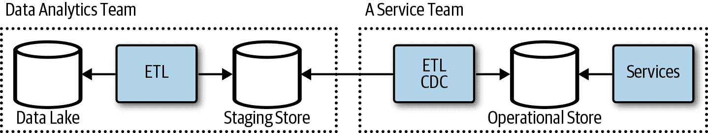

# 第四章：数据处理

云计算已经对我们今天的软件构建和操作方式产生了重大影响，包括我们处理数据的方式。存储数据的成本显著降低，使得公司可以更便宜、更可行地保留大量数据。随着托管和无服务器数据存储服务的出现，数据库系统的运营开销大幅减少。这使得数据更容易分布到不同的数据存储类型中，将数据放入更适合管理存储的系统中。微服务架构的趋势鼓励数据的去中心化，将应用程序的数据分布到多个服务中，每个服务都有自己的数据存储。数据复制和分区是扩展系统的常见做法。图 4-1 显示了典型架构将包含多个数据存储系统，并在它们之间分布数据。在一个数据存储中存储的数据通常是从另一个存储中的数据复制而来，或者与另一个存储中的数据有某种关系。

云原生应用充分利用托管和无服务器数据存储和处理服务。所有主要的公共云提供商都提供多种不同的托管服务来存储、处理和分析数据。除了云提供商提供的托管数据库服务外，一些公司还在您选择的云提供商上提供托管数据库。例如，MongoDB 提供了一种名为 MongoDB Atlas 的云托管数据库服务，可在亚马逊云服务（AWS）、微软 Azure 和谷歌云平台（GCP）上使用。通过使用托管数据库，团队可以专注于构建使用数据库的应用程序，而不是花费时间进行底层数据系统的预配和管理。

###### 图 4-1\. 数据通常分布在多个数据系统中

###### 注意

*无服务器数据库* 是一种术语，用来指代一种按使用量计费的托管数据库类型，客户根据存储和处理的数据量收费。这意味着如果数据库没有被访问，用户仅需支付存储数据的费用。当数据库执行操作时，用户要么按特定操作收费，要么在操作处理过程中从零开始并进行扩展。

云原生应用充分利用云的所有优势，包括使用的数据系统。以下是用于数据的云原生应用程序特征列表：

+   更喜欢托管的数据存储和分析服务。

+   使用多语言持久性、数据分区和缓存。

+   接受最终一致性，在必要时使用强一致性。

+   更喜欢云原生数据库，它们能够横向扩展、容忍故障，并优化云存储。

+   处理分布在多个数据存储中的数据。

云原生应用程序通常需要处理数据的数据孤立，这需要一种与数据处理不同的方法。使用多语言持久性、分散式数据和数据分区有许多好处，但也有权衡和考虑因素。

# 数据存储系统

有越来越多的选项可用于存储和处理数据。在构建应用程序时，确定使用哪些产品可能很难。团队有时会进行多次迭代评估语言、框架和将在应用程序中使用的数据存储系统。许多人仍然不确定他们是否做出了正确的决定，这些存储系统通常会随着应用程序的演变而被替换或添加新的存储系统。

在决定使用哪些产品时，了解各种类型的数据存储和它们优化的工作负载可能会有所帮助。然而，许多产品都是多模型的，并且设计为支持多个数据模型，属于多个数据存储分类。应用程序通常会利用多个数据存储系统，将文件存储在对象存储中，将数据写入关系数据库，并使用内存键/值存储进行缓存。

## 对象、文件和磁盘

每个公共云服务提供商都提供一个廉价的*对象存储服务*。对象存储服务将数据管理为对象。对象通常存储有对象的元数据和作为对象引用的键。文件存储服务通常通过传统的文件共享模型提供文件的共享访问，具有分层目录结构。磁盘或块存储提供计算实例使用的磁盘卷的存储。决定存储图像、文档、内容和基因组数据文件等文件的位置，很大程度上取决于访问它们的系统。以下每种存储类型更适合不同类型的文件：

###### 注意

你应该优先选择对象存储来存储文件数据。对象存储相对便宜、极其耐用且高度可用。所有主要的云服务提供商都提供不同的存储层级，可根据数据访问需求实现成本节约。

对象/块存储

+   当访问数据的应用程序支持云服务提供商的 API 时，应与文件一起使用。

+   它价格低廉且可以存储大量数据。

+   应用程序需要实现云提供商的 API。如果应用程序可移植性是一个要求，请参阅第七章。

文件存储

+   当设计支持网络附加存储（NAS）的应用程序时，应与之一起使用。

+   当使用需要共享文件访问的库或服务时，请使用它。

+   它比对象存储更昂贵。

磁盘（块）存储

+   将其用于假设持久本地存储磁盘的应用程序，例如 MongoDB 或 MySQL 数据库。

除了各种云服务提供商管理的文件和对象存储选项外，您还可以提供分布式文件系统。Hadoop 分布式文件系统（HDFS）在大数据分析中非常流行。分布式文件系统可以使用云提供商的磁盘或块存储服务。许多云提供商还为流行的分布式文件系统提供了管理服务，其中包括使用的分析工具。在使用与它们兼容的分析工具时，您应考虑这些文件系统。

## 数据库

数据库通常用于存储更结构化、有明确定义格式的数据。在过去几年中发布了许多数据库，并且可供我们选择的数据库数量每年都在增加。许多这些数据库都是为特定类型的数据模型和工作负载设计的。其中一些支持多个模型，并经常被标记为*多模型数据库*。在考虑在应用程序中使用哪个数据库时，将数据库组织成一组或分类是有帮助的。

### 键/值

经常情况下，应用程序数据需要仅使用主键或甚至部分主键来检索。键/值存储可以被视为一个简单存储一些值在唯一键下的大型哈希表。可以非常有效地使用键或在某些情况下使用部分键来检索值。因为值对于数据库来说是不透明的，消费者需要逐条记录扫描以查找基于值的项目。键/值数据库中的键可以由多个元素组成，甚至可以进行排序以实现高效的查找。一些键/值数据库允许使用键前缀进行查找，从而可以使用复合键。如果数据可以基于某些简单键的嵌套进行查询，这可能是一个合适的选项。如果我们在键/值存储中存储客户 xyz 的订单，我们可以使用客户 ID 作为键前缀，后跟订单号“xyz-1001”。可以使用整个键来检索特定订单，而使用“xyz”前缀可以检索客户 xyz 的订单。

###### 注意

键/值数据库通常是价格便宜且非常可扩展的数据存储。键/值数据存储服务能够根据键来分区甚至重新分区数据。在使用这些数据存储时选择键是很重要的，因为它将对数据存储的规模和性能读写产生显著影响。

### 文档

文档数据库类似于键/值数据库，它通过主键存储文档（值）。与键/值数据库不同的是，文档数据库中的文档需要符合某些定义的结构。这样可以实现维护辅助索引和根据文档查询数据等功能。文档数据库中通常存储的值是哈希映射（JSON 对象）和列表（JSON 数组）的组合。JSON 是文档数据库中常用的格式，尽管许多数据库引擎使用更高效的内部存储格式，如 MongoDB 的 BSON。

###### 提示

当从关系数据库过渡到面向文档的数据库时，您需要以不同的方式考虑如何组织数据。许多人需要时间来适应这种不同的数据建模方法。

您可以使用这些数据库存储传统上存储在关系数据库（如 PostgreSQL）中的许多数据。它们在流行度上正在增长，并且与关系数据库不同，文档在编程语言中的对象映射得很好，不需要对象关系映射（ORM）工具。这些数据库通常不强制执行模式，在软件变更要求数据模式更改的持续交付（CD）方面具有一些优势。

###### 注意

不强制执行模式的数据库通常被称为“读取时模式”，因为尽管数据库不强制执行模式，但应用程序中存在隐含的模式，并且需要知道如何处理返回的数据。

### 关系

关系数据库将数据组织成称为表的二维结构，由列和行组成。一个表中的数据可以与另一个表中的数据有关联，数据库系统可以强制执行这种关系。关系数据库通常强制执行严格的模式，也称为*写入时模式*，即向数据库写入数据的消费者必须符合数据库中定义的模式。

关系数据库存在已久，许多开发人员有使用它们的经验。截至今天，最受欢迎和常用的数据库仍然是关系数据库。这些数据库非常成熟，对于包含大量关系的数据非常有效，并且有大量的工具和应用程序生态系统知道如何处理它们。*多对多关系*在文档数据库中可能难以处理，但在关系数据库中非常简单。如果应用程序数据有许多关系，特别是那些需要事务的关系，这些数据库可能非常适合。

### 图

图数据库存储两种类型的信息：*边* 和 *节点*。边定义节点之间的关系，你可以将节点视为实体。节点和边都可以具有描述特定边或节点的属性。边通常定义关系的方向或性质。图数据库在分析实体之间的关系方面表现良好。图数据可以存储在其他任何数据库中，但当图遍历变得越来越复杂时，在其他存储类型中满足图数据的性能和规模要求可能会有挑战。

### 列族

列族数据库将数据组织成行和列，最初可能看起来与关系数据库非常相似。你可以把列族数据库看作是带有行和列的表格数据，但列被划分为称为列族的组。每个列族包含一组逻辑相关的列，通常作为一个单元进行检索或操作。可以将单独访问的其他数据存储在单独的列族中。在列族中，可以动态添加新列，行可以是稀疏的（即，行不需要为每一列都有值）。

### 时间序列

时间序列数据是针对时间进行优化的数据库，根据时间存储值。这些数据库通常需要支持非常高数量的写入操作。它们通常用于实时从大量来源收集大量数据。对数据的更新很少，删除通常是批量完成的。写入时间序列数据库的记录通常非常小，但通常有大量记录。时间序列数据库非常适合存储遥测数据。常见用途包括物联网（IoT）传感器或应用程序/系统计数器。时间序列数据库通常包含用于数据保留、降采样以及根据配置数据使用模式将数据存储在不同介质中的功能。

### 搜索

搜索引擎数据库通常用于搜索其他数据存储和服务中保存的信息。搜索引擎数据库可以索引大量数据，并几乎实时访问索引。除了搜索类似网页中的非结构化数据外，许多应用程序还使用它们在另一个数据库的数据上提供结构化和特定查询的搜索功能。某些数据库具有全文索引功能，但搜索数据库还能通过词干提取和规范化将单词减少到它们的根形式。

## 流和队列

流和队列是存储事件和消息的数据存储系统。虽然它们有时用于相同的目的，但它们是非常不同类型的系统。在事件流中，数据以不可变的事件流形式存储。消费者能够在特定位置读取流中的事件，但无法修改事件或流。您不能从流中删除或删除单个事件。消息队列或主题将存储可以更改（变异）的消息，并且可以从队列中删除单个消息。流非常适合记录一系列事件，流处理系统通常能够存储和处理大量数据。队列或主题非常适合不同服务之间的消息传递，这些系统通常设计用于可以更改和随机删除的消息的短期存储。本章更多地关注流，因为它们在数据系统中更常用，而队列更常用于服务通信。有关队列的更多信息，请参见第三章。

###### 注意

主题是发布-订阅消息模型中使用的概念。主题和队列唯一的区别在于队列上的消息发送给一个订阅者，而主题上的消息将发送给多个订阅者。您可以将队列视为只有一个订阅者的主题。

## 区块链

记录在区块链上以一种不可变的方式存储。记录被分组在一个*区块*中，每个区块包含数据库中的若干记录。每次创建新记录时，它们被组合成一个单独的区块并添加到链中。使用哈希将区块链接在一起，以确保它们不被篡改。对区块中数据的最轻微更改都会改变哈希值。每个区块的哈希存储在下一个区块的开头，确保没有人可以改变或移除链中的区块。尽管区块链可以像任何其他集中式数据库一样使用，但通常是去中心化的，从而削弱了中央组织的权力。

## 选择数据存储

在选择数据存储时，您需要考虑一些要求。选择数据存储技术和服务可能非常具有挑战性，特别是考虑到不断出现的新型数据库和我们构建软件的方式的变化。首先从架构上重要的要求——也称为*非功能*要求——开始考虑系统，然后再考虑功能性要求。

根据您的需求选择适当的数据存储可以是一个重要的设计决策。在 SQL 和 NoSQL 数据库中有数百种实现可供选择。数据存储通常根据它们如何结构化数据以及它们支持的操作类型进行分类。开始的好地方是考虑哪种存储模型最适合需求。然后，根据功能集、成本和管理易用性等因素，考虑该类别内的特定数据存储。

尽可能收集有关您数据需求的以下信息。

### 功能需求

数据格式

您需要存储哪些类型的数据？

读和写

数据需要如何被消耗和写入？

数据大小

存储数据的项目有多大？

规模和结构

您需要多少存储容量，是否预计需要对数据进行分区？

数据关系

您的数据是否需要支持复杂的关系？

一致性模型

您是否需要强一致性，或者最终一致性可以接受？

模式灵活性

您的数据将应用哪种模式？固定的或强制执行的模式重要吗？

并发性

应用程序是否会从多版本并发控制中受益？是否需要悲观和/或乐观的并发控制？

数据移动

您的应用程序是否需要将数据移动到其他存储或数据仓库？

数据生命周期

数据是否写入一次，读取多次？是否可以通过归档或通过降采样减少数据的保真度？

变更流

是否需要支持变更数据捕获（CDC）并在数据变化时触发事件？

其他支持的功能

是否需要其他特定功能，如全文搜索、索引等？

### 非功能性需求

团队经验

选择特定数据库解决方案的一个最大原因可能是经验。

支持

有时，对于一个应用程序而言，在技术上最合适的数据库系统可能不是最适合项目的，因为支持选项的问题。考虑可用的支持选项是否满足组织的需求。

性能和可伸缩性

您的性能要求是什么？工作负载是否主要是摄入、查询和分析？

可靠性

您的可用性要求是什么？需要哪些备份和恢复功能？

复制

数据是否需要在多个区域或区域间复制？

限制

数据大小和规模是否有任何硬性限制？

可移植性

是否需要部署在本地或多个云服务提供商上？

### 管理和成本

托管服务

在可能的情况下，请使用托管数据服务。然而，有时需要的功能是不可用的。

区域或云服务提供商的可用性

是否有可用的托管数据存储解决方案？

许可证

组织内对许可类型是否有任何限制？您对专有软件与开源软件（OSS）许可证有偏好吗？

总体成本

在您的解决方案中使用服务的总体成本是多少？选择托管服务的一个好理由是降低操作成本。

在今天众多可用的数据库和市场上不断推出的新数据库中，选择一个数据库可能会有些令人生畏。一个追踪数据库流行度的网站，db-engines（[*https://db-engines.com*](https://db-engines.com)），截至本文撰写时列出了 329 种不同的数据库。在许多情况下，团队的技能组成是选择数据库的主要驱动因素。管理数据系统可能会给团队增加显著的操作负担，因此云原生应用通常更喜欢托管数据系统，这会显著减少选择的选项。部署一个简单的数据库可能很容易，但需要考虑补丁、升级、性能调优、备份以及高可用数据库配置等操作负担。然而，在某些情况下，管理数据库是必要的，你可能更喜欢一些为云而建的新数据库，如 CockroachDB 或 YugaByte。同时，也要考虑可用的工具：如果这可以避免构建用于消费数据的软件，如仪表板或报告系统，可能会有意义部署和管理某些数据库。

# 多个数据存储中的数据

无论您是在分区、数据库还是服务之间工作，多个数据存储中的数据可能会引入一些数据管理挑战。传统的事务管理可能不可行，分布式事务会对系统的性能和规模产生不利影响。以下是分布数据的一些挑战：

+   数据存储中的数据一致性

+   多个数据存储中的数据分析

+   数据存储的备份和恢复

跨多个数据存储中保持数据的一致性和完整性可能会很具挑战性。当一个系统中的相关记录更新以反映另一个系统的变化时，如何确保？如何管理数据的副本，无论是在内存中缓存、物化视图中，还是存储在另一个服务团队的系统中？如何有效分析存储在多个隔离区中的数据？很多这些问题通过数据移动来解决，市场上出现了越来越多的技术和服务来处理这些问题。

## 变更数据捕获

当今提供的许多数据库选项都提供数据变更事件流 (变更日志)，并通过易于消费的 API 公开这些事件。这可以使得可以在事件上执行某些操作，例如在文档更改时触发功能或更新材料化视图。例如，成功添加包含订单的文档可以触发事件来更新报告总数，并通知会计服务已创建了客户的订单。鉴于向多语言持久性和分散的数据存储迁移，这些事件流在跨这些数据孤岛维护一致性方面非常有帮助。CDC 的一些常见用例包括：

通知

在微服务架构中，另一个服务希望在服务中的数据更改时得到通知并不少见。为此，您可以使用 Webhook 或订阅来为其他服务发布事件。

材料化视图

材料化视图可在系统上进行高效且简化的查询。更改事件可用于更新这些视图。

缓存失效

缓存对于提高系统的规模和性能非常有帮助，但是在后端数据发生更改时使缓存失效是一个挑战。可以使用变更事件来删除缓存项或更新缓存项，而不是使用生存时间 (TTL)。

审计

许多系统需要维护数据更改的记录。可以使用这些更改日志来跟踪何时进行了更改以及更改了什么。通常需要了解进行更改的用户，因此可能需要确保也捕获此信息。

搜索

许多数据库在处理搜索时效果不佳，并且搜索数据存储系统不提供其他数据库所需的所有功能。您可以使用变更流来维护搜索索引。

分析

组织的数据分析需求通常需要跨多个不同的数据库进行视图。将数据移动到中央数据湖、数据仓库或数据库中可以实现更丰富的报告和分析需求。

变更分析

数据更改的几乎实时分析可以与数据访问关注点分离，并在数据更改上执行。

存档

在某些应用中，需要维护状态的存档。这些存档很少被访问，通常最好将其存储在成本较低的存储系统中。

传统系统

替换传统系统有时需要在多个位置维护数据。可以使用这些变更流来更新传统系统中的数据。

在图 4-2 中，我们看到一个应用程序向记录更改的数据库写入数据。然后，该更改被写入更改日志流并由多个消费者处理。许多数据库系统维护一个内部更改日志，可以订阅以便在特定位置恢复检查点。例如，MongoDB 允许您订阅部署、数据或集合上的事件，并提供一个标记以在特定位置恢复。许多云提供商的数据库处理观察过程，并将为每次更改调用一个无服务器函数。

###### 图 4-2\. 用于同步数据更改的 CDC

应用程序本可以将更改写入流和数据库，但如果两个操作中的一个失败，可能会出现一些问题，并且可能会创建竞争条件。例如，如果应用程序正在更新数据库中的一些数据，如帐户的运输偏好设置，然后未能写入事件流，那么数据库中的数据将已更改，但其他系统未被通知或更新，如运输服务。另一个问题是，如果两个进程几乎同时对同一记录进行更改，则事件顺序可能成为问题。根据更改的内容及其处理方式，这可能不是问题，但需要考虑。关键是，我们要么记录某事物变更的事件，而事实上并未发生变更，要么更改了某事物却没有记录事件。

通过使用数据库更改流，我们可以将文档的更改或变异以事务的形式写入并记录该更改的日志。尽管数据系统在一段时间后消费事件流后最终一致，但重要的是它们变得一致。图 4-3 显示了已更新的文档及其作为事务一部分记录的更改。这确保了更改事件与实际更改本身的一致性，因此现在我们只需要消费和处理那些事件到其他系统中。

###### 图 4-3\. 在事务范围内对记录进行的更改和操作日志

许多托管数据服务使这种实现变得非常容易，并且可以快速配置以在数据存储中发生更改时调用无服务器函数。您可以配置 MongoDB Atlas 来调用 MongoDB Stitch 服务中的函数。Amazon DynamoDB 或 Amazon Simple Storage Service (Amazon S3) 中的更改可以触发 lambda 函数。当 Azure Cosmos DB 或 Azure Blob Storage 中发生更改时，可以调用 Microsoft Azure Functions。Google Cloud Firestore 或对象存储服务的更改可以触发 Cloud Function。使用流行的托管数据存储服务进行实现通常非常简单。这已成为大多数数据存储中受欢迎且必要的功能。

## 将更改作为事件写入更改日志

正如我们刚刚看到的，在涉及多个数据存储的操作中发生应用程序故障可能导致数据一致性问题。当操作涉及多个数据库时，另一种方法是将一组更改写入更改日志，然后应用这些更改。一组更改可以按顺序写入流中，如果在应用更改时发生故障，则可以轻松重试或恢复操作，如图 4-4 所示。

###### 图 4-4\. 每次写入更改之前保存一组更改

## 事务监督员

您可以使用监督服务确保事务成功完成或进行补偿。当您执行涉及外部服务的交易时特别有用——例如，将订单写入系统并处理信用卡，信用卡处理可能会失败，或保存处理结果。正如图 4-5 所示，结账服务接收订单，处理信用卡付款，然后未能将订单保存到订单数据库中。大多数客户会感到不安，因为他们的信用卡已经被扣款，但却没有订单记录。这是一个相当常见的实现。

###### 图 4-5\. 在处理订单后未能保存订单详细信息

另一种方法可能是以处理中的状态保存订单或购物车，然后调用支付网关进行信用卡支付，最后更新订单状态。如果未能更新订单状态，图 4-6 显示了我们至少有一个已提交订单的记录和处理意图。如果支付网关服务提供像 webhook 回调这样的通知服务，我们可以配置它以确保状态准确。

###### 图 4-6\. 未能更新订单状态

在图 4-7 中，添加了一个监督员来监视订单数据库中未完成的处理交易并对状态进行调和。监督员可以是在特定间隔触发的简单函数。

###### 图 4-7\. 监控事务错误的监督服务

您可以使用这种方法——使用监督服务并设置状态——以多种不同的方式监视系统和数据库的一致性，并采取纠正措施或生成问题通知。

## 补偿性交易

在今天的云原生应用程序中，传统的分布式事务并不常用，也不总是可用。有些情况下需要事务以保持服务或数据存储一致性。例如，消费者通过 API 向文件发送一些数据，要求应用程序将文件写入对象存储并将一些数据写入文档数据库。如果我们将文件写入对象存储，然后在写入数据库时失败（无论何种原因），则如果唯一找到文件的方法是通过对数据库和引用的查询，则对象存储中可能会有一个孤立的文件。这种情况下，我们希望将写文件和数据库记录的操作视为一个事务；如果其中一个失败，则两者都应失败。然后应删除文件以补偿失败的数据库写入。这本质上就是补偿事务所做的。一组逻辑操作需要完成；如果其中一个操作失败，则可能需要补偿成功的操作。

###### 注意

应避免服务协调。在许多情况下，可以通过设计事件一致性并使用 CDC 等技术避免复杂的事务协调。

## 提取、转换和加载

将数据移动和转换以进行业务智能（BI）的需求非常普遍。企业长期以来一直在使用提取、转换和加载（ETL）平台将数据从一个系统移动到另一个系统。数据分析正在成为每个大大小小企业的重要组成部分，因此并不奇怪 ETL 平台变得越来越重要。数据已经分布在更多的系统中，分析工具也变得更加易于获取。每个人都可以利用数据分析，因此有将数据移动到用于执行数据分析的位置（如数据湖或数据仓库）的增长需求。可以使用 ETL 将这些操作数据系统中的数据获取到要分析的系统中。ETL 是一个包括以下三个不同阶段的过程：

提取

数据是从业务系统和数据存储系统、遗留系统、运营数据库、外部服务以及企业资源规划（ERP）或客户关系管理（CRM）系统中提取或导出的。从各种来源提取数据时，重要的是确定速度，即每个来源的数据提取频率以及在各种来源之间的优先级。

转换

接下来，提取的数据进行转换；这通常涉及多个数据清洗、转换和增强任务。数据可以通过流进行处理，并经常存储在中间临时存储中以进行批处理处理。

加载

转换后的数据然后加载到目标位置，可以进行业务智能分析。

所有主要的云服务提供商都提供托管的 ETL 服务，例如 AWS Glue、Azure Data Factory 和 Google Cloud DataFlow。 在今天的云原生应用程序中，从一个源移动和处理数据变得越来越重要和普遍。

## 微服务和数据湖

在微服务架构中处理分散的数据的一个挑战是需要跨多个服务的数据执行报告或分析。 某些报告和分析需求将需要来自服务的数据在一个共同的数据存储中。

###### 注意

为了执行所需的所有数据分析和报告，可能并不需要移动数据。 可以在每个单独的数据存储中执行部分或全部分析，同时结合一些集中的分析任务对结果进行分析。

然而，让每个服务从一个共享或共同的数据库工作，可能会违反微服务原则之一，并且可能引入服务之间的耦合。 处理这个的常见方法是通过数据移动和将数据聚合到一个位置供报告或分析团队使用。 在图 4-8 中，来自多个微服务数据存储的数据被聚合到一个集中数据库中，以满足必要的报告和分析需求。

###### 图 4-8\. 多个微服务的数据聚合在一个集中的数据存储中

数据分析或报告团队将需要确定如何从各个服务团队获取所需的数据以进行报告，而不引入耦合。 有多种方法可以解决这个问题，重要的是要确保保持松散耦合，使团队能够保持敏捷并快速交付价值。

服务团队可以给数据分析团队对数据库的只读访问权限，并允许他们复制数据，如图 4-9 所示。 这将是一种非常快速和简便的方法，但服务团队无法控制数据提取对存储的负载和影响，可能会导致性能问题。 这也引入了耦合，并且很可能服务团队在进行内部模式更改时需要与数据分析团队协调。 为了解决数据库上的 ETL 负载对服务性能的不利影响，可以让数据分析团队访问只读复制品而不是主数据。 另外，也可能让数据分析团队访问数据的视图而不是原始文档或表格。 这有助于减轻一些耦合问题。

###### 图 4-9\. 数据分析团队直接从服务团队的数据库消耗数据

在应用早期阶段，这种方法可以处理少量服务，但随着应用和团队的增长，将会变得具有挑战性。另一种方法是使用*集成数据存储*。服务团队为内部集成配置和维护数据存储，如 图 4-10 所示。这使得服务团队可以控制集成存储库中的数据及其数据形式。集成存储库应该像 API 一样进行管理、文档化和版本控制。服务团队可以运行 ETL 作业来维护数据库，也可以使用 CDC 并将其视为物化视图。服务团队可以对其运营存储进行更改，而不影响其他团队。服务团队将负责集成存储。

###### 图 4-10\. 数据库作为 API

这可以转变为服务消费者（如数据分析团队）请求服务团队将数据导出或写入数据湖，如 图 4-11 所示，或者写入到临时存储，如 图 4-12 所示。服务团队支持数据复制、日志或数据导出到客户提供的位置作为服务功能和 API 的一部分。数据分析团队将为每个服务团队在数据存储中配置存储或位置。然后数据分析团队订阅所需的数据进行聚合分析。

###### 图 4-11\. 服务团队数据导出服务 API

###### 图 4-12\. 服务团队写入到临时存储

服务支持数据导出并非罕见。服务实现将定义其 API 的导出格式和协议。例如，配置对象存储位置和凭据以发送夜间导出，或者是发送变更批次的 Webhook。数据分析团队等服务消费者可以访问服务 API，允许其订阅数据变更或导出。团队可以发送位置和凭据，以便要么倒入导出文件，要么发送事件。

# 客户端访问数据

在今天的大多数应用程序中，客户端应用程序通常无法直接访问数据存储。数据通常通过负责进行授权、审计、验证和数据转换的服务来访问。尽管在许多数据中心的应用程序中，服务实现的大部分工作只是处理数据的读写操作。

一个简单的数据中心应用通常需要您构建和操作一个服务，该服务执行身份验证、授权、日志记录、数据转换和验证。但是，它确实需要控制数据存储中谁能访问什么，并验证正在写入的内容。图 4-13 显示了一个典型的前端应用程序调用后端服务，后者读取和写入单个数据库。这是今天许多应用程序的常见架构。

###### 图 4-13\. 带有后端服务和数据库的客户端应用程序

## 受限客户端令牌（代客钥匙）

服务可以创建并返回一个对消费者有限使用的令牌。实际上，可以使用 OAuth 甚至自定义的加密签名策略来实现此功能。代客钥匙通常用作解释 OAuth 工作原理的隐喻，并且是常用的云设计模式。返回的令牌可能只能访问数据存储中的特定数据项，且仅在有限时间内或将文件上传到特定位置。这可以是一种从服务中卸载处理的便捷方式，降低服务的成本和规模，并提供更好的性能。在图 4-14 中，文件上传到将文件写入存储的服务中。

###### 图 4-14\. 客户端上传通过服务传递的文件

与通过服务流式传输文件不同，将一个位置令牌返回给客户端可能更有效，以便客户端读取或上传文件到特定位置。在图 4-15 中，客户端请求服务的令牌和位置，然后服务生成带有某些策略的令牌。令牌策略可以限制文件上传的位置，并且最佳实践是设置过期时间，以便令牌在稍后任何时间都无法使用。令牌应遵循*最小权限*原则，仅授予完成任务所需的最低权限。在 Microsoft Azure Blob Storage 中，该令牌也称为*共享访问签名*，在 Amazon S3 中，这将是*预签名 URL*。文件上传后，可以使用对象存储功能更新应用程序状态。

###### 图 4-15\. 客户端从服务获取令牌和路径直接上传到存储

## 数据库服务与细粒度访问控制

一些数据库提供对数据库中数据的精细访问控制。这些数据库服务有时称为后端即服务 (BaaS) 或移动后端即服务 (MBaaS)。一个功能齐全的 MBaaS 通常不仅提供数据存储，因为移动应用程序通常还需要身份管理和通知服务。这几乎感觉像是我们回到了旧的厚客户端应用程序的时代。值得庆幸的是，数据存储服务已经发展，所以情况并非完全相同。图 4-16 展示了一个移动客户端连接到数据库服务，而无需部署和管理额外的 API。如果不需要提供客户 API，这是一个快速推出应用程序的好方法，操作开销低。需要注意发布更新和测试安全规则，以确保只有适当的人员能够访问数据。

###### 图 4-16\. 移动应用连接到数据库

诸如 Google 的 Cloud FireStore 等数据库允许您应用安全规则，提供访问控制和数据验证。您可以编写安全规则和验证，而不是构建一个控制访问和验证请求的服务。用户需要对接到 Google Firebase 认证服务进行身份验证，该服务可以联合其他身份提供者，如微软的 Azure Active Directory 服务。用户认证通过后，客户端应用程序可以直接连接到数据库服务，并读取或写入数据，只要操作符合定义的安全规则。

## GraphQL 数据服务

您可以部署和配置一个 GraphQL 服务器来为客户端提供数据访问，而不是构建和操作自定义服务来管理客户端对数据的访问。在 图 4-17 中，部署和配置了一个 GraphQL 服务来处理数据的授权、验证、缓存和分页。像 AWS AppSync 这样的完全托管的 GraphQL 服务极大地简化了为客户端服务部署基于 GraphQL 的后端的过程。

###### 注

GraphQL 不是数据库查询语言或存储模型；它是一个 API，根据完全独立于数据存储方式的模式返回应用程序数据。

###### 图 4-17\. GraphQL 数据访问服务

GraphQL 通过 GraphQL 规范变得灵活且可配置。您可以配置它与多个提供者一起使用，并且甚至可以配置它执行在容器中运行的多个服务，或者作为请求时调用的函数，如图 4-18 所示。GraphQL 非常适合于以数据为中心的后端，偶尔需要调用的服务方法。像 GitHub 这样的服务实际上正在将其整个 API 转移到 GraphQL，因为这为 API 的消费者提供了更大的灵活性。GraphQL 在解决基于 REST 的 API 中有时常见的过度获取和过多请求的问题方面非常有帮助。

GraphQL 使用基于模式的方法，将节点（对象）和边（关系）定义为图结构的模式定义的一部分。消费者可以查询模式以获取有关对象之间类型和关系的详细信息。GraphQL 的一个好处是它可以轻松定义您想要的数据，仅获取您想要的数据，而无需进行多次调用或获取不需要的数据。该规范支持授权、分页、缓存等功能。这使得快速且轻松地创建处理大部分数据中心应用程序所需功能的后端成为可能。有关更多信息，请访问[GraphQL 网站](http://www.graphql.org)。

###### 图 4-18\. 具有多个提供者和执行的 GraphQL 服务

# 快速可扩展的数据

应用程序的大部分扩展和性能问题可以归因于数据库。这是一个常见的争议点，挑战在满足应用程序数据质量要求的同时进行扩展。过去，将逻辑以存储过程和触发器的形式放入数据库中太容易了，这增加了系统的计算需求，而该系统本来就昂贵且难以扩展。我们学会在应用程序中处理更多事务，减少对数据库的依赖，除了用来存储数据之外的其他事务。

###### 小贴士

将逻辑放入数据库几乎没有多少理由。不要这样做。如果你非要这么做，请确保你理解了其中的权衡。在少数情况下这么做可能是有道理的，它可能会提高性能，但很可能会牺牲可扩展性。

通过复制和分区可以实现任何事物的扩展。将数据复制到缓存、物化视图或只读副本可以帮助提高数据系统的可扩展性、可用性和性能。通过水平分片、基于数据模型的垂直分区或基于功能的功能分区数据将有助于通过系统分布负载来提高可扩展性。

## 数据分片

数据分片是将数据存储区划分为水平分区，称为*分片*。每个分片包含相同的模式，但持有数据的子集。通过将负载分布到多个数据存储系统中，分片通常用于通过扩展系统来实现扩展。

在分片数据时，确定使用多少分片以及如何在分片之间分配数据是非常重要的。决定如何在分片之间分配数据在很大程度上取决于应用程序的数据。重要的是以这样的方式分配数据，使得单个分片不会过载并接收所有或大部分负载。由于每个分片或分区的数据通常位于单独的数据存储中，因此应用程序能够连接到适当的分片（分区或数据库）是非常重要的。

## 缓存数据

数据缓存对于扩展应用程序和提高性能至关重要。缓存实际上只是将数据复制到更快的存储介质（如内存），通常更靠近消费者。甚至可能存在多个层次的缓存；例如，数据可以在客户端应用程序的内存中缓存，并在后端的共享分布式缓存中缓存。

在使用缓存时，最大的挑战之一是保持缓存数据与源数据的同步。当源数据发生变化时，通常需要使缓存中的数据失效或更新。有时，数据很少更改；事实上，在某些情况下，数据在应用程序进程的生命周期内不会更改，因此可以在应用程序启动时将这些静态数据加载到缓存中，然后无需担心失效。以下是一些常见的缓存失效和更新方法：

+   通过设置一个值来依赖 TTL 配置，该值在可配置的过期时间后移除缓存项。当应用程序或服务层在缓存中找不到项目时，应负责重新加载数据。

+   使用 CDC 更新或使缓存失效。一个进程订阅数据存储的变更流，并负责更新缓存。

+   当应用程序逻辑对源数据进行更改时，负责使缓存失效或更新缓存。

+   使用透传缓存层来管理缓存数据。这可以减少应用程序对数据缓存实现的关注。

+   后台服务以配置的间隔运行，更新缓存。

+   使用数据库或其他服务的数据复制功能将数据复制到缓存中。

+   缓存层根据访问和可用缓存资源更新缓存项。

## 内容传送网络

内容传送网络（CDN）是一组地理分布的数据中心，也称为点对点（POP）。CDN 通常用于将静态内容缓存在消费者附近，从而减少消费者与所需内容或数据之间的延迟。以下是一些常见的 CDN 使用案例：

+   通过将内容放置在靠近消费者的地方来改善网站加载时间。

+   通过在接近消费者的地方终止流量来提高 API 的应用程序性能。

+   加快软件下载和更新。

+   增加内容可用性和冗余性。

+   通过像亚马逊云前的 CDN 服务加速文件上传。

内容被缓存，因此它的副本存储在边缘位置，并且将用于代替源内容。在图 4-19 中，客户端从附近的 CDN 获取文件，延迟较低，仅为 15 毫秒，而不是客户端和文件源位置之间的 82 毫秒延迟，也称为*源*。缓存和 CDN 技术使内容更快地获取，并通过减少源负载来扩展。

###### 图 4-19\. 客户访问在 CDN 中缓存的内容，离客户端更近。

缓存在 CDN 中的内容通常配置有过期日期时间，也称为*TTL 属性*。超过过期日期时间后，CDN 将从源或来源重新加载内容。许多 CDN 服务允许根据路径显式地使内容失效；例如，*/img/**。另一种常见的技术是通过为内容添加一个小哈希来更改内容的名称，并更新消费者的引用。此技术通常用于 Web 应用程序捆绑包，如 Web 应用程序中使用的 JavaScript 和 CSS 文件。

在 CDN 缓存管理方面需要考虑以下几点：

+   使用内容过期来在特定间隔刷新内容。

+   通过将哈希或版本附加到内容来更改资源的名称。

+   明确地通过管理控制台或 API 使缓存过期。

CDN 供应商继续添加更多功能，使得将更多内容、数据和服务推送到消费者更加可能，从而提高性能、规模、安全性和可用性。图 4-20 展示了客户通过 CDN 调用后端 API，请求通过数据中心之间的云服务提供商的骨干连接路由。这是到 API 的更快路径，具有更低的延迟，同时改善了客户端与 CDN 之间以及 API 请求之间的安全套接字层（SSL）握手。

###### 图 4-20\. 加速访问后端 API

在使用 CDN 技术时，考虑以下几个额外的功能：

规则或行为

可能需要配置路由、添加响应头或根据请求属性（如 SSL）启用重定向。

应用逻辑

一些 CDN 供应商如亚马逊云前允许您在边缘运行应用逻辑，这样可以为消费者个性化内容。

自定义名称

通常需要使用 SSL 的自定义名称，特别是通过 CDN 提供网站时。

文件上传加速

一些 CDN 技术能够通过减少到消费者的延迟来加速文件上传。

API 加速

与文件上传类似，可以通过 CDN 加速 API，从而减少到消费者的延迟。

###### 注意

尽可能多地使用 CDN，通过 CDN 推送尽可能多的内容。

# 分析数据

创建和存储的数据继续以指数速率增长。用于从数据中提取信息的工具和技术继续发展，以支持从数据中获取洞察的不断增长的需求，使复杂分析通过数据变得对甚至最小的企业可用。

## 流

企业需要减少洞察时间，以在今天竞争激烈的快速市场中获得优势。实时分析数据流是减少这种延迟的一个好方法。流式数据处理引擎专为无界数据集设计。与传统数据存储系统中在特定时间点上对数据的整体视图不同，流式数据有一个随时间变化的实体逐个实体的视图。一些数据，如股市交易、点击流或设备传感器数据，以事件流的形式持续不断地传入。流处理可用于检测模式、识别序列并查看结果。例如，传感器中突然的转变事件在发生时可能更有价值，并随时间减少，或使企业能够更快速和立即地对这些重要变化作出反应。例如，检测库存突然下降允许公司订购更多库存并避免一些销售机会的错失。

## 批处理

与流处理不同，批处理通常是在数据到达时执行的实时处理，是探索数据科学假设的一部分，或在特定间隔内以获取业务洞察。批处理能够处理全部或大部分数据，并可能需要几分钟或几小时才能完成，而流处理则在几秒钟内完成。批处理非常适合处理大量可能已存储了很长时间的数据。这可以是来自传统系统的数据或仅仅是你正在寻找数月或数年内模式的数据。

数据分析系统通常使用批处理和流处理的组合。处理流和批处理的方法已被一些众所周知的架构模式所捕捉。Lambda 架构是一种方法，应用程序将数据写入不可变流中。多个消费者独立地从流中读取数据。一个消费者关注快速处理数据，几乎是实时的，而另一个消费者关注批处理和较低速度在较大数据集上的处理或将数据存档到对象存储中。

## 对象存储上的数据湖

数据湖是大型、可扩展且通常是集中的数据存储，允许您存储结构化和非结构化数据。它们通常用于运行映射和减少作业，以分析大量数据。分析作业高度可并行化，因此可以轻松地在整个存储中分布数据分析。Hadoop 已成为数据湖和大数据分析的流行工具。数据通常存储在 Hadoop 分布式文件系统（HDFS）的计算机群集上，Hadoop 生态系统中的各种工具用于分析数据。所有主要的公共云供应商都提供托管的 Hadoop 群集，用于存储和分析数据。这些群集可能变得昂贵，需要大量非常大的机器。即使没有作业运行在群集上，这些机器可能也在运行。可以关闭这些群集以节省成本，并在不使用时保持状态，并在数据加载或分析期间恢复群集。

越来越普遍地使用完全托管的服务，允许您按加载到服务中的数据付费并按作业执行付费。这些服务不仅可以减少与管理这些服务相关的运营成本，而且在运行偶尔的分析作业时也可以节省大量费用。云供应商已开始提供与服务器无关成本模型对齐的服务，用于设置数据湖。Azure 数据湖和基于 Amazon S3 的 AWS Lake Formation 是其中的一些示例。

## 数据湖和数据仓库

数据湖经常与数据仓库进行比较和对比，因为它们相似，尽管在大型组织中同时使用两者并不罕见。数据湖通常用于存储原始和非结构化数据，而数据仓库中的数据已经经过处理并组织成了明确定义的模式。通常会将数据写入数据湖，然后从数据湖中处理到数据仓库中。数据科学家能够探索和分析数据，发现能帮助业务专业人士定义数据仓库处理的趋势。

## 分布式查询引擎

分布式查询引擎越来越受欢迎，支持快速分析存储在多个数据系统中的数据的需求。分布式查询引擎将查询引擎与存储引擎分离，并使用技术将查询分布到一个工作池中的多个工作者中。市场上有许多开源查询引擎变得流行：比如 Presto、Spark SQL、Drill 和 Impala。这些查询引擎利用提供程序模型访问各种数据存储系统和分区。

Hadoop 作业旨在通过运行几分钟甚至几小时的作业来处理大量数据。虽然工具如 HIVE 中存在类似结构化查询语言（SQL）的界面，但查询会被转换为提交到作业队列并进行调度的作业。客户端不会期望作业的结果在几分钟或几秒钟内返回。然而，分布式查询引擎如 Facebook 的 Presto 可以在几分钟甚至几秒钟内返回查询结果。

在高层次上，客户端向分布式查询引擎提交查询。协调器负责解析查询并将工作调度到一组工作节点。工作节点连接到需要满足查询的数据存储，获取结果，并将来自每个工作节点的结果合并。查询可以针对多种数据存储运行：关系型、文档型、对象型、文件型等等。图 4-21 描述了从 MongoDB 数据库和存储在像 Amazon S3、Azure Blob Storage 或 Google Object Storage 这样的对象存储中的逗号分隔值（CSV）文件中获取信息的查询。

云计算使得快速和简单地扩展工作节点成为可能，从而使分布式查询引擎能够处理查询需求。

###### 图 4-21\. 分布式查询引擎概述

# Kubernetes 上的数据库

Kubernetes 动态环境可能会使在 Kubernetes 集群中运行数据存储系统变得具有挑战性。Kubernetes Pod 可以创建和销毁，并且集群节点可以添加或移除，强制 Pod 移动到新节点。运行像数据库这样的有状态工作负载与无状态服务有很大不同。Kubernetes 具有诸如有状态集和对持久卷的支持等特性，有助于在 Kubernetes 集群中部署和操作数据库。大多数持久数据存储系统需要磁盘卷作为底层持久存储机制，因此在在 Kubernetes 上部署数据库时，了解如何将存储附加到 Pod 和存储卷的工作原理非常重要。

除了提供底层存储卷外，数据存储系统还具有不同的路由和连接需求，以及硬件、调度和操作需求。一些新型的云原生数据库已经为这些更动态的环境构建，并且可以利用这些环境来进行扩展和容忍瞬态错误。

###### 注意

有越来越多的操作者可用来简化在 Kubernetes 上部署和管理数据系统。Operator Hub 是操作者的目录列表（[*https://www.operatorhub.io*](https://www.operatorhub.io)）。

## 存储卷

像 MongoDB 这样的数据库系统在 Kubernetes 上运行在容器中，通常需要一个与容器不同的生命周期的持久卷。管理存储与管理计算有很大的不同。Kubernetes 卷通过持久卷、持久卷声明和底层存储提供程序挂载到 Pod 中。以下是一些基本的存储卷术语和概念：

持久卷

持久卷是代表实际物理存储服务的 Kubernetes 资源，例如云提供商的存储磁盘。

持久卷声明

持久卷存储声明是一个存储请求，Kubernetes 将为其分配并关联一个持久卷。

存储类

存储类定义了用于动态配置持久卷的存储属性。

群集管理员将配置捕获存储的持久卷。这可以是持久卷到网络附加文件共享或云提供商的持久性磁盘。当使用云提供商的磁盘时，很可能定义一个或多个存储类，并使用动态配置。存储类将以可用于引用资源的名称创建，并定义一个提供者以及传递给提供者的参数。云提供商提供多种具有不同价格和性能特征的磁盘选项。通常会创建不同的存储类，以便在群集中可用不同的选项。

将创建一个需要持久存储卷的 Pod，以便当 Pod 被删除并在另一个节点上重新启动时数据仍然存在。在创建 Pod 之前，会创建一个持久卷声明，指定工作负载的存储要求。创建持久卷声明时，如果引用了特定的存储类，则将使用存储类中定义的提供者和参数来创建满足持久卷声明请求的持久卷。创建引用持久卷声明的 Pod，并在 Pod 指定的路径上挂载卷。图 4-22 显示了一个引用持久卷声明的 Pod，并引用了一个持久卷的 Pod。持久卷资源和插件包含了附加底层存储实现所需的配置和实现。

###### 图 4-22\. Kubernetes Pod 持久卷关系

###### 注意

一些数据系统可能使用临时存储在群集中部署。不要将这些系统配置为将数据存储在容器中；而是使用映射到节点临时磁盘的持久卷。

## StatefulSets

StatefulSets 旨在解决在 Kubernetes 上运行类似数据存储系统等有状态服务的问题。StatefulSets 管理一组基于容器规范的 Pod 的部署和扩展。StatefulSets 提供有关 Pod 顺序和唯一性的保证。从规范创建的 Pod 具有跨任何重新调度维护的持久标识符。唯一的 Pod 标识包括 StatefulSet 名称和从零开始的序数。因此，一个名为“mongo”的 StatefulSet 和“3”的副本设置将创建三个名为“mongo-0”、“mongo-1”和“mongo-2”的 Pod，每个 Pod 都可以使用这个稳定的 Pod 名称进行访问。这很重要，因为客户端通常需要能够访问存储系统中的特定副本，并且副本通常需要彼此之间进行通信。StatefulSets 还为每个单独的 Pod 创建持久卷和持久卷声明，并且它们被配置为当“mongo-0” Pod 重新调度时，为“mongo-0” Pod 绑定创建的磁盘。

###### 注意

目前 StatefulSets 需要一个无头服务，负责 Pod 的网络标识，并且必须在 StatefulSet 之外创建。

亲和性和反亲和性是 Kubernetes 的一个功能，允许您约束 Pod 将在哪些节点上运行。Pod 反亲和性可以通过确保副本不在同一个节点上运行来提高在 Kubernetes 上运行的数据存储系统的可用性。如果主节点和备份节点运行在同一个节点上，并且该节点发生故障，则数据库将不可用，直到 Pod 重新调度并在另一个节点上启动。

云提供商提供许多不同类型的计算实例类型，这些类型更适合不同类型的工作负载。数据存储系统通常在优化了磁盘访问的计算实例上运行得更好，尽管有些可能需要更高内存的实例。然而，运行在集群中的无状态服务不需要这些专门的实例，这些实例通常成本更高，可以在通用的普通实例上正常运行。您可以向 Kubernetes 集群添加一组优化了存储的节点池，以运行可以从这些资源中受益的存储工作负载。您可以使用 Kubernetes 节点选择以及污点和容忍来确保数据存储系统被调度在优化了存储的节点池上，并且其他服务不被调度到这些节点上。

鉴于大多数数据存储系统不具备 Kubernetes 感知能力，通常需要创建一个适配器服务，与数据存储系统 Pod 一起运行。这些服务通常负责向数据存储系统注入配置或集群环境设置。例如，如果我们部署了一个 MongoDB 集群，并且需要通过另一个节点扩展集群，MongoDB 的 sidecar 服务将负责将新的 MongoDB Pod 添加到 MongoDB 集群中。

## DaemonSets

当一组节点运行单个 pod 的副本时，DaemonSet 确保了系统的一部分需要成为集群的一部分并且使用专门用于存储系统的节点。集群中会创建一个节点池，用于运行存储系统。使用节点选择器可以确保只将存储系统调度到这些专用节点上。使用污点和容忍性可以确保其他进程不会被调度到这些节点上。在决定使用守护程序集和有状态集之间时，以下是一些权衡和考虑因素：

+   Kubernetes StatefulSets 就像任何其他 Kubernetes pod 一样工作，允许根据需要利用集群资源调度它们。

+   StatefulSets 通常依赖于远程网络附加存储设备。

+   当在专用节点池上运行数据库时，DaemonSets 提供了更自然的抽象。

+   发现和通信会增加一些需要解决的挑战。

# 总结

在云中迁移和构建应用程序需要一种不同的方法来设计和构建应用程序数据相关的需求。云服务提供商提供了丰富的托管数据存储和分析服务，降低了数据系统的运营成本。这使得考虑同时运行多个不同类型的数据系统变得更加容易，可以使用更适合任务的存储技术。随着云服务提供商在这些领域持续创新和竞争，数据存储的成本和规模发生了变化，使得以更低的价格存储大量数据变得更加容易。
