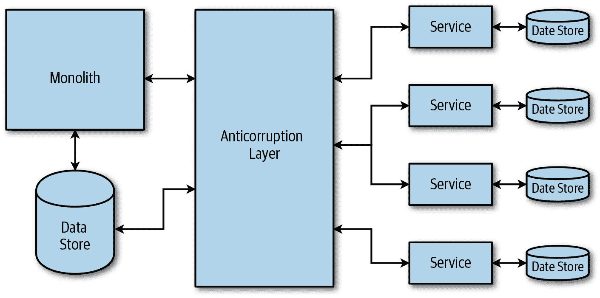

# 第六章：最佳实践

本书全程学习了云原生应用程序的基础知识——如何设计、开发和运行它们，以及如何处理数据。总结来说，本章旨在提供一份清单，涵盖了构建和管理反应式云原生应用程序的建议、验证技术和最佳实践。

# 迁移到云原生

在第二章中，您学习了许多客户在将传统应用程序迁移到云端时遵循的过程。在将现有应用程序迁移到云端时，您应考虑许多最佳实践和经验教训。

## 为了正确的理由分解单体架构

“永远不要改变正在运行的系统”是软件开发中广泛使用的声明，当您考虑将应用程序迁移到云端时也适用。如果您的唯一需求是将应用程序迁移到云端，您可以考虑首先将其移至基础设施即服务（IaaS）——事实上，这应该是您的第一步。也就是说，重新设计应用程序为云原生也有其好处，但您需要权衡利弊。以下是一些指导方针，表明重新设计是有意义的：

+   您的代码库已经增长到更新版本需要很长时间，并且因此无法迅速响应新市场或客户需求。

+   应用程序的各个组件具有不同的规模要求。一个很好的例子是传统的三层应用程序，包括前端、业务和数据层。只有前端层可能会经历用户请求的大量负载，而业务和数据层仍然可以轻松处理负载。正如在第二章和第三章中所提到的，云原生应用程序允许您独立扩展服务。

+   出现了更好的技术选择。技术领域不断创新，一些新技术可能更适合您应用的某些部分。

一旦决定重新设计应用程序，您需要考虑很多事情。在接下来的章节中，我们全面探讨这些考虑事项。

## 首先解耦简单服务

从分离提供简单功能的组件开始，因为它们通常没有太多依赖，因此不会深度集成在单体架构中。

## 学会小规模运作

使用第一个服务作为学习路径，了解如何在云原生世界中操作。从一个简单的服务开始，您可以专注于设置自动化以提供基础架构和 CI/CD 管道，以便熟悉开发、部署和操作云原生服务的过程。拥有一个简单的服务和最小的基础设施将使您能够提前学习、练习和改进新的流程，而不会对单片和最终用户造成重大影响。

## 使用防腐层模式

没有什么是完美的，特别是在软件开发领域，所以最终您可能会得到一个向单片做出调用的新服务。在这种情况下，您可能需要使用*防腐层*模式。此模式用于在不共享相同语义的组件之间实现外观或适配器。防腐层的目的是将一个组件的请求转换为另一个组件的请求；例如，实现协议或模式的转换。

要实施此操作，您需要在单片应用程序中设计并创建一个新的 API，通过新服务中的防腐层进行调用，如图 6-1 所示。

###### 图 6-1\. *防腐层* 模式

当您使用此方法时，有几个考虑因素。如图 6-1 所示，防腐层本身是一个服务，因此您需要考虑如何扩展和操作该层。此外，您需要考虑在完全将单片应用程序移至云原生应用程序之后是否要废弃防腐层。

## 使用 Strangler 模式

当您将单片拆解以迁移到微服务和函数时，您可以使用网关和*Strangler*模式。Strangler 模式的理念是使用网关作为外观，同时逐步将后端单片移至新架构——服务、函数或两者的组合。随着您分解单片并将其功能实现为服务或函数，您更新网关以重定向请求到新功能，如图 6-2 所示。

###### 图 6-2\. 使用*Strangler*模式从单片迁移

注意，如果您无法拦截发送到支持单片的请求，则 Strangler 模式可能不适用。如果您有一个较小的系统，更容易和更快地替换整个系统，而不是逐步移动，则此模式可能也没有意义。

防腐层和 Strangler 模式在多次证明中被证明是将单片遗留应用程序移动到云原生应用程序的良好方法，因为两者都促进了逐步的方法。

## 制定数据迁移策略

在单体应用中，通常会使用一个中心共享的数据存储，多个地方和服务从中读取和写入数据。要真正转向云原生架构，您还需要解耦数据。您的数据迁移策略可能包含多个阶段，特别是如果无法同时迁移所有内容。然而，在大多数情况下，您需要进行增量迁移，同时保持整个系统运行。逐步迁移可能会在一段时间内将数据写入两次（到新旧数据存储）。在两个地方的数据都同步后，您需要修改数据的读取位置，然后从新存储中读取所有数据。最后，您应该能够完全停止向旧存储写入数据。

## 重写任何样板代码

单体应用通常会有大量处理配置、数据缓存、数据存储访问等内容的代码，并且可能使用较旧的库和框架。在将功能移动到新服务时，您应该重写此代码。最好的选择是放弃旧代码，从头开始重写，而不是修改现有代码并将其塑造成适合新服务的样子。

## 重新考虑框架、语言、数据结构和数据存储

移向微服务为您提供重新思考现有实现的选项。是否有新的框架或语言可以用来重写当前代码，以提供更好的功能和功能？如果重写代码有意义，那就去做吧！此外，重新考虑当前代码中的任何数据结构。当转移到服务时，它们是否仍然合理？您还应该评估是否要使用不同的数据存储。第四章概述了哪些数据存储最适合特定的数据结构和查询模式。

## 淘汰代码

创建新服务并将所有流量重定向到该服务后，您需要淘汰和删除单体中的旧代码。使用这种方法，您正在缩小单体并扩展您的服务。

# 确保弹性

弹性是系统从故障中恢复并继续运行和提供请求的能力。弹性不是避免故障，而是响应故障的方式，以避免重大停机时间或数据丢失。

## 处理瞬态故障并进行重试

请求可能因网络延迟、连接中断或超时（如果下游服务繁忙）等多种原因而失败。如果重试请求，您可以避免大部分这些失败。重试还可以提高应用程序的稳定性。然而，在盲目重试所有请求之前，您需要实现一些逻辑来确定是否应该重试请求。如果故障不是暂时的，或者重试可能不会成功，最好是组件取消请求并返回适当的错误消息。例如，因为密码错误而重试失败的登录是徒劳的，重试也不会有所帮助。如果故障是由于罕见的网络问题引起的，可以立即重试请求，因为同样的问题可能不会持续。最后，如果故障是由于下游服务繁忙或者速率限制，例如，应该在延迟后进行重试。以下是一些常见的重试操作之间延迟的策略：

常量

在每次尝试之间等待相同的时间。

线性

按照每次重试之间逐步增加的时间。例如，可以从一秒开始，然后是三秒、五秒等。

指数退避

按照每次重试之间指数增加的时间。例如，从 3 秒开始，然后是 12 秒、30 秒等。

根据您处理的故障类型，您还可以立即重试操作一次，然后使用前面列表中提到的延迟策略之一。您可以通过使用许多服务 SDK 提供的重试和暂时性故障逻辑来处理组件源代码中的重试，或者如果您正在使用像 Istio 这样的服务网格，则可以在基础设施层处理重试。

## 使用有限次数的重试

无论使用哪种重试策略，请确保使用有限次数的重试。无限次重试将对系统造成不必要的负担。

## 用于非暂时故障的断路器

断路器的目的是防止组件执行可能失败且不是暂时的操作。断路器监视故障次数，并根据该信息决定是否继续请求或者是否应该返回错误而不调用下游服务。如果断路器跳闸，则失败次数已超过预定义值，断路器将自动在预设时间内返回错误。在预设时间结束后，它将重置故障计数并允许请求再次通过到下游服务。一个实现断路器模式的知名库是 Netflix 的 Hystrix。如果您正在使用像 Istio 或 Envoy 代理这样的服务网格，您可以利用这些解决方案中的断路器实现。

## 优雅降级

服务应优雅地降级，因此即使它们失败，如果有意义的话，它们仍然提供可接受的用户体验。例如，如果无法检索数据，可以显示数据的缓存版本，一旦数据源恢复，就显示最新的数据。

## 使用分隔模式

*分隔*模式指的是将系统的不同部分分组隔离，以便如果一个部分失败，其他部分仍将继续运行而不受影响。以这种方式对服务进行分组允许你隔离故障，并在发生故障时继续提供请求服务。

## 实施健康检查和就绪检查

对于你部署的每个服务实施健康检查和就绪检查。平台可以使用这些来确定服务是否健康且正确执行，以及服务何时准备好接受请求。在 Kubernetes 中，健康检查被称为*探针*。存活探针用于确定何时重新启动容器，而就绪探针确定是否应该开始向 pod 发送流量。

初始延迟定义了容器启动后多少秒之后活跃探针或就绪探针开始工作，而周期则定义了探针的执行频率。还有额外的设置，如成功/失败阈值和超时，可以用来微调探针。

## 为你的容器定义 CPU 和内存限制

你应该定义 CPU 和内存限制来隔离资源，防止某些服务实例消耗过多资源。在 Kubernetes 中，你可以通过在 pod 定义中定义内存和 CPU 限制来实现这一点。

## 实施速率限制和节流

你可以使用速率限制和节流来限制服务的入站或出站请求数量。实施这些措施可以帮助你保持服务在请求突然增加的情况下仍然响应。另一方面，节流通常用于出站请求。考虑在希望控制发送到外部服务的请求数量以减少成本或确保你的服务不像是拒绝服务攻击来源时使用它。

# 确保安全性

云原生世界中的安全性基于共享责任模型。云提供商不单独负责其客户解决方案的安全性；相反，他们与客户分享这一责任。从应用程序的角度来看，你应考虑采纳深度防御的概念，该概念在第三章中有讨论。本节列出的最佳实践将帮助你确保安全性。

## 将安全要求与其他任何要求视为同等重要

拥有完全自动化的流程符合云原生开发的精神。为了实现这一点，所有安全要求必须像其他任何要求一样被视为开发流水线中的一部分。

## 在您的设计中融入安全性

在规划和设计云原生解决方案时，您需要考虑安全性，并在设计中融入安全功能。作为设计的一部分，您还应该指出在组件开发期间需要解决的任何额外安全问题。

## 授予最小特权访问

如果您的服务或函数需要访问任何资源，它们应该被授予具有最少权限的特定权限。例如，如果您的服务只从数据库读取，它不需要使用具有写权限的账户。

## 使用单独的账户/订阅/租户

根据您的云服务提供商的术语，您的云原生系统应该使用单独的账户、订阅和/或租户。至少，您需要为每个将使用的环境设置一个独立的账户；这样，您可以确保各个环境之间得到适当的隔离。

## 安全存储所有机密信息

系统内部的任何机密信息，无论是由您的组件还是持续集成/持续开发（CI/CD）流水线使用，都需要被加密并安全地存储。这听起来是理所当然的，但绝不要以明文形式存储任何机密信息：始终加密它们。最好使用现有和经过验证的机密管理系统来处理这些事务。最简单的选择是使用 Kubernetes Secrets 来存储集群内服务使用的机密信息。机密信息存储在 etcd 中，这是一个分布式键/值存储。然而，受管理和集中化的解决方案在几个方面都比 Kubernetes Secrets 有多个优势：所有内容都存储在一个集中位置，您可以定义访问控制策略，机密信息被加密，提供审计支持等等。一些受管理的解决方案的例子包括 Microsoft Azure Key Vault，Amazon Secrets Manager 和 HashiCorp Vault。

## 数据混淆

您的组件使用的任何数据都需要适当地混淆。例如，您绝不希望以明文形式记录任何被分类为个人身份信息（PII）的数据；如果需要记录或存储它，确保它要么被混淆（如果记录）或加密（如果存储）。

## 加密传输中的数据

在传输中加密数据可以保护您的数据，以防通信过程中被拦截。为了实现这种保护，您需要在传输之前加密数据，验证端点的身份，最后在达到端点后解密并验证数据。传输层安全协议（TLS）用于加密传输中的数据，以实现传输安全。如果您正在使用服务网格，TLS 可能已经在网格中的代理之间实现。

## 使用联合身份管理

使用现有的联合身份管理服务（例如 Auth0）来处理用户的注册、登录和退出，允许您将用户重定向到第三方页面进行身份验证。您的组件应尽可能地委派认证和授权。

## 使用基于角色的访问控制

基于角色的访问控制（RBAC）已经存在很长时间了。RBAC 是一种围绕角色和权限的访问控制机制，正如您所学到的，它可以成为防御深度策略的重要组成部分，因为它允许您为用户提供对他们所需资源的精细化访问。例如，Kubernetes 的 RBAC 控制对 Kubernetes API 的权限。使用 RBAC，您可以允许或拒绝特定用户创建部署或列出 Pod 等操作。在 Kubernetes 中，通过命名空间来限定 RBAC 权限是一个良好的实践，而不是使用集群角色。

## 隔离 Kubernetes Pods

在 Kubernetes 集群中运行的任何 Pod 都不是隔离的，可以接受来自任何来源的请求。在 Pod 上定义网络策略可以使其隔离，并拒绝任何未经策略允许的连接。例如，如果系统中的某个组件受到了威胁，网络策略将阻止恶意行为者与您不希望其通信的服务进行通信。在 Kubernetes 中使用 NetworkPolicy 资源，您可以定义 Pod 选择器以及详细的入站和出站策略。

# 处理数据

大多数现代应用程序都需要存储和处理数据。越来越多的数据存储和分析服务作为云提供商管理的服务可用。云原生应用程序设计旨在充分利用云提供商管理的数据系统，并设计成可以逐步利用增多功能。在云中处理数据时，许多标准的数据最佳实践仍然适用：拥有灾难恢复计划、将业务逻辑从数据库中分离、避免过度获取或过度聊天式的 I/O、使用防止 SQL 注入攻击的数据访问实现等等。

## 使用托管数据库和分析服务

尽可能使用托管数据库。在虚拟机（VM）上或 Kubernetes 集群中部署数据库通常是一个快速且简单的任务。需要备份和副本的生产数据库可以快速增加操作数据存储系统的时间和负担。通过卸载部署和管理数据库的运营负担，团队能够更多地专注于开发工作。

在某些情况下，数据存储技术可能没有作为托管服务提供，或者可能需要访问一些在系统的托管版本中不可用的配置。

## 使用最适合数据需求的数据存储

在设计本地应用程序时，架构师通常会尝试避免使用多个数据库。每种数据库技术的使用都需要具有部署和管理数据库技能的数据库管理员，这显著增加了应用程序的运营成本。云托管数据库的降低运营成本使得可以使用多种不同类型的数据存储来放置最适合数据类型、读取和写入要求的系统中的数据。云原生应用程序充分利用这一点，使用多种数据存储技术。

## 将数据存储在多个区域或区域中。

存储应用程序的生产数据跨多个区域或区域。数据如何存储在区域或区域中将取决于应用程序的可用性要求；例如，数据可以是备份或复制数据库。如果云服务提供商经历某个区域或区域的故障，数据可以用于恢复或故障转移。

## 使用数据分区和复制进行扩展。

云原生应用程序的设计是为了扩展而不是扩展。通过增加可用于数据库实例的资源，例如增加更多的核心或内存来实现数据库的扩展。这最终会遇到一个硬性限制并且成本高昂。通过在多个数据库实例之间分布数据来实现数据库的扩展。数据库被分区或分割，并存储在多个数据库中。

## 避免过多获取和交互式 I/O。

过多获取是指应用程序从数据库请求数据，但仅需要数据操作的一小部分。例如，应用程序可能会显示订单列表和简单摘要，但请求整个订单和订单详细信息而不需要这些详细信息。另一方面，喋喋不休的应用程序会进行大量的小型调用以完成操作，而单个请求可以向数据库发出。

## 不要将业务逻辑放在数据库中。

太多应用程序扩展问题的根源在于将太多逻辑放在数据库中。数据库通过支持标准开发语言，使得在数据库内部执行业务逻辑变得容易，并且执行这些任务在数据库中变得方便。这通常会引入扩展性问题，因为数据库通常是一种昂贵的共享资源。

## 使用类似于生产环境的数据进行测试。

创建自动化流程对生产数据进行匿名化处理，并随着数据变更更新新规则。应用程序应该使用类似于生产环境的数据进行测试。有时会从生产系统中提取数据，进行清洗，并加载到测试系统中，以提供类似于生产环境的数据。您应该自动化此过程，以便随着数据变更而轻松更新。

## 处理瞬时故障。

如本章的弹性部分所述，调用数据库时可能会发生故障。在进行调用时预期故障，并准备处理它们。许多数据库客户端库已经支持暂时性故障处理。重要的是要了解它们是否支持以及如何支持。

# 性能和可伸缩性

性能（Performance）指示一个系统在特定时间框架内执行操作的能力，而可伸缩性（scalability）则是指系统如何处理负载增加而不影响性能。预测系统活动增加的时期可能会很困难，因此组件需要能够根据需要进行伸缩，以满足增加的需求，然后在需求减少后进行缩减。接下来的子节提供了一些最佳实践，以帮助您实现最佳性能和可伸缩性。

## 设计能够横向扩展的无状态服务

应设计服务以进行横向扩展。横向扩展是通过增加服务的更多实例来增加服务的规模的一种方法。纵向扩展是通过增加内存或核心等资源来扩展服务的方法，但这种方法通常有硬性限制。通过设计服务以进行横向扩展和缩回，您可以扩展服务以处理负载变化，而不影响服务的可用性。

有状态应用程序本质上难以扩展，应尽量避免。如果有状态服务是必需的，通常最好将功能与应用程序分开，并使用分区策略和可管理的服务（如果有的话）。

## 使用平台自动缩放功能

在可能的情况下，在实施自己的自动缩放之前，请使用平台内置的任何自动缩放功能。Kubernetes 提供水平 Pod 自动缩放器（HPA）。 HPA 根据 CPU、内存或自定义指标扩展 Pod。您可以指定指标（例如，CPU 的 85% 或 16 GB 内存）以及 Pod 副本的最小和最大数量。达到目标指标后，Kubernetes 会自动缩放 Pod。类似地，集群自动缩放会根据 Pod 规范中请求的资源来确定是否应该添加节点，如果无法调度 Pod，则会缩放集群节点数量。

## 使用缓存

缓存是一种技术，可以通过在靠近组件的存储中临时存储经常使用的数据来帮助提高组件的性能。这样做可以减少组件访问原始数据源的时间。最基本的缓存类型是单进程使用的内存存储。如果您有多个组件实例，则每个实例将具有自己独立的内存缓存副本。如果数据不是静态的，这可能会导致一致性问题，因为不同的实例将具有不同版本的缓存数据。为了解决这个问题，您可以使用共享缓存，确保不同的组件实例使用相同的缓存数据。在这种情况下，缓存通常是单独存储的，通常位于数据库之前。

## 使用分区来扩展服务限制之外的规模

云服务通常会有一些定义的规模限制。了解每个使用的服务的可伸缩性限制及其可扩展的程度非常重要。如果单个服务无法扩展以满足应用程序的要求，请创建多个服务实例并将工作分区到这些实例中。例如，如果一个托管网关能够处理应用程序预期负载的 80%，则创建另一个网关并在网关之间分配服务。

# 函数

虽然软件开发生命周期（SDLC）和一般服务器架构最佳实践对无服务器架构也适用。然而，由于无服务器是一种不同的操作模型，因此有一些专门针对函数的最佳实践。

## 撰写单一目的的函数

遵循单一职责原则，只编写具有单一职责的函数。这将使您的函数更易于理解、测试，并且在需要时更易于调试。

## 不要链式调用函数

通常情况下，函数应该将消息/数据推送到队列或数据存储中，以触发其他函数的执行。通常认为一个或多个函数调用其他函数是一个反模式，会增加成本并使调试更加困难。如果您的应用程序需要函数串联，您应考虑使用如 Azure Durable Functions 或 AWS Step Functions 之类的函数提供。

## 保持函数轻量和简单

每个函数应只做一件事，并仅依赖最少数量的外部库。函数中额外和不必要的代码会增加函数的大小，从而影响其启动时间。

## 使函数无状态

不要在函数中保存任何数据，因为新的函数实例通常在其自己的隔离环境中运行，不与其他函数或同一函数的调用共享任何内容。

## 将函数的入口点与函数逻辑分离开来

函数将由函数框架调用入口点。通常，框架特定的上下文将传递给函数入口点，以及调用上下文。例如，如果函数通过类似 API 网关的 HTTP 请求调用，则上下文将包含 HTTP 特定的细节。入口方法应将这些入口点细节与代码的其余部分分开。这将提高函数的可管理性、可测试性和可移植性。

## 避免长时间运行的函数

大多数函数即服务（FaaS）提供的函数执行时间有上限。因此，长时间运行的函数可能会导致诸如增加的加载时间和超时等问题。在可能的情况下，将大函数重构为更小的函数，这些函数共同工作。

## 使用队列进行跨函数通信

函数之间应该使用队列而不是互相传递信息。其他函数可以基于队列上发生的事件（添加、删除、更新等）来触发和执行。

# 运维

DevOps 实践为组织充分利用云技术提供了必要的基础。云原生应用程序利用详细说明的 DevOps 原则和最佳实践，详见 第五章。

## 部署和发布是分开的活动

很重要的是要区分部署和发布。部署是将构建的组件放置在环境中的行为 —— 组件已完全配置且准备就绪；然而，此时尚未向其发送流量。作为组件发布的一部分，我们开始允许流量访问已部署的组件。这种分离允许您以受控的方式进行渐进式发布、A/B 测试和金丝雀部署。

## 保持小型部署

每个组件部署应该是一个小事件，可以由一个团队在短时间内完成。关于部署的大小和时间没有通用规则，因为这高度依赖于组件、您的流程和对组件的更改。一个好的方法是能够在一天内推出关键修复。

## CI/CD 定义与组件同在

您需要存储和版本化与组件一起的任何 CI/CD 配置和依赖关系。每次推送到组件分支都会触发流水线，并执行在 CI/CD 配置中定义的作业。为了控制组件部署到不同环境（开发、演示、生产），您可以使用 Git 分支名称，并配置流水线仅将主分支部署到生产环境，例如。

## 一致的应用程序部署

通过一个持续可靠且可重复的部署过程，您可以最小化错误。尽可能自动化进程，并确保在部署失败时定义了回滚计划。

## 使用零停机时间发布

为了在发布期间最大化系统的可用性，考虑使用蓝/绿或金丝雀等零停机时间发布。使用这些方法之一还允许您在出现故障时快速回滚更新。

## 不要修改已部署的基础设施

基础设施应该是不可变的。修改已部署的基础设施可能会迅速失控，并且跟踪更改内容可能会变得复杂。如果需要更新基础设施，请重新部署它。

## 使用容器化构建

为了避免配置构建环境，请将您的构建过程打包到 Docker 容器中。考虑使用多个图像和容器进行构建，而不是创建单个的、单块的构建图像。

## 使用代码描述基础设施

基础设施应该使用云提供商的声明性模板或编程语言或脚本来描述和提供基础设施。

## 使用命名空间组织 Kubernetes 中的服务

在 Kubernetes 集群中，每个资源都属于一个命名空间。默认情况下，新创建的资源将进入一个名为*default*的命名空间。为了更好地组织服务，使用描述性名称并将服务分组到有界上下文是一个好的实践。

## 隔离环境

使用专用的生产集群，并在您的开发、预备或测试环境中物理分离生产集群。

## 分离功能源代码

每个功能必须独立进行版本控制并具有其自己的依赖关系。如果不是这种情况，您将得到一个单体和紧密耦合的代码库。

## 将部署与提交相关联

选择一个分支策略，使您能够将部署与分支中的特定提交相关联，并且还允许您确定部署的源代码版本。

# 日志记录、监控和警报

应用程序和基础设施日志记录可以提供比仅仅根本原因分析更多的价值。一个适当的日志记录解决方案将为应用程序和系统提供宝贵的洞察，并且通常对监控应用程序的健康和警报操作的重要事件是必要的。随着云应用程序变得更加分布式，日志记录和仪表化变得越来越具有挑战性和重要性。

## 使用统一的日志系统

使用能够捕获系统中所有服务和层级的日志消息并将其存储在集中存储中的统一日志系统。无论您将所有日志移动到集中存储以进行分析和搜索，还是在机器上留下它们，并配备有必要的工具来运行分布式查询，工程师都能够找到并分析日志而不必从一个系统到另一个系统。

## 使用关联 ID

包含一个通过所有服务传递的唯一关联 ID（CID）。如果其中一个服务失败，关联 ID 用于跟踪请求通过系统并准确定位故障发生的位置。

## 在日志条目中包含上下文

每个日志条目应包含在调查问题时有助的额外上下文。例如，包括所有异常处理、重试尝试、服务名称或 ID、图像版本、二进制版本等等。

## 常见且结构化的日志格式

确定所有组件将使用的常见和结构化日志格式。这将使你能够快速搜索和解析日志。另外，请确保所有组件使用相同的时区信息。一般来说，最好遵循协调世界时（UTC）等常见的时间格式。

## 为你的度量标记适当的标签

除了使用清晰且唯一的度量标签外，确保存储任何额外信息，例如组件名称、环境、函数名称、区域等等。有了标签，你可以使用多维度（例如，特定区域的平均延迟或特定函数的多个区域的延迟）创建查询、仪表板和报告。

## 避免警报疲劳

大量的度量标准使得设置警报和何时发出警报变得困难。如果触发了太多警报，最终人们将停止关注它们并不再认真对待。此外，调查一堆警报可能会变得很压倒，甚至可能是你的团队唯一在做的事情。重要的是按严重性对警报进行分类：低、中和高。低严重性警报的目的是在高严重性警报的根本原因分析时可能会用到。你可以用它们来发现某些模式，但在触发时不需要立即采取行动。中等严重性警报应该创建通知或开启工单。这些是你想要查看的警报，但不是高优先级并且不需要立即采取行动。它们可能代表一个临时条件（例如需求增加），最终会消失。它们还可以提前警告可能的高严重性警报。最后，高严重性警报会在半夜唤醒人们并要求立即采取行动。最近，基于机器学习的自动分类问题和发出警报的方法越来越受欢迎，甚至引入了 AIOps 这个术语。

## 定义并在关键性能指标上发出警报

云原生系统会发出和监控大量信号。你需要筛选出其中最重要和有价值的信号。这些关键性能指标（KPI）可以让你了解系统的健康状况。例如，一个 KPI 是延迟，用于衡量处理请求所需的时间。如果看到延迟增加或偏离可接受范围，可能是时候发出警报并请人查看了。除了 KPI，你还可以使用其他信号和度量来确定某些事情失败的原因。

## 生产中的持续测试

使用持续测试可以生成发送到系统各处并模拟真实用户的请求。您可以利用这些流量对组件进行测试覆盖率、发现潜在问题，并测试您的监控和警报。以下是一些常见的持续测试实践：

+   蓝绿部署

+   金丝雀测试

+   A/B 测试

这些实践在第五章中讨论。

## 从基本指标开始

确保始终收集系统中每个组件的流量（组件承受的需求量）、延迟（服务请求所需的时间）和错误（请求失败率）。

# 服务通信

服务通信是云原生应用程序的重要组成部分。无论是客户端与后端的通信，服务与数据库的通信，还是分布式架构中的各个服务之间的通信，这些交互都是云原生应用程序的重要组成部分。根据需求使用多种不同形式的通信。以下各小节提供了一些服务通信的最佳实践。

## 设计向后和向前兼容

通过向后兼容性，确保添加到服务或组件的新功能不会破坏任何现有服务。例如，在图 6-3 中，服务 A v1.0 与服务 B v1.0 兼容。向后兼容性意味着发布的服务 B v1.1 不会破坏服务 A 的功能。

###### 图 6-3. 向后兼容性

为了确保向后兼容性，应向 API 添加的任何新字段都应是可选的或具有合理的默认值。任何现有字段不应更名，因为这将破坏向后兼容性。

###### 注意

*并行更改*，也称为*扩展和收缩*模式，可用于安全地引入向后不兼容的更改。例如，假设服务所有者想要在接口上更改属性或资源。服务所有者将通过新的属性或资源扩展接口，然后在所有消费者有机会迁移服务接口之后，删除先前的属性。

如果您的系统或组件需要确保回滚功能，那么在修改服务时，需要考虑其向前兼容性。向前兼容性意味着您的组件与未来版本兼容。您的服务应能够接受“未来”数据和消息格式，并适当处理。向前兼容性的一个很好的例子是 HTML：当它遇到未知标签或属性时，不会导致失败；它只会跳过它们。

## 定义不泄漏内部细节的服务契约

暴露 API 的服务应定义契约，并在发布更新时进行契约测试。例如，基于 REST 的服务通常会以 OpenAPI 格式或文档的形式定义契约，而服务的消费者会根据这个契约进行开发。只要更新不会对 API 契约造成破坏性变更，服务的更新就可以推送，这样就不会影响消费者。泄露服务的内部实现可能会导致难以进行更改并引入耦合。不要假设消费者不会使用通过 API 公开的某些数据。

###### 注意

发布消息到队列或流的服务也应以同样的方式定义契约。通常会发布事件的服务会拥有这个契约。

## 优先使用异步通信

尽可能使用异步通信。它与分布式系统很搭配，并解耦了两个或更多服务的执行。在实现此方法时通常会使用消息总线或流，但也可以通过像 gRPC 这样的直接调用来实现。两者都使用消息总线作为通道。

## 使用高效的序列化技术

像使用微服务架构构建的分布式应用程序更依赖于服务之间的通信和消息传递。数据序列化和反序列化在服务通信中会增加很多额外开销。

###### 注意

在某个案例中，序列化和反序列化被发现占据了所有服务中近 40% 的 CPU 利用率。将标准的 JSON 序列化库替换为自定义库将这一开销减少到大约总 CPU 利用率的 15%。

使用诸如协议缓冲区这样的高效序列化格式，它在 gRPC 中被广泛使用。了解不同序列化格式的权衡是很重要的，因为工具和消费者的要求可能不会使这成为可行的选择。您还可以通过将一些数据放入头部来减少某些服务中序列化的需求。例如，如果一个服务接收到请求并在大量消息负载中仅操作少量字段然后将其传递给下游服务，通过将这些字段放入头部，该服务就无需对负载进行反序列化或重新序列化。该服务读取和写入头部，然后简单地将整个负载传递给下游服务。

## 使用队列或流处理大量负载和流量峰值

组件之间的队列或流作为缓冲区，存储消息直到检索。使用队列允许组件以自己的节奏处理消息，无论传入的数量或负载如何。因此，这有助于最大化服务的可用性和可扩展性。

## 批量请求以提高效率

队列可以用于批处理多个请求并执行一次操作。例如，将 1,000 个批处理条目写入数据库比每次写入一次 1,000 次更有效率。

## 拆分大消息

发送、接收和操作大消息需要更多资源，并可能减慢整个系统。*Claim-Check* 模式讨论了将大消息拆分为两部分的方法。您可以将整个消息存储在外部服务中（例如数据库），并仅发送消息的引用。任何感兴趣的消息接收者可以使用引用从数据库中获取完整的消息。

# 容器

可以很容易地在 Docker 容器中运行大多数应用程序。然而，在生产环境中运行容器和优化构建、部署和监控时，可能会遇到一些潜在的问题。已经确定了一些最佳实践，以帮助避免这些问题并改善结果。

## 将镜像存储在受信任的注册表中

平台上运行的任何镜像都应来自受信任的容器镜像注册表。Kubernetes 提供了一个 webhook（验证接入），可以用来确保 Pod 只能使用来自受信任注册表的镜像。如果您使用 Google Cloud，可以利用二进制授权安全措施，确保仅在集群上部署受信任的镜像。

## 利用 Docker 构建缓存

使用构建缓存在构建 Docker 镜像时可以加快构建过程。所有镜像都是由层次构成的，每个 Dockerfile 中的命令都为最终镜像贡献了一层。在构建过程中，Docker 将尝试重用上一次构建的层次而不是再次构建它。然而，只有当所有前面的构建步骤也使用了缓存的层次时，它才能重新使用缓存的层次。为了充分利用 Docker 构建缓存，将更经常变化的命令（例如将源代码添加到镜像中、构建源代码）放在 Dockerfile 的末尾。这样，任何前面的步骤都将被重用。

## 不要在特权模式下运行容器

在特权模式下运行容器允许访问主机上的所有内容。使用 Pod 上的安全策略阻止容器在特权模式下运行。如果某个容器确实因某种原因需要特权模式以对主机环境进行更改，则考虑将该功能从容器分离并放入基础设施配置中。

## 使用明确的容器镜像标签

始终使用与打包在镜像中的代码紧密关联的特定标签标记容器镜像。为了正确标记图像，您可以使用唯一标识代码版本的 Git 提交哈希（例如，`1f7a7a472`）或使用语义版本（例如，`1.0.1`）。如果未提供标签，则默认使用`latest`标签；然而，由于它与特定代码版本的紧密联系不足，应避免在生产环境中使用。永远不应在生产环境中使用`latest`标签，因为它可能导致不一致的行为，难以排查故障。

## 保持容器镜像小巧

将镜像尽可能地缩小，不论是在容器注册表还是主机系统中使用镜像运行容器，都能减少空间占用。小型镜像提高了镜像的推送和拉取性能。这进一步提升了在部署或扩展服务时启动容器的性能。应用及其依赖关系会影响镜像大小，但通过使用精简基础镜像并确保不包含不必要的文件，可以大幅减少镜像大小。例如，Alpine 3.9.4 镜像仅有 3 MB，Debian Stretch 镜像为 45 MB，CentOS 7.6.1810 镜像则为 75 MB。这些发行版通常提供了精简版本，从基础镜像中删除可能不需要的内容，这不被应用所需。保持镜像精简需要牢记两点：

+   选择精简基础镜像开始

+   仅包含应用程序操作所需的文件

可以使用容器构建模式通过将用于构建工件的图像与用于运行应用程序的基础图像分离，创建精简镜像。Docker 的多阶段构建通常用于实现此目的。您可以创建 Docker 构建文件，从不同的图像开始执行构建和测试工件的命令，然后在创建运行应用程序镜像的过程中定义另一个基础图像。

###### 提示

使用*.dockerignore*文件可以通过排除 Docker 构建中不需要的文件来提高构建速度。

## 每个容器内运行一个应用程序

每个容器内仅运行单一应用程序。容器设计为仅运行单一应用程序，容器与其中运行的应用程序具有相同的生命周期。在同一容器内运行多个应用程序会增加管理难度，并可能导致容器中某些进程崩溃或无响应。

## 使用受信任仓库的验证图像

有大量且不断增长的公开可用镜像，在处理容器时非常有用。Docker 仓库标签是可变的，因此理解镜像可能会变化至关重要。当使用外部仓库中的镜像时，最好将其从外部仓库复制或重新创建到组织管理的仓库中。组织的仓库通常更接近 CI 服务，这种方法可以消除可能影响构建的其他服务依赖。

## 在镜像上使用漏洞扫描工具

你需要注意影响你的镜像的任何漏洞，因为这可能会危及系统的安全性。如果发现漏洞，需要重新构建镜像，并包含补丁和修复程序，然后重新部署它。一些云提供商在其镜像注册解决方案中提供漏洞扫描功能，因此确保你充分利用这些功能。

###### 提示

尽可能频繁地扫描镜像，因为每天都会发布新的网络安全漏洞和暴露（CVE）。

## 不要在容器中存储数据

容器是临时的 —— 它们可以停止、销毁或替换而不会丢失数据。如果运行在容器中的服务需要存储数据，请使用卷挂载来保存数据。卷中的内容存在于容器的生命周期之外，并且卷不会增加容器的大小。如果容器需要临时非持久性写入，请使用 tmpfs 挂载，这将通过避免向容器的可写层写入来提高性能。

## 永远不要在镜像内部存储机密或配置信息

在镜像内部硬编码任何类型的机密是应该避免的。如果你的容器需要任何机密信息，请将其定义为环境变量或文件，并通过卷挂载到容器中。

# 总结

针对云原生应用程序的最佳实践有很多技术涉及，我们可以轻松撰写一整本书来覆盖这些内容。然而，在客户交流中反复出现的特定领域，本章节已经涵盖了一系列云原生应用程序的最佳实践、技巧和验证的模式。你应该对你可能需要考虑的因素有更深入的理解。
