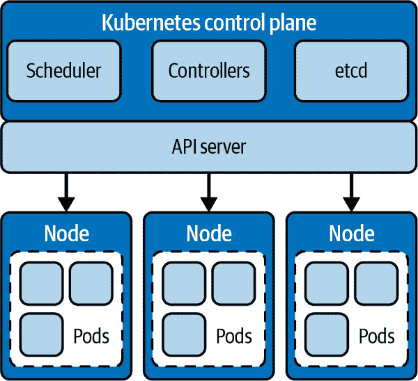
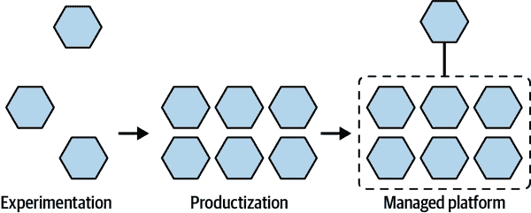

# 第一章：Kubernetes 采用复杂性的原因

现代应用设计已从创建庞大的单体应用转向基于运行在容器中的微服务的更灵活架构。*容器*是包含服务运行所需依赖和配置文件的小型运行时环境。容器是云原生方法的构建块，支持在公共、私有和混合云，以及裸机和边缘位置等多样化环境中构建可扩展的应用。

除了在基础设施层面上相较于单体架构具有显著优势，使应用开发团队能够并行开发不同服务而无需更新整个应用之外，云原生模型还提供了许多优势。容器化应用比虚拟机（VM）更高效地利用资源，在更广泛的环境中运行，并且更容易扩展。这些优势推动了微服务架构、容器以及主流容器编排平台 Kubernetes 的广泛采用。

Kubernetes 促进了这些分布式应用的管理，使您能够根据需要动态水平和垂直扩展。容器为不同的应用带来了管理一致性，简化了操作和生命周期任务。通过编排容器，Kubernetes 可以使整个环境中的应用管理操作化，控制和平衡资源消耗，提供自动故障转移，并简化部署过程。

尽管 Kubernetes 为云原生应用开发提供了弹性和灵活性的基础，但它也给组织带来了自身的复杂性。在规模化运行和管理 Kubernetes 并不容易，不同提供商和环境之间的不一致性更增加了困难。

# Kubernetes 架构

Kubernetes 管理一组物理或虚拟服务器，称为*工作节点*，每个节点托管着组织成*Pods*的容器。另外，还有一小部分服务器作为*控制平面节点*，构成集群的控制平面。为了支持多租户，Kubernetes 集群通过*命名空间*提供逻辑分离，命名空间是一种基于所有权分离资源的机制，为每个团队提供了一个虚拟集群。

*控制平面*是主要访问点，允许管理员和其他人员管理集群。控制平面还存储集群的状态和配置数据，在需要时告知工作节点何时创建和销毁容器，并在集群中路由流量。

控制平面主要由以下组件组成：

API 服务器

控制平面、工作代理（kubelet）和用户与集群通信的访问点

控制器管理器

使用*控制器*管理集群的服务使用 API 服务器，这些控制器将集群的状态与规范一致

etcd

包含集群状态和配置的分布式键值存储

调度器

管理节点资源的服务，根据可用性分配工作

Kubelet

在所有工作节点上运行代理以通过容器运行时运行 Pod 的服务

图 1-1 展示了 Kubernetes 集群的基本组件。

为了高可用性，控制平面通常通过维护必要服务和数据的多个副本来进行复制运行（主要是 API 服务器和 etcd）。

###### 图 1-1\. Kubernetes 集群的组件

您以*声明方式*管理 Kubernetes 集群配置的每个方面（如部署、Pod、StatefulSets、PersistentVolumeClaim 等），这意味着您声明了每个组件的期望状态，由 Kubernetes 确保实际情况与您的规范相匹配。Kubernetes 为每种对象类型维护一个控制器，以使集群中每个对象的状态与声明的状态一致。例如，如果声明了某个数量的 Pod，Kubernetes 会确保在节点故障时将其 Pod 移动到健康节点。

# Kubernetes 对象和自定义资源定义

Kubernetes 将集群表示为*对象*。您通过编写*清单*文件——描述对象预期状态的 YAML 文档——并运行命令从文件创建对象来声明性地创建对象。

控制器确保对象存在并与清单中声明的状态匹配。控制器本质上是一个控制循环，类似于电压调节器或恒温器，它知道如何在指定参数内维护对象的状态。

Kubernetes 的*资源*是 Kubernetes API 中存储特定类型对象的端点。您可以使用*自定义资源定义*（CRD）创建自定义资源来表示新类型的对象。实际上，一些核心 Kubernetes 资源现在使用 CRDs，因为它们使得扩展和更新对象的功能变得更容易。

# Kubernetes 采纳之旅

许多组织在采用 Kubernetes 时都沿着一条经过深思熟虑的道路前行，从实验开始，然后决定是否依赖它。这一旅程几乎总是从单一集群开始，逐渐发展到在不同环境中管理多个集群的复杂性。图 1-2 展示了进入 Kubernetes 采纳之旅的典型路径，从实验开始，转向产品化，最终发展成为一个受管平台。

###### 图 1-2\. 进入 Kubernetes 采纳之旅

## Kubernetes 实验

在试验阶段，开发人员通过容器化几个项目来驱动对 Kubernetes 功能的调查。Kubernetes 的开放特性使得在小规模上使用命令行界面并编写脚本进行集群更改和集成其他开源组件变得容易。在这个阶段，组织通常尚未涉足安全、升级、可用性及其他后续重要问题。随着需求的变化，团队逐渐进行配置更改并逐步集成组件，通常不会记录集群演变的过程。当需要支持更广泛的环境或扩展对更多团队的访问时，显然集群是为迄今为止服务的少数用例量身定制的。

## 将 Kubernetes 产品化为组织的平台

随着组织开始认识到 Kubernetes 的价值，团队开始研究如何扩展能够满足整个公司需求的通用集群。服务可靠性和 IT 运维等部门开始寻找使 Kubernetes 安全、可支持和可管理的方法。这些团队开始倡导交换灵活性以换取可靠性的预设、现成解决方案。随着组织准备将 Kubernetes 扩展到符合其需求的规模，可能会发现这些解决方案过于死板，并倾向于将每个集群隔离开来，使跨团队工作变得更加困难。

## 开发 Kubernetes 作为托管平台

要使 Kubernetes 适应组织的业务需求，必须能够轻松部署、维护和扩展高可用集群，能够处理动态满足不断变化需求的应用程序和工作负载。因此，组织的目标必须是使 Kubernetes 在规模上运作为现代平台，为多个团队提供资源。

当前阶段，调查通常集中在商业化的 Kubernetes 平台上，这些平台可以直接解决组织的问题。团队很可能有足够的经验，寻找灵活性、可重复部署以及管理不同环境下多个集群的能力，包括各种云平台、虚拟化或裸金属数据中心，以及越来越多的边缘位置。特别是 IT 运维和平台工程团队会关注集群访问安全、配置管理，以及像扩展、升级、配额控制、日志记录、监控、持续性等 Day 2 关注点。

随着平台的形成和发展，将更大的多租户集群分成更小的特定用途的集群的趋势逐渐增强。这种方法可以实现更灵活的管理，更有效地利用资源，并为组织内使用集群的团队提供更为量身定制的体验。从安全角度来看，较小的集群有助于更轻松地实施深度防御策略，在遭遇安全漏洞时减少"爆炸半径"。操作多个集群还使得可以在云端、本地或边缘等任何需要的地方部署应用程序。

# Kubernetes 的挑战

每个环境处理基础设施的方式都不同，这意味着每种类型的 Kubernetes 部署都面临不同的挑战。配置、升级和维护支持控制平面的基础设施可能会很困难且耗时。一旦集群启动，集成存储、网络和安全等基本组件将会面临重大障碍。最后，在跨多个环境部署多个集群时，每个集群必须单独管理。Kubernetes 本身没有用于管理集群作为整体的原生工具，而环境之间的差异为每个集群引入了操作细微差别。

Kubernetes 的下一层是集群所需的资源，主要包括存储、网络以及运行集群的物理或虚拟机器。这意味着运行集群涉及管理两个并行的生命周期：Kubernetes 本身以及支持其的硬件和操作系统。由于 Kubernetes 迅速发展，这两个层面必须保持同步。节点或集群可用性的许多问题源于操作系统版本与 Kubernetes 组件版本之间的不兼容性。在多集群部署中，这些问题变得更加困难，因为需要同步多个平台的 Kubernetes 和操作系统，每个平台都有其独特的复杂性，再加上团队使用集群时可能需要特定版本或配置的需求，问题将会指数级增加。

最初，Kubernetes 并没有包含任何管理集群基础设施的工具。启动机器和安装 Kubernetes 都是手动操作。在非托管 Kubernetes 环境外创建集群需要大量的工作量和定制工具。Kubernetes 社区需要一种方法来提供通用工具来引导一个集群。

为了应对这一挑战，Kubernetes 社区开始开发工具，简化集群的配置和维护。以下是过去几年中开发的一些示例：

Kube-up

第一个用于启动 Kubernetes 集群的工具（2015）

kubeadm

一个用于初始化、配置和升级 Kubernetes 集群的工具（2016）

Kops

一个用于 Kubernetes 生命周期管理的工具，包括基础设施和依赖项（2016）

Kubicorn

一个具有模块化支持云提供商的集群管理框架（2018 年）。

这些工具是朝着集成集群管理的方向迈出的重要一步，但未能提供完整的解决方案。更复杂的工作负载开始需要更复杂的部署，包括多个集群。管理这些部署也因此变得更加困难。特别是，很明显需要通过一个统一的 API 以一致和声明式的方式管理集群——就像 Kubernetes 管理节点、Pod 和容器一样。
