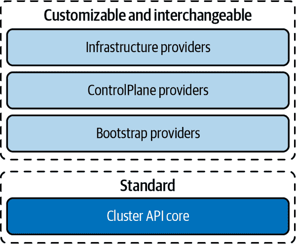
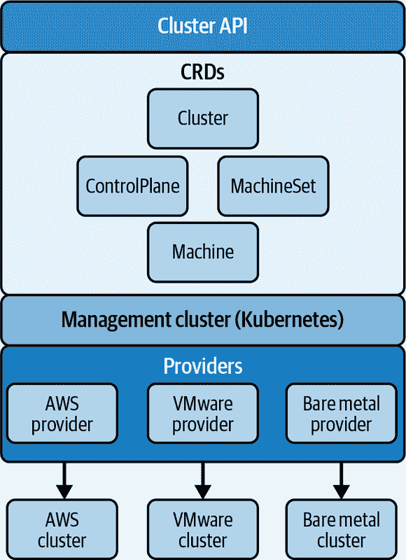

# 第二章：声明性 Kubernetes 集群管理

当您创建 CRD 时，可以为其提供适当的控制器逻辑来维护关联的对象。通过这种方式，您可以扩展 Kubernetes 声明性 API 以包含新类型的对象。这正是 Cluster API 用来管理 Kubernetes 的方法：它提供资源来表示 Kubernetes 集群及其基础设施。

Cluster API 是由 Kubernetes 集群生命周期特别兴趣小组（SIG）创建的项目，旨在提供一致的、模块化的声明性 Kubernetes 集群管理平台。利用 kubeadm，Cluster API 使用类似于 Kubernetes 的 API 来创建、配置和管理不同部署环境和提供程序的 Kubernetes 集群及其基础设施。

# Cluster API 的目标

Kubernetes 集群生命周期 SIG 创建了 Cluster API 以简化集群生命周期管理。尽管 Kubernetes 本身具有 API 来编排容器，而不管环境或提供程序如何，但它没有提供一致的方法来在任意基础设施上创建新的机器。这意味着集群生命周期必须根据环境独立处理。

Kubernetes 集群生命周期 SIG 的主要任务是简化创建、管理、升级和废弃 Kubernetes 集群的过程。该组决定开发 Cluster API 作为跨环境管理 Kubernetes 基础设施的框架，有几个目标：

声明性集群生命周期管理

Cluster API 的声明性方法用于管理 Kubernetes 集群生命周期，使其与 GitOps 轻松集成，后者是一个将 DevOps 应用开发实践应用于基础设施自动化的声明性操作框架。

基础设施抽象化

Cluster API 提供了一种在云上和本地环境中跨不同环境管理集群基础设施的一致方法，这意味着管理的不仅仅是计算和存储，还包括网络和安全，包括实施子网和堡垒主机等安全最佳实践。

与现有组件的集成

Cluster API 旨在与依赖于 kubeadm、cloud-init 和其他工具来初始化集群的现有组件一起工作，而不是重新发明和重新实现已经运行良好的内容。即使是 Cluster API 管理集群基础设施的方式也很熟悉，因为它设计成类似于开发者在 Kubernetes 上管理工作负载的方式。

易于采用

Cluster API 被设计成可以根据需要快速或缓慢地采纳。团队可以一次性全面采用 Cluster API，也可以分阶段采用，甚至可以选择只部分采用 Cluster API。

模块化方法

为了适应不同的部署环境和基础设施提供商，Cluster API 采用了一种模块化、可扩展的架构。其目标是提供一致、可重复的操作，即使在未预见的基础设施上也能以相同的方式运行。模块化方法还意味着标准化常见操作的默认操作以及在需要时使用替代实现的能力。例如，虽然 Cluster API 利用了 kubeadm，但也可以使用其他引导提供者。

Cluster API 的总体目标是提供一套集中、一致的工具，使得可以在不同环境中管理多个 Kubernetes 集群，无需担心底层基础设施，也无需构建大量自定义工具。

# Cluster API 概念

Cluster API 使用模块化、可互换的组件作为完整集群基础设施管理平台的基础，自动化了创建、扩展、修复和升级集群等繁琐的集群生命周期管理任务。实质上，Cluster API 是一个模块化的抽象层，使得可以在不同基础设施底层上一致地处理各种对象。Cluster API 的核心组件在不同环境中保持不变，而 Cluster API 的模块化部分则适应每个环境：

+   CRDs 模型化了虚拟机、物理服务器和其他集群组件。

+   提供者实现了适用于不同基础设施环境的正确能力和服务。

Cluster API 以声明方式管理这些资源，这意味着不需要指定如何创建和管理基础设施，只需要定义集群的期望状态。代码成为可重复使用于多个部署的规范，而不是一组命令。

图 2-1 显示了提供者如何实现 Cluster API 架构的模块化方法，从而使得可以根据任何基础设施定制集群生命周期管理。

###### 图 2-1\. Cluster API 模块化架构

## 自定义资源定义和控制器

就像 Kubernetes 为节点、命名空间和 Pod 等对象提供抽象一样，Cluster API 使用 Kubernetes CRD 来表示支持 Kubernetes 集群的基础设施和配置。每个 CRD 都是用于组件基础设施的声明性规范。Cluster API 引入了几个 CRD 来管理集群基础设施，包括：

`Cluster`

指定集群详细信息，如 API 版本、用于 Pod 和服务的 IP 地址块、API 端点和服务域

`ControlPlane`

控制控制平面节点的配置和生命周期

`Machine`

指定单个节点的配置

`MachineHealthCheck`

决定节点何时不健康并需要被替换

`MachineSet`

指定在特定组中维护的 `Machine` 资源的期望数量。

`MachineDeployment`

通过根据需要销毁和替换它们来管理 `Machines` 的变更。

`MachineClass`

让在 `Machines`、`MachineSets` 和 `MachineDeployments` 中重复使用机器规格更加容易。

每个 CRD 都有一个相应的 *controller*，一个维护指定状态的服务。控制器确保其对应对象的状态和对象外部世界的状态都与所需状态匹配。这称为 *reconciling* 实际状态与规范之间的差异。Cluster API 核心管理器，也称为控制器管理器，在管理每个集群的生命周期时使用这些控制器。

当您指定集群、控制平面或机器的特性时，通过创建一个名为 *manifest* 的 YAML 文件来实现，该文件遵循相应 CRD 中定义的模式。对于 CRD 中定义的每个参数，YAML 文件提供一个值，告诉 Cluster API 如何创建自定义资源。

## Providers

Providers 是在不同环境中使 Cluster API 运行的模块。有三种类型的 providers：

基础设施 providers

在特定环境和基础设施主机上创建和访问基础设施和资源。

控制平面 provider

实例化 Kubernetes 控制平面并启动其所需的服务。

引导 provider

生成一个脚本，在机器上启动一个 Kubernetes 节点，该脚本封装了初始化不同 Kubernetes 节点分发（如 kubeadm、k8s、microk8s 等）的配置逻辑。

使用 Cluster API，您可以使用单一声明性 API 部署一组 VM 或直接在裸金属上工作，使用适合您选择的 provider 的正确命令和服务，并启动一个 Kubernetes 集群。每个 provider 实现了针对其设计环境的最佳实践。

Cluster API providers 允许您使用相同的声明性规范在不同环境或不同基础设施主机上启动类似的集群。Figure 2-2 展示了 CRDs 和 providers 如何创建抽象，从而可以跨环境一致地管理资源和基础设施。

###### 图 2-2\. CRDs 和 providers 如何抽象系统资源和基础设施

能够在不同类型基础设施上一致工作，使得在本地部署和公共云、私有云或边缘位置上部署变得简单。这提供了跨不同 provider 的一致性，这在具有不同 provider 的多样化地理区域尤为重要。
