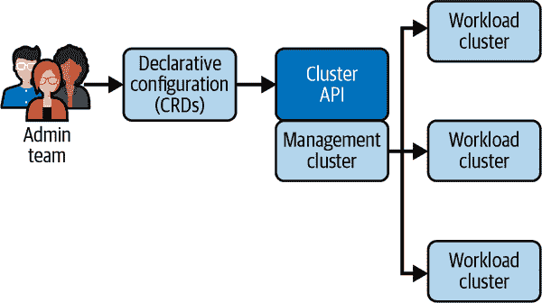
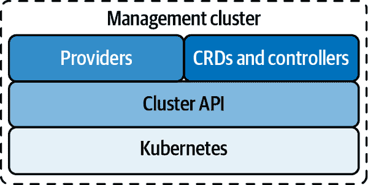

# 第三章：集群 API 的工作原理

集群 API 使用类似于 Kubernetes 本身的结构来管理集群。Kubernetes 使用少量管理节点监督大量工作节点，而集群 API 使用*管理集群*监督*工作负载集群*。集群 API 提供者和控制器在管理集群中运行，确保每个工作负载集群与其声明的状态匹配。

工作负载集群及其所有节点的期望状态是根据定义集群组件的 CRD 的模式在 YAML 清单文件中定义的。当您创建一个集群时，您使用清单文件以声明方式配置其控制平面、工作节点和其他资源。然后管理集群使用控制器基于其 CRD 管理每个资源。图 3-1 显示了集群 API 部署的整体架构。

###### 图 3-1\. 集群 API 架构

集群 API 可以在完全不同的环境中管理多个工作负载集群。基础设施提供者实现了让团队使用单一一致接口管理这些不同集群的抽象。每个主机或基础设施提供者都创建自己的集群 API 提供者实现和自己的 CRD 版本。

在口语中，术语*基础设施提供者*可以指基础设施主机或在主机上提供集群组件的模块。为了避免混淆，有时将该模块称为*基础设施提供者实现*。已经有了丰富的集群 API 提供者生态系统，如 CAPA（AWS 提供者）、CAPV（VMware vSphere 提供者）、CAPZ（Azure 提供者）、CAPMAAS（Canonical MAAS 提供者）等。

# 管理集群

在集群 API 部署中，管理集群运行所有提供者和控制器，管理工作负载集群的生命周期，并处理每个集群安装的基础设施的细节。

图 3-2 显示了管理集群的架构。

###### 图 3-2\. 管理集群架构

集群 API 核心管理器使用控制器管理每个集群的生命周期，将集群带到与实现 Cluster API CRD 实例的 YAML 清单中定义的状态匹配。

集群 API 使用 Kubernetes `KubeadmControlPlane` 控制器管理每个工作负载集群上的控制平面。提供者处理引导配置和基础设施。

# 集群 API 工具

集群 API 提供了许多工具来管理工作负载集群。管理员与集群交互的主要方式是通过命令行工具 `clusterctl`。对于管理工作负载集群上的控制平面，集群 API 还提供了基于 `kubeadm` 的控制平面。

## clusterctl

命令行工具 `clusterctl` 简化了配置、创建、部署和管理集群的任务，它会为您生成自定义资源定义（CRD），因此您无需编写自己的清单文件。您可以使用 `clusterctl` 安装 Cluster API 组件，将 Kubernetes 集群转换为管理集群，创建工作负载集群，升级集群，并将工作负载集群从一个管理集群移到另一个管理集群。

## 基于 kubeadm 的控制平面

基于 `kubeadm` 的控制平面（KCP）是管理 Kubernetes 控制平面的声明性 API。您可以使用 KCP 部署、扩展和管理所有控制平面组件，包括 API 服务器、调度器、控制器管理器、etcd 数据存储和网络服务。KCP 提供对控制平面配置的精细控制。

使用 KCP，您还可以跨故障域（通常是可用性区域）分布控制平面节点，以减少多个控制平面故障的可能性。您可以声明性地指定控制平面节点的数量及其部署位置，控制平面控制器会确保在这些位置上维护节点。

# 使用 Cluster API

部署 Cluster API 包括两个 Kubernetes 集群：一个是临时集群称为*引导集群*，用于创建第二个集群，成为永久的 Cluster API 管理集群。引导集群生成集群证书，初始化管理集群的控制平面，并安装核心 Kubernetes 组件。

部署 Cluster API 的高级步骤如下：

1.  创建一个 Kubernetes 集群作为临时引导集群。

1.  将引导集群变成 Cluster API 管理集群。

1.  在临时管理集群上使用 Cluster API 启动工作负载集群。

1.  将 Cluster API 资源从临时管理集群转移到工作负载集群，并将工作负载集群转换为您的永久管理集群。

您可以使用几个简单的 `clusterctl` 命令执行这些步骤。新管理集群接管后，`clusterctl` 会自动销毁临时管理集群。

一旦永久的 Cluster API 管理集群运行起来，您可以创建工作负载集群。集群及其组件根据 CRD 在 YAML 清单中定义。您可以使用 `clusterctl` 生成 YAML 清单，指定基础设施、Kubernetes 版本、控制节点和工作节点的数量等。Cluster API 使用 `Machine`、`MachineSet` 和 `MachineDeployment` CRD 来启动节点并启动集群。
