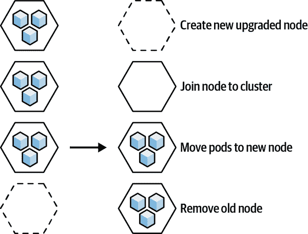

# 第四章：用例、优势和局限性

Kubernetes 为组织的开发环境带来了灵活性和速度，但增加了复杂性。Cluster API 不仅有助于驯服 Kubernetes 的复杂性，还有助于在 Kubernetes 平台上推动用例并提供额外的好处。

# 管理集群生命周期

在采用 Kubernetes 的过程中，一个组织通常会从考虑单个集群的初始设计和开发开始。虽然 Cluster API 确实使得创建一个集群变得简单，但它真正的目标是从 Day 0（创建）到 Day 2（管理直至生命周期结束）管理多个集群的生命周期。这意味着，无论组织在其旅程中的哪个阶段，Cluster API 都简化了操作。

Day 2 操作包括根据需求扩展和收缩集群，包括扩展到新环境，升级 Kubernetes 等。因为 Cluster API 在不同类型的基础设施上为 Kubernetes 集群带来一致的声明式控制，所以您可以轻松地让 IT 和开发团队自己配置集群。

Cluster API 使得部署和管理多个集群变得简单，通过可重复的方式自动化集群生命周期管理，并通过管理集群提供集中的可见性。Cluster API 的大部分 Day 2 功能来自于提供程序插件架构，基础设施主机可以利用这一架构提供工具，帮助实施其期望托管的集群类型的最佳实践。

# 使用 GitOps 管理集群

GitOps 是一种通过将其视为代码来自动化 IT 基础设施的 DevOps 方法论。在 GitOps 中，集群的期望状态存储在 Git 仓库中。这提供了一个单一的可审计的真相来源，具有版本控制和回滚功能，并且在集群被退役或发生灾难后更容易重现集群基础设施。

当您将 Cluster API 与 GitOps 结合使用时，您可以通过 Git 拉取请求在集群上执行操作。这使得将工程团队赋予自己配置和维护其自己集群的权力变得更加安全，因为 Git 可以审计集群操作：您知道发生了什么，由谁执行，以及何时执行。

# 升级集群

传统的升级技术，称为*内联升级*，涉及在原地升级 Kubernetes 组件。这种方法存在许多风险，其中许多风险归结为升级在节点上失败，需要将 pod 和应用程序意外地移动到其他节点。如果其他节点处于类似状态，则升级失败的级联可能会导致集群瘫痪。如果升级失败与长时间应用的一系列补丁和手动配置有关，那么调试问题并恢复到良好状态可能会非常困难。

Cluster API 使升级更安全，并减少对集群容量的影响。Cluster API 执行*滚动升级*，逐个为集群中的旧节点提供新的升级节点，并将 pod 从旧节点移动到新节点。这种方法在升级过程中尽可能保持集群容量的可用性。在最坏的情况下，如果新节点未能成功提供并添加，对正在运行的工作负载没有影响，因为 pod 只有在新节点加入集群时才会移动。图 4-1 展示了执行滚动升级的过程。

###### 图 4-1\. 滚动升级

通过简化和提高 Kubernetes 集群的升级安全性，Cluster API 鼓励更频繁的更新。这使得 Kubernetes 保持最新和更安全，并减少了由于直接在集群上执行增量更改而导致的配置漂移风险，即集群的实际状态与蓝图/清单中编码的期望状态不同。

# 扩展

Cluster API 使得根据工作负载变化轻松扩展集群的规模。对于工作节点，主要任务是确保为当前需求提供适量的硬件，而不是更多。对于控制节点，主要关注的是确保有冗余，以便如果一个控制平面节点失败，另一个节点可以无缝接替其位置。

KCP 允许您以声明方式扩展 Kubernetes 控制平面，以管理可用性，确保控制节点分布在可用性区域中，以最小化任何时间内发生多个故障的可能性。

对于工作节点来说，只需指定新的期望工作节点数量即可；Cluster API 负责提供新的机器并将其添加到集群中。您可以使用名为 Autoscaler 的工具，根据您的工作负载需要自动调整工作节点的数量。Autoscaler 使用应用程序负载或每个节点的平均 CPU 使用率等指标根据需要扩展或缩减集群，并使用 Cluster API 提供程序来管理基础设施。Cluster API 还可以通过指定不同的机器部署或机器资源，在相同集群中运行具有不同硬件配置（实例类型）的工作节点。

# 自我修复

Cluster API 使得 Kubernetes 集群能够通过提供新的基础设施来自我修复。当节点失败时，Kubernetes 可以在新节点上启动 pod 的新实例，但 Kubernetes 本身没有原生能力来提供新的基础设施。如果足够多的机器失败，Kubernetes 最终会耗尽资源。因为 Cluster API 管理基础设施和 Kubernetes，它可以在云或数据中心环境中节点失败时自动提供更多基础设施。

Cluster API 使用 `MachineHealthCheck` 控制器监视控制平面和工作节点的状态，确保它们处于健康状态。这包括确保它们在网络上可达，并且没有运行出磁盘空间、Pod 容量或其他资源。当节点失败、资源耗尽或无法访问时，Cluster API 将为集群提供一个新节点。一旦新节点被配置，Kubernetes 将尝试重新安排来自失败节点的待定 Pod。

# 管理多个集群

随着组织开始扩展其 Kubernetes 部署以包括多个集群，通常在不同的云环境中，Cluster API 提供了一个一致的操作界面，用于跨不同的提供商和不同基础设施及 API 的操作。这对于需要在多个提供商中存在的多样环境的公司尤为重要。

通过抽象化不同的部署机制和不同基础设施提供商和供应商提供的 API，Cluster API 使得可以标准化整个部署的工具，无论它们位于世界的哪个地方，无论是在公共云、虚拟化或裸金属数据中心，还是在边缘。这使得集群管理员可以更好地控制配置和安装的软件，实现集群生命周期管理的标准化方法，并能够在多个集群中重用现有组件。

# 限制与挑战

Cluster API 提供了许多工具，使得管理多个集群的生命周期变得更加容易，但它并非没有局限性。在撰写本文时，Cluster API 仍然是一个测试版项目，这可能会让一些公司在生产环境中犹豫是否采用。在某些情况下，Cluster API 控制平面的升级可能会导致错误或其他问题，严重时可能会干扰工作负载集群。

因为管理集群保存了部署工作负载集群的目标环境的凭据，所以它是一个潜在的安全目标。获取对管理集群的访问权可能会使攻击者进入所有工作负载集群，特别是如果工作负载集群由不同租户拥有时，这尤为麻烦。

虽然 Cluster API 为 Kubernetes 集群提供了声明式管理，但某些基础能力目前超出了其范围，如身份验证、备份和恢复、日志/监控或额外包的生命周期管理，以及应用程序所需的集成，包括应用程序本身。

Cluster API 在管理的集群数和节点数方面存在一定限制。作为一个经验法则，单个 Cluster API 管理集群大约可以处理一百个集群，具体取决于每个集群中节点的数量。

管理集群可能是单点故障。如果管理集群发生故障，工作负载集群仍将继续运行，但你将无法再通过 Cluster API 进行管理。如果你备份了所有的 CRDs 和其他 Cluster API 资源（比如存储在 Git 仓库中），你可以创建一个新的管理集群，并重新获得对工作负载集群的集中控制。

单个管理集群可能不足以为不同租户的工作负载集群提供足够的隔离。你可以通过为不同租户组的工作负载集群建立不同的管理集群来解决这个问题，但这样做会抵消通过单一接口管理多个集群的好处。
