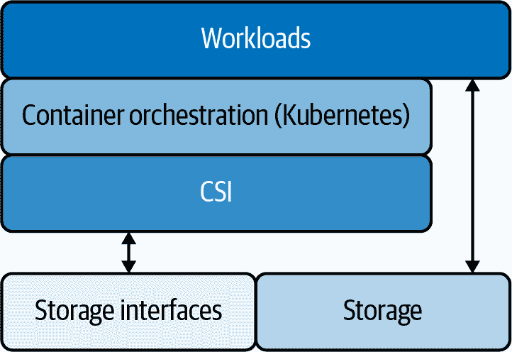

# 第一章：为什么 Kubernetes 在生产环境中很难

Kubernetes 是现代云原生应用架构的基础。通过在容器中运行微服务，企业可以从硬件定义模型（与物理或虚拟机绑定）转向软件定义范式，实现跨本地、云和混合环境的水平扩展。

当迁移到 Kubernetes 时，第一天的工作并不像简单部署软件那样直接。虽然了解 Kubernetes 操作的人数正在增加，但仍然存在挑战。以下部分重点讨论了三个最重要的挑战：自动化存储、维护集群以及管理为不同计算时代设计的存储。

# 自动化存储

Kubernetes 最初设计用于处理 *无状态* 工作负载，即不存储有关先前操作的数据或其他信息。虽然 Kubernetes 已经发展到能够处理 *有状态* 应用程序，即存储持久数据的应用程序，但它并没有像处理计算资源那样自动化存储。相反，Kubernetes 依赖于位于编排系统外部的存储。

自动化存储并不容易，存储管理员通常有大量工作要做。随着工作负载的出现和消失，或者应用程序的扩展和收缩，提供存储可能是耗时的操作，即使有自动化的帮助也是如此。根据阈值和事件配置系统以响应添加、更改和删除资源是一项复杂的工作。

虽然 Kubernetes 在集群内负载均衡服务和请求，但它并不真正知道如何负载均衡存储。不同的工作负载、应用程序和用例具有不同的存储使用模式。存储管理员必须动态响应变化的存储需求，不断考虑何时以及在哪里扩展存储、增长容量以及如何在集群中负载均衡存储请求。如果没有集成工具，要充分自动化这些任务以确保应用程序平稳运行将非常困难。

在现代 DevOps 软件开发环境中，自动化是关键。企业要采用 Kubernetes，必须能够根据需求自动扩展、平衡和保护数据。对于存储管理员来说，这通常是高度互动的工作。管理存储容量可能会耗费大量时间，并且会影响正在运行的应用程序。为了将精力集中在应用程序开发上，通过尽可能多地自动化来减少这种开销是必要的。这需要存储平台和工具了解每个应用程序的 API 和存储需求，并能够以类似 Kubernetes 处理计算资源的方式自动管理存储。

# 维护 Kubernetes 集群

Kubernetes 抽象了分布式云原生应用的计算基础设施，将它们与运行它们的硬件解耦。硬件健康、故障和其他问题不再直接影响软件的性能。当硬件出现故障时，包含软件的容器会自动移动，应用程序继续运行。

然而，支持集群的底层硬件需要持续监控，以确保应用程序及其用户的可用性。虽然 Kubernetes 根据变化的条件和需求管理和移动容器，但任何拥有本地部署的企业都必须维护物理服务器以保持集群运行。IT 团队必须确保能够支持业务所需的服务级别协议（SLAs）。这涉及在硬件组件出现故障时更换硬盘和其他组件，这在大规模中非常常见。

此类维护通常需要将大量复制数据从一种存储基础设施迁移到另一种，这受到使用存储的各种应用程序不同需求的复杂性的影响。几乎不可能在没有停机并且没有丢失任何应用程序操作状态的情况下进行重大手动迁移。智能存储平台可以帮助简化此任务，在硬件配置和管理时或将应用程序移至新环境时保护和迁移数据。

# 另一时代的存储

传统应用直接在物理或虚拟机上运行，其存储需求比分布式容器化应用更简单。单体应用程序状态通常存储在共享的可变表中，可以轻松备份。事实上，一些在虚拟机上运行的应用程序仅依赖于本地存储。在这种情况下，备份虚拟机就足以备份应用程序的数据、配置和运行状态。

容器化应用程序不同。由于容器是不可变且短暂的，需要持久数据的任何工作负载必须连接到外部系统。备份容器不足以捕获持久数据，因为数据不存储在容器本身中。相反，Kubernetes 提供了一种机制，可以将持久存储单元与一个*Pod*关联起来，一个或多个容器在单个主机节点上运行并共享资源。

Kubernetes 通常维护每个活动 pod 的一组副本，以确保应用程序的可用性。每个 pod 可以定义一个或多个本地或远程*volumes*，或者说是持久存储空间的集成单元。Volumes 提供了持久化数据的能力，超出了容器或 pod 本身的生命周期。一个 pod 中的多个容器可以挂载和访问同一个 volume，因此应用程序可以在具有不同任务的容器之间共享数据。例如，一个初始化容器可以在服务启动前运行，为应用程序运行环境创建自定义配置文件。

最初，扩展 Kubernetes 存储的能力意味着改变 Kubernetes 代码库本身。Kubernetes 已经弃用了这种“内置”方法，取而代之的是一种称为容器存储接口（CSI）的 API，它允许开发存储插件而无需更改任何 Kubernetes 代码。CSI 提供了一种支持多种存储接口的方式，允许容器化工作负载在不同类型的外部管理存储池上存储持久数据（图 1-1）。

###### 图 1-1\. 使用容器存储接口的 Kubernetes 存储

虽然这种模型解决了一些问题，但未能将存储引入到容器化应用程序运行的虚拟化、软件定义基础设施中。虽然现代企业应用程序使用的计算资源运行在应用程序感知的基础设施上，通过最终用户声明式地配置和管理，存储仍然是与虚拟或物理服务器绑定的物理概念。因为云原生应用程序是分布式的，备份任何给定的虚拟机很可能会捕捉来自多个应用程序的部分数据，同时未能存储任何单个应用程序的完整数据。

因此，为物理或虚拟机设计的本地和基于云的存储系统不适合容器化应用程序的规模和复杂性。虽然容器是软件定义的、可丢弃的、可替换的，并且与硬件解耦，但传统存储涉及管理物理媒体池。容器化应用程序具有高度动态性，根据需求的变化通过自动创建、销毁和移动容器来快速缩放。传统的存储方法无法快速响应以支持这些现代架构。

对于文件、块和对象存储，云原生存储解决方案出现了，用于协调跨 Kubernetes 集群访问的持久存储的软件定义池，采用容器化架构以提供规模化的动态存储。这些解决方案运作良好，但它们通常针对特定类型的存储、少数文件系统和一些数据库服务进行优化。

企业需要软件定义的通用存储，能够扩展以满足大数据的需求：流式处理、批处理、事务性数据库、高可用性和灾难恢复、数据局部性和数据迁移。为了支持快速恢复时间目标，备份必须包含所有应用状态，包括数据和配置。

特定的应用类型有额外的更严格需求。例如，数据库应用需要保证数据事务是 ACID（原子性、一致性、隔离性和持久性），通常需要次要索引。因为 Pod 是短暂且可移动的，很难在容器化环境中满足这些保证。

要使 Kubernetes 适用于企业，存储解决方案必须在容器级别而不是 VM 级别工作，必须了解 Kubernetes 命名空间，并且必须能够备份跨 VM 的整个应用程序，包括其配置和状态。
