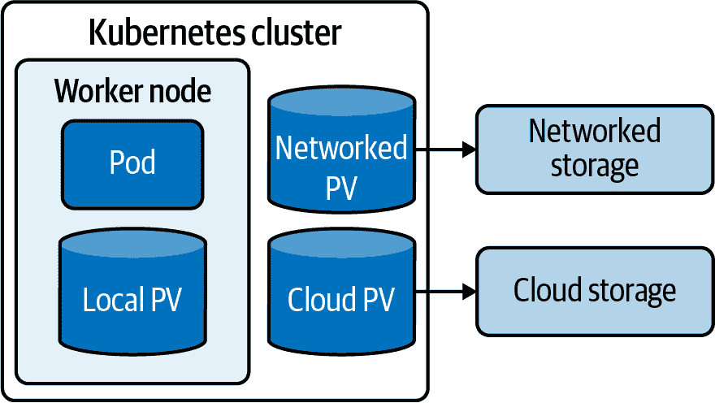
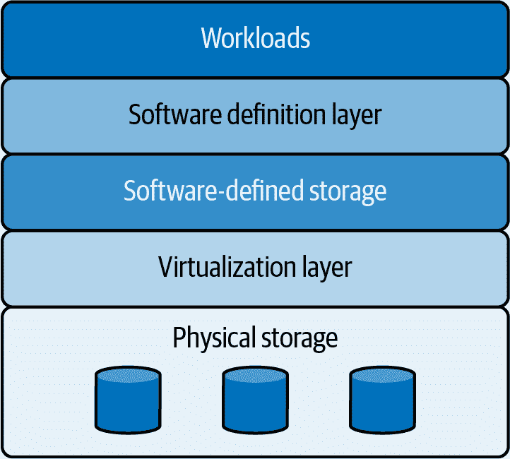
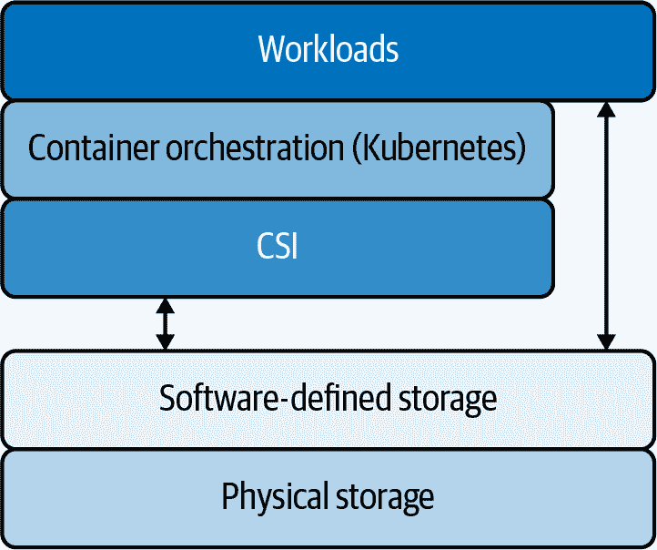
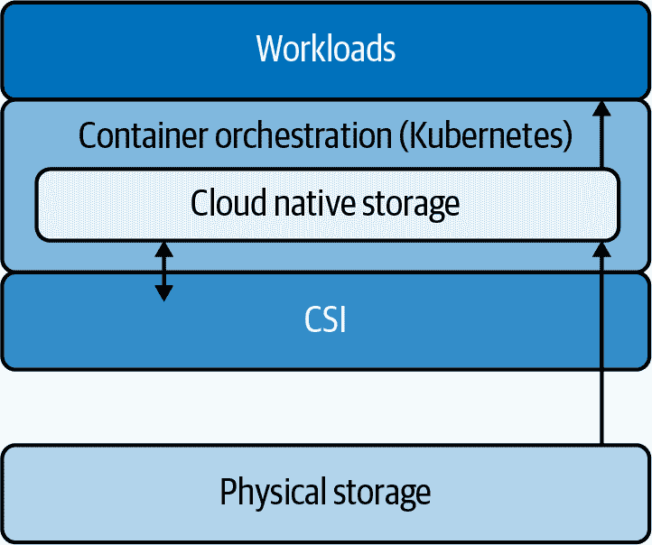

# 第二章：企业级 Kubernetes 存储

要使 Kubernetes 存储适合企业使用，必须解决弹性和规模的问题，以满足大数据的速度和量。云原生存储解决方案已经出现，用于编排持久存储池，这些存储池是*软件定义*的，意味着它们与底层硬件分离。与基于 VM 的环境中的软件定义存储（SDS）解决方案不同，云原生软件定义存储以容器的形式本地运行，可以由处理应用容器的同一编排系统进行管理。这为在 Kubernetes 上运行规模化的容器化应用提供了动态、弹性的存储。本章讨论了 Kubernetes 存储概念，软件定义存储如何为 Kubernetes 带来规模，并介绍了 CSI 如何与软件定义存储一起工作。

# Kubernetes 存储概念

Kubernetes 将应用实体表示为*原语*，这些原语是 Kubernetes 的基本构建块。原语表示真实或逻辑实体，使得 Kubernetes 可以像管理软件对象一样管理它们。存储也不例外。Kubernetes 提供了许多存储原语，包括以下内容：

持久卷（PV）

持久存储单元

持久卷声明（PVC）

一个存储请求，成为 PV 和 Pod 之间的绑定

StatefulSet

一个对象，用于管理一组 Pod 的身份

StorageClass

描述集群提供的存储类别

当考虑如何为 Kubernetes 存储提供企业级规模时，当然还有许多其他原语，但这四个是有趣的。

## 持久卷（PV）

PV 是表示特定位置存储的对象。PV 提供了在使用卷的工作负载或 Pod 的生命周期之外保留数据的能力。PV 可以将工作负载的数据存储在网络存储上，云提供商上，或者本地运行工作负载的 Pod 上（参见图 2-1）。

###### 图 2-1 本地、云和网络持久卷位置

Kubernetes 管理每个 PV 的生命周期，定义以下阶段：

配置

存储管理员预先静态创建 PV，或者使用*StorageClass*动态创建 PV，后者是一种允许管理员描述存储方式的资源。

绑定

PVC 将 PV 绑定到特定容器。

使用

运行在容器上的工作负载使用 PVC 来访问 PV。

发布

容器通过删除 PVC 来解除对卷的索赔。

保留

在需要数据时，PV 保留数据，即使在容器和 Pod 的生命周期之间也是如此。

删除和回收

当数据不再需要时，Kubernetes 删除数据，回收存储空间供其他卷使用。

存储管理员可以根据预测的存储需求动态配置 PV，或者提前创建 PV。

## PersistentVolumeClaim

PVC 同时是存储请求和标识符，一旦授予存储就建立对存储的索赔。PV 本身不归属于特定的应用程序或项目。PVC 使用以下访问模式之一请求对 PV 的访问：

ReadWriteOnce（RWO）

单个节点上所有 Pod 的读写访问

ReadOnlyMany（ROX）

多个节点上的只读访问

ReadWriteMany（RWX）

多个节点的读写访问

ReadWriteOncePod（RWOP）

单个 Pod 的读写访问

PV 和 PVC 一起工作的详细过程如下：

1.  应用程序开发人员创建一个或多个 PVC（Persistent Volume Claim），描述应用程序所需的存储资源。

1.  存储管理员可以根据需要显式创建 PV，或者创建一个可以根据需要动态配置新 PV 的 StorageClass。

1.  Kubernetes 管理将 PVC 绑定到 PV。

PV（Persistent Volume）和 PVC（Persistent Volume Claim）共同为 Pod 提供一种基于容器和应用程序存储需求定义请求的方式。存储管理员可以配置动态的 *provisioners* 来响应这些请求并为其分配存储和 PV，或者根据应用程序的存储需求提前创建 PV。当存储被授予时，集群找到与 PVC 关联的 PV 并将其挂载到 Pod 上。换句话说，Pod 使用 PVC 作为卷。PV 在需要时专门提供给 Pod 使用。

## StatefulSet

StatefulSet 是一种原语，用于管理一组 Pod 的部署和扩展，为每个 Pod 维护一个唯一的 ID，以便在需要持久数据或网络时能够识别该 Pod，或者在 Pod 迁移到不同节点时。通过为 Pod 提供唯一的持久化 ID，StatefulSet API 允许管理员管理一组 Pod 的部署和扩展。当单个 Pod 失败时，持久化 ID 有助于恢复其替换品与现有卷之间的连接。

## StorageClass

`StorageClass` 原语允许集群管理员描述集群提供的不同存储类别。存储类别可以表示不同的策略或服务级别。例如，管理员可以设置不同的 `StorageClass` 对象来表示不同的备份策略。用户可以通过名称请求特定的存储类别。

# 软件定义存储

就像容器化应用架构将应用逻辑与代码运行的硬件解耦一样，软件定义存储将持久数据和存储策略与存储介质解耦。SDS 是分布式的且与硬件无关，并可以在包括云环境在内的各种环境中运行。通过将存储与其硬件抽象化，SDS 可以将硬件容量呈现给应用程序、用户和其他客户端作为统一的存储池。SDS 通过使得可以一致地管理各种不同类型的存储而使存储管理员的工作变得更加容易，而不必担心每种存储类型的不同特性（Figure 2-2）。

###### 图 2-2\. 软件定义存储

就像 Kubernetes 为计算资源带来弹性、扩展性和高可用性一样，SDS 是将这些重要特性引入存储的基础。因为存储被抽象化了，可以构建在不同环境中分发和扩展存储的系统，并将其与 Kubernetes 或其他编排系统集成，并内置容错和高可用性。

企业的优势显而易见：

+   开发者和用户不需要考虑存储硬件。

+   规模变成了按需配置的问题。

+   数据可以根据需要放置在任何地方，无论环境如何。

因为 SDS 将所有可用的物理存储呈现为共享池，资源可以高效分配，减少存储空间的浪费。

# 使用 CSI 将 SDS 连接到 Kubernetes

CSI 是容器化工作负载与第三方存储层之间的接口，使得云原生应用可以在 Kubernetes 外部创建、管理和使用存储。CSI 使得存储在一个池中可供每个应用程序实例访问，保持实例同步，并使得能够一致地备份应用程序。CSI 提供了通过接口对 Kubernetes 进行抽象化访问的功能，意味着第三方可以创建插件，从而在不触及核心 Kubernetes 代码的情况下访问存储系统。使用 CSI，容器化应用可以在这些存储系统上使用正常的 Kubernetes 存储原语（Figure 2-3）。

###### 图 2-3\. 使用容器存储接口将软件定义存储连接到 Kubernetes

CSI 给予存储供应商自由去设计和管理存储，使得 Kubernetes 和其他编排平台能够通过本地抽象透明地提供和管理存储。在撰写本文时，Kubernetes 和 CSI 并不知道如何提供应用程序感知的备份、高可用性或其他企业所需的功能，但 CSI 使得这些能力可以在存储层面添加。这就是 SDS 的作用所在。

软件设计的存储不受硬件或标准的限制，因此可以实现并从底层机制中抽象出所需的任何能力。因此，CSI 是一个进展缓慢的标准并不重要，因为标准应如此。通过将 SDS 连接到 Kubernetes，CSI 使得可以构建适用于 Kubernetes 的存储，该存储在容器级别是粒度化的、自愈的，并且具有拓扑感知，而不需要 Kubernetes 本身具备这些能力。

# 云原生存储：为 Kubernetes 存储引入规模

为容器化工作负载适应传统 SDS 在很多方面都是具有挑战性的。

首先，由于容器是动态且短暂的，它们需要可以在需要时即刻进行提供、挂载和删除的存储。为了高可用性，必须能够根据需要创建和移动卷，并具有拓扑意识，并且定期和自动地备份它们。在规模化时，手动存储配置无法跟上这些需求。

其次，物理和虚拟服务器支持的卷数量通常不足以满足需要存储的 pod 或容器数量。单个主机可能运行数百个小型容器，需要的卷比操作系统提供的还要多。

最后，由于容器的目标是基础架构不可知，它们不应关心所使用的物理存储。不同的环境提供不同类型的存储，通常在单个部署中提供多种类型。必须能够在不影响容器化应用程序运行方式的情况下在存储池之间移动数据。

进入云原生存储，这是为分布式、容器化应用程序设计的 SDS 新模型。云原生存储在集群中以容器形式运行，这意味着它可以被提供和编排，并提供数据本地性以及像 [Stork (Kubernetes 存储操作器运行时)](https://github.com/libopenstorage/stork) 这样的 Kubernetes 集成功能来提供存储感知调度。图 2-4 展示了云原生存储如何成为 Kubernetes 的一部分。

###### 图 2-4\. 云原生存储

云原生存储必须具备容器感知能力，并且所有操作必须在应用程序级别进行。快照、备份、压缩、加密以及其他操作与整个集群或存储池无关，而是与容器本身相关。这一关键点赋予了应用程序所有者对数据的操作控制权，减轻了 IT 管理员对存储配置和应用程序数据保护的责任。

显然，为了在规模化的 Kubernetes 环境中重新定义存储，必须重新思考存储本身的性质。为了满足规模化的容器化应用程序的需求，存储范式必须具备弹性、敏捷性，能够同时为多个应用服务实例提供多个数据副本，并且与应用程序逻辑本身解耦。换句话说，为了为 Kubernetes 数据带来规模化，存储必须是云原生的，这意味着它必须同时具备软件定义和容器化的特性。
