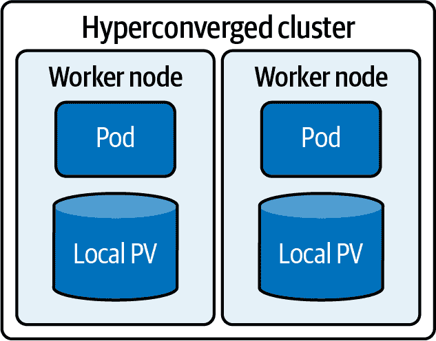

# 第三章：Kubernetes 性能与安全性

随着 Kubernetes 部署变得越来越大规模和普及，企业正在关注性能和安全性，这两者对于业务连续性和成本控制至关重要。性能通过最大化基础设施使用和防止不必要的资源扩展来节省成本。安全性通过保护资产，包括客户数据和其他专有信息，来控制成本并确保业务连续性。

# 没有改变的内容：性能、可用性和安全性要求

随着应用程序从单块式本地部署演变为虚拟机、软件即服务（SaaS）和平台即服务（PaaS）在云中运行，再到现代容器化云原生应用程序，业务需求并未改变。在 Kubernetes 上运行的企业应用程序必须满足诸如高可用性、数据保护和严格的性能指标等不可妥协的业务需求，同时要在混合云或多数据中心间运作。

性能需要适当使用资源，确保有足够的能力满足业务需求，而不过度提供或超支。可用性包括处理硬件故障和网络延迟，并在不动声色地满足 SLA。安全性意味着通过加密、访问控制和深度防御保护敏感资源和数据，同时使它们对有合法业务需求的人员和流程可用。

传统的可用性主要意味着运行时间监控和警报。确保应用程序前端运行不仅足以识别停机，而且通常是问题的唯一可用迹象。幸运的是，单块软件相对简单，用户交互可预测。端到端请求监控不重要，可能在当时对 IT 团队来说显得荒谬。性能不太重要；只要应用程序正常运行，IT 和站点可靠性团队就会满意。

现在必须在容器级别管理性能、可用性和安全性。

今天容器化应用程序的服务高度相互依赖，意味着一个服务的失败可能会导致高度复杂、关键任务的应用程序的部分或全部崩溃。保持应用程序正常运行涉及维护多个关键服务实例，负载平衡它们，并在发生故障时移动或重新启动它们。

# 在全球范围内实现高可用性

对企业来说，全球高可用性是一项不可妥协的业务要求。这必须超越当一些控制平面节点或工作节点失败时保持单个集群的运行。应用状态，包括配置和分布式数据，在预期的任何地方都必须无中断地可用。总之，云原生高可用性要求了解每个应用程序的持久数据、元数据、配置和运行状态。

集群内的高可用性可以简单地通过复制容器、卷和 Kubernetes 服务来实现，以便每种至少有一个实例持续可用。目标是确保没有单点故障。跨本地或地理区域的高可用性涉及在不同数据中心之间同步或异步复制数据和应用程序。这些策略使企业能够选择平衡硬件或云资源成本与业务目标的策略。

高可用性的关键，无论是在本地还是全球范围内，是存储和数据复制机制保持应用一致性。这意味着它们捕获了保持服务持续运行或重新启动业务流程所需的所有数据和元数据。这不仅包括持久数据，还包括应用配置和运行状态。仅仅备份虚拟机或复制卷不够，因为它们只捕获了服务或应用程序继续运行所需的部分数据。此外，由于无法保证单个卷和容器的持久性，必须有一种方式来识别应用程序和数据，以便正确关联替代实例。

# 数据流动性

高可用性的关键之一是*数据流动性*，定义为在单个数据中心或云内部，或者在云之间快速移动或复制数据的能力。这种能力不仅支持高可用性，还支持升级、迁移、扩展和灾难恢复。

随着企业采用云计算，数据流动性的重要性变得越来越明显。很明显，单一的部署环境或提供商已不足以满足所有业务需求。组织需要灵活性，在公共云、私有云、本地服务器和边缘数据中心之间进行权衡，以增加灵活性，满足数据位置的法规要求，提供更好的服务，并控制成本。

随着 Kubernetes 的出现，能够在不同的多云和混合云环境中移动大量数据变得至关重要。虽然 Kubernetes 可以轻松地在任何地方部署应用程序，但长期以来，移动基础数据一直更加困难。需要的是一种方法，使移动持久卷与迁移应用容器同样简单。

容器本机存储只是一部分战斗。通过在任何部署环境中提供数据和存储管理，容器本机存储池为数据提供了一个家园。但是，传统的数据迁移和复制方法耗时且操作复杂，无法在需要时迁移数据。需要的是一个容器感知的数据编排层，它可以为应用程序本身提供 Kubernetes 提供的声明性自动化。在应用程序迁移时，通常不实际在短时间内移动所有应用程序数据。数据移动必须包括首先移动最重要数据的能力，以便通过最小化必须移动的数据量，使应用程序在新位置快速启动。

数据移动能够使企业在多方面改善运营。通过将低优先级应用程序移动到辅助集群，企业可以释放关键集群的容量，为额外数据或复制腾出空间。自动化数据移动使得测试新版本更加容易，促进从开发到分段集群的工作负载或维护两个或更多生产环境。在在环境之间移动应用程序和数据或者将集群脱机以进行硬件维护和升级时，数据移动对于持续可用性至关重要。

# 调整 Kubernetes 数据以实现企业级性能

随着企业推动云原生应用程序规模越来越大，调整 Kubernetes 数据对于平衡性能、成本和可用性日益重要。尽管有许多因素影响 Kubernetes 集群的性能，但其中一个最重要的因素是做出关于数据的正确选择。有两个重要的考虑因素：整体存储配置和数据放置。

存储配置意味着确定所需的存储硬件类型及其设置方式。您可以设置单个存储池或多个每个定义其自身 StorageClass 的存储池，例如。您需要考虑成本与容量以及速度之间的权衡，确定存储层允许多少内存和 CPU 的使用，以及您将需要多少种不同类型的存储。在本地数据中心环境中，这些问题尤为重要，因为决策可能会对未来数年产生影响。在云端或混合环境中，可以更灵活地从小开始，然后根据需要进行扩展或更改。

*数据放置*，或*数据拓扑*，指的是管理数据存储位置的策略，通常是为了实现性能或可用性目标。为了获得最大性能，一种策略是*超融合*，它将工作负载及其数据保持在单个节点中（图 3-1）。如果节点故障，则数据丢失，但这可能是可以接受的。

###### 图 3-1\. 超融合拓扑

在超融合拓扑中，存储通常是软件定义的层，通常在计算节点共享的普通服务器上。超融合非常灵活，允许存储与计算工作负载同步扩展。然而，由于单个节点的故障不仅影响该服务器的工作负载，还会影响存储系统，因此从操作和安全的角度来看，超融合拓扑的管理可能更为复杂。在其他节点上存储数据的额外副本，可以在故障后使新的工作负载实例恢复到真正的超融合拓扑，从最近写入副本的数据开始。

为了提高可用性，数据可以与工作负载分开。将计算和存储节点分开（称为*去分配*）虽然会降低性能，但在节点故障时可以防止数据丢失。对于一个非常动态的环境，其中计算节点的数量会根据工作负载需求的变化而增加或减少，一个策略是将计算和存储分离到各自的集群中（图 3-2）。这样，计算集群的扩展和管理操作不会干扰存储集群，反之亦然。

###### 图 3-2\. 去分配拓扑

# 保持集群安全

现代安全实践采用*深度防护*策略，这意味着多个安全控制层次协同工作，提供冗余，以便在某一层次的漏洞不会导致对关键系统的访问。云原生安全也不例外：云层、集群、容器和代码本身的保护相互依赖，旨在防止应用和数据被未经授权的访问。

环境是第一层防护。数据中心或云的安全性较高，保护集群及其服务就更加容易。集群则必须在物理节点、虚拟机、容器等层面提供安全机制。

在容器层面，服务必须能够与 SDS 安全地通信。Kubernetes 提供了控制容器访问权限、限制资源使用和防止容器执行危险或不需要的操作的机制。存储层必须通过加密静态和动态数据、限制对特定客户端的访问以及利用应用和 API 知识，仅允许合理的数据事务来履行其职责。
