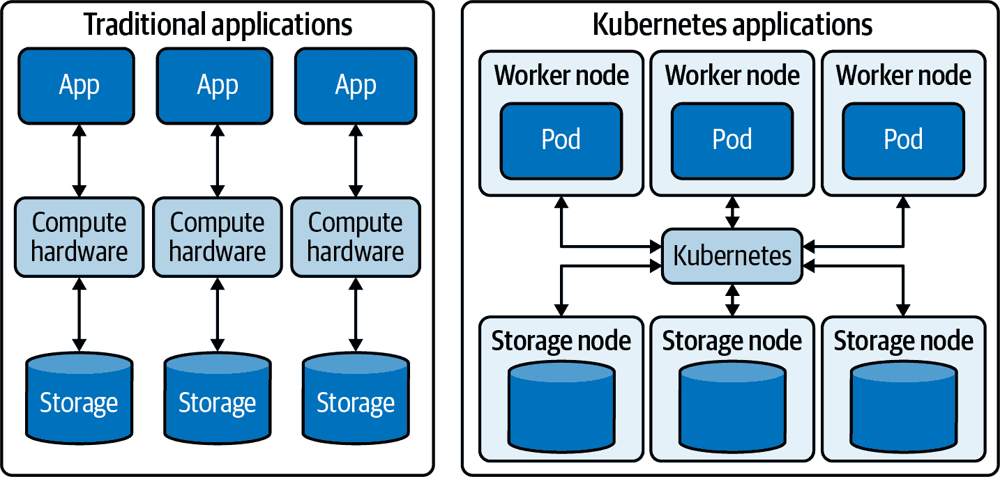
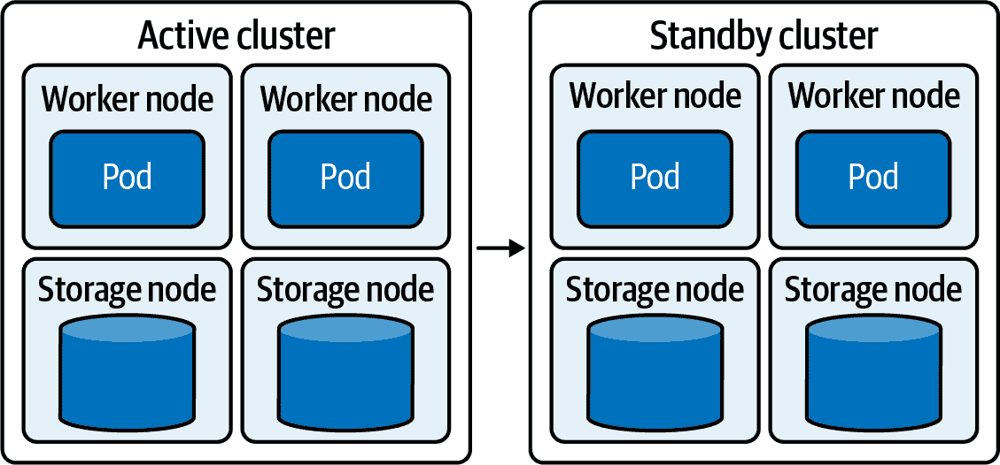

# 第四章：数据保护与 Kubernetes

数据保护涵盖了广泛的实践和概念，包括高可用性、备份、灾难恢复以及支持业务连续性的其他过程。每个企业都维护和测试数据保护政策和程序，以最小化停机时间，并确保在中断后能够继续运营。在过去几年中，数据保护也已成为合规性的重要组成部分。此外，数据保护策略必须提供数据隐私，因为法规开始解决企业日常处理的大量敏感个人数据。

# Kubernetes 数据保护挑战

传统数据保护主要集中在物理或虚拟机的层面上，通过保护服务器本身来保护应用程序和数据。这种方法对于在单个主机上运行的应用程序非常有效。然而，对于容器化应用程序来说，仅在服务器级别进行保护显然不够细粒度化。针对整个服务器进行保护会导致应用程序、存储和配置无法分离，并混合了需要不同数据保护策略的应用程序。

只有通过在容器级别提供数据保护，才能按照应用程序、容器或 Kubernetes 存储单元的个体应用策略。在 Kubernetes 环境中，数据保护必须在 Kubernetes 资源级别可用，并且必须包括对整个集群中分布式数据层的认证和授权。备份和灾难恢复必须集成到容器编排环境本身。

因为每个应用程序都很复杂，并且由于企业集群中运行的应用程序数量庞大，手动备份策略是不切实际的。唯一的前进之路是自动化；然而，这里面也充满了复杂性。

## 规模

容器化应用程序关注的是规模，包括必须以高速处理的大量数据。大规模数据需要备份解决方案能够从各种环境中的多个来源收集数据，并有效地管理和聚合这些数据。这些需求包括能够备份多节点和多容器应用程序，包括数据、应用程序配置和状态。

## 分布式架构

云原生架构使数据保护变得具有挑战性。由于应用程序由容器管理的松耦合微服务组成，传统的机器集中型数据保护策略已经不再适用。传统的备份解决方案仅捕获应用程序运行的虚拟机的整个状态。然而，对于分布式、容器化的应用程序来说，这种方法不适用，因为状态本身是分布式的。图 4-1 展示了传统应用程序在虚拟机上运行与云原生、容器化应用程序在 Kubernetes 上运行之间的区别。

###### 图 4-1\. 传统应用与容器化应用

云原生应用程序通常高度分布，经常跨越多个地理位置的多个云。容器化应用程序部署通常跨越公共和私有云，有时也在本地部署。在这些环境中，数据保护必须能够识别容器，并能够与容器编排框架集成。

## 命名空间

Kubernetes 的*命名空间*是将单个集群分成不同隔离组的机制，可以用来为不同业务单元分配资源或将应用程序分组在一起。IT 管理员可能需要同时备份运行在特定命名空间中的所有应用程序。由于命名空间可以包含大量的 Pod，因此尝试手动操作通常是不切实际的。但传统的备份工具不了解 Kubernetes 命名空间模型，无法与 Kubernetes API 集成，因此只能手动备份每台机器，别无选择。

## 恢复点目标和恢复时间目标

一些应用程序处理的是即时关键数据。其他应用程序可能需要长期的数据保真性，同时能够容忍瞬时中断，或者处理的数据既不是时效性敏感也不是关键任务。明智的做法是根据合规性、重要性以及对业务重要性的其他方面为每个应用程序设置不同的策略。

每个应用程序和每种数据类型可能需要自己的数据保护策略，具有自己的恢复点目标（RPO）和恢复时间目标（RTO）：

+   RPO 决定了备份频率，表示可恢复数据的最新性。

+   RTO 是在中断后恢复运营所允许的最大时间量。

RPO 和 RTO 策略由业务中断的潜在影响以及业务根据涉及的应用程序和数据类型可以实际承受的数据量决定。

在大规模分布式应用程序中，为了满足特定的 RPO 和 RTO，通常需要维护额外的数据集群或快速移动大量数据以实现高可用性和快速恢复。在现代的云原生环境中，为了达到这些目标，您需要自动化和应用程序感知的工具，能够与 Kubernetes 的抽象和 API 配合工作，保护容器级别的数据。

持续集成/持续交付（CI/CD）流水线是一个能够容忍中等 RPO 和 RTO 的环境的良好示例。开发工具很重要，但它们不会立即影响客户体验。对于这些应用程序，一些数据丢失或工作流中断是可以接受的。

对于客户直接接触的应用程序，特别是处理敏感客户数据的应用程序，数据保护必须更加严格。对于这些应用程序，RPO 和 RTO 都非常重要。能够恢复到最近的数据点并快速解决中断是关键。有时需要在数据中心之间进行灾难恢复，或者从一个活动数据中心切换到另一个。

最关键的应用程序是那些不能承受任何数据丢失并且只能容忍非常短暂中断的应用程序，例如事务处理工具。这意味着非常短的 RTO 时间和零的 RPO，这是需要满足的严格要求。这只能通过每个集群内的高可用性、备份与恢复，并且具有合规焦点的多数据中心同步来实现，从而支持地理区域间的高可用性和故障转移。

## 应用程序类型的数据保护

不同的应用程序不仅存储不同类型和格式的数据，还采用不同的数据策略。例如，数据库应用程序将大部分数据存储在表中，但也维护应用程序状态、写入应用程序日志并消耗配置文件。对于在 VM 上运行的传统应用程序，解决方案很简单：VM 的备份保留了所有内容，包括应用程序状态。对于分布式应用程序，情况并非如此。Kubernetes 的备份、灾难恢复和其他数据保护过程必须了解应用程序和 API 的特定需求，而不是采用通用方法。

由于应用程序状态是分布式的，备份解决方案必须了解每个应用程序如何使用数据，并且必须能够找到和保护应用程序使用的所有不同类型的数据。例如，一个应用程序感知的备份工具可能知道特定应用程序在缓存中保留了待写入的队列，并可能要求应用程序在拍摄快照之前将其写入磁盘，以便捕捉应用程序状态的完整视图。

# Kubernetes 数据保护策略

Kubernetes 数据保护策略必须提供高可用性、备份与恢复以及数据中心内外的故障转移。这些功能必须是自动化的、应用感知的，并且能够为企业规模进行扩展。数据保护必须对容器级别进行细化，并了解 Kubernetes 的拓扑、存储和抽象。最后，任何解决方案都必须支持企业可能需要的不同应用程序、业务需求、数据和 SLA。

## 容器感知的备份与恢复

传统的备份和恢复方法是在机器级别保护应用程序和数据。通过备份机器，可以恢复机器上应用程序的先前运行状态。这种方法适用于在单个主机上离散运行的应用程序，但不适用于分布在集群中多个节点上的基于微服务的应用程序。因此，您必须能够定位集群中应用程序的数据，以创建*应用程序一致*的备份，这意味着该过程一次性复制所有应用程序的卷和状态。应用程序一致的备份需要具有应用程序领域特定知识，以正确定位所有卷并捕获应用程序状态。未能以应用程序感知的方式备份数据可能导致数据损坏和丢失。

Kubernetes 备份工具必须能够与 Kubernetes API 集成，了解 Kubernetes 计算和存储资源，并能够映射集群拓扑，以便能够备份一组 Pod 或整个命名空间。最后，Kubernetes 备份工具必须了解不同应用程序的不同要求，并能够捕获和恢复持久存储以及应用程序状态和配置。换句话说，系统必须知道如何处理构成应用程序的不同 Kubernetes 对象，而不是尝试备份节点本身。

随着云原生架构的普及，数据保护正在从 IT 部门转变为多个团队共同承担的责任，包括应用程序所有者在内。传统备份集中在一个地方，而容器感知备份为应用程序所有者提供了基于角色的自助服务能力，包括设置他们自己的备份策略和规则，以确保备份是应用程序一致的。

容器化应用程序设计用于扩展，备份解决方案必须能够随之扩展。单个应用程序可以扩展到数千个对象，企业可能运行数百或数千个这样的应用程序。Kubernetes 备份解决方案必须处理成千上万个对象和存储卷。

## 单数据中心内的数据保护

在单个 Kubernetes 集群中的数据保护涉及确保 Kubernetes 组件和应用程序的高可用性，并维护适当的数据复制。这主要意味着设置 Kubernetes 以避免任何服务或卷的单点故障。

复制策略因应用类型和业务需求而异。简单的应用程序不处理自己的复制，依赖底层存储层可靠地可用。当这些应用程序处理的数据是短暂的且价值较低时，只保留一份副本可能是可以接受的，假设存储卷所在节点的故障不会对其造成太大影响。对于更重要的数据，当然应该配置存储层以提供足够的复制，既用于数据保护又用于可用性。对于重要且需求量大的数据，跨更多集群的更多副本可以为更多客户提供低延迟的服务。一些应用程序处理自己的复制。对于这些应用程序，存储的主要任务是在卷（或其节点）失败时提供替代存储。

## 跨数据中心的灾难恢复

综合的数据保护策略应该在数据中心内部的保护之外，通过故障转移和灾难恢复到位于不同数据中心的次级或备用集群。在这种情况下，活动集群使用由 RPO 和 RTO 要求确定的时间轴向备用集群复制数据和配置，保持同步，以便在活动集群故障时接管。图 4-2 显示了从一个数据中心到另一个数据中心的复制。

###### 图 4-2\. 在单独的数据中心中从活动集群到备用集群的复制

当将数据复制到另一个数据中心时，重要的是要了解接收集群的拓扑结构，以便将副本适当地分布在节点之间，无论是为了性能还是安全性的原因。在节点故障的情况下，复制的数据必须提供高可用性和高性能的访问，并防范数据丢失。

有两种策略来保持数据中心同步：同步复制适用于需要严格的 RPO 和 RTO 时间或立即故障转移的数据；而异步复制适用于可以容忍一些数据丢失或不可用性的数据。

同步复制确保所有写入活动集群的数据都复制到备用集群。只有在写入到备用集群完成时，写入到活动集群才被认为是完成的。这种方法具有挑战性，因为它需要非常低的延迟来保持写入性能，但其好处是支持如交易等重要数据的 RPO 为零。在无法实现足够低延迟的环境中，必须能够在个别卷和对象的级别设置迁移策略，允许较不关键的数据异步复制以节省带宽。

异步复制按计划将数据从一个集群复制到另一个集群，不保证集群完全同步，但节省网络带宽。可以容忍适量数据丢失或停机时间的应用可以使用异步复制来达到适当的 RPO 和 RTO。RPO 取决于从活动集群复制到备用集群的数据的最新程度。RTO 取决于在活动集群不可用时恢复应用到完全功能所需的时间。
