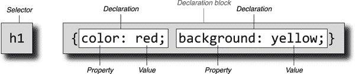
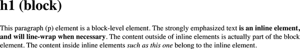
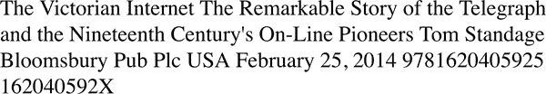
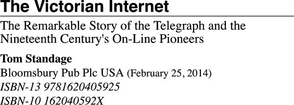
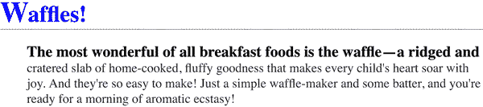
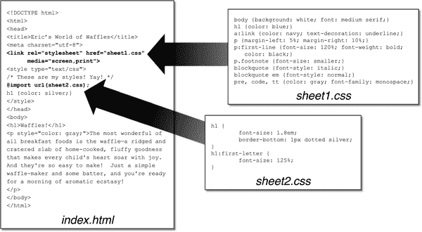
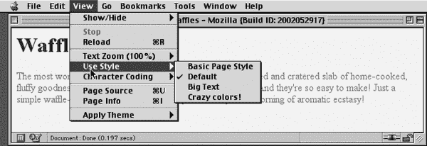

# 第一章：CSS 基础

*层叠样式表*（*CSS*），一种强大的编程语言，可以转换文档或文档集的呈现方式，已经传播到 Web 的几乎每个角落，以及许多表面上非 Web 的环境。例如，嵌入式设备显示器通常使用 CSS 来设计其用户界面，许多 RSS 客户端允许您对提要和提要条目应用 CSS，一些即时消息客户端使用 CSS 来格式化聊天窗口。CSS 的语法甚至可以在 JavaScript（JS）框架及 JS 本身中找到。它无处不在！

# （Web）样式的简要历史

CSS 最初于 1994 年提出，正当 Web 开始真正流行起来。那时，浏览器为用户提供了各种样式控制权——例如，NCSA Mosaic 中的展示偏好允许用户定义每个元素的字体系列、大小和颜色。但这些对文档作者并不可用；他们只能标记内容片段为段落、某个级别的标题、预格式化文本或其他十几种元素类型之一。如果用户配置他们的浏览器，使所有一级标题变小和粉红色，而所有六级标题变大和红色，那就是他们的事情了。

正是在这样的环境中引入了 CSS。它的目标是为 Web 页面作者提供一种简单的声明式样式语言，既灵活又能为作者和用户提供样式化能力。通过*级联*，这些样式可以结合和优先级，以便站点作者和读者都能发言——尽管读者始终有最后的发言权。

工作迅速推进，到 1996 年末，CSS1 完成。尽管 CSS 的每个部分单独来看都相当简单，但这些部分的组合却产生了一些令人惊讶的复杂行为。不幸的错误也发生了，比如盒模型实现中的臭名昭著的不一致。这些问题曾经威胁要完全破坏 CSS，但幸运的是一些聪明的提案得以实施，浏览器开始协调一致。几年后，由于不断增加的互操作性以及高调的开发，比如基于 CSS 的*Wired*杂志重设计和 CSS Zen Garden，CSS 开始流行起来。

在所有这些发生之前，CSS 工作组在 1998 年初完成了 CSS2 规范。一旦 CSS2 完成，CSS3 的工作立即开始，同时还有 CSS2 的澄清版本称为 CSS2.1。符合时代精神，最初被称为*CSS3*的内容被构建为一系列（理论上）独立的模块，而不是单一的整体规范。这种方法反映了当时活跃的 XHTML 规范，出于类似的原因被分割为模块。

将 CSS 模块化的理由是，每个模块可以按照自己的节奏进行工作，特别关键（或流行）的模块可以在世界范围内的万维网联盟（W3C）进展轨迹中推进，而不会被其他模块所阻碍。事实上，情况确实如此。到 2012 年初，三个 CSS Level 3 模块（以及 CSS1 和 CSS 2.1）已经达到了完整的推荐状态——CSS Color Level 3、CSS Namespaces 和 Selectors Level 3。与此同时，还有七个模块处于候选推荐状态，其他几十个模块则处于不同的工作草案阶段。按照旧的方法，颜色、选择器和命名空间必须等待规范的每个其他部分完成或被删减，才能成为完成规范的一部分。多亏了模块化，它们无需等待。

因此，虽然我们无法指出一个单一的文档并说：“这就是 CSS”，但我们可以按照它们所引入的模块名称来讨论其特性。模块的灵活性远远超过了它们有时会造成的语义尴尬。 （如果您想要类似单一的庞大规范，CSS 工作组每年都会发布“快照”文档。）

有了这个基础，我们准备开始理解 CSS。让我们从涵盖样式表中的基础知识开始。

# 样式表内容

在样式表中，您会发现许多 *规则*，看起来有点像这样：

```
h1 {color: maroon;}
body {background: yellow;}
```

这些样式构成了任何样式表的主体部分——简单或复杂，短或长。但是哪些部分是什么，它们代表了什么？

## 规则结构

为了更详细地说明规则的概念，让我们来分解结构。

每个 *规则* 由两个基本部分组成：选择器和声明块。声明块由一个或多个声明组成，每个声明由属性和值对组成。每个样式表由一系列这些规则组成。 图 1-1 显示了规则的各个部分。



###### 图 1-1\. 规则的结构

*选择器* 显示在规则的左侧，定义了将被选中进行样式化的文档部分。在 图 1-1 中，选中的是 `<h1>`（一级标题）元素。如果选择器是 `p`，那么所有 `<p>`（段落）元素都将被选中。

规则的右侧包含*声明块*，它由一个或多个声明组成。每个*声明*由 CSS *属性*和该属性的*值*组成。在图 1-1 中，声明块包含两个声明。第一个声明指定了该规则将使文档中的部分以`color`为`red`显示，第二个声明指定了文档的一部分将以`background`为`yellow`。因此，文档中所有的`<h1>`元素（由选择器定义）将以红色文字和黄色背景样式显示。

## 供应商前缀

有时你会看到 CSS 片段的前面有连字符和标签，比如`-o-border-image`。这些*供应商前缀*是浏览器供应商标记属性、值或其他 CSS 部分为实验性或专有（或两者兼有）的一种方式。截至 2023 年初，一些供应商前缀仍在使用中，其中最常见的如表 1-1 所示。

表 1-1\. 一些常见的供应商前缀

| 前缀 | 供应商 |
| --- | --- |
| `-epub-` | 国际数字出版论坛 EPUB 格式 |
| `-moz-` | 基于 Gecko 的浏览器（例如 Mozilla Firefox） |
| `-ms-` | 微软 Internet Explorer |
| `-o-` | 基于 Opera 的浏览器 |
| `-webkit-` | 基于 WebKit 的浏览器（例如 Apple Safari 和 Google Chrome） |

如表 1-1 所示，供应商前缀的通常接受格式是一个连字符、一个标签和一个连字符，尽管一些前缀错误地省略了第一个连字符。

供应商前缀的使用和滥用非常复杂，超出了本书的范围。简单地说，它们最初是供应商测试新功能的一种方式，有助于加速互操作性，而不必担心被锁定在与其他浏览器不兼容的遗留行为中。这避免了几乎扼杀 CSS 在初期阶段的整个问题类别。不幸的是，带前缀的属性随后被 Web 作者公开部署，最终导致了一整套新问题。

截至 2023 年初，供应商前缀的 CSS 特性几乎不存在，旧的带前缀的属性和值正在被浏览器逐步移除。你很可能永远不会编写带前缀的 CSS，但你可能会在现有代码库中遇到它或者继承它。这里有一个例子：

```
-webkit-transform-origin: 0 0;
-moz-transform-origin: 0 0;
-o-transform-origin: 0 0;
transform-origin: 0 0;
```

这句话重复了四次：分别针对 WebKit、Gecko（Firefox）和 Opera 浏览器行，最后是 CSS 标准的方式。再次强调，这已经不再必要。我们在这里只是为了让你对将来可能遇到的情况有所了解。

## 空白处理

CSS 基本上不敏感于规则之间的空白，而且在规则内部的空白也大多不敏感，尽管存在一些例外。

通常情况下，CSS 对待空白符的方式与 HTML 相同：任何空白字符序列都会被解析为单个空格。因此，你可以按以下方式格式化这个假设的 `rainbow` 规则，

```
rainbow: infrared  red  orange  yellow  green  blue  indigo  violet  ultraviolet;

rainbow:
   infrared  red  orange  yellow  green  blue  indigo  violet  ultraviolet;

rainbow:
   infrared
   red
   orange
   yellow
   green
   blue
   indigo
   violet
   ultraviolet
   ;
```

以及你可以想象到的任何其他分隔模式。唯一的限制是分隔字符必须是空白符：一个空格，一个制表符或一个换行符，单独或组合，任意数量。

类似地，你可以以任何喜欢的方式使用空白符格式化一系列规则。这只是无数可能性中的五个示例之一：

```
html{color:black;}
body {background: white;}
p {
  color: gray;}
h2 {
     color : silver ;
   }
ol
   {
      color
         :
      silver
         ;
}
```

如你从第一条规则中看到的，空白符可以大大省略。事实上，在*最小化*的 CSS 中通常都是这种情况，即通过某种自动化的服务器端脚本删除了每一个可能多余的空白。在前两条规则之后的规则中，使用越来越多的空白，直到在最后一条规则中，几乎所有可以分离到自己一行的内容都已经这样做。

所有这些方法都是有效的，因此你应该选择最合乎逻辑——即在你看来最容易阅读的格式，并坚持使用它。

## CSS 注释

CSS 允许注释。这些与 C/C++ 中的注释非常相似，因为它们被 /`*` 和 `*`/ 包围：

```
/* This is a CSS comment */
```

注释可以跨多行，就像在 C++ 中一样：

```
/* This is a CSS comment, and it
can be several lines long without
any problem whatsoever. */
```

重要的是要记住，CSS 注释不能嵌套。因此，例如，这种方式是*不正确*的：

```
/* This is a comment, in which we find
 another comment, which is WRONG
 /* Another comment */
 and back to the first comment, which is not a comment.*/
```

###### 警告

如果在样式表中临时注释掉一个已包含注释的大块样式表，就可能意外创建“嵌套”注释。由于 CSS 不允许嵌套注释，“外部”注释将在“内部”注释结束处结束。

不幸的是，CSS 中没有像 `//` 或 `#`（后者保留给 ID 选择器）那样的“行末注释”模式。CSS 中唯一的注释模式是 /`*` `*`/。因此，如果你希望在标记的同一行上放置注释，你需要小心如何放置它们。例如，这是正确的方式：

```
h1 {color: gray;}   /* This CSS comment is several lines */
h2 {color: silver;} /* long, but since it is alongside */
p {color: white;}   /* actual styles, each line needs to */
pre {color: gray;}  /* be wrapped in comment markers. */
```

根据此示例，如果每行都没有被标记，样式表的大部分将成为注释的一部分，因此将无法起作用：

```
h1 {color: gray;}   /* This CSS comment is several lines
h2 {color: silver;}  long, but since it is not wrapped
p {color: white;}    in comment markers, the last three
pre {color: gray;}   styles are part of the comment. */
```

在这个示例中，只有第一条规则（`h1 {color: gray;}`）将应用于文档。其余的规则作为注释的一部分将被浏览器的渲染引擎忽略。

###### 注意

CSS 解析器将 CSS 注释视为根本不存在，因此在解析目的上不计入空白符。这意味着你可以将它们放在规则的中间——甚至直接放在声明内部！

## 标记

*在样式表中没有标记*。这似乎是显而易见的，但你可能会感到惊讶。唯一的例外是 HTML 注释标记，出于历史原因允许在 `<style>` 元素内部使用：

```
<style><!--
h1 {color: maroon;}
body {background: yellow;}
--></style>
```

就是这样，甚至这样也不再推荐；那些需要它的浏览器已经几乎消失了。

谈到标记，现在是时候稍微偏离一下，讨论我们的 CSS 将用于样式化的元素，以及这些元素如何受 CSS 在最基本的方式影响。

# 元素

*元素* 是文档结构的基础。在 HTML 中，最常见的元素很容易识别，例如 `<p>`、`<table>`、`<span>`、`<a>` 和 `<article>`。文档中的每个元素都在其呈现中发挥作用。

## 替换元素和非替换元素

尽管 CSS 依赖于元素，但并非所有元素都是平等的。例如，图片和段落不是同一类型的元素。在 CSS 中，元素通常有两种形式：替换和非替换。

### 替换元素

*替换元素* 用于指示将由文档本身不直接表示的内容替换的内容。可能最常见的 HTML 示例是 `` 元素，它将替换为文档本身外部的图像文件。事实上， `` 没有实际的内容，正如您可以在这个简单的示例中看到的：

```

```

此标记片段仅包含一个元素名称和一个属性。除非您将其指向外部内容（在本例中，由`src`属性给出位置的图像文件），否则该元素不显示任何内容。如果指向有效的图像文件，则图像将显示在文档中。如果不是，则浏览器将显示空白或显示“损坏图像”占位符。

同样，`input`元素也可以被替换—可以是单选按钮、复选框、文本输入框或其他，具体取决于其类型。

### 非替换元素

大多数 HTML 元素都是*非替换元素*。它们的内容由用户代理（通常是浏览器）在元素本身生成的框内呈现。例如，`<span>hi there</span>`是一个非替换元素，文本“hi there”将由用户代理显示。这适用于段落、标题、表格单元、列表和几乎 HTML 中的所有其他元素。

## 元素显示角色

CSS 有两种基本的显示角色：*块格式化上下文* 和 *行内格式化上下文*。还有许多其他显示类型存在，但这些是最基本的，大多数情况下，其他显示类型都与它们相关。块和行内上下文对于那些熟悉 HTML 标记及其在 Web 浏览器中显示的作者来说应该是很熟悉的。显示角色在图 1-2 中有所说明。



###### 图 1-2\. HTML 文档中的块级和行内级元素

### 块级元素

默认情况下，*块级元素*生成一个元素框，（默认情况下）填充其父元素的内容区域，并且不能在其两侧有其他元素。换句话说，在元素框前后会生成“断点”。来自 HTML 的最常见的块级元素是 `<p>` 和 `<div>`。替换元素可以是块级元素，但通常不是。

在 CSS 中，这被称为元素生成一个*块级格式化上下文*。这也意味着该元素生成一个块级*外部显示类型*。元素内部的部分可能具有不同的显示类型。

### 内联级别元素

默认情况下，*内联级别元素*在文本行中生成一个元素框，并且不会打断该行的流程。最佳的内联元素示例是 HTML 中的`<a>`元素。其他候选元素包括`<strong>`和`<em>`。这些元素在自身之前或之后不生成“断行”，因此它们可以出现在另一个元素的内容中，而不会破坏其显示。

在 CSS 中，这被称为元素生成一个*内联格式化上下文*。这也意味着该元素生成一个*内联外部显示*类型。元素内部的部分可能具有不同的显示类型。（在 CSS 中，对于显示角色如何嵌套在彼此中没有限制。）

为了看看它是如何工作的，让我们考虑 CSS 属性`display`。

你可能已经注意到这里有*很多*值，其中只提到了两个：`block`和`inline`。这些值中的大多数在本书的其他地方有详细介绍；例如，`grid`和`inline-grid`在第十二章中有讲述，而与表格相关的值则都在第十三章中有详细介绍。

现在，让我们集中讨论`block`和`inline`。考虑以下标记：

```
<body>
<p>This is a paragraph with <em>an inline element</em> within it.</p>
</body>
```

这里我们有两个元素（`<body>`和`<p>`），它们生成块级格式化上下文，还有一个元素（`<em>`）生成内联格式化上下文。根据 HTML 规范，`<em>`可以是`<p>`的后代，但反过来不成立。通常，HTML 层次结构使内联元素从块级元素派生，但反之则不然。

另一方面，CSS 则没有这样的限制。您可以保留标记不变，但更改两个元素的显示角色如下：

```
p {display: inline;}
em {display: block;}
```

这导致元素在内联框内生成一个块框。这是完全合法的，不违反 CSS 的任何部分。

虽然改变元素的显示角色在 HTML 文档中可能很有用，但对于 XML 文档而言，这变得非常关键。XML 文档不太可能具有任何固有的显示角色，因此由作者定义这些角色。例如，您可能想知道如何布置以下 XML 片段：

```
<book>
 <maintitle>The Victorian Internet</maintitle>
 <subtitle>The Remarkable Story of the Telegraph and the Nineteenth Century's
   On-Line Pioneers</subtitle>
 <author>Tom Standage</author>
 <publisher>Bloomsbury Pub Plc USA</publisher>
 <pubdate>February 25, 2014</pubdate>
 <isbn type="isbn-13">9781620405925</isbn>
 <isbn type="isbn-10">162040592X</isbn>
</book>
```

由于`display`的默认值是`inline`，因此内容将按默认情况下呈现为内联文本，如图 1-3 所示。这并不是一个非常有用的显示。



###### 图 1-3\. XML 文档的默认显示

您可以通过`display`来定义布局的基础：

```
book, maintitle, subtitle, author, isbn {display: block;}
publisher, pubdate {display: inline;}
```

现在我们将七个元素中的五个设置为块级，两个设置为内联。这意味着每个块级元素将生成自己的块级格式化上下文，而两个内联元素将生成自己的内联格式化上下文。

我们可以将前述规则作为起点，添加一些其他样式以获得更大的视觉冲击，并得到 图 1-4 中显示的结果。



###### 图 1-4\. XML 文档的样式化显示

话虽如此，在详细学习如何编写 CSS 之前，我们需要看看如何将 CSS 与文档关联起来。毕竟，如果没有将两者联系起来，CSS 就无法影响文档。我们将在 HTML 设置中探讨这一点，因为这是最熟悉的。

# 将 CSS 和 HTML 结合起来

我们已经提到 HTML 文档具有固有的结构，这是值得重申的一点。事实上，这也是旧网页的问题之一：我们中的许多人忘记了文档应该具有内部结构，这与视觉结构完全不同。在我们急于创建网上最酷的页面时，我们扭曲了和忽视了页面应该包含带有某些结构含义的信息的概念。

这种结构是 HTML 和 CSS 之间关系的固有部分；如果没有它，就根本不可能有关系。为了更好地理解它，让我们看一个例子 HTML 文档，并逐步分解它：

```
<!DOCTYPE html>
<html lang="en-us">
<head>
  <meta charset="utf-8">
  <meta name="viewport" content="width=device-width">
  <title>Eric's World of Waffles</title>
  <link rel="stylesheet" media="screen, print" href="sheet1.css">
  <style>
    /* These are my styles! Yay! */
    @import url(sheet2.css);
  </style>
</head>
<body>
  <h1>Waffles!</h1>
  <p style="color: gray;">The most wonderful of all breakfast foods is
  the waffle—a ridged and cratered slab of home-cooked, fluffy goodness
  that makes every child's heart soar with joy. And they're so easy to make!
  Just a simple waffle-maker and some batter, and you're ready for a morning
  of aromatic ecstasy!
  </p>
</body>
</html>
```

图 1-5 显示了此标记的结果和应用的样式。



###### 图 1-5\. 一个简单的文档

现在，让我们来看看这个文档连接到 CSS 的各种方式。

## `<link>` 标签

首先，考虑 `<link>` 标签的使用：

```
<link rel="stylesheet" href="sheet1.css" media="screen, print">
```

`<link>` 标签的基本目的是允许 HTML 作者将其他文档与包含 `<link>` 标签的文档关联起来。CSS 使用它将样式表链接到文档中。

这些样式表不是 HTML 文档的一部分，但仍然被其使用，称为 *外部样式表*。这是因为它们是外部于 HTML 文档的样式表。（看看这个。）

要成功加载外部样式表，应将 `<link>` 放置在 `<head>` 元素内，尽管它也可以出现在 `<body>` 元素内。这将导致 Web 浏览器定位并加载样式表，并使用它包含的任何样式来呈现 HTML 文档；图 1-6 描述了称为 *sheet1.css* 的样式表链接到文档的情况。

同时在 图 1-6 中显示了通过 `@import` 声明加载外部样式表 *sheet2.css*。导入必须放在包含它们的样式表的开头。



###### 图 1-6\. 外部样式表如何应用于文档的表示

外部样式表的格式是什么？它是一系列规则的列表，就像你在前一节和示例 HTML 文档中看到的那样；但在这种情况下，这些规则保存在它们自己的文件中。只要记住在样式表中不能包含任何 HTML 或其他标记语言，只能包含样式规则。以下是一个外部样式表的内容：

```
h1 {color: red;}
h2 {color: maroon; background-color: white;}
h3 {color: white; background-color: black;
  font: medium Helvetica;}
```

就是这样——没有任何 HTML 标记或注释，只有简单明了的样式声明。这些保存在一个纯文本文件中，通常扩展名为*.css*，例如*sheet1.css*。

###### 警告

外部样式表根本不能包含任何文档标记，只能包含 CSS 规则和 CSS 注释。在外部样式表中包含标记可能会导致其中的某些或所有内容被忽略。

### 属性

对于余下的`<link>`标签，属性和值都相当简单明了。`rel`属性代表*关系*，在这种情况下，关系是`stylesheet`。请注意，`rel`属性是*必需*的。CSS 有一个可选的`type`属性，默认值为`text/css`，因此您可以包含`type="text/css"`或者将其省略，取决于您的喜好。

这些属性值描述了使用`<link>`标签加载数据的关系和数据类型。这样，Web 浏览器知道样式表是 CSS 样式表，这一事实将决定浏览器如何处理导入的数据。（将来可能会使用其他样式语言。在这样的未来，如果您使用不同的样式语言，将需要声明`type`属性。）

接下来，我们找到`href`属性。此属性的值是您样式表的 URL。此 URL 可以是绝对的，也可以是相对的，即相对于包含该 URL 的文档的 URL，或者是一个指向网络上唯一位置的完整 URL。在我们的示例中，URL 是相对的。它也可以是绝对的，比如*[*http://example.com/sheet1.css*](http://example.com/sheet1.css)*。

最后，我们有一个`media`属性。此属性的值是一个或多个*媒体描述符*，这些描述符是关于媒体类型及其特性的规则，每个规则用逗号分隔。因此，例如，您可以在屏幕和打印媒体中使用链接样式表：

```
<link rel="stylesheet" href="visual-sheet.css" media="screen, print">
```

媒体描述符可能会变得非常复杂，在第二十一章中有详细解释。目前，我们将坚持显示的基本媒体类型。默认值是`all`，这意味着 CSS 将应用于所有媒体。

请注意，一个文档可以关联多个链接样式表。在这些情况下，只有`rel`为`stylesheet`的`<link>`标签会在文档的初始显示中使用。因此，如果您想要链接两个名为*basic.css*和*splash.css*的样式表，它会像这样：

```
<link rel="stylesheet" href="basic.css">
<link rel="stylesheet" href="splash.css">
```

这将导致浏览器加载两个样式表，合并每个样式表中的规则，并将所有规则应用于所有媒体类型的文档（因为省略了`media`属性，将使用其默认值`all`）。例如：

```
<link rel="stylesheet" href="basic.css">
<link rel="stylesheet" href="splash.css">

<p class="a1">This paragraph will be gray only if styles from the
stylesheet 'basic.css' are applied.</p>
<p class="b1">This paragraph will be gray only if styles from the
stylesheet 'splash.css' are applied.</p>
```

此示例标记中缺少的一个属性是`title`。这个属性并不经常使用，但在未来可能变得重要，并且如果使用不当可能会产生意外的影响。为什么？我们将在下一节探讨这个问题。

### 备用样式表

可以在某些浏览器中定义*备用样式表*，用户可以选择。这些样式表的定义是通过将`rel`属性的值设置为`alternate stylesheet`，仅在用户选择时才用于文档呈现。

如果浏览器能够使用备用样式表，它将使用`<link>`元素的`title`属性值生成样式替代列表。因此，你可以写出以下内容：

```
<link rel="stylesheet" href="sheet1.css" title="Default">
<link rel="alternate stylesheet" href="bigtext.css" title="Big Text">
<link rel="alternate stylesheet" href="zany.css" title="Crazy colors!">
```

用户可以选择他们想要使用的样式，浏览器会从第一个样式表切换到用户选择的样式表，本例中标记为`Default`。 图 1-7 显示了实现这种选择机制的一种方式（实际上在 CSS 复兴早期就是这样）。



###### 图 1-7\. 提供备用样式表选择的浏览器

###### 注意

早在 2023 年初，大多数基于 Gecko 的浏览器（如 Firefox）都支持备用样式表的选择。而 Chromium 和 WebKit 家族则不支持选择备用样式表。与图 1-7 中显示的浏览器构建日期（2002 年末）相比较。

还可以通过给它们相同的`title`值来将备用样式表分组在一起。因此，用户可以在屏幕和打印媒体上选择不同的站点呈现方式：

```
<link rel="stylesheet"
   href="sheet1.css" title="Default" media="screen">
<link rel="stylesheet"
   href="print-sheet1.css" title="Default" media="print">
<link rel="alternate stylesheet"
   href="bigtext.css" title="Big Text" media="screen">
<link rel="alternate stylesheet"
   href="print-bigtext.css" title="Big Text" media="print">
```

如果用户在符合条件的用户代理中从备用样式表选择机制中选择了大文本，*bigtext.css*将用于在屏幕媒体中为文档设置样式，而*print-bigtext.css*将用于打印媒体。*sheet1.css*和*print-sheet1.css*将不会在任何媒体中使用。

为什么会这样？因为如果给一个具有`rel`为`stylesheet`的`<link>`元素设置了标题，那么你就将这个样式表指定为*首选样式表*。在文档首次显示时，首选样式表会被优先使用。但是一旦选择了备用样式表，首选样式表将*不会*被使用。

此外，如果将多个样式表指定为首选样式表，则除一个之外的所有样式表都将被忽略。考虑以下代码示例：

```
<link rel="stylesheet"
   href="sheet1.css" title="Default Layout">
<link rel="stylesheet"
   href="sheet2.css" title="Default Text Sizes">
<link rel="stylesheet"
   href="sheet3.css" title="Default Colors">
```

现在，所有三个`<link>`元素都指向首选样式表，这要归功于所有三个元素上存在的`title`属性，但实际上只有一个元素会以这种方式被使用。其余两个将完全被忽略。哪两个会被忽略？无法确定，因为 HTML 没有提供一种方法来确定哪些首选样式表应该被忽略，哪些应该被使用。

如果未给样式表添加标题，它将成为*持久样式表*，始终在文档显示中使用。通常情况下，这正是作者想要的，尤其是因为备用样式表得不到广泛支持，几乎所有用户都不知晓其存在。

## `<style>`元素

`<style>`元素是包含样式表的一种方式，它出现在文档本身中：

```
<style>...</style>
```

在开放和闭合的`<style>`标签之间的样式称为*文档样式表*或*嵌入样式表*（因为这种样式表嵌入在文档中）。它包含适用于文档的样式，但也可以通过`@import`指令包含多个外部样式表的链接，这在下一节中讨论。

您可以给`<style>`元素添加一个`media`属性，其功能与链接样式表上的方式相同。例如，以下示例将限制嵌入样式表的规则仅在打印媒体中应用：

```
<style media="print">…</style>
```

您还可以使用`<title>`元素为嵌入样式表添加标签，方式与上一节关于备用样式表的讨论相同，出于同样的原因。

与`<link>`元素类似，`<style>`元素可以使用`type`属性；对于 CSS 文档，正确的值是`"text/css"`。在 HTML 中，`type`属性是可选的，只要加载 CSS 即可，因为`<style>`元素的`type`属性的默认值是`text/css`。只有在使用其他样式语言时才需要显式声明`type`值，或许在未来支持这样一种语言时。不过，目前该属性仍然是完全可选的。

## `@import`指令

现在我们将讨论位于`<style>`标签内部的内容。首先，我们有与`<link>`非常相似的东西，即`@import`指令：

```
@import url(sheet2.css);
```

与`<link>`一样，`@import`可用于指示 Web 浏览器加载外部样式表，并在 HTML 文档的渲染中使用其样式。唯一的主要区别在于命令的语法和放置位置。正如您所见，`@import`位于`<style>`元素内部。它必须放在其他 CSS 规则之前，否则将完全不起作用。考虑以下示例：

```
<style>
@import url(styles.css); /* @import comes first */
h1 {color: gray;}
</style>
```

与`<link>`类似，文档可以有多个`@import`语句。但不同的是，每个`@import`指令的样式表都会被加载和使用；没有办法指定备用样式表来使用`@import`。所以，考虑以下标记：

```
@import url(sheet2.css);
@import url(blueworld.css);
@import url(zany.css);
```

…所有三个外部样式表都将被加载，并且它们的所有样式规则将在文档的显示中使用。

与 `<link>` 类似，您可以通过在样式表的 URL 后提供媒体描述符来限制导入的样式表到一个或多个媒体：

```
@import url(sheet2.css) all;
@import url(blueworld.css) screen;
@import url(zany.css) screen, print;
```

如 “The <link> Tag” 中所述，媒体描述符可能会变得非常复杂，并且在 第二十一章 中详细解释。

如果您有一个需要使用其他外部样式表中的样式的外部样式表，则 `@import` 指令可能会非常有用。由于外部样式表不能包含任何文档标记，因此无法使用 `<link>` 元素，但可以使用 `@import`。因此，您可能会有一个包含以下内容的外部样式表：

```
@import url(http://example.org/library/layout.css);
@import url(basic-text.css);
@import url(printer.css) print;
body {color: red;}
h1 {color: blue;}
```

嗯，也许不是那些确切的样式，但希望你能理解。请注意前面示例中绝对和相对 URL 的使用。可以使用任一 URL 形式，就像 `<link>` 一样。

还请注意，`@import` 指令出现在样式表的开头，就像示例文档中的情况一样。正如我们之前所说，CSS 要求 `@import` 指令必须在样式表中的任何规则之前出现，尽管它们可以被 `@charset` 和 `@layer` 声明所先于。如果 `@import` 出现在其他规则之后（例如，`body {color`: `red;}`），则符合规范的用户代理将忽略它。

###### 警告

某些版本的 Windows Internet Explorer 并不会忽略任何 `@import` 指令，即使它们出现在其他规则之后，但所有现代浏览器都会忽略放置不正确的 `@import` 指令。

可以添加到 `@import` 指令的另一个描述符是 *级联层* 标识符。这会将导入样式表中的所有样式分配给级联层，这是我们将在 第四章 中探讨的概念。它看起来像这样：

```
@import url(basic-text.css) screen layer(basic);
```

将 *basic-text.css* 的样式分配给 `basic` 级联层。如果要将样式分配给未命名的层，则使用 `layer` 而不是括号内的命名，如下所示：

```
@import url(basic-text.css) screen layer;
```

请注意，这是 `@import` 和 `<link>` 之间的一个区别，因为后者不能用级联层标记。

## HTTP 链接

通过 HTTP 头文件的另一种，远不常见的方法将 CSS 与文档关联起来。

在 Apache HTTP 服务器下，可以通过在 *.htaccess* 文件中添加对 CSS 文件的引用来实现。例如：

```
Header add Link "</ui/testing.css>;rel=stylesheet;type=text/css"
```

这将导致支持的浏览器将引用的样式表与任何从该 *.htaccess* 文件下提供的文档关联起来。然后，浏览器将其视为链接的样式表。或者，而且可能更有效的是，您可以将等效规则添加到服务器的 *httpd.conf* 文件中：

```
<Directory /path/to/ /public/html/directory>
Header add Link "</ui/testing.css>;rel=stylesheet;type=text/css"
</Directory>
```

在支持的浏览器中效果完全相同。唯一的区别在于声明链接的位置不同。

你可能注意到了术语“支持浏览器”的使用。截至 2022 年底，支持 HTTP 链接样式表的常用浏览器包括 Firefox 系列和 Opera。这限制了该技术主要适用于基于这些浏览器之一的开发环境。在这种情况下，您可以在测试服务器上使用 HTTP 链接来标记您是否在开发站点而不是公共站点上。这也是一个隐藏 Chromium 浏览器样式的有趣方式，假设您有这样的需求。

###### 注意

与此链接技术等效的技术在 PHP 和 IIS 等常见脚本语言中使用，这两者都允许作者发出 HTTP 标头。还可以使用这些语言根据服务器提供文档来显式地编写`link`元素。从浏览器支持的角度来看，这是一种更为健壮的方法：每个浏览器都支持`link`元素。

## 内联样式

如果你只想为单个元素分配一些样式，而不需要嵌入或外部样式表，你可以使用 HTML 属性`style`：

```
<p style="color: gray;">The most wonderful of all breakfast foods is
the waffle—a ridged and cratered slab of home-cooked, fluffy goodness...
</p>
```

`style`属性可以与任何 HTML 标签关联，甚至可以是在`<body>`之外找到的标签（例如`<head>`或`<title>`）。

`style`属性的语法非常普通。事实上，它看起来非常像在`<style>`容器中找到的声明，只是这里用双引号代替了大括号。因此，`<p style="color: maroon; background: yellow;">`会将段落的文字颜色设置为栗色，背景设置为黄色，*仅适用于该段落*。文档的其他部分不会受此声明的影响。

请注意，您只能在内联`style`属性中放置声明块，而不能放置整个样式表。因此，您不能将`@import`放入`style`属性中，也不能包含任何完整的规则。您可以将`style`属性的值放入大括号之间的内容。

不鼓励使用`style`属性。将样式放入`style`属性中时，CSS 的许多主要优势——如能够组织集中的样式以控制整个文档的外观或所有文档在 Web 服务器上的外观——都会被抵消。在许多方面，内联样式与古老的`<font>`标签并没有多大区别，即使它们在应用哪些视觉效果方面具有更大的灵活性。

# 总结

使用 CSS，您可以通过用户代理完全改变元素呈现的方式。您可以通过`display`属性在基本层面上进行这样的操作，也可以通过将样式表与文档关联的不同方式进行操作。用户永远不会知道是通过外部样式表、嵌入样式表还是内联样式来完成的。外部样式表的真正重要性在于它们允许您将所有站点的展示信息放在一个地方，并指向所有文档的那个地方。这不仅使得站点的更新和维护变得轻而易举，而且有助于节省带宽，因为所有的展示内容都从文档中移除了。

要充分利用 CSS 的强大功能，您需要知道如何将一组样式与文档中的元素关联起来。要完全理解 CSS 的所有功能，您需要牢牢掌握 CSS 选择文档部分进行样式化的方式，这是接下来几章的主题。
