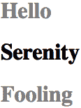

# 第二章：选择器

CSS 的主要优势之一是能够轻松地将一组样式应用于文档中所有相同类型的元素。不感兴趣？考虑一下：通过编辑一行 CSS，您可以更改所有标题的颜色。不喜欢目前使用的蓝色？更改一行代码，它们可以是紫色、黄色、褐色或您想要的任何其他颜色。

这种能力使您作为作者可以专注于设计和用户体验，而不是繁琐的查找和替换操作。下次开会时，有人想要看到不同颜色的标题，只需编辑您的样式并重新加载。Voilà！几秒钟内就能看到结果，让所有人都能看到。

# 基本样式规则

如前所述，CSS 的一个核心特性是其能够将某些规则应用于文档中一整组元素类型。例如，假设您想使所有`<h2>`元素的文本显示为灰色。在有 CSS 之前，您必须在所有`<h2>`元素中插入`<font color="gray">...</font>`标签来实现此目的。使用`style`属性应用内联样式，这也是不良实践，需要您在所有`<h2>`元素中包含`style="color: gray;"`，如下所示：

```
<h2 style="color: gray;">This is h2 text</h2>
```

如果您的文档包含大量`<h2>`元素，则这将是一个繁琐的过程。更糟糕的是，如果稍后决定要将所有这些`<h2>`改为绿色而不是灰色，您将不得不重新开始手动标记（是的，这确实是以前的做法！）

CSS 允许您创建简单易变、易编辑和适用于您定义的所有文本元素的规则（下一节将解释这些规则的工作原理）。例如，您可以编写此规则，使所有`<h2>`元素变为灰色：

```
h2 {color: gray;}
```

# 类型选择器

*类型选择器*，以前称为*元素选择器*，最常见的是 HTML 元素，但并非总是如此。例如，如果 CSS 文件包含 XML 文档的样式，则类型选择器可能如下所示：

```
quote {color: gray;}
bib {color: red;}
booktitle {color: purple;}
myElement {color: red;}
```

换句话说，文档的元素是被选择的节点类型。在 XML 中，选择器可以是任何东西，因为 XML 允许创建可以具有几乎任何元素名称的新标记语言。如果您正在为 HTML 文档添加样式，则选择器通常将是 HTML 定义的许多元素之一，例如`<p>`、`<h3>`、`<em>`、`<a>`或甚至`<html>`本身。例如：

```
html {color: black;}
h1 {color: gray;}
h2 {color: silver;}
```

图 2-1 显示了此样式表的结果。


###### 图 2-1。简单文档的简单样式

一旦您直接将样式全局应用于元素，您可以将这些样式从一个元素转移到另一个元素。假设您决定段落文本而不是`<h1>`元素在图 2-1 中应为灰色。没问题。只需将`h1`选择器更改为`p`：

```
html {color: black;}
p {color: gray;}
h2 {color: silver;}
```

图 2-2 显示了结果。


###### 图 2-2。将样式从一个元素移动到另一个元素

# 分组

到目前为止，您已经看到了将单个样式应用于单个选择器的相当简单的技术。但是如果您希望相同的样式应用于多个元素怎么办？*组合* 允许作者大幅压缩某些类型的样式分配，使样式表更短。

## 组合选择器

假设您想要 `<h2>` 元素和段落都显示灰色文本。实现这一目标的最简单方法是使用以下声明：

```
h2, p {color: gray;}
```

通过将 `h2` 和 `p` 选择器放在规则的开头，即在开放的大括号之前，并用逗号分隔它们，您定义了一个规则，表明大括号内的样式（`color: gray;`）适用于两个选择器引用的元素。逗号告诉浏览器该规则涉及两个不同的选择器。如果省略逗号，规则将具有完全不同的含义，我们将在“定义后代选择器”中探讨这一点。

这些选择产生完全相同的结果，但一种输入起来更容易：

```
h1 {color: purple;}
h2 {color: purple;}
h3 {color: purple;}
h4 {color: purple;}
h5 {color: purple;}
h6 {color: purple;}

h1, h2, h3, h4, h5, h6 {color: purple;}
```

第二种选择，使用一个分组选择器，随着时间的推移也更容易维护。

### 通用选择器

*通用选择器*，显示为星号（`*`），匹配任何元素，就像通配符一样。例如，要使文档中的每个元素都加粗，您可以这样写：

```
* {font-weight: bold;}
```

此声明相当于一个列出文档中所有元素的分组选择器，使您能够一次性将 `font-weight` 值 `bold` 分配给文档中的每个元素。但请注意：虽然通用选择器很方便，因为它针对声明范围内的所有内容，但它可能会产生意想不到的后果，这在“零选择器特异性”中有讨论。

## 组合声明

正如您可以将选择器组合成单个规则一样，您也可以组合声明。假设您希望所有 `<h1>` 元素显示为紫色、18 像素高的 Helvetica 文本，并带有水绿色背景（如果不介意让读者眼花缭乱的话），您可以这样写您的样式：

```
h1 {font: 18px Helvetica;}
h1 {color: purple;}
h1 {background: aqua;}
```

但是这种方法效率低下——想象一下为将承载 10 或 15 种样式的元素创建这样的列表！相反，您可以将声明分组在一起：

```
h1 {font: 18px Helvetica; color: purple; background: aqua;}
```

这将与刚刚显示的三行样式表具有完全相同的效果。

注意，在分组它们时，每个声明末尾使用分号至关重要。浏览器会忽略样式表中的空白，因此用户代理必须依赖正确的语法来解析样式表。您可以毫不犹豫地格式化以下样式：

```
h1 {
  font: 18px Helvetica;
  color: purple;
  background: aqua;
}
```

您还可以最小化您的 CSS，删除所有不必要的空格：

```
h1{font:18px Helvetica;color:purple;background:aqua;}
```

服务器同样对最后三个示例进行处理，但第二个通常被认为是最易读的，并且是开发过程中推荐的编写 CSS 的方法。你可能会选择为网络性能原因最小化你的 CSS，但这通常会被构建工具、服务器端脚本、缓存网络或其他服务自动处理，因此通常最好以人类可读的方式编写你的 CSS。

如果在第二个语句中省略了分号，用户代理将按以下方式解释样式表：

```
h1 {
  font: 18px Helvetica;
  color: purple background: aqua;
}
```

因为`background:`不是`color`的有效值，用户代理将完全忽略`color`声明（包括`background: aqua`部分）。你可能认为浏览器至少会将`<h1>`渲染为紫色文本而没有水绿色背景，但事实并非如此。相反，它们将是继承的颜色，具有透明的背景。声明`font: 18px Helvetica`仍将生效，因为它正确地用分号终止了。

###### 提示

虽然在 CSS 中在规则的最后声明后面跟分号在技术上不是必需的，但这样做通常是个好习惯。首先，它将使你保持习惯，用分号终止你的声明，缺少分号是导致渲染错误最常见的原因之一。其次，如果你决定向规则添加另一个声明，你就不必担心忘记插入额外的分号了。

与选择器分组类似，声明分组是保持你的样式表简短、表达力强和易于维护的便捷方式。

## 全部分组

现在你知道你可以分组选择器和声明。通过将这两种分组结合在单个规则中，你可以只用几个语句就定义非常复杂的样式。现在，如果你想为文档中的所有标题分配一些复杂的样式，并且希望相同的样式应用于它们所有，那么应该这样做：

```
h1, h2, h3, h4, h5, h6 {color: gray; background: white; padding: 0.5em;
  border: 1px solid black; font-family: Charcoal, sans-serif;}
```

我们在这里分组了选择器，所以大括号内的样式将应用于所有列出的标题；分组声明意味着所有列出的样式将应用于规则左侧的选择器。图 2-3 展示了此规则的结果。


###### 图 2-3\. 分组选择器和规则

这种方法优于冗长的替代方法，其开头可能是这样的：

```
h1 {color: gray;}
h2 {color: gray;}
h3 {color: gray;}
h4 {color: gray;}
h5 {color: gray;}
h6 {color: gray;}
h1 {background: white;}
h2 {background: white;}
h3 {background: white;}
```

……并继续多行。你*可以*用长篇方式编写你的样式，但我们不推荐这样做——编辑它们将会像在每个地方使用`style`属性一样繁琐！

分组允许一些有趣的选择。例如，以下示例中所有规则组都是等效的——每个仅展示了一种不同的分组选择器和声明的方式：

```
/* group 1 */
h1 {color: silver; background: white;}
h2 {color: silver; background: gray;}
h3 {color: white; background: gray;}
h4 {color: silver; background: white;}
b {color: gray; background: white;}

/* group 2 */
h1, h2, h4 {color: silver;}
h2, h3 {background: gray;}
h1, h4, b {background: white;}
h3 {color: white;}
b {color: gray;}

/* group 3 */
h1, h4 {color: silver; background: white;}
h2 {color: silver;}
h3 {color: white;}
h2, h3 {background: gray;}
b {color: gray; background: white;}
```

任何这三种选择器和声明分组方法都将产生图 2-4 中显示的结果。


###### 图 2-4. 等效样式表的结果

# 类和 ID 选择器

到目前为止，我们已经以各种方式将选择器和声明分组在一起，但是我们使用的选择器非常简单，只引用文档元素。类型选择器在某种程度上是可以的，但通常情况下，您需要更加专注的内容。

除了类型选择器之外，CSS 还有*类选择器*和*ID 选择器*，这些选择器允许您根据 HTML 属性而不是元素类型分配样式。这些选择器可以单独使用或与类型选择器结合使用。然而，它们仅在您适当地标记文档时才有效，因此通常需要一些事先考虑和规划。

例如，假设文档包含多个警告。您希望每个警告都以粗体文本显示，以便突出显示。但是，您不知道哪些元素类型包含此警告内容。有些警告可能是整个段落，而其他可能是长列表中的单个项目或文本部分中的几个单词。因此，您无法使用任何类型选择器来定义规则。假设您尝试了这条路线：

```
p {
  font-weight: bold;
  color: red;
}
```

*所有*段落都将是红色和粗体，而不仅仅是那些包含警告的段落。您需要一种方法来仅选择包含警告文本的文本——更准确地说，是一种仅选择那些警告元素的方法。您该如何做到呢？通过使用类选择器，您可以对文档的某些部分应用样式，而与所涉及的元素无关。

## 类选择器

应用样式的最常见方法是使用*类选择器*，而无需担心所涉及的元素。但是，在使用它们之前，您需要修改文档标记，以使类选择器正常工作。输入`class`属性：

```
<p class="warning">When handling plutonium, care must be taken to avoid
the formation of a critical mass.</p>
<p>With plutonium, <span class="warning">the possibility of implosion is
very real, and must be avoided at all costs</span>. This can be accomplished
by keeping the various masses separate.</p>
```

要将类选择器的样式与元素关联起来，必须为`class`属性分配适当的值。在前面的代码块中，将`class`值`warning`分配给两个元素：第一个段落和第二段落中的`<span>`元素。

要对这些带类的元素应用样式，可以使用一种紧凑的表示法，其中类名前面带有一个句点（`.`）：

```
*.warning {font-weight: bold;}
```

当与前面显示的示例标记结合使用时，此简单规则的效果如图 2-5 所示。声明`font-weight: bold`将应用于携带`class`属性值为`warning`的每个元素。

如图 2-5 所示，类选择器通过直接引用元素的`class`属性中的值来工作。这个引用*总是*以一个句点（`.`）开头，标志着它是一个类选择器。这个句点有助于将类选择器与可能与之组合的任何内容分开，比如类型选择器。例如，你可能只想在整个段落作为警告时使用加粗的警告文本：

```
p.warning {font-weight: bold;}
```


###### 图 2-5\. 使用类选择器

此选择器现在匹配任何具有包含单词`warning`的`class`属性的 `<p>` 元素，但不包括其他任何类型的元素，无论其类别如何。由于 `<span>` 元素不是段落，规则的选择器不匹配它，因此不会使用加粗文本显示它。

如果你想为`<span>`元素分配不同的样式，可以使用选择器 `span.warning`：

```
p.warning {font-weight: bold;}
span.warning {font-style: italic;}
```

在这种情况下，警告段落加粗，而警告的 `<span>` 斜体。每个规则只适用于特定类型的元素/类组合，因此不会泄漏到其他元素上。

另一种选择是使用通用类选择器和元素特定类选择器的组合，使样式更加实用，如以下标记所示：

```
.warning {font-style: italic;}
span.warning {font-weight: bold;}
```

图 2-6 展示了结果。

在这种情况下，任何警告文本都将是斜体，但只有具有`class`为`warning`的 `<span>` 元素中的文本既加粗又斜体。


###### 图 2-6\. 使用通用和特定选择器组合样式

###### 小贴士

注意前面示例中使用的通用类选择器的格式：它是一个类名，前面加一个句点，没有元素名或通配选择器。如果你想选择所有具有相同类名的元素，你可以省略类选择器中的通配选择器而不会产生任何不良影响。因此，`*.warning` 和 `.warning` 的效果完全相同。

关于类名的另一点是：它们*永远不应该*以数字开头。浏览器可能会允许你这样做，但是 CSS 验证器会抱怨，而且这是一个不好的习惯。因此，你应该在 CSS 中写 `.c8675`，在 HTML 中写 `class="c8675"`，而不是写 `.8675` 和 `class="8675"`。如果你必须引用以数字开头的类名，应该在类选择器的句点和第一个数字之间加一个反斜杠，像这样：`.\8675`。

## 多个类

在上一节中，我们处理了包含单个单词的`class`值。在 HTML 中，可以在一个`class`值中使用空格分隔的单词列表。例如，如果要将特定元素标记为既紧急又警告，可以这样写：

```
<p class="urgent warning">When handling plutonium, care must be taken to
avoid the formation of a critical mass.</p>
<p>With plutonium, <span class="warning">the possibility of implosion is
very real, and must be avoided at all costs</span>. This can be accomplished
by keeping the various masses separate.</p>
```

单词的顺序并不重要；`warning urgent`同样有效，并且无论 CSS 如何编写，都将产生完全相同的结果。与 HTML 标签和类型选择器不同，类选择器是区分大小写的。

现在假设你希望所有`class`为`warning`的元素为粗体，`class`为`urgent`的元素为斜体，并且同时具有这两个值的元素具有银色背景。写成如下：

```
.warning {font-weight: bold;}
.urgent {font-style: italic;}
.warning.urgent {background: silver;}
```

通过链接两个类选择器，你可以选择只有这两个类名的元素，无论顺序如何。正如你所看到的，HTML 源代码包含`class="urgent warning"`，但 CSS 选择器写成`.warning.urgent`。无论如何，该规则仍将导致“处理钚时……”段落具有银色背景，如图 2-7 所示。这是因为源文档或 CSS 中单词的排列顺序并不重要。（这并不是说类的顺序总是无关紧要，但我们稍后会在本章中讨论。）


###### 图 2-7。选择具有多个类名的元素

如果多类选择器包含一个不在空格分隔列表中的名称，则匹配将失败。考虑以下规则：

```
p.warning.help {background: red;}
```

正如你所预料的那样，选择器只会匹配那些`<p>`元素，其`class`属性包含空格分隔的单词`warning`和`help`。因此，它不会匹配`class`属性中仅包含单词`warning`和`urgent`的`<p>`元素。然而，它会匹配以下内容：

```
<p class="urgent warning help">Help me!</p>
```

## ID 选择器

在某些方面，*ID 选择器*与类选择器类似，但存在一些关键的区别。首先，ID 选择器以井号（`#`）开头——在正式名称上称为井号，在美国也称为磅号或井字号。因此，你可能会看到像这样的规则：

```
*#first-para {font-weight: bold;}
```

此规则会使具有值为`first-para`的`id`属性的任何元素的文本变为粗体。

第二个区别在于，ID 选择器不是引用`class`属性的值，而是合理地引用`id`属性中的值。以下是 ID 选择器的示例：

```
*#lead-para {font-weight: bold;}
```

```
<p id="lead-para">This paragraph will be boldfaced.</p>
<p>This paragraph will NOT be bold.</p>
```

注意，`lead-para`的值可以分配给文档中的任何元素。在这种特定情况下，它应用于第一个段落，但我们同样可以将其轻松应用于第二个或第三个段落，或无序列表中的任何元素。

第三个区别在于文档中应该只有一个给定 ID 值的实例。如果你发现自己想要将同一个 ID 应用于文档中的多个元素，请改用类（class）。

与类选择器一样，可以（并且通常）从 ID 选择器中省略通配符选择器。在上一个示例中，我们也可以这样写，并具有完全相同的效果：

```
#lead-para {font-weight: bold;}
```

当您知道文档中将会出现某个特定的 ID 值，但不知道它将出现在哪种元素类型上时，这是非常有用的。例如，您可能知道在任何给定的文档中，将存在一个具有 ID 值为`mostImportant`的元素。您不知道这个最重要的事物是段落、短语、列表项还是章节标题。您只知道它将在每个文档中存在，在任意元素中出现，并且最多出现一次。在这种情况下，您可以编写如下规则：

```
#mostImportant {color: red; background: yellow;}
```

这条规则将匹配以下任何一个元素（注意，这些元素不应该同时出现在同一个文档中，因为它们都具有相同的 ID 值）：

```
<h1 id="mostImportant">This is important!</h1>
<em id="mostImportant">This is important!</em>
<ul id="mostImportant">This is important!</ul>
```

虽然 HTML 标准规定文档中每个`id`必须唯一，但 CSS 并不关心。如果我们误将刚才显示的 HTML 包含进来，所有三个元素都很可能会因为匹配`#mostImportant`选择器而变成红色带黄色背景。

###### 注意

与 class 名称一样，ID 名称不应以数字开头。如果必须引用以数字开头且无法更改标记中的 ID 值的 ID，请在第一个数字前使用反斜杠，如`#\309`。

## 在选择 Class 和 ID 之间做出决定

您可以将类分配给任意数量的元素，正如前面演示的那样；`warning`类名应用于`<p>`和`<span>`元素，并且还可以应用于更多元素。另一方面，ID 值应该在 HTML 文档中仅使用一次。因此，如果您有一个带有 ID 值为`lead-para`的元素，则该文档中不应有其他具有 ID 值为`lead-para`的元素。

不过，这只是根据 HTML 规范来说的。正如前面提到的，CSS 不在乎你的 HTML 是否有效：它应该找到匹配选择器的所有元素。这意味着，如果在 HTML 文档中散布了几个具有相同 ID 属性值的元素，那么应该将相同的样式应用于每个元素。

###### 注意

在文档中有多个相同的 ID 值会使 DOM 脚本编写变得更加困难，因为像`getElementById()`这样的函数依赖于具有给定 ID 值的一个且仅有一个元素。

与类选择器不同，ID 选择器不能与其他 ID 结合使用，因为 ID 属性不允许空格分隔的单词列表。但是，ID 选择器可以与自身结合：`#warning#warning`将匹配具有 ID 值为`warning`的元素。虽然这几乎永远不应该这样做，但确实是可能的。

另一个`class`和`id`名称之间的区别在于，在确定应将哪些样式应用于给定元素时，ID 权重更大。这在第四章中有更详细的解释。

还要注意，HTML 定义类和 ID 值为大小写敏感，因此您的类和 ID 值的大写必须与文档中找到的匹配。因此，在以下 CSS 和 HTML 配对中，元素的文本将不会加粗：

```
p.criticalInfo {font-weight: bold;}
```

```
<p class="criticalinfo">Don't look down.</p>
```

因为字母*i*的大小写变化，选择器将不匹配所示的元素。

纯语法上来说，点类表示法（例如`.warning`）不保证在 XML 文档中有效。截至本文撰写时，点类表示法适用于 HTML、可缩放矢量图形（SVG）和数学标记语言（MathML），并且可能在未来的语言规范中被允许，但这取决于每种语言的规范。

# 属性选择器

对于类和 ID 选择器，您实际上是选择元素属性的值。在本文撰写时使用的语法特定于 HTML、SVG 和 MathML 文档。在其他标记语言中，这些类和 ID 选择器可能不可用（事实上，这些属性可能不存在）。

为了解决这种情况，CSS2 引入了*属性选择器*，可以根据其属性和属性值来选择元素。有四种常见类型的属性选择器：简单属性选择器、精确属性值选择器、部分匹配属性值选择器和前导值属性选择器。

## 简单属性选择器

如果您想选择具有某个属性的元素，而不管该属性的值如何，您可以使用*简单属性选择器*。例如，要选择所有具有任何值的`class`属性的`<h1>`元素，并使它们的文本变为银色，可以写成这样：

```
h1[class] {color: silver;}
```

因此，鉴于以下标记，

```
<h1 class="hoopla">Hello</h1>
<h1>Serenity</h1>
<h1 class="fancy">Fooling</h1>
```

结果如图 2-8 所示。



###### 图 2-8\. 根据其属性选择元素

这种策略在 XML 文档中非常有用，因为 XML 语言往往具有特定于其目的的元素和属性名称。考虑一种用于描述太阳系行星的 XML 语言（我们称之为*PlanetML*）。如果要选择所有具有`moons`属性的`<pml-planet>`元素并使它们加粗，从而突出显示具有卫星的任何行星，您应该这样写：

```
pml-planet[moons] {font-weight: bold;}
```

这将导致以下标记片段中的第二个和第三个元素的文本加粗，但第一个元素不加粗：

```
<pml-planet>Venus</pml-planet>
<pml-planet moons="1">Earth</pml-planet>
<pml-planet moons="2">Mars</pml-planet>
```

ID 哈希表示法（例如`#lead`）应在具有属性值在文档中应该是唯一的任何文档语言中有效。在 HTML 文档中，您可以以创造性的方式使用此功能。例如，您可以为所有具有`alt`属性的图像设置样式，从而突出显示那些正确形成的图像。

```
img[alt] {outline: 3px solid forestgreen;}
```

这个特定的示例通常更适合用于诊断目的——确定图像是否确实正确标记——而不是设计目的。

如果你想要加粗包含`title`信息的任何元素，大多数浏览器将其显示为鼠标悬停在元素上时的工具提示，你可以这样写：

```
*[title] {font-weight: bold;}
```

类似地，您可以仅对具有`href`属性的锚点(`<a>`元素)进行样式设置，从而将样式应用于任何超链接，但不适用于任何占位符锚点。

也可以基于多个属性的存在来选择元素。通过链接属性选择器来实现。例如，要加粗任何具有`href`和`title`属性的 HTML 超链接的文本，您将写成以下内容：

```
a[href][title] {font-weight: bold;}
```

这将加粗以下标记中的第一个链接，但不会影响第二个或第三个：

```
<a href="https://www.w3.org/" title="W3C Home">W3C</a><br />
<a href="https://developer.mozilla.org">Standards Info</a><br />
<a title="Not a link">dead.letter</a>
```

## 根据精确属性值的选择

您可以进一步缩小选择范围，以仅包含其属性值为特定值的元素。例如，假设您想要加粗指向 Web 服务器上特定文档的任何超链接。这将看起来像以下内容：

```
a[href="http://www.css-discuss.org/about.html"] {font-weight: bold;}
```

这将加粗任何`a`元素的文本，该元素具有`href`属性，其值*恰好*为`http://www.css-discuss.org/about.html`。任何变动，即使是省略`www.`部分或更改为安全协议`https`，都将阻止匹配。

任何元素都可以指定任何属性和值组合。但是，如果该确切组合在文档中不存在，选择器将不匹配任何内容。同样，XML 语言可以从这种样式方法中受益。让我们回到我们的 PlanetML 示例。假设您只想选择那些具有属性`moons`为`1`值的`planet`元素：

```
planet[moons="1"] {font-weight: bold;}
```

这将加粗以下标记片段中的第二个元素的文本，但不会影响第一个或第三个：

```
<planet>Venus</planet>
<planet moons="1">Earth</planet>
<planet moons="2">Mars</planet>
```

与属性选择类似，您可以将多个属性值选择器链接在一起以选择单个文档。例如，要加倍于`https://www.w3.org/`具有`href`值和`title`值为`W3C Home`的任何 HTML 超链接的文本大小，您将写成这样：

```
a[href="https://www.w3.org/"][title="W3C Home"] {font-size: 200%;}
```

这将加倍以下标记中的第一个链接的文本大小，但不会影响第二个或第三个：

```
<a href="https://www.w3.org/" title="W3C Home">W3C</a><br />
<a href="https://developer.mozilla.org"
  title="Mozilla Developer Network">Standards Info</a><br />
<a href="http://www.example.org/" title="W3C Home">confused.link</a>
```

图 2-9 显示了结果。


###### 图 2-9\. 根据属性及其值选择元素

再次强调，此格式需要属性值的*精确*匹配。当属性选择器遇到可以包含空格分隔值列表的值时（例如 HTML 属性`class`），匹配就会成为一个问题。例如，考虑以下标记片段：

```
<planet type="barren rocky">Mercury</planet>
```

唯一匹配该元素基于其精确属性值的方法是写成这样：

```
planet[type="barren rocky"] {font-weight: bold;}
```

如果您写成`planet[type="barren"]`，该规则将不会匹配示例标记，因此会失败。即使对于 HTML 中的`class`属性也是如此。考虑以下示例：

```
<p class="urgent warning">When handling plutonium, care must be taken to
avoid the formation of a critical mass.</p>
```

要基于其精确的属性值选择此元素，您必须编写如下内容：

```
p[class="urgent warning"] {font-weight: bold;}
```

这与之前介绍的点类记法不等同，如下一节所示。它实际上选择任何 `class` 属性值 *完全* 为 `urgent warning` 的 `p` 元素，其中单词顺序不变，单词之间有一个空格。这实际上是一个精确的字符串匹配，而在使用 `class` 选择器时，类的顺序并不重要。

另外，请注意 ID 选择器和目标 `id` 属性的属性选择器并不完全相同。换句话说，`h1#page-title` 和 `h1[id="page-title"]` 之间存在微妙但关键的差别。这一差异在 第四章 中有解释。

## 基于部分属性值的选择

有时你可能希望基于其属性值的部分匹配选择元素，而不是完整值。对于这种情况，CSS 提供了多种选项用于匹配属性值中的子串。这些总结在 表 2-1 中。

表 2-1\. 属性选择器的子串匹配

| 类型 | 描述 |
| --- | --- |
| `[foo~="bar"]` | 选择具有属性 `foo` 并且其值在空格分隔的单词列表中包含单词 `bar` 的任何元素 |
| `[foo*="bar"]` | 选择具有属性 `foo` 并且其值*包含*子串 `bar` 的任何元素 |
| `[foo^="bar"]` | 选择具有属性 `foo` 并且其值*以* `bar` 开头的任何元素 |
| `[foo$="bar"]` | 选择具有属性 `foo` 并且其值*以* `bar` 结尾的任何元素 |
| `[foo&#124;="bar"]` | 选择具有属性 `foo` 并且其值*以* `bar` 开头，并紧跟一个连字符（U+002D），或其值正好等于 `bar` 的任何元素 |

最后一个匹配元素属性值部分子集的属性选择器比描述起来更容易显示。考虑以下规则：

```
*[lang|="en"] {color: white;}
```

此规则将选择任何 `lang` 属性等于 `en` 或以 `en-` 开头的元素。因此，下面示例标记中的前三个元素将被选择，而后两个则不会：

```
<h1 lang="en">Hello!</h1>
<p lang="en-us">Greetings!</p>
<div lang="en-au">G'day!</div>
<p lang="fr">Bonjour!</p>
<h4 lang="cy-en">Jrooana!</h4>
```

通常情况下，形式 `[att|="val"]` 可以用于任何属性及其值。假设在 HTML 文档中有一系列文件名类似于 *figure-1.gif* 或 *figure-3.jpg* 的图像。你可以通过以下选择器匹配所有这些图像：

```
img[src|="figure"] {border: 1px solid gray;}
```

或者，如果你正在创建一个 CSS 框架或模式库，而不是创建冗余的类如 `"btn btn-small btn-arrow btn-active"`，你可以声明 `"btn-small-arrow-active"`，并且通过以下方式定位元素的类：

```
*[class|="btn"] { border-radius: 5px;}

<button class="btn-small-arrow-active">Click Me</button>
```

这种类型的属性选择器最常见的用途是匹配语言值，如 “The :lang() and :dir() Pseudo-Classes” 中演示的那样。

### 匹配空格分隔列表中的一个单词

对于接受空格分隔单词列表的任何属性，你可以根据任何一个单词的存在选择元素。HTML 中的经典示例是`class`属性，它可以接受一个或多个单词作为其值。考虑我们通常的示例文本：

```
<p class="urgent warning">When handling plutonium, care must be taken to
avoid the formation of a critical mass.</p>
```

假设你想选择`class`属性包含单词`warning`的元素。你可以使用属性选择器来实现这一点：

```
p[class~="warning"] {font-weight: bold;}
```

注意选择器中的波浪号（`~`）的存在。这是基于属性值中存在空格分隔单词进行选择的关键。如果省略波浪号，你将得到一个精确值匹配的属性选择器，正如前一节中讨论的那样。

这种选择器构造等效于“在类和 ID 之间做出决定”中讨论的点类记法。因此，`p.warning`和`p[class~="warning"]`在应用于 HTML 文档时是等效的。以下是早期看到的 PlanetML 标记的 HTML 版本示例：

```
<span class="barren rocky">Mercury</span>
<span class="cloudy barren">Venus</span>
<span class="life-bearing cloudy">Earth</span>
```

要使所有`class`属性中含有单词`barren`的元素变为斜体，你可以这样写：

```
span[class~="barren"] {font-style: italic;}
```

此规则的选择器将匹配示例标记中的前两个元素，从而使它们的文本变为斜体，如 Figure 2-10 所示。这与编写`span.barren {font-style: italic;}`得到的结果相同。


###### 图 2-10. 基于属性值部分选择元素

那么为什么在 HTML 中要使用波浪号等号属性选择器呢？因为它可以用于任何属性，而不仅仅是`class`。例如，你可能有一个包含大量图像的文档，其中只有一些是图表。你可以使用针对`title`文本的部分匹配值属性选择器，仅选择那些图表：

```
img[title~="Figure"] {border: 1px solid gray;}
```

此规则选择任何标题文本包含单词`Figure`（但不包含`figure`，因为标题属性区分大小写）的图像。因此，只要你的所有图像的标题文本看起来像“Figure 4. 一位秃头长者”，这条规则就会匹配这些图像。此外，选择器`img[title~="Figure"]`也会匹配值为“How to Figure Out Who’s in Charge.”的标题属性。任何没有`title`属性或其`title`值不包含单词`Figure`的图像都不会被匹配。

### 在属性值中匹配子字符串

有时候你想基于其属性值的一部分选择元素，但是相关的值并不是空格分隔的单词列表。在这些情况下，你可以使用星号等号子字符串匹配形式`[attr*="val"]`来匹配出现在属性值的任何地方的子字符串。例如，以下 CSS 匹配任何`<span>`元素，其`class`属性包含子字符串`cloud`，因此两个“cloudy”行星都会被匹配，如 Figure 2-11 所示：

```
span[class*="cloud"] {font-style: italic;}
```

```
<span class="barren rocky">Mercury</span>
<span class="cloudy barren">Venus</span>
<span class="life-bearing cloudy">Earth</span>
```


###### 图表 2-11。选择基于属性值中子字符串的元素

注意选择器中星号(`*`)的存在。它是基于属性值中存在子字符串的元素选择的关键。需要明确的是，它与通用选择器没有关系，只是使用了相同的字符。

您可以想象，这种特定功能有许多有用的应用。例如，假设您希望特别样式化任何链接到 W3C 网站的链接。您可以不用给它们全部添加类并基于该类编写样式，而是可以编写以下规则：

```
a[href*="w3.org"] {font-weight: bold;}
```

您不仅仅限于`class`和`href`属性。这里可以使用任何属性（`title`、`alt`、`src`、`id`…）；如果属性具有值，您可以基于该值中的子字符串进行样式设置。以下规则用于突出显示任何源 URL 中包含字符串`space`的图像：

```
img[src*="space"] {outline: 5px solid red;}
```

同样地，以下规则用于突出显示具有指导用户操作的标题的`<input>`元素，以及其标题中包含子字符串`format`的任何其他输入：

```
input[title*="format"] {background-color: #dedede;}
```

```
<input type="tel"
    title="Telephone number should be formatted as XXX-XXX-XXXX"
    pattern="\d{3}\-\d{3}\-\d{4}">
```

通用子字符串属性选择器的常见用法是匹配模式库类名中的部分。在前面的例子的基础上，我们可以通过使用管道等于属性选择器来针对任何以`btn`开头并且包含以连字符前缀的`arrow`子字符串的类名进行目标定位：

```
*[class|="btn"][class*="-arrow"]:after { content: "▼";}
```

```
<button class="btn-small-arrow-active">Click Me</button>
```

匹配是精确的：如果您在选择器中包含空格，则属性值中也必须存在空格。当底层文档语言要求大小写敏感性时，属性值也是大小写敏感的。类名、标题、URL 和 ID 值都是大小写敏感的，但枚举的 HTML 属性值，如输入类型关键字值，则不是：

```
input[type="CHeckBoX"] {margin-right: 10px;}
```

```
<input type="checkbox" name="rightmargin" value="10px">
```

### 匹配以属性值开始的子字符串

如果您希望基于属性值开头的子字符串选择元素，则您需要查找`caret-equals`属性选择器模式`[att^="val"]`。当您想要以不同样式显示不同类型的链接时，这种方法特别有用，如在图表 2-12 中所示：

```
a[href^="https:"] {font-weight: bold;}
a[href^="mailto:"] {font-style: italic;}
```


###### 图表 2-12。选择基于以属性值开头的子字符串的元素

在另一个用例中，您可能希望为文章中所有同时也是图表的图片设置样式，就像您在本文中看到的图表一样。假设每个图表的`alt`文本都以“Figure 5”模式的文本开头——在这种情况下这是完全合理的假设——您可以使用带有`caret-equals`属性选择器来仅选择这些图片：

```
img[alt^="Figure"] {border: 2px solid gray;  display: block; margin: 2em auto;}
```

这里的潜在缺点是，任何``元素，其`alt`以`Figure`开头，都将被选中，无论它是否意图作为说明性图表。这种可能性取决于所讨论的文档。

另一个用例是选择所有发生在星期一的日历事件。在这种情况下，假设所有事件都有一个包含“星期一，2012 年 3 月 5 日”格式日期的`title`属性。只需使用`[title^="Monday"]`就可以选择它们全部。

### 匹配属性值末尾的子串

与开始子串匹配的镜像是结束子串匹配，这通过`[att$="val"]`模式实现。这种功能的一个非常常见的用途是根据资源类型为其目标的链接设置不同的样式，例如 PDF 文档，如图 2-13 所示：

```
a[href$=".pdf"] {font-weight: bold;}
```


###### 图 2-13\. 根据结束属性值子串选择元素

类似地，您可以（出于任何原因）使用美元等于属性选择器选择基于其图像格式的图像：

```
img[src$=".gif"] {...}
img[src$=".jpg"] {...}
img[src$=".png"] {...}
```

继续上一节中的日历示例，可以使用像`[title$="2015"]`这样的选择器选择给定年份内的所有事件。

###### 注意

您可能已经注意到，我们在属性选择器中引用了所有属性值。如果值包含任何特殊字符，以连字符或数字开头，或者以其他方式无效作为标识符并且需要引用为字符串，则需要引用。为了安全起见，我们建议始终在属性选择器中引用属性值，即使只有将无效标识符转换为字符串才需要。

## 不区分大小写标识符

在属性选择器的结束括号之前加上`i`将允许该选择器以不区分大小写的方式匹配属性值，而不考虑文档语言规则。例如，假设您想选择所有指向 PDF 文档的链接，但不知道它们是否以*.pdf*，*.PDF*或*.Pdf*结尾。以下是如何操作：

```
a[href$='.PDF' i]
```

添加那个简单的`i`意味着选择器将匹配所有`href`属性值以`.pdf`结尾的`a`元素，无论字母*P*，*D*和*F*的大小写如何。

我们已经涵盖的所有属性选择器都提供了此不区分大小写选项。但请注意，这仅适用于属性选择器中的*值*。它不会强制在属性名称本身上不区分大小写。因此，在大小写敏感的语言中，`planet[type*="rock" i]`将匹配以下所有内容：

```
<planet type="barren rocky">Mercury</planet>
<planet type="cloudy ROCKY">Venus</planet>
<planet type="life-bearing Rock">Earth</planet>
```

它将*不*匹配以下元素，因为 XML 中的属性`TYPE`与`type`不匹配：

```
<planet TYPE="dusty rock">Mars</planet>
```

这是在强制元素和属性语法区分大小写的语言中。在像 HTML 这样的大小写不敏感的语言中，这不是问题。

###### 注意

提议的镜像标识符`s`，强制区分大小写。截至 2023 年初，仅 Firefox 系列浏览器支持该标识符。

# 使用文档结构

CSS 如此强大，因为它利用文档的结构来确定适当的样式及其应用方式。在继续探讨更强大的选择形式之前，让我们花一点时间讨论结构。

## 理解父子关系

要理解选择器与文档之间的关系，我们需要再次查看文档的结构。考虑这个非常简单的 HTML 文档：

```
<!DOCTYPE html>
<html lang="en-us">
<head>
 <meta charset="utf-8">
 <meta name="viewport" content="width=device-width">
 <title>Meerkat Central</title>
</head>
<body>
 <h1>Meerkat <em>Central</em></h1>
 <p>
 Welcome to Meerkat <em>Central</em>, the <strong>best meerkat web site
 on <a href="inet.html">the <em>entire</em> Internet</a></strong>!</p>
 <ul>
  <li>We offer:
   <ul>
    <li><strong>Detailed information</strong> on how to adopt a meerkat</li>
    <li>Tips for living with a meerkat</li>
    <li><em>Fun</em> things to do with a meerkat, including:
     <ol>
      <li>Playing fetch</li>
      <li>Digging for food</li>
      <li>Hide and seek</li>
     </ol>
    </li>
   </ul>
  </li>
  <li>...and so much more!</li>
 </ul>
 <p>
 Questions? <a href="mailto:suricate@meerkat.web">Contact us!</a>
 </p>
</body>
</html>
```

CSS 的很大一部分功能依赖于元素之间的*父子关系*。HTML 文档（以及大多数结构化文档）基于元素的层次结构，这在文档的“树状”视图中可见（见图 2-14）。在这个层次结构中，每个元素都在文档的整体结构中占据一个位置。文档中的每个元素都是另一个元素的*父元素*或*子元素*，有时两者兼而有之。如果一个父元素有多个子元素，则这些子元素被称为*兄弟元素*。


###### 图 2-14\. 文档树结构

如果一个元素在文档层级结构中直接出现在另一个元素的上方，则称它是另一个元素的父元素。例如，在图 2-14 中，从左边数第一个`<p>`元素是`<em>`和`<strong>`元素的父元素，而`<strong>`是锚点(`<a>`)元素的父元素，该锚点元素本身又是另一个`<em>`元素的父元素。相反地，如果一个元素直接位于另一个元素的下方，则称它是另一个元素的子元素。因此，图 2-14 最右侧的锚点元素是`<p>`元素的子元素，而该`<p>`元素又是`<body>`元素的子元素，依此类推。

*父元素*和*子元素*是*祖先*和*后代*这两个术语的具体应用。它们之间有所区别：在树状视图中，如果一个元素恰好在另一个元素的一级上方或下方，则这些元素具有*父子关系*。如果从一个元素到另一个元素的路径通过两个或更多级别进行跟踪，则这些元素具有祖先后代关系，但不具有父子关系。（子元素也是后代，父元素也是祖先。）在图 2-14 中，最上层的`<ul>`元素是两个`<li>`元素的父元素，但最上层的`<ul>`元素也是从其`<li>`元素下溯到最深嵌套的`<li>`元素的每个元素的祖先。这些`<li>`元素是`<ol>`的子元素。

在图 2-14 中，有一个锚点，它是`<strong>`的子元素，同时也是`<p>`、`<body>`和`<html>`元素的后代。`<body>`元素是浏览器默认显示的所有内容的祖先，而`<html>`元素则是整个文档的祖先。因此，在 HTML 文档中，`<html>`元素也被称为*根元素*。

## 定义后代选择器

理解这一模型的第一个好处是能够定义*后代选择器*。定义后代选择器是创建在特定结构情况下但不在其他情况下生效的规则。举个例子，假设你想要样式化只有从`<h1>`元素继承而来的`<em>`元素。要实现这一点，写下以下内容：

```
h1 em {color: gray;}
```

这条规则将使得属于`<h1>`元素后代的`<em>`元素中的文本变成灰色。其他地方的`<em>`文本，比如段落或者块引用中的，不会被此规则选中。图 2-15 展示了结果。


###### 图 2-15\. 根据上下文选择元素

在后代选择器中，规则的选择器部分由两个或多个用空格分隔的选择器组成。选择器之间的空格是*组合器*的一个例子。每个空格组合器可以被翻译为“在...中找到”，“是...的一部分”，或者“是...的后代”，但只有当你从右到左读选择器时才有效。因此，`h1 em`可以翻译为“任何`<h1>`元素的后代`<em>`元素”。

要从左到右读选择器，你可能会用更冗长和令人困惑的方式表达，比如，“任何`<h1>`包含一个`<em>`将对`<em>`应用以下样式”。这样说起来更啰嗦和混乱，这也是为什么我们和浏览器一样，从右到左读取选择器。

你并不局限于两个选择器。例如：

```
ul ol ul em {color: gray;}
```

在这种情况下，正如图 2-16 所示，任何作为无序列表一部分的有序列表一部分的无序列表一部分的强调文本（是的，这是正确的）将会是灰色的。这显然是一个非常具体的选择标准。


###### 图 2-16\. 一个非常具体的后代选择器

后代选择器可以非常强大。让我们考虑一个常见的例子。假设你有一个包含侧边栏和主要区域的文档。侧边栏有蓝色背景，主要区域有白色背景，并且两个区域都包括链接列表。你不能将所有链接都设置为蓝色，因为在侧边栏中它们将无法阅读，你也不能将所有链接都设置为白色，因为它们在页面的主体部分将消失。

解决方案：后代选择器。在这种情况下，给包含侧边栏的元素一个`sidebar`类，并将页面的主体部分包裹在`<main>`元素中。然后，写下这样的样式：

```
.sidebar {background: blue;}
main {background: white;}
.sidebar a:any-link {color: white;}
main a:any-link {color: blue;}
```

图 2-17 展示了结果。


###### 图 2-17\. 使用后代选择器对相同类型的元素应用不同样式

###### 注意

`:any-link`指的是已访问和未访问的链接。我们将在第三章详细讨论它。

再举一个例子：假设你希望将任何属于`blockquote`的`<b>`（加粗）元素的文本颜色设为灰色，并为普通段落中找到的任何加粗文本设置为灰色：

```
blockquote b, p b {color: gray;}
```

结果是段落或块引用中的`<b>`元素内的文本将变成灰色。

后代选择器被忽视的一个方面是两个元素之间的分离程度可以是实际上无限的。例如，如果你写`ul em`，那么这个语法将选择任何从`<ul>`元素后代到的`<em>`元素，无论`<em>`嵌套多深。因此，`ul em`将选择以下标记中的`<em>`元素：

```
<ul>
  <li>List item 1
    <ol>
      <li>List item 1-1</li>
      <li>List item 1-2</li>
      <li>List item 1-3
        <ol>
          <li>List item 1-3-1</li>
          <li>List item <em>1-3-2</em></li>
          <li>List item 1-3-3</li>
        </ol>
      </li>
      <li>List item 1-4</li>
    </ol>
  </li>
</ul>
```

后代选择器更微妙的一个方面是它们没有元素接近性的概念。换句话说，在文档树中两个元素的接近程度不影响规则的应用。在特异性（我们将在下一章讨论）和考虑可能互相抵消的规则时，这一点非常重要。

例如，考虑以下内容（其中包含`:not()`，我们将在“否定伪类”中讨论）：

```
div:not(.help) span {color: gray;}
div.help span {color: red;}
```

```
<div class="help">
   <div class="aside">
      This text contains <span>a span element</span> within.
   </div>
</div>
```

CSS 的效果是：“任何位于不具有包含词`help`的`class`的`<div>`内的`<span>`应该是灰色”，在第一条规则中，以及“任何位于具有包含词`help`的`class`的`<div>`内的`<span>`”在第二条规则中。在给定的标记片段中，*两条*规则都适用于显示的`<span>`。

因为两条规则具有相等的特异性权重，并且`red`规则写在最后，因此它胜出，`<span>`变成了红色。`div class="aside"`比`div class="help"`“更接近”`<span>`这一事实无关紧要。再次强调：后代选择器没有元素接近性的概念。两条规则都匹配，只能应用一种颜色，因为 CSS 的工作方式，这里红色是赢家。（我们将在下一章讨论为什么如此。）

###### 注意

自 2023 年初以来，已经提出了通过*选择器作用域*向 CSS 添加元素接近性意识的提案，但这些提案仍在积极修订中，可能不会实现。

## 选择子元素

在某些情况下，你不希望选择任意后代元素。相反，你希望缩小范围，只选择特定作为另一个元素的子元素的元素。例如，你可能只想选择`<h1>`元素的子元素`<strong>`元素（而不是任何其他层级的后代）。为此，你可以使用*子选择器*，即大于号（`>`）：

```
h1 > strong {color: red;}
```

这条规则将使第一个`<h1>`中显示的`<strong>`元素变成红色，但不会影响第二个：

```
<h1>This is <strong>very</strong> important.</h1>
<h1>This is <em>really <strong>very</strong></em> important.</h1>
```

从右向左阅读，选择器 `h1 > strong` 的翻译为：“选择任何 `<strong>` 元素，该元素是 `<h1>` 元素的直接子元素。” 子选择器可以选择是否在周围加上空白。因此，`h1 > strong`、`h1> strong` 和 `h1>strong` 都是等效的。你可以根据需要使用或省略空白。

当将文档视为树结构时，我们可以看到子选择器将其匹配限制为树中直接连接的元素。图 2-18 展示了文档树的一部分。


###### 图 2-18\. 一个文档树片段

在这个树片段中，你可以确定父子关系。例如，`<a>` 元素是 `<p>` 元素的父元素，同时也是 `<strong>` 的子元素。你可以用选择器 `p > a` 和 `a > strong` 来匹配这个片段，但不能用 `p > strong`，因为 `<strong>` 是 `<p>` 的后代而不是其子元素。

你也可以在同一选择器中结合后代选择器和子选择器。因此，`table.summary td > p` 将选择任何 `<p>` 元素，该元素是一个 *子* 元素，它的 `<td>` 元素本身是 *后代* 元素，该后代元素是一个包含单词 `summary` 的 `class` 属性的 `<table>` 元素。

## 选择相邻兄弟元素

假设你想为紧跟在标题后的段落设置样式，或者为紧跟在段落后的列表设置特殊边距。要选择紧跟在另一个具有相同父级的元素后的元素，你可以使用 *相邻兄弟选择器*，表示为加号（+）。与子选择器一样，你可以自由选择是否在符号周围加上空白。

要去除紧跟在 `<h1>` 元素后的段落的顶部边距，请写入这段代码：

```
h1 + p {margin-top: 0;}
```

选择器的解读是：“选择任何紧随一个与 `<p>` 元素共享父级的 `<h1>` 元素后的 `<p>` 元素。”

为了直观地了解这个选择器的工作原理，让我们再次考虑文档树的片段，如 图 2-19 所示。


###### 图 2-19\. 另一个文档树片段

在这个片段中，一对列表来自于一个 `<div>` 元素，一个有序，另一个无序，每个列表都包含三个列表项。每个列表是相邻的兄弟元素，列表项本身也是相邻的兄弟元素。然而，第一个列表的列表项 *不* 是第二个列表的兄弟元素，因为这两组列表项没有共享相同的父元素。（充其量，它们是表兄弟，而 CSS 没有表兄弟选择器。）

请记住，你只能使用单个选择器选择两个相邻兄弟元素中的第二个。因此，如果你写 `li + li {font-weight: bold;}`，每个列表中的第二和第三项将被加粗。第一项将不受影响，如 图 2-20 所示。


###### 图 2-20\. 选择相邻兄弟

要正确工作，CSS 要求两个元素按*源顺序*出现。在我们的例子中，`<ol>` 元素后面是一个 `<ul>` 元素。这使我们可以使用 `ol + ul` 选择第二个元素，但不能使用相同的语法选择第一个元素。为了匹配 `ul + ol`，有序列表必须紧跟在无序列表后面。

请注意，两个元素之间的文本内容不会阻止相邻兄弟选择器的工作。考虑这个标记片段，其树视图与 图 2-18 中显示的相同。

```
<div>
  <ol>
    <li>List item 1</li>
    <li>List item 1</li>
    <li>List item 1</li>
  </ol>
  This is some text that is part of the 'div'.
  <ul>
    <li>A list item</li>
    <li>Another list item</li>
    <li>Yet another list item</li>
  </ul>
</div>
```

即使两个列表之间有文本，我们仍然可以使用选择器 `ol + ul` 匹配第二个列表。这是因为介于两个列表之间的文本不是兄弟元素的一部分，而是父 `<div>` 的一部分。如果我们将该文本包装在段落元素中，则会阻止 `ol + ul` 匹配第二个列表。相反，我们可能需要编写类似 `ol + p + ul` 的内容。

如下例所示，相邻兄弟选择器可以与其他组合器一起使用：

```
html > body table + ul{margin-top: 1.5em;}
```

选择器的翻译是：“选择任何紧随 `<body>` 元素的 `<html>` 元素的子元素 `<table>` 的兄弟元素 `<ul>`。”

与所有组合器一样，您可以将相邻兄弟选择器放置在更复杂的环境中，例如 `div#content h1 + div ol`。这个选择器的解释是：“选择任何 `<ol>` 元素，当 `<div>` 是 `<h1>` 的相邻兄弟，并且 `<div>` 自身是具有值为 `content` 的 `id` 属性的 `<div>` 的后代时。”

## 选择后续兄弟元素

*通用兄弟选择器*允许您在两个共享相同父元素的元素中选择后面的任何元素，表示为波浪符（`~`）组合器。

例如，要将跟在 `<h2>` 后且与 `<h2>` 共享父元素的任何 `<ol>` 斜体化，您可以编写 `h2 ~ ol {font-style: italic;}`。这两个元素不必是相邻兄弟，虽然它们可以相邻并仍然匹配此规则。将此规则应用于下面的标记的结果显示在 图 2-21 中：

```
<div>
  <h2>Subheadings</h2>
  <p>It is the case that not every heading can be a main heading.  Some headings
  must be subheadings.  Examples include:</p>
  <ol>
    <li>Headings that are less important</li>
    <li>Headings that are subsidiary to more important headlines</li>
    <li>Headings that like to be dominated</li>
  </ol>
  <p>Let's restate that for the record:</p>
  <ol>
    <li>Headings that are less important</li>
    <li>Headings that are subsidiary to more important headlines</li>
    <li>Headings that like to be dominated</li>
  </ol>
</div>
```

如您所见，两个有序列表都是斜体的。这是因为它们都是与它们共享父元素（`<div>`）的 `<h2>` 元素。


###### 图 2-21\. 选择后续兄弟元素

# 总结

通过基于文档语言的选择器，您可以创建适用于大量相似元素的 CSS 规则，就像构建适用于非常特定情况的规则一样简单。将选择器和规则组合在一起可以使样式表既紧凑又灵活，这意味着文件大小更小，下载速度更快。

选择器通常是用户代理必须正确掌握的内容，因为无法正确解释选择器几乎会完全阻止用户代理使用 CSS。另一方面，作者正确编写选择器非常关键，因为错误可能会导致用户代理无法按预期应用样式。正确理解选择器及其如何组合的一个重要部分是深入理解选择器与文档结构的关系，以及在确定元素样式时如何运用继承和级联机制。

本章涵盖的选择器并非全部，甚至不到一半。在下一章中，我们将深入探讨伪类和伪元素选择器这个功能强大且不断扩展的世界。
