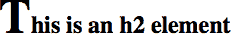

# 第三章：伪类和伪元素选择器

在前一章中，你看到了如何使用相对简单的表达式来匹配文档中的单个元素或元素集合，这些表达式匹配 HTML 文档中的属性。如果你的需求只是基于属性进行样式设置，这些方法非常适用。但如果你需要根据文档当前的状态或结构来设置文档的一部分样式，或者如果你想选择所有被禁用的表单元素，或者必须要求表单提交的元素，那么 CSS 就有了伪类和伪元素选择器，它们可以实现这些功能，以及更多。

# 伪类选择器

*伪类选择器* 允许你为实际上通过某些元素的状态或文档中的标记模式，甚至文档本身的状态推断出的幻影类分配样式。

术语 *幻影类* 可能听起来有点奇怪，但这确实是思考伪类工作方式的最佳方式。例如，假设你想突出显示数据表的每一行。你可以通过将每一行标记为 `class="even"`，然后编写 CSS 来突出显示具有该类的行，或者（正如你很快会看到的）你可以使用伪类选择器来实现相同的效果，它会像你已经将所有这些类添加到标记中一样操作，尽管你实际上并没有这样做。

这里需要明确一个伪类的一个方面：伪类总是指它们附加到的元素，而不是其他的。听起来像是显而易见的事情，对吧？之所以明确说明这一点，是因为对于一些伪类来说，错误地认为它们是指的后代元素是一个常见的错误。

为了说明这一点，Eric 想分享一个个人轶事：

> 当我 2003 年第一个孩子出生时，我按照惯例在网上宣布了这个消息。很多人发来祝贺的同时也开了些 CSS 的笑话，其中主要的是选择器 `#ericmeyer:first-child`（稍后我们会详细讨论 `:first-child`）。但是那个选择器会选择我，而不是我的女儿，只有在我自己父母的第一个孩子时（事实上，我确实是）。要正确选择*我的*第一个孩子，那个选择器应该是 `#ericmeyer > :first-child`。

这种混淆是可以理解的，这也是我们在这里讨论它的原因。在接下来的章节中会有提醒。请记住，伪类的效果是将一种幻影类应用于它们附加到的元素，只要牢记这一点，你应该没问题。

所有的伪类，毫无例外，都是一个单冒号（`:`）前面跟着一个词或连字符的术语，并且它们可以出现在选择器的任何位置。

## 结合伪类

在我们真正开始之前，关于链接的一点。CSS 允许将伪类结合（链）。例如，你可以使未访问的链接在悬停时变红色，并在悬停时访问的链接变为栗色：

```
a:link:hover {color: red;}
a:visited:hover {color: maroon;}
```

指定的顺序无关紧要；您也可以写`a:hover:link`，效果与`a:link:hover`相同。还可以为其他语言中的未访问和已访问链接分配单独的悬停样式，例如德语：

```
a:link:hover:lang(de) {color: gray;}
a:visited:hover:lang(de) {color: silver;}
```

注意不要组合互斥的伪类。例如，链接不能同时是访问过和未访问过的，所以`a:link:visited`毫无意义，并且永远不会匹配任何内容。

## 结构性伪类

我们将首先探讨的伪类是结构性的；也就是说，它们涉及文档的标记结构。大多数伪类依赖于标记内的模式，比如选择每第三个段落，但其他伪类允许您针对特定类型的元素进行选择。

### 选择根元素

这是结构简单性的精髓：伪类`:root`选择文档的根元素。在 HTML 中，这总是`<html>`元素。此选择器的真正好处在于为 XML 语言编写样式表时，根元素可能在每种语言中都不同——例如，在 SVG 中是`<svg>`元素，在我们之前的 PlanetML 示例中是`<pml>`元素——甚至在同一语言中可能有多个可能的根元素（尽管不是在单个文档中！）。

下面是在 HTML 中样式化根元素的示例，如图 3-1 所示：

```
:root {border: 10px dotted gray;}
body {border: 10px solid black;}
```


###### 图 3-1\. 样式化根元素

在 HTML 文档中，您可以直接选择`<html>`元素，而不必使用`:root`伪类。这两个选择器在特异性方面有所不同，我们将在第四章中进行详细讨论，但除此之外，它们效果相同。

### 选择空元素

使用伪类`:empty`，您可以选择任何没有任何子元素（包括文本节点）的元素，这包括文本和空白。这在抑制内容管理系统（CMS）生成的未填充任何实际内容的元素时非常有用。因此，`p:empty {display: none;}`将阻止显示任何空段落。

请注意，为了匹配，元素必须从解析的角度来看确实为空——没有空白、可见内容或后代元素。以下元素中，只有第一个和最后一个会被`p:empty`匹配到：

```
<p></p>
<p> </p>
<p>
</p>
<p><!—-a comment--></p>
```

第二和第三段落不会被`:empty`匹配，因为它们不是空的：分别包含一个空格和一个换行符。它们都被视为文本节点，因此阻止了空状态。最后一个段落匹配，因为注释不被视为内容，甚至不是空白。但是，只要在注释两侧放置一个空格或换行符，`p:empty`就无法匹配。

你可能会被诱惑只是样式化所有空元素，比如 `*:empty {display: none;}`，但其中有一个隐蔽的陷阱：`:empty` 匹配 HTML 的空元素，比如 ``、`<hr>`、`<br>` 和 `<input>`。甚至可以匹配 `<textarea>`，除非你在 `<textarea>` 元素中插入一些默认文本。

因此，在匹配元素方面，`img` 和 `img:empty` 是等效的（它们在特异性上有所不同，这将在下一章节中讨论）。

### 选择仅为子元素

如果你曾想选择所有被超链接元素包裹的图片，`:only-child` 伪类正是为你而设计的。它在元素是另一个元素的唯一子元素时进行选择。比如说你想给任何一个作为其父元素唯一子元素的图片加上边框，你可以写成以下这样：

```
img:only-child {border: 1px solid black;}
```

这将匹配符合这些条件的任何图片。因此，如果你有一个段落包含一张图片且没有其他子元素，那么无论周围有多少文本，该图片都会被选中。如果你真正想要的是仅为唯一子元素且位于超链接内的图片，你只需修改选择器如下（如图 3-2 中所示）：

```
a[href] img:only-child {border: 2px solid black;}
```

```
<a href="http://w3.org/"></a>
<a href="http://w3.org/"> The W3C</a>
<a href="http://w3.org/"> <em>The W3C</em></a>
```


###### 图 3-2\. 选择只作为链接内唯一子元素的图片

你应该记住关于 `:only-child` 的两件事。首先是你*总是*将其应用于你希望成为唯一子元素的元素，而不是父元素，正如前面所解释的那样。这带来的第二件事要记住的是，当你在后代选择器中使用 `:only-child` 时，你并没有将列出的元素限制为父子关系。

回到超链接图片的例子，`a[href] img:only-child` 匹配任何作为其直接父元素的唯一子元素且是 `a` 元素后代的图片，无论它是否是 `a` 元素的*子元素*。要匹配，元素图片必须是其直接父元素的唯一子元素，同时也是具有 `href` 属性的 `a` 元素的后代，但该父元素本身可以是相同 `<a>` 元素的后代。因此，以下三个图片都会被匹配，如图 3-3 所示：

```
a[href] img:only-child {border: 5px solid black;}
```

```
<a href="http://w3.org/"></a>
<a href="http://w3.org/"><span></span></a>
<a href="http://w3.org/">A link to <span>the 
   web</span> site</a>
```


###### 图 3-3\. 选择只作为链接内唯一子元素的图片，再论

在每种情况下，图片都是其父元素的唯一子元素，并且也是 `<a>` 元素的后代。因此，所有三个图片都被所示规则匹配。如果你想限制规则以使其匹配作为 `<a>` 元素唯一子元素的图片，你可以添加子元素结合器，以得到 `a[href] > img:only-child`。通过这种修改，只有第三章中显示的第一个图片会被匹配。

### 仅使用 `:only-of-type` 选择

这都很好，但是如果要匹配作为超链接中唯一图像的图像，但其他元素可能也在其中，该怎么办？考虑以下情况：

```
<a href="http://w3.org/"><b>•</b></a>
```

在这种情况下，我们有一个 `a` 元素，其有两个子元素：`<b>` 和 ``。该图像不再是其父级（超链接）的唯一子元素，因此永远不会使用 `:only-child` 进行匹配。但是，它*可以*使用 `:only-of-type` 进行匹配。这在图 3-4 中有所说明：

```
a[href] img:only-of-type {border: 5px solid black;}
```

```
<a href="http://w3.org/"><b>•</b></a>
<a href="http://w3.org/"><span><b>•</b></span></a>
```


###### 图 3-4。选择作为其类型唯一同级的图像

不同之处在于`:only-of-type`将匹配任何元素，该元素是其同级中唯一的此类型，而`:only-child`只会在元素根本没有同级时才匹配。

在某些情况下，这可以非常有用，例如在段落中选择图像而无需担心超链接或其他内联元素的存在：

```
p > img:only-of-type {float: right; margin: 20px;}
```

只要没有多个是同一段落的子图像，该图像将被浮动到右侧。

您还可以使用此伪类为文档中给定部分中的 `<h2>` 应用额外样式，如下所示：

```
section > h2 {margin: 1em 0 0.33em; font-size: 1.8rem; border-bottom: 1px solid
   gray;}
section > h2:only-of-type {font-size: 2.4rem;}
```

根据这些规则，任何只有一个子 `<h2>` 的 `<section>` 将使该 `<h2>` 显示比平常大。如果 `section` 有两个或更多 `<h2>` 子元素，则不会有一个比另一个更大。其他子元素的存在——无论是其他标题级别、表格、段落、列表等等——都不会影响匹配。

还有一点需要澄清的是`:only-of-type`只引用元素，不引用其他内容。考虑以下情况：

```
p.unique:only-of-type {color: red;}
```

```
<div>
  <p class="unique">This paragraph has a 'unique' class.</p>
  <p>This paragraph doesn't have a class at all.</p>
</div>
```

在这种情况下，这两个段落都不会被选中。为什么？因为两个段落都是 `<div>` 的后代，它们中的任何一个都不能是其类型的唯一一个。

这里类名无关紧要。我们可能会被误导，认为*type*是一个泛泛的描述，因为我们解析语言的方式。然而，`：only-of-type` 所指的*type*只指元素类型，就像类型选择器一样。因此，`p.unique:only-of-type` 意味着“选择任何 `<p>` 元素，该元素在其同级中是唯一的 `<p>` 元素，如果它还具有 `class` 为 `unique`。” 它*不*意味着“当 `class` 属性包含单词 `unique` 时，选择任何 `<p>` 元素，它是唯一一个符合该标准的同级段落。”

### 选择第一个子元素

常见的情况是想要对元素的第一个或最后一个子元素应用特殊样式。一个典型的例子是在选项卡栏中为一组导航链接应用样式，并希望在第一个或最后一个选项卡（或两者）上加上特殊的视觉效果。如果没有结构选择器，可以通过为这些元素应用特殊类来实现。我们有伪类来为我们承担这个任务，无需手动确定哪些元素是第一个和最后一个。

伪类`:first-child`用于选择作为其他元素第一个子元素的元素。考虑以下标记：

```
<div>
  <p>These are the necessary steps:</p>
  <ul>
    <li>Insert key</li>
    <li>Turn key <strong>clockwise</strong></li>
    <li>Push accelerator</li>
  </ul>
  <p>
    Do <em>not</em> push the brake at the same time as the accelerator.
  </p>
</div>
```

在此示例中，第一个子元素是第一个`<p>`、第一个`<li>`以及`<strong>`和`<em>`元素，它们都是其各自父元素的第一个子元素。根据以下两个规则，

```
p:first-child {font-weight: bold;}
li:first-child {text-transform: uppercase;}
```

我们得到如图 3-5 所示的结果。


###### 图 3-5\. 样式化第一个子元素

第一个规则使任何作为另一个元素的第一个子元素的`<p>`元素加粗。第二个规则将使作为另一个元素的第一个子元素的`<li>`元素大写（在 HTML 中，这必须是`<ol>`或`<ul>`元素）。

正如已经提到的，最常见的错误是假设像`p:first-child`这样的选择器将选择`<p>`元素的第一个子元素。请记住伪类的本质，即将一种幻影类附加到锚点元素，即与伪类相关联的元素。如果要向标记添加实际类，它看起来会像这样：

```
<div>
  <p class="first-child">These are the necessary steps:</p>
  <ul>
    <li class="first-child">Insert key</li>
    <li>Turn key <strong class="first-child">clockwise</strong></li>
    <li>Push accelerator</li>
  </ul>
  <p>
    Do <em class="first-child">not</em> push the brake at the same time as the
  accelerator.
  </p>
</div>
```

因此，如果您想选择那些作为另一个元素的第一个子元素的`<em>`元素，则应编写`em:first-child`。

### 选择最后的子元素

`:first-child`的镜像是`:last-child`。如果我们采用前面的示例并只更改伪类，则得到如图 3-6 所示的结果：

```
p:last-child {font-weight: bold;}
li:last-child {text-transform: uppercase;}
```

```
<div>
  <p>These are the necessary steps:</p>
  <ul>
    <li>Insert key</li>
    <li>Turn key <strong>clockwise</strong></li>
    <li>Push accelerator</li>
  </ul>
  <p>
    Do <em>not</em> push the brake at the same time as the accelerator.
  </p>
</div>
```


###### 图 3-6\. 样式化最后的子元素

第一个规则使任何作为另一个元素的最后一个子元素的`<p>`元素加粗。第二个规则将使作为另一个元素的最后一个子元素的`<li>`元素大写。如果您想要选择最后一个段落中的`<em>`元素，则可以使用选择器`p:last-child em`，它选择任何作为自身另一个元素的最后一个子元素的`<p>`元素中的`<em>`元素。

有趣的是，您可以结合这两个伪类来创建一个`only-child`的版本。以下两个规则将选择相同的元素：

```
p:only-child {color: red;}
p:first-child:last-child {background-color: red;}
```

无论哪种方式，我们得到具有红色前景和背景颜色的段落（明确地说，这不是一个好主意）。

### 选择类型的第一个和最后一个

与选择元素的第一个和最后一个子元素类似，您可以选择在另一个元素内部的特定类型的元素的第一个或最后一个。这允许执行诸如选择给定元素内的第一个`<table>`之类的操作，而不管之前有什么元素：

```
table:first-of-type {border-top: 2px solid gray;}
```

请注意，这不适用于整个文档；所示的规则不会选择文档中的第一个表并跳过所有其他表。它将选择每个包含表的元素内的第一个`<table>`元素，并跳过任何在第一个之后的同级`<table>`元素。因此，给定图 3-7 中显示的文档结构，被圈出的节点是被选择的节点。


###### 图 3-7\. 选择第一个类型为表的表格

在表的上下文中，一种有用的方式是选择行中第一个数据单元格，无论该行中是否有一个标题单元格在它之前：

```
td:first-of-type {border-left: 1px solid red;}
```

这将选择每个表行中的第一个数据单元格（即包含`7`和`R`的单元格）：

```
<tr>
  <th scope="row">Count</th><td>7</td><td>6</td><td>11</td>
</tr>
<tr>
  <td>R</td><td>X</td><td>-</td>
</tr>
```

与选择`td:first-child`的效果进行比较，它将选择第二行中的第一个`<td>`元素，但不会选择第一行中的第一个`<td>`元素。

另一面是`:last-of-type`，它从其兄弟元素中选择给定类型的最后一个实例。在某种程度上，它就像`:first-of-type`，不同之处在于你从一组兄弟姐妹的最后一个元素开始，向后遍历直到到达该类型的第一个实例。在图 3-8 中显示的文档结构中，用`table:last-of-type`选择的是圈出来的节点。


###### 图 3-8\. 选择最后一个类型为表的表格

正如在`:only-of-type`中所指出的，记住你选择的是同类元素中的元素，而不是在整个文档中同一类型的所有元素的第一个（或最后一个）作为单一组。每组共享父元素的元素被视为单独的一组，你可以选择每组中类型的第一个（或最后一个）。

与前一节提到的类似，你可以结合这两个伪类创建`:only-of-type`的版本。以下两个规则将选择相同的元素：

```
table:only-of-type{color: red;}
table:first-of-type:last-of-type {background: red;}
```

### 选择每个第 n 个子元素

如果你可以选择其他元素的第一个、最后一个或唯一的子元素，那么如何选择每第三个子元素？所有偶数子元素？只有第九个子元素？CSS 不是试图定义无数个命名伪类，而是有`:nth-child()`伪类。通过在括号内填写整数或甚至基本的代数表达式，你可以选择任何你喜欢的任意编号子元素。

让我们从`:first-child`的`:nth-child()`等效部分`:nth-child(1)`开始。在下面的例子中，所选元素将是第一个段落和第一个列表项：

```
p:nth-child(1) {font-weight: bold;}
li:nth-child(1) {text-transform: uppercase;}
```

```
<div>
  <p>These are the necessary steps:</p>
  <ul>
    <li>Insert key</li>
    <li>Turn key <strong>clockwise</strong></li>
    <li>Push accelerator</li>
  </ul>
  <p>
    Do <em>not</em> push the brake at the same time as the accelerator.
  </p>
</div>
```

但是，如果我们把数字从`1`改为`2`，则不会选择任何段落，并且将选择中间（第二个）列表项，如在图 3-9 中所示：

```
p:nth-child(2) {font-weight: bold;}
li:nth-child(2) {text-transform: uppercase;}
```


###### 图 3-9\. 设置第二个子元素样式

你可以插入任何你选择的整数。如果你有一个使用案例，需要选择任何父元素的第 93 个有序列表子元素，`ol:nth-child(93)`可以随时为你服务。只要该子元素是有序列表，它就会匹配任何父元素的第 93 个子元素。（这并不意味着在其兄弟姐妹中的第 93 个有序列表；参见“选择每种类型的第 n 个”）

使用`:nth-child(1)`而不是`:first-child`有何理由？没有。在这种情况下，可以使用任何您喜欢的。它们之间实际上没有区别。

更强大的是，您可以使用简单的代数表达式形式*`a`*`n` + *`b`*或*`a`*`n` - *`b`*来定义重复的实例，其中*`a`*和*`b`*是整数，`n`表示为其本身。此外，`+` *`b`*或`−` *`b`*部分是可选的，因此如果不需要，可以省略。

假设我们想要选择无序列表中的每第三个列表项，从第一个开始。以下操作使其成为可能，选择第一个和第四个项目，如图 3-10 所示：

```
ul > li:nth-child(3n + 1) {text-transform: uppercase;}
```


###### 图 3-10。样式化每第三个列表项

这种工作方式是`n`表示系列 0、1、2、3、4 等直到无限。然后浏览器解决`3n + 1`，产生 1、4、7、10、13 等。如果删除`+ 1`，即简单留下`3n`，结果将是 0、3、6、9、12 等。由于没有第 0 个列表项——所有元素计数从 1 开始，这个表达式选中的第一个列表项将是列表中的第三个列表项。

鉴于元素计数从 1 开始，推断`:nth-child(2n)`将选择偶数编号的子元素，而`:nth-child(2n+1)`或`:nth-child(2n-1)`将选择奇数编号的子元素是一种小技巧。您可以将其记忆下来，或者您可以使用`:nth-child()`接受的两个特殊关键字：`even`和`odd`。想要突出显示表的每一行中的其他行，从第一行开始？以下是如何实现的，结果显示在图 3-11 中：

```
tr:nth-child(odd) {background: silver;}
```


###### 图 3-11。样式化每隔一行的表行

任何比每隔一个元素更复杂的东西都需要*`a`*`n` + *`b`*表达式。

请注意，在*`b`*使用负数时，必须去掉`+`号，否则选择器将完全失败。以下两个规则中，只有第一个会起作用。解析器将丢弃第二个，并完全忽略整个声明块：

```
tr:nth-child(4n - 2) {background: silver;}
tr:nth-child(3n + −2) {background: red;}  /* INVALID */
```

您还可以在表达式中使用负的*`a`*值，这将有效地从您在*`b`*中使用的术语开始向后计数。选择列表中的前五个列表项可以这样做：

```
li:nth-child(-n + 5) {font-weight: bold;}
```

这有效是因为负数`n`为 0、–1、–2、–3、–4 等。对每个数加 5，您会得到 5、4、3、2、1 等。为`n`添加负数乘数，您可以选择每第二个、第三个或您想要的任何编号的元素，如下所示：

```
li:nth-child(-2n + 10) {font-weight: bold;}
```

这将选择列表中的第 10、第 8、第 4 和第 2 个列表项。

正如您可能期望的那样，对应的伪类是`nth-last-child()`。这让您可以像使用`nth-child()`一样操作，只不过`nth-last-child()`从同级元素列表的最后一个元素开始向前计数。如果您打算突出显示每隔一个表格行*并*确保最后一行是突出显示模式中的一行，则这两者都适合您：

```
tr:nth-last-child(odd) {background: silver;}
tr:nth-last-child(2n+1) {background: silver;} /* equivalent */
```

如果文档对象模型（DOM）更新以添加或删除表格行，则无需添加或删除类。通过使用结构选择器，这些选择器将始终匹配更新后的 DOM 的奇数行。

如果符合条件，可以使用`nth-child()`和`nth-last-child()`匹配任何元素。考虑这些规则，其结果显示在图 3-12 中。

```
li:nth-child(3n + 3) {border-left: 5px solid black;}
li:nth-last-child(4n - 1) {border-right: 5px solid black; background: silver;}
```

再次，对于*`a`*使用负数术语实际上是在倒数计数，但由于这个伪类已经从末尾开始计数，负数术语实际上是正向计数。也就是说，你可以这样选择列表中的最后五个列表项：

```
li:nth-last-child(-n + 5) {font-weight: bold;}
```

###### 注意

`nth-child()`和`nth-last-child()`的扩展允许从由简单或复合选择器匹配的元素中进行选择；例如，`nth-child(2n + 1 of p.callout)`。截至 2023 年初，这在 Safari 和 Chrome 的测试版中得到支持。随着其包含在 Interop 2023 中，计划在不久的将来完全支持它。


###### 图 3-12\. 结合`nth-child()`和`nth-last-child()`的模式

您还可以将这两个伪类连接在一起，如`nth-child(1):nth-last-child(1)`，从而创建一个更详细的`only-child`的重新陈述。除了创建具有更高特异性的选择器（详见第四章）外，没有真正的理由这样做，但这是一个选项。

您可以使用 CSS 确定列表中项目的数量，并相应地设置其样式：

```
li:only-child {width: 100%;}
li:nth-child(1):nth-last-child(2),
li:nth-child(2):nth-last-child(1) {width: 50%;}
li:nth-child(1):nth-last-child(3),
li:nth-child(1):nth-last-child(3) ~ li {width: 33.33%;}
li:nth-child(1):nth-last-child(4),
li:nth-child(1):nth-last-child(4) ~ li {width: 25%;}
```

在这些示例中，如果列表项是唯一的列表项，则宽度为 100%。如果列表项既是第一项又是倒数第二项，这意味着有两个项目，宽度为 50%。如果一项既是第一项又是倒数第三项，我们将它及其后续的两个同级列表项设为 33%的宽度。同样，如果列表项既是第一项又是倒数第四项，这意味着正好有四个项目，因此我们将它及其三个同级项设为宽度的 25%。（注意：使用`:has()`伪类可以更轻松地实现这种效果，详见“:has() 伪类”。）

### 选择每种类型的第 n 个

如同可能已经成为熟悉的模式一样，`:nth-child()` 和 `:nth-last-child()` 伪类在 `:nth-of-type()` 和 `:nth-last-of-type()` 中有类似物。例如，您可以选择给定段落的每隔一个的超链接，从第二个开始使用 `p > a:nth-of-type(even)`。这将忽略所有其他元素（`<span>`、`<strong>` 等），并仅考虑链接，如图 3-13 所示：

```
p > a:nth-of-type(even) {background: blue; color: white;}
```


###### 图 3-13\. 选择偶数链接

如果您想要从最后一个超链接向后工作，则可以使用`p > a:nth-last-of-type(even)`。

与以前一样，这些伪类从其兄弟元素中选择元素的类型，而*不是*从整个文档中同一类型的所有元素中选择。每个元素都有其自己的兄弟元素列表，并且选择发生在每个组内部。

`:nth-of-type()` 与 `nth-child()` 的区别在于，`:nth-of-type()` 计算您选择的实例数，并在该元素集合内进行计数。例如，考虑以下标记：

```
<tr>
   <th scope="row">Count</th>
   <td>7</td>
   <td>6</td>
   <td>11</td>
   <td>17</td>
   <td>3</td>
   <td>21</td>
</tr>
<tr>
   <td>R</td>
   <td>X</td>
   <td>-</td>
   <td>C</td>
   <td>%</td>
   <td>A</td>
   <td>I</td>
</tr>
```

如果您想要选择行中位于偶数列中的每个表格单元格，则应使用`td:nth-child(even)`。但是，如果您想要选择表格单元格的每个偶数实例，则应使用`td:nth-of-type(even)`。您可以在图 3-14 中看到此差异，该图展示了以下 CSS 的结果：

```
td:nth-child(even) {background: silver;}
td:nth-of-type(even) {text-decoration: underline;}
```


###### 图 3-14\. 选择`nth-child`和`nth-of-type`表格单元格

在第一行中，选择每个偶数序号的表格数据单元格(`td`)，从表头单元格(`th`)后的第一个单元格开始。在第二行中，由于所有单元格都是`td`单元格，这意味着该行中的所有单元格都是相同类型的，因此计数从第一个单元格开始。

正如您可能期望的那样，您可以一起使用`:nth-of-type(1):nth-last-of-type(1)`来重申`:only-of-type`，但具有更高的特异性。（我们*将*在第四章中解释特异性，我们保证。）

## 位置伪类

使用*位置伪类*，我们进入了根据文档结构以外的东西匹配文档部分的选择器领域——这些东西仅仅通过研究文档的标记是无法准确推断的。

这可能听起来像是随机应用样式，但并非如此。相反，我们根据一些无法预先预测的相对短暂的条件来应用样式。然而，样式将出现的具体情况确实是明确定义的。

请这样想：在体育赛事中，当主队得分时，观众会欢呼。你不知道球赛中主队将何时得分，但当他们得分时，观众会像预测的那样欢呼。无法预测欢呼的确切时刻并不使其显得不可预测。

现在考虑锚点元素 (`<a>`)，它（在 HTML 和相关语言中）建立了从一个文档到另一个文档的链接。锚点始终是锚点，但有些锚点指向已经访问过的页面，而其他一些则指向尚未访问过的页面。通过简单查看 HTML 标记，你无法区分它们之间的差异，因为在标记中，所有的锚点看起来都是相同的。

唯一可以知道哪些链接已被访问的方法是将文档中的链接与用户的浏览历史进行比较。因此，实际上有两种基本类型的链接：已访问和未访问。

### 针对超链接的伪类

CSS 定义了一些仅适用于超链接的伪类。在 HTML 中，超链接是任何带有 `href` 属性的 `<a>` 元素；在 XML 语言中，超链接是任何充当到另一个资源的链接的元素。表 3-1 描述了你可以应用于它们的伪类。

表 3-1\. 链接伪类

| 名称 | 描述 |
| --- | --- |
| `:link` | 指向任何超链接（即具有 `href` 属性）且指向未访问地址的锚点。 |
| `:visited` | 指向已访问地址的超链接的锚点。出于安全原因，可应用于已访问链接的样式严格受限；详细信息请参阅“访问链接和隐私”。 |
| `:any-link` | 指向由 `:link` 或 `:visited` 匹配的任何元素。 |
| `:local-link` | 指向与被样式化页面相同 URL 的任何链接。例如文档内的跳转链接。*注：截至 2023 年初尚不支持*。 |

表 3-1 中的第一个伪类看起来有点多余。毕竟，如果一个锚点尚未被访问，它必然是未访问的，对吧？如果是这样，我们所需的只是以下内容：

```
a {color: blue;}
a:visited {color: red;}
```

尽管这种格式看起来很合理，但还不够。这里展示的规则中的第一个不仅适用于未访问的链接，而且适用于任何没有 `href` 属性的 `<a>` 元素，例如这个：

```
<a id="section004">4\. The Lives of Meerkats</a>
```

由于 `<a>` 元素将匹配规则 `a {color`: `blue;}`，因此结果文本将是蓝色的。因此，为了避免将您的链接样式应用于占位符链接，请使用 `:link` 和 `:visited` 伪类：

```
a:link {color: blue;}    /* unvisited links are blue */
a:visited {color: red;}   /* visited links are red */
```

这是一个重新审视属性和类选择器，并展示它们如何与伪类结合的好地方。例如，假设你想要改变指向你自己站点外部的链接的颜色。在大多数情况下，我们可以使用以某个属性值开头的属性选择器。然而，有些内容管理系统将所有链接设置为绝对 URL，这种情况下你可以给每个锚点分配一个类。这很容易：

```
<a href="/about.html">My About page</a>
<a href="https://www.site.net/" class="external">An external site</a>
```

要为外部链接应用不同的样式，你只需像这样设置一个规则：

```
a.external:link, a[href^="http"]:link { color: slateblue;}
a.external:visited, a[href^="http"]:visited  {color: maroon;}
```

此规则将默认使前述标记中的第二个锚点呈钢蓝色，并且一旦被访问将变为栗色，而第一个锚点将保持超链接的默认颜色（通常未访问时为蓝色，已访问时为紫色）。为了提高可用性和无障碍性，应该清晰地区分访问过的链接和未访问的链接。

###### 注意

样式化访问过的链接使访问者知道他们已经访问过的页面以及尚未访问的页面。在大型网站上，这尤为重要，因为对于那些有认知障碍的人来说，记住已访问页面可能会很困难。突出显示访问过的链接不仅是 W3C 网页内容无障碍指南的一部分，而且可以使搜索内容更快捷、更高效，减少压力。

ID 选择器使用相同的一般语法：

```
a#footer-copyright:link {background: yellow;}
a#footer-copyright:visited {background: gray;}
```

如果你想选择所有链接，不论其是否已访问，可以使用 `:any-link`：

```
a#footer-copyright:any-link {text-decoration: underline;}
```

### 非超链接位置伪类

超链接并不是唯一与位置相关的元素。CSS 还提供了一些与超链接目标相关的伪类，总结在 表 3-2 中。

表 3-2\. 非超链接位置伪类

| 名称 | 描述 |
| --- | --- |
| `:target` | 指的是其`id`属性值与 URL 中的片段选择器匹配的元素——即 URL 特别指定的元素。 |
| `:target-within` | 指的是 URL 的目标元素，或者包含被目标元素选定的元素。*注意：截至 2023 年初还不支持。* |
| `:scope` | 指的是作为选择器匹配参考点的元素。 |

让我们谈谈目标选择。当 URL 包含片段标识符时，它指向的文档部分在 CSS 中称为“目标”。因此，你可以使用 `:target` 伪类唯一地为任何片段标识符目标的元素设置样式。

即使你对“片段标识符”这个术语不熟悉，你可能已经在使用中见过它们。考虑这个 URL：

```
http://www.w3.org/TR/css3-selectors/#target-pseudo
```

URL 的 `target-pseudo` 部分是片段标识符，由 `#` 符号标记。如果引用页面（*http://www.w3.org/TR/css3-selectors/*）具有 `target-pseudo` ID 的元素，则该元素成为片段标识符的目标。

感谢`：target`，您可以突出显示文档中的任何目标元素，或者您可以为可能被定位的各种类型的元素设计不同的样式，比如为定位的标题设计一种样式，为定位的表格设计另一种样式等等。图 3-15 展示了`：target`的示例：

```
*:target {border-left: 5px solid gray; background: yellow url(target.png)
    top right no-repeat;}
```


###### 图 3-15。样式化片段标识符目标

`：target`样式不会应用于三种情况：

+   通过不带片段标识符的 URL 访问页面。

+   通过带有片段标识符的 URL 访问页面，但标识符与文档中的任何元素都不匹配。

+   页面的 URL 以不创建滚动状态的方式更新，这通常通过 JS 花招实现。（这不是 CSS 规则，但这是浏览器的行为。）

更有趣的是，如果文档中的多个元素可以通过片段标识符匹配，例如，如果作者错误地在同一文档中包含三个单独的`<div id="target-pseudo">`实例会发生什么？

简而言之，CSS 没有也不需要覆盖这种情况的规则，因为 CSS 只关注样式目标。无论浏览器选择三个元素中的一个作为目标，还是将三个元素都指定为相等的目标，`：target`样式应该应用于任何有效的目标。

与`：target`伪类密切相关的是`：target-within`伪类。不同之处在于`：target-within`不仅匹配目标元素，还匹配目标元素的祖先元素。因此，以下 CSS 将匹配包含目标的任何`<p>`元素，或者本身是目标的任何元素：

```
p:target-within {border-left: 5px solid gray; background: yellow url(target.png)
    top right no-repeat;}
```

或者，如果任何浏览器支持的话。截至 2023 年初，情况并非如此。

最后，我们考虑`：scope`伪类。这在很大程度上得到了支持，但目前只在脚本情况下很有用。考虑以下 JS 和 HTML，我们将在代码后解释：

```
var output = document.getElementById('output');
var registers = output.querySelectorAll(':scope > div');
```

```
<section id="output">
  <h3>Results</h3>
  <div></div>
  <div></div>
</section>
```

JS 部分实际上是说：“找到 ID 为`output`的元素。然后，找到刚刚找到的`output`元素的所有`<div>`子元素。”（是的，CSS 选择器可以在 JS 中使用！）那段 JS 中的`：scope`指的是已找到的事物的范围，因此将选择限制在其中而不是整个文档。结果是，在 JS 程序的内存中，现在有一个结构保存对 HTML 中两个`<div>`元素的引用。

如果您在纯 CSS 中使用`：scope`，它将指向*作用域根*，目前（假设文档是 HTML）意味着`<html>`元素。HTML 和 CSS 都没有提供设置作用域根的方法，除了文档的根元素。因此，在 JS 之外，`：scope`本质上等同于`:root`。这可能会在未来发生变化，但目前，您应该只在 JS 上下文中使用`：scope`。

## 用户操作伪类

CSS 定义了一些伪类，可以根据用户的操作改变文档的外观。这些 *动态伪类* 传统上用于样式化超链接，但可能性更广泛。伪类在 表 3-3 中描述。

表 3-3\. 用户操作伪类

| 名称 | 描述 |
| --- | --- |
| `:hover` | 指鼠标指针悬停在其上的任何元素，例如，鼠标指针悬停在其上的超链接 |
| `:active` | 指任何被用户输入激活的元素，例如，用户在按住鼠标按钮的时间内单击的超链接，或者用户通过触摸屏轻拍的元素 |
| `:focus` | 指当前具有输入焦点的任何元素，即可以接受键盘输入或以某种方式被激活的元素 |
| `:focus-within` | 指当前具有输入焦点的任何元素，即可以接受键盘输入或以某种方式被激活的元素，或包含具有这种焦点的元素的元素 |
| `:focus-visible` | 指当前具有输入焦点的任何元素，但仅当用户代理认为它是应该具有可见焦点的元素类型时 |

可以变为 `:active` 或具有 `:focus` 的元素包括链接、按钮、菜单项、任何具有 `tabindex` 值的元素以及所有其他交互式元素，包括表单控件和包含可编辑内容的元素（通过在元素的开放标签中添加 `contenteditable` 属性）。

与 `:link` 和 `:visited` 一样，这些伪类在超链接的上下文中最为熟悉。许多网页的样式看起来像这样：

```
a:link {color: navy;}
a:visited {color: gray;}
a:focus {color: orange;}
a:hover {color: red;}
a:active {color: yellow;}
```

###### 注意

伪类的顺序比起初看起来更为重要。通常的建议是 `link`、`visited`、`focus`、`hover` 和 `active`。下一章解释了为什么这个特定顺序很重要，并讨论了您可能选择改变甚至忽略建议的几个原因。

注意动态伪类可以应用于任何元素，这很有用，因为经常需要对不是链接的元素应用动态样式。考虑这个例子：

```
input:focus {background: silver; font-weight: bold;}
```

通过使用这个标记，您可以突出显示准备接受键盘输入的表单元素，如 图 3-16 所示。


###### 图 3-16\. 突出显示具有焦点的表单元素

用户操作伪类的两个相对较新的补充是 `:focus-within` 和 `:focus-visible`。让我们先看第二个。

### :focus-visible 伪类

`:focus-visible` 类与 `:focus` 非常相似，它应用于具有焦点的元素，但有一个重要的区别：它仅在具有焦点的元素是用户代理认为在特定情况下应给予可见焦点样式的元素时匹配。

例如，考虑 HTML 按钮。当通过鼠标点击按钮时，该按钮获得焦点，就像我们使用键盘界面将焦点移动到它时一样。作为关注无障碍性和美观的作者，我们希望按钮在通过键盘或其他辅助技术获得焦点时具有焦点，但在通过点击或轻触时不要应用焦点样式。

我们可以通过使用以下 CSS 来解决这个问题：

```
button:focus-visible {outline: 5px solid maroon;}
```

当通过键盘切换到按钮时，它将被描绘为带有厚重的深红色轮廓，但当通过鼠标点击按钮时，规则不会被应用。

### :focus-within 伪类

在此基础上，`:focus-within`适用于任何具有焦点的元素，或任何具有焦点后代的元素。根据以下的 CSS 和 HTML，我们将得到图 3-17 中显示的结果：

```
nav:focus-within {border: 3px solid silver;}
a:focus-visible {outline: 2px solid currentcolor;}
```

```
<nav>
  <a href="home.html">Home</a>
  <a href="about.html">About</a>
  <a href="contact.html">Contact</a>
</nav>
```


###### 图 3-17\. 使用`:focus-within`选择元素

当前第三个链接拥有焦点，用户通过按 Tab 键到达该链接，并以 2 像素的轮廓样式进行装饰。包含该链接的`<nav>`元素也通过`:focus-within`获得焦点样式，因为它的一个后代元素（即从它衍生的元素）当前拥有焦点。这为页面的该区域增加了一些视觉重量，这可能会有所帮助。但请注意不要过度使用焦点样式，因为过多的焦点样式可能会造成视觉过载，潜在地导致用户混淆。

###### 警告

尽管您可以按自己的喜好为元素设置`:focus`样式，但不要从焦点元素中删除所有样式。区分当前具有焦点的元素对于无障碍性至关重要，特别是对于通过键盘或其他辅助技术导航您的站点或应用程序的用户。

### 动态样式化的现实世界问题

动态伪类呈现了一些有趣的问题和特殊性。例如，您可以将访问过的和未访问过的链接设置为一种字体大小，并使悬停链接变大，正如图 3-18 所示：

```
a:link, a:visited {font-size: 13px;}
a:hover, a:active {font-size: 20px;}
```


###### 图 3-18\. 使用动态伪类更改布局

正如您所看到的，当鼠标指针悬停在锚点上时，用户代理会增大锚点的大小，或者依靠`:active`设置，当用户在触摸屏上触摸它时也会增大。因为我们正在更改影响行高的属性，因此支持此行为的用户代理必须在锚点处于悬停状态时重新绘制文档，这可能会强制重新布局其后的所有内容。

## UI 状态伪类

与动态伪类密切相关的是*用户界面（UI）状态伪类*，这些伪类在表 3-4 中进行了总结。这些伪类允许根据诸如复选框之类的 UI 元素的当前状态进行样式设置。

表 3-4\. UI 状态伪类

| 名称 | 描述 |
| --- | --- |
| `:enabled` | 指的是已启用的 UI 元素（如表单元素），即可以进行输入 |
| `:disabled` | 指的是已禁用的 UI 元素（如表单元素），即不能进行输入 |
| `:checked` | 指的是已被选中的单选按钮或复选框，可以是用户手动选择的，也可以是文档本身的默认选择 |
| `:indeterminate` | 指的是既未选中也未取消选中的单选按钮或复选框；此状态仅可通过 DOM 脚本设置，而不是通过用户输入 |
| `:default` | 指的是默认选中的单选按钮、复选框或选项 |
| `:autofill` | 指的是浏览器自动填充的用户输入 |
| `:placeholder-shown` | 指的是具有占位符（而非实际值）文本预填充的用户输入 |
| `:valid` | 指的是满足所有数据有效性要求的用户输入 |
| `:invalid` | 指的是未满足所有数据有效性要求的用户输入 |
| `:in-range` | 指的是其值在最小值和最大值之间的用户输入 |
| `:out-of-range` | 指的是其值低于控件允许的最小值或高于最大值的用户输入 |
| `:required` | 指的是必须设置值的用户输入 |
| `:optional` | 指的是不需要设置值的用户输入 |
| `:read-write` | 指的是用户可以编辑的用户输入 |
| `:read-only` | 指的是用户无法编辑的用户输入 |

尽管 UI 元素的状态可以通过用户操作来改变，例如用户勾选或取消勾选复选框，但 UI 状态伪类并非纯粹动态的，因为它们也会受文档结构或脚本的影响。

### 已启用和已禁用的 UI 元素

多亏了 DOM 脚本和 HTML，您可以将 UI 元素（或者一组 UI 元素）标记为已禁用。禁用的元素会显示出来，但用户无法选择、激活或与其交互。作者可以通过 DOM 脚本或者向元素的标记添加 `disabled` 属性来设置元素为禁用状态。

任何可以禁用但尚未禁用的元素，从定义上来说都是启用的。您可以使用 `:enabled` 和 `:disabled` 伪类来为这两种状态设置样式。通常更常见的是为禁用元素设置样式，而保持启用元素不变，但两者都有其用途，如 图 3-19 所示：

```
:enabled {font-weight: bold;}
:disabled {opacity: 0.5;}
```


###### 图 3-19\. 样式化已启用和已禁用的 UI 元素

### 检查状态

除了启用或禁用，某些 UI 元素还可以被选中或未选中——在 HTML 中，输入类型`checkbox`和`radio`符合这一定义。CSS 提供了`:checked`伪类来处理处于该状态的元素。此外，`:indeterminate`伪类匹配任何既不选中也不未选中的可检查 UI 元素。这些状态在图 3-20 中有说明：

```
:checked {background: silver;}
:indeterminate {border: red;}
```


###### 图 3-20\. 样式化选中和不定态 UI 元素

虽然可以在默认情况下将可检查元素设置为未选中状态，但 HTML 作者可以通过向元素的标记添加`checked`属性来切换它们的选中状态。作者还可以使用 DOM 脚本将元素的选中状态切换为选中或未选中状态，取决于他们的偏好。

自 2023 年初以来，只能通过 DOM 脚本或用户代理自身来设置不定态；不存在标记级别的方法来将元素设置为不定态。样式化不定态的目的在于视觉上指示用户需要检查（或取消检查）元素。然而，这只是一种视觉效果：它不会影响 UI 元素的基础状态，该状态根据文档标记和任何 DOM 脚本的影响可能是选中或未选中。

尽管前面的例子展示了样式化的单选按钮，但要记住，直接使用 CSS 样式化单选按钮和复选框实际上非常有限。尽管如此，这不应限制您使用已选择选项伪类的方式。例如，您可以通过结合`:checked`和相邻兄弟选择器来样式化与复选框和单选按钮关联的标签：

```
input[type="checkbox"]:checked + label {
  color: red;
  font-style: italic;
}
```

```
<input id="chbx" type="checkbox"> <label for="chbx">I am a label</label>
```

如果您需要选择所有未选中的复选框，请使用否定伪类（在本章后面有详细介绍），例如：`input[type="checkbox"]:not(:checked)`。只有单选按钮和复选框可以被选中。请注意，每个元素和这两个元素在未选中时都是`:not(:checked)`。这种方法不能填补缺失的`:unchecked`伪类的空白，应该仅匹配应该可检查的元素。

### 默认值伪类

三个伪类与默认值和填充文本有关：`:default`、`:placeholder-shown`和`:autofill`。

`:default`伪类匹配一组相似元素中的默认 UI 元素。这通常适用于上下文菜单项、按钮和选择列表/菜单。如果有几个同名的单选按钮，则最初被选中的（如果有）将匹配`:default`，即使 UI 已经被用户更新以不再匹配`:checked`。如果复选框在页面加载时被选中，`:default`将匹配它。在`select`元素中，任何最初选中的选项都将匹配：

```
[type="checkbox"]:default + label { font-style: italic; }
```

```
<input type="checkbox" id="chbx" checked name="foo" value="bar">
<label for="chbx">This was checked on page load</label>
```

`:default` 伪类还将匹配表单的默认按钮，通常是在给定表单中作为 DOM 顺序中第一个 `button` 元素的成员。这可用于向用户指示，如果他们只是按 Enter 键，哪个按钮将被激活，而不是显式选择要激活的按钮。

`:placeholder-shown` 伪类类似于它将选择具有标记级别定义的占位符文本的任何输入，只要该占位符文本可见。当输入具有值时，占位符将不再显示。例如：

```
<input type="text" id="firstName" placeholder="Your first name">
<input type="text" id="lastName"  placeholder="Your last name">
```

默认情况下，浏览器将 `placeholder` 属性的值放入输入字段中，通常比正常文本颜色浅。如果你想以一致的方式样式化这些输入元素，可以这样做：

```
input:placeholder-shown {opacity: 0.75;}
```

这将选择整个输入元素，而不是占位符文本本身。（要样式化占位符文本本身，请参阅“占位符文本伪元素”。）

`:autofill` 伪类与其他两者有些不同：它匹配任何由浏览器自动填充或自动完成值的元素。如果你曾经通过让浏览器填写存储的姓名、电子邮件、邮寄地址等来填写表单，这可能对你来说并不陌生。通常填充的输入字段会有一个明显的样式，如黄色背景。你可以使用 `:autofill` 来增强这种效果，比如这样：

```
input:autofill {border: thick solid maroon;}
```

###### 注意

尽管你可以增加到自动填充文本的默认浏览器样式，但是覆盖浏览器内置的背景颜色等样式是困难的。这是因为浏览器为自动填充字段设置的样式几乎会覆盖任何其他设置，主要是为了为用户提供一致的自动填充内容体验和保护用户。

### 可选性伪类

`:required` 伪类匹配任何必填的用户输入元素，由 `required` 属性指示。`:optional` 伪类匹配没有 `required` 属性的用户输入元素，或其 `required` 属性的值为 `false` 的用户输入元素。

如果用户必须在提交表单之前为用户输入元素提供值，则用户输入元素为 `:required`。所有其他用户输入元素均匹配 `:optional`。例如：

```
input:required { border: 1px solid #f00;}
input:optional { border: 1px solid #ccc;}
```

```
<input type="email" placeholder="enter an email address" required>
<input type="email" placeholder="optional email address">
<input type="email" placeholder="optional email address" required="false">
```

第一个电子邮件输入框将匹配 `:required` 伪类，因为存在 `required` 属性。第二个输入框是可选的，因此将匹配 `:optional` 伪类。第三个输入框也是如此，它有一个 `required` 属性，但值为 `false`。

非用户输入元素既不可以是必填的也不可以是可选的。在非用户输入元素上包含 `required` 属性不会导致可选性伪类匹配。

### 有效性伪类

`:valid`伪类指的是符合其所有数据有效性要求的用户输入。另一方面，`:invalid`伪类指的是未能满足其所有数据有效性要求的用户输入。

有效性伪类`:valid`和`:invalid`仅适用于具备数据有效性要求能力的元素：`<div>`永远不会匹配任何一个选择器，但是`<input>`可以根据界面当前状态匹配任何一个。

在下面的示例中，当输入无效时，将一个图像放置在任何具有焦点的电子邮件输入框的背景中，当输入有效时，将使用另一张图像，如图 3-21 所示：

```
input[type="email"]:focus {
  background-position: 100% 50%;
  background-repeat: no-repeat;
}
input[type="email"]:focus:invalid {
  background-image: url(warning.jpg);
}
input[type="email"]:focus:valid {
  background-image: url(checkmark.jpg);
}
```

```
<input type="email">
```


###### 图 3-21\. 样式化有效和无效的 UI 元素

请记住，这些伪类状态可能不会如您所预期的那样起作用。例如，截至 2022 年末，任何不需要的空电子邮件输入都将匹配`:valid`。尽管空输入不是有效的电子邮件地址，但未填写电子邮件地址是对可选输入的有效响应。如果尝试填写格式错误的地址或随意文本，则会由于不是有效的电子邮件地址而匹配`:invalid`。

### 范围伪类

范围伪类包括`:in-range`，指的是其值在 HTML 的`min`和`max`属性设定的最小值和最大值之间的用户输入，以及`:out-of-range`，指的是其值低于最小值或高于控件允许的最大值的用户输入。

例如，考虑一个接受 0 到 1,000 之间数字的数字输入：

```
input[type="number"]:focus {
  background-position: 100% 50%;
  background-repeat: no-repeat;
}
input[type="number"]:focus:out-of-range {
  background-image: url(warning.jpg);
}
input[type="number"]:focus:in-range {
  background-image: url(checkmark.jpg);
}
```

```
<input id="grams" type="number" min="0" max="1000" />
```

在这个例子中，从 0 到 1,000，包括这两个值，意味着`input`元素将匹配`:in-range`。任何超出此范围的值，无论是用户输入还是通过 DOM 分配的，都将导致`input`匹配`:out-of-range`。

`:in-range`和`:out-of-range`伪类仅适用于具有范围限制的元素。不具有范围限制的用户输入，如电话类型的链接，将不会匹配任何一个伪类。

HTML 还具有`step`属性。如果一个值因为不匹配`step`值而无效，但仍在`min`和`max`值之间或等于这些值，它将匹配`:invalid`，同时*也*匹配`:in-range`。一个值可以在范围内，同时也是无效的。

因此，在以下情况下，输入的值将同时显示为红色和**粗体**，因为值`23`在范围内，但不能被 10 整除：

```
input[type="number"]:invalid {color: red;}
input[type="number"]:in-range {font-weight: bold;}
```

```
<input id="by-tens" type="number" min="0" max="1000" step="10" value="23" />
```

### 可变性伪类

可变性伪类包括`:read-write`，指的是用户可以编辑的用户输入；和`:read-only`，匹配不可编辑的用户输入，包括单选按钮和复选框。只有用户可以通过输入改变其值的元素才能匹配`:read-write`。

例如，在 HTML 中，一个非禁用的、非只读的 `input` 元素是 `:read-write`，任何带有 `contenteditable` 属性的元素也是如此。其他所有元素都匹配 `:read-only`。

默认情况下，以下规则中的任何一个都不会匹配，因为 `<textarea>` 元素是可读写的，而 `<pre>` 元素是只读的：

```
textarea:read-only {opacity: 0.75;}
pre:read-write:hover {border: 1px dashed green;}
```

然而，每个可以如下匹配：

```
<textarea disabled></textarea>
<pre contenteditable>Type your own code!</pre>
```

因为 `<textarea>` 被赋予了 `disabled` 属性，所以它变成了只读元素，因此将适用第一个规则。类似地，这里的 `<pre>` 通过 `contenteditable` 属性被设置为可编辑，所以现在它是一个可读写的元素。这将匹配第二个规则。

## `:lang()` 和 `:dir()` 伪类

当你想根据元素的语言选择元素时，可以使用 `:lang()` 伪类。在匹配模式上，这个伪类类似于 `|=` 属性选择器（参见“基于部分属性值的选择”）。例如，要将使用法语书写内容的元素设置为斜体，你可以写如下任何一个：

```
*:lang(fr) {font-style: italic;}
*[lang|="fr"] {font-style: italic;}
```

伪类选择器和属性选择器之间的主要区别在于，语言信息可以从多个来源推断，其中一些来源于元素本身之外。对于属性选择器，元素必须具有要匹配的属性才能匹配。另一方面，`:lang()` 伪类匹配带有语言声明的元素的后代元素。正如[选择器级别 3](https://www.w3.org/TR/selectors-3/#lang-pseudo)中所述：

> 在 HTML 中，语言是通过 `lang` 属性以及可能来自 `meta` 元素和协议（例如 HTTP 标头）的信息组合确定的。XML 使用一个名为 `xml:lang` 的属性，可能还有其他特定于文档语言的方法来确定语言。

伪类将在所有这些信息上操作，而属性选择器仅当元素的标记中存在 `lang` 属性时才能工作。因此，在大多数需要特定于语言的样式的情况下，伪类可能比属性选择器更为强大且可能是更好的选择。

CSS 还有一个 `:dir()` 伪类，它根据元素的 HTML 方向选择元素。例如，你可以选择所有方向为从右到左的元素，如下所示：

```
*:dir(rtl) {border-right: 2px solid;}
```

在这里需要注意的是，`:dir()` 伪类是基于 HTML 中元素的方向性进行选择的，而不是应用于它们的 CSS `direction` 属性的值。因此，你真正可以用于选择的仅有两个值是 `ltr`（从左到右）和 `rtl`（从右到左），因为这是 HTML 支持的唯一方向值。

## 逻辑伪类

除了结构和语言之外，一些伪类旨在为 CSS 选择器带来一丝逻辑和灵活性。

### 否定伪类

我们到目前为止讨论过的每个选择器都有一个共同点：它们都是正向选择器。它们用于识别应选择的内容，因此默认排除所有不匹配的内容。

有时您希望反转这个公式并根据元素的*非*特性选择元素时，CSS 提供了否定伪类`:not()`。恰如其名，它与任何其他选择器都不太相似，并且在使用时有一些限制，但我们从一个例子开始。

假设您想要将样式应用于每个不具有`class`为`moreinfo`的列表项，如图 3-22 所示。过去这是非常困难的，在某些情况下甚至是不可能的。现在我们可以声明如下：

```
li:not(.moreinfo) {font-style: italic;}
```


###### 图 3-22\. 样式化没有特定类的列表项

`:not()`的工作方式是将其附加到选择器上，然后在括号内填入描述原始选择器无法匹配的选择器或一组选择器。

让我们反转之前的例子，并选择所有具有`moreinfo`类的元素，但不是列表项。这在图 3-23 中有所说明：

```
.moreinfo:not(li) {font-style: italic;}
```


###### 图 3-23\. 样式化具有特定类的元素，但不是列表项

从英语翻译过来，选择器将会说：“选择所有具有包含单词`moreinfo`的类值的元素，只要它们不是`<li>`元素。”类似地，`li:not(.moreinfo)`的翻译将是：“选择所有`<li>`元素，只要它们没有包含单词`moreinfo`的类值。”

您还可以在更复杂的选择器中的任何位置使用否定伪类。因此，要选择所有不是`<section>`元素子代的表格，您可以编写`*:not(section) > table`。同样地，要选择不属于表头的表头单元格，您可以编写类似`table *:not(thead) > tr > th`的内容，结果如图 3-24 所示。


###### 图 3-24\. 样式化表头单元格不在表头区域内的情况

您不能嵌套否定伪类；因此，`p:not(:not(p))`是无效的并且会被忽略。逻辑上讲，它等同于只写`p`，所以没有意义。此外，在括号内部不能引用伪元素（我们稍后将讨论）。

从技术上讲，可以将通用选择器放入括号中，但意义不大。毕竟，`p:not(*)`意味着“选择任何`<p>`元素，只要它不是任何元素”，而不存在不是元素的元素。类似地，`p:not(p)`也不会选择任何内容。也可以编写类似于`p:not(div)`的内容，这将选择任何不是`<div>`元素的`<p>`元素—换句话说，所有的`<p>`元素。再次说明，这样做的理由很少。

另一方面，可以链接否定来创建一种“并且也不是这个”的效果。例如，您可能想选择所有具有`link`类的元素，既不是列表项也不是段落：

```
*.link:not(li):not(p) {font-style: italic;}
```

这意味着“选择所有类值包含单词`link`的元素，只要它们既不是`<li>`元素也不是`<p>`元素。”这曾经是排除一组元素的唯一方法，但 CSS（和浏览器）支持否定选择器列表。这使我们可以像这样重新编写前面的例子：

```
*.link:not(li, p) {font-style: italic;}
```

与此同时，还可以使用更复杂的选择器，例如使用后代结合器。如果您需要选择所有从`<form>`元素继承但不是立即跟在`<p>`元素后面的元素，可以这样写：

```
form *:not(p + *)
```

翻译后，这意味着“选择不是相邻同级的`<p>`元素，且也是`<form>`元素后代的任何元素。”您可以将这些内容分组，所以如果您还想排除列表项和表头单元格，可以这样写：

```
form *:not(p + *, li, thead > tr > th)
```

###### 警告

在早期的 2021 年，只有一些浏览器支持在`:not()`中使用复杂选择器，因此在使用时要特别谨慎，特别是在旧设置中。

使用`:not()`时需要注意的一件事是，在某些情况下，规则可能会以意想不到的方式组合，主要是因为我们不习惯于否定选择。考虑以下测试案例：

```
div:not(.one) p {font-weight: normal;}
div.one p {font-weight: bold;}
```

```
<div class="one">
   <div class="two">
      <p>I'm a paragraph!</p>
   </div>
</div>
```

段落将显示为粗体，而不是普通文本。这是因为两条规则都匹配：`<p>`元素是从一个类不包含单词`one`的`<div>`（`<div class="two">`）继承的，但同时又是从一个类包含单词`one`的`<div>`继承的。两条规则都匹配，因此都适用。由于存在冲突，级联（在第四章中解释）用于解决冲突，第二条规则胜出。标记的结构排列，如`div.two`比段落更“接近”，是无关紧要的。

### `:is()`和`:where()`伪类

CSS 有两个伪类允许在复杂选择器中进行组匹配，即`:is()`和`:where()`。它们几乎完全相同，只有一个微小的差别，等您理解它们如何工作后我们再详细讨论。让我们先从`:is()`开始。

假设您想选择所有列表项，无论它们是否属于有序列表或无序列表。传统的方法如下所示：

```
ol li, ul li {font-style: italic;}
```

使用 `:is()`，我们可以这样重写：

```
:is(ol, ul) li {font-style: italic;}
```

匹配的元素将完全相同：所有作为有序或无序列表的一部分的列表项。

这似乎有点毫无意义：语法不仅稍微不那么清晰，而且还要多一个字符。事实上，在像这样简单的情况下，`:is()` 并不是特别引人注目。然而，情况越复杂，`:is()` 就越能发挥作用。

例如，如果我们想要样式化所有至少在嵌套列表中深入两级的列表项，无论在它们上面有什么组合的有序和无序列表？比较下面的规则，两者都会产生与图 3-25 相同的效果，只是一个使用了传统方法，另一个使用了 `:is()`：

```
ol ol li, ol ul li, ul ol li, ul ul li {font-style: italic;}

:is(ol, ul) :is(ol, ul) li {font-style: italic;}
```


###### 图 3-25\. 使用 `:is()` 选择元素

现在考虑一下传统方法在三、四甚至更多层嵌套列表中的情况会是什么样子！

`:is()` 伪类可用于各种情况；选择位于标题、页脚和 `<nav>` 元素内部的列表中的所有链接可能看起来像这样：

```
:is(header,footer,nav,#header,#footer) :is(ol,ul) a[href] {font-style: italic;}
```

更好的是：`:is()` 内部的选择器列表被称为*宽容的选择器列表*。默认情况下，如果选择器中的任何一部分无效，整个规则都将被标记为无效。而宽容的选择器列表则会丢弃任何无效的部分，并继续尊重其余部分。

所以，考虑到这一切，`:is()` 和 `:where()` 有什么区别呢？唯一的区别在于，`:is()` 在其选择器列表中采用最具体选择器的特异性，而 `:where()` 的特异性为零。如果你对最后一句话感到困惑，别担心！我们还没有讨论特异性，但将在下一章中进行讨论。

###### 警告

`:is()` 和 `:where()` 仅在 2021 年初才进入浏览器，因此在使用它们时要格外小心，特别是在传统设置中。

### 选择已定义的元素

随着网络的进步，它增加了越来越多的功能。其中较新的一项是以标准化的方式向标记添加自定义 HTML 元素。这在模式库中经常发生，模式库通常根据特定于库的元素定义 Web 组件。

此类库为了更高效率而做的一件事是推迟定义元素直到需要它，或者准备好填充应该放入其中的任何内容。这样的自定义元素在标记中可能如下所示：

```
<mylib-combobox>options go here</mylib-combobox>
```

实际目标是填充组合框（一个允许用户输入任意值的下拉列表），使用后端 CMS 提供的任何选项，通过请求最新数据的脚本在本地构建列表，并在过程中移除占位文本。然而，如果服务器未能响应，导致自定义元素未定义并陷入占位文本的状态，会发生什么？如果不采取措施，文本“options go here”将被插入页面中，可能只有最少的样式。

这就是`:defined`派上用场的地方。你可以使用它来选择任何已定义的元素，并结合使用`:not()`来选择尚未定义的元素。下面是隐藏未定义组合框的简单方法，以及应用样式到已定义组合框的方法：

```
mylib-combobox:not(:defined) {display: none;}
mylib-combobox:defined {display: inline-block;}
mylib-combobox {font-size: inherit; border: 1px solid gray;
   outline: 1px solid silver;}
```

## 伪类`:has()`

`:has()`伪类有点棘手，因为它并不完全遵循我们到目前为止所遵循的所有规则——但正因如此，它也*非常*强大。

想象一下，你想对任何包含图片的`<div>`元素应用特殊样式。换句话说，如果一个`<div>`元素内部*包含*一个``元素，你想对`<div>`应用某些样式。而这正是`:has()`可以实现的。

前面的示例会类似这样编写，结果如图 3-26 所示：

```
div:has(img) {
	border: 3px double gray;
}
```

```
<div>
   
</div>
<div>
   <p>No image here!</p>
</div>
<div>
   <p>This has text and .
</div>
```


###### 图 3-26\. 使用`:has()`选择元素

第二个`<div>`，其内部没有``元素作为子元素，因此不会显示边框。如果你只想让第一个`<div>`显示边框，因为你实际上只想为直接包含图片的`<div>`元素设置样式，只需修改选择器使用子元素组合器，像这样：`div:has(> img)`。这样可以防止第三个`<div>`显示边框。

伪类`:has()`在某种实际意义上是神话般的“父选择器”，CSS 作者从 CSS 诞生以来一直希望拥有这样的功能。但它不仅仅是用于父级选择，因为你可以基于兄弟元素进行选择，或者在祖先链中任意深度进行选择。如果以上内容还不太明白，别急：我们会进一步解释。

我们首先要注意两点：

+   在`:has()`的括号内，你可以提供一个逗号分隔的选择器列表，每个选择器可以是简单、复合或复杂的。

+   这些选择器相对于锚点元素考虑。

让我们按顺序来看。以下都是有效的`:has()`用法：

```
table:has(tbody th) {…}
/* tables whose body contains table headers */

a:any-link:has(img:only-child) {…}
/* links containing only an image */

header:has(nav, form.search) {…}
/* headers containing either nav or a form classed search */

section:has(+ h2 em, table + table, ol ul ol ol) {…}
/* sections immediately followed by an 'h2' that contains an 'em'
 OR that contain a table immediately followed by another table
 OR that contain an 'ol' inside an 'ol' inside a 'ul' inside an 'ol' */
```

或许上面的例子有点令人不知所措，让我们再详细解释一下。我们可以用更详细的方式重述，如下：

```
section:has(+ h2 em),
section:has(table + table),
section:has(ol ul ol ol) {…}
```

这里有两个将被选中的标记模式示例：

```
<section>(…section content…)</section>
<h2>I’m an h2 with an <em>emphasis element</em> inside, which means
    the section right before me gets selected!</h2>

<section>
<h2>This h2 doesn’t get the section selected, because it’s a child of
    the section, not its immediately following sibling</h2>
<p>This paragraph is just here.</p>
<aside>
<h3>Q1 Results</h3>
<table>(…table contents…)</table>
<table>(…table contents…)</table>
</aside>
<p>Those adjacent-sibling tables mean this paragraph’s parent section element
   DOES get selected!</p>
</section>
```

在第一个示例中，选择不是基于父级或任何其他祖先关系；相反，选择了`<section>`，因为它的直接同级（`<h2>`）有一个`<em>`元素作为其后代之一。在第二个示例中，选择了`<section>`，因为它有一个后代`<table>`，紧接着另一个`<table>`，这两个`<table>`在这种情况下都在一个`<aside>`元素内。这使得这个特定的例子成为了祖父选择，而不是父选择，因为`<section>`是表格的祖父。

对，这是我们之前提到的第一个要点。第二个是括号内的选择器是相对于带有`:has()`的元素。这意味着，例如，以下选择器永远不会匹配任何内容：

```
div:has(html body h1)
```

这是因为虽然`<h1>`肯定可以是`<div>`的后代，但`<html>`和`<body>`元素不能。这个选择器的意思，翻译成英语，是“选择任何具有后代`<html>`的`<div>`，它本身具有后代`<body>`，后者具有后代`<h1>`。”`<html>`元素永远不会是`<div>`的后代，因此这个选择器无法匹配。

为了选择一个更现实的例子，这里有一些标记，显示了嵌套的列表，该文档结构在图 3-27 中显示：

```
<ol>
<li>List item</li>
<li>List item
	<ul>
	<li>List item</li>
	<li>List item</li>
	<li>List item</li>
	</ul>
</li>
<li>List item</li>
<li>List item</li>
<li>List item
	<ul>
	<li>List item</li>
	<li>List item
		<ol>
		<li>List item</li>
		<li>List item</li>
		<li>List item</li>
		</ol>
	</li>
	<li>List item</li>
	</ul>
</li>
</ol>
```


###### 图 3-27。文档结构的片段

对于这个结构，我们将应用以下规则。剧透警告：其中一个将匹配一个元素，而另一个则不会：

```
ul:has(li ol) {border: 1px solid red;}
ul:has(ol ul ol) {font-style: italic;}
```

第一条导致浏览器查看所有`<ul>`元素。对于它找到的任何`<ul>`，它会查看从该`<ul>`下降的元素的结构。如果在后代元素中找到了`li ol`关系，则匹配该`<ul>`，在这种情况下会给它一个红色边框。

如果我们研究标记结构，无论是在代码中还是在图 3-27 中，我们可以看到两个`<ul>`元素。第一个有`<li>`后代但没有任何`<ol>`后代，因此不会被匹配。第二个`<ul>`也有`<li>`后代，其中一个有一个`<ol>`后代。它是匹配的！这个`<ul>`将被给予一个红色边框。

第二条规则还会导致浏览器查看所有`<ul>`元素。在这种情况下，对于它找到的任何`<ul>`，浏览器会查找其中的`ol ul ol`关系，这些关系是在`<ul>`的后代元素中进行的。不计算`<ul>`外的元素：只有其中的元素会被考虑。在文档中的两个`<ul>`元素中，都没有一个`<ul>`内部有一个`<ol>`，后者又在另一个`<ol>`内部，并且自身是从被考虑的`<ul>`下降的。没有匹配，因此两个`<ul>`元素都不会被斜体化。

更强大的是，你可以自由地将 `:has()` 与其他伪类混合使用。例如，如果希望选择任何包含图像的标题级别，可以通过两种方式实现：冗长而笨拙的方式或紧凑的方式。这两种方式都在这里展示了：

```
h1:has(img), h2:has(img), h3:has(img), h4:has(img), h5:has(img), h6:has(img)

:is(h1, h2, h3, h4, h5, h6):has(img)
```

这两个选择器具有相同的结果：如果一个元素 *是* 所列的标题元素之一，并且该元素的后代元素中包含 `` 元素，则将选择该标题。

同样，你也可以选择任何 *不* 包含图像的标题：

```
:is(h1, h2, h3, h4, h5, h6):not(:has(img))
```

在这里，如果一个元素 *是* 所列的标题级别之一，但 `` 元素 *不* 是其后代之一，则将选择该标题。如果我们将它们组合在一起，并应用于多个标题，我们将得到 图 3-28 所示的结果。


###### 图 3-28\. To has and has not

正如你已经看到的，这个选择器具有很强的功能。也存在一些危险：完全可能编写导致浏览器性能严重受损的选择器，特别是在使用脚本修改文档结构的环境中。考虑以下情况：

```
div:has(*.popup) {…}
```

这是说：“将这些样式应用于任何具有 `popup` 类作为后代元素的 `<div>`。” 当页面加载到浏览器中时，它必须检查所有 `<div>` 元素，以查看它们是否匹配此选择器。这可能意味着在文档的结构树上下几次访问，但理想情况下应在几毫秒内解决，并且页面可以显示。

但假设我们有一个脚本，可以在页面上的一个元素或甚至几个元素上添加 `.popup`。一旦类值更改，浏览器不仅必须检查是否有任何样式适用于 `.popup` 元素及其后代，还必须检查任何祖先或同级元素是否受此更改的影响。浏览器现在不仅查看文档树下部，还必须向上查找。这种触发的任何更改都可能意味着整个页面布局的变化，无论何时元素标记为 `.popup`，或者当 `.popup` 元素失去该类值时，都可能影响文档完全不同部分的元素。

这种性能影响是为什么以前没有“父选择器”或类似物。计算机速度足够快，浏览器引擎足够智能，这比过去少得多，但仍需注意并彻底测试。

###### 注意

在 `has()` 中不可能嵌套伪元素如 `::first-line` 或 `::selection`。（我们稍后会讨论伪元素。）

## 其他伪类

CSS 选择器规范中定义了更多伪类，但它们在浏览器中仅部分支持，或在某些情况下根本不支持，截至 2023 年初，或者是我们将在书中其他地方讨论的内容。我们将它们列在表 3-5 中，以保证完整性，并指向可能在本书版本和下一版之间支持的伪类。 （或者可以用具有不同名称的等效伪类替换；有时会发生这种情况。）

表 3-5\. 其他伪类

| 名称 | 描述 |
| --- | --- |
| `:nth-col()` | 指的是处于第 n 列的表格单元格或网格项，这是使用*an* + *b*模式找到的；基本上与`:nth-child()`相同，但专门用于表格或网格列 |
| `:nth-last-col()` | 指的是处于第 n 个末列的表格单元格或网格项，这是使用*an* + *b*模式找到的；基本上与`:nth-last-child()`相同，但专门用于表格或网格列 |
| `:left` | 指的是打印文档中的任何左手页面；更多信息请参见第二十一章 |
| `:right` | 指的是打印文档中的任何右手页面；更多信息请参见第二十一章 |
| `:fullscreen` | 指的是全屏显示的元素（例如全屏模式下的视频） |
| `:past` | 指的是出现在匹配`:current`的元素之前（按时间顺序）的元素 |
| `:current` | 指的是当前以时间为基础显示的元素或元素的祖先（例如，包含闭幕字幕文本的元素） |
| `:future` | 指的是出现在匹配`:current`的元素之后（按时间顺序）的元素 |
| `:paused` | 指的是处于“播放”状态或“暂停”状态的任何元素（例如音频、视频等）当处于“暂停”状态时 |
| `:playing` | 指的是处于“播放”状态或“暂停”状态的任何元素（例如音频、视频等） |
| `:picture-in-picture` | 指的是用作画中画显示的元素 |

# 伪元素选择器

就像伪类为锚点分配了虚拟类一样，*伪元素*插入虚构的元素到文档中以达到某些效果。

与伪类的单冒号不同，伪元素采用双冒号语法，例如`::first-line`。这是为了区分伪元素和伪类。在 CSS2 中，并非总是如此——两种选择器类型都使用单冒号，因此为了向后兼容，浏览器可能会接受某些单冒号伪类型选择器。不过，这并不是马虎的借口！始终使用正确数量的冒号来未雨绸缪你的 CSS；毕竟，没有办法预测浏览器何时会停止接受单冒号伪类型选择器。

## 样式化首字母

`::first-letter`伪元素样式化任何非内联元素的第一个字母或前导标点字符和第一个字母（如果文本以标点符号开头）。此规则导致每个段落的第一个字母都变成红色：

```
p::first-letter {color: red;}
```

`::first-letter`伪元素最常用于创建大写字母开头或降字母效果的排版效果。您可以使每个`<p>`的第一个字母比其余文字大两倍，尽管您可能希望仅将此样式应用于第一个段落的第一个字母：

```
p:first-of-type::first-letter {font-size: 200%;}
```

图 3-29 展示了这条规则的结果。



###### 图 3-29\. `::first-letter`伪元素的效果

这条规则有效地导致用户代理样式化一个虚构或伪造的元素，该元素围绕每个`<p>`的第一个字母。它看起来可能像这样：

```
<p><p-first-letter>T</p-first-letter>his is a p element, with a styled first
    letter</h2>
```

`::first-letter`样式仅应用于示例中显示的虚构元素的内容。这个`<p-first-letter>`元素不会出现在文档源中，甚至不会出现在 DOM 树中。相反，用户代理会即时构建它的存在，并用来将`::first-letter`样式应用于适当的文本部分。换句话说，`<p-first-letter>`是一个伪元素。请记住，您不需要添加任何新标签。用户代理会为您样式化第一个字母，就好像您将其置于一个样式化元素中一样。

第一个字母被定义为源元素的第一个排版字母单元，如果它没有前置其他内容，比如一个图片。规范使用术语字母单元，因为一些语言的字母由多个字符组成，例如古西诺尔斯语中的*œ*。即使有多个这样的符号，位于第一个字母单元之前或之后的标点也应包括在`::first-letter`伪元素中。浏览器会为您完成这一切。

## 样式化第一行

同样，`::first-line`可以用来影响元素中文本的第一行。例如，您可以使文档中每个段落的第一行变得大号和紫色：

```
p::first-line {
  font-size: 150%;
  color: purple;
}
```

在图 3-30 中，该样式应用于每个段落中显示的第一行文本。这在显示区域的宽度如何，无论多宽或多窄都成立。如果第一行仅包含段落的前五个单词，只有这五个单词会变得大号和紫色。如果第一行包含元素的前 30 个单词，所有 30 个单词都会变得大号和紫色。


###### 图 3-30\. `::first-line`伪元素的效果

因为从“这”到“仅”之间的文本应该是大号和紫色，用户代理使用一个虚构的标记，看起来可能像这样：

```
<p>
<p-first-line>This is a paragraph of text that has only</p-first-line>
one stylesheet applied to it. That style causes the first line to
be big and purple. No other line will have those styles applied.
</p>
```

如果文本的第一行编辑后只包括段落的前七个字，那么虚构的`</p-first-line>`将移回并出现在“that”一词之后。如果用户增加或减少字体大小，或展开或收缩浏览器窗口导致文本宽度变化，从而导致第一行的字数增加或减少，浏览器将自动设置当前显示的第一行中的词语为大号且紫色。

第一行的长度取决于多个因素，包括字体大小、字母间距和父容器的宽度。根据标记和第一行的长度，第一行的结束可能在嵌套元素的中间。如果`::first-line`打断了一个嵌套元素，例如`em`或超链接，那么附加到`::first-line`的属性仅适用于该嵌套元素的显示在第一行的部分。

## 对`::first-letter`和`::first-line`的限制

`::first-letter`和`::first-line`伪元素目前只能应用于块级元素，如标题或段落，而不能应用于内联元素，如超链接。对于`::first-line`和`::first-letter`可以应用的 CSS 属性也有限制。表 3-6 提供了这些限制的概述。与所有伪元素一样，它们都不能包含在`:has()`或`:not()`中。

表 3-6\. 伪元素上允许的属性

| `::first-letter` | `::first-line` |
| --- | --- |

|

+   所有字体属性

+   所有背景属性

+   所有文本装饰属性

+   所有内联排版属性

+   所有内联布局属性

+   所有边框属性

+   `box-shadow`

+   `color`

+   `opacity`

|

+   所有字体属性

+   所有背景属性

+   所有边距属性

+   所有填充属性

+   所有边框属性

+   所有文本装饰属性

+   所有内联排版属性

+   `color`

+   `opacity`

|

## 占位符文本伪元素

正好，通过`::first-line`可以应用的样式的限制与通过`::placeholder`应用的样式的限制完全相同。这个伪元素匹配任何放置在文本输入框和文本区域中的占位符文本。例如，你可以将文本输入框的占位符文本设置为斜体，将文本区域的占位符文本设置为浅蓝色，就像这样：

```
input::placeholder {font-style: italic;}
textarea::placeholder {color: cornflowerblue;}
```

对于`<input>`和`<textarea>`元素，这段文本由 HTML 中的`placeholder`属性定义。标记看起来可能非常像这样：

```
<input type="text" placeholder="(XXX) XXX-XXXX" id="phoneno">
<textarea placeholder="Tell us what you think!"></textarea>
```

如果在`<input>`元素的`value`属性或`<textarea>`元素内放置内容来预填文本，这将覆盖任何`placeholder`属性的值，并且结果文本不会被`::placeholder`伪元素选中。

## 表单按钮伪元素

谈到表单元素，也可以直接选择文件选择按钮——*仅限*文件选择按钮——在 `type` 为 `file` 的 `<input>` 元素中。这样可以突出显示用户需要单击以打开文件选择对话框的按钮，即使输入的其他部分无法直接样式化。

如果你从未见过文件选择输入框，它通常是这样的：

```
<label for="uploadField">Select file from computer</label>
<input id="uploadField" type="file">
```

那第二行会被一个控件替换，其外观取决于操作系统和浏览器的组合，因此它在不同用户之间看起来至少有点不同（有时差异很大）。图 3-31 展示了输入框的一个可能渲染，按钮由以下 CSS 样式化：

```
input::file-selector-button {
   border: thick solid gray;
   border-radius: 2em;
}
```


###### 图 3-31\. 样式化文件提交输入框中的按钮

## 生成内容的前后元素

假设你想在每个 `<h2>` 元素之前加上一对银色方括号作为排版效果：

```
h2::before {content: "]]"; color: silver;}
```

CSS 允许你插入*生成的内容*，然后直接使用伪元素 `::before` 和 `::after` 进行样式化。图 3-32 提供了一个示例。


###### 图 3-32\. 在元素前插入内容

伪元素用于插入生成的内容并对其进行样式化。要在元素末尾、在关闭标签之前放置内容，请使用伪元素 `::after`。你可以结束你的文档并适当地完成：

```
body::after {content: "The End.";}
```

另外，如果你想在元素开头插入一些内容，在开标签之后使用 `::before`。只需记住，在任一情况下，都必须使用 `content` 属性来插入并样式化内容。

生成的内容是自己的主题，整个主题（包括更多关于 `::before`、`::after` 和 `content` 的详细信息）在 第 16 章 中更全面地讨论。

## 高亮伪元素

CSS 中的一个相对较新的概念是能够样式化已经被高亮的内容片段，无论是通过用户选择还是用户代理本身。这些在 表 3-7 中总结。

表 3-7\. 高亮伪元素

| Name | Description |
| --- | --- |
| `::selection` | 指任何已被高亮以供用户操作的文档部分（例如，用鼠标拖选的文本） |
| `::target-text` | 指文档中已被定位的文本；这与 `:target` 伪类不同，后者指的是作为整体被定位的元素，而不是文本片段。 |
| `::spelling-error` | 指用户代理已标记为拼写错误的文档部分 |
| `::grammar-error` | 指用户代理已标记为语法错误的文档部分 |

在 表 3-7 中的四个伪元素中，只有一个 `::selection` 在 2023 年初有明显的支持。因此，我们将探索它，并将其余的留给未来的版本。

当有人使用鼠标指针点击、按住并拖动以突出显示某些文本时，这就是一个选择操作。大多数浏览器为文本选择设置了默认样式。作者可以对这些选择应用一组有限的 CSS 属性，通过样式化 `::selection` 伪元素来覆盖浏览器的默认样式。假设您希望选择的文本是白色的，背景是海军蓝。CSS 将如下所示：

```
::selection {color: white; background-color: navy;}
```

`::selection` 的主要用例是指定选定文本的颜色方案，使其与设计的其余部分不冲突，或为文档的不同部分定义不同的选择样式。例如：

```
::selection {color: white; background-color: navy;}
form::selection {color: silver; background-color: maroon;}
```

在样式化选择高亮时要小心：用户通常希望他们选择的文本看起来某种方式，通常由其操作系统中的设置定义。因此，如果您在选择样式上过于聪明，可能会使用户感到困惑。尽管如此，如果您知道选择的文本由于设计的颜色倾向于模糊而难以看到，定义更明显的高亮样式可能是一个好主意。

请注意，所选文本可以跨越元素边界，并且在给定文档中可以存在多个选择。假设用户从一个段落中间开始选择文本，直到下一个段落中间。实际上，每个段落都将有其自己的选择伪元素嵌套在内部，并且选择的样式将根据上下文进行处理。考虑到以下的 CSS 和 HTML，您将获得类似于 图 3-33 所示的结果：

```
.p1::selection {color: silver; background-color: black;}
.p2::selection {color: black; background-color: silver;}
```

```
<p class="p1">This is a paragraph with some text that can be selected,
   one of two.</p>
<p class="p2">This is a paragraph with some text that can be selected,
   two of two.</p>
```


###### 图 3-33\. 选择样式

这再次强调了前面提到的一点：*在选择样式上要小心*。如果您的选择样式与用户的默认选择样式互动不良，可能会使某些用户的文本变得难以阅读。

此外，基于用户隐私原因，您只能将一些有限的 CSS 属性应用于选择：`color`、`background-color`、`text-decoration`及其相关属性、`text-shadow`和 `stroke` 属性（在 SVG 中）。

###### 注意

自 2023 年初起，选择不会继承其样式：选择包含某些内联元素的文本将使选择样式应用于内联元素之外的文本，但不会应用于内联元素内的文本。目前尚不清楚这种行为是否有意为之，但它在主要浏览器中是一致的。

除了 `::selection` 外，可能还会逐渐支持 `::target-text`。截至 2023 年初，这仅在 Chromium 浏览器中受支持，它引入了一项需要的功能。使用此功能，文本可以作为 URL 的片段标识符的一部分添加到页面的末尾，以突出显示一个或多个部分。

例如，URL 可能看起来像这样：`https://example.org/#:~:text=for%20use%20in%20illustrative%20examples`。末尾的部分告诉浏览器：“一旦加载页面，突出显示这些文本的任何示例。”这些文本被编码用于 URL，这就是为什么它填充了`%20`字符串——它们表示空格。结果看起来可能类似于图 3-34。


###### 图 3-34\. 目标文本样式

如果你想在自己的页面上抑制此内容的高亮显示，你可以做如下操作：

```
::target-text {color: inherit; background-color: inherit;}
```

至于`::spelling-error`和`::grammar-error`，它们的作用是对文档中的拼写或语法错误进行某种形式的高亮显示。你可以看到像 Google Docs 或 WordPress 或 Craft 等内容管理系统的编辑字段中有这样的实用性。不过，在其他大多数应用程序中，它们似乎不太可能非常受欢迎。无论如何，在撰写本文时，这两者都没有得到浏览器的支持，工作组仍在讨论它们应该如何工作的细节。

## 背景伪元素

假设你有一个全屏显示的元素，比如一个视频。此外，假设该元素没有完全填充到屏幕边缘，也许是因为元素的宽高比与屏幕的宽高比不匹配。那么，对于元素没有覆盖到的屏幕部分，应该填充什么？你如何使用 CSS 选择这些非元素区域？

进入`::backdrop`伪元素。它表示一个与全屏视口完全相同大小的盒子，并且始终绘制在全屏元素的下方。因此，你可以像这样在任何全屏视频的背后放置一个深灰色的背景：

```
video::backdrop {background: #111;}
```

CSS 并不限制可以应用于背景的样式，但由于它们基本上是放置在全屏元素后面的空箱子，所以大多数情况下，你可能只会设置背景颜色或图像。

重要的一点是背景不参与继承。它们不能从祖先元素继承样式，也不会将它们的任何样式传递给任何子元素。你应用于背景的任何样式都将存在于它们自己的小宇宙中。

## 视频提示伪元素

谈到视频，视频通常具有包含文本字幕的 Web 视频文本轨道（WebVTT）数据，从而实现辅助功能。这些字幕称为提示，并可以使用`::cue`伪元素进行样式设置。

假设你有一个大部分是黑暗的视频，但有几个亮色片段。你可以将提示样式设置为浅灰色文字，放在半透明的黑色背景上，如下所示：

```
::cue {
  color: silver;
  background: rgba(0,0,0,0.5);
}
```

这将始终应用于当前可见的提示。

您还可以通过在括号内使用选择器模式来选择个别提示的部分。这可以用于样式化 WebVTT 数据中允许的一个小列表中定义的特定元素。例如，可以如下选择任何斜体提示文本：

```
::cue(i) {…}
```

您可以使用结构伪类如 `:nth-child`，但这些仅适用于给定提示内的元素，而不是跨提示。您不能选择每个其他提示来进行样式化，但可以选择给定提示内的每个其他元素。假设以下是 WebVTT 数据：

```
00:00:01.500 --> 00:00:02.999
<v Hildy>Tell me, is the lord of the universe in?</v>

00:00:03.000 --> 00:00:04.299
- Yes, he's in.
- In a bad humor.
```

第二个提示包括两行文本。实际上，这些被视为单独的元素，即使没有指定元素。因此，我们可以将希尔迪说的那行（用 `<v Hildy>` 指示，这是 `<v voice="Hildy">` 的 WebVTT 等效项）设置为粗体，并且给第二个提示中的两行对话设置不同的颜色，如下所示：

```
::cue(v[voice="Hildy"]) {font-weight: bold;}
::cue(:nth-child(odd)) {color: yellow;}
::cue(:nth-child(even)) {color: white;}
```

截至 2023 年初，可以应用于提示的属性范围有限：

+   `color`

+   `background` 及其相关的长手属性（例如，`background-color`）

+   `text-decoration` 及其相关的长手属性（例如，`text-decoration-thickness`）

+   `text-shadow`

+   `text-combine-upright`

+   `font` 及其相关的长手属性（例如，`font-weight`）

+   `ruby-position`

+   `opacity`

+   `visibility`

+   `white-space`

+   `outline` 及其相关的长手属性（例如，`outline-width`）

# 影子伪类和-元素

HTML 中的另一个最新创新是引入了影子 DOM，这是一个深入而复杂的主题，我们在这里没有空间来探讨。在基本水平上，*影子 DOM* 允许开发人员在常规（或*轻*）DOM 内创建封装的标记、样式和脚本。这使得一个影子 DOM 的样式和脚本不会影响文档中的其他任何部分，无论这些部分是在轻或影子 DOM 中。

我们在这里提到这一点是因为 CSS 确实提供了一些方法来连接到影子 DOM，以及从影子 DOM 内部到达并选择托管影子的轻 DOM 的方式。（这一切听起来很面板艺术，不是吗？）

## 影子伪类

要了解这意味着什么，让我们回顾一下本章早些时候的组合框示例。它看起来是这样的：

```
<mylib-combobox>options go here</mylib-combobox>
```

所有在此自定义元素内的 CSS（和 JS）*仅适用于* `<mylib-combobox>` 元素。即使自定义元素内的 CSS 声明了像 `li {color: red;}` 这样的样式，那也只会应用于 `<mylib-combobox>` 内构建的 `<li>` 元素。它不会泄漏到页面上其他地方的列表项来使它们变成红色。

这一切都很好，但是如果你想从自定义元素内部以某种方式样式化宿主元素，该怎么办？宿主元素，在这种情况下通常被称为*影子宿主*，即`<mylib-combobox>`。从影子宿主内部，CSS 可以使用`:host`伪类选择宿主。例如：

```
:host {border: 2px solid red;}
```

那会“穿透影子边界”（用规范中的生动词语来说），并选择 `<mylib-combobox>` 元素，或者无论影子 DOM CSS 名称是什么的自定义元素。

现在，假设可以有不同类型的组合框，每个都有自己的类。类似这样的情况：

```
<mylib-combobox class="countries">options go here</mylib-combobox>
<mylib-combobox class="regions">options go here</mylib-combobox>
<mylib-combobox class="cities">options go here</mylib-combobox>
```

您可能希望将每类组合框样式化不同。为此，存在`:host()`伪类：

```
:host(.countries) {border: 2px solid red;}
:host(.regions) {border: 1px solid silver;}
:host(.cities) {border: none; background: gray;}
```

这些规则随后可以包含在所有组合框加载的样式中，使用影子宿主上的类来适当地进行样式设置。

但等等！如果我们不想依赖类，而是想根据它们在光 DOM 中出现的位置样式化我们的影子宿主怎么办？在这种情况下，`:host-context()`就能帮到您。因此，如果它们是表单的一部分，则可以以一种方式样式化我们的组合框，如果它们是标题导航元素的一部分，则以另一种方式样式化：

```
:host-context(form) {border: 2px solid red;}
:host-context(header nav) {border: 1px solid silver;}
```

其中的第一个意味着“如果影子宿主是 `<form>` 元素的后代，则应用这些样式”。第二个意味着“如果影子宿主是 `<nav>` 元素的后代，并且 `<nav>` 元素本身是 `<header>` 元素的后代，则应用这些样式。”要明确的是，在这些情况下，`form`和`<nav>` *不是* 影子宿主！`:host-context()`中的选择器仅描述了选择宿主所需放置的上下文。

###### 注

当在影子 DOM 的上下文中声明时，这四个穿越影子 DOM/光 DOM 边界的选择器——`:host`，`:host()`和`:host-content()`，以及接下来讨论的`:slotted()`选择器——仅在支持影子 DOM 的情况下生效。截至 2023 年初，Safari 或 Firefox 不支持`:host-context()`，且有可能从规范中删除。

## 影子伪元素

除了拥有宿主外，影子 DOM 还可以定义插槽。这些是要将其他东西插入其中的元素，就像您将扩展卡插入扩展槽一样。让我们稍微扩展一下组合框的标记：

```
<mylib-combobox>
     <span slot="label">Country</span>
     ["shadow-tree"]
          <slot name="label"></slot>
     [/"shadow tree"]
</mylib-combobox>
```

现在，要明确一点，`shadow tree`并不是实际的标记。它只是用来表示由构建它的脚本创建的影子 DOM。因此，请不要在您的文档中写入方括号引用的元素名称；它们会失败。

话虽如此，考虑到前述设置，`<span>`将插入到`slot`元素中，因为名称匹配。您可以尝试对插槽应用样式，但如果您更愿意对插入插槽的内容进行样式化呢？这由`::slotted()`伪元素表示，根据需要接受选择器。

因此，如果您想以一种方式样式化所有插槽元素，然后在插槽元素是 `<span>` 的情况下添加一些额外的样式，您可以这样写：

```
::slotted(*) {outline: 2px solid red;}
::slotted(span) {font-style-italic;}
```

更实际地说，您可以将所有插槽样式设置为红色，然后从任何已插槽内容的插槽中删除该红色，从而使未获取任何内容的插槽显眼。类似这样的做法：

```
slot {color: red;}
::slotted(*) {color: black;}
```

###### 注

影子 DOM 及其使用是一个复杂的主题，而我们在本节中甚至还没有开始深入探讨它。我们唯一的目标是介绍与影子 DOM 相关的伪类和伪元素，而不是解释影子 DOM 或阐明最佳实践。

# 总结

正如你在本章中看到的，伪类和伪元素为样式表提供了强大和灵活的功能。无论是根据超链接的访问状态选择元素，根据文档结构中的位置匹配元素，还是样式化影子 DOM 的部分，几乎每种口味都有相应的伪选择器。

在本章和前一章中，我们已经多次提到了特异性和级联的概念，并承诺很快会详细讨论它们。现在就是时候了。这正是我们将在下一章中做的事情。
