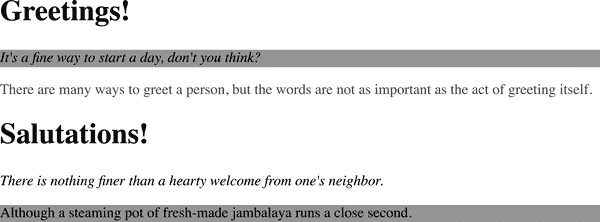

# 第四章：具体性、继承和级联

第二章和第三章展示了文档结构和 CSS 选择器如何允许你对元素应用各种样式。知道每个有效文档生成一个结构树，你可以创建基于祖先元素、属性、兄弟元素等进行选择的选择器。结构树是选择器正常工作的基础，也是 CSS 中继承同样重要的一个方面。

*继承* 是某些属性值从一个元素传递到后代元素的机制。在确定应将哪些值应用于元素时，用户代理必须考虑不仅继承，还要考虑声明的*具体性*以及声明本身的来源。这个考虑的过程就是所谓的*级联*。

我们将在本章探讨这三种机制——具体性、继承和级联——之间的相互关系。目前，后两者的区别可以总结如下：当我们编写 `h1 {color: red; color: blue;}` 时，`<h1>` 变为蓝色是因为级联的影响，而 `<h1>` 内的任何 `<span>` 也因为继承而变为蓝色。

无论事物看起来多么抽象，都要坚持下去！你的坚持将会得到回报。

# 具体性

你从第二章和第三章知道，可以通过多种方式选择元素。事实上，同一个元素通常可以被两个或更多规则选中，每个规则都有自己的选择器。让我们考虑以下三对规则。假设每一对将匹配同一个元素：

```
h1 {color: red;}
body h1 {color: green;}

h2.grape {color: purple;}
h2 {color: silver;}

html > body table tr[id="totals"] td ul > li {color: maroon;}
li#answer {color: navy;}
```

每一对规则中只有一条可以应用或“胜出”，因为匹配的元素一次只能是一种颜色。我们怎么知道哪一个会胜出呢？

答案在每个选择器的*具体性*中找到。对于每个规则，用户代理（即 web 浏览器）评估选择器的具体性，并将具体性附加到具有优先级的级联层中的每个声明中。当一个元素有两个或更多冲突的属性声明时，具有最高具体性的声明将获胜。

###### 注意

冲突解决的整个过程不仅仅是一个段落可以涵盖的那么简单。目前，只需记住，选择器的具体性仅与共享相同来源和级联层的其他选择器进行比较。我们将在“级联”一节中详细讨论这些术语及更多内容。

选择器的具体性由选择器本身的组成部分决定。具体性值可以用三个部分表示，如下所示：`0,0,0`。选择器的实际具体性如下确定：

+   对于选择器中给定的每个 ID 属性值，添加 `1,0,0`。

+   对于选择器中给定的每个类属性值、属性选择或伪类，添加`0,1,0`。

+   对于选择器中给定的每个元素和伪元素，添加`0,0,1`。

+   组合符不对特异性做出任何贡献。

+   任何列在`:where()`伪类内部和通用选择器中的内容，添加`0,0,0`。（虽然它们不对特异性权重做出贡献，但与组合符不同，它们确实匹配元素。）

+   `:is()`，`:not()`或`:has()`伪类的特异性等于其选择器列表参数中最具体选择器的特异性。

例如，以下规则的选择器得出指定的特异性：

```
h1 {color: red;}                     /* specificity = 0,0,1 */
p em {color: purple;}                /* specificity = 0,0,2 */
.grape {color: purple;}              /* specificity = 0,1,0 */
*.bright {color: yellow;}            /* specificity = 0,1,0 */
p.bright em.dark {color: maroon;}    /* specificity = 0,2,2 */
#id216 {color: blue;}                /* specificity = 1,0,0 */
*:is(aside#warn, code) {color: red;} /* specificity = 1,0,1 */
div#sidebar *[href] {color: silver;} /* specificity = 1,1,1 */
```

如果此例中的`<em>`元素同时符合第二条和第五条规则，那么该元素将是栗色，因为第六条规则的特异性大于第二条规则。

特别注意倒数第二个选择器`*:is(aside#warn, code)`。`:is()`伪类是一组特异性等于选择器列表中最具体选择器的少数伪类之一。在这里，选择器列表为`aside#warn, code`。`aside#warn`复合选择器的特异性为`1,0,1`，`code`选择器的特异性为`0,0,1`。因此，整个`:is()`选择器的特异性设置为`aside#warn`选择器的特异性。

现在，让我们回到本节前面的规则对，并填写特异性：

```
h1 {color: red;}         /* 0,0,1 */
body h1 {color: green;}  /* 0,0,2 (winner)*/

h2.grape {color: purple;}  /* 0,1,1 (winner) */
h2 {color: silver;}        /* 0,0,1 */

html > body table tr[id="totals"] td ul > li {color: maroon;}  /* 0,1,7 */
li#answer {color: navy;}                                       /* 1,0,1
 (winner) */
```

我们在每一对中指示了胜出的规则；在每种情况下，这是因为特异性更高。注意它们的列出方式以及规则的顺序在这里并不重要。

在第二对中，选择器`h2.grape`胜出，因为它有一个额外的类：`0,1,1`击败了`0,0,1`。在第三对中，第二条规则胜出，因为`1,0,1`优于`0,1,7`。事实上，特异性值`0,1,0`将优于值`0,0,13`。

这是因为值是从左到右比较的。特异性为`1,0,0`的规则将优先于任何以`0`开头的特异性，无论后面的数字是什么。因此，`1,0,1`比`0,1,7`更优，因为第一个值的第一个位置上的`1`胜过第二个值的第一个位置上的`0`。

## 声明和特异性

一旦确定了选择器的特异性，特异性值将被赋予其所有关联的声明。考虑这条规则：

```
h1 {color: silver; background: black;}
```

对于特异性目的，用户代理必须将规则视为未分组为单独的规则。因此，前面的例子将变成以下形式：

```
h1 {color: silver;}
h1 {background: black;}
```

两者的特异性均为`0,0,1`，每个声明都赋予了这个值。分组选择器也会发生同样的拆分过程。给定规则，

```
h1, h2.section {color: silver; background: black;}
```

用户代理将其视为以下形式：

```
h1 {color: silver;}             /* 0,0,1 */
h1 {background: black;}         /* 0,0,1 */
h2.section {color: silver;}     /* 0,1,1 */
h2.section {background: black;} /* 0,1,1 */
```

当多个规则匹配同一元素且一些声明发生冲突时，这一点变得很重要。例如，考虑以下规则：

```
h1 + p {color: black; font-style: italic;}              /* 0,0,2 */
p {color: gray; background: white; font-style: normal;} /* 0,0,1 */
*.callout {color: black; background: silver;}           /* 0,1,0 */
```

当应用于以下标记时，内容将如 图 4-1 所示呈现：

```
<h1>Greetings!</h1>
<p class="callout">
It's a fine way to start a day, don't you think?
</p>
<p>
There are many ways to greet a person, but the words are not as important
as the act of greeting itself.
</p>
<h1>Salutations!</h1>
<p>
There is nothing finer than a hearty welcome from one's neighbor.
</p>
<p class="callout">
Although a steaming pot of fresh-made jambalaya runs a close second.
</p>
```



###### 图 4-1\. 不同规则如何影响文档

在每种情况下，用户代理确定哪些规则匹配给定元素，计算所有相关声明及其特异性，确定哪些规则胜出，然后将胜出的规则应用于元素以获取样式化结果。这些操作必须对每个元素、选择器和声明都执行。幸运的是，用户代理会自动且几乎即时地完成所有这些操作。这种行为是级联的重要组成部分，我们稍后在本章中将讨论。

## 解决多个匹配项

当一个元素被一组选择器中的多个选择器匹配时，将使用最特异的选择器。考虑以下 CSS：

```
li,            /* 0,0,1 */
.quirky,       /* 0,1,0 */
#friendly,     /* 1,0,0 */
li.happy.happy.happy#friendly { /* 1,3,1 */
   color: blue;
}
```

这里我们有一个带有组合选择器的规则，每个单独的选择器具有非常不同的特异性。现在假设我们在 HTML 中找到了这个：

```
<li class="happy quirky" id="friendly">This will be blue.</li>
```

组合选择器中的每一个选择器都应用于列表项！哪一个用于特异性目的？最特异的那个。因此，在这个例子中，蓝色将以`1,3,1`的特异性应用。

你可能已经注意到，在某个选择器中我们重复了 `happy` 类名三次。这是一种技巧，可以用于类、属性、伪类，甚至是 ID 选择器，以增加特异性。使用时需小心，因为人为提高特异性可能会在将来造成问题：你可能希望用另一条规则覆盖该规则，而那条规则需要更多链式类名。

## 选择器特异性归零

通用选择器不会影响特异性。它具有`0,0,0`的特异性，这与没有特异性（正如我们将在 “继承” 中讨论的）不同。因此，根据以下两条规则，从 `<div>` 继承的段落将是黑色，但所有其他元素将是灰色：

```
div p {color: black;} /* 0,0,2 */
* {color: gray;}      /* 0,0,0 */
```

这意味着包含通用选择器的选择器的特异性不会因通用选择器的存在而改变。以下两个选择器具有完全相同的特异性：

```
div p         /* 0,0,2 */
body * strong /* 0,0,2 */
```

对于 `:where()` 伪类来说也是如此，无论其选择器列表中可能包含哪些选择器。因此，`:where(aside#warn, code)` 的特异性为`0,0,0`。

组合符号，包括 `~`、`>`、`+` 和空格字符，在选择器的特异性中没有任何影响，甚至零特异性。因此，它们对选择器的总体特异性没有影响。

## ID 和属性选择器的特异性

需要注意 ID 选择器与针对 `id` 属性的属性选择器之间特异性的差异。回到示例代码中的第三对规则，我们发现以下内容：

```
html > body table tr[id="totals"] td ul > li {color: maroon;} /* 0,1,7 */
li#answer {color: navy;}                                      /* 1,0,1 (wins) */
```

第二条规则中的 ID 选择器（`#answer`）对选择器的整体特异性贡献了 `1,0,0`。然而，在第一条规则中，属性选择器（`[id="totals"]`）对选择器的整体特异性贡献了 `0,1,0`。因此，根据以下规则，具有`id`为`meadow`的元素将变为绿色：

```
#meadow {color: green;}      /* 1,0,0 */
*[id="meadow"] {color: red;} /* 0,1,0 */
```

## 重要性

有时声明如此重要，以至于它超越所有其他考虑因素。CSS 称这些为*重要声明*（希望理由显而易见），并允许您通过在声明的终止分号之前插入`!important`标志来标记它们：

```
p.dark {color: #333 !important; background: white;}
```

在这里，`#333`的颜色值被标记为`!important`标志，而`white`的背景值则没有。如果您希望将两个声明都标记为重要，则每个声明都需要自己的`!important`标志：

```
p.dark {color: #333 !important; background: white !important;}
```

你必须正确放置`!important`标志，否则声明可能会失效：`!important` *总是* 在声明的末尾，分号之前。在涉及允许包含多个关键字值的属性（如`font`）时，这一放置尤为关键：

```
p.light {color: yellow; font: smaller Times, serif !important;}
```

如果`!important`被放置在`font`声明的任何其他地方，整个声明很可能会失效，其样式不会应用。

###### 注意

我们意识到，对于那些来自编程背景的人来说，这个令牌的语法本能地被翻译为“不重要”。无论出于何种原因，感叹号（`!`）被选择作为重要标志的分隔符，在 CSS 中*并不*意味着“不”，无论其他语言给予它这个确切的含义。这种关联是不幸的，但我们却不得不接受它。

被标记为`!important`的声明没有特殊的优先级值，而是被单独考虑，与不重要的声明分开。实际上，所有`!important`声明被分组在一起，并且在该组内解决特异性冲突。类似地，所有不重要的声明被视为一个组，任何组内的冲突都如前所述。因此，在任何重要和不重要的声明冲突的情况下，重要声明总是胜出（除非用户代理或用户已将相同的属性声明为重要，这将在本章后面看到）。

图 4-2 展示了以下规则和标记片段的结果：

```
h1 {font-style: italic; color: gray !important;}
.title {color: black; background: silver;}
* {background: black !important;}
```

```
<h1 class="title">NightWing</h1>
```


###### 图 4-2\. 重要规则总是胜出

###### 警告

在你的 CSS 中通常不建议使用`!important`，而且很少需要。如果你发现自己使用了`!important`，请停下来寻找其他方法来达到同样的效果而不使用`!important`。级联层是其中之一的可能性；请参阅“按级联层排序”以了解更多详情。

# 继承

理解样式应用于元素的另一个关键概念是*继承*。继承是一种机制，使某些样式不仅应用于指定的元素，还应用于其后代。例如，如果将颜色应用于`<h1>`元素，则该颜色将应用于`<h1>`内所有文本，甚至是该`<h1>`子元素内的文本：

```
h1 {color: gray;}
```

```
<h1>Meerkat <em>Central</em></h1>
```

普通`<h1>`文本和`<em>`文本都被着灰色，因为`<em>`元素继承了`<h1>`的`color`值。如果属性值不能被后代元素继承，那么`<em>`文本将是黑色，而不是灰色，我们将不得不单独为这些元素着色。

考虑一个无序列表。假设我们为`<ul>`元素应用了`color: gray;`样式：

```
ul {color: gray;}
```

我们期望应用于`<ul>`的样式也将应用于其列表项，以及任何这些列表项的内容，包括标记（即每个列表项旁边的符号）。由于继承的存在，这正是发生的，正如图 4-3 所示。


###### 图 4-3\. 样式的继承

通过查看文档的树形图，更容易理解继承的工作方式。图 4-4 展示了与图 4-3 中显示的非常简单文档类似的文档的树形图。


###### 图 4-4\. 简单的树形图

当将声明`color: gray;`应用于`<ul>`元素时，该元素采用该声明。然后该值向下传播到后代元素，并一直持续到没有更多后代可以继承该值为止。值*绝对不会*向上传播；元素永远不会将值传递给其祖先。

###### 注意

在 HTML 中，上行传播规则有一个显著的例外：应用于`<body>`元素的背景样式可以传递给`<html>`元素，后者是文档的根元素，因此定义了其画布。这仅在`<body>`元素具有定义的背景且`<html>`元素没有时发生。少数其他属性也具有此从 body 到 root 的行为，例如`overflow`，但仅适用于`<body>`元素。其他元素不会从后代继承属性。

继承是 CSS 中非常基本的内容之一，几乎从不考虑，除非必须处理。然而，仍应牢记几点。

首先，请注意，许多属性不会被继承——通常是为了避免不良结果。例如，`border`属性（用于为元素设置边框）不会继承。快速查看图 4-5 就可以看出原因。如果边框被继承，文档会变得更加混乱——除非作者额外努力关闭继承的边框。


###### 图 4-5\. 为什么边框不会被继承

正如事实上所发生的那样，大多数框模型属性——包括边距、填充、背景和边框——由于同样的原因而不会被继承。毕竟，你可能不希望段落中的所有链接都从其父元素继承一个 30 像素的左边距！

其次，继承的值根本没有任何特异性，甚至是零特异性。这似乎是一种学术上的区别，直到你通过缺乏继承特异性的后果来工作，考虑下列规则和标记片段，并将其与图 4-6 中显示的结果进行比较：

```
* {color: gray;}
h1#page-title {color: black;}
```

```
<h1 id="page-title">Meerkat <em>Central</em></h1>
<p>
Welcome to the best place on the web for meerkat information!
</p>
```


###### 图 4-6\. 零特异性击败无特异性

由于通用选择器适用于所有元素并且具有零特异性，其颜色声明的`gray`值胜过完全没有特异性的继承值`black`。（现在你可能理解为什么我们将`:where()`和通用选择器列为具有`0,0,0`特异性了：它们不增加权重，但确实匹配元素。）因此，`<em>`元素呈现为灰色而不是黑色。

这个例子生动地说明了无差别使用通用选择器可能会遇到的潜在问题之一。因为它可以匹配*任何*元素或伪元素，通用选择器通常会导致继承的短路效应。虽然可以绕过这个问题，但通常更明智的做法是避免使用单独的通用选择器以避免这个问题。

对于继承值的完全缺乏特异性并非一个微不足道的观点。例如，假设样式表已被编写，以便工具栏中的所有文本都是白色的黑色背景：

```
#toolbar {color: white; background: black;}
```

只要具有`toolbar` id 的元素内不包含超链接（`a`元素）的纯文本，这将起作用。但是，如果此元素内的文本全部都是超链接，那么用户代理样式表中的超链接样式将接管。在 Web 浏览器中，这意味着它们可能会被着蓝色，因为浏览器的内部样式表可能包含类似以下条目：

```
a:link {color: blue;}
```

要解决这个问题，你必须声明类似以下内容：

```
#toolbar {color: white; background: black;}
#toolbar a:any-link {color: white;}
```

通过直接针对工具栏内的`a`元素制定规则，你将获得图 4-7 中显示的结果。


###### 图 4-7\. 直接为相关元素分配样式

另一种获得相同结果的方法是使用值`inherit`，在下一章节中进行讨论。我们可以像这样修改前面的例子：

```
#toolbar {color: white; background: black;}
#toolbar a:link {color: inherit;}
```

这也导致了图 4-7 中显示的结果，因为`color`的值由于具有特异性的分配规则而明确继承。

# 层叠

在本章中，我们回避了一个相当重要的问题：当两个具有相等特异性的规则应用于同一元素时会发生什么？浏览器如何解决冲突？例如，考虑以下规则：

```
h1 {color: red;}
h1 {color: blue;}
```

哪个胜出？两者的特异性都是`0,0,1`，因此它们具有相等的权重，应该都适用。但事实并非如此，因为元素不能既是红色又是蓝色。那么将是哪一个呢？

最后，*Cascading Style Sheets*的名字开始变得清晰：CSS 是基于一种将样式*级联*在一起的方法，通过结合继承和特异性以及一些规则实现。CSS 的级联规则如下：

1.  查找包含与给定元素匹配的选择器的所有规则。

1.  将应用于给定元素的所有声明按*显式权重*排序。

1.  将应用于给定元素的所有声明按*来源*排序。有三种基本来源：作者、读者和用户代理。在正常情况下，作者的样式（即您作为页面作者的样式）优先于读者的样式，作者和读者的样式都会覆盖用户代理的默认样式。但对于标记为`!important`的规则，用户代理样式优先于作者样式，而两者都优先于读者样式。

1.  将应用于给定元素的所有声明按*封装上下文*排序。例如，如果通过影子 DOM 分配样式，则对于该影子 DOM 中的所有元素都有封装上下文，不适用于影子 DOM 外的元素。这允许封装样式覆盖从影子 DOM 外继承的样式。

1.  将所有声明按是否*元素附加*排序。通过`style`属性分配的样式是元素附加的。通过样式表分配的样式，无论是外部的还是嵌入的，都不是。

1.  将所有声明按*级联层*排序。对于普通权重的样式，级联层在 CSS 中首次出现的越晚，优先级越高。没有层的样式被视为“默认”最终伪层的一部分，其优先级高于显式创建层中的样式。对于重要权重的样式，级联层在 CSS 中出现得越*早*，优先级就越高，而显式创建层中的所有重要权重样式都优先于默认层中的样式，无论是否重要。级联层可以出现在任何来源中。

1.  将应用于给定元素的所有声明按*特异性*排序。具有较高特异性的元素比具有较低特异性的元素具有更高的权重。

1.  将应用于给定元素的所有声明按*出现顺序*排序。声明在样式表或文档中出现得越晚，其权重就越高。被导入样式表中的声明被认为出现在导入它们的样式表中的所有声明之前。

要清楚这一切是如何运作的，让我们考虑一些例子，这些例子说明了一些级联规则。

## 按重要性和来源排序

如果两条规则适用于一个元素，并且其中一条标记为`!important`，则重要规则获胜：

```
p {color: gray !important;}
```

```
<p style="color: black;">Well, <em>hello</em> there!</p>
```

即使段落的`style`属性中分配了颜色，`!important`规则仍然占优势，段落会是灰色的。这是因为`!important`的排序比元素附加样式（`style=""`）的排序具有更高的优先级。灰色也会被`<em>`元素继承。

请注意，如果在此情况下将`!important`添加到内联样式中，*它*将获胜。因此，根据以下情况，段落（及其后代元素）将是黑色的：

```
p {color: gray !important;}
```

```
<p style="color: black !important;">Well, <em>hello</em> there!</p>
```

如果重要性相同，则考虑规则的来源。如果元素同时匹配作者样式表和读者样式表中的普通样式，则使用作者样式。例如，假设以下样式来自指定的来源：

```
p em {color: black;}    /* author's stylesheet */

p em {color: yellow;}   /* reader's stylesheet */
```

在这种情况下，段落中的强调文本将是黑色的，而不是黄色的，因为作者样式胜过读者样式。然而，如果两条规则都标记为`!important`，情况将发生变化：

```
p em {color: black !important;}    /* author's stylesheet */

p em {color: yellow !important;}   /* reader's stylesheet */
```

现在段落中的强调文本将是黄色的，而不是黑色的。

正如所述，用户代理的默认样式——通常受用户偏好影响——也被考虑在内。默认样式声明是所有声明中最不具影响力的。因此，如果作者定义了一个适用于锚点的规则（例如，声明它们为`white`），那么此规则将覆盖用户代理的默认值。

总结一下，CSS 在声明优先级方面有八个基本级别。按照优先级从高到低的顺序，它们如下：

1.  过渡声明（参见第十八章）

1.  用户代理重要声明

1.  读者重要声明

1.  作者重要声明

1.  动画声明（参见第十九章）

1.  作者普通声明

1.  读者普通声明

1.  用户代理声明

因此，过渡样式将覆盖所有其他规则，无论这些规则是否标记为`!important`或规则的来源如何。

## 按元素附加排序

样式可以通过使用诸如`style`这样的标记属性附加到元素。这些被称为*元素附加*样式，它们仅被来源和权重的考虑所超越。

要理解这一点，请考虑以下规则和标记片段：

```
h1 {color: red;}
```

```
<h1 style="color: green;">The Meadow Party</h1>
```

给定规则应用于`<h1>`元素，你可能仍然期望`<h1>`文本是绿色的。这是因为每个内联声明都是元素附加的，因此比不是元素附加的样式（如`color: red`规则）权重更高。

这意味着即使元素具有与规则匹配的`id`属性，也会遵守内联样式声明。让我们修改前面的示例以包括一个`id`：

```
h1#meadow {color: red;}
```

```
<h1 id="meadow" style="color: green;">The Meadow Party</h1>
```

由于内联声明的权重，`<h1>`元素的文本仍将是绿色的。

只需记住，内联样式通常是不良实践，如果可能的话尽量不要使用它们。

## 按级联层排序

*级联层*允许作者将样式分组，以便它们在级联中共享一个优先级别。这听起来有点像`!important`；在某些方面它们是相似的，但在其他方面则截然不同。这比描述要容易演示。创建级联层的能力意味着作者可以平衡各种需求，例如组件库的需求与网页或 Web 应用的特定部分的需求。

###### 注

级联层是在 2021 年底引入到 CSS 中的，因此只有从那时起发布的浏览器才支持它们。

如果冲突声明适用于元素，并且所有声明具有相同的显式权重和来源，并且没有元素附加，那么它们将按级联层排序。层的优先顺序由首次声明或使用层的顺序设置，后面声明的层对于普通样式具有比前面声明的层更高的优先级。考虑以下示例：

```
@layer site {
     h1 {color: red;}
}
@layer page {
     h1 {color: blue;}
}
```

这些`<h1>`元素将会被着蓝色色。这是因为在 CSS 中，`page`层在`site`层之后，因此具有更高的优先级。

任何不属于命名级联层的样式都会分配给隐式的“默认”层，这一层对于不重要的规则具有比任何命名层更高的优先级。假设我们如下修改之前的示例：

```
h1 {color: maroon;}
@layer site {
     h1 {color: red;}
}
@layer page {
     h1 {color: blue;}
}
```

`<h1>`元素现在将是栗色的，因为隐式“默认”层（`h1 {color: maroon;}`所属的层）比任何命名层具有更高的优先级。

您还可以为命名级联层定义特定的优先顺序。考虑以下 CSS：

```
@layer site, page;

@layer page {
   h1 {color: blue;}
}

@layer site {
   h1 {color: red;}
}
```

在这里，第一行定义了层的优先顺序：对于像示例中显示的普通权重规则，`page`层将比`site`层具有更高的优先级。因此，在这种情况下，`<h1>`元素将是蓝色的，因为在排序层时，`page`比`site`具有更高的优先级。对于标记为重要的规则，优先顺序则相反。因此，如果两个规则都标记为`!important`，优先级将翻转，`<h1>`元素将是红色的。

让我们再详细讨论一下级联层的工作原理，特别是因为它们对 CSS 来说是如此新的。假设您想定义三个层：一个用于基本站点样式，一个用于单个页面样式，以及一个用于从外部样式表导入的组件库的样式。CSS 可能如下所示：

```
@layer site, page;
@import url(/assets/css/components.css) layer(components);
```

这种排序方式将会使普通权重的`components`样式覆盖`page`和`site`的普通权重样式，而普通权重的`page`样式仅会覆盖`site`的普通权重样式。相反，重要的`site`样式将会覆盖所有`page`和`components`样式，不论它们是重要的还是普通权重的，而重要的`page`样式将会覆盖所有`components`样式。

这里有一个小例子，展示了如何管理层：

```
@layer site, component, page;
@import url(/c/lib/core.css) layer(component);
@import url(/c/lib/widgets.css) layer(component);
@import url(/c/site.css) layer(site);

@layer page {
   h1 {color: maroon;}
   p {margin-top: 0;}
}

@layer site {
   body {font-size: 1.1rem;}
   h1 {color: orange;}
   p {margin-top: 0.5em;}
}

p {margin-top: 1em;}
```

这个示例包含三个导入的样式表，其中一个分配给了`site`层，另外两个在`component`层。然后一些规则分配给了`page`层，并且有一些规则放在了`site`层。`@layer site {}`块中的规则将与`/c/site.css`中的规则合并成一个单独的`site`层。

在此之后，有一个层外的显式级联层之外的规则，这意味着它是隐式“默认”层的一部分。默认层中的规则将覆盖任何其他层的样式。因此，根据所示的代码，段落将具有`1em`的顶部边距。

但在此之前，一个指令设置了命名层的优先顺序：`page`优先于`component`和`site`，`component`优先于`site`。以下是这些各种规则在级联方面的分组，带有描述它们在排序中的位置的注释：

```
/* 'site' layer is the lowest weighted */
@import url(/c/site.css) layer(site);
@layer site {
   body {font-size: 1.1rem;}
   h1 {color: orange;}
   p {margin-top: 0.5em;}
}

/* 'component' layer is the next-lowest weighted */
@import url(/c/lib/core.css) layer(component);
@import url(/c/lib/widgets.css) layer(component);

/* 'page' layer is the next-highest weighted */
@layer page {
   h1 {color: maroon;}
   p {margin-top: 0;}
}

/* the implicit layer is the highest weighted */
p {margin-top: 1em;}
```

正如您所看到的，层在层次排序中越晚出现，级联排序算法就会给予它们越多的权重。

清楚地说，级联层不一定要有名称。命名只是在设置它们的顺序方面更加清晰，并且还使得可以向层添加样式。这里有一些使用未命名级联层的例子：

```
@import url(base.css) layer;

p {margin-top: 1em;}

@layer {
   h1 {color: maroon;}
   body p {margin-top: 0;}
}
```

在这种情况下，从*base.css*导入的规则分配给了一个未命名层。即使这个层实际上没有名称，我们可以把它看作是 CL1。然后，一个层外的规则将段落的顶部边距设置为`1em`。最后，一个未命名的层块有一些规则；我们可以把这个层看作是 CL2。

现在我们有了三个层中的规则：CL1、CL2 和隐式层。它们的考虑顺序是这样的，所以在任何冲突的普通规则的情况下，隐式默认层中的规则（在排序中排在最后）将胜出于其他两个层中的冲突规则，CL2 中的规则将胜出于 CL1 中的冲突规则。

至少对于普通权重规则是这样的。对于`!important`规则，优先级顺序是相反的，所以 CL1 中的规则将胜过其他两个层中的冲突重要规则，CL2 中的重要规则将胜过隐式层中的冲突重要规则。奇怪但是事实！

这种按顺序排序将在稍后再次出现，但首先让我们把特异性引入级联。

## 按特异性排序

如果冲突声明应用于一个元素，并且这些声明具有相同的显式权重、来源、元素附加（或缺乏附加）和级联层，则它们将按特异性排序。最特异的声明胜出，就像这样：

```
@layer page {
  p#bright#bright#bright {color: grey;}
}
p#bright {color: silver;}
p {color: black;}
```

```
<p id="bright">Well, hello there!</p>
```

根据这些规则，段落的文本将呈现为银色，如 图 4-8 所示。为什么？因为 `p#bright` 的特异性（`1,0,1`）优先于 `p` 的特异性（`0,0,1`），尽管后者在样式表中出现得更晚。即使具有最强选择器（`3,0,1`）的 `page` 层的样式也没有被比较。只有具有优先级的层中的声明才会竞争。


###### 图 4-8\. 更高的特异性胜过更低的特异性

记住，这个规则只适用于规则属于同一个级联层的情况。如果不是，特异性就不重要了：隐式层中的 `0,0,1` 选择器将优先于显式创建的级联层中的任何不重要规则，无论后者的特异性有多高。

## 按顺序排序

最后，如果两条规则在显式权重、来源、元素附加、级联层和特异性完全相同，那么在样式表中后出现的规则将获胜，类似于级联层按顺序排序，后续层次胜过早期层次。

让我们回到一个早期的例子，在文档样式表中找到以下两条规则：

```
body h1 {color: red;}
html h1 {color: blue;}
```

在这种情况下，文档中所有 `<h1>` 元素的 `color` 值将是 `blue`，而不是 `red`。这是因为这两条规则在显式权重和来源上是相等的，位于同一个级联层中，并且选择器具有相等的特异性，因此最后声明的规则是赢家。文档树中元素之间的距离有多近并不重要；即使 `<body>` 和 `<h1>` 比 `<html>` 和 `<h1>` 更接近，后者也是赢家。唯一重要的事情（当来源、级联层、层和特异性相同时）是规则在 CSS 中出现的顺序。

那么如果完全不同的样式表中的规则冲突会发生什么？例如，假设如下：

```
@import url(basic.css);
h1 {color: blue;}
```

如果 `h1 {color: red;}` 出现在 *basic.css* 中会发生什么？在这种情况下，由于没有级联层参与，整个 *basic.css* 的内容都被视为粘贴到 `@import` 发生的样式表的点。因此，文档的样式表中包含的任何规则都比 `@import` 中的规则晚出现。如果在显式权重和特异性上达到平局，文档的样式表包含的规则将获胜。考虑以下情况：

```
p em {color: purple;}  /* from imported stylesheet */

p em {color: gray;}    /* rule contained within the document */
```

在这种情况下，第二条规则胜过了导入规则，因为它是最后一个指定的规则，并且两者都在隐式级联层中。

排序排序是常推荐的链接样式排序背后的原因。推荐的顺序是你应该按照 `link`、`visited`、`focus`、`hover`、`active` 或者 LVFHA 的顺序编写你的链接样式，就像这样：

```
a:link {color: blue;}
a:visited {color: purple;}
a:focus {color: green;}
a:hover {color: red;}
a:active {color: orange;}
```

多亏了本章节中的信息，现在你知道所有这些选择器的特异性都是相同的：`0,1,1`。因为它们都有相同的显式权重、起源和特异性，匹配元素的最后一个将胜出。一个正在点击或通过键盘等方式激活的未访问链接会被四条规则匹配——`:link`、`:focus`、`:hover`和`:active`——因此这四条规则中的最后一条将胜出。根据 LVFHA 排序，`:active` 将胜出，这可能是作者想要的结果。

假设你决定忽略常见的顺序并按字母顺序排列你的链接样式。这将得到以下结果：

```
a:active {color: orange;}
a:focus {color: green;}
a:hover {color: red;}
a:link {color: blue;}
a:visited {color: purple;}
```

根据这种顺序，没有任何链接会显示`:hover`、`:focus`或`:active`样式，因为`:link`和`:visited`规则在其他三个规则之后。每个链接必须是已访问或未访问的，因此这些样式总是会覆盖其他样式。

让我们考虑作者可能想要使用的 LVFHA 顺序的变体。在这种排序中，只有未访问的链接会获得悬停样式；已访问的链接则不会。已访问和未访问的链接都会获得活动样式：

```
a:link {color: blue;}
a:hover {color: red;}
a:visited {color: purple;}
a:focus {color: green;}
a:active {color: orange;}
```

这种冲突只有在所有状态尝试设置相同属性时才会发生。如果每个状态的样式涉及不同的属性，则顺序并不重要。在以下情况中，链接样式可以以任何顺序给出，仍将按预期功能运行：

```
a:link {font-weight: bold;}
a:visited {font-style: italic;}
a:focus {color: green;}
a:hover {color: red;}
a:active {background: yellow;}
```

你可能也意识到`:link`和`:visited`样式的顺序并不重要。你可以以 LVFHA 或 VLFHA 的顺序排列这些样式，没有任何负面影响。

能够链式使用伪类消除了所有这些担忧。后两者的特异性大于前两者，因此可以任意顺序列出：

```
a:link {color: blue;}
a:visited {color: purple;}
a:link:hover {color: red;}
a:visited:hover {color: gray;}
```

因为每条规则适用于一组唯一的链接状态，它们不会冲突。因此，改变它们的顺序不会改变文档的样式。最后两条规则的特异性确实相同，但这并不重要。悬停的未访问链接不会匹配关于悬停已访问链接的规则，反之亦然。如果我们添加活动状态样式，顺序将再次变得重要。考虑下面这个例子：

```
a:link {color: blue;}
a:visited {color: purple;}
a:link:hover {color: red;}
a:visited:hover {color: gray;}
a:link:active {color: orange;}
a:visited:active {color: silver;}
```

如果将活动样式移至悬停样式之前，它们将被忽略。同样，这是因为特异性冲突。可以通过在链中添加更多伪类来避免冲突，如下所示：

```
a:link:hover:active {color: orange;}
a:visited:hover:active {color: silver;}
```

这确实提高了选择器的特异性——两者的特异性值均为 `0,3,1`——但它们并不冲突，因为实际的选择状态是互斥的。链接既不能是访问的悬停活动链接，*也*不能是未访问的悬停活动链接：只有两者之一的规则会匹配。

## 使用非 CSS 展示性提示进行工作

一个文档可能包含非 CSS 的表现提示，比如已弃用的`<font>`元素，或者仍然广泛使用的`height`、`width`和`hidden`属性。这些表现提示会被作者或读者的样式覆盖，但不会被用户代理的样式覆盖。在现代浏览器中，来自 CSS 外部的表现提示被视为属于用户代理的样式表。

# 总结

层叠样式表（Cascading Style Sheets，CSS）最基本的方面也许就是层叠本身——用于解决冲突声明并确定最终文档呈现的过程。这一过程的核心是选择器的特异性及其关联声明，以及继承机制。
