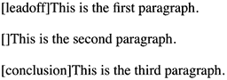

# 第五章：值和单位

在本章中，我们将讨论几乎可以使用 CSS 做任何事情的基础特性：影响颜色、距离和大小的单位，以及帮助定义这些值的单位。如果没有单位，您将无法声明图像周围应有 10 像素的空白，或者标题文本应该是某个特定大小。通过理解这里提出的概念，您将能够更快地学习和使用 CSS 的其余部分。

# 关键词、字符串和其他文本值

样式表中的一切都是文本，但某些值类型直接表示文本字符串，而不是数字或颜色。这类别中包括 URL 和非常有趣的是，图像。

## 关键词

当需要用某种词描述一个值时，CSS 使用*关键词*。一个常见的例子是关键词 `none`，它与 `0`（零）不同。因此，要从 HTML 文档中的链接中移除下划线，您应编写以下内容：

```
a[href] {text-decoration: none;}
```

同样地，如果您想要强制链接显示下划线，您将使用关键词 `underline` 而不是 `none`。

如果属性接受关键词，其关键词将仅在该属性的范围内定义。例如，`normal` 在 `letter-spacing` 中的定义与在 `font-style` 中定义的 `normal` 意义完全不同。

### 全局关键词

CSS 定义了五个*全局*关键词，这些关键词被规范中的每个属性所接受：`inherit`、`initial`、`unset`、`revert` 和 `revert-layer`。

#### inherit

关键词 `inherit` 使得元素上的属性值与其父元素上的属性值相同。换句话说，它强制执行继承，即使在通常不会操作继承的情况下也是如此。在许多情况下，您不需要指定继承，因为许多属性会自然继承。尽管如此，`inherit` 仍然很有用。

例如，考虑以下样式和标记：

```
#toolbar {background: blue; color: white;}

<div id="toolbar">
<a href="one.html">One</a> | <a href="two.html">Two</a> |
<a href="three.html">Three</a>
</div>
```

`<div>` 本身将具有蓝色背景和白色前景，但链接将根据浏览器的偏好设置进行样式设置。它们很可能最终成为蓝色文本在蓝色背景上，并在它们之间使用白色垂直条。

您可以编写一个规则，明确将工具栏中的链接设置为白色，但通过使用 `inherit` 可以使事情更加健壮。您只需将以下规则添加到样式表中：

```
#toolbar a {color: inherit;}
```

这将导致链接使用 `color` 的继承值，而不是用户代理的默认样式。

通常情况下，直接分配的样式会覆盖继承的样式，但 `inherit` 可以撤消这种行为。这可能并不总是一个好主意——例如，在这里链接可能会与周围的文本融为一体，成为可用性和可访问性的问题——但确实可以做到。

同样，即使通常不会发生，您也可以从父级中拉取属性值下来。例如，`border`是不会继承的（理所当然）。如果您希望`<span>`继承其父元素的边框，则只需`span {border: inherit;}`即可。不过更有可能的是，您只希望`<span>`的边框使用与其父元素相同的边框颜色。在这种情况下，`span {border-color: inherit;}`就能达到效果。

#### initial

关键字`initial`将属性的值设置为定义的初始值，这在某种程度上意味着它“重置”了该值。例如，`font-weight`的默认值为`normal`。因此，声明`font-weight: initial`与声明`font-weight: normal`是相同的。

在您考虑并非所有值都有显式定义的初始值之前，这可能看起来有点愚蠢。例如，`color`的初始值“取决于用户代理”。这不是您应该键入的奇怪关键字！这意味着`color`的默认值取决于浏览器中的偏好设置之类的东西。虽然几乎没有人将默认文本颜色设置从黑色更改为其他颜色，但某人可能将其设置为深灰色甚至是鲜艳的红色。通过声明`color: initial;`，您告诉浏览器将元素的颜色设置为用户的默认颜色。

另一个`initial`的好处是，您可以将属性设置回其初始值，而无需知道该初始值是什么。当您需要一次性重置大量属性时，通过 JavaScript 或 CSS，这尤其有用。

#### unset

关键字`unset`充当`inherit`和`initial`的通用替代。如果属性是继承的，则`unset`的效果与使用`inherit`相同。如果属性*不*是继承的，则`unset`的效果与使用`initial`相同。这使得`unset`在通过取消应用于属性的任何其他样式来重置属性时非常有用。

#### revert

关键字`revert`将属性的值设置为如果当前样式来源未进行任何更改，则该属性将具有的值。实际上，`revert`使您可以说：“此元素的所有属性值应如同作者样式不存在，但用户代理和用户样式存在。”

因此，给定以下基本示例，`p`元素将呈现为灰色文本，具有透明背景：

```
p {background: lime; color: gray;}
p {background: revert;}
```

这意味着任何值被继承的属性将与其父元素的值相同。当您希望去除元素上应用的大量全站样式，并且只想为该元素应用一组单独的样式时，`revert`关键字就非常有用。与其覆盖所有这些属性，您可以将它们恢复为默认值——您可以通过单个属性`all`来做到这一点，这是下一节的主题。

#### revert-layer

如果你正在使用级联层（参见“按级联层排序”）并希望“撤消”当前层可能应用的任何样式，`revert-layer`值可以帮助。这里的区别在于，`revert-layer`实际上意味着“这个元素的所有属性值应该就像作者在当前级联层中的样式不存在一样，但其他作者级联层（包括默认层）、用户代理和用户样式存在。”

因此，考虑到以下情况，包含单词`example`的`class`的段落将呈现为红色文本在黄色背景上：

```
@layer site, system;

p {color: red;}
@layer system {
	p {background: yellow; color: fuchsia;}
}
@layer site {
	p {background: lime; color: gray;}
	p.example {background: revert; color: revert;}
}
```

对于背景，浏览器查看前面级联层中的指定值，并选择权重最高的一个。只有一个层级（`system`）设置了背景颜色，因此使用它而不是`lime`。前景颜色也是如此，因为在默认层中分配了颜色，并且默认层会覆盖所有显式创建的层级，所以使用`red`而不是`gray`。

###### 注意

截至 2023 年末，只有 Firefox 支持`revert-layer`，但我们预计它在不久的将来将得到广泛支持。

## `all`属性

这些全局值可用于所有属性，但有一个特殊属性仅接受全局关键字：`all`。

`all`属性是所有属性的代表，*除了* `direction`、`unicode-bidi`和任何自定义属性（参见“自定义属性”）。因此，如果你在元素上声明`all: inherit`，就表示你希望所有属性（除了`direction`、`unicode-bidi`和自定义属性）从元素的父级继承其值。考虑以下情况：

```
section {color: white; background: black; font-weight: bold;}
#example {all: inherit;}
```

```
<section>
    <div id="example">This is a div.</div>
</section>
```

你可能会认为这会导致`<div>`元素从`<section>`元素继承`color`、`background`和`font-weight`的值。确实如此，但它还会*强制*继承 CSS 中*每一个其他属性的值*（除了两个例外）从`<section>`元素。

或许这正是你想要的，如果是这样，那太好了。但如果你只是想继承为`<section>`元素编写的属性值，CSS 应该更像这样：

```
section {color: white; background: black; font-weight: bold;}
#example {color: inherit; background: inherit; font-weight: inherit;}
```

在这些情况下，你真正想要的可能是`all: unset`，但你的样式表可能会有所不同。

## 字符串

*字符串值*是一个任意字符序列，用单引号或双引号括起来，在值定义中用<*`string`*>表示。这里有两个简单的例子：

```
"I like to play with strings."
'Strings are fun to play with.'
```

注意引号的平衡，也就是说，你总是以相同类型的引号开始和结束。如果搞错了，会导致各种解析问题，因为以一种引号开始并试图用另一种引号结束意味着字符串实际上不会被终止。你可能会意外地将后续规则合并到字符串中！

如果你想在字符串内部放置引号，那是可以的，只要它们不是用来封闭字符串的那种引号，或者使用反斜杠进行转义即可：

```
"I've always liked to play with strings."
'He said to me, "I like to play with strings."'
"It's been said that \"haste makes waste.\""
'There\'s never been a "string theory" that I\'ve liked.'
```

注意只有`'`和`"`这两种字符可以作为字符串的定界符，有时被称为*直引号*。这意味着你不能使用*卷曲*或*智能*引号来开始或结束字符串值。你可以在字符串值内部使用它们，就像这个代码示例中一样，并且它们不需要被转义：

```
"It’s been said that “haste makes waste.”"
'There’s never been a “string theory” that I’ve liked.'
```

这要求你为文档使用 Unicode 编码（使用[Unicode 标准](http://www.unicode.org/standard/standard.html)），但无论如何你都应该这样做。

如果你有某种原因要在字符串值中包含换行符，可以通过转义换行符本身来实现。CSS 会将其删除，使事情看起来好像从未存在过。因此，从 CSS 的角度看，以下两个字符串值是相同的：

```
"This is the right place \
for a newline."
"This is the right place for a newline."
```

另一方面，如果确实需要一个包含换行符的字符串值，请在所需的换行位置使用 Unicode 参考`\A`：

```
"This is a better place \Afor a newline."
```

## 标识符

一词，区分大小写的字符串不应被引用，称为*标识符*，在 CSS 语法中表示为<*`ident`*>或<*`custom-ident`*>，具体取决于规范和上下文。标识符用于动画名称、网格线名称和计数器名称等。此外，<*`dashed-ident`*> 用于自定义属性。创建自定义标识符的规则包括不以数字、双连字符或单连字符后跟数字开头。除此之外，几乎任何字符都是有效的，包括表情符号，但如果使用特定字符，如空格或反斜杠，则需要用反斜杠进行转义。

标识符本身是单词并且区分大小写；因此，对于 CSS 而言，`myID`和`MyID`是完全不同且不相关的。如果属性接受标识符和一个或多个关键字，作者应该注意绝不定义与有效关键字相同的标识符，包括全局关键字`initial`、`inherit`、`unset`和`revert`。使用`none`也是一个非常糟糕的主意。

## URLs

如果你写过网页，几乎肯定熟悉统一资源定位符（URLs）。每当你需要引用一个时，例如在导入外部样式表时使用的`@import`语句，这里是一般的格式：

```
url(protocol://*server*/*pathname*/*filename*)
url("*<string>*")   /* can use single or double quotes, or no quotes. */
```

这个例子定义了一个*绝对 URL*。无论它在何处（或者更确切地说，在哪个页面）找到，这个 URL 都有效，因为它在 Web 空间中定义了一个绝对位置。假设你有一个名为*web.waffles.org*的服务器。在该服务器上有一个名为*pix*的目录，在此目录中有一张名为*waffle22.gif*的图像。在这种情况下，该图像的绝对 URL 如下：

```
https://web.waffles.org/pix/waffle22.gif
```

无论写在何处，这个 URL 都是有效的，无论包含它的页面位于服务器*web.waffles.org*还是*web.pancakes.com*。

另一种 URL 类型是*相对 URL*，因为它指定的位置是相对于使用它的文档的位置。如果你引用相对位置，比如与网页相同目录中的文件，一般格式如下：

```
url(*pathname*)
url("*<string>*")   /* can use single or double quotes. */
```

这仅在图片位于包含 URL 的页面相同服务器上时有效。假设你有一个网页位于*http://web.waffles.org/syrup.html*，你希望图片*waffle22.gif*显示在此页面上。在这种情况下，URL 将是以下内容：

```
pix/waffle22.gif
```

此路径有效，因为 Web 浏览器知道应该从找到 Web 文档的地方开始，然后添加相对 URL。在这种情况下，路径名*pix/waffle22.gif*加到服务器名*http://web.waffles.org*等于*http://web.waffles.org/pix/waffle22.gif*。你几乎总是可以在相对 URL 的位置使用绝对 URL；使用哪种都可以，只要它定义了一个有效的位置。

在 CSS 中，相对 URL 是相对于样式表本身而言，而不是使用样式表的 HTML 文档。例如，你可能有一个导入另一个样式表的外部样式表。如果你使用相对 URL 导入第二个样式表，它必须相对于第一个样式表。实际上，如果在任何导入的样式表中有 URL，它都需要相对于导入的样式表。

举个例子，考虑一个 HTML 文档位于*http://web.waffles.org/toppings/tips.html*，它有一个指向样式表*http://web.waffles.org/styles/basic.css*的`<link>`：

```
<link rel="stylesheet" type="text/css"
    href="http://web.waffles.org/styles/basic.css">
```

在文件*basic.css*中有一个`@import`语句，指向另一个样式表：

```
@import url(special/toppings.css);
```

这个`@import`将导致浏览器查找样式表*http://web.waffles.org/styles/special/toppings.css*，而不是*http://web.waffles.org/toppings/special/toppings.css*。如果你有一个位于后者位置的样式表，在*basic.css*中的`@import`应该以下面两种方式之一书写：

```
@import url(http://web.waffles.org/toppings/special/toppings.css);

@import url("../special/toppings.css");
```

注意，`url`和左括号之间不能有空格：

```
body {background: url(http://www.pix.web/picture1.jpg);}   /* correct */
body {background: url  (images/picture2.jpg);}          /* INCORRECT */
```

如果存在空格，则整个声明将无效，因此被忽略。

###### 注意

截至 2022 年末，CSS 工作组计划引入一个名为`src()`的新函数，它将仅接受字符串而不接受未引用的 URL。这旨在允许在`src()`内使用自定义属性，这将允许作者基于自定义属性的值定义应加载哪个文件。

## 图像

*image value*是对图像的引用，正如你可能猜到的那样。其语法表示是<*`image`*>。

在支持的最基本级别，也就是说，地球上每个 CSS 引擎都能理解的级别上，一个<*`image`*>值是一个<*`url`*>值。在更现代的用户代理中，<*`image`*>代表以下之一：

<*`url`*>

外部资源的 URL 标识符，例如图片的 URL。

<*`gradient`*>

可以是线性、径向或锥形渐变图像，单独或重复模式。渐变相当复杂，详细介绍见第九章。

<*`image-set`*>

一组图像，根据嵌入到值中的一组条件选择，该值定义为`image-set()`，但更广泛地识别为带有`-webkit-`前缀。例如，`-webkit-image-set()`可以指定在桌面布局中使用较大的图像，而在移动设计中使用较小的图像（无论是像素大小还是文件大小）。该值旨在至少近似于`<picture>`元素的`srcset`属性的行为。截至 2023 年初，`-webkit-image-set`基本上被所有浏览器支持，除了 Safari 之外的大多数浏览器也接受`image-set()`（无前缀）。

<*`cross-fade`*>

用于将两个（或更多）图像混合在一起，并给每个图像指定特定的透明度。用例包括将两个图像混合在一起，将图像与渐变混合等。截至 2023 年初，这在基于 Blink 和 WebKit 的浏览器中作为`-webkit-cross-fade()`支持，但在 Firefox 系列中无论是否带有前缀都不支持。

还有`image()`和`element()`函数，但截至 2023 年初，除了 Firefox 支持的带有供应商前缀的`element()`版本外，任何浏览器都不支持。最后，`paint()`指的是由 CSS Houdini 的 PaintWorklet 绘制的图像。截至 2023 年初，这只在像 Chrome 这样的基于 Blink 的浏览器中以基本形式支持。

# 数字和百分比

数字和百分比是许多其他值类型的基础。例如，可以使用`em`单位（本章后面讨论）前面带有数字来定义字体大小。但这里的数字是什么类型？理解这里的数字类型将帮助您更好地掌握定义其他值类型的方法。

## 整数

*整数值*就是这么简单：一个或多个数字，可选择地由`+`或`-`（正或负）符号前缀表示正数或负数值。就是这样。整数值在值语法中表示为<*`integer`*>。例如，`712`、`13`、`−42`和`1066`。

一些属性定义了可接受整数值范围。默认情况下，超出定义范围的整数值被视为无效，并导致整个声明被忽略。但是，某些属性定义了行为，使超出接受范围的值被设置为最接近声明值的接受值，称为*夹紧*。

在没有限制范围的情况下（例如属性`z-index`），用户代理必须支持值范围达到±1,073,741,824（±2³⁰）。

## 数字

*数字值* 可以是一个<*`integer`*>或者实数，即整数后跟一个点，然后是一些后续整数。此外，它可以由 `+` 或 `-` 前缀以指示正数或负数值。数字值在值语法中表示为<*`number`*>。例如，`5`，`2.7183`，`−3.1416`，`6.2832` 和 `1.0218e29`（科学记数法）。

*数字值* 可以是<*`integer`*>，但它们是不同的值类型，因为某些属性仅接受整数（例如 `z-index`），而其他属性接受任何实数（例如 `flex-grow`）。

与整数值一样，数字值可能受属性定义的限制；例如，`opacity` 限制其值为范围在 `0` 到 `1` 之间的任何有效<*`number`*>。一些属性定义了行为，使得超出接受范围的值被夹紧到最接近声明值的可接受值；例如，`opacity: 1.7` 将被夹紧为 `opacity: 1`。对于不这样做的属性，超出定义范围的数字值被视为无效，并导致整个声明被忽略。

## 百分比

*百分比值* 是一个<*`number`*> 后跟百分号（`%`），在值语法中表示为<*`percentage`*>。例如，`50%` 和 `33.333%`。百分比值始终相对于另一个值，可以是任何值——同一元素的另一个属性的值，从父元素继承的值，或祖先元素的值。接受百分比值的属性将定义允许的百分比值范围以及相对计算百分比的方式。

## 分数

*分数值*（或 *flexible ratio*）是一个<*`number`*> 后跟 `fr` 单位标签。因此，一个分数单位是 `1fr`。`fr` 单位表示网格容器中剩余空间（如果有）的一部分。

与所有 CSS 尺寸一样，单位和数字之间没有空格。分数值不是长度（与某些<*`percentage`*>值不兼容），因此不能与 `calc()` 函数中的其他单位类型一起使用。

###### 注意

分数值主要用于网格布局（参见 第十二章），但计划将其用于更多上下文，例如计划中（截至 2023 年初）的 `stripes()` 函数。

# 距离

许多 CSS 属性，如边距，依赖于长度测量来正确显示各种页面元素。因此，毫不奇怪，CSS 提供了多种测量长度的方式。

所有长度单位都可以表示为正数或负数后跟标签，尽管某些属性仅接受正数。您还可以使用实数，即带有小数部分的数字，例如 10.5 或 4.561。

All length units are followed by a short abbreviation that represents the actual unit of length being specified, such as `in` (inches) or `pt` (points). The only exception to this rule is a length of `0` (zero), which need not be followed by a unit when describing lengths.

这些长度单位分为两种类型：*绝对长度单位* 和 *相对长度单位*。

## 绝对长度单位

We’ll start with absolute units because they’re easiest to understand. The seven types of absolute units are as follows:

*英寸* (`in`)

正如您所预期的那样，这个表示法指的是您在美国标尺上找到的英寸。尽管几乎整个世界使用公制系统，但这个单位在规范中的存在是对美国在互联网上普遍存在的一个有趣见解——但现在我们不要深入虚拟社会政治理论。

*厘米* (`cm`)

指的是您在全世界标尺上找到的厘米。一英寸等于 2.54 厘米，一厘米等于 0.394 英寸。

*毫米* (`mm`)

对于那些对公制系统不熟悉的美国人来说，1 厘米等于 10 毫米，因此 1 英寸等于 25.4 毫米，而 1 毫米等于 0.0394 英寸。

*四分之一毫米* (`Q`)

一厘米中有 40Q 单位；因此，将一个元素设置为 1/10 厘米宽度（也就是 1 毫米宽度）将意味着一个值为`4Q`。

*点* (`pt`)

Points are standard typographical measurements that have been used by printers and typesetters for decades and by word processing programs for many years. Traditionally, there are 72 points to an inch. Therefore the capital letters of text set to 12 points should be one-sixth of an inch tall. For example, `p {font-size`: `18pt;}` is equivalent to `p {font-size`: `0.25in;}`.

*派卡* (`pc`)

一派卡（pica）是另一个排版术语，等于 12 点，这意味着一英寸中有 6 派卡。正如刚才展示的那样，将文本设置为 1 派卡的大写字母应该是英寸高的六分之一。例如，`p {font-size`: `1.5pc;}` 将文本设置为与定义点示例中的示例声明相同的大小。

*像素* (`px`)

A pixel is a small box onscreen, but CSS defines pixels more abstractly. In CSS terms, a pixel is defined to be the size required to yield 96 pixels per inch. Many user agents ignore this definition in favor of simply addressing the pixels on the screen. Scaling factors are brought into play when page zooming or printing, where an element `100px` wide can be rendered more than 100 device dots wide.

这些单位仅在浏览器知道显示页面的屏幕所有详细信息、正在使用的打印机或其他可能应用的用户代理时才真正有用。在 Web 浏览器上，显示受屏幕大小和屏幕设置的分辨率影响；作为作者，您对这些因素无能为力。如果没有其他办法，测量应保持相对一致——即，`1.0in` 的设置应比 `0.5in` 大一倍，如图 5-1 所示。


###### 图 5-1\. 设置绝对长度的左边距

让我们（相当可疑地）假设您的计算机足够了解其显示系统，以准确地再现现实世界的测量。在这种情况下，您可以通过声明 `p {margin-top`: `0.5in;}` 来确保每个段落的顶部边距为半英寸。

绝对单位在定义样式表用于印刷文档时非常有用，这些单位通常以英寸、点和 Picas 为单位测量事物。

### 像素长度

表面上看，像素是直接的。如果你仔细看屏幕，你会发现它被划分成许多小方块的网格。每个方块就是一个像素。比如说，你定义一个元素是特定数量的像素高和宽，就像下面的标记中所示：

```
<p>
The following image is 20 pixels tall and wide: 
</p>
```

那么，该元素将显示在多少屏幕元素高和宽，如图 5-2 所示。


###### 图 5-2\. 使用像素长度

问题在于，由于像移动设备和现代笔记本电脑上发现的高密度显示器，个体屏幕元素不再被视为像素。相反，CSS 中使用的像素被转换成符合人类期望的某种东西，这将在下一节中详细讨论。

### 像素理论

在讨论像素时，CSS 规范建议，当显示的分辨率密度与 96 像素每英寸（ppi）显著不同时，用户代理应将像素测量缩放到参考像素。

[W3C](https://www.w3.org/TR/css-values-4/#reference-pixel)将 *参考像素* 定义如下：

> 具有设备像素密度为 96dpi 和读者距离为手臂长度的设备上的一个像素的视觉角。对于标称手臂长度为 28 英寸，因此视觉角约为 0.0213 度。对于手臂长度的阅读，1px 相当于约 0.26 mm（1/96 英寸）。

在大多数现代显示器上，每英寸的实际像素数（ppi）比 96 更高——有时甚至更高。例如，iPhone 13 的 Retina 显示屏物理上是 326ppi，iPad Pro 的显示屏物理上是 264ppi。只要这些设备中的浏览器将参考像素设置为使设定为`10px`高的元素在屏幕上看起来高 2.6 毫米，物理显示密度就不是你需要担心的事情，就像不需要担心打印品的每英寸点数一样。

## 分辨率单位

一些单位类型基于显示分辨率：

*每英寸的点数* (`dpi`)

每英寸线性显示点数。这可以是纸打印机输出上的点、LED 屏幕或其他设备上的物理像素，或者电子墨水显示器（如 Kindle）上的元素。

*每厘米的点数* (`dpcm`)

与`dpi`相同，不同之处在于线性测量是 1 厘米而不是 1 英寸。

*每像素单位的点数* (`dppx`)

每个 CSS `px`单位的显示点数，其中`1dppx`相当于`96dpi`，因为 CSS 以这个比例定义像素单位。只要记住，这个比例在 CSS 的未来版本中可能会发生变化。

这些单位最常用于媒体查询的上下文中。例如，作者可以创建一个媒体块，仅在具有高于 500dpi 的显示器上使用：

```
@media (min-resolution: 500dpi) {
    /* rules go here */
}
```

再次强调，重要的是要记住 CSS 像素并非设备分辨率像素。设置`font-size: 16px`的文本在设备具有 96dpi 或 470dpi 时大小相对一致。当设备的 dpi 超过 96 时，通过扩展 CSS 像素来创建缩放，图像将会显得更大，但实际上图像的大小并没有改变：相反，参考像素的屏幕宽度变窄了。

## 相对长度单位

相对单位之所以被称为如此，是因为它们是相对于其他事物进行测量的。它们测量的实际（或绝对）距离可能会因为超出它们控制之外的因素而改变，比如屏幕分辨率、视区宽度、用户的偏好设置，以及其他一系列因素。另外，对于某些相对单位，它们的大小几乎总是相对于使用它们的元素，因此会随元素的变化而变化。

首先，让我们考虑基于字符的长度单位，包括`em`、`ex`和`ch`，它们是密切相关的。另外两个与字体相关的单位，`cap`和`ic`，在本章后面讨论。

### em 单位

在 CSS 中，`1em`被定义为给定字体的`font-size`的值。如果一个元素的`font-size`是 14 像素，那么对于该元素，`1em`等于 14 像素。

正如你可能猜到的那样，此值可以根据元素而变化。例如，假设你有一个字体大小为 24 像素的`<h1>`，一个字体大小为 18 像素的`<h2>`元素和一个字体大小为 12 像素的段落。如果你将它们的左边距都设置为`1em`，它们的左边距将分别为 24 像素、18 像素和 12 像素：

```
h1 {font-size: 24px;}
h2 {font-size: 18px;}
p {font-size: 12px;}
h1, h2, p {margin-left: 1em;}
small {font-size: 0.8em;}
```

```
<h1>Left margin = <small>24 pixels</small></h1>
<h2>Left margin = <small>18 pixels</small></h2>
<p>Left margin = <small>12 pixels</small></p>
```

另一方面，在设置字体大小时，`em` 的值相对于父元素的字体大小，如图 5-3 所示。


###### 图 5-3\. 使用`em` 为边距和字体大小

理论上，`1em` 等于所使用字体中小写字母*m*的宽度——实际上就是这个名称的来源。这是一个老排版工的术语。然而，在 CSS 中不能保证这一点。

### `ex` 单位

`ex` 单位指的是所使用字体中小写字母*x*的高度。因此，如果两个段落使用的文本大小为 24 点，但每个段落使用不同的字体，则`ex` 的值可能对于每个段落都不同。这是因为不同的字体对于*x*的高度不同，正如你可以在图 5-4 中看到的那样。即使这些示例使用的是 24 点的文本——因此每个示例的`em` 值为 24 点——每个段落的 x 高度也是不同的。


###### 图 5-4\. 变化的 x 高度

### ch 单位

`ch` 单位的广义含义是*一个字符*。[CSS Values and Units Level 4](https://www.w3.org/TR/css-values-4/#ch) 对 `ch` 的定义如下：

> 等于在用于渲染它的字体中找到的“0”（零，U+0030）字形的进距度。

“进距度”这个术语是 CSS 的一个词汇，对应于西方排版术语中的“进距宽度”。CSS 使用“测量”一词，因为有些脚本不是从左到右或从右到左，而是从上到下或从下到上，因此可能有进高度而不是进宽度。

不深入细节，字符字形的**进距**是从一个字符字形的起点到下一个字符字形的起点的距离。这通常对应于字形本身的宽度加上两侧的任何内置间距（尽管该内置间距可以是正的也可以是负的）。

演示 `ch` 单位的最简单方法是连续运行一堆零，然后设置一个图像的宽度，其单位数与零的数量相同的`ch` 单位，如图 5-5 所示：

```
img {height: 1em; width: 25ch;}
```

在像 Courier 这样的等宽字体中，所有字符根据定义都是`1ch` 宽。在任何比例面型字体中（这是绝大多数西方字体的类型），字符可能比 0 更宽或更窄，因此不能假定其宽度正好为`1ch`。


###### 图 5-5\. 字符相关大小

### 其他相对长度单位

我们还有几个其他相对长度单位要提到：

`ic`

水字形（中、日、韩水象形文字 U+6C34）首次在能够呈现它的字体中找到。这类似于 `ch`，因为它使用了一个水字形的测量，但定义的测量比字符 `0` 对象语言更有用。如果在特定情况下无法计算 `ic`，则假定它等于 `1em`。

`cap`

Cap 高度大约等于大写拉丁字母的高度，即使在不包含拉丁字母的字体中也是如此。如果在特定情况下无法计算，假定它等于字体的上升高度。

`lh`

等于应用它的元素的 `line-height` 属性的计算值。

在撰写本文时，只有 Firefox 支持 `cap`，而只有基于 Chromium 的浏览器支持 `lh`。

## 根相对长度单位

大多数在前一节讨论的基于字符的长度单位都有对应的根相对值。根相对值是相对于文档的根元素计算的，因此无论在什么上下文中使用，它都提供统一的值。我们将讨论最广泛支持的此类单位，然后总结其余部分。

### `rem` 单位

`rem` 单位是根据文档根元素的字体大小计算的。在 HTML 中，这是 `<html>` 元素。因此，声明任何元素具有 `font-size: 1rem;` 将使其具有与文档根元素相同的字体大小值。

例如，考虑以下标记片段。它将显示在 Figure 5-6 中所示的结果：

```
<p> This paragraph has the same font size as the root element thanks to
    inheritance.</p>
<div style="font-size: 30px; background: silver;">
  <p style="font-size: 1em;">This paragraph has the same font size as its parent
     element.</p>
  <p style="font-size: 1rem;">This paragraph has the same font size as the root
     element.</p>
</div>
```


###### 图 5-6\. 使用 `em` 单位（中间句子）与 `rem` 单位（底部）

实际上，`rem` 作为字体大小的重置作用：无论对元素的祖先应用了何种相对字体大小，给它 `font-size: 1rem;` 都会将其放回到根元素设置的位置。这通常是用户的默认字体大小，除非您（或用户）已将根元素设置为特定的字体大小。

例如，给定此声明，`1rem` 将始终等同于 `13px`：

```
html {font-size: 13px;}
```

然而，给定 *此* 声明，`1rem` 将始终等同于用户默认字体大小的四分之三：

```
html {font-size: 75%;}
```

在这种情况下，如果用户默认设置为 16 像素，`1rem` 将等于 `12px`。如果用户将其默认设置为 12 像素（是的，有些人这样做了），那么 `1rem` 将等于 `9px`。如果默认设置为 20 像素，则 `1rem` 等于 `15px`。依此类推。

您不限于值 `1rem`。任何实数都可以使用，就像 `em` 单位一样，因此您可以像设置所有标题为根元素字体大小的倍数一样玩得开心：

```
h1 {font-size: 2rem;}
h2 {font-size: 1.75rem;}
h3 {font-size: 1.4rem;}
h4 {font-size: 1.1rem;}
h5 {font-size: 1rem;}
h6 {font-size: 0.8rem;}
```

###### 注意

只要未为根元素设置字体大小，`font-size: 1rem` 等同于 `font-size: initial`。

### 其他根相对单位

如前所述，`rem` 并非 CSS 定义的唯一根相对单位。 Table 5-1 总结了其他根相对单位。

表格 5-1。根相对等效单位

| 长度 | 根相对单位 | 相对于 |
| --- | --- | --- |
| `em` | `rem` | 计算的`font-size` |
| `ex` | `rex` | 计算的 x 高度 |
| `ch` | `rch` | `0`字符的进阶测量 |
| `cap` | `rcap` | 罗马大写字母的高度 |
| `ic` | `ric` | 水字的进阶测量 |
| `lh` | `rlh` | 计算的`line-height` |

在所有的根相对单位中，截至 2022 年后，只有`rem`受到支持，但几乎所有浏览器都支持它。

# 视口相对单位

CSS 提供了六个*视口相对大小单位*。这些单位是相对于视口的大小进行计算的——包括浏览器窗口、可打印区域、移动设备显示等：

*视口宽度单位*（`vw`）

等于视口宽度除以 100。因此，如果视口宽度为 937 像素，`1vw`等于`9.37px`。如果视口宽度变化（例如通过拖动浏览器窗口调整宽度），`vw`的值也会相应变化。

*视口高度单位*（`vh`）

等于视口高度除以 100。因此，如果视口高度为 650 像素，`1vh`等于`6.5px`。如果视口高度变化（例如通过拖动浏览器窗口调整高度），`vh`的值也会相应变化。

*视口块单位*（`vb`）

等于视口沿着块轴的尺寸除以 100。块轴在第六章中有解释。在从上到下书写的语言中，例如英语或阿拉伯语，`vb`默认与`vh`相等。

*视口内联单位*（`vi`）

等于视口沿着内联轴的尺寸除以 100。内联轴在第六章中有解释。在水平书写的语言中，例如英语或阿拉伯语，`vi`默认与`vw`相等。

*视口最小单位*（`vmin`）

等于视口宽度或高度的 1/100，以较小者为准。因此，如果视口宽度为 937 像素，高度为 650 像素，则`1vmin`等于`6.5px`。

*视口最大单位*（`vmax`）

等于视口宽度或高度的 1/100，以较大者为准。因此，如果视口宽度为 937 像素，高度为 650 像素，则`1vmax`等于`9.37px`。

因为这些是像任何其他长度单位一样的长度单位，所以可以在任何允许长度单位的地方使用。例如，你可以通过类似`h1 {font-size: 10vh;}`的方法，按照视口高度的比例来调整标题的字体大小。这种技术对于文章标题等可能非常有用。

这些单位特别适用于创建全视口界面，例如我们在移动设备上期望找到的界面，因为这些单位允许元素相对于视口而不是文档树中的任何元素进行大小调整。因此，非常简单地填充整个视口，或者至少填充其主要部分，而不必担心任何特定情况下实际视口的精确尺寸。

视口相对大小的基本示例如图 5-7 所示：

```
div {width: 50vh; height: 33vw; background: gray;}
```

有趣的（虽然可能不实用）关于这些单位的事实是它们不限于自己的主轴。因此，例如，您可以声明`width: 25vh;`使元素的宽度等于视口高度的四分之一。


###### 图 5-7\. 视口相对大小

这些单位的变体适应视口的变化和它们可能的大小调整，特别是在用户界面可能根据用户输入展开和收缩的设备上。这些变体基于四种视口类型：

默认

用户代理（浏览器）定义的默认视口大小。预期此视口类型对应于单位`vw`、`vh`、`vb`、`vi`、`vmin`和`vmax`。默认视口可能对应于其他视口类型之一；例如，默认视口可以与大视口相同，但这取决于每个浏览器的决定。

大

在任何用户代理界面收缩到其最大程度后的最大可能视口。例如，在移动设备上，浏览器的*外壳*（浏览器的地址栏、导航栏等）可能大部分时间处于最小化或隐藏状态，以便最大化屏幕区域用于显示页面内容。这是大视口描述的状态。如果您希望元素的大小由整个视口区域决定，即使这样会导致它被界面重叠，大视口单位也是选择的方式。与此视口类型对应的单位包括`lvw`、`lvh`、`lvb`、`lvi`、`lvmin`和`lvmax`。

小

在任何用户代理界面扩展到其最大程度后，视口的最小可能大小。在这种状态下，浏览器的外壳会尽可能占据屏幕空间，留下最小的页面内容空间。如果您希望确保元素的大小考虑到任何可能的界面操作，请使用这些单位。与此视口类型对应的单位包括`svw`、`svh`、`svb`、`svi`、`svmin`和`svmax`。

动态

内容可见区域，随着 UI 的扩展或收缩而变化。例如，考虑浏览器界面在移动设备上如何根据内容滚动或用户点击屏幕上的位置而显示或消失。如果您希望基于视口大小在每个时刻设置长度，无论其如何变化，那么这些单位就是您需要的。对应于此视口类型的单位包括`dvw`、`dvh`、`dvb`、`dvi`、`dvmin`和`dvmax`。

截至 2022 年末，滚动条（如果有）在计算所有先前单位时将被忽略。因此，如果滚动条出现或消失，`svw` 或 `dvw` 的计算大小将*不会*改变，或者至少不应该改变。

# 函数值

CSS 中最近的一些发展之一是有效函数数量的增加。这些值可以从执行数学计算到限制值范围再到从 HTML 属性中提取值。CSS 实际上有*很多*这些功能，列在这里：

+   `abs()`

+   `acos()`

+   `annotation()`

+   `asin()`

+   `atan()`

+   `atan2()`

+   `attr()`

+   `blur()`

+   `brightness()`

+   `calc()`

+   `character-variant()`

+   `circle()`

+   `clamp()`

+   `color-contrast()`

+   `color-mix()`

+   `color()`

+   `conic-gradient()`

+   `contrast()`

+   `cos()`

+   `counter()`

+   `counters()`

+   `cross-fade()`

+   `device-cmyk()`

+   `drop-shadow()`

+   `element()`

+   `ellipse()`

+   `env()`

+   `exp()`

+   `fit-content()`

+   `grayscale()`

+   `hsl()`

+   `hsla()`

+   `hue-rotate()`

+   `hwb()`

+   `hypot()`

+   `image-set()`

+   `image()`

+   `inset()`

+   `invert()`

+   `lab()`

+   `lch()`

+   `linear-gradient()`

+   `log()`

+   `matrix()`

+   `matrix3d()`

+   `max()`

+   `min()`

+   `minmax()`

+   `mod()`

+   `oklab()`

+   `oklch()`

+   `opacity()`

+   `ornaments()`

+   `paint()`

+   `path()`

+   `perspective()`

+   `polygon()`

+   `pow()`

+   `radial-gradient()`

+   `rem()`

+   `repeat()`

+   `repeat-conic-gradiant()`

+   `repeating-linear-gradiant()`

+   `repeating-radial-gradient()`

+   `rgb()`

+   `rgba()`

+   `rotate()`

+   `rotate3d()`

+   `rotateX()`

+   `rotateY()`

+   `rotateZ()`

+   `round()`

+   `saturate()`

+   `scale()`

+   `scale3d()`

+   `scaleX()`

+   `scaleY()`

+   `scaleZ()`

+   `sepia()`

+   `sign()`

+   `sin()`

+   `skew()`

+   `skewX()`

+   `skewY()`

+   `sqrt()`

+   `styleset()`

+   `stylistic()`

+   `swash()`

+   `symbols()`

+   `tan()`

+   `translate()`

+   `translate3d()`

+   `translateX()`

+   `translateY()`

+   `translateZ()`

+   `url()`

+   `var()`

这些是 97 个不同的函数值。我们将在本章的其余部分中覆盖一些。其余部分根据其主题在其他章节中进行了描述（例如，过滤函数在第二十章中有详细说明）。

## 计算值

当您需要进行少量数学运算时，CSS 提供了 `calc()` 值。在括号内，您可以构建简单的数学表达式。允许的运算符包括`+`（加法）、`-`（减法）、`*`（乘法）和`/`（除法），以及括号。这些遵循传统的优先级顺序：括号、指数、乘法、除法、加法和减法（PEMDAS），尽管在这种情况下实际上只是 PMDAS，因为 `calc()` 不允许指数。

例如，假设您希望段落的宽度比其父元素的宽度小 `2 em`，这是如何用 `calc()` 表示的：

```
p {width: calc(90% - 2em);}
```

`calc()` 值可与允许以下值类型之一的属性一起使用：<*`length`*>、<*`frequency`*>、<*`angle`*>、<*`time`*>、<*`percentage`*>、<*`number`*> 或 <*`integer`*>。您还可以在 `calc()` 值中使用所有这些单位类型，尽管 CSS 有一些限制需要牢记。

基本限制是 `calc()` 进行基本类型检查，以确保单位在效果上是兼容的。检查的工作方式如下：

1.  在 `+` 或 `-` 符号的两侧，两个值必须具有相同的单位类型，或者一个是 <*`number`*>，另一个是 <*`integer`*>（此时结果为 <*`number`*>）。因此，`5 + 2.7` 是有效的，并且结果是 `7.7`。另一方面，`5em + 2.7` 是无效的，因为一侧是长度单位，而另一侧不是。注意，`5em + 20px` *是*有效的，因为 `em` 和 `px` 都是长度单位。

1.  给定一个 `*`，参与的值中必须有一个是 <*`number`*>（请记住，这包括整数值）。因此 `2.5rem * 2` 和 `2 * 2.5rem` 都是有效的，每个结果为 `5rem`。另一方面，`2.5rem * 2rem` *不*有效，因为结果将是 `5rem²`，而长度单位不能是面积单位。

1.  给定 `/`，右侧的值必须是一个 <*`number`*>。如果左侧是一个 <*`integer`*>，则结果是一个 <*`number`*>。否则，结果是左侧使用的单位类型。这意味着 `30em / 2.75` 是有效的，但 `30 / 2.75em` 是无效的。

1.  此外，任何导致除零的情况都是无效的。这在像 `30px/0` 这样的情况中最容易看出，但还有其他导致这种情况的方法。

另一个显著的限制是 `+` 和 `-` 运算符两侧都*需要*空白符，而对于 `*` 和 `/` 则不需要。这样做是为了允许未来开发 `calc()` 值以支持包含连字符的关键字（例如 `max-content`）。

此外，嵌套 `calc()` 函数是有效的（也受支持）。因此，您可以这样说：

```
p {width: calc(90% - calc(1em + 0.1vh));}
```

超出这个限制，CSS 规范要求用户代理支持任何单个 `calc()` 函数内的最少*20*个术语，其中术语可以是数字、百分比或维度（例如长度）。如果术语数量超过用户代理的限制，整个函数将被视为无效。

## 最大值

计算很好，但有时您只想确保属性设置为多个值中的最小值之一。在这些情况下，`min()` 函数值非常方便。是的，这一开始可能令人困惑，但请给我们一点时间，希望一切会有所理解。

假设你想确保某个元素永远不超过某个宽度；比如说，一张图像应该是视口宽度的四分之一或宽度为 200 像素中的*较小值*。这使得它在宽视口上被限制为 200 像素的宽度，但在较小视口上可以占据视口宽度的四分之一。为此，你可以这样说：

```
.figure {width: min(25vw, 200px);}
```

浏览器将计算`25vw`的宽度并将其与`200px`比较，并使用较小者。如果`200px`小于视口宽度的 25%，那么将使用`200px`。否则，元素将宽度为视口宽度的 25%，这可能比`1em`还要小。请注意，在这种情况下，*较小*意味着接近负无穷大，而不是接近零。因此，如果比较两个计算结果为（比如）`-1500px`和`-2px`，`min()`将选择`-1500px`。

你可以在`min()`内嵌套`min()`，或为其中一个值放入数学表达式，而无需将其包装在`calc()`中。此外，你还可以加入`max()`和`clamp()`，即使我们还没有讨论它们。你可以提供尽可能多的项：如果你想比较四种方式来测量某些东西，然后选择最小值，只需用逗号分隔它们。这里有一个略显牵强的例子：

```
.figure {width: min(25vw, 200px, 33%, 50rem - 30px);}
```

这些值中计算出的最小值（接近负无穷大）将被使用，从而定义`width`值的最大值。无论你在函数中的哪个位置列出它们，都不重要，因为始终会选择最小值。

通常情况下，`min()`可以在允许<*`length`*>, <*`frequency`*>, <*`angle`*>, <*`time`*>, <*`percentage`*>, <*`number`*>, 或 <*`integer`*>的任何属性值中使用。

###### 警告

记住，在设置字体大小的最大值时是一个辅助功能的考虑。你不应该使用像素来设置最大字体大小，因为这可能会阻止用户进行文本缩放。在任何情况下，你可能都不应该使用`min()`来设置字体大小，但如果你使用了，记住在值中不要使用`px`长度！

## 最小值

`min()`的镜像是`max()`，它可以用于为属性设置最小值。它可以出现在相同的位置并以相同的方式嵌套在`min()`中，通常情况下与`min()`几乎相同，只是它选择给定选项中的最大值（接近正无穷大）。

例如，也许页面设计的顶部应该至少 100 像素高，但如果条件允许，它可以更高。在这种情况下，你可以使用类似于这样的东西：

```
header {height: max(100px, 15vh, 5rem);}
```

无论这些值中哪个最大，都将被使用。对于桌面浏览器窗口来说，可能会是`15vh`，除非基本文本大小真的很大。对于手持设备显示，更可能是`5rem`或`100px`中的最大值。实际上，这设置了一个最小高度为 100 像素，因为将`15vh`或`5rem`调整到低于该值是很容易的。

记住，即使在字体大小上设置了最小值，也可能会产生无障碍问题，因为太小的最小值仍然太小。处理这个问题的好方法是始终在字体大小的`max()`表达式中包含`1rem`。可以使用以下方法：

```
.sosumi {font-size: max(1vh, 0.75em, 1rem);}
```

或者，你完全可以不使用`max()`来设置字体大小。最好将其留给盒模型和其他类似用途。

## 限制数值

如果你已经考虑过如何嵌套`min()`和`max()`来设置值的上下限，那么不仅可以这样做，还可以设置一个“理想”值：`clamp()`。这个函数接受三个参数，依次表示最小允许值、首选值和最大允许值。

例如，考虑一些文本，你希望其大小约为视口高度的 5%，同时保持其最小为基本字体大小，最大为周围文本的三倍。可以这样表达：

```
footer {font-size: clamp(1rem, 2vh, 3em);}
```

假设这些样式并假设基本字体大小为 16 像素，大多数浏览器默认设置为这个值，那么页脚文本将等于视口高度为 800 像素（16 除以 0.02）。如果视口变得更高，文本将开始变大，除非这样做会使其大于`3em`。如果文本的大小达到了`3em`，它将停止增长。（这种情况相对不太可能，但从未可知。）

如果`clamp()`的最大值计算结果小于最小值，则忽略最大值，改为使用最小值。

你可以在任何可以使用`min()`和`max()`的地方使用`clamp()`，包括在彼此嵌套的情况下。例如：

```
footer {font-size: clamp(1rem, max(2vh, 1.5em), 3em);}
```

这与先前的示例基本相同，只是在这种情况下，首选值要么是视口高度的 2%或父元素文本大小的 1.5 倍，取两者中较大的值。

## 属性值

在一些 CSS 属性中，可以使用`attr()`函数拉取为元素样式定义的 HTML 属性的值。

例如，在生成内容中，可以插入任何属性的值。它看起来像这样（不必担心理解确切的语法，我们将在第十六章中探讨）：

```
p::before {content: "[" attr(id) "]";}
```

该表达式将前缀应用于具有`id`属性的任何段落，该值在方括号中，表示该`id`的值。因此，将前述样式应用于以下段落将得到图 5-8 中显示的结果：

```
<p id="leadoff">This is the first paragraph.</p>
<p>This is the second paragraph.</p>
<p id="conclusion">This is the third paragraph.</p>
```



###### 图 5-8\. 插入属性值

虽然`attr()`在`content`属性值中受支持，但并不被解析。换句话说，如果`attr()`从属性值返回一个图像 URL，生成的内容将是作为文本写出的 URL，而不是该 URL 上存在的图像。至少在 2022 年末是这样的；已经有计划对`attr()`进行更改，使其可以被解析（并且可以用于所有属性，而不仅限于`content`）。

# 颜色

初学者在创建网页时经常问的第一个问题是：“如何设置页面的颜色？”在 HTML 中，你有两种选择：可以使用一些具有名称的大量但有限的颜色之一，比如`红色`或`紫色`，或者使用十六进制代码这种稍微神秘的方法。这两种描述颜色的方法都在 CSS 中保留了，并且还有几种我们认为更直观的方法。

## 命名颜色

多年来，CSS 添加了一组 148 种颜色，这些颜色由像`红色`或`火砖红`这样的人类可读名称标识。CSS 称这些逻辑上是*命名颜色*。在早期，CSS 仅使用 HTML 4.01 中定义的 16 种基本颜色关键字：

+   `水蓝`

+   `灰色`

+   `海军蓝`

+   `银色`

+   `黑色`

+   `绿色`

+   `橄榄色`

+   `水鸭蓝`

+   `蓝色`

+   `石灰色`

+   `紫色`

+   `白色`

+   `紫红色`

+   `栗色`

+   `红色`

+   `黄色`

所以，假设你想要所有一级标题都是栗色。最好的声明应该是：

```
h1 {color: maroon;}
```

很简单，不是吗？图 5-9 显示了更多示例：

```
h1 {color: silver;}
h2 {color: gray;}
h3 {color: black;}
```


###### 图 5-9。命名颜色

你可能已经看到（甚至使用过）除了之前列出的那些名称以外的颜色名称。例如，你可以说

```
h1 {color: lightgreen;}
```

并将淡绿色（但不完全是石灰色）应用于`<h1>`元素。

CSS 颜色规范在一个长列表中包括了最初的 16 个命名颜色和 148 个颜色关键字。这个扩展列表基于几十年来使用的标准 X11 RGB 值，并且被浏览器多年来认可，还添加了一些来自 SVG 的颜色名称（主要涉及“灰色”的变体）和一个纪念色。

## 颜色关键字

CSS 有两个特殊关键字，可以在允许颜色值的任何地方使用：`透明`和`currentcolor`。

正如其名称所示，`透明`定义了一种完全透明的颜色。CSS 颜色模块将其定义为等同于`rgb(0 0 0 / 0%)`，这是其计算值。这个关键字通常不用于设置文本颜色，但它是元素背景颜色的默认值。它还可以用于定义占据空间但不可见的元素边框，并且在定义渐变时经常使用——这些都是我们后续章节将涵盖的话题。

相比之下，`currentcolor`意味着“对于该元素，`color`的计算值是什么就是什么”。考虑以下情况：

```
main {color: gray; border-color: currentcolor;}
```

第一个声明导致任何 `<main>` 元素具有前景色为 `gray`。第二个声明使用 `currentcolor` 复制 `color` 的计算值——在本例中为 `gray`——并将其应用于 `<main>` 元素可能具有的任何边框上。顺便说一句，`currentcolor` 实际上是 `border-color` 的默认值，我们将在 第七章 中详细讨论。

与所有命名颜色一样，这些颜色名称不区分大小写。我们以混合大小写显示 `currentcolor` 是因为通常为了可读性而这样写。

幸运的是，CSS 有更详细和精确的方法来指定颜色。优点是，通过这些方法，您可以指定颜色谱中的任何颜色，而不仅仅是有限的命名颜色列表。

## RGB 和 RGBa 颜色

计算机通过组合不同级别的红、绿和蓝三原色来创建颜色，这种组合通常称为 *RGB 颜色*。因此，您应该能够在 CSS 中指定这些主要颜色的自定义组合是有道理的。这个解决方案有点复杂，但是可能的，并且回报是值得的，因为 CSS 对您可以生成的颜色几乎没有限制。您可以以四种方式以此方式生成颜色，本节详细介绍。

### 功能性 RGB 颜色

两种颜色值类型使用 *功能性 RGB 标记* 而不是十六进制标记。这种类型的颜色值的通用语法是 ``rgb(*`color`*)``，其中 *`color`* 是用百分比或数字表示的三元组。百分比值可以在 `0%`–`100%` 范围内，整数可以在 `0`–`255` 范围内。

因此，使用百分比表示，分别指定白色和黑色的值如下：

```
rgb(100%,100%,100%)
rgb(0%,0%,0%)
```

使用整数三元组表示法，相同的颜色将表示如下：

```
rgb(255,255,255)
rgb(0,0,0)
```

要记住的一点是，您不能在同一个颜色值中混合整数和百分比。因此，`rgb(255,66.67%,50%)` 将是无效的，并因此被忽略。

###### 注意

在较新的浏览器中，RGB 值中的逗号可以用简单的空格替换。因此，黑色可以表示为 `rgb(0 0 0)` 或 `rgb(0% 0% 0%)`。这对于本章中允许逗号的所有颜色值都是正确的。请注意，一些较新的颜色函数不允许逗号。

假设您希望 `<h1>` 元素的颜色介于红色和褐红色之间。`red` 值相当于 `rgb(100%,0%,0%)`，而 `maroon` 相当于 `(50%,0%,0%)`。为了得到介于这两者之间的颜色，您可以尝试这样做：

```
h1 {color: rgb(75%,0%,0%);}
```

这使得颜色的红色分量比 `maroon` 更浅，但比 `red` 更深。另一方面，如果您想创建一种淡红色，您可以提高绿色和蓝色水平：

```
h1 {color: rgb(75%,50%,50%);}
```

使用整数三元组表示的最接近等效颜色如下所示：

```
h1 {color: rgb(191,127,127);}
```

可视化这些值如何对应颜色的最简单方法是创建一个灰度值表。结果显示在图 5-10 中：

```
p.one {color: rgb(0%,0%,0%);}
p.two {color: rgb(20%,20%,20%);}
p.three {color: rgb(40%,40%,40%);}
p.four {color: rgb(60%,60%,60%);}
p.five {color: rgb(80%,80%,80%);}
p.six {color: rgb(0,0,0);}
p.seven {color: rgb(51,51,51);}
p.eight {color: rgb(102,102,102);}
p.nine {color: rgb(153,153,153);}
p.ten {color: rgb(204,204,204);}
```


###### 图 5-10\. 设置为灰色调的文本

由于我们正在处理灰度，每个语句中的三个 RGB 值都相同。如果有任何一个与其他不同，就会开始出现颜色色调。例如，如果将`rgb(50%,50%,50%)`修改为`rgb(50%,50%,60%)`，则结果将是略带蓝色的中等暗色。

您可以在百分比表示法中使用分数。出于某种原因，您可能希望指定颜色为确切的 25.5%红色，40%绿色和 98.6%蓝色：

```
h2 {color: rgb(25.5%,40%,98.6%);}
```

超出每个表示法允许范围的值将被*剪辑*到最接近的范围边缘，这意味着大于`100%`或小于`0%`的值将默认为这些允许的极端值。因此，下列声明将被视为注释中指示的值：

```
P.one {color: rgb(300%,4200%,110%);}   /*  100%,100%,100%  */
P.two {color: rgb(0%,-40%,-5000%);}   /*  0%,0%,0%  */
p.three {color: rgb(42,444,-13);}    /* 42,255,0  */
```

百分比和整数之间的转换可能看起来是随意的，但没有必要猜测您想要的整数-有一个简单的公式可以计算它们。如果您知道每个 RGB 级别的百分比，只需将它们应用于数字 255，即可得到结果值。假设您有一个颜色为 25%红色，37.5%绿色和 60%蓝色。将这些百分比乘以 255，您将得到 63.75、95.625 和 153。将这些值四舍五入到最接近的整数，就得到`rgb(64,96,153)`。

如果您已经知道百分比值，将其转换为整数并没有多大意义。整数表示法对于使用像 Adobe Photoshop 这样的程序可以在信息对话框中显示整数值的人，或者对于那些对颜色生成技术细节非常熟悉的人更有用，他们通常考虑 0-255 的值。

### RGBa 颜色

RGB 表示法可以包括第四个参数定义 alpha 透明值。通过在 RGB 三元组末尾添加 alpha 值，`rgb()`接受红绿蓝-Alpha 或 RGBa 值，其中 alpha 值是不透明度的度量。

虽然`rgb()`表示法允许三个或四个值，但在传统的`rgba()`函数中，Alpha 值必须存在才有效。

例如，假设您希望元素的文本为半透明的白色。这样，文本后面的任何背景色都会“透过”，与半透明的白色混合。您可以写以下两个值之一：

```
rgb(255 255 255 / 0.5)
rgba(100% 100% 100% / 0.5)  /* commas would also be allowed */
```

要使颜色完全透明，您将 alpha 值设置为`0`；要完全不透明，正确的值是`1`。因此，`rgb(0,0,0)`和`rgba(0,0,0,1)`将产生完全相同的结果（黑色）。图 5-11 展示了一系列逐渐透明的黑色段落，这是以下规则的结果：

```
p.one {color: rgb(0,0,0,1);}
p.two {color: rgba(0%,0%,0%,0.8);}
p.three {color: rgb(0 0 0 / 0.6);}
p.four {color: rgba(0% 0% 0% / 0.4);}
p.five {color: rgb(0,0,0,0.2);}
```


###### 图 5-11\. 设置为渐进透明的文本

Alpha 值始终是在`0`到`1`的实数范围内，或者在`0%`到`100%`的百分比范围内。超出此范围的任何值都将被忽略或重设为最接近的有效 Alpha 值。

### 十六进制 RGB 颜色

CSS 允许您使用与老式 HTML 网页作者非常熟悉的*十六进制颜色表示法*定义颜色：

```
h1 {color: #FF0000;}   /* set H1s to red */
h2 {color: #903BC0;}   /* set H2s to a dusky purple */
h3 {color: #000000;}   /* set H3s to black */
h4 {color: #808080;}   /* set H4s to medium gray */
```

计算机已经使用十六进制表示法相当长一段时间了，程序员通常要么接受过相关培训，要么通过经验掌握它。他们对十六进制表示法的熟悉度可能导致其在 HTML 中设置颜色时的使用。这一做法延续到了 CSS 中。

它的工作原理是这样的：通过将三个十六进制数在`00`到`FF`范围内串联起来，你可以设置一种颜色。这种表示法的通用语法是`#RRGGBB`。注意，这三个数字之间没有空格、逗号或其他分隔符。

十六进制表示法在数学上等效于整数对表示法。例如，`rgb(255,255,255)`与`#FFFFFF`完全等效，`rgb(51,102,128)`与`#336680`相同。您可以自由选择您喜欢的表示法，大多数用户代理程序都会以相同的方式呈现它们。如果您有一个可以在十进制和十六进制之间转换的计算器，那么从一种表示法跳转到另一种表示法应该是相当简单的。

对于由三对匹配的数字组成的十六进制数，CSS 允许一种缩写表示法。这种表示法的通用语法是`#RGB`：

```
h1 {color: #000;}   /* set H1s to black */
h2 {color: #666;}   /* set H2s to dark gray */
h3 {color: #FFF;}   /* set H3s to white */
```

正如您从标记中可以看到的那样，每个颜色值仅有三个数字。然而，由于十六进制数在`00`到`FF`之间需要每个两个数字，并且您仅有三个总共的数字，这种方法是如何工作的？

答案是浏览器取每个数字并复制它。因此，`#F00`等同于`#FF0000`，`#6FA`将等同于`#66FFAA`，而`#FFF`将变成`#FFFFFF`，与`白色`相同。并非所有颜色都可以用这种方式表示。例如，中灰色将按标准十六进制表示为`#808080`。这不能用简写表示；最接近的等价物将是`#888`，与`#888888`相同。

### 十六进制 RGBA 颜色

十六进制表示法可以有第四个十六进制值来表示 Alpha 通道值。以下规则为设置在图 5-12 中的一系列段落样式，这些段落设置为越来越透明的黑色，就像你在前一节中看到的一样：

```
p.one {color: #000000FF;}
p.two {color: #000000CC;}
p.three {color: #00000099;}
p.four {color: #00000066;}
p.five {color: #00000033;}
```


###### 图 5-12。采用渐进透明度设置的文本，重新归纳

与非 Alpha 十六进制值一样，您可以将由匹配对组成的值缩短为四位数值。因此，`#663399AA`的值可以写为`#639A`。如果值中有任何不重复的对，整个八位数值必须写出：`#663399CA`不能缩写为`#639CA`。

## HSL 和 HSLa 颜色

色相、饱和度和亮度（HSL）颜色标记类似于色相、饱和度和亮度（HSB），这是图像编辑软件（如 Photoshop）中的颜色系统，同样直观。色相被表达为角度值，饱和度是从 0%（无饱和度）到 100%（完全饱和度）的百分比值，亮度是从 0%（完全暗）到 100%（完全亮）的百分比值。如果你非常熟悉 RGB，刚开始时可能会觉得 HSL 有些困惑。（但是，对于熟悉 HSL 的人来说，RGB 也是困惑的。）

*色相*角度是围绕一个圆圈表达的，沿着整个颜色光谱进行。从 0 度的红色开始，然后通过彩虹进行，直到在 360 度处再次到达红色。当色相值是一个无单位的数字时，它被解释为度数。

*饱和度*衡量颜色的强度。无论设置了什么色相角度，`0%`的饱和度总是产生灰色阴影，而`100%`的饱和度则创建给定亮度下（在 HSL 颜色空间中）最生动的那种色相阴影。

同样地，*亮度*定义了颜色看起来是多么暗或亮。无论设置了什么色相和饱和度值，`0%`的亮度总是黑色，而`100%`的亮度总是白色。考虑以下样式的结果，这在图 5-13 的左侧有所说明。

```
p.one {color: hsl(0,0%,0%);}
p.two{color: hsl(60 0% 25%);}
p.three {color: hsl(120deg,0%,50%);}
p.four {color: hsl(180deg 0% 75%);}
p.five {color: hsl(0.667turn,0%,0%);}
p.six {color: hsl(0.833turn 0% 25%);}
p.seven {color: hsl(400grad 0% 50%);}
```

###### 注意

请记住，在较新的浏览器中，`hsl()`值中的逗号可以用空格替换。

你在左侧看到的灰色并不仅仅是印刷的限制函数：每一个段落都是灰色的，因为每个颜色值在饱和度（中间）位置上都是`0%`。亮度或暗度由亮度（第三）位置设置。在所有七个例子中，色相角度都会改变，但都不会影响。


###### 图 5-13\. 变化的亮度和色相

但这仅在饱和度保持在`0%`的情况下成立。如果该值提高到，比如说，`50%`，那么色相角度将变得非常重要，因为它将控制你看到的颜色类型。考虑之前看到的同一组值，但所有设定为`50%`饱和度；这在图 5-13 的右侧有所说明，尽管这本书的印刷版本中颜色不可见。

就像 RGB 有一个传统的 RGBA 对应物一样，HSL 也有一个 HSLA 对应物。这是一个 HSL 三元组，后面跟着一个范围在 0 到 1 之间的 alpha 值。以下的 HSLA 值都是黑色，具有不同程度的透明度，就像在“十六进制 RGBA 颜色”（并且在图 5-12 中说明）中所示：

```
p.one {color: hsl(0,0%,0%,1);}
p.two {color: hsla(0,0%,0%,0.8);}
p.three {color: hsl(0 0% 0% / 0.6);}
p.four {color: hsla(0 0% 0% / 0.4);}
p.five {color: hsl(0rad 0% 0% / 0.2);}
```

## 带有 HWB 的颜色

颜色也可以通过使用`hwb()`功能值来表示其*色调*、*白色*级别和*黑色*级别。该函数值接受色调值表示为角度值。在色调角度之后，不是亮度和饱和度，而是白度和黑度值被指定为百分比。

与 HSL 不同的是，`hwba()`函数没有传统的遗留。相反，`hwb()`的值语法允许在 HWB 值后面定义一个不透明度，用斜杠（`/`）与它们分隔开。不透明度可以用百分比或从 0 到 1（包括）的实数值表示。与 HSL 不同的是，逗号是不支持的：HWB 值只能用空格分隔。

这里是使用 HWB 表示法的一些例子：

```
/* Varying shades of red */
hwb(0 40% 20%)
hwb(360 50% 10%)
hwb(0deg 10% 10%)
hwb(0rad 60% 0%)
hwb(0turn 0% 40%)

/* Partially translucent red */
hwb(0 10% 10% / 0.4)
hwb(0 10% 10% / 40%)
```

## Lab 颜色

历史上，所有的 CSS 颜色都是在 sRGB 颜色空间中定义的，这个空间包含比旧显示器能表示的颜色更多的颜色。然而，现代显示器可以处理大约 sRGB 颜色空间的 150%，这仍然不是人类可以感知到的颜色范围的全部，但已经非常接近了。

1931 年，国际照明委员会（Commission Internationale de l’Éclairage，简称 CIE）定义了一个科学系统，用于定义通过光创建的颜色，而不是通过油漆或染料创建的颜色。现在，将近一个世纪后，CSS 已经将 CIE 的工作引入了其技术手段。

它使用`lab()`函数值来在 CIE L*a*b*（以下简称为 Lab）颜色空间中表示颜色。Lab 设计用于表示人类可以看到的整个颜色范围。`lab()`函数接受三到四个参数：`lab(`*`L`* *`a`* *`b`* / *`A`*`)`。与 HWB 类似，参数必须用空格分隔（不允许逗号），如果提供了 alpha 值，则斜杠（`/`）在其前面。

*`L`*（亮度）分量指定了 CIE 亮度，并且是从`0%`表示黑色到`100%`表示白色的*百分比*，或者从`0`到`1`的*数字*。第二个分量，*`a`*，是 Lab 颜色空间中沿 a 轴的距离。该轴从正方向的紫红色到负方向的绿色阴影。第三个分量，*`b`*，是 Lab 颜色空间中沿 b 轴的距离。该轴从正方向的黄色到负方向的蓝紫色。

第四个可选参数是不透明度，其值从 0 到 1（包括），或者从 0%到 100%（包括）。如果省略，则不透明度默认为 1（100%），即完全不透明。

这里是一些在 CSS 中表示 Lab 颜色的例子：

```
lab(29.2345% 39.3825 -20.0664);
lab(52.2345% 40.1645 59.9971);
lab(52.2345% 40.1645 59.9971 / .5);
```

将 Lab（以及稍后我们将讨论的 LCH）颜色引入 CSS 的主要原因是它们被系统设计为 *感知均匀*：具有相同坐标的颜色在该坐标方面看起来是一致的。两个具有不同色调但相同亮度的颜色将看起来具有相似的亮度。具有相同色调但不同亮度的两个颜色将看起来是单一色调的不同阴影。而这在 RGB 和 HSL 值中通常不是这样，因此 Lab 和 LCH 代表了一个重大改进。

它们还被定义为设备独立的，因此您应该能够在这些颜色空间中指定颜色，并从一个设备到另一个设备获得视觉上一致的结果。

###### 警告

截至 2022 年底，只有 WebKit 支持 `lab()`。

## LCH 颜色

*亮度色度色调（LCH）* 是设计来表示人类视觉整个光谱的 Lab 的一个版本。它使用不同的符号表示：`lch(`*`L`* *`C`* *`H`* / *`A`*`)`。其主要区别在于 *`C`* 和 *`H`* 是极坐标，而不是沿着颜色轴的线性值。

*`L`*（亮度）组件与 CIE 亮度相同，是从 `0%` 表示黑色到 `100%` 表示白色的 *<percentage>*。

*`C`*（色度量）组件大致表示颜色的数量。其最小值为 `0`，没有定义最大值。负值的 *`C`* 被夹紧到 `0`。

*`H`*（色调角度）组件本质上是 `lab()` 中 *`a`* 和 *`b`* 值的组合。值 `0` 沿着正向 a 轴（朝紫红色）；`90` 沿着正向 b 轴（朝芥末黄）；`180` 沿着负向 a 轴（朝青绿色）；`270` 沿着负向 b 轴（朝天蓝色）。此组件大致对应于 HSL 的色调，但色调角度不同。

可选的 *`A`*（alpha）组件可以是从 0 到 1 的 <*`number`*>，或者是 <*`percentage`*>，其中数字 1 对应于 100%（完全不透明）。如果存在，它前面会有一个斜杠（`/`）。以下是一些示例：

```
lch(56% 132 331)
lch(52% 132 8)
lch(52% 132 8 / 50%)
```

为了举例说明 LCH 的能力，`lch(52% 132 8)` 是非常明亮的品红色，相当于 `rgb(118.23% -46.78% 40.48%)`。注意到大的红色值和负的绿色值，这使得颜色超出了 sRGB 色彩空间。如果您将该 RGB 值提供给浏览器，它会将该值夹紧到 `rgb(100% 0% 40.48%)`。这是在 sRGB 色彩空间内的，但在视觉上与 `lch(52% 132 8)` 定义的颜色非常不同。

###### 警告

截至 2022 年底，只有 Safari 支持 `lch()` 值。

## Oklab 和 Oklch

改进的 Lab 和 LCH 版本，称为*Oklab*和*Oklch*，将通过`oklab()`和`oklch()`功能值在 CSS 中得到支持。Oklab 通过对大量视觉上相似的颜色进行数值优化开发而来，提供了比 CIE 颜色空间更好的色调线性和统一性，以及更好的色度统一性。Oklch 是 Oklab 的极坐标版本，就像 LCH 是 Lab 的一样。

由于这种改进的统一性，Oklab 和 Oklch 将成为 CSS 中颜色插值计算的默认值。然而，截至 2022 年末，只有 Safari 支持`oklab()`和`oklch()` CSS 功能值。

## 使用`color()`

`color()`函数值允许在命名的颜色空间中指定颜色，而不是隐式的 sRGB 颜色空间。它接受四个以空格分隔的参数，以及一个可选的第五个不透明度值，该值前面带有斜线`/`。

第一个参数是预定义的命名颜色空间。截至 2022 年末，可能的值包括`srgb`、`srgb-linear`、`display-p3`、`a98-rgb`、`prophoto-rgb`、`rec2020`、`xyz`、`xyz-d50`和`xyz-d65`。其后的三个值特定于第一个参数声明的颜色空间。某些颜色空间可能允许这些值为百分比，而其他可能不允许。

举个例子，以下数值应该产生相同的颜色：

```
#7654CD
rgb(46.27% 32.94% 80.39%)
lab(44.36% 36.05 -58.99)
color(xyz-d50 0.2005 0.14089 0.4472)
color(xyz-d65 0.21661 0.14602 0.59452)
```

您可以轻松地声明一个超出给定颜色空间色域的颜色。例如，`color(display-p3 -0.6112 1.0079 -0.2192);`超出了`display-p3`色域。这仍然是一个有效的颜色，只是不能用该颜色空间来表示。当一个颜色值是有效的但超出色域时，它将被映射到该色空间色域内最接近的颜色。

如果一个颜色值是完全无效的，不透明黑色将被使用。

###### 警告

截至 2022 年末，只有 Safari 支持`color()`。

## 应用颜色

由于我们刚刚讨论了所有可能的颜色格式，让我们简要地谈一下最常使用颜色值的属性：`color`。这个属性设置元素文本的颜色和`currentcolor`的值。

此属性接受任何有效的颜色类型作为值，例如`#FFCC00`或`rgb(100% 80% 0% / 0.5)`。

对于像段落或`<em>`元素这样的不可替代元素，`color`设置元素中文本的颜色。以下代码将产生图 5-14：

```
<p style="color: gray;">This paragraph has a gray foreground.</p>
<p>This paragraph has the default foreground.</p>
```


###### 图 5-14\. 声明的颜色与默认颜色

在这个例子中，默认的前景色是黑色。这不一定是这样，因为用户可能已经设置他们的浏览器（或其他用户代理程序）来使用不同的前景（文本）颜色。如果浏览器的默认文本颜色设置为`green`，则前面例子中的第二段落将是绿色，而不是黑色，但第一段落仍将是灰色。

你不必局限于这些基本操作。有许多方法可以使用 `color`。你可能有一些段落包含警告用户潜在问题的文本。为了使这些文本比平常更加突出，你可能决定将其着色为红色。只需将 `warn` 类应用于包含警告文本的每个段落（`<p class="warn">`），以及以下规则：

```
p.warn {color: red;}
```

在同一文档中，你可能决定警告段落中的任何未访问超链接都应为绿色：

```
p.warn {color: red;}
p.warn a:link {color: green;}
```

然后你改变主意，决定警告文本应为深红色，并且此类文本中的未访问链接应为中紫色。只需更改前面的规则以反映新值。以下代码导致 图 5-15：

```
p.warn {color: #600;}
p.warn a:link {color: #400040;}
```


###### 图 5-15\. 改变颜色 

`color` 的另一个用途是吸引注意力到某些类型的文本上。例如，加粗文本已经相当明显了，但你可以给它们赋予不同的颜色以进一步突出 —— 比如说，栗色：

```
b, strong {color: maroon;}
```

然后你决定希望所有具有 `highlight` 类的表格单元格包含浅黄色文本：

```
td.highlight {color: #FF9;}
```

如果你没有为任何文本设置背景颜色，你可能会面临用户的设置与你自己的设置不匹配的风险。例如，如果用户将其浏览器的背景设置为淡黄色，如 `#FFC`，那么上述规则将生成浅黄色文本在淡黄色背景上。更可能的情况是，默认背景仍然是白色，浅黄色文本在白色背景上仍然很难阅读。因此，通常最好同时设置前景色和背景色（我们将很快讨论背景色）。

## 影响表单元素

设置 `color` 的值应该（理论上来说）适用于表单元素。声明 `<select>` 元素具有深灰色文本应该像这样简单：

```
select {color: rgb(33%,33%,33%);}
```

这也可能会设置 `<select>` 元素边缘周围的边框颜色，也可能不会。这完全取决于用户代理及其默认样式。

你也可以设置输入元素的前景色 —— 尽管，正如你在 图 5-16 中所看到的，这样做会将该颜色应用于从文本到单选按钮到复选框输入的所有输入：

```
select {color: rgb(33%,33%,33%);}
input {color: red;}
```


###### 图 5-16\. 改变表单元素的前景色

注意在 图 5-16 中，复选框旁边的文本颜色仍然是黑色。这是因为所示的规则仅将样式分配给像 `<input>` 和 `<select>` 这样的元素，而不是普通段落（或其他）文本。

还要注意，复选框中的勾号是黑色的。这是由于某些网页浏览器处理表单元素的方式，它们通常使用基本操作系统内置的表单部件。因此，当您看到复选框和勾号时，它们实际上不是 HTML 文档中的内容，而是已插入文档中的 UI 部件，就像图像一样。事实上，表单输入框像图像一样是替换元素。理论上，CSS 不会样式化表单元素的内容（尽管这可能会在未来发生变化）。

在实践中，这条线比这更模糊，正如图 5-16 所示。一些表单输入框具有其文本甚至 UI 的颜色部分改变，而其他表单输入框则没有。由于规则未明确定义，不同浏览器中的行为是不一致的。简言之，表单元素在样式上非常棘手，应谨慎对待。

## 继承颜色

正如`color`的定义所示，该属性是继承的。这是有道理的，因为如果你声明`p {color: gray;}`，你可能期望该段落中的任何文本都是灰色的，即使是强调或加粗的文本也是如此。如果*需要*使这些元素具有不同的颜色，这也很容易。例如，以下代码将产生图 5-17：

```
em {color: red;}
p {color: gray;}
```


###### 图 5-17\. 不同元素的不同颜色

由于颜色是继承的，理论上可以通过声明`body {color: red;}`来将文档中所有普通文本设置为红色。这应该使得所有未经其他样式处理的文本（例如具有自己颜色样式的锚点）都变为红色。

# 角度

既然我们刚刚谈到了多种颜色值类型中的色相角度，现在是讨论角度单位的好时机。通常情况下，角度被表示为<*`angle`*>, 它是一个<*`number`*>后跟四种单位类型之一：

`deg`

度数，一个完整圆圈中有 360 度。

`grad`

百分度，一个完整圆圈中有 400。也称为*grades*或*gons*。

`rad`

弧度，一个完整圆圈中有 2π（约 6.28）。

`turn`

转角，一个完整圆圈中有一个。这个单位在进行旋转动画时非常有用，例如`10turn`可以使其旋转 10 次。（遗憾的是，复数形式`turns`是无效的，至少到 2023 年初为止，将被忽略。）

为了帮助理解这些角度类型之间的关系，表格 5-2 显示了一些角度在不同单位下的表达方式。与长度值不同，包括角度时总是需要单位，即使数值是`0deg`。

表格 5-2\. 角度等效

| 度 | 百分度 | 弧度 | 转角 |
| --- | --- | --- | --- |
| `0deg` | `0grad` | `0rad` | `0turn` |
| `45deg` | `50grad` | `0.785rad` | `0.125turn` |
| `90deg` | `100grad` | `1.571rad` | `0.25turn` |
| `180deg` | `200grad` | `3.142rad` | `0.5turn` |
| `270deg` | `300grad` | `4.712rad` | `0.75turn` |
| `360deg` | `400grad` | `6.283rad` | `1turn` |

# 时间和频率

当属性需要表达时间段时，该值表示为<*`time`*>，是一个<*`number`*>后跟`s`（秒）或`ms`（毫秒）。时间值通常用于过渡和动画中，用于定义持续时间或延迟。以下两个声明将完全产生相同的结果：

```
a[href] {transition-duration: 2.4s;}
a[href] {transition-duration: 2400ms;}
```

时间值也用于声音 CSS 中，用于定义持续时间或延迟，但截至目前，对声音 CSS 的支持非常有限。

声音 CSS 中历史上使用的另一种值类型是<*`frequency`*>，它是一个<*`number`*>后跟`Hz`（赫兹）或`kHz`（千赫）。与往常一样，单位标识符大小写不敏感，所以`Hz`和`hz`是等效的。以下两个声明将完全产生相同的结果：

```
h1 {pitch: 128hz;}
h1 {pitch: 0.128khz;}
```

与长度值不同，对于时间和频率值，单位类型*始终*是必需的，即使值为`0s`或`0hz`。

# 比率

当你需要表示两个数字的比率时，你使用一个<*`ratio`*>值。这些值表示为两个正<*`number`*>值，它们用斜杠(`/`)分隔，可以带有可选的空白。

第一个整数指的是元素的宽度（内联尺寸），第二个指的是高度（块尺寸）。因此，要表示高宽比为 16 比 9，你可以写`16/9`或`16 / 9`。

截至 2022 年末，还没有方法将比率表达为单个实数（例如，`1.777`代替`16/9`），也没有使用冒号分隔符而不是斜杠（例如，`16:9`）的设施。

# 位置

你使用一个*位置值*，表示为<*`position`*>，来指定背景区域中原始图像的放置位置。它的语法结构相当复杂：

```
[
  [ left | center | right | top | bottom | *<percentage>* | *<length>* ] |
  [ left | center | right | *<percentage>* | *<length>* ]
  [ top | center | bottom | *<percentage>* | *<length>* ] |
  [ center | [ left | right ] [ *<percentage>* | *<length>* ]? ] &&
  [ center | [ top | bottom ] [ *<percentage>* | *<length>* ]? ]
]
```

这可能看起来有点疯狂，但这一值类型要允许的微妙复杂模式就是这样。

如果只声明一个值，如`left`或`25%`，第二个值被设为`center`。因此，`left`等同于`left center`，`25%`等同于`25% center`。

如果声明两个值（无论是隐式地，如前面的示例中，还是显式地），并且第一个是<*`length`*>或<*`percentage`*>，则始终视为水平值。因此，给定`25% 35px`，`25%`是水平距离，`35px`是垂直距离。如果你交换它们变成`35px 25%`，那么`35px`是水平的，`25%`是垂直的。如果你写`25% left`或`35px right`，整个值都是无效的，因为你提供了两个水平距离而没有垂直距离。（类似地，`right left`或`top bottom`的值是无效的并将被忽略。）另一方面，如果你写`left 25%`或`right 35px`，那就没有问题，因为你给出了一个水平距离（用关键字）和一个垂直距离（用百分比或长度）。

如果声明了四个值（我们稍后处理三个），必须有两个长度或百分比，每个之前都有一个关键字。在这种情况下，每个长度或百分比指定一个偏移距离，每个关键字定义了偏移量计算的边缘。因此，`right 10px bottom 30px`意味着距离右边缘左侧 10 像素，距离底边缘上方 30 像素的偏移量。类似地，`top 50% left 35px`意味着距离顶部 50%的偏移量和距离左边缘右侧 35 像素的偏移量。

使用`background-position`属性时，只能声明三个位置值。如果声明了三个值，则规则与四个值相同，只是第四个偏移量被设置为 0（无偏移）。因此，`right 20px top`与`right 20px top 0`相同。

# 自定义属性

如果你使用过 Less 或 Sass 等预处理器，可能已经创建了用于保存值的变量。CSS 本身也具有这种能力。这个技术术语称为*自定义属性*，尽管它们实际上创建的是类似于 CSS 中的变量。

这是一个基本的示例，结果显示在图 5-18 中（尽管颜色在打印版本中看不到）。

```
html {
    --base-color: #639;
    --highlight-color: #AEA;
}

h1 {color: var(--base-color);}
h2 {color: var(--highlight-color);}
```


###### 图 5-18\. 使用自定义值给标题上色

这里有两件事需要吸收。第一是自定义值`--base-color`和`--highlight-color`的定义。这些并不是某种特殊的颜色类型。它们只是我们选定的名称，用来描述值的内容。我们也可以说成这样：

```
html {
    --alison: #639;
    --david: #AEA;
}

h1 {color: var(--alison);}
h2 {color: var(--david);}
```

你可能不应该做这种事情，除非你确实在定义与名为 Alison 和 David 的人名特定对应的颜色（也许在“关于我们的团队”页面上）。最好定义自文档化的自定义标识符，如`main-color`或`accent-color`或`brand-font-face`。

重要的是，这类自定义标识符始于*两个*连字符（`--`）。稍后可以通过`var()`值类型调用它们。请注意，这些名称区分大小写，因此`--main-color`和`--Main-color`是完全独立的标识符。

这些自定义标识符通常称为*CSS 变量*，这解释了`var()`模式。自定义属性的一个有趣特性是能够将自身限定到 DOM 的特定部分。如果这句话让你有点明白，那可能会让你感到一丝兴奋。如果不明白，下面有一个示例来说明作用域，结果显示在图 5-19 中：

```
html {
    --base-color: #666;
}
aside {
    --base-color: #CCC;
}

h1 {color: var(--base-color);}
```

```
<body>

<h1>Heading 1</h1><p>Main text.</p>

<aside>
    <h1>Heading 1</h1><p>An aside.</p>
</aside>

<h1>Heading 1</h1><p>Main text.</p>

</body>
```


###### 图 5-19\. 将自定义值限定到特定上下文

请注意，标题在`<aside>`元素外部是深灰色，在内部是浅灰色。这是因为`--base-color`变量已经更新为`<aside>`元素的标题。新的自定义值适用于`<aside>`元素内的任何`<h1>`。

即使限制为值替换，CSS 变量也可以产生很多模式。这里是由 Chriztian Steinmeier 提出的一个示例，将变量与 `calc()` 函数结合起来创建无序列表的常规缩进集合：

```
html {
    --gutter: 3ch;
    --offset: 1;
}
ul li {margin-left: calc(var(--gutter) * var(--offset));}
ul ul li {--offset: 2;}
ul ul ul li {--offset: 3;}
```

这个特定的例子基本上和写下面这个是一样的：

```
ul li {margin-left: 3ch;}
ul ul li {margin-left: 6ch;}
ul ul ul li {margin-left: 9ch;}
```

不同之处在于，使用变量时，可以在一个地方简单地更新 `--gutter` 的乘数，并使所有内容自动调整，而不必重新输入三个值并确保所有数学计算都是正确的。

## 自定义属性回退

当你使用 `var()` 设置一个值时，你可以指定一个回退值。例如，你可以说，如果一个自定义属性没有定义，你希望使用一个常规值，如下所示：

```
ol li {margin-left: var(--list-indent, 2em);}
```

鉴于此，如果 `--list-indent` 没有定义，被确定为无效，或者被明确设置为 `initial`，将使用 `2em` 代替。你只会得到一个回退值，并且不能是另一个自定义属性名称。

也就是说，它 *可以* 是另一个 `var()` 表达式，而且嵌套的 `var()` 可能包含另一个 `var()` 作为其回退，依此类推。所以，假设你使用了一个定义了各种界面元素颜色的模式库。如果由于某种原因这些颜色不可用，你可以回退到基本站点样式表定义的自定义属性值。然后，如果这个值也不可用，你可以回退到一个普通的颜色值。它看起来像这样：

```
.popup {color: var(--pattern-modal-color, var(--highlight-color, maroon));}
```

这里需要注意的是，如果你设法创建了一个无效的值，整个东西都会被炸掉，值要么被继承，要么被设置为它的初始值，具体取决于属性通常是继承的还是不继承的，就像被设置为 `unset` 一样（参见 `unset`）。

假设我们写了以下无效的 `var()` 值：

```
:root {
	--list-color: hsl(23, 25%, 50%);
	--list-indent: 5vw;
}

li {
	color: var(--list-color, --base-color, gray);
	margin-left: var(--list-indent, --left-indent, 2em);
}
```

在第一种情况下，回退是 `--base-color, gray` 作为单个字符串，而不是一个被解析的东西，因此是无效的。类似地，在第二种情况下，回退 `--left-indent` 从未声明过。无论哪种情况，如果第一个自定义属性有效，无效的回退就无关紧要，因为浏览器永远不会到达它。但是，如果，比如说，`--list-indent` 没有值，浏览器将会转向回退，这里是无效的。那么接下来会发生什么呢？

对于颜色，因为属性 `color` 是继承的，列表项将从它们的父元素（几乎肯定是 `<ol>` 或 `<ul>` 元素）继承它们的颜色。如果父元素的 `color` 值是 `fuchsia`，那么列表项将是紫红色的。对于左边距，属性 `margin-left` 不是继承的，所以列表项的左边距将被设置为 `margin-left` 的初始值，即 `0`。因此，列表项将没有左边距。

如果你试图将一个不能接受这些类型值的值应用于一个属性，也会发生这种情况。考虑以下例子：

```
:root {
	--list-color: hsl(23, 25%, 50%);
	--list-indent: 5vw;
}

li {
	color: var(--list-indent, gray);
	margin-left: var(--list-color, 2em);
}
```

在这里，乍看之下一切看起来都很好，只是 `color` 属性被赋予了一个长度值，而 `margin-left` 属性被赋予了一个颜色值。因此，`gray` 和 `2em` 的回退值没有被使用。这是因为 `var()` 语法是有效的，所以结果与我们声明 `color: 5vw` 和 `margin-left: hsl(23, 25%, 50%)` 相同，这两者都被视为无效而被丢弃。

这意味着结果与之前看到的相同：列表项将继承其父元素的颜色值，并且它们的左边距将被设置为初始值 0，就好像给定的值是 `unset` 一样。

# 摘要

正如你所见，CSS 提供了各种数值和单位类型。这些单位根据使用的具体情况可能有优势和缺点。你已经看到了一些情况，这些微妙之处将在本书的其余部分中适当地讨论。
