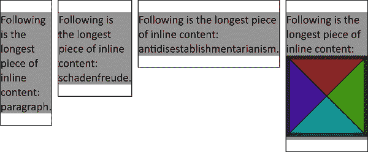
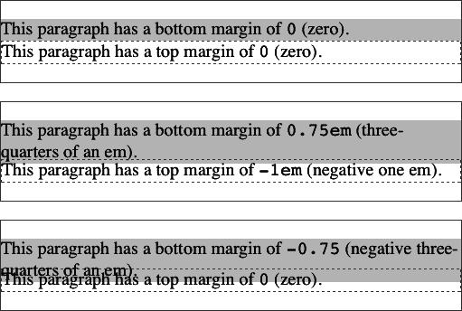
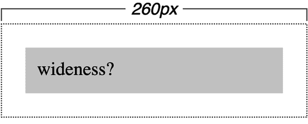

# 第六章：基本视觉格式化

您可能经历过打算的布局未按预期渲染的沮丧。即使添加了 27 条样式规则使其完美，您可能仍然不知道哪条规则解决了您的问题。由于 CSS 中包含的模型如此开放且强大，没有一本书能够涵盖每种组合属性和效果的可能方式。您无疑会继续发现新的 CSS 使用方式。然而，通过彻底掌握视觉渲染模型的工作原理，您将更能够确定某种行为是否是渲染引擎 CSS 定义的正确（尽管意外的）结果。

# 基本框

在其核心，CSS 假设每个元素生成一个或多个称为*元素框*的矩形框。（规范的未来版本可能允许非矩形形状，实际上已经提出了更改，但目前所有框仍然是矩形的。）

每个元素框在其中心具有一个*内容区域*。该内容区域周围可选的填充、边框、轮廓和边距。这些区域被视为可选，因为它们都可以设置为 0 大小，有效地将它们从元素框中移除。图 6-1 展示了一个内容区域示例，以及填充、边框和边距的周围区域。


###### 图 6-1\. 内容区域及其周围

在查看可以改变元素占用空间的属性之前，让我们先了解完全理解如何布局元素和占用空间所需的词汇。

## 快速入门

首先，我们将快速回顾我们将讨论的框类型，以及需要理解接下来的解释所需的一些重要术语：

块流方向

也称为*块轴*，这是堆叠块级元素框的方向。在包括所有欧洲和欧洲衍生语言在内的许多语言中，这个方向是从上到下的。在中文/日文/韩文（CJK）语言中，这可以是从右到左或从上到下。实际的块流方向由书写模式设置，这在第十五章中讨论。

内联基本方向

也被称为*内联轴*，这是文本行书写的方向。在罗曼语言等语言中，这是从左到右。在阿拉伯语或希伯来语等语言中，内联基本方向是从右到左。在 CJK 语言中，这可以是从上到下或从左到右。与块流方向一样，内联基本方向由书写模式设置。

正常流

元素在浏览器视口内放置的默认系统，基于父元素的书写模式。大多数元素都处于正常流中，元素离开正常流的唯一方法是浮动、定位或转变为弹性盒、网格布局或表格元素。本章讨论的内容涵盖正常流中的元素，除非另有说明。

块框

这是由段落、标题或 `<div>` 等元素生成的框盒。这些框在正常流中的前后都生成空白空间，以便块框在块流轴上依次堆叠。几乎任何元素都可以通过声明 `display: block` 来生成块框，尽管还有其他使元素生成块框的方法（例如浮动它们或使它们成为弹性项目）。

行内框

这是由 `<strong>` 或 `<span>` 等元素生成的框。这些框沿着行内基本方向布局，不会在其前后生成换行。默认情况下，长度超过元素行内尺寸的行内框（如果它是非替换的）将换行成多行。通过声明 `display: inline`，任何元素都可以生成行内框。

非替换元素

这是其内容包含在文档中的元素。例如，段落（`<p>`）是非替换元素，因为其文本内容位于元素本身内部。

替换元素

这是一个用作其他内容占位符的元素。替换元素的经典示例是 ``，它简单地指向一个图像文件，该文件被插入到文档流中 `` 元素所在的位置。大多数表单元素也是替换元素（例如 `<input type="radio">`）。

根元素

这是文档树顶部的元素。在 HTML 文档中，这是 `<html>` 元素。在 XML 文档中，它可以是语言允许的任何元素：例如，RSS 文件的根元素是 `<rss>`，而在 SVG 文档中，根元素是 `<svg>`。

## 包含块

我们需要详细研究另一种盒子，足够详细以至于它值得拥有自己的部分：*包含块*。

每个元素的框盒都是根据其包含块布局的。在实际情况中，包含块是盒子的*布局上下文*。CSS 定义了一系列规则来确定盒子的包含块。

对于给定的元素，包含块从生成列表项或块框的最近祖先元素的*内容边缘*形成，其中包括所有与表格相关的框（例如由表格单元格生成的框）。考虑以下内容：

```
<body>
    <div>
        <p>This is a paragraph.</p>
    </div>
</body>
```

在这个简单的标记中，`<p>` 元素块框的包含块是 `<div>` 元素的块框，因为它是最近的具有块或列表项框的祖先元素框（在这种情况下，它是一个块框）。类似地，`<div>` 的包含块是 `<body>` 的框。因此，`<p>` 的布局取决于 `<div>` 的布局，而 `<div>` 的布局又取决于 `<body>` 元素的布局。

而在文档树中更高的位置，`<body>` 元素的布局取决于 `<html>` 元素的布局，其框创建了所谓的*初始包含块*。这在视口单位中非常重要，视口决定了初始包含块的尺寸，而不是根元素内容的尺寸。这很重要，因为内容可能短于或长于视口的尺寸。大多数情况下这没有影响，但对于固定定位或视口单位等情况，差异是真实的。

现在您理解了一些术语，我们可以讨论构成图 6-1 的属性。各种边距、边框和填充功能，如`border-style`，可以使用各种特定于边的长手属性进行设置，例如`margin-inline-start`或`border-bottom-width`。（轮廓属性没有特定于边的属性；对轮廓属性的更改会影响所有四个边。）

默认情况下，内容的背景（例如颜色或平铺图像）应用于填充和边框区域，但这是可以更改的。边距始终是透明的，允许任何父元素的背景可见。填充和边框不能为负长度，但边距可以为负。我们将在“负边距和折叠”中探讨负边距的效果。

边框通常使用定义的样式生成，例如`solid`、`dotted`或`inset`作为`border-style`属性，并使用`border-color`属性设置其颜色。如果未设置颜色，则默认值为`currentcolor`。边框也可以由图像生成。如果边框样式具有某种类型的间隙，例如`border-style: dashed`或从部分透明图像生成的边框，则默认情况下元素的背景可通过这些间隙看到，尽管可以剪切背景以保持在边框（或填充）内。

# 修改元素显示

通过设置`display`属性的值，可以影响用户代理程序的显示方式。

我们将忽略 `ruby` 和 `table` 相关的值，因为它们对于本章节来说过于复杂。我们也会暂时忽略值 `list-item`，因为它与块级框非常相似，并且在 第十六章 中有详细探讨。现在，让我们花点时间谈谈如何改变元素的显示角色会改变布局。

## 更改角色

在样式化文档时，有时候能够改变元素生成的框的类型是很方便的。例如，假设我们有一系列链接在 `<nav>` 中，我们希望将它们布局为垂直边栏：

```
<nav>
    <a href="index.html">WidgetCo Home</a>
    <a href="products.html">Products</a>
    <a href="services.html">Services</a>
    <a href="fun.html">Widgety Fun!</a>
    <a href="support.html">Support</a>
    <a href="about.html" id="current">About Us</a>
    <a href="contact.html">Contact</a>
</nav>
```

默认情况下，链接将生成内联框，并且会被压缩成一个看起来像是仅包含链接的短段落。我们可以将所有链接放入它们自己的段落或列表项中，或者我们可以将它们都转换为块级元素，就像这样：

```
nav a {display: block;}
```

这将使导航元素 `<nav>` 内的每个 `<a>` 元素生成一个块级框，而不是通常的内联框。如果我们添加一些额外的样式，我们可以得到类似于 图 6-2 所示的结果。


###### 图 6-2\. 将显示角色从内联更改为块级

当你希望导航链接在没有 CSS 支持时（可能因为加载失败），将其作为内联元素显示，但在有 CSS 的环境中将它们作为块级元素布局时，更改显示角色会非常有用。你还可以在桌面显示器上将链接显示为内联元素，在移动设备上显示为块级元素，反之亦然。将链接布局为块级元素后，你可以像对待 `<div>` 或 `<p>` 元素那样对其进行样式设置，整个元素框都成为链接的一部分。

你可能还想将元素变成内联元素。假设我们有一个无序姓名列表：

```
<ul id="rollcall">
    <li>Bob C.</li>
    <li>Marcio G.</li>
    <li>Eric M.</li>
    <li>Kat M.</li>
    <li>Tristan N.</li>
    <li>Arun R.</li>
    <li>Doron R.</li>
    <li>Susie W.</li>
</ul>
```

给定这个标记，假设我们希望我们的显示中显示一系列内联姓名，并在它们之间（以及列表的每一端）加上垂直条。唯一的方法是改变它们的显示角色。以下规则将会产生 图 6-3 所示的效果：

```
#rollcall li {display: inline; border-right: 1px solid; padding: 0 0.33em;}
#rollcall li:first-child {border-left: 1px solid;}
```


###### 图 6-3\. 将显示角色从 `list-item` 更改为 `inline`

请理解，大部分情况下，你改变的是元素的显示角色，而不是它们固有的性质。换句话说，使段落生成内联框并不会将该段落转变为内联元素。例如，在 HTML 中，某些元素是块级的，而其他元素是内联的。尽管可以轻松地将 `<span>` 放置在段落内，但不应该将 `<span>` 围绕在段落周围。

我们说“大部分情况”，因为虽然 CSS 主要影响呈现而不是内容，但 CSS 属性可能影响辅助功能的方式不仅限于颜色对比。例如，更改`display`值可能会影响辅助技术对元素的感知方式。将元素的`display`属性设置为`none`会从辅助功能树中移除该元素。将 `<table>` 的`display`属性设置为`grid`可能会导致该表被解释为不同于数据表的东西，从而移除正常的表键盘导航，使得屏幕阅读器用户无法访问该表作为数据表。（这本不应该发生，但在某些浏览器中确实发生了。）

可以通过为表及其所有后代设置可访问的富互联网应用（ARIA）`role`属性来减轻这种情况。然而，通常情况下，每当您在 CSS 中做出更改强制您在 ARIA 角色中做出更改时，您都应该花时间考虑是否有更好的方法来实现您的目标。

## 处理块框

块框在可预测的，但有时令人惊讶的方式下运作。例如，沿着块和内联轴的框放置处理可以有所不同。要完全理解块框的处理方式，您必须清楚理解这些框的几个方面。这些详细显示在 图 6-4，展示了在两种不同书写模式下的放置方式。


###### 图 6-4\. 两种不同书写模式下的完整框模型

如 图 6-4 所示，CSS 处理块方向和内联方向，以及块大小和内联大小。块大小和内联大小是描述内容区域（默认情况下）在块和内联轴上的大小的描述。

相比之下，*宽度*（有时称为*物理宽度*）是指在水平轴（从左到右）上内容区域内部边缘之间的距离，不考虑书写方向，而*高度*（*物理高度*）是垂直轴（从上到下）上的距离。我们很快会讨论可以设置所有这些尺寸的属性。

在 图 6-4 中需要注意的重要事项是使用 *start* 和 *end* 来描述元素框的各个部分。例如，您将看到块开始边距和块结束边距。*开始边* 是您沿轴移动时首先遇到的边缘。

如果你查看图 6-5，沿着每个轴从箭头尾部到箭头尖端追踪，这可能更加清晰。沿着块轴移动时，你遇到的每个元素的第一个边缘是该元素的块起始边缘。当你离开元素时，你穿过块结束边缘。同样，当你沿着行内轴移动时，你经过行内起始边缘，横穿内容的行内维度，然后穿过行内结束边缘。尝试对三个示例分别进行操作。


###### 图 6-5。三种常见书写模式的块轴和行内轴方向

# 逻辑元素大小

因为 CSS 识别元素的块轴和行内轴，它提供了属性，让你能够沿着每个轴设置显式的元素大小。

这些属性允许你沿着块轴设置元素的大小，或者沿着行内轴约束文本行的长度，不管文本流的方向如何。如果你写`block-size: 500px`，元素的块大小将是 500 像素宽，即使这导致内容溢出元素框。我们将在本章节的后面更详细地讨论这一点。

考虑以下内容，在应用于各种书写模式时，其结果显示在图 6-6 中：

```
p {inline-size: 25ch;}
```


###### 图 6-6。沿着其行内轴调整元素大小

如图 6-6 所示，元素沿其行内轴一致调整大小，不论书写方向如何。如果你侧着头看，你会发现行在完全相同的地方换行。这在所有书写模式中保持了一致的行长。

类似地，你可以为元素设置一个块大小。这在替换元素如图像中更常用一些，但在任何有意义的情况下都可以使用。举个例子：

```
p img {block-size: 1.5em;}
```

完成这些后，任何 `` 元素在 `<p>` 元素内部被发现时，其块大小将设置为周围文本大小的 1.5 倍。这适用于图像，因为它们是行内替换元素；对于行内非替换元素，这种方法是行不通的。你也可以使用 `block-size` 来约束网格布局项的块长度为最小或最大尺寸，例如这样：

```
#maingrid > nav {block-size: clamp(2rem, 4em, 25vh);}
```

需要说明的是，通常块大小是自动确定的，因为正常流中的元素通常没有显式设置的块大小。例如，如果一个元素的块流是从上到下，有 8 行，每行高 1/8 英寸，则其块大小将为 1 英寸。如果是 10 行高，则块大小将是 1.25 英寸。在任何情况下，只要`block-size`是`auto`，块大小就由元素的内容确定，而不是由作者确定。这通常是您想要的，特别是对于包含文本的元素。当显式设置`block-size`并且没有足够的内容填充框时，框内会出现空白空间；如果内容超过框的容纳能力，则内容可能会溢出框或出现滚动条。

## 基于内容的尺寸值

除了您之前在设置块和内联大小中看到的长度和百分比外，还有一些关键字提供基于内容的大小调整：

`max-content`

尽可能占据最大的空间以适应内容，甚至在文本内容的情况下抑制换行。

`min-content`

尽可能占据最少的空间以适应内容。

`fit-content`

占据由计算`max-content`、`min-content`和常规内容大小值确定的空间量，取`min-content`和常规大小的最大值，然后取`max-content`和先前两者中较大值的最小值。是的，这听起来有点混乱，但我们稍后会解释清楚。

如果您曾经使用过 CSS Grid（在第十二章介绍），您可能会认出这些关键字，因为它们最初被定义为调整网格项大小的一种方式。现在它们正开始应用到 CSS 的其他领域。让我们来考虑前两个关键字，它们在图 6-7 中有演示。


###### 图 6-7\. 内容大小

左侧的段落设置为`max-content`，效果如下：段落的宽度会根据需要调整以适应所有内容。之所以宽度如此狭窄，仅因内容不多。如果再添加三句话，单行文本将继续延伸，甚至可能一直延伸到页面之外（或浏览器窗口之外），而不会换行。

在右侧的段落中，内容尽可能窄，而不会在单词内部强制换行或使用连字符。在这种特定情况下，元素的宽度*刚刚*足够容纳“段落”这个最长的单词。在示例中的每一行文本中，浏览器会尽可能多地放置适合“段落”所需空间的单词，并在空间不足时换行。如果我们在文本中加入“反对清教会主义”，元素的宽度将刚好足够容纳*那个*单词，而且每行文本很可能包含多个单词。

注意，在图 6-7 的`min-content`示例结束时，浏览器利用了`min-content`中存在连字符的情况，触发了一次换行。如果没有做出这个选择，`min-content`几乎肯定会成为段落中最长的内容片段，并且元素的宽度将设置为该长度。这意味着，如果您的内容包含浏览器认为是自然换行点的符号（例如空格和连字符），它们很可能会被考虑在`min-content`计算中。如果您希望进一步缩小元素的宽度，可以使用`hyphens`属性启用单词的自动连字符（参见第十五章）。

想了解更多关于`min-content`大小的示例，请参见图 6-8。



###### 图 6-8\. 最小内容大小

第三个关键词`fit-content`很有趣，因为它尽力使元素适应内容。实际上，这意味着如果您只有少量内容，元素的内联尺寸（通常是宽度）将足够大以包含它，就像使用`max-content`一样。如果有足够多的内容以至于可以换行到多行或以其他方式威胁到溢出元素的容器，则内联尺寸就会停在那里。这在图 6-9 中有所说明。


###### 图 6-9\. 适应内容大小

在每种情况下，元素都适应内容而不会溢出元素的容器。至少在正常流中的元素是这样。在 flexbox 和 grid 上下文中，行为可能会有所不同，并且在后续章节中进一步探讨。

## 最小和最大逻辑大小

如果您希望为块或行内大小设置最小和最大限制，CSS 有一些属性可以帮助您。

当您知道要为元素框的大小设置上限和下限，并且愿意允许浏览器在遵守这些限制的同时执行任何操作时，这些属性可能非常有用。例如，您可以像这样设置布局的一部分：

```
main {min-inline-size: min-content; max-inline-size: 75ch;}
```

这保持了`<main>`元素不比行内内容的最宽部分更窄，无论是长单词、插图还是其他内容。它还保持了`<main>`元素的宽度不超过约 75 个字符，从而保持行长度可读。

还可以设置块大小的限制。一个很好的例子是将正常流中嵌入的任何图像限制为其固有大小，直到某个点为止。以下 CSS 将产生图 6-10 中显示的效果：

```
#cb1 img {max-block-size: 2em;}
#cb2 img {max-block-size: 1em;}
```


###### 图 6-10\. 最大块大小

## 高度和宽度

如果你已经使用 CSS 一段时间或在维护遗留代码，你可能习惯于思考“上边距”和“下边距”。这是因为最初，所有框模型方面都是以其物理方向描述的：上、右、下和左。你仍然可以使用物理方向！CSS 只是在混合中添加了新的方向。

如果你在前面的代码示例中将`inline-size`改为`width`，你会得到一个更接近于图 6-11 所示的结果（其中垂直书写模式会被截短至其完整高度的一小部分）。


###### 图 6-11\. 调整元素宽度

这些元素在水平方向上都被制作为`40ch`宽，不管其书写方式如何。每个元素的高度已根据内容、书写模式的具体情况等自动确定。

###### 提示

如果你使用类似`block-size`这样的块和行内属性而不是类似`height`这样的物理方向，并且你的设计应用到翻译成其他语言的内容上，布局将会自动调整到你的意图。

`height`和`width`属性被称为*物理属性*。它们指的是物理方向，与依赖书写的块大小和行内大小相对。因此，`height`确实指的是从元素内边缘顶部到底部的距离，而不管块轴的方向如何。

在具有水平行内轴（如英语或阿拉伯语）的书写中，如果在同一元素上同时设置了`inline-size`和`width`，则后声明的属性会覆盖首次声明的属性。如果同时声明了`block-size`和`height`，并且起源、层和特异性都相同，则后声明的属性会优先。在垂直书写模式中，`inline-size`对应于`height`，`block-size`对应于`width`。

将块框的高度或宽度设置为<*`length`*>意味着它将是那个长度的高或宽，不管其内部内容如何。如果你将生成块框的元素设置为`width: 200px`，那么它将是 200 像素宽，即使其内部有一个 500 像素宽的图像。

将`width`的值设置为<*`percentage`*>意味着元素的宽度将是其包含块宽度的那个百分比。如果你将段落设置为`width: 50%`，其包含块宽度为 1,024 像素，则段落的`width`将计算为 512 像素。

将`height`设置为<*`percentage`*>的工作方式类似，除非包含块已显式设置高度。如果包含块的高度是自动设置的，则百分比值会被视为`auto`，如图 6-12 中`#cb4`示例所示。

###### 注意

对于定位元素、弹性盒和网格元素，`auto`上下边距的处理方式是不同的。这些差异在第十一章和第十二章中有详细介绍。

这里是一些这些值和组合的示例，结果显示在图 6-12 中：

```
[id^="cb"] {border: 1px solid;}  /* "cb" for "containing block" */
#cb1 {width: auto;}    #cb1 p {width: auto;}
#cb2 {width: 400px;}   #cb2 p {width: 300px;}
#cb3 {width: 400px;}   #cb3 p {width: 50%;}

#cb4 {height: auto;}   #cb4 p {height: 50%;}
#cb5 {height: 300px;}  #cb5 p {height: 200px;}
#cb6 {height: 300px;}  #cb6 p {height: 50%;}
```


###### 图 6-12\. 高度和宽度

您还可以使用`max-content`和`min-content`与`height`属性，但在自上而下的块流中，两者与`height: auto`相同。在使用水平块轴的书写模式中，为`height`设置这些值将产生类似于在垂直块流中为`width`设置它们的效果。

另外，这些属性不适用于内联非替换元素。例如，如果尝试为正常流中生成内联框的超链接声明`height`和`width`，符合 CSS 的浏览器必须忽略这些声明。假设以下规则：

```
a:any-link {color: red; background: silver; height: 15px; width: 60px;}
```

您最终会得到未访问的红色链接，它们的高度和宽度由链接内容决定，位于银色背景上。这些链接的内容区域不会是 15 像素高和 60 像素宽，因为这些值在应用于内联非替换元素时必须被忽略。另一方面，如果您添加`display`值，如`inline-block`或`block`，那么`height`和`width`将设置链接内容区域的高度和宽度。

# 更改盒子大小

如果使用`height`和`width`（以及`block-size`和`inline-size`）来描述元素内容区域的尺寸而不是其可见区域似乎有点奇怪，您可以通过使用属性`box-sizing`使此尺寸更直观。

此属性改变了`height`、`width`、`block-size`和`inline-size`属性的值如何处理。

如果声明`inline-size: 400px`并且不声明`box-sizing`的值，元素的内容区域将在行内方向上为 400 像素，任何填充、边框等都将添加到其中。另一方面，如果声明`box-sizing: border-box`，元素框将从行内起始边框边缘到行内结束边框边缘为 400 像素；任何行内起始或结束的边框或填充将放置在该距离内，从而缩小内容区域的行内尺寸。这在图 6-13 中有所说明。


###### 图 6-13\. `box-sizing`的效果

换个说法，如果声明`width: 400px`并且不声明`box-sizing`的值，元素的内容区域将为 400 像素宽，任何填充、边框等都将添加到其中。另一方面，如果声明`box-sizing: border-box`，元素框将从左外边框边缘到右外边框边缘为 400 像素；任何左侧或右侧的边框或填充将放置在该距离内，从而缩小内容区域的宽度（同样，如图 6-13 中所示）。

我们在这里谈论 `box-sizing` 属性，因为它适用于“接受 `width` 或 `height` 值的所有元素”（因为在逻辑属性普及之前它就被定义了）。通常情况下，这适用于生成块框的元素，尽管它也适用于替换的内联元素，比如图像，以及内联块框。

在逻辑和物理方式中已经确定了如何调整元素的尺寸后，让我们扩展范围，查看影响块大小的所有属性。

# 块轴属性

总体而言，块轴格式化受到七个相关属性的影响：`margin-block-start`、`border-block-start`、`padding-block-start`、`height`、`padding-block-end`、`border-block-end` 和 `margin-block-end`。这些属性在图 7-14 中有详细说明。在第七章中，我们将详细讨论这些属性的所有内容，现在我们将先讨论这些属性的一般原则和行为，然后再查看其值的细节。

必须将块轴的起始和结束填充以及边框设置为特定值，否则它们将默认为宽度为 `0`，假设未声明边框样式。如果已设置 `border-style`，则边框的厚度设置为 `medium`，在所有已知的浏览器中宽度为 3 像素。图 7-14 描述了两种书写模式下的块轴格式化属性，并指示框的哪些部分可能具有 `auto` 的值，哪些可能没有。


###### 图 6-14\. 块轴格式化的七个属性，以及可以设置为 `auto` 的属性

如果在普通流中的块级框中，`margin-block-start` 或 `margin-block-end` 中的一个设置为 `auto`，但不是两者同时设置，它们都会计算为 `0`。遗憾的是，值为 `0` 会阻止在包含块中轻松地使普通流框在块方向上居中（尽管在 flexbox 或 grid 布局中这样的居中相对直接）。

`block-size` 属性必须设置为 `auto` 或某种类型的非负值；它永远不能小于 `0`。

## 自动块大小

在最简单的情况下，具有 `block-size: auto` 的普通流块框的高度刚好足以包含其内联内容（包括文本）的行框。如果具有自动块大小的普通流块框只有块级子元素，并且没有块边缘的填充或边框，则从其第一个子元素的边框起始边到其最后一个子元素的边框结束边的距离将是框的块大小。这种情况是因为子元素的边距可以“突出”包含它们的元素，这归功于所谓的*边距折叠*，我们将在“块轴边距折叠”中讨论。

但是，如果块级元素具有块起始或块结束填充，或块起始和块结束边框，则其块大小将是其第一个子元素的块起始边缘到其最后一个子元素的块结束边缘的距离：

```
<div style="block-size: auto; background: silver;">
    <p style="margin-block-start: 2em; margin-block-end: 2em;">A paragraph!</p>
</div>
<div style="block-size: auto; border-block-start: 1px solid;
 border-block-end: 1px solid; background: silver;">
    <p style="margin-block-start: 2em; margin-block-end: 2em;">
         Another paragraph!</p>
</div>
```

图 6-15 展示了这两种行为。

如果我们将前面示例中的边框改为填充，那么 `<div>` 的块大小效果将相同：它仍将包含段落的边距在内。


###### 图 6-15\. 带有块级子元素的自动块大小

## 百分比高度

您之前看到了如何处理长度值块大小，现在我们花一点时间讨论百分比。如果正常流块框的块大小设置为百分比值，则该值将视为其包含块的块大小的百分比，假设容器具有自己的显式非 `auto` 块大小。给定以下标记，段落沿块轴的长度为 3 em：

```
<div style="block-size: 6em;">
    <p style="block-size: 50%;">Half as tall</p>
</div>
```

如果包含块的块大小 *没有* 显式声明，则百分比块大小将重置为 `auto`。如果我们更改上一个示例，以便 `<div>` 的 `block-size` 是 `auto`，则段落现在将自动确定其块大小：

```
<div style="block-size: auto;">
    <p style="block-size: 50%;">NOT half as tall; block size reset to auto</p>
</div>
```

图 6-16 阐述了这两种可能性。（段落边框与 `<div>` 边框之间的空间是段落的块起始和结束边距。）


###### 图 6-16\. 不同情况下的百分比块大小

在我们继续之前，请仔细观察 图 6-16 中的第一个示例，即半高的段落。它可能只有高度的一半，但沿块轴并非居中。这是因为包含的 `<div>` 高度为 6 em，这意味着半高的段落为 3 em。由于浏览器的默认样式，它具有 1 em 的块起始和结束边距，因此其整体块大小为 5 em。这意味着段落可见框的块结束边缘与 `<div>` 的块结束边框之间实际上有 2 em 的空间，而不是 1 em。 图 6-17 详细说明了这一点。


###### 图 6-17\. 块轴尺寸和详细放置

## 处理内容溢出

由于可以将元素设置为特定大小，因此可能使元素的内容无法完全容纳。如果显式定义块大小，则更有可能出现此问题，但在后续章节中，您将看到它也可能发生在内联大小中。如果确实发生了这种情况，您可以使用 `overflow` 简写属性来控制情况。

`visible`的默认值意味着元素的内容可能在元素框外可见。通常，这会导致内容超出其自身元素框，但不会改变该框的形状。下面的标记将导致图 6-18 的结果：

```
div#sidebar {block-size: 7em; background: #BBB; overflow: visible;}
```

如果将`overflow`设置为`hidden`，元素的内容将被裁剪在元素框的边缘。使用`hidden`值时，没有办法访问被裁剪掉的内容部分。

如果将`overflow`设置为`clip`，元素的内容也将被裁剪——即在元素框的边缘隐藏——没有办法访问被裁剪掉的部分。

如果将`overflow`设置为`scroll`，溢出的内容将被裁剪，但用户可以通过滚动方法访问内容，包括滚动条（或一组滚动条）。图 6-18 描绘了其中一种可能性。

如果使用`scroll`，则应始终呈现平移机制（例如滚动条）。引用规范，“这样可以避免在动态环境中出现滚动条的问题。”因此，即使元素有足够的空间来显示其所有内容，滚动条仍可能出现并占据空间（尽管不一定）。

此外，在打印页面或以其他方式在打印介质中显示文档时，内容可能显示为`overflow`值被声明为`visible`。

图 6-18 说明了这些`overflow`值，其中两者结合在一个示例中。


###### 图 6-18\. 处理溢出内容的方法

最后，`overflow: auto`允许用户代理确定要使用先前描述的哪种行为，尽管鼓励用户代理在必要时提供滚动机制。这是一种潜在有用的溢出使用方式，因为用户代理可以将其解释为“仅在需要时提供滚动条”。（它们可能不这样做，但通常是这样的。）

### 单轴溢出

`overflow`的简写由两个属性组成。您可以分别设置`overflow`沿*x*（水平）和*y*（垂直）方向的溢出行为，通过设置它们两者在`overflow`中，或使用`overflow-x`和`overflow-y`属性。

通过单独设置每个轴线的溢出行为，你实质上是在决定滚动条将出现在哪里，哪里不出现。考虑下面的情况，在图 6-19 中呈现：

```
div.one   {overflow-x: scroll; overflow-y: hidden;}
div.two   {overflow-x: hidden; overflow-y: scroll;}
div.three {overflow-x: scroll; overflow-y: scroll;}
```


###### 图 6-19\. 单独为 x 轴和 y 轴设置溢出

在第一种情况下，为 x 轴（水平方向）设置了一个空的滚动条，但对于 y 轴（垂直方向）却没有，尽管内容沿 y 轴溢出。这是两全其美的最坏情况：因为不需要而空置的滚动条，以及在需要时却没有滚动条。

第二种情况是更实用的反例：x 轴上没有滚动条，但是 y 轴上有一个可用的滚动条，因此可以通过滚动访问溢出的内容。

在第三种情况下，两个轴都设置为`scroll`，因此可以通过滚动访问溢出内容，但是我们也有一个不必要的（空）x 轴滚动条。这相当于简单地声明`overflow: scroll`。

这使我们了解到`overflow`的真正本质：它是一个将`overflow-x`和`overflow-y`合并到一个属性下的简写。以下内容与先前示例完全等效，并将显示与图 6-19 相同的结果：

```
div.one   {overflow: scroll hidden;}
div.two   {overflow: hidden scroll;}
div.three {overflow: scroll;} /* 'scroll scroll' would also work */
```

正如您所见，您可以为`overflow`指定两个关键字，这些关键字始终按顺序为*x*，然后*y*。如果只给出一个值，则用于 x 和 y 轴。这就是为什么`scroll`和`scroll scroll`作为`overflow`的值是相同的。同样，`hidden`等同于声明`hidden hidden`。

## 负边距和折叠

信不信由你，负边距是可能的。其基本效果是将边距边缘向元素框的中心移动。考虑以下内容：

```
p.neg {margin-block-start: -50px; margin-block-end: 0;
    border: 3px solid gray;}
```

```
<div style="width: 420px; background-color: silver; padding: 10px;
 margin-block-start: 50px; border: 1px solid;">
    <p class="neg">
        A paragraph.
    </p>
    A div.
</div>
```

如我们在图 6-20 中看到的，段落被其负块起始边距向上拉动。请注意，标记中段落后面的`<div>`的内容也被沿块轴向上拉了 50 像素。


###### 图 6-20\. 负块起始边距的效果

现在将以下标记与图 6-21 中显示的情况进行比较：

```
p.neg {margin-block-end: -50px; margin-block-end: 0;
    border: 3px solid gray;}
```

```
<div style="width: 420px; margin-block-start: 50px;">
    <p class="neg">
        A paragraph.
    </p>
</div>
<p>
    The next paragraph.
</p>
```


###### 图 6-21\. 负块结束边距的效果

发生了什么？跟随`<div>`之后的元素是根据`<div>`的块结束边距边缘的位置放置的，该位置比没有负边距时高出 50 像素。正如图 6-21 所示，`<div>`的块结束位置实际上*高于*其子段落的视觉块结束位置。在`<div>`之后的下一个元素与`<div>`的块结束位置之间的距离是适当的。

## 折叠块轴边距

块轴格式化的一个重要方面是*相邻边距的折叠*，这是一种比较块方向上相邻边距的方法，然后只使用这些边距中的最大值来设置相邻块元素之间的距离。请注意，折叠行为仅适用于边距。内边距和边框永远不会折叠。

无序列表，列表项沿块轴依次排列，是研究边距折叠的理想环境。假设以下声明适用于包含三个项目的列表：

```
li {margin-block-start: 10px; margin-block-end: 15px;}
```

每个列表项具有 10 像素的块起始边距和 15 像素的块末端边距。然而，当列表被渲染时，相邻列表项之间的可见距离是 15 像素，而不是 25 像素。这是因为在块轴上，相邻边距被折叠了。换句话说，较小的边距被舍弃，以较大的边距为准。图 6-22 显示了折叠与未折叠边距的区别。


###### 图 6-22\. 折叠与未折叠边距

用户代理将会像图 6-22 中的第一个列表所示折叠块相邻的边距，因此每个列表项之间会出现 15 像素的间隔。第二个列表显示如果浏览器不折叠边距会发生什么，导致列表项之间的间隔为 25 像素。

另一个可以使用的词，如果你不喜欢“折叠”，是“重叠”。虽然边距实际上并没有重叠，但是你可以通过以下类比来想象正在发生的事情。

想象每个元素，比如段落，都是一小张纸，上面写着元素的内容。每张纸周围都有一定数量的透明塑料，代表边距。第一张纸（比如一个 `<h1>` 纸）被放在画布上。第二张纸（一个段落）被放在它下面沿着块轴，并沿着该轴向上滑动，直到一张纸的边缘的塑料触碰另一张纸的边缘。如果第一张纸的块末端边缘有半英寸的塑料，而第二张纸的块起始有三分之一英寸的塑料，那么当它们滑动在一起时，第一张纸的块末端塑料将接触到第二张纸的块起始边缘。它们现在在画布上被放置完成，并且连接到纸上的塑料是重叠的。

同样会发生折叠，当多个边距相遇时，比如在列表末尾。接下来以早前的例子为例，假设以下规则适用：

```
ul {margin-block-end: 15px;}
li {margin-block-start: 10px; margin-block-end: 20px;}
h1 {margin-block-start: 28px;}
```

列表中的最后一项具有 20 像素的块末端边距，`<ul>` 的块末端边距为 15 像素，而后续 `<h1>` 的块起始边距为 28 像素。因此，一旦边距被折叠，列表中最后一个 `<li>` 结束和 `<h1>` 开始之间的距离为 28 像素，如 图 6-23 所示。


###### 图 6-23\. 详细的折叠过程

如果在包含块上添加边框或填充，这将导致其子元素的边距完全包含在其中。我们可以通过在前面示例的 `<ul>` 元素上添加边框来看到这种行为的运作：

```
ul {margin-block-end: 15px; border: 1px solid;}
li {margin-block-start: 10px; margin-block-end: 20px;}
h1 {margin-block-start: 28px;}
```

随着这个改变，`<li>` 元素的块末端边距现在被放置在其父元素（`<ul>`）内。因此，唯一发生的边距折叠是在 `<ul>` 和 `<h1>` 之间，如 图 6-24 所示。


###### 图 6-24\. 与添加边框混合（或不混合）的边距合并

负边距合并略有不同。当负边距参与边距合并时，浏览器会取负边距的绝对值，并从任何相邻的正边距中减去它。换句话说，负长度会被添加到正长度中，结果值就是元素之间的距离，即使该距离是负长度。图 6-25 提供了一些具体的例子。



###### 图 6-25\. 负块轴边距的示例

现在让我们考虑一个示例，其中列表项、无序列表和段落的边距都被合并。在这种情况下，无序列表和段落被分配负边距：

```
li {margin-block-end: 20px;}
ul {margin-block-end: -15px;}
h1 {margin-block-start: -18px;}
```

最大幅度的负边距（`-18px`）与最大正边距（`20px`）相加，得到 `20px` – `18px` = `2px`。因此，在列表项内容的块末端和`<h1>`内容的块开端之间，我们只有 2 像素的间距，正如我们在图 6-26 中看到的。


###### 图 6-26\. 边距合并和负边距的详细信息

因为负边距导致元素重叠，很难确定哪些元素位于其他元素之上。您可能还注意到，本节中的示例很少使用背景颜色。如果使用了背景颜色，后续元素的背景颜色可能会覆盖前面元素的内容。这是预期的行为，因为浏览器通常按顺序从开始到结束渲染元素，所以通常可以预期后来文档中的正常流元素会覆盖较早的元素。

# 内联轴格式化

沿内联轴布局元素可能比您想象的更复杂。这种复杂性的一部分与`box-sizing`的默认行为有关。在`content-box`的默认值下，给定的`inline-size`值影响内容区域的内联宽度，*而不是*整个可见元素框。考虑以下示例，其中内联轴从左到右：

```
<p style="inline-size: 200px;">wideness?</p>
```

这使得段落的内容区域宽度为 200 像素。如果我们给元素添加背景色，这将非常明显。然而，您指定的任何填充、边框或边距都会*添加*到宽度值上。假设我们这样做：

```
<p style="inline-size: 200px; padding: 10px; margin: 20px;">wideness?</p>
```

可见的元素框现在在内联尺寸上为 220 像素，因为我们在内容的每一侧添加了 10 像素的填充。现在边距将在整个元素内联尺寸的两侧再扩展 20 像素。这在图 6-27 中有所说明。



###### 图 6-27\. 添加填充和边距

如果我们将样式更改为`box-sizing: border-box`，结果将会有所不同。在这种情况下，可见框沿着内联轴的宽度为 200 像素，内容内联尺寸为 180 像素，内联两侧共有 40 像素的边距，从而得到总体内联尺寸为 240 像素，如图 6-28 所示。


###### 图 6-28\. 减法填充

无论哪种情况，CSS 规范都有一条规则，即块级元素在正常流中的内联组件总是等于包含块的内联尺寸（这也是为什么，稍后您将看到，`margin: auto`可以在内联方向上居中内容）。让我们考虑一个`<div>`内的两个段落，其边距已设置为`1em`，并且其`box-sizing`值为默认的`content-box`。在这个例子中，每个段落的内容大小（即`inline-size`的值）、内联起始和结束填充、边框和边距的总和，将始终加起来等于`<div>`内容区域的内联尺寸。

假设`<div>`的内联尺寸是`30em`。这使得每个段落的内容大小、填充、边框和边距的总和为 30 em。在图 6-29 中，段落周围的“空白”实际上是它们的边距。如果`<div>`有任何填充，那么将会有更多的空白空间，但这里并非如此。


###### 图 6-29\. 元素框的宽度与其包含块的内联宽度一样宽

## 内联轴属性

内联轴格式化的七个属性——`margin-inline-start`、`border-inline-start`、`padding-inline-start`、`inline-size`、`padding-inline-end`、`padding-inline-end`和`padding-inline-end`——在图 6-30 中有详细说明。

这七个属性的值必须加起来等于元素包含块的内联尺寸，通常是块元素父级的`inline-size`的值（因为块级元素几乎总是有块级元素作为父级）。

这七个属性中，只有三个可以设置为`auto`：元素内容的内联尺寸，以及内联起始和结束边距。其余属性必须设置为具体值或默认为 0。图 6-30 展示了框的哪些部分可以接受`auto`值，哪些不行。（不过，CSS 很宽容：如果设置了任何不能接受`auto`的部分为`auto`，它将默认为`0`。）


###### 图 6-30\. 内联轴格式化的七个属性及可以设置为`auto`的部分

`inline-size`属性必须设置为`auto`或非负值。在内联轴格式化中使用`auto`时，可能会产生不同的效果。

## 使用`auto`

在某些情况下，显式地将一个或多个内联边距和尺寸设置为 `auto` 是非常有意义的。默认情况下，两个内联边距设置为 `0`，内联尺寸设置为 `auto`。让我们探讨一下移动 `auto` 可以产生不同效果的原因。

### 只有一个 `auto`

如果您将 `inline-size`、`margin-inline-start` 或 `margin-inline-end` 中的一个设置为 `auto`，并为其他两个属性指定特定值，则设置为 `auto` 的属性将设置为使元素框的整体内联尺寸等于父元素的内容内联尺寸所需的长度。

假设七个内联轴属性的总和必须等于 500 像素，没有设置填充或边框，内联尺寸和内联结束边距设置为 `100px`，内联起始边距设置为 `auto`。因此，内联起始边距将宽度为 300 像素：

```
div {inline-size: 500px;}
p {margin-inline-start: auto; margin-inline-end: 100px;
    inline-size: 100px;} /* inline-start margin evaluates to 300px */
```

在某种意义上，`auto` 可以用来填补其他所有内容和所需总和之间的差异。然而，如果这三个属性（内联边距和内联尺寸）都设置为 `100px`，并且*没有*一个设置为 `auto`，那会怎么样呢？

如果这三个属性都设置为除 `auto` 之外的其他值，或者在 CSS 术语中，当这些格式化属性已经*过度约束*时，内联结束边距将*始终*被强制为 `auto`。这意味着如果两个内联边距和内联尺寸都设置为 `100px`，用户代理将重置内联结束边距为 `auto`。然后，内联结束边距的宽度将根据一个 `auto` 值的规则设置，“填充”使元素的整体内联尺寸等于其包含块的内容内联尺寸。图 6-31 显示了类似英语这样的从左到右语言中以下标记的结果：

```
div {inline-size: 500px;}
p {margin-inline-start: 100px; margin-inline-end: 100px;
    inline-size: 100px;} /* inline-end margin forced to be 300px */
```


###### 图 6-31\. 覆盖内联结束边距的值

如果两侧边距都明确设置，并且 `inline-size` 设置为 `auto`，那么 `inline-size` 将是达到所需总和所需的任何值（即父元素内容的内联尺寸）。以下标记的结果显示在 图 6-32 中：

```
p {margin-inline-start: 100px; margin-inline-end: 100px;
     inline-size: auto;}
```

这种类型的格式化是最常见的，因为它等同于设置边距并且不为 `inline-size` 声明任何内容。以下标记的结果与 图 6-32 中显示的完全相同：

```
p {margin-inline-start: 100px; margin-inline-end: 100px;} /* same as before */
```


###### 图 6-32\. 自动内联尺寸调整

如果 `box-sizing` 设置为 `padding-box`，您可能会想知道会发生什么。在这种情况下，这里描述的所有原理都适用，这就是为什么本节仅讨论 `inline-size` 和内联侧边距而不引入任何填充或边框的原因。

换句话说，本节和以下各节中对`inline-size: auto`的处理方式与`box-sizing`的值无关。在`box-sizing`定义的框内部放置内容的细节可能有所不同，但`auto`值的处理方式不变，因为`box-sizing`决定了`inline-size`所指的内容，而不是它与边距的关系。

### 多个自动

现在让我们看看当三个属性中的两个（`inline-size`、`margin-inline-start`和`margin-inline-end`）都设置为`auto`时会发生什么。如果两个边距都设置为`auto`，但`inline-size`设置为特定长度，则两个边距将设置为相等的长度，从而使元素在其父元素沿内联轴居中。以下代码创建了这种布局，示例显示在图 6-33 中：

```
div {inline-size: 500px;}
p {inline-size: 300px; margin-inline-start: auto; margin-inline-end: auto;}
  /* each margin is 100 pixels, because (500-300)/2 = 100 */
```


###### 图 6-33\. 设置显式内联尺寸

另一种沿内联轴调整元素大小的方法是将一个内联边距和`inline-size`设置为`auto`。在这种情况下，设置为`auto`的边距将被减少到 0：

```
div {inline-size: 500px;}
p {margin-inline-start: auto; margin-inline-end: 100px; inline-size: auto;}
  /* inline-start margin evaluates to 0; inline-size becomes 400px  */
```

然后，`inline-size`属性被设置为使元素填充其包含块所需的值；在上述示例中，它将是 400 像素，如图 6-34 所示。


###### 图 6-34\. 当`inline-size`和内联起始边距都为`auto`时的情况

### 太多的自动

最后，当这三个属性都设置为`auto`时会发生什么？答案是：两个边距都设置为 0，而`inline-size`则尽可能宽。这个结果与默认情况相同，即当边距或内联尺寸未明确声明时。在这种情况下，边距默认为 0，而`inline-size`默认为`auto`。

请注意，由于内联边距不会折叠（与前面讨论的块边距不同），父元素的填充、边框和边距可以影响其子元素的内联布局。这种影响是间接的，即一个元素的边距（等等）可以引起子元素的偏移。以下标记的结果显示在图 6-35 中：

```
div {padding: 50px; background: silver;}
p {margin: 30px; padding: 0; background: white;}
```


###### 图 6-35\. 偏移在父元素的边距和填充中是隐含的

## 负边距

正如您在块轴边距中看到的那样，也可以为内联轴边距设置负值。设置负内联边距可能会导致一些有趣的效果。

请记住，七个内联轴属性的总和始终等于父元素内容区域的内联尺寸。只要所有内联属性都是 0 或更大，元素的内联尺寸就永远不会大于其父元素的内容区域内联尺寸。但是，请考虑以下标记，示例显示在图 6-36 中：

```
div {inline-size: 500px; border: 3px solid black;}
p.wide {margin-inline-start: 10px; margin-inline-end: -50px;
    inline-size: auto;}
```


###### 图 6-36\. 通过负边距使子元素更宽

是的，确实，子元素在内联轴上比其父元素更宽！这在数学上是正确的。让我们解决内联尺寸的问题：

+   10 px + 0 + 0 + 540 px + 0 + 0 – 50 px = 500 px

`540px`是`inline-size: auto`的计算结果，这是平衡方程中其余值所需的数字。即使这导致子元素超出其父元素，所有这些工作都是因为七个属性的值总和达到了所需的总和。

现在，让我们添加一些边框：

```
div {inline-size: 500px; border: 3px solid black;}
p.wide {margin-inline-start: 10px; margin-inline-end: -50px;
    inline-size: auto; border: 3px solid gray;}
```

结果的变化将导致`inline-size`的评估宽度减少：

+   10 px + 3 px + 0 + 534 px + 0 + 3 px – 50 px = 500 px

或者，我们可以重新排列方程以解决内容大小而不是父元素宽度的问题：

+   500 px – 10 px – 3 px – 3 px + 50 px = 534 px

如果我们引入填充，`inline-size`的值将进一步下降（假设`box-sizing: content-box`）。

相反，可以将`auto`的内联结束边距计算为负值。如果其他属性的值强制内联结束边距为负，以满足元素不超过其包含块的要求，那么就会发生这种情况。考虑以下情况：

```
div {inline-size: 500px; border: 3px solid black;}
p.wide {margin-inline-start: 10px; margin-inline-end: auto;
    inline-size: 600px; border: 3px solid gray;}
```

方程如下所示：

+   500 px – 10 px – 600 px – 3 px – 3 px = –116 px

在这种情况下，内联结束边距计算为`-116px`。无论在 CSS 中给定了多少显式值，由于规则规定当元素尺寸过度约束时，内联结束边距将被重置为使数字正确计算的值。

让我们考虑另一个例子，如图 6-37 所示，其中内联起始边距设置为负：

```
div {inline-size: 500px; border: 3px solid black;}
p.wide {margin-inline-start: -50px; margin-inline-end: 10px;
    inline-size: auto; border: 3px solid gray;}
```


###### 图 6-37。设置负内联起始边距

具有负内联起始边距的段落不仅超出了`<div>`的边界，还超出了浏览器窗口的边缘！

记住：填充、边框和内容宽度（和高度）永远不能为负。只有边距可以小于 0。

## 百分比

关于内联尺寸、填充和边距的百分比值，与前几节讨论的基本规则相同。值是用长度还是百分比声明的并不重要。

百分比可以非常有用。假设我们希望元素的内容占其包含块的内联尺寸的三分之二，填充边为 5%各自，内联起始边距为 5%，而内联结束边距则充当间隙。可以这样写：

```
<p style="inline-size: 67%;
 padding-inline-end: 5%; padding-inline-start: 5%;
 margin-inline-end: auto; margin-inline-start: 5%;">
     playing percentages</p>
```

内联结束边距将评估为包含块宽度的 18%（100% – 67% – 5% – 5% – 5%）。

然而，混合百分比和长度单位可能会很棘手。考虑以下例子：

```
<p style="inline-size: 67%; padding-inline-end: 2em; padding-inline-start: 2em;
 margin-inline-end: auto; margin-inline-start: 5em;">mixed lengths</p>
```

在这种情况下，元素的框可以定义如下：

+   5 em + 0 + 2 em + 67% + 2 em + 0 + auto = 包含块宽度

为了使内联末端边距的内联尺寸评估为 0，元素的包含块必须沿内联轴宽 27.272727 em（元素内容区域为 18.272727 em）。如果超过这个宽度，内联末端边距将评估为正值。如果更窄，则内联末端边距将为负值。

情况变得更加复杂，如果我们开始混合长度值单位类型，像这样：

```
<p style="inline-size: 67%;
 padding-inline-end: 15px; padding-inline-start: 10px;
 margin-inline-end: auto; margin-inline-start: 5em;">more mixed lengths</p>
```

而且，为了使事情更加复杂，边框不能接受百分比值，只能接受长度值。最后的结论是，如果你不愿意避免使用边框或使用灵活盒布局等方法，那么仅仅基于百分比来创建完全灵活的元素是不可能的。也就是说，如果确实需要混合百分比和长度单位，使用`calc()`和`minmax()`值函数可能会改变生活，或至少是布局的改变。

## 替换元素

到目前为止，我们一直在处理文本正常流中非替换块框的内联轴格式化。替换元素管理起来更简单一些。所有适用于非替换块的规则都成立，只有一个例外：如果`inline-size`为`auto`，则元素的`inline-size`是内容的固有宽度。（“固有”意味着原始大小——当未应用任何外部因素时元素的默认大小。）在以下示例中的图像将为 20 像素宽，因为这是原始图像的宽度：

```

```

如果实际图像宽度为 100 像素，则元素（及其图像）将布局为宽 100 像素。

我们可以通过为`inline-size`指定特定值来覆盖此规则。假设我们修改前面的示例以显示相同的图像三次，每次都有不同的宽度值：

```


```

图 6-38 说明了结果。


###### 图 6-38。更改替换元素的内联尺寸

请注意，元素的块大小也会增加。当替换元素的`inline-size`从其固有宽度更改时，`block-size`的值会按比例缩放以保持对象的初始宽高比，除非`block-size`已经设置为自己的显式值。反之亦然：如果设置了`block-size`，但将`inline-size`保留为`auto`，那么内联尺寸将按比例缩放以匹配块大小的变化。

## 列表项

列表项有一些特殊的规则。它们通常由标记符号（如圆点标记或数字）作为前缀。

列表项元素附加的标记可以是列表项内容之外的，也可以作为内容开头的内联标记，具体取决于`list-style-position`属性的值，如图 6-39 所示。


###### 图 6-39。列表内外的标记

如果标记留在内容外部，则放置在内容的内联起始内容边缘的指定距离处。无论如何修改列表的样式，标记始终保持与内容边缘的相同距离。

记住，列表项框为其后代框定义了包含块，就像常规块框一样。

###### 注意

更详细地讨论了列表标记，包括如何使用`::marker` 伪元素创建和样式化它们，请参阅第十六章。

# 具有宽高比的盒模型

有时您可能希望通过其 *宽高比* 调整元素的大小，这意味着其块和内联尺寸存在特定的比例。例如，旧电视机的宽高比为 4:3；高清视频分辨率的宽高比为 16:9。您可能希望在仍允许其大小灵活的情况下强制元素为正方形。在这些情况下，`aspect-ratio` 属性可以帮助。

假设我们知道将会有许多元素，但不知道每个元素的宽度或高度，但我们希望它们都是正方形。首先选择一个你想要尺寸的轴。我们将在这里使用`height`。确保另一个轴是自动调整大小的，并设置一个宽高比：

```
.gallery div {width: auto; aspect-ratio: 1/1;}
```

图 6-40 显示相同的一组 HTML，应用了前述的 CSS 和未应用 CSS 的情况。


###### 图 6-40\. 带有和不带有定义的宽高比的画廊

根据`box-sizing`（见“改变盒模型”），距离保持比率，在以下 CSS 给定的情况下，结果将是一个元素，其外边框距离处于精确的 2:1 比率：

```
.cards div {height: auto; box-sizing: border-box; aspect-ratio: 2/1;}
```

默认值`auto`表示具有固有宽高比的框——例如由图像生成的框——将使用该宽高比。对于没有固有宽高比的元素，如大多数 HTML 元素如`<div>`、`<p>`等，框的轴尺寸将由内容决定。

# 内联格式化

*内联格式化* 不像格式化块级元素那样简单，后者只生成块级框，并且通常不允许其他内容与之共存。相比之下，看一看 *块级元素的内部*，例如段落。您可能会问，每行的大小和换行是如何确定的？是什么控制行的排列？我如何影响它？

## 行布局

要理解行是如何生成的，请首先考虑一个包含一行非常长文本的元素，如图 6-41 所示。请注意，我们通过将整行文本包装在一个`<span>`元素中并为其分配边框样式来在行周围放置了边框：

```
span {border: 1px dashed black;}
```


###### 图 6-41\. 单行内联元素

图 6-41 显示了一个内联元素包含在块级元素中的最简单情况。

要从这种简化状态转变为更熟悉的状态，我们只需确定元素沿着内联轴的宽度，然后将行分解，以使结果的片段适合元素的内容内联尺寸。因此，我们得到了 第 6-42 图 所示的状态。


###### 第 6-42 图。一个多行内联元素

事实上并没有什么改变。我们只是将单行文本分成片段，然后沿着块流方向依次堆叠这些片段。

在 第 6-42 图 中，每行文本的边框恰好与每行的顶部和底部重合。这仅在内联文本没有设置填充时才成立。请注意，边框会略微重叠；例如，第一行的底部边框正好在第二行的顶部边框下方。这是因为边框是在每行的外部的下一个像素上绘制的。由于行相互接触，它们的边框如 第 6-42 图 所示重叠。

###### 注

为了简化起见，我们在讨论线框边缘时使用诸如 *top* 和 *bottom* 等术语。在这个语境中，线框的顶部是最靠近块起始端的一侧，线框的底部是最靠近块结束端的一侧。类似地，*tall* 和 *short* 指的是沿着块轴的线框大小。

如果我们改变跨度样式以具有背景颜色，则行的实际放置变得更加清晰。考虑 第 6-43 图，显示了每种写作模式中的两个段落，以及不同 `text-align` 值的效果（参见 第 15 章），每个段落的行的背景都填充了。


###### 第 6-43 图。展示不同对齐方式和写作模式中的行

如 第 6-43 图 所示，并非每一行都延伸到其父段落的内容区域边缘，这已用虚线灰色边框表示。对于左对齐的段落，所有行都紧贴段落的左内容边缘，并且每行的结尾位置取决于行的断开处。右对齐段落的情况正好相反。对于居中对齐的段落，每行的中心与段落的中心对齐。

在最后一种情况下，当 `text-align` 的值为 `justify` 时，每行（除了最后一行）被强制扩展到段落的内容区域宽度，以使行的边缘接触段落的内容边缘。行的自然长度与段落内容区域宽度之间的差异通过改变每行中字母和单词之间的间距来弥补。因此，在文本进行两端对齐时，`word-spacing` 的值可以被覆盖。（如果是长度值，则不能覆盖 `letter-spacing` 的值。）

这基本上涵盖了最简单情况下行的生成方式。然而，正如你即将看到的，行内格式模型远非简单。

## 基本术语和概念

在我们进一步讨论之前，让我们回顾一些行内布局术语，这些术语在后续章节中导航中至关重要：

匿名文本

任何未包含在内联元素中的字符序列。因此，在标记中`<p> I'm <em>so</em> happy!</p>`，序列“I’m”和“happy!”是匿名文本。请注意，空格是文本的一部分，因为空格像其他字符一样。

em 盒子

这是在给定字体中定义的，也称为字符框。实际字形可以比其 em 盒子更高或更矮。在 CSS 中，`font-size`的值决定了每个 em 盒子的高度。

内容区

在非替换元素中，内容区可以是两者之一，而 CSS 规范允许用户代理选择其中之一。内容区可以是每个字符的 em 盒子串在一起描述的盒子；或者可以是元素中字符字形描述的盒子。在本书中，我们为了简单起见使用 em 盒子的定义，这也是大多数浏览器使用的方式。在替换元素中，内容区是元素的固有高度加上任何边距、边框或填充。

Leading

行距（发音为“led-ing”）是`font-size`和`line-height`值之间的差异。这种差异被分成两半，一半应用于内容区的顶部，另一半应用于底部。这些添加到内容区的部分被称为*half-leading*。行距仅适用于非替换元素。

行内框

这是通过将行距添加到内容区而描述的框。对于非替换元素，元素的行内框的高度将完全等于`line-height`属性的值。对于替换元素，元素的行内框的高度将完全等于内容区，因为行距不适用于替换元素。

行框

这是限定行内框的最短框，其边界包围着行中找到的最高和最低点的行内框。换句话说，行框的顶边缘位于最高行内框顶部的顶部，底边缘位于最低行内框底部的底部。请记住，“顶部”和“底部”是相对于块流方向来考虑的。

CSS 还包含一组超出上述术语和定义范围的行为和有用概念：

+   行内框的内容区类似于块框的内容框。

+   行内元素的背景应用于内容区加任何填充。

+   任何行内元素上的边框围绕内容区加任何填充。

+   非替换内联元素的填充、边框和边距对内联元素或它们生成的框没有垂直影响；它们不会影响元素的内联框高度（因此也不会影响包含该元素的行框）。

+   替换元素的边距和边框确实会影响该元素的内联框的高度，从而影响包含该元素的行的行框的高度。

还有一件事要注意：内联框根据它们的 `vertical-align` 属性值在行内垂直对齐（见第十五章）。

在继续之前，让我们逐步查看构建行框的过程，您可以通过该过程查看如何将行的各个部分组合在一起以确定其高度。按照以下步骤确定每个元素在行中的内联框高度：

1.  找到每个内联非替换元素和不属于后代内联元素的文本的`font-size`和`line-height`的值，并结合它们。这是通过减去`font-size`从`line-height`得到的，得到盒子的 leading。将 leading 分成两半，分别应用于每个 em 盒子的顶部和底部。

1.  找到`height`的值，以及每个替换元素的 block-start 和 block-end 边缘的边距、填充和边框的值，并将它们相加。

1.  确定每个内容区域，整体行基线上方和下方有多少。这并不是一件容易的事情：您必须知道每个元素和匿名文本的基线位置以及行本身的基线，然后将它们对齐。此外，替换元素的 block-end 边缘位于整体行的基线上。

1.  确定具有`vertical-align`值的任何元素的垂直偏移量。这将告诉您该元素的内联框在块轴上将被移动多远，这将改变元素上方或下方的部分量。

1.  现在您知道所有内联框已经停留在哪里，请计算最终行框的高度。要做到这一点，只需将基线与最高内联框顶部之间的距离与基线与最低内联框底部之间的距离相加。

让我们详细考虑整个过程，这是明智地为内联内容设置样式的关键。

## 行高度

首先，要知道所有元素都有一个 `line-height`，无论是否显式声明。这个值极大地影响内联元素的显示方式，因此让我们给予它应有的关注。

行高（或行盒的高度）由其组成元素和文本等内容的高度决定。重要的是要理解，`line-height`影响的是行内元素和其他行内内容，*而不是*直接影响块级元素。我们可以为块级元素设置`line-height`值，但该值仅在应用于该块级元素内的行内内容时才会有视觉影响。例如，考虑以下空段落：

```
<p style="line-height: 0.25em;"></p>
```

没有内容，段落将无法显示任何内容，因此我们看不到任何东西。事实上，这个段落具有任何值的`line-height`——无论是`0.25em`还是`25in`——都没有任何差别，没有内容来创建行盒。

我们可以为块级元素设置`line-height`值，并使其适用于块内的所有内容，无论它们是包含在行内元素中还是匿名文本中。从某种意义上说，块级元素内的每行文本都是其自己的行内元素，无论是否被标签包围。如果您愿意，可以想象一个类似以下的虚构标签序列：

```
<p>
<line>This is a paragraph with a number of</line>
<line>lines of text that make up the</line>
<line>contents.</line>
</p>
```

即使实际上`line`标签并不存在，段落的行为却好像它们存在一样，并且每行文本都从段落中继承样式。您只需要为块级元素创建`line-height`规则，以便无需显式地为其所有行内元素（无论是虚构的还是其他的）声明`line-height`。

虚构的`line`元素阐明了在块级元素上设置`line-height`后产生的行为。根据 CSS 规范，声明块级元素上的`line-height`设置了该块级元素内容的*最小*行盒高度。声明`p.spacious {line-height: 24pt;}`意味着每个行盒的*最小*高度为 24 点。技术上，只有行内元素才能继承这个行高。大多数文本并不由行内元素包含。如果假设每行都由虚构的`line`元素包含，这个模型会非常好地工作。

## 行内非替换元素

在我们的格式知识基础上，让我们继续构建只包含非替换元素（或匿名文本）的行。然后，您将能够很好地理解行内布局中非替换元素和替换元素之间的区别。

###### 注意

在本节中，我们使用*top*和*bottom*来标记半行导向放置的位置以及如何将行盒放在一起。始终记住，这些术语是相对于块流动方向的：行内框的*顶边*是最靠近块开始边的边，行内框的*底边*是最靠近其块结束边的边。类似地，*height*意味着沿着行内框的块轴的距离，*width*是沿着其行内轴的距离。

## 建立方框

首先，对于内联非替换元素或匿名文本片段，`font-size`的值确定了内容区域的高度。如果一个内联元素的`font-size`为`15px`，那么内容区域的高度为 15 像素，因为元素中所有的 em 框都是 15 像素高，如图 6-44 所示。


###### 图 6-44\. Em 框确定内容区域高度

考虑的下一件事是元素的`line-height`值，以及它与`font-size`值之间的差异。如果一个内联非替换元素的`font-size`为`15px`，`line-height`为`21px`，那么差异为 6 像素。用户代理程序将这 6 像素分成两半，将其中一半（3 像素）应用于内容区域的顶部，另一半（3 像素）应用于底部，从而形成内联框。图 6-45 说明了这个过程。


###### 图 6-45\. 内容区域加上行距等于内联框

现在，让我们打破一些东西，以便更好地理解行高的工作原理。假设以下内容是真实的：

```
<p style="font-size: 12px; line-height: 12px;">
This is text, <em>some of which is emphasized</em>, plus other text<br>
that is <strong style="font-size: 24px;">strongly emphasized</strong>
and that is<br>
larger than the surrounding text.
</p>
```

在这个例子中，大部分文本的`font-size`为`12px`，而一个内联非替换元素中的文本大小为`24px`。然而，*所有*文本的`line-height`都为`12px`，因为`line-height`是继承属性。因此，`<strong>`元素的`line-height`也为`12px`。

因此，对于每个`font-size`和`line-height`都为`12px`的文本片段，内容高度不会改变（因为`12px`和`12px`之间的差异为 0），因此内联框高度为 12 像素。然而，对于加粗文本，`line-height`和`font-size`之间的差异为`-12px`。这被分成两半来确定半行距（`-6px`），半行距被添加到内容高度的顶部和底部，得到内联框。由于我们在两种情况下都添加了负数，内联框的高度最终为 12 像素。12 像素的内联框在元素的 24 像素内容高度内垂直居中，因此内联框比内容区域小。

到目前为止，听起来我们对每一小段文本都做了相同的处理，所有的内联框都是相同的大小，但这并不完全正确。第二行的内联框虽然大小相同，但因为文本都是基线对齐的（见图 6-46），它们并不对齐。这是我们稍后在本章讨论的一个概念。

由于内联框决定了整体行框的高度，它们相互之间的放置至关重要。行框被定义为从行中最高内联框的顶部到最低内联框的底部的距离，并且每行框的顶部紧靠上一行框的底部。

在 图 6-46 中，一行文本中放置了三个框：两个匿名文本框位于 `<strong>` 元素两侧，以及 `<strong>` 元素本身。因为包围段落的 `line-height` 是 `12px`，每个框的内联框都是 12 像素高。这些内联框在每个框的内容区域内居中。然后它们的基线对齐，因此所有文本共享一个公共基线。

但是由于内联框相对于这些基线的位置，`<strong>` 元素的内联框比匿名文本框的内联框稍高。因此，从 `<strong>` 的内联框顶部到匿名内联框底部的距离超过了 12 像素，而行的可见内容并没有完全包含在行框内。


###### 图 6-46\. 行内框在一行中

终于，在所有这些操作之后，文本的中间行放置在其他两行文本之间，如 图 6-47 所示。第一行文本的底部边缘与我们在 图 6-46 中看到的文本行的顶部边缘对齐。同样，第三行文本的顶部边缘与中间文本行的底部边缘对齐。由于中间文本行的行框略高，结果导致文本行看起来不规则，因为三个基线之间的距离不一致。


###### 图 6-47\. 段落内的行框

###### 注意

稍后我们将探讨应对这种基线不规则分隔和实现一致基线间距的方法。（剧透：无单位值赢！）

## 设置垂直对齐

如果我们改变内联框的垂直对齐方式，相同的高度确定原则也同样适用。假设我们给 `<strong>` 元素一个垂直对齐方式为 `4px`：

```
<p style="font-size: 12px; line-height: 12px;">
This is text, <em>some of which is emphasized</em>, plus other text<br>
that is <strong style="font-size: 24px; vertical-align: 4px;">strongly
emphasized</strong>  and that is<br>
larger than the surrounding text.
</p>
```

这个小改变使 `<strong>` 元素上升了 4 像素，从而将其内容区域和内联框都推高了。因为 `<strong>` 元素的内联框顶部已经是行中最高的，这种垂直对齐方式的改变也将行框的顶部向上推了 4 像素，如 图 6-48 所示。


###### 图 6-48\. 垂直对齐影响行框高度

###### 注意

`vertical-align` 的正式定义可以在 第十五章 中找到。

让我们考虑另一种情况。这里，我们有另一个内联元素与强调文本在同一行，其对齐方式与基线不同：

```
<p style="font-size: 12px; line-height: 12px;">
This is text, <em>some of which is emphasized</em>,<br>
plus other text that is <strong style="font-size: 24px; vertical-align: 4px;">
strong</strong> and <span style="vertical-align: top;">tall</span> and is<br>
larger than the surrounding text.
</p>
```

现在我们得到了与早期示例中相同的结果，即中间的行框比其他行框更高。但请注意，图 6-49 中“高”文本的对齐方式。


###### 图 6-49\. 将内联元素对齐到行框

在这种情况下，“高”文本的内联框顶部与行框的顶部对齐。由于“高”文本的 `font-size` 和 `line-height` 值相等，内容高度和内联框是一样的。但请考虑这一点：

```
<p style="font-size: 12px; line-height: 12px;">
This is text, <em>some of which is emphasized</em>,<br>
plus other text that is <strong style="font-size: 24px; vertical-align: 4px;">
strong</strong> and <span style="vertical-align: top; line-height: 2px;">
tall</span> and is<br> larger than the surrounding text.
</p>
```

由于“高”文本的 `line-height` 小于其 `font-size`，因此该元素的内联框小于其内容区域。这个微小的差异改变了文本本身的位置，因为其内联框的顶部必须与其行的行框顶部对齐。因此，我们得到了 图 6-50 中显示的结果。


###### 图 6-50\. 文本从行框中突出显示（再次）

根据本章使用的术语，`vertical-align` 的各种关键字值的效果如下：

`top`

将元素内联框的顶部（块起始边缘）与包含行框的顶部对齐。

`bottom`

将元素内联框的底部（块结束边缘）与包含行框的底部对齐。

`text-top`

将元素内联框的顶部（块起始边缘）与父元素内容区域的顶部对齐。

`text-bottom`

将元素内联框的底部（块结束边缘）与父元素内容区域的底部对齐。

`middle`

将元素内联框的垂直中点与父元素基线以上 `0.5ex` 处对齐。

`super`

将元素的内容区域和内联框沿着块轴向上移动。距离未指定，可能会因用户代理而异。

`sub`

与 `super` 相同，只是元素沿块轴向下移动而不是向上移动。

<*`percentage`*>

将元素沿块轴上下移动，距离由以声明百分比计算的 `line-height` 值定义。

## 管理行高

在前面的章节中，您看到更改内联元素的 `line-height` 可导致一行文字与另一行重叠。不过，每种情况下都是对单个元素进行更改。那么，如何以更一般的方式影响元素的 `line-height` 以防止内容重叠呢？

一种方法是将 `em` 单位与已更改 `font-size` 的元素结合使用。例如：

```
p {line-height: 1em;}
strong {font-size: 250%; line-height: 1em;}
```

```
<p>
Not only does this paragraph have "normal" text, but it also<br>
contains a line in which <strong>some big text</strong> is found.<br>
This large text helps illustrate our point.
</p>
```

通过为 `<strong>` 元素设置 `line-height`，我们增加了行框的总高度，提供足够的空间来显示 `<strong>` 元素，而不会与任何其他文本重叠，并且不会更改段落中所有行的 `line-height`。我们使用 `1em` 的值，以便 `<strong>` 元素的 `line-height` 将设置为与 `<strong>` 的 `font-size` 相同的大小。请记住，`line-height` 是相对于元素本身的 `font-size` 设置的，而不是父元素。图 6-51 显示了结果。


###### 图 6-51\. 将 `line-height` 属性分配给内联元素

确保你真正理解了前面的章节，因为当我们尝试添加边框时，文本的可读格式会变得更加棘手。假设我们想在任何超链接周围加上 5 像素的边框：

```
a:any-link {border: 5px solid blue;}
```

如果我们没有设置足够大的`line-height`来容纳边框，它可能会危及其他行。我们可以通过使用`line-height`来增加超链接的内联框大小，就像我们在前面的`<strong>`元素示例中所做的那样；在这种情况下，我们只需使超链接的`line-height`值比其`font-size`值大 10 像素即可。然而，如果我们实际上不知道字体的像素大小，这将会很困难。

另一个解决方案是增加段落的`line-height`。这将影响整个元素中的每一行，而不仅仅是包含边框超链接的行：

```
p {line-height: 1.8em;}
a:link {border: 5px solid blue;}
```

因为在每行上方和下方都添加了额外的空间，所以超链接周围的边框不会影响任何其他行，如图 6-52 所示。


###### 图 6-52。增加`line-height`以留出内联边框的空间

这种方法有效是因为所有文本大小相同。如果行中包含其他改变行框高度的元素，我们的边框情况也可能会改变。考虑以下情况：

```
p {font-size: 14px; line-height: 24px;}
a:link {border: 5px solid blue;}
strong {font-size: 150%; line-height: 1.5em;}
```

根据这些规则，在段落中`<strong>`元素的内联框高度将为 31.5 像素（14 × 1.5 × 1.5），并且这也将是行框的高度。为了保持基线间距一致，我们必须使`<p>`元素的`line-height`大于或等于`32px`。

### 理解基线和行高

每个行框的实际高度取决于其组成元素如何垂直排列。这种对齐往往极大地依赖于基线在每个元素（或匿名文本片段）中的位置，因为这个位置决定了内联框如何垂直排列。

一致的基线间距往往更像是一门艺术而非科学。如果你使用单一单位（例如 em）声明所有的字体大小和行高度，那么你有很大机会实现一致的基线间距。然而，如果你混合使用单位，这个目标将变得更加困难，甚至不可能。

截至 2022 年底，有建议提出了一些属性，可以让作者在不考虑内联内容的情况下强制实现一致的基线间距，这将极大地简化在线排版的某些方面。然而，这些建议的属性尚未实施，这使得它们的采纳最多只是一个遥远的希望。

### 调整行高度

设置`line-height`的最佳方式是使用原始数字作为值。这种方法最好，因为数字成为*缩放因子*，而且是继承的，而不是计算的值。假设我们希望文档中所有元素的`line-height`为它们`font-size`的 1.5 倍。我们将声明如下：

```
body {line-height: 1.5;}
```

这个缩放因子为 1.5 会从一个元素传递到另一个元素，并且在每个级别上，该因子将被用作每个元素`font-size`的乘数。因此，以下标记将显示为图 6-53 所示：

```
p {font-size: 15px; line-height: 1.5;}
small {font-size: 66%;}
strong {font-size: 200%;}

<p>This paragraph has a line-height of 1.5 times its font-size. In addition,
any elements within it <small>such as this small element</small> also have
line-heights 1.5 times their font-size...and that includes <strong>this big
element right here</strong>. By using a scaling factor, line-heights scale
to match the font-size of any element.</p>
```

在这个例子中，`<small>`元素的行高为 15 像素，`<strong>`元素的行高为 45 像素。如果我们不希望我们的大`<strong>`文本生成太多额外的行间距，我们可以给它自己的`line-height`值，这将覆盖继承的缩放因子。

```
p {font-size: 15px; line-height: 1.5;}
small {font-size: 66%;}
strong {font-size: 200%; line-height: 1em;}
```


###### 图 6-53\. 使用缩放因子设置`line-height`

## 向非替换元素添加框属性

正如您可能记得之前的讨论，虽然内边距、边距和边框都可以应用于内联非替换元素，但这些属性对内联元素的线框高度没有影响。

内联元素的边框边缘由`font-size`控制，而不是`line-height`。换句话说，如果一个`<span>`元素的`font-size`为`12px`，`line-height`为`36px`，那么其内容区域高度为`12px`，边框将围绕该内容区域。

或者，我们可以给内联元素分配内边距，这将使边框远离文本本身：

```
span {padding: 4px;}
```

此内边距不会改变内容高度的实际形状，因此它不会影响此元素的内联框高度。类似地，向内联元素添加边框也不会影响生成和布局线框的方式，如图 6-54 所示（无论是否有 4 像素内边距）。


###### 图 6-54\. 内边距和边框不会改变行高

至于边距，它们在实际上并不适用于内联非替换元素的块边缘，因为它们不影响线框的高度。元素的内联结束是另一回事。

记住内联元素基本上是作为单行布局然后被分割成片段的概念。因此，如果我们给内联元素应用了边距，这些边距将出现在其起始和结束位置：这些分别是内联起始和内联结束边距。内边距也出现在这些边缘。因此，尽管内边距和边距（以及边框）不会影响行高，它们仍然可以通过将文本推离其端点来影响元素内容的布局。事实上，负的内联起始和结束边距可以将文本拉近至内联元素，甚至造成重叠。

那么，当内联元素具有背景并且有足够的内边距使得行的背景重叠时会发生什么？请看以下情况：

```
p {font-size: 15px; line-height: 1em;}
p span {background: #FAA;
     padding-block-start: 10px; padding-block-end: 10px;}
```

`<span>` 元素内的所有文本将具有 15 像素高的内容区域，我们已经在每个内容区域的顶部和底部应用了 10 像素的填充。额外的像素不会增加行框的高度，这通常没问题，但是有一个背景颜色。因此，我们得到了 Figure 6-55 中显示的结果。


###### 图 6-55\. 内联元素的填充和边距

CSS 明确指出行框按文档顺序绘制：“这将导致后续行的边框绘制覆盖前面行的边框和文本。”相同的原则也适用于背景，如 Figure 6-55 所示。

## 改变断裂行为

在前一节中，您看到当内联非替换元素跨多行断裂时，它会被视为一个长的单行元素，被切割成较小的框，每行断裂一个切片。这只是默认行为，可以通过 `box-decoration-break` 属性进行更改。

默认值 `slice` 是您在前一节中看到的内容。另一个值 `clone` 会导致元素的每个片段被绘制为独立的框。这是什么意思？比较 Figure 6-56 中的两个示例，即使是相同的标记和样式，它们也会被视为切片或克隆处理。

许多差异可能显而易见，但也有一些可能更微妙。其中影响之一是在每个元素片段上应用填充，包括行断裂处的末端。类似地，边框会在每个片段周围单独绘制，而不是分割开来。


###### 图 6-56\. 内联片段的切片和克隆

更微妙的是，注意在两者之间 `background-image` 的定位方式如何变化。在切片版本中，背景图像会随一切切片，这意味着只有一个片段包含原始图像。然而，在克隆版本中，每个背景都作为自己的副本，因此每个都有自己的原始图像。这意味着，例如，即使我们有一个不重复的背景图像，在每个片段中它也会出现一次，而不仅仅是一个片段中。

`box-decoration-break` 属性通常与内联框一起使用，但在元素中有断裂时，例如分页媒体中的页面断裂，它适用于任何时候。在这种情况下，每个片段都是单独的切片。如果我们设置 `box-decoration-break: clone`，那么每个框片段在边框、填充、背景等方面都将被视为副本处理。在多列布局中同样适用：如果元素被列断裂，`box-decoration-break` 的值将影响其呈现方式。

## 符号与内容区域

即使您试图防止内联非替换元素的背景重叠，这种情况仍可能发生，这取决于所使用的字体。问题在于字体的 em 盒子与其字符字形之间的差异。事实证明，大多数字体的 em 盒子的高度与字符字形并不匹配。

这听起来可能有些抽象，但它确实有实际的影响。内联非替换元素的“绘画区域”由用户代理确定。如果用户代理将 em 盒子视为内容区域的高度，内联非替换元素的背景将等于 em 盒子的高度（即`font-size`的值）。如果用户代理使用字体的最大上升和下降，背景可能会比 em 盒子更高或更低。因此，您可以给内联非替换元素设定`line-height`为`1em`，仍然使其背景与其他行的内容重叠。

## 内联替换元素

内联替换元素（例如图像）被假定具有固有的高度和宽度；例如，图像将有特定数量的像素高和宽。因此，具有固有高度的替换元素可以使行框变得比正常更高。这不会改变任何行中元素的`line-height`值，包括替换元素本身。相反，行框的高度刚好足以容纳替换元素，再加上任何盒子属性。换句话说，整个替换元素——内容、边距、边框和填充——用于定义元素的内联框。下列样式导致这种情况的一个示例，如图 6-57 所示：

```
p {font-size: 15px; line-height: 18px;}
img {block-size: 30px; margin: 0; padding: 0; border: none;}
```


###### 图 6-57\. 替换元素可以增加行框的高度，但不会改变`line-height`的值

尽管有大量的空白空间，`line-height`的有效值对于段落或图像本身都没有变化。`line-height`的值对图像的内联框没有影响。因为图 6-57](#bvf_fig51)中的图像没有填充、边距或边框，它的内联框等同于其内容区域，在这种情况下为 30 像素高。

尽管如此，内联替换元素仍然具有`line-height`的值。为什么呢？在最常见的情况下，它需要这个值才能正确地定位元素，如果它已经被垂直对齐。请回忆一下，例如，`vertical-align`的百分比值是相对于元素的`line-height`计算的。因此：

```
p {font-size: 15px; line-height: 18px;}
img {vertical-align: 50%;}
```

```
<p>The image in this sentence 
will be raised 9 pixels.</p>
```

`line-height`的继承值导致图像上升了 9 像素，而不是其他数字。如果没有`line-height`的值，就不可能执行百分比值的垂直对齐。图像本身的高度对垂直对齐没有影响；只有`line-height`的值才重要。

然而，对于其他替换元素而言，将 `line-height` 值传递给该替换元素内部的后代元素可能是重要的。例如，SVG 图像可以使用 CSS 样式化图像内的文本。

## 向替换元素添加框属性。

经过我们刚刚经历的一切，向行内替换元素应用外边距、边框和填充似乎几乎是简单的事情。

填充和边框像往常一样应用于替换元素；填充在实际内容周围插入空间，而边框则围绕填充。此过程的不寻常之处在于，填充和边框实际上会影响行框的高度，因为它们是行内替换元素的行内框的一部分（与行内非替换元素不同）。考虑 图 6-58，其结果由以下样式产生：

```
img {block-size: 50px; inline-size: 50px;}
img.one {margin: 0; padding: 0; border: 3px dotted;}
img.two {margin: 10px; padding: 10px; border: 3px solid;}
```

注意，第一行框被调整高度足以容纳图像，而第二行框则足以容纳图像、其填充和边框。


###### 图 6-58\. 向行内替换元素添加填充、边框和外边距会增加其行内框。

外边距也包含在行框内，但它们有自己的规则。设置正外边距并不神秘；它会使替换元素的行内框变得更高。设置负外边距具有类似效果：它会减小替换元素行内框的大小。这在 图 6-59 中有所说明，我们可以看到，负上外边距拉低了图像上方的行：

```
img.two {margin-block-start: -10px;}
```

负外边距在块级元素上的操作方式与本章前面展示的相同。在这种情况下，负外边距使替换元素的行内框小于普通情况。负外边距是使行内替换元素溢出到其他行的唯一方法，这也是为什么替换行内元素生成的框通常被认为是内联块的原因。


###### 图 6-59\. 负外边距对行内替换元素的影响。

## 替换元素和基线。

到目前为止，您可能已经注意到，默认情况下，行内替换元素位于基线上。如果您向替换元素添加底部（块端）填充、外边距或边框，则内容区域将沿块轴向上移动。替换元素本身没有基线，因此下一个最好的方法是将其行内框的底部与基线对齐。因此，实际上是外部块端边缘与基线对齐，如 图 6-60 所示。


###### 图 6-60\. 行内替换元素位于基线上。

这种基线对齐导致了一个意外（和不受欢迎）的后果：放置在表格单元格中的图像本身应该使表格单元格足够高以容纳包含图像的行框。即使表格单元格中没有实际的文本，甚至没有空格，也会发生调整。因此，过去年代常见的切片图像和间隔 GIF 设计在现代浏览器中可能会出现显著的问题。（我们知道*你*不会创建这样的东西，但这仍然是解释此行为的一个方便的上下文。）考虑最简单的情况：

```
td {font-size: 12px;}
```

```
<td></td>
```

在 CSS 内联格式化模型下，表格单元格的高度将为 12 像素，图像位于单元格的基线上。因此，图像下方可能有 3 像素的空间，上方有 8 像素，尽管确切的距离取决于使用的字体系列和其基线的放置。

这种行为不仅限于表格单元格内的图像；任何时候内联替换元素是块级或表格单元格元素的唯一后代时都会发生。例如，`<div>` 中的图像也会位于基线上。

这里有另一个内联替换元素放置在基线上的有趣效果：如果我们应用负底部（块末端）边距，元素会被拉向下移动，因为其内联框的底部比内容区域的底部更高。因此，以下规则将会产生图 6-61 所示的结果：

```
p img {margin-block-end: -10px;}
```


###### 图 6-61\. 使用负块末端边距拉动内联替换元素

这很容易导致替换元素溢出到后续文本行中，正如图 6-61 所示。

## 内联块元素

如同其值名`inline-block`的混合外观所需，内联块元素确实是块级和内联元素的混合体。

内联块元素与其他元素和内容的关系就像一个图像一样作为内联框进行格式化：内联块元素在行内被格式化为替换元素。这意味着内联块元素的底部（块末端）边缘默认会放在文本行的基线上，并且不会在自身内部换行。

在内联块元素中，内容的格式就像该元素是块级元素一样。`width` 和 `height` 属性适用于该元素（因此也适用于任何块级或内联替换元素），如果它们比周围内容更高，则这些属性将增加行的高度。

让我们考虑一些可以帮助理解的示例标记：

```
<div id="one">
   This text is the content of a block-level element. Within this
   block-level element is another block-level element.  <p>Look, it's a
   block-level paragraph.</p> Here's the rest of the DIV, which is still
   block-level.
</div>
<div id="two">
   This text is the content of a block-level element. Within this
   block-level element is an inline element.  <p>Look, it's an inline
   paragraph.</p>  Here's the rest of the DIV, which is still block-level.
</div>
<div id="three">
   This text is the content of a block-level element. Within this
   block-level element is an inline-block element.  <p>Look, it's an inline-block
   paragraph.</p>  Here's the rest of the DIV, which is still block-level.
</div>
```

对这个标记应用以下规则：

```
div {margin: 1em 0; border: 1px solid;}
p {border: 1px dotted;}
div#one p {display: block; inline-size: 6em; text-align: center;}
div#two p {display: inline; inline-size: 6em; text-align: center;}
div#three p {display: inline-block; inline-size: 6em; text-align: center;}
```

图 6-62 描述了这个样式表的结果。


###### 图 6-62\. 内联块元素的行为

注意第二个 `<div>` 中，内联段落被格式化为普通的内联内容，这意味着 `width` 和 `text-align` 被忽略了（因为它们不适用于内联元素）。然而，在第三个 `<div>` 中，内联块段落却遵循这两个属性，因为它被格式化为块级元素。这段落的边距也会使得其文本行变得更高，因为它影响了行高，就像它是一个替换元素一样。

如果内联块元素的 `width` 未定义或明确声明为 `auto`，则元素框将会收缩以适应内容。元素框的宽度正好足够容纳内容，不会更宽。内联框的行为相同，尽管它们可以跨越文本的行，而内联块元素则不能。因此，我们有以下规则，适用于前面的标记示例：

```
div#three p {display: inline-block; block-size: 4em;}
```

这将创建一个足够高以容纳内容的宽箱子，如 图 6-63 所示。


###### 图 6-63\. 内联块元素的自动调整大小

## 流动显示

`display` 值 `flow` 和 `flow-root` 值值得解释一下。声明一个元素使用 `display: flow` 表示它应该使用块和内联布局，与普通的布局一样——即，除非与 `inline` 结合使用，否则它生成一个内联框。

换句话说，前两个规则将导致一个块级框，而第三个则产生一个内联框：

```
#first {display: flow;}
#second {display: block flow;}
#third {display: inline flow;}
```

这种模式的原因是，CSS 正（非常）缓慢地向支持两种显示方式的系统迁移：*外部显示类型* 和 *内部显示类型*。像 `block` 和 `inline` 这样的值关键字代表了外部显示类型，它决定了显示框如何与其周围环境交互。而内部显示类型（在这种情况下是 `flow`），描述了元素内部的行为。

这种方法允许声明如 `display: inline block` 的属性来指示一个元素在内部生成一个块级格式化上下文，但与其周围的内容关联作为一个内联元素。（这种新的双术语 `display` 值与完全支持的 `inline-block` 值具有相同的效果。）

另一方面，使用 `display: flow-root` 总是生成一个块级框，在其内部生成一个新的块级格式化上下文。这类似于应用于文档的根元素 `<html>`，以表示：“这是格式化根的位置。”

你可能熟悉的旧 `display` 值仍然可用。表 6-1 展示了如何使用新值来表示旧值。

表 6-1\. 等效的 `display` 值

| 旧值 | 新值 |
| --- | --- |
| `block` | `block flow` |
| `inline` | `inline flow` |
| `inline-block` | `inline flow-root` |
| `list-item` | `list-item block flow` |
| `inline-list-item` | `list-item inline flow` |
| `table` | `block table` |
| `inline-table` | `inline table` |
| `flex` | `block flex` |
| `inline-flex` | `inline flex` |
| `grid` | `block grid` |
| `inline-grid` | `inline grid` |

## 内容显示

`display`的一个迷人新添加值是`contents`。当应用于一个元素时，`display: contents`会导致该元素从页面格式中移除，并有效地“提升”其子元素至其级别。例如，请考虑以下基本的 CSS 和 HTML：

```
ul {border: 1px solid red;}
li {border: 1px solid silver;}
```

```
<ul>
<li>The first list item.</li>
<li>List Item II: The Listening.</li>
<li>List item the third.</li>
</ul>
```

这会产生一个带有红色边框的无序列表，以及带有银色边框的三个列表项。

如果我们将`display: contents`应用于`<ul>`元素，则用户代理将渲染列表，就好像从文档源中删除了`<ul>`和`</ul>`行一样。图 6-64 显示了常规结果与`contents`结果之间的差异。


###### 图 6-64\. 一个常规无序列表和一个带有`display: contents`的列表

列表项仍然是列表项，并且像列表项一样运作，但在视觉上，`<ul>`已经消失，就好像它从未存在过一样。不仅列表的边框消失了，通常分隔列表与周围内容的顶部和底部边距也消失了。这就是为什么图 6-64 中的第二个列表显示比第一个列表更高的原因。

## 其他显示值

在本章中，我们并没有涵盖许多其他显示值，并且不会继续讨论。各种与表格相关的值将在第 13 章中出现，我们将在第 16 章中再次讨论列表项。

我们不会真正讨论的值是与 Ruby 相关的值，这些值需要它们自己的书籍，并且截至 2022 年晚期支持不佳。

# 元素可见性

除了我们在本章中讨论的所有内容之外，您还可以控制整个元素的可见性。

如果将元素设置为`visibility: visible`，它就是可见的，正如您可能期望的那样。如果将元素设置为`visibility: hidden`，它就会被“隐藏”（使用规范中的措辞）。在其不可见状态下，该元素仍然会影响文档的布局，就像它是`visible`一样。换句话说，元素仍然存在——只是你看不到它。

注意这与`display: none`的区别。在后一种情况下，元素不会显示*并且*会从文档中完全移除，因此不会对文档布局产生任何影响。图 6-65 展示了一个文档，其中段落内的内联元素已根据以下样式和标记设置为`hidden`：

```
em.trans {visibility: hidden; border: 3px solid gray; background: silver;
    margin: 2em; padding: 1em;}
```

```
<p>
    This is a paragraph that should be visible. Nulla berea consuetudium ohio
    city, mutationem dolore. <em class="trans">Humanitatis molly shannon
    ut lorem.</em> Doug dieken dolor possim south euclid.
</p>
```


###### 图 6-65\. 使元素在不抑制其元素框的情况下变得不可见

关于隐藏元素的所有可见部分——例如内容、背景和边框——都会变得不可见。空间仍然存在，因为该元素仍然是文档布局的一部分。我们只是看不到它。

我们可以将`hidden`元素的后代元素设置为`visible`。这会导致元素在通常情况下出现，即使祖先元素不可见。为此，我们明确声明后代元素为`visible`，因为`visibility`是继承的：

```
p.clear {visibility: hidden;}
p.clear em {visibility: visible;}
```

至于`visibility: collapse`，这个值在 CSS 表格渲染和弹性盒布局中使用，其效果与`display: none`非常相似。区别在于，在表格渲染中，设置为`visibility: hidden`的行或列是隐藏的，并且它本来占据的空间被移除，但任何在隐藏的行或列中的单元格用于确定相交列或行的布局。这允许您快速隐藏或显示行和列，而不会强制浏览器重新计算整个表格的布局。

如果`collapse`应用于不是弹性项目或表的一部分的元素，则其具有与`hidden`相同的含义。

## 动画化可见性

如果你想要将可见性从可见状态动画到`visibility`的其他值之一，是可以的。问题在于你不会看到从一个值慢慢过渡到另一个值。相反，浏览器会计算动画中从`0`到`1`（或反之）的变化点，然后立即在那一点改变`visibility`的值。因此，如果一个元素被设置为`visibility: hidden`，然后动画到`visibility: visible`，该元素在达到结束点之前将完全不可见，到达结束点时立即变为可见。（详见第十八章和第十九章了解有关 CSS 属性动画的更多信息。）

###### 提示

如果你想从不可见到可见实现淡入效果，请不要动画化`visibility`。而是动画化`opacity`。

# 总结

虽然 CSS 格式化模型的某些方面一开始可能看起来不符合直觉，但随着你与它们的工作越来越多，它们开始变得合理起来。在许多情况下，看似荒谬甚至愚蠢的规则实际上存在是为了防止文档显示出怪异或不良的效果。块级元素在很多方面很容易理解，并且影响它们的布局通常是一个简单的任务。另一方面，行内元素可能更难管理，因为涉及的因素更多，其中之一是元素是否被替换或非替换。
