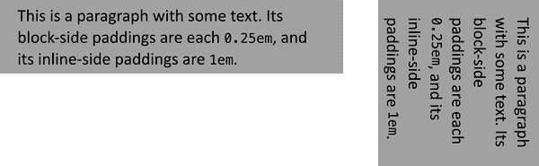

# 第七章：填充、边框、轮廓和边距

在 第六章 中，我们讨论了元素显示的基础知识。在本章中，我们将看看你可以使用的 CSS 属性和值，以影响如何绘制元素框并使其相互分离。这些属性包括围绕元素的填充、边框和外边距，以及可能添加的任何轮廓。

# 基本元素框

如前一章所述，所有文档元素生成称为*元素框*的矩形框，描述元素在文档布局中占用的空间量。因此，每个框影响其他元素框的位置和大小。例如，如果文档中的第一个元素框高 1 英寸，那么下一个框将至少从文档顶部向下移动 1 英寸。如果将第一个元素框更改为高 2 英寸，每个后续元素框将向下移动 1 英寸，并且第二个元素框将至少从文档顶部向下移动 2 英寸。

默认情况下，视觉渲染的文档由许多不重叠的矩形框组成。如果手动定位或放置在网格上，框可以重叠，如果在正常流元素上使用负边距，可能会发生视觉重叠。

要理解外边距、填充和边框的处理方式，必须了解*盒子模型*，见 图 7-1。


###### 图 7-1。CSS 盒子模型

图中的 图 7-1 故意省略了轮廓，原因在我们讨论轮廓时会清楚。

###### 注意

内容区域的高度和宽度，以及块和行内方向上内容区域的尺寸，详见 第六章。如果您因高度、宽度、块轴和行内轴的讨论方式而觉得本章的其余部分有些困惑，请参考该章节进行详细解释。

# 填充

在元素的内容区域之外，我们发现其*填充*，位于内容和任何边框之间。设置填充的最简单方法是使用属性 `padding`。

此属性接受任何长度值或百分比值。因此，如果您希望所有 `<h2>` 元素的四周都有 2 em 的填充，那就很容易实现（参见 图 7-2）：

```
h2 {padding: 2em; background-color: silver;}
```


###### 图 7-2。向元素添加填充

如 图 7-2 所示，默认情况下，元素的背景延伸到填充区域。如果背景是透明的，则设置填充会在元素内容周围创建额外的透明空间，但任何可见的背景都会延伸到填充区域（以及更远，正如稍后的部分所述）。

###### 注意

可以通过使用属性 `background-clip` （参见 第八章）防止可见背景扩展到填充区域。

默认情况下，元素没有填充。例如，段落之间的分隔通常仅通过边距来实现（稍后您将看到）。另一方面，如果没有填充，元素的边框将非常接近元素本身的内容。因此，在给元素加边框时，通常也建议添加一些填充，就像 图 7-3 所示。


###### 图 7-3\. 填充对有边框的块级元素的影响

任何长度值都是允许的，从 em 到英寸。设置填充的最简单方法是使用单个长度值，该值等量应用于四个填充边。但是，有时您可能希望元素的每一边具有不同的填充量。如果您希望所有 `<h1>` 元素顶部填充为 10 像素，右侧填充为 20 像素，底部填充为 15 像素，左侧填充为 5 像素，您只需这样说：

```
h1 {padding: 10px 20px 15px 5px;}
```

值的顺序很重要，并遵循此模式：

```
padding: *`top` `right` `bottom` `left`*

```

记住此模式的一个好方法是牢记四个值顺时针围绕元素，从顶部开始。填充值总是按照这个顺序应用，因此为了获得想要的效果，您必须正确排列这些值。

记住边的正确顺序的一种简单方法，除了将其视为从顶部顺时针进行，还有助于避免“TRouBLe”——即 *TRBL*，即 *top, right, bottom, left*。

此排序显示，像 `padding` 一样，像 `height` 和 `width` 一样，是一个物理属性：它指的是页面的物理方向，例如顶部或左侧，而不是基于书写方向。 （CSS 确实有书写模式填充属性，稍后您将看到。）

完全可以混合使用所使用的长度类型。在给定规则中，您不必局限于使用单个长度类型，而是可以根据元素的每一侧适当使用任何类型，如下所示：

```
h2 {padding: 14px 5em 0.1in 3ex;} /* value variety! */
```

图 7-4 显示了此声明的结果，附带一些额外的注释。


###### 图 7-4\. 混合值填充

## 复制值

有时您输入的值可能会有点重复：

```
p {padding: 0.25em 1em 0.25em 1em;}  /* TRBL - Top Right Bottom Left */
```

不过，您无需像这样一对一对地输入数字。与前述规则不同，尝试这样做：

```
p {padding: 0.25em 1em;}
```

这两个值足以代替四个。但是如何实现呢？CSS 定义了一些规则来适应 `padding` （以及许多其他简写属性）少于四个值的情况：

+   如果 *left* 的值缺失，则使用为 *right* 提供的值。

+   如果 *bottom* 的值也缺失，则使用为 *top* 提供的值。

+   如果 *右边* 的值也缺失，则使用提供给 *顶部* 的值。

如果你更喜欢更视觉化的方法，请看图 7-5。


###### 图 7-5\. 值复制模式

换句话说，如果给定 `padding` 的三个值，第四个（*左边*）将从第二个（*右边*）复制。如果给定两个值，则第四个将从第二个复制，第三个（*底部*）从第一个（*顶部*）复制。最后，如果只给定一个值，则所有其他边将复制该值。

此机制允许你只提供必要的数值，如下所示：

```
h1 {padding: 0.25em 0 0.5em;} /* same as '0.25em 0 0.5em 0' */
h2 {padding: 0.15em 0.2em;}   /* same as '0.15em 0.2em 0.15em 0.2em' */
p {padding: 0.5em 10px;}      /* same as '0.5em 10px 0.5em 10px' */
p.close {padding: 0.1em;}     /* same as '0.1em 0.1em 0.1em 0.1em' */
```

该方法有一个小缺点，你最终肯定会遇到。假设你想要为 `<h1>` 元素设置顶部和左侧内边距为 10 像素，底部和右侧内边距为 20 像素。你需要写如下内容：

```
h1 {padding: 10px 20px 20px 10px;} /* can't be any shorter */
```

你能得到想要的效果，但是要把所有内容都理解清楚需要一些时间。不幸的是，在这种情况下没有办法减少所需数值的数量。让我们再举一个例子，假设你希望所有的内边距都是 0 —— 除了左内边距应为 3 em：

```
h2 {padding: 0 0 0 3em;}
```

使用内边距来分隔元素的内容区域可能比使用传统的外边距更棘手，尽管它并非没有其奖励。例如，要使用内边距保持段落之间传统的“一个空行”的间距，你需要写成这样：

```
p {margin: 0; padding: 0.5em 0;}
```

每个段落的半个字母的上下内边距靠在一起，并总计形成一个分隔。你为什么要这样做？因为这样你可以在段落之间插入分隔线，侧边框将接触以形成实线外观。以下代码定义了这些效果，如图 7-6 所示：

```
p {margin: 0; padding: 0.5em 0; border-bottom: 1px solid gray;
    border-left: 3px double black;}
```


###### 图 7-6\. 使用内边距而不是外边距

## 单边内边距

CSS 提供了一种方法来为元素的单个边设置内边距的值。实际上有四种方式。假设你想要将 `<h2>` 元素的左内边距设置为 `3em`。与其写出 `padding: 0 0 0 3em`，你可以采用这种方法：

```
h2 {padding-left: 3em;}
```

`padding-left` 选项是四个专门用于设置元素盒子四个边的内边距属性之一。它们的名称可能并不让人感到意外。

这些属性按照它们的名称的方式运作。例如，以下两条规则将产生相同量的内边距（假设没有其他 CSS）：

```
h1 {padding: 0 0 0 0.25in;}
h2 {padding-left: 0.25in;}
```

类似地，这些规则将创建相等的内边距：

```
h1 {padding: 0.25in 0 0;}  /* left padding is copied from right padding */
h2 {padding-top: 0.25in;}
```

对于这个问题，这些规则同样适用：

```
h1 {padding: 0 0.25in;}
h2 {padding-right: 0.25in; padding-left: 0.25in;}
```

可以在单个规则中使用多个这些单边属性之一；例如：

```
h2 {padding-left: 3em; padding-bottom: 2em;
    padding-right: 0; padding-top: 0;
    background: silver;}
```

正如你在图 7-7 中所见，内边距被设置成我们想要的样子。在这种情况下，使用 `padding` 可能更容易，像这样：

```
h2 {padding: 0 0 2em 3em;}
```


###### 图 7-7\. 多个单边内边距

通常情况下，一旦您试图为多个边缘设置填充，使用速记 `padding` 更容易。但是从文档显示的角度来看，无论使用哪种方法都无关紧要，所以选择最简单的方法。

## 逻辑填充

正如本章节所示，物理属性有逻辑对应物，名称遵循一致的模式。对于 `height` 和 `width`，我们有 `block-size` 和 `inline-size`。对于填充，我们有一组四个属性，对应于块方向和内联方向的起始填充和结束填充。它们被称为 *逻辑属性*，因为它们使用一些逻辑来确定应该应用到哪个物理边。

当您希望确保文本具有填充时，无论书写方向如何，这些属性都非常方便。例如，您可能希望稍微填充以使背景边缘远离每个块元素的起始和结束，并在每行文本的侧边填充更多。以下是实现此目的的一种方法，其结果显示在 图 7-8 中：

```
p {
     padding-block-start: 0.25em;
     padding-block-end: 0.25em;
     padding-inline-start: 1em;
     padding-inline-end: 1em;
}
```



###### 图 7-8\. 逻辑填充

###### 警告

这些逻辑填充属性的百分比值始终相对于元素容器的 *物理* 宽度或高度进行计算，而不是其逻辑宽度或高度。因此，例如，当容器具有 `width: 1000px` 时，`padding-inline-start: 10%` 将计算为 100 像素，即使在垂直书写模式下也是如此。这可能会有所变化，但这是截至 2022 年末的一致（和规定）行为。

为单独元素的每个边缘显式声明填充值有点繁琐，两个速记属性可以帮助：一个用于块轴，另一个用于内联轴。

使用这些速记属性，您可以一次性设置块填充，另一次性设置内联填充。以下 CSS 与 “逻辑填充” 所示的效果相同：

```
p {
     padding-block: 0.25em;
     padding-inline: 1em;
}
```

每个属性都接受一个或两个值。如果有两个值，它们总是按 *start end* 的顺序。如果只有一个值，如前所示，那么将同一个值用于起始和结束的两个边缘。因此，要为元素设置 10 像素的块起始填充和 1 em 的块结束填充，可以这样写：

```
p {
     padding-block: 10px 1em;
}
```

不幸的是，逻辑填充没有更紧凑的速记形式——没有像 `padding` 那样接受四个值的 `padding-logical`。有关扩展 `padding` 属性以允许设置逻辑填充而不是物理填充的提案已被提出，但截至 2022 年末，这些提案尚未被采纳。截至本文撰写时，您能得到的最紧凑的逻辑填充是使用 `padding-block` 和 `padding-inline`。

## 百分比值和填充

我们可以为元素的填充设置百分比值。百分比是相对于父元素内容区域的宽度计算的，因此如果父元素的宽度以某种方式更改，则百分比也会更改。

例如，假设以下情况，如图 7-9 所示：

```
p {padding: 10%; background-color: silver;}
```

```
<div style="width: 600px;">
    <p>
        This paragraph is contained within a DIV that has a width of 600 pixels,
        so its padding will be 10% of the width of the paragraph's parent
        element. Given the declared width of 600 pixels, the padding will be 60
        pixels on all sides.
    </p>
</div>
<div style="width: 300px;">
    <p>
        This paragraph is contained within a DIV with a width of 300 pixels,
        so its padding will still be 10% of the width of the paragraph's parent.
        There will, therefore, be half as much padding on this paragraph as
        on the first paragraph.
    </p>
</div>
```


###### 图 7-9\. 填充、百分比和父元素的宽度

您可能已经注意到图 7-9 中段落的一些奇怪之处。它们的侧面填充不仅根据其父元素的宽度改变，顶部和底部填充也是如此。这是 CSS 中期望的行为。回顾属性定义，您会发现百分比值定义为相对于父元素的*宽度*。这也适用于顶部和底部填充以及左右填充。因此，给定以下样式和标记，段落的顶部填充将为 50 像素：

```
div p {padding-top: 10%;}
```

```
<div style="width: 500px;">
    <p>
        This is a paragraph, and its top margin is 10% the width of its parent
        element.
    </p>
</div>
```

如果所有这些看起来很奇怪，请考虑正常流中的大多数元素（正如我们所假设的那样）与包含其后代元素（包括填充）所需的高度一样高。如果一个元素的顶部和底部填充是父元素高度的百分比，则可能会导致无限循环，其中父元素的高度增加以容纳顶部和底部填充，然后必须增加以匹配新的高度，依此类推。

与忽略顶部和底部填充的百分比不同，规范的作者决定将其与父元素的内容区域宽度相关联，这不会根据其后代的宽度改变。这允许作者通过在所有四个边上使用相同的百分比来获得元素周围一致的填充。

相比之下，考虑没有声明宽度的元素。在这种情况下，元素框（包括填充）的整体宽度取决于父元素的宽度。这导致了*流式*页面的可能性，其中元素的填充根据父元素的实际大小放大或缩小。如果您设计一个文档，使其元素使用百分比填充，则当用户更改浏览器窗口的宽度时，填充将展开或收缩以适应。设计选择取决于您。

你也可以混合百分比和长度值。因此，要将`<h2>`元素的顶部和底部填充设定为半个 em，并将侧面填充设定为其父元素宽度的 10%，您可以声明如下，如图 7-10 所示：

```
h2 {padding: 0.5em 10%;}
```


###### 图 7-10\. 混合填充

在这里，尽管顶部和底部填充在任何情况下保持不变，但侧面填充将根据父元素的宽度而改变。

## 填充和内联元素

到目前为止，您可能已经注意到，讨论仅限于生成块级盒子的元素设置的填充。当填充应用于行内非替换元素时，效果略有不同。

假设您希望在强调的文本上设置顶部和底部填充：

```
strong {padding-top: 25px; padding-bottom: 50px;}
```

这在规范中是允许的，但是因为您将填充应用于行内非替换元素，所以对行高没有任何影响。当没有可见背景时，填充是透明的，因此前述声明在视觉上不会产生任何效果。这是因为行内非替换元素上的填充不会改变元素的行高。

要小心：带有背景颜色和填充的行内非替换元素可能会使背景在元素之上和之下延伸，如下所示：

```
strong {padding-top: 0.5em; background-color: silver;}
```

图 7-11 让您对可能的外观有了一个初步了解。


###### 图 7-11\. 行内非替换元素的顶部填充

行高不会改变，但由于背景颜色确实延伸到填充区域，每行的背景最终会重叠在之前的行上。这是预期的结果。

前述行为仅适用于行内非替换元素的顶部和底部；左侧和右侧则另当别论。我们将首先考虑单行内的小型行内非替换元素的情况。在这种情况下，如果您设置了左或右填充的值，它们将是可见的，就像图 7-12 明确表明的那样：

```
strong {padding-left: 25px; background: silver;}
```


###### 图 7-12\. 带有左填充的行内非替换元素

注意单词结束前的行内非替换元素和行内元素背景边缘之间的额外空间。如果需要，您可以在行内两端都添加这额外的空间：

```
strong {padding-left: 25px; padding-right: 25px; background: silver;}
```

正如预期的那样，图 7-13 显示了行内元素右侧和左侧有少许额外空间，上下没有额外空间。


###### 图 7-13\. 带有 25 像素边填充的行内非替换元素

现在，当行内非替换元素跨多行时，情况会有所变化。图 7-14 展示了行内非替换元素带填充在跨多行时的情况：

```
strong {padding: 0 25px; background: silver;}
```

左填充应用于元素的开头，右填充应用于元素的结尾。默认情况下，填充不会应用于每行的右侧和左侧。此外，您可以看到，如果没有填充，该行可能会在“background”后面而不是当前位置断开。`padding` 属性只通过改变元素内容在行内开始的位置来影响换行点。


###### 图 7-14\. 一个具有 25 像素侧填充的内联非替换元素跨两行文本显示

###### 注意

可以通过属性`box-decoration-break`来改变每行框的结尾是否应用填充（或不应用填充）。更多细节请参见第六章。

## 填充和替换元素

替换元素也可以应用填充。对大多数人来说，最令人惊讶的情况是可以为图像应用填充，如下所示：

```
img {background: silver; padding: 1em;}
```

无论替换元素是块级还是内联，填充都会围绕其内容，并且背景颜色将填充到该填充区域，如图 7-15 所示。你还可以看到填充会将替换元素的边框（在本例中为虚线）从其内容推开。


###### 图 7-15\. 替换元素上的填充、边框和背景

现在，记住关于内联非替换元素的填充不影响文本行高度的所有内容？对于*替换*元素，你可以把这些内容全部抛掉，因为它们有不同的规则。正如你在图 7-16 中看到的那样，内联替换元素的填充确实会影响行的高度。


###### 图 7-16\. 填充内联替换元素

边框和外边距也是如此，您很快就会看到。

注意，如果图 7-16 中的图像未加载，或者某种方式设置为高度和宽度为 0，填充仍然会呈现在应该显示该元素的位置周围，即使该位置没有高度或宽度。

###### 警告

截至 2022 年末，关于如何处理诸如`<input>`这样的表单元素的样式问题，如何处理仍存在不确定性。例如，复选框的填充位于何处并不完全清楚。因此，截至本文写作时，一些浏览器忽略了表单元素的填充（和其他形式的样式），而其他浏览器则尽其所能应用这些样式。

# 边框

超出元素填充的是其边框。元素的*边框*只是围绕内容和填充的一个或多个线条。默认情况下，元素的背景停止在外边框边缘处，因为背景不会延伸到外边距中，而边框刚好在外边距内部，因此被绘制“在”边框的下方。这在边框部分是透明的情况下很重要，例如虚线边框。

每个边框都有三个方面：它的宽度或厚度，它的样式或外观，以及它的颜色。边框的宽度的默认值是`medium`，在 2022 年明确声明为 3 像素宽。尽管如此，你通常看不到边框的原因是默认样式是`none`，它完全防止它们存在。（这种不存在还可以重设`border-width`的值，但我们稍后再讨论这个。）

最后，默认边框颜色是`currentcolor`，即元素本身的前景色。如果未为边框声明颜色，则它将与元素文本的颜色相同。另一方面，如果一个元素没有文本——比如说它只包含图像的表格——那么该表格的边框颜色将是其父元素的文本颜色（因为`color`是继承的）。因此，如果一个表格有边框，而`<body>`是它的父元素，根据这个规则

```
body {color: purple;}
```

然后，默认情况下，表格周围的边框将是紫色（假设用户代理未设置表格的颜色）。

CSS 规范将元素的背景区域定义为默认情况下延伸到边框的外缘。这很重要，因为一些边框是*间歇性*的——例如，`dotted`和`dashed`边框——因此，元素的背景应出现在边框可见部分之间的空白处。

###### 注意

可以通过使用属性`background-clip`来防止可见背景扩展到边框区域。详细信息请参见第八章。

## 带样式的边框

我们将从边框样式开始，这是边框的最重要的方面——不是因为它们控制边框的外观（尽管它们确实如此），而是因为没有样式，就根本没有边框。

CSS 为属性`border-style`定义了 10 种不同的样式，包括默认值`none`。图 7-17 展示了这些样式。此属性不被继承。

样式值`hidden`等同于`none`，但当应用于表格时，对边框冲突解决有稍微不同的影响。


###### 图 7-17\. 边框样式

至于`double`，它被定义为两条线加上它们之间的空间的宽度等于`border-width`的值（在下一节讨论）。然而，CSS 规范没有指定其中一条线应该比另一条线更粗，或者它们应该始终具有相同的宽度，或者空间应该比线条更粗或更细。所有这些选项都由用户代理决定，作者无法可靠地影响最终结果。

所有在图 7-17 中显示的边框都基于 `gray` 的 `color` 值，这使所有视觉效果更容易看到。边框样式如 `inset`、`outset`、`groove` 和 `ridge` 的外观总是以某种方式基于边框的颜色，尽管具体方法可能在用户代理之间有所不同。浏览器如何处理边框样式中的颜色可以并且确实有所不同。例如，图 7-18 展示了浏览器可能渲染内嵌边框的两种方式。


###### 图 7-18\. 渲染内嵌框的两种有效方式

在这个示例中，一个浏览器将 `gray` 值用于底部和右侧，顶部和左侧使用更深的灰色；另一个浏览器则使底部和右侧比 `gray` 更轻，而顶部和左侧更暗，但不及第一个浏览器那么深。

现在让我们为任何未访问的超链接内的图像定义一个边框样式。我们可能会将它们设为 `outset`，这样它们看起来像是一个“凸起的按钮”，如图 7-19 所示：

```
a:link img {border-style: outset;}
```


###### 图 7-19\. 对超链接图像应用突出边框

默认情况下，边框的颜色基于元素对 `color` 的值，在这种情况下，可能是 `blue`。这是因为图像包含在超链接中，超链接的前景色通常是 `blue`。如果你愿意，你可以将该颜色更改为 `silver`，就像这样：

```
a:link img {border-style: outset; color: silver;}
```

现在，边框将基于淡灰色的 `silver`，因为这是图像的前景色，即使图像实际上没有使用它，但它仍然传递给了边框。我们将在“边框颜色”中讨论另一种更改边框颜色的方法。

请记住，边框中的颜色变化是由用户代理决定的。让我们回到蓝色的突出边框，并在两个浏览器中进行比较，如图 7-20 所示。

再次注意到，一个浏览器会将颜色变浅或变深，而另一个浏览器只会使“阴影”边变暗，但不如第一个浏览器那么深。这就是为什么，如果需要特定的颜色集，作者通常会设置他们想要的确切颜色，而不是使用 `outset` 等边框样式并将结果留给浏览器。很快你会看到如何做到这一点。


###### 图 7-20\. 两个突出边框

### 多种样式

我们可以为给定边框定义多种样式。例如：

```
p.aside {border-style: solid dashed dotted solid;}
```

结果是一个段落，顶部边框是实线，右边边框是虚线，底部边框是点线，左边边框是实线。

再次看到了 TRBL 顺序的值，就像我们在设置多个值的 `padding` 时讨论过的那样。关于值复制的所有规则都适用于边框样式，就像它们适用于 `padding` 一样。因此，以下两个语句将产生相同的效果，如图 7-21 所示：

```
p.new1 {border-style: solid none dashed;}
p.new2 {border-style: solid none dashed none;}
```


###### 图 7-21\. 等效样式规则

### 单边样式

有时您可能希望仅为元素框的一个边设置边框样式，而不是四个边都设置。这就是单边边框样式属性发挥作用的地方。

单边边框样式属性相当易于理解。例如，如果您想要更改底部边框的样式，可以使用`border-bottom-style`。

见到`border`与单边属性结合使用并不罕见。假设您希望在标题的三个边上设置实线边框，但左边没有边框，如图 7-22 所示。


###### 图 7-22\. 去除左边框

您可以通过两种方式来完成此操作，每种方式都与另一种等效：

```
h1 {border-style: solid solid solid none;}
/* the above is the same as the below */
h1 {border-style: solid; border-left-style: none;}
```

重要的是要记住，如果您要使用第二种方法，您必须在缩写之后放置单边属性*之后*，通常情况下是这样。这是因为`border-style: solid`实际上是声明`border-style: solid solid solid solid`。如果您将`border-style-left: none`放在`border-style`声明之前，那么缩写的值将覆盖`none`的单边值。

### 逻辑样式

如果您希望边框的样式与其在书写模式流中的位置有关，而不是固定在物理方向上，那么以下是适合您的边框样式属性。

与`padding-block`和`padding-inline`一样，`border-block-style`和`border-inline-style`每个接受一个或两个值。如果给定两个值，则按*start end*的顺序取值。给定以下 CSS，您将得到类似于图 7-23 所示的结果：

```
p {border-block-style: solid double; border-inline-style: dashed dotted;}
```


###### 图 7-23\. 逻辑边框样式

您可以以以下更冗长的方式获得相同的结果：

```
p {
     border-block-start-style: solid;
     border-block-end-style: double;
     border-inline-start-style: dashed;
     border-inline-end-style: dotted;
}
```

这两种模式之间唯一的区别在于您需要输入的字符数，因此实际上，您可以自行选择使用哪种模式。

## 边框宽度

一旦您为边框分配了样式，下一步就是为其赋予一些宽度，最简单的方法是使用属性`border-width`或其兄弟属性之一。

每个这些属性用于设置特定边框边的宽度，就像与边距属性一样。

###### 注意

截至 2023 年初，边框宽度*仍然*不能以百分比值给出，这实在有些遗憾。

有四种方法可以为边框分配宽度：您可以给它一个长度值，例如`4px`或`0.1em`，或者使用三个关键字中的一个。这些关键字是`thin`、`medium`（默认值）和`thick`。根据规范，`thick`是 5px，比`medium`的 3px 宽，比 1px 的`thin`更宽——这是有道理的。

图 7-24 展示了这三个关键词以及它们如何相互关联以及与它们所围绕的内容之间的关系。


###### 图 7-24\. 边框宽度关键词之间的关系

假设一个段落有背景颜色和边框样式设置：

```
p {background-color: silver;
    border-style: solid;}
```

默认情况下，边框的宽度是`medium`。我们可以很容易地改变它：

```
p {background-color: silver;
    border-style: solid; border-width: thick;}
```

边框宽度可以被设置为非常夸张的极端值，比如设置 1000 像素的边框，尽管这很少是必要的（或明智的）。重要的是要记住，边框和因此`border-width`的值参与框模型，影响元素的大小。

可以使用两种熟悉的方法为各个边设置宽度。第一种方法是使用本节开头提到的特定属性之一，例如`border-bottom-width`。另一种方法是在`border-width`中使用值复制，遵循通常的 TRBL 模式，这在图 7-25 中有说明：

```
h1 {border-style: dotted; border-width: thin 0px;}
p {border-style: solid; border-width: 15px 2px 8px 5px;}
```


###### 图 7-25。值复制和不均匀边框宽度

### 逻辑边框宽度

话虽如此，如果希望根据书写方向设置边框宽度，可以使用与物理属性配对的逻辑对应项。

正如你看到的边框宽度，它们可以单独设置每一边，也可以压缩成`border-block-width`和`border-inline-width`属性。以下两条规则将产生完全相同的效果：

```
p {
     border-block-width: thick thin;
     border-inline-width: 1em 5px;
}
p {
     border-inline-start-width: 1em;
     border-inline-end-width: 5px;
     border-block-start-width: thick;
     border-block-end-width: thin;
}
```

### 没有任何边框

到目前为止，我们只讨论了使用可见的边框样式，比如`solid`或`outset`。让我们考虑一下当你将`border-style`设置为`none`时会发生什么：

```
p {border-style: none; border-width: 20px;}
```

尽管边框的宽度是`20px`，但样式被设置为`none`。在这种情况下，不仅边框的样式消失了，它的宽度也消失了。边框就这样不存在了。为什么？

正如您可能还记得的那样，在本章早些时候使用的术语表明，样式为`none`的边框*不存在*。这些话语被非常谨慎地选择，因为它们有助于解释这里发生的情况。由于边框不存在，它就不能有任何宽度，所以无论你如何定义，宽度都自动设置为`0`（零）。

毕竟，如果一个饮用杯是空的，你无法真正描述它是半满无物的。只有在杯子里真的有内容时，才能讨论杯子内容的深度。同样地，只有在边框存在的情况下，才有讨论边框宽度的意义。

这很重要要记住，因为忘记声明边框样式是一个常见的错误。这会导致开发者各种沮丧，因为乍一看，样式看起来是正确的。不过，根据以下规则，没有任何`<h1>`元素会有任何类型的边框，更不用说宽度为 20 像素的边框了：

```
h1 {border-width: 20px;}
```

由于`border-style`的默认值是`none`，不声明样式与声明`border-style: none`完全相同。因此，如果要显示边框，必须声明边框样式。

## 边框颜色

与边框的其他方面相比，设置颜色非常容易。CSS 使用物理简写属性`border-color`，可以一次接受多达四个颜色值。（请参见“颜色”以了解颜色的有效值格式。）

如果提供的值少于四个，则通常会进行值复制。因此，如果希望`<h1>`元素具有上下边框为细灰色，侧边框为粗绿色，并且`<p>`元素周围具有中灰色边框，以下样式就足够了，并显示在图 7-26 中：

```
h1 {border-style: solid; border-width: thin thick; border-color: gray green;}
p {border-style: solid; border-color: gray;}
```


###### 图 7-26\. 边框有多个方面

一个单一的`color`值将应用于四个边框，就像前面示例中的段落一样。另一方面，如果提供四个颜色值，可以使每个边框颜色不同。可以使用任何类型的颜色值，从命名颜色到十六进制和 HSL 值：

```
p {border-style: solid; border-width: thick;
    border-color: black hsl(0 0% 25% / 0.5) #808080 silver;}
```

如果不声明颜色，默认为`currentcolor`，即元素的前景色。因此，以下声明将按图 7-27 所示显示：

```
p.shade1 {border-style: solid; border-width: thick; color: gray;}
p.shade2 {border-style: solid; border-width: thick; color: gray;
    border-color: black;}
```


###### 图 7-27\. 边框颜色基于元素的前景和`border-color`属性的值

结果是第一个段落具有灰色边框，因为使用了段落的前景色。然而，第二个段落具有黑色边框，因为使用了`border-color`显式指定的颜色。

物理单边边框颜色属性也存在。它们的工作方式与边框样式和宽度的单边属性类似。一种为标题添加实线黑色边框和实线灰色右边框的方法如下：

```
h1 {border-style: solid; border-color: black; border-right-color: gray;}
```

### 逻辑边框颜色

与边框样式和宽度一样，逻辑属性会覆盖物理属性：两个简写，四个长手写。

因此，以下两条规则将产生完全相同的结果：

```
p {
     border-block-color: black green;
     border-inline-color: orange blue;
}
p {
     border-inline-start-width: orange;
     border-inline-end-width: blue;
     border-block-start-width: black;
     border-block-end-width: green;
}
```

### 透明边框

正如您可能还记得的那样，如果边框没有样式，则没有宽度。然而，在某些情况下，您可能希望创建一个看起来没有边框但实际上有宽度的边框。这就是`transparent`边框颜色值的用武之地。

假设我们希望一组三个链接在默认情况下具有不可见的边框，但当链接悬停时，边框看起来是凹陷的。我们可以通过在非悬停情况下将边框设为透明来实现这一点：

```
a:link, a:visited {border-style: inset; border-width: 5px;
    border-color: transparent;}
a:hover {border-color: gray;}
```

这将产生图 7-28 中显示的效果。

在某种意义上，`transparent`使您可以像使用额外的填充一样使用边框。如果要使它们可见，空间会被保留，防止在添加可见边框时内容重新排列。


###### 图 7-28\. 使用透明边框

## 单边简写边框属性

缩写属性（例如`border-color`和`border-style`）并不总是像你想象的那样有用。例如，你可能希望将厚、灰色、实线边框应用于所有`<h1>`元素，但仅限于底部。如果仅使用到目前为止讨论过的属性，将会很难实现这样的边框效果。以下是两个示例：

```
h1 {border-bottom-width: thick;  /* option #1 */
    border-bottom-style: solid;
    border-bottom-color: gray;}
h1 {border-width: 0 0 thick;    /* option #2 */
    border-style: none none solid;
    border-color: gray;}
```

鉴于涉及到的所有输入，这两者都不是很方便。幸运的是，有更好的解决方案可用：

```
h1 {border-bottom: thick solid rgb(50% 40% 75%);}
```

这将仅将值应用于底部边框，如图 7-29 所示，其他边框将保持默认状态。由于默认的边框样式是`none`，所以元素的其他三个边框不会显示出来。


###### Figure 7-29\. 使用缩写属性设置底部边框

正如你可能已经猜到的那样，CSS 具有四个物理缩写属性和四个逻辑缩写属性。

我们可以利用这些属性创建一些复杂的边框，例如图 7-30 中显示的那些：

```
h1 {border-left: 3px solid gray;
    border-right: green 0.25em dotted;
    border-top: thick goldenrod inset;
    border-bottom: double rgb(13% 33% 53%) 10px;}
```


###### Figure 7-30\. 非常复杂的边框

如你所见，实际值的顺序并不重要。以下三条规则将产生完全相同的边框效果：

```
h1 {border-bottom: 3px solid gray;}
h2 {border-bottom: solid gray 3px;}
h3 {border-bottom: 3px gray solid;}
```

你也可以省略一些值，让它们的默认值生效，如下所示：

```
h3 {color: gray; border-bottom: 3px solid;}
```

由于未声明边框颜色，所以默认值（`currentcolor`）会被应用。请记住，如果省略了边框样式，那么`none`的默认值将导致你的边框不存在。

相反，如果仅设置样式，你仍然会得到一个边框。假设你想要一个`dashed`的顶部边框样式，并且愿意让宽度默认为`medium`，颜色与元素文本的颜色相同。在这种情况下，只需以下标记（如图 7-31 所示）：

```
p.roof {border-top: dashed;}
```


###### Figure 7-31\. Dashing across the top of an element

还要注意的是，由于每个边框边属性仅适用于特定的一侧，所以不存在值复制的可能性——这是毫无意义的。每种类型的值只能有一个：即只有一个宽度值，只有一个颜色值，以及只有一个边框样式。因此，不要尝试声明多个值类型：

```
h3 {border-top: thin thick solid purple;} /* two width values--WRONG */
```

整个声明都是无效的，用户代理会忽略它。

## 全局边框

现在，我们来讨论最简短的缩写边框属性：`border`，它会对元素的四个边框均产生影响。

这种属性的优势在于非常紧凑，尽管这种简洁性会引入一些限制。在我们担心这些之前，让我们看看`border`是如何工作的。如果你希望所有`<h1>`元素都有厚厚的银色边框，下面的声明将显示如图 7-32 所示：

```
h1 {border: thick silver solid;}
```


###### Figure 7-32\. 一个非常简短的边框声明

使用`border`的缺点在于你只能定义单一的全局样式、宽度和颜色。你为`border`提供的值会对所有四个边都生效。如果你希望某个边有不同的边框样式，请使用其他的边框属性。然而，再次利用级联特性也是可能的：

```
h1 {border: thick goldenrod solid;
    border-left-width: 20px;}
```

第二条规则将第一条规则分配的左边框宽度值`thick`覆盖为`20px`，如你在图 7-33 中所见。


###### 图 7-33\. 利用级联优势

你仍然需要谨慎处理简写属性：如果你省略了一个值，系统将自动填充默认值，这可能会产生意想不到的效果。考虑以下情况：

```
h4 {border: medium green;}
```

在这里，我们未能分配`border-style`，这意味着将使用默认值`none`，因此没有任何`<h4>`元素会有边框。

## 边框与内联元素

处理边框和内联元素应该听起来非常熟悉，因为规则与我们之前讨论的填充和内联元素的规则基本相同。尽管如此，我们还是会简要地再次触及这个话题。

首先，无论你在内联元素上有多厚的边框，元素的行高都不会改变。让我们在加粗文本上设置块起始和块结束的边框：

```
strong {border-block-start: 10px solid hsl(216,50%,50%);
        border-block-end: 5px solid #AEA010;}
```

如前所述，在块的起始和结束添加边框对行高没有任何影响。然而，由于边框是可见的，它们会被绘制出来，如在图 7-34 所示。


###### 图 7-34\. 内联非替换元素上的边框

边框必须有一个位置。这就是它们所在的位置。如果需要，它们会被绘制在前一行文本的上方，并在下一行文本的下方。

同样，这一切只适用于内联元素的块起始和块结束两侧；内联两侧则不同。如果你在内联一侧应用边框，它们不仅会可见，还会使周围的文本产生位移，就像你在图 7-35 中看到的那样。

```
strong {border-inline-start: 25px double hsl(216 50% 50%); background: silver;}
```


###### 图 7-35\. 内联非替换元素具有内联起始边框

与填充一样，边框对于浏览器在处理行断开时的计算没有直接影响。唯一的影响是边框所占用的空间可能会稍微移动行的某些部分，这可能会改变行尾的单词。

###### 注意

边框的绘制方式（或不绘制方式）在每个行框的结束处可以通过`box-decoration-break`属性进行修改。详细信息请参见第 6 章。

另一方面，对于像图像这样的替换元素，效果与填充类似：边框*会*影响文本行的高度，并将文本向两侧移动。因此，假设以下样式，我们得到类似于图 7-36 中看到的结果：

```
img {border: 1em solid rgb(216,108,54);}
```


###### 图 7-36\. 行内替换元素上的边框

## 圆角边框

我们可以通过使用属性`border-radius`来定义圆角距离（或两个），软化元素边框的方形角和整个背景区域。在这种特定情况下，我们将从简写物理属性开始，然后在本节末尾提到各个物理属性，之后我们将检查逻辑等效项。

圆角边框角的半径是圆形或椭圆的半径，四分之一用于定义边框的曲线路径。我们将从圆形开始，因为它们稍微容易理解。

假设我们想要使元素的角显然是圆角。以下是一种方法：

```
#example {border-radius: 2em;}
```

结果显示在图 7-37，其中圆形图表已添加到两个角落（所有四个角落都采用相同的四舍五入）。


###### 图 7-37\. 边框半径如何计算

聚焦于左上角。在那里，边框开始曲线，在边框顶部以下 2 em 处，距左侧边框 2 em 处开始。曲线沿着 2 em 半径圆的外侧进行。

如果我们绘制一个仅包含曲线部分的左上角的框，那个框将是 2 em 宽和 2 em 高。底部右边角也是如此。

使用单一长度值，我们得到圆形的角度形状。如果使用单一百分比，结果则更椭圆。例如，考虑以下内容，图 7-38 中有所说明：

```
#example {border-radius: 33%;}
```


###### 图 7-38\. 百分比边框半径如何计算

再次聚焦于左上角。在左边缘上，边框曲线从元素框顶部到底部的高度的 33%处开始。换句话说，如果元素框从顶部边框到底部边框的高度为 100 像素，则曲线将从元素框顶部 33 像素处开始。

同样地，在顶部边缘上，曲线从元素框左边缘的宽度的 33%处开始。因此，如果框宽（比如）为 600 像素，曲线将从左边缘开始的 198 像素处开始，因为 600 × 0.33 = 198。

在这两点之间的曲线形状与水平半径为 198 像素、垂直半径为 33 像素的椭圆的左上边缘相同。（这与水平轴为 396 像素、垂直轴为 66 像素的椭圆相同。）

在每个角落都做同样的事情，形成一组相互镜像而非相同的角形状。

对 `border-radius` 提供单个长度或百分比值意味着所有四个角都会具有相同的圆角形状。正如你可能在语法定义中看到的那样，你可以为 `border-radius` 提供最多四个值。因为 `border-radius` 是一个物理属性，这些值按顺时针顺序从左上到左下排列，如下所示：

```
#example {border-radius:
     1em  /* Top Left */
     2em  /* Top Right */
     3em  /* Bottom Right */
     4em; /* Bottom Left */
}
```

TL-TR-BR-BL 这个顺序可以用“TiLTeR BuRBLe”来记忆，如果你倾向于这样的东西的话。重要的是，圆角从左上角开始，顺时针方向开始。

如果省略一个值，则使用类似于 `padding` 的模式填充缺失的值，依此类推。如果有三个值，第四个值从第二个值复制。如果有两个值，则第三个值从第一个值复制，第四个值从第二个值复制。如果只有一个值，则缺少的三个值从第一个值复制。因此，以下两条规则是相同的，并将产生 图 7-39 中显示的结果：

```
#example {border-radius: 1em 2em 3em 2em;}
#example {border-radius: 1em 2em 3em; /* BL copied from TR */}
```


###### 图 7-39\. 不同圆角的变化

图 7-39 有一个重要的方面：内容区域背景的圆角化与其他背景一起。看看银色的曲线和句点在外面？当内容区域的背景与填充背景不同时（你将在 第 8 章 中看到如何做到这一点），并且圆角足够大以影响内容和填充之间的边界时，这是预期的行为。

因为 `border-radius` 改变了元素的边框和背景的绘制方式，但*不*改变元素框的形状。考虑一下 图 7-40 所描述的情况。


###### 图 7-40\. 圆角元素仍然是框

在这里，我们有一个浮动到左侧的元素，并且其他文本流经它。圆角边框完全圆形，使用 `border-radius: 50%` 在一个正方形元素上。一些文本从圆角边框外伸出。超出圆角边框后，页面背景可见，圆角 *本来* 应该在那里的地方。

一眼看去，你可能会认为该元素已经从盒子形状变成了圆形（技术上是椭圆），而文本恰好伸出来。但是看看流过浮动的文本。它并没有流入到圆角“留下的”区域。那是因为浮动元素的角落仍然存在。只是由于 `border-radius` 的存在，它们的边框和背景没有填充进去。

### 圆角夹紧

如果半径值太大，会溢出到其他角落会发生什么？例如，对于 `border-radius: 100%` 或者在元素上使用 `border-radius: 9999px`，而该元素远未达到 10000 像素的高度或宽度呢？

在任何这种情况下，圆角都会“夹紧”到元素的每个象限的最大可能值。确保按钮始终看起来像圆角形状可以通过以下方式实现：

```
.button {border-radius: 9999em;}
```

这将仅将元素最短的两端（通常是左右侧，但不能保证）封顶为平滑的半圆形。

### 更复杂的角落形状

现在你已经了解到如何将单个半径值分配给角落以形成它的形状，让我们讨论一下当角落获得两个值时会发生什么，更重要的是，它们如何获得这些值。

例如，假设我们希望将角落水平方向圆角化为 3 个字符单位，垂直方向为 1 个字符单位。我们不能简单地使用 `border-radius: 3ch 1ch`，因为这样会使得左上角和右下角分别圆角化为 `3ch`，而其他两个角则分别为 `1ch`。插入一个斜杠将会得到我们想要的效果：

```
#example {border-radius: 3ch / 1ch;}
```

这等效于以下表述：

```
#example {border-radius: 3ch 3ch 3ch 3ch / 1ch 1ch 1ch 1ch;}
```

这种语法的工作方式是，给出每个角落圆角化椭圆的水平半径，然后在斜杠后给出每个角落的垂直半径。在这两种情况下，值是按照 TiLTeR BuRBLe 的顺序给出的。

这是一个更简单的例子，如图 7-41 所示：

```
#example {border-radius: 1em / 2em;}
```


###### 图 7-41。椭圆形角落圆角化

每个角落沿水平轴为 1em，沿垂直轴为 2em 进行圆角化，这种方式你在前面的章节中已经详细看到了。

这是一个稍微复杂一点的版本，提供了斜杠两侧的两个长度，如图 7-42 所示：

```
#example {border-radius: 2.5em 2em / 1.5em 3em;}
```


###### 图 7-42。不同椭圆形圆角计算

在这种情况下，左上角和右下角沿水平轴曲度为 2.5em，沿垂直轴为 1.5em。而右上角和左下角则分别沿水平轴为 2em，沿垂直轴为 3em。

记住，在斜杠前使用水平值，斜杠后使用垂直值。例如，如果我们想让左上角和右下角的圆角水平方向为 1em，垂直方向也为 1em（即圆形的圆角），则数值应该写成这样：

```
#example {border-radius: 1em 2em / 1em 3em;}
```

百分比在这里也是适用的。如果我们希望将元素的角落圆角，使其侧面完全圆角，但仅水平延伸到元素的 2 个字符单位，我们会这样写：

```
#example {border-radius: 2ch / 50%;}
```

### 角落混合

到目前为止，我们圆角的角落都相当简单 —— 总是相同的宽度、样式和颜色。但情况并非总是如此。如果一个粗的红色实线边框圆角化成一个细的绿色虚线边框会发生什么？

规范指示，在涉及宽度从较粗的边框过渡到较细的边框时，边框的宽度应在圆角的曲线上逐渐收缩。

当涉及到不同的样式和颜色时，规范对如何实现这一点并不那么明确。请考虑图 7-43 中展示的各种样本。


###### 图 7-43\. 圆角近距离查看

第一个是简单的圆角，颜色、宽度或样式没有变化。第二个显示了从一种厚度到另一种厚度的圆角。你可以将第二种情况视为在外边缘定义一个圆形形状，在内边缘定义一个椭圆形状。

在第三种情况中，颜色和厚度保持不变，但是角落从左侧的实线样式到顶部的双线样式。样式之间的过渡突然，在曲线的中点发生。

第四个示例展示了从厚实线过渡到较细双线的情况。请注意过渡点的位置，这*不*是在中点。相反，它是通过取两个边框厚度的比率来确定的，并使用该比率找到过渡点。假设左边框厚度为 10 像素，顶部边框厚度为 5 像素。通过将两者相加得到 15 像素，左边框获得 2/3（10/15），顶部边框获得 1/3（5/15）。因此，左边框的样式在曲线的 2/3 处使用，顶部边框的样式在曲线的 1/3 处使用。宽度仍然在圆角的长度范围内平滑变化。

第五和第六个示例展示了在混合颜色时会发生什么。实际上，颜色与样式保持链接。这种颜色之间的硬切换是 2022 年后浏览器的常见行为，但未来可能不会一直如此。规范明确表示用户代理*可能*通过使用线性渐变从一种边框颜色过渡到另一种边框颜色。也许某天会实现，但目前，变换是突然的。

第七个示例在图 7-43 中展示了一个我们尚未讨论的情况：“如果边框等于或比`border-radius`的值更厚会发生什么？”在这种情况下，角的外侧是圆角的，但内侧不是，如图所示。这将会在以下代码中发生：

```
#example {border-style: solid;
     border-color: tan red;
     border-width: 20px;
     border-radius: 20px;}
```

### 各自的圆角属性

在介绍完`border-radius`之后，你可能想知道是否可以一次只圆角一个角。是的，可以！首先，让我们考虑物理角落，这是`border-radius`所汇集的地方。

每个属性都为其角设置了曲线形状，不影响其他角。有趣的是，如果你提供两个值，一个是水平半径，一个是垂直半径，它们之间没有斜杠。真的。这意味着以下两条规则在功能上是等效的：

```
#example {border-radius:
     1.5em 2vw 20% 0.67ch / 2rem 1.2vmin 1cm 10%;
     }
#example {
     border-top-left-radius: 1.5em 2rem;
     border-top-right-radius: 2vw 1.2vmin;
     border-bottom-right-radius: 20% 1cm;
     border-bottom-left-radius: 0.67ch 10%;
}
```

单个角边框半径属性主要用于设置公共角圆角，然后仅覆盖一个。因此，类似漫画书般的对话气泡形状可以如下所示完成，其结果显示在图 7-44 中：

```
.tabs {border-radius: 2em;
     border-bottom-left-radius: 0;}
```


###### 图 7-44\. 形状如对话气泡的链接

除了物理角落外，CSS 还有逻辑角落。

你可能会想：“等等，其他逻辑属性看起来不是这样！”是的，这些确实有些不同。这是因为如果我们有一个像`border-block-start-radius`这样的属性，它将应用于沿块起始边的两个角。但是如果你还有`border-inline-start-radius`，它将适用于沿行内起始边的两个角，其中一个也在块起始边上。

所以逻辑边框半径属性的工作方式是按照*border-block-inline-radius*模式标记的。因此，`border-start-end-radius`设置了位于块起始和行内结束边缘交界处的角的半径。看下面的例子，它在图 7-45 中有所说明：

```
p {border-start-end-radius: 2em;}
```


###### 图 7-45\. 圆角化块起始，行内结束角

请记住，你可以使用与之前在`border-top-left-radius`及其伙伴部分中显示的椭圆形角半径定义相同的空格分隔值模式。但是，该值仍然符合水平半径然后垂直半径的模式，而不是相对于块和行内流方向。这似乎是 CSS 中的一个小疏忽，但截至 2022 年末它是现实。

要记住的一件事是，正如你所见，角形状会影响元素的背景和（可能）填充和内容区域，但不会影响任何图像边框。等等，图像边框？那是什么？很高兴你问！

## 图像边框

各种边框样式已经足够好了，但仍然相当有限。如果你想要在一些元素周围创建一个真正复杂、视觉丰富的边框，该怎么办？以前，我们会创建复杂的多行表格来实现这种效果，但由于图像边框的出现，你几乎可以创造出各种类型的边框，没有几乎没有限制。

### 载入和切片边框图像

如果你要使用图像来创建图像的边框，你需要定义它或者从某处获取它。`border-image-source`属性告诉浏览器去哪里查找它。

让我们加载一个单个圆形图像作为边框图像，并使用以下样式，其结果如图 7-46 所示：

```
border: 25px solid;
border-image-source: url(i/circle.png);
```


###### 图 7-46\. 定义边框图像的来源

这里有几个要点需要注意。首先，如果没有声明`border: 25px solid`，就根本不会有边框。记住，如果`border-style`的值为`none`，那么边框的宽度就是 0。因此，要使边框图像出现，你需要有一个边框，这意味着声明一个`border-style`值，而不是`none`或`hidden`。它不一定要是`solid`。其次，`border-width`的值确定了边框图像的实际宽度。如果没有声明值，它将默认为`medium`，即 3 像素。如果边框图像加载失败，边框就是`border-color`的值。

好的，我们设置了一个宽度为 25 像素的边框区域，然后将图像应用到了上面。这给了我们每个角落相同的圆形。但为什么它只出现在那里，而不沿着边缘呢？答案在于物理属性`border-image-slice`的定义方式。

`border-image-slice`的作用是建立一组覆盖在图像上的四条切片线，它们的位置决定了图像在图像边框中如何被切片使用。该属性最多可以接受四个值，依次定义从顶部、右侧、底部和左侧边缘的偏移量。是的，这里又有了那个 TRBL 模式，将`border-image-slice`作为物理属性固定了下来。并且值的复制在这里也生效了，因此一个值将被用于所有四个偏移量。图 7-47 展示了一些基于百分比的偏移模式的小样本。


###### 图 7-47\. 不同的切片模式

###### 注意

截至 2022 年末，`border-image-slice`没有逻辑属性的等效物。如果提议的`logical`关键字或类似的内容被采纳并实施，将可以在写入流相关的方式中使用`border-image-slice`。也没有单侧属性；也就是说，没有`border-left-image-slice`这样的东西。

现在让我们取一个有着 3×3 个圆形的网格的图像，并将其切片用于图像边框。图 7-48 展示了这个图像的单个副本和结果图像边框：

```
border: 25px solid;
border-image-source: url(i/circles.png);
border-image-slice: 33.33%;
```

糟糕！这…有点有趣。边缘的拉伸性是默认行为，这在某种程度上是合理的，正如你将看到的（以及如何改变）在“改变重复模式”中。除了这种效果外，你可以在图 7-48 中看到，切片线恰好位于圆圈之间，因为所有圆圈的大小都相同，所以 1/3 的偏移量将切片线放置在它们之间。角圆圈进入边框的角落，每边的圆圈被拉伸以填充其边缘。


###### 图 7-48\. 全景图像边框

（“等等，中间的灰色圆圈怎么了？”你可能会想。这是一个有趣的问题！现在，只需将其接受为生活中的一个小谜团，尽管这是一个稍后在本节中会解释的谜团。）

好吧，那么为什么我们在本节开始时的第一个边框图像示例中，只在边框区域的角落放置了图像，而不是完全环绕它？

每当切片线相遇或超过彼此时，角落图像会被创建，但边缘图像会变为空白。这在`border-image-slice: 50%`的情况下最容易可视化，此时图像被切成四个象限，每个角落有一个，边缘没有剩余部分。

然而，任何值*超过*`50%`都会产生相同的基本结果，即使图像不再被切成整齐的四分之一。因此，对于`border-image-slice: 100%`——这是默认值——每个角落都得到整个图像，而边缘则为空。这种效果的几个示例显示在图 7-49 中。

这就是为什么当我们想要环绕边框区域、角落和边缘时，我们必须有一个 3 × 3 的圆圈网格。


###### 图 7-49\. 各种阻止边缘切片的图案

除了使用百分比偏移外，我们还可以通过数字来定义偏移量。不是长度，正如你可能会认为的那样，而是一个纯数字。在像 PNG 或 JPEG 这样的光栅图像中，该数字与图像上的像素一一对应。如果你有一个光栅图像，并想要为切片线定义 25 像素的偏移量，这就是如何做到的，如图 7-50 所示：

```
border: 25px solid;
border-image-source: url(i/circles.png);
border-image-slice: 25;
```


###### 图 7-50\. 数字切片

糟糕！再次发生了！问题在于光栅图像是 150 × 150 像素，因此每个圆圈都是 50 × 50 像素。然而，我们的偏移量只有`25`，即 25 像素。所以切片线被放置在图像上，如图 7-51 所示。

这开始让我们了解为什么边缘图像的默认行为是拉伸它们。请注意，角落如何流入边缘，从视觉上讲。

如果您将图像更改为大小不同的图像，则数值偏移不会适应新的大小，而百分比会适应。关于数字偏移的有趣之处在于，它们在非光栅图像（如 SVG）上的工作效果与在光栅图像上的工作效果相同。所以也是百分比。一般来说，最好在可能的情况下使用百分比作为切片偏移量，即使这意味着进行一些数学运算以获得完全正确的百分比。


###### 图 7-51\. 切片线在 25 像素处

现在让我们来解决图像中心的奇特情况。在前面的示例中，一个圆圈位于 3 × 3 的圆圈网格的中心，但当图像应用于边框时，它会消失。事实上，在前面的例子中，不仅中间的圆圈消失了，整个中心切片也消失了。这种中心切片的丢弃是图像切片的默认行为，但您可以通过在`border-image-slice`值的末尾添加`fill`关键字来覆盖它。如果我们在前面的例子中添加`fill`，如下所示，我们将得到图 7-52 所示的结果：

```
border: 25px solid;
border-image-source: url(i/circles.png);
border-image-slice: 25 fill;
```

这是中心切片，填充元素的背景区域。事实上，它覆盖了元素可能具有的任何背景，包括任何背景图像或颜色，因此您可以将其用作背景的替代品或作为其附加项。


###### 图 7-52\. 使用填充切片

您可能已经注意到，所有我们的边框区域的宽度都是一致的（通常为`25px`）。这并不一定是实际情况，无论图像边框实际如何切割。假设我们采用一直在使用的圆圈边框图像，将其分为三等分，但使边框宽度不同：

```
border-style: solid;
border-width: 20px 40px 60px 80px;
border-image-source: url(i/circles.png);
border-image-slice: 50;
```

这将产生类似于图 7-53 所示的结果。尽管切片线本质上设置为 50 像素（通过`50`），但生成的切片被调整大小以适应其占据的边框区域。


###### 图 7-53\. 不均匀的边框图像宽度

### 改变图像的宽度

到目前为止，我们所有的图像边框都依赖于`border-width`值来设置边框区域的大小，边框图像精确填充了这些区域。也就是说，如果顶部边框的高度为 25 像素，则填充它的边框图像将为 25 像素。如果您希望使图像的大小与由`border-width`定义的区域大小不同，可以使用物理属性`border-image-width`。

关于`border-image-width`的基本事实是，它与`border-image-slice`非常相似，只是`border-image-width`切片本身的边框框。

要理解这意味着什么，让我们从长度值开始。我们将设置 1 em 边框宽度如下：

```
border-image-width: 1em;
```

这将使切片线向内推 1 em，从边框区域的每一侧显示，如图 7-54 所示。


###### 图 7-54\. 放置边框图像宽度的切片线

因此，顶部和底部边框区域高度为 1 em，右侧和左侧边框区域宽度为 1 em，每个角落的高度和宽度也为 1 em。鉴于此，使用 `border-image-slice` 创建的边框图像将填充到这些边框区域中，其方式由 `border-image-repeat` 规定（我们马上会讨论）。因此，在 Figure 7-55 中，我们即使将 `border-width` 设置为 0，也能让边框图像显示出来，通过使用 `border-image-width`。如果边框图像加载失败，这很有用，但不希望边框变得像图像边框那样厚。你可以使用类似这样的东西：

```
border: 2px solid;
border-image-source: url(stars.gif);
border-image-width: 12px;
border-image-slice: 33.3333%;
padding: 12px;
```


###### 图 7-55\. 带和不带边框图像的边框

如果没有边框图片可用，这允许将一个 12 像素的星星边框替换为一个 2 像素的实线边框。请记住，如果边框图片确实加载了，你需要留出足够的空间让它显示出来，避免与内容重叠（默认情况下）。在下一节中，你将看到如何解决这个问题。

现在我们已经确定了宽度切片线的放置方式，处理百分比值的方式应该是有意义的，只要记住偏移量是相对于整体边框框而言，*而不是*每个边框边缘。例如，请考虑以下声明，在 Figure 7-56 中有所说明：

```
border-image-width: 33%;
```


###### 图 7-56\. 百分比切片线的放置

与长度单位一样，这些线条与边框框的各自边缘有偏移。它们行进的距离是相对于边框框的。一个常见的错误是假设百分比值是相对于由 `border-width` 定义的边框区域；也就是说，给定 `border-width` 值为 `30px`，`border-image-width: 33.333%;` 的结果将是 10 像素。但事实并非如此！它是沿着该轴的整体边框框的三分之一。

`border-image-width` 的行为与 `border-image-slice` 不同之处在于它如何处理互相重叠的片段，比如在以下情况下：

```
border-image-width: 75%;
```

正如你可能记得的那样，对于 `border-image-slice`，如果片段互相通过，那么侧边区域（顶部、右侧、底部和/或左侧）将被清空。对于 `border-image-width`，数值将被按比例减少直至它们不再互相通过。因此，给定 `75%` 的前值，浏览器会将其视为 `50%`。类似地，后面两个声明将得到相同的结果：

```
border-image-width: 25% 80% 25% 40%;
border-image-width: 25% 66.6667% 25% 33.3333%;
```

请注意，在这两个声明中，右偏移量是左值的两倍。这就是所谓的按比例减少数值直至它们不再重叠的含义：换句话说，直至它们不再总和超过 100%。如果上下重叠，同样的方式也会被应用。

当涉及到`border-image-width`的数字值时，情况变得更加有趣。如果设置`border-image-width: 1`，边框图像区域将由`border-width`的值确定。这是默认行为。因此，以下两个声明将产生相同的结果：

```
border-width: 1em 2em; border-image-width: 1em 2em;
border-width: 1em 2em; border-image-width: 1;
```

您可以增加或减少数字值，以获得`border-width`定义的边框区域的某个倍数。Figure 7-57 展示了一些示例。

在每种情况下，数字都已乘以边框区域的宽度或高度，生成的值指示偏移量从相关边缘处放置的内部距离。因此，对于`border-top-width`设置为 3 像素的元素，`border-image-width: 10`将在元素顶部创建一个 30 像素的偏移量。将`border-image-width`更改为`0.333`，顶部偏移量将是一个像素。


###### 图 7-57\. 各种数字边框图像宽度

最后一个值，`auto`，非常有趣，因为其结果取决于另外两个属性的状态。如果作者显式定义了`border-image-source`，那么`border-image-width: auto`将使用由`border-image-slice`得出的值。否则，它将使用由`border-width`得出的值。这两个声明将产生相同的结果：

```
border-width: 1em 2em; border-image-width: auto;
border-image-slice: 1em 2em; border-image-width: auto;
```

请注意，您可以混合使用`border-image-width`的值类型。以下都是有效的，并且在实时网页中尝试将会非常有趣：

```
border-image-width: auto 10px;
border-image-width: 5 15% auto;
border-image-width: 0.42em 13% 3.14 auto;
```

###### 注意

与`border-image-slice`一样，截至 2022 年末，尚不存在`border-image-width`的逻辑属性等效项。

### 创建边框悬挂

好了，现在我们可以定义这些大图像片段和宽度了，但如何防止它们重叠内容呢？我们可以添加大量填充，但如果图像加载失败或浏览器不支持边框图像，则会留下大量空间。处理这种情况是物理属性`border-image-outset`的用途所在。

无论您使用长度还是数字，`border-image-outset`都会将边框图像区域向外推，超出边框框盒，在某种程度上类似于切片线的偏移。区别在于这里的偏移是向外而不是向内。就像`border-image-width`一样，`border-image-outset`的数字值是由`border-width`定义的宽度的倍数，而不是`border-image-width`。

###### 注意

与`border-image-slice`和`border-image-width`一样，截至 2022 年末，尚不存在`border-image-outset`的逻辑属性等效项。

要了解这将如何有助于，想象一下我们想要使用边框图像，但如果图像不可用，则使用一个薄实线边框的备用。我们可能会这样开始：

```
border: 2px solid;
padding: 0.5em;
border-image-slice: 10;
border-image-width: 1;
```

在这种情况下，我们有半个 em 的填充；在默认的浏览器设置中，这大约是 8 像素。再加上 2 像素的实线边框，从内容边缘到外边框边缘的距离为 10 像素。因此，如果边框图像可用且已呈现，它将不仅填充边框区域，而且还会填充填充区域，直到与内容紧密相连。

我们可以增加填充来解决这个问题，但如果图像*没有*出现，那么在内容和细边框之间就会有大量多余的填充。因此，让我们把边框图像向外推，如下所示：

```
border: 2px solid;
padding: 0.5em;
border-image-slice: 10;
border-image-width: 1;
border-image-outset: 8px;
```

这在图 7-58 中有详细说明，并且与无外扩边框图像相比较。


###### 图 7-58\. 创建图像边框悬垂

在第一种情况下，图像边框被推得足够远，以至于不仅重叠了填充区域，而且实际上重叠了边距区域！我们还可以分割差异，使图像边框大致居中于边框区域，如下所示：

```
border: 2px solid;
padding: 0.5em;
border-image-slice: 10;
border-image-width: 1;
border-image-outset: 2;  /* twice the `border-width` value */
```

需要注意的是，如果将图像边框拉得太远，以至于重叠其他内容或被浏览器窗口边缘裁剪（或两者兼有），就必须留意。如果是这样，图像边框将会被绘制在前一个元素的内容和背景之间，从而隐藏背景，但如果后续内容有背景或边框，则会部分遮挡。

### 改变重复模式

到目前为止，你已经看到了很多在示例的边缘拉伸的图像。在某些情况下，这种拉伸可能很方便，但在其他情况下可能是真正的眼中钉。通过物理属性`border-image-repeat`，你可以改变这些边缘的处理方式。

###### 注意

与先前的边框图像属性一样，截至 2022 年底，`border-image-repeat`没有逻辑属性的等效项。

让我们看看这些值的作用，然后依次讨论每一个。你已经看到了`stretch`，所以效果很熟悉。每个边都会得到一个单独的图像，被拉伸以匹配边框侧区域的高度和宽度，填充图像正在填充的区域。

`repeat`值会平铺图像，直到填满其边框侧区域的所有空间。确切的排列方式是将图像居中放置在其边框盒中，然后从该点向外平铺图像的副本，直到边框侧区域填满。这可能导致一些重复的图像在边框区域的边缘被裁剪，正如在图 7-59 中所见。


###### 图 7-59\. 各种图像重复模式

`round`值略有不同。使用此值时，浏览器将边框侧区域的长度除以图像在其中重复的尺寸。然后四舍五入到最接近的整数，并重复该数量的图像。此外，它会拉伸或压缩图像，使它们在重复时紧密接触。

例如，假设顶部边框侧面区域宽度为 420 像素，平铺的图像宽度为 50 像素。将 420 除以 50 得到 8.4，因此四舍五入为 8。因此，将有八个图像平铺。但是，每个图像都会拉伸到 52.5 像素宽（420 ÷ 8 = 52.5）。类似地，如果右侧边框侧面区域高度为 280 像素，50 像素高的图像将被平铺六次（280 ÷ 50 = 5.6，四舍五入为 6），每个图像将被压缩到 46.6667 像素高（280 ÷ 6 = 46.6667）。如果你仔细看 图 7-59，你可以看到顶部和底部的圆圈有些拉伸，而右侧和左侧的圆圈显示出一些压缩。最后一个值 `space`，开始时类似于 `round`，即将边框侧面区域的长度除以平铺图像的大小，然后四舍五入。不同之处在于，得到的数字总是向下取整，并且图像不会被扭曲，而是均匀分布在边框区域内。

因此，如果给定顶部边框侧面区域为 420 像素宽，并且要平铺的图像宽度为 50 像素，则仍然有 8 个图像需要重复（8.4 四舍五入为 8）。这些图像将占据 400 像素的空间，剩下 20 像素。这 20 像素被 8 除，得到 2.5 像素。每个图像的两侧各占 1.25 像素的空间。这样每个图像之间就有 2.5 像素的间隙，并且第一个图像之前和最后一个图像之后各有 1.25 像素的空间（参见 图 7-60 中的 `space` 重复示例）。


###### 图 7-60\. 各种空间重复

### 简写边框图像

对于边框图像的单一简写物理属性（毫不奇怪地）是 `border-image`。它的书写方式有些不同寻常，但是在不多打字的情况下提供了很大的功能。

必须承认，这个属性值的语法有些不寻常。为了获取所有不同的片段、宽度和偏移的属性，并且能够区分哪个是哪个，决定将它们用斜线符号（`/`）分隔，并要求按特定顺序列出：片段、宽度，然后是偏移。图像源和重复值可以放在这三个值链之外的任何地方。因此，以下规则是等效的：

```
.example {
    border-image-source: url(eagles.png);
    border-image-slice: 40% 30% 20% fill;
    border-image-width: 10px 7px;
    border-image-outset: 5px;
    border-image-repeat: space;
}
.example {border-image: url(eagles.png) 40% 30% 20% fill / 10px 7px / 5px space;}
.example {border-image: url(eagles.png) space 40% 30% 20% fill / 10px 7px / 5px;}
.example {border-image: space 40% 30% 20% fill / 10px 7px / 5px url(eagles.png);}
```

简写明显减少了输入量，但一目了然的清晰度也降低了。

和大多数简写属性一样，如果省略了任何一个单独的部分，那么将会提供默认值。例如，如果我们只提供了一个图像源，则其余属性将设置为它们的默认值。因此，以下两个声明将产生完全相同的效果：

```
border-image: url(orbit.svg);
border-image: url(orbit.svg) stretch 100% / 1 / 0;
```

### 一些例子

边框图像在概念上可能难以内化，因此值得看一些使用它们的示例。

首先，让我们设置一个具有凹角和凸起外观的边框，就像一个匾额，同时也提供一个类似颜色的简单外凸边框的后备方案。我们可能会使用类似这样的样式和一张图片，如图 7-61 所示，以及最终结果和后备结果：

```
#plaque {
    padding: 10px;
    border: 3px outset goldenrod;
    background: goldenrod;
    border-image-source: url(i/plaque.png);
    border-image-repeat: stretch;
    border-image-slice: 20 fill;
    border-image-width: 12px;
    border-image-outset: 9px;
}
```


###### 图 7-61\. 一个简单的匾额效果及其旧版浏览器的后备方案

注意，侧边的切片被完美设置为可拉伸的一部分 —— 它们沿拉伸轴只是重复的彩色条带。在这种情况下，它们也可以是重复的或圆角的，但拉伸效果已经很好了。而且，由于这是默认值，我们本可以完全省略`border-image-repeat`声明。

接下来，让我们尝试创建一些海洋风格的东西：一个图像边框，其周围有波浪起伏。由于我们事先不知道元素的宽度或高度，并且希望波浪可以从一个流到另一个，我们将使用`round`来利用其缩放行为，同时尽可能容纳更多的波浪。您可以在图 7-62 中看到结果，以及用于创建效果的图像：

```
#oceanic {
    border: 2px solid blue;
    border-image:
        url(waves.png) 50 fill / 20px / 10px round;
}
```


###### 图 7-62\. 一个波浪边框

在此，请注意一种可能的问题，即如果添加了元素背景会发生什么。为了澄清情况，我们将为该元素添加一个红色背景，结果如图 7-63 所示：

```
#oceanic {
    background: red;
    border: 2px solid blue;
    border-image:
        url(waves.png) 50 fill / 20px / 10px round;
}
```

看到波浪之间可见的背景颜色了吗？这是因为波浪图像是带有透明部分的 PNG 图像，以及图像切片宽度和外推使得部分背景区域可以通过边框的透明部分看到。这可能是一个问题，因为在某些情况下，您可能希望在图像无法显示时使用背景颜色作为后备方案。通常，这是一个最好通过不需要后备情况的背景、使用`border-image-outset`将图像拉出到足够远，以至于背景区域的任何部分都不可见，或者使用`background-clip: padding-box`（见“裁剪背景”）来解决的问题。

如您所见，边框图像具有很大的威力。请务必明智地使用它们。


###### 图 7-63\. 通过图像边框可见的背景区域

# 轮廓

CSS 定义了一种特殊的元素装饰，称为*轮廓*。在实践中，轮廓通常绘制在边框的外侧，尽管（正如您将看到的）这并不是全部。正如规范所说，轮廓与边框在三个基本方面有所不同：

+   轮廓是可见的，但不占据布局空间。

+   用户代理通常在`:focus`状态下渲染元素的轮廓，这正是因为它们不占据布局空间，因此不会改变布局。

+   轮廓可以是非矩形的。

我们还将添加第四个：

+   轮廓是一种全或无的选择：您不能独立地为边框的一侧设置样式。

让我们开始准确了解所有这些意味着什么。首先，我们将逐一比较各种属性，将它们与其边框相关的对应物进行比较。

## 轮廓样式

与`border-style`类似，您可以为轮廓设置样式。实际上，这些值对于以前设置过边框样式的人来说应该是熟悉的。

两个主要的区别是，轮廓不能有`hidden`样式，如边框可以有；而轮廓可以有`auto`样式。这种样式允许用户代理对轮廓的外观进行额外处理，正如 CSS 规范中所解释的：

> `auto`值允许用户代理渲染自定义的轮廓样式，通常是平台的用户界面默认样式，或者可能比 CSS 中详细描述的样式更丰富的样式，例如，带有半透明外边缘像素的圆角轮廓，看起来像是发光的。

另外一点是，`auto`允许浏览器为不同的元素使用不同的轮廓；例如，超链接的轮廓可能与表单输入的轮廓不同。使用`auto`时，`outline-width`的值可能会被忽略。

除了这些差异之外，轮廓具有与边框相同的所有样式，如图 7-64 所示。

较不明显的差异在于，与`border-style`不同，`outline-style`并*非*一种简写属性。你不能用它为每条边的轮廓设置不同的样式，因为轮廓不能以这种方式进行样式化。没有`outline-top-style`这样的东西。这对于所有其他轮廓属性也是如此。由于`outline-style`的这一方面，一个属性同时适用于物理和逻辑布局需求。


###### 图 7-64\. 各种轮廓样式

## 轮廓宽度

一旦您决定轮廓的样式（假设样式不是`none`），您可以为轮廓定义一个宽度。

关于轮廓宽度，我们已经说过的与边框宽度相同的内容很少。如果轮廓样式为`none`，则轮廓的宽度设置为`0`。`thick`比`medium`宽，`medium`比`thin`宽，但规范没有为这些关键字定义确切的宽度。图 7-65 展示了几种轮廓宽度。


###### 图 7-65\. 各种轮廓宽度

与以往一样，真正的区别在于`outline-width`不是一种简写属性，并且满足物理和逻辑布局需求。您只能为整个轮廓设置一个宽度，并且不能为不同的边设置不同的宽度。（这些原因很快就会变得明确。）

## 轮廓颜色

您的轮廓是否有样式和宽度？太好了！让我们为它添加一些颜色！

这与`border-color`几乎相同，但有一个警告，即它是一种全有或全无的命题——例如，没有`outline-left-color`。

唯一的主要差异是默认值`invert`。`invert`的预期操作是对大纲可见部分的所有像素执行“颜色转换”。颜色反转的优势在于，它可以使大纲在各种情况下显著突出，无论背景如何。

然而，截至 2022 年底，真正没有浏览器引擎支持`invert`。（有一段时间一些浏览器支持，但后来取消了支持。）考虑到这一点，如果使用`invert`，浏览器将拒绝它，并且将使用颜色关键字`currentcolor`代替。（详见“颜色关键字”。）

### 唯一的大纲简写

到目前为止，您已经看到了三个看起来像简写属性但实际上不是的大纲属性。现在是唯一一个真正的简写属性：`outline`。

可能不足为奇，就像`border`一样，这是设置大纲的整体样式、宽度和颜色的便捷方式。图 7-66 展示了各种大纲。


###### 图 7-66\. 各种大纲

到目前为止，大纲看起来非常像边框。那么它们有什么不同呢？

## 它们的不同之处

边框和大纲之间的第一个主要区别是，就像外凸边框图像一样，大纲根本不影响布局。以任何方式。它们纯粹是表现性的。

要理解这意味着什么，请考虑以下样式，图 7-67 中有所说明：

```
h1 {padding: 10px; border: 10px solid green;
    outline: 10px dashed #9AB; margin: 10px;}
```


###### 图 7-67\. 大纲覆盖页边距

看起来很正常，对吧？您看不到的是大纲完全覆盖了页边距。如果我们放置一条虚线来显示页边缘，它们将沿着大纲的外边缘运行。（我们将在下一节处理页边距。）

这就是所谓的大纲不影响布局。让我们考虑另一个例子，这次是两个`<span>`元素被赋予了大纲。您可以在图 7-68 中看到结果：

```
span {outline: 1em solid rgba(0,128,0,0.5);}
span + span {outline: 0.5em double purple;}
```


###### 图 7-68\. 重叠的大纲

大纲不影响行高，但它们也不会把`<span>`们推向一边。文本的布局就好像大纲根本不存在一样。

这提出了大纲的一个更有趣的特征：它们不总是矩形的，也不总是连续的。考虑应用于跨越两行的`<strong>`元素的此大纲，如在图 7-69 中的两种情况所示：

```
strong {outline: 2px dotted gray;}
```


###### 图 7-69\. 不连续和非矩形的大纲

第一个案例有两个完整的轮廓框，每个碎片都有一个。在第二种情况下，由于较长的`<strong>`元素使得两个碎片堆叠在一起，轮廓“融合”成一个包围碎片的单个多边形。你不会发现边框做*那样*。

这就是为什么 CSS 没有像`outline-right-style`这样的特定于侧面的轮廓属性：如果轮廓变成非矩形，哪些侧面是正确的？

###### 警告

截至 2022 年底，不是每个浏览器都将内联碎片合并成单一的连续多边形。在不支持此行为的浏览器中，每个碎片仍然是一个自包含的矩形，就像图 7-69 中的第一个例子一样。此外，Firefox 和 Chrome 根据`border-radius`圆角处理轮廓，而 Safari 则保持角落为矩形。

# 边距

大多数正常流元素之间的间隔是由于元素的*边距*。设置边距会在元素周围创建额外的空白空间。*空白空间*通常指其他元素无法存在的区域，父元素的背景可见。图 7-70 显示了两个没有任何边距的段落与具有边距的相同两个段落之间的差异。


###### 图 7-70\. 带有和不带有边距的段落

最简单设置边距的方法是使用物理属性`margin`。

假设您希望在`<h1>`元素上设置四分之一英寸的边距（已添加背景颜色，以便清楚地看到内容区域的边缘）：

```
h1 {margin: 0.25in; background-color: silver;}
```

这将在`<h1>`元素的每一侧设置四分之一英寸的空白空间，如图 7-71 所示。这里，虚线表示边距的外边缘，但这些线条仅用于说明，在 Web 浏览器中实际上不会显示。


###### 图 7-71\. 为`<h1>`元素设置边距

`margin`属性可以接受任何长度的测量单位，无论是像素、英寸、毫米还是 em。然而，`margin`的默认值实际上是`0`，因此如果您不声明一个值，通常不会出现边距。

然而，在实际操作中，浏览器通常为许多元素预先分配样式，边距也不例外。例如，在启用 CSS 的浏览器中，边距会在每个段落元素的上方和下方生成“空白行”。因此，如果您不为`<p>`元素声明边距，浏览器可能会自行应用一些边距。无论您声明什么，都会覆盖默认样式。

最后，可以为`margin`设置百分比值。有关此值类型的详细信息，请参阅“百分比和边距”。

## 长度值和边距

任何长度值都可以用于设置元素的边距。例如，很容易为段落元素应用 10 像素的空白。以下规则为段落元素设置了银色背景、10 像素的填充和 10 像素的边距：

```
p {background-color: silver; padding: 10px; margin: 10px;}
```

这将在每个段落的每一侧外边框边缘之外增加 10 像素的空间。您同样可以使用`margin`为图像周围设置额外的空间。比如说，您想要在所有图像周围留出 1 em 的空间：

```
img {margin: 1em;}
```

就是这么简单。

有时，您可能希望在元素的每一边都有不同的空间量。这也很容易，多亏了我们之前使用过的值复制行为。如果您想让所有`<h1>`元素的顶部边距为 10 像素，右侧边距为 20 像素，底部边距为 15 像素，左侧边距为 5 像素，那么只需这样做：

```
h1 {margin: 10px 20px 15px 5px;}
```

您也可以混合使用不同类型的长度值。在给定的规则中，您不受限于使用单一的长度类型，如以下所示：

```
h2 {margin: 14px 5em 0.1in 3ex;} /* value variety! */
```

图 7-72 显示了这个声明的结果，附带一些额外的注释。


###### 图 7-72\. 混合值边距

## 百分比和边距

我们可以为元素的边距设置百分比值。与填充一样，百分比边距值是相对于父元素内容区域的宽度计算的，因此如果父元素的宽度以某种方式改变，它们也会相应变化。例如，假设以下情况，这在 图 7-73 中有说明：

```
p {margin: 10%;}
```

```
<div style="width: 200px; border: 1px dotted;">
    <p>
        This paragraph is contained within a DIV that has a width of 200 pixels,
        so its margin will be 10% of the width of the paragraph's parent (the
        DIV). Given the declared width of 200 pixels, the margin will be 20
        pixels on all sides.
    </p>
</div>
<div style="width: 100px; border: 1px dotted;">
    <p>
        This paragraph is contained within a DIV with a width of 100 pixels,
        so its margin will still be 10% of the width of the paragraph's
        parent. There will, therefore, be half as much margin on this paragraph
        as on the first paragraph.
    </p>
</div>
```


###### 图 7-73\. 父元素宽度和百分比

请注意，顶部和底部边距与右侧和左侧边距保持一致；换句话说，顶部和底部边距的百分比是相对于元素的宽度计算的，而不是其高度。您之前也看到过这种情况——在 “填充” 中，如果您记不清楚，现在再看一遍，以了解它的运作方式。

## 单边边距属性

正如您在本章中看到的那样，CSS 有一些属性可以让您在盒子的单侧设置边距，而不影响其他侧。有四个物理边属性、四个逻辑边属性和两个逻辑的简写属性。

这些属性的运作方式如您所预期的那样。例如，以下两个规则将给出相同数量的边距：

```
h2 {margin: 0 0 0 0.25in;}
h2 {margin: 0; margin-left: 0.25in;}
```

类似地，以下两个规则将有相同的结果：

```
h2 {
     margin-block-start: 0.25in;
     margin-block-end: 0.5em;
     margin-inline-start: 0;
     margin-inline-end: 0;
}
h2 {margin-block: 0.25in 0.5em; margin-inline: 0;}
```

## 边距合并

在块级盒子的块起始和块结束边距上有一个有趣且经常被忽视的方面是，在正常流布局中它们会*合并*。这是两个（或多个）沿着块轴交互的边距合并成交互边距中最大的一个的过程。

其中一个经典例子就是段落之间的空间。通常，可以使用以下规则设置该空间：

```
p {margin: 1em 0;}
```

这将使每个段落的块起始和块末端边距都设置为`1em`。如果边距*不*折叠，那么每个段落之间将有 2 个 em 的间距。但实际上只有 1 个 em；这两个边距一起折叠了。

为了更清楚地说明这一点，让我们回到百分比边距的示例。这一次，我们将添加虚线来显示边距的位置，如图 7-74 所示。


###### 图 7-74。边距折叠

该示例显示了两个段落内容之间的分隔距离。这是 60 像素，因为这是两者交互的较宽边距。第二个段落的块起始边距 30 像素被折叠，留下了第一个段落的块末端边距控制整体。

所以在某种意义上，图 7-74 是错误的：如果你严格按照 CSS 规范来看，第二段落的块起始（顶部）边距实际上会被重置为 0。它不会伸入第一个段落的块末端边距，因为一旦发生边距折叠，它就不存在了。尽管如此，最终结果是相同的。

边距折叠还解释了当一个元素位于另一个元素内部时出现的一些奇怪情况。考虑以下样式和标记：

```
header {background: goldenrod;}
h1 {margin: 1em;}

<header>
    <h1>Welcome to ConHugeCo</h1>
</header>
```

`<h1>` 上的边距会将 `header` 的边缘推开，远离 `<h1>` 的内容，对吗？嗯，并非完全如此。请参见图 7-75。

发生了什么？内联边距生效了——从文本被移动的方式我们可以看到——但块起始和块末端边距消失了！

它们并没有消失。它们只是从`header`元素中突出出来，并与`header`元素的块起始边距（零宽度）发生了交互。虚线在图 7-76 中展示了发生了什么。


###### 图 7-75。父元素内边距折叠


###### 图 7-76。父元素内边距折叠，显示

那里的块轴边距——推开了任何可能位于`<header>`元素之前或之后的内容，但没有推开`<header>`本身的边缘。这是预期的结果，即使这通常不是*期望*的结果。至于*为什么*是预期的结果，想象一下如果你把段落放在列表项中会发生什么。如果没有指定的边距折叠行为，段落的块起始边距（在这种情况下是顶部）将把它向下推，使其与列表项的标志（或编号）严重不对齐。

###### 注意

父元素上的填充和边框等因素可以中断边距的折叠。有关更多详细信息，请参见“块轴边距的折叠”中的讨论。

## 负边距

可以为元素设置负边距。这可能导致元素的框突出其父元素或重叠其他元素。考虑以下规则，这些规则在图 7-77 中有所说明：

```
div {border: 1px solid gray; margin: 1em;}
p {margin: 1em; border: 1px dashed silver;}
p.one {margin: 0 -1em;}
p.two {margin: -1em 0;}
```


###### 图 7-77. 负边距的实际应用

在第一种情况下，数学计算结果显示，段落的计算宽度加上其内联开始和内联结束边距恰好等于父元素 `<div>` 的宽度。因此，段落最终比父元素宽出 2 ems。

在第二种情况中，负的块开始和块结束边距会将段落的块开始和块结束外边缘向内移动，这就是它最终重叠在它之前和之后的段落上的原因。

结合负边距和正边距实际上非常有用。例如，你可以通过巧妙地使用正负边距使段落从父元素“突出”，或者可以通过几个重叠或随机放置的框创建蒙德里安效果，如图 7-78 所示：

```
div {background: hsl(42,80%,80%); border: 1px solid;}
p {margin: 1em;}
p.punch {background: white; margin: 1em -1px 1em 25%;
  border: 1px solid; border-right: none; text-align: center;}
p.mond {background: rgba(5,5,5,0.5); color: white; margin: 1em 3em -3em -3em;}
```

由于 `mond` 段落的负底边距，其父元素的底部被向上拉动，使段落能够突出其父元素的底部。


###### 图 7-78. 从父元素中突出

## 边距和内联元素

边距也可以应用于内联元素。假设你想在强调文本的块开始和块结束上设置边距：

```
strong {margin-block-start: 25px; margin-block-end: 50px;}
```

这在规范中是允许的，但在内联非替换元素上，它们对行高没有任何影响（与填充和边框一样）。由于边距总是透明的，你甚至看不到它们的存在。实际上，它们根本没有任何效果。

与填充类似，当你将边距应用于内联非替换元素的内联开始和内联结束两侧时，布局效果会有所改变，如图 7-79 所示：

```
strong {margin-inline-start: 25px; background: silver;}
```


###### 图 7-79. 具有内联开始边距的内联非替换元素

请注意，单词的末尾与内联非替换元素的背景边缘之间存在额外空间。如果你希望，可以在内联元素的两端都添加这种额外空间：

```
strong {margin: 25px; background: silver;}
```

如预期，图 7-80 显示内联元素的内联开始和内联结束两侧有一些额外空间，但上下没有额外空间。


###### 图 7-80. 具有 25 像素边距的内联非替换元素

现在，当内联非替换元素跨越多行时，情况就不同了。图 7-81 展示了当具有边距的内联非替换元素跨越多行文本时会发生什么：

```
strong {margin: 25px; background: silver;}
```


###### 图 7-81\. 具有 25 像素侧边距的行内非替换元素显示在两行文本中

行内起始边距应用于元素的开头，行内结束边距应用于元素的末尾。边距不应用于每个行片段的行内起始和行内结束侧。此外，您可以看到，如果没有边距，该行可能会更早地断开一个或两个单词。边距通过改变元素内容在行内开始的点来影响断行。

###### 小贴士

通过使用 `box-decoration-break` 属性，您可以改变边框装饰如何（或不）应用于每个行框的末端。详见 第六章。

当我们对行内非替换元素应用负边距时，情况变得更加有趣。元素的块起始和块结束不受影响，行高也不受影响，但元素的行内起始和行内结束可能会重叠其他内容，如图 7-82 图 所示：

```
strong {margin: -25px; background: silver;}
```


###### 图 7-82\. 具有负边距的行内非替换元素

替换的行内元素代表另一个故事：为它们设置的边距确实会影响行的高度，无论是增加还是减少，这取决于块起始和块结束边距的值。行内替换元素的行内侧边距与非替换元素的行内侧边距的行为相同。图 7-83 图 展示了对行内替换元素设置边距所产生的一系列布局效果。


###### 图 7-83\. 具有不同边距值的行内替换元素

# 概要

可以对任何元素应用边距、边框和填充，这样可以详细管理元素之间的间隔和外观。理解它们如何相互作用是 Web 设计的基础。
