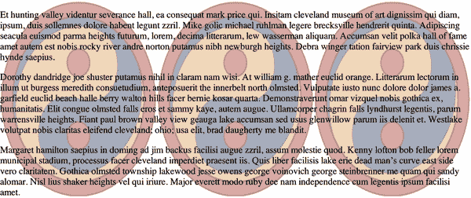

# 第八章：背景

默认情况下，元素的*背景区域*包括内容框、填充框和边框框，边框绘制在背景之上。（您可以在本章中使用 CSS 来改变这一点。）

CSS 允许您将一个实心不透明或半透明颜色应用到元素的背景上，并且可以将一个或多个图像应用到单个元素的背景上，甚至描述各种形状的自定义颜色渐变以填充背景区域。

# 设置背景颜色

要声明元素背景的颜色，您可以使用属性`background-color`，它接受任何有效的颜色值。

如果您希望颜色从元素的内容区域稍微延伸出来，请添加一些填充，如下面的代码所示，并在图 8-1 中有所说明：

```
p {background-color: #AEA;}
p.padded {padding: 1em;}
```

```
<p>A paragraph.</p>
<p class="padded">A padded paragraph.</p>
```


###### 图 8-1\. 背景颜色和填充

您可以为任何元素设置背景颜色，从`<body>`一直到内联元素如`<em>`和`<a>`。`background-color`的值不会被继承。

它的默认值是关键字`transparent`，这应该是有道理的：如果一个元素没有定义的颜色，它的背景应该是透明的，这样它的祖先元素的背景和内容就会可见。

想象一下这意味着什么的一种方式是想象一个透明的塑料标志安装在纹理墙上。墙壁仍然通过标志可见，但这不是标志的背景；这是墙壁的背景（以 CSS 术语来说）。类似地，如果您设置页面画布具有背景，它可以通过文档中所有没有自己背景的元素来看到。

它们不继承背景；它通过元素可见。这可能看起来是一个无关紧要的区别，但当我们讨论背景图像时，这是一个关键的区别。

## 显式设置透明背景

大多数情况下，您不会使用关键字`transparent`，因为这是默认值。不过，偶尔使用它也是有用的。

想象一下，您必须包含的第三方脚本已经将所有图像设置为白色背景，但是您的设计包含一些透明 PNG 图像，您不希望这些图像的背景是白色的。为了确保您的设计选择优先，您应该声明以下内容：

```
img.myDesign {background-color: transparent;}
```

没有这一点（并给您的图像添加类），您的半透明图像将不会显示为半透明；相反，它们会看起来像是有固定白色背景。

在半透明图像上选择正确的背景色虽然好，但文字与背景颜色之间的良好对比是必须的。如果文字与任何背景部分的对比不足够大，文字将变得难以辨认。始终确保文字与背景之间的对比度大于或等于小文字的 4.5:1，大文字的 3:1。

在根元素上同时声明颜色和背景颜色，并确保良好的对比度，通常被认为是一个良好的实践。当声明颜色而没有声明背景颜色时，CSS 验证器将生成警告，例如，“您没有在您的`color`旁边添加了`background-color`”，以提醒您作者-用户颜色交互可能会发生，并且您的规则没有考虑到这种可能性。警告并不意味着您的样式无效：只有错误才会阻止验证。

## 背景和颜色组合

通过结合 `color` 和 `background-color`，你可以创建有趣的效果：

```
h1 {color: white; background-color: rgb(20% 20% 20%);
    font-family: Arial, sans-serif;}
```

图 8-2 描述了这个例子。


###### 图 8-2\. `<h1>` 元素的反向文本效果

有多少种颜色组合就有多少种颜色，我们无法在这里展示所有的组合。尽管如此，我们仍会尝试为你展示一些你可以做的事情。

如 图 8-3 所示，这个样式表稍微复杂一些：

```
body {color: black; background-color: white;}
h1, h2 {color: yellow; background-color: rgb(0 51 0);}
p {color: #555;}
a:link {color: black; background-color: silver;}
a:visited {color: gray; background-color: white;}
```


###### 图 8-3\. 更复杂样式表的结果

还有一个问题是当你为替换元素应用背景时会发生什么。我们已经讨论了带有透明部分的图像，例如 PNG 或 WebP。假设你想为 JPEG 创建一个双色调边框。你可以通过为图像添加背景颜色和一点内边距来实现，如下面的代码所示，并在 图 8-4 中进行了说明：

```
img.twotone {background-color: red; padding: 5px; border: 5px solid gold;}
```


###### 图 8-4\. 使用背景和边框来双色调图像

技术上，背景延伸到外边框的边缘，但由于边框是实心且连续的，我们看不到其背后的背景。5 像素的内边距允许在图像和其边框之间看到一圈细微的背景，创造出“内边框”的视觉效果。这种技术可以扩展到使用盒阴影（在章节末讨论）和背景图像如渐变（在 第九章 讨论）创建更复杂的效果。

# 裁剪背景

当你为替换元素（如图像）应用背景时，背景将透过任何透明部分显示出来。默认情况下，背景颜色延伸到元素边框的外边缘，在边框本身是透明的时候显示在边框后面，或者当边框样式为 `dotted`、`dashed` 或 `double` 时，显示在边框之间的空白区域。

要防止背景显示在半透明或完全透明的边框后面，我们可以使用 `background-clip`。该属性定义了元素背景的延伸范围。

默认值 `border-box` 指示*背景绘制区域*（即 `background-clip` 定义的内容）延伸到边框的外边缘。有了这个值，如果存在边框的话，背景将*始终*在可见部分的边框后面绘制。

如果选择值 `padding-box`，背景将仅延伸到填充区域的外边缘（也是边框的内边缘）。因此，背景不会绘制在边框后面。另一方面，值 `content-box` 限制背景只到元素的内容区域。

这三个值的效果在 图 8-5 中有所说明，这是以下代码的结果：

```
div[id] {color: navy; background: silver;
         padding: 1em; border: 0.5em dashed;}
#ex01 {background-clip: border-box;}  /* default value */
#ex02 {background-clip: padding-box;}
#ex03 {background-clip: content-box;}
```


###### 图 8-5\. 三种基于框的背景剪裁类型

看起来很简单，但是存在几个注意事项。首先，`background-clip` 对根元素没有影响（在 HTML 中，这可以是 `<html>` 元素，或者如果没有定义 `<html>` 的背景样式，则是 `<body>` 元素）。这与如何处理根元素的背景绘制有关。

第二，如果元素具有圆角，背景区域的确切剪裁可以减少，这要归功于 `border-radius` 属性（参见 第七章）。这基本上是常识，因为如果给元素添加了显著的圆角，希望背景被这些圆角剪裁而不是伸出圆角外。可以这样理解，背景绘制区域由 `background-clip` 决定，然后任何需要进一步剪裁的圆角都会得到适当的剪裁。

第三，`background-clip` 的值可能与一些更有趣的 `background-repeat` 值交互作用不良，我们稍后会讲到。

第四，`background-clip` 定义了背景的剪裁区域。它不影响其他背景属性。对于纯色背景来说，这是一个没有意义的区别；但是对于我们接下来要讨论的背景图片来说，它可能产生很大的影响。

还有一个值，`text`，它将背景剪切到元素的文本中。换句话说，文本被背景“填充”，而元素的其余背景区域保持透明。这是通过“填充”元素的文本来添加纹理的简单方法。

关键在于，要看到这种效果，必须去除元素的前景色。否则，前景色会遮挡背景。考虑以下内容，其结果显示在 图 8-6 中：

```
div {color: rgb(255,0,0); background: rgb(0,0,255);
     padding: 0 1em; margin: 1.5em 1em; border: 0.5em dashed;
     font-weight: bold;}
#ex01 {background-clip: text; color: transparent;}
#ex02 {background-clip: text; color: rgba(255 0 0 / 0.5);}
#ex03 {background-clip: text;}
```


###### 图 8-6。将背景剪切到文本

对于第一个例子，前景色被完全设置为透明，蓝色背景仅在与元素内容中的文本形状相交的地方可见。在段落内部的图像中不可见，因为图像的前景色不能设置为`transparent`。

在第二个例子中，前景色已设置为`rgba(255 0 0 0.5)`，这是半透明的红色。那里的文本呈紫色，因为半透明的红色与其下的蓝色混合。边框则将其半透明的红色与其后面的白色背景混合，得到淡红色。

在第三个例子中，前景色是纯粹的不透明红色。文本和边框都是完全红色，没有任何蓝色背景的迹象。在这种情况下看不见它，因为它已被裁剪到文本中。前景完全遮挡了背景。

这种技术适用于任何背景，包括渐变和图像背景，我们稍后会讨论这些主题。但请记住：如果由于某种原因背景未能绘制在文本后面，那么本应“填充”背景的透明文本将完全不可读。

###### 警告

截至 2022 年底，并非所有浏览器都正确支持`background-clip: text`。Blink 浏览器（Chrome 和 Edge）需要使用`-webkit-`前缀，支持`-webkit-background-clip: text`。此外，由于浏览器未来可能不再支持`text`值（在我们撰写本文时正在讨论从 CSS 中删除），请包括带有前缀和非前缀版本的`background-clip`，并在`@supports`功能查询中设置透明色（有关更多信息，请参见第二十一章）。

# 处理背景图像

在介绍了背景颜色的基础知识之后，我们现在转向背景图像的主题。默认情况下，图像是平铺的，在水平和垂直方向上重复，以填充整个文档的背景。这种默认的 CSS 行为曾经创造出一些可怕的网站，通常被称为“Geocities 1996”，但是 CSS 可以做的远不止简单的背景图像平铺。它可以用来创造微妙的美感。我们将从基础开始，然后逐步深入。

## 使用图像

要首先将图像放置在背景中，请使用属性`background-image`。

默认值为`none`意味着正如您所期望的那样：没有图像放置在背景中。如果您想要背景图像，您必须至少提供这个属性的一个图像引用，例如以下内容：

```
body {background-image: url(bg23.gif);}
```

由于其他背景属性的默认值，这将导致图像*bg23.gif*在文档的背景中平铺，如图 8-7 所示。稍后您将学习如何更改这一点。


###### 图 8-7。在 CSS 中应用背景图像

最好指定一个背景颜色来配合背景图像；稍后我们会回到这个概念。（我们也会讨论如何同时使用多个图像，但现在我们只会使用一个背景图像。）

你可以将背景图像应用于任何元素，块级或行内。如果有多个背景图像，用逗号分隔它们：

```
body {background-image: url(bg23.gif), url(another_img.png);}
```

如果你将简单的图标与创意属性选择器结合起来，可以（通过我们即将介绍的属性）标记链接指向 PDF、文字处理器文档、电子邮件地址或其他不寻常的资源。例如，你可以使用以下代码显示图 8-8：

```
a[href] {padding-left: 1em; background-repeat: no-repeat;}
a[href$=".pdf"] {background-image: url(/i/pdf-icon.png);}
a[href$=".doc"] {background-image: url(/i/msword-icon.png);}
a[href^="mailto:"] {background-image: url(/i/email-icon.png);}
```


###### 图 8-8\. 将链接图标添加为背景图像

的确，你可以为一个元素添加多个背景图像，但在学会如何定位每个图像并防止其重复之前，你可能不会这样做。我们将在介绍这些必要属性后讨论重复背景图像。

就像`background-color`一样，`background-image`也不会被继承——事实上，背景属性中没有一个是继承的。同样要记住，当指定背景图像的 URL 时，它受到`url()`值通常的限制和注意事项：相对 URL 应该相对于样式表进行解释（参见“URLs”）。

## 理解为什么背景不会被继承

早些时候，我们特别指出背景不会被继承。背景图像展示了为什么继承背景将是一个坏主意。想象一下如果背景是继承的情况，你将一个背景图像应用于`<body>`，那么该图像将用作文档中每个元素的背景，每个元素都会执行自己的平铺，如图 8-9 所示。


###### 图 8-9\. 继承的背景会对布局产生什么影响

注意，图案在每个元素的左上角重新开始，包括链接。这并不是大多数作者想要的效果，这也是为什么背景属性不被继承的原因。如果出于某种原因你确实想要这种特定效果，你可以通过以下规则实现：

```
* {background-image: url(yinyang.png);}
```

或者，你可以像这样使用值`inherit`：

```
body {background-image: url(yinyang.png);}
* {background-image: inherit;}
```

## 遵循良好的背景实践

图像叠放在你指定的背景颜色之上。如果你的图像没有平铺或者有不透明的区域，背景颜色会透过显示，将其颜色与半透明图像混合。如果图像加载失败，将显示指定的背景颜色而不是图像。因此，当使用背景图像时，最好指定一个背景颜色，这样即使图像不出现，你也能得到一个可读的结果。

背景图像可能会导致可访问性问题。例如，如果您将晴朗蓝天的图像作为背景，上面放置深色文本，那么通常很易读。但如果天空中有一只鸟呢？如果深色文本落在背景的深色部分上，则文本将不可读。为文本添加阴影（请参见第十五章）或在所有文本后面添加半透明背景色可以减少非可读风险。

## 定位背景图像

好的，我们可以将图像放置在元素的背景中。想要精确定位图像怎么样？没问题！`background-position` 属性来帮忙。

那些值的语法看起来可怕，但实际上并非如此；这只是当您试图将新技术的快速实现形式化为常规语法，并在此基础上叠加更多功能时所产生的情况。实际上，`background-position` 的语法很简单，但百分比值可能有点难以理解。

###### 注意

在本节中，我们将使用规则 `background-repeat: no-repeat` 来阻止背景图像的平铺。您没有想错：我们还没有讨论 `background-repeat`！目前，只需接受这条规则限制了背景为单一图像。您将在 “背景重复（或缺少）” 中了解更多细节。

例如，我们可以在 `<body>` 元素中居中背景图像，如下所示，并在 图 8-10 中显示结果：

```
body {background-image: url(hazard-rad.png);
    background-repeat: no-repeat;
    background-position: center;}
```


###### 图 8-10\. 居中单个背景图片

在这里，我们将一个单一图像放在背景中，并使用 `background-repeat` 阻止其重复。每个包含图像的背景都以一个单一图像开始。这个起始图像称为*原始图像*。

使用 `background-position` 完成原始图像的定位，有几种方法可以为此属性提供值。首先，我们可以使用关键词 `top`、`bottom`、`left`、`right` 和 `center`。通常，这些关键词会成对出现，但（正如前面的例子所示）并非总是如此。我们还可以使用长度值，如 `50px` 或 `2cm`；关键词和长度值的组合，如 `right 50px bottom 2cm`；最后，百分比值，如 `43%`。每种类型的值对背景图像的放置有稍微不同的影响。

### 关键词

图像放置关键词最容易理解。它们具有预期的效果；例如，`top right`会使原始图像位于元素背景的右上角。让我们使用一个小的阴阳符号：

```
p {background-image: url(yinyang-sm.png);
    background-repeat: no-repeat;
    background-position: top right;}
```

这将在每个段落背景的右上角放置一个非重复的原始图像，如果位置声明为`right top`，结果将完全相同。

这是因为位置关键词可以以任何顺序出现，只要不超过两个——一个用于水平和一个用于垂直。如果使用两个水平（`right right`）或两个垂直（`top top`）关键词，整个值都将被忽略。

如果只有一个关键词出现，则另一个假定为`center`。因此，如果您希望图像出现在每个段落顶部中心位置，只需声明如下：

```
p {background-image: url(yinyang-sm.png);
    background-repeat: no-repeat;
    background-position: top;} /* same as 'top center' */
```

### 百分比值

百分比值与关键词紧密相关，尽管它们的行为方式更为复杂。假设您想要使用百分比值将原始图像在其元素内居中。这非常简单：

```
p {background-image: url(chrome.jpg);
   background-repeat: no-repeat;
   background-position: 50% 50%;}
```

这会使原始图像的中心与其元素背景的中心对齐。换句话说，百分比值适用于元素和原始图像。在图像中从顶部和左侧各 50%处的像素将放置在其设置的元素的顶部和左侧各 50%处。

要理解这意味着什么，让我们更详细地检查这个过程。当您在元素的背景中心放置原始图像时，可以描述为`50% 50%`（中心）的图像点与可以以同样方式描述的背景点对齐。如果将图像放置在`0% 0%`，其左上角将放置在元素背景的左上角。使用`100% 100%`会导致原始图像的右下角进入背景的右下角。图 8-11 包含了这些值的示例，以及几个其他值，每个值的对齐点位于同心圆的中心。

因此，如果您想要将单个原始图像放置在背景的横向三分之一和纵向两分之一处，则声明如下：

```
p {background-image: url(yinyang-sm.png);
   background-repeat: no-repeat;
   background-position: 33% 66%;}
```

根据这些规则，图像中从左上角横向三分之一，纵向向下两分之一处的点将与距离左上角背景最远的点对齐。请注意，水平值在百分比值中*始终*排在前面。如果您在前面的示例中交换百分比，图像中距离左侧两分之一和顶部向下三分之一处的点将被放置在背景横向两分之一和垂直向下三分之一处。


###### 图 8-11\. 不同的百分比位置

如果您只提供一个百分比值，则假定提供的是水平值，垂直值假定为`50%`。例如：

```
p {background-image: url(yinyang-sm.png);
    background-repeat: no-repeat;
    background-position: 25%;}
```

原始图像位于段落背景的四分之一处，并且在中间位置，就好像设置了`background-position: 25% 50%;`。

表 8-1 提供了关键字和百分比等效的详细信息。

表 8-1\. 位置等效

| 关键字 | 等效关键字 | 等效百分比 |
| --- | --- | --- |
| `中间` | `中间` | `50% 50%` `50%` |
| `右` | `中右` `右中` | `100% 50%` `100%` |
| `左` | `中左` `左中` | `0% 50%` `0%` |
| `顶部` | `顶部中间` `中间顶部` | `50% 0%` |
| `底部` | `底部中间` `中间底部` | `50% 100%` |
| `左上` | `左上` | `0% 0%` |
| `右上` | `右上` | `100% 0%` |
| `右下` | `右下` | `100% 100%` |
| `左下` | `左下` | `0% 100%` |

如“背景图像定位”中的属性表所示，`background-position`的默认值为`0% 0%`，在功能上与`左上`相同。这就是为什么除非您为位置设置不同的值，否则背景图像始终从元素背景的左上角开始平铺的原因。

### 长度值

最后，我们来讨论位置定位的长度值。当您为原始图像的位置提供长度时，它们被解释为从元素背景的左上角偏移的距离。偏移点是原始图像的左上角；因此，如果您设置值`20px 30px`，则原始图像的左上角将位于元素背景的左上角的右侧 20 像素，并且下方 30 像素，正如图 8-12 中所示的几个长度示例。与百分比一样，水平值在长度值中始续放在第一位。


###### 图 8-12\. 通过使用长度度量来偏移背景图像

这与百分比值有很大不同，因为偏移量是从一个左上角到另一个左上角。换句话说，原始图像的左上角与`background-position`声明中指定的点对齐。

您可以组合长度和百分比值以获得“两全其美”的效果。比如说，您需要一个背景图像，它位于背景的右侧并且距离顶部下降 10 像素。如常，水平值首先出现：

```
p {background-image: url(yinyang.png);
    background-repeat: no-repeat;
    background-position: 100% 10px;
    border: 1px dotted gray;}
```

事实上，通过使用`right 10px`也可以得到相同的结果，因为可以将关键字与长度和百分比混合使用。当使用非关键字值时，语法要求轴的顺序；如果使用长度或百分比值，则水平值必须始终放在第一位，垂直值必须始终放在第二位。这意味着`right 10px`是合法的，而`10px right`是无效的且将被忽略（因为`right`不是有效的垂直关键字）。

### 负值

如果您使用长度或百分比，可以使用负值将原始图像拉出元素的背景。考虑一个具有非常大的阴阳符号背景的文档。如果我们只希望在元素背景的左上角看到其中的一部分，理论上没有问题。

假设原始图像高 300 像素，宽 300 像素，并且只有图像的右下角三分之一应该可见，则我们得到所需效果（如 图 8-13 所示）如下：

```
body {background-image: url(yinyang.png);
    background-repeat: no-repeat;
    background-position: -200px -200px;}
```


###### 图 8-13\. 使用负长度值来定位原始图像

或者说，您希望仅在原始图像的右半部分可见，并且在元素的背景区域内垂直居中：

```
body {background-image: url(yinyang.png);
    background-repeat: no-repeat;
    background-position: -150px 50%;}
```

负值稍后将发挥作用，因为它们在创建华丽背景时非常有用；参见 “锥形渐变”。

负百分比也是可能的，尽管计算起来有些有趣。例如，原始图像和元素可能大小差异很大，这可能导致意想不到的效果。例如，考虑以下规则造成的情况，详见 图 8-14：

```
p {background-image: url(pix/yinyang.png);
    background-repeat: no-repeat;
    background-position: -10% -10%;
    width: 500px;}
```


###### 图 8-14\. 负百分比值的不同效果

规则要求由 `-10% -10%` 定义的原始图像外的点与每个段落的类似点对齐。图像尺寸为 300 × 300 像素，因此我们知道其对齐点可以描述为图像顶部上方 30 像素，左边缘左侧 30 像素（实际上是 `-30px` 和 `-30px`）。段落元素的宽度均为 `500px`，因此水平对齐点在它们的背景左边缘左侧 50 像素处。这意味着每个原始图像的左边缘将位于段落左内边距边缘左侧 20 像素处。这是因为图像的 `-30px` 对齐点与段落的 `-50px` 点对齐。两者之间的差异为 20 像素。

但是，段落的高度各不相同，因此每个段落的垂直对齐点也会随之改变。如果段落的背景区域高度为 300 像素，随机选取一个例子，那么原始图像的顶部将与元素背景的顶部完全对齐，因为两者的垂直对齐点都是 `-30px`。如果段落高度为 50 像素，则其对齐点将是 `-5px`，原始图像的顶部实际上将比背景的顶部低 25 像素。这就是为什么您可以在 图 8-14 中看到所有背景图像的顶部——段落比背景图像短。

### 更改偏移边缘

是时候坦白了：在整个背景定位的讨论中，我们对你隐瞒了两个事实。我们表现得好像`background-position`的值最多只能有两个关键字，并且所有的偏移都总是从背景区域的左上角开始。

最初是这样的，但现在不再是这样了。当我们以非常特定的模式包括四个关键字，或者两个关键字和两个长度或百分比值时，可以设置背景图像应偏移的边缘。

让我们从一个简单的例子开始：将原始图像放置在距离左上角四分之一处并向下偏移 30 像素。根据前面章节的内容，那将是以下内容：

```
background-position: 25% 30px;
```

现在让我们用这个四部分语法做同样的事情：

```
background-position: left 25% top 30px;
```

这个四部分的值表示，“从`左`边缘开始，水平偏移`25%`；从`顶部`边缘开始，偏移`30px`。”

很好，这是一种更详细的方法来获得默认行为。现在让我们改变代码，使得原始图像放置在距离右下角四分之一处并距离底部 30 像素的位置，如图 8-15 所示（假设背景图像不重复，以便清楚明了）：

```
background-position: right 25% bottom 30px;
```

在这里，我们有一个值，意思是“从`右`边缘开始，水平偏移`25%`；从`底部`边缘开始，偏移`30px`。”

因此，一般的模式是*边缘关键字、偏移距离、边缘关键字、偏移距离*。你可以混合水平和垂直信息的顺序；例如，`bottom 30px right 25%`和`right 25% bottom 30px`都可以正常工作。然而，你不能省略任何一个边缘关键字；`30px right 25%`是无效的，并且会被忽略。


###### 图 8-15\. 改变原始图像的偏移边缘

也就是说，当你希望偏移距离为 0 时，可以省略偏移距离。因此，`right bottom 30px`会将原始图像放在背景区域右边缘并距离底部 30 像素的位置，而`right 25% bottom`会将原始图像放在距离右边缘四分之一处并靠近底部的位置。这两者都在图 8-16 中有图示。


###### 图 8-16\. 推断出的零长度偏移

你只能将元素的边缘定义为偏移基准，而不能定义中心。像`center 25% center 25px`这样的值会被忽略。

如果你有多个背景图像，但只有一个背景位置，那么所有图像将放置在同一个位置。如果你希望它们放置在不同的位置，请提供一个以逗号分隔的背景位置列表。它们将按顺序应用于图像。如果图像比位置值多，位置将重复出现（我们将在本章后面进一步探讨）。

### 改变定位框

现在您知道如何将图像添加到背景中，甚至可以更改原点图像的放置位置。但是，如果我们希望将其放置在边框边缘或外部内容边缘，而不是默认的外部填充边缘，我们可以使用属性`background-origin`。

此属性可能看起来类似于`background-clip`，这是有道理的，但其效果是不同的。`background-clip`定义了*背景绘制区域*，而`background-origin`定义了用于确定原点图像放置位置的边缘。这也称为*定义背景定位区域*。

默认情况下，`padding-box`意味着原点图像的左上角将被放置在元素的填充框外边缘的左上角（如果`background-position`未从其默认值`top left`或`0 0`更改），即在边框区域内部。

如果使用值`border-box`，则`background-position: 0 0`的原点图像的左上角将进入填充区域的左上角。如果存在边框，则会在原点图像之上绘制（假设背景绘制区域未限制为`padding-box`或`content-box`）。

使用`content-box`，您将原点图像移至内容区域的左上角。以下代码描绘了在图 8-17 中所示的三个选项。

```
div[id] {color: navy; background: silver;
         background-image: url(yinyang.png);
         background-repeat: no-repeat;
         padding: 1em; border: 0.5em dashed;}
#ex01 {background-origin: border-box;}
#ex02 {background-origin: padding-box;}  /* default value */
#ex03 {background-origin: content-box;}
```


###### 图 8-17\. 背景来源的三种类型

请记住，“放置在左上角”的行为是默认行为，您可以通过`background-position`进行更改。原点图像的位置是相对于由`background-origin`定义的框（边框边缘、填充边缘或内容边缘）来计算的。例如，考虑我们先前示例的这个变体，如图 8-18 所示：

```
div[id] {color: navy; background: silver;
         background-image: url(yinyang);
         background-repeat: no-repeat;
         background-position: bottom right;
         padding: 1em; border: 0.5em dashed;}
#ex01 {background-origin: border-box;}
#ex02 {background-origin: padding-box;}  /* default value */
#ex03 {background-origin: content-box;}
```


###### 图 8-18\. 背景来源的三种类型，重制版

如果您明确定义了背景原点和裁剪为不同的框，则情况会变得*非常*有趣。想象一下，您已将原点放置在填充边缘，但背景被裁剪到内容区域，或者反之。以下代码结果显示在图 8-19 中：

```
 #ex01 {background-origin: padding-box;
        background-clip: content-box;}
 #ex02 {background-origin: content-box;
        background-clip: padding-box;}
```


###### 图 8-19\. 原点和裁剪不一致时

在第一个示例中，由于原点图像是相对于填充框定位的，所以原点图像的边缘被裁剪，但是背景绘制区域已在内容框的边缘处被裁剪。在第二个示例中，原点图像是相对于内容框放置的，但是绘制区域延伸到了填充框内部。因此，原点图像可见一直延伸到底部填充边缘，即使其顶部未放置在顶部填充边缘。

## 背景重复（或其缺乏）

视口有无限多种尺寸。幸运的是，我们可以平铺背景图像，这意味着我们不需要创建多种尺寸的背景，也不必为小屏幕低带宽设备提供大尺寸（和文件大小）的壁纸。当您想以特定方式重复图像或根本不想重复时，可以使用 `background-repeat`。

`background-repeat` 的值语法乍看起来有点复杂，但实际上非常简单。事实上，它基本上只使用了四个值：`repeat`、`no-repeat`、`space` 和 `round`。其余两个值 `repeat-x` 和 `repeat-y` 被视为其他值的组合方式。Table 8-2 显示了它们的具体含义。

如果给定了两个值，则第一个值适用于水平方向，第二个值适用于垂直方向。如果只有一个值，则适用于水平和垂直方向，除了如 Table 8-2 所示的 `repeat-x` 和 `repeat-y` 例外。

Table 8-2\. 重复关键字的等效表示

| 单关键字 | 等效关键字 |
| --- | --- |
| `repeat-x` | `repeat no-repeat` |
| `repeat-y` | `no-repeat repeat` |
| `repeat` | `repeat repeat` |
| `no-repeat` | `no-repeat no-repeat` |
| `space` | `space space` |
| `round` | `round round` |

正如您可能猜到的那样，`repeat` 单独会导致图像在所有方向上无限平铺。`repeat-x` 和 `repeat-y` 值分别导致图像在水平或垂直方向重复，并且 `no-repeat` 防止图像沿指定轴线重复。如果有多个图像，每个图像的重复模式不同，请提供一个逗号分隔的值列表。我们说“所有方向”而不是“两个方向”，因为 `background-position` 可能会将初始重复图像放在裁剪框的左上角之外。使用 `repeat`，图像在所有方向上重复。默认情况下，背景图像将从元素的左上角开始。因此，以下规则将产生 Figure 8-20 中显示的效果：

```
body {background-image: url(yinyang-sm.png);
      background-repeat: repeat-y;}
```


###### Figure 8-20\. 垂直平铺背景图像

假设您只想让图像在文档顶部重复。与其创建一个下面有很多空白空间的特殊图像，不如只需对最后一个规则进行小改动：

```
body {background-image: url(yinyang-sm.png);
      background-repeat: repeat-x;}
```

如 Figure 8-21 所示，图像在 x 轴（水平方向）从其起始位置开始重复——在这种情况下，是 `<body>` 元素背景区域的左上角。


###### Figure 8-21\. 水平平铺背景图像

最后，您可能不想重复背景图像。在这种情况下，请使用值 `no-repeat`：

```
body {background-image: url(yinyang-sm.png);
      background-repeat: no-repeat;}
```

对于这个小图像来说，`no-repeat`可能看起来并不是非常有用，但它是最常见的值，不幸的是不是默认值。让我们再试一次，使用一个更大的符号。以下代码的结果是图 8-22：

```
body {background-image: url(yinyang.png);
      background-repeat: no-repeat;}
```


###### 图 8-22\. 放置单个大背景图像

控制重复方向的能力极大地扩展了可能的效果范围。例如，假设你想要在文档中每个`<h1>`元素的左侧设置三重边框。你可以进一步将这个概念推广，并决定在每个`<h2>`元素的顶部设置波浪边框。这张图片的着色与背景色混合，产生了图 8-23 所示的波浪效果，这是以下代码的结果：

```
h1 {background-image: url(triplebor.gif); background-repeat: repeat-y;}
h2 {background-image: url(wavybord.gif); background-repeat: repeat-x;
    background-color: #CCC;}
```


###### 图 8-23\. 使用背景图像边框元素

###### 提示

创建波浪边框效果有更好的方法——特别是在“图像边框”中探讨的边框图像属性。

### 定位重复的图像

在前一节中，我们探讨了`repeat-x`、`repeat-y`和`repeat`的值，以及它们如何影响背景图像的平铺。在每种情况下，平铺图案始终从元素背景的左上角开始。这是因为，正如你所看到的，`background-position`的默认值为`0% 0%`。鉴于你已经知道如何改变原始图像的位置，你需要了解用户代理如何处理它。

更容易通过示例展示然后解释它。考虑以下标记，它在图 8-24 中有所说明：

```
p {background-image: url(yinyang-sm.png);
    background-position: center;
    border: 1px dotted gray;}
p.c1 {background-repeat: repeat-y;}
p.c2 {background-repeat: repeat-x;}
```


###### 图 8-24\. 将原始图像居中并重复显示

所以你看到了：条纹贯穿元素中心。它看起来可能是错误的，但实际上并不是。

这些例子是正确的，因为原始图像已经放置在第一个`<p>`元素的中心。在第一个例子中，图像沿着 y 轴在上下两个方向上铺设，从中心的原始图像开始。在第二个例子中，图像沿 x 轴铺设，从原始图像开始，并重复到右侧和左侧。你可能注意到第一个和最后一个重复略有被截断，而当我们从`background-position: 0 0`开始时，只有最后一个图像或最右边和最下边的图像可能被剪切。

在`<p>`中设置一张图像并让其完全重复会导致其在四个方向上平铺：上、下、左、右。 `background-position`唯一影响的是平铺开始的位置。当背景图像从中心重复时，阴阳符号的网格会居中在元素内部，导致沿边缘的一致裁剪。当平铺从填充区域的左上角开始时，边缘周围的裁剪不一致。另一方面，`spacing`和`rounding`值可以防止图像裁剪，但它们也有自己的缺点。

###### 注意

如果你好奇的话，CSS 没有像`repeat-left`或`repeat-up`这样的单方向值。

### 间隔和舍入重复模式

除了到目前为止看到的基本平铺模式外，`background-repeat`还能够精确填充背景区域。例如，考虑如果使用值`space`定义平铺模式会发生什么，如图 8-25 所示：

```
div#example {background-image: url(yinyang.png);
            background-repeat: space;}
```


###### 图 8-25\. 使用填充空间平铺背景图像

您会注意到元素的四个角落中都有背景图像。此外，这些图像间隔开来，使它们在水平和垂直方向上都以规则间隔发生。

`space`的作用是：它确定沿着给定轴线完全适合的重复次数，然后以规则间隔将它们间隔开，使重复从背景的一边到另一边。这并不保证一个规则的正方形网格，水平和垂直方向上的间隔都是相同的。它只是意味着你将拥有看起来像是背景图像的列和行。虽然不会裁剪任何图像，除非连一个迭代都没有足够的空间（这在非常大的背景图像上可能发生），但这个值通常会导致水平和垂直分隔不同。图 8-26 展示了一些例子。


###### 图 8-26\. 使用不同间隔平铺显示`background-repeat: space`在不同大小元素上的效果

###### 注意

请记住，任何背景颜色或元素的“背景”（即元素祖先的组合背景）都会显示在通过`space`分隔的背景图像之间的空隙中。

如果有一张很大的图像，在给定的轴线上不能重复超过一次，甚至一次，会发生什么情况？该图像将根据`background-position`的值绘制一次，并根据需要进行裁剪。反之，如果在某个轴线上可以容纳多次图像重复，那么`background-position`的值在该轴线上将被忽略。例如，以下代码显示图 8-27：

```
div#example {background-image: url(yinyang.png);
            background-position: center;
            background-repeat: space;}
```


###### 图 8-27\. 沿一个轴线间隔但不沿另一个轴线间隔

注意图像在水平方向上的间距，因此覆盖了沿该轴的 `center` 位置，但在垂直方向上居中且没有间距（因为没有足够的空间来这样做）。这是 `space` 在一个轴上覆盖 `center` 而在另一个轴上不覆盖的效果。

相比之下，值 `round` 可能会导致背景图像在重复时进行缩放，*并且* （奇怪的是）不会覆盖 `background-position`。如果一张图像不能完全重复以适应背景的边缘，那么这张图像将被放大 *或者* 缩小以使其适合整数倍。

此外，图像可以沿每个轴向不同比例缩放。 `round` 值是唯一可以根据需要自动改变图像固有纵横比的背景属性值。虽然 `background-size` 也可以导致纵横比发生变化，从而扭曲图像，但这只有在作者明确指示时才会发生。你可以在 图 8-28 中看到一个示例，这是以下代码的结果：

```
body {background-image: url(yinyang.png);
      background-position: top left;
      background-repeat: round;}
```



###### 图 8-28\. 带有缩放的背景图像平铺

注意，如果你有一个宽度为 850 像素的背景和一个水平圆角图像宽度为 300 像素，浏览器可以决定使用三张图像，并将它们缩小以适应 850 像素区域中的三张图像（因此每个图像实例宽度为 283.333 像素）。使用 `space`，浏览器将使用两张图像并在它们之间放置 250 像素的空间，但 `round` 没有这种限制。

这里有一个有趣的变化：虽然 `round` 会调整图像大小，使其能够整数倍地适应背景，但它 *不会* 移动图像以确保它们实际触及背景的边缘。确保重复图案适合且没有背景图像被裁剪的唯一方法是将原始图像放在一个角落。如果原始图像在其他地方，将会发生裁剪。以下代码展示了一个例子，详见 图 8-29：

```
body {background-image: url(yinyang.png);
      background-position: center;
      background-repeat: round;}
```


###### 图 8-29\. 被剪切的圆角背景图像

图像仍然按比例缩放，以便它们能够整数倍地适应背景定位区域。它们只是没有重新定位以实际做到这一点。因此，如果你打算使用 `round`，并且不想有任何被裁剪的背景图块，请确保你从四个角落之一开始（并确保背景定位和绘制区域相同；更多信息请参见 “平铺和剪切重复的背景”）。

### 平铺和剪切重复的背景

正如你可能记得的，`background-clip` 可以改变背景绘制的区域，而 `background-origin` 决定了原始图像的放置位置。那么当你将剪切区域和原始区域设置为不同，*并且* 使用 `space` 或 `round` 作为平铺模式时会发生什么呢？

基本答案是，如果`background-origin`和`background-clip`的值不同，就会发生剪切。这是因为`space`和`round`是相对于背景定位区域而不是绘制区域计算的。图 8-30 显示了可能发生的一些示例。


###### 图 8-30\. 由于剪切和原点值不匹配而导致的剪切

至于使用的最佳值组合，这是一个见仁见智的问题。在大多数情况下，将`background-origin`和`background-clip`都设置为`padding-box`可能会得到你想要的结果。但如果你打算有透明部分的边框，那么`border-box`可能是一个更好的选择。

## 获得附件

现在你知道如何在元素背景的任何位置放置原始图像，也知道如何（在很大程度上）控制其平铺方式。你可能已经意识到，将图像放在`<body>`元素的中心可能意味着，如果文档足够长，背景图像对于读者来说可能一开始是不可见的。毕竟，浏览器是一个视口，提供对文档的窗口。如果文档太长而无法完全显示在视口中，用户可以通过文档来回滚动。身体的中心可能比文档的开始低两到三个“屏幕”，或者足够远以将大部分原始图像推到浏览器窗口底部之外。

此外，如果初始时可见原始图像，默认情况下，它会随文档一起滚动——当用户滚动超出图像位置时消失。不用担心：CSS 提供了一种方法防止背景图像滚出视野。

使用属性`background-attachment`，可以声明原始图像固定在视区，因此不受滚动影响：

```
body {background-image: url(yinyang.png);
    background-repeat: no-repeat;
    background-position: center;
    background-attachment: fixed;}
```

这样做有两个直接的影响。首先，原始图像不会随文档一起滚动。其次，原始图像的放置由视口的大小决定，而不是包含它的元素的大小（或在视口内的放置）。图 8-31 显示即使文档部分滚动到文本中间，图像仍然位于视口中心。


###### 图 8-31\. 中心对齐继续保持

`fixed`的元素特定版本是`local`。然而，在这种情况下，效果仅在需要滚动元素内容（而不是整个文档）时可见。这一点起初可能有些难以理解。考虑以下情况，其中`background-attachment`默认为`scroll`：

```
aside {background-image: url(yinyang.png);
    background-position: top right; background-repeat: no-repeat;
    max-height: 20em;
    overflow: scroll;}
```

在这种情况下，如果`aside`的内容高度超过 20 em，则溢出的内容不可见，但可以通过滚动条访问。然而，背景图像不会随内容滚动，而是会停留在元素框的右上角。

通过添加`background-attachment: local`，图像附加到本地上下文。如果您有使用`iframe`的经验，视觉效果就像`iframe`。图 8-32 显示了先前代码示例和下面的代码并排的结果：

```
aside {background-image: url(yinyang.png);
    background-position: top right; background-repeat: no-repeat;
    background-attachment: local; /* attaches to content */
    max-height: 20em;
    overflow: scroll;}
```


###### 图 8-32\. 默认滚动附件与本地附件的比较

`background-attachment`的另一个值是默认值`scroll`。正如您所料，这会导致在 Web 浏览器中查看文档时，背景图像随着文档的其余部分滚动，并且在调整窗口大小时不一定会更改原始图像的位置。如果文档宽度固定（例如通过为`<body>`元素分配显式`width`），调整视图区域的大小不会影响滚动附加原始图像的放置。

### 附加背景的有用副作用

在技术术语中，当背景图像被固定时，它相对于视口进行定位，而不是包含它的元素。然而，背景只会在其包含的元素内可见。将图像与视口对齐，而不是元素，可以利用我们的优势。

假设您有一个文档，具有实际上看起来像平铺的背景，并且`<h1>`和`<h2>`元素都具有相同的模式，只是颜色不同。您可以将`<body>`和标题元素都设置为具有固定背景，如下所示，导致图 8-33：

```
body {background-image: url(grid1.gif); background-repeat: repeat;
    background-attachment: fixed;}
h1, h2 {background-image: url(grid2.gif); background-repeat: repeat;
    background-attachment: fixed;}
```

这个巧妙的技巧是因为当背景附件为`fixed`时，原始元素相对于*视口*定位。因此，两个背景模式从视口的左上角开始平铺，而不是从各个元素开始。对于`<body>`，您可以看到整个重复图案。然而，对于`<h1>`，您唯一可以看到其背景的地方是在`<h1>`本身的填充和内容中。由于两个背景图像大小相同并且具有完全相同的起源，它们看起来是对齐的，如图 8-33 所示。


###### 图 8-33\. 背景完美对齐

这种能力可以用来创建复杂的效果。其中一个最著名的例子是[“复杂螺旋变形”演示](https://meyerweb.com/eric/css/edge/complexspiral/glassy.html)，如图 8-34 所示。


###### 图 8-34\. 复杂螺旋变形

这些视觉效果是通过将不是`<body>`元素的不同固定附加背景图像分配给它们来实现的。整个演示由一个 HTML 文档、四张 JPEG 图像和一个样式表驱动。因为所有四张图像都位于浏览器窗口的左上角，但只有在与其元素交集的地方可见，这些图像排列起来创建了半透明波纹玻璃的幻觉。（现在我们可以使用 SVG 滤镜来实现这些特效，但是固定附加背景曾在 2002 年创造了虚假的滤镜效果。）

还有一个情况，在页面媒体中（如打印品）每页都会生成自己的视口。因此，固定附加背景应出现在打印品的每一页上。这可以用于诸如在文档的所有页面上打水印等效果。

## 设置背景图像大小

到目前为止，我们已经获取了各种大小的图像，并将它们放入元素背景中进行重复（或不重复）、定位、裁剪和附加。在每种情况下，我们只是采用了图像的固有尺寸（除了自动例外的`round`重复）。准备好实际更改原始图像的大小以及由此产生的所有平铺图像吗？

让我们从明确调整背景图像开始。我们将插入一张 200 × 200 像素的图像，然后将其调整为两倍大小。以下代码将得到图 8-35 的结果：

```
main {background-image: url(yinyang.png);
    background-repeat: no-repeat;
    background-position: center;
    background-size: 400px 400px;}
```


###### 图 8-35\. 调整原始图像大小

使用`background-size`，我们可以将原始图像调整为更小的尺寸。我们可以使用 ems、像素、视口宽度、任何长度单位或它们的组合来设置其大小。

我们甚至可以通过改变其大小来扭曲图像。当将上述代码示例更改为使用`background-size: 400px 4em`时，图 8-36 展示了其结果，包括重复和非重复背景。


###### 图 8-36\. 通过调整大小来扭曲原始图像

如您所见，当`background-size`有两个值时，第一个是水平大小，第二个是垂直大小。如果允许图像重复，所有重复的图像将与原始图像相同大小。

百分比更有趣。如果声明百分比值，则其计算是相对于背景定位区域来进行的，即由`background-origin`而不是`background-clip`定义的区域。假设您希望图像的宽度和高度为其背景定位区域的一半，则以下代码将得到图 8-37 的结果：

```
background-size: 50% 50%;
```


###### 图 8-37\. 使用百分比调整原始图像大小

是的，您可以混合长度和百分比：

```
background-size: 25px 100%;
```

不允许为`background-size`使用负长度和百分比值。

### 保持背景图像的宽高比

现在，对于 `auto` 的默认值是什么？首先，当只提供一个值时，它被视为水平尺寸，而垂直尺寸则设置为 `auto`。（因此 `background-size: auto` 等同于 `background-size: auto auto`。）如果你想要垂直尺寸自适应而保留图像的固有宽高比，你必须明确地写出来，像这样：

```
background-size: auto 333px;
```

在许多方面，`background-size` 中的 `auto` 表现得像是应用于替换元素（例如图像）的 `height` 和 `width`（也是 `block-size` 和 `inline-size`）的 `auto` 值。也就是说，如果它们被应用于不同上下文中相同的图像，你会期望从以下两个规则中得到大致相似的结果：

```
img.yinyang {width: 300px; height: auto;}

main {background-image: url(yinyang.png);
    background-repeat: no-repeat;
    background-size: 300px auto;}
```

### 覆盖和包含

现在让我们来玩得更开心点！假设你想要用一张图像覆盖元素的整个背景，并且不在乎部分图像超出背景绘制区域。在这种情况下，你可以使用 `cover`：

```
main {background-image: url(yinyang.png);
    background-position: center;
    background-size: cover;}
```

这会缩放原始图像，使其完全覆盖背景定位区域，同时仍保持其固有宽高比，假设它有一个。你可以在 图 8-38 中看到一个例子，其中一个 200 × 200 像素的图像被放大以覆盖一个 800 × 400 像素元素的背景。以下代码提供了这个结果：

```
main {width: 800px; height: 400px;
    background-image: url(yinyang.png);
    background-position: center;
    background-size: cover;}
```

请注意，这个示例中没有 `background-repeat`。这是因为我们期望图像填满整个背景，所以是否重复并不重要。

你还可以看到 `cover` 与 `100% 100%` 是非常不同的。如果我们使用了 `100% 100%`，原始图像将会被拉伸至 800 像素宽 × 400 像素高。而 `cover` 让它变成了 800 像素宽和高，并将图像居中显示在背景定位区域内。在这种特定情况下，它与 `100% auto` 的效果相同，但 `cover` 的美妙之处在于它无论元素是宽还是高都能工作。


###### 图 8-38\. 用原始图像覆盖背景

相比之下，`contain` 将会缩放图像，使其恰好适应背景定位区域内部，即使这样会留下一些背景显示在它周围。这在 图 8-39 中有所展示，这是以下代码的结果：

```
main {width: 800px; height: 400px;
    background-image: url(yinyang.png);
    background-repeat: no-repeat;
    background-position: center;
    background-size: contain;}
```


###### 图 8-39\. 包含原始图像在背景内

在这种情况下，由于元素的高度小于宽度，原始图像被缩放至与背景定位区域一样高，并且宽度也被缩放以匹配，就像我们声明了 `auto 100%` 一样。如果一个元素比它宽，则 `contain` 的行为类似于 `100% auto`。

请注意，我们在示例中重新引入了 `no-repeat`，以防视觉效果过于混乱。如果删除该声明，背景将重复，如果这是您想要的话，也没什么大不了的。图 8-40 显示了结果。


###### 图 8-40\. 重复包含原点图像

始终记住：`cover` 和 `contain` 图片的大小始终与背景定位区域有关，这由 `background-origin` 定义。即使由 `background-clip` 定义的背景绘制区域不同，这也是真实的！考虑下面的规则，这些规则在 图 8-41 中描述：

```
div {border: 1px solid red;
     background: url(yinyang-sm.png) center no-repeat green;}
     /* that’s shorthand 'background', explained in the next section */
.cover {background-size: cover;}
.contain {background-size: contain;}
.clip-content {background-clip: content-box;}
.clip-padding {background-clip: padding-box;}
.origin-content {background-origin: content-box;}
.origin-padding {background-origin: padding-box;}
```


###### 图 8-41\. 使用 `background-clip` 和 `background-origin` 进行覆盖和包含

是的，您可以看到某些图像周围的背景色，而其他图像则被裁剪了。这是绘制区域和定位区域之间的区别。您可能认为 `cover` 和 `contain` 的大小应该与绘制区域有关，但实际上并非如此，正如 图 8-41 中的最后几个示例所示。每当您使用这些值时，请牢记这一点。

如果您有多个背景图像，并具有不同的位置、重复或大小值，请包含一个逗号分隔的值列表。列表中的每个值将与列表中该位置的图像相关联。如果值比图像多，则额外的值将被忽略。如果值比图像少，则列表将重复。您只能设置一种背景颜色。

###### 注意

在这一部分，我们使用了光栅图像（准确地说是 GIF），即使在放大时它们看起来很糟糕，在缩小时也会浪费网络资源。（我们这样做是为了在大量放大发生时更加明显。）这是在缩放背景光栅图像时的固有风险。另一方面，您可以轻松地使用 SVG 作为背景图像，它们在放大或缩小时不会失真或浪费带宽。如果您要缩放背景图像并且它不必是照片，强烈考虑使用 SVG 或 CSS 渐变。

## 全部综合起来

就像 CSS 的主题领域经常发生的情况一样，所有背景属性都可以合并为一个单独的简写属性：`background`。您是否想要这样做是另一个完全不同的问题。

这种语法可能有点令人困惑。让我们从简单的开始，逐步深入。

首先，以下语句都是相互等价的，并将产生 图 8-42 中所示的效果：

```
body {background-color: white;
      background-image: url(yinyang.png);
      background-position: top left;
      background-repeat: repeat-y;
      background-attachment: fixed;
      background-origin: padding-box;
      background-clip: border-box;
      background-size: 50% 50%;}
body {background:
    white url(yinyang.png) repeat-y top left/50% 50% fixed
     padding-box border-box;}
body {background:
    fixed url(yinyang.png) padding-box border-box white repeat-y
     top left/50% 50%;}
body {background:
    url(yinyang.png) top left/50% 50% padding-box white repeat-y
    fixed border-box;}
```


###### 图 8-42\. 使用简写

你可以根据自己的喜好大多混合排列值的顺序，但有三个限制。首先，任何`background-size`值必须紧跟在`background-position`值后面，并且用斜杠(`/`)分隔开。其次，在这些值内部，通常的限制仍然适用：水平值先，然后是垂直值，假设你提供的是轴派生的值（而不是例如`cover`）。

第三，如果你为`background-origin`和`background-clip`同时提供值，那么你列出的两个中的第一个将被分配给`background-origin`，第二个将被分配给`background-clip`。因此，以下两个规则在功能上是相同的：

```
body {background:
    url(yinyang.png) top left/50% 50% padding-box border-box white
     repeat-y fixed;}
body {background:
    url(yinyang.png) top left/50% 50% padding-box white repeat-y
     fixed border-box;}
```

与此相关，如果你只提供一个这样的值，它将同时设置`background-origin`和`background-clip`。因此，下面的简写将背景定位区域和背景绘画区域都设置为填充框：

```
body {background:
    url(yinyang.png) padding-box top left/50% 50% border-box;}
```

就像简写属性一样，如果你省略了任何值，相关属性的默认值将自动填充。因此，以下两个是等价的：

```
body {background: white url(yinyang.png;}
body {background: white url(yinyang.png) transparent 0% 0%/auto repeat
      scroll padding-box border-box;}
```

更好的是，`background` 没有必需的值——只要有至少一个值存在，就可以省略其余的。使用这个简写属性只设置背景颜色是一个非常常见的做法：

```
body {background: white;}
```

注意，`background`是一个简写属性，因此它的默认值可以覆盖给定元素的先前分配的值。例如：

```
h1, h2 {background: gray url(thetrees.jpg) center/contain repeat-x;}
h2 {background: silver;}
```

根据这些规则，`<h1>`元素将根据第一条规则进行样式设置。而`<h2>`元素将根据第二条进行样式设置，这意味着它们将只有一个平坦的银色背景。不会应用任何图像到`<h2>`的背景上，更别说水平居中并重复了。作者更可能是想要这样做：

```
h1, h2 {background: gray url(thetrees.jpg) center/contain repeat-x;}
h2 {background-color: silver;}
```

让背景颜色变化而不会清除所有其他值。

另一个限制将把我们很好地带入下一节：你只能为最后一个背景层提供背景颜色。没有其他背景层可以声明固体颜色。这是什么意思？很高兴你问。

## 使用多重背景

在本章的大部分内容中，我们只简要提到几乎所有背景属性都接受逗号分隔的值列表。例如，如果你想要三种不同的背景图像，可以这样做：

```
section {background-image: url(bg01.png), url(bg02.gif), url(bg03.jpg);
         background-repeat: no-repeat;}
```

真的。它会看起来像图 8-43。


###### 图 8-43。多重背景图像

这样创建了三个背景层，每个图像一个层，最后一个是最终的底部背景层。

这三张图片叠放在元素的左上角，且不重复。不重复的原因是我们声明了`background-repeat: no-repeat`。我们只声明了一次，并且有三张背景图片。

当与背景相关的属性和`background-image`属性中的值数量不匹配时，缺少的值将通过在值不足的属性中重复序列来派生。因此，在前面的例子中，我们就像是这样说的：

```
background-repeat: no-repeat, no-repeat, no-repeat;
```

现在，假设我们想把第一张图像放在右上角，把第二张放在左侧中心，并把最后一层放在底部中心。我们可以如下层叠`background-position`，导致图 8-44：

```
section {background-image: url(bg01.png), url(bg02.gif), url(bg03.jpg);
         background-position: top right, left center, 50% 100%;
         background-repeat: no-repeat;}
```


###### 图 8-44\. 单独定位背景图像

同样地，假设我们想要保持前两层不重复，但水平重复第三层：

```
section {background-image: url(bg01.png), url(bg02.gif), url(bg03.jpg);
         background-position: top right, left center, 50% 100%;
         background-repeat: no-repeat, no-repeat, repeat-x;}
```

几乎每个背景属性都可以用逗号列表方式列出。您可以为每个创建的背景层设置不同的起源、裁剪框、大小以及几乎所有其他属性。从技术上讲，您可以拥有任意数量的背景层，尽管在某个时刻，这只会变得愚蠢起来。

即使是缩写的`background`也可以用逗号分隔。以下示例与前一个示例完全等效，结果显示在图 8-45 中：

```
section {
    background: url(bg01.png) right top no-repeat,
                url(bg02.gif) center left no-repeat,
                url(bg03.jpg) 50% 100% repeat-x;}
```


###### 图 8-45\. 通过缩写添加多个背景层

对于多个背景，唯一的真正限制是`background-color`不能像这样重复，并且如果您为`background`的缩写提供逗号分隔的列表，颜色只能出现在最后的背景层上。如果您将颜色添加到任何其他层上，整个`background`声明将无效。因此，如果我们想为前面的例子添加绿色背景填充，可以通过以下两种方式之一完成：

```
section {
    background: url(bg01.png) right top no-repeat,
                url(bg02.gif) center left no-repeat,
                url(bg03.jpg) 50% 100% repeat-x green;}
section {
    background: url(bg01.png) right top no-repeat,
                url(bg02.gif) center left no-repeat,
                url(bg03.jpg) 50% 100% repeat-x;
    background-color: green;}
```

这种限制的原因非常简单。想象一下，如果您能够将完整的背景颜色添加到第一层背景中。它将填充整个背景并遮挡所有背景层后面的内容！因此，如果您提供了颜色，它只能出现在最后一层，即“最底层”。

尽快内化这种排序是很重要的，因为它与您在使用 CSS 过程中建立的直觉恰恰相反。毕竟，您知道这里会发生什么——`<h1>`的背景将是绿色：

```
h1 {background-color: red;}
h1 {background-color: green;}
```

与此形成对比的是这个多背景规则，将使`<h1>`的背景变成红色：

```
h1 {background:
    url(box-red.gif),
    url(box-green.gif),
    green;}
```

是的，红色。红色的 GIF 图像平铺在整个背景区域，绿色的也是如此，但红色的 GIF 图像“覆盖”在绿色的上方。它离你更近。而效果恰好与内置级联“最后一个胜出”规则完全相反。

你可以这样想象：当存在多个背景时，它们像 Adobe Photoshop 或 Illustrator 等绘图程序中的图层一样列出。在绘图程序的图层面板中，顶部的图层会覆盖底部的图层。同样的过程也适用于这里：列表顶部的图层会覆盖列表底部的图层。

在某个时候，你很有可能会因为下意识按照级联顺序设置错误的一堆背景层次，因为你的反射弧会被激活。（即使到了今天，这个错误有时候也会让作者们感到困惑，所以如果你也遇到了，不要太沮丧。）

当你刚开始使用多个背景时，另一个相当常见的错误是使用`background`简写，并忘记通过让`background-repeat`的值默认为`repeat`来显式关闭背景层的平铺，从而遮蔽除顶部层以外的所有内容。例如，参见图 8-46，这是以下代码的结果：

```
section {background-image: url(bg02.gif), url(bg03.jpg);}
```

我们只能看到顶部层，因为它在无限平铺，这要归功于`background-repeat`的默认值。这就是为什么本节开头的例子使用了`background-repeat: no-repeat`。


###### 图 8-46\. 用重复的图像遮蔽层

## 使用背景简写

避免这些情况的一种方法是使用`background`简写，如下所示：

```
body {background:
         url(bg01.png) top left border-box no-repeat,
         url(bg02.gif) bottom center padding-box no-repeat,
         url(bg04.svg) bottom center padding-box no-repeat gray;}
```

因此，当你添加或删除背景层时，你希望专门应用于它们的值也会随之而来或随之而去。

如果所有的背景都应该具有同一个给定属性的值（如`background-origin`），这可能意味着一些恼人的重复。如果情况如此，你可以混合这两种方法，如下所示：

```
body {background:
         url(bg01.png) top left no-repeat,
         url(bg02.gif) bottom center no-repeat,
         url(bg04.svg) bottom center no-repeat gray;
     background-origin: padding-box;}
```

只要你不需要做任何异常情况，这种方法就可以工作。一旦你决定改变其中一个背景层的起源，你将需要显式列出它们，无论是在`background`中还是使用单独的`background-origin`声明。

记住，层的数量由背景图像的数量决定，因此，根据定义，`background-image`的值并不重复以等于其他属性的逗号分隔值的数量。你可能想把同一张图像放在元素的四个角落，并认为你可以这样做：

```
background-image: url(i/box-red.gif);
background-position: top left, top right, bottom right, bottom left;
background-repeat: no-repeat;
```

然而，结果将是将一个单独的红色框放置在元素的左上角。要像图 8-47 中显示的那样在四个角落放置图像，你将需要四次列出同一张图像：

```
background-image: url(i/box-red.gif), url(i/box-red.gif),
                  url(i/box-red.gif), url(i/box-red.gif);
background-position: top left, top right, bottom right, bottom left;
background-repeat: no-repeat;
```


###### 图 8-47\. 将相同的图像放置在四个角落

# 创建盒子阴影

你已经了解了边框图像、轮廓和背景图像。CSS 还有另一个属性，可以在不影响盒模型的情况下装饰元素的内部和外部：`box-shadow`。

在一个主要关注背景的章节中讨论阴影似乎有些不合时宜，但稍后您将理解我们的理由。

让我们考虑一个简单的框投影阴影：一个距离元素框向下和向右各 10 像素，并且是半不透明的黑色。在它后面，我们将在`<body>`元素上放置一个重复的背景。所有这些都在图 8-48 中有所说明，并使用以下代码创建：

```
#box {background: silver; border: medium solid;
     box-shadow: 10px 10px rgb(0 0 0 / 0.5);}
```


###### 图 8-48\. 一个简单的框投影阴影

我们可以看到`<body>`的背景通过半不透明（或者您更喜欢的半透明）的投影阴影可见。因为未定义模糊或扩展距离，所以投影阴影确实完全仿效了元素框本身的外形——至少表面上是这样的。

这只是看上去仿效盒子形状的原因，因为阴影只在元素的外边框边缘之外可见。我们在前面的图中实际上看不到这一点，因为元素有不透明的背景。你可能只是假设阴影延伸到元素的整个下方，但实际上并非如此。请考虑以下内容，如图 8-49 所示：

```
#box {background: transparent; border: thin dashed;
     box-shadow: 10px 10px rgb(0 0 0 / 0.5);}
```


###### 图 8-49\. 盒子阴影是不完整的

看起来好像元素的内容（以及填充和边框）区域“挖空”了阴影的一部分。事实上，仅仅是因为阴影从未在那里绘制，这是由规范中盒子阴影定义的方式决定的。正如图 8-49 所示，这意味着任何位于具有投影阴影的框后面的背景都可以通过元素本身看到。这种与背景和边框的（可能看起来有些奇怪的）交互是为什么在这里介绍`box-shadow`，而不是在文本的早些时候。

到目前为止，我们已经看到使用两个长度值定义的框投影阴影。第一个定义了水平偏移量，第二个定义了垂直偏移量。正数使阴影向下和向右移动，负数使阴影向上和向左移动。

如果给出第三个长度，它定义了模糊距离，这决定了模糊给出多少空间。第四个长度定义了扩展距离，它改变了阴影的大小。正长度值使阴影在模糊发生之前扩展；负值使阴影收缩。以下是图 8-50 中显示的结果：

```
.box:nth-of-type(1) {box-shadow: 1em 1em 2px rgba(0,0,0,0.5);}
.box:nth-of-type(2) {box-shadow: 2em 0.5em 0.25em rgba(128,0,0,0.5);}
.box:nth-of-type(3) {box-shadow: 0.5em 2ch 1vw 13px rgba(0,128,0,0.5);}
.box:nth-of-type(4) {box-shadow: -10px 25px 5px -5px rgba(0,128,128,0.5);}
.box:nth-of-type(5) {box-shadow: 0.67em 1.33em 0 -0.1em rgba(0,0,0,0.5);}
.box:nth-of-type(6) {box-shadow: 0.67em 1.33em 0.2em -0.1em rgba(0,0,0,0.5);}
.box:nth-of-type(7) {box-shadow: 0 0 2ch 2ch rgba(128,128,0,0.5);}
```


###### 图 8-50\. 各种模糊和扩展阴影

您可能已经注意到一些框具有圆角（通过`border-radius`），并且它们的阴影也是弯曲的以匹配。这是定义的行为，幸运的是。

我们尚未涵盖`box-shadow`的一个方面，即`inset`关键字。如果在`box-shadow`的值中添加`inset`，则阴影会渲染在盒子内部，就好像盒子是画布上的凹坑，而不是悬浮在其上（视觉上）。让我们重新使用前面的示例集，并使用插入阴影进行重新设置。这将导致图 8-51 中显示的结果：

```
.box:nth-of-type(1) {box-shadow: inset 1em 1em 2px rgba(0,0,0,0.5);}
.box:nth-of-type(2) {box-shadow: inset 2em 0.5em 0.25em rgba(128,0,0,0.5);}
.box:nth-of-type(3) {box-shadow: 0.5em 2ch 1vw 13px rgba(0,128,0,0.5) inset;}
.box:nth-of-type(4) {box-shadow: inset -10px 25px 5px -5px  rgba(0,128,128,0.5);}
.box:nth-of-type(5) {box-shadow: 0.67em 1.33em 0 -0.1em rgba(0,0,0,0.5) inset;}
.box:nth-of-type(6) {box-shadow:
   inset 0.67em 1.33em 0.2em -0.1em rgba(0,0,0,0.5);}
.box:nth-of-type(7) {box-shadow: 0 0 2ch 2ch rgba(128,128,0,0.5) inset;}
```


###### 图 8-51\. 各种插入阴影

请注意，`inset`关键字可以出现在值的开头或结尾，但*不*可以出现在长度和颜色的中间。像`0 0 0.1em inset gray`这样的值将被视为无效，因为`inset`关键字的位置不正确。

最后需要注意的一点是，您可以向元素应用任意数量的逗号分隔盒阴影，就像文本阴影一样。有些可以是插入的，有些可以是外部的。以下规则仅仅是无限可能性中的两个：

```
#shadowbox {
	padding: 20px;
	box-shadow: inset 0 -3em 3em rgb(0 0 0 /0.1),
		0 0 0 2px rgb(255 255 255),
		0.3em 0.3em 1em rgb(0 0 0 / 0.3);}
#wacky {box-shadow: inset 10px 2vh 0.77em 1ch red,
     1cm 1in 0 -1px cyan inset,
     2ch 3ch 0.5ch hsl(117, 100%, 50% / 0.343),
     -2ch -3ch 0.5ch hsl(297, 100%, 50% / 0.23);}
```

多个阴影按照从后到前的顺序绘制，就像背景图层一样，因此逗号分隔列表中的第一个阴影将位于所有其他阴影的“顶部”。考虑以下情况：

```
box-shadow: 0 0 0 5px red,
            0 0 0 10px blue,
            0 0 0 15px green;
```

首先绘制绿色，然后在绿色上方绘制蓝色，最后绘制红色，位于蓝色之上。虽然盒子阴影可以无限宽，但它们不会影响盒模型并且不占用空间。因此，请确保留足够的空间，特别是在进行大偏移或模糊距离时。

###### 提示

`filter`属性是创建元素阴影的另一种方法，虽然它在行为上更接近`text-shadow`而不是`box-shadow`，但应用于整个元素框和文本。详见第二十章。

# 总结

向元素添加背景（无论是颜色还是图像），可以极大地控制总体视觉呈现效果。与旧方法相比，CSS 的优势在于可以将颜色和背景应用于文档中的任何元素，并以令人惊讶的复杂方式进行操作。
