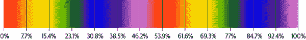
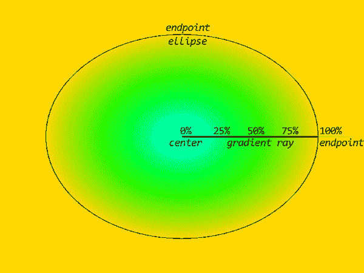
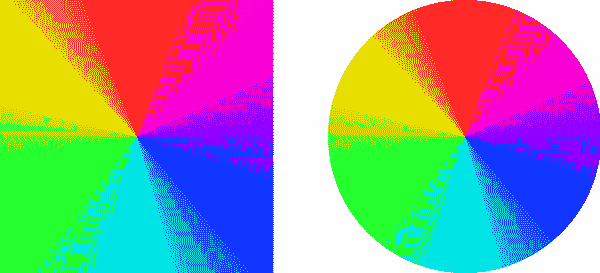

# 第九章：渐变

CSS 定义的三种图像类型完全由 CSS 描述：线性渐变、径向渐变和锥形渐变。每种类型有两种子类型：重复和非重复。渐变通常用于背景中，尽管它们可以用在允许图像的任何上下文中，例如 `list-style-image` 和 `border-image`。

*渐变* 是从一种颜色到另一种颜色的视觉过渡。从黄色到红色的渐变将从黄色开始，经过逐渐减少的黄色、更红的橙色阴影，最终到达完全的红色。过渡的平缓程度取决于渐变的空间量以及定义颜色停止点和进度颜色提示的方式。如果你在 100 像素上从白色渐变到黑色，那么默认渐变过程中每个像素将变为更黑的灰色，如图 9-1 所示。


###### 图 9-1。简单渐变的过程

当我们探索渐变的过程时，始终牢记一点：*渐变是图像*。不管你是通过键入 CSS 描述它们，它们与 SVG、PNG、JPEG 等图像一样——但渐变具有出色的渲染性能，无需额外的 HTTP 请求加载，并且可以无限缩放。

渐变的有趣之处在于它们没有固有的尺寸。如果使用 `background-size` 属性值 `auto`，它将被视为 `100%`。因此，如果你未为背景渐变定义 `background-size`，它将设置为默认值 `auto`，这与声明 `100% 100%` 相同。因此，默认情况下，背景渐变填充整个背景定位区域。只需注意，如果使用长度（而不是百分比）值偏移渐变的背景位置，默认情况下它将平铺。

# 线性渐变

*线性渐变* 是沿线性向量进行的渐变填充，称为 *渐变线*。这里是几个相对简单的渐变示例，结果显示在图 9-2 中：

```
#ex01 {background-image: linear-gradient(purple, gold);}
#ex02 {background-image: linear-gradient(90deg, purple, gold);}
#ex03 {background-image: linear-gradient(to left, purple, gold);}
#ex04 {background-image: linear-gradient(-135deg, purple, gold, navy);}
#ex05 {background-image: linear-gradient(to bottom left, purple, gold, navy);}
```


###### 图 9-2。简单线性渐变

这是最基本的渐变形式：两种颜色。这导致了从背景绘制区域顶部的第一种颜色到底部的第二种颜色的渐变。

默认情况下，渐变从顶部到底部，因为渐变的默认方向是 `to bottom`，这等同于 `180deg` 和其各种等效方式（例如 `0.5turn`）。如果你想沿不同方向进行渐变，可以在渐变值前加上一个方向。这就是我们在图 9-2 中展示的所有其他渐变所做的。

渐变必须至少有两个颜色停止点。它们可以是相同的颜色。如果你只想在内容的部分区域背后使用单一颜色，可以使用同一颜色声明两次的渐变，以及背景大小和不重复，如图 9-3 所示：

```
blockquote {
	padding: 0.5em 1em 2em;
	background-image:
		linear-gradient(palegoldenrod, palegoldenrod),
		linear-gradient(salmon, salmon);
	background-size: 75% 90%;
	background-position: 0px 0px, 15px 30px;
	background-repeat: no-repeat;
     columns: 3;
}
```


###### 图 9-3\. 单一颜色渐变

线性渐变的基本语法如下所示：

```
linear-gradient(
    [[ <*angle*> | to <*side-or-quadrant*> ],]?
     [ <*color-stop-list*> [, <*color-hint*>]? ]# ,
    <*color-stop-list*>
)
```

我们将很快探讨颜色停止列表和颜色提示。现在，请记住的基本模式是在开头可选的方向，一系列颜色停止点和/或颜色提示，以及一个结束的颜色停止点。如前所示，`linear-gradient()`值必须至少有两个颜色停止点。

当你只描述使用诸如`top`和`right`这样的关键字的一侧或象限时，你只使用`to`关键字，而你给出的方向总是描述渐变线条指向的方向。换句话说，`linear-gradient(0deg,red,green)`会使红色在底部，绿色在顶部，因为渐变线条指向 0 度（元素的顶部），因此以绿色结束。虽然它确实“朝向 0 度”，但如果你使用角度值，记得忽略`to`关键字，因为像`to 45deg`这样的内容是无效的，并且会被忽略。度数从顶部顺时针增加。

重要的一点是，虽然`0deg`等同于`to top`，但`45%`并不等同于`to top right`。这在“理解渐变线条：详细信息”中有解释。同样重要的是要记住，使用角度时，无论是度数、弧度还是圈数，单位类型是*必需*的。`0`值是无效的，并将阻止创建任何渐变，而`0deg`是有效的。

## 设置渐变颜色

在渐变中可以使用任何你喜欢的颜色值，包括像`rgba()`这样的 alpha 通道值和像`transparent`这样的关键字。因此，通过与透明度为零的颜色混合，完全可以使渐变中的部分逐渐消失或出现。考虑以下规则，这些规则在图 9-4 中有所描述：

```
#ex01 {background-image:
    linear-gradient( to right, rgb(200,200,200), rgb(255,255,255) );}
#ex02 {background-image:
    linear-gradient( to right, rgba(200,200,200,1), rgba(200,200,200,0) );}
```


###### 图 9-4\. 淡出至白色与淡出至透明

第一个示例从浅灰色渐变至白色，而第二个示例将相同的浅灰色从不透明渐变至透明，因此允许父元素的黄色背景显示出来。

你不仅限于两种颜色。尽管这是允许的最少颜色数，但你可以添加尽可能多的颜色。考虑以下渐变：

```
#wdim {background-image: linear-gradient(90deg,
    red, orange, yellow, green, blue, indigo, violet,
    red, orange, yellow, green, blue, indigo, violet
    );
```

渐变线指向 90 度，即右侧。总共有 14 个颜色停止点，每个逗号分隔的颜色名称对应一个，它们默认均匀分布在渐变线上，第一个位于线的起始处，最后一个位于末尾。默认情况下，在颜色停止点之间，颜色会尽可能平滑地混合。这在图 9-5 中显示，额外的标签指示了颜色停止点在渐变线上的位置。



###### 图 9-5\. 沿着渐变线的颜色停止点分布

因此，如果没有指示颜色停止点应该放置在何处，它们将均匀分布。幸运的是，我们可以为每种颜色提供最多两个位置，并且可以使用颜色提示来更好地控制渐变的进展，从而改善视觉效果。

## 定位颜色停止点

<*`color-stop`*> 的完整语法如下：

```
[<*color*>] [ <*length*> | <*percentage*> ]{1,2}?
```

在每个颜色值之后，您可以（但不一定要）提供一个或两个位置值。这使您能够将颜色停止点的默认均匀分布进度扭曲为其他形式。

我们将从长度开始，因为它们非常简单。让我们以彩虹的形式进行进展（这次只有一个彩虹），并且每 25 像素出现一种彩虹颜色，如图 9-6 所示：

```
#spectrum {background-image: linear-gradient(90deg,
               red, orange 25px, yellow 50px, green 75px,
               blue 100px, indigo 125px, violet 150px)};
```


###### 图 9-6\. 每 25 像素放置一个颜色停止点

这个处理得很好，但请注意在 150 像素后会发生什么—紫罗兰色会持续到渐变线的末端。如果设置颜色停止点使其无法达到基本渐变线的末端，就会发生这种情况：最后一个颜色会持续向前。

相反，如果您的颜色停止点超出了基本渐变线的末端，渐变将似乎在它达到渐变线可见部分末端时停止。这在图 9-7 中有所说明，由以下代码创建：

```
#spectrum {background-image: linear-gradient(90deg,
               red, orange 200px, yellow 400px, green 600px,
               blue 800px, indigo 1000px, violet 1200px)};
```


###### 图 9-7\. 当颜色停止点超出范围时的渐变剪切

由于最后一个颜色停止点在 1200 像素处，但背景大小远远不及这么宽，渐变的可见部分在大约蓝色处停止。

在上述两个示例和图中，请注意第一个颜色（`red`）没有长度值。如果第一个颜色没有位置，则假定它是渐变线的起始点，就好像声明了`0%`（或其他零值，如`0px`）。同样，如果最后一个颜色停止点没有指定位置，则假定它是渐变线的末尾。（但请注意，对于重复渐变来说并非如此，我们将在“重复线性渐变”中讨论。）

您可以使用任何长度值，不仅限于像素，还有 em、视口单位等。您甚至可以在同一个渐变中混合不同的单位，尽管通常不建议这样做，原因稍后我们将详细讨论。如果需要，还可以使用负长度值；这将在渐变线的开始之前放置一个颜色停止点，所有的颜色过渡将按预期进行，并且剪切方式与发生在线末端的剪切方式相同。例如，以下代码的结果是 图 9-8：

```
#spectrum {background-image: linear-gradient(90deg,
               red -200px, orange 200px, yellow 400px, green 600px,
               blue 800px, indigo 1000px, violet 1200px)};
```


###### 图 9-8\. 当颜色停止点具有负位置时的渐变裁剪

至于百分比，它们是相对于渐变线总长度计算的。在渐变线的中点处放置的颜色停止点为 `50%`。让我们回到我们的彩虹示例，不再每 25 像素设置一个颜色停止点，而是每个渐变线长度的 10% 设置一个。这将看起来像以下示例，并在 图 9-9 中显示结果：

```
#spectrum {background-image: linear-gradient(90deg,
    red, orange 10%, yellow 20%, green 30%, blue 40%, indigo 50%, violet 60%)};
```


###### 图 9-9\. 每 10% 放置颜色停止

正如你之前所见，由于最后的颜色停止位于渐变线的末尾之前，其颜色（`violet`）将一直延续到渐变的末端。这些停止点比之前 25 像素的示例更分散，但除此之外，其他事情基本上是一样的。

如果某些颜色停止点具有位置值，而其他颜色停止点没有，则没有位置值的停止点将在具有位置值的停止点之间均匀分布。以下是等效的：

```
#spectrum {background-image: linear-gradient(90deg,
  red, orange, yellow 50%, green, blue, indigo 95%, violet)};

#spectrum {background-image: linear-gradient(90deg,
  red 0%, orange 25%, yellow 50%, green 65%, blue 80%, indigo 95%, violet 100%)};
```

因为 `red` 和 `violet` 没有指定的位置值，它们分别被认为是 `0%` 和 `100%`。这意味着 `orange`、`green` 和 `blue` 将均匀分布在它们两侧明确定义的位置之间。

对于 `orange`，这意味着位于 `red 0%` 和 `yellow 50%` 中间的点，即 25%。对于 `green` 和 `blue`，它们需要排列在 `yellow 50%` 和 `indigo 95%` 之间。这是一个 45% 的差距，被分成三段，因为四个值之间有三个间隔。这意味着 65% 和 80%。

您可能会想知道，如果将两个颜色停止点放在完全相同的位置，会发生什么，如下所示：

```
#spectrum {background-image: linear-gradient(90deg,
    red 0%, orange, yellow 50%, green 50%, blue , indigo, violet)};
```

所有发生的就是两个颜色停止点被放在一起。图 9-10 显示了结果。


###### 图 9-10\. 重合或“硬”颜色停止的效果

渐变线在整个渐变线上像往常一样混合，但在 50% 的位置，它立即在零长度内从黄色到绿色混合，创建了通常称为*硬*颜色停止的效果。因此，渐变从 25% 处的橙色（0% 到 50% 之间的一半）到 50% 处的黄色混合，然后在零长度内从黄色到绿色混合，然后在 50% 处从绿色到蓝色混合到 66.67% 处（50% 到 100% 之间的三分之一）。

如果你想创建条纹效果，这种硬停止效果可能会很有用。以下代码会产生图 9-11 中显示的条纹效果：

```
.stripes {background-image: linear-gradient(90deg,
    gray 0%, gray 25%,
    transparent 25%, transparent 50%,
    gray 50%, gray 75%,
    transparent 75%, transparent 100%);}
```


###### 图 9-11\. 硬停止条纹

也可以通过更简单和更易读的方式来实现这种效果，即为每种颜色指定起始和结束停止位置。以下是如何做到这一点，与图 9-11 中显示的完全相同的结果：

```
.stripes {background-image:
	linear-gradient(90deg,
		gray 0% 25%,
		transparent 25% 50%,
		gray 50% 75%,
		transparent 75% 100%);}
```

请注意，`0%`和`100%`可以被省略，浏览器会自动推断。因此，你可以保留它们以便清晰，或者根据需要删除以提高效率。

在单个渐变中混合两个停止条纹和一个停止颜色点也是可以的。如果你想让渐变的第一和最后一个四分之一是实心灰色条纹，并在它们之间通过透明度过渡，可能会看起来像这样：

```
.stripes {background-image:
	linear-gradient(90deg,
		gray 0% 25%,
		transparent 50%,
		gray 75% 100%);}
```

好的，所以如果你把颜色停止点放在一起会发生什么，但如果你把一个*放在*另一个之前会发生什么呢？就像这样：

```
#spectrum {background-image: linear-gradient(90deg,
    red 0%, orange, yellow, green 50%, blue 40%, indigo, violet)};
```

有问题的颜色停止点（在本例中为蓝色）设置为前一个颜色停止点的最大指定值。在这里，它设置为`50%`，因为它之前的停止点具有该位置。这会创建一个硬停止，我们得到了之前看到的效果，当绿色和蓝色的颜色停止点放在一起时。

这里的关键点是颜色停止点设置为其前一个停止点的最大*指定*位置。因此，以下两个渐变在视觉上是相同的，因为第一个中的`靛蓝`颜色停止点被设置为`50%`：

```
#spectrum {background-image: linear-gradient(90deg,
    red 0%, orange, yellow 50%, green, blue, indigo 33%, violet)};

#spectrum {background-image: linear-gradient(90deg,
    red 0%, orange, yellow 50%, indigo 50%, violet)};
```

在这种情况下，靛蓝停止点之前的最大指定位置是黄色停止点处的`50%`。因此，渐变从红色渐变到橙色再到黄色，然后在渐变从靛蓝到紫色之前有一个硬切换。绿色和蓝色并没有被跳过；相反，渐变在零距离内从黄色过渡到绿色再到蓝色再到靛蓝。查看图 9-12 以查看结果。


###### 图 9-12\. 处理位置不正确的颜色停止点

这种行为是单个渐变中混合单位通常不鼓励的原因。例如，如果你混合`rem`单位和百分比，那么使用百分比定位的颜色停止点可能会在使用 rem 定位的较早颜色停止点之前。

## 设置颜色提示

到目前为止，我们已经使用了颜色停止点，但你可能还记得线性渐变的语法允许在每个颜色停止点之后添加颜色提示：

```
linear-gradient(
    [[ <*angle*> | to <*side-or-quadrant*> ],]?
     [ <*color-stop-list*> [, <*color-hint*>]? ]# ,
    <*color-stop-list*>
)
```

<*`颜色提示`*>是一种修改两侧颜色停止点之间混合的方式。默认情况下，从一个颜色停止点到下一个的混合是线性的，混合的中点位于两个颜色停止点之间的中间位置，即 50%。它不一定那么简单。以下两个渐变是相同的，并且具有图 9-13 中显示的结果：

```
linear-gradient(
    to right, rgb(0% 0% 0%) 25%, rgb(90% 90% 90%) 75%
)
linear-gradient(
    to right, rgb(0% 0% 0%) 25%, 50%, rgb(90% ,90% ,90%) 75%
)
```


###### 图 9-13\. 从一个颜色停止点线性混合到下一个

使用颜色提示，我们可以改变进度的中点。不再在中途点达到`rgb(45% 45% 45%)`，而是可以设置为两个停止点之间的任何点。因此，以下 CSS 导致了图 9-14 中看到的结果：

```
#ex01 {background:
     linear-gradient(to right, rgb(0% 0% 0%) 25%, rgb(90% 90% 90%) 75%);}
#ex02 {background:
     linear-gradient(to right, rgb(0% 0% 0%) 25%, 33%, rgb(90 90% 90%) 75%);}
#ex03 {background:
     linear-gradient(to right, rgb(0% 0% 0%) 25%, 67%, rgb(90% 90% 90%) 75%);}
#ex04 {background:
     linear-gradient(to right, rgb(0% 0% 0%) 25%, 25%, rgb(90% 90% 90%) 75%);}
#ex05 {background:
     linear-gradient(to right, rgb(0% 90% 90%) 25%, 75%, rgb(90% 90% 90%) 75%);}
```


###### 图 9-14\. 从黑色到灰色，具有不同中点提示的情况

在所有五个示例中，第一个颜色停止点位于 25%标记处，最后一个位于 75%标记处，但每个渐变的中点不同。在第一种情况（`#ex01`）中，使用了默认的线性进度，中间颜色（45%黑色）出现在两个颜色停止点之间的中点处。

在第二种情况（`#ex02`）中，中间颜色发生在渐变线的 33%点。因此，第一个颜色停止点位于线的 25%点处，中间颜色发生在 33%处，第二个颜色停止点位于 75%处。

在第三个示例（`#ex03`）中，中点位于渐变线的 67%处；因此，颜色从 25%处的黑色淡出到 67%处的中间颜色，然后从 67%处的中间颜色淡出到 75%处的浅灰色。

第四个和第五个示例展示了当将颜色提示的距离放置在其中一个颜色停止点上时会发生什么：会得到一个硬停止。

关于颜色提示的有趣之处在于，从颜色停止点到颜色提示再到颜色停止点的进度不仅仅是两个线性进度的集合。相反，进度中有一些“弯曲”，以便从颜色提示的一侧到另一侧缓解。（确切的曲线是对数曲线，并基于 Photoshop 使用的渐变进度方程。）通过比较看起来应该是但实际上不是的两个渐变，这一点最容易看出来。正如您可以在图 9-15 中看到的那样，这两个示例的结果非常不同：

```
#ex01 {background:
    linear-gradient(to right,
        rgb(0% 0% 0%) 25%,
        rgb(45% 45% 45%) 67%,   /* this is a color stop */
        rgb(90% 90% 90%) 75%);}
#ex02 {background:
    linear-gradient(to right,
        rgb(0% 0% 0%) 25%,
        67%,                    /* this is a color hint */
        rgb(90% 90% 90%) 75%);}
```


###### 图 9-15\. 比较两个线性渐变和一个带有提示的过渡

注意灰色渐变在这两个示例中的差异。第一个示例显示了从黑色线性渐变到`rgb(45%,45%,45%)`，然后从那里线性渐变到`rgb(90%,90%,90%)`。第二个示例在相同的距离上从黑色渐变到浅灰色，渐变的颜色提示点位于 67%处，但是为了尝试更平滑的总体渐变而进行了修改。在两个示例中，25%、67%和 75%处的颜色相同，但是因为 CSS 规范中定义的（有些复杂的）缓解算法，沿途的所有其他色调都不同。

###### 警告

如果你熟悉动画，你可能会考虑将缓动函数（如`ease-in`）放入颜色提示中，以更好地控制颜色的混合方式。虽然浏览器在某种程度上确实这样做了，正如图 9-15 所示，但截至 2022 年末，开发者目前无法控制这一点（尽管 CSS 工作组正在认真讨论这一能力）。

## 理解梯度线：详细内容

现在你已经掌握了放置颜色停止的基础知识，让我们仔细看看梯度线是如何构建的，以及它们如何产生它们的效果。首先，让我们设置一个简单的梯度，然后解析它的工作原理：

```
linear-gradient(
    55deg, #4097FF, #FFBE00, #4097FF
)
```

现在，这个在罗盘上 55 度处的一维构造如何创建二维渐变填充？首先，放置梯度线并确定其起点和终点。这在图 9-16 中有示意图，并且旁边展示了最终的梯度。


###### 图 9-16\. 梯度线的放置和大小

首先要明确的一点是，这里看到的框不是一个元素——它本身就是线性渐变图像。（记住，我们在这里创建的是图像。）该图像的大小和形状可能取决于很多因素，无论是元素背景的大小还是如`background-size`属性的应用，这是我们稍后会讨论的话题。现在，我们只集中在图像本身上。

所以，在图 9-16 中，你可以看到梯度线直接穿过图像的中心。梯度线*总是*穿过梯度图像的中心，在这种情况下，梯度图像位于背景区域的中心。（使用`background-position`来移动梯度图像的位置可能会使看起来梯度的中心不在图像中心，但实际上是在中心。）这个梯度设置为 55 度角，因此指向罗盘上的 55 度。有趣的是梯度线的起点和终点实际上在图像外部。

让我们先谈谈起点。这是在梯度线上的一个点，与梯度线垂直相交于离梯度线方向（`55deg`）最远的图像角落处。相反，梯度线的终点是在梯度线上的一个点，与离梯度线方向最近的图像角落相交的点。

请注意，“起点”和“终点”这些术语有些误导——梯度线实际上并不在任何一个点停止。事实上，梯度线是无限的。然而，“起点”是默认情况下第一个颜色停止的位置，对应于位置值`0%`。类似地，“终点”对应于位置值`100%`。

因此，让我们考虑之前定义的渐变：

```
linear-gradient(
    55deg, #4097FF, #FFBE00, #4097FF
)
```

起始点的颜色将为`#4097FF`，中点的颜色（也是渐变图像的中心）将为`#FFBE00`，结束点的颜色将为`#4097FF`，在它们之间进行平滑混合。这在图 9-17 中有所说明。


###### 图 9-17\. 沿着渐变线计算颜色

到目前为止一切都很好。但是，你可能会想知道，如果这些点在图像之外，底部左侧和顶部右侧的角是如何设置为与起始点和结束点计算出的相同的蓝色的？因为沿着渐变线的每个点的颜色都是从渐变线垂直延伸出来的。这在图 9-18 中部分显示，通过在起始点和结束点以及它们之间每 5%的渐变线处延伸垂直线来展示。请注意，垂直于渐变线的每条线都是单色的。


###### 图 9-18\. 沿着渐变线延伸的选定颜色

希望这足以让你在脑海中填补其余部分，所以让我们考虑在各种其他设置中渐变图像会发生什么。我们将使用与之前相同的渐变定义，但这次应用于宽、正方形和高图像。这些显示在图 9-19 中。请注意，起始点和结束点的颜色始终会进入渐变图像的角落。


###### 图 9-19\. 如何为各种图像构建渐变

请注意，我们非常仔细地说“起始点和结束点的颜色”，而没有说“起始和结束颜色”。这是因为，正如您之前看到的，颜色停止点可以放在起始点之前和结束点之后，如下所示：

```
linear-gradient(
    55deg, #4097FF -25%, #FFBE00, #4097FF 125%
)
```

这些颜色停止点的放置，起始点和结束点，沿着渐变线计算颜色的方式以及最终渐变都显示在图 9-20 中。


###### 图 9-20\. 具有超出起始点和结束点的停止点的渐变

再次看到，底部左侧和顶部右侧的颜色与起始点和结束点的颜色相匹配。只是在这种情况下，由于第一个颜色停止点在起始点之前，起始点的实际颜色是第一个和第二个颜色停止点的混合。同样适用于结束点，它是第二个和第三个颜色停止点的混合。

现在事情有点疯狂了。记得你可以使用方向关键字，比如`top`和`right`，来指示渐变线的方向吗？假设你希望渐变线朝右上方，那么你可以创建一个如下的渐变图像：

```
linear-gradient(
    to top right, #4097FF -25%, #FFBE00, #4097FF 125%
)
```

这并*不*会导致渐变线与右上角相交。如果只是这样该多好！相反，发生的事情要复杂得多。首先，让我们在图 9-21（#cab_fig78）中画出来，这样我们就有东西可以参考了。


###### 图 9-21。朝右上方向的渐变

你的眼睛没有被欺骗：渐变线远离了右上角。不过，它确实是朝着图像的右上象限前进。这才是`to top right`真正的意思：朝着图像的右上象限前进，而不是朝向右上角。

如图 9-21（#cab_fig78）所示，要确切了解这意味着什么，需要做以下事情：

1.  从图像的中点向已声明的象限中的相邻角绘制一条线。因此，对于右上象限，相邻的角是左上角和右下角。

1.  找到该线的中心点，即图像的中心点，并通过该线的垂直线绘制渐变线，通过中心点指向已声明的象限。

1.  构建渐变——即确定起点和终点、放置或分布沿渐变线的颜色停止点，然后按照通常的方式计算整个渐变图像。

这个过程有一些有趣的副作用。首先，中点处的颜色将始终从一个象限相邻的角延伸到另一个象限相邻的角。其次，如果图像的形状发生变化，即其纵横比发生变化，则渐变线也将重置其方向，稍微重新定位以适应新的纵横比。因此，如果你有可变元素，请注意这一点。第三，一个完全正方形的渐变图像将具有与角相交的渐变线。图 9-22（#cab_fig79）展示了这三种副作用的示例，使用以下渐变定义：

```
linear-gradient(
    to top right, purple, green 49.5%, black 50%, green 50.5%, gold
)
```


###### 图 9-22。象限定向渐变的副作用示例

遗憾的是，没有办法说“将渐变线指向非正方形图像的角”，除非自己计算所需的度数，并明确声明，这个过程很可能需要使用 JavaScript，除非你知道图像在所有情况下将永远是精确的尺寸。（或使用`aspect-ratio`属性；详见第六章）

尽管线性渐变沿着由角度设定的渐变线方向进行渐变，但也可以创建镜像渐变；关于这一点，很奇怪地，请参阅“径向渐变”。

## 重复线性渐变

默认情况下，常规渐变是自动调整大小的，与其应用的背景区域的大小匹配。换句话说，默认情况下，渐变图像占据了所有可用的背景空间，并且不重复。

故意设置背景大小和平铺图像，特别是使用硬颜色停止，可以产生有趣的效果。通过声明两个线性渐变背景图像，使用硬颜色停止，垂直渐变线，并不同的背景颜色，你可以通过设置一些渐变图像、平铺它们，然后在下面放置一种颜色，为任何摆设创造野餐桌布效果，如 图 9-23 所示：

```
div {
   background-image:
      linear-gradient(to top, transparent 1vw, rgba(0 0 0 / 0.2) 1vw),
      linear-gradient(to right, transparent 1vw, rgba(0 0 0 / 0.2) 1vw);
   background-size: 2vw 2vw;
   background-repeat: repeat;
}
div.fruit {background-color: papayawhip;}
div.grain {background-color: palegoldenrod;}
div.fishy {background-color: salmon;}
```


###### 图 9-23\. Papayawhip、palegoldenrod 和 salmon 颜色的桌布

而不是用 `background-size` 定义渐变大小并使用 `background-repeat` 平铺它，我们可以使用重复线性渐变语法。通过在线性渐变前添加 `repeating`，它们将在渐变的尺寸内无限重复。换句话说，因为使用 `repeating-linear-gradient` 时渐变线的大小是最后一个颜色停止位置减去第一个颜色停止位置（在本例中为 `2vw`），所以我们可以移除尺寸和重复属性，如下所示，得到与 图 9-23 中显示的相同结果：

```
div {
   background-image:
     repeating-linear-gradient(to top,
        transparent 0 1vw, rgb(0 0 0 / 0.2) 1vw 2vw),
     repeating-linear-gradient(to right,
        transparent 0 1vw, rgb(0 0 0 / 0.2) 1vw 2vw);
}
div.fruit {background-color: papayawhip;}
div.grain {background-color: palegoldenrod;}
div.fishy {background-color: salmon;}
```

对于像这些桌布这样的简单图案来说很好用，但对于更复杂的情况来说尤为方便。例如，如果你声明以下不重复的渐变，你会在图像重复的地方出现不连续，如图 9-24 所示：

```
h1.example {background:
    linear-gradient(-45deg, black 0, black 25px, yellow 25px, yellow 50px)
    top left/40px 40px repeat;}
```


###### 图 9-24\. 使用重复背景图像平铺渐变图像

你*可以*尝试准确地锁定元素和渐变图像的大小，然后搞乱渐变图像的构造，试图使边缘对齐，但使用以下方法会更容易些，其结果如 图 9-25 所示：

```
h1.example {background: repeating-linear-gradient(-45deg,
        black 0 25px, yellow 25px 50px) top left;}
```


###### 图 9-25\. 重复渐变图像

注意，最后一个颜色停止以显式长度 (`50px`) 结束。这对于重复渐变非常重要，因为最后一个颜色停止的长度值定义了图案的总长度。如果你省略了结束停止，它将默认为 100%，即渐变线的末端。

如果你正在使用更平滑的过渡效果，你需要注意最后一个颜色停止处的颜色值要与第一个颜色停止处的颜色值匹配。考虑以下情况：

```
repeating-linear-gradient(-45deg, purple 0px, gold 50px)
```

这将在 50 像素处产生从紫色到金色的平滑渐变，然后在另外 50 像素处回到紫色，并再次进行紫色到金色的混合。通过添加一个与第一个颜色停止处相同颜色的额外颜色停止，可以使渐变平滑，避免硬停止线：

```
repeating-linear-gradient(-45deg, purple 0px, gold 50px, purple 100px)
```

查看 图 9-26 对比这两种方法。


###### 图 9-26\. 处理重复渐变图像中的硬重置

您可能已经注意到，到目前为止，所有重复渐变都没有定义大小。这意味着图像默认大小为应用到它们的元素的完整背景定位区域，默认行为适用于没有固有高度和宽度的图像。

如果你使用`background-size`来调整重复渐变图片的大小，那么渐变将仅在渐变图片的边界内重复。然后，如果你使用`background-repeat`重复该图片，你可能会再次出现背景中的不连续性。

如果你在重复线性渐变中使用百分比，它们将会被放置在与非重复渐变相同的位置。然而，这意味着所有由这些颜色停止定义的渐变都将被看到，并且没有重复将是可见的，因此百分比往往是有点无意义的，特别是对于重复线性渐变。

# 径向渐变

线性渐变非常棒，但有时您确实需要一个圆形渐变。您可以使用这样的渐变来创建聚光灯效果，圆形阴影，圆角发光或任何其他效果，包括反射渐变。使用的语法与线性渐变的语法类似，但也存在一些有趣的差异：

```
radial-gradient(
    [ [ <*shape*> ‖ <*size*> ] [ at <*position*>]? , | at <*position*>, ]?
      [ <*color-stop-list*> [, <*color-hint*>]? ] [, <*color-stop-list*> ]+
)
```

这归结为您可以选择声明形状和大小，选择声明渐变中心的位置，然后声明两个或更多颜色停止，以及停止之间的可选颜色提示。在形状和大小部分提供了一些有趣的选项，因此让我们逐步构建这些选项。

首先，让我们看一个简单的径向渐变——事实上是可能的最简单的——呈现在各种不同形状的元素中（图 9-27）：

```
.radial {background-image: radial-gradient(purple, gold);}
```


###### 图 9-27\. 多种设置中的简单径向渐变

在所有这些情况下，因为没有声明位置，所以使用了`center`的默认值，并且默认椭圆的纵横比与图像大小相同。因为没有声明形状，所以对于所有情况，除了正方形元素，形状都是椭圆。最后，因为没有声明颜色停止或颜色提示位置，所以第一个位于渐变光线的起始位置，最后一个位于结束位置，两者之间线性混合。

没错：*渐变光线* 是径向渐变中与线性渐变中的渐变线相对应的部分。它从渐变的中心向外延伸，直接到右侧，渐变的其余部分则根据它构建。（我们稍后会详细介绍细节。）

## 设置形状和大小

首先，径向渐变确实有两种可能的形状值（因此有两种可能的形状）：`circle` 和 `ellipse`。渐变的形状可以明确声明，也可以通过渐变图片的大小来暗示。

因此，关于大小的问题。通常，调整径向渐变大小的最简单方法是使用一个非负长度（如果调整的是圆形）或两个非负长度（如果调整的是椭圆形）。比如，你有这样一个径向渐变：

```
radial-gradient(50px, purple, gold)
```

这会创建一个从中心渐变为 50 像素距离处的金色渐变的圆形径向渐变。如果我们增加另一个长度，形状将变成一个宽度与第一个长度相同、高度与第二个长度相同的椭圆：

```
radial-gradient(50px 100px, purple, gold)
```

图 9-28 展示了这两种渐变效果。


###### 图 9-28\. 简单的径向渐变

请注意，渐变的形状与其出现图像的整体大小和形状无关。如果你使渐变成圆形，它就是一个圆形，即使它在一个矩形渐变图像内部。同样，椭圆形始终保持椭圆形，即使它在一个正方形渐变图像内部。

你也可以使用百分比值来表示大小，但**仅限于**椭圆。圆形不能使用百分比大小，因为无法指示百分比所应用的轴线。（想象一个高 500 像素宽 100 像素的图像。`10%`应该是 10 像素还是 50 像素？）如果你尝试为圆形提供百分比值，整个声明都会因为无效值而失败。

如果你给椭圆形提供百分比值，那么和往常一样，第一个值指的是水平轴，第二个值指的是垂直轴。下面的渐变在图 9-29 中展示了各种设置：

```
radial-gradient(50% 25%, purple, gold)
```


###### 图 9-29\. 百分比大小的椭圆形渐变

当涉及到椭圆形时，你还可以混合使用长度和百分比，只需注意小心。因此，如果你感到有信心，完全可以创建一个椭圆形径向渐变，高 10 像素，宽度为元素宽度的一半，如下所示：

```
radial-gradient(50% 10px, purple, gold)
```

恰巧地，长度和百分比不是调整径向渐变大小的唯一方法。除了这些值类型外，还有四个关键词可供调整径向渐变的大小，其效果在此总结：

`closest-side`

如果径向渐变的形状是圆形，渐变会被调整大小，使渐变射线的末端正好触及最接近径向渐变中心点的渐变图像边缘。如果形状是椭圆，渐变射线的末端会分别触及水平和垂直轴上最接近的边缘。

`farthest-side`

如果径向渐变的形状是圆形，渐变会被调整大小，使渐变射线的末端正好触及离径向渐变中心点最远的渐变图像边缘。如果形状是椭圆，渐变射线的末端会分别触及水平和垂直轴上的最远边缘。

`closest-corner`

如果径向渐变的形状是圆形，则渐变被调整大小，使得渐变射线的端点恰好触及离径向渐变中心点最近的渐变图像角落。如果形状是椭圆，则渐变射线的端点仍然触及离中心最近的角落，并且椭圆具有与指定`closest-side`时相同的长宽比。

`farthest-corner`（默认）

如果径向渐变的形状是圆形，则渐变被调整大小，使得渐变射线的端点恰好触及离中心点最远的渐变图像角落。如果形状是椭圆，则渐变射线的端点仍然触及离中心最远的角落，并且椭圆具有与指定`farthest-side`时相同的长宽比。注意：这是径向渐变的默认大小值，因此在未声明任何大小值时使用。

要更好地可视化每个关键字的结果，请参见图 9-30，它展示了每个关键字作为圆形和椭圆应用的效果。


###### 图 9-30\. 径向渐变大小关键字的效果（位于`at 33% 66%`位置）

这些关键字不能与椭圆形径向渐变中的长度或百分比混合使用；因此，`closest-side 25px`是无效的，会被忽略。

你可能在图 9-30 中注意到的一点是渐变不是从图像的中心开始的。这是因为它们被放置在其他地方，这是下一节的主题。

## 定位径向渐变

如果您想将径向渐变的中心位置偏离`center`的默认位置，可以使用任何对于`background-position`有效的位置值。我们不会在这里复制这种相当复杂的语法；如果需要恢复记忆，请回到“定位背景图像”。

当我们说“任何有效的位置值”时，这意味着任何允许的长度、百分比、关键字等的组合。这还意味着，如果省略其中一个位置值，它将被推断为`background-position`的相同方式。因此，举一个例子，`center`等同于`center center`。径向渐变位置和背景位置之间唯一的主要差异是默认值：对于径向渐变， 默认位置是`center`，而不是`0% 0%`。

为了让您对可能性有所了解，请考虑以下规则，这些规则在图 9-31 中进行了说明：

```
radial-gradient(at bottom left, purple, gold);
radial-gradient(at center right, purple, gold);
radial-gradient(at 30px 30px, purple, gold);
radial-gradient(at 25% 66%, purple, gold);
radial-gradient(at 30px 66%, purple, gold);
```


###### 图 9-31\. 更改径向渐变的中心位置

那些定位的径向渐变都没有明确的尺寸，因此它们都默认为`farthest-corner`。这是对预期默认行为的合理猜测，但并不是唯一的可能性。让我们将一些尺寸混入这些渐变中，看看这如何改变事物（如图 9-32 所示）：

```
radial-gradient(30px at bottom left, purple, gold);
radial-gradient(30px 15px at center right, purple, gold);
radial-gradient(50% 15% at 30px 30px, purple, gold);
radial-gradient(farthest-side at 25% 66%, purple, gold);
radial-gradient(closest-corner at 30px 66%, purple, gold);
```


###### 图 9-32\. 改变明确定义大小的径向渐变的中心位置

很巧妙。现在，假设我们想要比一个颜色到另一个颜色的渐变更复杂的东西。接下来是颜色停止点！

## 使用径向颜色停止和渐变光线

径向渐变的颜色停止点与线性渐变具有相同的语法并且类似地工作。让我们回到最简单的可能径向渐变，并跟随一个更明确的等价版本：

```
radial-gradient(purple, gold);
radial-gradient(purple 0%, gold 100%);
```

因此，渐变光线从中心点向外延伸。在 0%（起始点，也是渐变的中心）处，光线为紫色。在 100%（结束点）处，光线为金色。在两个停止点之间是从紫色平滑过渡到金色；超过结束点则是纯金色。

如果我们在紫色和金色之间添加一个停止点，但不给它一个位置，那么停止点将被放置在两种颜色之间的中间位置，并且混合效果将相应地改变，如图 9-33 所示：

```
radial-gradient(100px circle at center, purple 0%, green, gold 100%);
```


###### 图 9-33\. 添加一个颜色停止点

如果我们在那里添加`green 50%`，我们会得到相同的结果，但你明白我的意思。渐变光线的颜色平滑地从紫色过渡到绿色，然后到金色，在光线的那一点之后是纯金色。

这说明了渐变线（用于线性渐变）与渐变光线之间的一个区别：线性渐变是通过沿着每个点垂直延伸颜色来推导的。径向渐变也有类似的行为，不同的是，不是从渐变线上产生的线条，而是创建椭圆；这些椭圆是结束点的椭圆的放大或缩小版本。图 9-34 展示了一个渐变光线以及沿其各点绘制的椭圆。


###### 图 9-34\. 渐变光线及其生成的部分椭圆

这提出了一个有趣的问题：每个渐变光线的结束点（如果你愿意，可以是 100%点）如何确定？这是渐变光线与尺寸描述的形状相交的点。对于圆形，这很容易：渐变光线的结束点是尺寸值指示的距离中心的位置。因此，对于`25px 圆形`渐变，光线的结束点是距离中心 25 像素的位置。

对于椭圆，基本上是同样的操作，只是距离中心的距离取决于椭圆的水平轴。给定一个是`40px 20px 椭圆`的径向渐变，结束点将从中心向右直接移动 40 像素。图 9-35 详细展示了这一点。



###### 图 9-35\. 设置渐变射线的结束点

线性渐变线和径向渐变射线之间的另一个区别是您可以看到超出结束点的内容。您可能会记得，线性渐变线始终是这样绘制的，以便您可以看到 0%和 100%点的颜色，但在它们之外什么也看不到；渐变线永远不能小于渐变图像的最长轴，并且通常会比该轴长。另一方面，对于径向渐变，您可以将径向形状大小调整为小于总渐变图像的大小。在这种情况下，最后一个颜色停止点的颜色将从结束点向外延伸。（在几个先前的图像中，您已经看到了这一点。）

相反，如果设置的颜色停止点超出了射线的结束点，您可能会看到到该停止点的颜色。请参考以下渐变，图 9-36 所示：

```
radial-gradient(50px circle at center, purple, green, gold 80px)
```


###### 图 9-36\. 超出结束点的颜色停止点

第一个颜色停止点没有位置，因此将其设置为`0%`，即为中心点。最后一个颜色停止点设置为`80px`，因此它将在所有方向上距中心点 80 像素。中间的颜色停止点`green`放置在两者之间（距离中心 40 像素）。因此，我们得到一个渐变，到 80 像素处变成金色，然后在那一点之外继续保持金色。

即使圆明确设置为 50 像素，这种情况仍然会发生。它仍然是 50 像素的半径；只是最后一个颜色停止点的定位使得这一事实变得不太相关。从视觉上讲，我们可以认为声明了这个：

```
radial-gradient(80px circle at center, purple, green, gold)
```

或者更简单地，只是这样：

```
radial-gradient(80px, purple, green, gold)
```

如果您使用百分比来设置颜色停止点，则相同的行为也适用。从视觉上讲，这些与之前的示例以及彼此等效：

```
radial-gradient(50px, purple, green, gold 160%)
radial-gradient(80px, purple, green, gold 100%)
```

那么，如果您为颜色停止点设置一个负位置会发生什么呢？结果与线性渐变线的情况几乎相同：负颜色停止点用于计算起始点的颜色，但在其他情况下不可见。因此，以下渐变将产生图 9-37 所示的结果：

```
radial-gradient(80px, purple -40px, green, gold)
```


###### 图 9-37\. 处理负色停止位置

鉴于这些颜色停止位置，第一个颜色停止点位于`-40px`，最后一个位于`80px`（因为，由于缺乏显式位置，它默认为结束点），而中间位置则位于它们之间的中间位置。结果与我们明确使用此相同：

```
radial-gradient(80px, purple -40px, green 20px, gold 80px)
```

这就是为什么渐变中心的颜色是绿紫色的原因：它是三分之一紫色，两分之一绿色的混合。从那里，它继续向绿色混合，然后转向金色。紫绿混合的其余部分，即位于渐变射线的“负空间”上的部分，是不可见的。

## 处理退化情况

既然我们可以声明径向渐变的大小和位置，问题来了：如果一个圆形渐变的半径为零，或者一个椭圆形渐变的高度或宽度为零会怎样？这些条件并不像你想象的那么难以实现。除了明确声明径向渐变的大小为 `0px` 或 `0%`，你还可以像这样做：

```
radial-gradient(closest-corner circle at top right, purple, gold)
```

渐变的大小设置为 `closest-corner`，并且中心已移动到右上角，所以最近的角离中心 0 像素远。现在怎么办？

在这种情况下，规范明确指出渐变应该渲染为“一个半径[为]任意大于零的极小数”。这可能意味着它的半径相当于一个十亿分之一像素，或者皮米，甚至普朗克长度。有趣的是，这意味着渐变仍然是一个圆。只不过是一个非常非常非常小的圆。可能它太小以至于渲染不出可见的东西。如果是这样的话，你将只会得到一个填充为最后一个颜色停止点颜色的纯色填充。

长度为零的椭圆形在定义行为上有着迷人的不同。让我们假设以下情况：

```
radial-gradient(0px 50% at center, purple, gold)
```

规范指出，任何宽度为零的椭圆形渲染为“一个宽度[为]任意大的数，高度[为]任意大于零的数”的椭圆形。换句话说，将其渲染为围绕通过椭圆形中心的垂直轴镜像的线性渐变。规范还说，在这种情况下，任何百分比位置的颜色停止点将解析为 `0px`。这通常会导致一个与最后一个颜色停止点定义的颜色匹配的纯色。

另一方面，如果使用长度来定位颜色停止点，你可以免费获得一个在垂直方向镜像的水平线性渐变。考虑下面的渐变，如图 9-38 所示：

```
radial-gradient(0px 50% at center, purple 0px, gold 100px)
```


###### 图 9-38\. 零宽度椭圆的效果

这是怎么发生的呢？首先要记住，规范说 `0px` 的水平宽度被视为一个微小的非零数。为了举例说明，假设是千分之一像素（0.001 px）。这意味着椭圆形的形状是千分之一像素宽，图像高度的一半。再举例说明，假设高度是 100 像素。这意味着第一个椭圆形的形状是千分之一像素宽，100 像素高，其宽高比为 0.001:100，或者 1:100,000。

好了，所以沿着渐变射线绘制的每个椭圆都具有 1:100,000 的宽高比。这意味着在渐变射线的半像素处，椭圆宽度为 1 像素，高度为 100,000 像素。在 1 像素时，宽度为 2 像素，高度为 200,000 像素。在 5 像素时，椭圆为 10 像素宽，一百万像素高。在渐变射线的 50 像素处，椭圆宽度为 100 像素，高度为 1000 万像素。等等。这在图 9-39 中有图示。


###### 图 9-39。非常非常高的椭圆

因此，你可以看到为什么视觉效果是镜像的线性渐变。这些椭圆实际上在绘制垂直线。从技术上讲，它们并不是，但在实际操作中它们是。结果就像你有一个垂直镜像的水平渐变，因为每个椭圆都集中在渐变的中心，并且它的两侧都会被绘制。虽然这可能是一个径向渐变，但我们看不到它的径向特性。

另一方面，如果椭圆有宽度但没有高度，结果会大不相同。你可能认为结果将是沿水平轴镜像的垂直线性渐变，但事实并非如此！相反，结果是一个与最后一个颜色停止点相同的纯色（除非它是重复渐变，这是我们马上要讨论的一个主题，那么它应该是渐变的平均颜色）。因此，根据以下任何一种情况，你将得到一个纯金色：

```
radial-gradient(50% 0px at center, purple, gold)
radial-gradient(50% 0px at center, purple 0px, gold 100px)
```

为什么会有这样的差异呢？这要追溯到径向渐变是如何根据渐变射线构建的。再次记住，根据规范，这里的零距离被视为一个非常小的非零数。与以前一样，我们假设`0px`被重新分配为`0.001px`，而`50%`评估为 100 像素。这是一个宽高比为 100:0.001，即 100,000:1。

所以，为了得到一个高度为 1 像素的椭圆，该椭圆的宽度必须为 100,000 像素。但我们的最后一个颜色停止点只在 100 像素处！在那一点上，绘制的椭圆宽度为 100 像素，高度为千分之一像素。整个紫色到金色的过渡必须发生在那千分之一像素的范围内。之后的所有部分都是金色，如最后一个颜色停止点所示。因此，我们只能看到金色。

你可能会认为，如果你将最后一个颜色停止点的位置增加到`100000px`，你会看到一个薄薄的紫色条纹横穿图像。你是对的，*如果*浏览器在这些情况下将`0px`视为`0.001px`的话。如果它假设的是`0.00000001px`，那么你必须进一步增加颜色停止点的位置才能看到任何东西。这假设浏览器实际上在计算和绘制所有这些椭圆，而不是只是硬编码特殊情况。老实说，后者更有可能。如果我们掌管浏览器的渐变渲染代码，我们会这样做。

如果椭圆的宽度和高度都为零怎么办？在这种情况下，规范写明将使用零宽度行为；因此，您将获得镜像线性渐变行为。

###### 注意

截至 2022 年底，浏览器对这些边缘情况的定义行为的支持稳定性堪忧。在某些情况下，一些浏览器在所有情况下都使用最后一个颜色停止的颜色，而在其他情况下则拒绝绘制渐变。

## 重复径向渐变

虽然百分比在重复线性渐变中可以使其成为非重复渐变，但是如果定义了圆形或椭圆的大小、定义了沿渐变射线的百分比位置，并且您可以看到渐变射线的端点之外，百分比可能非常有用。例如，假设以下情况：

```
.allhail {background:
    repeating-radial-gradient(100px 50px, purple, gold 20%, green 40%,
                              purple 60%, yellow 80%, purple);}
```

由于有五个颜色停止和大小为 100px，每 20 像素就会出现一个颜色停止，颜色按照声明的模式重复。因为第一个和最后一个颜色停止具有相同的颜色值，所以没有明显的颜色切换。涟漪会无限扩展，或者至少直到超出渐变图像的边缘。请参见图 9-40 作为示例。


###### 图 9-40\. 重复径向渐变

想象一下，如果用一个彩虹的重复径向渐变会是什么样子！

```
.wdim {background:
    repeating-radial-gradient(
        100px circle at bottom center,
        rgb(83%,83%,83%) 50%,
        violet 55%, indigo 60%, blue 65%, green 70%,
        yellow 75%, orange 80%, red 85%,
        rgb(47%,60%,73%) 90%
    );}
```

在创建重复径向渐变时，请记住以下两点：

+   如果未为径向渐变声明尺寸维度，则默认为一个椭圆，其高度与宽度比例与整个渐变图像相同；*而且*，如果未为背景图像使用`background-size`声明尺寸，则渐变图像将默认为应用于其背景的元素的高度和宽度（或者，如果作为列表样式符号使用，则为浏览器赋予的尺寸）。

+   默认的径向尺寸值是`farthest-corner`。这将使渐变射线的端点远离中心点的椭圆，使其与渐变图像的最远角相交。

这些再次强调，提醒您，如果您坚持使用默认值，那么拥有重复渐变实际上没有什么意义，因为您只能看到重复的第一次迭代。只有当您限制渐变的初始尺寸时，重复才会变得可见。

# 锥形渐变

径向渐变很有趣，但是如果您想要一个环绕中心点的渐变，类似于颜色色调轮，那就是 CSS 称之为*锥形渐变*，可以看作是一系列同心的线性渐变，弯曲成圆形。从另一个角度看，从中心点到任意距离，都存在一个圆，其外边缘可以用指定的颜色停止的线性渐变来展开。

锥形渐变比描述更容易展示，因此考虑以下 CSS，它在图 9-41 中有所说明，同时还有一个线性图示，展示了各个停止点如何环绕锥形空间：

```
background:
     conic-gradient(
          black, gray, black, white, black, silver, gray
     );
```


###### 图 9-41\. 简单的锥形渐变及其线性等效图

注意线性渐变上每个颜色停止点的标签：那里列出的带圈数字在锥形渐变中重复出现，以显示每个颜色停止点的位置。在锥形渐变的 60 度处，有一个`gray`颜色停止点。在 180 度处，有一个`white`颜色停止点。在锥形渐变的顶部，`0deg`和`360deg`点相遇，所以`black`和`gray`相邻。

默认情况下，锥形渐变从 0 度开始，使用与转换和 CSS 的其他部分相同的罗盘度系统，因此`0deg`在顶部。如果想从不同的角度开始并环绕圆圈回到该点，只需在`conic-gradient`值的前面添加`from`和角度值即可。以下示例都会产生相同的结果：

```
conic-gradient(from 144deg, black, gray, black, white)
conic-gradient(from 2.513274rad, black, gray, black, white)
conic-gradient(from 0.4turn, black, gray, black, white)
```

如果锥形渐变给定了不同的起始角度，比如`from 45deg`，它就会作为整个锥形渐变的旋转。考虑以下两个例子，其结果在图 9-42 中显示：

```
conic-gradient(black, white 90deg, gray 180deg, black 270deg, white)
conic-gradient(from 45deg, black, white 90deg, gray 180deg, black 270deg, white)
```


###### 图 9-42\. 带有角度颜色停止点和不同起始角度的锥形渐变

不仅起始点旋转了 45 度，所有其他颜色停止点也旋转了。因此，即使第一个颜色停止点的角度是`90deg`，它实际上出现在 135 度标记处，即 90 度再加上 45 度的旋转。

同样可以像径向渐变一样更改渐变图像中心点的位置。语法非常类似，如下面的代码块所示（在图 9-43 中有说明）：

```
conic-gradient(from 144deg at 3em 6em, black, gray, black, white)
conic-gradient(from 144deg at 67% 25%, black, gray, black, white)
conic-gradient(from 144 deg at center bottom, black, gray, black, white)
```


###### 图 9-43\. 旋转和偏移的锥形渐变

在这三个示例中的第一个示例中，锥形渐变的中心点位于从左上角向右`3em`，向下`6em`处。类似地，第二个示例显示了锥形渐变图像中心点位于横向的`67%`处，垂直向下`25%`处。

第三个例子展示了当锥形渐变的中心点放置在图像的一条边上时会发生什么情况：我们只能看到半个（最多）渐变。在这种情况下，可见的是顶部一半——也就是从 270 度到 90 度的颜色。

所以总体而言，锥形渐变的语法如下所示：

```
conic-gradient(
    [ from <*angle*>]? [ at <*position*>]? , | at <*position*>, ]?
      <*color-stop*> , [ <*color-hint*>]? , <*color-stop*> ]+
)
```

如果没有给定`from`角度，它默认为`0deg`。如果没有给定`at`位置，它默认为`50% 50%`（即锥形渐变图像的中心）。

就像径向渐变和线性渐变一样，颜色停止点的距离可以用百分比值来指定；在这种情况下，它解析为角度值。因此，对于从 0 度开始的锥形渐变，颜色停止点距离为`25%`将解析为 90 度，因为 90 度是 360 的 25%。锥形颜色停止点也可以指定为角度值，如前所示。

你*不能*为锥形渐变的颜色停止点距离指定长度值。只有百分比和角度是可接受的，并且它们可以混合使用。

# 创建锥形颜色停止点

如果你希望锥形渐变在整个圆周从颜色到颜色平滑混合，必须使最后的颜色停止点与第一个颜色停止点匹配。否则，你将会看到早期示例中显示的那种硬过渡效果。如果你想创建一个颜色色调环，例如，你需要像这样声明：

```
conic-gradient(red, magenta, blue, aqua, lime, yellow, red)
```

但事实上这并不是一个真正的圆轮，因为锥形渐变图像填充整个背景区域，而 CSS 中的背景区域（到目前为止）默认是矩形的。要使颜色轮看起来像一个真正的颜色轮，你需要使用圆形剪裁路径（参见第二十章）或者在方形元素上圆角处理（参见第七章）。例如，以下代码将产生图 9-44 所示的结果：

```
.hues {
     height: 10em; width: 10em;
     background: conic-gradient(red, magenta, blue, aqua, lime, yellow, red);
}
#wheel {
     border-radius: 50%;
}
```

```
<div class="hues"></div>
<div class="hues" id="wheel"></div>
```



###### 图 9-44\. 具有和不具有圆角处理的色调轮锥形渐变

强调的是，虽然我们很容易将锥形渐变想象成圆形，但最终结果是一个矩形，没有任何剪切或其他使元素背景区域非矩形化的努力。所以，如果你打算用锥形渐变来制作比如说饼图，你必须做的不仅仅是定义一个带有硬停的锥形渐变。

就像我们在线性渐变中使用两个长度百分比值来创建硬停一样，我们可以在锥形渐变中使用两个硬停。例如：

```
conic-gradient(
	green 37.5%,
	yellow 37.5% 62.5%,
	red 62.5%);
```

在这种语法中，给定的颜色停止点可以写为<*`color`*> <*`beginning`*> <*`ending`*>，其中<*`beginning`*>和<*`ending`*>是百分比或角度值。

如果你想在颜色之间创建更平滑的过渡但仍然保持它们大部分是实心的，那么<*`color`*> <*`beginning`*> <*`ending`*> 的语法可以帮助很多。例如，以下锥形渐变使绿色、黄色和红色之间的过渡更加柔和，而不会使整体渐变过于“涂抹”：

```
conic-gradient(green 35%, yellow 40% 60%, red 65%);
```

这段代码从 0 到 126 度（35%）渲染了一块绿色的实心楔形，然后在 126 度到 144 度（40%）之间平滑过渡从绿色到黄色，之后从 144 度到 216 度（60%）有一块黄色的实心楔形。类似地，在 216 度到 234 度（65%）之间发生了从黄色到红色的平滑过渡，超过这个范围，有一块红色的实心楔形延续到 360 度。

所有这些都在图 9-45 中有所体现，额外的注释标记了计算角度的位置。


###### 图 9-45\. 具有单色楔形和平滑过渡的锥形渐变

正如之前章节中讨论过的野餐桌布那样，这种语法使得使用锥形渐变相对容易重新创建：

```
background-image: conic-gradient(
	rgba(0 0 0 / 0.2) 0% 25%,
	rgba(0 0 0 / 0.4) 25% 50%,
	rgba(0 0 0 / 0.2) 50% 75%,
	transparent 75% 100%
	);
background-size: 2vw 2vw;
background-repeat: repeat;
```

这在单个渐变图像中创建了一个四方形的图案集合。然后对该图像进行大小调整和重复。虽然与使用重复线性渐变相比，这并不更有效或更优雅，但它确实体现了一定的巧思，这让我们感到满意。

## 重复的锥形渐变

现在我们来讲一下重复的锥形渐变，如果你想要创建星芒图案或者像棋盘一样的简单图案，这是非常有用的。例如：

```
conic-gradient(
    #0002 0 25%, #FFF2 0 50%, #0002 0 75%, #FFF2 0 100%
    )
```

这样就设置了一个有四个颜色停止但只有两种颜色的棋盘图案。我们可以使用`repeating-conic-gradient`重新表达这一点，使用新的颜色使图案更加清晰：

```
repeating-conic-gradient(
     #343 0 25%, #ABC 0 50%
     )
```

在这种简单的重复情况中，唯一需要设置的是前两个颜色停止点。之后，这些停止点将重复直到填满锥形渐变的完整 360 度，如图 9-46 所示。


###### 图 9-46\. 重复的锥形渐变

这意味着我们可以创建任何大小的楔形，具有任何过渡，并在整个锥形圆周上重复它们。这里仅展示了三个示例，渲染在图 9-47 中：

```
repeating-conic-gradient(#117 5deg, #ABE 15deg, #117 25deg)
repeating-conic-gradient(#117 0 5deg, #ABE 0 15deg, #117 0 25deg)
repeating-conic-gradient(#117 5deg, #ABE 15deg)
```


###### 图 9-47\. 重复的锥形渐变的三个变体

请注意，第一个（最左侧）示例中的平滑过渡即使在图像顶部也是成立的：从 350 度的`#117`到 5 度的`#ABE`的过渡与所有其他过渡处理方式相同。重复的锥形渐变在这种方式上是独特的，因为线性和径向渐变从不“环绕”，即末端不与起始点相接。这也可以在图 9-47 中的第三个（最右侧）示例中看到。

可以通过第二个（中心）示例来打破这种特殊行为：请注意从 355 度到 360 度的较窄楔形部分。这是因为图案中的第一个颜色停止明确地从 0 度到 5 度。因此，无法从 355 度过渡到 5 度，这导致在 360/0 度处出现了硬性过渡。

# 操控渐变图像

正如我们之前强调过的（可能有些过度），渐变是图像。这意味着您可以像处理任何 PNG 或 SVG 图像一样，使用各种背景属性对其进行大小、位置、重复和其他影响。

这可以通过重复简单的渐变来实现（更复杂的重复方法将在下一节讨论）。例如，您可以使用硬停止径向渐变来使背景呈现点状外观，如 图 9-48 所示：

```
body {background: radial-gradient(circle at center,
                    rgba(0 0 0 / 0.1), rgba(0 0 0 / 0.1) 10px,
                    transparent 10px, transparent)
                    center / 25px 25px repeat,
                    tan;}
```


###### 图 9-48\. 平铺径向渐变图像

是的，这在视觉上几乎与平铺具有直径为 10 像素的透明深色圆圈的 PNG 图像相同。在这种情况下使用渐变有三个优点：

+   CSS 文件的大小几乎肯定比相同 PNG 文件小。

+   更重要的是，PNG 图像需要额外的服务器访问，这会减慢页面和服务器的性能。CSS 渐变是样式表的一部分，因此可以消除额外的服务器访问。

+   更改渐变要简单得多，因此，通过实验找到确切的大小、形状和暗度变得更加容易。

## 创建特殊效果

渐变不能像光栅图像或矢量图像那样完成所有事情，因此并不意味着现在有了渐变就可以完全放弃外部图像。不过，您仍然可以通过渐变实现一些令人印象深刻的效果。考虑 图 9-49 中显示的背景效果。


###### 图 9-49\. 是时候播放音乐了…

那种帘子效果只需两个线性渐变，以不同的间隔重复，再加上第三个渐变在背景底部创建一个“发光”效果。以下是实现这一效果的代码：

```
background-image:
    linear-gradient(0deg, rgba(255 128 128 / 0.25), transparent 75%),
    linear-gradient(89deg,
        transparent 30%,
        #510A0E 35% 40%, #61100F 43%, #B93F3A 50%,
        #4B0408 55%, #6A0F18 60%, #651015 65%,
        #510A0E 70% 75%, rgba(255 128 128 / 0) 80%, transparent),
    linear-gradient(92deg,
        #510A0E 20%, #61100F 25%, #B93F3A 40%, #4B0408 50%,
        #6A0F18 70%, #651015 80%, #510A0E 90%);
background-size: auto, 300px 100%, 109px 100%;
background-repeat: repeat-x;
```

第一个（因此是顶部）渐变只是从 75% 透明的浅红色向上到渐变线的 75% 点处完全透明。然后创建两个“折叠”图像。图 9-50 分别显示了每个图像。

定义了这些图像后，它们沿 x 轴重复并给予不同的尺寸。第一个“发光”效果被赋予 `auto` 尺寸，以覆盖整个元素背景。第二个被赋予 `300px` 的宽度和 `100%` 的高度；因此，它将与元素背景一样高，宽度为 300 像素。这意味着它将沿 x 轴每 300 像素平铺一次。第三个图像也是如此，只是每 109 像素平铺一次。最终的效果看起来像是一个不规则的舞台幕布。


###### 图 9-50\. 两个“折叠”渐变

这种方法的美妙之处在于，调整平铺间隔只是编辑样式表的一件小事。如果您知道想要的效果，调整颜色停止位置或颜色就不那么复杂了。而且，如果您只需添加另一个渐变到堆栈中，添加第三组重复折叠也并不比较困难。

## 触发平均渐变颜色

值得问一下，如果重复渐变的第一个和最后一个颜色停止恰好处于同一位置会发生什么。例如，假设您的手指误按了 5 键，不小心声明如下内容：

```
repeating-radial-gradient(center, purple 0px, gold 0px)
```

第一个和最后一个颜色停止之间的距离为 0 像素，但渐变应该沿着渐变线无限重复。现在怎么办？

在这种情况下，浏览器找到*平均渐变颜色*，并在整个渐变图像中填充它。在我们先前代码中的简单情况下，这将是紫色和`gold`（大约是`#C06C40`或`rgb(75%,42%,25%)`）的 50/50 混合。因此，生成的渐变图像应该是一种纯橙褐色，看起来并不像是一个真正的渐变。

当浏览器将颜色停止位置四舍五入到 0 时，或者当第一个和最后一个颜色停止之间的距离与输出分辨率相比非常小而无法渲染任何有用的内容时，也可能会触发此条件。例如，如果重复的径向渐变使用了所有百分比的颜色停止位置，并且使用了`closest-side`来定义大小，但意外地放置在角落中，这种情况可能发生。

###### 警告

截至 2022 年底，几乎没有浏览器能正确显示平均颜色。在非常有限的条件下可能会触发一些正确的行为，但在大多数情况下，浏览器要么只使用最后一个颜色停止作为填充颜色，要么试图非常努力地绘制亚像素重复的图案。

# 摘要

渐变是一种非常有趣的图像类型，完全由 CSS 值构成，而不是由光栅数据或矢量元素构成。有了三种可用的渐变类型，您几乎可以创建任何图案或视觉效果。
