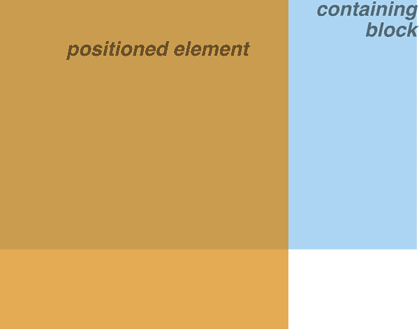
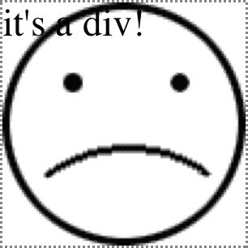

# 第十章：浮动和定位

长期以来，浮动元素是所有网页布局方案的基础。（这主要是因为`clear`属性，我们稍后会详细介绍。）但是浮动从未被用来进行布局；它们作为布局工具的使用几乎和使用表格进行布局一样糟糕。它们只是我们拥有的东西。然而，浮动元素本身非常有趣和有用。特别是考虑到最近添加的浮动*形状*，它允许创建内容可以流过的非矩形形状。

# 浮动

自从 20 世纪 90 年代初以来，通过声明，例如，``，浮动图像就成为可能。这导致图像向右浮动，并允许其他内容（如文本）“环绕”图像。实际上，“浮动”这个名称来自 Netscape DevEdge 页面“HTML 2.0 扩展”，该页面解释了当时新的`align`属性。与 HTML 不同，CSS 允许您浮动任何元素，从图像到段落再到列表。这通过`float`属性实现。

例如，要将图像浮动到左侧，您可以使用以下标记：

```

```

如图 10-1 所示，图像“浮动”到浏览器窗口的左侧，并且文本环绕其周围。


###### 图 10-1 浮动图像

您可以将元素浮动到`left`或`right`，也可以浮动到元素的`inline-start`和`inline-end`边缘。当您希望将元素浮动到内联轴的起始或结束位置时，后两者非常有用，无论该轴的方向如何。（详见第六章关于内联轴的详细信息。）

###### 注意

在这一节的其余部分中，我们主要使用`left`和`right`，因为它们简化了解释。至少在接下来的几年里，它们也几乎是唯一的`float`值。

## 浮动元素

在处理浮动元素时，请记住几点。首先，浮动元素在某种程度上脱离了文档的正常流，尽管它仍然影响正常流的布局。在 CSS 中，浮动元素几乎独立于其他文档，但它们仍然对文档的其余部分产生影响。

这种影响是因为当一个元素被浮动时，其他正常流内容会“环绕”它。这对于浮动图像来说是熟悉的行为，但是如果你浮动一个段落，例如，同样适用。在图 10-2 中，由于添加到浮动段落的边距，你可以清楚地看到这种效果：

```
p.aside {float: inline-end; width: 15em; margin: 0 1em 1em;
     padding: 0.25em; border: 1px solid;}
```


###### 图 10-2 浮动段落

关于浮动元素的首要事实之一是，浮动元素周围的边距不会合并。如果您浮动一个图像并给它 25 像素的边距，那么该图像周围至少会有 25 像素的空间。如果与图像相邻的其他元素——这意味着水平*和*垂直相邻——也具有边距，则这些边距不会与浮动图像上的边距合并。以下代码将生成图 10-3，两个浮动图像之间有 50 像素的间距：

```
p img {float: inline-start; margin: 25px;}
```


###### 图 10-3。具有边距的浮动图像

### 完全不浮动

CSS 除了我们讨论过的值之外，还有一个`float`的其他值：`float: none`用于完全防止元素浮动。

这可能看起来有点傻，因为保持元素不浮动的最简单方法是避免声明`float`，对吧？嗯，首先，`float`的默认值是`none`。换句话说，为了使正常的非浮动行为成为可能，必须存在这个值；如果没有，所有元素都会以某种方式浮动。

其次，在某些情况下，您可能希望覆盖浮动。想象一下，您正在使用一个服务器范围内的样式表来浮动图像。在某个特定页面上，您不希望这些图像浮动。您可以在文档的嵌入样式表中添加`img {float: none;}`，而不是编写全新的样式表。

## 浮动：细节

在我们深入浮动细节之前，建立*包含块*的概念非常重要。浮动元素的包含块是最近的块级祖先元素。因此，在以下标记中，浮动元素的包含块是包含它的段落元素：

```
<h1>
    Test
</h1>
<p>
    This is paragraph text, but you knew that. Within the content of this
    paragraph is an image that's been floated.  The containing block for the floated image is
    the paragraph.
</p>
```

当我们讨论“定位”时，我们将回到包含块的概念。

此外，浮动元素生成一个块级框，而不管它是何种类型的元素。因此，如果您浮动一个链接，即使该元素是行内的并且通常生成行内框，它也会生成一个块级框。它将被布局和操作，就好像它是一个`<div>`。这与为浮动元素声明`display: block`类似，尽管不必这样做。

在深入探讨应用行为之前，让我们先介绍一系列控制浮动元素位置的具体规则。这些规则与控制边距和宽度评估的规则有些相似，并且在初始外观上具有常识性。它们如下：

1.  浮动元素的左（或右）外边缘不能位于其包含块的内边缘的左侧（或右侧）。

    这很简单。左浮动元素的外左边缘只能到达其包含块的内左边缘。同样，右浮动元素最远可以到达其包含块的内右边缘，如图 10-4 所示。（在本图及后续图中，带圈数字显示标记元素实际在源中的位置，带编号的框显示浮动可见元素的位置和大小。）

    

    ###### 图 10-4. 向左（或向右）浮动

1.  为防止与其他浮动元素重叠，浮动元素的左外边缘必须位于文档源中较早出现的左浮动元素的右外边缘右侧，除非后者的顶部低于前者的底部。同样，浮动元素的右外边缘必须位于文档源中较早出现的右浮动元素的左外边缘左侧，除非后者的顶部低于前者的底部。

    此规则防止浮动元素相互"覆盖"。如果一个元素向左浮动，并且已经有另一个浮动元素存在，后者将被放置在前一个浮动元素的外右边缘上。然而，如果浮动元素的顶部在所有较早浮动图像的底部以下，它可以一直浮动到父元素的内左边缘。图 10-5 展示了一些示例。

    

    ###### 图 10-5. 防止浮动元素重叠

    这条规则的优点是，所有浮动内容都将可见，因为您不必担心一个浮动元素遮挡另一个浮动元素。这使得浮动变得相对安全。当使用定位时情况完全不同，定位很容易导致元素相互覆盖。

1.  左浮动元素的右外边缘不得位于右浮动元素的左外边缘右侧。右浮动元素的左外边缘不得位于左浮动元素的右外边缘左侧。

    此规则防止浮动元素重叠。假设您有一个宽度为 500 像素的主体，并且其唯一内容是两个宽度为 300 像素的图像。第一个图像向左浮动，第二个向右浮动。该规则防止第二个图像重叠在第一个图像上，间距为 100 像素。相反，它被迫下移，直到其顶部位于右浮动图像的底部以下，如图 10-6 所示。

    

    ###### 图 10-6. 更多重叠预防

1.  浮动元素的顶部不得高于其父元素的内部顶部。如果浮动元素位于两个折叠边距之间，则将其放置为若有一个块级父元素位于这两个元素之间。

    此规则的第一部分防止浮动元素浮动到文档顶部。图 10-7 中展示了正确的行为。此规则的第二部分在某些情况下微调对齐方式，例如当三个段落中间有一个浮动段落时。在这种情况下，浮动段落会被视为有一个块级父元素（比如一个 `<div>`）。这可以防止浮动段落移动到这三个段落共享的任何公共父元素的顶部。

    

    ###### 图 10-7\. 与气球不同，浮动元素不能向上浮动

1.  浮动元素的顶部不得高于先前任何浮动或块级元素的顶部。

    类似于规则 4，规则 5 防止浮动元素浮动到其父元素的顶部。浮动元素的顶部也不能高于先前出现的任何浮动元素的顶部。图 10-8 展示了一个例子：由于第二个浮动被迫在第一个浮动下方，第三个浮动的顶部与第二个浮动的顶部齐平，而不是第一个浮动的顶部。

    

    ###### 图 10-8\. 保持浮动元素低于其前置元素

1.  浮动元素的顶部不得高于包含其先前生成的盒子的任何行框的顶部。

    类似于规则 4 和规则 5，此规则进一步限制元素的向上浮动，防止其位于包含先前内容的行框顶部之上。假设在段落中间有一张浮动的图片，那么该图片顶部可以放置的最高位置是其所在行框的顶部。正如您在图 10-9 中所见，这样可以防止图片向上浮动过高。

    

    ###### 图 10-9\. 保持浮动元素与其上下文的水平

1.  如果左浮动元素左侧有另一个浮动元素，则其右外边缘不得位于其包含块的右边缘的右侧。同样，如果右浮动元素右侧有另一个浮动元素，则其右外边缘不得位于其包含块的左边缘的左侧。

    换句话说，浮动元素不能超出其包含元素的边缘，除非它太宽而无法自行容纳。这可以防止连续的浮动元素出现在水平行中并远超过包含块的边缘。相反，一个浮动元素如果会突出其包含块的边缘，例如图 10-10（在图中，浮动元素从下一行开始以更清晰地展示其工作原理）。

    

    ###### 图 10-10\. 如果没有足够的空间，浮动元素将被推到新的“行”上。

1.  浮动元素必须尽可能高地放置。

    第 8 条规则如您所料，受前七条规则的限制。在历史上，浏览器将浮动元素的顶部与出现图像标签的行框顶部对齐。然而，第 8 条规则意味着其顶部应与其标签所在的同一行框的顶部对齐，假设有足够的空间。图 10-11 展示了理论上的正确行为。

    

    ###### 图 10-11\. 在其他限制条件的基础上，尽可能高地去

1.  左浮动元素必须尽可能靠左放置，右浮动元素尽可能靠右。更高的位置优先于右侧或左侧更远的位置。

    同样，这条规则受前面规则的限制。正如您在图 10-12 中所看到的，很容易判断一个元素何时已尽可能向右或左移动。

    

    ###### 图 10-12\. 尽量靠左（或右）

## 应用行为

我们刚刚看到的规则产生了一些有趣的后果，因为它们说了什么，也因为它们没有说的。首先讨论的话题是当浮动元素比其父元素更高时会发生什么。

实际上，这种情况经常发生。例如，考虑一个由几个段落和 `<h3>` 元素组成的短文档，其中第一个段落包含一个浮动图像。此浮动图像的边距为 5 像素（`5px`）。您期望文档呈现如图 10-13 所示。


###### 图 10-13\. 预期的浮动行为

没有什么异常，但图 10-14 展示了当您将第一段设置为具有背景时会发生什么。

第二个示例与第一个示例没有任何不同，只是可见背景不同。如您所见，浮动图像伸出其父元素的底部。在第一个示例中也是如此，但那里不太明显，因为您看不到背景。我们之前讨论的浮动规则仅涉及浮动元素及其父元素的左、右和顶部边缘。有意忽略底部边缘需要在图 10-14 中看到的行为。


###### 图 10-14\. 背景和浮动元素

CSS 对此进行了澄清：浮动元素行为的一个重要方面是，浮动元素将扩展以包含任何浮动后代。因此，您可以通过浮动父元素来包含其父元素中的浮动元素，就像这个例子中一样：

```
<div style="float: left; width: 100%;">
     The 'div' will stretch
    around the floated image because the 'div' has been floated.
</div>
```

与此相关的是，考虑背景及其与文档中较早出现的浮动元素的关系，在图 10-15 中有所说明。

因为浮动元素既在流中又在流外，所以这种情况肯定会发生。到底发生了什么？标题的内容被浮动元素“移位”了。但是，标题的元素宽度仍然与其父元素一样宽。因此，其内容区域跨越父元素的宽度，背景也是如此。实际内容并不一直流过其自己的内容区域，以避免被浮动元素遮挡。


###### 图 10-15\. 元素背景“滑动”到浮动元素下

### 负边距

有趣的是，负边距可以导致浮动元素移动到其父元素之外。这似乎与前面解释的规则直接矛盾，但事实并非如此。通过负边距，元素可以看起来比其父元素更宽，浮动元素也可以看起来伸出其父元素之外。

让我们考虑一个图像，该图像向左浮动，并且左侧和顶部边距为`-15px`。此图像放置在一个没有填充、边框或边距的`<div>`中。图 10-16 显示了结果。


###### 图    图 10-16\. 负边距的浮动

与表面看上去的相反，这并不违反浮动元素被放置在其父元素之外的限制。

允许这种行为的技术细节在这里：仔细阅读前一节中的规则将表明，浮动元素的外边缘必须位于元素的父元素内。但是，负边距可以将浮动元素的内容放置在其自身的外边缘之外，详见图 10-17。


###### 图 10-17\. 使用负边距向上和向左浮动的详细信息

一个重要的问题是：当元素通过使用负边距从其父元素浮动出来时，文档显示会发生什么？例如，一个图像可能被浮动得如此之远，以至于它侵入了用户代理已经显示的段落中。在这种情况下，由用户代理决定是否应重新排列文档。

CSS 规范明确指出，用户代理不需要重新排列先前的内容以适应稍后在文档中发生的事情。换句话说，如果图像被浮动到前面的段落中，它可能会覆盖掉已经存在的任何内容。这使得浮动元素在负边距上的实用性有些受限。挂起的浮动通常是相当安全的，但试图将元素向上推在页面上通常是个坏主意。

另一种使浮动元素超出其父元素内部左右边缘的方式是，当浮动元素比其父元素更宽时。在这种情况下，浮动元素会溢出右侧或左侧内边缘——取决于元素的浮动方向——以最佳尝试正确显示自身。这会导致类似于图 10-18 所示的结果。


###### 图 10-18\. 浮动元素比其父元素更宽时的布局

## 浮动、内容和重叠

一个有趣的问题是：当浮动元素与正常流中的内容重叠时会发生什么？例如，如果浮动元素在内容流过的一侧具有负边距（例如，右浮动元素的负左边距），这种情况可能发生。您已经看到块级元素边框和背景的情况了，那么内联元素呢？

CSS 2.1 规范如下所述：

+   与浮动元素重叠的内联框其边框、背景和内容都渲染在浮动元素的“上”。

+   与浮动元素重叠的块级盒子其边框和背景渲染在浮动元素“后”，而其内容则渲染在浮动元素“上”。

为了说明这些规则，考虑以下情况：

```

<p class="box">
    This paragraph, unremarkable in most ways, does contain an inline element.
    This inline contains some <strong>strongly emphasized text, which is so
    marked to make an important point</strong>. The rest of the element's
    content is normal anonymous inline content.
</p>
<p>
    This is a second paragraph.  There's nothing remarkable about it, really.
    Please move along to the next bit.
</p>
<h2 id="jump-up">
    A Heading!
</h2>
```

对该标记应用以下样式，并查看图 10-19 中的结果：

```
.sideline {float: left; margin: 10px -15px 10px 10px;}
p.box {border: 1px solid gray; background: hsl(117,50%,80%); padding: 0.5em;}
p.box strong {border: 3px double; background: hsl(215,100%,80%); padding: 2px;}
h2#jump-up {margin-top: -25px; background: hsl(42,70%,70%);}
```


###### 图 10-19\. 重叠浮动时的布局行为

内联元素（`strong`）完全覆盖了浮动图像——背景、边框、内容等。而块级元素仅其内容出现在浮动元素之上，背景和边框则位于浮动元素之后。

描述的重叠行为与文档源顺序无关。元素是在浮动元素之前还是之后出现都不重要：行为都是一样的。

# 清除

我们已经讨论了浮动行为，所以在我们转向形状之前，我们只需再讨论一个主题。您并不总是希望内容流过浮动元素——在某些情况下，您特别希望阻止它。如果您的文档被分组成部分，您可能不希望一个部分的浮动元素悬挂到下一个部分中。

在这种情况下，您会希望设置每个部分的第一个元素，以防止浮动元素出现在其旁边。如果第一个元素可能被放置在浮动元素旁边，它将被推到出现在浮动图像下方，并且所有后续内容将在其后显示，如 Figure 10-20 所示。


###### 图 10-20\. 显示一个清除元素

这是通过 `clear` 实现的。

例如，为了确保所有 `<h3>` 元素不会放置在左浮动元素的右侧，您可以声明 `h3 {clear: left;}`。这可以翻译为“确保 `<h3>` 的左侧清除浮动元素和伪元素”。以下规则使用 `clear` 阻止 `<h3>` 元素流过浮动元素到左侧：

```
h3 {clear: left;}
```

虽然这将把 `<h3>` 推过任何左浮动元素，但它将允许浮动元素出现在 `<h3>` 元素的右侧，如 Figure 10-21 所示。


###### 图 10-21\. 向左清除，但不向右清除

为了避免这种情况，并确保 `<h3>` 元素不与任何浮动元素在同一行上，您可以使用 `both` 值：

```
h3 {clear: both;}
```

理解这个值可以防止清除元素两侧与浮动元素并存，如示例 Figure 10-22 所示。


###### 图 10-22\. 两侧清除

另一方面，如果我们只担心 `<h3>` 元素被推到右侧浮动元素的下方，那么我们会使用 `h3 {clear: right;}`。

与 `float` 类似，您可以为 `clear` 属性指定 `inline-start`（以及 `both`）或 `inline-end` 值。如果您使用这些值进行浮动，使用它们来清除是合理的。如果您使用 `left` 和 `right` 进行浮动，则使用这些值进行清除也是合理的。

最后，`clear: none` 允许元素浮动到元素的任一侧。与 `float: none` 类似，该值主要存在于允许正常文档行为的情况下，其中元素将允许浮动元素出现在两侧。`none` 值可用于覆盖其他样式，如 Figure 10-23 所示。尽管整个文档规定 `<h3>` 元素不允许浮动元素在任一侧出现，但特定的 `<h3>` 已设置为允许它在两侧出现：

```
h3 {clear: both;}

<h3 style="clear: none;">What's With All The NEO?</h3>
```


###### 图 10-23\. 一点都不清楚

`clear`属性通过*清除*的方式工作——在元素的顶部边距上方添加额外的间距，以将其推到任何浮动元素的上方。这意味着清除元素的顶部边距在清除元素时不会改变。它的向下移动是由清除引起的。请特别注意图 10-24 中标题边框的位置，这是由以下原因引起的：

```
img.sider {float: left; margin: 0;}
h3 {border: 1px solid gray; clear: left; margin-top: 15px;}


<h3>
    Why Doubt Salmon?
</h3>
```


###### 图 10-24\. 清除及其对边距的影响

`<h3>`的顶部边框与浮动图像的底部边框之间没有间隔，因为在上面增加了`25 像素`的间隙，以便将`<h3>`的顶部边框边缘推到浮动边缘的底部边缘之后。除非`<h3>`的顶部边距计算为`40 像素`或更多，否则会发生这种情况，此时`<h3>`将自然而然地放置在浮动下方，而`clear`值将无关紧要。

在大多数情况下，您无法知道元素需要清除多远。确保清除元素的顶部和浮动底部之间有一些空间的方法是在浮动本身上放置底部边距。因此，如果您希望在前面示例中的浮动下方至少有`15 像素`的空间，则会更改 CSS 如下：

```
img.sider {float: left; margin: 0 0 15px;}
h3 {border: 1px solid gray; clear: left;}
```

浮动元素的底部边距增加了浮动框的大小，因此清除元素必须被推动到的点。这是因为，正如以前所见，浮动元素的边距边缘定义了浮动框的边缘。

# 定位

定位背后的想法非常简单。它允许您精确地定义元素框相对于其原本应该出现的位置的位置，或者将其定位相对于父元素、另一个元素，甚至是视口（例如，浏览器窗口）本身。

在深入研究各种类型的定位之前，先看看存在哪些类型以及它们的区别是一个好主意。

## 定位类型

您可以通过使用`position`属性选择五种定位类型之一，这会影响元素框的生成方式。

`position`的值具有以下含义：

`static`

元素的框像往常一样生成。块级元素生成一个矩形框，该矩形框是文档流的一部分，而内联级别的框会导致在其父元素内流动一个或多个线框的创建。

`relative`

元素的框被偏移了一定的距离；默认为`0px`。元素保留了其如果未定位时将具有的形状，并且保留了元素本来会占用的空间。

`absolute`

元素的框完全从文档流中移除，并相对于其最近的定位祖先（如果有）或其包含块定位，这可能是文档中的另一个元素或初始包含块（在下一节中描述）。元素在正常文档流中可能占用的任何空间都被关闭，就好像元素不存在一样。定位元素生成块级框，而不管如果它在正常流中生成的框的类型。

`fixed`

元素的框表现得像被设为`absolute`一样，但其包含块是视口本身。

`sticky`

元素保持在正常流中，直到触发其粘性的条件满足为止，此时它将从正常流中移除，但其在正常流中的原始空间保留。然后它将像相对于其包含块绝对定位一样行事。一旦不再满足执行粘性的条件，元素将返回到其原始空间的正常流中。

现在不必过多担心细节，因为我们稍后将分别讨论这些种类的定位。在这之前，我们需要讨论包含块。

## 包含块

通常情况下，*包含块* 是包含另一个元素的框，正如我们在本章前面所说的那样。例如，在正常流的情况下，根元素（HTML 中的`<html>`）是`<body>`元素的包含块，后者依次是其所有子元素的包含块，依此类推。在定位时，包含块完全取决于定位的类型。

对于`position`值为`relative`或`static`的非根元素，其包含块由最近的块级、表格单元格或内联块级祖先框的内容边缘形成。

对于具有`position`值为`absolute`的非根元素，其包含块被设定为最近的祖先（无论何种类型），其`position`值不是`static`。步骤如下：

+   如果祖先是块级别的，则包含块被设定为该元素的填充边缘；换句话说，即边框将被包围的区域。

+   如果祖先元素是内联级别的，包含块被设定为祖先元素的内容边缘。在从左到右的语言中，包含块的顶部和左侧是祖先元素中第一个框的顶部和左侧内容边缘，底部和右侧边缘是最后一个框的底部和右侧内容边缘。在从右到左的语言中，包含块的右边缘对应于第一个框的右内容边缘，左边缘取自最后一个框。顶部和底部保持不变。

+   如果没有祖先，则元素的包含块被定义为初始包含块。

在处理粘性定位元素的包含块规则时，有一个有趣的变体，即矩形与包含块相关联的规则称为*粘性约束矩形*。这个矩形与粘性定位的工作原理有密切关系，并将在“粘性定位”中详细解释。

一个重要的观点：元素可以定位到其包含块之外。这表明术语“包含块”实际上应该是“定位上下文”，但由于规范使用“包含块”，因此我们也将使用它。

## 偏移属性

在前一节描述的四种定位方案中——相对定位、绝对定位、粘性定位和固定定位——使用不同的属性描述了定位元素边缘相对于其包含块的偏移量。这些属性被称为*偏移属性*，是定位工作的重要组成部分。有四个物理偏移属性和四个逻辑偏移属性。

这些属性描述了相对于包含块最近边缘的偏移量（因此称为*偏移属性*）。最简单的理解方法是，正值会造成内部偏移，将边缘移向包含块的中心，而负值则会造成外部偏移。

例如，`top`描述了定位元素的顶部边缘应距其包含块顶部的距离。在`top`的情况下，正值将使定位元素的顶部边缘*向下*移动，而负值将使其*位于*包含块顶部之上。类似地，`left`描述了定位元素的左边缘相对于包含块左边缘的偏移量。正值将使定位元素的边缘向右移动，而负值将使其向左移动。

偏移边距边缘的含义在于，可以为定位元素设置边距、边框和填充；这些将被保留并与定位元素一起保持，并且将包含在偏移属性定义的区域内。

重要的一点是，偏移属性定义的是相对于包含块的类似边缘的偏移量（例如，`inset-block-end`定义了相对于块结束边缘的偏移量），而不是相对于包含块的左上角。这就是为什么，例如，填满包含块的右下角的一种方法是使用这些值的原因：

```
top: 50%; bottom: 0; left: 50%; right: 0;
```

在这个例子中，定位元素的外左边缘位于包含块的一半处。这是它相对于包含块左边缘的偏移量。另一方面，定位元素的外右边缘没有偏移出包含块的右边缘，因此它们重合。对于定位元素的顶部和底部，类似的推理也成立：外顶边缘位于包含块的中间，但外底边缘并未从底部移动上来。这导致了 图 10-25 中所示的结果。


###### 图 10-25\. 填充包含块的右下角

###### 注意

图 10-25 中所示的内容，以及本章大多数示例，都基于绝对定位。由于绝对定位是演示偏移属性如何工作的最简单方案，因此我们暂时保持这种方式。

注意定位元素的背景区域。在 图 10-25 中，它没有边距，但如果有的话，它们会在边框和偏移边缘之间创建空白空间。这会使得定位元素看起来好像没有完全填满包含块的右下角。事实上，它确实填充了这个区域，因为边距被视为定位元素区域的一部分，但这个事实可能不会立即显而易见。

因此，假设包含块的高度为 `100em`，宽度也为 `100em`，那么以下两组样式大致会产生相同的视觉效果：

```
#ex1 {top: 50%; bottom: 0; left: 50%; right: 0; margin: 10em;}
#ex2 {top: 60%; bottom: 10%; left: 60%; right: 10%; margin: 0;}
```

通过使用负的偏移值，我们可以将元素定位到其包含块之外。例如，以下数值将导致 图 10-26 所示的结果：

```
top: 50%; bottom: -2em; left: 75%; right: -7em;
```


###### 图 10-26\. 定位元素超出其包含块

除了长度和百分比值外，偏移属性还可以设置为 `auto`，这是默认值。`auto` 没有单一的行为；它会根据所使用的定位类型而改变。我们稍后将探讨 `auto` 的工作方式，逐个考虑每种定位类型。

## 内嵌简写

除了前面提到的逻辑内嵌属性外，CSS 还有几个内嵌的简写属性：两个逻辑的和一个物理的。

对于这两个属性，可以提供一个或两个值。如果提供一个值，则两侧使用相同的值；也就是说，`inset-block: 10px` 将在块起始边缘和块结束边缘都使用 10 像素的内嵌。

如果提供两个值，第一个值用于起始边缘，第二个值用于结束边缘。因此，`inset-inline: 1em 2em` 将在行内起始边缘使用 1 个 em 的内嵌，而在行内结束边缘使用 2 个 em 的内嵌。

使用逻辑偏移的这两个简写通常更容易，因为当你不想设置特定偏移时，可以始终提供`auto`，例如`inset-block: 25% auto`。

所有四个边缘的简写属性称为`inset`，但它是一个物理属性——它是`top`、`bottom`、`left`和`right`的简写。

是的，看起来这应该是逻辑属性的简写，但它并不是。以下两个规则具有相同的结果：

```
#popup {top: 25%; right: 4em; bottom: 25%; left: 2em;}
#popup {inset: 25% 4em 25% 2em;}
```

与其他物理简写属性一样（如在第七章中所见），值的顺序为 TRBL（顶部、右侧、底部、左侧），省略的值将从相反的一侧复制。因此，`inset: 20px 2em`与编写`inset: 20px 2em 20px 2em`相同。

## 设置宽度和高度

确定了元素的位置后，通常会希望声明该元素的宽度和高度。此外，你可能还希望限制定位元素的高度或宽度。

如果你想为你的定位元素指定宽度，可以使用`width`属性。类似地，`height`将允许你为定位元素声明特定的高度。

尽管有时设置定位元素的`width`和`height`很重要，但并不总是必要。例如，如果使用`top`、`right`、`bottom`和`left`（或`inset-block-start`、`inset-inline-start`等）描述了元素的四个边的放置方式，那么元素的`height`和`width`就会隐式地由偏移量决定。假设我们希望一个绝对定位的元素填充其包含块的左半部分，从顶部到底部。我们可以使用以下数值，其结果显示在图 10-27 中：

```
inset: 0 50% 0 0;
```


###### 图 10-27\. 仅使用偏移属性来定位和调整元素的大小

由于`width`和`height`的默认值均为`auto`，因此显示在图 10-27 中的结果与我们使用以下数值完全相同：

```
inset: 0 50% 0 0; width: 50%; height: 100%;
```

在这个特定示例中，`width`和`height`的存在对元素的布局没有任何影响。

如果我们要为元素添加填充、边框或外边距，则明确设置`height`和`width`的值可能会产生影响：

```
inset: 0 50% 0 0; width: 50%; height: 100%; padding: 2em;
```

这将使我们得到一个定位元素，其超出其包含块，如图 10-28 所示。



###### 图 10-28\. 部分超出其包含块的元素定位

这是因为（默认情况下）填充被添加到内容区域，而内容区域的大小由`height`和`width`的值确定。为了获得所需的填充并确保元素适合其包含块内，我们可以删除`height`和`width`声明，显式将它们都设置为`auto`，或将`box-sizing`设置为`border-box`。

## 限制宽度和高度

如果有必要或者希望，可以通过以下属性对元素的宽度设置限制，我们称之为*最小-最大属性*。可以通过使用`min-width`和`min-height`来定义元素的内容区域具有最小尺寸。

类似地，可以使用`max-width`和`max-height`属性限制元素的尺寸。

这些属性的名称使它们相当易于理解。最初不太明显但经过思考后会变得合理的是，所有这些属性的值都不能为负值。

以下样式将强制定位元素的最小宽度为`10em`，高度为`20em`，如图 10-29 所示：

```
inset: 10% 10% 20% 50%; min-width: 10em; min-height: 20em;
```


###### 图 10-29。为定位元素设置最小宽度和高度

这并不是一个非常健壮的解决方案，因为它强制元素至少具有一定大小，无论其包含块的大小如何。这里有一个更好的解决方案：

```
inset: 10% 10% auto 50%; height: auto; min-width: 15em;
```

在这里，元素的宽度应该是包含块宽度的 40%，但最小宽度不能少于`15em`。我们还修改了`bottom`和`height`，使它们自动确定。这样一来，元素高度可以根据需要调整，以显示其内容，无论宽度多窄（但绝不少于`15em`）。

###### 注意

我们将在“绝对定位元素的放置和大小”中探讨`auto`在定位元素的高度和宽度中的作用。

您可以通过使用`max-width`和`max-height`来避免元素过宽或过高。例如，假设出于某种原因，我们希望一个元素的宽度是其包含块宽度的四分之三，但在达到 400 像素时停止扩展。适当的样式如下：

```
width: 75%; max-width: 400px;
```

最小-最大属性的一个巨大优势是，它们允许您相对安全地混合单位。您可以在设置基于百分比的尺寸的同时设置基于长度的限制，反之亦然。

值得一提的是，这些最小-最大属性在与浮动元素结合使用时非常有用。例如，我们可以允许浮动元素的宽度相对于其父元素（即其包含块）的宽度而变化，同时确保浮动元素的宽度不会少于`10em`。反向方法也是可行的：

```
p.aside {float: left; width: 40em; max-width: 40%;}
```

这将使浮动元素宽度设置为`40em`，除非它超过包含块宽度的 40%，在这种情况下，浮动将被限制在 40%的宽度内。

###### 注意

有关当内容溢出元素并被约束到特定最大大小时如何处理的详细信息，请参阅 “处理内容溢出”。

# 绝对定位

由于前几节中的大多数示例和图示都展示了绝对定位的应用，您已经看到了大量实际操作。剩下的内容大部分是在调用绝对定位时发生的详细情况。

## 包含块和绝对定位元素

当元素被绝对定位时，它完全从文档流中移除。然后，它相对于其最近的已定位祖先（如果有的话），否则相对于其包含块进行定位，并且其边距边缘使用偏移属性（`top`、`left`、`inset-inline-start`等）进行放置。定位的元素不会围绕其他元素的内容流动，其他元素的内容也不会围绕定位的元素流动。这意味着绝对定位的元素可能会重叠其他元素，或者被其他元素重叠。（我们稍后会看到如何影响重叠顺序。）

绝对定位元素的包含块是最近的祖先元素，其 `position` 值不为 `static`。通常作者会选择一个元素作为绝对定位元素的包含块，并将其设置为 `position: relative`，没有偏移量，如下所示：

```
.contain {position: relative;}
```

考虑 图 10-30 中的示例，它说明了以下内容：

```
p {margin: 2em;}
p.contain {position: relative;} /* establish a containing block*/
b {position: absolute; inset: auto 0 0 auto;
    width: 8em; height: 5em; border: 1px solid gray;}
```

```
<body>
<p>
    This paragraph does <em>not</em> establish a containing block for any of
    its descendant elements that are absolutely positioned. Therefore, the
    absolutely positioned <b>boldface</b> element it contains will be
    positioned with respect to the initial containing block.
</p>
<p class="contain">
    Thanks to <code>position: relative</code>, this paragraph establishes a
    containing block for any of its descendant elements that are absolutely
    positioned. Since there is such an element-- <em>that is to say, <b>a
    boldfaced element that is absolutely positioned,</b> placed with respect
    to its containing block (the paragraph)</em>, it will appear within the
    element box generated by the paragraph.
</p>
</body>
```

两段落中的 `<b>` 元素都已经被绝对定位。区别在于每个元素使用的包含块不同。第一个段落中的 `<b>` 元素相对于初始包含块定位，因为其所有祖先元素的 `position` 都是 `static`。第二段落设置了 `position: relative`，因此为其后代元素建立了一个包含块。


###### 图 10-30\. 使用相对定位定义包含块

您可能已经注意到，在第二段落中，定位的元素重叠了段落的一些文本内容。除了将 `<b>` 元素定位到段落外部或为段落指定足够宽度的填充以容纳定位的元素外，没有其他方法可以避免这种情况。此外，由于 `<b>` 元素具有透明背景，段落的文本会透过定位的元素显示出来。唯一的避免方法是为定位的元素设置一个背景，或者将其完全移出段落。

假设包含块是根元素，您可以插入一个绝对定位的段落，如下所示，并获得与 图 10-31 中所示类似的结果：

```
<p style="position: absolute; top: 0; right: 25%; left: 25%; bottom:
 auto; width: 50%; height: auto; background: silver;">
    ...
</p>
```

现在，段落被定位在文档的开头，宽度为文档宽度的一半，并覆盖其他内容。


###### 图 10-31。定位包含块为根元素的元素

需要强调的一个重要点是，当元素被绝对定位时，它为其后代元素建立一个包含块。例如，我们可以绝对定位一个元素，然后使用以下样式和基本标记绝对定位其子元素（在图 10-32 中描述）：

```
div {position: relative; width: 100%; height: 10em;
    border: 1px solid; background: #EEE;}
div.a {position: absolute; top: 0; right: 0; width: 15em; height: 100%;
    margin-left: auto; background: #CCC;}
div.b {position: absolute; bottom: 0; left: 0; width: 10em; height: 50%;
    margin-top: auto; background: #AAA;}

<div>
    <div class="a">
        absolutely positioned element A
        <div class="b">
            absolutely positioned element B
        </div>
    </div>
    containing block
</div>
```

记住，如果文档有滚动，绝对定位元素也会随之滚动。这对所有不是固定位置或粘性位置元素的绝对定位元素都是适用的。

这是因为最终，这些元素是相对于正常流的某些部分定位的。例如，如果你绝对定位一个表格，而它的包含块是初始包含块，那么定位的表格将会滚动，因为初始包含块是正常流的一部分，因此会滚动。

如果你想要定位元素，使它们相对于视口定位并且不随文档的其余部分一起滚动，继续阅读。“固定定位”可以给出你所寻求的答案。


###### 图 10-32。绝对定位元素创建包含块

## 绝对定位元素的放置和大小

结合定位和大小的概念可能看起来很奇怪，但对于绝对定位元素来说，这是必需的，因为规范将它们紧密地绑定在一起。仔细思考一下，这并不是一个那么奇怪的组合。想象一下，如果一个元素是使用四个物理偏移属性定位的，会发生什么：

```
#masthead h1 {position: absolute; inset: 1em 25% 10px 1em;
    margin: 0; padding: 0; background: silver;}
```

在这里，`<h1>` 元素框的高度和宽度是由其外边距边缘的放置确定的，如图 10-33 所示。


###### 图 10-33。根据偏移属性确定元素的高度

如果包含块变得更高，`<h1>` 也会变得更高；如果包含块变窄，`<h1>` 也会变窄。如果我们给`<h1>`添加边距或填充，那会进一步影响其计算的高度和宽度。

但是如果我们已经做了这一切，然后还尝试设置显式的高度和宽度呢？

```
#masthead h1 {position: absolute; top: 0; left: 1em; right: 10%; bottom: 0;
    margin: 0; padding: 0; height: 1em; width: 50%; background: silver;}
```

有些地方必须让步，因为所有这些值都几乎不可能都准确。事实上，包含块的宽度必须恰好是`<h1>` 计算出的`font-size` 的两倍半，才能使所有显示的值都准确。任何其他的`width` 都意味着至少有一个值是错误的，必须被忽略。确定哪个值取决于多个因素，并且这些因素根据元素是替换还是非替换而改变。 (见第六章 替换与非替换元素。)

此外，考虑以下情况：

```
#masthead h1 {position: absolute; top: auto; left: auto;}
```

结果应该是什么？事实上，答案并不是“将值重置为 0”。我们将在下一节中看到真正的答案。

## 自动边缘

当绝对定位一个元素时，当偏移属性（除`bottom`以外的任何属性）设置为`auto`时，会应用特殊的行为。以`top`为例。考虑以下情况：

```
<p>
    When we consider the effect of positioning, it quickly becomes clear that
    authors can do a great deal of damage to layout, just as they can do very
    interesting things.<span style="position: absolute; top: auto;
 left: 0;">[4]</span> This is usually the case with useful technologies:
    the sword always has at least two edges, both of them sharp.
</p>
```

发生了什么？对于`left`，元素的左边缘应该与其包含块的左边缘对齐（我们在此假设为初始包含块）。

然而，对于`top`来说，会发生更有趣的事情。定位元素的顶部应与其如果根本未定位时其顶部将要放置的位置对齐。换句话说，想象一下如果其`position`值为`static`时`<span>`会被放置的地方；这就是其*静态位置*——应该计算其顶部边缘放置的位置。因此，我们应该得到图 10-34 中显示的结果。


###### 图 10-34。将元素绝对定位于其“静态”顶部边缘

“[4]”位于段落内容的外部，因为初始包含块的左边缘在段落的左边缘左侧。

对于将`left`和`right`设置为`auto`，相同的基本规则适用。在这些情况下，定位元素的左（或右）边缘与如果元素未定位时边缘将要放置的位置对齐。因此，让我们修改前面的例子，使`top`和`left`都设置为`auto`：

```
<p>
    When we consider the effect of positioning, it quickly becomes clear that
    authors can do a great deal of damage to layout, just as they can do very
    interesting things.<span style="position: absolute; top: auto; left:
 auto;">[4]</span> This is usually the case with useful technologies:
    the sword always has at least two edges, both of them sharp.
</p>
```

结果见图 10-35。


###### 图 10-35。将元素绝对定位于其“静态”位置

现在，“[4]”位于其未定位时应该放置的位置。请注意，由于它*被*定位，其正常流空间被关闭。这导致定位元素重叠正常流内容。

此自动放置仅在某些情况下有效，通常是在定位元素的其他尺寸维度上没有约束的情况下。我们之前的例子可以自动放置，因为它对其高度或宽度没有约束，也没有对底部和右侧边缘放置的约束。但假设，出于某种原因，确实有这样的约束。考虑以下情况：

```
<p>
    When we consider the effect of positioning, it quickly becomes clear that
    authors can do a great deal of damage to layout, just as they can do very
    interesting things.<span style="position: absolute; inset: auto 0 0 auto;
 height: 2em; width: 5em;">[4]</span> This is usually the case with useful
    technologies: the sword always has at least two edges, both of them sharp.
</p>
```

不可能满足所有这些值。确定发生的事情是下一节的主题。

## 放置和调整非替换元素

通常，元素的大小和位置取决于其包含块。其各种属性（`width`、`right`、`padding-left`等）的值影响其布局，但基础是包含块。

考虑定位元素的宽度和水平位置。可以表示为以下方程式：

```
left + margin-left + border-left-width + padding-left + width +
padding-right + border-right-width + margin-right + right =
the width of the containing block
```

这个计算是相当合理的。它基本上是确定正常流中块级元素大小的方程，只是增加了`left`和`right`。那么所有这些如何交互？我们有一系列规则可供参考。

首先，如果`left`、`width`和`right`都设置为`auto`，则会得到前一节中所见的结果：左边缘被放置在其静态位置，假设是左到右的语言。在右到左的语言中，右边缘被放置在其静态位置。元素的宽度被设置为“收缩适应”，这意味着元素的内容区域仅宽到足以容纳其内容。非静态位置属性（左到右语言中为`right`，右到左语言中为`left`）被设置为占据剩余的距离。例如：

```
<div style="position: relative; width: 25em; border: 1px dotted;">
    An absolutely positioned element can have its content <span style="position:
 absolute; top: 0; left: 0; right: auto; width: auto; background:
 silver;">shrink-wrapped</span> thanks to the way positioning rules work.
</div>
```

这导致了图 10-36。


###### 图 10-36\. 绝对定位元素的“收缩适应”行为

元素的顶部放置在其包含块的顶部（在本例中为`<div>`），元素的宽度正好足够容纳内容。从元素右边缘到包含块右边缘的剩余距离成为`right`的计算值。

现在假设只有左右边距被设置为`auto`，而不是`left`、`width`和`right`，如此示例：

```
<div style="position: relative; width: 25em; border: 1px dotted;">
    An absolutely positioned element can have its content <span style="position:
 absolute; top: 0; left: 1em; right: 1em; width: 10em; margin: 0 auto;
 background: silver;">shrink-wrapped</span> thanks to the way positioning
    rules work.
</div>
```

这里发生的是左右边距都设置为`auto`，并且相等。这将有效地使元素居中，如图 10-37 所示。


###### 图 10-37\. 使用`auto`边距水平居中绝对定位元素

这基本上与正常流中的`auto`边距居中相同。因此，让我们将边距设置为除了`auto`之外的其他值：

```
<div style="position: relative; width: 25em; border: 1px dotted;">
    An absolutely positioned element can have its content <span style="position:
 absolute; top: 0; left: 1em; right: 1em; width: 10em; margin-left: 1em;
 margin-right: 1em; background: silver;">shrink-wrapped</span> thanks to the
    way positioning rules work.
</div>
```

现在我们有一个问题。定位的`<span>`属性总和仅为`14em`，而包含块的宽度为`25em`。这意味着我们需要弥补 11 个 em 的差额。

规则说明，在这种情况下，用户代理忽略元素内联末端的值，并为其求解。换句话说，结果将与我们声明的结果相同：

```
<span style="position: absolute; top: 0; left: 1em;
right: 12em; width: 10em; margin-left: 1em; margin-right: 1em;
right: auto; background: silver;">shrink-wrapped</span>
```

这导致了图 10-38。


###### 图 10-38\. 在超约束情况下忽略`right`的值

如果其中一个边距被设置为`auto`，那将会发生变化。假设我们改变样式如下所述：

```
<span style="position: absolute; top: 0; left: 1em;
right: 1em; width: 10em; margin-left: 1em; margin-right: auto;
background: silver;">shrink-wrapped</span>
```

视觉结果将与图 10-38 相同，只是通过计算右边距为`12em`来达到，而不是覆盖给属性`right`分配的值。

另一方面，如果我们将左边距设为`auto`，*它*将被重置，如图 10-39 所示：

```
<span style="position: absolute; top: 0; left: 1em;
right: 1em; width: 10em; margin-left: auto; margin-right: 1em;
background: silver;">shrink-wrapped</span>
```


###### 图 10-39\. 利用 `auto` 左边距

通常情况下，如果只有一个属性设置为 `auto`，那么该属性将用于满足前面章节中给出的方程。因此，根据以下样式，元素的宽度会扩展到需要的任何尺寸，而不是“包裹”内容：

```
<span style="position: absolute; top: 0; left: 1em;
right: 1em; width: auto; margin-left: 1em; margin-right: 1em;
background: silver;">not shrink-wrapped</span>
```

到目前为止，我们主要考察了沿水平轴的行为，但沿垂直轴也适用非常相似的规则。如果我们将之前的讨论旋转 90 度，实际上我们得到的几乎是相同的行为。例如，以下标记会导致图 10-40 的结果：

```
<div style="position: relative; width: 30em; height: 10em; border: 1px solid;">
    <div style="position: absolute; left: 0; width: 30%;
 background: #CCC; top: 0;">
            element A
    </div>
    <div style="position: absolute; left: 35%; width: 30%;
 background: #AAA; top: 0; height: 50%;">
            element B
    </div>
    <div style="position: absolute; left: 70%; width: 30%;
 background: #CCC; height: 50%; bottom: 0;">
            element C
    </div>
</div>
```

在第一种情况下，元素的高度会被包裹到内容。在第二种情况下，未指定的属性 (`bottom`) 被设置为弥补定位元素底部与其包含块底部之间的距离。在第三种情况下，`top` 未指定，因此用于弥补差距。


###### 图 10-40\. 绝对定位元素的垂直布局行为

就这一点而言，自动边距可以导致垂直居中。根据以下样式，绝对定位的 `<div>` 将在其包含块内垂直居中，如图 10-41 所示：

```
<div style="position: relative; width: 10em; height: 10em; border: 1px solid;">
    <div style="position: absolute; left: 0; width: 100%; background: #CCC;
 top: 0; height: 5em; bottom: 0; margin: auto 0;">
            element D
    </div>
</div>
```


###### 图 10-41\. 使用自动边距垂直居中绝对定位元素

还有两个小变化需要指出。在水平布局中，如果值为 `auto`，则 `right` 或 `left` 可以根据静态位置放置。在垂直布局中，只有 `top` 可以采用静态位置；由于某种原因，`bottom` 不能。

此外，如果绝对定位元素在垂直方向上尺寸过多约束，`bottom` 将被忽略。因此，在以下情况下，`bottom` 的声明值将被计算值 `5em` 覆盖：

```
<div style="position: relative; width: 10em; height: 10em; border: 1px solid;">
    <div style="position: absolute; left: 0; width: 100%; background: #CCC;
 top: 0; height: 5em; bottom: 0; margin: 0;">
            element D
    </div>
</div>
```

如果属性过多，`top` 无法被忽略。

## 放置和调整替换元素

替换元素（例如图像）的定位规则与非替换元素不同。这是因为替换元素具有固有的高度和宽度，因此除非作者明确更改，否则不会改变。因此，在替换元素的定位中没有“收缩以适应”概念。

放置和调整替换元素的行为可以通过以下一系列规则最容易地表达，逐一采取：

1.  如果 `width` 设置为 `auto`，则 `width` 的使用值由元素内容的固有宽度确定。因此，如果图像固有宽度为 50 像素，则使用值计算为 `50px`。如果显式声明了 `width`（例如 `100px` 或 `50%`），则宽度设置为该值。

1.  如果 `left` 在从左到右的语言环境中具有 `auto` 值，则将其替换为静态位置。在从右到左的语言环境中，将 `right` 上的 `auto` 值替换为静态位置。

1.  如果 `left` 或 `right` 仍然是 `auto`（换句话说，在之前的步骤中它还没有被替换），则将 `margin-left` 或 `margin-right` 上的任何 `auto` 替换为 `0`。

1.  如果此时 `margin-left` 和 `margin-right` 都仍然被定义为 `auto`，则将它们设置为相等，从而使元素在其包含块中居中。

1.  最后，如果只剩下一个 `auto` 值，将其更改为等于方程的余数。

这导致与绝对定位的非替换元素看到的相同基本行为，只要你假设非替换元素有一个显式的 `width`。因此，以下两个元素将具有相同的宽度和位置，假设图像的固有宽度为 100 像素（参见 图 10-42）：

```
<div>
    
</div>
<div style="position: absolute; top: 0; left: 50px;
 width: 100px; height: 100px; margin: 0;">
    it's a div!
</div>
```



###### 图 10-42\. 绝对定位替换元素

与非替换元素类似，如果值被过度约束，用户代理应忽略行内结束端上的值：在从左到右的语言中为 `right`，在从右到左的语言中为 `left`。因此，在以下示例中，`right` 的声明值被计算为 `50px` 覆盖了：

```
<div style="position: relative; width: 300px;">
    
</div>
```

类似地，沿垂直轴的布局受以下一系列规则的控制：

1.  如果 `height` 设置为 `auto`，则 `height` 的计算值由元素内容的固有高度决定。因此，高度为 50 像素的图像的计算值为 `50px`。如果显式声明了 `height`（比如 `100px` 或 `50%`），则高度将设置为该值。

1.  如果 `top` 的值为 `auto`，则用替换元素的静态位置替换它。

1.  如果 `bottom` 的值为 `auto`，则将 `margin-top` 或 `margin-bottom` 上的任何 `auto` 值替换为 `0`。

1.  如果此时 `margin-top` 和 `margin-bottom` 都仍然被定义为 `auto`，则将它们设置为相等，从而使元素在其包含块中居中。

1.  最后，如果只剩下一个 `auto` 值，将其更改为等于方程的余数。

与非替换元素类似，如果值被过度约束，用户代理应忽略 `bottom` 的值。

因此，以下标记结果为 图 10-43：

```
<div style="position: relative; height: 200px; width: 200px; border: 1px solid;">
    
    
    
    
    
</div>
```


###### 图 10-43\. 通过定位拉伸替换元素

## Z 轴上的放置

随着所有定位的进行，不可避免地会出现两个元素试图在视觉上占据相同位置的情况。其中一个将会覆盖另一个，那么我们如何控制哪个元素显示在“顶部”呢？这就是 `z-index` 发挥作用的地方。

这一属性允许您改变元素重叠的方式。它的名字源自坐标系，其中从左到右是 x 轴，从上到下是 y 轴。在这种情况下，从背后到前面的第三轴被称为*z 轴*。因此，通过使用`z-index`，元素沿这个轴被赋予值。图 10-44 展示了这个系统。


###### 图 10-44\. z-index 堆叠的概念视图

在这个坐标系中，具有较高`z-index`值的元素比具有较低`z-index`值的元素更接近读者。这将导致高值元素重叠其他元素，如图 10-45 所示，这是图 10-44 的“头对头”视图。这种重叠优先级称为*堆叠*。


###### 图 10-45\. 元素的堆叠方式

任何整数都可以作为`z-index`的值，包括负数。给一个元素赋予负的`z-index`值会将其移动到离读者更远的位置；也就是说，它会在堆叠中放置得更低。考虑以下样式，如图 10-46 所示：

```
p {background: rgba(255,255,255,0.9); border: 1px solid;}
p#first {position: absolute; top: 0; left: 0;
    width: 40%; height: 10em; z-index: 8;}
p#second {position: absolute; top: -0.75em; left: 15%;
    width: 60%; height: 5.5em; z-index: 4;}
p#third {position: absolute; top: 23%; left: 25%;
    width: 30%; height: 10em; z-index: 1;}
p#fourth {position: absolute; top: 10%; left: 10%;
    width: 80%; height: 10em; z-index: 0;}
```

每个元素根据其样式进行定位，但堆叠的常规顺序通过`z-index`值进行了改变。假设段落按数字顺序排列，合理的堆叠顺序应该是，从低到高，`p#first`、`p#second`、`p#third`、`p#fourth`。这会将`p#first`置于其他三个元素后面，而`p#fourth`置于其他元素前面。由于`z-index`，堆叠顺序在您控制之下。


###### 图 10-46\. 堆叠元素可以重叠

如前面的例子所示，`z-index`值不需要连续。您可以分配任何大小的任何整数。如果您希望某个元素保持在其他所有元素的前面，您可以使用类似于`z-index: 100000`的规则。在大多数情况下，这将按预期工作 —— 尽管如果您声明另一个元素的`z-index`为`100001`（或更高），它将显示在最前面。

一旦为元素分配了`z-index`值（除了`auto`之外），该元素将建立自己的本地*堆叠上下文*。这意味着所有该元素的后代元素有它们自己的堆叠顺序，但相对于它们的祖先元素而言。这与元素建立新的包含块的方式非常相似。根据以下样式，您将看到类似于图 10-47 的效果：

```
p {border: 1px solid; background: #DDD; margin: 0;}
#one {position: absolute; top: 1em; left: 0;
    width: 40%; height: 10em; z-index: 3;}
#two {position: absolute; top: -0.75em; left: 15%;
    width: 60%; height: 5.5em; z-index: 10;}
#three {position: absolute; top: 10%; left: 30%;
    width: 30%; height: 10em; z-index: 8;}
p[id] em {position: absolute; top: -1em; left: -1em;
    width: 10em; height: 5em;}
#one em {z-index: 100; background: hsla(0,50%,70%,0.9);}
#two em {z-index: 10; background: hsla(120,50%,70%,0.9);}
#three em {z-index: -343; background: hsla(240,50%,70%,0.9);}
```


###### 图 10-47\. 定位元素建立本地堆叠上下文

请注意 `<em>` 元素在堆叠顺序中的位置（您可以在 “孤立混合” 中找到建立堆叠上下文的各种方法的列表，在 第二十章 中）。每个元素都与其父元素正确分层。每个 `<em>` 都位于其父元素的前面，无论其 `z-index` 是否为负，并且父元素和子元素被像编辑程序中的图层一样分组在一起。 （规范在使用 `z-index` 堆叠时阻止子元素被绘制在其父元素后面，因此 `p#three` 中的 `em` 被绘制在 `p#one` 的顶部，即使其 `z-index` 值为 `-343`。）这是因为其 `z-index` 值是相对于其局部堆叠上下文的取值：其包含块。而该包含块反过来具有一个 `z-index`，它在其局部堆叠上下文中起作用。

我们还有一个 `z-index` 值需要检查。CSS 规范对默认值 `auto` 有以下说明：

> 生成的盒子在当前堆叠上下文中的堆叠级别为 0\. 该盒子不会创建新的堆叠上下文，除非它是根元素。

因此，任何具有 `z-index: auto` 的元素可以被视为设置为 `z-index: 0`。

###### 小贴士

即使不使用 `position` 属性定位，`z-index` 也会被 flex 和 grid 项目所尊重。规则本质上是相同的。

# 固定定位

如前一节所示，*固定定位* 就像绝对定位一样，唯一不同的是固定元素的包含块是 *视口*。固定定位的元素完全从文档流中移除，并且不相对于文档的任何部分定位。

固定定位可以以有趣的方式进行利用。首先，可以通过使用固定定位创建类似框架的界面。考虑 图 10-48，显示了一个常见的布局方案。


###### 图 10-48\. 使用固定定位模拟框架

可以使用以下样式完成这个过程：

```
header {position: fixed; top: 0; bottom: 80%; left: 20%; right: 0;
    background: gray;}
div#sidebar {position: fixed; top: 0; bottom: 0; left: 0; right: 80%;
    background: silver;}
```

这将使页眉和侧边栏固定在视口的顶部和侧边，无论文档如何滚动，它们都会保持在那里。然而，这里的缺点是文档的其余内容会被固定元素覆盖。因此，其余内容可能应该包含在自己的包装元素中，并使用以下类似方法：

```
main {position: absolute; top: 20%; bottom: 0; left: 20%; right: 0;
    overflow: scroll; background: white;}
```

通过添加适当的边距，甚至可以在三个定位元素之间创建小间隙，如下所示：

```
body {background: black; color: silver;} /* colors for safety's sake */
div#header {position: fixed; top: 0; bottom: 80%; left: 20%; right: 0;
    background: gray; margin-bottom: 2px; color: yellow;}
div#sidebar {position: fixed; top: 0; bottom: 0; left: 0; right: 80%;
    background: silver; margin-right: 2px; color: maroon;}
div#main {position: absolute; top: 20%; bottom: 0; left: 20%; right: 0;
    overflow: auto; background: white; color: black;}
```

鉴于这种情况，可以将平铺图像应用于 `<body>` 的背景。如果作者认为合适，可以通过边距创建的间隙显示这个图像。

固定定位的另一个用途是将“持久”元素放置在屏幕上，例如一小段链接列表。我们可以像以下这样创建一个持久的 `footer`，包含版权和其他信息：

```
footer {position: fixed; bottom: 0; width: 100%; height: auto;}
```

这会将`footer`元素放置在视口底部，并且无论文档滚动多少，都会保持在那里。

###### 注意

固定定位的许多布局案例，除了“持久元素”外，都可以通过网格布局（详见第十二章）处理得更好。

# 相对定位

最简单的定位方案是*相对定位*。在这种方案中，定位元素通过偏移属性进行移动。然而，这可能会带来一些有趣的后果。

表面上看，这似乎很简单。假设我们想要将一个图像向上和向左移动。这些样式的结果如图 10-49 所示：

```
img {position: relative; top: -20px; left: -20px;}
```


###### 图 10-49\. 一个相对定位元素

我们在这里所做的只是将图像的顶边向上偏移了 20 像素，并将左边缘向左偏移了 20 像素。然而，请注意，图像本应存在的空白空间没有消失。这是因为当一个元素相对定位时，它会从其正常位置偏移，但它原本占据的空间并没有消失。

###### 注意

相对定位与翻译元素转换非常相似，这在第十七章中有所讨论。

考虑以下样式的结果，这些样式如图 10-50 所示：

```
em {position: relative; top: 10em; color: red;}
```


###### 图 10-50\. 另一个相对定位元素

如您所见，段落中有些空白空间。这是`<em>`元素原本的位置，而`<em>`元素在其新位置的布局正好与它留下的空间完全相同。

相对定位元素也可以移动到重叠其他内容上。例如，以下样式和标记在图 10-51 中有详细说明：

```
img.slide {position: relative; left: 30px;}
```

```
<p>
    In this paragraph, we will find that there is an image that has been
    pushed to the right. It will therefore  overlap content nearby, assuming that it is not the
    last element in its line box.
</p>
```


###### 图 10-51\. 相对定位元素可以重叠其他内容

相对定位有一个有趣的特点。当一个相对定位的元素过度约束时会发生什么？例如：

```
strong {position: relative; top: 10px; bottom: 20px;}
```

在这里，我们有两个调用非常不同行为的值。如果仅考虑`top: 10px`，元素应向下移动 10 像素，但是`bottom: 20px`显然要求元素向上移动 20 像素。

CSS 规定，当涉及过度约束的相对定位时，一个值会被重置为另一个的负值。因此，`bottom`始终等于`-top`。这意味着前面的示例将被视为以下内容：

```
strong {position: relative; top: 10px; bottom: -10px;}
```

因此，`<strong>`元素将向下偏移 10 像素。规范也允许书写方向。在相对定位中，`right`始终等于左边语言中的`-left`；但在右至左语言中，情况则相反：`left`始终等于`-right`。

###### 注意

正如您在前面的章节中看到的那样，当我们相对定位一个元素时，它立即为其子元素建立一个新的包含块。这个包含块对应于元素被新定位的位置。

# 粘性定位

CSS 中的最后一种定位类型是*粘性定位*。如果您曾经在移动设备上使用过一个不错的音乐应用程序，您可能已经注意到这种效果：当您滚动通过按字母排序的艺术家列表时，当前字母会固定在窗口顶部，直到进入新的字母部分时，新的字母会替换旧的。在打印中很难显示，但图 10-52 试图通过显示滚动中的三个点来解释它。


###### 图 10-52。粘性定位

CSS 通过声明元素为`position: sticky`，使得这种效果成为可能，但通常情况下，这还不够。

首先，偏移量（`top`、`left`等）用于相对于包含块定义*粘性定位矩形*。以以下内容为例。它将产生图 10-53 中所示的效果，其中虚线显示了粘性定位矩形的创建位置：

```
#scrollbox {overflow: scroll; width: 15em; height: 18em;}
#scrollbox h2 {position: sticky; top: 2em; bottom: auto;
    left: auto; right: auto;}
```


###### 图 10-53。粘性定位矩形

请注意，`<h2>`位于图 10-53 中的矩形中间。这是它在`#scrollbox`元素内部内容正常流中的位置。要使`<h2>`粘性，唯一的方法是滚动内容，直到`<h2>`的顶部触及粘性定位矩形的顶部（即位于 scrollbox 顶部以下`2em`的位置）—在此之后，`<h2>`将会粘在那里。这在图 10-54 中有所说明。


###### 图 10-54。粘在粘性定位矩形顶部

换句话说，`<h2>`在正常流中，直到其粘性边缘触及粘性定位矩形的粘性边缘。在那一点上，它会像绝对定位一样粘在那里，*不过*会在正常流中留下本应占据的空间。

你可能已经注意到，`#scrollbox`元素没有`position`声明。它也没有被隐藏到幕后：正是`#scrollbox`上设置的`overflow: scroll`创建了粘性定位的`<h2>`元素的包含块。这是一个情况，其中包含块并非由`position`决定。

如果滚动反向，使得`<h2>`的正常流位置低于矩形的顶部，`<h2>`将从矩形中分离，并恢复到正常流中的位置。这在图 10-55 中有所显示。


###### 图 10-55。从粘性定位矩形顶部脱离

请注意，在这些示例中，`<h2>` 粘在矩形的*顶部*是因为 `<h2>` 的 `top` 值设置为非 `auto`（即粘性定位元素）。你可以使用任何你想要的偏移侧面。例如，你可以让元素在向下滚动内容时粘在矩形的底部。以下代码在 图 10-56 中有所体现：

```
#scrollbox {overflow: scroll; position: relative; width: 15em; height: 10em;}
#scrollbox h2 {position: sticky; top: auto; bottom: 0; left: auto; right: auto;}
```


###### 图 10-56\. 粘在粘性定位矩形的底部

例如，这可以是显示给定段落的脚注或评论的一种方式，同时允许它们随着段落向上移动而滚动消失。同样的规则也适用于左右两侧，这对于侧向滚动内容非常有用。

如果你定义了多个偏移属性，并且它们的值不是 `auto`，那么*所有*这些属性都将成为粘性边缘。例如，这组样式将强制 `<h2>` 始终出现在滚动框内，无论其内容如何滚动（见 图 10-57）：

```
#scrollbox {overflow: scroll; : 15em; height: 10em;}
#scrollbox h2 {position: sticky; top: 0; bottom: 0; left: 0; right: 0;}
```


###### 图 10-57\. 使每个边都成为粘性边

你可能会想：如果我在这种情况下有多个粘性定位的元素，并且我滚动超过两个或更多，会发生什么？事实上，它们会相互堆叠在一起：

```
#scrollbox {overflow: scroll; width: 15em; height: 18em;}
#scrollbox h2 {position: sticky; top: 0; width: 40%;}
h2#h01 {margin-right: 60%; background: hsla(0,100%,50%,0.75);}
h2#h02 {margin-left: 60%; background: hsla(120,100%,50%,0.75);}
h2#h03 {margin-left: auto; margin-right: auto;
    background: hsla(240,100%,50%,0.75);}
```

在静态图像中（例如 图 10-58），很难看出标题堆叠的方式，但它们在源文件中的后面，它们离观察者越近。这是常见的 `z-index` 行为——这意味着您可以通过指定显式的 `z-index` 值来决定哪些粘性元素位于其他元素之上。例如，假设我们希望内容中的第一个粘性元素位于所有其他元素之上。通过给它 `z-index: 1000` 或任何足够高的数值，它将位于所有其他粘性元素的顶部。视觉效果将是其他元素“滑动在”最顶部元素下方。


###### 图 10-58\. 一个粘性头部的堆积

# 摘要

正如本章中所示，CSS 提供了多种影响基本元素位置的方法。浮动可能是 CSS 的一个基本简单方面，但这并不妨碍它们的有用和强大。它们填补了一个重要且光荣的空白，允许内容一边靠在一边的一侧。

由于定位的存在，我们可以以正常流无法实现的方式移动元素。结合 `z` 轴的堆叠可能性和各种溢出模式，即使在我们可以使用 Flexbox 和 Grid 布局的时代，定位仍然有很多优点。
