# 第十一章：伸缩盒布局

[CSS 伸缩盒模块 1 级](http://www.w3.org/TR/css-flexbox-1)，或简称伸缩盒，使得一度困难的页面、小部件、应用程序和画廊布局几乎变得简单。通过伸缩盒，通常不需要 CSS 框架。在本章中，您将学习如何只用几行 CSS 创建站点所需的几乎任何功能。

# 伸缩盒基础知识

*伸缩盒* 是一种简单而强大的页面组件布局方式，通过定义空间分配方式、内容对齐和元素的视觉顺序来实现。内容可以轻松垂直或水平排列，并可以沿单一轴或跨多行进行布局。还有更多更多。

使用伸缩盒，内容的外观可以独立于源代码顺序。虽然视觉上会改变，但伸缩属性不应影响屏幕阅读器读取内容的顺序。

###### 警告

规范说明屏幕阅读器应该遵循源代码顺序，但截至 2022 年底，Firefox 遵循视觉顺序。目前，有一个提案建议添加一个 CSS 属性，指定是遵循源代码还是视觉顺序，因此很快可能可以自行决定。

或许更重要的是，采用灵活盒模块布局后，元素可以在不同屏幕大小和不同显示设备上表现出可预测的行为。伸缩盒在响应式站点中非常有效，因为在提供的空间增加或减少时，内容可以增加或减小尺寸。

伸缩盒通过声明 `display: flex` 或 `display: inline-flex` 来激活父子关系布局。这个元素成为*伸缩容器*，在提供的空间内排列其子元素并控制它们的布局。这个伸缩容器的子元素成为*伸缩项目*。考虑以下样式和标记，见 图 11-1：

```
div#one {display: flex;}
div#two {display: inline-flex;}
div {border: 1px dashed; background: silver;}
div > * {border: 1px solid; background: #AAA;}
div p {margin: 0;}
```

```
<div id="one">
    <p>flex item with<br>two longer lines</p>
    <span>flex item</span>
    <p>flex item</p>
</div>
<div id="two">
    <span>flex item with<br>two longer lines</span>
    <span>flex item</span>
    <p>flex item</p>
</div>
```


###### 图 11-1\. 两种伸缩容器类型 

###### 提示

查找播放符号  以了解在线示例是否可用。本章中的所有示例都可以在 [*https://meyerweb.github.io/csstdg5figs/11-flexbox*](https://meyerweb.github.io/csstdg5figs/11-flexbox) 找到。

注意 `<div>` 的每个子元素如何成为伸缩项目，以及它们如何以相同方式布局？这些元素不同于某些段落和其他 `<span>`，它们都成为伸缩项目。（除了浏览器默认边距，可能会有一些差异，但已经移除。）

第一个和第二个弹性容器之间唯一的真正区别在于，一个被设置为`display: flex`，另一个被设置为`display: inline-flex`。在第一个容器中，`<div>`成为一个内部具有弹性布局的块级盒子。而在第二个容器中，`<div>`成为一个内部具有弹性布局的行内块级盒子。

重要的是要记住，一旦你将一个元素设置为弹性容器，比如在图 11-1 中的`<div>`元素，它将仅对其直接子元素进行弹性布局，而不会影响更深层次的后代元素。不过，你也可以将这些后代元素设为弹性容器，从而实现一些非常复杂的布局。

在弹性容器内部，项目沿着*主轴*对齐。主轴可以是水平的也可以是垂直的，因此你可以将项目排列成列或行。主轴的方向性由书写模式设置：关于这个主轴概念将在“理解轴”中深入讨论。

如图 11-1 中的第一个`<div>`所示，当弹性项目未填满容器的主轴（在本例中为宽度）时，它们会留下额外的空间。某些属性规定了如何处理这些额外的空间，我们将在本章后面进行探讨。你可以将子元素分组到左侧、右侧或居中，或者将它们分散开来，定义空间是在子元素之间还是围绕子元素周围扩展。

除了分配空间外，你还可以允许弹性项目扩展以占用所有可用空间，通过在弹性项目之间或在所有弹性项目之间分配额外空间来实现。如果没有足够的空间容纳所有弹性项目，你可以使用 flexbox 属性来指定它们在容器内如何收缩，或者它们是否可以换行到多个弹性行中。

此外，子元素可以相对于其容器或彼此对齐；可以位于容器的底部、顶部或中心；或者拉伸以填充容器。无论同级容器之间内容长度的差异如何，使用 flexbox 可以通过单个声明使所有兄弟元素大小相同。

## 一个简单的示例

假设我们想要从一组链接创建一个导航栏。这正是 flexbox 设计用来处理的情况。考虑以下内容：

```
nav {
  display: flex;
}
```

```
<nav>
   <a href="/">Home</a>
   <a href="/about">About</a>
   <a href="/blog">Blog</a>
   <a href="/jobs">Careers</a>
   <a href="/contact">Contact Us</a>
</nav>
```

在上述代码中，将其`display`属性设置为`flex`后，`<nav>`元素被转换为弹性容器，其子链接都成为了弹性项目。这些链接仍然是超链接，但现在它们也是弹性项目，这意味着它们不再是行内级别的框，而是参与其容器的弹性格式化上下文。因此，在 HTML 中`<a>`元素之间的空白在布局上完全被忽略了。如果你以前使用 HTML 注释来消除链接、列表项或其他元素之间的空格，那么你就明白这有多重要了。

所以让我们为这些链接添加一些 CSS 样式：

```
nav {
  display: flex;
  border-block-end: 1px solid #ccc;
}
a {
  margin: 0 5px;
  padding: 5px 15px;
  border-radius: 3px 3px 0 0;
  background-color: #ddaa00;
  text-decoration: none;
  color: #ffffff;
}
a:hover, a:focus, a:active {
  background-color: #ffcc22;
  color: black;
}
```

现在我们有了一个简单的选项卡导航栏，如图 11-2 所示。


###### 图 11-2\. 一个简单的选项卡导航 

现在可能看起来并不起眼，因为在旧式 CSS 中你可以做到这一切。等等：它会变得更好。

从设计上看，flexbox 是方向不可知的。这与块级或行内布局不同，后者分别被定义为垂直和水平倾向。Web 最初是为在监视器上创建页面而设计的，并假定具有无限垂直滚动的水平约束。这种垂直倾向布局对于根据用户代理和视口方向变化、增长和收缩的现代应用程序以及根据语言改变书写模式的情况是不足够的。

多年来，我们一直在开玩笑地谈论垂直居中和多列布局的挑战。有些布局并不好笑，比如确保多个并排框的高度相等，按钮或“更多”链接固定在每个框的底部（图 11-3）；或者，保持单个按钮的各部分整齐排列（图 11-4）。Flexbox 让以前具有挑战性的布局效果变得相当简单。

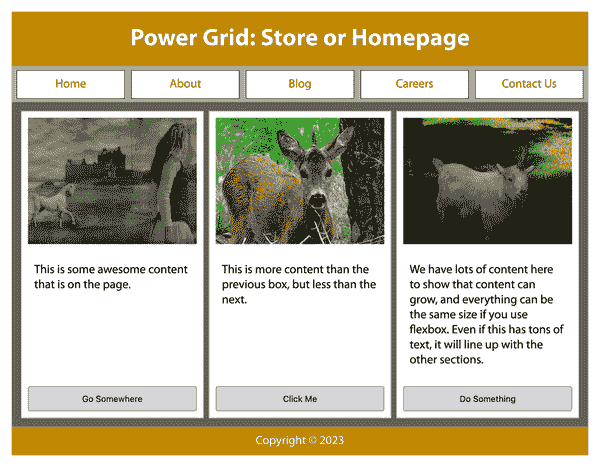

###### 图 11-3\. 使用 flexbox 的电力网格布局，按钮底部对齐 


###### 图 11-4\. 具有多个组件的小部件，所有内容垂直居中 

经典的[“圣杯”布局](https://en.wikipedia.org/wiki/Holy_grail_(web_design))，带有标题、三个高度相等但灵活性不同的列和页脚，可以用几行 CSS 代码使用 flexbox 或网格布局在下一章中介绍的方式创建。以下是可能代表这种布局的 HTML 示例：

```
<header>Header</header>
<main>
  <nav>Links</nav>
  <aside>Aside content</aside>
  <article>Document content</article>
</main>
<footer>Footer</footer>
```

随着本章的进行，请记住，flexbox 是为特定类型的布局设计的，即单维内容分布。它最擅长沿着单个维度或轴排列信息。虽然你可以使用 flexbox 创建类似网格的布局（二维对齐），但这不是其预期目的，对于这种用例它存在显著缺陷。如果你发现自己渴望二维布局功能，请参阅第十二章。

# 弹性容器

完全理解的第一个重要概念是 *flex 容器*，也称为 *容器盒子*。应用了 `display: flex` 或 `display: inline-flex` 的元素成为 flex 容器，并为其子节点生成 *flex 格式化上下文*。

这些子项是 *flex 项*，无论它们是 DOM 节点、文本节点还是生成的内容伪元素。flex 容器的绝对定位子项也是 flex 项，但每个子项的大小和位置都像是其所在 flex 容器中唯一的 flex 项一样。

我们将首先查看适用于 flex 容器的所有 CSS 属性，包括几个影响 flex 项布局的属性。然后我们将探讨同样重要的 flex 项概念在“Flex 项”中。

## 使用 `flex-direction` 属性

如果你希望布局从上到下、从左到右、从右到左，甚至从底部到顶部，可以使用 `flex-direction` 控制 flex 项排列的主轴方向。

`flex-direction` 属性指定了如何在 flex 容器中放置 flex 项。它定义了 flex 容器的主轴，即沿着哪个主轴排列 flex 项（有关更多细节，请参见“理解轴”）。

假设以下基本标记结构：

```
<ol>
   <li>1</li>
   <li>2</li>
   <li>3</li>
   <li>4</li>
   <li>5</li>
</ol>
```

图 11-5 显示了应用 `flex-direction` 四个值排列简单列表的方式，假设是从左到右的语言。

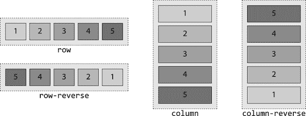

###### 图 11-5\. flex-direction 属性的四个值 

默认值 `row` 看起来与一堆内联元素或浮动元素没有太大区别。这是误导性的，原因很快你就会看到，但请注意其他 `flex-direction` 值如何影响列表项的排列。

例如，你可以通过 `flex-direction: row-reverse` 来反转项目的布局。当设置 `flex-direction: column` 时，flex 项从上到下排列，如果设置 `flex-direction: column-reverse`，则从下到上排列，如图 11-5 所示。

我们指定了从左到右的语言，因为`row`的主轴方向——即 flex 项排列的方向——是当前书写模式的方向。稍后我们将讨论书写模式如何影响 flex 方向和布局。

###### 警告

不要使用 `flex-direction` 来更改从右到左的语言的布局。而是在 HTML 中使用 `dir` 属性，或者在“设置书写模式”中描述的 `writing-mode` CSS 属性来指示语言方向。要了解更多有关语言方向和 flexbox 的信息，请参见“处理其他书写方向”。

`column` 值将 flex 容器的主轴设置为与当前书写模式的块轴相同的方向。在水平书写模式（如英语）中，这是垂直轴，在传统日语等垂直书写模式中，这是水平轴。

因此，在英语（或具有相同书写方向的语言）中声明 `column` 方向时，flex 项目以与源文档中声明的相同顺序显示，但从上到下而不是从左到右排列，因此 flex 项目是按顺序堆叠而不是并排放置。考虑以下情况：

```
nav {
  display: flex;
  flex-direction: column;
  border-right: 1px solid #ccc;
}
```

因此，通过简单地编写几个 CSS 属性，我们可以为早期看到的横向选项卡列表创建一个漂亮的侧边栏样式导航。对于新布局，我们将 `flex-direction` 从默认值 `row` 更改为 `column`，并将边框从底部移到右侧；图 11-6 显示了结果。

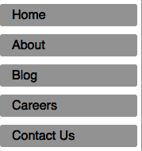

###### 图 11-6\. 更改 flex-direction 可完全改变内容的布局 

`column-reverse` 值类似于 `column`，但主轴是反向的；因此，`main-start` 放在主轴的*末端*，而 `main-end` 放在主轴的*起始*。在从上到下的书写模式中，这意味着 flex 项目是向上排列的，如之前在图 11-5 中所示。 `-reverse` 值仅改变外观。键盘导航的标签顺序与底层标记相同。

到目前为止，我们展示的内容非常强大，使得许多布局变得轻而易举。如果我们在完整文档中包含导航，我们可以看到仅凭几个 flexbox 属性声明就可以实现多么简单的布局。

让我们稍微扩展一下前面的 HTML 示例，并将导航作为主页中的一个组件包含进来：

```
<body>
  <header>
    <h1>My Page's title!</h1>
  </header>
  <nav>
    <a href="/">Home</a>
    <a href="/about">About</a>
    <a href="/blog">Blog</a>
    <a href="/jobs">Careers</a>
    <a href="/contact">Contact Us</a>
  </nav>
  <main>
     <article>
       
       <p>This is some awesome content that is on the page.</p>
       <button>Go Somewhere</button>
     </article>
     <article>
       
       <p>This is more content than the previous box, but less than
       the next.</p>
       <button>Click Me</button>
     </article>
     <article>
       
       <p>We have lots of content here to show that content can grow, and
       everything can be the same size if you use flexbox.</p>
       <button>Do Something</button>
     </article>
  </main>
  <footer>Copyright &#169; 2023</footer>
</body>
```

通过添加几行 CSS，我们可以得到一个布局良好的主页（图 11-7）：

```
* {
  outline: 1px #ccc solid;
  margin: 10px;
  padding: 10px;
}
body, nav, main, article {
  display: flex;
}
body, article {
  flex-direction: column;
}
```

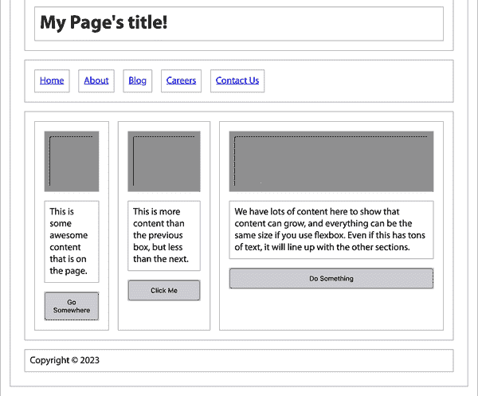

###### 图 11-7\. 使用 `flex-direction: row` 和 `column` 的主页布局 

是的，元素既可以是 flex 项目，同时也可以是 flex 容器，就像您在此示例中看到的导航、主体和文章元素一样。 `<body>` 和 `<article>` 元素将 `column` 设置为它们的 flex 方向，而我们让 `<nav>` 和 `<main>` 默认为 `row`。而且所有这些只需两行 CSS 就能完成！

为了明确起见，在图 11-7 中还有更多样式的应用。我们给所有元素都添加了边框、外边距和内边距，这样你可以通过视觉区分弹性项目以便学习（我们不会将这种不太吸引人的网站投入生产！）。否则，我们只是简单地声明了 body、导航、主体和文章作为弹性容器，使得导航链接、主体、文章、图像、段落和按钮成为弹性项目。

## 处理其他写作方向

如果你在使用英语或其他从左到右（LTR）语言创建网站，你可能希望弹性项目从左到右、从上到下布局。默认值`row`可以实现这一点。如果你使用阿拉伯语或其他从右到左（RTL）语言，你可能希望弹性项目从右到左、从上到下布局。默认值`row`也能够实现这一点。

使用`flex-direction: row`将弹性项目按照文本方向（也称为*写作模式*）的相同方向排列，无论语言是 RTL 还是 LTR。尽管大多数网站使用从左到右的语言呈现，有些网站使用从右到左的语言，还有一些是从上到下的。使用 flexbox，当你改变写作模式时，flexbox 会帮助你改变弹性方向。

写作模式由`writing-mode`、`direction`和`text-orientation`属性设置，或者由 HTML 中的`dir`属性设置。（这些内容在第十五章中有详细介绍。）当写作模式为从右到左时，主轴的方向——因此弹性容器内的弹性项目——在`flex-direction`为`row`时将从右到左进行。这在图 11-8 中有示例。


###### 图 11-8\. 当写作方向为从右到左时`flex-direction`的四个值 

###### 注意

如果 CSS 中的`direction`值与元素上的`dir`属性值不同，则 CSS 属性值优先于 HTML 属性。规范强烈建议使用 HTML 属性而不是 CSS 属性。

竖排文字包括注音符号、埃及象形文字、平假名、片假名、汉字、韩文、麦洛莱迪书写体和象形文字、蒙古文、欧甘文、古代突厥文、八思巴文、彝文，有时还包括日语。这些语言只有在指定了竖排写作模式时才会竖排显示，否则均视为水平排列。

对于自上而下的语言，`writing-mode: horizontal-tb` 生效，这意味着主轴顺时针旋转 90 度，从默认的左到右变为从上到下，而 `flex-direction: column` 则从右到左进行。图 11-9 展示了各种 `flex-direction` 值对以下标记的影响：

```
<ol lang="jp">
    <li>一</li>
    <li>二</li>
    <li>三</li>
    <li>四</li>
    <li>五</li>
</ol>
```

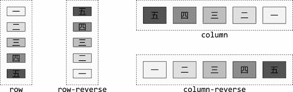

###### 图 11-9\. 写入模式为 horizontal-tb 时 `flex-direction` 的四个值 

是的，行是垂直的，列是水平的。不仅如此，基本的 `column` 方向是从右到左，而 `column-reverse` 则是从左到右。这就是将这些值应用于自上而下、从右到左语言时所产生的结果。

好了，您已经看到了 flex 方向和书写模式相互作用的各种方式。但到目前为止，所有示例都显示了单行或单列的 flex 项。当 flex 项的 *主尺寸*（它们的组合内联尺寸用于 `row` 或组合块尺寸用于 `column`）不能适合 flex 容器时会发生什么？我们可以让它们溢出容器，或者允许它们换行到额外的 flex 行上。此外，我们将稍后讨论如何允许 flex 项收缩（或扩展）以适应容器。

## 包裹 Flex 行

如果所有 flex 项不适合 flex 容器的主轴，则默认情况下 flex 项不会自动换行，也不一定会调整大小。相反，如果通过 flex 项的 `flex` 属性允许的话，flex 项可能会收缩；否则，flex 项将溢出边界容器框。

您可以影响此行为。`flex-wrap` 属性设置一个 flex 容器是限制为单行还是在需要时允许多行。

当 `flex-wrap` 属性设置为通过 `wrap` 或 `wrap-reverse` 允许多个 flex 行时，它确定额外的 flex 项行在原始 flex 项行之前或之后出现的位置。

图 11-10 展示了 `flex-direction` 值为 `row`（语言为 LTR 时）时 `flex-wrap` 属性的三个值的示例。在这些示例中显示了两个 flex 行，第二行及后续 flex 行沿着交叉轴的方向添加（在这种情况下是垂直轴）。

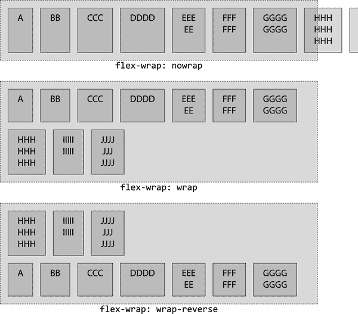

###### 图 11-10\. 在行定向流中 `flex-wrap` 属性的三个值 

当设置 `wrap` 时，交叉轴与 `flex-direction: row` 和 `row-reverse` 的块轴相同，并且与语言的内联轴相同，例如 `flex-direction: column` 和 `column-reverse`。

不同之处在于，当 `flex-wrap` 设置为 `wrap-reverse` 时，交叉轴方向被反转：在 `row` 和 `row-reverse` 的情况下，后续的 flex 行位于前一行的上方，在 `column-reverse` 的情况下位于前一列的左侧（假设是像英语这样的从左到右的语言）。

我们稍后会详细讨论轴，但首先让我们谈谈将 flex 方向和包裹整合在一起的缩写属性。

## 定义灵活的流动

`flex-flow` 属性允许您定义主轴和交叉轴的包裹方向，以及 flex 项目在需要时是否可以换行到多行。

`flex-flow` 缩写属性设置 `flex-direction` 和 `flex-wrap` 属性，定义 flex 容器的包裹和主轴与交叉轴。

只要 `display` 设置为 `flex` 或 `inline-flex`，省略 `flex-flow`、`flex-direction` 和 `flex-wrap` 与声明以下三者之一是相同的，所有这些选项的结果如 图 11-11 所示：

```
flex-flow: row;
flex-flow: nowrap;
flex-flow: row nowrap;
```

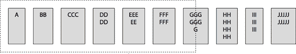

###### 图 11-11\. 一个面向行的未包裹的 flex 流 

在从左到右的书写模式中，声明列出的任何属性值，或完全省略 `flex-flow` 属性，都将创建一个不换行的水平主轴的 flex 容器。图 11-11 展示了沿水平轴分布的 flex 项目，一行内溢出了宽度为 500 像素的容器。

如果我们想要一个反向列导向的流动并且带有包裹，以下任何一种都足够：

```
flex-flow: column-reverse wrap;
flex-flow: wrap column-reverse;
```

在像英语这样的从左到右的语言中，这导致 flex 项目从底部向顶部流动，从左侧开始，并在右向方向上换行到新列。在像日语这样的垂直书写模式中，列会是水平的，从右向左流动，并在顶部向底部换行。

我们一直在使用像*主轴*和*交叉轴*这样的术语，但没有真正深入探讨它们的含义。现在是时候澄清一切了。

## 理解轴

首先：flex 项目沿着主轴布局。flex 行根据交叉轴方向添加。

在我们介绍 `flex-wrap` 之前，所有示例都是单行的 flex 项目。在这一行中，flex 项目沿着主轴，在*主方向*上从主起点到主终点布局。当我们添加 flex 包裹时，新的 flex 行被添加到交叉轴上，在*交叉方向*上从交叉起点到交叉终点。

正如您所见，该段落中使用了许多术语。这里是一些快速定义：

主轴

-   内容流动的轴。在伸缩盒中，这是伸缩项流动的方向。

-   主尺寸

-   沿主轴的内容总长度。

-   主轴起点

-   内容开始流动的主轴端点。

-   主轴终点

-   内容流向的主轴端点，与主轴起点相反。

-   交叉轴

-   “堆叠”伸缩线的轴。在伸缩盒中，这是放置新伸缩项行的方向，如果允许伸缩换行。

-   交叉尺寸

-   沿交叉轴的内容总长度。

-   交叉起点

-   交叉轴的边缘，从此开始堆叠块。

-   交叉终点

-   与交叉起点相对的交叉轴的边缘。

-   尽管这些术语听起来像逻辑属性，比如 `margin-inline-start`，但它们并不是同一回事。在这里，每个术语在布局上下文中的意义取决于 `flex-direction` 的组合、伸缩换行和书写模式的值。为每种书写模式的所有组合绘制图表会变得困难，因此让我们来看看它们在 LTR 语言中的含义。

###### -   注意

-   重要的是要理解，当书写方向被反转时，方向也会被反转。为了更简单地解释（和理解）伸缩布局，本章节中其余的解释和示例基于 LTR 书写模式，但会包括书写模式对讨论的伸缩属性和特性的影响。

-   当考虑 `flex-direction` 时，我们知道伸缩项将从伸缩容器的主轴开始布局，从主轴起点边缘向主轴终点边缘前进。如果使用 `flex-wrap` 属性允许容器在伸缩项无法放入一行时换行，那么伸缩线将从交叉起点边缘开始布局，向交叉终点边缘前进。

如图 11-12 所示，当我们有水平排列的伸缩项时，交叉轴是垂直的。在这些示例中，对于水平语言，使用 `flex-flow: row wrap` 和 `flex-flow: row-reverse wrap` 设置时，新的伸缩线会添加到前面的伸缩线下方。交叉尺寸与主尺寸相反，对于 `row` 和 `row-reverse` 伸缩方向，无论是 RTL 还是 LTR 语言，高度是主尺寸，而对于 `column` 和 `column-reverse` 方向，则是宽度。

-   相比之下，`wrap-reverse` 值颠倒了交叉轴的方向。通常对于 `row` 和 `row-reverse` 的 `flex-direction`，交叉轴从上到下，交叉起点在顶部，交叉终点在底部。当 `flex-wrap` 为 `wrap-reverse` 时，交叉起点和交叉终点的方向被交换，交叉起点在底部，交叉终点在顶部，交叉轴从底部到顶部。额外的伸缩线添加在前一行的顶部或上方。

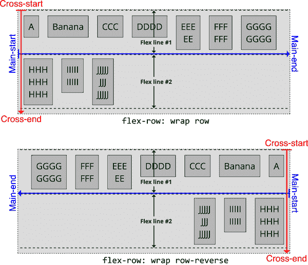

###### 图 11-12\. 行向弹性行的堆叠

如果 `flex-direction` 设置为 `column` 或 `column-reverse`，默认情况下，交叉轴从左到右在从左到右的语言环境中进行，新的弹性行被添加到之前的行右侧。如 图 11-13 所示，当 `flex-wrap` 设置为 `wrap-reverse` 时，交叉轴被反转，交叉起始位于右侧，交叉末端位于左侧，交叉轴从右到左，额外的弹性行被添加到之前绘制行的左侧。

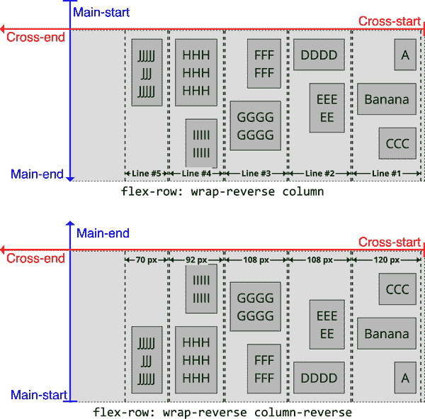

###### 图 11-13\. 列向弹性行的堆叠

# 弹性项目的排列

在我们迄今的示例中，我们已经简单讨论了每个弹性行内弹性项目的具体排列方式，以及如何确定这一排列方式。在水平填充一行似乎是直观的，但为什么所有项目都聚集在主起始边缘？为什么不让它们增长以填满所有可用空间，或者在整行中分布？

作为我们这里讨论的一个例子，请查看 图 11-14。注意左上方的额外空间。在此自下而上、从右到左的流程中，新的弹性项目被放置在之前的项目之上，新的换行被放置在每条先前填充行的左侧。

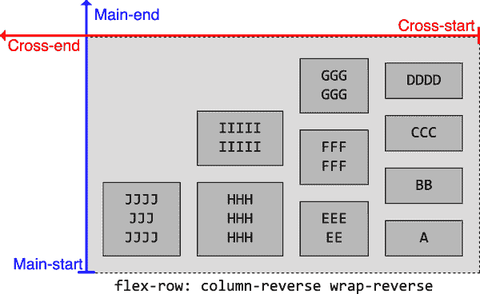

###### 图 11-14\. 空白区域将朝主轴末端和交叉轴末端

默认情况下，无论 `flex-flow` 的值如何，弹性容器中弹性项目外的空白区域将朝主轴末端和交叉轴末端，但 CSS 具有允许我们改变这一行为的属性。

# 弹性项目的对齐

在我们迄今的示例中，每当弹性项目未完全填满弹性容器时，所有弹性项目都会集中于主轴的主起始端。弹性项目也可以靠近主轴的主末端，居中，或者以各种方式在主轴上分布。

弹性布局规范为我们提供了弹性容器属性，用于控制空间的分布。`justify-content` 属性控制弹性行内的弹性项目沿主轴的分布方式。`align-items` 属性定义了每个弹性行上弹性项目沿交叉轴的默认分布；这一全局默认值可以通过弹性项目的 `align-self` 属性单独覆盖。当存在多个弹性行并且启用了换行时，`align-content` 属性定义了这些弹性行在弹性容器的交叉轴上的分布方式。

## 内容的对齐

`justify-content`属性使我们能够指导 flex 容器中每个 flex 行沿主轴分布 flex 项目的方式，并处理可能丢失信息的情况。这个属性应用于 flex 容器，*而不是*单个 flex 项目。

###### 注意

`safe` 和 `unsafe` 值，与 CSS Box Alignment Module Level 3 中的其他值一起引入，截至 2023 年初在大多数浏览器中被识别但不被支持。这意味着该值被忽略，但其存在并不使其他声明无效。

图 11-15 展示了在类似英语的书写模式中各种值的效果。

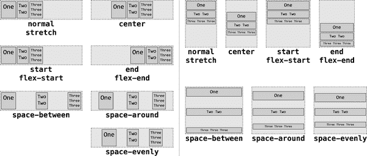

###### 图 11-15. `justify-content` 属性的值 

使用 `start` 和 `flex-start`，flex 项目紧贴主开始。使用 `end` 和 `flex-end`，flex 项目朝向主结束对齐。`center` 选项将项目紧贴在一起，居中于主轴的中间。`left` 和 `right` 选项将项目紧贴在盒子的指定侧，而不考虑实际轴方向。

`space-between` 值将第一个 flex 项目放置在 flex 行主开始处，并将每个 flex 行中的最后一个 flex 项目放置在主结束处，然后在每对相邻 flex 项目之间放置相等数量的空间。`space-evenly` 值获取剩余空间并将其分割，以使每个间隙长度相同。这意味着主轴起始和结束边缘的空间大小将与放置在 flex 项目之间的空间相同。

相比之下，`space-around`将剩余空间分开，然后将每个部分的一半应用于每个 flex 项目，就好像每个项目周围有相等大小的不折叠边距一样。注意，这意味着任意两个 flex 项目之间的间距是 flex 行主开始和主结束处空间的两倍。

`stretch` 值在 flexbox 中作为 `justify-content` 的值没有效果。在下一章节中，您将看到它放置在网格容器上时，会导致网格项目在主轴方向上增大，直到占据所有可用空间。

###### 注意

我们将讨论 `safe` 和 `unsafe`，它们会影响浏览器如何处理沿交叉轴溢出的项目，在“安全和不安全对齐”中。

### 对齐和溢出

如果不允许 flex 项目换行到多行并溢出其 flex 行，`justify-content` 的值将影响 flex 项目溢出 flex 容器的方式。

明确设置`justify-content: start`或`flex-start`会将 flex 项目分组到主开始的默认行为，并将每个 flex 行的第一个 flex 项目放置在主开始侧。然后，每个后续的 flex 项目都会与前一个 flex 项目的主结束侧对齐。（请记住，主开始侧的位置取决于 flex 方向和书写模式。）如果没有足够的空间放置所有项目并且不允许换行，则项目将溢出到主结束边缘。这在 图 11-16 中有所说明。

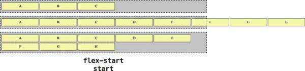

###### 图 11-16\. `start` 内容对齐的效果 

其镜像是设置`justify-content: end`或`flex-end`，它将最后一个 flex 放置在与主结束对齐的行上，并使每个前置 flex 项目与后续项目对齐。在这种情况下，如果不允许项目换行，并且没有足够的空间放置所有项目，则项目将溢出到主开始边缘，如 图 11-17 所示。

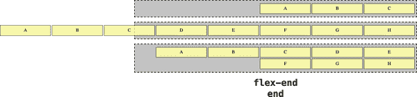

###### 图 11-17\. `end` 内容对齐的效果 

设置`justify-content: center`会将所有项目紧密对齐，并将它们居中放置在 flex 行的中心，而不是将它们放置在主开始或主结束。如果没有足够的空间放置所有项目并且不允许换行，则项目将均匀地溢出到主开始和主结束边缘。

图 11-18 说明了这些效果。

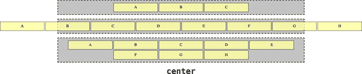

###### 图 11-18\. `center` 内容对齐的效果 

作为`left`和`right`值，它们始终从行的左侧或右侧开始打包，而不管轴的方向如何。因此，`justify-content: left`始终会将基于行的内容对齐到左侧，无论主轴是从左到右还是从右到左。在基于列的内容中，`left`和`start`是一样的，`right`和`end`是一样的。任何溢出都将发生在打包开始的相反侧；也就是说，对于`justify-content: left`，flex 项目将溢出到右侧边缘，对于`right`则溢出到左侧边缘。

针对这些相对简单的情况，让我们看看会改变 flex 项目之间和周围空间的值，并将它们与它们的换行情况进行比较。请注意，如果允许 flex 项目换行到多行上，则每个 flex 项目周围的空间都基于它们特定 flex 行中的可用空间，并且（在大多数情况下）不会从一行到另一行保持一致。

设置`justify-content: space-between`会使第一个 flex 项目与主轴起始边缘对齐，最后一个 flex 项目与主轴结束边缘对齐，然后在每个 flex 项目周围均匀分布相等量的空间，直到填满 flex 行（见图 11-19）。如果有三个 flex 项目，则第一个和第二个项目之间的空间与第二个和第三个项目之间的空间相同，但容器的主轴起始边缘和主轴结束边缘与行中的第一个和最后一个 flex 项目之间不会有额外的空白空间。这意味着如果一行只有一个 flex 项目，则它将与主轴起始边缘对齐，而不是居中。如果没有足够的空间来容纳所有的 flex 项目，并且它们不允许换行，则项目将在主轴结束边缘上溢出，产生与`justify-content: start`视觉上无法区分的效果。

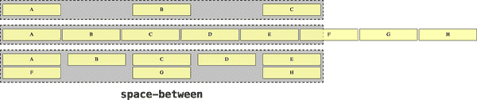

###### 图 11-19\. `space-between`内容对齐的效果 

设置`justify-content: space-around`会均匀分布在每个 flex 项目周围的额外空间，就像主维度两侧的非折叠边距大小相等的元素一样（见图 11-20）。因此，第一个项目与第二个项目之间的空间将是主轴起始边缘与第一个项目之间以及主轴结束边缘与最后一个项目之间的两倍。如果没有足够的空间容纳所有项目，并且它们不允许换行，则项目将在主轴起始边缘和主轴结束边缘上均匀溢出。

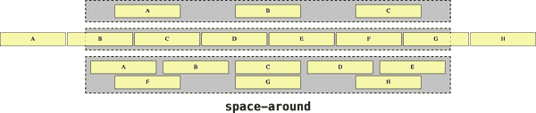

###### 图 11-20\. `space-around`内容对齐的效果 

设置`justify-content: space-evenly`意味着用户代理会计算项目数，然后增加一个，然后将行上的任何额外空间分成这么多等份（例如，如果有五个项目，则空间分成六个相等大小的部分）；参见图 11-21。空间的一部分被放置在每个列表项之前，就像它是一个非折叠边距一样，并且最后一部分被放置在列表的最后一个项之后。因此，第一个项目与第二个项目之间的空间将与主轴起始边缘与第一个项目之间以及主轴结束边缘与最后一个项目之间的空间相同。如果没有足够的空间容纳所有项目，并且它们不允许换行，则项目将在主轴起始边缘和主轴结束边缘上均匀溢出。

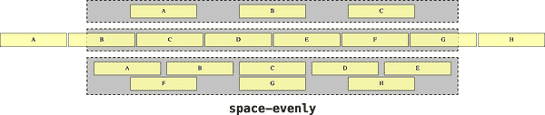

###### 图 11-21\. `space-evenly`内容对齐的效果 

`stretch` 值在作为 `justify-content` 的值设置在 flex 容器上时没有效果，并且被视为 `normal` 一样。正如你将在下一章中看到的那样，在放置在网格容器上时，它会导致网格项在主轴方向上增长直至占据所有可用空间。

最后，`justify-content: normal` 被视为与 `justify-content: start` 相同。出于历史原因，这也是情况太无聊和太长以至于不在这里讨论，但它意味着 `justify-content` 的默认值实质上是 `start`，即使在技术上是 `normal`。

在前面的几个示例中，请注意，当允许 flex 项换行到多行时，每个 flex 行中的空间都基于其特定 flex 行中的可用空间，并且通常不会从一行到另一行保持一致。

### justify-content 示例

我们利用了 `justify-content` 在 图 11-2 中的默认值，创建了一个左对齐的导航栏。通过将默认值更改为 `justify-content: flex-end`，我们可以在英文中右对齐导航栏：

```
nav {
  display: flex;
  justify-content: flex-start;
}
```

注意 `justify-content` 应用于 flex 容器。如果我们应用于链接本身，使用类似 `nav a {justify-content: flex-start;}`，则不会发生对齐效果。

`justify-content` 的一个主要优势是，当书写方向改变（比如，对于 RTL 书写模式），我们不必修改 CSS 就可以使标签页到达它们应该去的地方。当应用 `flex-start` 时，flex 项始终向主轴开始方向分组；在英文中，主轴开始在左侧。对于希伯来文，主轴开始在右侧。如果应用了 `flex-end` 并且 `flex-direction` 是 `row`，那么在英文中标签页会移动到右侧，在希伯来文中移动到左侧，如图 11-22 所示。

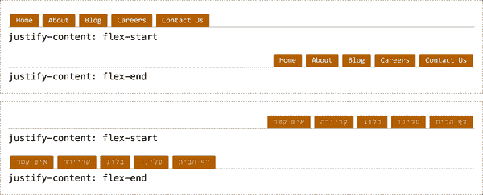

###### 图 11-22\. 国际化强大的导航对齐 

这可能看起来主轴开始和主轴结束类似于逻辑属性中的内联开始和内联结束。当 `flex-direction` 设置为 `row` 时，这种感觉是正确的。然而，当 `flex-direction: row-reverse` 时，主轴开始和主轴结束会交换，但内联开始和内联结束不会，因为 flex 项的内联方向即使其 flex 顺序改变也保持不变。

我们可以像在 图 11-23 中显示的那样将导航居中。

```
nav {
  display: flex;
  justify-content: center;
}
```

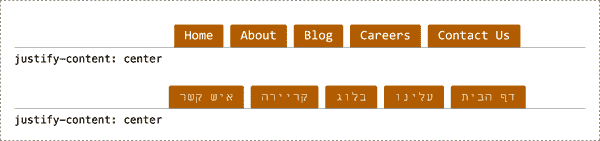

###### 图 11-23\. 使用一个属性值对改变布局 

到目前为止，我们展示的所有 flex 项目都是单行高度，因此在交叉维度上与其兄弟 flex 项目的大小相同。在讨论换行 flex 行之前，我们需要讨论如何沿交叉轴对齐具有不同尺寸的项目，这恰当地称为 *对齐*。

## 对齐项目

而 `justify-content` 定义了 flex 项目沿 flex 容器的主轴如何对齐，`align-items` 属性定义了如何沿其 flex 行的交叉轴对齐 flex 项目。与 `justify-content` 类似，`align-items` 应用于 flex 容器，而不是单个 flex 项目。

###### 注意

虽然 `align-items` 设置了容器内所有 flex 项目的对齐方式，`align-self` 属性 允许覆盖单个 flex 项目的对齐方式，如您将在 “align-self 属性” 中看到的那样。

在 图 11-24 中，请注意 flex 项目相对于交叉轴的排列方式。（对于 row-flowed flex 容器，交叉轴是块轴，对于 column-flowed flex 容器，交叉轴是内联轴。）

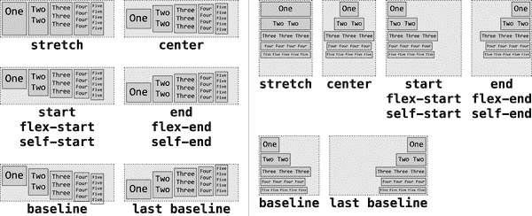

###### 图 11-24\. 行和列的 `align-items` 属性值 

默认值 `normal` 在 flexbox 中被视为 `stretch`。

对于 `stretch`，每个 flex 项目的交叉起始边缘都放置在容器的交叉起始边缘上，而交叉结束边缘也放置在容器的交叉结束边缘上。这不考虑每个 flex 项目内内容的大小，因此一个具有短内容（如“One”）的 flex 项目仍将其元素框填充为 flex 容器的交叉轴尺寸。

而对于 `center` 值，元素框大小正好足以容纳沿交叉轴的内容，且不会更大。因此，flex 项目的交叉起始和结束边缘与容器的交叉起始和结束边缘距离相同，从而在交叉轴上使 flex 项目的框居中于 flex 容器内。

对于各种 `start` 和 `end` 值，flex 项目的交叉起始或结束边缘都紧贴在 flex 容器的相应边缘上。有许多方法来表达 `start` 和 `end`，主要是出于历史原因，这些原因在这里讨论起来太冗长而痛苦了。

注意，当项目对齐到交叉轴的开始或结束时，默认情况下它们的内联尺寸正好与其内容所需的一样大，不会更宽。就像它们的`max-width`设置为`max-size`一样，因此多余的内容可以在伸缩项目内部的多行中换行，但如果不需要换行，则元素的内联尺寸不会填充整个伸缩容器的内联尺寸。这是伸缩项目的默认行为，所以如果你希望伸缩元素填充整个伸缩容器的内联尺寸，就像块级盒子填充其包含块一样，请使用`stretch`值。

使用`baseline`时，伸缩项目的第一基线在可能时会彼此对齐，也就是说，当`flex-direction`为`row`或`row-reverse`时。由于每个伸缩项目的字体大小不同，因此每个伸缩项中每行的第一基线也不同。第一个基线与其交叉起始边之间的距离最大的伸缩项目将与该行的交叉起始边紧密对齐。其他伸缩项目将被放置在其第一基线与与交叉起始边紧密对齐的伸缩项目的第一基线对齐的位置（因此彼此的第一基线对齐）。当设置`align-items: last baseline;`时，情况相反。与其交叉结束边之间距离最大的伸缩项目将与该行的交叉结束边紧密对齐。其他伸缩项目将与其最后基线与与交叉结束边紧密对齐的伸缩项目的最后基线对齐，除非被`align-self`覆盖（见“align-self 属性”）。由于在列流中没有一种方式可以对齐基线，因此在这些情况下，`baseline`被视为`start`，或者在`last baseline`的情况下视为`end`。

### 伸缩项的边距和对齐

现在你对每个值的行为有了一个大概的了解，但实际情况比这复杂一些。在接下来的多行`align-items`示例中，应用了以下样式：

```
flex-container {
  display: flex;
  flex-flow: row wrap;
  gap: 1em;
}
flex-item {border: 1px solid;}
.C, .H {margin-top: 1.5em;}
.D, .I {margin-bottom: 1em;}
.J {font-size: 3em;}
```

对于每个伸缩行，交叉轴的起始和结束边缘都用红色虚线和蓝色虚线绘制出来。C、H、D 和 I 框添加了顶部或底部边距。我们在伸缩项之间添加了一个间隔（稍后在本章中讨论），以使图表更易读，这不会影响此情况下`align-items`属性的影响。J 框的字体大小增加，这也增加了其行高。（当我们讨论`baseline`值时将会涉及到这一点。）

这些边距对`stretch`和`center`对齐方式的影响在图 11-25 中可见。

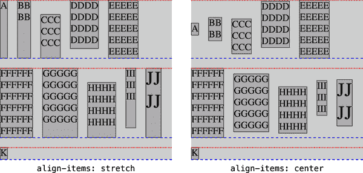

###### 图 11-25\. 边距对交叉轴对齐的影响

`stretch` 值如其名，将所有“可拉伸”的伸缩项拉伸至与行中最高或最宽的伸缩项一样高或宽。可拉伸的伸缩项是指沿交叉轴没有设置任何非`auto`值的尺寸属性的伸缩项。在图 11-25 中，这将是`block-size`、`min-block-size`、`max-block-size`、`height`、`min-height` 和 `max-height`属性。如果全部设置为`auto`，则伸缩项是可拉伸的；否则，就不是。

假设一个伸缩项是可拉伸的，其交叉起始边缘将与伸缩线的交叉起始边缘对齐，其交叉结束边缘将与伸缩线的交叉结束边缘对齐。具有最大交叉尺寸的伸缩项将保持其默认尺寸，而其他伸缩项将增长到该最大伸缩项的尺寸。

图 11-25 展示的是伸缩项 *margins* 的外边缘与交叉起始和交叉结束对齐，而不是其边框边缘。这由项 C、D、H 和 I 表示，它们看起来比其它伸缩项小。然而实际上并非如此，只是它们的边距始终是完全透明的，占据了一部分伸展空间。

###### 注意

如果伸缩容器的交叉尺寸受到限制，内容可能会溢出伸缩容器的交叉起始和/或交叉结束边缘。溢出的方向不由 `align-items` 属性决定，而是由讨论在“对齐伸缩线”的 `align-content` 属性决定。`align-items` 属性用于在伸缩线内对齐伸缩项，并不直接影响容器内伸缩项的溢出方向。

### 基线对齐

`baseline` 值更加复杂。CSS 提供了两种基线对齐方式，分别用 `first baseline` 和 `last baseline` 表示。还可以使用值 `baseline`，其等效于 `first baseline`。

对于 `baseline`（和 `first baseline`），每行中的伸缩项都对齐到最低的第一基线。对于每条伸缩线，距离其基线和交叉起始边缘之间距离最大的伸缩项，将该边缘对齐到该行的交叉起始边缘，并且所有其他伸缩项的基线都与该伸缩项的基线对齐。

要理解这一点，请看图 11-26 中第一组伸缩项，标记为 `baseline`（和 `first baseline`）。对于每条伸缩线，交叉起始和结束边缘分别用实线红色和蓝色标记。每行中伸缩项对齐的基线用点线标记，以及被视为主要基线的元素具有较浅的背景和红色文本。

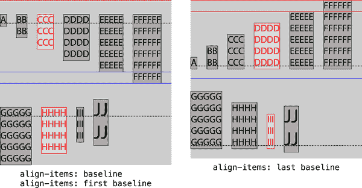

###### 图 11-26\. 基线对齐 

在第一行（A 到 E），C 框的第一基线被使用了。这是因为 C 框有顶部边距，所以它的第一基线是距离伸缩行交叉起始边缘最远的。所有其他框（A、B、D 和 E）的第一基线都与 C 的第一基线对齐。

在第二行（F 到 J），H 的第一基线被使用了 —— 再次是因为它的顶部边距 —— 因此 F、G、I 和 J 框的第一基线与 H 的对齐。在这里，我们也可以看到 J 框如何使所有其他框的第一基线对齐，尽管它的字体大小要大得多。

类似的情况发生在标记为`last baseline`的伸缩项上，只是这里，主导因素是底部边距。第一行的 D 框和第二行的 I 框都有底部边距。在这两种情况下，它们的最后基线距离行的交叉末端边缘最远，因此它们所在行的所有其他伸缩项的最后基线与 D 和 I 的最后基线对齐。虚线显示了每个伸缩行中最后基线的位置。

在许多情况下，`first baseline`看起来会像`start`（及其等效项，如`flex-start`），而`last baseline`看起来会像`end`。例如，如果[图 11-26](https://meyerweb.github.io/csstdg5figs/11-flexbox/baseline-alignments.html)中的 C 框没有顶部边距，那么第一行中的所有项目将明显紧贴伸缩行的顶部，而不是推开它。每当伸缩项在其交叉起始侧具有不同的边距、边框、填充、字体大小或行高时，`start`和`first baseline`之间会有差异。同样地，任何交叉末端的边距、边框等都会在`last baseline`和`end`的结果之间创建差异。

当伸缩项的基线与交叉轴平行时，任何基线值都可以变为`start`。例如，假设我们将[图 11-26](https://meyerweb.github.io/csstdg5figs/11-flexbox/baseline-alignments.html)中的伸缩容器改为`flex-direction: column`。现在，交叉轴就像英文文本内部的基线一样是水平的。由于没有办法从列的交叉起始边缘创建偏移量来对齐文本基线，`baseline`就像`start`一样被处理；或者在最后基线的情况下，被视为`end`。

### 安全对齐和不安全对齐

在前面的所有示例中，我们让伸缩容器成为它们需要包含伸缩行的大小；也就是说，我们将它们留在`block-size: auto`（或者在老式 CSS 术语中是`height: auto`）。但是，如果伸缩容器的块大小以某种方式受到限制，例如通过网格轨道的大小或给定的显式块大小值，那么`safe`和`unsafe`关键字就会发挥作用。

如果指定了 `safe` 对齐，那么每当 flex 项溢出 flex 容器时，该 flex 项被视为其 `align-self` 被设置为 `start`。看起来可能是这样：

```
flex-container {display: flex; height: 10em;
     align-items: safe first baseline;}
```

另一方面，如果使用 `unsafe`，则无论会导致 flex 容器溢出什么意思，都会尊重 flex 项的对齐方式。

如果你想知道哪个是默认值，答案是都不是。相反，当未声明安全或不安全对齐时，浏览器应默认为 `unsafe` 行为，*除非*这会导致 flex 项溢出其最近祖先滚动容器的可滚动区域，在这种情况下，它们应对齐到距离它们溢出边缘最远的交叉轴边缘。图 11-27 展示了一些示例。

###### 警告

截至 2022 年底，只有 Firefox 浏览器完全支持 `safe` 和 `unsafe` 关键字，它们必须首先在值中书写（如本节所示），即使属性的正式语法不要求此位置。所有其他常青浏览器都将这些关键字识别为有效，但它们对布局没有影响。

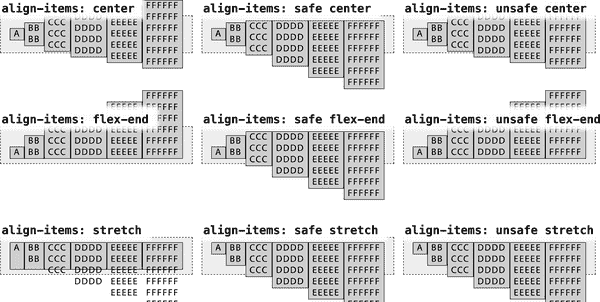

###### 图 11-27\. `安全（safe）`与`不安全（unsafe）`对齐方式

### align-self 属性

如果你想改变一个或多个 flex 项的对齐方式，但不是全部，你可以在希望以不同方式对齐的 flex 项上使用 `align-self` 属性。该属性接受与 `align-items` 相同的值，并用于按每个 flex 项覆盖 `align-items` 属性的值。

你可以使用 `align-self` 属性覆盖任何单个 flex 项的交叉轴对齐方式，只要它由元素或伪元素表示。你不能覆盖匿名 flex 项（flex 容器的非空文本节点子节点）的对齐方式。它们的 `align-self` 始终与其父 flex 容器的 `align-items` 值匹配。

`align-items` 的默认值是 `stretch`，但让我们在以下代码中明确设置这一点，这将允许我们为第二个 flex 项设置不同的 `align-self` 值，如 图 11-28 所示：

```
.flex-container {align-items: stretch;}
.flex-container .two {align-self: var(--selfAlign);}
```

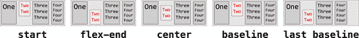

###### 图 11-28\. 改变单个 flex 项的对齐方式 

所有这些 flex 项都具有 `align-self` 的默认值 `auto`，意味着它们继承自容器的 `align-items` 属性的对齐方式（在本例中为 `stretch`）。每个示例中的例外是第二个 flex 项，它被赋予了下面显示的 `align-self` 值。

正如我们所说，`align-items` 的所有值都可以用于 `align-self`，包括第一个和最后一个基线对齐的值，`safe` 和 `unsafe` 对齐等。

## 对齐 Flex 行

在几乎所有之前的示例中，弹性容器的交叉尺寸总是尽可能高：容器上没有声明`block-size`或`height`，因此默认为`height: auto`。因此，弹性容器会随内容增长。

如果容器的交叉尺寸被设置为特定尺寸，可能会在交叉端有额外的空间，或者没有足够的空间来容纳内容。在这种情况下，CSS 允许我们通过`align-content`属性来控制弹性行的整体位置。

`align-content`属性决定了弹性容器中任何额外的交叉方向空间如何在弹性行之间和周围分布。尽管值和概念大致相同，`align-content`与之前讨论的`align-items`属性不同，后者决定了每个弹性行内的弹性项的位置。

将`align-content`视为类似于`justify-content`在弹性容器的主轴上对单个项进行对齐的方式，但它是针对弹性行与容器的交叉轴进行的。此属性适用于多行弹性容器，对不换行和其他单行弹性容器没有影响。

将以下 CSS 视为基础，假设弹性项没有边距：

```
.flex-container {
  display: flex;
  flex-flow: row wrap;
  align-items: flex-start;
  border: 1px dashed;
  height: 14em;
  background-image: url(banded.svg);
}
```

图 11-29 展示了与 CSS 一起使用时`align-content`属性的可能值。我们专注于主要的对齐值，并省略了诸如安全对齐和不安全对齐以及第一个和最后一个基线对齐的示例。

使用高度为 14 ems 时，弹性容器比三个弹性行的默认组合高度更高。考虑到某些弹性项的较大文本和各种填充和边框的位，图 11-29 中每个弹性容器大约有 3 ems 的剩余空间。


###### 图 11-29\. 主要`align-content`值的额外空间分布 

使用`normal`、`stretch`、`center`、`start`、`flex-start`、`end`和`flex-end`这些值时，多余的空间分布在弹性行的外部，如图 11-29 所示。这些值的行为与`align-items`相同。对于值`stretch`，额外的空间均匀分布到所有弹性行，增加它们的交叉尺寸直到它们的边缘接触。对于其他值，弹性行保持在一起，多余的空间放置在一侧或另一侧。

对于剩余的值，弹性行被分开，并以各种方式分布剩余的空间。假设大约 3 ems 的剩余空间相当于 120 像素。（这是大文本，好吗？）

对于`space-between`来说，每对相邻的 flex 行之间大约有 60 像素的空间，即剩余的 120 像素的一半。对于`space-around`，空间均匀分布在每行周围：120 像素被分成三份，因为有三个 flex 行。这会在每个 flex 行的交叉开始和交叉结束两侧各增加 20 像素的非折叠空间（40 像素的一半），所以在相邻 flex 行之间有 40 像素的空间。

对于`space-evenly`，需要插入四个空格：每个 flex 行之前各一个，最后一个 flex 行之后还有一个额外的空格。对于三行来说，这意味着四个空格，每个空格 30 像素。这将在 flex 容器的交叉开始和交叉结束两侧各放置 30 像素的空间，并在相邻 flex 行之间放置 30 像素的空间。

继续对`stretch`值的示例，你会注意到`stretch`值不同：使用`stretch`，额外的空间均匀分布在 flex 行中，而不是在它们之间。在这种情况下，每个 flex 行增加了 40 像素，导致所有三行的高度均等增加—即额外的空间均等分配，而不是按比例分配，每行增加的量完全相同。

如果没有足够的空间容纳所有行，它们将在交叉开始、交叉结束或两者之间溢出，这取决于`align-content`属性的值。这在图 11-30 中有所展示，其中带有浅灰色背景的虚线框表示一个短的 flex 容器。（为了更清楚地显示其开始和结束位置，每个 flex 容器都添加了少量内联填充。）

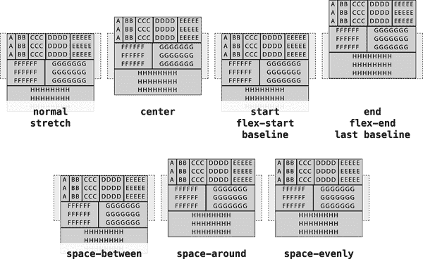

###### 图 11-30\. 每个`align-content`值对应的 flex 行溢出方向

与图 11-29 之间的 CSS 唯一差异是 flex 容器的高度。在这里，flex 容器的高度已经减少到 7 ems，以便创建不足以容纳其所有 flex 行的 flex 容器（你可能还记得，总共约为 10 ems 的高度）。

当 flex 行溢出 flex 容器时，`align-content`值`normal`、`stretch`、`start`、`flex-start`、`baseline`、`last baseline`和`space-between`会使它们在交叉结束侧溢出，而值`center`、`space-around`和`space-evenly`则会均匀地在交叉开始和交叉结束两侧溢出。只有`align-content: end`和`flex-end`会使 flex 行仅在交叉开始侧溢出。

请记住，这些值不是顶部或底部为中心的。如果交叉轴向上移动，`align-content: flex-start`将从底部开始对齐 flex 行，然后向上工作，可能会溢出顶部（交叉末端）边缘。就此而言，当流向是列时，交叉轴将是水平的，此时交叉起始和结束边缘将是 flex 容器的右边或左边边缘。

## 使用`place-content`属性

CSS 提供了一个缩写属性，将`align-content`（我们刚刚讨论过的）和`justify-content`合并为一个属性。

您可以提供一个或两个值。如果提供一个值，则`place-content`将像您设置了`align-content`和`justify-content`为相同值一样。换句话说，以下两个规则是等效的：

```
.gallery {place-content: center;}
.gallery {align-content: center; justify-content: center;}
```

该行为的例外情况是值与基线相关，如`first baseline`。在这种情况下，`justify-content`的值被设置为`start`，使得以下两个规则等效：

```
.gallery {place-content: last baseline;}
.gallery {align-content: last baseline; justify-content: start;}
```

如果给出两个值，第二个值是`justify-content`的值。因此，以下两个规则是等效的：

```
.gallery {place-content: last baseline end;}
.gallery {align-content: last baseline; justify-content: end;}
```

这基本上就是`place-content`的全部内容。如果您宁愿通过单个缩写属性来对齐和调整内容，`place-content`可以做到。否则，请分别使用单独的属性。

第十二章中还介绍了另外两个`place-`的缩写属性。

# 在 flex 项之间打开间隙

默认情况下，flex 项呈现为它们之间没有空间。通过`justify-content`的值或向 flex 项添加边距，可以在项之间显示空间，但这些方法并不总是理想的。例如，边距可能会导致 flex 行换行，当实际上并不需要时，即使使用`space-between`等`justify-content`值也可能导致没有分隔项的空间。如果有一种方法可以定义基本上是最小间隙大小，那将更容易，多亏了间隙属性。

这些属性中的每一个都在相邻的 flex 项之间插入声明大小的空间。这个空间通常被称为*gutter*。由于历史原因，默认值`normal`在 flexbox 和网格容器中等于 0 像素（无空间），在多列布局中等于`1` em。否则，您可以提供单个长度或百分比值。

假设我们有一组 flex 项，这些项将包裹到多个 flex 行中，并且我们希望在 flex 行之间打开一个 15 像素的间隙。以下是该 CSS 的示例，详见图 11-31：

```
.gallery {display: flex; flex-wrap: wrap; row-gap: 15px;}
```

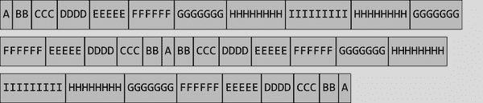

###### 图 11-31\. flex 项行之间的间隙

并未对伸缩项设置任何边距。每个伸缩行（行）之间确实有 15 像素的空间，这要归功于`row-gap`的值。本质上，`row-gap`的作用就像被称为`block-axis-gap`，因此如果书写方式改为像`vertical-rl`这样，使块轴为水平方向，行将从顶部向底部流动，并且它们之间的间隙将位于它们的右侧和左侧（它们的块起始和块结束侧）。

注意，只有在行之间存在间隙：不会在伸缩容器的伸缩项和块起始和结束边缘之间插入间隙。如果想要在这些容器边缘打开相同大小的间隙，可以写成这样：

```
.gallery {display: flex; flex-wrap: wrap; row-gap: 15px; padding-block: 15px;}
```

类似地，我们可以使用`column-gap`在行内轴上打开伸缩项之间的空间。我们可以修改之前的例子，使项目分开，结果如图 11-32 所示：

```
.gallery {display: flex; flex-wrap: wrap; column-gap: 15px;}
```

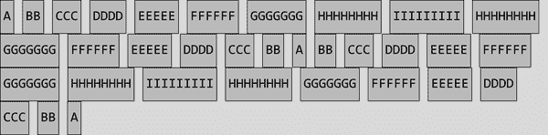

###### 图 11-32。沿行内轴之间相邻伸缩项的间隙

在此，行内端边的伸缩行上仍然有剩余空间，每行具有其自己的空间量。这是因为伸缩项未被赋予`justify-content`值，因此它们默认为`start`。这意味着伸缩项之间的间隙都恰好是 15 像素宽。

如果我们将`justify-content`的值更改为`space-between`，那么在任何具有剩余空间的伸缩行中，伸缩项之间的间隙将增加相等的量，这意味着它们将被超过 15 像素分开。如果有一行，其中所有伸缩项和所有间隙的行内尺寸恰好等于伸缩行的行内长度，则每个伸缩项之间将有 15 像素的空间。

这就是为什么`row-gap`和`column-gap`更像是伸缩项或伸缩行之间的最小分隔距离。这些间隙不算是“剩余空间”，就像伸缩项一样。

在相邻伸缩项的外边距边缘之间插入间隙，因此如果向伸缩项添加边距，两个伸缩项之间的实际可见空间将是间隙的宽度加上边距的宽度。考虑以下情况，该情况在图 11-33 中有图示：

```
.gallery {display: flex; flex-wrap: wrap; column-gap: 15px;}
.gallery div {margin-inline: 10px;}
```

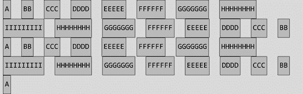

###### 图 11-33。间隙和边距结合以打开更多空间

现在，伸缩项之间的开放空间都是 35 像素宽：15 像素来自`gap`属性，加上在伸缩项上设置的行内侧边距 20 像素（10 + 10）。

到目前为止，我们使用了长度值，但百分比呢？任何百分比值用作间隙将被视为与相关轴上容器尺寸的百分比。因此，给定`column-gap: 10%`，间隙将是伸缩容器沿行内轴的尺寸的 10%。如果容器沿行内轴宽度为 640 像素，那么列间隙将每个为 64 像素。

处理行可能会有点复杂。如果您定义了一个显式的块大小，则百分比仅是该块大小的百分比。一个 `block-size`（也可以用 `height` 或 `width` 设置）为 `25em`，而 `row-gap` 为 `10%` 意味着行间隙将为 2.5 em 宽。如果块大小恰好大于行的块大小总和，也会发生类似的情况。

但是，当块大小仅由添加在一起的行的块大小决定时，任何百分比值都可能导致循环计算：每次计算都会改变正在计算的值，无限循环。假设一个弹性容器有三个弹性行，每行高度恰好为 30 像素。弹性容器设置其高度为 `auto`，因此将“包裹”弹性行，使其高度为 90 像素（这里我们假设没有填充，但原则上相同）。`row-gap` 为 `10%` 将意味着 9 像素的行间隙，插入 2 个行间隙将增加 18 像素的高度。这将增加容器的高度至 108 像素，使得 10% 宽的间隙现在为 10.8 像素，因此容器高度再次增加，间隙增加，容器高度增加，以此类推…

为了避免这种无限循环的情况，当发生循环计算时，间隙被设置为零宽度，所有人都继续他们的生活。实际上，这意味着行间隙的百分比值仅在一小部分情况下有用，而在列间隙方面则可以更广泛地使用。图 11-34 显示了百分比行间隙的示例。

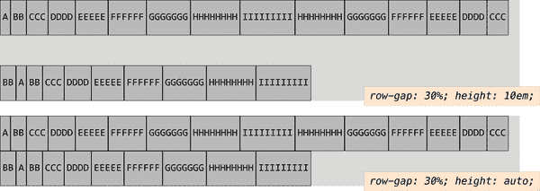

###### 图 11-34. 具有百分比行间隙的示例，带有和不带有显式容器高度

您可以通过分别提供两个属性来设置弹性容器上的列和间隙行，或者您可以使用简写属性 `gap`。

您只需提供一个值给 `gap`，在这种情况下，它将用于行间隙和列间隙。如果提供两个值，则第一个值始终用于行间隙，第二个值用于列间隙。因此，通过以下 CSS 您将获得 图 11-35 中显示的结果：

```
#ex01 {gap: 15px 5px;}
#ex02 {gap: 5px 15px;}
#ex03 {gap: 5px;}
```

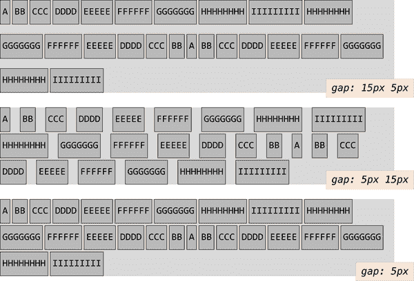

###### 图 11-35. 使用 `gap` 简写属性设置的行和列间隙

###### 注意

最初的 `gap` 属性在 CSS 多列中定义，而在 CSS Grid 中定义了额外带连字符的间隙属性 `grid-row-gap`，`grid-column-gap` 和 `grid-gap`，然后在网格、弹性盒和多列上下文中变得更加通用和可用。浏览器需要将旧属性视为新更通用属性的别名；例如，`grid-gap` 是 `gap` 的别名。因此，如果您在遗留 CSS 中找到旧的网格间隙属性，可以将其更改为新名称，否则它们将像您有了一样正常工作。

# 弹性项目

在前面的部分中，您看到了如何通过为容器设置样式来全局布局弹性容器中的所有弹性项目。弹性盒布局规范提供了几个适用于弹性项目的附加属性。借助这些弹性项目特定的属性，我们可以更精确地控制单个弹性容器的子元素布局。

## 弹性项目是什么？

正如本章中所见，我们通过将`display: flex`或`display: inline-flex`添加到具有子节点的元素来创建弹性容器。这些弹性容器的子元素称为*弹性项目*—无论它们是子元素、非空文本节点还是生成的内容。在图 11-36 中，每个字母都被包裹在自己的元素中，包括单词之间的空格，使得每个字母和空格都成为一个弹性项目。

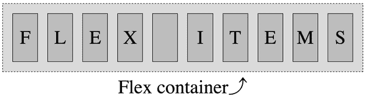

###### 图 11-36\. 子节点是弹性项目，父节点是弹性容器 

当涉及到弹性容器的文本节点子元素时，如果文本节点不为空（包含除空白字符以外的内容），它将被包装在一个*匿名弹性项目*中，表现得像它的弹性项目兄弟一样。尽管这些匿名弹性项目继承了弹性容器设置的所有弹性属性，就像它们的 DOM 节点兄弟一样，但无法直接通过 CSS 进行定位。我们不能直接在它们上面设置任何弹性项目特定的属性。因此，在以下标记中，两个元素（`<strong>` 和 `<em>`）以及文本“they’re what’s for”成为弹性项目，总共有三个弹性项目：

```
<p style="display: flex;">
    <strong>Flex items:</strong> they’re what’s for <em>&lt;br&gt;fast!</em>
</p>
```

通过`::before`和`::after`生成的内容可以直接进行样式化；因此，本章讨论的所有属性同样适用于生成的内容和元素节点。

弹性容器中的仅包含空白字符的文本节点将被忽略，就像它们的`display`属性被设置为`none`一样，如下面的代码示例所示：

```
nav ul {
  display: flex;
}
```

```
<nav>
  <ul>
    <li><a href="#1">Link 1</a></li>
    <li><a href="#2">Link 2</a></li>
    <li><a href="#3">Link 3</a></li>
    <li><a href="#4">Link 4</a></li>
    <li><a href="#5">Link 5</a></li>
  </ul>
</nav>
```

在上述代码中，通过设置`display`属性为`flex`，无序列表成为了弹性容器，其子列表项全部成为弹性项目。这些列表项作为弹性项目是弹性级盒子—在语义上仍然是列表项，但在呈现上不是列表项。它们也不是块级盒子。相反，它们参与它们容器的弹性格式化上下文。列表项之间和周围的空白—换行符和缩进制表符和/或空格—完全被忽略。链接本身不是弹性项目，但是它们是列表项已成为的弹性项目的后代。

## 弹性项目特性

弹性项目的外边距不会折叠。`float`和`clear`属性对弹性项目没有影响，也不会使弹性项目脱离文档流。实际上，当应用于弹性项目时，`float`和`clear`被忽略。（但是，`float`属性仍然可以通过影响`display`属性的计算值来影响框生成。）考虑以下内容：

```
aside {
  display: flex;
}
img {
  float: left;
}
```

```
<aside>
    <!-- this is a comment -->
    <h1>Header</h1>

    
    Some text
</aside>
```

在这个例子中，`aside` 是弹性容器。注释和仅包含空格的文本节点被忽略。包含“Some text”文本节点被包裹在一个匿名的弹性项目中。标题、图片和包含“Some text”文本节点都是弹性项目。因为图片是一个弹性项目，所以`float`被忽略。

尽管图片和文本节点是内联级别节点，但因为它们是弹性项目，只要它们不是绝对定位的，它们就会被块化：

```
aside {
  display: flex;
  align-items: center;
}
aside * {
  border: 1px solid;
}
```

```
<aside>
    <!-- a comment -->
    <h1>Header</h1>

    
    Some text <a href="foo.html">with a link</a> and more text
</aside>
```

这个标记与前一个代码示例类似，但在这个例子中，我们在非空文本节点中添加了一个链接。在这种情况下，我们创建了五个弹性项目，如图 11-37 所示。注释和仅包含空格的文本节点被忽略。标题、图片、链接前的文本节点、链接以及链接后的文本节点都是弹性项目。

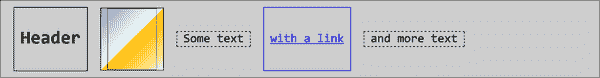

###### 图 11-37\. 旁注中的五个弹性项目 

包含“Some text”和“and more text”的文本节点被包裹在匿名的弹性项目中，用虚线框表示（为了说明目的添加了虚线）。标题、图片和链接是实际的 DOM 节点，可以直接用 CSS 进行样式化，正如您可以看到的边框样式。匿名弹性容器无法直接定位目标，因此只能继承弹性容器的样式。

此外，`vertical-align` 对弹性项目没有影响，除非它影响了弹性项目内文本的对齐。在弹性项目上设置`vertical-align: bottom`将使该弹性项目内的所有文本与它们所在行框的底部对齐；它不会将弹性项目推到其容器的底部。（这是`align-items`和`align-self`的作用。）

## 绝对定位

虽然`float`不会使弹性项目实际浮动起来，但设置`position: absolute`则完全不同。弹性容器的绝对定位子元素，与任何其他绝对定位的元素一样，都会脱离文档流。

更重要的是，它们不参与弹性布局，也不属于文档流。然而，它们可以受到设置在弹性容器上的样式的影响，就像子元素可以受到非弹性容器父元素的影响一样。除了继承任何可继承属性外，弹性容器的属性可以影响定位的原点。

`flex` 容器的绝对定位子元素受 `flex` 容器的 `justify-content` 值和其自身的 `align-self` 值的影响（如果有的话）。例如，如果在绝对定位的子元素上设置了 `align-self: center`，它将从 `flex` 容器父元素的交叉轴中心开始对齐。然后，该元素或伪元素可以通过 `top`、`bottom`、边距等属性移动。

`order` 属性（在 “`order` 属性” 中解释）可能不会影响绝对定位的 `flex` 容器子元素的绘制位置，但会影响其相对于兄弟元素的绘制顺序。

## 最小宽度

在 图 11-38 中，您会注意到在 `nowrap` 默认 `flex-wrap` 值的容器内，`flex` 容器内的 `flex` 行溢出。这是因为当涉及到 `flex` 项目时，`min-width` 的隐含值是 `auto`，而不是 `0`。最初在规范中，如果项目不能适应单一主轴，它们将会收缩。然而，`min-width` 属性的规范在应用到 `flex` 项目时已经改变。（传统上，`min-width` 的默认值是 `0`。）


###### 图 11-38\. 使用最小宽度 `flex` 项目的 `flex` 容器溢出 

如果将 `min-width` 设置为比计算值 `auto` 更窄的宽度——例如，如果声明 `min-width: 0`——则 `nowrap` 示例中的 `flex` 项目将收缩到比其实际内容更窄（某些情况下）。如果允许项目换行，则它们将尽可能窄以适应其内容，但不会更窄。 图 11-39 描述了这两种情况。


###### 图 11-39\. 非换行和换行 `flex` 容器中零最小宽度 `flex` 项目 

# `flex` 项目特定属性

当 `flex` 项目的对齐方式、顺序和灵活性在其 `flex` 容器上通过属性设置到一定程度上可控时，对于更细粒度的控制，可以应用于单个 `flex` 项目的多个属性。

`flex` 缩写属性及其组成属性 `flex-grow`、`flex-shrink` 和 `flex-basis` 控制了 `flex` 项目的灵活性。*灵活性* 是 `flex` 项目沿着主轴能够增长或收缩的量。

## `flex` 属性

flex 布局的定义方面是能够使 flex 项目 *灵活*：调整它们的宽度或高度以填充主尺寸中的可用空间。 flex 容器按照其 flex 增长因子比例分配剩余空间给其项目，或按其 flex 缩小因子的比例收缩它们以防止溢出（我们马上会探讨这些概念）。

在 flex 项目上声明 `flex` 简写属性，或者定义构成简写的各个属性，使您能够定义增长和缩小因子。 如果有多余空间，您可以告诉 flex 项目增长以填充该空间。 或者不要。 如果没有足够的空间来容纳所有 flex 项目在其定义或默认大小中，您可以告诉 flex 项目按比例缩小以适应空间。 或者不要。

所有这些都是通过 `flex` 属性完成的，这是 `flex-grow`、`flex-shrink` 和 `flex-basis` 的简写属性。 虽然这三个子属性可以单独使用，但强烈建议始终使用 `flex` 简写，我们将很快解释原因。

`flex` 属性指定了灵活长度的组成部分：flex 项目的长度是沿主轴（参见 “理解轴”）的 flex 项目的长度。 当盒子是 flex 项目时，将参考 `flex` 来确定盒子的尺寸，而不是主轴尺寸维度属性（`height` 或 `width`）。 `flex` 属性的组件包括 flex 增长因子、flex 缩小因子和 flex 基础值。

*Flex basis* 确定了如何实施 flex 增长和缩小因子。 如其名称所示，flex 简写的 `flex-basis` 组件是 flex 项目确定可以增长填充可用空间的基础，或者在没有足够空间容纳所有 flex 项目时缩小以适应所有 flex 项目的初始大小。 可以通过指定增长和缩小因子均为 `0` 来限制到特定大小：

```
.flexItem {
    width: 50%;
    flex: 0 0 200px;
}
```

在上述 CSS 中，flex 项目的主轴尺寸将恰好为 200 像素，因为 flex 基础值为 `200px`，既不允许增长也不允许缩小。 假设主轴是水平的，则会忽略 `width` 的值 (`50%`)。 类似地，如果主轴是垂直的，则会忽略 `height` 的值。

###### 注意

此处对 `height` 和 `width` 的覆盖发生在层叠之外，因此甚至不能通过在 flex 项目的 `height` 或 `width` 值中添加 `!important` 来覆盖 flex 基础值。

如果选择器的目标不是 flex 项目，则将 `flex` 属性应用于其将不会产生任何效果。

理解组成 `flex` 简写属性的三个组件非常重要，以便能够有效地使用它。

## `flex-grow` 属性

`flex-grow` 属性定义了当空间可用时，伸缩项是否允许增长，以及如何相对于其他伸缩项兄弟项的增长成比例地增长。

###### 警告

建议通过`flex`的快捷方式将增长因子声明为`flex-grow`属性的方式被规范的作者*强烈*不建议。相反，应将增长因子作为`flex`的一部分声明。我们仅在此讨论属性以探讨增长的工作方式。

`flex-grow` 的值始终是一个数字。负数是无效的。您可以使用非整数，只要它们大于或等于 0 即可。该值设置了*伸缩增长因子*，确定了伸缩项在伸缩容器的剩余空间分配时相对于其他伸缩项兄弟项的增长量。

如果伸缩容器内有任何空间可用，则该空间将根据各个增长因子的值以非零正增长因子比例分配给子项。

例如，假设一个宽度为`750px`的水平伸缩容器，有三个伸缩项，每个设置为`width: 100px`。伸缩项占据了 300 像素的空间，剩下 450 像素的“剩余”或可用空间（因为 750 - 300 = 450）。这是图 11-40 中展示的第一个场景：没有任何伸缩项被允许增长。

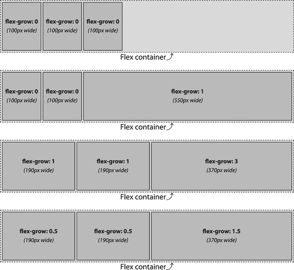

###### 图 11-40\. 各种伸缩增长因子场景 

在图 11-40 中的第二个场景中，只有一个伸缩项（第三个）被赋予了增长因子。我们给它的声明是`flex-grow: 1`，但浏览器可以理解的任何正数也可以。在这种情况下，两个没有增长因子的项目和一个有增长因子的第三个项目将所有可用空间都分配给具有增长因子的伸缩项。因此，第三个伸缩项获得了所有 450 像素的可用空间，最终宽度为 550 像素。它在其他样式中应用的`width: 100px`被覆盖。

在第三和第四个场景中，尽管伸缩增长因子不同，但同一伸缩项的宽度相同。让我们考虑第三个场景，其中增长因子为 1、1 和 3。这些因子相加得到总数 5。然后，每个因子除以总数以得到比例。因此，在这里，三个值分别除以 5，得到 0.2、0.2 和 0.6。

每个比例都乘以可用空间以获取增长量。因此：

1.  450 px × 0.2 = 90 px

1.  450 px × 0.2 = 90 px

1.  450 px × 0.6 = 270 px

这些是添加到每个 flex 项起始宽度的增长部分。因此，最终宽度分别为 190 像素、190 像素和 370 像素。

第四种情况结果相同，因为比例相同。想象一下，我们将增长因子修改为 0.5、1 和 1.5。现在的计算表明，第一个 flex 项获得可用空间的六分之一，第二个获得三分之一，第三个获得一半。这导致最终的 flex 项宽度分别为 175、250 和 425 像素。如果我们声明增长因子为 0.1、0.1 和 0.3，或者 25、25 和 75，或者实际上任何 1:1:3 对应的组合，结果都将相同。

如 “最小宽度” 所述，如果未设置宽度或 flex 基础，则 flex 基础默认为 `auto`，这意味着每个 flex 项的基础宽度为其非包装内容的宽度。`auto` 值很特殊：它默认为 `content`，除非为项目设置了宽度，在这种情况下，flex 基础将成为该宽度。`auto` 值在 “自动 flex 基础” 中讨论过。如果我们在这个例子中没有设置宽度，根据我们的小字体大小，主轴上的可分配空间将超过 450 像素。

###### 注意

一个 flex 项的主轴大小受到可用空间、所有 flex 项的增长因子以及项的 flex 基础的影响。我们还没有涵盖 flex 基础，但那时会很快的！

现在让我们考虑具有不同 `width` 值以及不同增长因子的 flex 项。在 图 11-41 中的第二个例子中，我们有宽度为 100 像素、250 像素和 100 像素的 flex 项，其增长因子分别为 1、1 和 3，在一个宽度为 750 像素的容器中。这意味着我们有额外的 300 像素空间要在总共五个增长因子（因为 750 - 450 = 300）之间分配。因此，每个增长因子为 60 像素（300 ÷ 5）。因此，第一个和第二个 flex 项，具有 `flex-grow` 值为 `1`，每个将增长 60 像素。最后一个 flex 项将增长 180 像素，因为其 `flex-grow` 值为 `3`。

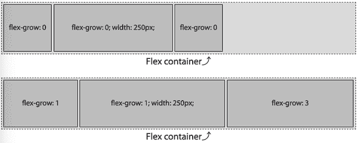

###### 图 11-41。混合宽度和增长因子 

总结一下，flex 容器中的可用空间、增长因子和每个 flex 项的最终宽度如下：

+   可用空间：750 px – (100 px + 250 px + 100 px) = 300 px

+   增长因子：1 + 1 + 3 = 5

+   每个增长因子的宽度：300 px ÷ 5 = 60 px

当进行弯曲时，根据它们的原始宽度和增长因子，flex 项的宽度变为

+   项 1 = 100 px + (1 × 60 px) = 160 px

+   项 2 = 250 px + (1 × 60 px) = 310 px

+   item3 = 100 px + (3 × 60 px) = 280 px

总计为 750 像素。

## 生长因子和 flex 属性

`flex` 属性可以接受最多三个值 — 生长因子、收缩因子和基础值。如果第一个非空的正数数值设置了生长因子（即`flex-grow` 值）。当在 `flex` 值中省略生长和收缩因子时，生长因子默认为`1`。但是，如果既未声明 `flex` 也未声明 `flex-grow`，生长因子则默认为`0`。是的，真的。

回想一下 图 11-40 中的第二个示例，其中 flex 生长因子为 0、0 和 1。因为我们仅声明了 `flex-grow` 的值，所以 flex 基础值被设置为`auto`，就像我们声明了以下内容一样：

```
#example2 flex-item {
  flex: 0 1 auto;
}
#example2 flex-item:last-child {
  flex: 1 1 auto;
}
```

这意味着前两个 flex 项没有生长因子，有收缩因子，并且基础值为`auto`。如果在 图 11-40 的示例中使用 `flex` 而不是不合理地使用 `flex-grow`，则每种情况下的 flex 基础值都将被设置为`0%`，就像这样做了一样：

```
#example2 flex-item {
  flex: 0 1 0%;
}
#example2 flex-item:last-child {
  flex: 1 1 0%;
}
```

由于收缩因子默认为`1`，基础默认为`0%`，以下的 CSS 与前面的代码段完全相同：

```
#example2 flex-item {
  flex: 0;
}
#example2 flex-item:last-child {
  flex: 1;
}
```

这将导致 图 11-42 中显示的结果。与 图 11-40 进行比较，看看事情如何变化（或未变化）。

您可能会注意到前两种情况中的一些奇怪之处：flex 基础值被设置为 0，而第二种情况中仅最后一个 flex 项具有正值的 flex 生长。逻辑似乎应该表明三个 flex 项的宽度分别为 0、0 和 750 像素。但逻辑也表明，如果 flex 容器有足够的空间容纳所有内容，即使基础值设置为`0`，也不应该使内容溢出其 flex 项。

规范的作者们考虑到了这个困境。当 `flex` 属性声明显式设置或默认设置 flex 基础值为`0%` 并且 flex 项的生长因子为`0` 时，非生长型 flex 项的主轴长度将会收缩到内容允许的最小长度，甚至更小。在 图 11-42 中，这个最小长度是最宽的字符序列 “flex:” 的宽度（包括冒号）。

只要 flex 项具有可见的溢出并且没有显式设置的 `min-width`（或垂直主轴的 `min-height`），最小宽度（或最小高度）将是 flex 项需要的最小宽度（或高度），以适应内容或声明的 `width`（或 `height`），以较小者为准。

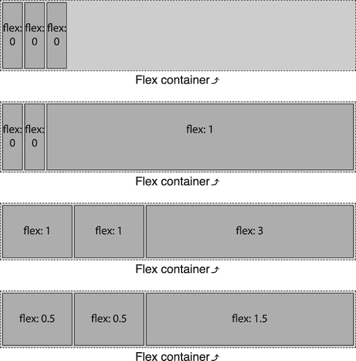

###### 图 11-42\. 使用 flex 快捷方式时的 flex 大小调整 

如果允许所有项目增长，并且每个 flex 项的 flex 基础是`0%`，则所有空间而不仅仅是多余的空间都按照增长因子的比例进行分配。在图 11-42 的第三个示例中，两个 flex 项的增长因子为 1，而一个 flex 项的增长因子为 3。因此，总共有五个增长因子：

+   (2 × 1) + (1 × 3) = 5

有五个增长因子，并且总共有 750 像素，每个增长因子值 150 像素：

+   750 像素 ÷ 5 = 150 像素

虽然默认的 flex 项大小为 100 像素，但 0% 的 flex 基础覆盖了该值，使得我们有两个 flex 项每个为 150 像素，最后一个 flex 项宽度为 450 像素：

+   1 × 150 像素 = 150 像素

+   3 × 150 像素 = 450 像素

类似地，在图 11-42 的最后一个示例中，两个具有 0.5 的 flex 项的增长因子，以及一个具有 1.5 的 flex 项，总共有 2.5 的增长因子：

+   (2 × 0.5) + (1 × 1.5) = 2.5

有 2.5 的增长因子，并且总共有 750 像素，每个增长因子值 300 像素：

+   750 像素 ÷ 2.5 = 300 像素

虽然默认的 flex 项大小为 100 像素，但 0% 的 flex 基础覆盖了该值，使得我们有两个 flex 项每个为 150 像素，最后一个 flex 项宽度为 450 像素：

+   0.5 × 300 像素 = 150 像素

+   1.5 × 300 像素 = 450 像素

再次强调，这与仅声明`flex-grow`不同，因为那意味着 flex 基础默认为`auto`。在这种情况下，只有额外的空间而不是所有空间按比例分配。而使用`flex`时，flex 基础设置为`0%`，因此 flex 项按照总空间的比例增长，而不仅仅是剩余空间。图 11-43 说明了这种差异。

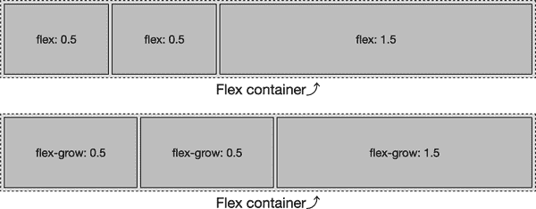

###### 图 11-43。使用`flex`和`flex-grow`之间的 flex 大小差异 

现在让我们谈谈 flex 收缩因子，它在某些方面是 flex 增长因子的反向，但在其他方面又有所不同。

## flex-shrink 属性

`<*flex-shrink*>` 部分的 `flex` 简写属性指定了 *flex shrink* *因子*。它也可以通过 `flex-shrink` 属性进行设置。

###### 警告

强烈建议不要通过 `flex-shrink` 属性声明收缩因子，而是将收缩因子作为 `flex` 简写的一部分声明。我们在这里讨论该属性仅仅是为了探讨收缩如何工作。

收缩因子确定了当弹性项目无法容纳时，相对于其余弹性项目兄弟会收缩多少，这由它们的内容和其他 CSS 属性定义。在简写的 `flex` 属性值中省略或者 `flex` 和 `flex-shrink` 都被省略时，收缩因子默认为 `1`。与增长因子一样，`flex-shrink` 的值始终是一个数字。负数是无效的。如果你愿意，可以使用非整数值，只要它们大于 `0`。

基本上，收缩因子定义了当弹性项目无法容纳时，“负可用空间”如何分配，而且弹性容器也无法增长或换行。参见 图 11-44。

图 11-44 与 图 11-40 类似，只是弹性项目的 `width` 被设置为 `300px` 而不是 100 像素。我们仍然有一个 750 像素宽的弹性容器。三个项目的总宽度为 900 像素，这意味着内容的起始宽度比父弹性容器宽出 150 像素。如果项目不允许收缩或换行（参见 “Wrapping Flex Lines”），它们将从固定大小的弹性容器中溢出。这在 图 11-44 的第一个示例中得到了展示：这些项目不会收缩，因为它们的收缩因子为零。相反，它们会溢出弹性容器。


###### 图 11-44\. 多种弹性收缩场景 

在 图 11-44 的第二个示例中，只有最后一个弹性项目可以收缩。因此，最后一个弹性项目被迫承担使所有弹性项目都能适应弹性容器的所有收缩工作。由于有 900 像素的内容需要适应到我们的 750 像素容器中，我们有 150 像素的负可用空间。没有收缩因子的两个弹性项目保持在 300 像素宽度。第三个弹性项目，其收缩因子为正值，收缩了 150 像素，最终宽度为 150 像素。这使得三个项目能够适应容器内。在这个例子中，收缩因子为 `1`，但如果是 `0.001` 或 `100` 或 `314159.65` 或任何浏览器能理解的其他正数，结果都将是一样的。

在第三个示例中，我们对所有三个弹性项目都设置了正收缩因子：

```
#example3 flex-item {
  flex-shrink: 1;
}
#example3 flex-item:last-child {
  flex-shrink: 3;
}
```

由于这是我们声明的三个 `flex` 简写属性中的唯一一个，这意味着弹性项目的行为将如同我们声明了以下内容一样：

```
#example3 flex-item {
  flex: 0 1 auto; /* growth defaults to 0, basis to auto */
}
f#example3 flex-item:last-child {
  flex: 0 3 auto;
}
```

如果所有的项都允许收缩，如此例所示，那么收缩将按照收缩因子的比例进行分配。这意味着，与其同级伸缩项的收缩因子相比，伸缩项的收缩因子越大，该项在收缩时收缩得越多。

对于一个宽度为 750 像素的父级容器，和三个宽度为 300 像素的伸缩项，需要从可以收缩的伸缩项中刮掉 150 个“负空间”像素（在本例中是全部）。其中，两个伸缩项具有收缩因子 1，一个伸缩项具有收缩因子 3，总共有五个收缩因子：

+   (2 × 1) + (1 × 3) = 5

有五个收缩因子，总共需要从所有伸缩项中削减 150 像素，每个收缩因子相当于 30 像素：

+   150 px ÷ 5 = 30 px

默认的伸缩项大小为 300 像素，导致我们有两个伸缩项的宽度分别为 270 像素，最后一个伸缩项的宽度为 210 像素，总计 750 像素：

+   300 px – (1 × 30 px) = 270 px

+   300 px – (3 × 30 px) = 210 px

以下 CSS 产生了相同的结果：尽管收缩因子的数字表示不同，但它们在比例上是相同的，因此伸缩项的宽度将是相同的：

```
flex-item {
  flex: 1 0.25 auto;
}
flex-item:last-child {
  flex: 1 0.75 auto;
}
```

注意，在这些示例中，伸缩项将收缩到分别为 210、210 和 270 像素，*只要*每个伸缩项内的内容（如媒体对象或不可换行的文本）不超过 210、210 或 270 像素。如果伸缩项包含不能在主尺寸上换行或以其他方式收缩的内容，则该伸缩项将不会进一步收缩。

假设第一个伸缩项包含一张宽 300 像素的图像。第一个伸缩项无法收缩，其他伸缩项可以收缩；因此，它不会收缩，就好像它有一个空的收缩因子。在这种情况下，第一个项将为 300 像素，剩余的 150 像素负空间将根据第二个和第三个伸缩项的收缩因子比例进行分配。

鉴于这种情况，我们有四个未受阻的收缩因子（来自第二个伸缩项的一个，以及第三个伸缩项的三个），用于 150 个负空间像素，每个收缩因子相当于 37.5 像素。伸缩项的宽度最终将分别为 300、262.5 和 187.5 像素，总计 750 像素，如此处所示，并在图 11-45 中进行了说明：

+   item1 = 300 px – (0 × 37.5 px) = 300.0 px

+   item2 = 300 px – (1 × 37.5 px) = 262.5 px

+   item3 = 300 px – (3 × 37.5 px) = 187.5 px

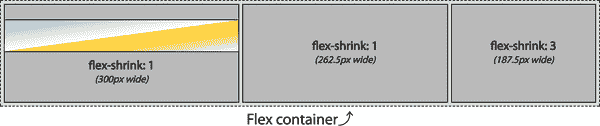

###### 图 11-45\. 由于伸缩项内容而受到限制的收缩 

如果图像宽度为 296 像素，那么第一个弹性项将能够收缩 4 像素。剩余的 146 像素负空间将分配给剩余的四个因子，每个因子分配 36.5 像素。然后，弹性项宽度将变为 296、263.5 和 190.5 像素。

如果所有三个弹性项包含非换行文本或宽度为 300 像素或更宽的媒体，则这三个弹性项都不会收缩，类似于第一个示例中的图 11-44。

### 基于宽度和收缩因子的比例缩小

前面的代码示例相对简单，因为所有弹性项的宽度相同。但如果宽度不同呢？如果第一个和最后一个弹性项的宽度为 250 像素，而中间的弹性项的宽度为 500 像素，如图 11-46 所示？

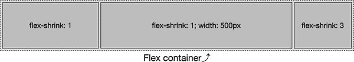

###### 图 11-46\. 弹性项根据其收缩因子按比例收缩 

弹性项根据其收缩因子和弹性项的宽度按比例收缩，宽度通常是弹性项内容的宽度，没有换行。在图 11-46 中，我们试图将 1000 像素放入一个 750 像素宽的弹性容器中。我们有多出的 250 像素要从五个收缩因子中移除。

如果这是一个`flex-grow`的情况，我们只需将 250 像素除以 5，分配每个增长因子 50 像素。如果我们按这种方式收缩，我们得到的弹性项宽度分别为 200、550 和 100 像素。但实际的收缩方式并非如此。

在这里，我们有 250 像素的负空间要按比例分配。为了获取收缩因子的比例，我们将负空间除以弹性项宽度（更精确地说，沿主轴的长度）乘以它们的收缩因子总和：

<math alttext="upper S h r i n k upper P e r c e n t equals StartFraction upper N e g a t i v e upper S p a c e Over left-parenthesis left-parenthesis upper W i d t h Baseline 1 times upper S h r upper F Baseline 1 right-parenthesis plus period period period plus left-parenthesis upper W i d t h upper N times upper S h r upper F upper N right-parenthesis right-parenthesis EndFraction" display="block"><mrow><mi>S</mi> <mi>h</mi> <mi>r</mi> <mi>i</mi> <mi>n</mi> <mi>k</mi> <mi>P</mi> <mi>e</mi> <mi>r</mi> <mi>c</mi> <mi>e</mi> <mi>n</mi> <mi>t</mi> <mo>=</mo> <mfrac><mrow><mi>N</mi><mi>e</mi><mi>g</mi><mi>a</mi><mi>t</mi><mi>i</mi><mi>v</mi><mi>e</mi><mi>S</mi><mi>p</mi><mi>a</mi><mi>c</mi><mi>e</mi></mrow> <mrow><mo>(</mo><mo>(</mo><mi>W</mi><mi>i</mi><mi>d</mi><mi>t</mi><mi>h</mi><mn>1</mn><mo>×</mo><mi>S</mi><mi>h</mi><mi>r</mi><mi>F</mi><mn>1</mn><mo>)</mo><mo>+</mo><mo>.</mo><mo>.</mo><mo>.</mo><mo>+</mo><mo>(</mo><mi>W</mi><mi>i</mi><mi>d</mi><mi>t</mi><mi>h</mi><mi>N</mi><mo>×</mo><mi>S</mi><mi>h</mi><mi>r</mi><mi>F</mi><mi>N</mi><mo>)</mo><mo>)</mo></mrow></mfrac></mrow></math>

使用这个方程式，我们找到了收缩百分比：

+   = 250 px ÷ [(250 px × 1) + (500 px × 1) + (250 px × 3)]

+   = 250 px ÷ 1500 px

+   = 0.166666667 (16.67%)

当我们按`flex-shrink`值的 16.67%减少每个弹性项时，我们得到如下减少的弹性项宽度：

+   item1 = 250 px × (1 × 16.67%) = 41.67 px

+   item2 = 500 px × (1 × 16.67%) = 83.33 px

+   item3 = 250 px × (3 × 16.67%) = 125 px

然后从起始大小分别减去每个缩小值，得到的弹性项宽度分别为 208.33、416.67 和 125 像素。

### 不同的基础值

当收缩因子被设置为`0`，且弹性项的宽度和基础宽度均设为`auto`时，即使你认为内容应该换行，该项的内容也不会换行。相反，任何正的收缩值都会使内容换行。因为收缩是根据收缩因子成比例的，如果所有弹性项的收缩因子相似，内容应该会以相似的行数换行。

在图 11-47 中显示的三个示例中，弹性项未声明宽度。因此，宽度基于内容，因为`width`默认为`auto`。弹性容器的宽度已调整为 520 像素，而不是通常的 750 像素。

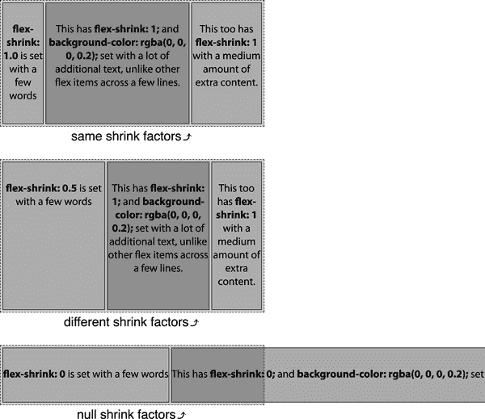

###### 图 11-47\. 弹性项根据其收缩因子和内容成比例收缩 

请注意，在第一个示例中，所有项的`flex-shrink`值相同，所有内容都会换行为四行。在第二个示例中，第一个弹性项的收缩因子是其他弹性项的一半，所以它将内容换行为（大致）一半的行数。这就是收缩因子的威力。

在第三个示例中，没有收缩因子，文本根本不换行，而且弹性项远超容器。

###### 警告

截至 2022 年末，这种“行平衡”和拒绝换行的行为在各浏览器间并不一致。如果您在自己尝试时看到不同的结果，可能就是原因。

因为`flex`属性的收缩因子按比例减少弹性项的宽度，当宽度收缩或扩展时，弹性项中的文本行数也会增加或减少，从而在收缩因子相似时在兄弟弹性项内产生类似高度的内容。

在这些示例中，假设弹性项的内容分别为 280、995 和 480 像素，这些是第三个示例中非换行弹性项的宽度（由开发工具测量，然后四舍五入，以使此示例更简单）。这意味着我们必须通过根据其收缩因子成比例收缩弹性项，将 1,755 像素的内容装入 520 像素宽的弹性容器中。我们有 1,235 像素的可用负空间进行成比例分配。

###### 注意

请记住，您不能依赖于 Web 检查工具来确定生产中的收缩因子。我们正在进行此练习，以展示收缩因子的工作原理。如果细节不是您的事情，请随时跳到“flex-basis 属性”。

在我们的第一个示例中，弹性项最终将具有相同或近似相同的文本行数。这是因为弹性项根据其内容的宽度成比例收缩。

我们没有声明任何宽度，因此不能像在前面的示例中那样简单地使用显式元素宽度作为计算基础。相反，我们根据内容的宽度（分别为 280、995 和 480 像素）在 1,235 像素的负空间中按比例分配它们。我们确定 520 是 1,755 的 29.63%。要确定收缩因子为 1 的每个 flex 项目的宽度，我们将每个 flex 项目的内容宽度乘以 29.63%：

+   item1 = 280 px × 29.63% = 83 px

+   item2 = 995 px × 29.63% = 295 px

+   item3 = 480 px × 29.63% = 142 px

使用默认的`align-items: stretch`（见“对齐项目”），三列布局将具有相等高度的三列。通过对所有 flex 项目使用一致的收缩因子，您可以指示这三个 flex 项目的实际内容应该具有大致相等的高度——尽管这样做，这些列的宽度不一定是均匀的。

在 图 11-47 的第二个示例中，flex 项目的收缩因子并不完全相同。第一个 flex 项目将按比例缩小一半，其他项目将按比例缩小。我们开始时拥有相同的宽度：分别为 280、995 和 480 像素，但它们的收缩因子分别为 0.5、1.0 和 1.0。因为我们知道内容的宽度，可以通过数学方法找到收缩因子（*X*）：

+   280 px + 995 px + 480 px = 1,615 px

+   (0.5 × 280 px) + (1 × 995 px) + (1 × 480 px) = 1,235 px

+   *X* = 1,235 px ÷ 1,615 px = 0.7647

现在我们知道收缩因子，我们可以找到最终的宽度。如果收缩因子为 76.47%，`item2` 和 `item3` 将以此比例收缩，而 `item1` 将以 38.23% 收缩（因为其 `flex-shrink` 值是其他项目的一半）。在每种情况下，收缩量四舍五入至最接近的整数：

+   item1 = 280 px × 0.3823 = 107 px

+   item2 = 995 px × 0.7647 = 761 px

+   item3 = 480 px × 0.7647 = 367 px

因此，flex 项目的最终宽度如下：

+   item1 = 280 px – 107 px = 173 px

+   item2 = 995 px – 761 px = 234 px

+   item3 = 480 px – 367 px = 113 px

这三个 flex 项目的总宽度组合为 520 像素。

添加不同的收缩和增长因子使一切变得不那么直观。这就是为什么您可能希望始终声明 `flex` 简写，最好为每个 flex 项目设置宽度或基础。如果现在还不理解，不用担心；我们将讨论更多关于 `flex-basis` 收缩的示例。

### 响应式 flex

允许 flex 项目按比例收缩可创建响应式对象和布局，无需断点查询，例如，在宽屏上显示为 图 11-48，在窄屏上显示为 图 11-49：

```
nav {
  flex: 0 1 200px;
  min-width: 150px;
}
article {
  flex: 1 2 600px;
}
aside {
  flex: 0 1 200px;
  min-width: 150px;
}
```

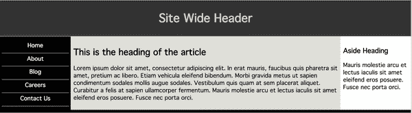

###### 图 11-48。一个宽阔的 flexbox 布局

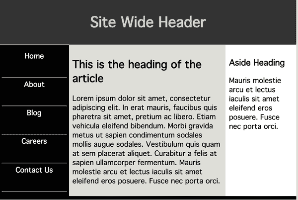

###### 图 11-49。一个窄的 flexbox 布局 

在这个例子中，如果视口宽度大于 1000 像素，只有中间列会增长，因为只有中间列被提供了正增长因子。我们还规定在 1000 像素宽标记以下，所有列都会收缩。

让我们一点点来看。`<nav>`和`<aside>`元素有以下 CSS：

```
flex: 0 1 200px;
min-width: 150px;
```

它们不会根据基础增长，但可以以相等的速率收缩。这意味着它们默认将以它们的 flex 基础宽度为宽度。如果它们需要收缩，它们将会收缩到最小宽度`150px`然后停止收缩。然而，如果其中一个有一个超过 150 像素宽的元素，无论是图像还是文本运行，当它达到该内容位的宽度时，它将停止收缩。假设一个 180 像素的图像放入`<aside>`元素中。一旦它达到 180 像素宽，它将停止收缩。`<nav>`将继续缩小到 150 像素。

另一方面，`<main>`元素有以下样式：

```
flex: 1 2 600px;
```

因此，如果有空间，`<main>`元素可以增长。因为它是唯一可以增长的 flex 项目，它得到所有的增长。假设浏览器窗口宽度为 1300 像素，两侧列将各为 200 像素宽，剩下 900 像素宽度给中间列。在收缩情况下，中间列将比其他两个元素快两倍缩小。因此，如果浏览器窗口宽度为 900 像素，每个侧列将为 175 像素宽，中间列为 550 像素宽。

一旦窗口宽度达到 800 像素，侧列将达到它们的最小宽度值`150px`。从那时起，任何缩窄将由中间列接管。

为了明确起见，在这些情况下，您并不需要使用像素。甚至可以对各种 flex 基础值使用不同的单位度量。前面的例子可以重写如下：

```
nav {
  flex: 0 1 20ch;
  min-width: 15vw;
}
article {
  flex: 1 2 45ch;
}
aside {
  flex: 0 1 20ch;
  min-width: 10ch;
}
```

我们不会在这里详细讨论所有的数学，但一般的方法是在字符宽度上设置 flex 基础值以提高可读性，有些基于字符宽度的下限，有些基于视口宽度。

###### 注意

Flexbox 对于像本节所示的一维页面布局非常有用，只有一行中的三列。对于更复杂的布局或更强大的选项集，请使用网格布局（见第十二章）。

## flex-basis 属性

正如您已经看到的，弹性项的大小受其内容和框模型属性的影响，并可以通过`flex`属性的三个组件来重置。`flex`属性的<*`flex-basis`*>组件定义了弹性项在额外或负空间分配之前的初始或默认大小——在允许弹性项根据增长和收缩因子增长或缩小之前。它也可以通过`flex-basis`属性设置。

###### 警告

强烈不建议通过`flex-basis`属性声明弹性基础，这是规范作者本人的建议。相反，应将弹性基础作为`flex`简写的一部分声明。我们在这里讨论属性只是为了探索弹性基础。

弹性基础通过`box-sizing`设置弹性项元素框的大小。默认情况下，当块级元素不是弹性项时，大小由其父级、内容和框模型属性确定。当没有显式声明或继承尺寸属性时，默认大小为其独立内容、边框和填充，这是块级元素父级宽度的 100%。

弹性基础可以使用与`width`和`height`属性相同的长度值类型进行定义，例如`5vw`、`12%`和`300px`。

通用关键字`initial`将弹性基础重置为`auto`的初始值，因此您可能想要声明`auto`。反过来，如果`width`（或`height`）的值设置为`auto`，则`flex-basis`的值被评估为`content`。这会导致弹性项根据其内容的大小进行调整，尽管规范中没有明确说明具体方法。

### 内容关键字

除了长度和百分比外，`flex-basis`还支持`min-content`、`max-content`、`fit-content`和`content`关键字。我们在第六章中涵盖了前三者，但是在这里我们需要重新审视`fit-content`，并且需要探索`content`。

当使用`fit-content`作为`flex-basis`的值时，浏览器会尽力平衡一行中所有弹性项，使它们在块大小上相似。考虑以下代码，在图 11-50 中有所说明：

```
.flex-item {flex-basis: 25%; width: auto;}
.flex-item.fit {flex-basis: fit-content;}
```

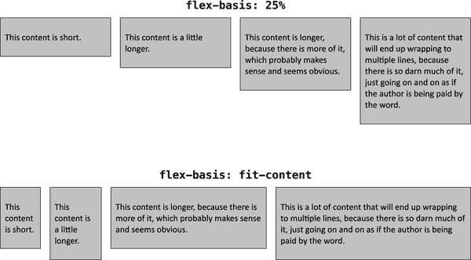

###### 图 11-50\. `fit-content` 弹性基础大小

在第一个弹性线上，弹性项的弹性基础被设置为 25%，这意味着每个弹性项从弹性线宽度的 25%作为其尺寸基础开始，并根据浏览器的自由裁量进行弹性调整。在第二个弹性线上，弹性项被设置为使用`fit-content`作为它们的弹性基础。注意到更多的内容导致弹性项更宽，而内容较少导致更窄的项。

还要注意，尽管不能保证，在某些情况下，一些弹性项目的高度（更正确地说是块大小）可能会不同：比如，其中一个弹性项目的内容换行比其他的多一行。它们应该几乎相同。

这是 Flexbox 的一个优点的良好示例：您可以向布局引擎提供一个总体方向，并让它完成其余工作。在这里，您不需要计算哪些宽度应该分配给哪些弹性项目以平衡它们的高度，只需告诉它`fit-content`，让它自行处理。

使用`content`关键字通常会产生与`fit-content`类似的结果，尽管存在一些差异。一个`content`基础是弹性项目内容的大小——即内容最长行或最宽（或最高）媒体对象的主轴尺寸长度。这相当于在弹性项目上声明`flex-basis: auto; inline-size: auto;`。

值`content`具有如图 11-51 所示的效果。

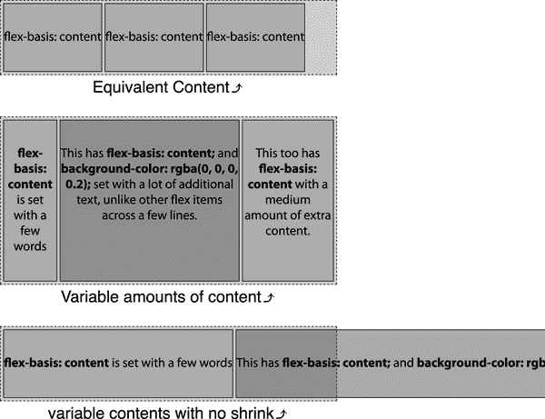

###### 图 11-51. 基于`content`基础的弹性项目尺寸 

在第一个和第三个示例中，弹性项目的宽度与内容大小相同；而弹性基础也是相同的尺寸。例如，在第一个示例中，弹性项目的宽度和基础约为 132 像素。三个并排的弹性项目的总宽度为 396 像素，项目之间有一些像素的间距，都轻松适应父容器。

在第三个示例中，我们设置了一个空的收缩因子（`0`）：这意味着弹性项目不能收缩，因此它们不会收缩或换行以适应固定宽度的弹性容器。相反，它们的宽度与非换行文本的宽度相同。这个宽度也是弹性基础的值。三个弹性项目的宽度，因此其基础值分别约为 309 像素、1037 像素和 523 像素。您完全看不到第二个和第三个弹性项目的全部宽度，但它们在[章节文件](https://meyerweb.github.io/csstdg5figs/11-flexbox)中。

第二个示例与第三个示例包含相同的内容，但弹性项目默认为收缩因子 1，因此此示例中的文本换行。因此，虽然弹性项目的宽度不是内容的宽度，但弹性基础——按比例收缩的基础——是项目内容的宽度。

图 11-51 中的第三个示例也很好地说明了在使用 `flex-shrink: 0` 时 `max-content` 关键字会发生什么：每个项目的伸缩基础将是其内容的最大尺寸。如果允许伸缩，浏览器将从每个项目的 `max-content` 作为基础开始进行伸缩，并从那里开始缩小它们。以下代码捕捉了两者之间的差异，并在 图 11-52 中有所展示：

```
#example1 {flex-basis: max-content; flex-shrink: 0;}
#example2 {flex-shrink: 1;}
```

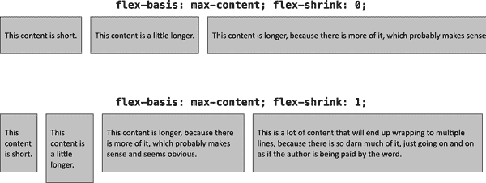

###### 图 11-52\. 根据 `max-content` 基础调整伸缩项的大小，有和没有收缩

在第一个例子中，不允许收缩时，每个伸缩项的宽度都等于其内容的最大宽度而不换行。这导致伸缩项溢出容器（因为 `flex-wrap` 未设置为 `wrap`）。在第二个例子中，当 `flex-shrink` 设置为 `1` 时，浏览器会等比例缩小每个伸缩项，直到它们都填满了伸缩容器而不溢出。请注意，四个伸缩项中的第二个略微比其他项更高，因为其缩小需要将内容换行至更多行。

对于 `min-content` 伸缩基础，情况正好相反。请考虑下面的情况，在 图 11-53 中有所展示：

```
#example1 {flex-basis: min-content; flex-grow: 0;}
#example2 {flex-grow: 1;}
```

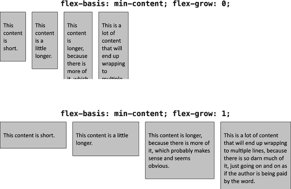

###### 图 11-53\. 根据 `min-content` 基础调整伸缩项的大小，有和没有增长

在第一个例子中，伸缩项尽可能窄以适应其内容。对于包含文本的元素，这使得它们非常高，因为块轴是垂直的。（请注意，第一个例子中伸缩项的全高度已被剪辑，以保持图像尺寸合理。）在第二个例子中，允许伸展伸缩项，因此它们从 `min-content` 大小开始，并且宽度均匀增加，直到它们全部填满了伸缩容器而不溢出。

在用于创建 图 11-53 的浏览器中，第一个例子中伸缩项的宽度总和约为 361.1 像素（四舍五入到最接近的十分之一像素），每个伸缩项之间有 20 像素的间距。这意味着从第一项的左边缘到最后一项的右边缘大约是 420.1 像素。要得出第二个例子中的结果，考虑到伸缩容器的宽度为 1,200 像素，则容器宽度与内容宽度之间的差值为 1,200 - 420.1 = 778.9 像素。将这一差值除以 4，得到约为 194.7 像素，每个四个伸缩项的宽度增加了该数量。

### 自动伸缩基础

当设置为 `auto` 时，无论是显式设置还是默认设置，`flex-basis` 与元素的主轴尺寸相同，如果元素没有被转换为 flex 项目的话。对于长度值，`flex-basis` 解析为 `width` 或 `height` 的值，但当 `width` 或 `height` 的值为 `auto` 时，`flex-basis` 的值回退到 `content`。

当 flex 基础为 `auto` 且所有 flex 项目都可以适应父 flex 容器时，flex 项目将保持它们的预设尺寸。如果 flex 项目不能适应其父 flex 容器，则这些 flex 项目将根据其非弹性主轴尺寸（除非收缩因子为 0）在父 flex 容器内按比例收缩。

当没有其他属性设置 flex 项目的主轴尺寸（即这些 flex 项目上没有设置 `inline-size`、`min-inline-size`、`width` 或 `min-width`），并且设置了 `flex-basis: auto` 或 `flex: 0 1 auto`，flex 项目的宽度将仅仅足够容纳内容，如 图 11-54 中的第一个示例所示。在这种情况下，它们是文本`flex-basis: auto`的宽度，大约为 110 像素。flex 项目保持它们的预设尺寸，就像设置为 `display: inline-block` 一样。在此示例中，它们位于主轴起点，因为 flex 容器的 `justify-content` 属性默认为 `flex-start`。

在第二个示例中的 图 11-54，每个 flex 项目都具有 `auto` 的 flex 基础和明确声明的宽度。如果它们没有被转换为 flex 项目，那么元素的主轴尺寸分别为 100、150 和 200 像素。由于它们在 flex 容器中没有沿主轴溢出，因此它们的尺寸就是这些。

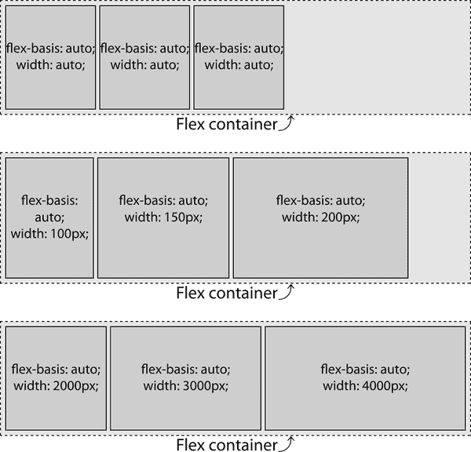

###### 图 11-54\. 自动 flex 基础和 flex 项目宽度 

在第三个示例中的 图 11-54，每个 flex 项目都具有 `auto` 的 flex 基础和非常大的明确声明宽度。如果它们没有被转换为 flex 项目，那么元素的主轴尺寸分别为 2,000、3,000 和 4,000 像素。由于它们不可能在不沿主轴溢出的情况下适应 flex 容器，并且它们的 flex 收缩因子都默认为 `1`，它们会收缩以适应 flex 容器。您可以通过 “不同的基础值” 中概述的过程计算出它们的实际大小；提示：第三个 flex 项目的宽度应从 4,000 像素减少到 240 像素。

### 默认值

当 `flex-basis` 和 `flex` 都未设置时，flex 项目的主轴尺寸为该项目的预设尺寸，因为默认值是 `auto`。

在 图 11-55 中：弹性基准值默认为 `auto`，增长因子默认为 `0`，每个项目的收缩因子默认为 `1`。对于每个弹性项目，弹性基准值是其单独的 `width` 值。这意味着弹性基准值被设置为 `width` 属性的值：在第一个示例中分别为 100、200 和 300 像素，在第二个示例中分别为 200、400 和 200 像素。由于弹性项目的总宽度分别为 600 像素和 800 像素，两者均大于 540 像素宽的主轴容器，它们都在按比例收缩以适应。

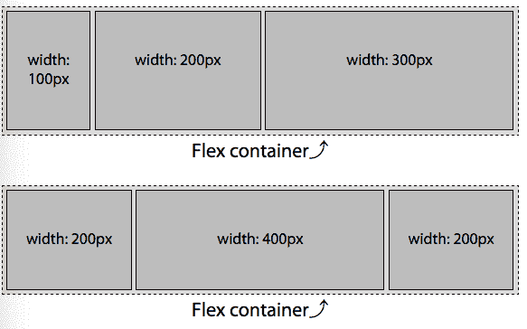

###### 图 11-55\. 弹性项目的默认大小 

在第一个示例中，我们试图将 600 像素放入 540 像素中，因此每个弹性项目将以 10% 的比例收缩，从而得到宽度分别为 90、180 和 270 像素的弹性项目。在第二个示例中，我们试图将 800 像素放入 540 像素中，因此它们都会收缩 32.5%，使得弹性项目的宽度为 135、270 和 135 像素。

### 长度单位

在前面的例子中，`auto` 弹性基准值默认为各种弹性项目的声明宽度。CSS 提供其他选项；例如，我们可以使用与 `width` 和 `height` 相同的长度单位作为我们的弹性基准值。

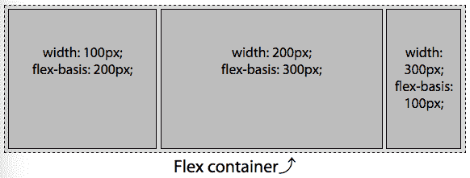

###### 图 11-56\. 使用长度单位弹性基准值调整弹性项目大小 

当我们同时具有 `flex-basis` 和 `width`（或 `height`，用于垂直主轴）值时，基准值优先于宽度（或高度）。让我们在 图 11-55 的第一个示例中添加基准值。弹性项目包括以下 CSS：

```
flex-container {
  width: 540px;
}
item1 {
  width: 100px;
  flex-basis: 300px;  /* flex: 0 1 300px; */
}
item2 {
  width: 200px;
  flex-basis: 200px;  /* flex: 0 1 200px; */
}
item3 {
  width: 300px;
  flex-basis: 100px;  /* flex: 0 1 100px; */
}
```

宽度被基准值覆盖。弹性项目收缩至分别为 270 像素、180 像素和 90 像素。如果容器没有限制宽度，弹性项目将分别为 300 像素、200 像素和 100 像素。

虽然声明的弹性基准可以覆盖弹性项目的主轴尺寸，但其尺寸可能会受到其他属性的影响，例如 `min-width`、`min-height`、`max-width` 和 `max-height`。这些属性不会被忽略。因此，例如，一个元素可能有 `flex-basis: 100px` 和 `min-width: 500px`。尽管弹性基准较小，但将尊重最小宽度为 `500px`。

### 百分比单位

百分比值对于 `flex-basis` 是相对于弹性容器主轴尺寸计算的。

我们已经看到 图 11-57 的第一个示例；这里包含它是为了回顾`flex-basis: auto`文本的宽度在此情况下约为 110 像素。在这种情况下，仅声明 `flex-basis: auto` 看起来与写 `flex-basis: 110px` 相同：

```
flex-container {
  width: 540px;
}
flex-item {
  flex: 0 1 100%;
}
```

在 图 11-57 的第二个示例中，前两个 flex 项目的 `flex-basis` 设置为 `auto`，其默认 `width` 为 `auto`，即相当于它们的 `flex-basis` 被设置为 `content`。正如我们之前提到的，这两个项目的 `flex-basis` 最终等同于 110 像素，因为在这种情况下内容恰好为 110 像素宽。最后一个项目的 `flex-basis` 设置为 `100%`。

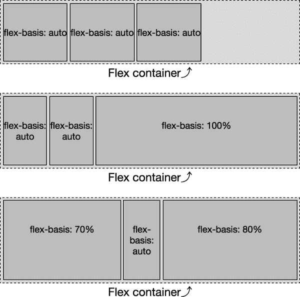

###### 图 11-57\. 使用百分比 `flex-basis` 值调整 `flex` 项目大小 

百分比值相对于父级元素，即 540 像素。第三个 `flex` 项目的 `basis` 设置为 `100%`，并非唯一位于非换行 `flex` 容器中的 `flex` 项目。因此，它不会扩展为父级 `flex` 容器宽度的 `100%` *除非* 它的收缩因子设置为空收缩因子，表示它无法收缩，或者包含的不换行内容宽度等于或大于父容器宽度。

###### 小贴士

记住：当 `flex` 基础值为百分比时，主轴大小是相对于父级元素即 `flex` 容器的。

对于我们的三个 `flex` 基础值，如果内容确实为 110 像素宽，容器宽度为 540 像素（简化起见，忽略其他盒模型属性），我们有 760 像素要放入 540 像素的空间中。因此，我们需要按比例分配 220 像素的负空间。收缩因子如下：

+   收缩因子 = 220 px ÷ 760 px = 28.95%

每个 `flex` 项目将按 28.95% 收缩，变为原本宽度的 71.05%。我们可以计算最终的宽度：

+   item1 = 110 px × 71.05% = 78.16 px

+   item2 = 110 px × 71.05% = 78.16 px

+   item3 = 540 px × 71.05% = 383.68 px

只要 `flex` 项目不包含比 78.16 像素或 383.68 像素更宽的媒体或不换行文本，这些数字就是准确的。这是这些 `flex` 项目能够收缩到的最宽程度，只要内容可以折叠到该宽度或更窄。我们说“最宽”，因为如果其他两个 `flex` 项目无法收缩到这个值那么窄，它们将必须吸收一些负空间。

在 图 11-57 的第三个示例中，`flex-basis: auto` 项目跨三行。这个示例的 CSS 等同于以下内容：

```
flex-container {
  width: 540px;
}
item1 {
  flex: 0 1 70%;
}
item2 {
  flex: 0 1 auto;
}
item3 {
  flex: 0 1 80%;
}
```

我们声明三个 flex 项目的 `flex-basis` 分别为 `70%`、`auto` 和 `80%`。记住，在我们的情况下，`auto` 是非换行内容的宽度，本例中约为 110 像素，而我们的 flex 容器是 540 像素，基础值等同于以下内容：

+   item1 = 70% × 540 px = 378 px

+   item2 = 文本宽度（“flex-basis: auto”）≈ 110 px

+   item3 = 80% × 540 px = 432 px

当我们将这三个 flex 项目的基础值的宽度相加时，它们总共的宽度为 920 像素，需要适应一个 540 像素宽的 flex 容器。因此，我们有 380 像素的负空间需要在这三个 flex 项目中按比例减少。为了找出比例，我们将我们的 flex 容器的可用宽度除以它们如果不能收缩时的 flex 项目宽度总和：

+   比例宽度 = 540 px ÷ 920 px = 0.587

因为收缩因子都是相同的，所以这相当简单。每个项目将是其没有 flex 项目兄弟时宽度的 58.7%：

+   item1 = 378 px × 58.7% = 221.8 px

+   item2 = 110 px × 58.7% = 64.6 px

+   item3 = 432 px × 58.7% = 253.6 px

当容器宽度不同时会发生什么？比如，1,000 像素？flex 基础将分别为 700 像素（70% × 1,000 像素）、110 像素和 800 像素（80% × 1,000 像素），总共为 1,610 像素：

+   比例宽度 = 1,000 px ÷ 1,610 px = 0.6211

+   item1 = 700 px × 62.11% = 434.8 px

+   item2 = 110 px × 62.11% = 68.3 px

+   item3 = 800 px × 62.11% = 496.9 px

因为 70%和 80%的基础值的组合总是大于 100%，无论父级容器有多宽，所有三个项目都会收缩。

如果第一个 flex 项目由于某种原因无法收缩——无论是因为无法收缩的内容，还是其他 CSS 设置其 `flex-shrink` 为 `0`——它将是父级宽度的 70%，在这种情况下是 378 像素。其余两个 flex 项目必须按比例收缩以适应剩余的 30%，即 162 像素。在这种情况下，我们预计宽度将为 378 像素、32.875 像素和 129.125 像素。由于文本“basis:”比这更宽——假设 42 像素——我们得到 378 像素、42 像素和 120 像素。图 11-58 展示了结果。

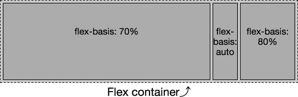

###### 图 11-58。虽然 `flex-basis` 的百分比值是相对于 flex 容器宽度的，但主轴大小受其兄弟项目的影响

在您的设备上测试此功能可能会有略微不同的结果，因为渲染文本的字体宽度“flex-basis: auto”可能不同，这取决于所使用的字体（我们使用了 Myriad Pro，并回退到 Helvetica 和任何通用无衬线字体）。

### 零基础

如果既未包括`flex-basis`属性也未包括`flex`简写，则`flex`基础值默认为`auto`。当包含`flex`属性但省略了简写中的 flex 基础组件时，基础默认为`0`。表面上看，你可能会认为`auto`和`0`两个值相似，但实际上`0`值非常不同，可能不符合你的预期。

在`flex-basis: auto`的情况下，基础是弹性项目内容的主尺寸。如果每个弹性项目的基础为`0`，则可用空间是整个弹性容器的主轴尺寸。在任一情况下，可用空间按每个弹性项目的增长因子比例分配。

使用基础值`0`，弹性容器的大小按比例分配给每个弹性项目，根据其增长因子——默认的原始主轴尺寸定义为`height`、`width`或`content`不计算，尽管`min-width`、`max-width`、`min-height`和`max-height`会影响弹性尺寸。

如图 11-59 所示，当基础为`auto`时，只有额外的空间按比例分配并添加到每个设置为增长的弹性项目中。同样地，假设文本宽度为“flex: *X X* auto”的第一个示例中为 110 像素，则有 210 像素可在六个增长因子中分配，每个增长因子为 35 像素。弹性项目分别为 180、145 和 215 像素宽。


###### 图 11-59。自动和零弹性基础值中的弹性增长

在第二个示例中，当基础为 0 时，宽度的全部 540 像素为可分配空间。在 540 像素的可分配空间中，每个增长因子值为 90 像素。弹性项目分别为 180、90 和 270 像素宽。虽然中间的弹性项目宽度为 90 像素，但本示例中的内容比 110 像素窄，因此弹性项目未换行。

## 弹性简写

现在你已经更充分地理解了组成`flex`简写的属性，请记住：*始终使用`flex`简写*。它接受通常的全局属性值，包括`initial`、`auto`、`none`；以及一个整数，通常为`1`，表示弹性项目可以增长。

弹性值的四个提供最常见的期望效果：

`flex: initial`

等同于`flex: 0 1 auto`。这基于`inline-size`值调整弹性项目的大小（等效于`width`或`height`，取决于内联轴的方向），允许收缩但不允许增长。

`flex: auto`

等同于`flex: 1 1 auto`。这基于`inline-size`值调整弹性项目的大小，使其完全灵活，允许收缩和增长。

`flex: none`

等同于`flex: 0 0 auto`。这基于`inline-size`值调整弹性项目的大小，但使其完全不可伸缩：不能收缩或增长。

`flex: <*number*>`

等同于`flex: <*number*> 1 0`。此值将 flex 项目的增长因子设置为提供的<*`number`*>。它还将收缩因子和 flex 基础设置为`0`。这意味着`inline-size`的值充当最小尺寸，但如果有空间的话，flex 项目将增长。

让我们依次考虑每个问题。

### Flexing with initial

全局 CSS 关键字`initial`可用于所有属性，表示属性的初始值（即规范的默认值）。因此，以下行是等效的：

```
flex: initial;
flex: 0 1 auto;
```

声明`flex: initial`会将增长因子设置为空值，收缩因子设置为`1`，并将 flex 基础值设置为`auto`。在图 11-60 中，我们可以看到`auto` flex 基础值的效果。在前两个示例中，每个 flex 项目的基础是`content`——每个 flex 项目的宽度都是组成内容的单行字母的宽度。然而，在最后两个示例中，所有项目的 flex 基础值都相等，为 50 像素，因为所有 flex 项目都应用了`width: 50px`。`flex: initial`声明将`flex-basis`设置为`auto`，正如我们之前看到的，这是`width`（或`height`）的值（如果声明），或者如果没有声明则是`content`的值。

在这些示例的第一和第三个中，我们看到当 flex 容器太小而无法容纳所有 flex 项目以其默认的主轴尺寸时，flex 项目会收缩，以便全部适应父 flex 容器。在这些示例中，所有 flex 项目的组合 flex 基础值大于 flex 容器的主轴尺寸。在第一个示例中，每个 flex 项目的宽度根据其内容的宽度和其收缩能力而异。它们根据其收缩因子成比例地收缩，但不会比其最宽的内容更窄。在第三个示例中，由于`width`的值，每个 flex 项目的 flex 基础为 50 像素，因此所有项目均等地收缩。


###### 图 11-60\. 当设置`flex: initial`时，flex 项目会收缩但不会增长 

默认情况下，flex 项目被分组到主轴的起始端，因为`flex-start`是`justify-content`属性的默认值。只有当 flex 行中所有 flex 项目的组合主轴尺寸小于 flex 容器的主轴尺寸，并且没有 flex 项目能够增长时，这一点才会显现出来。

### Flexing with auto

`flex: auto`选项类似于`flex: initial`，但在两个方向上使 flex 项都灵活：如果没有足够的空间容纳所有项，则它们会收缩，并且如果有可分配的空间，则会增长以占据容器内的所有额外空间。flex 项吸收沿主轴的任何自由空间。以下两个语句是等效的：

```
flex: auto;
flex: 1 1 auto;
```

图 11-61 展示了使用`auto`进行各种场景的灵活性。


###### 图 11-61。当设置了`flex: auto`时，flex 项可以增长和收缩 

图 11-61 的第一个和第三个示例与图 11-60 中的示例相同，因为它们的收缩和基础值是一样的。然而，第二个和第四个示例是不同的。这是因为当设置了`flex: auto`时，增长因子为`1`，因此 flex 项可以扩展以包含所有额外的可用空间。

### 使用`none`防止灵活性

任何`flex: none`的 flex 项都是不灵活的：它们既不能收缩也不能扩展。以下两行 CSS 是等价的：

```
flex: none;
flex: 0 0 auto;
```

图 11-62 展示了`none`的效果。


###### 图 11-62。使用`flex: none`，flex 项既不会增长也不会收缩 

如图 11-62 的第一个和第三个示例所示，如果空间不足，flex 项将溢出 flex 容器。这与`flex: initial`和`flex: auto`不同，它们都设置了一个正的收缩因子。

基础解析为`auto`，这意味着每个 flex 项的主轴尺寸由原本的元素主轴尺寸决定，假如它没有被转换为 flex 项。flex 基础解析为元素的`width`或`height`值。如果该值为`auto`，则基础值变为内容的主轴尺寸。在前两个示例中，基础值——以及宽度，因为没有增长或收缩——是内容的宽度。在第三和第四个示例中，宽度和基础值都是 50 像素，因为这是应用于它们的`width`属性的值。

### 数值灵活性

当`flex`属性的值是单个的正数数值时，该值将用于增长因子，而收缩因子默认为`1`，基础值默认为`0`。以下两个 CSS 声明是等效的：

```
flex: 3;
flex: 3 1 0;
```

这使得设置了它的 flex 项变得灵活：它可以增长。收缩因子实际上无关紧要：flex 基础被设置为`0`，因此 flex 项只能从该基础开始增长。

在图 11-63 的前两个示例中，所有伸缩项的伸缩增长因子均为`3`。伸缩基础为`0`，因此它们不会“收缩”；它们只是从 0 像素宽度开始等比例增长，直到它们的主轴尺寸之和填充容器沿主轴。所有伸缩项的基础为`0`时，主尺寸的 100%是可分配空间。第二个示例中伸缩项的主轴尺寸较宽，因为较宽的伸缩容器具有更多可分配空间。


###### 图 11-63\. 使用单个数值进行伸缩 

任何大于 0 的数值，甚至是 0.1，表示伸缩项可以增长。如果有可用空间进行增长，并且只有一个伸缩项具有正的增长因子，那么该项将占据所有可用空间。如果多个伸缩项可以增长，则可用的额外空间将根据其增长因子按比例分配给每个伸缩项。

图 11-63 的最后三个示例分别声明了六个伸缩项，其值分别为`flex: 0`、`flex: 1`、`flex: 2`、`flex: 3`、`flex: 4`和`flex: 5`。这些是伸缩项的增长因子，每个都具有收缩因子为`1`和基础为`0`。每个的主轴尺寸与指定的伸缩增长因子成比例。你可能会假设在第三个示例中显示文本`flex: 0`的`flex: 0`项将为 0 像素宽，就像第四个示例中一样——但默认情况下，伸缩项不会收缩到比最长单词或固定尺寸元素的长度更短。

###### 注意

我们向这些图形添加了一些填充、边距和边框，以使视觉效果更加愉悦。因此，最左边的具有声明`flex: 0`的伸缩项是可见的：它有 1 像素的边框，使其可见，即使宽度为 0 像素。

# order 属性

伸缩项默认按照它们在源代码中出现的顺序显示和布局。伸缩项和伸缩行的顺序可以通过`flex-direction`进行反转，但有时你可能需要一个更复杂的重新排列。`order`属性可用于更改单个伸缩项的顺序。

默认情况下，所有伸缩项的`order`属性均为`0`，所有伸缩项都分配到相同的序号组，并按照它们的源顺序沿主轴方向显示。（这是本章节中所有示例的情况。）

要更改伸缩项的视觉顺序，请将`order`属性值设置为非零整数。在不是伸缩容器子元素的元素上设置`order`属性将不会对这些元素产生影响。

###### 警告

改变伸缩项目的视觉渲染顺序会导致元素的源顺序和视觉呈现之间存在差异。如 Mozilla 开发者网络关于 `order` 的文章所述，“对于低视力用户通过屏幕阅读器等辅助技术进行导航可能产生不利影响。” 对于通过键盘导航并使用放大或其他方式放大页面的用户也可能会造成问题。换句话说：非常小心使用 `order`，并仅在经过充分的可访问性测试后才在生产环境中使用。

`order` 属性的值指定了伸缩项目所属的*序数组*。任何具有负值的伸缩项目在绘制到页面时将会出现在默认为 `0` 的项目之前，并且所有具有正值的伸缩项目将会出现在默认为 `0` 的项目之后。虽然视觉上有所改变，但源顺序保持不变。屏幕阅读器和制表顺序保持 HTML 源顺序定义的方式。

例如，如果您有一组 12 个项目，并且希望第七个项目排在第一位，第六个项目排在最后，您可以声明如下：

```
ul {
  display: inline-flex;
}
li:nth-of-type(6) {
  order: 1;
}
li:nth-of-type(7) {
  order: -1;
}
```

在这种情况下，我们明确为第六和第七个列表项设置了顺序，而其他列表项默认为 `order: 0`。图 11-64 展示了结果。


###### 图 11-64\. 使用 `order` 属性重新排序伸缩项目 

第七个伸缩项目首先布局，因为 `order` 属性的负值小于默认的 `0`，也是其所有同级伸缩项目中最低的值。第六个伸缩项目是唯一具有大于 `0` 值的项目，因此是其所有同级项目中最高的顺序值。这就是为什么它在所有其他伸缩项目之后布局的原因。所有其他项目，由于默认为 `0` 的 `order`，都在第一个和最后一个项目之间按其源顺序绘制。

伸缩容器按照修改后的文档顺序布局其内容，从序数组编号最低的开始向上。当多个伸缩项目具有相同的 `order` 值时，它们共享一个序数组。每个序数组中的项目将按源顺序显示，序数组按数字顺序从低到高显示。考虑以下情况：

```
ul {
  display: inline-flex;
  background-color: rgba(0,0,0,0.1);
}
li:nth-of-type(3n-1) {
  order: 3;
  background-color: rgba(0,0,0,0.2);
}
li:nth-of-type(3n+1) {
  order: -1;
  background-color: rgba(0,0,0,0.4);
}
```

通过为多个伸缩项目设置相同的 `order` 值，这些项目将按序数组和每个单独序数组内的源顺序显示。图 11-65 展示了结果。


###### 图 11-65\. 弹性项按顺序组出现，按组内源顺序排列 

这里发生了什么：

+   项 2，5，8 和 11 被选中以共享顺序组`3`，并获得 20%的不透明背景。

+   项 1，4，7 和 10 被选中以共享顺序组`-1`，并获得 40%的不透明背景。

+   项 3，6，9 和 12 根本未被选择。它们默认属于顺序组`0`。

因此，三个顺序组分别是`-1`，`0`和`3`。这些组按照这个顺序排列。在每个组内部，项目按照源顺序排列。

此重新排序纯粹是视觉效果。屏幕阅读器应该按照源代码中的顺序读取文档，尽管可能不会。作为视觉变化，弹性项的排序影响页面的绘制顺序：弹性项的绘制顺序是它们出现的顺序，就好像它们在源文档中重新排序了一样，尽管实际上并没有。

使用`order`属性更改布局对页面的选项卡顺序没有影响。如果图 11-65 中的数字是链接，通过链接的选项卡顺序将按照源代码顺序，*而不是*按照布局顺序进行。

## 重新审视选项卡导航

在我们的选项卡导航栏示例中（见图 11-2），我们可以使当前活动选项卡首先显示，如图 11-66 所示：

```
nav {
  display: flex;
  justify-content: flex-end;
  border-bottom: 1px solid #ddd;
}
a {
  margin: 0 5px;
  padding: 5px 15px;
  border-radius: 3px 3px 0 0;
  background-color: #ddd;
  text-decoration: none;
  color: black;
}
a:hover {
  background-color: #bbb;
  text-decoration: underline;
}
a.active {
  order: -1;
  background-color: #999;
}

<nav>
  <a href="/">Home</a>
  <a href="/about">About</a>
  `<``a` `class``=``"active"``>``Blog``<``/``a``>`
  <a href="/jobs">Careers</a>
  <a href="/contact">Contact Us</a>
</nav>

```


###### 图 11-66\. 改变顺序将改变视觉顺序，但不会改变选项卡顺序 

当前活动选项卡已添加`.active`类，并移除了`href`属性，并将`order`设置为`-1`，低于其他兄弟弹性项的默认`0`，因此它会首先显示。

为什么要移除`href`属性？因为选项卡是当前活动文档，没有理由文档要链接到自身。但更重要的是，如果它是一个活动链接而不是占位符链接，并且用户正在使用键盘通过导航进行选项卡，出现顺序是博客，主页，关于我们，职业，联系我们，其中博客首先出现；但选项卡顺序将是主页，关于我们，博客，职业，联系我们，遵循源顺序而不是视觉顺序，这可能会令人困惑。

`order`属性可用于在移动设备和使用屏幕阅读器及其他辅助技术的用户面前将主要内容区域标记为首列，同时创建常见的三列布局外观：中心主内容区域，左侧站点导航和右侧侧边栏，如图 11-48 所示。

虽然你可以在标记中将页脚放在页眉之前，并使用 `order` 重新排列页面，但这是属性的不当使用。`order` 属性应仅用于内容的视觉重新排序。你的底层标记应始终反映内容的逻辑顺序。考虑这两种相同内容的标记顺序，这里并排显示以便比较：

```
<header></header>               <header></header>
<main>                          <main>
   <article></article>            <nav></nav>
   <aside></aside>                <article></article>
   <nav></nav>                    <aside></aside>
</main>                         </main>
<footer></footer>               <footer></footer>
```

我们一直按照想要它们出现的顺序标记网站，如代码示例中右侧所示，这与我们的三列布局示例中的代码相同（图 11-48）。

如果我们按照左侧显示的方式标记页面，将 `<article>` 内容（即主内容）放在源代码顺序的第一位，这对于屏幕阅读器、搜索引擎甚至大屏幕上的用户来说更合理，但对于我们的视力用户来说，在较大的屏幕上却在中间位置：

```
main {
  display: flex;
}
main > nav {
  order: -1;
}
```

通过使用 `order: -1` 属性声明，我们能够使 `<nav>` 出现在首位，因为它是 `-1` 顺序组中的唯一 flex 项目。`<article>` 和 `<aside>` 没有显式声明 `order`，默认为 `order: 0`。

记住，当一个顺序组中有多个 flex 项目时，这些项目按照主轴起点到主轴终点的顺序显示，所以 `article` 在 `aside` 前面显示。

一些开发人员，在至少一个 flex 项目的顺序变更时，喜欢为所有 flex 项目赋予 `order` 值以提高标记的可读性。我们也可以这样写：

```
main {
  display: flex;
}
main > nav {
  order: 1;
}
main > article {
  order: 2;
}
main > aside {
  order: 3;
}
```

在之前的几年里，在浏览器支持 flex 布局之前，这一切都可以通过浮动（floats）来实现：我们会在 `<nav>` 上设置 `float: right`。虽然可行，但是使用 flex 布局可以使这种布局变得更加简单，特别是如果我们希望三个列元素——`<aside>`、`<nav>` 和 `<article>`——的高度相等。

# 概要

使用弹性盒布局，你可以根据多种布局上下文和书写模式响应地布局同级元素，提供了多种选项来安排这些元素并使它们彼此对齐。它使得在父元素内垂直居中元素的任务变得几乎轻而易举，这在 flexbox 出现之前是非常困难的。它还作为普通流和网格布局之间强大而有用的桥梁，是下一章节的主题。
