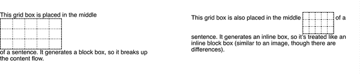

# 第十二章：网格布局

初创时，CSS 的核心存在一个布局上的空白。设计师将其他功能曲解为布局的目的，特别是`float`和`clear`，并通常围绕这个空白进行了各种 hack。Flexbox 布局帮助填补了这个空白，但 Flexbox 实际上是为特定用例设计的，比如导航栏（如第十一章中所示）。

与之相反，网格布局是一种*广义*的布局系统。通过其对行和列的强调，它可能一开始感觉像是回归到表格布局——在某些方面，这并不算太远——但网格布局比表格布局要丰富得多。网格允许设计的不同部分独立于其文档源顺序布局，甚至可以重叠布局的各个部分，如果您希望如此。CSS 提供了强大灵活的方法来定义网格线的重复模式，将元素附加到这些网格线上，等等。您可以嵌套网格，或者将表格或 flexbox 容器附加到网格上。还有更多更多。

简而言之，网格布局是我们长期等待的布局系统，在 2017 年，它登陆了所有主要的浏览器引擎。它使许多难以或甚至不可能实现的布局变得简单、灵活且健壮。

# 创建网格容器

创建网格的第一步是定义*网格容器*。这与定位中的包含块或 flex 布局中的 flex 容器非常相似：网格容器是一个为其内容定义*网格格式化上下文*的元素。

在这个基础层面上，网格布局与 Flexbox 非常相似。例如，网格容器的子元素成为*网格项*，就像 Flex 容器的子元素成为 Flex 项一样。这些网格项的子元素*不会*成为网格元素——尽管任何网格项本身都可以成为网格容器，并且其子元素成为嵌套网格的网格项。可以嵌套网格直至到底层都是网格。

CSS 有两种网格：*常规*网格和*内联*网格。这些是使用`display`属性的特殊值创建的：`grid`和`inline-grid`。前者生成块级框，后者生成内联级框。图 12-1 说明了它们的区别。



###### 图 12-1\. 网格和内联网格

这些与`block`和`inline-block`值相似，用于`display`。你创建的大多数网格可能是块级的，尽管在需要时，总是可以创建内联网格。

虽然`display: grid`创建一个块级网格，但规范明确指出“网格容器不是块容器”。虽然网格框在布局中的参与方式与块容器类似，但它们之间存在差异。

首先，浮动元素不会侵入到网格容器中。实际上，这意味着网格不会像块级容器那样滑动到浮动元素下面。参见图 12-2 以查看差异的演示。


###### 图 12-2\. 浮动元素与块和网格的不同交互方式

此外，网格容器的边距不会与其后代的边距折叠。这与块级盒子不同，后者的边距（默认情况下）会与后代的边距折叠。例如，有序列表中的第一项可能具有顶部边距，但此边距将与列表元素的顶部边距折叠。网格项目的顶部边距*永远不会*与其网格容器的顶部边距折叠。参见图 12-3 以说明差异。


###### 图 12-3\. 边距折叠与不折叠

一些 CSS 属性和功能不适用于网格容器和网格项目：

+   当应用于网格容器时，所有`column`属性（例如`column-count`、`columns`等）都会被忽略。（您可以在[CSS 多列布局](https://developer.mozilla.org/en-US/docs/Web/CSS/CSS_Columns)了解更多关于多列属性的信息。）

+   `::first-line`和`::first-letter`伪元素不适用于网格容器，会被忽略。

+   对于网格项目，`float`和`clear`实际上被忽略（尽管网格容器不会）。尽管如此，`float`属性仍然有助于确定子网格容器的`display`属性的计算值，因为网格项目的`display`值在它们成为网格项目之前就已解析。

+   `vertical-align`属性对网格项目的定位没有影响，尽管它可能影响网格项目内部的内容。（不用担心：稍后我们将讨论其他更强大的网格项目对齐方式。）

最后，如果网格容器声明的`display`属性值为`inline-grid` *且* 元素被浮动或绝对定位，那么`display`属性的计算值将变为`grid`（因此放弃了`inline-grid`）。

一旦你定义了一个网格容器，下一步是设置内部的网格。然而，在探讨其工作原理之前，有必要先了解一些术语。

# 理解基本网格术语

我们已经讨论过网格容器和网格项目，但让我们稍微详细定义它们。正如我们之前所说，*网格容器*是一个创建*网格格式化上下文*的盒子—也就是说，在这个区域内创建网格，并根据网格布局的规则而不是块布局来布局元素。你可以把它想象成设置为`display: table`的元素在其中创建表格格式化上下文的方式。考虑到表格的网格性质，这种比较相当合适，但请务必不要假设网格只是另一种形式的表格。网格比表格强大得多。

网格项是在网格格式上下文中参与网格布局的元素。通常情况下，这是网格容器的子元素，但也可以是元素内容中不属于任何元素的匿名文本。考虑下面的情况，其结果显示在图 12-4 中：

```
#warning {display: grid;
    background: #FCC; padding: 0.5em;
    grid-template-rows: 1fr;
    grid-template-columns: repeat(7, 1fr);}

<p id="warning"><strong>Note:</strong> This element is a
   <em>grid container</em> with several <em>grid items</em> inside it.</p>
```


###### 图 12-4\. 网格项

注意每个元素、以及元素之间的每一段文本，如何变成了网格项。图像本身也是一个网格项，正如元素和文本一样——总共七个网格项。每个都将参与网格布局，尽管匿名文本段要用各种网格属性来影响会更加困难（甚至不可能）。

###### 注意

如果您想了解 grid-template-rows 和 grid-template-columns，我们将在下一节中详细讨论。

在使用这些属性的过程中，您将创建或引用网格布局的几个核心组件。这些内容在图 12-5 中总结。

最基本的单位是网格线。通过定义一个或多个网格线的位置，您隐含地创建了网格的其余组件：

网格轨道

两个相邻网格线之间的连续行程——换句话说，一个网格列或一个网格行。它从网格容器的一边延伸到另一边。网格轨道的大小取决于定义它的网格线的位置。这些类似于表格的列和行。更通用地说，这些可以被称为块轴和行内轴轨道，在西方语言中，列轨道在块轴上，行轨道在行内轴上。


###### 图 12-5\. 网格组件

网格单元格

由四条网格线界定的任何空间，其中没有穿过它的网格线，类似于表格单元格。这是网格布局中最小的区域单位。不能直接使用 CSS 网格属性来定位网格单元格；也就是说，没有属性允许您指定网格项与给定单元格关联。 （但更多细节请见下一点。）

网格区域

由四条网格线限定的任何矩形区域，由一个或多个网格单元组成。一个区域可以小到单个单元格，也可以大到网格中的所有单元格。网格区域可以直接通过 CSS 网格属性进行访问，这些属性允许您定义区域，然后将网格项与其关联。

一个重要的注意点是，这些网格轨道、单元格和区域完全由网格线构成，更重要的是，并不要求所有网格区域都填充有项；可以完全可能使网格的某些甚至大多数单元格为空白。您还可以让网格项彼此重叠，要么通过定义重叠的网格区域，要么通过使用创建重叠情况的网格线引用。

另一个要记住的事实是，您可以根据需要定义多少个网格线。您可以只定义一组垂直网格线，从而创建一堆列和仅一个行。或者您可以走另一条路，创建一堆行轨道而没有列轨道（虽然会有一个，从网格容器的一边延伸到另一边）。

反之，如果您创建了一个条件，阻止网格项放置在您定义的列和行轨道内，或者明确将网格项放置在这些轨道之外，新的网格线和轨道将自动添加到网格中以适应，创建隐式网格轨道（我们将在本章后面返回此主题）。

# 创建网格线

结果表明，创建网格线可能会变得相当复杂。这不是因为概念难以理解。CSS 只是提供了许多完成任务的方法，每种方法都有其自己微妙不同的语法。

我们将首先看看两个密切相关的属性。

借助这些属性，您可以定义整体网格模板的网格轨道，或者 CSS 规范所称的*显式网格*。一切都取决于这些网格轨道；如果未正确放置它们，整个布局很容易就会崩溃。

一旦定义了网格轨道，就会创建网格线。如果您为整个网格创建了一个轨道，将创建两条线：一条在轨道开头，一条在末尾。如果有两个轨道，则意味着有三条线：一条在第一个轨道的开头，一条在两者之间，一条在第二个轨道的末尾。依此类推。

###### 提示

当您开始使用 CSS 网格布局时，最好先在纸上或某种接近数字的数字中勾画出网格轨道的位置。有一个视觉参考可以确定线条的位置以及轨道应如何行动，这样写网格 CSS 会更容易些。

<*`track-list`*>和<*`auto-track-list`*>的确切语法模式复杂且嵌套几层深，拆开它们需要大量时间和空间，最好专注于探索事物如何运作。有许多方法可以实现所有这些，因此在我们开始讨论这些模式之前，我们有一些基本的事情要建立。

首先，网格线始终可以通过数字引用，但也可以由作者明确命名。例如，看看图 12-6 中显示的网格。从您的 CSS 中，您可以使用任何数字来引用网格线，或者您可以使用定义的名称，或者两者混合使用。因此，您可以说一个网格项从列线`3`延伸到线`steve`，从行线`skylight`延伸到线`2`。

请注意，一个网格线可以有多个名称。您可以使用任何一个名称来引用给定的网格线，尽管您不能像多个类名那样将它们组合在一起。您可能会认为这意味着应该避免重复网格线名称，但并非总是如此，很快您就会看到原因。


###### 图 12-6\. 网格线编号和名称

我们在图 12-6 中故意使用了愚蠢的网格线命名，以说明您可以选择任何喜欢的名称，并避免暗示存在“默认”名称的可能性。如果您看到第一行使用了`start`，您可能会认为第一行总是这样命名的。错了。如果您想要将一个元素从`start`拉伸到`end`，您需要自己定义这些名称。幸运的是，这很简单。

正如我们所说，可以使用许多值模式来定义网格模板。我们将从更简单的开始，逐步过渡到更复杂的模式。

###### 注意

在我们讨论`subgrid`值之前（在“使用子网格”一节中），我们需要先定义网格轨道和网格区域的命名、大小、组合等内容。

## 使用固定宽度网格轨道

作为我们的初始步骤，让我们创建一个其网格轨道宽度固定的网格。这里的固定宽度并不一定是像素或 em 单位的固定长度；百分比也可以在这里算作固定宽度。在这个语境下，*固定宽度* 意味着网格线的间距不会因为网格轨道内内容的变化而改变。

因此，例如，这被视为定义三个固定宽度网格列的示例：

```
#grid {display: grid;
    grid-template-columns: 200px 50% 100px;}
```

这将在距离网格容器起始位置（默认为左侧）200 像素处放置一条线；第二条网格线距第一条线的距离为网格容器宽度的一半；第三条线距第二条线 100 像素。这在图 12-7 中有示例。


###### 图 12-7\. 网格线放置

尽管第二列的大小可以随着网格容器的尺寸变化而改变，但它不会根据网格项的内容改变。无论放置在第二列中的内容是多宽或多窄，该列的宽度始终是网格容器宽度的一半。

最后一条网格线确实没有达到网格容器的右边缘。没关系；它不必如此。如果您希望它达到右边缘——您很可能会这样希望——稍后您将看到各种处理方法。

这一切都很好，但如果您想要为网格线命名怎么办？只需将任何您想要的网格线名称放在值中的适当位置，用方括号括起来即可。就是这样！让我们在前面的示例中添加一些名称，结果显示在图 12-8 中：

```
#grid {display: grid;
    grid-template-columns:
        [start col-a] 200px [col-b] 50% [col-c] 100px [stop end last];
    }
```


###### 图 12-8\. 网格线命名

令人满意的是，添加名称使每个值都清楚地指定了网格轨道的宽度，这意味着宽度值的两侧始终存在网格线。因此，对于我们拥有的三个宽度，实际上创建了四条网格线。

行网格线的放置方式与列完全相同，正如图 12-9 所示：

```
#grid {display: grid;
    grid-template-columns:
        [start col-a] 200px [col-b] 50% [col-c] 100px [stop end last];
    grid-template-rows:
        [start masthead] 3em [content] 80% [footer] 2em [stop end];
    }
```


###### 图 12-9\. 创建网格

我们有几件事情需要指出。首先，列和行线都有名称`start`和`end`。这完全没问题。行和列不共享相同的命名空间，因此可以在这两个上下文中重复使用这样的名称。

第二个是`content`行轨道的百分比值。这是相对于网格容器的高度计算的；因此，一个高度为 500 像素的容器将产生一个高度为 400 像素的`content`行（因为此行的百分比值为`80%`）。通常情况下，这要求您预先知道网格容器的高度，但并非总是如此。

您可能会认为我们可以说`100%`并填充空间，但这并不起作用，如图 12-10 所示：`content`行轨道将与网格容器本身一样高，从而将`footer`行轨道推出容器外：

```
#grid {display: grid;
    grid-template-columns:
        [start col-a] 200px [col-b] 50% [col-c] 100px [stop end last];
    grid-template-rows:
        [start masthead] 3em [content] 100% [footer] 2em [stop end];
    }
```


###### 图 12-10\. 超过网格容器

处理这种情况的一种方式（不一定是最佳方式）是*minmax*行的值，告诉浏览器您希望行不低于一定值，也不高于另一定值，留给浏览器填写确切的值。这是使用`minmax(a,b)`模式完成的，其中`a`是最小尺寸，`b`是最大尺寸：

```
#grid {display: grid;
    grid-template-columns:
        [start col-a] 200px [col-b] 50% [col-c] 100px [stop end last];
    grid-template-rows:
        [start masthead] 3em [content] minmax(3em,100%) [footer] 2em [stop end];
    }
```

此代码表示`content`行的高度永远不应小于 3 个 em，并且永远不应比网格容器本身更高。这允许浏览器将其大小增加到足以适应从`masthead`和`footer`轨道剩余空间中获得的大小，但不再增加。它还允许浏览器将其缩短，只要不短于`3em`，因此这并非保证结果。图 12-11 展示了此方法的一种可能结果。


###### 图 12-11\. 适应网格容器

类似地，带有相同警告的情况下，`minmax()`可以用来帮助`col-b`列充满网格容器中的空间。使用`minmax()`需要记住的是，如果*max*小于*min*，则会舍弃*max*值，并使用*min*值作为固定宽度轨道长度。因此，对于任何小于`50px`的字体大小值，`minmax(100px, 2em)`将解析为`100px`。

如果`minmax()`的行为不确定使您感到不安，CSS 提供了这种情况的替代方案。我们也可以使用`calc()`值模式来计算轨道的高度（或宽度）。例如：

```
    grid-template-rows:
        [start masthead] 3em [content] calc(100%-5em) [footer] 2em [stop end];
```

这将产生一个`content`行，其高度正好等于网格容器减去`masthead`和`footer`高度之和，正如我们在上一个图中看到的。

尽管这在某种程度上可行，但却是一种比较脆弱的解决方案，因为任何对`masthead`或`footer`高度的更改也将需要调整计算。如果你希望多个网格轨道以这种方式灵活，那么这种方法就会变得更加困难（或不可能）。恰好，CSS 有更加强大的方法来处理这种情况，接下来你会看到。

## 使用灵活的网格轨道

到目前为止，我们所有的网格轨道都是*不灵活*的——它们的大小由长度度量或网格容器的尺寸确定，但不受其他任何考虑的影响。*灵活*的网格轨道则可以基于网格容器中未被不灵活轨道占用的空间量；或者，也可以基于整个网格轨道的实际内容。

### 分数单位

如果你想将可用空间按某个分数分配并将分数分配给各个列，`fr`单位就派上用场了。一个`fr`是一定量的灵活空间，代表网格中*剩余*空间的一部分。

在最简单的情况下，你可以将整个容器均匀分成若干份。例如，如果你想要四列，可以这样写：

```
grid-template-columns: 1fr 1fr 1fr 1fr;
```

在这个非常具体且有限的情况下，这相当于说以下内容：

```
grid-template-columns: 25% 25% 25% 25%;
```

图 12-12 展示了其中任何一个的结果。


###### 图 12-12。将容器分成四列

这是因为网格容器的所有空间都是“剩余空间”，因此所有这些空间都可以通过`fr`长度来分割。我们稍后会详细介绍非灵活网格轨道的情况。

回到前面的例子，假设我们想要添加第五列并重新分配列的大小，使它们仍然相等。如果我们使用百分比值，我们将不得不重写整个值为五个`20%`的实例。不过，使用`fr`，我们只需将值添加另一个`1fr`，所有工作都将自动完成：

```
grid-template-columns: 1fr 1fr 1fr 1fr 1fr;
```

`fr`单位的工作方式是将所有`fr`值相加，并将网格中所有剩余空间除以该总数。然后，每个轨道根据其`fr`值得到相应数量的这些分数。

在我们的第一个例子中，我们有四个`1fr`值，因此它们的`1`被加在一起得到总数 4。然后将可用空间除以 4，每列都得到其中的四分之一。当我们添加第五个`1fr`时，空间被分成 5 份，每列得到其中的五分之一。

您不必总是将`1`与您的`fr`单位一起使用！假设您想将空间分为三列，其中中间列的宽度是其他两列的两倍。代码将如下所示：

```
grid-template-columns: 1fr 2fr 1fr;
```

再次，这些值相加得到 4，然后我们将这个 4 除以 1（代表整体），所以在这种情况下基础的 `fr` 是 `0.25`。因此，第一和第三条轨道的宽度为容器宽度的 25%，而中间列是容器宽度的一半，因为它是 `2fr`，即 `0.25` 的两倍，即 `0.5`，或 50%。

你并不仅限于整数。比如，苹果派的食谱卡片可以使用这些列布局：

```
grid-template-columns: 1fr 3.14159fr 1fr;
```

关于这一点的数学计算就留给你做练习了。（幸运的是！只需记住从`1 + 3.14159 + 1`开始，你就会有一个很好的起步。）

这是一种方便的方式来切割容器，但这里不仅仅是用百分比替换更直观的东西。分数单位在有些固定轨道和某些灵活空间时才能真正发挥作用。例如，考虑以下情况，如图 12-13 所示：

```
grid-template-columns: 15em 1fr 10%;
```


###### 图 12-13\. 给予中间列任何可用的内容

在这里，浏览器为第一和第三条轨道分配了它们的不可变宽度，然后将剩余的网格容器空间给了中间轨道。对于一个宽度为 1000 像素的网格容器，其`font-size`是通常的浏览器默认值`16px`，第一列将宽 240 像素，第三列将宽 100 像素。总共 340 像素，剩下 660 像素没有分配到固定轨道。分数单位总共为 1，因此 660 除以 1，得到 660 像素，全部分配给单个的 `1fr` 轨道。如果网格容器的宽度增加到 1400 像素，第三列将宽 140 像素，中间列将宽 1020 像素。

就像这样，我们有了一系列固定和灵活的列。我们可以继续这样做，将任何灵活的空间分割成任意数量的分数。考虑这个例子：

```
width: 100em; grid-template-columns: 15em 4.5fr 3fr 10%;
```

在这种情况下，列的大小如图 12-14 所示。


###### 图 12-14\. 灵活的列宽度

列的宽度从左到右依次为：15, 45, 30 和 10 em。第一列有固定宽度`15em`。最后一列是 100 em 的`10%`，即 10 em。这留下 75 em 用于灵活列的分配。两者加起来总共为 7.5 fr。对于较宽的列，4.5 ÷ 7.5 等于 0.6，乘以 75 em 等于 45 em。同样地，3 ÷ 7.5 = 0.4，乘以 75 em 等于 30 em。

是的，不可否认，我们在这个例子中进行了一些操作：`fr` 总数和 `width` 值被设计成能够为各个列产生漂亮的整数。这完全是为了帮助理解。如果你想用不那么整洁的数字来进行操作过程，请考虑在上一个例子中使用 `92.5em` 或 `1234px` 作为 `width` 值。

如果你想为给定的轨道定义最小或最大大小，`minmax()`会非常有用。延续上一个示例，假设第三列无论如何都不应该少于`5em`宽。那么 CSS 会如下所示：

```
grid-template-columns: 15em 4.5fr minmax(5em,3fr) 10%;
```

现在布局将在中间有两列灵活列，直到第三列达到`5em`宽。在该点以下，布局将有三个不灵活的列（分别为`15em`，`5em`和`10%`宽），和一个灵活列，它会获得所有剩余的空间（如果有的话）。一旦运行了这个数学计算，发现在宽度达到`30.5556em`之前，网格将有一个灵活列。超过这个宽度，将会有两个灵活列。

你可能会认为这种方法会反过来—例如，如果你想使列轨道在某一点之前灵活，然后在之后变成固定列，你会声明一个最小的`fr`值。但很遗憾，这不会起作用，因为`minmax()`表达式的最小位置不允许`fr`单位。因此，任何作为最小值提供的`fr`值都会使整个声明无效。

说到设置为 0，让我们看一下显式设置为`0`的最小值，就像这样：

```
grid-template-columns: 15em 1fr minmax(0,500px) 10%;
```

图 12-15 展示了第三列可以保持 500 像素宽度的最窄网格宽度。再窄一点，`minmax` 的列将小于 500 像素。再宽一点，第二列，即`fr`列，会增长到超过零宽度，而第三列保持在 500 像素宽度。


###### 图 12-15\. `minmax`列大小调整

如果你仔细观察，你会看到`1fr`标签位于`15em`和`minmax(0,500px)`列之间的边界上。这是因为`1fr`被放置在其左边缘处于第二列网格线上，并且由于没有剩余空间可以弹性伸缩，它没有宽度。同样地，`minmax`被放置在第三列网格线上。只是在这种特定情况下，第二列和第三列的网格线在同一位置（这就是为什么`1fr`列宽度为零的原因）。

如果你遇到最小值大于最大值的情况，整个事情会被替换为最小值。因此，`minmax(``500px,200px)`会被视为简单的`500px`。你可能不会这么明显地这样做，但在混合百分比和分数时，这个特性是很有用的。因此，你可以有一个列是`minmax(10%,1fr)`，它可以灵活地调整到弹性列小于网格容器大小的 10%时，它会停留在`10%`。

分数单位和`minmax`同样可以在行上使用，就像在列上一样容易。只是行很少以这种方式进行大小设置。你可以轻松地想象设置一个布局，其中页眉和页脚是固定轨道，而内容可以在一定点下灵活调整。可能看起来像这样：

```
grid-template-rows: 3em minmax(5em,1fr) 2em;
```

这个方法可以工作，但更有可能的情况是，你会想要按内容的高度来调整行的大小，而不是网格容器高度的一部分。下一节将详细展示如何实现这一点。

### 内容感知的轨道

设置网格轨道占用可用空间的一部分，或者占用固定的空间是一回事。但是如果你想要对齐页面上的一堆部件，而无法保证它们的宽度或高度，这就是`min-content`和`max-content`发挥作用的地方。（详见第 6 章关于这些关键词的详细解释。）

在 CSS Grid 中使用这些尺寸关键词的强大之处在于，它们适用于它们定义的整个网格轨道。例如，如果你将一列设置为`max-content`，整个列轨道将与其内最宽的内容一样宽。这最容易通过一个图像网格（此处为 12 张）来说明，网格声明如下，并在图 12-16 中展示：

```
#gallery {display: grid;
    grid-template-columns: max-content max-content max-content max-content;
    grid-template-rows: max-content max-content max-content;}
```


###### 图 12-16\. 按内容调整网格轨道大小

查看列，我们可以看到每个列轨道的宽度都与该轨道内最宽的图像一样。如果有一堆竖直图片排列在一起，列就会更窄；如果出现横向图片，列就会被扩展足够容纳。同样的情况也发生在行上。每行的高度与其内最高的图像一样高，所以如果一行内全是短图片，那行的高度也会较短。

这里的优势在于，无论内容是什么，这种方法都适用。比如我们给照片加上标题。所有的列和行都会根据需要调整大小，以处理文本和图片，如图 12-17 所示。

这不是一个成熟的设计——图片摆放错乱，而且没有尝试约束标题的宽度。事实上，这正是我们对于列宽使用`max-content`值所期望的。因为它意味着“使这一列足够宽以容纳其所有内容”，这就是我们得到的结果。


###### 图 12-17\. 围绕混合内容调整网格轨道大小

重要的是要意识到，即使网格轨道溢出网格容器，这种效果仍然存在。即使我们为网格容器分配了`width: 250px`这样的值，图片和标题的布局也会保持不变。这就是为什么像`max-content`这样的东西经常出现在`minmax()`语句中的原因。考虑以下示例，在这些示例中，使用和不使用`minmax()`的网格并排显示。在两种情况下，网格容器都有一个阴影背景（见图 12-18）。

```
#g1 {display: grid;
    grid-template-columns: max-content max-content max-content max-content;
    }
#g2 {display: grid;
    grid-template-columns: minmax(0,max-content) minmax(0,max-content)
          minmax(0,max-content) minmax(0,max-content);
    }
```


###### 图 12-18\. 使用和不使用`minmax()`调整网格轨道大小

在第一种情况下，网格项完全包含其内容，但它们溢出了网格容器。在第二种情况下，`minmax()` 指示浏览器将列保持在 `0` 和 `max-content` 的范围内，因此如果可能的话，它们将全部适合网格容器中。一个变种是声明 `minmax(min-content, max-content)`，这可能导致与 `0, max-content` 方法略有不同的结果。

在第二个示例中，一些图像溢出其单元格的原因是轨道已根据 `minmax(0,max-content)` 适合于网格容器。它们无法在每个轨道中达到 `max-content`，但它们可以尽可能接近，同时仍然适合网格容器。如果内容比轨道更宽，它们将突出并覆盖其他轨道。这是标准的网格行为。

如果您想知道如果您在列和行中都使用 `min-content`，那会发生什么，它几乎与仅将 `min-content` 应用于列并将行保持不变的情况相同。这是因为网格规范指示浏览器先解析列尺寸，然后再解析行尺寸。

您可以与网格跟踪尺寸一起使用的另一个关键字是 `auto`，它也恰好是任何网格跟踪宽度的默认值。作为最小值，它被视为网格项的最小尺寸，由 `min-width` 或 `min-height` 定义。作为最大值，它与 `max-content` 一样对待。您可能认为这意味着它只能在 `minmax()` 语句中使用，但这并非如此。您可以随时使用它，它将在最小或最大角色中扮演一个角色。它承担的角色取决于其周围其他轨道值的方式，这些方式在这里讲述起来实际上太复杂了。与 CSS 的许多其他方面一样，使用 `auto` 本质上是让浏览器自己决定。有时候这很好，但一般来说，您可能会希望避免使用它。

###### 注意

对于上述最后一种情况有一个警告：`auto` 值允许通过 `align-content` 和 `justify-content` 属性调整网格项的大小，这是我们将在 “设置网格对齐” 中讨论的一个话题。由于 `auto` 值是唯一允许此操作的跟踪尺寸值，因此仍然可能有非常好的理由使用 `auto`。

## 适合跟踪内容

除了 `min-content` 和 `max-content` 关键字外，`fit-content()` 函数还允许您更紧凑地表示某些类型的尺寸模式。虽然有点复杂，但努力是值得的：

`fit-content()` 函数接受一个 <*`长度`*> 或 <*`百分比`*> 作为其参数，如下所示：

```
#grid  {display: grid; grid-template-columns: 1fr fit-content(150px) 2fr;}
#grid2 {display: grid; grid-template-columns: 2fr fit-content(50%) 1fr;}
```

在我们探讨这意味着什么之前，让我们考虑一下规范给出的伪公式：

+   fit-content(*argument*) => min(max-content, max(min-content, *argument*))

这基本上意味着，“找出哪个更大，`min-content`大小还是提供的参数，然后取这个结果，再从这个结果和`max-content`大小中选择较小的一个。”这可能会令人困惑！

我们觉得更好的表达方式是“`fit-content(*argument*)`等同于`minmax(min-content,max-content)`，只是给定的参数设置了一个上限，类似于`max-width`或`max-height`。”让我们考虑这个例子：

```
#example {display: grid; grid-template-columns: fit-content(50ch);}
```

这里的参数是`50ch`，或者说与 50 个零(`0`)字符并排的宽度相同。因此我们设置了一个单列，其内容适应这个尺寸。

对于初始情况，假设内容仅为 29 个字符长，测量为 29 ch（因为它是等宽字体）。这意味着`max-content`的值为`29ch`，列宽度将仅为此大小，因为它最小化到该尺寸——`29ch`比`50ch`和`min-content`的最大值要小。

现在假设添加了一堆文本内容，使得有 256 个字符，因此宽度为`256ch`（没有换行）。这意味着`max-content`的值为`256ch`。这远远超出了`50ch`的参数，因此列被限制为`min-content`和`50ch`中较大的值，即`50ch`。

作为进一步说明，请考虑以下结果，如 Figure 12-19 所示：

```
#thefollowing  {
    display: grid;
    grid-template-columns:
        fit-content(50ch) fit-content(50ch) fit-content(50ch);
    font-family: monospace;}
```


###### Figure 12-19\. 使用 `fit-content()` 调整网格跟踪大小

注意第一列比其他两列更窄。它的`29ch`内容被最小化到该大小。其他两列的内容超过了`50ch`，因此它们被限制在`50ch`内换行。

现在让我们考虑一下，如果将图像添加到第二列会发生什么情况。我们将其设置为`500px`宽，这恰好比本例中的`50ch`更宽。对于该列，将确定`min-content`和`50ch`的最大值。正如我们所说，较大的值是`min-content`，也就是`500px`（图像的宽度）。然后确定`500px`和`max-content`的*最小值*。文本作为单行呈现，会超过`500px`，因此最小值为`500px`。因此，第二列现在宽度为 500 像素。这在 Figure 12-20 中有所描述。


###### Figure 12-20\. 适配宽内容

如果你比较 Figure 12-19 和 12-20，你会看到第二列文本在不同宽度下换行的不同点。同时比较第三列文本，它的换行点也不同。

由于第一列和第二列的大小已确定，第三列的空间略小于`50ch`。`fit-content(50ch)`函数仍然起作用，但在此处，它是在可用空间内进行的。请记住，`50ch`参数是一个上限，而不是固定尺寸。

这是`fit-content()`相对于不太灵活的`minmax()`的一大优势之一。当内容不多时，它允许您将轨道缩小到其最小的`content-size`，而在有大量内容时仍设置轨道尺寸的上限。

也许您曾经在之前的示例中对重复的网格模板值感到好奇，以及如果您需要超过三四个网格轨道会发生什么。您是否需要逐个编写每个轨道宽度？实际上不需要，接下来您将看到。

## 重复网格轨道

如果您想设置一堆相同尺寸的网格轨道，您可能不想逐个输入它们。幸运的是，`repeat()`可以确保您无需这样做。

假设我们想要设置每 5 ems 一个列网格线，有 10 列轨道。这里是如何做到的：

```
#grid {display: grid;
    grid-template-columns: repeat(10, 5em);}
```

就这样。完成。十个列轨道，每个轨道宽度为`5em`，总共 50 ems 的列轨道。这肯定比逐次键入`5em` 10 次要方便！

任何轨道大小的值都可以在重复中使用，从`min-content`和`max-content`到`fr`值再到`auto`等等，您可以组合多个尺寸值。假设我们想要定义一个列结构，有一个`2em`的轨道，然后是一个`1fr`的轨道，然后是另一个`1fr`的轨道，而且我们希望重复这种模式三次。这里是如何做到的，结果显示在图 12-21 中：

```
#grid {display: grid;
    grid-template-columns: repeat(3, 2em 1fr 1fr);}
```


###### 图 12-21\. 重复轨道模式

请注意，最后一列轨道是一个`1fr`轨道，而第一列轨道是`2em`宽。这是`repeat()`写法的效果。如果要在`repeat()`表达式后添加一个`2em`轨道以平衡情况，这样做很容易：

```
#grid {display: grid;
    grid-template-columns: repeat(3, 2em 1fr 1fr) 2em;}
```

这突显了`repeat`可以与任何其他轨道大小值（甚至其他重复）结合在一起构建网格的事实。您唯一*不能*做的是在另一个`repeat`内部嵌套一个`repeat`。

除此之外，在`repeat()`值中几乎可以放置任何东西。这里有一个直接来自网格规范的例子：

```
#grid {
    display: grid;
    grid-template-columns: repeat(4, 10px [col-start] 250px [col-end]) 10px;}
```

在这种情况下，有四个重复的 10 像素轨道，一个命名的网格线，一个 250 像素轨道，然后另一个命名的网格线。然后，在四次重复之后，还有一个最后的 10 像素列轨道。是的，这意味着将有四个名为`col-start`的列网格线和另外四个名为`col-end`的网格线，如图 12-22 所示。这是可以接受的；网格线名称不需要唯一。


###### 图 12-22\. 带有命名网格线的重复列

有一件事需要记住，如果你要重复命名线条，那么如果将两个命名线条放在一起，它们将合并成一个双重命名的网格线。换句话说，以下两个声明是等效的：

```
grid-template-rows: repeat(3, [top] 5em [bottom]);
grid-template-rows: [top] 5em [bottom top] 5em [top bottom] 5em [bottom];
```

###### 注意

如果你担心将同一个名称应用于多个网格线，不用担心：没有任何阻止，甚至在某些情况下还可能有所帮助。我们将在 “使用列和行线” 中探讨处理此类情况的方法。

### 自动填充轨道

CSS 提供了一种设置简单模式并重复直到填满网格容器的方法。这不像常规的 `repeat()` 那样复杂——至少目前不是——但仍然非常实用。

例如，假设我们想要先前的行模式在网格容器舒适地接受的情况下重复多次：

```
grid-template-rows: repeat(auto-fill, [top] 5em [bottom]);
```

这将定义每 5 ems 一个行线，直到没有更多空间为止。因此，对于一个高度为 11 ems 的网格容器，以下是等效的：

```
grid-template-rows: [top] 5em [bottom top] 5em [bottom];
```

如果网格容器的高度增加到超过 15 ems，但小于 20 ems，则以下是等效声明：

```
grid-template-rows: [top] 5em [bottom top] 5em [top bottom] 5em [bottom];
```

见 图 12-23 关于三个网格容器高度下自动填充行的示例。


###### 图 12-23\. 三种高度下的自动填充行

自动重复的一个限制是它只能采用可选的网格线名称、固定轨道大小和另一个可选的网格线名称。因此，`[top] 5em [bottom]` 表示大致的最大值模式。你可以省略命名线并只重复 `5em`，或者只省略一个名称。

不可能自动重复多个固定轨道大小，也不能自动重复灵活的轨道大小。同样地，你不能在自动重复的模式中使用内在的轨道大小，因此像 `min-content` 和 `max-content` 这样的值不能放入自动重复的模式中。

###### 注意

你可能希望能够自动重复多个轨道大小，以定义内容列周围的间距。通常这是不必要的，因为属性 `row-gap` 和 `column-gap` 及其简写 `gap` 已在 第十一章 中介绍，但它们同样适用于 CSS Grid。

此外，在给定的轨道模板中只能有一个自动重复。因此，以下情况将*不*被允许：

```
grid-template-columns: repeat(auto-fill, 4em) repeat(auto-fill, 100px);
```

然而，你*可以*将固定重复的轨道与自动填充的轨道结合起来。例如，你可以从三个宽列开始，然后用窄轨道填充网格容器的其余部分（假设有空间）。这将看起来像这样：

```
grid-template-columns: repeat(3, 20em) repeat(auto-fill, 2em);
```

你也可以反过来：

```
grid-template-columns: repeat(auto-fill, 2em) repeat(3, 20em);
```

这是因为网格布局算法首先为固定轨道分配空间，然后用自动重复轨道填充剩余空间。最终的结果是有一个或多个自动填充的 2 em 轨道，然后是三个 20 em 轨道。图 12-24 展示了两个示例。


###### 图 12-24。自动填充列与固定列旁边

使用`auto-fill`时，即使由于某些原因无法适应网格容器，你仍然会得到至少一个重复的跟踪模板。即使有些跟踪没有内容，你也会得到尽可能多的跟踪。例如，假设你设置了一个自动填充，放置了五列，但实际上只有前三列有网格项。其余两列将保持原位，保持布局空间的开放状态。

另一方面，如果使用`auto-fit`，那些不包含任何网格项的跟踪将被压缩到零宽度，尽管它们（及其相关的网格线）仍然是网格的一部分。否则，`auto-fit`的行为与`auto-fill`相同。假设以下情况：

```
grid-template-columns: repeat(auto-fit, 20em);
```

如果网格容器有足够的空间容纳五个列跟踪（即宽度超过 100 ems），但有两个跟踪没有任何网格项可放入，那些空的网格跟踪将被丢弃，留下三个包含网格项的列跟踪。剩余的空间根据`align-content`和`justify-content`的值处理（参见“设置网格对齐”中讨论）。图 12-25 中展示了`auto-fill`和`auto-fit`的简单比较，其中彩色框中的数字表示它们所附加到的网格列编号。


###### 图 12-25。使用`auto-fill`与`auto-fit`

## 定义网格区域

或许你更愿意“画出你的网格图”，因为这样做既有趣又可以作为自解释的代码。事实证明，你可以使用`grid-template-areas`属性几乎完全做到这一点。

我们可以详细描述它的工作原理，但展示它会更有趣。以下规则的结果显示在图 12-26 中：

```
#grid {display: grid;
    grid-template-areas:
        "h h h h"
        "l c c r"
        "l f f f";}
```


###### 图 12-26。一个简单的网格区域设置

没错：字符串值中的字母用于定义网格区域的形状。是真的！而且你甚至不限于单个字母！例如，我们可以像这样扩展前面的例子：

```
#grid {display: grid;
    grid-template-areas:
        "header     header    header    header"
        "leftside   content   content   rightside"
        "leftside   footer    footer    footer";}
```

网格布局与图 12-26 中显示的相同，尽管每个区域的名称可能会不同（例如，`footer`而不是`f`）。

在定义模板区域时，空白会被折叠，因此你可以使用它（如前面的例子所示），在`grid-template-areas`的值中将列名对齐视觉上的线条。你可以使用空格或制表符来对齐名称，无论哪种方式都会使你的同事感到不适。或者你可以只用一个空格来分隔每个标识符，不必担心名称之间的对齐问题。甚至在字符串之间不换行也可以，以下版本与美观打印版本一样有效：

```
grid-template-areas: "h h h h" "l c c r" "l f f f";
```

你不能将这些独立的字符串合并成一个字符串并具有相同的含义。每个新字符串（由引号分隔）定义网格中的新行。因此，前面的例子和之前的例子一样，定义了三行。假设我们将它们全部合并成一个字符串，如下所示：

```
grid-template-areas:
    "h h h h
 l c c r
 l f f f";
```

接着我们会有一行包含 12 列，从四列区域`h`开始，到三列区域`f`结束。换行只是作为空格分隔一个标识符与另一个的方式，并没有其他意义。

如果仔细查看这些值，您可能会意识到每个单独的标识符代表一个网格单元。让我们回顾一下本节中的第一个例子，并考虑图 12-27 中显示的结果，它使用 Firefox 的 Grid Inspector 标记每个单元格：

```
#grid {display: grid;
    grid-template-areas:
        "h h h h"
        "l c c r"
        "l f f f";}
```


###### 图 12-27\. 带有其网格区域标识符的网格单元格

这与图 12-26 中的布局结果完全相同，但这里我们展示了`grid-template-areas`值中每个网格标识符如何对应一个网格单元。一旦所有单元格被标识，浏览器将合并任何具有相同名称的相邻单元格为一个包含它们所有的区域，只要它们描述的是矩形形状！如果尝试设置更复杂的区域，则整个模板将无效。因此，以下情况将导致未定义任何网格区域：

```
#grid {display: grid;
    grid-template-areas:
        "h h h h"
        "l c c r"
        "l l f f";}
```

看看`l`是如何勾勒出一个*L*形状？这个微小的改变导致整个`grid-template-areas`值作废。Grid 布局的未来版本可能允许非矩形形状，但目前存在此限制。

如果您只想定义一些网格单元格作为网格区域的一部分，而将其他单元格保留未标记，则可以使用一个或多个`.`字符来填充这些未命名的单元格。假设您只想定义一些标题、页脚和侧边栏区域，并留下其他未命名的区域。那看起来会像这样，结果显示在图 12-28 中：

```
#grid {display: grid;
    grid-template-areas:
        "header  header  header  header"
        "left    ...     ...     right"
        "footer  footer  footer  footer";}
```


###### 图 12-28\. 带有一些未命名网格单元格的网格

网格中心的两个单元格不属于命名区域，它们在模板中用*空单元格标记*（`.`标识符）表示。每当出现`...`序列时，我们都可以使用一个或多个空标记——所以`left . . right`或`left` `...` `...` `right`同样适用。

你可以简单或者创意地命名你的单元格，想把头部称为`ronaldo`，尾部称为`podiatrist`，随你喜欢。你甚至可以使用大于代码点 U+0080 的任何 Unicode 字符，所以`ConHugeCo©®™`和`åwësømë`都是完全有效的区域标识符……包括表情符号！ 现在，为了调整这些区域创建的网格轨道的大小，我们要引入我们的老朋友`grid-template-columns`和`grid-template-rows`。让我们把它们添加到前面的例子中，并显示结果如图 12-29 所示：

```
#grid {display: grid;
    grid-template-areas:
        "header  header  header  header"
        "left    ...     ...     right"
        "footer  footer  footer  footer";
    grid-template-columns: 1fr 20em 20em 1fr;
    grid-template-rows: 40px 10em 3em;}
```


###### 图 12-29\. 命名区域和尺寸轨道

因此，通过命名网格区域创建的列和行都被赋予了轨道尺寸。如果我们给出的轨道尺寸超过了区域轨道的数量，那么将会在命名区域之外添加更多的轨道。因此，以下 CSS 将导致图 12-30 所示的结果：

```
#grid {display: grid;
    grid-template-areas:
        "header  header  header  header"
        "left    ...     ...     right"
        "footer  footer  footer  footer";
    grid-template-columns: 1fr 20em 20em 1fr 1fr;
    grid-template-rows: 40px 10em 3em 20px;}
```


###### 图 12-30\. 在命名区域之外添加更多轨道

那么，既然我们正在命名区域，为什么不混合一些命名网格线呢？正如事情所发生的那样，我们已经做到了：为`header`区域命名会自动在其第一列网格线*和*第一行网格线上添加`header-start`名称，并且在其第二列和第二行网格线上添加`header-end`名称。对于`footer`区域，`footer-start`和`footer-end`名称也会自动分配到其网格线上。

网格线延伸到整个网格区域，因此许多这些名称是重合的。图 12-31 展示了由以下模板创建的线条的命名：

```
    grid-template-areas:
        "header    header    header    header"
        "left      ...       ...       right"
        "footer    footer    footer    footer";
```


###### 图 12-31\. 将隐式网格线名称显示为显式

现在让我们通过在我们的 CSS 中添加一些显式网格线名称来更加混合一些。根据以下规则，网格中的第一列网格线将添加名称`begin`，网格中的第二行网格线将添加名称`content`：

```
#grid {display: grid;
    grid-template-areas:
        "header  header  header  header"
        "left    ...     ...     right"
        "footer  footer  footer  footer";
    grid-template-columns: [begin] 1fr 20em 20em 1fr 1fr;
    grid-template-rows: 40px [content] 1fr 3em 20px;}
```

再次强调：这些网格线名称*添加*到由命名区域创建的隐式网格线名称中。网格线名称永远不会取代其他网格线名称，而只会不断堆叠。

更加有趣的是，这种隐式命名机制也可以反过来使用。假设你根本不使用`grid-template-areas`，而是设置了一些像这样命名的网格线，正如图 12-32 所示：

```
    grid-template-columns:
         [header-start footer-start] 1fr
         [content-start] 1fr [content-end] 1fr
         [header-end footer-end];
    grid-template-rows:
        [header-start] 3em
        [header-end content-start] 1fr
        [content-end footer-start] 3em
        [footer-end];
```


###### 图 12-32\. 将隐式网格区域名称显示为显式

因为网格线使用`name-start`/`name-end`的形式，它们定义的网格区域是隐式命名的。坦率地说，这比另一种方式更加笨拙，但是如果你需要的话，这种能力是存在的。

请记住，为了创建一个命名的网格区域，你不需要所有四个网格线都被命名，尽管你可能确实需要它们全部被命名，以便在你希望的位置创建一个命名的网格区域。考虑以下示例：

```
    grid-template-columns: 1fr [content-start] 1fr [content-end] 1fr;
    grid-template-rows: 3em 1fr 3em;
```

这仍然会创建一个名为`content`的网格区域。只是这个命名区域将放置在所有定义的行之后的新行中。奇怪的是，在定义的行之后但在包含`content`的行之前会出现一个额外的空行。这已确认是预期行为。因此，如果你尝试通过命名网格线来创建一个命名区域，并且错过了一个或多个网格线，你的命名区域将有效地悬挂在网格的一侧，而不是成为整体网格结构的一部分。

所以，再次强调，如果你想创建命名的网格区域，最好明确命名网格区域，并让`start-`和`end-`网格线名称隐式创建，而不是反过来。

# 将元素放置在网格中

信不信由你，我们到现在为止都没有讨论过网格项在网格中实际放置的方式。

## 使用列和行线

根据你是否想引用网格线还是网格区域，放置网格项有几种方法。我们将从四个简单的属性开始，这些属性将元素附加到网格线上。

这些属性让你可以说：“我希望元素的边缘连接到这个网格线。”正如 CSS Grid 的许多内容一样，展示起来比描述起来要容易得多，请考虑以下样式及其结果（参见图 12-33）：

```
.grid {display: grid; width: 50em;
    grid-template-rows: repeat(5, 5em);
    grid-template-columns: repeat(10, 5em);}
.one {
    grid-row-start: 2; grid-row-end: 4;
    grid-column-start: 2; grid-column-end: 4;}
.two {
    grid-row-start: 1; grid-row-end: 3;
    grid-column-start: 5; grid-column-end: 10;}
.three {
    grid-row-start: 4;
    grid-column-start: 6;}
```


###### 图 12-33\. 将元素附加到网格线

在这里，我们使用网格线号来说明元素在网格中应该如何放置。列号从左到右计数，行号从上到下计数。如果省略了结束的网格线，就像`.three`的情况一样，那么序列中的下一个网格线将用作结束线。

因此，在前面示例中的`.three`规则与此完全相同：

```
.three {
    grid-row-start: 4; grid-row-end: 5;
    grid-column-start: 6; grid-column-end: 7;}
```

实际上，还有另一种表达方式：你可以用`span 1`替换结束值，甚至只用`span`，像这样：

```
.three {
    grid-row-start: 4; grid-row-end: span 1;
    grid-column-start: 6; grid-column-end: span;}
```

如果你使用一个数字来设置`span`，你是在说：“横跨这么多网格轨道。”因此，我们可以像这样重写我们的早期示例，并得到完全相同的结果：

```
#grid {display: grid;
    grid-template-rows: repeat(5, 5em);
    grid-template-columns: repeat(10, 5em);}
.one {
    grid-row-start: 2; grid-row-end: span 2;
    grid-column-start: 2; grid-column-end: span 2;}
.two {
    grid-row-start: 1; grid-row-end: span 2;
    grid-column-start: 5; grid-column-end: span 5;}
.three {
    grid-row-start: 4; grid-row-end: span 1;
    grid-column-start: 6; grid-column-end: span;}
```

如果你在`span`中省略一个数字，它将被设置为`1`。你不能使用 0 或负数来设置`span`，只能使用正整数。

`span`的一个有趣特性是，您可以同时用于结束和开始网格线。`span`的精确行为是在网格线开始的方向上“远离”网格线计数。换句话说，如果您定义一个起始网格线并将结束网格线设置为`span`值，它将向网格末端搜索。相反，如果您定义一个结束网格线并使起始线为`span`值，则它将向网格起始端搜索。

这意味着以下规则将显示为 图 12-34 所示的结果（为了清晰起见，添加了列和行号）：

```
#grid {display: grid;
    grid-rows: repeat(4, 2em); grid-columns: repeat(5, 5em);}
.box1 {grid-row: 1; grid-column-start: 3;      grid-column-end: span 2;}
.box2 {grid-row: 2; grid-column-start: span 2; grid-column-end: 3;}
.box3 {grid-row: 3; grid-column-start: 1;      grid-column-end: span 5;}
.box4 {grid-row: 4; grid-column-start: span 1; grid-column-end: 5;}
```


###### 图 12-34\. 跨越网格线

与`span`编号相比，实际网格线值并不限于正整数。负数将从显式定义的网格线末尾向前计数。因此，要将元素放置到定义的网格的右下网格单元中，无论它可能有多少列或行，您只需说这个：

```
grid-column-start: -1;
grid-row-start: -1;
```

请注意，这不适用于任何隐式网格轨道，这是我们稍后会讨论的一个概念，只适用于您通过其中一个`grid-template-*`属性显式定义的网格线（例如，`grid-template-rows`）。

我们并非局限于网格线号码。如果有命名网格线，我们可以引用这些网格线，而不是（或与）号码一起使用。如果您有多个网格线名称的实例，可以使用数字来标识您正在谈论的网格线名称的哪个实例。因此，要从名为`mast-slice`的行网格的第四个实例开始，您可以说`mast-slice 4`。请查看下面的内容，如 图 12-35 所示，了解其工作原理的一些想法：

```
#grid {display: grid;
    grid-template-rows: repeat(5, [R] 4em);
    grid-template-columns: 2em repeat(5, [col-A] 5em [col-B] 5em) 2em;}
.one {
    grid-row-start: R 2;       grid-row-end: 5;
    grid-column-start: col-B;  grid-column-end: span 2;}
.two {
    grid-row-start: R;           grid-row-end: span R 2;
    grid-column-start: col-A 3;  grid-column-end: span 2 col-A;}
.three {
    grid-row-start: 9;
    grid-column-start: col-A -2;}
```


###### 图 12-35\. 将元素附加到命名网格线

注意当我们添加名称时`span`如何变化：指定`span 2 col-A`会导致网格项从其起始点（第三个`col-A`）跨越另一个`col-A`，并在其后的`col-A`结束。这意味着网格项实际上跨越四个列轨道，因为`col-A`出现在每隔一个列网格线上。

再次强调，负数从序列末尾向前计数，因此`col-A -2`获取了名为`col-A`的倒数第二个网格线实例。因为`.three`未声明结束线值，它们都设置为`span 1`。这意味着以下内容与前面示例中的`.three`完全相同：

```
.three {
    grid-row-start: 9; grid-row-end: span 1;
    grid-column-start: col-A -2; grid-row-end: span 1;}
```

使用带有命名网格线的名称的另一种方法——具体来说，是由网格区域隐式创建的命名网格线。例如，请考虑以下样式，如 图 12-36 所示：

```
grid-template-areas:
    "header     header    header    header"
    "leftside   content   content   rightside"
    "leftside   footer    footer    footer";
#masthead {grid-row-start: header;
	grid-column-start: header; grid-row-end: header;}
#sidebar {grid-row-start: 2; grid-row-end: 4;
	grid-column-start: leftside / span 1;}
#main {grid-row-start: content; grid-row-end: content;
	grid-column-start: content;}
#navbar {grid-row-start: rightside; grd-row-end: 3;
	grid-column-start: rightside;}
#footer {grid-row-start: 3; grid-row-end: span 1;
	grid-column-start: footer; grid-row-end: footer;}
```


###### 图 12-36\. 将元素附加到命名网格线的另一种方法

如果您提供自定义标识符（即您定义的名称），浏览器会查找具有该名称加上`-start`或`-end`的网格线，具体取决于您是分配起始线还是结束线。因此，以下两种方式是等效的：

```
grid-column-start: header;        grid-column-end: header;
grid-column-start: header-start;  grid-column-end: header-end;
```

这有效是因为，正如我们在`grid-template-areas`中提到的，显式创建网格区域隐式地创建了周围的命名`-start`和`-end`网格线。

最后一个可能值，`auto`，是相当有趣的。根据网格布局规范，如果网格线的起始/结束属性之一设置为`auto`，那表示“自动放置，自动跨度，或默认跨度为一”。在实践中，这通常意味着选择的网格线由*网格流*控制，这是我们尚未涵盖但即将涵盖的概念！对于起始线，`auto`通常意味着使用下一个可用的列或行线。对于结束线，`auto`通常意味着一个单元格的跨度。在这两种情况下，“通常”这个词是有意使用的：像任何自动机制一样，没有绝对的规则。

## 使用行和列的快捷方式

两个快捷属性允许您更紧凑地将元素附加到网格线。

这些属性的主要优点是它们使得声明用于布局网格项的起始和结束网格线变得更加简单。例如：

```
#grid {display: grid;
    grid-template-rows: repeat(10, [R] 1.5em);
    grid-template-columns: 2em repeat(5, [col-A] 5em [col-B] 5em) 2em;}
.one {
    grid-row: R 3 / 7;
    grid-column: col-B / span 2;}
.two {
    grid-row: R / span R 2;
    grid-column: col-A 3 / span 2 col-A;}
.three {
    grid-row: 9;
    grid-column: col-A -2;}
```

老实说，这比在单独的属性中每个起始和结束值更易读。除了更紧凑外，这些属性的行为基本上是您所期望的。如果您有两个由斜杠(`/`)分隔的部分，第一部分定义了起始网格线，第二部分定义了结束网格线。

如果只有一个值没有斜杠，它定义了起始网格线。结束网格线取决于你对起始线的设置。如果你为起始网格线提供一个名称，结束网格线也使用相同的名称。如果只提供一个数字，则第二个数字（结束线）设置为`auto`。这意味着以下两组是等效的：

```
grid-row: 2;
grid-row: 2 / auto;

grid-column: header;
grid-column: header / header;
```

在处理`grid-row`和`grid-column`中网格线名称时内置的微妙行为涉及隐式命名的网格线。正如您可能记得的那样，定义一个命名网格区域会创建`-start`和`-end`网格线。也就是说，给定一个名称为`footer`的网格区域，会隐式创建`footer-start`网格线在其顶部和左侧，以及`footer-end`网格线在其底部和右侧。

在这种情况下，如果你通过区域名称引用这些网格线，元素仍将正确放置。因此，以下样式的结果如图 12-37 所示：

```
#grid {display: grid;
    grid-template-areas:
        "header header"
        "sidebar content"
        "footer footer";
     grid-template-rows: auto 1fr auto;
     grid-template-columns: 25% 75%;}
#header {grid-row: header / header; grid-column: header;}
#footer {grid-row: footer; grid-column: footer-start / footer-end;}
```


###### 图 12-37\. 通过网格区域名称附加到隐式网格线

您始终可以明确引用隐式命名的网格线，但如果只引用网格区域的名称，事情仍能正常进行。如果引用一个与网格区域不对应的网格线名称，它将回退到之前讨论的行为。详细来说，它与`line-name 1`的说法是一样的，所以下面两者是等价的：

```
grid-column: jane / doe;
grid-column: jane 1 / doe 1;
```

这就是为什么命名网格线与网格区域相同是有风险的。考虑以下情况：

```
    grid-template-areas:
        "header header"
        "sidebar content"
        "footer footer"
        "legal legal";
    grid-template-rows: auto 1fr [footer] auto [footer];
    grid-template-columns: 25% 75%;
```

这明确设置了位于`footer`行上方和“legal”行下方的名为`footer`的网格线…现在前面有麻烦了。假设我们添加了这个：

```
#footer {grid-column: footer; grid-row: footer;}
```

对于列线来说，没有问题。名称`footer`被扩展为`footer / footer`。浏览器查找具有该名称的网格区域并找到它，因此将`footer / footer`翻译为`footer-start / footer-end`。`#footer`元素附加到这些隐式网格线上。

对于`grid-row`，一切都是从相同的起点开始的。名称`footer`变成了`footer / footer`，这被翻译为`footer-start / footer-end`。但这意味着`#footer`只会与`footer`行一样高。它不会延伸到下面的第二个明确命名的`footer`网格线，因为`footer`到`footer-end`的翻译（由于网格线名称与网格区域名称的匹配）具有优先权。

这一切的要点是：通常不建议为网格区域和网格线使用相同的名称。在某些情况下，您可能能够摆脱这种情况，但通常最好保持线和区域名称不同，以避免命名解析冲突。

## 使用隐式网格

到目前为止，我们仅关注了明确定义的网格：我们讨论了通过像`grid-template-columns`这样的属性定义的行和列轨道，以及如何将网格项附加到这些轨道中的单元格。

但是，如果我们尝试放置一个网格项，甚至只是网格项的一部分，超出明确创建的网格会发生什么？例如，考虑以下网格：

```
#grid {display: grid;
    grid-template-rows: 2em 2em;
    grid-template-columns: repeat(6, 4em);}
```

两行，六列。很简单。但假设我们定义一个网格项，它位于第一列，并从第一行网格线延伸到第四行：

```
.box1 {grid-column: 1; grid-row: 1 / 4;}
```

现在怎么办？我们只有由三条网格线界定的两行，并告诉浏览器超出这些范围，从第一行到第四行。

发生的是，会创建另一行网格线来处理这种情况。这条网格线及其创建的新行轨道都属于隐式网格。以下是创建隐式网格线（和轨道）以及它们如何布局的几个示例（参见图 12-38）。

```
.box1 {grid-column: 1; grid-row: 1 / 4;}
.box2 {grid-column: 2; grid-row: 3 / span 2;}
.box3 {grid-column: 3; grid-row: span 2 / 3;}
.box4 {grid-column: 4; grid-row: span 2 / 5;}
.box5 {grid-column: 5; grid-row: span 4 / 5;}
.box6 {grid-column: 6; grid-row: -1 / span 3;}
.box7 {grid-column: 7; grid-row: span 3 / -1;}
```


###### 图 12-38。创建隐式网格线和轨道

那里发生了很多事情，让我们分解一下。首先，填充在各种编号框后面的盒子代表明确的网格；所有虚线表示隐式网格。

那些编号盒子呢？第一个`box1`在显式网格结束后添加了一个额外的网格行线。第二个`box2`从显式网格的最后一行线开始，跨越两个网格行线，因此添加了另一个隐式网格行线。第三个`box3`在显式网格的最后一行（第 3 行）结束，并且向后跨越两行，因此从显式网格的第一行开始。

对于`box4`，情况变得真正有趣。它结束于第五行线，也就是第二个隐式网格行线。它向后跨越三个网格行线，然而，它仍然从`box3`所在的同一行线开始。这是因为网格轨道跨度必须从显式网格内部开始计数。一旦开始，它们可以继续进入隐式网格（就像`box2`发生的那样），但不能从隐式网格内部开始计数。

因此，`box4`结束于第 5 行线，但其跨度从第 3 行线开始向后计数两行（`span 2`），直到达到第 1 行线。类似地，`box5`结束于第 5 行线，并向后跨越四行，这意味着它从第 -2 行线开始。记住：跨度计数必须从显式网格开始。它不必在那里结束。

在这之后，`box6`从显式网格的最后一行线（第 3 行）开始，并延伸到第六行线，又添加了一个隐式网格行线。放置在这里的目的是展示负数网格线引用是相对于显式网格的，并且从其末端向前计数。它们不指涉放置在显式网格开始之前的负数索引的隐式线。

如果你想在显式网格开始之前的隐式网格线上放置一个元素，`box7`展示了如何做到这一点：将其结束线放置在显式网格的某处，并向前跨过显式网格的开始。也许你已经注意到：`box7`占据了一个隐式列轨道。原始网格设置为创建六列，这意味着七个列线，第七个是显式网格的结束。当给`box7`设置`grid-column: 7`时，这相当于`grid-column: 7 / span 1`（因为缺少的结束线总是被假定为`span 1`）。这需要创建一个隐式列线，以便将网格项放置在隐式的第七列中。

现在让我们把这些原则和命名网格线结合起来。考虑下面的情况，如图 12-39 所示：

```
#grid {display: grid;
    grid-template-rows: [begin] 2em [middle] 2em [end];
    grid-template-columns: repeat(5, 5em);}
.box1 {grid-column: 1; grid-row: 2 / span end 2;}
.box2 {grid-column: 2; grid-row: 2 / span final;}
.box3 {grid-column: 3; grid-row: 1 / span 3 middle;}
.box4 {grid-column: 4; grid-row: span begin 2 / end;}
.box5 {grid-column: 5; grid-row: span 2 middle / begin;}
```

在这些示例中，你可以看到隐式网格中网格线名称的作用：每个隐式创建的线都具有被追寻的名称。以`box2`为例，它被赋予一个名为`final`的结束线，但实际上没有这样的线。因此，搜索跨度到显式网格的末端，并且在未找到所寻找的名称时创建了一个新的网格线，将其命名为`final`。（在图 12-39 中，隐式创建的线条名称是斜体且稍稍淡化了。）


###### 图 12-39\. 命名的隐式网格线和轨道

类似地，`box3` 从第一个显式行线开始，然后需要跨越三个 `middle` 命名线。它向前搜索并找到一个，然后继续寻找另外两个。找不到任何线后，它将名称 `middle` 附加到第一个隐式行线，然后对第二个隐式行线执行相同操作。因此，它跨越了显式网格的结束点两个隐式行线。

与 `box4` 和 `box5` 发生的情况相同，只是从端点向后工作。你可以看到 `box4` 以 `end` 行线（第 3 行线）结束，然后跨越到它能找到的第二个 `begin` 行线。这导致在第一个行线之前创建了一个隐式行线，名称为 `begin`。最后，`box5` 从 `begin`（明确标记的 `begin`）向后跨越到它能找到的第二个 `middle`。由于找不到任何线，它将两个隐式行线标记为 `middle`，并在距离开始搜索位置最远的一个结束。

## 处理错误

我们需要涵盖几种情况，因为它们都属于“当事情变得一团糟时网格如何行事”的大框架。首先，如果你不小心将起始线放在结束线之后会怎么样？比如，像这样的情况：

```
grid-row-start: 5;
grid-row-end: 2;
```

所有发生的可能就是最初意图的实现：值被交换。因此，你最终得到以下结果：

```
grid-row-start: 2;
grid-row-end: 5;
```

第二，如果起始线和结束线都声明为某种跨度呢？例如：

```
grid-column-start: span;
grid-column-end: span 3;
```

如果这种情况发生，结束值被丢弃并替换为 `auto`。这意味着你最终会得到这样的结果：

```
grid-column-start: span;  /* 'span' is equal to 'span 1' */
grid-column-end: auto;
```

这会导致网格项的结束边根据当前网格流（我们很快会探讨这个主题）自动放置，并且起始边会提前一个网格线的位置。

第三，如果唯一指导网格项放置的是一个命名的跨度呢？换句话说，你会有这样一个情况：

```
grid-row-start: span footer;
grid-row-end: auto;
```

这是不允许的，因此在这种情况下 `span footer` 被替换为 `span 1`。

## 使用区域

按行线和列线连接很好，但是如果你可以用一个属性引用网格区域会怎样？瞧：`grid-area`。

让我们从一个简单使用 `grid-area` 开始：将一个元素分配到先前定义的网格区域。为此，我们将重新使用我们的老朋友 `grid-template-areas`，与 `grid-area` 和一些标记组合在一起，看看会有什么魔法结果（如 图 12-40 所示）：

```
#grid {display: grid;
    grid-template-rows: 200px 1fr 3em;
    grid-template-columns: 20em 1fr 1fr 10em;
    grid-template-areas:
        "header     header    header    header"
        "leftside   content   content   rightside"
        "leftside   footer    footer    footer";}
#masthead {grid-area: header;}
#sidebar {grid-area: leftside;}
#main {grid-area: content;}
#navbar {grid-area: rightside;}
#footer {grid-area: footer;}

<div id="grid">
    <div id="masthead">…</div>
    <div id="main">…</div>
    <div id="navbar">…</div>
    <div id="sidebar">…</div>
    <div id="footer">…</div>
</div>
```


###### 图 12-40\. 将元素分配到网格区域

这就是所有的事情了：设置一些命名的网格区域来定义你的布局，然后用 `grid-area` 将网格项放入其中。如此简单而又强大。

另一种使用 `grid-area` 的方式是引用网格线而不是网格区域。公平警告：一开始可能会感到困惑。

这是一个定义了一些网格线和一些引用这些线的 `grid-area` 规则的网格模板示例，如 图 12-41 所示：

```
#grid {display: grid;
    grid-template-rows:
        [r1-start] 1fr [r1-end r2-start] 2fr [r2-end];
    grid-template-columns:
        [col-start] 1fr [col-end main-start] 1fr [main-end];}
.box01 {grid-area: r1 / main / r1 / main;}
.box02 {grid-area: r2-start / col-start / r2-end / main-end;}
.box03 {grid-area: 1 / 1 / 2 / 2;}
```


###### 图 12-41。将元素分配到网格线

这些元素按照指示进行了放置。请注意网格线值的排序顺序。它们按照`row-start`，`column-start`，`row-end`，`column-end`的顺序列出。如果您在脑海中进行图解，您很快就会意识到这些值是逆时针（也称为逆时针）绕过网格项的，与我们从边距、填充、边框等方面熟悉的 TRBL 模式完全相反。此外，这意味着列和行引用并未分组在一起，而是分开处理。

如果您提供少于四个值，则缺失的值将从您提供的值中获取。如果您只使用三个值，则缺失的`grid-column-end`与`grid-column-start`相同（如果它是一个名称）；如果起始行是一个数字，则结束行设置为`auto`。如果只提供两个值，则缺失的`grid-row-end`从`grid-row-start`复制（如果它是一个名称）；否则，它被设置为`auto`。

从此，您可能已经猜到如果只提供一个值会发生什么：如果它是一个名称，则将其用于所有四个值；如果它是一个数字，则其余的值设置为`auto`。

这种一对四的复制模式实际上是将单个网格区域名称转换为使网格项填充该区域的方法。以下是等效的：

```
grid-area: footer;
grid-area: footer / footer / footer / footer;
```

现在回想一下上一节讨论的`grid-column`和`grid-row`的行为：如果网格线的名称与网格区域的名称匹配，它会根据需要转换为`-start`或`-end`变体。这意味着前面的例子被翻译为以下内容：

```
grid-area: footer-start / footer-start / footer-end / footer-end;
```

这就是单个网格区域名称导致元素放置到相应网格区域的方式。

## 理解网格项重叠

迄今为止，在我们的网格布局中，我们非常小心地避免重叠。就像定位一样，绝对（懂了吗？）可以使网格项彼此重叠。让我们来看一个简单的例子，如图 12-42 所示：

```
#grid {display: grid;
    grid-template-rows: 50% 50%;
    grid-template-columns: 50% 50%;}
.box01 {grid-area: 1 / 1 / 2 / 3;}
.box02 {grid-area: 1 / 2 / 3 / 2;}
```


###### 图 12-42。重叠的网格项

多亏了上述 CSS 中提供的网格数字，两个网格项在右上角的网格单元格中重叠。哪一个在上面取决于我们稍后将讨论的层叠行为，但现在，就当它们确实是层叠的事实而言。

有时候你可能希望网格项重叠。例如，照片的标题可能部分重叠在照片上。或者您可能希望将几个项目分配给同一个网格区域，以便它们合并，或者通过脚本或用户交互逐个显示。

重叠不仅限于涉及原始网格数的情况。在以下情况中，侧边栏和页脚将会重叠，如图 12-43 所示。（假设页脚在标记中位于侧边栏之后，则在没有其他样式的情况下，页脚将覆盖在侧边栏之上。）

```
#grid {display: grid;
    grid-template-areas:
        "header header"
        "sidebar content"
        "footer footer";}
#header {grid-area: header;}
#sidebar {grid-area: sidebar / sidebar / footer-end / sidebar;}
#footer {grid-area: footer;}
```


###### 图 12-43\. 侧边栏和页脚重叠

我们提到这一点部分是为了警告您可能出现重叠的可能性，同时也是为了过渡到下一个主题。这是一个使网格布局与定位分开的特性，因为它有时可以帮助避免重叠：*网格流*的概念。

# 指定网格流

大部分情况下，我们都是在网格上显式放置网格项。如果未显式放置项，则将自动放置到网格中。根据生效的网格流方向，将项放置在第一个适合其的区域中。最简单的情况就是依次填充网格轨道，一个接一个地放置网格项，但情况可能比这复杂得多，尤其是在显式和自动放置的网格项混合存在时。后者必须围绕前者工作。

CSS 主要有两种网格流模型，即*行优先*和*列优先*，尽管你可以通过指定*密集*流来增强任何一种流。所有这些都是通过名为`grid-auto-flow`的属性完成的。

要了解这些值如何工作，请考虑以下标记：

```
<ol id="grid">
<li>1</li>
<li>2</li>
<li>3</li>
<li>4</li>
<li>5</li>
</ol>
```

对于这个标记，让我们应用以下样式：

```
#grid {display: grid; width: 45em; height: 8em;
    grid-auto-flow: row;}
#grid li {grid-row: auto; grid-column: auto;}
```

假设网格每隔 15 em 设置一列线，每隔 4 em 设置一行线，我们得到如图 12-44 所示的结果。


###### 图 12-44\. 行导向的网格流

这可能看起来很正常，就像你将所有框都浮动或者都设置为内联块一样。正是这种熟悉感，使得`row`成为默认值。现在，让我们尝试将`grid-auto-flow`的值切换为`column`，如图 12-45 所示：

```
#grid {display: grid; width: 45em; height: 8em;
    grid-auto-flow: column;}
#grid li {grid-row: auto; grid-column: auto;}
```

因此，使用`grid-auto-flow: row`时，每行都会先填满，然后再开始下一行。而使用`grid-auto-flow: column`时，每列会先填满。


###### 图 12-45\. 列导向的网格流

这里需要强调的是，列表项并未显式设置大小。默认情况下，它们被调整大小以连接到定义的网格线。可以通过为元素分配显式大小来覆盖此行为。例如，如果我们将列表项设置为宽 7 em 高 1.5 em，则会得到如图 12-46 所示的结果：

```
#grid {display: grid; width: 45em; height: 8em;
    grid-auto-flow: column;}
#grid li {grid-row: auto; grid-column: auto;
    width: 7em; height: 1.5em;}
```


###### 图 12-46\. 显式大小的网格项

如果你将其与之前的图进行比较，会发现对应的网格项起始位置相同；只是终止位置不同。这说明，真正放置在网格流中的是网格区域，然后将网格项连接到这些区域。

如果您自动流动的元素比其分配的列宽更宽或比其分配的行高更高，这一点很重要，这在将图像或其他固有尺寸的元素转换为网格项时非常容易发生。假设我们想要将一堆不同大小的图像放入一个网格中，该网格设置为每 50 水平像素一个列线，每 50 垂直像素一个行线。这个网格在图 12-47 中有所说明，并显示了通过行或列流动一系列图像的结果：

```
#grid {display: grid;
    grid-template-rows: repeat(3, 50px);
    grid-template-columns: repeat(4, 50px);
    grid-auto-rows: 50px;
    grid-auto-columns: 50px;
}
img {grid-row: auto; grid-column: auto;}
```


###### 图 12-47\. 网格中的流动图像

注意到一些图像重叠在一起了吗？这是因为每个图像都附加到流动中的下一个网格线，而不考虑其他网格项的存在。当它们需要时，我们没有设置图像跨越多个网格轨道，因此发生了重叠。

这可以通过类名或其他标识符来管理。我们可以将图像分类为`tall`或`wide`（或两者兼有），并指定它们获得更多的网格轨道。以下是添加到前面示例中的一些 CSS，其结果显示在图 12-48 中：

```
img.wide {grid-column: auto / span 2;}
img.tall {grid-row: auto / span 2;}
```


###### 图 12-48\. 给图像更多的跟踪空间

这确实导致图像继续在页面上溢出，但不会发生重叠。

然而，注意到这个网格中的空隙？这是因为跨越网格线放置一些网格项不会为流动中的其他项留下足够的空间。为了更清楚地说明这一点和两种流动模式，让我们通过一个带有编号框的例子来试一试（参见图 12-49）。


###### 图 12-49\. 表示流动模式

沿着第一个网格的行进行计数。在这个特定的流动中，网格项的布局几乎就像它们是左浮动的一样。几乎，但并非完全如此：请注意，网格项 13 实际上位于网格项 11 的左侧。这在浮动时永远不会发生，但在网格流中却可以。行流（如果我们可以这样称呼它）的工作方式是从左到右沿每一行进行，如果有空间放置网格项，则将其放置在那里。如果一个网格单元格已经被另一个网格项占据，则跳过它。因此，旁边的项目 10 的单元格没有填充，因为没有足够的空间放置项目 11。项目 13 之所以位于项目 11 的左侧，是因为当到达行时那里有足够的空间放置它。

正如在图 12-49 的第二个例子中所示，列流的基本机制同样适用，只是这种情况下你从上到下操作。因此，项目 9 下面的单元格是空的，因为项目 10 无法放在那里。相反，项目 10 进入了下一列并覆盖了四个网格单元格（每个方向两个）。之后的项目，由于它们只有一个网格单元大小，按列顺序填充其后的单元格。

###### 注意

网格流在左到右，从上到下的语言中运行。在具有该书写模式的 RTL 语言（如阿拉伯语和希伯来语）中，面向行的流将从右到左运行，而不是从左到右。

如果您现在希望以尽可能密集的方式打包网格项，而不考虑这如何影响排序，好消息：您可以！只需将关键字`dense`添加到您的`grid-auto-flow`值中，就会发生这种情况。我们可以在图 12-50 中看到结果，该图显示了`grid-auto-flow: row dense`和`grid-auto-flow: dense column`并排显示的结果。


###### 图 12-50。展示密集流模式

在第一个网格中，项目 12 出现在项目 11 上方，因为有一个适合它的单元格。出于同样的原因，在第二个网格中，项目 11 出现在项目 10 的左侧。

实际上，使用`dense`网格流时，对于每个网格项，浏览器会沿着给定流方向（`row`或`column`）从流的起点（从左到右语言的左上角）开始扫描整个网格，直到找到一个适合该网格项的位置。这可以使诸如照片库之类的东西更紧凑，并且在没有网格项需要出现的特定顺序时效果非常好。

现在我们已经探讨了网格流，我们有一个坦白话要说：为了使最后几个网格项看起来正确，我们包含了一些 CSS 代码，我们没有向您展示。如果没有它，突出显示网格边缘的项目看起来会与其他项目大不相同——在面向行的流中会更短，在面向列的流中会更窄。在下一节中，您将看到原因及我们使用的 CSS。

# 定义自动网格轨道

到目前为止，我们几乎完全看到将网格项放置到明确定义的网格中。但在前一节中，我们的网格项超出了明确定义的网格的边缘。当网格项超出边缘时会发生什么？根据需要添加行或列以满足所述项目的布局指令（请参见“使用隐式网格”）。因此，如果在面向行的网格的末尾之后添加具有行跨度`3`的项目，则会在明确定义的网格后添加三行。

默认情况下，这些自动添加的网格轨道是所需的绝对最小尺寸。如果您想对它们的大小施加更多控制，`grid-auto-rows`和`grid-auto-columns`就是为您设计的。

对于任何自动创建的行或列轨道，您可以提供单个轨道大小或 minmaxed 轨道大小对。让我们看看上一节中网格流示例的简化版本：我们将设置一个 2×2 网格，并尝试将五个项目放入其中。实际上，我们会做两次：一次使用`grid-auto-rows`，一次不使用，如图 12-51 所示：

```
.grid {display: grid;
    grid-template-rows: 80px 80px;
    grid-template-columns: 80px 80px;}
#g1 {grid-auto-rows: 80px;}
```

如第二个网格所示，如果没有为自动创建的行指定大小，则溢出的网格项将放置在与网格项内容完全相同高度的行中，而不多一像素。每个项仍然与放置它们的列一样宽（`80px`），因为列已经定义了大小。行，由于缺乏显式高度，默认为`auto`，结果如图所示。


###### Figure 12-51\. 具有自动行大小和无自动行大小的网格

如果我们将事物转换为基于列的流，则相同的基本原则适用（参见图 12-52）：

```
.grid {display: grid; grid-auto-flow: column;
    grid-template-rows: 80px 80px;
    grid-template-columns: 80px 80px;}
#g1 {grid-auto-columns: 80px;}
```


###### Figure 12-52\. 具有自动列大小和无自动列大小的网格

在这种情况下，因为流是基于列的，所以最后的网格项被放置到明确网格末端之外的新列中。在第二个网格中，没有`grid-auto-columns`，第五和第六个项的每个都与它们的行一样高（`80px`），但宽度为`auto`，因此它们的宽度正好适合它们所需的宽度，不再宽。

现在你知道我们在前一节中使用`grid-auto-flow`图表中使用了什么：我们悄悄地使自动行和自动列的大小与明确指定的列相同，以避免最后几个网格项看起来奇怪。让我们重新带回其中一个图表，只是这次将删除`grid-auto-rows`和`grid-auto-columns`样式。如图 12-53 所示，每个网格中的最后几个项比其余的短或窄，因为缺乏自动跟踪大小。


###### Figure 12-53\. 移除了自动跟踪大小的前一个图表

现在你知道了……剩下的故事。

# 使用网格简写

终于，我们来到了`grid`的简写属性。它可能会让你感到意外，因为它不像其他简写属性。

语法有点令人头痛，没错，但我们将逐步解释它。

让我们直接谈谈房间里的大象：`grid`允许你定义网格模板*或*使用紧凑语法设置网格的流和自动跟踪大小。你不能同时做这两件事。

此外，你不定义的部分将被重置为默认值，这对于缩写属性是正常的。因此，如果你定义了网格模板，流和自动跟踪将返回到它们的默认值。

现在让我们讨论如何通过使用`grid`创建网格模板。值可以变得非常复杂，并采用一些有趣的模式，但在某些情况下非常有用。例如，以下规则等同于随后的一组规则：

```
grid:
    "header header header header" 3em
    ". content sidebar ." 1fr
    "footer footer footer footer" 5em /
    2em 3fr minmax(10em,1fr) 2em;

/* the following together say the same thing as above */
grid-template-areas:
    "header header header header"
    ". content sidebar ."
    "footer footer footer footer";
grid-template-rows: 3em 1fr 5em;
grid-template-columns: 2em 3fr minmax(10em,1fr) 2em;
```

注意`grid-template-rows`的值是如何在`grid-template-areas`字符串中分散并散布的。这就是在`grid`中处理行大小时处理网格区域字符串时的方式。去掉这些字符串，你会得到以下结果：

```
grid:
     3em 1fr 5em / 2em 3fr minmax(10em,1fr) 2em;
```

换句话说，行轨道与列轨道之间由斜线（`/`）分隔。

记住，使用`grid`时，未声明的简写会重置为它们的默认值。这意味着以下两条规则是等效的：

```
#layout {display: grid;
    grid: 3em 1fr 5em / 2em 3fr minmax(10em,1fr) 2em;}

#layout {display: grid;
    grid: 3em 1fr 5em / 2em 3fr minmax(10em,1fr) 2em;
    grid-auto-rows: auto;
    grid-auto-columns: auto;
    grid-auto-flow: row;}
```

因此，请确保您的`grid`声明出现在与定义网格相关的任何其他内容之前。如果我们想要密集的列流，则应编写类似于这样的内容：

```
#layout {display: grid;
    grid: 3em 1fr 5em / 2em 3fr minmax(10em,1fr) 2em;
    grid-auto-flow: dense column;}
```

现在，让我们重新引入命名网格区域，并*同时*添加一些额外的行网格线名称。一个位于行轨道*上方*的命名网格线在字符串*之前*写入，而位于行轨道*下方*的网格线在字符串和任何轨道大小之后写入。因此，假设我们想在中间行上方和下方添加`main-start`和`main-stop`，并在底部添加`page-end`：

```
grid:
    "header header header header" 3em
    [main-start] ". content sidebar ." 1fr [main-stop]
    "footer footer footer footer" 5em [page-end] /
    2em 3fr minmax(10em,1fr) 2em;
```

这将创建图 12-54 所示的网格，包括隐式创建的命名网格线（例如，`footer-start`），以及我们写入 CSS 中的显式命名网格线。


###### 图 12-54\. 使用`grid`简写创建网格

您可以看到，`grid`值可以非常快速地变得非常复杂。这是一种强大的语法，一旦您稍微练习一下，就会惊讶地发现很容易上手。另一方面，如果操作有误，整个值可能会无效，从而导致没有任何网格出现。

对于`grid`的另一种用法，它是`grid-auto-flow`、`grid-auto-rows`和`grid-auto-columns`的合并。以下规则是等效的：

```
#layout {grid-auto-flow: dense rows;
    grid-auto-rows: 2em;
    grid-auto-columns: minmax(1em,3em);}

#layout {grid: dense rows 2em / minmax(1em,3em);}
```

这对于获得相同结果来说，确实是少打了很多字！但我们再次必须提醒您：如果您编写这个，所有列和行轨道属性将被设置为它们的默认值。因此，以下规则是等效的：

```
#layout {grid: dense rows 2em / minmax(1em,3em);}

#layout {grid: dense rows 2em / minmax(1em,3em);
	grid-template-rows: auto;
	grid-template-columns: auto;}
```

因此，再次强调，确保您的简写出现在可能覆盖的任何属性之前是很重要的。

# 使用子网格

我们许诺很久以前要讨论`subgrid`，现在终于到了时候。基本总结是，*子网格* 是使用祖先网格的网格轨道来对齐其网格项的网格，而不是使用独特于自身的模式。一个简单的例子是在`<body>`元素上设置一些列，然后让所有布局组件都使用该网格，无论它们在标记中的深度如何。

让我们看看它是如何工作的。我们将从类似这样的简单标记结构开始：

```
<body>
  <header class="site">
     <h1>ConHugeCo</h1>
     <nav>…</nav>
  </header>
  <main>
     …
  </main>
  <footer class="site">
     
     <nav>…</nav>
     <div>…</div>
  </footer>
</body>
```

一个真实的主页会有更多元素，但为了清晰起见，我们保持这样的简洁。

首先，我们添加以下 CSS：

```
body {display: grid; grid-template-columns: repeat(15,1fr);}
```

此时，主体具有 15 列，每列大小均等，这要归功于`1fr`的值。这些列由 14 个沟槽分隔，每个沟槽宽度为视口宽度的 1%。（这几乎肯定是桌面样式，而非移动设备的样式。）

目前，`<body>` 元素的三个子元素正试图塞进这 15 列中的前 3 列。我们不希望这样：我们希望它们跨越整个布局的宽度。嗯，我们希望头部和尾部这样做。`<main>` 元素实际上应该从视口边缘向外部分开一列。

因此我们添加以下 CSS：

```
:is(header, footer).site {grid-column: 1 / -1;}
main {grid-column: 2 / -2;}
```

到目前为止，我们所做的在图 12-55 中有所体现（增加了虚线来表示为 `<body>` 元素设置的网格列轨道），还有一些在最初的标记代码中不存在的额外内容。（您很快会看到更详细的内容。）


###### 图 12-55. 页面布局的初始设置

这看起来可能是一个完全无意义的定义和忽略一堆网格列的练习，但请稍等。情况即将变得很有趣。

让我们更仔细地查看网站的头部。这里是它完整的标记结构，去掉链接 URL：

```
<header class="site">
  <h1>ConHugeCo Industries</h1>
  <nav>
     <a href="…">Home</a>
     <a href="…">Mission</a>
     <a href="…">Products</a>
     <a href="…">Services</a>
     <a href="…">Support</a>
     <a href="…">Contact</a>
  </nav>
</header>
```

再次强调，一个真实的网站可能会有更多内容，但这已足以阐明观点。现在我们要做的是将 `<header>` 元素转变为一个网格容器，它使用 `<body>` 元素的网格轨道来自己布局：

```
header.site {display: grid; grid-template-columns: subgrid;}
header.site h1 {grid-column: 2 / span 5;}
header.site nav {grid-column: span 7 / -2;
     align-self: center; text-align: end;}
```

在第一条规则中，我们使用 `display: grid` 将元素设为网格容器，然后指定它的列模板为 `subgrid`。此时，浏览器会沿着标记树向上查找最近的网格容器，并使用那个祖先元素（在本例中是 `<body>`）的 `grid-template-columns`。但这并不仅仅是值的复制。`<header>` 元素实际上是在使用 body 的网格轨道来进行列向布局。

因此，当第二条规则指定 `<h1>` 应从第 2 列线开始并跨越五个列轨道时，它实际上是从 body 的第二列线开始，并跨越 body 的五个列轨道。类似地，`<nav>` 元素被设置为跨越从 body 倒数第二列线开始的七个轨道。图 12-56 展示了结果，同时展示了 `<nav>` 元素的自对齐和文本对齐，以及一些阴影背景来清楚地指示头部的部件是如何进行网格化的。


###### 图 12-56. 将 `header` 的部件放置在 `body` 的列上

注意，在头部内部的各个部件与 `<main>` 元素的边缘完美对齐。这是因为它们都放置在完全相同的网格线上。不是偶然重合的分离网格线，而是实际的网格线。这意味着，例如，如果将 `<body>` 元素的列模板更改为添加几列，或者调整某些列的宽度变窄或变宽，我们只需编辑 `<body>` 的 `grid-template-columns` 值，那些使用这些列线的所有内容都将随着线移动。

我们可以用 footer 做类似的事情。例如，看看这个 CSS：

```
footer.site {display: grid; grid-template-columns: subgrid;}
footer.site img {grid-column: 5;}
footer.site nav {grid-column: 9 / -4; }
footer.site div {grid-column: span 2 / -1;}
```

现在页脚中的徽标被放置在第五列线旁边，`<nav>` 从布局中心的列线开始，并跨越几个轨道，包含法律内容的 `<div>` 则结束于最后一列线，并跨越两个轨道。图 12-57 显示了结果。


###### 图 12-57\. 将 `<footer>` 的部分放置在 `<body>` 的列上

看起来，也许我们希望法律条款放在导航链接下面。在这种情况下通常的解决方案是将导航链接和法律条文包装到 `<div>` 等容器中，然后将该容器放置在网格列上。但由于 `subgrid` 的工作方式，这一点并不必要！

## 定义显式轨道

放置页脚部分在其他内容下方的更类似于网格的解决方案是将它们放在自己的行上。所以让我们这样做：

```
footer.site {display: grid; grid-template-columns: subgrid;
     grid-template-rows: repeat(2,auto);}
footer.site img {grid-column: 5; grid-row: 1 / -1;}
footer.site nav {grid-column: 9 / -2; }
footer.site div {grid-column: span 7 / -2; grid-row: 2;}
```

与上次查看相比，此代码只有三个新内容。首先，`<footer>` 本身被赋予了 `grid-template-rows` 值。其次，徽标图像设置为跨越第一条规则定义的两行。第三，`<div>` 的 `grid-column` 值被更改，使其跨越与 `<nav>` 相同的列轨道。只是表达方式不同。`<div>` 也被设置为显式网格行。

因此，虽然 `<footer>` 继续对 `body` 元素的列模板进行子网格化，但它也定义了自己的私有行模板。在这种情况下只有两行，但这已经足够了。图 12-58 显示了结果，并添加了虚线以显示 `<footer>` 的两行之间的边界。


###### 图 12-58\. 将 `<footer>` 的部分放置在 `<body>` 的列上

## 处理偏移

现在让我们看看文档中的 `<main>` 元素，它包含了这个基本的标记：

```
<main>
     <div class="gallery">
          <div>
               
               <h2>Title</h2>
               <p>Some descriptive text</p>
          </div>
     </div>
</main>
```

正如你之前看到的，`<main>` 元素如下放置在 `<body>` 的网格上：

```
main {grid-column: 2 / -2;}
```

这导致它从 `<body>` 的第二列网格线延伸到倒数第二列网格线。这将使其两侧向内推进一列。

`<main>` 元素内的内容不参与 `<body>` 的网格，因为 `<main>` 不是子网格。好吧，还不是。让我们通过将规则更改为以下内容来解决这个问题，并且结果如 图 12-59 所示。


###### 图 12-59\. 将 `<main>` 元素的子项放置在 `<body>` 的网格上

再次，这个元素是 body 的子网格，但这次它没有从网格的一边拉伸到另一边。画廊 `<div>` 只占据了一列，因为它是一个没有分配任何网格列值的网格项。

所以问题是：如果我们想把它移动到离 `<main>` 元素边缘一列的地方，怎么办？那就是 `<body>` 的第三列线，但在 `<main>` 元素的容器内部是第二个。应该是 `grid-column: 3` 还是 `grid-column: 2`？

答案是 `2`。在计算子网格内的网格线时，只计算其中的网格线。因此，以下将显示 图 12-60 中的结果：

```
.gallery {grid-column: 2 / -2;}
```

现在，该图库填充了除 `<main>` 容器的起始列和结束列之外的所有列，从 `<main>` 的第二个网格线开始，到倒数第二个网格线结束。如果我们将值更改为 `3 / -3`，则图库将从 `<main>` 的第三列线延伸到倒数第三列线，因此在两侧留下两个空列。但我们不要这样做。


###### 图 12-60\. 在每侧向内移动图库，并跨越多列

相反，现在假设我们向图库添加五张额外的卡片，总共六张，并添加一些填充文本，而不是每张都只有标题“标题”等。如果我们这样做并且不更改任何 CSS，我们将只是有六个 `<div>` 叠在彼此上，因为虽然图库跨越了 `<main>` 的子网格，但它不是子网格（甚至不是非子网格），因此其内部是正常流环境。

我们可以通过——是的——更多的子网格化来解决这个问题！

```
.gallery {grid-column: 2 / -2; display: grid; grid-template-columns: subgrid;}
```

现在，该图库是其最近的祖先元素的子网格，该元素定义了非子网格化列模板，即 `<body>` 元素，因此图库内的卡片将使用 `<body>` 的列模板。我们希望它们填满包含 12 个轨道的图库，因此我们将使它们每个都跨越 2 个轨道，结果显示在 图 12-61 中：

```
.gallery > div {grid-column: span 2; padding: 0.5em;
     border: 1px solid; background: #FFF8;}
```


###### 图 12-61\. 向子网格化的图库添加多张卡片

不错，但还有改进的空间。最后一张卡片的标题较长，跨两行显示。这意味着所有描述性文本段落的对齐不一致。我们如何解决这个问题呢？与页脚一样：通过为图库定义行模板，并使卡片子网格化到该行模板！

我们首先通过定义一些命名行和轨道大小来定义行模板：

```
.gallery {display: grid;
     grid-template-columns: subgrid;
	grid-template-rows: [pic] max-content [title] max-content [desc] auto;
     grid-column: 2 / -2;}
```

现在，每张卡片都需要跨越行模板，以便行线对其可用：

```
.gallery > div {grid-column: span 2;
     grid-row: 1 / -1;}
```

现在，卡片从图库的第一行线延伸到最后一行，我们准备将卡片变成具有单列和图库行模板子网格的网格容器：

```
.gallery > div {grid-column: span 2;
     grid-row: 1 / -1;
     display: grid;
     grid-template-rows: subgrid;
     grid-template-columns: 1fr;}
```

我们其实并不需要添加 `grid-template-columns` 声明，因为它默认为单列，但有时明确说明你想要发生的事情是很好的，这样在你之后负责 CSS 的人（包括六个月后的你）就不必猜测你打算做什么。

目前，每个卡片内部的元素将自动落入行轨道：图像落入`pic`轨道，标题落入`title`轨道，段落落入`desc`轨道。但由于我们正在尝试自文档化，让我们明确地将每个元素分配给其命名轨道，并顺便垂直对齐标题。

```
.gallery > div img {grid-row: pic;}
.gallery > div h2 {grid-row: title; align-self: center;}
.gallery > div p {grid-row: desc;}
```

图 12-62 显示了最终结果，标题在垂直方向上相对于彼此居中，描述段落都沿其顶边对齐，并且所有卡片都具有相同的高度。

这里的一个重要优势是，通过明确地将卡片的部件分配给命名网格行线，现在重新排列卡片只是编辑设置在图库上的`grid-row-template`值的问题。


###### 图 12-62\. 将卡片项放置在子网格行上

我们还可以将卡片的列模板设置为子网格，这意味着它们将使用`<body>`元素的列模板，因为`body`是最近的祖先元素，其列模板不是子网格。在这种情况下，卡片将使用图库的行模板和`body`的列模板。它们将影响那些祖先网格轨道的尺寸，并因此影响使用相同模板的其他所有内容的布局。

如果您的卡片超过了可以容纳的单行，则会遇到问题：子网格不会创建隐式网格轨道。相反，您需要使用`grid-auto-rows`等自动跟踪属性，这将添加所需的行数。

因此，我们需要删除线名，并重新构建我们已经建立的 CSS，如下所示：

```
.gallery {display: grid;
     grid-template-columns: subgrid;
	grid-auto-rows: max-content max-content auto;
	/* was: [pic] max-content [title] max-content [desc] auto */
     grid-column: 2 / -2;}
.gallery > div {grid-column: span 2;
     grid-row: 1 / -1;
     display: grid;
     grid-template-rows: subgrid;
     grid-template-columns: 1fr;}
```

现在的问题是，图片、标题和描述文本各自分配到一个命名网格线，但`grid-auto-rows`不允许线名。看起来我们需要更改网格行分配，但事实并非如此，接下来您将看到。

## 命名子网格行

除了在祖先模板中使用任何网格行的名称外，还可以为子网格分配名称，如果您使用了前一节中创建的自动跟踪，则这真的很有帮助。

在这种情况下，因为我们曾在父网格中使用`pic`、`title`和`desc`作为行线名称，但必须删除它们以设置自动行，现在我们将这些相同的标签放在`grid-template-rows`的`subgrid`关键字之后：

```
grid-template-rows: subgrid [pic] [title] [desc];
```

这是这些卡片的其余 CSS 的上下文示例，其布局如图 12-63 所示：

```
.gallery {display: grid;
     grid-template-columns: subgrid;
	grid-auto-rows: max-content max-content auto;
     grid-column: 2 / -2;}
.gallery > div {grid-column: span 2;
     grid-row: 1 / -1;
     display: grid;
     grid-template-rows: subgrid [pic] [title] [desc];
     grid-template-columns: 1fr;}
.gallery > div img {grid-row: pic;}
.gallery > div h2 {grid-row: title; align-self: center;}
.gallery > div p {grid-row: desc;}
```


###### 图 12-63\. 将卡片放置到具有命名行的自动行上

还可以仅对几行分配名称，而不对其余行进行命名。为了看到它的作用，让我们在图库下方添加几段文本，类似于以下内容（省略号包围的文本替代了实际内容）：

```
<main>
	<div class="gallery">
		*`…cards here…`*
	</div>
	<p class="leadin">…text…</p>
	<p class="explore">…text…</p>
</main>

```

要跨越各种列轨道来扩展段落，我们可以计算并使用数字，但让我们命名一些行并使用它们代替。在这种情况下，由于这些段落是`<main>`元素的子元素，我们需要修改其子网格列模板。这是我们将要做的：

```
main {grid-column: 2 / -2;
     display: grid;
     grid-template-columns:
          subgrid [] [leadin-start] repeat(5, [])
          [leadin-end explore-start] repeat(5, [])
          [explore-end];
     }
```

好的，哇。刚刚发生了什么？

下面是它的详细过程：在`subgrid`关键字之后，我们有一堆名称分配。首先是`[]`，这意味着“不要向此网格线添加名称”。然后是`[leadin-start]`，它将名称`leadin-start`分配给子网格的第二个网格列线。之后是一次重复，表示接下来的五个网格列线没有子网格名称分配。

接下来是在网格中间运行的线，它被赋予了`leadin-end`和`explore-start`的名称。这意味着引导段落应该在这条线停止跨越，并且探索段落应该从同一条线开始跨越。再经过另外五条未命名的线后，我们将`explore-end`分配给一条线，就这样。任何未被解决的线都将被保留。

现在我们所要做的就是设置段落的起始和结束列线，如此一来，我们得到的结果将显示在图 12-64 中，其中第二行卡片上的两张卡片已经被移除以便清晰地展示：

```
p.leadin  {grid-column: leadin-start /  leadin-end;}
p.explore {grid-column: explore-start / explore-end;}
```


###### 图 12-64\. 使用子网格命名网格线放置元素

然后它们就在那里了，使用它们自定义命名的起始和结束网格线跨越多个网格轨道。正如承诺的那样，第一个在第二个开始的地方结束，正好在布局中间的那条网格线上。

将卡片紧紧靠在一起看起来不太好，尽管如此。我们可以在段落上使用填充将实际文本分开，但某些间隙会更好，不是吗？

## 给子网格设置它们自己的间隙

可以在子网格上设置与其祖先网格上的任何间隙分开的间隙。因此，例如，我们可以像这样扩展我们之前的示例：

```
main {grid-column: 2 / -2;
     display: grid;
     grid-template-columns:
          subgrid [] [leadin-start] repeat(5, [])
          [leadin-end explore-start] repeat(5, [])
          [explore-end];
     gap: 0 2em;
     }
```

通过这个变化，`<main>`元素设置了没有行间隙但有 2em 列间隙。这就是在图 12-65 中显示的结果。


###### 图 12-65\. 向子网格添加间隙的效果

请注意，不仅两个段落被分开，画廊中的卡片也是如此。这是因为它们都参与同一个子网格，并且该子网格刚刚添加了一些间隙。这意味着卡片的边缘和段落的边缘仍然精确地对齐，这非常好。

还要注意，这些间隙不适用于祖先网格中的内容：页眉和页脚中的框框仍然直接到达中心列线。只有`<main>`元素的子网格以及该子网格的任何子网格会知道并利用这些间隙。

###### 注意

如果你对间隙不熟悉，那么`row-gap`、`column-gap`和`gap`的属性在第十一章有详细介绍。

# 网格项目和盒子模型

现在我们可以创建一个网格，将项目附加到网格上，创建网格跟踪之间的间隙，甚至使用祖先元素的跟踪模板。但是，如果我们用边距样式化网格项目，或者如果它被绝对定位了，会发生什么？这些情况如何与网格线互动？

首先让我们看一下边距。工作的基本原则是元素通过其边距边缘连接到网格。这意味着您可以通过设置正边距将元素的可见部分从其占据的网格区域向内推移，并通过负边距向外拉。例如，这些样式将产生图 12-66 中显示的结果：

```
#grid {display: grid;
    grid-template-rows: repeat(2, 100px);
    grid-template-columns: repeat(2, 200px);}
.box02 {margin: 25px;}
.box03 {margin: -25px 0;}
```


###### 图 12-66\. 带有边距的网格项目

这样做的原因是项目的`width`和`height`都设置为`auto`，因此它们可以根据需要拉伸以使所有计算正确。如果`width`和/或`height`有非`auto`的值，它们将覆盖边距以使所有数学计算正确。这很像内联边距在元素大小超出约束时发生的情况：最终，其中一个边距会被覆盖。

考虑一个具有以下样式的元素放置在一个 200 像素宽、100 像素高的网格区域内：

```
.exel {width: 150px; height: 100px;
    padding: 0; border: 0;
    margin: 10px;}
```

首先沿着元素走，它的两侧有 10 像素的边距，其`width`为`150px`，总共是 170 像素。总得有个妥协，这种情况下是右边距（在从左到右的语言中），它被更改为`40px`以使一切正常——左边距为 10 像素，内容框为 150 像素，右边距为 40 像素，总宽度为网格区域的 200 像素。

在垂直轴上，将底边距重置为`-10px`。这样做是为了抵消顶部边距和内容高度总计 110 像素，而网格区域只有 100 像素高。

###### 注意

当计算网格跟踪大小时，将忽略网格项目上的边距。因此，无论您将网格项目的边距设置多大或多小，都不会更改`min-content`列的大小，例如，增加网格项目的边距也不会导致`fr`大小的网格跟踪大小发生变化。

与块布局一样，您可以选择使用`auto`边距来决定哪个边距将其值更改以适应。假设我们希望网格项目与其网格区域右对齐。通过将项目的左边距设置为`auto`，可以实现这一点：

```
.exel {width: 150px; height: 100px;
    padding: 0; border: 0;
    margin: 10px; margin-left: auto;}
```

现在元素将为右边距和内容框累加 160 像素，然后将这个值与网格区域宽度之差给左边距，因为它已经明确设置为`auto`。这导致图 12-67 的结果，`exel`项目的每侧有 10 像素的边距，除了我们刚刚计算的左边距 40 像素。


###### 图 12-67\. 使用自动边距对齐项目

这种对齐过程可能在块级布局中看起来很熟悉，其中可以使用`auto`内联边距将元素居中放置在其包含块中，只要给定了显式的`width`。网格布局不同之处在于你可以在垂直轴上做同样的事情；也就是说，给定具有绝对高度的元素，你可以通过将顶部和底部边距设置为`auto`来垂直居中它。图 12-68 展示了对图片应用`auto`边距的各种效果，这些图片本身具有显式的高度和宽度：

```
.i01 {margin: 10px;}
.i02 {margin: 10px; margin-left: auto;}
.i03 {margin: auto 10px auto auto;}
.i04 {margin: auto;}
.i05 {margin: auto auto 0 0;}
.i06 {margin: 0 auto;}
```


###### 图 12-68\. 各种自动边距对齐方式

###### 提示

CSS 还有其他方法来对齐网格项，特别是使用诸如`justify-self`之类的属性，这些属性不依赖于具有显式元素大小或自动边距。这些内容将在下一节介绍。

这种自动边距行为与元素绝对定位时边距和元素大小操作的方式非常相似，这就引出了下一个问题：如果网格项*也*是绝对定位怎么办？例如：

```
.exel {grid-row: 2 / 4; grid-column: 2 / 5;
    position: absolute;
    top: 1em; bottom: 15%;
    left: 35px; right: 1rem;}
```

答案实际上非常优雅：如果你已定义了网格线的起始和结束*并且*网格容器建立了定位内容（例如使用`position: relative`），那么该网格区域将被用作包含块和网格的定位上下文，因此网格项被定位*在*该上下文中。这意味着偏移属性（如`top`等）是相对于声明的网格区域计算的。因此，前面的 CSS 将会有结果显示在图 12-69，浅色阴影区域表示用作定位上下文的网格区域，而粗边框框表示绝对定位的网格项。


###### 图 12-69\. 绝对定位网格项

在这种格式化上下文中，关于偏移、边距、元素大小等所有关于绝对定位元素的知识都适用。只是在这种情况下，格式化上下文由网格区域定义。绝对定位引入了一个变化：它改变了网格线属性中`auto`值的行为。例如，如果你为一个绝对定位的网格项设置了`grid-column-end: auto`，那么结束网格线实际上会创建一个新的特殊网格线，该网格线对应于网格容器本身的填充边缘。即使显式网格小于网格容器，也会发生这种情况。为了看到这一过程，我们将修改前面的例子如下，结果显示在图 12-70 中：

```
.exel {grid-row: 2 / auto; grid-column: 2 / auto;
    position: absolute;
    top: 1em; bottom: 15%;
    left: 35px; right: 1rem;}
```


###### 图 12-70\. 自动值和绝对定位

请注意，定位上下文现在从网格容器的顶部开始（围绕图表外部的细黑线），并且延伸到网格容器的右边缘，尽管网格本身未延伸到该边缘。

这种行为的一个影响是，如果你绝对定位一个作为网格项的元素，但不给它任何网格线的起始或结束值，那么它将使用网格容器的内部填充边缘作为其定位上下文。它可以在不必设置网格容器为 `position: relative` 或其他通常用于建立定位上下文的技巧的情况下完成这一点。

此外，请注意，绝对定位的网格项 *不会* 参与计算网格单元和跟踪大小。就网格布局而言，定位的网格项不存在。一旦设置了网格，网格项就相对于定义其定位上下文的网格线进行定位。

# 设置网格中的对齐

如果你对 flexbox 有所了解（参见第 11 章），你可能已经了解各种对齐属性及其值。这些相同的属性也适用于网格布局，并且具有非常相似的效果。

首先，快速回顾。表格 12-1 总结了可用的对齐属性及其影响范围。请注意，这些属性的数量可能比 flexbox 中的预期更多。

表格 12-1\. 对齐和对齐值

| 属性 | 对齐 | 适用于 |
| --- | --- | --- |
| `align-content` | 整个网格在块方向上 | 网格容器 |
| `align-items` | 所有网格项在块方向上 | 网格容器 |
| `align-self` | 网格项在块方向上 | 网格项 |
| `justify-content` | 整个网格在内联方向上 | 网格容器 |
| `justify-items` | 所有网格项在内联方向上 | 网格容器 |
| `justify-self` | 网格项在内联方向上 | 网格项 |
| `place-content` | 整个网格在块和内联方向上 | 网格容器 |
| `place-items` | 所有网格项在块和内联方向上 | 网格容器 |
| `place-self` | 网格项在块和内联方向上 | 网格项 |

正如表格 12-1 所示，各种 `justify-*` 属性改变了内联轴上的对齐方式——用英语描述，这是水平方向。区别在于属性是应用于单个网格项、整个网格中的所有网格项，还是整个网格。类似地，`align-*` 属性影响块轴上的对齐——用英语描述，这是垂直方向。另一方面，`place-*` 属性是两个方向上都适用的简写。

## 对齐和对齐单个项

最容易从 `*-self` 属性开始，因为我们可以在一个网格中展示各种 `justify-self` 属性值，而第二个网格展示这些值在 `align-self` 中使用时的效果（参见图 12-71）。


###### 图 12-71\. 行内和块方向的自对齐

每个网格项目在图 12-71 中显示其网格区域（虚线）和标签，标识应用于它的属性值。每个都值得一点评论。

首先要意识到，对于所有这些值，任何没有显式 `width` 或 `height` 的元素都将“收缩包裹”其内容，而不是使用默认的网格项行为填充整个网格区域。

`start` 和 `end` 值使网格项与其网格区域的开始或结束边对齐，这是有道理的。类似地，`center` 将网格项沿对齐轴在其区域内居中，*无需*声明边距或任何其他属性，包括 `height` 和 `width`。

`left` 和 `right` 值使项目在行内轴水平时对齐到网格区域的左侧或右侧，如图 12-71 所示。如果行内轴是垂直的，例如 `writing-mode: vertical-rl`，项目沿行内轴对齐，就像行内轴仍然是水平的一样；因此，在从上到下的行内轴中，当 `direction` 为 `ltr` 时，`left` 将对齐到网格区域的顶部，并且在 `rtl` 时对齐到底部。当应用于 `align-self` 时，`left` 和 `right` 被视为 `stretch`。

`self-start` 和 `self-end` 值更有趣。`self-start` 选项将网格项与对应于其开始边的网格区域边缘对齐。因此，在图 12-71 中，`self-start` 和 `self-end` 盒子设置为 `direction: rtl`。这设置它们使用右到左语言方向，意味着它们的起始边是右边缘，结束边是左边缘。您可以在第一个网格中看到这个右对齐的 `self-start` 和左对齐的 `self-end`。然而，在第二个网格中，RTL 方向对于块轴对齐是无关紧要的。因此，`self-start` 被视为 `start`，`self-end` 被视为 `end`。

最后一个值 `stretch` 也很有趣。要理解它，注意每个网格中的其他框如何“收缩包裹”其内容，就好像设置为 `max-content`。相比之下，`stretch` 值则指示元素沿给定方向从边到边拉伸 — `align-self: stretch` 导致网格项在块轴上拉伸，而 `justify-self: stretch` 导致行内轴拉伸。这正如您可能期望的那样，但请记住，它仅在元素的大小属性设置为 `auto` 时才有效。因此，鉴于以下样式，第一个示例将在垂直方向上拉伸，但第二个示例则不会：

```
.exel01 {align-self: stretch; block-size: auto;}
.exel02 {align-self: stretch; block-size: 50%;}
```

因为第二个示例设置了非 `auto`（默认值）的 `block-size` 值，因此该网格项不能通过 `stretch` 进行调整大小。对于 `justify-self` 和 `inline-size` 也是如此。

可用于对齐网格项的另外两个值足够有趣，值得单独解释。这些允许将网格项的第一个或最后一个基线与其行轨道中最高或最低的基线对齐。例如，假设您希望网格项对齐，以使其最后一行的基线与共享其行轨道的最高网格项的最后一行基线对齐。那将看起来像这样：

```
.exel {align-self: last-baseline;}
```

相反地，要将其第一个基线与同一行轨道中最低的第一个基线对齐，您可以这样说：

```
.exel {align-self: baseline;}
```

如果网格元素没有基线，或者要求在不能比较基线的方向上基线对齐自身，则 `baseline` 被视为 `start`，并且 `last-baseline` 被视为 `end`。

###### 注意

此部分有意跳过两个值：`flex-start` 和 `flex-end`。这些值仅应在 flexbox 布局中使用，并且在任何其他布局上下文中，包括网格布局中，被定义为等同于 `start` 和 `end`。

关于刚讨论的值及其如何引起项目之间交互的更详细说明，请参见 第十一章。

缩写属性 `place-self` 结合了刚讨论的两个自定位属性。

为了 `place-self` 提供一个值，意味着它也会复制到第二个值中。因此，在以下每对声明中，第一个声明等同于第二个：

```
place-self: end;
place-self: end end;
```

因为两个个体属性 `place-self` 缩写都可以接受基线对齐值，提供一个值会导致两个个体属性都设置为相同的值。换句话说，以下声明是等效的：

```
place-self: last baseline;
place-self: last baseline last baseline;
```

您也可以提供两个值，一个用于缩写所代表的每个个体属性。因此，以下 CSS 展示了互为等效的规则：

```
.gallery > .highlight {place-self: center;}
.gallery > .highlight {align-self: center; justify-self: center;}
```

## 对齐和调整所有项

现在让我们考虑`align-items`和`justify-items`。这些属性接受前面部分中看到的所有相同值以及几个其他值，并且具有相同的效果，除非它们应用于给定网格容器中的所有网格项，并且必须应用于网格容器而不是单个网格项。

例如，您可以将网格中所有网格项设置为在其网格区域内居中对齐，如下所示，结果类似于图 12-72 中所示的效果：

```
#grid {display: grid;
    align-items: center; justify-items: center;}
```


###### 图 12-72\. 所有网格项居中

正如您所见，这条规则水平和垂直地使每个网格项居中于其给定的网格区域。此外，由于`center`的处理方式，它会导致任何没有显式宽度和高度的网格项“包裹”其内容，而不是拉伸以填充其网格区域。如果网格项具有显式的内联或块大小，则会优先考虑这些大小，而不是“包裹”内容，并且该项仍然位于其网格区域的中心。

想了解各种关键字值在`justify-items`和`align-items`上下文中的影响概述，请参见图 12-73；网格区域用虚线表示，网格项根据其对齐值放置。


###### 图 12-73\. 网格单元内网格项的对齐方式

未在图 12-73 中说明的`legacy`值是网格对齐的一个新补充，基本上被视为`start`。（它存在以重新创建 HTML 的古老`<CENTER>`元素和`align`属性的行为，但在网格上下文中不相关。）

###### 小贴士

想了解`safe`和`unsafe`在项目溢出其容器方面的含义，请参阅第 11 章。

快捷属性`place-items`结合了刚刚讨论的两个项目放置属性。

`place-items`的工作方式与本章前面讨论的`place-self`属性非常相似。如果给出一个值，则将其应用于`align-items`和`justify-items`。如果给出两个值，则第一个值应用于`align-items`，第二个值应用于`justify-items`。因此，以下规则是等效的：

```
.gallery {place-items: first baseline start;}
.gallery {align-items: first baseline; justify-items: start;}
```

## 分布网格项和轨道

除了对齐和调整每个网格项外，可以使用`align-content`和`justify-content`来分布网格项，甚至可以调整或对齐整个网格。这些属性使用了一小组分布值。图 12-74 展示了应用于`justify-content`的每个值的效果，每个网格都共享以下样式：

```
.grid {display: grid; padding: 0.5em; margin: 0.5em 1em; inline-size: auto;
	grid-gap: 0.75em 0.5em; border: 1px solid;
	grid-template-rows: 4em;
	grid-template-columns: repeat(5, 6em);}
```


###### 图 12-74\. 沿行内轴分布网格项

在这些情况下，网格跟踪集被视为单个单位，并且然后通过`justify-content`的值来对齐这些项。这种对齐不影响单个网格项的对齐方式；因此，您可以通过`justify-content: end`将整个网格右对齐，同时让单个网格项在其网格区域内左对齐、居中对齐或起始对齐（等等）。

这在列跟踪中同样有效，正如图 12-75 所示，只要切换到`align-content`。这一次，所有网格都共享这些样式：

```
.grid {display: grid; padding: 0.5em;
	grid-gap: 0.75em 0.5em; border: 1px solid;
	grid-template-rows: repeat(4, 3em);
	grid-template-columns: 5em;}
```


###### 图 12-75. 沿块轴分布网格项

这些分布的工作方式是，包括任何分隔线在内的网格跟踪都像往常一样大小。然后，如果除了网格跟踪和分隔线之外还有空间，也就是说，如果网格跟踪没有从网格容器的一边延伸到另一边，那么剩余的空间将根据`justify-content`（在内联轴上）或`align-content`（在块轴上）的值进行分配。

这种空间分布通过调整网格分隔线来实现。如果未声明任何分隔线，则会创建它们。如果已经存在分隔线，则根据需要调整其大小以按指定方式分配网格跟踪。

请注意，因为仅在轨道未填满网格容器时分配空间，因此分隔线只能增加大小。如果轨道大于容器，这很容易发生，那么没有剩余空间可分配（负空间原来是不可分割的）。

在之前的图中未显示的另一个分布值是`stretch`。此值将任何剩余空间均匀应用于网格跟踪，而不是分隔线。因此，如果我们有 400 像素的剩余空间和 8 个网格跟踪，每个网格跟踪将增加 50 像素。网格跟踪*不会*按比例增加，而是均匀增加。截至 2022 年底，浏览器尚不支持此值以进行网格分布。

# 分层和排序

如前面的一节中讨论的那样，完全可以让网格项彼此重叠，无论是因为使用负边距将网格项拉到其网格区域边缘之外，还是因为两个不同网格项的网格区域共享网格单元格。默认情况下，文档源顺序中的网格项将在视觉上重叠：文档源中后面的网格项将显示在文档源中前面的网格项上面（或“在前面”）。因此，以下内容将导致图 12-76 中的结果（假设每个类名中的数字代表网格项的源顺序）：

```
#grid {display: grid; width: 80%; height: 20em;
    grid-rows: repeat(10, 1fr); grid-columns: repeat(10, 1fr);}
.box01 {grid-row: 1 / span 4; grid-column: 1 / span 4;}
.box02 {grid-row: 4 / span 4; grid-column: 4 / span 4;}
.box03 {grid-row: 7 / span 4; grid-column: 7 / span 4;}
.box04 {grid-row: 4 / span 7; grid-column: 3 / span 2;}
.box05 {grid-row: 2 / span 3; grid-column: 4 / span 5;}
```


###### 图 12-76. 文档源顺序中的网格项重叠

如果您想要确立自己的堆叠顺序，`z-index`会帮助您。就像在定位中一样，`z-index`将元素相对于 z 轴上的其他元素定位，该轴垂直于显示表面。正值靠近您，负值远离您。因此，要将第二个框带到“顶部”，您只需要给它一个比任何其他值更高的`z-index`值（结果显示在图 12-77 中）：

```
.box02 {z-index: 10;}
```


###### 图 12-77\. 提升网格项

另一种影响网格项排序的方法是使用`order`属性。其效果基本上与在 flexbox 中相同——您可以通过给它们分配`order`值来更改网格轨道内的网格项顺序。这不仅影响轨道内的放置，还影响*绘制顺序*，如果它们重叠的话。例如，我们可以将前面的示例从`z-index`改为`order`，如下所示，并得到与图 12-77 中显示的相同结果：

```
.box02 {order: 10;}
```

在这种情况下，`box02`之所以出现在其他网格项“上方”，是因为它的顺序使其排在它们之后。因此，它最后绘制。同样地，如果这些网格项在网格轨道中按顺序放置，那么`box02`的`order`值将把它放在序列的末尾。这在图 12-78 中有所描述。


###### 图 12-78\. 更改网格项顺序

记住，仅仅因为您*可以*以这种方式重新排列网格项的顺序，并不一定意味着您*应该*这样做。正如[网格布局规范](https://www.w3.org/TR/css-grid-1/#order-property)所述：

> 与重新排序 flex 项一样，只有在视觉顺序需要与语音和导航顺序*不一致*时，才应该使用`order`属性；否则应该重新排序底层文档源。

因此，使用`order`重新排列网格项布局的唯一原因是，如果您需要将文档源按一种顺序，布局按另一种顺序，这已经可以通过将网格项分配到不匹配源顺序的区域来轻松实现。

这并不是说`order`是无用的，总是应该避免使用；可能会有时候它是有意义的。但除非特定情况几乎迫使您使用它，否则请认真考虑它是否是最佳解决方案。

###### 提示

要了解`order`属性的正式定义，请参见第十一章。

# 概要

网格布局是复杂而强大的，所以如果一开始感到不知所措，请不要灰心。要习惯网格操作的方式需要一些时间，特别是因为它的许多特性与我们之前处理的内容完全不同。这些功能的大部分力量直接来源于它们的新颖性——但像任何强大的工具一样，网格布局学习起来可能会很困难和令人沮丧。

我们希望我们能帮助你避开一些陷阱，但是，请记住尤达大师的智慧：“你必须忘记你所学过的。”当涉及到网格布局时，从来没有比现在更需要抛开你对布局的既有认知，重新学习的时刻。随着时间的推移，你的耐心和坚持将会得到回报。
