# 第十三章：CSS 中的表格布局

您可能已经看过本章标题，并想知道，“表格布局？这不是上个千年的东西吗？”确实如此，但本章不是关于如何使用表格来进行布局的。相反，它讲述了 CSS 如何布局表格本身，这比看起来复杂得多。

表格与文档布局的其余部分相比较显得不寻常。直到 flexbox 和 grid 出现之前，表格是唯一能够将元素大小与其他元素关联起来的工具。例如，行中的所有单元格具有相同的高度，无论每个单元格中的内容多少。同样，共享列的单元格也具有相同的宽度。相邻的单元格可以共享边框，即使这两个单元格具有非常不同的边框样式。正如您将看到的那样，这些能力是以牺牲许多行为和规则为代价的——其中许多根源深深植根于网络的过去，这些规则只适用于表格，而不是其他元素。

# 表格格式化

在我们开始担心如何绘制单元格边框和调整表格大小之前，我们需要深入探讨组装表格和表格中元素关联的基本方法。这被称为 *表格格式化*，它与表格布局完全不同：只有在完成格式化之后，布局才成为可能。

## 视觉上安排表格

首先要理解的是 CSS 如何定义表格的布局。虽然这些知识可能看起来很基础，但它是理解如何最好地样式化表格的关键。

CSS 区分 *表格元素* 和 *内部表格元素*。在 CSS 中，内部表格元素生成具有内容、内边距和边框的矩形框，但没有外边距。因此，无法通过给单元格、行或任何其他内部表格元素（除了标题，详情请见 “使用标题”）应用外边距来定义表格单元格之间的分隔。符合 CSS 的浏览器会忽略任何尝试为单元格、行或任何其他内部表格元素应用外边距的操作。

CSS 有六条基本规则来排列表格。这些规则的基础是 *网格单元格*，它是表格绘制时网格线之间的一个区域。请考虑图中两个表格，它们的网格单元格由虚线表示。

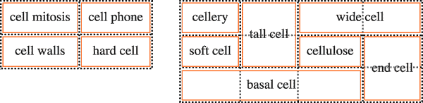

###### 图 13-1\. 网格单元格形成表格布局的基础

在一个简单的 2 × 2 表格中，例如图中左侧的表格，网格单元格对应于实际的表格单元格。在一个更复杂的表格中，例如图中右侧的表格，一些表格单元格将跨越多个网格单元格——但请注意，每个表格单元格的边缘都位于网格单元格的边缘上。

这些网格单元格在很大程度上是理论构造，无法进行样式化，甚至不能通过 DOM 访问。它们只是一种描述表格组装样式的方式。

## 表格布局规则

表格布局的六大规则如下：

+   每个*行框*包含一行网格单元格。表中的所有行框按照它们在源文档中出现的顺序从上到下填充表格（除了任何表头或表尾行框，它们分别出现在表格的开头和结尾）。因此，表包含与行元素（例如 `<tr>` 元素）数量相同的网格行。

+   *行组*的框包含与其包含的行框中相同的网格单元格。

+   *列框*包含一个或多个列的网格单元格。所有列框按照它们出现的顺序放置在一起。对于 LTR 语言，第一个列框位于左侧，对于 RTL 语言则位于右侧。

+   *列组*的框包含与其包含的列框中相同的网格单元格。

+   尽管单元格可以跨越多行或多列，但 CSS 并未定义这种跨越发生的方式。这完全取决于文档语言来定义跨越。每个跨越的单元格都是一个矩形框，宽度和高度可以是一个或多个网格单元格。这个跨越矩形的顶部行位于其父网格单元格所在的行中。单元格的矩形框必须尽可能地在 LTR 语言中向左边，但不得重叠任何其他单元格框。它还必须位于同一行中源文档中较早出现的所有单元格的右侧（在 LTR 语言中）。在 RTL 语言中，跨越的单元格必须尽可能地在*右侧*，而不重叠其他单元格，并且必须位于源文档中其后的所有同一行中的所有单元格的*左侧*。

+   单元格的框*不能*超出表格或行组的最后一个行框。如果表格结构会导致这种情况，则必须缩短单元格，直到它适合包含它的表格或行组内。

###### 注意

CSS 规范不鼓励，但也不禁止，定位表格单元格和其他内部表格元素。例如，对包含跨行单元格的行进行定位可能会通过将该行从表格中完全移除来显著改变表格的布局，从而在其他行的布局中排除跨越的单元格。尽管如此，目前的浏览器确实可以对表格元素应用定位。

根据定义，网格单元格是矩形的，但它们不必都是相同大小的。同一网格列中的所有网格单元格将具有相同的宽度，同一网格行中的所有网格单元格将具有相同的高度，但一个网格行的高度可能与另一个网格行的高度不同。类似地，网格列的宽度可以不同。

在掌握这些基本规则后，可能会有一个问题：到底如何确定哪些元素是单元格，哪些不是？

## 设置表格显示值

在 HTML 中，很容易知道哪些元素是表格的一部分，因为像`<tr>`和`<td>`这样的元素处理已经内置在浏览器中。另一方面，在 XML 中，没有办法从本质上知道哪些元素可能是表格的一部分。这就是`display`的整套值发挥作用的地方。

在本章中，我们将专注于与表格相关的值，其他值超出了表格的范围。与表格相关的值可以总结如下：

`table`

定义块级表格。因此，它定义了一个生成块框的矩形块。对应的 HTML 元素是`<table>`。

`inline-table`

定义内联级表格。这意味着元素定义了一个生成内联框的矩形块。最接近的非表格类比是值`inline-block`。最接近的 HTML 元素是`<table>`，尽管默认情况下 HTML 表格不是内联的。

`table-row`

指定元素是表格单元格行。对应的 HTML 元素是`<tr>`。

`table-row-group`

指定元素将一个或多个表格行分组。对应的 HTML 值是`<tbody>`。

`table-header-group`

与`table-row-group`非常相似，只是在视觉格式化上，页眉行组始终显示在所有其他行和行组之前，并在任何顶部标题之后显示。在打印时，如果表格需要多页打印，用户代理可能会在每页顶部重复显示页眉行（例如 Firefox 就是这样做的）。规范没有定义如果将`table-header-group`分配给多个元素会发生什么。页眉组可以包含多行。HTML 等效元素是`<thead>`。

`table-footer-group`

与`table-header-group`非常相似，只是页脚行组始终显示在所有其他行和行组之后，并且在任何底部标题之前显示。在打印时，如果表格需要多页打印，用户代理可能会在每页底部重复显示页脚行。规范没有定义如果将`table-footer-group`分配给多个元素会发生什么。这相当于 HTML 元素`<tfoot>`。

`table-column`

描述表格单元格的列。在 CSS 术语中，具有此`display`值的元素在视觉上不会被渲染，就像它们具有`none`值一样。它们的存在主要是为了帮助定义列内单元格的显示。HTML 等效元素是`<col>`。

`table-column-group`

分组一个或多个列。像`table-column`元素一样，`table-column-group`元素不会被渲染，但这个值对于定义列组内元素的显示方式非常有用。HTML 等效元素是`<colgroup>`。

`table-cell`

表示表格中的单元格。HTML 元素`<th>`和`<td>`都是`table-cell`元素的示例。

`table-caption`

定义表格的标题。CSS 没有定义多个元素具有 `caption` 值时应该发生什么，但明确警告，“作者不应将多个带有 `display: caption` 的元素放在表格或内联表元素内部。”

你可以通过摘录 CSS 2.1 规范附录 D 中提供的 HTML 4.0 样式表示例来快速总结这些值的一般效果：

```
table {display: table;}
tr {display: table-row;}
thead {display: table-header-group;}
tbody {display: table-row-group;}
tfoot {display: table-footer-group;}
col {display: table-column;}
colgroup {display: table-column-group;}
td, th {display: table-cell;}
caption {display: table-caption;}
```

在 XML 中，默认情况下元素没有显示语义，因此这些值变得非常有用。考虑以下标记：

```
<scores>
    <headers>
        <label>Team</label>
        <label>Score</label>
    </headers>
    <game sport="MLB" league="NL">
        <team>
            <name>Reds</name>
            <score>8</score>
        </team>
        <team>
            <name>Cubs</name>
            <score>5</score>
        </team>
    </game>
</scores>
```

可以通过以下样式以表格形式进行格式化：

```
scores {display: table;}
headers {display: table-header-group;}
game {display: table-row-group;}
team {display: table-row;}
label, name, score {display: table-cell;}
```

然后可以根据需要对各个单元格进行样式设置，例如将 `<label>` 元素设置为粗体并右对齐 `<score>`。

### 行优先

CSS 将其表格模型定义为*行优先*。该模型假设作者将使用显式声明行的标记语言。另一方面，列是从单元格行的布局派生出来的。因此，第一列由每行的第一个单元格组成；第二列由第二个单元格组成，依此类推。

在 HTML 中，行优先并不是一个主要问题，因为标记语言已经是面向行的。在 XML 中，行优先影响更大，因为它限制了作者可以定义表格标记的方式。由于 CSS 表格模型的行向性特性，基于列布局的标记语言实际上并不可行（假设意图是使用 CSS 来呈现这些文档）。

### 列

尽管 CSS 表格模型是面向行的，但列仍然在布局中发挥作用。一个单元格可以属于两个上下文（行和列），即使它是从文档源中的行元素派生而来。然而，在 CSS 中，列和列组只能接受四个非表属性：`border`、`background`、`width` 和 `visibility`。

此外，这四个属性中的每一个在列上下文中都有特殊规则：

`border`

只有当 `border-collapse` 属性值为 `collapse` 时，才能为列和列组设置边框。在这种情况下，列和列组边框参与折叠算法，该算法在每个单元格边缘设置边框样式。（见 “折叠单元格边框”。）

`background`

列或列组的背景只在单元格和其行具有透明背景的情况下可见。（见 “处理表格层”。）

`width`

`width` 属性定义了列或列组的*最小*宽度。列（或组）内的单元格内容可能会强制列变宽。

`visibility`

如果某一列或列组的`visibility`值为`collapse`，则不会渲染该列（或组）中的任何单元格。跨越折叠列到其他列的单元格会被剪切，以及跨越其他列到折叠列的单元格。此外，表格的总宽度将减少该列本应占用的宽度。对于列或列组的任何`visibility`值声明，除`collapse`外的值都会被忽略。

## 插入匿名表对象

标记语言可能不包含足够的元素来完全表示 CSS 中定义的表格，或者作者可能会忘记包含所有必要的元素。例如，请考虑以下 HTML：

```
<table>
    <td>Shirt size:</td>
    <td><select> … </select></td>
</table>
```

你可能会看一眼这个标记，认为它定义了一个单行的两个单元格表格，但在结构上，没有定义行的元素（因为缺少了`<tr>`）。

为了涵盖这些可能性，CSS 定义了一种机制，用于插入“缺失”的表组件作为匿名对象。以一个基本示例说明其工作原理，让我们重新看一下我们的缺失行 HTML 示例。从 CSS 角度来看，实际发生的是在`<table>`元素和其后代表格单元格之间插入了一个匿名 table-row 对象：

```
<table>
  <!--anonymous table-row object begins-->
    <td>Name:</td>
    <td><input type="text"></td>
  <!--anonymous table-row object ends-->
</table>
```

图 13-2 显示了这一过程的视觉表现。虚线代表插入的匿名表行。

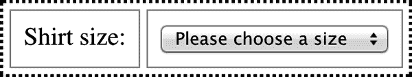

###### 图 13-2\. 表格格式中的匿名对象生成

CSS 表模型中可能会发生七种匿名对象插入。这七条规则，像继承和特异性一样，是试图在 CSS 行为方式上赋予直观意义的机制的一个例子。

规则如下：

1.  如果一个`table-cell`元素的父元素不是`table-row`元素，则在`table-cell`元素和其父元素之间插入一个匿名`table-row`对象。插入的对象将包括`table-cell`元素的所有连续兄弟元素。

    即使父元素是`table-row-group`，情况也是如此。例如，假设以下 CSS 应用于 XML 之后：

    ```
    system {display: table;}
    planet {display: table-row-group;}
    name, moons {display: table-cell;}
    ```

    ```
    <system>
        <planet>
            <name>Mercury</name>
            <moons>0</moons>
        </planet>
        <planet>
            <name>Venus</name>
            <moons>0</moons>
        </planet>
    </system>
    ```

    这两组单元格都将被封装在一个插入的匿名`table-row`对象中，该对象位于它们和`<planet>`元素之间。

1.  如果一个`table-row`元素的父元素不是`table`、`inline-table`或`table-row-group`元素，则在`table-row`元素和其父元素之间插入一个匿名`table`元素。插入的对象将包括`table-row`元素的所有连续兄弟元素。考虑以下样式和标记：

    ```
    docbody {display: block;}
    planet {display: table-row;}
    ```

    ```
    <docbody>
        <planet>
            <name>Mercury</name>
            <moons>0</moons>
        </planet>
        <planet>
            <name>Venus</name>
            <moons>0</moons>
        </planet>
    </docbody>
    ```

    因为`<planet>`元素的父元素的`display`值为`block`，所以在`<planet>`元素和`<docbody>`元素之间插入了一个匿名`table`对象。这个匿名`table`对象将包裹两个连续的`<planet>`元素。

1.  如果`table-column`元素的父元素不是`table`、`inline-table`或`table-column-group`元素，则在`table-column`元素和其父元素之间插入一个匿名的`table`元素。这与刚讨论的`table-row`规则类似，只是针对其列导向的特性。

1.  如果`table-row-group`、`table-header-group`、`table-footer-group`、`table-column-group`或`table-caption`元素的父元素不是`table`元素，则在元素和其父元素之间插入一个匿名的`table`对象。

1.  如果`table`或`inline-table`元素的子元素不是`table-row-group`、`table-header-group`、`table-footer-group`、`table-row`或`table-caption`元素，则在`table`元素和其子元素之间插入一个匿名的`table-row`对象。此匿名对象跨越子元素之后的所有连续兄弟元素，这些兄弟元素本身不是`table-row-group`、`table-header-group`、`table-footer-group`、`table-row`或`table-caption`元素。考虑以下标记和样式：

    ```
    system {display: table;}
    planet {display: table-row;}
    name, moons {display: table-cell;}
    ```

    ```
    <system>
        <planet>
            <name>Mercury</name>
            <moons>0</moons>
        </planet>
        <name>Venus</name>
        <moons>0</moons>
    </system>
    ```

    在这里，一个单独的匿名的`table-row`对象将被插入在`<system>`元素和第二组`<name>`和`<moons>`元素之间。`<planet>`元素不被匿名对象包围，因为其`display`为`table-row`。

1.  如果`table-row-group`、`table-header-group`或`table-footer-group`元素的子元素不是`table-row`元素，则在元素和其子元素之间插入一个匿名的`table-row`对象。此匿名对象跨越子元素之后的所有连续兄弟元素，这些兄弟元素本身不是`table-row`对象。考虑以下标记和样式：

    ```
    system {display: table;}
    planet {display: table-row-group;}
    name, moons {display: table-cell;}
    ```

    ```
    <system>
        <planet>
            <name>Mercury</name>
            <moons>0</moons>
        </planet>
        <name>Venus</name>
        <moons>0</moons>
    </system>
    ```

    在这种情况下，每组`<name>`和`<moons>`元素将被匿名的`table-row`元素包围。对于第二组，插入遵循规则 5。对于第一组，匿名对象插入在`<planet>`元素和其子元素之间，因为`<planet>`元素是一个`table-row-group`元素。

1.  如果`table-row`元素的子元素不是`table-cell`元素，则在元素和其子元素之间插入一个匿名的`table-cell`对象。此匿名对象包围子元素之后的所有连续兄弟元素，这些兄弟元素本身不是`table-cell`元素。考虑以下标记和样式：

    ```
    system {display: table;}
    planet {display: table-row;}
    name, moons {display: table-cell;}
    ```

    ```
    <system>
        <planet>
            <name>Mercury</name>
            <num>0</num>
        </planet>
    </system>
    ```

    因为元素`<num>`没有与表格相关的`display`值，所以在`<planet>`元素和`<num>`元素之间插入一个匿名的`table-cell`对象。

    此行为还适用于匿名内联框的封装。假设未包括`<num>`元素：

    ```
    <system>
        <planet>
            <name>Mercury</name>
            0
        </planet>
    </system>
    ```

    `0`仍将被匿名的`table-cell`对象包围。为了进一步说明这一点，这里有一个从 CSS 规范调整的示例：

    ```
    example {display: table-cell;}
    row {display: table-row;}
    hey {font-weight: 900;}
    ```

    ```
    <example>
        <row>This is the <hey>top</hey> row.</row>
        <row>This is the <hey>bottom</hey> row.</row>
    </example>
    ```

    在每个`<row>`元素内，文本片段和`hey`元素都被匿名的`table-cell`对象包围。

## 处理表格层次

对于表格呈现的组装，CSS 定义了六个单独的*层*，用于放置表格各个方面的内容。图 13-3 展示了这些层。

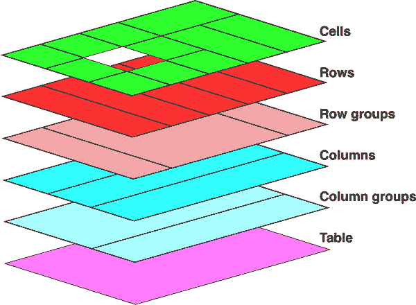

###### 图 13-3\. 表格呈现中使用的格式化层

基本上，表格的每个方面的样式都在它们各自的层上绘制。因此，如果 `<table>` 元素具有绿色背景和 1 像素黑色边框，这些样式将绘制在最低层上。列组的任何样式将绘制在其上一层，列本身在再上一层，依此类推。对应表格单元格的顶层最后绘制。

大多数情况下，这是一个逻辑过程；毕竟，如果为表格单元格声明背景颜色，则希望它覆盖表格元素的背景。图 13-3 揭示的最重要的一点是列样式位于行样式之下，因此行的背景将覆盖列的背景。

需要记住，默认情况下，所有元素都具有透明背景。因此，在以下标记中，表格元素的背景将“透过”没有自己背景的单元格、行、列等可见，正如图 13-4 中所示。

```
<table style="background: #B84;">
    <tr>
        <td>hey</td>
        <td style="background: #ABC;">there</td>
    </tr>
    <tr>
        <td>what’s</td>
        <td>up?</td>
    </tr>
    <tr style="background: #CBA;">
        <td>not</td>
        <td style="background: #ECC;">much</td>
    </tr>
</table>
```

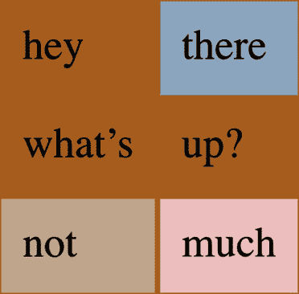

###### 图 13-4\. 透过其他层看表格格式化层的背景

## 使用标题

*表格标题*通常是描述表格内容性质的简短文本。例如，2026 年第四季度股票行情表可能有一个标题元素，内容为“2026 年 Q4 股票表现”。通过 `caption-side` 属性，您可以将此元素放置在表格上方或下方，无论标题在表格结构中的位置如何。（在 HTML5 中，`<caption>` 元素只能作为 `<table>` 元素的第一个子元素出现，但其他语言可能有不同的规则。）

在视觉上，标题有点奇怪。CSS 规范规定，标题的格式化方式就像是一个块级框，放置在表格框的前（或后），但有一个例外：标题仍然可以从表格中继承值。

一个简单的例子足以说明标题展示的大部分重要方面。考虑以下示例，如图 13-5 所示：

```
table {color: white; background: #840; margin: 0.5em 0;}
caption {background: #B84; margin: 1em 0;}
table.one caption {caption-side: top;}
table.two caption {caption-side: bottom;}
td {padding: 0.5em;}
```

每个 `<caption>` 元素中的文本从表格中继承了 `color` 值 `white`，而标题则有自己的背景。每个表格的外边框与标题的外边距之间的分隔距离为 1 em，因为表格和标题的边距已经合并。最后，标题的宽度基于 `<table>` 元素的内容宽度，该元素被视为标题的包含块。

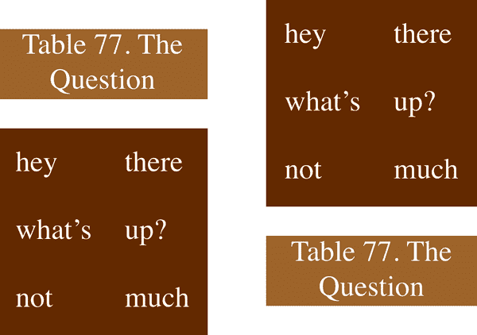

###### 图 13-5. 样式化标题和表格

大部分情况下，标题的样式与任何块级元素一样：它们可以有内边距、边框、背景等等。例如，如果我们需要改变标题内文本的水平对齐方式，我们使用属性 `text-align`。因此，要右对齐前面示例中的标题，我们会这样写：

```
caption {background: gray; margin: 1em 0;
    caption-side: top; text-align: right;}
```

# 表格单元格边框

CSS 有两种截然不同的表格边框模型。*分离边框模型* 在单元格在布局上相互分隔时生效。*合并边框模型* 单元格之间没有视觉上的分隔，单元格边框相互合并或合并为一个。前者是默认模型，但你可以使用属性 `border-collapse` 在这两种模型之间进行选择。

此属性的全部意义在于提供一种确定用户代理将采用哪种边框模型的方法。如果值为 `collapse`，则使用合并边框模型。如果值为 `separate`，则使用分离边框模型。我们首先查看后者，因为它更容易描述，也是默认的。

## 分离单元格边框

在分离边框模型中，表格中的每个单元格都与其他单元格相隔一定距离，单元格的边框不会合并在一起。因此，给定以下样式和标记，你应该得到图 13-6 中显示的结果。

```
td {border: 3px double black; padding: 3px;}
tr:nth-child(2) td:nth-child(2) {border-color: gray;}
```

```
<table cellspacing="0">
    <tr>
        <td>cell one</td>
        <td>cell two</td>
    </tr>
    <tr>
        <td>cell three</td>
        <td>cell four</td>
    </tr>
</table>
```

注意，单元格边框接触但保持各自独立。单元格之间的三条线实际上是两个并排的双边框；第四个单元格周围的灰色边框有助于更清楚地显示这一点。

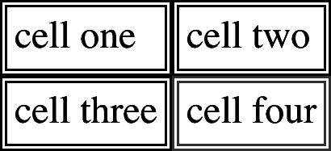

###### 图 13-6. 分离（因此是分开的）单元格边框

在前面的示例中包含 HTML 属性 `cellspacing`，是为了确保单元格之间没有间隔，但它的存在可能会有些令人困扰。毕竟，如果你可以将边框定义为分开，应该有办法使用 CSS 来改变单元格之间的间距。幸运的是，有办法实现。

### 应用边框间距

一旦你将表格单元格的边框分开，你可能希望这些边框之间相隔一定的距离。这可以通过属性 `border-spacing` 来轻松实现，它为 HTML 属性 `cellspacing` 提供了更强大的替代方案。

此属性的值可以给出一个或两个长度。如果你希望所有单元格之间相隔一个像素，`border-spacing: 1px;` 就足够了。另一方面，如果你希望单元格之间的水平间距为 1 像素，垂直间距为 5 像素，写为 `border-spacing: 1px 5px;`。如果给出两个长度，第一个始终是水平间距，第二个始终是垂直间距。

这些间距值也适用于表格外部的单元格边框与 `table` 元素本身的填充之间。根据以下样式，您将获得类似于 图 13-7 所示的结果：

```
table {border-collapse: separate; border-spacing: 5px 8px;
padding: 12px; border: 2px solid black;}
td { border: 1px solid gray;}
td#squeeze {border-width: 5px;}
```

图 13-7 显示了任意两个水平相邻单元格边框之间的 5 像素空间，以及最右和最左单元格与 `<table>` 元素的右边和左边边框之间的 17 像素空间。同样，垂直相邻单元格的边框相距 8 像素，顶部和底部行的单元格边框分别距离表格的顶部和底部边框 20 像素。无论单元格本身的边框宽度如何，表格内部单元格边框的分隔都是恒定的。

还要注意，`border-spacing` 的声明是在表格本身上进行的，而不是在单个单元格上。如果在前面的示例中为 `<td>` 元素声明了 `border-spacing`，则会被忽略。

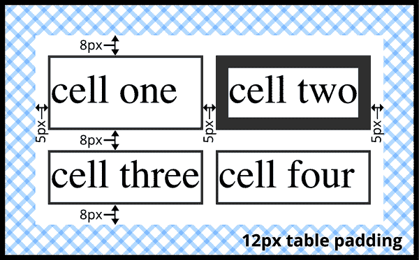

###### 图 13-7. 单元格和其封闭表格之间的边框间距效果

在分隔边框模型中，无法为行、行组、列和列组设置边框。对于这些元素声明的任何边框属性，必须被 CSS 兼容的用户代理忽略。

### 处理空单元格

从视觉上讲，每个单元格在表格中都是独立的，那么对于空单元格（即没有内容的单元格）怎么处理？您有两种选择，这两种选择反映在 `empty-cells` 属性的值中。

如果 `empty-cells` 设置为 `show`，则空单元格的边框和背景将被绘制，就像具有内容的表格单元格一样。如果值为 `hide`，则不会绘制单元格的任何部分，就像单元格设置为 `visibility: hidden` 一样。

如果单元格包含任何内容，则不能视为空单元格。在这种情况下，“内容”不仅包括文本、图像、表单元素等，还包括非断行空格实体 (`&nbsp;`) 和除回车 (CR)、换行 (LF)、制表符和空格字符之外的任何空白字符。如果一行中的所有单元格都为空，并且所有单元格的 `empty-cells` 值为 `hide`，则整行将被视为行元素设置为 `display: none`。

## 折叠单元格边框

当折叠边框模型大部分描述 HTML 表格没有任何单元格间距时，它比分隔边框模型要复杂得多。以下规则将折叠单元格边框与分隔边框模型区分开来：

+   元素的 `display` 属性为 `table` 或 `inline-table` 时，在 `border-collapse` 为 `collapse` 时不能有任何填充，尽管可以有边距。因此，在折叠边框模型中，表格外边框和其最外层单元格的边缘之间永远不会发生分隔。

+   边框可以应用于单元格、行、行组、列和列组。表格本身像往常一样可以有一个边框。

+   在折叠边框模型中，单元格边框之间从不存在分隔。事实上，边框会在相接处合并，只有一个折叠的边框实际上被绘制出来。这有点类似于边距合并，最大的边距会胜出。当单元格边框折叠时，“最有趣”的边框会胜出。

+   一旦它们被折叠，单元格之间的边框会居中于假设的单元格之间的网格线上。

我们将在接下来的两节中更详细地探讨最后两点。

### 折叠边框布局

为了更好地理解折叠边框模型的工作原理，让我们看一下单个表行的布局，如 图 13-8 所示。

每个单元格的填充和内容宽度都在边框内部，如预期那样。对于单元格之间的边框，边框的一半位于两个单元格网格线的一侧，另一半位于另一侧。在每种情况下，每个单元格边缘只绘制一个边框。您可能会认为每个单元格的边框的一半会绘制在网格线的两侧，但事实并非如此。

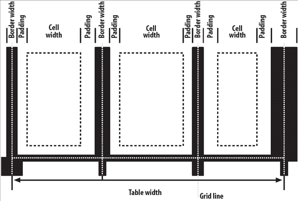

###### 图 13-8\. 使用折叠边框模型布局的表行的布局

例如，假设中间单元格上的实线边框是绿色的，外部两个单元格上的实线边框是红色的。中间单元格的右侧和左侧边框（与相邻单元格的边框合并）将全部是绿色的或全部是红色的，具体取决于哪个边框占优势。我们将在下一节讨论如何判断哪个边框占优势。

您可能已经注意到外部边框超出了表格的宽度。这是因为在这种模型中，表格边框的一半包括在宽度内，另一半突出超出该距离，位于边距本身。这可能看起来有点奇怪，但这就是模型定义的工作方式。

规范中包含了一个布局公式，这里再次重现，以供喜欢这些内容的人参考：

行宽度 = (0.5 × border-width-0) + padding-left-1 + width-1 + padding-right-1 + border-width-1 + padding-left-2 +...+ padding-right-*n* + (0.5 × border-width-*n*)

每个 `border-width`-*`n`* 是指第 *n* 个单元格和下一个单元格之间的边框；因此，`border-width-3` 是指第三个和第四个单元格之间的边框。值 *`n`* 表示行中的总单元格数。

这种机制有一个小小的例外。在开始合并边框表的布局时，用户代理计算表本身的初始左右边框。它通过检查表的第一行第一个单元格的左边框，并将该边框宽度的一半作为表的初始左边框宽度来完成这一点。然后，用户代理检查表的第一行最后一个单元格的右边框，并使用该宽度的一半来设置表的初始右边框宽度。对于第一行之后的任何行，如果左边框或右边框比初始边框宽度更宽，则会突出到表的边距区域。

如果边框是奇数显示元素（像素、打印点等）宽度，则用户代理会决定如何在网格线上居中边框。用户代理可以将边框稍微偏离中心，四舍五入到偶数显示元素，使用反锯齿，或者调整任何其他合理的方法。

### 边框合并

当两个或更多边框相邻时，它们会合并在一起。事实上，它们并不是真正合并，而是争夺谁将在其他边框上占主导地位。严格的规则决定了哪些边框将胜出，哪些不会：

+   如果合并的边框中有一个`border-style`为`hidden`，则它优先于所有其他合并的边框。在此位置的所有边框都将隐藏。

+   如果所有边框都是可见的，则更宽的边框优先于较窄的边框。因此，如果一个 2 像素的点状边框和一个 5 像素的双重边框合并，则该位置的边框将是一个 5 像素的双重边框。

+   如果所有合并的边框具有相同的宽度但不同的边框样式，则按照以下顺序，从最优到最不优先：`double`，`solid`，`dashed`，`dotted`，`ridge`，`outset`，`groove`，`inset`，`none`。因此，如果两个具有相同宽度的边框合并，一个是`dashed`，另一个是`outset`，则该位置的边框将为`dashed`。

+   如果合并的边框具有相同的样式和宽度，但颜色不同，则所使用的颜色按照以下列表中元素的优先级，从最优到最不优：单元格，行，行组，列，列组，表。因此，如果单元格和列的边框（在除颜色之外完全相同的情况下）合并，则使用单元格的边框颜色（以及样式和宽度）。如果合并的边框来自于同一类型的元素，例如两个具有相同样式和宽度但颜色不同的行边框，则颜色来自于更接近元素块起始和行内起始边缘的边框。

下面的样式和标记，在图 13-9 中呈现，帮助说明四条规则：

```
table {border-collapse: collapse;
border: 3px outset gray;}
td {border: 1px solid gray; padding: 0.5em;}
#r2c1, #r2c2 {border-style: hidden;}
#r1c1, #r1c4 {border-width: 5px;}
#r2c4 {border-style: double; border-width: 3px;}
#r3c4 {border-style: dotted; border-width: 2px;}
#r4c1 {border-bottom-style: hidden;}
#r4c3 {border-top: 13px solid silver;}
```

```
<table>
    <tr>
        <td id="r1c1">1-1</td>
        <td id="r1c2">1-2</td>
        <td id="r1c3">1-3</td>
        <td id="r1c4">1-4</td>
    </tr>
    <tr>
        <td id="r2c1">2-1</td>
        <td id="r2c2">2-2</td>
        <td id="r2c3">2-3</td>
        <td id="r2c4">2-4</td>
    </tr>
    <tr>
        <td id="r3c1">3-1</td>
        <td id="r3c2">3-2</td>
        <td id="r3c3">3-3</td>
        <td id="r3c4">3-4</td>
    </tr>
    <tr>
        <td id="r4c1">4-1</td>
        <td id="r4c2">4-2</td>
        <td id="r4c3">4-3</td>
        <td id="r4c4">4-4</td>
    </tr>
</table>
```

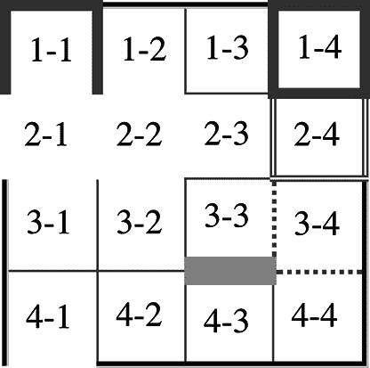

###### 图 13-9\. 操纵边框宽度、样式和颜色会导致一些不寻常的结果

让我们逐个考虑每个单元格发生的情况：

+   对于单元格 1-1 和 1-4，它们的 5 像素边框比其相邻边框更宽，因此它们不仅胜过相邻单元格的边框，还胜过表格本身的边框。唯一的例外是单元格 1-1 的底部，它被抑制了。

+   单元格 1-1 的底部边框被抑制，因为单元格 2-1 和 2-2 明确隐藏了它们的边框，完全删除了单元格边缘的任何边框。同样，表格的边框（在单元格 2-1 的左边缘）输给了单元格的边框。单元格 4-1 的底部边框也被隐藏了，因此阻止了任何边框出现在单元格下方。

+   单元格 2-4 的 3 像素双边框被单元格 1-4 的 5 像素实线边框覆盖。单元格 2-4 的边框又覆盖了它与单元格 2-3 之间的边框，因为它既更宽又更“有趣”。单元格 2-4 还覆盖了它与单元格 3-4 之间的边框，即使它们的宽度相同，因为 2-4 的双线样式被定义为比 3-4 的点线边框“更有趣”。

+   单元格 3-3 的 13 像素底部银色边框不仅覆盖了单元格 4-3 的顶部边框，而且还影响了包含这两个单元格及其行内内容的布局。*和*表。

+   对于沿表格外边缘的未特别样式化的单元格，它们的 1 像素实线边框被表格元素本身的 3 像素凸出边框所覆盖。

事实上，这确实和听起来的一样复杂，尽管行为大部分是直观的，并且随着实践会显得更加合理。值得注意的是，基本的 Netscape 1.1 时代的表格呈现可以通过一组相当简单的规则来捕捉：

```
table {border-collapse: collapse; border: 2px outset gray;}
td {border: 1px inset gray;}
```

是的，当表格首次推出时，默认情况下确实使其看起来有 3D 效果。那时候是一个不同的时代。

# 表格尺寸调整

现在我们深入了解表格格式和单元格边框外观的内部构造，你已经掌握了理解表格及其内部元素尺寸的基本要素。在确定表格宽度时，CSS 有两种方法：*固定宽度布局* 和 *自动宽度布局* 。表格高度会根据需要自动计算，无论使用何种宽度算法。

## 宽度

由于有两种方法可以确定表格的宽度，因此对于给定的表格可以声明使用哪种方法。您可以使用属性`table-layout`来选择两种表格宽度计算方法之间的区别。

尽管两种模型在布置给定表格时可能会有不同的结果，但两者之间根本的区别在于速度。采用固定宽度表格布局，用户代理可以比自动宽度模型更快速地计算表格的布局。

### 固定布局

固定布局模型之所以如此快速的主要原因在于，其布局并不完全依赖于表格单元格的内容。相反，它由表格的宽度值、其列元素以及该表格内第一行的单元格驱动。

固定布局模型按以下步骤工作：

+   任何具有除`auto`以外的值的`width`属性的列元素都会设置该整列的宽度。

    +   如果列具有`auto`宽度，但表格的第一行单元格在该列内具有除`auto`以外的`width`，则单元格设置该整列的宽度。如果单元格跨多列，则宽度在列之间分配。

    +   仍然自动调整大小的任何列将被调整为宽度尽可能相等。

在这一点上，表格的宽度被设置为表格的`width`值或列宽度之和中较大的值。如果表格的宽度比其列宽度大，差值将被除以列数，然后将结果添加到每一列。

这种方法很快，因为所有列宽度都是由表格的第一行定义的。在第一行之后的任何行中，根据第一行定义的列宽度来调整列的大小。在这些后续行中的单元格不会——实际上也不能——更改列宽度，这意味着对这些单元格分配的任何`width`值都将被忽略。如果单元格的内容不适合其单元格，那么单元格内容是否被裁剪、可见或生成滚动条由单元格的`overflow`值决定。

让我们考虑以下样式和标记，这些在图 13-10 中有所说明：

```
table {table-layout: fixed; width: 400px;
    border-collapse: collapse;}
td {border: 1px solid;}
col#c1 {width: 200px;}
#r1c2 {width: 75px;}
#r2c3 {width: 500px;}
```

```
<table>
    <colgroup> <col id="c1"><col id="c2"><col id="c3"><col id="c4"> </colgroup>
    <tr>
        <td id="r1c1">1-1</td>
        <td id="r1c2">1-2</td>
        <td id="r1c3">1-3</td>
        <td id="r1c4">1-4</td>
    </tr>
    <tr>
	   <td id="r2c1">2-1</td>
	   <td id="r2c2">2-2</td>
	   <td id="r2c3">2-3</td>
	   <td id="r2c4">2-4</td>
    </tr>
	(…more rows here…)
</table>
```

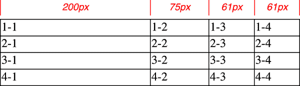

###### 图 13-10\. 固定宽度表格布局

第一列宽度为 200 像素，恰好是表格宽度 400 像素的一半。第二列宽度为 75 像素，因为该列内第一行的单元格已被分配了显式宽度。第三和第四列各 61 像素宽。为什么？因为第一和第二列的列宽之和（275 像素），加上列之间的各种边框（3 像素），等于 278 像素。然后，400 减去 278 等于 122，将其一分为二得到 61，这就是第三和第四列的宽度。`#r2c3`的 500 像素宽度怎么办？因为该单元格不在表格的第一行，所以被忽略。

注意，表格不需要具有显式的`width`值才能使用固定宽度布局模型，尽管这确实有所帮助。例如，给定以下情况，用户代理可以计算表格的宽度，比父元素的宽度窄 50 像素。然后它会在固定布局算法中使用这个计算出的宽度：

```
table {table-layout: fixed; margin: 0 25px; width: auto;}
```

这并非必须。用户代理还可以使用`auto`值的`width`来布置任何表格，通过自动宽度布局模型。

### 自动布局

自动宽度布局模型虽然不如固定布局快，但可能更为熟悉，因为这基本上是自 HTML 表格诞生以来就采用的模型。在大多数现代浏览器中，只要表格具有`width`为`auto`，无论`table-layout`的值如何，都会触发使用该模型，尽管这并不是一定的。

自动布局较慢的原因在于，表格必须等到用户代理程序查看了表格中的所有内容后才能布局。用户代理必须以考虑每个单元格的内容和样式的方式布局整个表格。通常，这需要用户代理进行一些计算，然后再次回到表格执行第二轮计算（如果不止一轮）。

因为与 HTML 表格类似，表格的布局依赖于所有单元格中的内容，所以必须完全检查内容。如果最后一行中的一个 400 像素宽的图像放在一个单元格中，那么该内容将迫使该列中所有上方的单元格（即同一列中的单元格）至少有 400 像素宽。因此，必须计算每个单元格的宽度，并进行调整（可能触发另一轮内容宽度计算）之后，才能布局表格。

模型的详细信息可以用以下步骤表示：

1.  对于列中的每个单元格，计算最小和最大单元格宽度。

    1.  确定显示内容所需的最小宽度。在确定这种最小内容宽度时，内容可以流动到任意数量的行，但不得突出单元格框。如果单元格具有大于最小可能宽度的`width`值，则最小单元格宽度设为`width`的值。如果单元格的`width`值为`auto`，则最小单元格宽度设为最小内容宽度。

    1.  对于最大宽度，确定显示内容所需的宽度，除了由显式换行（例如`<br>`元素）强制的换行外，不应有任何其他换行。该值即为最大单元格宽度。

1.  对于每一列，计算最小和最大列宽度。

    1.  列的最小宽度由列中的单元格的最大最小宽度确定。如果列已经被给定一个明确的`width`值，且该值大于列内任何最小单元格宽度，则最小列宽度设为`width`的值。

    1.  对于最大宽度，取列中单元格的最大最大宽度。如果列已经给定一个明确的`width`值，且该值大于列内任何最大单元格宽度，则最大列宽度设为`width`的值。这两种行为重新创建了强制将任何列扩展为其最宽单元格的传统 HTML 表格行为。

1.  如果一个单元格跨越多列，那么最小列宽度的总和必须等于跨列单元格的最小宽度。同样地，最大列宽度的总和必须等于跨列单元格的最大宽度。用户代理应当将列宽度的任何变化均匀分配到跨度的各列中。

此外，用户代理必须考虑到，当列的宽度设定为百分比值时，这个百分比是相对于表格的宽度来计算的——即使用户代理此时还不知道表格的实际宽度！它必须暂存这个百分比值，并在算法的下一部分中使用它。

在此时，用户代理已经计算出每列的宽度范围。有了这些信息，它接下来可以真正地计算表格的宽度。具体过程如下：

1.  如果表格的计算宽度不是`auto`，则将计算表格宽度与所有列宽度的总和以及任何边框和单元格间距进行比较。（百分比宽度的列可能在此时计算。）两者中较大的值将成为表格的最终宽度。如果表格的计算宽度*大于*列宽度、边框和单元格间距的总和，则差值将被除以列数，结果将添加到每一列中。

1.  如果表格的计算宽度是`auto`，则表格的最终宽度由列宽度、边框和单元格间距的总和决定。这意味着表格的宽度将仅适合显示其内容，就像传统的 HTML 表格一样。任何百分比宽度的列将使用该百分比作为约束条件——但用户代理不必满足这一约束。

只有完成了最后一步，用户代理才能实际布局表格。

下面的样式和标记，如图 13-11 所示，有助于说明这一过程的工作原理：

```
table {table-layout: auto; width: auto;
    border-collapse: collapse;}
td {border: 1px solid; padding: 0;}
col#c3 {width: 25%;}
#r1c2 {width: 40%;}
#r2c2 {width: 50px;}
#r2c3 {width: 35px;}
#r4c1 {width: 100px;}
#r4c4 {width: 1px;}
```

```
<table>
    <colgroup> <col id="c1"><col id="c2"><col id="c3"><col id="c4"> </colgroup>
    <tr>
        <td id="r1c1">1-1</td>
        <td id="r1c2">1-2</td>
        <td id="r1c3">1-3</td>
        <td id="r1c4">1-4</td>
    </tr>
    <tr>
        <td id="r2c1">2-1</td>
        <td id="r2c2">2-2</td>
        <td id="r2c3">2-3</td>
        <td id="r2c4">2-4</td>
    </tr>
    <tr>
        <td id="r3c1">3-1</td>
        <td id="r3c2">3-2</td>
        <td id="r3c3">3-3</td>
        <td id="r3c4">3-4</td>
    </tr>
    <tr>
        <td id="r4c1">4-1</td>
        <td id="r4c2">4-2</td>
        <td id="r4c3">4-3</td>
        <td id="r4c4">4-4</td>
    </tr>
</table>
```

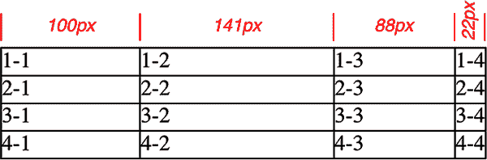

###### 图 13-11\. 自动表格布局

让我们依次考虑每一列发生的情况：

+   对于第一列，唯一显式设置的单元格或列宽度是 4-1 单元格，宽度为`100px`。由于内容较短，最小和最大列宽度均设置为`100px`。（如果列中的单元格包含多个句子的文本，则最大列宽度将增加到足以显示所有文本而不换行的宽度。）

+   对于第二列，声明了两个`width`：单元格 1-2 的宽度为`40%`，而单元格 2-2 的宽度为`50px`。这一列的最小宽度为`50px`，最大宽度为最终表格宽度的`40%`。

+   对于第三列，只有第 3-3 单元格有明确的宽度（`35px`），但是列本身被赋予了`width`为`25%`。因此，最小列宽度为 35 像素，最大宽度为最终表格宽度的 25%。

+   对于第四列，只有单元格 4-4 给定了显式宽度（`1px`）。这小于最小内容宽度，因此最小和最大列宽度均等于单元格的最小内容宽度。这结果为计算的 22 像素，因此最小和最大宽度都是 22 像素。

现在用户代理知道四列的最小和最大宽度如下：

1.  最小值为 100 像素，最大值为 100 像素。

1.  最小值为 50 像素，最大值为 40%。

1.  最小值为 35 像素，最大值为 25%。

1.  最小值为 22 像素，最大值为 22 像素。

表格的最小宽度是所有列最小宽度的总和，加上列之间折叠的边框，总共为 215 像素。表格的最大宽度是`123px + 65%`，其中`123px`来自第一列和最后一列及其折叠边框的份额。这个最大值计算结果为 351.42857142857143 像素（给定`123px`代表总表格宽度的 35%）。有了这个数值，第二列将宽度为 140.5 像素，第三列将宽度为 87.8 像素。这些可能会被用户代理四舍五入为整数，如`141px`和`88px`，也可能根据精确的渲染方法而定（这些是 Figure 13-11 中使用的数字）。

用户代理不需要实际使用最大值；它们可以选择其他操作。

这（尽管可能不像是）是一个相对简单和直接的例子：所有内容基本上是相同宽度，大部分声明的宽度都是像素长度。如果表格包含图像、文字段落、表单元素等内容，那么确定表格布局的过程可能会复杂得多。

## 高度

在计算表格宽度的所有努力之后，你可能会想知道高度计算会更加复杂。在 CSS 方面，实际上很简单，尽管浏览器开发者可能不这么认为。

最容易描述的情况是通过`height`属性明确设置表格高度。在这种情况下，表格的高度由`height`的值定义。这意味着表格的高度可能比其行高的总和要高或者低。请注意，对于表格，`height`更像是`min-height`，因此如果定义的`height`值小于行高的总和，它可能被忽略。

相比之下，如果表格的`height`值大于其行高的总和，则规范明确拒绝定义应发生的情况，而是指出此问题可能会在 CSS 的未来版本中解决。用户代理可以展开表格的行以填充其高度，或在表格框中留白，或完全不同的其他操作。这取决于每个用户代理的决定。

###### 注意

截至 2022 年中，用户代理的最常见行为是增加表格行的高度，以填充其整体高度。这是通过取表格高度与行高总和的差异，除以行数，并将结果应用到每一行来实现的。

如果表格的`height`为`auto`，其高度是表格内所有行的高度总和，加上任何边框和单元格间距。为了确定每行的高度，用户代理通过类似于确定列宽度的过程进行：它计算每个单元格内容的最小和最大高度，然后用这些值来推导出每行的最小和最大高度。在为所有行完成这一过程后，用户代理确定每行的高度，将它们依次堆叠，并使用总和来确定表格的高度。

除了如何处理具有显式高度的表格及其内部的行高之外，您还可以将以下内容添加到 CSS 未定义的事物列表中：

+   百分比高度对表格单元格的影响

+   百分比高度对表格行和行组的影响

+   跨行单元格如何影响跨越的行的高度，除非行必须包含跨越的单元格

如您所见，在表格中的高度计算很大程度上取决于用户代理的处理方式。历史证据表明，这将导致每个用户代理采取不同的方法，因此您应尽可能避免设置表格高度。

## 对齐

有趣的是，与单元格和行高相比，单元格内内容的对齐更加明确定义。即使对于垂直对齐，这也很容易影响行的高度。

水平对齐是最简单的。要在单元格中对齐内容，您可以使用`text-align`属性。实际上，该单元格被视为块级框，并且其中的所有内容都根据`text-align`值对齐。

要在表格单元格中垂直对齐内容，`vertical-align`是相关属性。它使用许多用于垂直对齐内联内容的相同值，但是当应用于表格单元格时，这些值的含义会发生变化。简要总结三种最简单的情况：

`top`

单元格内容的顶部与其行的顶部对齐；在跨行单元格的情况下，单元格内容的顶部与其跨越的第一行的顶部对齐。

`bottom`

单元格内容的底部与其行的底部对齐；在跨行单元格的情况下，单元格内容的底部与其跨越的最后一行的底部对齐。

`middle`

单元格内容的中部与其行的中部对齐；在跨行单元格的情况下，单元格内容的中部与其跨越的所有行的中部对齐。

这些都在图 13-12 中进行了说明，该图使用以下样式和标记：

```
table {table-layout: auto; width: 20em;
border-collapse: separate; border-spacing: 3px;}
td {border: 1px solid; background: silver;
    padding: 0;}
div {border: 1px dashed gray; background: white;}
#r1c1 {vertical-align: top; height: 10em;}
#r1c2 {vertical-align: middle;}
#r1c3 {vertical-align: bottom;}
```

```
<table>
  <tr>
    <td id="r1c1">
      <div>The contents of this cell are top-aligned.</div>
    </td>
    <td id="r1c2">
      <div>The contents of this cell are middle-aligned.</div>
    </td>
    <td id="r1c3">
      <div>The contents of this cell are bottom-aligned.</div>
    </td>
  </tr>
</table>
```

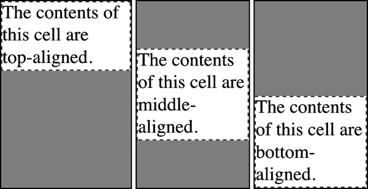

###### 图 13-12\. 单元格内容的垂直对齐

在每种情况下，通过自动增加单元格本身的填充来实现所需的对齐效果。在图 13-12 的第一个单元格中，单元格的底部填充已经更改为等于单元格框的高度与单元格内内容高度之间的差异。对于第二个单元格，单元格的顶部和底部填充已被重置为相等，从而垂直居中单元格内容。在最后一个单元格中，单元格的顶部填充已被修改。

第四种可能的对齐值是 `baseline`，比前三种稍微复杂一些：

`baseline`

单元格的基线与其行的基线对齐；对于跨行的单元格，单元格的基线与其跨越的第一行的基线对齐。

最好提供一个插图(图 13-13)，然后讨论发生的情况。

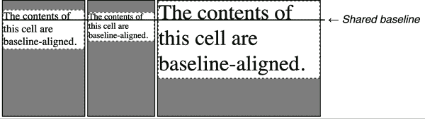

###### 图 13-13\. 单元格内容的基线对齐

行的基线由其所有单元格中初始单元格基线（即第一行文本的基线）中最低的定义。因此，在图 13-13 中，行的基线由第三个单元格定义，该单元格具有最低的初始基线。然后，前两个单元格的第一行文本的基线与行的基线对齐。

与顶部、中部和底部对齐一样，基线对齐单元格内容的放置是通过修改单元格的顶部和底部填充来完成的。如果一行中没有任何单元格是基线对齐的，则该行甚至没有基线 —— 它实际上不需要基线。

在行内对齐单元格内容的详细过程如下：

+   如果任何单元格是基线对齐的，则确定行的基线并放置基线对齐的单元格的内容。

    +   任何顶部对齐的单元格都会放置其内容。现在，行有一个临时高度，由已经放置其内容的单元格中底部最低的单元格定义。

    +   如果有任何剩余的中部或底部对齐的单元格，并且内容高度高于临时行高度，则行的高度将增加以包含其中最高的单元格之一。

    +   所有剩余的单元格都放置其内容。在任何内容短于行高度的单元格中，将增加单元格的填充以匹配行的高度。

`vertical-align` 值 `sub`、`super`、`text-top` 和 `text-bottom` 在应用于表单元格时应被忽略。相反，它们似乎被视为 `baseline` 或可能是 `top`。

# 摘要

即使你对表格布局非常熟悉，可能已经从多年的表格和空格设计中积累了经验，但事实证明，驱动这种布局的机制相当复杂。感谢 HTML 表格构建的遗产，CSS 表格模型以行为中心，但幸运的是，它确实支持列和有限的列样式。由于新的能力可以影响单元格对齐和表格宽度，现在你有更多的工具来以令人愉悦的方式呈现表格。

将表格相关的显示值应用于任意元素的能力，打开了通过使用 HTML 元素如`<div>`和`<section>`或使用允许您使用任何元素描述表格组件的 XML 语言来创建类似表格的布局的大门。
