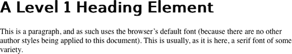
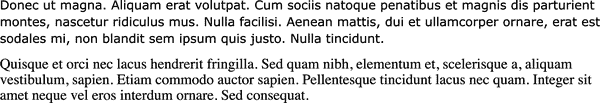

# 第十四章：字体

CSS1 规范中的“字体属性”部分，编写于 1996 年，以这句话开头：“设置字体属性将是样式表的最常见用途之一。” 尽管从 CSS 的最初开始就意识到字体的重要性，但直到大约 2009 年，这种能力才真正开始被广泛和一致地支持。随着可变字体的引入，网络上的排版已成为一种艺术形式。虽然您可以在设计中包含任何您有合法权限分发的字体，但您必须注意如何使用它们。

记住这一点并不意味着对字体有绝对控制权。如果您正在使用的字体无法下载，或者是用户浏览器不理解的文件格式，文本将（最终）显示为备用字体。这是件好事，因为这意味着用户仍然能够获取您的内容。

尽管字体对设计至关重要，但请始终记住，您不能依赖特定字体的存在。如果字体加载速度慢，浏览器通常会延迟文本呈现。虽然这可以防止用户阅读时重新绘制文本，但在页面上没有文本是不好的。

您的字体选择也可能被用户偏好或旨在增强阅读体验的浏览器扩展所覆盖。一个例子是浏览器扩展 OpenDyslexic，它“使用 OpenDyslexic 字体覆盖网页上的所有字体，并格式化页面以更容易阅读”。总体而言，始终设计时假定您的字体可能会延迟甚至完全失败。

# 字体族

我们所说的“字体”通常由许多变体组成，用于描述粗体文本、斜体文本、粗斜体文本等。例如，您可能熟悉（或至少听说过）Times 字体。Times 实际上是许多变体的组合，包括 TimesRegular、TimesBold、TimesItalic、TimesBoldItalic 等。Times 的每个变体都是一个实际的 *字体面*，而我们通常所认为的 Times 则是所有这些变体面的组合。换句话说，像 Times 这样的系统标准字体实际上是一个 *字体族*，而不仅仅是单个字体，尽管大多数人认为字体是单一实体。

对于这种字体族，每种宽度、重量和样式组合（即每种字体面）都需要单独的文件，这意味着对于完整的字体，您可能需要多达 20 个单独的文件。另一方面，*可变字体* 能够在单个文件中存储多个变体，例如常规、粗体、斜体和粗斜体。可变字体文件通常比单个字体面文件稍大一些（也许只有几千字节），但比普通字体所需的多个文件要小，并且只需要一个 HTTP 请求。

为了涵盖所有情况，CSS 定义了五个通用字体族：

*衬线字体*

衬线字体是比例的，并且有衬线。 如果字体中的所有字符具有不同的宽度，则称为*比例*字体。 例如，小写字母*i*和小写字母*m*占据不同的水平空间，因为它们具有不同的宽度。（例如，本书的段落字体是比例字体。） *衬线*是每个字符内部笔画末端的装饰，例如小写字母*l*的顶部和底部的小线，或者大写字母*A*的每个腿部的底部。 衬线字体的示例包括 Times、Georgia 和 New Century Schoolbook 等。

*无衬线字体*

无衬线字体是比例的，不具有衬线。 无衬线字体的示例包括 Helvetica、Geneva、Verdana、Arial 和 Univers 等。

*等宽字体*

等宽字体是不比例的。 而是每个字符使用与其他所有字符相同的水平空间；因此，小写字母*i*占据与小写字母*m*相同的水平空间，即使它们的实际字形可能具有不同的宽度。 通常用于显示程序代码或表格数据，例如本书的代码字体。 如果字体具有统一的字符宽度，则被分类为等宽字体，无论其是否具有衬线。 等宽字体的示例包括 Courier、Courier New、Consolas 和 Andale Mono 等。

*草书字体*

草书字体试图模拟人类的手写或书法。 通常，它们主要由流动的曲线组成，并具有超过衬线字体的笔画装饰。 例如，大写字母*A*的左腿底部可能有一个小卷曲，或者完全由花折和卷曲组成。 草书字体的示例包括 Zapf Chancery、Author 和 Comic Sans 等。

*奇幻字体*

奇幻字体并没有任何单一特征来定义，除了我们无法轻易地将它们分类为其他字体族之一（有时这些字体被称为*装饰*或*展示*字体）。 如西部、木刻和克林贡等几种字体。 

您的操作系统和浏览器将为每个通用字体族拥有默认字体系列。 浏览器无法分类为有衬线、无衬线、等宽或草书的字体通常被视为奇幻字体。 虽然大多数字体族属于这些通用字体族之一，但并非全部。 例如，SVG 图标字体、dingbat 字体和 Material Icons Round 包含的是图像而不是字母。

## 使用通用字体系列

您可以使用属性`font-family`调用任何可用字体系列。

如果您希望文档使用无衬线字体，但并不特别关心使用哪一个，适当的声明如下：

```
body {font-family: sans-serif;}
```

这将导致用户代理选择无衬线字体族（如 Helvetica）并将其应用于`<body>`元素。多亏了继承，相同的字体族选择将被应用于所有从`<body>`派生的可见元素，除非被用户代理覆盖。用户代理通常对某些元素应用`font-family`属性，例如对于`<code>`和`<pre>`元素应用`monospace`，或对某些表单输入控件应用系统字体。

仅使用这些通用字体族，您就可以创建一个相当复杂的样式表。下面的规则集在图 14-1 中有所说明：

```
body {font-family: serif;}
h1, h2, h3, h4 {font-family: sans-serif;}
code, pre, kbd {font-family: monospace;}
p.signature {font-family: cursive;}
```

因此，本文档中的大部分内容将使用衬线字体，如 Times，包括所有段落，但具有`class`为`signature`的段落将使用草书字体，如 Author。标题级别 1 至 4 将使用无衬线字体，如 Helvetica，而元素`<code>`、`<pre>`、`<tt>`和`<kbd>`将使用等宽字体，如 Courier。

###### 注意

使用通用默认值对于渲染速度非常有帮助，因为它允许浏览器使用已经在内存中的默认字体，而不是必须解析特定字体列表并按需加载字符。


###### 图 14-1\. 各种字体族

页面作者可能会对文档或元素的显示使用特定的字体有更具体的偏好。同样地，用户可能希望创建一个用户样式表，定义所有文档显示时要使用的确切字体。在任一情况下，`font-family`仍然是要使用的属性。

暂时假设所有`<h1>`元素应使用 Georgia 作为其字体。这样做的最简单规则如下：

```
h1 {font-family: Georgia;}
```

这将导致显示文档的用户代理对所有`<h1>`元素使用 Georgia 字体，假设用户代理已经有了可用的 Georgia 字体。如果没有，用户代理将无法使用该规则。它不会忽略该规则，但如果找不到名为`Georgia`的字体，它除了使用用户代理的默认字体来显示`<h1>`元素外，别无选择。

要处理这种情况，您可以通过结合特定字体族和通用字体族给用户代理提供选择。例如，以下标记告诉用户代理如果 Georgia 可用，则使用它，如果不可用，则使用另一个衬线字体，如 Times：

```
h1 {font-family: Georgia, serif;}
```

因此，我们强烈建议您始终在任何`font-family`规则中提供一个通用字体族。通过这样做，您提供了一个后备机制，让用户代理在无法提供精确字体匹配时选择替代方案。这通常被称为*字体堆栈*。以下是一些更多的示例：

```
h1 {font-family: Arial, sans-serif;}
h2 {font-family: Arvo, sans-serif;}
p {font-family: 'Times New Roman', serif;}
address {font-family: Chicago, sans-serif;}
.signature {font-family: Author, cursive;}
```

如果您熟悉字体，您可能会想到一些类似的字体来显示给定的元素。假设您希望文档中的所有段落都使用 Times 字体显示，但也接受 Times New Roman、Georgia、New Century Schoolbook 和 New York（这些都是衬线字体）作为备选选择。首先，确定这些字体的优先顺序，然后用逗号将它们串联起来：

```
p {font-family: Times, 'Times New Roman', 'New Century Schoolbook', Georgia,
      'New York', serif;}
```

根据此列表，用户代理将按照它们列出的顺序查找字体。如果找不到任何列出的字体，则会选择一个可用的衬线字体。

## 使用引号

您可能已经注意到在前面的代码示例中出现了单引号，这是本章中以前没有使用过的。只有在字体名称包含一个或多个空格（例如 `New York`）或字体名称包含符号时，建议使用引号。因此，名为 `Karrank%` 的字体应该加引号：

```
h2 {font-family: Wedgie, 'Karrank%', Klingon, fantasy;}
```

虽然几乎从不需要引用字体名称，但如果省略引号，用户代理可能会忽略字体名称，并继续使用字体堆栈中的下一个可用字体。这种情况的例外是与接受的 `font-family` 关键字匹配的字体名称。例如，如果您的字体名称是 `cursive`、`serif`、`sans-serif`、`monospace` 或 `fantasy`，必须加引号，以便用户代理区分字体名称和字体系列关键字，如下所示：

```
h2 {font-family: Author, "cursive", cursive;}
```

实际的通用系列名称（`serif`、`monospace` 等）绝不应加引号。如果加引号，浏览器将查找具有确切名称的字体。

在引用字体名称时，单引号或双引号都可以接受，只要匹配即可。请记住，如果您在 `style` 属性中放置 `font-family` 规则（通常不建议这样做），则需要使用未在属性本身中使用的引号。因此，如果您在双引号中包含 `font-family` 规则，您将需要在规则内部使用单引号，如下面的标记中所示：

```
p {font-family: sans-serif;}  /* sets paragraphs to sans-serif by default */
```

```
<!-- the next example is correct (uses single-quotes) -->
<p style="font-family: 'New Century Schoolbook', Times, serif;">...</p>

<!-- the next example is NOT correct (uses double-quotes) -->
<p style="font-family: "New Century Schoolbook", Times, serif;">...</p>
```

如果在这种情况下使用双引号，它们会干扰属性语法。请注意，字体名称不区分大小写。

# 使用自定义字体

`@font-face` 规则允许您在网页上使用自定义字体，而不仅仅依赖于“网页安全”字体（即广泛安装的字体系列，如 Times）。`@font-face` 规则的两个必需功能是声明用于引用字体的名称，并提供该字体文件的下载 URL。除了这些必需的描述符外，CSS 还有 14 个可选描述符。

虽然不能保证每个用户都能看到您想要的字体，但除了像 Opera Mini 这样出于性能原因故意不支持的浏览器外，几乎所有浏览器都支持 `@font-face`。

假设您想在样式表中使用一个非常特定的字体，而这个字体并没有广泛安装。通过`@font-face`的魔法，您可以定义一个特定的家族名称，对应于服务器上的字体文件，您可以在整个 CSS 中引用它。用户代理将下载该文件并用它来呈现页面中的文本，就像它被安装在用户的机器上一样。例如：

```
@font-face {
    font-family: "Switzera";
    src: url("SwitzeraADF-Regular.otf");
}
```

这允许您告知用户代理加载定义的*.otf*文件，并在调用时使用该字体来呈现文本，使用`font-family: SwitzeraADF`。

###### 注意

本节中的示例涉及 SwitzeraADF，这是从[Arkandis Digital Foundry](http://arkandis.tuxfamily.org/openfonts.html)提供的字体集。

`@font-face`声明不会自动加载所有引用的字体文件。`@font-face`的目的是允许*惰性加载*字体。这意味着只有渲染文档所需的字形才会被加载。在您的 CSS 中引用但不需要渲染页面的字体文件将不会被下载。字体文件通常会被缓存，并且在用户导航您的站点时不会重新下载。

能够加载任何字体是非常强大的，但请牢记这些问题：

+   出于安全原因，字体文件必须从请求它们的页面相同的域中检索。有一个解决方案。

+   需要大量字体下载可能导致加载时间缓慢。

+   字符较多的字体可能导致较大的字体文件。幸运的是，在线工具和 CSS 使得可以限制字符集。

+   如果字体加载缓慢，这可能导致未样式化文本的闪烁或不可见文本。CSS 也有办法解决这个问题。

我们将在本章中讨论这些问题及其解决方案。但请记住，伴随着巨大的权力而来的是巨大的责任。明智地使用字体！

## 使用字体描述符

您引用的定义字体的所有参数都包含在`@font-face { }`结构中。这些被称为*描述符*，非常类似于属性，它们采用`*descriptor*: *value*;`的格式。实际上，大多数描述符名称直接参考属性名称，这将在本章的其余部分中进行详细探讨。表 14-1 列出了可能的描述符，包括必需和可选的。

表 14-1\. 字体描述符

| 描述符 | 默认值 | 描述 |
| --- | --- | --- |
| `font-family` | *n/a* | *必需.* 在`font-family`属性值中使用的此字体的名称。 |
| `src` | *n/a* | *必需.* 指向必须加载以显示字体的字体文件的一个或多个 URL。 |
| `font-display` | `auto` | 根据字体面何时下载和准备使用确定字体面的显示方式。 |
| `font-stretch` | `normal` | 区分不同字符宽度的程度（例如`condensed`和`expanded`）。 |
| `font-style` | `normal` | 区分`normal`、`italic`和`oblique`字形。 |
| `font-weight` | `normal` | 区分各种权重（例如，`bold`）。 |
| `font-variant` | `normal` | `font-variant` 属性的一个值。 |
| `font-feature-settings` | `normal` | 允许直接访问低级别的 OpenType 功能（例如，启用连字）。 |
| `font-variation-settings` | `normal` | 允许通过指定要变化的特征的四字母轴名称及其变化值，对 OpenType 或 TrueType 字体变化进行低级别控制。 |
| `ascent-override` | `normal` | 定义字体的上升度度量。 |
| `descent-override` | `normal` | 定义字体的下降度度量。 |
| `line-gap-override` | `normal` | 定义字体的行间隙度量。 |
| `size-adjust` | `100%` | 定义字体轮廓和与字体相关的度量的乘数。 |
| `unicode-range` | `U+0-10FFFF` | 定义给定字体面可以使用的字符范围。 |

如 表 14-1 中所述，`font-family` 和 `src` 需要两个描述符。

`src` 的意图非常直接，所以我们将首先描述它：`src` 允许您为您定义的字体面提供一个或多个逗号分隔的来源。对于每个来源，您可以提供一个可选的（但建议的）格式提示，这可以帮助提高下载性能。

您可以指向任何 URL 上的字体面，包括使用 `local()` 在用户计算机上的文件，以及使用 `url()` 在其他地方的文件。有一个默认限制：除非设置了例外，否则字体面只能从与样式表相同的源加载。您不能简单地将您的 `src` 指向别人的站点并下载他们的字体。您需要在自己的服务器上托管本地副本，使用 HTTP 访问控制来放宽相同域的限制，或使用提供样式表和字体文件的字体托管服务。

###### 注意

要为字体创建同源限制的例外，请在您服务器的 *.htaccess* 文件中包含以下内容：

```
<FilesMatch "\.(ttf|otf|woff|woff2)$">
  <IfModule mod_headers.c>
    Header set Access-Control-Allow-Origin "*"
  </IfModule>
</FilesMatch>
```

`FilesMatch` 行包括您想导入的字体文件的所有文件扩展名。这将允许任何人从任何地方指向您的字体文件并直接从您的服务器加载它们。

或许您会想知道，我们在这里如何定义 `font-family`，当它已经在之前的部分中定义过。这里的 `font-family` 是字体族 *描述符*，而之前定义的 `font-family` 是字体族 *属性*。如果这看起来令人困惑，请稍等片刻，一切将变得清晰。

实质上，`@font-face` 允许您创建底层定义，支撑像 `font-family` 这样的与字体相关的属性。当您通过描述符 `font-family: "Switzera";` 定义一个字体族名称时，您正在为用户代理的字体族表中设置一个条目，您可以在您的 `font-family` 属性值中引用它：

```
@font-face {
    font-family: "Switzera";   /* descriptor */
    src: url("SwitzeraADF-Regular.otf");
}
h1 {font-family: switzera, Helvetica, sans-serif;}  /* property */
```

注意，`font-family` 描述符值和 `font-family` 属性中的条目是不区分大小写匹配的。如果它们完全不匹配，`h1` 规则将会忽略 `font-family` 值中列出的第一个字体名称并转向下一个（在本例中为 Helvetica）。

还要注意，`font-family` 描述符可以是（几乎）任何您想要的名称。它不必完全匹配字体文件的名称，尽管通常出于清晰性的目的，使用与字体名称至少接近的描述符是有意义的。也就是说，`font-family` 属性中使用的值必须（不区分大小写地）与 `font-family` 描述符匹配。

只要字体已经下载完毕并且是用户代理能够处理的格式，它将按照您指定的方式使用，正如在 图 14-2 所示。



###### 图 14-2\. 使用下载的字体

类似地，逗号分隔的 `src` 描述符值可以提供备用方案。这样，如果用户代理程序不理解由提示定义的文件类型，或者由于某种原因无法下载第一个源，它可以转而尝试加载其中定义的第二个源：

```
@font-face {
    font-family: "Switzera";
    src: url("SwitzeraADF-Regular.otf"),
         url("https://example.com/fonts/SwitzeraADF-Regular.otf");
}
```

请记住，前面提到的同源策略通常也适用于此情况，因此指向其他服务器上字体副本的尝试通常会失败，除非该服务器设置为允许跨源访问。

如果您希望确保用户代理程序了解您告诉它要使用的字体类型，请使用可选但强烈推荐的 `format()` 提示：

```
@font-face {
    font-family: "Switzera";
    src: url("SwitzeraADF-Regular.otf") format("opentype");
}
```

提供 `format()` 提示的优势在于，用户代理可以跳过不支持的文件格式的下载，从而减少带宽使用和加载时间。如果未提供格式提示，即使其格式不受支持，字体资源也将被下载。`format()` 提示还允许您明确声明可能没有常见文件扩展名的文件的格式：

```
@font-face {
    font-family: "Switzera";
    src: url("SwitzeraADF-Regular.otf") format("opentype"),
         url("SwitzeraADF-Regular.true") format("truetype");
         /* TrueType font files usually end in '.ttf' */
}
```

表 14-2 列出了截至 2022 年底允许的所有格式值。

表 14-2\. 已识别的字体格式值

| 值 | 格式 | 完整名称 |
| --- | --- | --- |
| `collection` | OTC/TTC | 开放字体集合（前身为：TrueType 集合） |
| `embedded-opentype` | EOT | 嵌入式 OpenType |
| `opentype` | OTF | 开放字体 |
| `svg` | SVG | 可缩放矢量图形 |
| `truetype` | TTF | TrueType |
| `woff2` | WOFF2 | Web 开放字体格式，版本 2 |
| `woff` | WOFF | Web 开放字体格式 |

除了格式外，您还可以使用 `tech()` 函数提供与字体技术对应的值。Switzera 的彩色字体版本可能如下所示：

```
@font-face {
    font-family: "Switzera";
    src: url("SwitzeraADF-Regular-Color.otf")
            format("opentype") tech("color-COLRv1"),
         url("SwitzeraADF-Regular.true") format("truetype");
         /* TrueType font files usually end in '.ttf' */
}
```

表 14-3 列出了截至 2022 年底已识别的所有字体技术值。

表 14-3\. 已识别的字体技术值

| 值 | 描述 |
| --- | --- |
| color-CBDT | 字体颜色使用 OpenType 的`CBDT`（颜色位图数据表）表格定义。 |
| color-COLRv0 | 字体颜色使用 OpenType 的`COLR`（颜色表）表格定义。 |
| color-COLRv1 | 字体颜色使用 OpenType 的`COLR`表格定义。 |
| color-sbix | 字体颜色使用 OpenType 的`sbix`（标准位图图形表）表格定义。 |
| color-SVG | 字体颜色使用 OpenType 的`SVG`（可伸缩矢量图形）表格定义。 |
| feature-aat | 字体使用 Apple 高级排版（AAT）字体特性注册表的表格。 |
| feature-graphite | 字体使用来自 Graphite 开源字体渲染引擎的表格。 |
| feature-opentype | 字体使用来自 OpenType 规范的表格。 |
| incremental | 使用范围请求或修补子集服务器方法进行逐步加载字体。 |
| palettes | 字体通过 OpenType 的`CPAL`表格提供调色板。 |
| variations | 字体使用 OpenType 表格定义的变体，如`GSUB`和`GPOS`，AAT 表格`morx`和`kerx`，或 Graphite 表格`Silf`、`Glat`、`Gloc`、`Feat`和`Sill`。 |

深入研究所有这些特征表格的细节远远超出了本书的范围，大部分时间你不太可能需要使用它们。即使字体具有列出的一个或多个特征表，也不需要列出它们。即使使用`tech("color-SVG")`，SVG 颜色字体仍将使用其颜色进行渲染。

除了`url()`、`format()`和`tech()`的组合外，您还可以使用名为`local()`的适当命名的函数在用户计算机上使用已经存在的字体族名称（或几个名称）。：

```
@font-face {
    font-family: "Switzera";
    src: local("Switzera-Regular"),
         local("SwitzeraADF-Regular"),
         url("SwitzeraADF-Regular.otf") format("opentype"),
         url("SwitzeraADF-Regular.true") format("truetype");
}
```

在此示例中，用户代理会查看是否已经在本地计算机上安装了名为`Switzera-Regular`或`SwitzeraADF-Regular`的字体族，不区分大小写。如果是，则将使用名称`Switzera`引用该本地安装字体。如果没有，则将尝试下载第一个远程字体，其格式类型浏览器支持。

请注意，`src`中列出的资源顺序非常重要。一旦浏览器遇到支持的格式，它将尝试使用该源。因此，`local()`值应首先列出，无需格式提示。接下来是外部资源，按文件大小从小到大的顺序列出，以最小化性能影响。

此功能允许作者为本地安装的字体创建自定义名称。例如，您可以为 Hiragino 的各个版本设置较短的名称，如下所示：

```
@font-face {
    font-family: "Hiragino";
    src: local("Hiragino Kaku Gothic Pro"),
         local("Hiragino Kaku Gothic Std");
}

h1, h2, h3 {font-family: Hiragino, sans-serif;}
```

只要用户在其计算机上安装了 Hiragino Kaku Gothic 的任一版本，这些规则将导致前三个标题级别使用该字体进行渲染。

在线服务可以让您上传字体文件并生成所有所需的 `@font-face` 规则，将这些文件转换为所有必需的格式，并将所有内容作为单个包返回给您。其中最著名的之一是 [Font Squirrel's @Font-Face Kit Generator](https://www.fontsquirrel.com/tools/webfont-generator)。只需确保您有法律上的能力转换和使用通过生成器运行的字体（有关更多信息，请参阅以下边栏）。

## 限制字符范围

有时，您可能希望在非常有限的情况下使用自定义字体；例如，确保字体仅应用于特定语言的字符。在这些情况下，限制字体仅用于某些字符或符号可能是有用的，而 `unicode-range` 描述符正好允许这样做。

默认情况下，此描述符的值覆盖了 U+0 到 U+10FFFF 的整个 Unicode 范围，这意味着如果字体可以提供字符的字形，它将会提供。大多数情况下，这正是你想要的。在其他情况下，你会希望针对特定类型的内容使用特定的字体。你可以定义单个码点、码点范围或带有 `?` 通配符字符的一组范围。

从 CSS 字体模块 3 级挑选几个例子：

```
unicode-range: U+0026; /* the Ampersand (&) character */
unicode-range: U+590-5FF;  /* Hebrew characters */
unicode-range: U+4E00-9FFF, U+FF00-FF9F, U+30??, U+A5;  /* Japanese
 kanji, hiragana, and katakana, plus the yen/yuan currency symbol*/
```

在第一种情况下，指定了单个码点。字体仅在和符号（&）字符中使用。如果未使用 and 字符，则不下载字体。如果使用，则下载整个字体文件。因此，有时最好优化字体文件，仅包括指定 Unicode 范围内的字符，尤其是在这种情况下，您仅使用了包含数千个字符的字体中的一个字符。

在第二种情况下，指定了一个单一范围，跨越 Unicode 字符码点 590 到 5FF。这涵盖了在写希伯来语时使用的 111 个字符。因此，作者可以指定希伯来字体，并将其限制为仅用于希伯来字符，即使该字体包含其他码点的字形：

```
@font-face {
    font-family: "CMM-Ahuvah";
    src: url("cmm-ahuvah.otf" format("opentype");
    unicode-range: U+590-5FF;
}
```

在第三种情况下，通过以逗号分隔的列表指定一系列范围来覆盖所有日文字符。那里的有趣特性是 `U+30??` 值，带有一个问号，这是在 `unicode-range` 值中允许的特殊格式。问号是通配符，意味着“任何可能的数字”，使得 `U+30??` 等同于 `U+3000-30FF`。问号是值中唯一允许的“特殊”字符模式。

范围必须始终是升序。任何降序范围，例如 `U+400-300`，都将被视为解析错误并被忽略。

因为`@font-face`被设计为优化延迟加载，可以使用`unicode-range`仅下载页面实际需要的字体面，当使用仅包含定义的子集字符范围的字体文件时，文件大小可能大大减小。如果页面不使用范围内的任何字符，则不会下载字体。如果页面上的单个字符需要字体，则整个字体将被下载。

假设您拥有一个网站，该网站混用英语、俄语和基本数学运算符，但您不知道每个页面上会出现哪些内容。页面可能全是英语，混合了俄语和数学符号等等。此外，假设您有三种类型内容的特殊字体。您可以通过正确构建的一系列`@font-face`规则，确保用户代理仅下载其所需的字体面。

```
@font-face {
    font-family: "MyFont";
    src: url("myfont-general.otf" format("opentype");
}
@font-face {
    font-family: "MyFont";
    src: url("myfont-cyrillic.otf" format("opentype");
    unicode-range: U+04??, U+0500-052F, U+2DE0-2DFF, U+A640-A69F, U+1D2B-1D78;
}
@font-face {
    font-family: "MyFont";
    src: url("myfont-math.otf" format("opentype");
    unicode-range: U+22??;   /* equivalent to U+2200-22FF */
}

body {font-family: MyFont, serif;}
```

因为第一条规则没有指定 Unicode 范围，所以始终会下载整个字体文件——除非页面恰好不包含任何字符（甚至可能）。第二条规则只有在页面包含其声明的 Unicode 范围内的字符时，才会下载*myfont-cyrillic.otf*；第三条规则对数学符号同样如此。

如果内容需要数学字符 U+2222（∢，球面角字符），将下载*myfont-math.otf*，并使用来自*myfont-math.otf*的字符，即使*myfont-general.otf*中已有该字符。

更可能使用此功能的方式是我们的&示例；我们可以从草写体字体中包含一个漂亮的&并用它代替标题字体中的&。类似这样：

```
@font-face {
    font-family: "Headline";
    src: url("headliner.otf" format("opentype");
}
@font-face {
    font-family: "Headline";
    src: url("cursive-font.otf" format("opentype");
    unicode-range: U+0026;
}

h1, h2, h3, h4, h5, h6 {font-face: Headline, cursive;}
```

在这种情况下，为了保持页面重量轻，选择一个草写体（您有使用权的）并将其最小化以仅包含&字符。您可以使用类似 Font Squirrel 的工具创建单字符字体文件。

###### 注意

请记住，页面可以使用 Google Translate 等自动化服务进行翻译。如果您过于严格地限制 Unicode 范围（例如，仅限于英语中使用的无重音字母范围），那么页面被自动翻译成法语或瑞典语时，可能会混杂使用不同字体面的字符，因为这些语言中的重音字符将使用回退字体，而无重音字符将使用您预期的字体。

## 处理字体显示

如果您是某个特定时期的设计师或开发人员，您可能还记得*未样式化内容的闪烁*（FOUC）。这种情况发生在早期浏览器加载 HTML 并在 CSS 加载完成之前（或至少在通过 CSS 完成页面布局之前）将其显示到屏幕上。

*未样式化文本的闪烁*（*FOUT*）发生在浏览器加载页面、CSS 并显示布局页面及所有文本之前，此时尚未加载自定义字体。FOUT 导致文本以默认字体或回退字体显示，然后被使用自定义加载字体的文本替换。

这个问题的姊妹问题是*不可见文本的闪烁*（*FOIT*）。这种用户代理解决方案是由于浏览器检测到文本设置为尚未加载的自定义字体时，使文本变得不可见，直到字体加载或特定时间过去为止。

由于文本替换可能会改变其大小，无论是通过 FOUT 还是 FOIT，请在选择回退字体时谨慎。如果初始显示文本的字体与最终加载和使用的自定义字体之间存在显著的高度差异，可能会发生显著的页面重新布局。

为了解决这个问题，`font-display` 描述符指导浏览器在网页字体尚未加载时进行文本渲染。

我们可以称之为*字体显示时间轴计时器*，它从用户代理首次绘制页面开始。时间轴分为三个阶段：阻塞、交换和失败。

在*字体阻塞期*期间，如果字体加载失败，浏览器将使用一个不可见的回退字体来渲染应该使用该字体的任何内容，意味着文本内容不可见但保留空间。如果在阻塞期间成功加载字体，则文本将使用下载的字体进行渲染并变得可见。

在*交换期*期间，如果字体加载失败，浏览器将使用一个可见的回退字体来渲染内容，很可能是本地安装的字体（例如 Helvetica）。如果字体成功加载，回退字体将被下载的字体替换。

一旦进入*失败期*，用户代理将视请求的字体加载为失败，回退到可用字体，并且如果最终加载了字体，不会再交换字体。如果交换期是无限的，就永远不会进入失败期。

`font-display` 描述符的值与这些时间轴的时期相匹配，它们的效果是强调时间轴的某一部分，而牺牲其他部分。其效果总结在 Table 14-4 中。

表格 14-4\. `font-display` 的值

| 值 | 阻塞期间^(a) | 交换期间^(a) | 失败期间^(a) |
| --- | --- | --- | --- |
| `auto` | 浏览器定义 | 浏览器定义 | 浏览器定义 |
| `block` | 3s | 无限 | *n/a* |
| `swap` | < 100 ms | 无限 | *n/a* |
| `fallback` | < 100 ms | 3s | 无限 |
| `optional` | 0 | 0 | 无限 |
| ^(a) 推荐的期间长度；实际时间可能有所不同 |

让我们依次考虑每个值：

`block`

告诉浏览器为字体保留几秒钟的空间（规范建议为 3 秒，但浏览器可能选择自己的值），然后进入无限长的交换期。如果字体最终加载，即使是 10 分钟后，将用其替换在其位置使用的备用字体。

`swap`

类似，只是不会保持空间开放超过几分之一秒（建议 100 毫秒）。然后使用备用字体，并在最终加载时替换为预期的字体。

`fallback`

给出与`swap`相同的简短块窗口，然后进入一个短暂的期间，在此期间备用字体可以被预期的字体替换。如果超过这个短暂的期间（建议 3 秒），将永久使用备用字体，并且用户代理可能会取消预期字体的下载，因为永远不会发生交换。

`optional`

其中最严格的是：如果字体在首次绘制时不可用，用户代理将直接转向备用字体，并跳过块和交换期，进入页面生命周期的失败期。

## 结合描述符

可能不太明显的是，您可以提供多个描述符，以便为特定的属性组合分配特定的面孔。例如，您可以为粗体文本分配一个面孔，为斜体文本分配另一个面孔，为既粗体又斜体的文本分配第三个面孔。

这种能力是隐含的，因为任何未声明的描述符都被分配其默认值。让我们考虑一组基本的三个面孔分配，使用我们已经涵盖的描述符和稍后会介绍的一些描述符：

```
@font-face {
    font-family: "Switzera";
    font-weight: normal;
    font-style: normal;
    font-stretch: normal;
    src: url("SwitzeraADF-Regular.otf") format("opentype");
}
@font-face {
    font-family: "Switzera";
    font-weight: 500;
    font-style: normal;
    font-stretch: normal;
    src: url("SwitzeraADF-Bold.otf") format("opentype");
}
@font-face {
    font-family: "Switzera";
    font-weight: normal;
    font-style: italic;
    font-stretch: normal;
    src: url("SwitzeraADF-Italic.otf") format("opentype");
}
```

您可能已经注意到，我们已经显式声明了一些描述符及其默认值，尽管我们并不需要。前面的示例与一组三条规则完全相同，我们删除了显示值为`normal`的每个描述符：

```
@font-face {
   font-family: "Switzera";
   src: url("SwitzeraADF-Regular.otf") format("opentype");
}
@font-face {
   font-family: "Switzera";
   font-weight: 500;
   src: url("SwitzeraADF-Bold.otf") format("opentype");
}
@font-face {
   font-family: "Switzera";
   font-style: italic;
   src: url("SwitzeraADF-Italic.otf") format("opentype");
}
```

在所有三条规则中，超出默认`normal`量的字体拉伸不会发生，并且`font-weight`和`font-style`的值因分配的面孔而异。那么，如果我们想为未拉伸的既加粗又斜体的文本分配特定的面孔呢？

```
@font-face {
   font-family: "Switzera";
   font-weight: bold;
   font-style: italic;
   font-stretch: normal;
   src: url("SwitzeraADF-BoldItalic.otf") format("opentype");
}
```

那么加粗、斜体、压缩文本呢？

```
@font-face {
   font-family: "Switzera";
   font-weight: bold;
   font-style: italic;
   font-stretch: condensed;
   src: url("SwitzeraADF-BoldCondItalic.otf") format("opentype");
}
```

正常重量、斜体、压缩文本呢？

```
@font-face {
   font-family: "Switzera";
   font-weight: normal;
   font-style: italic;
   font-stretch: condensed;
   src: url("SwitzeraADF-CondItalic.otf") format("opentype");
}
```

我们可以继续这样做很长一段时间，但是让我们就此打住。如果我们采取所有这些规则，并剥离任何具有`normal`值的内容，我们最终得到以下结果，如图 14-3 所示：

```
@font-face {
   font-family: "Switzera";
   src: url("SwitzeraADF-Regular.otf") format("opentype");
}
@font-face {
   font-family: "Switzera";
   font-weight: bold;
   src: url("SwitzeraADF-Bold.otf") format("opentype");
}
@font-face {
   font-family: "Switzera";
   font-style: italic;
   src: url("SwitzeraADF-Italic.otf") format("opentype");
}
@font-face {
   font-family: "Switzera";
   font-weight: bold;
   font-style: italic;
   src: url("SwitzeraADF-BoldItalic.otf") format("opentype");
}
@font-face {
   font-family: "Switzera";
   font-weight: bold;
   font-stretch: condensed;
   src: url("SwitzeraADF-BoldCond.otf") format("opentype");
}
@font-face {
   font-family: "Switzera";
   font-style: italic;
   font-stretch: condensed;
   src: url("SwitzeraADF-CondItalic.otf") format("opentype");
}
@font-face {
   font-family: "Switzera";
   font-weight: bold;
   font-style: italic;
   font-stretch: condensed;
   src: url("SwitzeraADF-BoldCondItalic.otf") format("opentype");
}
```


###### 图 14-3\. 使用各种面孔

如果你声明 `html { +font-family: switzera;}`，那么在使用 `switzera` 的其他选择器中不需要再次声明字体族。浏览器会根据你为 `font-weight`、`font-style` 和 `font-stretch` 属性值设置的选择器特定值，为粗体、斜体、拉伸和普通文本选择正确的字体文件。

关键是，我们可以为每种粗细、样式和拉伸设置特定的字体文件。通过几个 `@font-face` 规则使用同一个 `font-family` 名称声明所有变体，确保了统一的字体设计，即使在使用非可变字体时也避免了字体合成。通过 `@font-face` 声明字体的所有变体，使用相同的 `font-family` 描述符名称，减少了 `font-family` 属性的覆盖，降低了团队中其他开发人员为特定选择器错误使用字体文件的可能性。

正如你所见，使用标准字体时，这三个描述符可能有大量的组合方式——考虑到 `font-stretch` 有 10 种可能的值——但你可能永远不必尝试全部。事实上，大多数字体族没有像 SwitzeraADF 提供的那么多字体（截至最后统计为 24 种），因此将所有可能性写出来可能没有多少意义。尽管如此，这些选项确实存在，在某些情况下，你可能会发现需要为粗体压缩文本指定特定的字体，以便用户代理不会尝试为你计算它们。或者使用具有权重和收缩轴的可变字体。

现在我们已经介绍了 `@font-face` 并概述了几个描述符，让我们回到属性。

# 字体粗细

大多数人习惯于普通和粗体文本，这是两种最基本的字体粗细。CSS 通过 `font-weight` 属性让你对字体粗细有更多控制。

<*`number`*> 的值可以从 `1` 到 `1000`，包括这两个数值，其中 `1` 为最轻，`1000` 为最重的可能粗细。除非使用稍后讨论的可变字体，否则字体族通常提供有限的粗细选择（有时只有一个单一的粗细）。

一般来说，字体的粗细增加，字体看起来越加深和“更加粗”。有许多方法可以标记重体字体。例如，被称为 SwitzeraADF 的字体族有诸如 SwitzeraADF Bold、SwitzeraADF Extra Bold、SwitzeraADF Light 和 SwitzeraADF Regular 等变体。所有这些字体使用相同的基本字体形状，但每种都有不同的粗细。

如果指定的字重不存在，将使用最接近的字重。表格 14-5 列出了用于每个通常接受的字重标签的数字，如在 `"wght"` 变化轴中定义的。如果字体仅有两种字重对应 `400` 和 `700`（普通和粗体），则任何`font-weight`值将映射到最接近的值。因此，任何 `1` 到 `550` 的 `font-weight` 值将映射到 `400`，而任何大于 `550` 到 `1000` 的值将映射到 `700`。

表格 14-5\. 字重映射

| Value | 映射 |
| --- | --- |
| 1 | 最低有效值 |
| 100 | 细体 |
| 200 | 超轻（超极轻） |
| 300 | 轻体 |
| 400 | 普通 |
| 500 | 中等 |
| 600 | 半粗（中等粗体） |
| 700 | 粗体 |
| 800 | 超粗（超极粗） |
| 900 | 黑体（重体） |
| 950 | 超黑（超极黑） |
| 1000 | 最高有效值 |

假设您希望在文档中使用 SwitzeraADF，但希望利用所有这些字重级别。如果用户在其计算机上具有所有字体文件，并且您没有使用 `@font-face` 来重命名所有选项为 `Switzera`，则可以直接通过 `font-family` 属性引用它们，但实际上你不应该这样做。编写这样的样式表不是一件有趣的事情：

```
h1 {font-family: 'SwitzeraADF Extra Bold', sans-serif;}
h2 {font-family: 'SwitzeraADF Bold', sans-serif;}
h3 {font-family: 'SwitzeraADF Bold', sans-serif;}
h4, p {font-family: 'SwitzeraADF Regular', sans-serif;}
small {font-family: 'SwitzeraADF Light', sans-serif;}
```

这相当乏味。这正是为什么通过为整个文档指定单一字体系列，然后通过 `@font-face` 为各个元素分配不同字重如此强大的典范：可以包含几个 `@font-face` 声明，每个都具有相同的 `font-family` 名称，但具有不同的 `font-weight` 描述符值。然后可以使用不同的字体文件进行相对简单的 `font-weight` 声明：

```
strong {font-weight: bold;}
b {font-weight: bolder;}
```

第一个声明表示应使用粗体字体或者换句话说，比普通字体更重的字体来显示`<strong>`元素。第二个声明表示`<b>`应使用继承的`font-weight`值再加上 100 的字体。

实际发生的事情是使用字体的更重版本来显示 `<strong>` 和 `<b>` 元素。因此，如果您使用 Times 显示段落，并且其中的一部分是粗体，则实际上使用了同一字体的两个版本：Times 和 TimesBold。正常文本使用 Times 显示，而粗体文本则使用 TimesBold 显示。

如果字体没有粗体版本，则浏览器可能会合成伪粗体。（要防止此情况，请使用稍后描述的 `font-synthesis` 属性。）

## 字重的工作原理

要理解用户代理如何确定给定字体变体的重量（以及如何继承重量），最简单的方法是从谈论`1`到`1000`之间的值开始，特别是那些可被 100 整除的值，即`100`到`900`。这些数字值被定义为映射到字体设计中一个相对常见的特性，即给字体九个权重级别。如果非变量字体族具有所有九个权重级别的面孔，则数字直接映射到预定义级别，其中`100`作为字体的最轻变体，`900`作为最重变体。

实际上，这些数字本身没有固有的权重。CSS 规范只是说每个数字对应至少与前一个数字相同重的变体。因此，`100`、`200`、`300`和`400`可能映射到一个相对较轻的变体；`500`和`600`可能对应一个中等重的变体；`700`、`800`和`900`可能都产生相同非常重的字体变体。只要没有数字对应于比前一个较低数字分配的变体更轻，一切都会没问题。

对于非变量字体，这些数字被定义为等同于某些常见的变体名称。值`400`被定义为等同于`normal`，而`700`对应于`bold`。

如果一个字体族少于九个权重，则用户代理必须以预定的方式填补这些空白：

+   如果值`500`未分配，则赋予与`400`相同的字重。

+   如果`300`未分配，则赋予比`400`更轻的下一个变体。如果没有更轻的变体可用，则`300`被分配与`400`相同的变体。在这种情况下，通常是 Normal 或 Medium。这种方法也适用于`200`和`100`。

+   如果`600`未分配，则赋予比分配给`500`的变体更暗的下一个变体。如果没有更暗的变体可用，则`600`被分配与`500`相同的变体。这种方法也适用于`700`、`800`和`900`。

为了更清楚地说明这种权重方案，让我们看几个例子。在第一个例子中，假设字体族 Karrank%是一个 OpenType 字体，因此已经定义了九种权重。在这种情况下，数字被分配给每个级别，关键字`normal`和`bold`分别分配给数字`400`和`700`。

在我们的第二个例子中，考虑字体族 SwitzeraADF。假设其变体可能被分配数字值作为`font-weight`，如表 14-6 所示。

表 14-6\. 特定字体族的假设权重分配

| 字体 | 指定关键字 | 指定数字 |
| --- | --- | --- |
| SwitzeraADF Light |  | `100` 到 `300` |
| SwitzeraADF Regular | `normal` | `400` |
| SwitzeraADF Medium |  | `500` |
| SwitzeraADF Bold | `bold` | `600` 到 `700` |
| SwitzeraADF Extra Bold |  | `800`到`900` |

前三个数字值分配给最轻的权重。常规字体获得关键字`normal`和数字权重`400`。由于有一个中等字体，它被分配给数字`500`。没有任何内容分配给`600`，因此它被映射到粗体字体，这也是分配给`700`和`bold`的变体。最后，`800`和`900`分配给黑体和超黑体变体。请注意，只有在这些字体已经分配了前两个最高权重级别时，才会发生最后的分配。否则，用户代理可能会忽略它们，并将`800`和`900`分配给粗体字体，或者将它们都分配给黑体变体中的一个。

`font-weight`属性是继承的，因此如果您将段落设置为`bold`

```
p.one {font-weight: bold;}
```

那么它的所有子元素都将继承该粗体效果，正如我们在图 14-4 中看到的。


###### 图 14-4\. 继承的字体粗细

这并不罕见，但当您使用我们要讨论的最后两个值：`bolder`和`lighter`时，情况变得有趣。一般来说，这些关键字的效果是您预期的：它们使文本相对于其父元素的字体重量更加粗或更加细。它们如何做到这一点略微复杂。首先，让我们考虑`bolder`。

如果您将元素设置为`bolder`或`lighter`的权重，用户代理首先必须确定从父元素继承的`font-weight`值是多少。一旦它有了这个数字（比如，`400`），然后根据表 14-7 中所示的值进行更改。

表 14-7\. `bolder`和`lighter`权重映射

| 继承的值 | `bolder` | `lighter` |
| --- | --- | --- |
| value < 100 | 400 | 无变化 |
| 100 ≤ value < 350 | 400 | 100 |
| 350 ≤ value < 550 | 700 | 100 |
| 550 ≤ value < 750 | 900 | 400 |
| 750 ≤ value < 900 | 900 | 700 |
| 900 ≤ value | 无变化 | 700 |

因此，您可能会遇到以下情况，如图 14-5 所示：

```
p {font-weight: normal;}
p em {font-weight: bolder;}  /* inherited value '400', evaluates to '700' */

h1 {font-weight: bold;}
h1 b {font-weight: bolder;}  /* inherited value '700', evaluates to '900' */

div {font-weight: 100;}
div strong {font-weight: bolder;} /* inherited value '100', evaluates to '400' */
```


###### 图 14-5\. 尝试加粗的文本

在第一个示例中，用户代理从`400`上升到`700`。在第二个示例中，`<h1>`文本已经设置为`bold`，相当于`700`。如果没有更粗的字体可用，用户代理将`<h1>`中的`<b>`文本的权重设置为`900`，因为这是从`700`到下一个级别的步骤。由于`900`分配给与`700`相同的字体，因此正常的`<h1>`文本和粗体的`<h1>`文本之间没有可见的区别，但权重值仍然不同。

正如您所预期的那样，`lighter`的工作方式基本相同，只是导致用户代理向下移动权重比例，而不是向上。

## 字体粗细描述符

使用 `font-weight` 描述符，作者可以为 `font-weight` 属性允许的加权级别分配不同权重的面。该描述符支持 `auto`、`normal`、`bold`，或一到两个数值作为范围。不支持 `lighter` 和 `bolder`。

例如，以下规则明确将五个字体面赋给六个 `font-weight` 值：

```
@font-face {
   font-family: "Switzera";
   font-weight: 1 250;
   src: url("f/SwitzeraADF-Light.otf") format("opentype");
}
@font-face {
   font-family: "Switzera";
   font-weight: normal;
   src: url("f/SwitzeraADF-Regular.otf") format("opentype");
}
@font-face {
   font-family: "Switzera";
   font-weight: 500 600;
   src: url("f/SwitzeraADF-DemiBold.otf") format("opentype");
}
@font-face {
   font-family: "Switzera";
   font-weight: bold;
   src: url("f/SwitzeraADF-Bold.otf") format("opentype");
}
@font-face {
   font-family: "Switzera";
   font-weight: 800 1000;
   src: url("f/SwitzeraADF-ExtraBold.otf") format("opentype");
}
```

拥有这些指定的字体，作者现在可以利用多个加权级别，如图 14-6 所示：

```
h1, h2, h3, h4 {font-family: SwitzeraADF, Helvetica, sans-serif;}
h1 {font-size: 225%; font-weight: 900;}
h2 {font-size: 180%; font-weight: 700;}
h3 {font-size: 150%; font-weight: 500;}
h4 {font-size: 125%; font-weight: 300;}
```


###### 图 14-6\. 使用声明的 `font-weight` 字体面

在任何情况下，用户代理根据 `font-weight` 属性的确切值选择要使用的字体面，使用详细的分辨率算法，详见“权重如何工作”。虽然 `font-weight` 属性有许多关键字值，但 `font-weight` 描述符只接受 `normal` 和 `bold` 作为关键字，以及从 `1` 到 `1000`（包括）的任何数字。

# 字体大小

尽管大小没有 `@font-face` 描述符，但您需要理解 `font-size` 属性，以更好地理解即将介绍的一些描述符，因此我们现在来探讨它。确定字体大小的方法既非常熟悉又非常不同。

最初可能令人费解的是，被声明为相同大小的不同字体可能看起来不一样大。这是因为 `font-size` 属性与实际渲染结果之间的关系由字体设计者决定。这种关系设置为字体本身的 *em 方框*（有些人称之为 *em 方框*），在没有额外行距（CSS 中的 `` `line-height` ``）的情况下，它指的是基线之间的距离。

`font-size` 的效果是为给定字体的 em 方框提供一个大小。这并不保证显示的字符会是这个大小。事实上，字体可能有比基线之间默认距离更高的字符。而且，许多字体定义可能所有字符都比其 em 方框小。图 14-7 展示了一些假设的例子。


###### 图 14-7\. 字体字符和 em 方框

## 使用绝对大小

在这一切都已经明确的基础上，现在我们转向绝对大小关键字。`font-size` 属性有八个绝对大小值：`xx-small`、`x-small`、`small`、`medium`、`large`、`x-large`、`xx-large`，以及相对较新的 `xxx-large`。这些值没有精确定义，而是相对于彼此定义，如图 14-8 所示：

```
p.one {font-size: xx-small;}
p.two {font-size: x-small;}
p.three {font-size: small;}
p.four {font-size: medium;}
p.five {font-size: large;}
p.six {font-size: x-large;}
p.seven {font-size: xx-large;}
p.eight {font-size: xxx-large;}
```


###### 图 14-8\. 绝对字体大小

在 CSS1 规范中，一个绝对大小与下一个之间的差异（或*缩放因子*）为 1.5，这被认为是一个过大的缩放因子。在 CSS2 中，计算机屏幕上相邻索引之间的建议缩放因子为 1.2。然而，这并没有解决所有问题，因为它对小尺寸造成了问题。

CSS Fonts Level 4 规范并没有一个适用于所有的缩放因子。相反，每个绝对大小关键字值都有一个基于`medium`值的特定大小缩放因子（参见 Table 14-8）。`small`的值被列为`medium`的八分之九大小，而`xx-small`是三分之五。无论如何，这些缩放因子都是指导方针，用户代理可以出于任何原因自由地修改它们。

表 14-8\. 字体大小映射

| CSS 绝对大小值 | `xx-small` | `x-small` | `small` | `medium` | `large` | `x-large` | `xx-large` | `xxx-large` |
| --- | --- | --- | --- | --- | --- | --- | --- | --- |
| 缩放因子 | 3/5 | 3/4 | 8/9 | 1 | 6/5 | 3/2 | 2/1 | 3/1 |
| `medium`==`16px`的大小 | `9px` | `10px` | `13px` | `16px` | `18px` | `24px` | `32px` | `48px` |
| HTML 标题等效 | `h6` | - | `h5` | `h4` | `h3` | `h2` | `h1` | *n/a* |

请注意，我们明确将默认大小`medium`设置为`16px`。所有通用字体族的默认`font-size`值都是相同的`medium`，但基于操作系统或浏览器用户设置，`medium`关键字可能有不同的定义。例如，在许多浏览器中，serif 和 sans-serif 字体的`medium`等于`16px`，但`monospace`设置为`13px`。

###### 警告

截至 2022 年底，`xxx-large`关键字在 Safari 或 Opera 上，无论是桌面版还是移动版，都不支持。

## 使用相对大小

就像`font-weight`有关键词`bolder`和`lighter`一样，`font-size`属性有相对大小关键词`larger`和`smaller`。与相对字重一样，这些关键词导致`font-size`的计算值在一个大小值的比例尺上上下移动。

`larger`和`smaller`关键字相对较为直接：它们导致元素的大小相对于其父元素在绝对大小比例上上移或下移：

```
p {font-size: medium;}
strong, em {font-size: larger;}
```

```
<p>This paragraph element contains <strong>a strong-emphasis element,
which itself contains <em>an emphasis element, which also contains
<strong>a strong element.</strong></em></strong></p>

<p> medium <strong>large <em> x-large <strong>xx-large</strong> </em> </strong>
    </p>
```

与字重的相对值不同，相对大小值不一定受到绝对大小范围的限制。因此，字体的大小可以超出`xx-small`和`xxx-large`的大小。如果父元素的`font-size`是最大或最小的绝对值，浏览器将使用 1.2 到 1.5 之间的缩放因子来创建更小或更大的字体大小。例如：

```
h1 {font-size: xxx-large;}
em {font-size: larger;}
```

```
<h1>A Heading with <em>Emphasis</em> added</h1>
<p>This paragraph has some <em>emphasis</em> as well.</p>
```

正如你在图 14-9 中所看到的，`<h1>` 元素中的强调文本略大于 `xxx-large`。缩放的量由用户代理决定，首选缩放因子在 1.2 到 1.5 的范围内，但不是必须的。段落中的 `em` 文本向上移动一个插槽至 140%。


###### 图 14-9\. 绝对大小边缘的相对字体大小

###### 警告

用户代理不要求在绝对大小关键字的限制之外增加或减少字体大小，但它们仍可能这样做。此外，尽管在技术上可以声明比 `xx-small` 更小，但小文字在屏幕上很难阅读，导致内容对用户不可访问。请谨慎地少量使用非常小的文本。

## 将大小设置为百分比

从某种意义上说，百分比值与相对大小关键字非常相似。百分比值始终按照从元素父级继承的大小计算。与前面讨论过的大小关键字不同，百分比允许对计算出的字体大小进行更精细的控制。考虑下面的例子，图示在图 14-10 中。

```
body {font-size: 15px;}
p {font-size: 12px;}
em {font-size: 120%;}
strong {font-size: 135%;}
small, .fnote {font-size: 70%;}
```

```
<body>
<p>This paragraph contains both <em>emphasis</em> and <strong>strong
emphasis</strong>, both of which are larger than their parent element.
The <small>small text</small>, on the other hand, is smaller by a quarter.</p>
<p class="fnote">This is a 'footnote' and is smaller than regular text.</p>

<p> 12px <em> 14.4px </em> 12px <strong> 16.2px </strong> 12px
<small> 9px </small> 12px </p>
<p class="fnote"> 10.5px </p>
</body>
```


###### 图 14-10\. 将百分比混合使用

在此示例中，显示了确切的像素大小值。这些是浏览器计算的值，不考虑屏幕上字符的显示大小，可能已四舍五入到最接近的整数像素。

使用 em 测量时，同样的原则适用于百分比，如计算大小的继承等。CSS 将长度值 `em` 定义为与百分比值相等，即当调整字体大小时，`1em` 等同于 `100%`。因此，假设两个段落具有相同的父元素，则以下内容将产生相同的结果：

```
p.one {font-size: 166%;}
p.two {font-size: 1.66em;}
```

与相对大小关键字一样，百分比效果是累加的。因此，以下标记将按图 14-11 显示：

```
p {font-size: 12px;}
em {font-size: 120%;}
strong {font-size: 135%;}
```

```
<p>This paragraph contains both <em>emphasis and <strong>strong
emphasis</strong></em>, both of which are larger than the paragraph text. </p>

<p>12px <em>14.4px <strong> 19.44px </strong></em> 12px</p>
```


###### 图 14-11\. 继承的问题

`<strong>` 元素的大小值如图 14-11 所示计算如下：

+   12 px × 120% = 14.4 px + 14.4 px × 135% = 19.44 px

缩放失控的问题也可能朝着另一个方向发展。如果我们嵌套了四层深的列表，想象以下规则对嵌套列表项的影响。

```
ul {font-size: 80%;}
```

嵌套四层深的无序列表将具有计算出的 `font-size` 值，为顶级列表的父元素大小的 40.96%。每个嵌套列表将具有比其父列表大 80% 的字体大小，导致每个级别变得越来越难阅读。

## 自动调整大小

影响字体可读性的两个主要因素是其大小和*x-height*，即字体中小写*x*字符的高度。将 x-height 除以`font-size`得到的数字称为*aspect value*。具有较高 aspect value 的字体在字体大小减小时保持可读性，相反，具有低 aspect value 的字体更快变得不可读。CSS 提供了处理字体族之间 aspect value 变化的方法，以及使用不同度量计算 aspect value 的方法，通过属性`font-size-adjust`。

此属性的目标是在使用的字体不是作者首选字体时保持可读性。由于不同字体外观的差异，某种字体可能在特定大小下易读，而另一种字体在相同大小下可能难以或无法阅读。

属性值可以是`none`，`from-font`或数字。通常指定的数字应该是首选字体族的比例值（给定字体度量与字体大小的比率）。要选择用于计算比例值的字体度量，可以添加一个指定它的关键字。如果未包括，默认为`ex-height`，它通过将 x-height 除以字体大小来归一化字体的比例值。

字体度量关键字的其他可能性如下：

`cap-height`

使用字体的大写字母高度（大写字母的高度）。

`ch-width`

使用字体的水平间距（也是`1ch`的宽度）。

`ic-width`

使用 CJK 水象形字“水”（U+6C34）的字体宽度。

`ic-height`

使用 CJK 水象形字“水”（U+6C34）的字体高度。

声明`font-size-adjust: none`将抑制任何字体大小的调整。这是默认状态。

`from-font`关键字指示用户代理使用第一个可用字体的内置值的指定字体度量，而不要求作者找出该值并显式写入。因此，编写`font-size-adjust: cap-height from-font`将自动通过将 cap-height 除以 em-square 高度设置比例值。

一个好的例子是比较常见的字体 Verdana 和 Times。考虑图 14-12 和以下标记，显示了两种字体的`font-size`为`10px`：

```
p {font-size: 10px;}
p.cl1 {font-family: Verdana, sans-serif;}
p.cl2 {font-family: Times, serif; }
```


###### 图 14-12\. 比较 Verdana 和 Times

Times 中的文本比 Verdana 中的文本难以阅读得多。这部分是由于像素基础显示的限制，但也因为 Times 在较小的字体大小下变得更难阅读。

结果表明，Verdana 的 x-height 与字符大小的比率为 0.58，而 Times 为 0.46。为了使这些字体在视觉上更一致，可以声明 Verdana 的比例值，并让用户代理调整实际使用的文本大小。这是通过以下公式实现的：

+   声明的`font-size` ×

    （`font-size-adjust`值 ÷ 方面

    可用字体的值）= 调整后的`font-size`

因此，当使用 Times 而不是 Verdana 时，调整如下：

+   `10px` × (`0.58` ÷ `0.46`) = `12.6px`

这导致显示如图 14-13 所示的结果：

```
p {font: 10px Verdana, sans-serif; font-size-adjust: ex-height 0.58;}
p.cl2 {font-family: Times, serif; }
```



###### 图 14-13\. 调整时间

然而，用户代理要智能地进行大小调整，首先必须知道您指定的字体的方面值。支持`@font-face`的用户代理将能够直接从字体文件中提取该信息，假设文件包含这些信息——任何专业制作的字体应该包含，但不能保证。如果字体文件不包含方面值，则用户代理可能会尝试计算它；但同样，不能保证它们会或能够这样做。

如果用户代理无法找到或独立确定方面值，则`font-size-adjust`的`auto`值是一种获得所需效果的方法，即使不知道首选字体的实际方面值也是如此。例如，假设用户代理可以确定 Verdana 的方面值为 0.58，则以下内容将与图 14-13 中显示的效果相同：

```
p {font: 10px Verdana, sans-serif; font-size-adjust: auto;}
p.cl2 {font-family: Times, serif; }
```

###### 警告

截至 2022 年底，唯一支持`font-size-adjust`的用户代理系列是 Gecko（Firefox）系列。

当考虑`size-adjust`时，理解字体大小调整非常有用。这个字体描述符的行为与`font-size-adjust`属性类似，尽管它仅限于比较 x-height 而不是`font-size-adjust`可用的字体度量范围。

`font-size-adjust`属性是一个罕见的例子，其中属性和描述符名称并不相同：描述符是`size-adjust`。该值是任何正百分比值（从 0 到无穷大），您希望将备用字体缩放以更好地匹配所选的主字体。该百分比用作字形轮廓大小和字体的其他度量的乘数：

```
@font-face {
  font-family: myPreferredFont;
  src: url("longLoadingFont.otf");
}

@font-face {
  font-family: myFallBackFont;
  src: local(aLocalFont);
  size-adjust: 87.3%;
}
```

###### 警告

截至 2022 年底，唯一不支持`size-adjust`描述符的用户代理系列是 WebKit（Safari）系列。

# 字体风格

`font-style`属性听起来非常简单：您可以从三个值中选择，并且如果使用斜体，则可以选择提供角度。

`font-style`的默认值是`normal`。这个值指的是*直立*文本，最好描述为既非斜体也非倾斜的文本。例如，本书中绝大部分文本都是直立的。

斜体字体通常外观上有些手写风格，并且通常比同一字体的`normal`版本使用更少的水平空间。在标准字体中，斜体文本是一个单独的字体面，每个字母的结构会因其改变的外观而略有变化。对于衬线字体尤为如此，因为除了文本字符“倾斜”外，还可能会改变衬线的形状。标有`Italic`、`Cursive`和`Kursiv`等标签的字体面通常与`italic`关键字相匹配。

*倾斜文本* 另一方面，是正常直立文本的倾斜版本。倾斜文本通常除了斜角之外不会改变直立文本。如果字体具有倾斜版本，则通常在标有`Oblique`、`Slanted`和`Incline`等标签的字体中。

当字体没有斜体或倾斜版本时，浏览器可以通过人为倾斜常规面的字形来模拟斜体和倾斜字体。（为了防止这种情况发生，请使用`font-synthesis: none`，本章稍后会涉及。）

相同角度的斜体和倾斜文本并不相同：斜体是风格化的，并且通常经过精心设计，而倾斜只是简单地倾斜。默认情况下，如果声明`oblique`没有角度，将使用`14deg`的值。

当斜体指定角度，如`font-style: oblique 25deg`时，如果字体族中有一个或多个倾斜字体，则浏览器会选择被分类为倾斜的字体面。如果在所选字体族中有一个或多个倾斜字体面可用，则会选择最接近指定角度的字体面。如果没有可用的倾斜字体面，浏览器可以通过倾斜正常字体面指定的角度来合成一个倾斜版本。

除非受字体或描述符进一步限制，否则指定的倾斜角必须在`90deg`到`-90deg`之间（包括端点）。如果给定的值超出这些限制，声明将被忽略。正值向行内结束方向倾斜，而负值向行内开始方向倾斜。

若要直观地展示斜体和倾斜文本的区别，请参考图 14-14。


###### 图 14-14\. 详细说明斜体和倾斜文本

对于 TrueType 或 OpenType 可变字体，使用`"slnt"`变化轴来实现不同的倾斜角度，使用`"ital"`变化轴并设置值为`1`来实现斜体。详见“字体变化设置”获取更多信息。

如果你希望确保文档中使用的斜体文本符合常规习惯，你可以编写类似以下样式表：

```
p {font-style: normal;}
em, i {font-style: italic;}
```

这些样式会使段落使用正常的直立字体，并导致`<em>`和`<i>`元素也使用斜体字体，这也是通常的做法。另一方面，您可能会决定`<em>`和`<i>`之间应有微妙的差异：

```
p {font-style: normal;}
em {font-style: oblique;}
i {font-style: italic;}
b {font-style: oblique -8deg;}
```

如果你仔细观察图 14-15，你会发现`<em>`和`<i>`元素之间看起来没有明显的区别。实际上，并非每种字体都如此复杂，能同时具备斜体和倾斜体，甚至更少的网页浏览器能够区分这两种字体。


###### 图 14-15\. 更多字体风格

`italic`的等效`font-variation-settings`设置是`"ital"`。对于`oblique <*angle*>`值，等效值是`"slnt"`，用于在直立文本和倾斜文本之间进行变化。与`font-style`一样，倾斜轴被解释为从直立开始的逆时针角度：向内倾斜的倾斜设计将具有负倾斜值，而向外倾斜则需要正值。

## 字体风格描述符

作为描述符，`font-style`允许作者将特定字体与特定的`font-style`值关联起来。

例如，我们可能希望将特定的 Switzera 字体分配给各种`font-style`属性值。给定以下内容，结果将是使用 SwitzeraADF-Italic 而不是 SwitzeraADF-Regular 来呈现`<h2>`和`<h3>`元素，如图 14-16 所示：

```
@font-face {
   font-family: "Switzera";
   font-style: normal;
   src: url("SwitzeraADF-Regular.otf") format("opentype");
}
@font-face {
   font-family: "Switzera";
   font-style: italic;
   src: url("SwitzeraADF-Italic.otf") format("opentype");
}
@font-face {
   font-family: "Switzera";
   font-style: oblique;
   src: url("SwitzeraADF-Italic.otf") format("opentype");
}

h1, h2, h3 {font-family: SwitzeraADF, Helvetica, sans-serif;}
h1 {font-size: 225%;}
h2 {font-size: 180%; font-style: italic;}
h3 {font-size: 150%; font-style: oblique;}
```


###### 图 14-16\. 使用声明的字体风格

理想情况下，如果 SwitzeraADF 字体具有倾斜字体的面板，则页面作者可以指向它而不是斜体变体。但实际上并没有这样的字体，因此作者将斜体面板映射到了`italic`和`oblique`值。与`font-weight`一样，`font-style`描述符可以采用`font-style`属性的所有值，*但不能使用*`inherit`。

倾斜文本改变了字形的角度，而不进行任何字符替换。支持倾斜文本的任何可变字体也支持正常或直立文本：直立文本是倾斜角度为`0deg`的倾斜文本。例如：

```
@font-face {
  font-family: "varFont";
  src: url("aVariableFont.woff2") format("woff2-variations");
  font-weight: 1 1000;
  font-stretch: 75% 100%;
  font-style: oblique 0deg 20deg;
  font-display: swap;
}

body { font-family: varFont, sans-serif; font-style: oblique 0deg; }
em { font-style: oblique 14deg; }
```

在 CSS 值`oblique 3deg`中给出的角度是顺时针倾斜 3 度。正角度是顺时针倾斜，而负角度是逆时针倾斜。如果未包含角度，则与写`oblique 14deg`相同。度角可以是从`-90deg`到`90deg`之间的任何值，包括这两个极端值。

# 字体拉伸

在某些字体系列中，变体字体具有较宽或较窄的字形。这些通常被称为 Condensed、Wide 和 Ultra Expanded。这些变体的实用性在于设计师可以在使用单一字体系列的同时，拥有细和粗的变体。CSS 提供了一个属性，允许作者在存在这些变体时选择其中之一，而无需在`font-family`声明中显式定义它们。它通过有些误导的`font-stretch`属性来实现这一点。

从属性名称中，您可能会期望 `font-stretch` 将像盐水软糖一样拉伸或挤压字体，但事实并非如此。该属性实际上更像 `font-size` 属性的绝对大小关键字（例如 `` `xx-large` ``）。您可以设置介于 50% 和 200% 之间的百分比，或使用具有定义百分比等效的一系列关键字值。表 14-9 显示了关键字值和数值百分比之间的映射关系。

表 14-9\. `font-stretch` 关键字值的百分比等效

| 关键字 | 百分比 |
| --- | --- |
| `ultra-condensed` | 50% |
| `extra-condensed` | 62.5% |
| `condensed` | 75% |
| `semi-condensed` | 87.5% |
| `normal` | 100% |
| `semi-expanded` | 112.5% |
| `expanded` | 125% |
| `extra-expanded` | 150% |
| `ultra-expanded` | 200% |

例如，您可能决定通过将字体字符更改为比其父元素字体字符更宽的面，来强调强调元素中的文本。

问题在于，此属性仅在使用的字体系列确实*具有*更宽和更窄的面时才有效，这些面大多数只随昂贵的传统字体提供。（它们在变量字体中更为广泛地提供。）

例如，考虑普通字体 Verdana，它只有一个宽度面；这等同于 `font-stretch: normal`。声明以下内容将不会对显示文本的宽度产生影响：

```
body {font-family: Verdana;}
strong {font-stretch: extra-expanded;}
footer {font-stretch: extra-condensed;}
```

所有文本都将保持 Verdana 的通常宽度。但是，如果将字体系列更改为具有多个宽度面的字体，例如 Futura，则会有所不同，如 图 14-17 所示：

```
body {font-family: Verdana;}
strong {font-stretch: extra-expanded;}
footer {font-stretch: extra-condensed;}
```


###### 图 14-17\. 拉伸字体字符

对于支持 `"wdth"` 轴的变量字体，将 `font-variation-settings` 中的宽度设置为大于 0 可控制字形宽度或笔画厚度，具体取决于字体设计。

## 字体拉伸描述符

就像 `font-weight` 描述符一样，`font-stretch` 描述符允许您将不同宽度的面显式分配给 `font-stretch` 属性中允许的宽度值。例如，以下规则显式地将三个面分配给最直接类似的 `font-stretch` 值：

```
@font-face {
   font-family: "Switzera";
   font-stretch: normal;
   src: url("SwitzeraADF-Regular.otf") format("opentype");
}
@font-face {
   font-family: "Switzera";
   font-stretch: condensed;
   src: url("SwitzeraADF-Cond.otf") format("opentype");
}
@font-face {
   font-family: "Switzera";
   font-stretch: expanded;
   src: url("SwitzeraADF-Ext.otf") format("opentype");
}
```

与前几节类似，您可以通过 `font-stretch` 属性调用这些不同宽度面，如 图 14-18 所示：

```
h1, h2, h3 {font-family: SwitzeraADF, Helvetica, sans-serif;}
h1 {font-size: 225%;}
h2 {font-size: 180%; font-stretch: condensed;}
h3 {font-size: 150%; font-stretch: expanded;}
```


###### 图 14-18\. 使用声明的字体拉伸面

如果您使用的是包含完整字体拉伸尺寸范围的变量字体，可以通过 `@font-face` 导入单个字体文件，然后用于所有文本的字体拉伸需求。这将产生与 图 14-18 中显示的水平拉伸程度相同的效果，尽管使用的是不同的字体：

```
@font-face {
  font-family: 'League Mono Var';
  src: url('LeagueMonoVariable.woff2') format('woff2');
  font-weight: 100 900;
  font-stretch: 50% 200%;
  font-display: swap;
}

h1, h2, h3 {font-family: "League Mono Var", Helvetica, sans-serif;}
h2 {font-size: 180%; font-stretch: 75%;}
h3 {font-size: 150%; font-stretch: 125%;}
```

`font-stretch` 描述符可以采用 `font-stretch` 属性的所有值，*除了* `inherit`。

如果您希望根据文本是扩展还是压缩来使用不同的字体变体，可以在 `@font-face` 的 `font-variation-settings` 描述符的逗号分隔值中使用 `"wdth"` 值，如下例所示：

```
@font-face {
  font-family: 'League Mono Var';
  src: url('LeagueMonoVariable.woff2') format('woff2');
  font-weight: 100 900;
  font-stretch: 50% 200%;
}
strong {
  font-family: LeagueMono;
  font-variation-settings: "wdth" 100;
}
```

# 字体综合

有时，某个字体系列可能缺少粗体、斜体或小型大写字母的备用字体。在这种情况下，用户代理程序可能尝试从可用的字体中合成一个字体，但这可能导致字形不够吸引人。为解决此问题，CSS 提供了 `font-synthesis`，允许您控制页面渲染中的合成程度。这并没有 `@font-face` 描述符，但影响随后的所有字体变体，因此我们现在处理它。

在许多用户代理中，没有粗体面的字体系列可以为其计算一个。例如，这可以通过在每个字符字形的两侧添加像素来完成。尽管这可能看似有用，但在较小的字号下可能会导致视觉上不吸引人的结果。这就是为什么大多数字体系列都包含粗体面：字体设计者希望确保该字体的粗体文本看起来很好。

同样地，缺少斜体的字体系列可以通过简单地倾斜普通字体中的字符来合成一个斜体。这往往比合成粗体面更糟糕，尤其是在衬线字体方面。比较 Georgia 实际斜体面与合成斜体版本（我们在这里称为“斜体”），见图 14-19。


###### 图 14-19\. 综合斜体与设计斜体

在支持的用户代理中，声明 `font-synthesis: none` 可以阻止用户代理程序为受影响的元素进行任何合成。例如，您可以通过 `html {font-synthesis: none;}` 阻止整个文档的合成。缺点是，任何试图使用不提供适当字体面的字体创建变体文本的尝试都将保持普通面，而不是甚至近似预期结果。优点是，您不必担心用户代理程序试图合成这些变体并且做得很差。

# 字体变体

除了字重和字体样式之外，还有字体变体。这些嵌入在字体面中，可以涵盖历史连字的各种样式、小型大写字母的呈现方式、分数的呈现方式、数字的间距、零是否会被斜线穿过等方面。CSS 允许您在存在时通过简写属性 `font-variant` 调用这些变体。

此属性是五个单独属性的简写，我们马上就会详细讨论。您在实际使用中最常见的值是`normal`，这是默认值，用于描述普通文本，以及自 CSS1 以来存在的`small-caps`。

不过，首先让我们介绍不与其他属性对应的两个值：

`none`

通过将`font-feature-ligatures`设置为`none`和所有其他字体变体属性设置为`normal`来禁用任何形式的所有变体

`normal`

通过将所有字体变体属性（包括`font-feature-ligatures`）设置为`normal`来禁用大多数变体

理解`small-caps`的变体方面可能有助于解释变体的概念，使得所有其他属性更容易理解。`small-caps`值要求使用小型大写字母（`font-feature-settings: "smcp"`）。与大写和小写字母不同，小型大写字体使用不同大小的大写字母。因此，您可能会看到类似于图 14-20 中显示的内容：

```
h1 {font-variant: small-caps;}
h1 code, p {font-variant: normal;}
```

```
<h1>The Uses of <code>font-variant</code></h1>
<p>
The property <code>font-variant</code> is very interesting...
</p>
```


###### 图 14-20\. `small-caps`值的使用方式

正如您可能注意到的那样，在`<h1>`元素的显示中，源代码中的大写字母处有一个更大的大写字母，源代码中的小写字母处有一个小型大写字母。这与`text-transform: uppercase`非常相似，唯一的真正区别在于这里大写字母的大小不同。然而，将`small-caps`声明为字体属性的原因是一些字体具有特定的小型大写字体，可以使用字体属性进行选择。

如果不存在诸如`small-caps`之类的字体变体会发生什么？规范提供了两种选择。第一种是用户代理自行缩放大写字母以创建小型大写字母。第二种是将所有字母都变成大写并保持相同的大小，就像使用了声明`text-transform: uppercase`一样。这并不是一个理想的解决方案，但是是允许的。

###### 警告

请注意，并非每种字体都支持每种变体。例如，大多数拉丁字体不支持任何东亚变体。此外，并非每种字体都包含对数字和连字变体的支持。许多字体将不支持任何变体。

要查看给定字体支持的内容，您必须查阅其文档，或者如果没有文档，则需要进行大量测试。大多数商业字体都附带有文档，而大多数免费字体则没有。幸运的是，一些浏览器开发者工具（截至 2022 年末，不包括 Chromium 浏览器）具有提供关于字体变体和特性设置信息的选项卡。

## 大写字体变体

除了我们刚刚讨论的`small-caps`值，CSS 还具有其他大写文本变体。这些通过属性`font-variant-caps`进行处理。

默认值为`normal`，表示不使用大写字母变体。从那里，我们有以下选项：

`small-caps`

使用大写字母渲染所有字母。源文本中为大写字母的字符的大写字母与大写字母的高度相同。文本中为小写字母的字符以较大的字母形式渲染，通常略高于字体的 x 高度。

`all-small-caps`

与`small-caps`相同，但所有字母都以小型大写字母渲染，即使源文本中为大写字母。

`petite-caps`

与`small-caps`类似，但是用于小写字母的大写字母的高度与字体的 x 高度相等，甚至稍矮一些。如果字体没有小型大写字母变体，结果可能与`small-caps`相同。

`all-petite-caps`

与`petite-caps`相同，但所有字母都以小型大写字母渲染，即使源文本中为大写字母。

`titling-caps`

如果一行中有多个大写字母，交替使用大写形式以避免字母看起来过于视觉强烈。通常这些是字体中正常大写字母的较细版本。

`unicase`

文本使用大写和非大写字母形式的混合渲染，通常所有字母高度相同。即使在提供此变体的少数字体中，这种情况也可能差异很大。

下面的代码在图 14-21 中有所说明；请注意，用†标记的值在某种方式上是伪造的：

```
.variant1 {font-variant-caps: small-caps;}
.variant2 {font-variant-caps: all-small-caps;}
.variant3 {font-variant-caps: petite-caps;}
.variant4 {font-variant-caps: all-petite-caps;}
.variant5 {font-variant-caps: titling-caps;}
.variant6 {font-variant-caps: unicase;}
```


###### 图 14-21。不同类型的大写字母变体

为什么在图 14-21 中我们伪造了一些示例？部分原因是因为找到一个包含所有大写字母变体的单一字体是极其困难的，而伪造一些结果比找到可能适用的字体或字体集要快得多。

我们还想要强调确切的情况：大多数情况下，你会得到一个回退（如从`petite-caps`到`small-caps`），或者根本没有变体。因此，请确保使用`@font-face`中的`font-variant`描述符来定义应该发生的情况。否则，如果没有可用的`font-variant-caps`类别变体，浏览器将决定如何呈现它。例如，如果指定了`petite-caps`并且字体没有 petite-caps 面或变量轴定义，用户代理可能会使用小型大写字母渲染文本。如果字体中不包括小型大写字母，浏览器可以通过等比例缩小大写字母来合成它们。

或者，您可以使用`{font-synthesis: none;}`来防止浏览器合成文本。您还可以包含`{font-synthesis: small-caps;}`，或者完全省略`font-synthesis`，以允许在需要时合成小型大写字母字体。

字体有时会包含特殊的字形，用于各种无大小写字母的字符，比如标点符号，以匹配大写字母变体的文本。浏览器不会自行合成无大小写字母的字符。

除了 `normal` 外，所有 `font-variant-caps` 的值都有对应的 OpenType 特性。这些总结在 表格 14-10 中。

表格 14-10\. `font-variant-caps` 的值和对应的 OpenType 特性

| 值 | OpenType 特性 |
| --- | --- |
| `normal` | *n/a* |
| `small-caps` | `"smcp"` |
| `all-small-caps` | `"c2sc"`, `"smcp"` |
| `petite-caps` | `"pcap"` |
| `all-petite-caps` | `"c2pc"`, `"pcap"` |
| `titling-caps` | `"titl"` |
| `unicase` | `"unic"` |

## 数字字体变体

许多字体在渲染数字时有不同的行为变体。如果可用，可以通过 `font-variant-numeric` 属性访问这些。此属性的值会影响数字、分数和序数标记的替代字形的使用。

默认值 `normal` 表示在渲染数字时不会进行任何特殊处理。它们将和字体的平常显示一样。图 14-22 展示了所有值，像之前一样，带有†标记的示例是由于字体缺乏这些特性而被伪造的。


###### 图 14-22\. 不同类型的数字变体

或许最简单的数值变体是 `slashed-zero`。这使得数字 0 带有一条斜杠，通常是斜对角的。在等宽字体中，斜杠零经常是默认渲染方式，因为区分数字 0 和大写字母 *O* 可能会很困难。在衬线和无衬线字体中，它们通常不是零的默认外观。设置 `font-variant-numeric: slashed-zero` 将显示斜杠零（如果有的话）。

谈到斜杠，值 `diagonal-fractions` 导致排列成分数形式的字符（例如 1/2）以较小的数字显示，第一个数字升高，通过斜杠分隔。值 `stacked-fractions` 以第一个数字在上，第二个数字在下的形式呈现分数，它们之间通过水平斜杠分隔。

如果字体具有序数标签的特性，例如英文中 1st、2nd、3rd 和 4th 后面的字母，`ordinal` 可以启用这些特殊字形的使用。它们通常看起来像上标、较小的字母版本。

作者可以通过 `lining-nums` 影响数字的形态，这将所有数字设置在基线上；而 `oldstyle-nums` 可以启用像 3、4、7 和 9 这样的数字下降到基线以下的形态。Georgia 是一个常见的具有旧样式数字的字体示例。

您还可以影响数字的尺寸。`proportional-nums` 值使数字成比例显示，就像比例字体一样；而 `tabular-nums` 则使所有数字具有相同的宽度，就像等宽字体一样。这些值的优势在于，假设字体中有支持它们的字形，您可以在比例字体中获得等宽效果，而不必将数字转换为等宽字体，同样地，也可以使等宽数字按比例大小显示。

您可以包含多个值，但每个数值集合中只能包含一个值：

```
@font-face {
  font-family: 'mathVariableFont';
  src: local("math");
  font-feature-settings: "tnum" on, "zero" on;
}
.number {
  font-family: mathVariableFont, serif;
  font-feature-settings: "tnum" on, "zero" on;
  font-variant-numeric: ordinal slashed-zero oldstyle-nums stacked-fractions;
}
```

除了 `normal` 以外的所有 `font-variant-numeric` 值都有定义的等效 OpenType 特性。这些总结在 表 14-11 中。

表 14-11\. `font-variant-numeric` 值及其等效 OpenType 特性

| Value | OpenType feature |
| --- | --- |
| `normal` | *n/a* |
| `ordinal` | `"ordn"` |
| `slashed-zero` | `"zero"` |
| `lining-nums` | `"lnum"` |
| `oldstyle-nums` | `"onum"` |
| `proportional-nums` | `"pnum"` |
| `tabular-nums` | `"tnum"` |
| `diagonal-fractions` | `"frac"` |
| `stacked-fractions` | `"afrc"` |

## 连字变体

*连字* 是将两个（或更多）字符合并成一个形状。例如，两个小写字母 *f* 可以在相邻时将它们的横杠合并为一条线，或者横杠可以延伸到小写字母 *i* 上，替代其通常的点，形成 *fi* 序列。更古老的例子中，像 *st* 这样的组合可以用一种波状曲线将一个字母连接到另一个字母。在有支持时，这些特性可以通过 `font-variant-ligatures` 属性启用或禁用。

这些值具有以下影响：

`common-ligatures`

启用常见连字，如将 *f* 或 *t* 与其后的字母组合起来。在法语中，*oe* 序列通常使用 *œ* 连字。浏览器通常默认启用这些功能，如果需要禁用它们，请改用 `no-common-ligatures`。

`discretionary-ligatures`

启用字体设计师创建的特殊连字，这些连字不常见或以其他方式不被认为是常见的。

`historical-ligatures`

启用了历史连字的使用，这些连字通常出现在过去几个世纪的印刷术中，但今天已不再使用。例如，在德语中，*tz* 二字曾经以以下方式呈现：。

`contextual-ligatures`

启用根据上下文出现的连字，例如手写字体可以根据前后字母不仅仅是后续字母的形状连接来渲染。这些特性有时也用于编程字体，例如序列 `!=` 可能会被渲染为 `≠`。

`no-common-ligatures`

明确禁用常见连字。

`no-discretionary-ligatures`

明确禁用离散连字。

`no-historical-ligatures`

明确禁用历史连字的使用。

`no-contextual-ligatures`

明确禁用上下文连字的使用。

默认值`normal`关闭所有这些连字，*除了*默认情况下启用的常见连字。这特别重要，因为`font-variant: normal`关闭所有`font-variant-ligatures`，除了常见的连字，而`font-variant: none`关闭所有连字，*包括*常见连字。表 14-12 提供了每个值如何转换为 OpenType 功能的简要总结。

表 14-12\. `font-variant-ligatures`值及其等效的 OpenType 功能

| Value | OpenType feature |
| --- | --- |
| `common-ligatures` | `"clig" on`, `"liga" on` |
| `discretionary-ligatures` | `"dlig" on` |
| `historical-ligatures` | `"hlig" on` |
| `contextual-ligatures` | `"calt" on` |
| `no-common-ligatures` | `"clig" off`, `"liga" off` |
| `no-discretionary-ligatures` | `"dlig" off` |
| `no-historical-ligatures` | `"hlig" off` |
| `no-contextual-ligatures` | `"calt" off` |

较不可能被浏览器使用或支持的是`font-variant-alternates`和`font-variant-east-asian`属性。

## 备选变体

对于任何给定字符，字体可能会包括除了该字符的默认字形外的备选字形。`font-variant-alternates`属性影响这些备选字形的使用。

默认值`normal`表示不使用任何备选变体。`historical-forms`关键字启用历史形式，即在过去常见但今天不常见的字形。所有其他值都是函数。

这些替代字形可能通过在`@font-feature-values`中定义的替代名称进行引用。通过`@font-feature-values`，您可以为`font-variant-alternates`函数值定义一个通用名称以激活 OpenType 功能。

`@font-feature-values`规则可以在 CSS 的顶级或任何 CSS 条件组中使用。

在表 14-13 中，*`XY`*将被代表一个表示特征集的数字替换。通过 OpenType 字体和`font-feature-settings`，一些功能已经定义。例如，`styleset()`函数的 OpenType 等效项是`"ss*XY*"`。截至 2022 年末，已经定义了`ss01`到`ss20`。允许使用高于 99 的值，但它们不映射到任何 OpenType 值，并将被忽略。

表 14-13\. `font-variant-alternates`值及其等效的 OpenType 功能

| Value | OpenType feature |
| --- | --- |
| `annotation()` | `"nalt"` |
| `character-variant()` | `"cv*XY*"` |
| `historical-forms` | `"hist"` |
| `ornaments()` | `"ornm"` |
| `styleset()` | `"ss*XY*"` |
| `stylistic()` | `"salt"` |
| `swash()` | `"swsh"`, `"cswh"` |

`font-variant-alternates`的`@font-feature-values`规则版本允许作者使用他们自己的规则定义`font-variant-alternates`的替代值的标签。以下两个样式（取自 CSS 规范）演示了如何标记`swash`替代的数字值，然后在`font-variant-alternates`中稍后使用它们：

```
@font-feature-values Noble Script { @swash { swishy: 1; flowing: 2; } }

p {
  font-family: Noble Script;
  font-variant-alternates: swash(flowing); /* use swash alternate #2 */
}
```

没有`@font-feature-values`规则的存在，段落样式必须使用`font-variant-alternates: swash(2)`，而不是使用`flowing`作为`swash`函数值。

###### 警告

截至 2022 年末，虽然所有浏览器都支持`font-variant`及其相关子属性，但只有 Firefox 和 Safari 支持`font-variant-alternates`和`@font-feature-values`。您可以通过使用`font-feature-settings`属性来更可靠地设置这些变体。

## 东亚字体变体

`font-variant-east-asian`属性的值允许在东亚文本中控制字形替换和大小。

各种日本工业标准（JIS）变体反映了不同日本国家标准中定义的字形。字体通常包括最新国家标准定义的字形。当需要这些变体（例如复制历史文档时）时，JIS 值允许包括较旧的日文字形变体。

同样，`simplified`和`traditional`值允许控制随时间简化但在某些情况下仍使用旧的传统形式的字符的字形。

`ruby`值启用 Ruby 变体字形的显示。Ruby 文本通常比关联的正文文本小。

此属性值允许字体设计师包含更适合小型排版的字形，而不是默认字形的缩小版本。只影响字形选择；没有相关的字体缩放。

## 字体变体位置

与以前的变体相比，`font-variant-position`相对简单。然而，奇怪的是，它的支持却如此差。

此属性可用于启用专门为上标和下标文本设计的特殊变体字形。正如[CSS 规范](https://www.w3.org/TR/css-fonts-4/#font-variant-position-prop)中所述，这些字形：

> …设计在与默认字形相同的 em-box 中，并且旨在放置在与默认字形相同的基线上，没有重新调整或重新定位基线。它们明确设计为与周围文本匹配，并且更易阅读，而不影响行高。

这与缺乏这种替代形式的字体中的上标和下标文本的情况恰恰相反，通常只是从基线向上或向下移动的较小文本。这种超级和下标文本的合成通常会导致行高增加，而变体字形通常设计为防止这种情况发生。

# 字体特性设置

在本章中，我们已经讨论了字体特性，但尚未涉及 `font-feature-settings` 属性或描述符。与 `font-variant` 类似，`font-feature-settings` 允许您对可用的 OpenType 字体特性进行低级控制。

`font-feature-settings` 属性控制 OpenType 字体中的高级排版特性，而不是 `font-variation-settings` 属性，后者提供对可变字体特性的低级控制。

您可以列出一个或多个逗号分隔的 OpenType 特性，如 OpenType 规范所定义。例如，启用常见连字、小型大写字母和斜线零的方法如下所示：

```
font-feature-settings: "liga" on, "smcp" on, "zero" on;
```

<*`特性标签值`*> 值的确切格式如下：

<*`特性标签值`*>

<*`字符串`*> [ <*`整数`*> | `开` | `关` ]?

对于许多特性，唯一允许的整数值是 `0` 和 `1`，它们分别等同于 `关` 和 `开`（反之亦然）。然而，有些特性允许一系列数字，此时大于 `1` 的值既启用该特性又定义该特性的选择索引。如果列出了一个特性但没有提供数字，则假定为 `1`（开）。因此，以下描述符都是等效的：

```
font-feature-settings: "liga";     /* 1 is assumed */
font-feature-settings: "liga" 1;   /* 1 is declared */
font-feature-settings: "liga" on;  /* on = 1 */
```

请记住，所有 <*`字符串`*> 值 *必须* 用引号括起来。因此，以下描述符中的第一个将被识别，而第二个将被忽略：

```
font-feature-settings: "liga", dlig;
/* common ligatures are enabled; we wanted discretionary ligatures, but forgot
 quotes, so they are not enabled */
```

另一个限制是 OpenType 要求所有特性标签均为四个 ASCII 字符长。任何长度超过或不足四个字符，或使用非 ASCII 字符的特性名称都是无效的，将被忽略。（除非您使用的字体具有自己创造的特性名称，而字体创建者未遵循命名规则，否则您无需担心此问题。）

默认情况下，OpenType 字体除非作者通过 `font-feature-settings` 或 `font-variant` 明确禁用，否则始终启用以下特性：

`"calt"`

上下文替换

`"ccmp"`

复合字符

`"clig"`

上下文连字

`"liga"`

标准连字

`"locl"`

本地化形式

`"mark"`

基于基准位置的定位

`"mkmk"`

基于标记的定位

`"rlig"`

必需的连字

此外，在特定情况下，默认情况下可能启用其他特性，例如文本的垂直替代 (`"vert"`)。

到目前为止，我们讨论的所有 OpenType `font-feature-setting` 值都在 表 14-14 中列出，还有一些由于缺乏支持而未涉及的其他值。

表 14-14\. OpenType 值

| 代码 | 含义 | 详细写法 |
| --- | --- | --- |
| `"afrc"` | 替代分数 | `stacked-fractions` |
| `"c2pc"` | 小型大写字母 | `petite-caps` |
| `"c2sc"` | 大写字母的小型大写字母 | `all-small-caps` |
| `"calt"` | 上下文替换 | `contextual` |
| `"case"` | 区分大小写形式 |  |
| `"clig"` | 常见连字 | `common-ligatures` |
| `"cswh"` | 花体功能 | `swash()` |
| `"cv01"` | 字符变体 (01–99) | `character-variant()` |
| `"dnom"` | 分母 |  |
| `"frac"` | 分数 | `diagonal-fractions` |
| `"fwid"` | 全宽变体 | `full-width` |
| `"hist"` | 启用历史形式 | `historical-forms` |
| `"liga"` | 标准连字 | `common-ligatures` |
| `"lnum"` | 直线数字 | `lining-nums` |
| `"locl"` | 本地化形式 |  |
| `"numr"` | 分子 |  |
| `"nalt"` | 注释功能 | `annotation()` |
| `"onum"` | 古老数字 | `oldstyle-nums` |
| `"ordn"` | 序数标记 | `ordinal` |
| `"ornm"` | 装饰物（功能） | `ornaments()` |
| `"pcap"` | 小型大写字母 | `petite-caps` |
| `"pnum"` | 比例数字 |  |
| `"pwid"` | 按比例空格的变体 | `proportional-width` |
| `"ruby"` | 注音 | `ruby` |
| `"salt"` | 风格功能 | `stylistic()` |
| `"sinf"` | 科学下标 |  |
| `"smcp"` | 小型大写字母 | `small-caps` |
| `"smpl"` | 简化形式 | `simplified` |
| `"ss01"` | 风格设置 1（正确的编号） | `styleset()` |
| `"ss07"` | 风格设置（1–20） | `styleset()` |
| `"subs"` | 下标 |  |
| `"sups"` | 上标 |  |
| `"swsh"` | 花体功能 | `swash()` |
| `"titl"` | 标题大写字母 | `titling-caps` |
| `"tnum"` | 制表数字 | `tabular-nums` |
| `"trad"` | 传统形式 | `traditional` |
| `"unic"` | 单例 | `unicase` |
| `"zero"` | 斜线零 | `slashed-zero` |

标准 OpenType 特性名称的完整列表可以在[Microsoft 的注册特性页面](https://microsoft.com/typography/otspec/featurelist.htm)上找到。

话虽如此，`font-feature-settings`是一种低级功能，旨在处理除启用或访问 OpenType 字体特性之外没有其他方法处理的特殊情况。你还必须在单个属性值中列出所有要使用的特性设置。在可能的情况下，请使用`font-variant`简写属性或六个相关的分开的属性：`font-variant-ligatures`，`font-variant-caps`，`font-variant-east-asian`，`font-variant-alternates`，`font-variant-position`和`font-variant-numeric`。

## `font-feature-settings`描述符

`font-feature-settings`描述符让您决定使用 OpenType 字体面的哪些设置可以或不能使用，指定为以空格分隔的列表。现在，等一下—难道这几乎不就是我们刚刚在几个段落前使用`font-variant`做的吗？是的！`font-variant`描述符几乎包括`font-feature-settings`所做的一切，再加上一点额外的功能。只是以一种更像 CSS 的方式，通过值名称而不是神秘的 OpenType 标识符和布尔切换来实现。正因为如此，CSS 规范明确鼓励作者使用`font-variant`而不是`font-feature-settings`，除非`font-variant`的值列表中没有包括某个字体特性。

请记住，此描述符仅使功能可供使用（或抑制其使用）。它不会为文本的显示打开它们；有关详细信息，请参阅“字体特征设置”。

与 `font-variant` 描述符一样，`font-feature-settings` 描述符定义了在 `@font-face` 规则中声明的字体面的哪些字体功能已启用（或禁用）。例如，给定以下内容，即使 SwitzeraADF 中存在这些功能，Switzera 将禁用替代分数和小型大写字母：

```
@font-face {
  font-family: "Switzera";
  font-weight: normal;
  src: url("SwitzeraADF-Regular.otf") format("opentype");
  font-feature-settings: "afrc" off, "smcp" off;
}
```

`font-feature-settings` 描述符可以接受 `font-feature-settings` 属性的所有值，*除了* `inherit`。

# 字体变体设置

`font-variation-settings` 属性通过指定四个字母的轴名称和值，提供对可变字体特性的低级控制。

有五个注册轴，列在表 14-15 中。我们已经涵盖了几乎所有的内容。

表 14-15\. 字体变体轴

| 轴 | 属性 | 属性值 |
| --- | --- | --- |
| `"wght"` | `font-weight` | `1` – `1000` |
| `"slnt"` | `font-style` | `oblique` / `oblique` *<angle>* |
| `"ital"` | `font-style` | `italic` |
| `"opsz"` | `font-optical-sizing` |  |
| `"wdth"` | `font-stretch` |  |

我们使用术语*注册轴*，因为字体开发者不仅限于重量、宽度、光学大小、倾斜和斜体：他们可以创建自定义轴，并通过提供四个字母的标签“注册” 它们。要知道字体是否具有此类轴的最简单方法是查看字体的文档；否则，您必须知道如何深入查看字体文件的内部以了解详情。这些轴可以控制字体外观的任何方面，例如小写字母*i*和*j*上点的大小。创建自定义轴超出了本书的范围，但在存在这些轴的地方调用它们是可行的。

由于这些轴是字符串值，因此必须用引号引起来，大小写敏感，并始终为小写。想象一个字体，其中小写字母*i*和*j*上的点（正确称为*变音符号*或简称*变音符号*）可以通过称为 `DCSZ`（*变音符号大小*）的轴来更改。此外，该轴已由字体设计师定义，允许值从 1 到 10。变音符号大小可以最大化如下：

```
p {font-family: DotFont, Helvetica, serif; font-variation-settings: "DCSZ" 10;}
```

`font-variation-settings` 描述符与属性相同。与单独声明每个注册轴不同，它们在一行上声明，用逗号分隔：

```
@font-face {
  font-family: 'LeagueMono';
  src: url('LeagueMonoVariable.woff2') format('woff2');
  font-weight: 100 900;
  font-stretch: 50% 200%;
  font-variation-settings: 'wght' 100 900, 'wdth' 50 200;
  font-display: swap;
}
```

###### 提示

尽管您可以使用 `font-variation-settings` 设置给定字体的重量、样式等，但建议您改用更广泛支持且人类可读的属性 `font-weight` 和 `font-style`。

# 字体光学大小

在不同大小的文本上渲染的文本通常会从略微不同的视觉表现中受益。例如，为了辅助小文本大小的阅读，字形的细节较少，笔划通常更粗，带有更大的衬线。较大的文本可以具有更多的特征和更大的粗细笔划对比。`font-optical-sizing`属性允许作者启用或禁用变体字体的此功能。

默认情况下（通过`auto`），浏览器可以根据字体大小和像素密度修改字形的形状。`none`值告诉浏览器*不要*这样做。

###### 提示

在支   在支持的字体中，光学大小通常定义为一系列数字。如果你想明确将某个元素字体的光学大小更改为特定数字，或许是为了使文本比默认状态下更加坚固或精致，使用`font-variation-settings`属性并赋值如 `'opsz' 10`（其中`10`可以是光学大小范围内的任何数字）。

# 覆盖描述符

这使我们进入了我们还未讨论的最后三个`@font-face`描述符。三个描述符启用字体系列的覆盖设置：`ascent-override`、`descent-override`和`line-gap-override`，分别定义上升度量、下降度量和行间距度量。所有三个描述符的取值相同：`normal`或<*`percentage`*>。

这些描述符的目标是通过覆盖备用字体的度量值并使用主字体的度量值来帮助备用字体更好地匹配主字体。

*上升度量*是用于布局行框的基线之上的距离（基线到 em 框顶部的距离）。*下降度量*是用于布局行框的基线之下的距离（基线到 em 框底部的距离）。*行间距度量*是字体推荐的相邻文本行之间的距离，有时称为*外部行距*。

下面是一个假设字体及其上升度量、下降度量和行间距覆盖描述符的示例：

```
@font-face {
  font-family: "PreferredFont";
  src: url("PreferredFont.woff");
}

@font-face {
  font-family: FallbackFont;
  src: local(FallbackFont);
  ascent-override: 110%;
  descent-override: 95%;
  line-gap-override: 105%;
}
```

这将指示浏览器将上升和下降高度分别调整为 110%和 95%，并将行间距增加到备用字体的距离的 105%。

# 字体字距

一个没有等效描述符的字体属性是`font-kerning`。一些字体包含数据，指示字符之间的间距，称为*字距*。字距可以使字符间距更加美观且易于阅读。

字距空间因字符组合方式而异；例如，字符对*oc*的间距可能与字符对*ox*不同。类似地，*AB*和*AW*的分隔距离也可能不同，以至于在某些字体中，*W*的右上角尖端实际上放置在*A*的右下角尖端的左侧。这些字距数据可以通过`font-kerning`属性显式调用或抑制。

`none` 的值非常简单：它告诉用户代理忽略字体中的任何字距信息。`normal` 值告诉用户代理按照字体中包含的字距数据正常进行字距处理。`auto` 值告诉用户代理按照它认为最好的方式进行处理，可能取决于所使用的字体类型。例如，OpenType 规范建议（但不要求）在字体支持时应用字距。此外，根据[CSS 规范](https://www.w3.org/TR/css-fonts-4/#font-kerning-prop)：

> [浏览器] 可能会使用包含`kern`表中的字距数据但缺少`GPOS`表中字距特性支持的字体，合成地支持字距特性。

这意味着，实际上，如果字体中内置了字距信息，浏览器可以在没有通过特征表显式启用字距的情况下强制执行它。

###### 注意

如果对经过字距处理的文本应用`letter-spacing`属性（参见第 15 章），则首先进行字距处理，然后根据`letter-spacing`的值调整字母间距，而不是反过来。

# 字体属性

到目前为止讨论的所有属性都非常复杂，但是把它们全部写出来可能会有点乏味：

```
h1 {font-family: Verdana, Helvetica, Arial, sans-serif; font-size: 30px;
    font-weight: 900; font-style: italic; font-variant-caps: small-caps;}
h2 {font-family: Verdana, Helvetica, Arial, sans-serif; font-size: 24px;
    font-weight: bold; font-style: italic; font-variant-caps: normal;}
```

通过组合选择器可以解决部分问题，但将所有内容合并为单个属性会更简单吗？这就是`font`的作用，它是一个包含大多数（并非全部）其他字体属性的简写属性，还有一些其他内容。

一般来说，`font` 声明可以从列出的每个字体属性中选择任何一个值，或者是系统字体值（在“使用系统字体”中描述）。因此，前面的例子可以缩短如下（并且效果完全相同，如图 14-23 所示）：

```
h1 {font: italic 900 small-caps 30px Verdana, Helvetica, Arial, sans-serif;}
h2 {font: bold normal italic 24px Verdana, Helvetica, Arial, sans-serif;}
```


###### 图 14-23\. 典型的字体规则

我们说样式可以以这种方式“缩短”，是因为`font`的书写方式比较宽松，所以还有其他几种可能性。如果你仔细观察前面的例子，你会发现前三个值的顺序并不相同。在 `h1` 规则中，前三个值是 `font-style`、`font-weight` 和 `font-variant`，依此顺序。而在第二个例子中，它们的顺序是 `font-weight`、`font-variant` 和 `font-style`。这里没有问题，因为这三个值可以按任意顺序书写。此外，如果其中任何一个值是 `normal`，那么可以完全省略它。因此，以下规则等同于前一个例子：

```
h1 {font: italic 900 small-caps 30px Verdana, Helvetica, Arial, sans-serif;}
h2 {font: bold italic 24px Verdana, Helvetica, Arial, sans-serif;}
```

在这个例子中，`normal` 的值被省略在 `h2` 规则中，但效果与前面的例子完全相同。

然而，重要的是要意识到，这种自由情况仅适用于`font`的前三个值。后两个值的行为要严格得多。`font-size`和`font-family`必须以这个顺序作为声明的最后两个值出现，而且在`font`声明中必须始终同时出现。如果任何一个被省略，整个规则将无效，并且用户代理将完全忽略它。因此，以下规则将给您带来图 14-24 中显示的结果：

```
h1 {font: normal normal italic 30px sans-serif;}   /* no problem here */
h2 {font: 1.5em sans-serif;}   /* also fine; omitted values set to 'normal' */
h3 {font: sans-serif;}     /* INVALID--no 'font-size' provided */
h4 {font: lighter 14px;}   /* INVALID--no 'font-family' provided */
```


###### 图 14-24\. 大小和字族的必要性

## 理解字体属性的限制

因为`font`属性自 CSS 诞生以来就存在，并且因为后来引入了许多处理所有变体的属性，所以在涉及字体变体时，`font`属性存在一些限制。

首先，重要的是记住，当使用`font`简写属性时，尽管不能在`font`中表示，以下属性都将设置为其默认值：

+   `font-feature-settings`

+   `font-kerning`

+   `font-language-override`

+   `font-optical-sizing`

+   `font-palette`

+   `font-size-adjust`

+   `font-variant-alternates`

+   `font-variant-caps`（除非`font`值中包含`small-caps`）

+   `font-variant-east-asian`

+   `font-variant-ligatures`

+   `font-variant-numeric`

+   `font-variation-settings`

第二点，延续前面列表中的说明，`font`属性只允许两个变体值：`small-caps`和`normal`。不能通过`font`属性设置数字、连字、备用字形、东亚字体等多种变体。例如，如果您希望在顶级标题中使用小型大写字母和斜线零，则需要编写如下内容：

```
h1 {font: bold small-caps 3em/1.1 Helvetica, sans-serif;
    font-variant-numeric: slashed-zero;
```

第三点，受历史沉淀影响的属性值是字体拉伸。正如我们在本章前面讨论的那样，`font-stretch`允许您从多个关键字中选择，或在 50%到 200%（包括边界）的范围内设置百分比。关键字可以在`font`中使用，但百分比值则不能。

## 添加行高

我们还可以通过`font`设置`line-height`属性的值，即使`line-height`是一个文本属性（本章不涉及），而不是字体属性。这是通过斜线（`/`）与`font-size`值分隔开来实现的：

```
body {font-size: 12px;}
h2 {font: bold italic 200%/1.2 Verdana, Helvetica, Arial, sans-serif;}
```

这些规则在图 14-25 中展示，将所有`<h2>`元素设置为粗体和斜体（使用一种无衬线字体族），将`font-size`设置为`24px`（是`body`大小的两倍），并将`line-height`设置为`28.8px`。


###### 图 14-25\. 将行高添加到混合中

对于`line-height`的添加是完全可选的，就像前三个`font`值一样。如果包括`line-height`值，请记住，`font-size`始终位于`line-height`之前，而不是之后，并且两者之间始终用斜杠分隔。

###### 警告

这可能看起来有些重复，但这是 CSS 作者经常犯的最常见错误之一，所以我们不能说得太多：`font`的必需值是`font-size`和`font-family`，按照这个顺序。其他所有内容都是严格可选的。

## 正确使用简写

重要的是要记住，`font`作为简写属性，如果使用不慎可能会产生意想不到的效果。请考虑以下规则，这些规则在图 14-26 中有示例：

```
h1, h2, h3 {font: italic small-caps 250% sans-serif;}
h2 {font: 200% sans-serif;}
h3 {font-size: 150%;}
```

```
<h1>A level 1 heading element</h1>
<h2>A level 2 heading element</h2>
<h3>A level 3 heading element</h3>
```


###### 图 14-26。简写变更

你是否注意到`<h2>`元素既不是斜体，也不是小型大写字母，并且所有元素都不是粗体？这是正确的行为。当使用简写属性`font`时，任何省略的值都会被重置为它们的默认值。因此，前面的示例也可以写成以下形式，仍然完全等效：

```
h1, h2, h3 {font: italic normal small-caps 250% sans-serif;}
h2 {font: normal normal normal 200% sans-serif;}
h3 {font-size: 150%;}
```

这将设置`<h2>`元素的字体样式和变体为`normal`，并将所有三个元素的`font-weight`设置为`normal`。这是简写属性的预期行为。`<h3>`不会像`<h2>`那样受到影响，因为你使用了`font-size`属性，它不是简写属性，因此仅影响其自身的值。

## 使用系统字体

当您希望网页与用户操作系统融为一体时，系统字体的`font`值非常有用。这些值用于获取操作系统元素的字体大小、系列、粗细、样式和变体，并应用于一个元素。这些值如下：

`caption`

用于带标题的控件，如按钮

`icon`

用于标记图标

`menu`

用于菜单——即下拉菜单和菜单列表

`message-box`

用于对话框

`small-caption`

用于标记小控件

`status-bar`

用于窗口状态栏

例如，您可能希望将按钮的字体设置为与操作系统中的按钮相同。例如：

```
button {font: caption;}
```

使用这些值，您可以创建看起来非常像用户操作系统中本地应用程序的基于 Web 的应用程序。

请注意，系统字体只能作为整体设置；即字体系列、大小、粗细、样式等都一起设置。因此，与之前示例中的按钮文本相比，不管大小是否与按钮周围的内容匹配，按钮文本都将完全相同。但是，在设置系统字体后，您可以更改各个值。因此，以下规则将确保按钮的字体与其父元素的字体大小相同：

```
button {font: caption; font-size: 1em;}
```

如果调用系统字体而用户机器上不存在这样的字体，则用户代理可以尝试找到一个近似值，比如将`caption`字体的大小减小到`small-caption`字体。如果无法找到这样的近似值，则用户代理应该使用自己的默认字体。如果可以找到系统字体但无法读取其所有值，则应使用默认值。例如，用户代理可能能够找到`status-bar`字体但无法获取有关该字体是否为小型大写字母的信息。在这种情况下，用户代理将为`small-caps`属性使用`normal`值。

# 字体匹配

正如你所见，CSS 允许匹配字体系列、字重和变体。这一切都通过字体匹配完成，这是一个略微复杂的过程。对于希望帮助用户代理在显示其文档时进行良好字体选择的作者来说，理解这一过程非常重要。我们将它放在章节末尾，因为理解字体属性的工作原理并不是必需的，而且一些读者可能会跳过这部分。如果你仍然感兴趣，下面是字体匹配的工作原理：

1.  用户代理创建或访问一个字体属性数据库。该数据库列出用户代理可以访问的所有字体的各种 CSS 属性。通常，这将是安装在机器上的所有字体，尽管可能还有其他字体（例如，用户代理可能具有其自己内置的字体）。如果用户代理遇到两个相同的字体，它将忽略其中一个。

1.  用户代理解析应用了字体属性的元素，并构建一个显示该元素所需的字体属性列表。根据该列表，用户代理首先选择要在显示该元素时使用的字体系列。如果完全匹配，用户代理可以使用该字体。否则，用户代理需要做更多工作。

1.  首先匹配`font-stretch`属性。

1.  接下来匹配`font-style`属性。关键词`italic`匹配任何标记为`italic`或`oblique`的字体。如果两者都不可用，则匹配失败。

1.  接下来匹配`font-weight`，由于 CSS 中处理`font-weight`的方式（在“字重工作原理”中解释），它永远不会失败。

1.  然后处理`font-size`。必须在一定容差内匹配，但该容差由用户代理定义。因此，一个用户代理可能允许在指定大小和实际使用大小之间有 20%的误差范围，而另一个用户代理可能仅允许 10%的差异。

1.  如果在第 2 步中没有匹配到字体，则用户代理会查找同一字体系列中的备用字体。如果找到任何备用字体，则对该字体重复第 2 步。

1.  假设已经找到了一个通用匹配项，但不包含显示给定元素所需的全部内容——例如，字体缺少版权符号——用户代理会回到步骤 3，这包括搜索另一个备选字体并再次进行步骤 2。

1.  最后，如果没有找到匹配项，并且已经尝试了所有备选字体，用户代理会为给定的通用字体系列选择默认字体，并尽力正确显示元素。

此外，用户代理还执行以下操作以解决字体变体和特征的处理：

1.  检查默认启用的字体特征，包括特定脚本所需的特征。默认启用的核心特征集包括 `"calt"`、`"ccmp"`、`"clig"`、`"liga"`、`"locl"`、`"mark"`、`"mkmk"` 和 `"rlig"`。

1.  如果字体是通过 `@font-face` 规则定义的，请检查 `@font-face` 规则中 `font-variant` 描述符隐含的特征。然后检查 `@font-face` 规则中 `font-feature-settings` 描述符隐含的字体特性。

1.  检查由除了 `font-variant` 或 `font-feature-settings` 之外的属性确定的特征设置。（例如，为 `letter-spacing` 属性设置非默认值将禁用连字。）

1.  检查由 `font-variant` 属性的值、相关的 `font-variant` 子属性（例如 `` `font-variant-ligatures` ``）以及可能需要使用 OpenType 特性的任何其他属性隐含的特征。

1.  检查由 `font-feature-settings` 属性的值隐含的特征。

整个过程冗长而乏味，但有助于理解用户代理如何选择它们所选择的字体。例如，您可以指定在文档中使用 Times 或任何其他衬线字体：

```
body {font-family: Times, serif;}
```

对于每个元素，用户代理应检查该元素中的字符，并确定 Times 是否能够提供匹配的字符。在大多数情况下，它可以毫无问题地做到这一点。

但假设在段落中间放置了一个中文字。Times 没有任何可以匹配此字符的东西，因此用户代理必须解决该字符的显示需求或寻找另一个能够满足显示该元素需求的字体。任何西文字体几乎不可能包含中文字，但如果存在（我们称其为 AsiaTimes），用户代理可以在显示该元素时使用它——或仅用于单个字符。因此，整个段落可能使用 AsiaTimes 显示，或者段落中的所有内容都是 Times，除了单个中文字符以外，该字符使用 AsiaTimes 显示。

# 总结

从最初非常简单的字体属性集合，CSS 已经发展到允许在 web 上对字体显示方式进行精细和广泛的影响。从通过 web 下载的自定义字体到由各种单独字体组合而成的自定义族，作者可以说是在字体力量中充满溢出。

今天作者可以使用的排版选项比以往任何时候都更为强大，但请记住：你必须明智地使用这种力量。尽管你可以在网站上使用 17 种字体，但这绝对不意味着你应该这样做。除了这可能给用户带来审美困难之外，它还会使页面的总重量远远超过必要的程度。就像网页设计的任何其他方面一样，建议你明智地使用你的权力，而不是肆意地使用。
