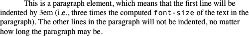
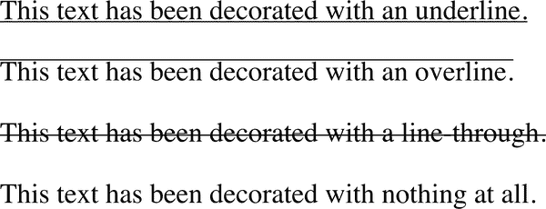
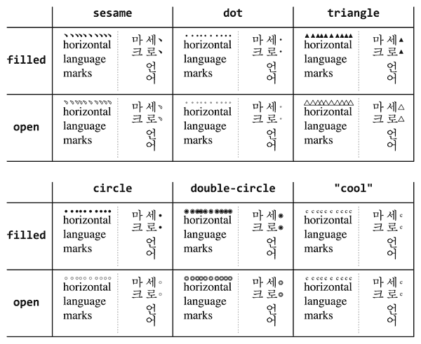

# 第十五章：文本属性

因为文本如此重要，许多 CSS 属性在一定程度上影响它。但我们在第十四章只是介绍了字体的部分。不完全一样：我们只是讨论了字体——引入和使用字体。文本样式是不同的。

那么，文本和字体之间有什么区别？在最简单的层面上，*文本*是内容，*字体*用于显示该内容。字体提供了字母的形状。文本是围绕这些形状的样式。使用文本属性，你可以影响文本与行的其余部分的位置关系，上标、下划线和更改大小写。你可以影响文本装饰的大小、颜色和位置。

# 缩进和内联对齐

让我们先讨论一下如何影响文本在一行内的内联定位。可以把这些基本操作看作是创建通讯或撰写报告的步骤。

最初，CSS 是基于*水平*和*垂直*的概念。为了更好地支持所有语言和写作方向，CSS 现在使用术语*块方向*和*内联方向*。如果你的母语是西方语言衍生的，你习惯于从上到下的块方向和从左到右的内联方向。

*块方向*是在当前书写模式中块元素的默认放置方向。例如，在英语中，块方向是从上到下的，即垂直方向，一个段落（或其他文本元素）位于前一个段落的下方。有些语言有垂直文本，比如蒙古语。当文本是垂直的时，块方向是水平的。

*内联方向*是内联元素在块内书写的方向。以英语为例，内联方向是从左到右，即水平方向。在阿拉伯语和希伯来语等语言中，内联方向则是从右到左。再以前面段落中的例子来说明，蒙古语的内联方向是从上到下。

让我们再考虑一下英语。在屏幕上显示的普通英文页面具有垂直的块方向（从上到下）和水平的内联方向（从左到右）。但是，如果通过使用 CSS 转换使页面逆时针旋转 90 度，突然之间块方向是水平的，而内联方向是垂直的（而且是从下到上的）。

###### 提示

你在网络上仍然可以找到许多关于写作方向的英文中心博客文章和其他与 CSS 相关的文档，使用*垂直*和*水平*这些术语。在必要时，将它们心理转化为*块*和*内联*。

## 文本缩进

大多数西方语言的纸质书籍的文字段落格式为首行缩进，段落之间没有空行。如果你想重新创建这种外观，CSS 提供了`text-indent`属性。

使用 `text-indent`，可以缩进任何元素的第一行，即使长度为负数。这个属性的常见用法是缩进段落的第一行：

```
p {text-indent: 3em;}
```

这条规则将导致任何段落的第一行缩进 3 个 ems，如图 15-1 所示。



###### 图 15-1\. 文本缩进

通常情况下，您可以将 `text-indent` 应用于生成块级盒子的任何元素，缩进将沿着内联方向发生。您不能将其应用于内联元素或替换元素（如图片）。但是，如果在块级元素的第一行中有一张图片，该图片将会随着文本一起向右移动。

###### 注意

如果您想“缩进”内联元素的第一行，可以通过左内边距或外边距来实现这种效果。

您也可以为 `text-indent` 设置负值，以创建悬挂缩进，其中第一行超出其余元素的一侧：

```
p {text-indent: −4em;}
```

当设置 `text-indent` 的负值时，请注意，如果不小心，前几个单词可能会被浏览器窗口的边缘截断。为避免显示问题，建议您使用外边距或内边距来适应负缩进：

```
p {text-indent: −4em; padding-left: 4em;}
```

可以使用任何长度单位，包括百分比值，与 `text-indent` 一起使用。在以下情况下，百分比是指被缩进元素的父元素宽度。换句话说，如果将缩进值设置为 `10%`，则受影响元素的第一行将缩进其父元素宽度的 10%，如图 15-2 所示：

```
div {width: 400px;}
p {text-indent: 10%;}
```

```
<div>
<p>This paragraph is contained inside a DIV, which is 400px wide, so the
first line of the paragraph is indented 40px (400 * 10% = 40).  This is
because percentages are computed with respect to the width of the element.</p>
</div>
```


###### 图 15-2\. 百分比文本缩进

请注意，由于 `text-indent` 是继承的，一些浏览器（如 Yandex 浏览器）会继承计算值，而 Safari、Firefox、Edge 和 Chrome 则继承声明的值。在以下示例中，因为 `5em` 的值在 Yandex 和旧版本的 WebKit 中从其父级 `<div>` 继承到段落中，所以在 Yandex 中两段文本都将缩进 5 个 em，而在其他浏览器中，文本将按当前元素宽度的 10% 缩进：

```
div#outer {width: 50em;}
div#inner {text-indent: 10%;}
p {width: 20em;}
```

```
<div id="outer">
<div id="inner">
This first line of the DIV is indented by 5em.
<p>
This paragraph is 20em wide, and the first line of the paragraph
is indented 5em in WebKit and 2em elsewhere.  This is because
computed values for 'text-indent' are inherited in WebKit,
while the declared values are inherited elsewhere.
</p>
</div>
</div>
```

截至 2022 年末，有两个关键词正在考虑添加到 `text-indent` 中：

`hanging`

反转缩进效果；即 `text-indent: 3em hanging` 会缩进除第一行之外的所有文本行。这类似于之前讨论过的负值缩进，但不会因为将第一行拉出内容框而导致文本被截断，因为除第一行外的所有行都会从内容框的边缘缩进。

`each-line`

缩进元素的第一行，以及由 `<br>` 引起的强制换行后开始的任何行，但不包括跟随软换行的行。

在支持的情况下，可以与长度或百分比一起使用，例如：

```
p {text-indent: 10% hanging;}
pre {text-indent: 5ch each-line;}
```

## 对齐文本

比 `text-indent` 更基础的是 `text-align` 属性，它影响元素内文本行的相互对齐方式。

理解这些值如何工作的最快方法是查看 图 15-3，展示了最常使用的值。`left`、`right` 和 `center` 这些值会使元素内的文本在水平语言（如英语或阿拉伯语）中完全按照这些词描述的方式对齐，无论语言的内联方向如何。


###### 图 15-3\. `text-align` 属性的选定行为

`text-align` 的默认值是 `start`，在从左到右（LTR）的语言中等同于 `left`，在从右到左（RTL）的语言中等同于 `right`。在竖排文字中，`left` 和 `right` 分别映射到起始或结束边缘。详见 图 15-4。

因为 `text-align` 仅适用于段落等块级元素，因此没有办法在其行内居中锚点而不影响其余文本行（也不应该这样做，因为那可能导致文本重叠）。

如您所料，`center` 使文本每行居中于元素内。如果您曾遇到过早已废弃的 `<CENTER>` 元素，则可能认为 `text-align: center` 与其相同。实际上它们有很大不同。`<CENTER>` 元素不仅影响文本，还居中整个元素，比如表格。而 `text-align` 属性仅控制内联内容的对齐，不影响元素的对齐。


###### 图 15-4\. 垂直书写模式中的左、右和中心对齐

### 起始和结束对齐

记住 CSS 最初是基于 *水平* 和 *垂直* 概念，初始默认值曾是“一个无名值，若 *direction* 是 *ltr*，则表现为 *left*，若 *direction* 是 *rtl*，则表现为 *right*”。现在默认值已有名字：`start`，在从左到右（LTR）的语言中等同于 `left`，在从右到左（RTL）的语言中等同于 `right`。

`start` 的默认值意味着文本对齐到其行框的起始边缘。在英语等从左到右（LTR）的语言中，这是左边缘；在阿拉伯语等从右到左（RTL）的语言中，这是右边缘。在竖排文字中，这将是顶部或底部，具体取决于书写方向。总之，该默认值在意识到文档语言方向的同时，保持了现有情况中的默认行为一致。

类似地，`end` 使文本与每个行框的结束边缘对齐 —— 在从左到右（LTR）的语言中是右边缘，在从右到左（RTL）的语言中是左边缘，以此类推。图 15-5\. 展示了这些值的效果。


###### 图 15-5\. 起始和结束对齐

### 两端对齐的文本

常被忽视的对齐值是 `justify`，它本身引发了一些问题。在两端对齐的文本中，一行文本的两端（除了最后一行，可以使用 `text-align-last` 设置）放置在父元素的内边缘，如 图 15-6 所示。然后，调整单词和字母之间的间距，使单词均匀分布在行中。两端对齐的文本在印刷界很常见（例如在本书中），但在 CSS 下，还有一些额外的考虑因素。


###### 图 15-6\. 两端对齐的文本

用户代理确定如何拉伸或分配两端对齐文本以填充父元素的左右边缘之间的空间。例如，某些浏览器可能只在单词之间添加额外空间，而其他浏览器可能在字母之间分配额外空间（尽管 CSS 规范规定如果属性 `letter-spacing` 被指定为长度值，则“用户代理可能不会进一步增加或减少字符间距”）。其他用户代理可能会在某些行上减少空间，从而使文本比通常更紧凑。

值 `justify-all` 设置了 `text-align` 和 `text-align-last` 的完全两端对齐（在即将介绍的部分中涵盖）。

###### 警告

截至 2022 年中期，即使几乎所有浏览器都支持 `text-align: justify` 和 `text-align-last: justify`，但是没有任何浏览器支持 `justify-all` 值。截至出版时仍然存在这种支持差距，但在大多数浏览器中通过以下方式解决：

```
.justify-all {
  text-align: justify;
  text-align-last: justify;
  }
```

### 父匹配

我们还有一个值需要介绍：`match-parent`。如果声明 `text-align: match-parent`，并且 `text-align` 的继承值为 `start` 或 `end`，则 `match-parent` 元素的对齐将根据父元素的水平或垂直方向计算，而不是内联方向。

例如，您可以强制任何英文元素的文本对齐方式与父元素的对齐方式匹配，而不考虑其书写方向，如下例所示。

```
div {text-align: start;}
div:lang(en) {direction: ltr;}
div:lang(ar) {direction: rtl;}
p {text-align: match-parent;}

<div lang="en-US">
Here is some en-US text.
<p>The alignment of this paragraph will be to the left, as with its parent.</p>
</div>
<div lang="ar">
هذا نص عربي.
<p>The alignment of this paragraph will be to the right, as with its parent.</p>
</div>
```

## 对齐最后一行

有时，您可能希望将元素最后一行的文本与其余内容不同地对齐。例如，使用 `text-align: justify` 时，最后一行默认为 `text-align: start`。您可以确保左对齐最后一行，而其他部分则完全两端对齐，或者选择从左对齐切换到居中对齐。对于这些情况，您可以使用 `text-align-last`。

如同 `text-align` 一样，理解这些值的最快方法是查看 图 15-7。


###### 图 15-7\. 不同对齐的最后一行

元素的最后一行根据元素的 `text-align-last` 值独立对齐，与其他元素无关。

仔细研究 图 15-7 将揭示比块级元素的最后一行更多的影响因素。事实上，`text-align-last` 适用于任何文本行，这些文本行紧跟在强制换行之前，无论该换行是否由元素的结尾触发。因此，由 `<br>` 标签创建的换行将使紧随其前的文本行使用 `text-align-last` 的值。

使用`text-align-last`时会出现一个有趣的问题：如果元素中的第一行文本也是元素中的最后一行文本，则`text-align-last`的值优先于`text-align`的值。因此，以下样式将导致段落居中，而不是起始对齐：

```
p {text-align: start; text-align-last: center;}
```

```
<p>A paragraph.</p>
```

## 单词间距

`word-spacing` 属性用于修改单词之间的间距，接受正或负的长度。这个长度被 *添加* 到标准单词间的空格中。因此，默认值 `normal` 等同于设置值 `0`。

如果提供正长度值，单词之间的空间将增加。设置 `word-spacing` 的负值会使单词更接近：

```
p.spread {word-spacing: 0.5em;}
p.tight {word-spacing: -0.5em;}
p.default {word-spacing: normal;}
p.zero {word-spacing: 0;}
```

```
<p class="spread">The spaces—as in those between the “words”—in this paragraph
   will be increased by 0.5em.</p>
<p class="tight">The spaces—as in those between the “words”—in this paragraph
   will be increased by 0.5em.</p>
<p class="default">The spaces—as in those between the “words”—in this paragraph
   will be neither increased nor decreased.</p>
<p class="zero">The spaces—as in those between the “words”—in this paragraph
   will be neither increased nor decreased.</p>
```

调整这些设置会产生 图 15-8 中显示的效果。


###### 图 15-8。改变单词间的空间

在 CSS 术语中，*单词* 是由某种形式的空格包围的任何非空格字符串。这意味着 `word-spacing` 在任何使用象形文字或非罗马书写风格的语言中都不太可能起作用。这也是为什么前面示例文本中的破折号周围没有空格的原因。从 CSS 的角度来看，“spaces—as” 是一个单词。

使用时要小心。 `word-spacing` 属性允许创建非常难读的文档，正如 图 15-9 所示。


###### 图 15-9。真正宽的单词间距

## 字母间距

许多与 `word-spacing` 相关的问题也会出现在 `letter-spacing` 中。两者之间唯一的真正区别在于，`letter-spacing` 修改的是字符或字母之间的间距。

与 `word-spacing` 属性一样，`letter-spacing` 的允许值包括任何长度，尽管建议使用字符相关长度（如 `em`）而不是根相关长度（如 `rem`），以确保间距与字体大小成比例。

默认关键字是 `normal`，其效果与 `letter-spacing: 0` 相同。输入的任何长度值都会增加或减少字母之间的间距。图 15-10 展示了以下标记的结果：

```
p {letter-spacing: 0;}    /*  identical to 'normal'  */
p.spacious {letter-spacing: 0.25em;}
p.tight {letter-spacing: −0.25em;}
```

```
<p>The letters in this paragraph are spaced as normal.</p>
<p class="spacious">The letters in this paragraph are spread out a bit.</p>
<p class="tight">The letters in this paragraph are a bit smashed together.</p>
```


###### 图 15-10。不同种类的字母间距

###### 警告

如果页面使用具有连字等特性的字体，并且启用了这些特性，改变字母或单词间距可能会有效地禁用它们。当字母间距被改变时，浏览器不会重新计算连字或其他连接。

## 间距与对齐

注意单词之间的空间可能会受到`text-align`属性值的影响。如果一个元素被调整为两端对齐，字母和单词之间的空格可能会被调整以适应行的整体宽度。这可能会进一步影响使用`word-spacing`声明的间距。

如果将长度值分配给`letter-spacing`，那么该值不能被`text-align`改变；但如果`letter-spacing`的值是`normal`，则可以通过调整字母间距来使文本两端对齐。CSS 没有规定如何计算间距，因此用户代理使用自己的算法。为了防止`text-align`改变字母间距，同时保持默认的字母间距，请声明`letter-spacing: 0`。

请注意，计算值是继承的，因此具有较大或较小文本的子元素将具有与其父元素相同的单词或字母间距。您无法定义一个缩放因子，使`word-spacing`或`letter-spacing`继承到计算值（与`line-height`相反）。因此，您可能会遇到如图 15-11 所示的问题：

```
p {letter-spacing: 0.25em; font-size: 20px;}
small {font-size: 50%;}
```

```
<p>This spacious paragraph features <small>tiny text that is just
as spacious</small>, even though the author probably wanted the
spacing to be in proportion to the size of the text.</p>
```


###### 图 15-11\. 继承的字母间距

因为`inherit`继承了祖先的字母间距计算长度，要实现与文本大小成比例的字母间距，唯一的方法是在每个元素上显式设置它，如下所示：

```
p {letter-spacing: 0.25em;}
small {font-size: 50%; letter-spacing: 0.25em;}
```

对于单词间距也是一样的。

# 垂直对齐

现在我们已经讨论了沿内联方向的对齐，让我们继续讨论沿块方向的内联元素的垂直对齐——比如上标和垂直对齐（相对于文本行，如果文本是水平布局的话）。由于行的构造是一个值得一本小书来详细讨论的复杂主题，我们在这里只是简要概述。

## 调整行高

行之间的距离可以通过改变行高来影响。请注意，在这里“高度”是相对于文本行本身的，假设行的长轴是“宽度”，即使是垂直书写的情况也是如此。从这里我们涵盖的属性名称将显示对西方语言及其书写方向的强烈偏见；这是 CSS 早期的一个副产品，当时只有西方语言可以轻松表示。

`line-height` 属性是指文本行基线之间的距离，而不是字体的大小，并确定每个元素框的高度增加或减少的量。在最基本的情况下，指定 `line-height` 是增加（或减少）文本行之间垂直间距的一种方式，但这是看待 `line-height` 工作方式的一个误导性简单方式。此属性控制*行间距*，即文本行之间额外的空间，超出字体大小。换句话说，`line-height` 的值与字体大小的差异即是行间距。

当应用于块级元素时，`line-height` 定义了该元素内文本基线之间的*最小*距离。请注意，它定义了一个最小值，而不是一个绝对值。例如，如果一行包含的内联图像或表单控件比声明的行高更高，文本基线可能会被推开超出 `line-height` 的值。`line-height` 属性不影响替换元素（如图像）的布局，但仍然适用于它们。

### 构建一行

正如您在 第六章 中学到的，文本行中的每个元素都生成一个*内容区域*，其大小由字体大小确定。这个内容区域又生成一个*内联框*，在没有其他因素的情况下，与内容区域完全相等。由 `line-height` 生成的行间距是增加或减少每个内联框高度的因素之一。

要确定给定元素的行间距，从 `font-size` 的计算值中减去 `line-height` 的计算值。这个值就是总的行间距量。请记住，它可以是负数。然后，将行间距分成两半，每半行间距应用于内容区域的顶部和底部。结果就是该元素的内联框。通过这种方式，只要行的高度没有被替换元素或其他因素强制超出其最小高度，每行文本都会居中于行高之内。

举例来说，假设 `font-size`（因此内容区域）为 14 像素高，而 `line-height` 计算为 18 像素。差值（4 像素）被分成两半，每一半应用于内容区域的顶部和底部。这有效地通过创建一个高度为 18 像素的内联框，使内容居中，顶部和底部各增加了 2 像素的空白。这听起来像是描述 `line-height` 如何工作的一个绕圈子的方式，但是这种描述有其优秀的理由。

一旦给定行内容的所有内联框都已生成，它们将被考虑在行框的构建中。行框的高度正好足以包含最高内联框的顶部和最低内联框的底部。图 15-12 展示了此过程的示意图。


###### 图 15-12\. 行框图示

### 分配 `line-height` 的值

现在让我们考虑 `line-height` 的可能值。如果您使用 `normal` 的默认值，用户代理必须计算行间距。不同的用户代理可能会有不同的值，但 `normal` 的默认值通常是字体大小的 1.2 倍，这使得行框比给定元素的 `font-size` 值更高。

许多值是简单的长度度量（例如 `18px` 或 `2em`），但在许多情况下，没有长度单位的 `<number>` 值更可取。

###### 警告

请注意，即使您使用有效的长度测量，例如 `4cm`，浏览器（或操作系统）可能会使用不正确的度量标准来测量真实世界的测量值，因此线高可能在您的显示器上不会显示为确切的 4 厘米。

`em`、`ex` 和百分比值是相对于元素的 `font-size` 计算的。以下 CSS 和 HTML 的结果显示在图 15-13 中：

```
body {line-height: 18px; font-size: 16px;}
p.cl1 {line-height: 1.5em;}
p.cl2 {font-size: 10px; line-height: 150%;}
p.cl3 {line-height: 0.33in;}
```

```
<p>This paragraph inherits a 'line-height' of 18px from the body, as well as
a 'font-size' of 16px.</p>
<p class="cl1">This paragraph has a 'line-height' of 24px(16 * 1.5), so
it will have slightly more line-height than usual.</p>
<p class="cl2">This paragraph has a 'line-height' of 15px (10 * 150%), so
it will have slightly more line-height than usual.</p>
<p class="cl3">This paragraph has a 'line-height' of 0.33in, so it will have
slightly more line-height than usual.</p>
```


###### 图 15-13\. 使用 `line-height` 属性进行简单计算

### 理解 `line-height` 和继承

当一个块级元素从另一个元素那里继承了 `line-height` 时，事情会变得有些棘手。`line-height` 的值是从父元素计算的，而不是从子元素继承的。以下标记的结果显示在图 15-14 中。这可能不是作者所想要的结果：

```
body {font-size: 10px;}
div {line-height: 1em;}  /* computes to '10px' */
p {font-size: 18px;}
```

```
<div>
<p>This paragraph's 'font-size' is 18px, but the inherited 'line-height'
value is only 10px.  This may cause the lines of text to overlap each
other by a small amount.</p>
</div>
```


###### 图 15-14\. 小 `line-height`，大 `font-size`，轻微问题

为什么行之间如此紧凑？因为段落从其父级 `<div>` 继承了计算的 `line-height` 值为 `10px`。解决图 15-14 所示的小 `line-height` 问题的一个解决方案是为每个元素设置显式的 `line-height`，但这并不是很实际。一个更好的选择是指定一个数字，实际上设置一个缩放因子：

```
body {font-size: 10px;}
div {line-height: 1;}
p {font-size: 18px;}
```

当您指定一个没有长度单位的数字时，会导致缩放因子成为继承值而不是计算值。该数字将应用于元素及其所有子元素，以便每个元素的 `line-height` 都是相对于其自身的 `font-size` 计算的（见图 15-15）：

```
div {line-height: 1.5;}
p {font-size: 18px;}
```

```
<div>
<p>This paragraph's 'font-size' is 18px, and since the 'line-height'
set for the parent div is 1.5, the 'line-height' for this paragraph
is 27px (18 * 1.5).</p>
</div>
```


###### 图 15-15\. 使用 `line-height` 因子来克服继承问题

现在您已经基本了解了行如何构建，请让我们讨论相对于行框垂直对齐元素的基本概念——即沿块方向位移它们。

## 垂直对齐文本

如果您曾经使用过元素 `<sup>` 和 `<sub>`（上标和下标元素），或者使用了带有图像的废弃的 `align` 属性，您就已经做了一些基本的垂直对齐。

###### 注意

由于属性名 `vertical-align`，本节将使用“垂直”和“水平”来指代文本的块级和行内方向。

`vertical-align` 属性接受八个关键字中的任意一个，百分比值或长度值。这些关键字有些熟悉，有些不熟悉：`baseline`（默认值）、`sub`、`super`、`bottom`、`text-bottom`、`middle`、`top` 和 `text-top`。我们将研究每个关键字在行内元素中的工作方式。

###### 注意

记住：`vertical-align` 不会影响块级元素内内容的对齐，只会影响行内内容在文本行或表格单元格中的对齐。这一点可能会在未来发生变化，但截至 2022 年中期，扩展其作用范围的提案尚未推进。

### 基线对齐

使用 `vertical-align: baseline` 强制元素的基线与其父元素的基线对齐。大多数情况下，浏览器都会这样做，因为您可能希望一行中所有文本元素的底部对齐。

如果垂直对齐的元素没有基线——即它是图片、表单输入或其他替换元素——那么元素的底部将与其父元素的基线对齐，如图 15-16 所示：

```
img {vertical-align: baseline;}
```

```
<p>The image found in this paragraph  has its
bottom edge aligned with the baseline of the text in the paragraph.</p>
```


###### 图 15-16\. 图像的基线对齐

这种对齐规则很重要，因为它会导致某些网页浏览器始终将替换元素的底边放在基线上，即使行中没有其他文本。例如，假设您在表格单元格中只有一张图片。在某些浏览器中，图片实际上可能处于基线上，但是基线下方的空间会导致图片下方出现间隙。其他浏览器会将图片与表格单元格“包裹”在一起，不会出现间隙。尽管大多数作者不太喜欢间隙的表现，但间隙的行为是正确的。

###### 注意

参见深度老化但仍然相关的文章 [“Images, Tables, and Mysterious Gaps”](https://meyerweb.com/eric/articles/devedge/img-table-gaps)（2002）以获取更详细的间隙行为解释及其解决方法。

### 上标和下标

声明 `vertical-align: sub` 会使元素被置于下标位置，意味着其基线（或底部，如果它是替换元素）相对于父元素的基线被降低。规范并未定义元素被降低的距离，因此可能会因用户代理而异。

`super` 值与 `sub` 相反；它会使元素的基线（或替换元素的底部）相对于父元素的基线提升。同样，文本被提升的距离取决于用户代理。

请注意，`sub` 和 `super` 这些值*不*会改变元素的字体大小，因此，下标或上标文本不会变小（或变大）。相反，默认情况下，上标或下标元素中的任何文本都与父元素中的文本大小相同，如图 15-17 所示：

```
span.raise {vertical-align: super;}
span.lower {vertical-align: sub;}
```

```
<p>This paragraph contains <span class="raise">superscripted</span>
and <span class="lower">subscripted</span> text.</P>
```


###### 图 15-17\. 上标和下标对齐

###### 注意

如果您希望使上标或下标文本比其父元素的文本小，可以使用 `font-size` 属性来实现。

### 顶部和底部对齐

`vertical-align: top` 选项将元素的行内框顶部与行框顶部对齐。类似地，`vertical-align: bottom` 将元素的行内框底部与行框底部对齐。因此，以下标记的结果如图 15-18 所示：

```
.soarer {vertical-align: top;}
.feeder {vertical-align: bottom;}
```

```
<p>And in this paragraph, as before, we have
first a  image and
then a  image,
and then some text which is not tall.</p>

<p>This paragraph, as you can see, contains
first a  image and
then a  image,
and then some text that is not tall.</p>
```


###### 图 15-18\. 顶部和底部对齐

第一段的第二行包含两个内联元素，它们的顶部边缘对齐。它们也远远高于文本基线。第二段显示了相反的情况：两个图像，它们的底部对齐并且远低于其行的基线。这是因为在这两种情况下，行中元素的大小增加了行的高度，超出了字体大小通常创建的高度。

如果您想要将元素与行中文本的顶部或底部对齐，`text-top` 和 `text-bottom` 就是您要寻找的值。对于这些值，替换元素或任何其他类型的非文本元素都会被忽略。而是考虑一个*默认*文本框。这个默认框源自父元素的 `font-size`。然后，对齐元素行内框的底部与默认文本框的底部对齐。因此，给定以下标记，您将获得类似于图 15-19 所示的结果：

```
img.ttop {vertical-align: text-top;}
img.tbot {vertical-align: text-bottom;}
```

```
<p>Here: a  tall image,
and then a  image.</p>
<p>Here: a  tall image,
and then a  image.</p>
```


###### 图 15-19\. 文本顶部和底部对齐

### 中间对齐

`middle` 值通常（但并非总是）应用于图像。它不会产生您可能期望的确切效果，因为其名称。`middle` 值将一个内联元素框的中间与父元素的基线上方 `0.5ex` 的点对齐，其中 `1ex` 相对于父元素的 `font-size` 定义。图 15-20 更详细地显示了这一点。


###### 图 15-20\. 中间对齐的精确细节

由于大多数用户代理将 `1ex` 视为半个 em，`middle` 通常将一个元素的垂直中点与父元素基线上方四分之一 em 的点对齐，尽管这不是一个确定的距离，因此可能因用户代理而异。

### 百分比

百分比不允许您模拟图像的`align="middle"`。相反，为`vertical-align`设置百分比值会根据父元素的基线将元素的基线（或替换元素的底边）提高或降低指定的量。（您指定的百分比是相对于元素的`line-height`计算的，而不是其父元素。）正百分比值会提升元素，负值则会降低它。

根据文本是如何提升或降低的，它可以看起来被放置在相邻的行中，如图 15-21 所示，因此在使用百分比值时要小心：

```
sub {vertical-align: −100%;}
sup {vertical-align: 100%;}
```

```
<p>We can either <sup>soar to new heights</sup> or, instead,
<sub>sink into despair...</sub></p>
```


###### 图 15-21\. 百分比和有趣的效果

### 长度对齐

最后，让我们考虑使用特定长度的垂直对齐。`vertical-align`选项非常基础：它通过声明的距离向上或向下移动元素。因此，`vertical-align: 5px;`将使元素从未对齐的位置向上移动 5 像素。负长度值会将元素向下移动。

需要意识到的重要一点是，垂直对齐的文本不会成为另一行的一部分，也不会重叠在其他行的文本之上。考虑图 15-22，其中一些垂直对齐的文本出现在段落中间。


###### 图 15-22\. 垂直对齐可能导致行高变高

如您所见，任何垂直对齐的元素都会影响行的高度。回想一下行框的描述，它正好与必要的高度相同，以包含最高内联框的顶部和最低内联框的底部。这包括通过垂直对齐向上或向下移动的内联框。

# 文本转换

在介绍了对齐属性后，让我们看看如何通过属性`text-transform`来操作文本的大写。

默认值`none`保留文本并使用源文档中存在的任何大写。正如它们的名称所示，`uppercase`和`lowercase`将文本转换为全大写或全小写字符。值为`full-width`会强制在方框内书写字符，就像在排版网格上一样。

###### 警告

可访问性提示：一些屏幕阅读器会逐字母读取所有大写文本，就像拼写首字母缩写一样，即使源文本是小写或混合大小写，并且大写仅通过 CSS 强制。因此，通过 CSS 进行大写文本处理应谨慎对待。

最后，`capitalize`值仅大写每个单词的第一个字母（其中*单词*被定义为由空格包围的一系列相邻字符）。图 15-23 以各种方式展示了这些设置：

```
h1 {text-transform: capitalize;}
strong {text-transform: uppercase;}
p.cummings {text-transform: lowercase;}
p.full {text-transform: full-width;}
p.raw {text-transform: none;}
```

```
<h1>The heading-one at the beginninG</h1>
<p>
By default, text is displayed in the capitalization it has in the source
document, but <strong>it is possible to change this</strong> using
the property 'text-transform'.
</p>
<p class="cummings">
For example, one could Create TEXT such as might have been Written by
the late Poet E.E.Cummings.
</p>
<p class="full">
If you need to align characters as if in a grid, as is often done in CJKV
languages, you can use 'full-width' to do so.
</p>
<p class="raw">
If you feel the need to Explicitly Declare the transformation of text
to be 'none', that can be done as well.
</p>
```


###### 图 15-23\. 各种文本转换方式

###### 注意

正如在 第六章 中所指出的，*CJK* 表示 *中文/日文/韩文*。CJK 字符占据了整个 Unicode 代码空间的大部分，包括大约 70,000 个汉字。有时您可能会遇到 *CJKV* 的缩写，它加入了 *越南语*。

不同的用户代理可能有不同的决定单词起始位置的方式，因此哪些字母大写也会不同。例如，在 `<h1>` 元素中显示的 “heading-one” 文本，在 图 15-23 中，可以以两种方式呈现：“Heading-one” 或 “Heading-One”。CSS 没有规定哪种是正确的，因此两种都可能。

您可能还注意到，在 图 15-23 中 `<h1>` 元素的最后一个字母仍然是大写的。这是正确的：当应用 `text-transform: capitalize` 时，CSS 要求用户代理确保每个单词的第一个字母大写，可以忽略其余部分。

作为一种属性，`text-transform` 可能看起来不重要，但如果您突然决定将所有 `<h1>` 元素大写，它非常有用。您可以使用 `text-transform` 来为您进行更改，而不是单独更改所有 `<h1>` 元素的内容：

```
h1 {text-transform: uppercase;}
```

```
<h1>This is an H1 element</h1>
```

使用 `text-transform` 的优点是双重的。首先，您只需编写一个规则即可进行此更改，而不是更改 `<h1>` 本身。其次，如果以后决定从全大写切换回首字母大写，这种更改甚至更容易：

```
h1 {text-transform: capitalize;}
```

请记住，`capitalize` 仅是在每个“单词”的开头进行的简单字母替换。CSS 不检查语法，因此常见的标题大写约定，如将冠词 (*a*, *an*, *the*) 全部小写，不会被强制执行。

不同的语言有不同的规则决定哪些字母应该大写。`text-transform` 属性考虑了特定语言的大小写映射。

`full-width` 选项强制将字符写入一个方块内。您可以在键盘上输入的大多数字符都有正常宽度和全宽度两种形式，具有不同的 Unicode 代码点。当设置和支持 `full-width` 时，使用全宽度版本可以将其与亚洲表意字符平滑混合，允许表意字符和拉丁脚本对齐。

通常与 `<ruby>` 注释文本一起使用，`full-size-kana` 将所有小假名字符转换为等效的全尺寸假名，以弥补通常在 Ruby 中使用的小字体大小的可读性问题。

# 文本装饰

接下来我们来讨论文本装饰的主题，以及如何使用各种属性影响它们。最简单的文本装饰是下划线，并且可以通过各种属性进行控制。CSS 还支持上划线、穿过线，甚至是您在文字处理程序中看到的波浪下划线，用于标记拼写或语法错误。

我们将从各个单独的属性开始，然后用一个简写属性`text-decoration`来统一它们。

## 设置文本装饰线位置

使用属性`text-decoration-line`，可以设置文本串中一个或多个线条装饰的位置。最熟悉的装饰可能是下划线，多亏了所有的超链接，但 CSS 有三个可能的可见装饰线值（还有一个不支持的第四个，即使它被支持了也不会画出任何线条）。

这些值相对而言具有自解释性：`underline`在文本下方画一条线，其中*under*的意思是“在块方向的文本下方”。`overline`值是其镜像，将线放在文本的块方向上方。`line-through`值在文本中间画一条线。

让我们看看这些装饰在实践中是什么样子。以下代码在图 15-24 中进行了说明：

```
p.one {text-decoration: underline;}
p.two {text-decoration: overline;}
p.three {text-decoration: line-through;}
p.four {text-decoration: none;}
```



###### 图 15-24\. 各种文本装饰

值为`none`会关闭元素上可能已经应用的任何装饰。例如，链接通常默认带有下划线。如果你想要取消超链接的下划线，可以使用以下 CSS 规则来实现：

```
a {text-decoration: none;}
```

如果你通过这种规则显式地关闭了链接的下划线，锚点和普通文本之间唯一的视觉区别将是它们的颜色（至少默认情况下，尽管不能保证它们的颜色会有差异）。仅依靠颜色作为区分正常文本和文本内的链接的唯一标识是不够的，这会对用户体验产生负面影响，并使你的内容对许多用户无法访问。

###### 注意

请记住，许多用户会因为你关闭了链接下划线而感到恼火，尤其是在文本块中。如果你的链接没有下划线，用户将很难在文档中找到超链接，对于某些色盲用户来说，这几乎是不可能的。

这就是`text-decoration-line`的全部内容。你们中的老手可能会认识到这正是`text-decoration`本身过去所做的事情，但时代在变化，我们在装饰方面可以做的事情远不止放置它们，因此这些值被转移到了`text-decoration-line`。

## 设置文本装饰颜色

默认情况下，文本装饰的颜色将与文本的颜色相匹配。如果需要更改，`text-decoration-color`来帮助你。

可以使用任何有效的颜色值作为`text-decoration-color`，包括关键字`currentcolor`（这是默认值）。假设你想要清楚地表明删除的文本确实是删除的。那就会像这样：

```
del, strike, .removed {
	text-decoration-line: line-through;
	text-decoration-color: red;
}
```

因此，显示的元素不仅将获得删除线装饰，而且线条颜色也将变成红色。除非你也使用`color`属性改变了文本本身的颜色，否则文本本身不会变成红色。

###### 注意

记住，要保持装饰物与基础文本之间的颜色对比足够高，以保持可访问性。通常单独使用颜色来传达含义是不明智的，比如“检查带有红色下划线的链接获取更多信息！”

## 设置文本装饰的粗细

使用属性`text-decoration-thickness`，你可以将文本装饰的线条粗细调整为比通常更粗或可能更细的值。

提供一个长度值将装饰的粗细设置为该长度；因此，`text-decoration-thickness: 3px`将装饰线条设置为 3 像素厚，无论文本本身有多大或多小。通常更好的方法是使用基于 em 的值或直接使用百分比值，因为百分比是相对于元素的`1em`值计算的。因此，`text-decoration-thickness: 10%`在计算的字体大小为 16 像素的字体中将产生 1.6 像素的装饰厚度，但在 40 像素字体大小中将产生 4 像素的装饰厚度。下面的代码展示了一些示例，这些示例在图 15-25 中有详细说明：

```
h1, p {text-decoration-line: underline;}
.tiny {text-decoration-thickness: 1px;}
.embased {text-decoration-thickness: 0.333em;}
.percent {text-decoration-thickness: 10%;}
```


###### 图 15-25\. 不同装饰的粗细

关键字`from-font`很有意思，因为它允许浏览器查看字体文件，看看它是否定义了首选的装饰线条粗细；如果有，浏览器将使用该粗细。如果字体文件没有建议的粗细，浏览器则退回到`auto`行为，并使用它认为合适的粗细，使用的推理只有浏览器自己知道。

## 设置文本装饰的样式

到目前为止，我们展示了许多简单的单线装饰。如果你渴望超越传统的方法，`text-decoration-style`提供了一些替代方案。

具体的结果将取决于你选择的值和用于查看结果的浏览器，但这些装饰风格的渲染至少应该与图 15-26 中显示的类似，这是以下代码的输出：

```
p {text-decoration-line: underline; text-decoration-thickness: 0.1em;}
p.one {text-decoration-style: solid;}
p.two {text-decoration-style: double;}
p.three {text-decoration-style: dotted;}
p.four {text-decoration-style: dashed;}
p.five {text-decoration-style: wavy;}
```


###### 图 15-26\. 各种装饰风格

我们增加了图 15-26 的装饰线条粗细，以提高可读性；默认大小可能使得某些较复杂的装饰风格（如`dotted`）难以看清。

## 使用文本装饰的简写属性

当你只想在一个便捷的声明中设置文本装饰的位置、颜色、粗细和样式时，`text-decoration`就是最佳选择。

使用`text-decoration`简写属性，你可以将所有内容整合到一起，如下所示：

```
h2 {text-decoration: overline purple 10%;}
a:any-link {text-decoration: underline currentcolor from-font;}
```

但要小心：如果将两种不同的装饰匹配到同一个元素，则获胜的规则的值将完全替换输掉的值。考虑以下情况：

```
h2.stricken {text-decoration: line-through wavy;}
h2 {text-decoration: underline overline double;}
```

根据这些规则，任何具有`stricken`类的`<h2>`元素将只有一条波浪线穿过装饰。双下划线和 overline 装饰将丢失，因为简写值会相互替换而不是累积。

还要注意，由于装饰属性的工作方式，即使有多个装饰，您也只能设置一次颜色和样式。例如，以下内容是有效的，将下划线和 overline 都设置为绿色和虚线：

```
text-decoration: dotted green underline overline;
```

如果您希望 overline 与 underline 具有不同的颜色，或者设置每个具有自己的样式，则需要将每个应用于单独的元素，类似于以下示例：

```
p {text-decoration: dotted green overline;}
p > span:first-child {text-decoration: silver dashed underline;}
```

```
<p><span>All this text will have differing text decorations.</span></p>
```

## 下划线偏移

除了所有`text-decoration`属性外，一个相关的属性允许您改变下划线（仅限下划线）与装饰的文本之间的距离：`text-underline-offset`。

您可能希望，例如，超链接上的下划线与文本基线有一定的距离，以便用户更容易注意到。设置像`3px`这样的长度值将使下划线位于文本基线以下 3 像素处。请参见图 15-27 以查看以下 CSS 的结果：

```
p {text-decoration-line: underline;}
p.one {text-underline-offset: auto;}
p.two {text-underline-offset: 2px;}
p.three {text-underline-offset: -2px;}
p.four {text-underline-offset: 0.5em;}
p.five {text-underline-offset: 15%;}
```


###### 图 15-27\. 各种下划线偏移

如图 15-27 所示，该值定义了距离文本基线的偏移量，可以是正值（沿着块轴向下）或负值（沿着块轴向上）。

与`text-decoration-thickness`一样，`text-underline-offset`的百分比值是相对于元素的 1em 计算的。因此，`text-underline-offset: 10%`会导致在计算的字体大小为 16 像素的字体中产生 1.6 像素的偏移量。

###### 警告

截至 2022 年末，只有 Firefox 支持`text-underline-offset`的百分比值，这很奇怪，因为百分比值是元素字体中 1 em 的百分比。解决方法是使用 em 长度值，例如 0.1em 代表 10%。

## 跳墨

过去几节中未解决的一个方面是：浏览器如何精确地在文本上绘制装饰，更准确地说是如何决定何时“跳过”文本的部分？这就是所谓的*跳墨*，浏览器采用的方法可以通过属性`text-decoration-skip-ink`进行改变。

当开启跳墨时，装饰会在跨越文本形状的地方中断。通常，这意味着装饰与文本字形之间的小间隙。请参见图 15-28 以查看跳墨方法的差异的近距离插图。


###### 图 15-28\. 跳墨方法

这三个值的定义如下：

`auto`（默认）

浏览器*可能*会在线条穿过文本字形的地方中断下划线和上划线，线条与字形之间留有一点空间。此外，浏览器*应该*考虑文本使用的字形，因为某些字形可能会导致墨水跳过，而其他字形则不会。

`all`

浏览器*必须*在线条穿过文本字形的地方中断下划线和上划线，并在线条与字形之间留有一点空间。然而，截至 2022 年中期，只有 Firefox 支持这个值。

`none`

浏览器*不得*在线条穿过文本字形的地方中断下划线和上划线，而是绘制一条连续的线，尽管可能会在文本字形的某些部分上绘制。

如图 15-28 所示，`auto`有时可能根据语言、字体或其他因素而有所不同。实际上，你只是告诉浏览器做它认为最好的事情。

###### 注意

尽管此属性的名称以`text-decoration-`开头，但它*不*是`text-decoration`简写属性所涵盖的属性。这就是为什么在简写之后而不是之前讨论它的原因。

## 理解奇怪的装饰

现在，让我们来看看`text-decoration`的不寻常之处。第一个奇怪之处在于`text-decoration`*不*被继承。没有继承意味着文本上绘制的任何装饰线（无论是下划线、上划线还是穿过文本）的颜色始终相同。即使后代元素是不同的颜色，也是如此，如图 15-29 所示：

```
p {text-decoration: underline; color: black;}
strong {color: gray;}
```

```
<p>This paragraph, which is black and has a black underline, also contains
<strong>strongly emphasized text</strong> that has the black underline
beneath it as well.</p>
```


###### 图 15-29\. 下划线中的颜色一致性

为什么会这样？因为`text-decoration`的值不会被继承，`<strong>`元素假设默认值为`none`。因此，`<strong>`元素没有*下划线*。现在，在`<strong>`元素下面明显有一条线，所以说它没有似乎很愚蠢。尽管如此，它确实没有。你在`<strong>`元素下看到的是段落的下划线，实际上是“跨越”了`<strong>`元素。如果你改变粗体元素的样式，就可以更清楚地看到这一点，就像这样：

```
p {text-decoration: underline; color: black;}
strong {color: gray; text-decoration: none;}
```

```
<p>This paragraph, which is black and has a black underline, also contains
<strong>strongly emphasized text</strong> that has the black underline beneath
it as well.</p>
```

结果与图 15-29 中显示的相同，因为你所做的只是显式声明已经存在的情况。换句话说，没有办法“关闭”由父元素生成的装饰。

有一种方法可以在不违反规范的情况下改变装饰的颜色。正如你记得的那样，在元素上设置文本装饰意味着整个元素具有相同的颜色装饰，即使子元素有不同的颜色。要使装饰颜色与元素匹配，必须显式声明其装饰，如下所示：

```
p {text-decoration: underline; color: black;}
strong {color: silver; text-decoration: underline;} /*could also use 'inherit'*/
```

```
<p>This paragraph, which is black and has a black underline, also contains
<strong>strongly emphasized text</strong> that has the black underline
beneath it as well, but whose gray underline overlays the black underline
of its parent.</p>
```

在图 15-30 中，`<strong>` 元素被设置为灰色并具有下划线。灰色下划线在视觉上“覆盖”了父元素的黑色下划线，使装饰的颜色与 `<strong>` 元素的颜色匹配。黑色下划线仍然存在；灰色下划线只是隐藏它。如果您使用 `text-underline-offset` 将灰色下划线移动或使父元素的 `text-decoration-thickness` 宽度超过其子元素，则两条下划线都将可见。


###### 图 15-30\. 克服下划线的默认行为

当 `text-decoration` 与 `vertical-align` 结合时，甚至会发生更奇怪的事情。图 15-31 展示了其中一些奇特之处。由于 `<sup>` 元素本身没有装饰，但它在一个上划线元素内被提升，上划线应该穿过 `<sup>` 元素的中间：

```
p {text-decoration: overline; font-size: 12pt;}
sup {vertical-align: 50%; font-size: 12pt;}
```


###### 图 15-31\. 正确，尽管奇怪，装饰行为

但并非所有浏览器都会这样做。截至 2022 年中期，Chrome 会将上划线向上推动，使其横跨在上标的顶部，而其他浏览器则不会。

# 文本呈现

CSS 的最新补充是 `text-rendering`，实际上是一个 SVG 属性，在支持的用户代理中被视为 CSS。它允许您指示用户代理在显示文本时应优先考虑什么。

值 `optimizeSpeed` 和 `optimizeLegibility` 指示应优先考虑绘制速度而不是像调整和连字这样的可读性特征（对于 `optimizeSpeed`），或者即使这会减慢文本呈现，也应使用这些可读性特征（对于 `optimizeLegibility`）。

使用 `optimizeLegibility` 的确切可读性特征未被明确定义，文本呈现通常取决于用户代理运行的操作系统，因此确切的结果可能有所不同。图 15-32 显示了针对速度优化然后针对可读性优化的文本。


###### 图 15-32\. 不同的优化

如您在图 15-32 中所见，这两种优化之间的差异在客观上相当小，但它们对可读性可能会产生显著影响。

###### 注意

一些用户代理在优化速度时仍然会始终优化可读性。这可能是过去几年中呈现速度变得如此快的影响。

另一方面，`geometricPrecision`指示用户代理尽可能精确地绘制文本，以便可以放大或缩小而无损失。您可能认为这总是如此，但并非如此。例如，某些字体在不同的文本大小下会改变字距或连字效果，例如，在较小的大小下提供更多的字距空间，并在增大大小时紧缩字距空间。使用`geometricPrecision`，这些提示在文本大小变化时被忽略。如果有帮助，可以将其视为用户代理绘制文本，就像所有文本都是一系列 SVG 路径而不是字形。

即使按照通常的网页标准，`auto`值在 SVG 中的定义也相当模糊：

> 用户代理应做出适当的权衡来平衡速度、可读性和几何精度，但是可读性比速度和几何精度更重要。

就是这样：用户代理可以做他们认为适合的事情，倾向于可读性。

# 文本阴影

有时候您确实需要文本投射阴影，比如当文本与多彩背景重叠时。这就是`text-shadow`的用处所在。语法可能一开始看起来有些古怪，但只需稍加练习就会变得足够清晰。

默认情况下，文本不会有阴影。否则，您可以定义一个或多个阴影。每个阴影由一个可选的颜色和三个长度值定义，最后一个长度值也是可选的。

颜色设置了阴影的颜色，因此可以定义绿色、紫色，甚至白色的阴影。如果省略颜色，则阴影默认为颜色关键字`currentcolor`，使其与文本本身相同的颜色。

尽管使用`currentcolor`作为默认颜色可能看起来反直觉，因为您可能认为阴影纯粹是装饰性的，但阴影可以用于提高可读性。一个小的阴影可以使非常细的文本更易读。通过默认使用`currentcolor`，可以通过阴影增加厚度，该阴影始终与文本的颜色相匹配。

除了通过增加薄文本的粗度来改善可访问性外，阴影还可用于在多色背景上增强颜色对比度。例如，如果您在大部分为黑白的照片上有白色文本，为白色文本添加黑色阴影即使文本覆盖在图像的白色部分上，也能使白色文本的边缘可见。

前两个长度值确定阴影相对于文本的偏移距离；第一个是水平偏移量，第二个是垂直偏移量。要定义一个实心、未模糊的绿色阴影，偏移距离为文本向右 5 像素，向下半个字母高度，如图 15-33 所示，您可以写以下任意一种：

```
text-shadow: green 5px 0.5em;
text-shadow: 5px 0.5em green;
```

负长度会使阴影相对于原始文本向左和向上偏移。以下示例，同样显示在图 15-33 中，将一个浅蓝色阴影偏移 5 像素向左和半个字母高度向上：

```
text-shadow: rgb(128,128,255) −5px −0.5em;
```


###### 图 15-33\. 简单阴影

尽管偏移可能使文本占据更多视觉空间，但阴影对行高没有影响，因此对框模型没有影响。

可选的第三长度值定义了阴影的模糊半径。*模糊半径* 定义为从阴影轮廓到模糊效果边缘的距离。例如，2 像素的半径将导致模糊填充阴影轮廓和模糊边缘之间的空间。具体的模糊方法没有定义，因此不同的用户代理可能采用不同的效果。例如，以下样式渲染如 图 15-34 所示：

```
p.cl1 {color: black; text-shadow: gray 2px 2px 4px;}
p.cl2 {color: white; text-shadow: 0 0 4px black;}
p.cl3 {color: black;
       text-shadow: 1em 0.5em 5px red,
	            −0.5em −1em hsla(100,75%,25%,0.33);}
```


###### 图 15-34\. 到处都是阴影

###### 警告

大量的文字阴影或者带有非常大模糊值的文字阴影可能会导致性能下降，特别是在低功率和 CPU 受限的情况下，例如移动设备上的动画。在使用文字阴影的公共设计发布之前，请进行彻底测试。

# 文本强调

另一种突出文本的方法是为每个字符添加强调标记。这在象形文字语言如汉语或蒙古语中更为常见，但可以通过 CSS 添加到任何语言的文本中。CSS 有三个类似于文本装饰的文本强调属性，还有一个将两者合并的简写。

## 设置强调样式

三个属性中最重要的一个设置了强调标记的类型，允许您从常见类型列表中选择或提供自定义标记作为文本字符串。

默认情况下，文本没有强调标记，或者是 `none`。另外，强调标记可以是五种形状之一：`dot`、`circle`、`double-circle`、`triangle` 或 `sesame`。这些形状可以设置为 `filled`，这是默认值；或 `open`，这会将它们呈现为未填充的轮廓。这些内容在 表 15-1 中总结，并在 图 15-35 中显示示例。

表 15-1\. 预定义的强调标记

| 形状 | `filled` | `open` |
| --- | --- | --- |
| 芝麻 |  (U+FE45) |  (U+FE46) |
| 点 | • (U+2022) | ◦ (U+25E6) |
| 圆形 | ● (U+25CF) | ○ (U+25CB) |
| 双圆形 | ◉ (U+25C9) | ◎ (U+25CE) |
| 三角形 | ▲ (U+25B2) | △ (U+25B3) |

芝麻在竖排书写模式中是最常见的标记；圆形在横排书写模式中通常是默认值。

如果强调标记不能适应当前文本行的高度，则会增加该文本行的高度，直到它们适合而不重叠其他行。与文本装饰和文字阴影不同，文本强调标记确实会影响行高。

如果在你的特定情况下没有预定义的标记适用，你可以提供自己的字符作为字符串（单引号或双引号中的单个字符）。但要小心：如果字符串超过一个字符，浏览器可能会将其缩减为字符串中的第一个字符。因此，`text-emphasis-style: 'cool'` 可能导致浏览器仅显示 `c` 作为标记，如图 15-35 所示。此外，在垂直语言的书写方向中，字符串符号可能会旋转或不旋转。

以下是设置强调标记的一些示例：

```
h1 em {text-emphasis-style: triangle;}
strong a:any-link {text-emphasis-style: filled sesame;}
strong.callout {text-emphasis-style: open double-circle;}
```

文本强调与文本装饰的一个关键区别是，与装饰不同，强调是继承的。换句话说，如果你在段落上设置了 `filled sesame` 风格，并且该段落有像链接这样的子元素，那些子元素将继承 `filled sesame` 的值。

另一个区别是每个字形（字符或其他符号）都有自己的标记，并且这些标记居中于字形上。因此，在像图 15-35 中所见的比例字体中，标记之间的间距会根据相邻的两个字形不同而不同。



###### 图 15-35\. 各种强调标记

CSS 规范建议强调标记的大小应为文本字体大小的一半，就像给予了 `font-size: 50%`。除此之外，它们应该使用与文本相同的文本样式；因此，如果文本是粗体，强调标记也应是粗体。它们还应该使用文本的颜色，除非通过接下来要讨论的属性进行了覆盖。

## 改变强调颜色

如果你希望强调标记的颜色与其标记的文本不同，`text-emphasis-color` 就是为你准备的。

默认值通常与颜色相关的属性一样是 `currentcolor`。这确保了强调标记默认与文本颜色匹配。要进行更改，你可以像下面这样操作：

```
strong {text-emphasis-style: filled triangle;}
p.one strong {text-emphasis-color: gray;}
p.two strong {text-emphasis-color: hsl(0 0% 50%);}
/* these will yield the same visual result */
```

## 放置强调标记

到目前为止，我们展示了特定位置的强调标记：在水平文本中每个字形的上方，以及在垂直文本中每个字形的右侧。这些是默认的 CSS 值，但不一定是首选的位置。`text-emphasis-position` 属性允许你改变标记的放置位置。

当排版模式为水平时，`over` 和 `under` 值只适用于上述情况。类似地，当排版模式为垂直时，`right` 和 `left` 值仅适用于右侧和左侧。

这在一些东方语言中可能很重要。例如，中文、日文、韩文和蒙古文在垂直书写时更喜欢将标记放在右侧。它们在水平文本上有所不同：中文更喜欢在文本下方放置标记，而其他语言则更喜欢在文本上方放置标记。因此，你可能会在样式表中写类似以下的内容：

```
:lang(cn) {text-emphasis-position: under right;}
```

当文本标记为中文时，这将覆盖默认的`over right`，应用`under right`。

## 使用文本强调速记法

`text-emphasis`属性存在一个速记选项，但仅汇集了样式和颜色。

之所以`text-emphasis-position`没有包含在`text-emphasis`速记法中，是因为它可以（实际上必须）单独继承。因此，可以通过`text-emphasis`更改标记的样式和颜色，而无需在此过程中覆盖位置。

正如前面所述，每个字符、表意字符或其他字形——CSS 称之为*排印字符单元*——都有其自己的强调标记。这大致是正确的，但也有例外。以下字符单元*不*获得强调标记：

+   字词分隔符，如空格或任何其他 Unicode 分隔符字符

+   标点符号，例如逗号、句号和括号

+   与控制代码对应的 Unicode 符号，或任何未分配的字符

## 设置文本绘制顺序

浏览器应该按照特定顺序绘制我们之前讨论过的文本装饰、阴影和强调标记，以及文本本身。这些按照从最底部（离用户最远）到最顶部（最靠近用户）的顺序绘制：

1.  阴影（`text-shadow`）

1.  下划线（`text-decoration`）

1.  顶线（`text-decoration`）

1.  实际文本

1.  强调标记（`text-emphasis`）

1.  删除线（`text-decoration`）

因此，文本的阴影被放置在其他所有内容的后面。下划线和顶线在文本后面。强调标记和删除线在文本顶部。请注意，如果您同时拥有顶部文本强调标记和顶线，则强调标记将绘制在顶线之上，重叠部分将遮蔽顶线。

# 空格

现在我们已经涵盖了各种样式、装饰和其他增强文本的方式，让我们来谈谈`white-space`属性，它影响用户代理处理文档源中的空格、换行和制表符的方式。

通过使用`white-space`属性，您可以影响浏览器处理单词和文本行之间空白的方式。在某种程度上，默认的 HTML 处理已经实现了这一点：它将任何空白都折叠为单个空格。因此，给定以下标记，网页浏览器中的呈现将在每个单词之间显示一个空格，并忽略元素中的换行：

```
<p>This    paragraph   has     many spaces        in it.</p>
```

您可以使用以下声明显式设置此默认行为：

```
p {white-space: normal;}
```

此规则告诉浏览器要像浏览器一直以来所做的那样：丢弃额外的空白。根据这个值，换行字符（回车符）被转换为空格，并且连续超过一个空格的序列被转换为单个空格。

然而，如果将 `white-space` 设置为 `pre`，受影响元素中的空白会被视为 HTML `<pre>` 元素；空白不会被忽略，如图 15-36 所示：

```
p {white-space: pre;}
```

```
<p>This    paragraph   has     many
    spaces        in it.</p>
```


###### 图 15-36\. 在标记中保留空格

使用 `white-space` 值为 `pre`，浏览器将注意到额外的空格甚至回车。在这方面，任何元素都可以被制作成 `<pre>` 元素。

相反的值是 `nowrap`，它防止文本在元素内部换行，除非使用 `<br>` 元素。当文本无法换行并且过宽时，会默认出现水平滚动条（可以使用 `overflow` 属性更改）。以下标记的效果显示在图 15-37 中：

```
<p style="white-space: nowrap;">This paragraph is not allowed to wrap,
which means that the only way to end a line is to insert a line-break
element.  If no such element is inserted, then the line will go forever,
forcing the user to scroll horizontally to read whatever can't be
initially displayed <br/>in the browser window.</p>
```


###### 图 15-37\. 使用 `white-space` 属性抑制换行

如果一个元素被设置为 `pre-wrap`，那么元素内的文本会保留空白序列，但文本行会正常换行。使用此值，生成的换行以及源标记中的换行都会被保留。

`pre-line` 值与 `pre-wrap` 相反，导致空白序列像普通文本一样折叠，但保留新行。

`break-spaces` 值与 `pre-wrap` 类似，但所有空白都会被保留，即使在行末也会有换行机会。这些空格占据空间，不会悬挂，从而影响框的固有尺寸（最小内容大小和最大内容大小）。

表 15-2 总结了各种 `white-space` 属性的行为。

表 15-2\. `white-space` 属性

| 值 | 空白 | 换行 | 自动换行 | 结尾空白 |
| --- | --- | --- | --- | --- |
| `pre-line` | 折叠 | 保留 | 允许 | 移除 |
| `normal` | 折叠 | 忽略 | 允许 | 移除 |
| `nowrap` | 折叠 | 忽略 | 阻止 | 移除 |
| `pre` | 保留 | 保留 | 阻止 | 保留 |
| `pre-wrap` | 保留 | 保留 | 允许 | 悬挂 |
| `break-spaces` | 保留 | 保留 | 允许 | 悬挂 |

考虑以下标记，其中包含换行（例如，回车）字符来断开行，每行结尾有多个看不见的额外空格字符。结果如图 15-38 所示：

```
<p style="white-space: pre-wrap;">
This  paragraph      has  a  great   many   s p a c e s   within  its textual
  content,   but their    preservation     will    not    prevent   line
    wrapping or line breaking.
</p>
<p style="white-space: pre-line;">
This  paragraph      has  a  great   many   s p a c e s   within  its textual
  content,   but their collapse  will    not    prevent   line
    wrapping or line breaking.
<p style="white-space: break-spaces;">
This  paragraph      has  a  great   many   s p a c e s   within  its textual
  content,   but their preservation  will    not    prevent   line
    wrapping or line breaking.
</p>
```


###### 图 15-38\. 处理空白的三种方法

请注意第三段落在第一行和第二行之间有一个空行。这是因为源标记中的行尾两个相邻空格之间进行了换行。但在`pre-wrap`或`pre-line`中并未发生，因为这些`white-space`值不允许空格挂起以创建换行机会。`break-spaces`值则可以。

空白字符影响多个属性，包括`tab-size`。当`white-space`属性设置为不维护空格的值时，它将不会起作用；而`overflow-wrap`仅在`white-space`允许换行时才有效。

## 设置制表位大小

由于在某些`white-space`值中保留了空格，因此理所当然地制表位（即 Unicode 代码点 0009）将显示为制表符。但每个制表符应等于多少空格？这就是`tab-size`发挥作用的地方。

默认情况下，当保留空白字符时（如`white-space`值为`pre`、`pre-wrap`和`break-spaces`时），任何制表符字符都将被视为连续八个空格，包括`letter-spacing`和`word-spacing`的任何效果。您可以通过使用不同的整数值来改变这一点。因此，`tab-size: 4`将导致每个制表符被呈现为连续四个空格。`tab-size`不允许负值。

如果提供了长度值，则每个制表符都将使用该长度进行渲染。例如，`tab-size: 10px`将导致三个制表符序列呈现为 30 像素的空白。`tab-size`的一些效果在图 15-39 中有所说明。


###### 图 15-39\. 不同的制表位长度

请记住，当`white-space`属性的值导致空格被折叠时，`tab-size`实际上会被忽略。在这种情况下，计算出来的值仍然存在，但无论源代码中出现多少制表符，都不会有可见效果。

# 换行和连字符化

处理空白字符当然很好，但更常见的是希望影响可见字符在换行时的处理方式。有几个属性可以影响换行的位置，并支持连字符化。

## 连字符化

当在移动设备上显示博客文章或《经济学人》部分时，连字符可以非常有用。作者们可以通过使用 Unicode 字符*U+00AD 软连字符*（或在 HTML 中使用`&shy;`）来插入自己的连字符提示，但 CSS 也提供了一种在不用提示混乱文档的情况下启用连字符的方法。

使用`manual`的默认值时，只有在文档中手动插入连字符标记时才插入连字符，例如 U+00AD 或`&shy;`。否则，不会发生任何连字符。另一方面，`none`的值则抑制了任何连字符，即使手动换行标记存在；因此，U+00AD 和`&shy;`会被忽略。

###### 提示

`<wbr>` 元素不会在换行点引入连字符。若要仅在行末显示连字符，请使用软连字符实体 (`&shy;`)。

更为有趣（且潜在不一致）的值是 `auto`，它允许浏览器在单词内的“适当”位置插入连字符和断字，即使没有手动插入的连字符断字也会执行。但是什么构成一个*单词*？以及在什么情况下插入连字符是合适的？这两者都依赖于语言。用户代理应优先考虑手动插入的连字符断字而不是自动确定的断字，但这并非保证。下面的示例展示了连字符化或抑制连字符化的插图，详见 图 15-40。

```
.cl01 {hyphens: auto;}
.cl02 {hyphens: manual;}
.cl03 {hyphens: none;}
```

```
<p class="cl01">Supercalifragilisticexpialidocious
  antidisestablishmentarianism.</p>
<p class="cl02">Supercalifragilisticexpialidocious
  antidisestablishmentarianism.</p>
<p class="cl02">Super&shy;cali&shy;fragi&shy;listic&shy;expi&shy;ali&shy;
docious anti&shy;dis&shy;establish&shy;ment&shy;arian&shy;ism.</p>
<p class="cl03">Super&shy;cali&shy;fragi&shy;listic&shy;expi&shy;ali&shy;
docious anti&shy;dis&shy;establish&shy;ment&shy;arian&shy;ism.</p>
```


###### 图 15-40\. 连字符化结果

由于连字符化依赖语言，并且 CSS 规范未定义用户代理的确切（甚至模糊）规则，因此在不同浏览器中可能会有所不同。

如果决定进行连字符化，请注意应用连字符化的元素。`hyphens` 属性是继承的，因此声明 `body {hyphens: auto;}` 将在文档中的所有内容（包括文本区域、代码示例、块引用等）上应用连字符化。在这些元素级别上阻止自动连字符化可能是个好主意，使用类似以下的规则：

```
body {hyphens: auto;}
code, var, kbd, samp, tt, dir, listing, plaintext, xmp, abbr, acronym,
blockquote, q, textarea, input, option {hyphens: manual;}
```

通常情况下，建议在代码示例和代码块中抑制连字符化，特别是在使用连字符作为属性和值名称的语言中。类似的逻辑适用于键盘输入文本，您可能不希望杂乱的破折号出现在 Unix 命令行示例中！如果您决定要对其中一些元素进行连字符化，请将其从选择器中移除。

###### 注意

强烈建议在 HTML 元素上设置 `lang` 属性，以启用连字符支持并提高可访问性。截至 2022 年中期，`hyphens` 在 Firefox 支持 30 多种语言，Safari 支持多种欧洲语言，但 Chrome 相关浏览器仅支持英语。

连字符可以通过其他属性的影响来抑制。例如，`word-break` 影响各种语言中文本软换行的计算方式，决定文本在超出内容框时是否换行。

## 单词分隔

当一段文本过长无法放入单行时，会进行*软换行*。这与*硬换行*相对，后者包括换行字符和 `<br>` 元素。用户代理决定文本软换行的位置，但 `word-break` 允许作者影响该决策。

`normal`的默认值意味着文本应按照其一贯的方式换行。在实际操作中，这意味着文本在单词之间断开，尽管单词的定义因语言而异。在像英语这样的拉丁衍生语言中，这几乎总是在字母序列（例如单词）之间或连字符处断开。在像日语这样的表意语言中，每个符号可以是一个完整的单词，因此断点可以出现在任意两个符号之间。然而，在其他表意语言中，软换行点可能仅限于出现在未空格分隔的符号序列之间。再次强调，默认情况下这是浏览器多年来处理文本的方式。

如果应用`break-all`值，软换行可以（并且将）出现在任意两个字符之间，即使它们位于单词中间的分隔点上也是如此。使用这个值时，即使软换行发生在连字符处（参见“连字符”），也不会显示连字符。请注意，`line-break`属性的值（接下来描述）可能会影响在表意文字中的`break-all`行为。

另一方面，`keep-all`值抑制字符之间的软换行，即使在每个符号都是一个单词的表意语言中也是如此。因此，在日语中，没有空白的符号序列不会软换行，即使这意味着文本行将超过其元素的长度。（这种行为类似于`white-space: pre`。）

图 15-41 展示了一些`word-break`值的示例，而表 15-3 总结了每个值的效果。


###### 图 15-41\. 修改断词行为

表 15-3\. 断词行为

| 值 | 非 CJK | CJK | 允许连字符 |
| --- | --- | --- | --- |
| `normal` | 如常 | 如常 | 是 |
| `break-all` | 在任何字符后 | 在任何字符后 | 否 |
| `keep-all` | 如常 | 在序列周围 | 是 |

正如前面所述，尽管到 2022 年中期所有已知的浏览器都支持`break-word`值，但它已被弃用。当使用时，即使`overflow-wrap`具有不同的值，它也具有相同的效果（`{word-break: normal; overflow-wrap: anywhere;}`）。 （我们将在“文本换行”中涵盖`overflow-wrap`。）

## 换行处理

如果您对 CJK 文本感兴趣，除了`word-break`之外，您还需要了解`line-break`。

正如您刚才看到的，`word-break`可以影响 CJK 文本中文本行的软换行方式。`line-break`属性也会影响此类软换行，特别是在处理围绕 CJK 特定符号和非 CJK 标点（如感叹号、连字符和省略号）出现在声明为 CJK 文本中的情况时。

换句话说，`line-break`始终适用于某些 CJK 字符，而不管内容声明的语言是什么。如果你在英文文本段落中加入一些 CJK 字符，`line-break`仍然会适用于它们，但不适用于文本中的其他任何内容。相反，如果声明内容为 CJK 语言，`line-break`将继续适用于该 CJK 文本中的这些 CJK 字符，*以及*CJK 文本中的一些非 CJK 字符。这些包括标点符号、货币符号和其他一些符号。

没有权威的字符受影响和不受影响的列表，但[规范](http://w3.org/TR/css3-text/#line-break)提供了一份推荐符号及其周围行为的列表。

默认值`auto`允许用户代理根据需要自由换行文本，并且更重要的是让用户代理根据情况变化线路断开。例如，用户代理可以对短文本使用较松的换行规则，对长文本使用较严格的规则。实际上，`auto`允许用户代理在需要时在`loose`、`normal`和`strict`值之间切换，甚至可能在单个元素内逐行切换。

也许你可以推断出其他值有以下一般含义：

`loose`

这个值施加了“最不限制性”的文本换行规则，适用于行长度较短的情况，例如报纸。

`normal`

这个值施加了“最常见”的文本换行规则。什么是“最常见”并没有明确定义，尽管有前面提到的推荐行为列表。

`strict`

这个值施加了“最严格”的文本换行规则。再次强调，这并没有明确定义。

`anywhere`

这个值在每个排版单元周围创建一个换行机会，包括空格和标点符号。软换行甚至可以发生在一个单词的中间，并且在这种情况下不会应用连字符。

## 文本换行

在讨论了连字符和软换行的所有信息之后，如果文本仍然溢出其容器会发生什么？这就是`overflow-wrap`要解决的问题。

最初被称为`word-wrap`，`overflow-wrap`属性适用于内联元素，设置浏览器是否应插入换行符以防止文本溢出其行框。与`word-break`相反，`overflow-wrap`仅在整个单词无法单独放置在一行上而不溢出时才会创建换行。

这个属性不像它表面看起来的那么直接，因为它的主要效果是改变单词换行和最小内容大小（我们甚至还没有讨论过）在尝试避免文本行末溢出时的交互作用。

###### 注意

只有当`white-space`的值允许换行时，`overflow-wrap`属性才能起作用。如果不允许（例如，值为`pre`），`overflow-wrap`就没有效果。

如果生效的是默认值`normal`，则换行会按照正常方式进行——在单词之间或者按语言指示进行。如果单词比包含它的元素的宽度更长，则单词将“溢出”元素框，就像经典的 CSS IS AWESOME 咖啡杯上一样。（如果你之前没见过，去谷歌一下。这值得一笑。）

如果应用了`break-word`值，单词可以在中间换行，而不会在换行处放置连字符，但这将导致行长与元素的宽度一样。换句话说，如果元素的`width`属性给定了`min-content`的值，那么“最小内容”计算将假设内容字符串必须尽可能长。

相比之下，当设置`anywhere`时，会考虑到换行的机会来进行“最小内容”计算。这意味着，实际上，最小内容宽度将是元素内容中最宽字符的宽度。只有当两个细字符挨在一起时，它们才有机会在同一行上，而在等宽字体中，每行文本都将是一个单独的字符。图 15-42 说明了这三个值之间的区别。


###### 图 15-42\. `width: min-content`的溢出换行

如果`width`的值不是`min-content`，那么`break-word`和`anywhere`将会有相同的结果。实际上，这两个值唯一的区别在于，对于`anywhere`，由单词断开引入的软换行机会在计算最小内容内在大小时被考虑。而对于`break-word`，则不会考虑这些机会。

尽管`overflow-wrap: break-word`看起来非常类似于`word-break: break-all`，但它们并不相同。要理解原因，请比较图 15-42 中的第二个框和图 15-41 的顶部中间框。正如显示的那样，只有当内容实际溢出时，`overflow-wrap`才会生效；因此，当有机会使用源中的空白字符来换行时，`overflow-wrap`会利用它。相比之下，`word-break: break-all`会在内容到达换行边缘时引起换行，无论该行中之前是否有任何空白字符。

曾经有一个叫做`word-wrap`的属性，它与`overflow-wrap`完全相同。它们如此相似，以至于规范明确指出用户代理“必须将`word-wrap`视为`overflow-wrap`属性的替代名称，就好像它是`overflow-wrap`的简写一样。”

# 写作模式

之前，我们讨论了内联方向，并介绍了阅读方向的主题。您已经看到了在 HTML 中包含 `lang` 属性的诸多好处，从能够基于语言选择器进行样式设置，到允许用户代理进行连字。通常情况下，应该让用户代理根据语言属性处理文本的方向，但是 CSS 提供了在必要时进行覆盖的属性。

## 设置书写模式

用于指定五种可用书写模式之一的属性是 `writing-mode`。此属性设置元素的块流方向，确定了如何堆叠框。

默认值 `horizontal-tb` 意味着“水平内联方向和从上到下的块方向”。这涵盖了所有西方和一些中东语言，它们在水平书写方向上可能有所不同。另外两个值提供了竖直内联方向和 RTL 或 LTR 块方向。

`sideways-rl` 和 `sideways-lr` 值将水平文本转向“侧面”，文本流动的方向要么从右到左（对于 `sideways-rl`）要么从左到右（对于 `sideways-lr`）。与竖排值的区别在于，文本被调整到使其自然阅读的方向。

图 15-43 描述了所有五个值。


###### 图 15-43\. 书写模式

注意两个 `vertical-` 示例中的行是如何串联在一起的。如果你把头向右倾斜，`vertical-rl` 中的文本至少还能读得通。另一方面，在 `vertical-lr` 中的文本很难读，因为看起来是从底部向上流动的，至少在排列英文文本时是这样。但在使用 `vertical-lr` 流动的语言，如某些日语形式，这并不是问题。

在竖排书写模式中，块方向是水平的，这意味着内联元素的竖直对齐会导致它们在水平方向上移动。这在 图 15-44 中有所说明。


###### 图 15-44\. 书写模式与“竖直”对齐

所有的上标和下标元素都会导致水平位移，包括它们自身和所占据的行的位置，尽管用于移动它们的属性是 `vertical-align`。如前所述，垂直位移是相对于行框而言的，其中框的基线被定义为水平的，即使在竖直绘制时也是如此。

感到困惑了吗？没关系。书写模式可能会让你感到困惑，因为它们是一种完全不同的思维方式，*并且*因为旧版 CSS 规范中的假设与新的能力发生了冲突。如果从一开始就支持了竖排书写模式，`vertical-align` 可能会有不同的名字——比如 `inline-align` 或类似的名称。（也许有一天会发生这种情况。）

## 改变文本方向

一旦确定了写入模式，您可能会决定更改这些文本行中字符的方向。您可能因为各种原因而这样做，其中之一就是使用不同的混合写入系统，如包含英语单词或混合数字的日语文本。在这些情况下，`text-orientation` 是答案。

`text-orientation` 属性影响字符的方向。这意味着最佳效果如下样式所示，在 图 15-45 中呈现：

```
.verts {writing-mode: vertical-lr;}
#one {text-orientation: mixed;}
#two {text-orientation: upright;}
#thr {text-orientation: sideways;}
```


###### 图 15-45\. 文本方向

在 图 15-45 的顶部是一个基本未经样式化的混合日语和英语文本段落。在此之下是三个副本，使用写入模式 `vertical-lr`。在第一个副本中，`text-orientation: mixed` 将横向脚本字符（英语）显示为侧向，将竖向脚本字符（日语）显示为直立。在第二个副本中，所有字符都是 `upright`，包括英语字符。在第三个副本中，所有字符都是 `sideways`，包括日语字符。

###### 警告

截至 2022 年中期，Chromium 浏览器不支持 `sideways`。

## 组合字符

只与垂直写入模式相关的 `text-combine-upright` 属性允许在垂直文本中将一部分字符直立显示。当混合语言或语言片段时，比如在 CJK 文本中嵌入阿拉伯数字时，这可能会很有用，但也可能有其他应用。

本质上，此属性允许您指定字符在垂直文本的情况下是否可以水平排列在一起。您可以选择是否允许所有字符或仅对几个数字字符执行此操作。

工作原理如下：在布局垂直文本行时，浏览器可以考虑两个相邻字符的宽度是否小于或等于文本的 `1em` 值。如果是，则它们可以相邻放置，有效地将两个字符放置在一个字符的空间内。如果不是，则第一个字符独立放置，此过程继续。

截至 2022 年中期，这可能导致字符非常非常挤压。例如，请考虑以下标记和 CSS：

```
<div lang="zh-Hant">
<p>这是一些文本</p>
<p class="combine">这是一些文本</p>
<p>这是 117 一些 0 文本 23 日</p>
<p class="combine">这是 117 一些 0 文本 23 日</p>
<p class="combine">
   这是<span>117</span>一些<span>0</span>文本<span>23</span>日</p>
<p>这是<span class="combine">117</span>一些<span
   class="combine">0</span>文本<span class="combine">23</span>日</p>
</div>
```

```
p {writing-mode: vertical-rl;}
.combine {text-combine-upright: all;}
```

所有段落均使用 `writing-mode: vertical-rl` 编写，但某些段落设置为 `text-combine-upright: all`，而其他段落则没有。最后一个段落未设置为 `all`，但其中的 `<span>` 元素已经设置了。图 15-46 展示了结果。


###### 图 15-46\. 各种类型的直立组合

以防你认为这里有 bug，结果在各个浏览器中（截至 2022 年中期）都是一致的。第二和第四列将每个字符，无论是中文汉字还是阿拉伯数字，水平挤压以适应单行。

绕过这个问题的方法是使用子元素分隔文本，就像第五和第六列中所示。在第一个示例中，数字被`<span>`元素包围，这些元素打破了适合过程。只要没有文本运行有太多字符，超过两到三个符号，文本就会变得越来越难理解。

第六列展示了解决问题的一种方法：将`text-combine-upright: all`应用于仅有`<span>`元素的段落中，这些元素已经用于包装阿拉伯数字，通过给每个`<span>`赋予`class`值`combine`。在这种情况下，`.combine`规则将仅适用于`<span>`元素，而不是段落中的所有文本。

这就是`digits`值理论上应该做到的，而无需所有额外的标记。理论上，你可以通过将以下 CSS 应用于没有`<span>`元素的段落，获得与 Figure 15-46 第六列显示的相同结果：

```
p {writing-mode: vertical-rl; text-upright-combine: digits 4;}
```

不幸的是，截至 2022 年中期，除非你计算使用另一个属性名`-ms-text-combine-horizontal`的 Internet Explorer 11，否则没有浏览器支持此行为。

## 声明方向

回顾到 CSS2 的时代，一对属性可以通过改变内联基线方向来影响文本的方向：`direction`和`unicode-bidi`。今天通常不应该使用它们，但是在这里覆盖它们以防你在遗留代码中遇到它们。

###### 警告

CSS 规范明确警告*不要*在应用于 HTML 文档时使用 CSS 中的`direction`和`unicode-bidi`。引用一句：“因为 HTML [用户代理]可以关闭 CSS 样式，我们建议…使用 HTML `dir`属性和`<bdo>`元素，在没有样式表的情况下确保正确的双向布局。”

属性`direction`影响块级元素中文本的书写方向，表格列布局的方向，内容在水平溢出其元素框时的方向，以及完全两端对齐元素的最后一行位置。对于内联元素，只有在属性`unicode-bidi`设置为`embed`或`bidi-override`时，`direction`才会应用（请参阅`unicode-bidi`的描述）。

虽然`ltr`是默认值，但预期如果浏览器显示 RTL 文本，则该值将被更改为`rtl`。因此，浏览器可能会携带一个内部规则，类似于以下内容：

```
*:lang(ar), *:lang(he) {direction: rtl;}
```

实际规则将更长，并包括所有 RTL 语言，而不仅仅是阿拉伯语和希伯来语，但它说明了问题的要点。

尽管 CSS 试图解决书写方向问题，Unicode 拥有更强大的处理方向性的方法。通过属性`unicode-bidi`，CSS 作者可以利用 Unicode 的一些能力。

在这里我们将简单地引用 CSS 2.1 规范中的值描述，这些描述很好地捕捉了每个值的本质：

`normal`

元素不会相对于双向算法打开额外的嵌套级别。对于内联级别元素，隐式重新排序在元素边界之间工作。

`embed`

如果元素是内联级别的，则此值在双向算法中相对于嵌套打开了一个额外级别。此嵌套级别的方向由`direction`属性指定。在元素内部，重新排序是隐式完成的。这对应于在元素开头添加“左到右嵌入”字符（U+202A；对于`direction: ltr`）或“右到左嵌入”字符（U+202B；对于`direction: rtl`），并在元素末尾添加“弹出方向格式化”字符（U+202C）。

`bidi-override`

这为内联级别元素创建了一个覆盖。对于块级元素，这为不在另一个块内的内联级别后代创建了一个覆盖。这意味着，在元素内部，重新排序严格按照`direction`属性的顺序进行；双向算法的隐含部分被忽略。这对应于在元素开头添加“左到右覆盖”字符（U+202D；对于`direction: ltr`）或“右到左覆盖”字符（U+202E；对于`direction: rtl`），并在元素末尾添加“弹出方向格式化”字符（U+202C）。

# 摘要

即使不改变字体，我们也有许多方法来改变文本的外观。除了经典效果如下划线之外，CSS 还允许您在文本上方或穿过文本上绘制线条，更改单词和字母之间的间距，缩进段落的第一行（或其他块级元素），以各种方式对齐文本，对文本的连字和断行施加影响，以及更多。您甚至可以改变文本行之间的间距。CSS 还支持除左到右、上到下书写的语言之外的其他语言。考虑到网页中有如此多的文本，这些属性的强大功能是非常合理的。
