# 第十六章：列表和生成内容

在 CSS 布局领域中，列表是一个有趣的案例。列表中的项目只是块框，但有一个额外的位并不真正参与文档布局，悬挂在一侧。在有序列表中，这个额外的部分包含一系列递增的数字（或字母），由用户代理计算和大部分格式化，而不是作者。从文档结构中获取灵感，用户代理生成数字及其基本呈现方式。

使用 CSS，您可以定义自己的计数模式和格式，并将这些计数器与*任何*元素关联，而不仅仅是有序列表项。此外，这种基本机制使得可以插入其他类型的内容，包括文本字符串、属性值，甚至外部资源，到文档中。因此，可以使用 CSS 在设计中插入链接图标、编辑符号等，而无需创建额外的标记。

要了解所有这些列表选项如何配合在一起，我们将先探讨基本的列表样式，然后再探讨内容和计数的生成。

# 与列表一起工作

在某种意义上，几乎任何不是叙述性文本的东西都可以被视为列表。美国人口普查、太阳系、我的家庭树、餐厅菜单，甚至您曾经拥有的所有朋友都可以被表示为列表，或者可能作为列表的列表。这些多种变化使得列表相当重要，这也是为什么遗憾的是 CSS 中的列表样式不够复杂。

影响列表样式的最简单（也是最好支持的）方法是更改其标记类型。列表项的*标记*是例如出现在无序列表中每个项目旁边的符号。在有序列表中，标记可以是字母、数字或来自某些其他计数系统的符号。您甚至可以用图像替换标记。所有这些都是通过不同的`list-style`属性实现的。

## 列表类型

要更改列表项使用的标记类型，请使用`list-style-type`属性。

您可以使用文本字符串作为标记，例如`list-style-type: "▷"`。此外，<*`counter-style`*>代表可能的关键字列表或使用`@counter-style`定义的自定义计数器样式（见“定义计数模式”）。这些列表样式类型的几个示例显示在图 16-1 中。

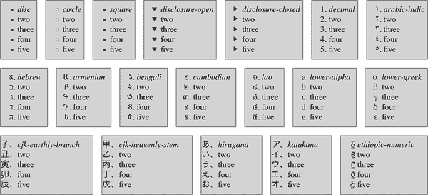

###### 图 16-1\. 几种列表样式类型的示例

这些关键字（以及一些特定于浏览器的额外内容）在此列出：

| `afar` † `amaric` †

`amaric-abegede` †

`arabic-indic`

`armenian`

`asterisks` †

`bengali`

`binary` †

`cambodian`

`circle`

`cjk-decimal` *

`cjk-earthly-branch`

`cjk-heavenly-stem`

`cjk-ideographic`

`decimal`

`decimal-leading-zero`

`devanagari`

`disc`

`disclosure-closed`

`disclosure-open`

`ethiopic` †

`ethiopic-abegede` †

`ethiopic-abegede-am-et` †

`ethiopic-abegede-gez` †

`ethiopic-abegede-ti-er` †

`ethiopic-abegede-ti-et` †

`埃塞俄比亚语-哈勒哈米` ‡， -

`埃塞俄比亚语-哈勒哈米-阿姆哈拉-厄` †

`埃塞俄比亚语-哈勒哈米-阿姆哈拉` †

`埃塞俄比亚语-哈勒哈米-阿姆哈拉` -

`埃塞俄比亚语-哈勒哈米-阿姆哈拉` †

`埃塞俄比亚语-哈勒哈米-盖兹` †

`埃塞俄比亚语-哈勒哈米-奥姆哈拉` †

| `埃塞俄比亚语-哈勒哈米-西达马` † `埃塞俄比亚语-哈勒哈米-索马利` †

`埃塞俄比亚语-哈勒哈米-提-厄` -

`埃塞俄比亚语-哈勒哈米-提格` †

`埃塞俄比亚语-哈勒哈米-提格` †

`埃塞俄比亚-数字符号`

`脚注` †

`格鲁吉亚`

`古吉拉特语`

`古尔穆克希`

`朝鲜文` -

`朝鲜文元音` -

`希伯来语`

`平假名`

`平假名-伊吕波`

`日语（正式）`

`日语（非正式）`

`卡纳达语`

`片假名`

`katakana-iroha`

`高棉语`

`朝鲜语-汉字（正式）`

`朝鲜语-汉字（正式）`

`朝鲜语-汉字（非正式）`

`老挝语`

`lower-alpha`

`小写亚美尼亚字母`

`小写希腊字母`

`小写十六进制` †

`小写拉丁字母`

`小写挪威文` †

`小写罗马字母`

`马拉雅拉姆`

| `蒙古文` `缅甸文`

`八进制` †

`奥里亚`

`奥罗莫` †

`波斯语`

`希达马`

`简体中文（正式）`

`简体中文（非正式）`

`索马里` †

`方形`

`符号` *

`泰米尔语` *

`泰卢固语`

`泰语`

`藏文`

`提格雷` †

`提格利尼亚语-厄` †

`提格利尼亚-厄利特阿贝吉德` †

`提格利尼亚语-厄利特` †

`提格利尼亚语-厄利特阿贝吉德` †

`繁体中文（正式）`

`繁体中文（非正式）`

`upper-alpha`

`upper-armenian`

`大写希腊字母`

`大写十六进制` †

`大写拉丁字母`

`大写挪威文` †

`大写罗马字母`

`乌尔都语` -

|

| † 仅限 WebKit |
| --- |
| ‡ 除了 WebKit 之外的所有引擎 * |
| * 仅限 Mozilla |
| - 在 Firefox 中需要 `-moz-` 前缀 |

如果您提供浏览器不识别的计数样式，例如声明 `list-style-type: lower-hexadecimal` 并加载页面，则一些浏览器（包括 Firefox、Edge 和 Chrome）将假定为 `decimal`。Safari 将忽略它不理解的值作为无效。

`list-style-type` 属性，以及所有其他与列表相关的属性，只能应用于具有 `display: list-item` 的元素，但 CSS 不区分有序和无序列表项。因此，您可以设置有序列表使用圆点而不是数字。实际上，`list-style-type` 的默认值是 `disc`，所以您可能会推断，没有明确声明的情况下，所有列表（有序或无序）都将使用圆点作为每个项目的标记。这是合乎逻辑的，但事实证明，这取决于用户代理。即使用户代理没有预定义的规则，如 `ol {list-style-type: decimal;}`，它可能会禁止有序标记应用于无序列表，反之亦然。您不能依赖于此，请小心。

如果您想完全隐藏标记的显示，应该使用 `none`。这个值会导致用户代理在标记通常出现的地方不放置任何东西，尽管它不会中断有序列表的计数。因此，以下标记会产生 图 16-2 中显示的结果：

```
ol li {list-style-type: decimal;}
li.off {list-style-type: none;}
```

```
<ol>
<li>Item the first
<li class="off">Item the second
<li>Item the third
<li class="off">Item the fourth
<li>Item the fifth
</ol>
```

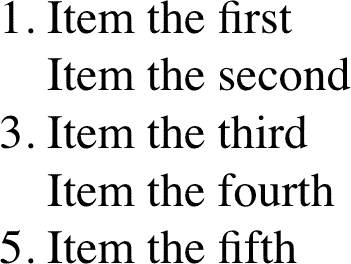

###### 图 16-2\. 关闭列表项标记

`list-style-type`属性是继承的，因此如果你想在嵌套列表中使用不同样式的标记，你可能需要单独定义它们。你可能还需要显式地为嵌套列表声明样式，因为用户代理的样式表可能已经定义了这些。例如，假设用户代理已定义以下样式：

```
ul {list-style-type: disc;}
ul ul {list-style-type: circle;}
ul ul ul {list-style-type: square;}
```

如果情况确实如此——这种情况或类似情况很可能会出现——你将不得不声明自己的样式以覆盖用户代理的样式。继承将不足以应对。

### 字符标记

CSS 还允许作者提供字符串值作为列表标记。这打开了从键盘输入的任何内容的可能性，只要你不介意在列表中的每个标记使用相同的字符串。图 16-3 展示了以下样式的结果：

```
.list01 {list-style-type: "%";}
.list02 {list-style-type: "Hi! ";}
.list03 {list-style-type: "†";}
.list04 {list-style-type: "⌘";}
.list05 {list-style-type: "";}

```

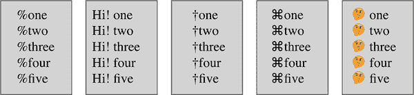

###### 图 16-3。字符串标记的示例

## 列表项图像

有时普通文本标记可能不够用。你可能更喜欢为每个标记使用图像，这可以通过`list-style-image`属性实现。

它是如何工作的：

```
ul li {list-style-image: url(ohio.gif);}
```

是的，就是这么简单。一个简单的`url()`值，你就可以将图像用作标记，正如你在图 16-4 中所看到的。

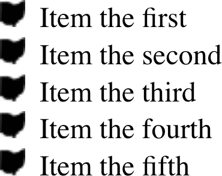

###### 图 16-4。使用图像作为标记

列表图像标记以其完整尺寸显示，因此在选择图像时要小心，正如图 16-5 所示的示例清楚地表明了其超大尺寸的标记：

```
ul li {list-style-image: url(big-ohio.gif);}
```

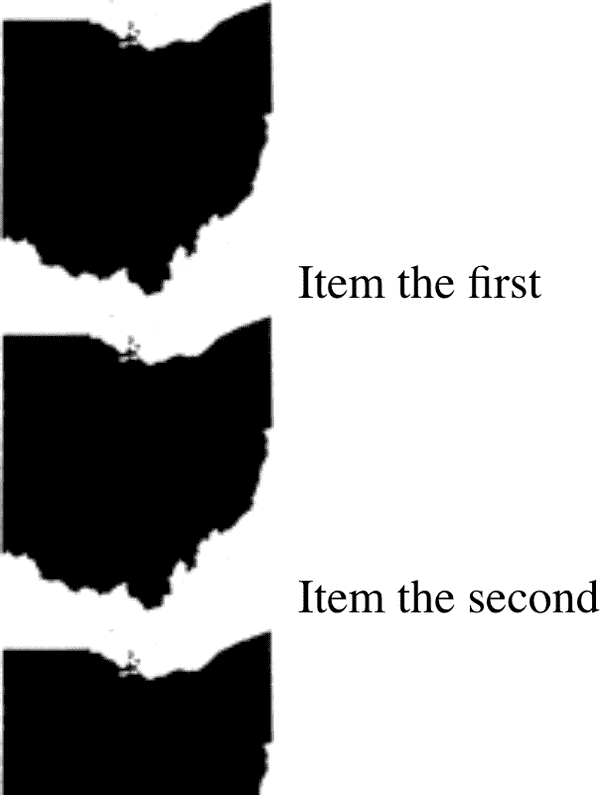

###### 图 16-5。使用超大图像作为标记

通常最好提供一个备用的标记类型，以防你的图像不加载、损坏或者是一些用户代理不能显示的格式。通过为列表定义一个备用的`list-style-type`来实现这一点：

```
ul li {list-style-image: url(ohio.png); list-style-type: square;}
```

你还可以通过将`list-style-image`设置为默认值`none`来使用它。这是一个好的做法，因为`list-style-image`是继承的，所以任何嵌套列表将会继承该图像作为标记，除非你阻止这种情况发生：

```
ul {list-style-image: url(ohio.gif); list-style-type: square;}
ul ul {list-style-image: none;}
```

由于嵌套列表继承了项目类型为`square`，但已设置为不使用图像作为其标记，因此在嵌套列表中使用方块作为标记，正如图 16-6 中所示。

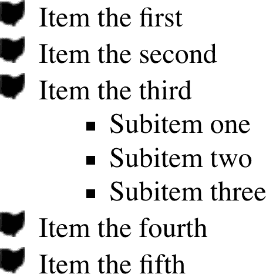

###### 图 16-6。关闭子列表中的图像标记

`list-style-image`允许任何图像值，包括渐变图像。因此，以下样式将产生类似于图 16-7 所示的结果：

```
.list01 {list-style-image:
    radial-gradient(closest-side,
        orange, orange 60%, blue 60%, blue 95%, transparent);}
.list02 {list-style-image:
    linear-gradient(45deg, red, red 50%, orange 50%, orange);}
.list03 {list-style-image:
    repeating-linear-gradient(-45deg, red, red 1px, yellow 1px, yellow 3px);}
.list04 {list-style-image:
    radial-gradient(farthest-side at bottom right,
        lightblue, lightblue 50%, violet, indigo, blue, green,
        yellow, orange, red, lightblue);}
```

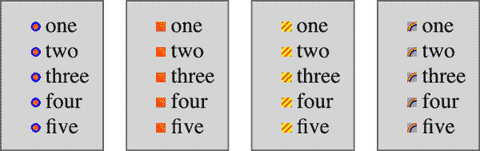

###### 图 16-7。渐变列表标记

渐变标记有一个缺点：它们往往非常小。这可能受到诸如字体大小之类的因素的影响，因为标记的大小往往随列表项内容的缩放而变化。如果你需要完全控制标记的渲染方式，不要使用`::marker`；而是使用`::before`。

###### 注意

直接样式化列表标记的方法是使用伪元素`::marker`，本章稍后将详细讨论。

## 列表标记位置

还有另一件事可以改变列表项的外观：决定标记是出现在列表项内容的外部还是内部。这可以通过`list-style-position`来实现。

如果标记的位置设置为`outside`（默认值），它将以网页开始时列表项的方式显示。如果您希望外观略有不同，可以通过将`list-style-position`的值设置为`inside`来将标记拉向内容。这将导致标记位于列表项内容的“内部”。确切的方式未定义，但图 16-8 展示了一种可能性：

```
li.first {list-style-position: inside;}
li.second {list-style-position: outside;}
```

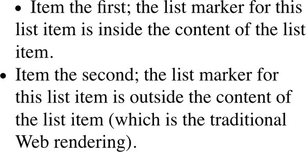

###### 图 16-8\. 将标记放置在列表项内部和外部

在实践中，给定`inside`位置的标记被视为插入到列表项内容开头的内联元素。这并不意味着标记*是*内联元素。除非您将所有其他内容包装在像`<span>`这样的元素中，或者直接（但对允许的属性有严格限制）通过使用`::marker`直接处理它们，否则您无法与元素的其他内容单独样式化它们。只是在布局术语上，它们表现得像这样。

## 缩写的列表样式

为了简洁起见，您可以将这三个`list-style`属性合并为一个便捷的单一属性：`list-style`。

例如：

```
li {list-style: url(ohio.gif) square inside;}
```

如图 16-9 所示，所有三个值可以同时应用于列表项。

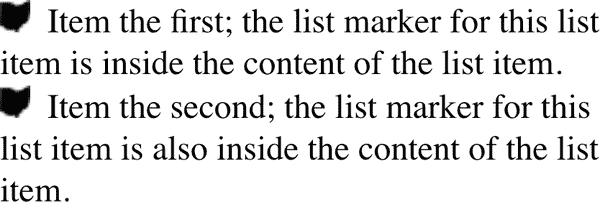

###### 图 16-9\. 将一切汇总

`list-style`的值可以按任意顺序列出，也可以省略任何一个。只要有一个存在，其余的将填充它们的默认值。例如，以下两条规则将有相同的视觉效果：

```
li.norm {list-style: url(img42.gif);}
li.odd {list-style: url(img42.gif) disc outside;} /* the same thing */
```

它们还将覆盖任何先前的规则。例如：

```
li {list-style-type: square;}
li {list-style: url(img42.gif);}
li {list-style: url(img42.gif) disc outside;} /* the same thing */
```

结果将与图 16-9 中的结果相同，因为隐含的`list-style-type`值`disc`将覆盖先前声明的`square`值，就像显式值`disc`在第二条规则中覆盖它一样。

## 列表布局

现在我们已经了解了样式化列表标记的基础知识，让我们来考虑在各种浏览器中如何布局列表。我们将从一组三个没有任何标记且尚未放置在列表中的列表项开始，如图 16-10 所示。

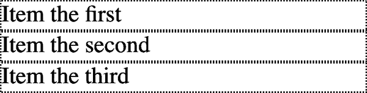

###### 图 16-10\. 三个列表项

列表项周围的边框显示它们本质上类似于块级元素。事实上，值`list-item`被定义为生成块级盒子。现在让我们添加标记，如图 16-11 所示。

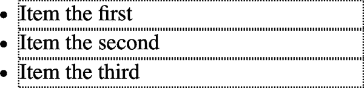

###### 图 16-11\. 添加了标记

标记与列表项内容之间的距离未由 CSS 定义，而 CSS 目前还没有提供直接影响该距离的方法。

当标记位于列表项内容外部时，它们不会影响其他元素的布局，甚至不会真正影响列表项本身的布局。它们只是距离内容边缘一定距离悬挂，无论内容边缘去哪里，标记都会跟随。标记的行为很像标记在相对于列表项内容绝对定位的情况下，类似于`position: absolute; left: -1.5em;`。当标记在内部时，它就像一个内联元素位于内容开头。

到目前为止，我们尚未添加实际的列表容器；图示中既没有`<ul>`也没有`<ol>`元素。我们可以将它们加入到混合中，如图 16-12 所示（用虚线边框表示）。

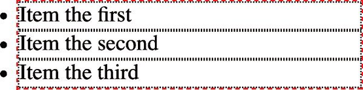

###### 图 16-12\. 添加列表边框

与列表项一样，无序列表元素生成一个块级框，包含其后代元素。如图 16-12 所示，标记不仅放置在列表项内容外部，也放置在无序列表元素的内容区域外。您期望从列表中看到的常规“缩进”尚未指定。

大多数浏览器，在本文写作时，通过设置包含列表元素的填充或边距来缩进列表项。例如，用户代理可能会应用如下规则：

```
ul, ol {margin-inline-start: 40px;}
```

大多数浏览器使用类似以下规则：

```
ul, ol {padding-inline-start: 40px;}
```

两种方法都没有错，但由于浏览器可以且已经改变了它们缩进列表内容的方式，我们建议在试图消除列表项缩进时同时包含这两个属性的值。图 16-13 比较了这两种方法。

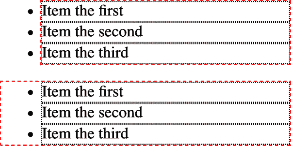

###### 图 16-13\. 边距和填充作为缩进设备

###### 提示

距离`40px`是早期 Web 浏览器的遗留物，它们通过像素量来缩进列表（块引用也是以相同距离缩进的）。一个很好的替代值可能是`2.5em`，它会随文本大小的变化而缩放，并且在默认字体大小为 16 像素时也等于`40px`。

对于希望更改列表缩进距离的作者，我们强烈建议同时指定填充和边距，以确保跨浏览器的兼容性。例如，如果您想使用填充来缩进列表，请使用以下规则：

```
ul {margin-inline-start: 0; padding-inline-start: 1em;}
```

如果您更喜欢使用边距，可以这样写：

```
ul {margin-inline-start: 1em; padding-inline-start: 0;}
```

无论哪种情况，记住标记将相对于列表项的内容放置，因此可能“悬挂”在文档的主文本之外，甚至超出浏览器窗口的边缘。如果使用非常大的图像或长文本字符串作为列表标记，这最容易观察，如在图 16-14 中所示。

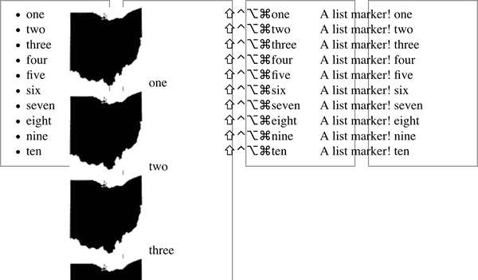

###### 图 16-14\. 大标记和列表布局

## `::marker`伪元素

许多作者要求的一个功能是能够控制标记和列表项内容之间的空间，或者独立于列表项内容更改列表标记的大小或颜色。

列表标记可以在一定程度上用伪元素`::marker`进行样式设置。截至 2022 年底，`::marker`规则允许的属性如下：

+   `content`

+   `color`

+   `text-combine-upright`

+   `unicode-bidi`

+   `direction`

+   `white-space`

+   所有的`font-*`属性

+   所有的过渡和动画属性

您可能已经注意到，没有包括任何元素大小或其他盒模型属性，例如边距，这对于许多作者希望的标记样式构成了阻碍。未来可能会添加更多属性，但目前只有这些。

几个标记样式的示例，如在图 16-15 中声明的：

```
li:nth-child(1)::marker {color: gray;}
li:nth-child(2)::marker {font-size: 2em;}
li:nth-child(3)::marker {font-style: italic;}
```

```
<ol>
	<li>List item the first</li>
	<li>The second list item</li>
	<li>List Items With a Vengeance</li>
</ol>

<ul>
	<li>List item the first</li>
	<li>The second list item</li>
	<li>List Items With a Vengeance</li>
</ul>
```

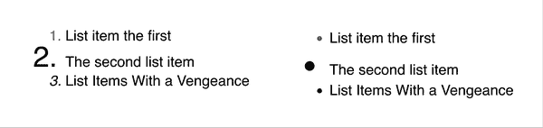

###### 图 16-15\. 标记样式示例

请注意，对于本列表的有序和无序版本，倍增标记字体大小的结果不同。这归结于两种标记类型的不同默认大小和放置方式。正如前面所述，您对标记的控制程度有限，即使使用`content`定义了标记。因此，当您绝对需要完全创意自由时，通常最好使用生成内容或标记的内联内容来构建自己的标记。

# 创建生成的内容

CSS 定义了创建*生成内容*的方法。这是通过 CSS 插入的内容，但不由标记或内容表示。

例如，列表标记是生成的内容。列表项的标记没有直接在标记中表示，作者无需将标记写入文档内容中。浏览器会自动生成适当的标记。对于无序列表，标记将具有某种符号，如圆圈、圆盘或方形。对于有序列表，默认情况下，标记是一个按顺序递增的计数器，每个连续的列表项递增一次。（或者，正如您在前几节中看到的那样，您可以用图像或符号替换任一种类—正如您稍后将看到的，任何由`content`属性支持的内容。）

要了解如何影响列表标记并自定义有序列表的计数（或其他任何内容！），您必须首先查看更基本的生成内容。

## 插入生成的内容

要将生成的内容插入文档中，请使用 `::before` 和 `::after` 伪元素。通过 `content` 属性（在下一节中描述），这些伪元素可以在元素的内容之前或之后放置生成的内容。

例如，你可能希望在每个超链接前面加上文本“(link)”以便在打印页面时标记它们。可以通过媒体查询和以下规则来实现这一效果，如 图 16-16 所示：

```
@media print{
	a[href]::before {content: "(link)";}
}
```

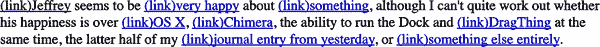

###### 图 16-16\. 生成文本内容

注意生成的内容和元素内容之间没有空格。这是因为前面例子中的 `content` 的值不包括空格。可以修改声明如下以确保生成和实际内容之间有空格：

```
a[href]::before {content: "(link) ";}
```

这是一个小差异，但是一个重要的差异。

类似地，你可能选择在 PDF 文档链接的末尾插入一个小图标。实现这一效果的规则会类似于这样：

```
a.pdf-doc::after {content: url(pdf-doc-icon.gif);}
```

假设你想通过给这些链接周围加上边框来进一步样式化它们。这可以通过第二条规则来完成，如 图 16-17 所示：

```
a.pdf-doc {border: 1px solid gray;}
```

```
<<generated-content-icons>> shows the result of these two rules.
```

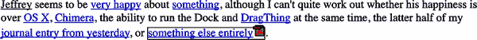

###### 图 16-17\. 生成图标

注意链接边框围绕生成的内容扩展，就像链接下划线围绕 图 16-16 中的“(link)”文本一样。这是因为默认情况下，生成的内容被放置在元素的元素框内（除非生成的内容是列表标记）。

你可以浮动或定位生成的内容到其父元素框之外。可以给生成的内容的所有 `display` 值，可以将块格式应用于内联框的生成内容，反之亦然。例如，考虑这个例子：

```
em::after {content: " (!) "; display: block;}
```

即使 `em` 是内联元素，生成的内容也会生成一个块级盒子。同样地，给定以下代码，生成的内容将变成块级而不是保持默认的 `inline`：

```
h1::before {content: "New Section"; display: block; color: gray;}
```

图 16-18 展示了结果。


###### 图 16-18\. 生成块级内容

生成内容的一个有趣的方面是它继承来自其附加到的元素的值。因此，给定以下规则，生成的文本将是绿色的，与段落内容相同：

```
p {color: green;}
p::before {content: "::: ";}
```

如果你想生成的文本是紫色的，只需一个简单的声明即可：

```
p::before {content: "::: "; color: purple;}
```

当然，这种值的继承只发生在继承属性中。这点值得注意，因为它影响了处理某些效果的方式。考虑以下情况：

```
h1 {border-top: 3px solid black; padding-top: 0.25em;}
h1::before {content: "New Section"; display: block; color: gray;
  border-bottom: 1px dotted black; margin-bottom: 0.5em;}
```

由于生成的内容被放置在 `<h1>` 元素的元素框内，它将被放置在元素顶部边框下方。它还会被放置在任何填充内，如 图 16-19 所示。

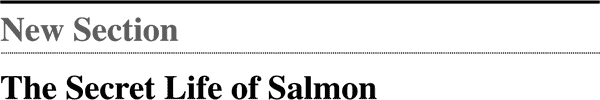

###### 图 16-19\. 考虑放置位置

已被设置为块级的生成内容的底部边距将通过半个 em 向下推动元素的实际内容。在这个例子中，生成的内容的效果是将`<h1>`元素分成两部分：生成内容框和实际内容框。这是因为生成的内容具有`display: block`。如果您将其更改为`display: inline`（或完全删除`display:block;`），效果将如图 16-20 所示：

```
h1 {border-top: 3px solid black; padding-top: 0.25em;}
h1::before {content: "New Section"; display: inline; color: gray;
  border-bottom: 1px dotted black; margin-bottom: 0.5em;}
```


###### 图 16-20\. 将生成内容更改为内联

注意边框的放置方式以及顶部填充仍然受到尊重。所生成内容的底部边距也受到尊重，但由于生成的内容现在是内联的，边距不影响行高，因此边距没有可见效果。

基本生成内容的介绍完成后，让我们更仔细地看一下如何指定实际生成的内容。

## 指定内容

如果要生成内容，您需要一种描述它的方法。正如您已经看到的，这是通过`content`属性处理的，但是这个属性比您迄今所见到的要复杂得多。

您已经在操作中看到了字符串和 URI 值，本章稍后会涵盖计数器。在我们查看`attr()`和引号值之前，让我们稍微详细讨论一下字符串和 URI。

字符串值是按照字面方式呈现的，即使它们包含本质上应该是某种标记的内容。因此，下面的规则将被直接插入到文档中，如图 16-21 所示：

```
h2::before {content: "<em>&para;</em> "; color: gray;}
```


###### 图 16-21\. 字符串会原样显示

这意味着，如果您希望换行（回车）作为生成内容的一部分，您不能使用`<br>`。而是使用字符串`\A`或`\00000a`，这是表示换行的 CSS 方式（基于 Unicode 换行字符，其十六进制位置为`A`）。相反，如果您有一个长字符串值并需要将其分成多行，则使用`\`字符转义换行符。以下规则示例演示了这两者，并在图 16-22 中进行了说明：

```
h2::before {content: "We insert this text before all H2 elements because \
it is a good idea to show how these things work. It may be a bit long \
but the point should be clearly made.  "; color: gray;}
```

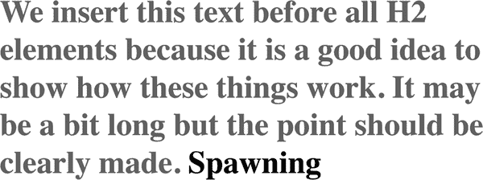

###### 图 16-22\. 插入和抑制换行符

您还可以使用转义来引用十六进制 Unicode 值，例如`\00AB`。

###### 警告

到目前为止，在插入转义内容（如`\279c`）方面得到了很好的支持，但是某些浏览器不支持转义换行符`\A`或`\0000a`，且没有浏览器支持`\A`，除非在其后添加空格。

使用 URI 值，可以指向外部资源（例如图像、电影、声音剪辑或用户代理支持的任何其他内容），然后将其插入到文档的适当位置。如果用户代理因任何原因无法支持您指向的资源（例如，尝试在打印文档时插入电影），则用户代理必须完全忽略该资源，不会插入任何内容。

### 插入属性值

有时您可能希望获取元素属性的值并使其成为文档显示的一部分。举个简单的例子，您可以将每个链接的 `href` 属性的值立即放在链接后面，如下所示：

```
a[href]::after {content: attr(href);}
```

此操作可能导致生成的内容直接与实际内容相撞。为解决此问题，可以在声明中添加一些字符串值，其结果如 图 16-23 所示：

```
a[href]::after {content: " [" attr(href) "]";}
```

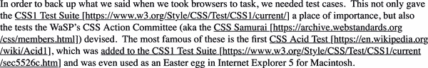

###### 图 16-23\. 插入 URL

例如，这对打印样式表非常有用。可以插入任何属性值作为生成的内容：`alt` 文本、`class` 或 `id` 值等。作者可以选择使引用信息对块引用明确化，如下所示：

```
blockquote::after {content: "(" attr(cite) ")"; display: block;
  text-align: right; font-style: italic;}
```

对于其他复杂的规则，可能会显示传统文档的文本和链接颜色值：

```
body::before {
  content: "Text: " attr(text) " | Link: " attr(link)
  " | Visited: " attr(vlink) " | Active: " attr(alink);
  display: block; padding: 0.33em;
  border: 1px solid; text-align: center; color: red;}
```

请注意，如果属性不存在，则会放置一个空字符串。这在 图 16-24 中有所体现，该示例应用于一个 `body` 元素没有 `alink` 属性的文档。

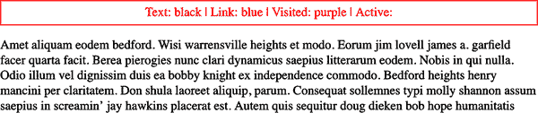

###### 图 16-24\. 跳过缺失的属性

文本 “Active: ”（包括尾随空格）被插入到文档中，正如您所见，但后面没有内容跟随。当您希望仅在存在属性时插入属性值时，这非常方便。

###### 警告

CSS 定义属性引用的返回值为未解析字符串。因此，如果属性值包含标记或字符实体，它们将按原样显示。

### 使用生成的引号

生成内容的一个专门形式是引号，CSS 提供了一种强大的方式来管理引号及其嵌套行为。这是可能的，因为可以像 `open-quote` 和 `quotes` 属性一样对内容值进行配对。

除了关键字 `none` 和 `inherit` 外，唯一有效的值是一个或多个*字符串对*，每对中的第一个值是 `open-quote` 的值，第二个值是 `close-quote` 的值。因此，在以下两个声明中，只有第一个是有效的：

```
quotes: '"' "'";  /* valid */
quotes: '"';  /* NOT VALID */
```

第一个规则还说明了在字符串周围放置字符串引号的一种方法。双引号由单引号包围，反之亦然。

让我们看一个简单的例子。假设您正在创建一个用于存储喜爱引用的 XML 格式。以下是列表中的一个条目：

```
<quotation>
  <quote>I hate quotations.</quote>
  <quotee>Ralph Waldo Emerson</quotee>
</quotation>
```

为了以有用的方式呈现数据，您可以使用以下规则，并显示结果如 图 16-25 所示：

```
quotation {display: block;}
quote {quotes: '“' '”';}
quote::before {content: open-quote;}
quote::after {content: close-quote;}
quotee::before {content: " (";}
quotee::after {content: ")";}
```

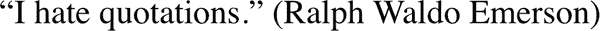

###### 图 16-25\. 插入引号和其他内容

值`open-quote`和`close-quote`用于插入适当的引号符号（因为不同语言有不同的引号）。它们使用引用的值来确定它们应该如何工作。因此，引号以双引号开始和结束。

使用`引号`可以定义引号模式，可以嵌套到任意深度。例如，在美国英语中，一个常见的做法是从双引号开始，然后在第一个引号内部使用单引号。可以通过以下规则使用*花括号*引号重现此操作：

```
quotation: display: block;}
quote {quotes: '\201C' '\201D' '\2018' '\2019';}
quote::before, q::before{content: open-quote;}
quote::after, q::after {content: close-quote;}
```

当应用于以下 XML 时，这些规则将产生 图 16-26 所示的效果：

```
<quotation>
 <quote> In the beginning, there was nothing. And God said: <q>Let there
  be light!</q> And there was still nothing, but you could see it.</quote>
</quotation>
```

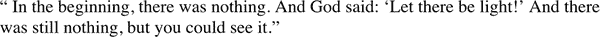

###### 图 16-26\. 嵌套的花括号引号

如果引号的嵌套级别大于定义的配对数，则深层级别将重复使用最后一个配对。因此，如果我们将以下规则应用于 图 16-26 中显示的标记，则内部引号将使用双引号，与外部引号相同：

```
quote {quotes: '\201C' '\201D';}
```

###### 提示

这些特定规则使用花括号引号符号的十六进制 Unicode 位置。如果您的 CSS 使用 UTF-8 字符编码（实际上应该如此），则可以跳过转义的十六进制位置方法，直接包含花括号引号字符，就像前面的示例一样。

生成的引号使得另一种常见的排版效果成为可能。当引用文本跨越多个段落时，通常省略每个段落的`close-quote`；仅显示开头的引号标记，除了最后一个段落。可以使用`no-close-quote`值重现此效果：

```
blockquote {quotes: '"' '"' "'" "'" '"' '"';}
blockquote p::before {content: open-quote;}
blockquote p::after {content: no-close-quote;}
blockquote p:last-of-type::after {content: close-quote;}
```

这将使每个段落以双引号开头，但没有结束标记。对于最后一个段落也是如此，因此前一个代码块的第四行在最后一个段落的末尾插入了闭合引号。

此值很重要，因为它减少了引号的嵌套级别而不生成符号。这就是为什么每个段落都以双引号开头，而不是在第三段落之前交替使用双引号和单引号。`no-close-quote`值在每个段落结束时关闭引用嵌套，因此每个段落都以相同的嵌套级别开头。

这很重要，因为 CSS2.1 规范指出：“引用深度与源文档的嵌套或格式结构无关。”换句话说，当您开始一个引用级别时，它在元素之间保持，直到遇到`close-quote`，引用嵌套级别将递减。

为了完整起见，还有一个`no-open-quote`关键字，其对称地与`no-close-quote`具有相同的效果。此关键字将引用嵌套级别增加一级，但不生成符号。

## 定义计数器

即使您没有意识到，您可能也熟悉计数器；例如，有序列表中的列表项标记即为计数器。两个属性和两个`content`值几乎可以定义任何计数格式，包括使用多种样式的子节计数器，例如“VII.2.c”。

### 重置和递增

我们通过设置计数器的起始点然后按指定数量增加来创建计数器。前者由属性`counter-reset`处理。

*计数器标识符*只是作者创建的标签。例如，您可能会将子节计数器命名为`subsection`、`subsec`、`ss`或`bob`。仅仅通过重置（或增加）一个标识符就足以将其调用出来。在以下规则中，计数器`chapter`被定义为其被重置的方式：

```
h1 {counter-reset: chapter;}
```

默认情况下，计数器被重置为 0。如果您想重置为不同的数字，可以在标识符后声明该数字：

```
h1#ch4 {counter-reset: chapter 4;}
```

您还可以通过列出空格分隔的标识符-整数对一次性重置多个标识符。如果省略整数，则默认为 0：

```
h1 {counter-reset: chapter 4 section -1 subsec figure 1;}
   /* 'subsec' is reset to 0 */
```

如前例所示，可以使用负值。将计数器设置为`-32768`并从那里开始计数是完全合法的。

###### 警告

CSS 未定义用户代理在非数字计数样式中处理负计数值的行为。例如，如果计数器的值为`-5`，但其显示样式为`upper-alpha`，则没有定义的行为。

要进行计数，您需要一个属性来指示元素增加或减少计数器。否则，计数器将保持`counter-reset`声明给定的任何值。相关属性是`counter-increment`。

与`counter-reset`类似，`counter-increment`接受标识符-整数对，这些对中的整数部分可以是 0 或负数，也可以是正数。区别在于，如果从对中省略整数，它默认为 1，而不是 0。

作为示例，这是用户代理如何定义计数器以重新创建有序列表的传统计数方式 1、2、3 的方式：

```
ol {counter-reset: ordered;}  /* defaults to 0 */
ol li {counter-increment: ordered;}  /* defaults to 1 */
```

另一方面，作者可能希望从 0 开始倒数，以便列表项使用上升负数系统。这只需要进行小修改：

```
ol {counter-reset: ordered;}  /* defaults to 0 */
ol li {counter-increment: ordered -1;}
```

列表的计数将会是 -1、-2、-3 等。如果用整数 `-1` 替换 `-2`，列表将会是 -2、-4、-6 等。

### 显示计数器

要显示计数器，你需要在`content`属性中与计数器相关的值结合使用。为了演示其工作原理，让我们使用基于 XML 的有序列表：

```
<list type="ordered">
 <item>First item</item>
 <item>Item two</item>
 <item>The third item</item>
</list>
```

通过将以下规则应用于使用此结构的 XML，你将获得图 16-27 中显示的结果：

```
list[type="ordered"] {counter-reset: ordered;}  /* defaults to 0 */
list[type="ordered"] item {display: block;}
list[type="ordered"] item::before {counter-increment: ordered;
     content: counter(ordered) ". "; margin: 0.25em 0;}
```

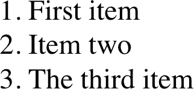

###### 图 16-27\. 项目计数

生成的内容被放置在关联元素的内联内容之前。因此，效果类似于声明了`list-style-position: inside;`的 HTML 列表。

`<item>` 元素是生成块级框的普通元素，这意味着计数器不仅限于具有`display: list-item`的元素。事实上，任何元素都可以使用计数器。考虑以下规则：

```
h1 {counter-reset: section subsec;
    counter-increment: chapter;}
h1::before {content: counter(chapter) ". ";}
h2 {counter-reset: subsec;
    counter-increment: section;}
h2::before {content: counter(chapter )"." counter(section) ". ";}
h3 {counter-increment: subsec;}
h3::before {content: counter(chapter) "." counter(section) "."
        counter(subsec) ". ";}
```

这些规则将产生图 16-28 所示的效果。

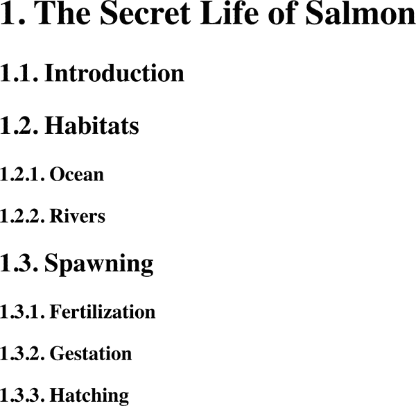

###### 图 16-28\. 将计数器添加到标题

图 16-28 展示了关于计数器重置和增加的一些重要点。例如，请注意计数器在元素上重置，而实际生成内容的计数器是通过`::before`伪元素插入的。试图在伪元素中重置计数器是行不通的：你会得到很多零。

还要注意，`<h1>` 元素使用了默认为 0 的计数器 `chapter`，并在元素文本之前加上了“1.”。当一个计数器被同一个元素递增并使用时，递增会在计数器显示之前发生。类似地，如果一个计数器被重置并在同一个元素中显示，则重置会在计数器显示之前发生。考虑以下内容：

```
h1::before, h2::before, h3::before {
  content: counter(chapter) "." counter(section) "." counter(subsec) ". ";}
h1 {counter-reset: section subsec;
  counter-increment: chapter;}
```

文档中第一个 `<h1>` 元素会在文本“1.0.0.”之前显示，因为计数器 `section` 和 `subsec` 被重置但没有被递增。因此，如果你希望递增计数器的第一个显示实例为 0，你需要将该计数器重置为 `-1`，如下所示：

```
body {counter-reset: chapter -1;}
h1::before {counter-increment: chapter; content: counter(chapter) ". ";}
```

你可以使用计数器做一些有趣的事情。考虑以下 XML：

```
<code type="BASIC">
  <line>PRINT "Hello world!"</line>
  <line>REM This is what the kids are calling a "comment"</line>
  <line>GOTO 10</line>
</code>
```

你可以使用以下规则重新创建 BASIC 程序列表的传统格式：

```
code[type="BASIC"] {counter-reset: linenum; font-family: monospace;}
code[type="BASIC"] line {display: block;}
code[type="BASIC"] line::before {counter-increment: linenum 10;
  content: counter(linenum) ": ";}
```

你也可以在`counter()`格式的一部分定义每个计数器的列表样式。你可以在计数器标识符后添加逗号分隔的`list-style-type`关键字来实现这一点。标题计数器示例的以下修改在图 16-29 中有所体现：

```
h1 {counter-reset: section subsec;
    counter-increment: chapter;}
h1::before {content: counter(chapter,upper-alpha) ". ";}
h2 {counter-reset: subsec;
    counter-increment: section;}
h2::before {content: counter(chapter,upper-alpha)"." counter(section) ". ";}
h3 {counter-increment: subsec;}
h3::before {content: counter(chapter,upper-alpha) "." counter(section) "."
        counter(subsec,lower-roman) ". ";}
```

请注意，计数器 `section` 没有给定样式关键字，因此默认为十进制计数样式。如果你希望，你甚至可以设置计数器使用`disc`、`circle`、`square`和`none`样式，尽管这些计数器的每个实例都将是你指定的符号的单一副本。

有一个有趣的点需要注意，具有`display`为`none`的元素不会递增计数器，即使规则似乎表明了另外一种情况。相反，具有`visibility`为`hidden`的元素确实会递增计数器：

```
.suppress {counter-increment: cntr; display: none;}
  /* 'cntr' is NOT incremented */
.invisible {counter-increment: cntr; visibility: hidden;}
  /* 'cntr' IS incremented */
```

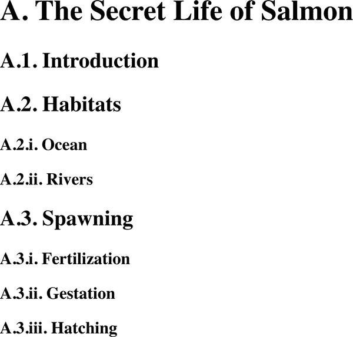

###### 图 16-29\. 更改计数器样式

### 计数器和作用域

到目前为止，您已经看到如何将多个计数器串联在一起，以创建章节和子章节计数。通常，这也是作者希望对嵌套有序列表进行的操作，但是试图创建足够的计数器以涵盖深层嵌套级别会很快变得笨拙。仅仅是为了使计数器在五级深度嵌套列表中工作，就需要像这样的一堆规则：

```
ol ol ol ol ol li::before {
    counter-increment: ord1 ord2 ord3 ord4 ord5;
    content: counter(ord1) "." counter(ord2) "." counter(ord3) "."
        counter(ord4) "." counter(ord5) ".";}
```

想象一下，写足够的规则来涵盖最多 50 级嵌套！（我们并不是说您应该将有序列表嵌套到 50 层深。暂时跟随我们的思路。）

幸运的是，CSS 2.1 在涉及计数器时描述了*作用域*的概念。简单来说，每个嵌套级别都为任何给定的计数器创建一个新的作用域。作用域是使以下规则能够以通常的 HTML 方式覆盖嵌套列表计数的原因：

```
ol {counter-reset: ordered;}
ol li::before {counter-increment: ordered; content: counter(ordered) ". ";}
```

所有这些规则将使有序列表（甚至是嵌套在其他列表中的列表）从 1 开始计数，并逐项递增—这正是从 HTML 开始就一直做的方式。

这有效的原因是在每个嵌套级别都创建了`ordered`计数器的新实例。因此，对于第一个有序列表，创建了`ordered`的一个实例。然后，对于嵌套在第一个列表中的每个列表，都会创建另一个新实例，并且每个列表的计数从头开始。

然而，假设您希望有序列表的计数方式是每个嵌套级别都创建一个新的计数器附加到旧的计数器上：1、1.1、1.2、1.2.1、1.2.2、1.3、2、2.1，等等。这不能通过`counter()`完成，但是可以通过`counters()`完成。一个“s”能带来多大的不同啊。

要创建图 16-30 中显示的嵌套计数器样式，您需要这些规则：

```
ol {counter-reset: ordered; list-style: none;}
ol li:before {content: counters(ordered,".") ": "; counter-increment: ordered;}
```

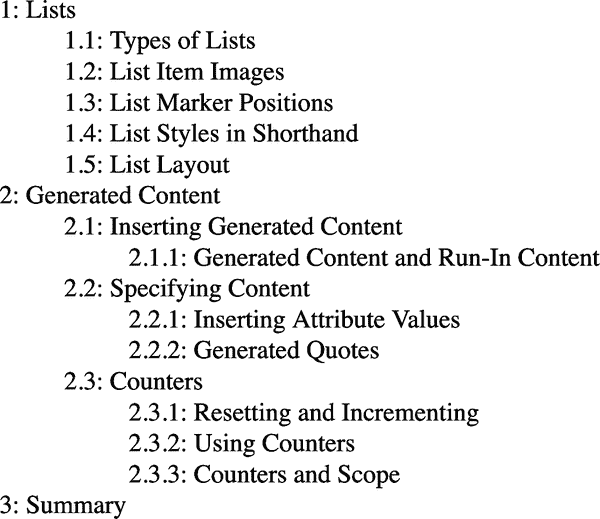

###### 图 16-30\. 嵌套计数器

基本上，关键字`counters(ordered,".")`显示来自每个作用域的`ordered`计数器，并在其后附加一个句点，然后将给定元素的所有作用域计数器串在一起。因此，第三级嵌套列表中的项目将以最外层列表的`ordered`值作为前缀，外层和当前列表之间列表的作用域，以及当前列表的作用域，每个作用域后面都跟着一个句点。`content`值的其余部分导致所有这些计数器之后添加一个空格、冒号和空格。

与`counter()`一样，您可以为嵌套计数器定义列表样式，但是相同的样式适用于所有计数器。因此，如果您将之前的 CSS 更改为以下内容，图 16-30 中的列表项将使用小写字母而不是数字来进行计数：

```
ol li::before {counter-increment: ordered;
    content: counters(ordered,".",lower-alpha) ": ";}
```

您可能已经注意到，在前面的示例中，`<ol>` 元素上应用了 `list-style: none`。这是因为插入的计数器是生成的内容，而不是替换列表标记。换句话说，如果省略了 `list-style: none`，每个列表项将具有其用户代理提供的列表计数器，*加上* 我们定义的生成内容计数器。

这种能力非常有用，但有时您确实只想重新定义标记本身。这就是计数模式的作用。

# 定义计数模式

如果你想深入了解简单的嵌套计数，也许是定义基于 60 进制计数或使用符号模式，CSS 提供了一种几乎可以想象的定义任何计数模式的方法。你可以使用 `@counter-style` 块，并有专门的描述符来管理结果。一般的模式如下：

```
@counter-style <*`name`*> {
    …declarations…
}

```

在这里，`<*name*>` 是问题模式的作者提供的名称。例如，要创建一系列交替的三角形标记，块可能看起来像这样：

```
@counter-style triangles {
    system: cyclic;
    symbols: ▶ ▷;
}
ol {list-style: triangles;}
```

图 16-31 显示了结果。

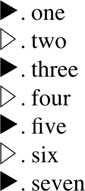

###### 图 16-31\. 一个简单的计数器模式

这里总结了几个可用的描述符。

我们将从简单系统开始，逐步提升复杂度，但首先，让我们看看两个最基本描述符的精确定义：`system` 和 `symbols`。

对于几乎所有的`@counter-style`块，这些是最基本的两个描述符。如果你定义的是一个`symbolic`系统，可以省略`system`，但通常最好包含它，这样你就清楚地了解你正在设置的系统类型。记住，下一个工作在样式上的人可能不像你那么熟悉计数器样式！

## 固定计数模式

最简单的计数器模式是一个 `fixed` 系统。当你希望定义一个精确的计数器标记序列，当标记用完后不重复时，就使用固定系统。考虑以下示例，其结果显示在 图 16-32 中：

```
@counter-style emoji {
    system: fixed;
    symbols:     ;
}
ol.emoji {list-style: emoji;}

```

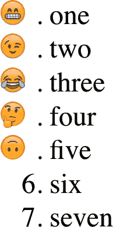

###### 图 16-32\. 一个固定的计数器模式

一旦列表超过第五个列表项，计数器系统就会用完表情符号，而且由于没有定义回退（我们马上会谈到这个），随后列表项的标记就会回退到有序列表的默认标记。

注意，`symbols` 描述符中的符号是用空格分隔的。如果它们都紧密排列在一起而没有空格分隔，你会得到类似于 图 16-33 中的结果。

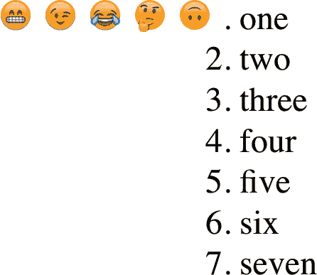

###### 图 16-33\. 当符号太接近时

这意味着你可以定义一个固定序列的标记，在这个序列中每个标记由多个符号组成。（如果你想定义一组符号，这些符号结合起来形成计数系统的模式，稍等：我们很快会讲到。）

如果你想在你的标记中使用 ASCII 符号，通常建议对它们进行引用。这可以避免解析器将尖括号误认为 HTML 的一部分而产生问题。因此，你可以做类似这样的事情：

```
@counter-style emoji {
    system: fixed;
    symbols: # $ % ">";
}
```

引用所有符号是可以接受的，而且养成这个习惯可能是个好主意。这意味着更多的打字——前面的值将变成`"#", "$", "%", ">"`——但是更少出错。

在固定计数系统中，你可以在`system`描述符本身定义一个起始值。例如，如果你想从 5 开始计数，你可以这样写：

```
@counter-style emoji {
    system: fixed 5;
    symbols:     ;
}
ul.emoji {list-style: emoji;}

```

在这种情况下，前五个符号表示计数器 5 到 9。

###### 注

此功能仅在固定计数系统中可用。

## 循环计数模式

超越固定模式的下一个步骤是`cyclic`模式，这是重复的固定模式。让我们将前一节中的固定表情符号模式转换为循环模式。这将得到图 16-34 中显示的结果：

```
@counter-style emojiverse {
    system: cyclic;
    symbols:     ;
}

ul.emoji {list-style: emojiverse;}

```

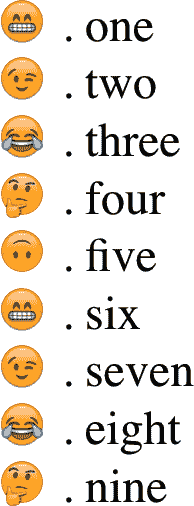

###### 图 16-34\. 循环计数模式

定义的符号按顺序重复使用，直到没有剩余的项目需要计数。

可以使用`cyclic`提供一个用于整个模式的单个标记，就像为`list-style-type`提供字符串一样。在这种情况下，它可能看起来像这样：

```
@counter-style thinker {
    system: cyclic;
    symbols: ;
    /* equivalent to list-style-type: ; */
}

ul.hmmm {list-style: thinker;}

```

你可能已经注意到，到目前为止，我们所有的计数器都跟着一个句点（或者如果你更喜欢的话，是一个句号）。这是由于`suffix`描述符的默认值，它有一个类似的描述符`prefix`。

通过这些描述符，你可以定义在模式中每个标记前后插入的符号。因此，我们可以给我们的思想家增加 ASCII“翅膀”，就像在图 16-35 中所示的那样：

```
@counter-style wingthinker {
    system: cyclic;
    symbols: ;
    prefix: "~";
    suffix: " ~";
}

ul.hmmm {list-style: wingthinker;}

```

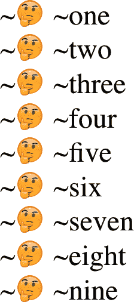

###### 图 16-35\. 给思想家加上“翅膀”

`suffix`描述符在想要移除标记的默认后缀时特别有用。以下是如何进行的一个示例：

```
@counter-style thisisfine {
    system: cyclic;
    symbols:   ;
    suffix: "";
}

```

你还可以通过使用`prefix`和`suffix`以创造性的方式扩展标记，就像在图 16-36 中所示的那样：

```
@counter-style thisisfine {
    system: cyclic;
    symbols:   ;
    prefix: "";
    suffix: "";
}

```

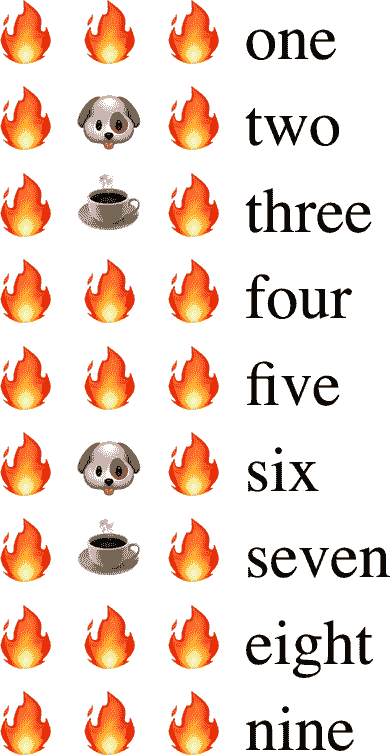

###### 图 16-36\. 这个列表很好

你可能会想知道为什么在这个例子中`prefix`值被引用，而`suffix`值却没有。除了演示两种方法都可行之外，没有其他理由。如前所述，引用符号更安全，但很少需要。

在这里的 CSS 示例和图形中显示的 Unicode 图标可能存在一些差异。这是使用表情符号和其他字符时无法避免的一个方面——在一个人的用户代理上显示的内容可能在另一个人的上面有所不同。请考虑 macOS、iOS、Android、Samsung、Windows 桌面、Windows 移动、Linux 等系统中表情符号渲染的差异。

您可以理论上使用图像作为计数器。例如，假设您想使用一系列克林贡字形，这些字形没有 Unicode 等价物。（长期以来的行业传言称克林贡语已包含在 Unicode 中。该提案于 1997 年提出并于 2001 年被拒绝。2016 年又提出了新的提案，再次被拒绝。）我们不会在这里代表整个符号集，但它会以以下方式开始：

```
@counter-style klingon-letters {
    system: cyclic;
    symbols: url(i/klingon-a.svg) url(i/klingon-b.svg)
        url(i/klingon-ch.svg) url(i/klingon-d.svg)
        url(i/klingon-e.svg) url(i/klingon-gh.svg);
    suffix: url(i/klingon-full-stop.svg);
}
```

这将循环从*A*到*GH*，然后重复，但仍然会得到一些克林贡符号，这可能已经足够了。我们将在本章后面看到如何建立字母和数字系统。

###### 警告

截至 2022 年底，对于任何类型的`<image>`作为计数符号的浏览器支持基本上不存在。

## 象征性计数模式

`象征性`计数系统类似于循环系统，但在象征性系统中，对于每次符号序列的重启，符号数量会增加一个。每个标记由一个重复出现的单个符号组成，该符号序列重复的次数。这可能与您熟悉的脚注符号或某些种类的字母系统类似。这里展示了每种类型的示例，结果显示在图 16-37 中：

```
@counter-style footnotes {
    system: symbolic;
    symbols: "*" "†" "§";
    suffix: ' ';
}
@counter-style letters {
    system: symbolic;
    symbols: A B C D E;
}
```

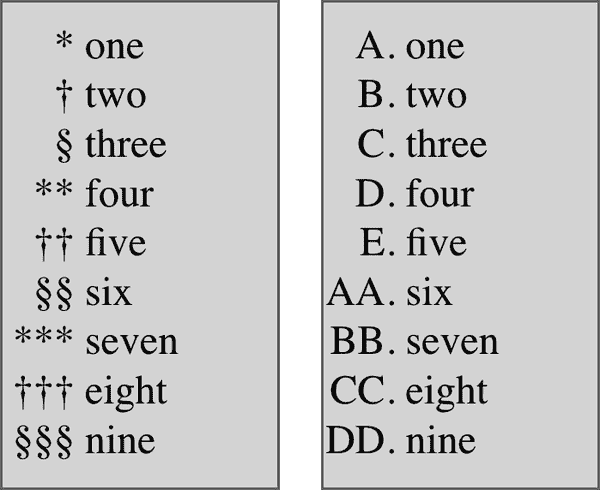

###### 图 16-37。两种象征性计数模式

要注意的一件事是，如果只有少数符号应用于非常长的列表，标记很快会变得非常长。请考虑前面示例中显示的字母计数器。图 16-38 显示了使用该系统的列表中第 135 至 150 个条目的样子。

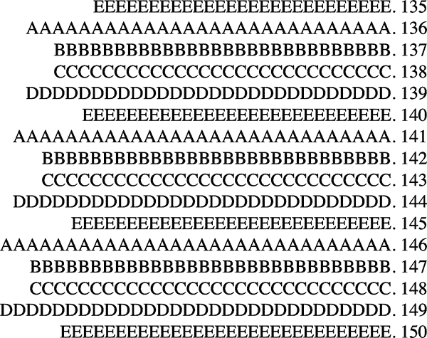

###### 图 16-38。非常长的象征性标记

从现在开始，这种考虑将变得更加重要，因为计数器样式在某种意义上都是累加的。为了限制您面临的这类问题，您可以使用`range`描述符。

使用`range`，您可以提供一个或多个用空格分隔的值对，每对值之间用逗号分隔。假设我们希望在三次迭代后停止字母加倍。我们有五个符号，因此我们可以将它们限制在前 15 个列表项中使用，如下所示，结果显示在图 16-39 中（为了保持图像的合理大小，已排列为两列）：

```
@counter-style letters {
    system: symbolic;
    symbols: A B C D E;
    range: 1 15;
}
```

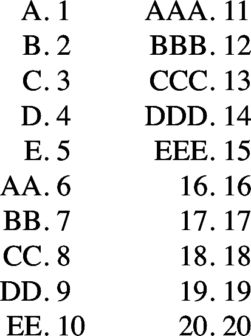

###### 图 16-39。使用`range`限制象征性计数器模式

如果有必要，无论出于什么原因，我们需要提供第二个计数器使用范围，它将如下所示：

```
@counter-style letters {
    system: symbolic;
    symbols: A B C D E;
    range: 1 15, 101 115;
}
```

由`letters`定义的象征性字母系统将适用于 1 至 15 以及 101 至 115 范围内（这将是“AAAAAAAAAAAAAAAAAAAAA”到“EEEEEEEEEEEEEEEEEEEEEEE”，相当合适）。

那么，对于超出`range`定义范围的计数器会发生什么？它们将回退到默认的标记样式。您可以让用户代理处理，或者通过`fallback`描述符提供一些指示。

例如，您可能决定用希伯来语计数来处理超出范围的计数器：

```
@counter-style letters {
    system: symbolic;
    symbols: A B C D E;
    range: 1 15, 101 115;
    fallback: hebrew;
}
```

您可以轻松地使用`lower-greek`、`upper-latin`或者像`square`这样的非计数样式。

## 字母计数模式

一个`alphabetic`计数系统类似于`symbolic`系统，不同之处在于重复方式的变化。请记住，在符号计数中，随着每次迭代，符号的数量会增加。在字母系统中，每个符号被视为编号系统中的一个数字。如果您在电子表格中花费了一些时间，这种计数方法可能会使您对列标签感到熟悉。

为了说明这一点，让我们重用前一节中的字母符号，并从符号系统更改为字母系统。结果显示在图 16-40 中（再次以两列的形式进行格式化）。

```
@counter-style letters {
    system: alphabetic;
    symbols: A B C D E;
    /* once more cut off at 'E' to show the pattern’s effects more quickly */
}
```

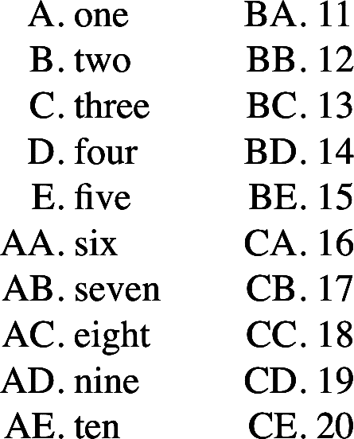

###### 图 16-40\. 字母计数

注意模式的第二次迭代，它从“AA”到“AE”，然后切换到“BA”到“BE”，然后到“CA”等等。在符号版本中，到达字母系统中的“EE”时，我们已经到了“EEEEEE”。

请注意，为了有效，字母系统必须在`symbols`描述符中提供至少*两*个符号。如果只提供一个符号，则整个`@counter-style`块将被视为无效。任何两个符号都是有效的；它们可以是字母、数字或者 Unicode 中的任何东西，以及（理论上）图像。

## 数字计数模式

当您定义一个`numeric`系统时，实际上是在使用您提供的符号定义*位置计数*系统——也就是说，这些符号被用作位数计数系统中的数字。例如，定义普通的十进制计数将会像这样完成：

```
@counter-style decimal {
    system: numeric;
    symbols: '0' '1' '2' '3' '4' '5' '6' '7' '8' '9';
}
```

这种基数可以扩展为创建十六进制计数，如下所示：

```
@counter-style hexadecimal {
    system: numeric;
    symbols: '0' '1' '2' '3' '4' '5' '6' '7' '8' '9' 'A' 'B' 'C' 'D' 'E' 'F';
}
```

该计数样式将从 1 计数到 F，然后滚动到 10 并继续计数到 1F，然后 20 到 2F，30 到 3F，等等。更简单地说，设置二进制计数非常简单：

```
@counter-style binary {
    system: numeric;
    symbols: '0' '1';
}
```

这些三种计数模式的示例显示在图 16-41 中。

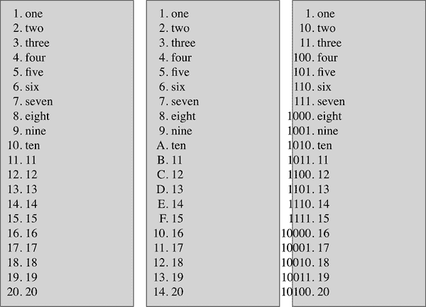

###### 图 16-41\. 三种数字计数模式

要考虑的一个有趣问题是：如果计数器值为负数会发生什么？在十进制计数中，我们通常期望负数前面带有减号（`–`），但在其他系统中呢，比如符号系统呢？如果我们定义一个基于字母的数字计数系统呢？或者如果我们想使用会计风格的格式，将负值放入括号中呢？这就是`negative`描述符发挥作用的地方。

`negative` 描述符就像是其自身的小型自包含的 `prefix` 和 `suffix` 的组合，仅在计数器具有负值时应用。其符号放置在任何前缀和后缀符号的内部（即靠近计数器）。

因此，假设我们要使用会计风格的格式，并向所有计数器添加前缀和后缀符号。操作如下，结果显示在 图 16-42 中：

```
@counter-style accounting {
    system: numeric;
    symbols: '0' '1' '2' '3' '4' '5' '6' '7' '8' '9';
    negative: "(" ")";
    prefix: "$";
    suffix: " - ";
}
ol.kaching {list-style: accounting;}
```

```
<ol start="-3">
…
</ol>
```

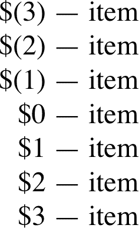

###### 图 16-42\. 负值格式化

数字计数系统的另一个常见特征是希望填充低值，使其长度与较高值相匹配。例如，计数模式可能使用前导零来创建 001 和 100，而不是 1 和 100。这可以通过 `pad` 描述符来实现。

此描述符的模式非常有趣。第一部分是一个整数，定义了每个计数器应具有的位数。第二部分是一个字符串，用于填充少于定义位数的任何值。考虑以下示例：

```
@counter-style padded {
    system: numeric;
    symbols: '0' '1' '2' '3' '4' '5' '6' '7' '8' '9';
    suffix: '.';
    pad: 4 "0";
}

ol {list-style: decimal;}
ol.padded {list-style: padded;}
```

在这些样式下，有序列表默认使用十进制计数：1, 2, 3, 4, 5… 具有 `class` 为 `padded` 的列表将使用填充的十进制计数：0001, 0002, 0003, 0004, 0005… 图 16-43 展示了一个示例。

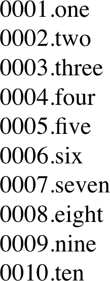

###### 图 16-43\. 填充值

请注意，填充计数器使用 `0` 符号来填补任何缺失的前导数字，以使每个计数器至少为四位数。该句中的“至少”部分很重要：如果计数器达到五位数，它将不会填充。更重要的是，如果计数器达到五位数，其他较短的计数器也不会获得额外的零。它们将保持四位数长，因为 `4 "0"` 中的 `4`。

任何符号都可以用来填充值，不仅限于 `0`。您可以使用下划线、句点、表情符号、箭头符号、空格或其他任何喜欢的东西。事实上，在值的 `<*symbol*>` 部分中可以有多个字符。以下内容是完全可以接受的，尽管不一定是理想的：

```
@counter-style crazy {
    system: numeric;
    symbols: '0' '1' '2' '3' '4' '5' '6' '7' '8' '9';
    suffix: '.';
    pad: 7 " ";
}

ol {list-style: decimal;}
ol.padded {list-style: padded;}

```

如果给定计数器值为 `1`，那么该疯狂计数系统的结果将是“1。”

请注意，负数符号计入符号长度，因此会影响填充。还要注意，负号将会在任何填充之外 *外侧* 出现。给定以下样式，我们将得到在 图 16-44 中显示的结果：

```
@counter-style negativezeropad {
    system: numeric;
    symbols: '0' '1' '2' '3' '4' '5' '6' '7' '8' '9';
    suffix: '. ';
    negative: '–';
    pad: 4 "0";
}
@counter-style negativespacepad {
    system: numeric;
    symbols: '0' '1' '2' '3' '4' '5' '6' '7' '8' '9';
    suffix: '. ';
    negative: '–';
    pad: 4 " ";
}
```

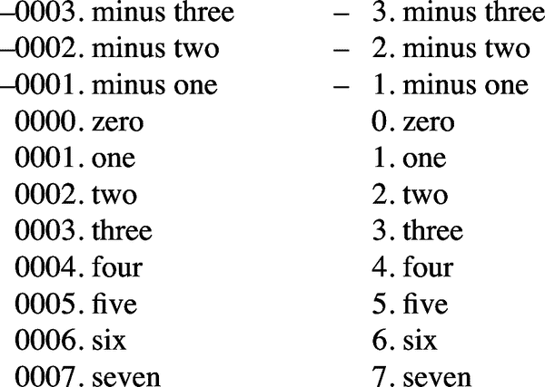

###### 图 16-44\. 带填充的负值格式化

## 累加计数模式

我们还有一个系统类型要探索，即`additive-symbol`计数。在加法计数系统中，使用不同的符号来表示值。正确地将多个符号组合在一起，然后将每个符号代表的数字相加，就得到了计数器的值。

显示比解释更容易。以下是从[Kseso](https://escss.blogspot.com)改编的示例：

```
@counter-style roman {
    system: additive;
    additive-symbols:
        1000 M, 900 CM, 500 D, 400 CD,
        100 C, 90 XC, 50 L, 40 XL,
        10 X, 9 IX, 5 V, 4 IV, 1 I;
}
```

这将以古典罗马风格计数。计数样式规范中还有一个很好的例子，它定义了一个骰子计数系统：

```
@counter-style dice {
    system: additive;
    additive-symbols: 6 ⚅, 5 ⚄, 4 ⚃, 3 ⚂, 2 ⚁, 1 ⚀, 0 "__";
    suffix: " ";
}
```

两种计数系统的结果如图 16-45 所示；这次，每个列表都已格式化为三列。

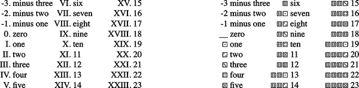

###### 图 16-45。加法值

为了清晰起见，符号可以加引号；例如，`6 "⚅", 5 "⚄", 4 "⚃"`等等。

最重要的一点是记住符号的顺序及其等值的重要性。请注意，无论是罗马还是骰子计数系统都是从最大到最小提供值，而不是反过来。这是因为如果你不按降序放置值，整个块都将无效。

还请注意使用`additive-symbols`描述符而不是`symbols`。这很重要要记住，因为定义了加法系统，然后尝试使用`symbols`描述符将使整个`counter-styles`块无效。（同样，尝试在非`additive`系统中使用`additive-symbols`描述符也会使那些块无效。）

关于加法系统最后要注意的一点是，由于加法计数器算法的定义方式，有时候可能无法表示某些值，尽管看起来应该可以。考虑这个定义：

```
@counter-style problem {
    system: additive;
    additive-symbols: 3 "Y", 2 "X";
    fallback: decimal;
}
```

对于前五个数字，计数器的结果如下：1, X, Y, 4, YX。你可能会认为 4 应该是 XX，这样直观上似乎是有道理的，但加法符号的算法不允许这样做。引用规范的话说：“虽然很不幸，但这是为了保持算法相对于计数器值大小的线性时间。”

###### 提示

那么罗马计数是如何获得 III 代表 3 的呢？答案还是在算法中。这里不太容易解释，如果你真的很好奇，我们建议你阅读 CSS 计数样式第 3 级规范，其中定义了加法计数算法。如果这不是你感兴趣的，那就记住：确保你有一个值等于`1`的符号，你就可以避免这个问题。

## 扩展计数模式

可能会有时候你只是想稍微改变一个现有的计数系统。例如，假设你想要将常规的十进制计数改为使用闭括号符号作为后缀，并填充最多两个前导零。你可以像下面这样详细写出来：

```
@counter-style mydecimals {
    system: numeric;
    symbols: '0' '1' '2' '3' '4' '5' '6' '7' '8' '9';
    suffix: ") ";
    pad: 2 "0";
}
```

这样做虽然有效，但有些笨拙。不过，别担心：`extends`来帮忙了。

`extends`选项在某种程度上类似于系统类型，但只是在基于现有系统类型的基础上构建。前面的例子将用`extends`重写如下：

```
@counter-style mydecimals {
    system: extends decimal;
    suffix: ") ";
    pad: 2 "0";
}
```

这将使用从`list-style-type`熟悉的`decimal`系统，并稍作调整。因此，无需重新输入整个符号链。你只需调整选项，如下所示。

实际上，你只能调整选项：如果你试图在`extends`系统中使用`symbols`或`additive-symbols`，整个`@counter-style`块将无效并被忽略。换句话说，符号无法被扩展。例如，你不能通过扩展十进制计数来定义十六进制计数。

然而，你可以根据不同的上下文变化十六进制计数。例如，你可以设置基本的十六进制计数，然后定义不同的显示模式，如下面的代码所示，并在图 16-46 中进行说明。

###### 注意

每个列表跳过 19 到 253，多亏了一个列表项上的`value="253"`。

```
@counter-style hexadecimal {
    system: numeric;
    symbols: '0' '1' '2' '3' '4' '5' '6' '7' '8' '9' 'A' 'B' 'C' 'D' 'E' 'F';
}
@counter-style hexpad {
    system: extends hexadecimal;
    pad: 2 "0";
}
@counter-style hexcolon {
    system: extends hexadecimal;
    suffix: ": ";
}
@counter-style hexcolonlimited {
    system: extends hexcolon;
    range: 1 255; /* stops at FF */
}
```

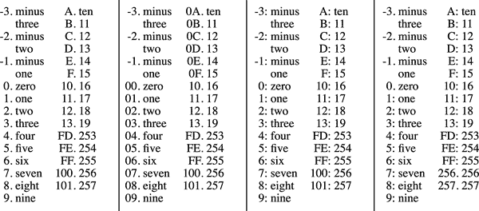

###### 图 16-46\. 不同的十六进制计数模式

请注意，四种计数样式中的最后一种`hexcolonlimited`扩展了第三种`hexcolon`，而`hexcolon`本身扩展了第一种`hexadecimal`。在`hexcolonlimited`中，十六进制计数在`FF`（255）处停止，这要归功于`range: 1 255;`声明。

## 计数模式的讲解

尽管使用符号构建计数器很有趣，但对于 Apple 的 VoiceOver 或 JAWS 屏幕阅读器等朗读技术来说，结果可能会变得一团糟。例如，想象一下屏幕阅读器试图读取骰子计数或月相。为了帮助，`speak-as`描述符允许你定义一个听觉回退。

###### 警告

截至 2022 年末，`speak-as`仅受 Mozilla 系浏览器支持。

让我们来反过来看值。使用`<counter-style-name>`，你可以定义一个备选的计数样式，用户代理很可能已经识别。例如，当被朗读时，你可能希望提供一个骰子计数的音频备用作为`decimal`，这是一个广受支持的`list-style-type`值之一：

```
@counter-style dice {
    system: additive;
    speak-as: decimal;
    additive-symbols: 6 ⚅, 5 ⚄, 4 ⚃, 3 ⚂, 2 ⚁, 1 ⚀;
    suffix: " ";
}
```

鉴于这些样式，计数⚅⚅⚂会被朗读为“十五”。或者，如果`speak-as`值更改为`lower-latin`，该计数将被朗读为“oh”（大写字母*O*）。

`spell-out`值可能看起来相当简单，但比起初看起来要复杂一些。用户代理所拼写出来的是一个“计数表示”，然后逐字母拼写。很难预测这意味着什么，因为生成计数表示的方法并没有精确定义：规范中说，“计数表示是通过连接计数符号构造的”。就是这样。

`words` 值与 `spell-out` 类似，但计数的表示方式是以单词的形式而不是拼写出每个字母。再次强调，确切的过程未定义。

使用 `numbers` 值时，计数器以文档语言的数字形式发音。这与前面的代码示例类似，在英文文档中，⚅⚅⚂会被朗读为“fifteen”。如果是其他语言，将使用该语言进行计数：例如西班牙语中是“quince”，德语中是“fünfzehn”，中文中是“十五”等。

对于 `bullets`，用户代理在读取无序列表中的项目符号（标记）时会做出相应反应。这可能意味着根本不说话，或者产生如叮当声或点击声等音频提示。

最后，考虑 `auto` 的默认值。我们将此作为最后一个问题，因为其效果取决于正在使用的计数系统。如果是字母系统，则 `speak-as: auto` 的效果与 `speak-as: spell-out` 相同。在循环系统中，`auto` 与 `bullets` 相同。否则，效果与 `speak-as: numbers` 相同。

这个规则的例外情况是系统是 `extends` 系统的情况下，此时 `auto` 的效果基于系统的扩展情况而定。因此，根据以下样式，在 `emojibrackets` 列表中，计数器将被朗读，就好像 `speak-as` 被设置为 `bullets` 一样：

```
@counter-style emojilist {
    emojiverse {
    system: cyclic;
    symbols: ;
@counter-style emojibrackets {
    system: extends emojilist;
    suffix: "]] ";
    speak-as: auto;
}

```

# 总结

即使列表样式不如我们所希望的那样复杂，但样式化列表的能力仍然非常有用。一个相对常见的用法是将链接列表化，移除标记和缩进，从而创建一个导航侧边栏。简单的标记语言结合灵活的布局方式，难以抗拒。

请记住，如果标记语言没有固有的列表元素，生成内容可以提供巨大的帮助，比如插入指向特定类型链接（如 PDF 文件、Word 文档，甚至只是链接到另一个网站）的图标等内容。生成内容还可以轻松打印链接 URL，并且它插入和格式化引号的能力将带来真正的排版乐趣。可以肯定的是，生成内容的有用性仅限于您的想象力。更好的是，借助计数器，您现在可以将顺序信息关联到通常不是列表的元素，例如标题或代码块。如果您希望通过模仿用户操作系统外观来支持这些功能，请继续阅读。下一章将讨论如何更改设计的放置位置、形状甚至透视效果。
