# 第十七章：Transforms

自 CSS 诞生以来，元素一直是矩形的，并且严格在水平和垂直轴上定位。出现了一些技巧使元素看起来像是倾斜等，但在所有这些技巧的背后都是一个严格的网格。

使用 CSS *transforms*，您可以打破视觉网格并改变元素呈现的方式。

# 坐标系

无论是简单地稍微旋转一些照片以使它们看起来更自然，还是创建信息可以通过翻转元素显示的界面，或者在侧边栏中进行有趣的透视技巧，CSS transforms 都能——如果您允许这个显而易见的表达——转变您设计的方式。

在踏上这段旅程之前，让我们花一点时间来定位自己。具体来说，让我们回顾一下用于定义空间中位置或运动的*坐标系*作为一系列测量的两种类型的坐标系。在 transforms 中使用的第一种是*笛卡尔坐标系*，通常称为*x/y/z 坐标系*。该系统通过使用两个数字（用于二维放置）或三个数字（用于三维放置）描述空间中点的位置。在 CSS 中，该系统使用三个轴：x 轴（水平）、y 轴（垂直）和 z 轴（深度）。这在 Figure 17-1 中有所说明。

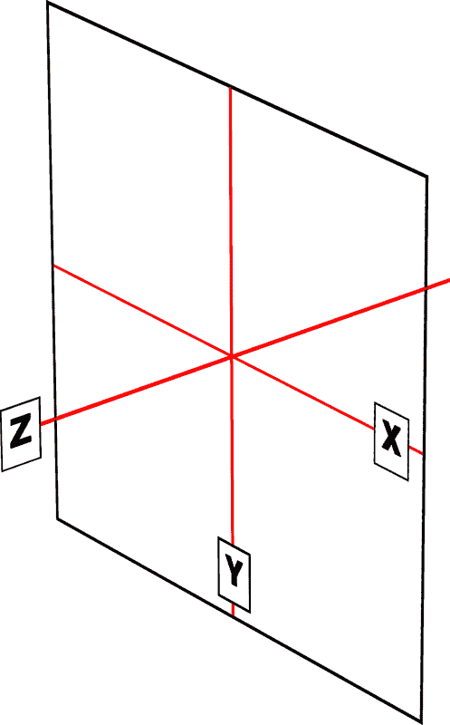

###### 图 17-1。CSS transforms 中使用的三个笛卡尔坐标轴

对于任何二维（2D）变换，您只需关心 x 和 y 轴。按照惯例，正 x 值向右移动，负值向左移动。同样地，正 y 值沿 y 轴向下移动，而负值沿 y 轴向上移动。

这可能看起来有点奇怪，因为我们倾向于认为更高的数字应该使某些东西放置得更高，而不是更低，就像我们在初代数中学到的一样。（这就是为什么在 Figure 17-1 中，“y”标签位于 y 轴的底部的原因：标签在所有三个轴上的正方向上。）如果您在 CSS 中有绝对定位的经验，请考虑绝对定位元素的`top`属性值：对于正值的`top`值，它们向下移动，而当`top`具有负长度时，它们向上移动。

鉴于此，为了将元素向左和向下移动，您需要给出一个负 x 值和一个正 y 值。这是一个实现方式：

```
translateX(-5em) translateY(33px)
```

事实上，这是一个有效的 transform 值，您很快会看到。它的效果是按顺序将元素向左移动 5 ems 并向下移动 33 像素。

如果您想要在三维空间中进行转换，需要添加一个 z 轴值。这个轴是“伸出”显示器并直接穿过您头部的轴——在理论上是这样的。正 z 值更接近您，负 z 值则远离您。在这方面，它非常像`z-index`属性。

假设我们要取之前移动的元素，并添加一个 z 轴值：

```
translateX(-5em) translateY(33px) translateZ(200px)
```

现在该元素看起来比没有 z 值时更接近我们 200 像素。

嗯，您可能会想知道如何将元素移动 200 像素靠近您，考虑到全息显示器很少见且昂贵。在您和显示器之间的空气分子等效于 200 像素有多少？元素靠近您看起来是什么样子，如果它变得*太*靠近会发生什么？这些都是我们稍后会讨论的绝佳问题。现在，只需接受沿 z 轴移动元素似乎会使其看起来更接近或更远即可。

非常重要的一点要记住，每个元素都带有自己的参考框架，因此考虑其轴与自身的关系。如果旋转一个元素，轴也会随之旋转，如第 17-2 图所示。任何进一步的转换都是相对于那些旋转后的轴计算的，而不是显示的轴。

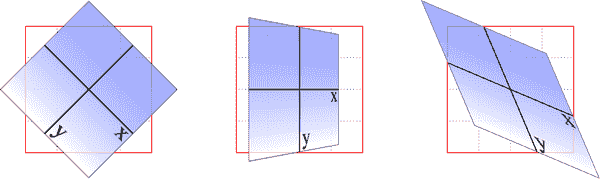

###### 第 17-2 图。参考基本框架

现在，假设您想在显示平面（即绕 z 轴）顺时针旋转 45 度一个元素。这是您最有可能使用的转换值：

```
rotate(45deg)
```

将其更改为`–45deg`，元素将逆时针绕 z 轴旋转（对于我们的国际朋友则是逆时针）。换句话说，它将在*xy*平面内旋转，如第 17-3 图所示。

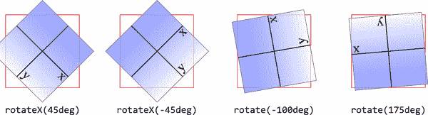

###### 第 17-3 图。xy 平面上的旋转

谈到旋转，CSS 转换中使用的另一种坐标系是*球坐标系*，它描述了三维空间中的角度。它在第 17-4 图中有示例。

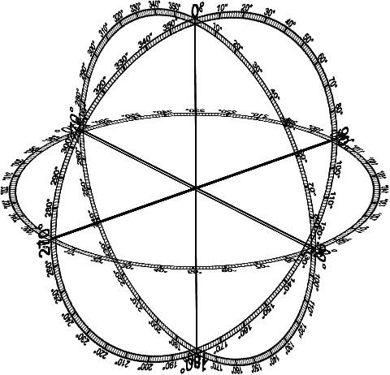

###### 第 17-4 图。CSS 转换中使用的球坐标系

对于 2D 转换，您只需担心一个单独的 360 度极坐标系：即坐落在由 x 轴和 y 轴描述的平面上的坐标系。在旋转方面，2D 旋转实际上描述了绕 z 轴的旋转。类似地，绕 x 轴的旋转会使元素向您倾斜或远离您，而绕 y 轴的旋转则会使元素从一侧转向另一侧。这些在第 17-5 图中有示例。

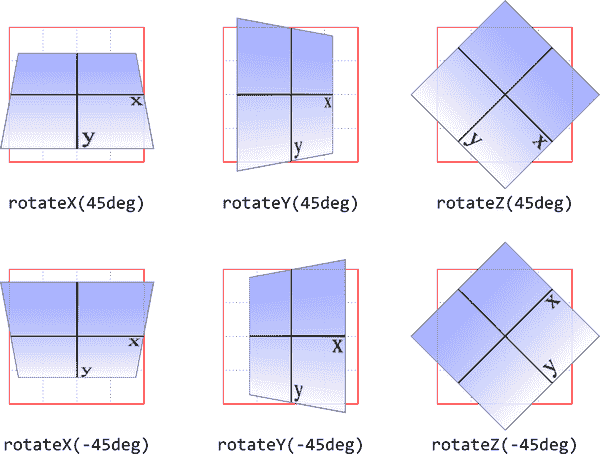

###### 第 17-5 图。绕三个轴旋转

好了，既然我们有了方向，那么让我们开始使用 CSS 转换吧！

# 转换中

一个属性将所有变换作为单个操作应用，而一些辅助属性则影响如何精确应用变换，或者允许以一种单一的方式进行变换。我们将从最重要的开始。

<*`transform-list`*> 是定义不同变换的函数的以空格分隔的列表，就像在前面一节中使用的示例一样。我们稍后将详细讨论可以在其中使用的具体函数。

首先，让我们澄清边界框的问题。对于任何受 CSS 影响的元素，*边界框* 是边框框——元素边框的最外边缘。为了计算边界框，任何轮廓和边距都将被忽略。

###### 注意

如果正在变换表格显示元素，则其边界框是表格包装框，它包围表格框和任何相关联的标题框。

如果您正在用 CSS 变换 SVG 元素，则其边界框是其 SVG 定义的 *对象边界框*。

请注意，所有变换的元素（例如，将 `transform` 设置为除 `none` 以外的值的元素）都有自己的堆叠上下文。（有关说明，请参见 “Z 轴上的放置”。）

尽管经过变换后的缩放元素可能比之前大或小得多，但元素在页面上实际占据的空间与变换应用前相同。这对所有变换函数都是适用的：当您平移或旋转元素时，其兄弟元素不会自动让开。

现在，值输入 <*`transform-list`*> 需要一些解释。它指的是一个或多个变换函数的列表，一个接一个地以空格分隔的格式。它看起来像这样，其结果显示在 Figure 17-6 中：

```
#example {transform: rotate(30deg) skewX(-25deg) scaleY(2);}
```

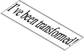

###### 图 17-6\. 一个变换的 `<div>` 元素

函数逐一处理，从最左边的第一个开始，依次到最右边的最后一个。这种从头到尾的处理顺序非常重要，因为改变顺序可能导致截然不同的结果。请考虑以下两个规则，其结果显示在 Figure 17-7 中：

```
img#one {transform: translateX(200px) rotate(45deg);}
img#two {transform: rotate(45deg) translateX(200px);}
```

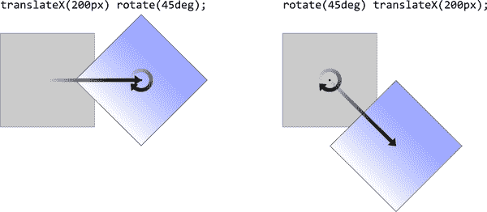

###### 图 17-7\. 不同的变换列表，不同的结果

在第一个示例中，图像沿其 x 轴平移（移动）了 200 像素，然后旋转了 45 度。在第二个示例中，图像旋转了 45 度，然后沿其 x 轴移动了 200 像素——这是变换元素的 x 轴，*而不是* 父元素、页面或视口的 x 轴。换句话说，当一个元素被旋转时，它的 x 轴（以及其它轴）会随之旋转。所有元素变换都是相对于元素自身的参考系进行的。

请注意，当您有一系列变换函数时，它们必须全部正确格式化；即它们必须是有效的。如果有一个函数无效，那么整个值就会无效。请考虑以下情况：

```
img#one {transform: translateX(100px) scale(1.2) rotate(22);}
```

因为`rotate()`的值是无效的—旋转值必须是一个<*`angle`*>—整个值被丢弃了。所讨论的图像将仅保持其初始未转换状态，既没有平移也没有缩放，更不用说旋转了。

此外，变换通常不是累积的。如果你对一个元素应用了一个变换，然后稍后想添加一个变换，你需要重新声明原始的变换。考虑以下场景，见图 17-8：

```
#ex01 {transform: rotate(30deg) skewX(-25deg);}
#ex01 {transform: scaleY(2);}
#ex02 {transform: rotate(30deg) skewX(-25deg);}
#ex02 {transform: rotate(30deg) skewX(-25deg) scaleY(2);}
```

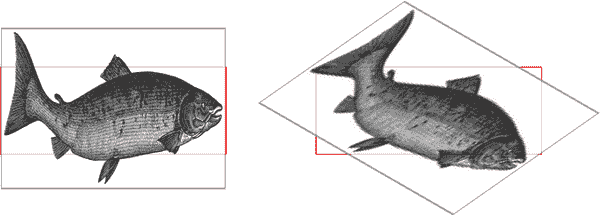

###### 图 17-8\. 覆盖或修改变换

在第一种情况下，第二条规则完全取代了第一条，这意味着元素仅沿着 y 轴进行缩放。这有些合理；这就像你声明一个字体大小，然后在其他地方为同一个元素声明了不同的字体大小一样。你不会得到累积的字体大小。你只会得到其中一个大小。在第二个例子中，第一组变换的全部内容包含在第二组中，因此它们都与`scaleY()`函数一起应用。

###### 注意

如果你希望应用于单一类型变换的属性，例如仅旋转或仅缩放元素的属性，你将在本章的后面看到一些例子，所以请耐心等待。

这里有一个重要的警告：截至本文写作时，变换通常不应用于*原子内联级*框。这些是像 span、超链接等内联框。这些元素可以在它们的块级父元素进行变换时进行变换，这样它们就随之而动。但你不能仅仅旋转一个 `<span>`，除非你通过 `display: block`、`display: inline-block` 或类似的方式改变了它的显示角色。这种限制的原因归结为不确定性。假设你有一个 `<span>`（或任何内联级框），它跨越多行。如果你旋转它，会发生什么？每一行框是否独立旋转，还是所有行框作为一个整体旋转？没有明确的答案，争论仍在进行中，因此目前你不能直接转换内联级框。

# 变换函数

截至 2023 年初，CSS 共有 21 个变换函数，使用各种值模式来完成它们的工作。以下是所有可用变换函数的列表，减去它们的值模式：

| `translate()` `translate3d()`

`translateX()`

`translateY()`

`translateZ()` | `scale()` `scale3d()`

`scaleX()`

`scaleY()`

`scaleZ()` | `rotate()` `rotate3d()`

`rotateX()`

`rotateY()`

`rotateZ()` | `skew()` `skewX()`

`skewY()` | `matrix()` `matrix3d()`

`perspective()` |

我们将首先解决最常见的变换类型，以及它们的相关属性（如果存在），然后再处理更晦涩或更难的部分。

## 平移

*平移变换* 只是沿一个或多个轴的移动。例如，`translateX()` 沿其自身的 x 轴移动元素，`translateY()` 沿其 y 轴移动它，而 `translateZ()` 则沿其 z 轴移动它。

这些通常被称为二维 *平移函数*，因为它们可以将元素向上下或左右滑动，但不能沿着 z 轴向前或向后移动。每个函数接受一个距离值，表示为长度或百分比。

如果值是一个长度，则效果与预期相符。使用 `translateX(200px)` 可以将元素沿 x 轴移动 200 像素，它将向右移动 200 像素。将其改为 `translateX(-200px)`，元素将向左移动 200 像素。对于 `translateY()`，正值将使元素向下移动，而负值将使其向上移动。

请记住，平移始终是相对于元素本身声明的。因此，例如，如果你通过旋转将元素倒置，正的 `translateY()` 值将使元素在页面上向下移动，因为从倒置元素的角度来看，这是向上移动。

如果值是一个百分比，则距离按元素自身大小的百分比计算。因此，如果一个元素宽度为 300 像素，高度为 200 像素，则 `translateX(50%)` 将使其向右移动 150 像素，而 `translateY(-10%)` 将使该元素向上移动 20 像素（相对于自身而言）。

如果你想同时沿 x 轴和 y 轴平移一个元素，`translate()` 使得这很容易。只需首先提供 x 值，然后是 y 值，用逗号分隔，这与包含 `translateX()` 和 `translateY()` 的效果相同。如果省略 y 值，则假定为 0。因此，`translate(2em)` 被视为 `translate(2em,0)`，这也与 `translateX(2em)` 相同。参见 图 17-9 了解二维平移的一些示例。

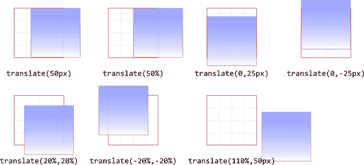

###### 图 17-9\. 二维平移

`translateZ()` 函数沿 z 轴平移元素，从而将其移入第三维。与二维平移函数不同，`translateZ()` 仅接受长度值。不允许使用百分比值用于 `translateZ()`，实际上也不允许用于任何 z 轴值。

就像 `translate()` 对于 x 和 y 的转换一样，`translate3d()` 是一个快捷函数，将 x、y 和 z 的转换值合并为一个函数。如果你想一次性向前、向上和向前移动一个元素，这非常方便。

见 图 17-10 了解 3D 平移工作原理的插图。每个箭头代表沿该轴的平移，到达三维空间中的一个点。虚线显示了从原点（三个轴的交点）到达的距离和方向，以及在 x*y* 平面上方的距离。

与`translate()`不同，如果`translate3d()`不包含三个值，那么没有回退选项。因此，浏览器应将`translate3d(1em,-50px)`视为无效，因为不会发生实际的平移。

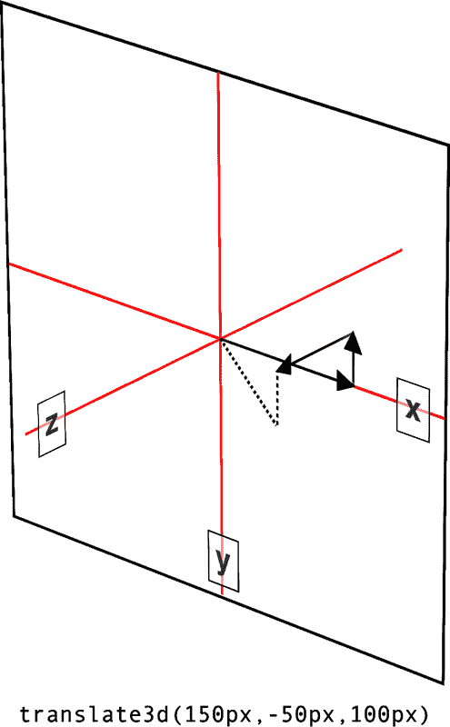

###### 图 17-10\. 三维平移

### 平移属性

当您想要对元素进行平移而无需通过`transform`属性时，可以使用`translate`属性代替。

与`translate()`函数非常类似，`translate`属性接受从一个到三个长度值，或两个百分比和一个长度值，或更简化的模式，如单个长度。与`translate()`函数不同，`transform`属性不使用逗号分隔其值。

如果只提供一个值，则用作 x 轴的平移。当提供两个值时，第一个是 x 轴的平移，第二个是 y 轴的平移。当提供三个值时，它们按顺序`x y z`取值。任何缺失的值默认为`0px`。

如果您回顾图 17-9，以下示例将产生与其所示相同的结果：

```
translate: 25px;    /* equivalent to 25px 0px 0px */
translate: 25%;
translate: 0 25px;  /* equivalent to 0 25px 0px */
translate: 0 -25px;
translate: 20% 20%;
translate: -20% -20%;
translate: 110% 25px;
```

类似地，以下示例将产生与图 17-10 中所示相同的效果：

```
translate: 150px -50px 100px;
```

默认值为`none`，意味着不应用任何翻译。

## 缩放

*缩放变换*会使元素变大或变小，具体取决于您提供的值。这些值是无单位的实数，可以是正数或负数。在二维平面上，您可以分别沿 x 轴和 y 轴缩放，也可以同时缩放它们。

提供给缩放函数的数字值是一个乘数；因此，`scaleX(2)`将使元素比转换之前宽出两倍，而`scaleY(0.5)`将使其高度减少一半。百分比值等同于数字值的比例为 100:1；也就是说，`50%`将产生与`0.5`相同的效果，`200%`将产生与`2`相同的效果，依此类推。

如果您想要同时沿两个轴缩放，请使用`scale()`。x 值始终在前，y 值始终在后，因此`scale(2,0.5)`将使元素的宽度增加一倍，高度减少一半。如果只提供一个数字，则用作两个轴的缩放值；因此，`scale(2)`将使元素的宽度和高度都增加一倍。这与`translate()`形成对比，其中省略的第二个值总是被设置为 0。使用`scale(1)`将会使元素缩放为与缩放之前完全相同的大小，如同`scale(1,1)`一样—假如您想要这样做。

图 17-11 展示了使用单轴缩放函数以及组合`scale()`的几个示例。

如果可以在两个维度上进行缩放，也可以在三个维度上进行缩放。CSS 提供了 `scaleZ()` 用于仅沿 z 轴缩放，以及 `scale3d()` 用于同时沿三个轴缩放。这仅在元素具有任何深度时有效，默认情况下元素没有深度。如果确实进行了传达深度的更改，比如围绕 x 轴或 y 轴旋转元素，则可以缩放深度，`scaleZ()` 或 `scale3d()` 可以这样做。

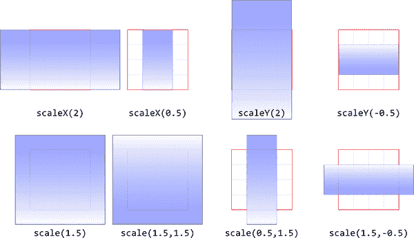

###### 图 17-11\. 缩放元素

与 `translate3d()` 类似，`scale3d()` 函数要求所有三个数字都有效。如果未能做到这一点，格式错误的 `scale3d()` 将使其所属的整个变换值无效。

还要注意，缩放元素会改变任何平移的有效距离。例如，以下内容将导致元素向右平移 50 像素：

```
transform: scale(0.5) translateX(100px);
```

这是因为元素缩小了 50%，然后在其自身的参考框架内向右移动了 100 像素，其大小为原始的一半。交换函数的顺序，元素将首先向右移动 100 像素，然后从该位置缩小 50%。

### 缩放属性

与平移类似，`scale` 属性允许你在不使用 `transform` 属性的情况下对元素进行缩放。

`scale` 处理其值的方式与 `translate` 属性几乎没有区别。如果只给出一个值，例如 `scale(2)`，则该值用于在 x 和 y 方向上进行缩放。使用两个值时，第一个用于在 x 轴方向上进行缩放，第二个用于在 y 轴方向上进行缩放。使用三个值时，第三个用于在 z 轴方向上进行缩放。

下列结果与 图 17-11 所示相同。

```
scale: 2 1;   /* equivalent to 200% 100% */
scale: 0.5 1; /* equivalent to 50% 100% */
scale: 1 2;
scale: 1 0.5;
scale: 1.5;
scale: 1.5;
scale: 0.5 1.5;
scale: 1 5 0.5;
```

默认值 `none` 表示不应用任何缩放。

## 元素旋转

*旋转函数*会导致元素围绕轴或三维空间中的任意向量旋转。CSS 提供了四个简单的旋转函数，以及一个专门用于三维的较复杂函数。

所有四个基本的旋转函数只接受一个值：角度。这可以用一个数字表示，可以是正数或负数，并且可以使用任何有效的角度单位（`deg`、`grad`、`rad` 和 `turn`）。（更多详情请参见 “角度”。）如果值的数字超出了给定单位的通常范围，则它看起来就像是给定了允许范围内的值。换句话说，`437deg` 的值会倾斜，就像它是 `77deg` 或 `-283deg` 一样。

但请注意，这些仅在视觉上等效，前提是不以某种方式对旋转进行动画处理。也就是说，对`1100deg`的旋转进行动画处理将使元素在倾斜 20 度（或者如果你愿意，340 度）之前多次旋转。相比之下，对`-20deg`的旋转进行动画处理将使元素稍微向左倾斜，没有旋转；而对`340deg`的旋转进行动画处理将使元素几乎完全向右旋转。这三种动画都会达到相同的最终状态，但是每种情况下的过程却截然不同。

`rotate()`函数是直接的 2D 旋转函数，是你最有可能使用的。它在视觉上等效于`rotateZ()`，因为它使元素围绕 z 轴旋转。类似地，`rotateX()`会导致围绕 x 轴旋转，从而使元素朝向你或远离你倾斜；而`rotateY()`则围绕其 y 轴旋转元素，就像它是一个门一样。这些都在图 17-12 中有所说明。

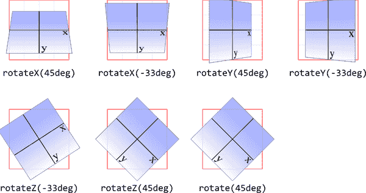

###### 图 17-12\. 绕三个轴的旋转

###### 警告

图 17-12 中的几个示例展示了完全 3D 的外观。这是通过某些`transform-style`和`perspective`属性值实现的，详见“选择 3D 风格”和“改变透视”，这里省略以确保清晰。在本文的任何时候，只要出现完全三维变换的元素，这一点都很重要。需要记住，如果仅尝试应用所示的变换函数，不会得到与图示相同的视觉效果。

如果你对向量感到舒适，并希望通过 3D 空间旋转元素，那么`rotate3d()`就适合你。前三个数指定了 3D 空间中向量的 x、y 和 z 分量，度数值（角度）决定了围绕声明的 3D 矢量旋转的量。

要从基本示例开始，`rotateZ(45deg)`的 3D 等效函数是`rotate3d(0,0,1,45deg)`。这指定了在 x 轴和 y 轴上为零的矢量，以及在 z 轴上为 1 的矢量；换句话说，就是 z 轴。元素因此围绕该矢量旋转了 45 度，如图 17-13 所示。该图还显示了围绕 x 轴和 y 轴旋转元素 45 度所需的适当`rotate3d()`值。

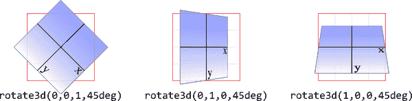

###### 图 17-13\. 绕 3D 矢量旋转

更复杂一点的是像`rotate3d(-0.95,0.5,1,45deg)`这样的情况，其中描述的向量指向 3D 空间中的轴之间。为了理解其工作原理，让我们从一个基本示例开始：`rotateZ(45deg)`（见图 17-13）。其等效于`rotate3d(0,0,1,45deg)`。前三个数字描述了一个向量的分量，该向量在 x 或 y 方向上没有大小，而在 z 方向上的大小为 1。因此，它沿着 z 轴正方向指向观察者。然后，元素顺时针旋转，当你朝向向量的起点时。

类似地，`rotateX(45deg)`的 3D 等效是`rotate3d(1,0,0,45deg)`。向量沿着 x 轴正方向（向右）指向。如果您站在该向量的末端并朝向其起点看，您将顺时针旋转 45 度。因此，从通常的观察者位置来看，元素的顶部远离观察者，底部朝向观察者旋转。

现在让我们稍微复杂化这个例子：假设你有`rotate3d(1,1,0,45deg)`。当在您的显示器上查看时，描述的向量从左上角到右下角，通过元素中心穿过（默认情况下；稍后我们将看到如何更改）。因此，元素的矩形形状有一条线在 45 度角度上，实际上是在其上穿过。然后，向量旋转 45 度，将元素随之旋转。当你向向量起点望回去时，旋转是顺时针的，所以元素的顶部远离观察者旋转，而底部朝向观察者旋转。如果我们将旋转改为`rotate3d(1,1,0,90deg)`，那么元素将面向观察者，以 45 度角倾斜并朝右上方。

好的，有了这一切，现在试着想象如何确定`rotate3d(-0.95,0.5,1,45deg)`的向量。假设一个边长为 200 像素的立方体，向量的分量为沿 x 轴向左 190 像素，沿 y 轴向下 100 像素，沿 z 轴向观察者 200 像素。图 17-14 展示了该向量及向观察者呈现的最终结果。

因此，向量就像穿过正在旋转的元素的金属棒。当我们沿着向量的线望回去时，旋转是顺时针 45 度。但由于向量指向左、下和前方，这意味着元素的左上角朝向观察者旋转，而右下角朝远离观察者旋转，如图 17-14 所示。

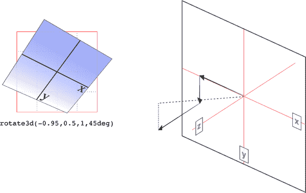

###### 图 17-14\. 围绕 3D 向量的旋转及其向量的确定

为了更加清楚，`rotate3d(1,1,0,45deg)` *不* 等同于 `rotateX(45deg) rotateY(45deg) rotateZ(0deg)`！这是一个容易犯的错误，包括你的谦逊通讯者在内。看起来它应该是等效的，但实际上并不是。如果我们将该向量放置在前面提到的虚拟 200×200×200 的立方体内，旋转轴将从原点指向右 200 像素和下 200 像素的点（200, 200, 0）。

这样做后，旋转轴将从左上到右下穿过元素，以 45 度角度。元素然后顺时针围绕该对角线旋转 45 度，当你向其原点（左上角）回望时，将右上角的元素角度向左移动，并稍微向左移动，而左下角的元素则向右移动。这与 `rotateX(45deg) rotateY(45deg) rotateZ(0deg)` 的结果有明显不同，如图 17-15 所示。

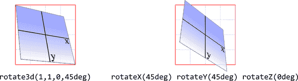

###### 图 17-15。围绕 3D 轴旋转和依序围绕三个不同轴旋转的区别

### 旋转属性

与平移和缩放一样，CSS 有一个`rotate`属性，允许你围绕各种轴旋转元素，而无需使用`transform`属性。然而，使其可能的值语法有些不同。

有效值被划分为三种互斥的语法选项。最简单的是`none`的默认值意味着不应用旋转。

如果你想围绕单个轴旋转，最简单的方法是给出轴标识符以及你想旋转的角度。在以下代码中，每行包含了围绕给定轴旋转元素的两种等效方式：

```
transform: rotateX(45deg);    rotate: x 45deg;
transform: rotateY(33deg);    rotate: y 33deg;
transform: rotateZ(-45deg);   rotate: z -45deg;
transform: rotate(90deg);     rotate: 90deg;
```

最后一行与前面讨论过的`rotate()`函数的处理类似：使用单个度数值进行旋转是在*xy*平面上的 2D 旋转。（参见图 17-12 进行复习。）

如果你想定义一个 3D 向量作为旋转轴，`rotate`的值看起来会有些不同。例如，假设我们想围绕向量 -0.95, 0.5, 1 旋转一个元素 45 度，如图 17-14 所示。以下两种声明中的任何一种都会产生这种效果：

```
transform: rotate3d(-0.95, 0.5, 1, 45deg);
rotate: -0.95 0.5 1 45deg;
```

如果你愿意，你可以使用这种模式来围绕基本轴进行旋转；也就是说，`rotate: z 23deg` 和 `rotate: 0 0 1 23deg` 将产生相同的效果（就像 `rotate: 23deg` 一样）。在通过 JavaScript 更改旋转向量时，这可能很有用，但在其他情况下很少有用。

注意，`transform`具有`rotate`无法复制的能力：链式旋转。例如，`transform: rotateZ(20deg) rotateY(30deg)`将首先围绕 z 轴旋转 20 度，然后对该旋转结果围绕 y 轴旋转。`rotate`属性只能执行其中一种操作。获得相同结果的唯一方法是找出能使元素保持与`transform`操作相同状态的向量和角度。当然，有数学方法可以做到这一点，但这超出了本书的范围（尽管请参见“矩阵函数”）。

## 个人转换属性顺序

当使用单独的变换属性时，效果总是按照`translate`、然后`rotate`、然后`scale`的顺序应用。以下两条规则在功能上是等效的：

```
#mover {
	rotate: 30deg;
	scale: 1.5 1;
	translate: 10rem;}

#mover {
	transform: translate(10rem) rotate(30deg) scale(1.5, 1);
}
```

这很重要，因为例如，先平移再旋转与先旋转再平移是完全不同的。如果你需要使元素的变换按照非 transform-rotate-scale 的顺序发生，请使用`transform`而不是单独的属性。

## 倾斜

当你*倾斜*一个元素时，你沿着 x 轴和/或 y 轴倾斜它。没有 z 轴或 3D 倾斜。

在两种情况下，提供一个角度值，元素就会倾斜以匹配该角度。展示倾斜要比用文字解释要容易得多，因此图 17-16 展示了沿 x 轴和 y 轴的倾斜示例。

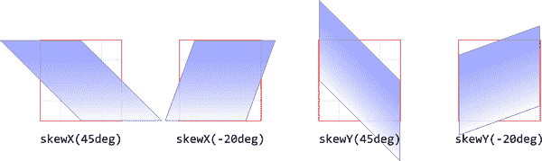

###### 图 17-16\. 沿 x 轴和 y 轴倾斜

使用`skew(a,b)`与使用`skewX(a)`和`skewY(b)`不同。前者使用矩阵操作`[ax,ay]`指定 2D 倾斜。图 17-17 展示了这种矩阵倾斜的示例，以及它们与外观相似但实际上不同的双倾斜变换的区别。

###### 警告

由于多种原因，包括`skew(a,b)`与`skewX(a) skewY(b)`不同的方式，CSS 规范明确建议避免使用`skew()`。如果可能的话，你应该尽量避免使用它；我们在这里记录它，以防你在遗留代码中遇到它。

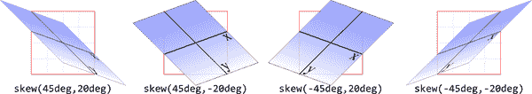

###### 图 17-17\. 倾斜元素

如果提供两个值，x 轴倾斜角总是在前，y 轴倾斜角在后。如果省略 y 轴倾斜角，则视为 0。

###### 注意

不像平移、旋转和缩放那样，截至 2022 年末，CSS 没有`skew`属性，因此任何倾斜都必须通过`transform`属性进行管理。

## 矩阵函数

如果你是高级数学爱好者，或者喜欢从华克斯兄弟电影中得到的陈旧笑话，那么矩阵函数将成为你的最爱。要明确一点，CSS 没有`matrix`属性。

在 CSS 转换规范中，我们发现了`matrix()`的尖锐描述，它是一个以“六个值*a*-*f*的变换矩阵形式”指定 2D 变换的函数。

首先要明确一件事：一个有效的`matrix()`值是一个由六个逗号分隔的数字组成的列表。 不能多，不能少。 值可以是正数或负数。 其次，该值描述了元素的最终转换状态，将所有其他变换类型（旋转、倾斜等）合并为一个紧凑的语法。 第三，很少有人使用这种语法自己编写代码，尽管它经常由绘图或动画软件生成。

我们不打算详细讨论进行矩阵数学运算的复杂过程。 对于大多数读者来说，这将是一堵显而易见的胡言乱语的墙壁； 对于其他人来说，这将是在熟悉的领域上浪费时间。 您当然可以在线研究矩阵计算的复杂性，并鼓励任何有兴趣的人这样做。 我们只看看 CSS 中的语法和用法的基础知识。

这是它的简要介绍。 假设你将这个函数应用于一个元素：

```
matrix(0.838671, 0.544639, -0.692519, 0.742636, 6.51212, 34.0381)
```

这就是用来描述这个变换矩阵的 CSS 语法：

```
0.838671    -0.692519   0   6.51212
0.544639     0.742636   0   34.0381
0            0          1   0
0            0          0   1
```

是的。 那么这是做什么？ 它的结果显示在图 17-18 中，这与编写以下内容的结果完全相同：

```
rotate(33deg) translate(24px,25px) skewX(-10deg)
```

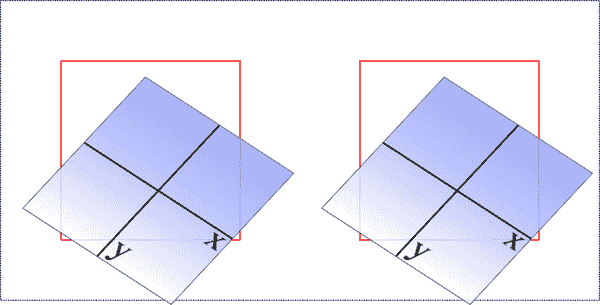

###### 图 17-18。一个经过矩阵变换的元素及其功能等效

问题实质上是，如果你熟悉或需要使用矩阵计算，你可以且应该使用。否则，你可以将更多可读性强的变换函数链接在一起，并将元素转换到相同的最终状态。

现在，那是关于简单的二维变换。 如果你想使用一个矩阵通过三个维度进行变换，那该怎么办？

再次，仅仅是为了好玩，我们来品味一下来自 CSS 变换规范的`matrix3d()`的定义：“指定一个 4×4 的齐次矩阵作为三维变换的参数，这个矩阵由 16 个以列为主序列的值组成。” 这意味着`matrix3d()`的参数必须是一个由 16 个逗号分隔的数字组成的列表，不多不少。 这些数字按列顺序排列在 4×4 的网格中，因此矩阵的第一列由值中的第一组四个数字形成，第二列由第二组四个数字形成，依此类推。 因此，你可以使用以下函数，

```
matrix3d(
    0.838671, 0, -0.544639, 0.00108928,
    -0.14788, 1, 0.0960346, -0.000192069,
    0.544639, 0, 0.838671, -0.00167734,
    20.1281, 25, -13.0713, 1.02614)
```

并将其写成这个矩阵：

```
  0.838671   -0.14788        0.544639     20.1281
  0           1              0            25
 -0.544639    0.0960346      0.838671    -13.0713
  0.00108928 -0.000192069   -0.00167734   1.02614
```

两者都有一个等效的最终状态，如下所示，这在图 17-19 中显示。

```
perspective(500px) rotateY(33deg) translate(24px,25px) skewX(-10deg)
```

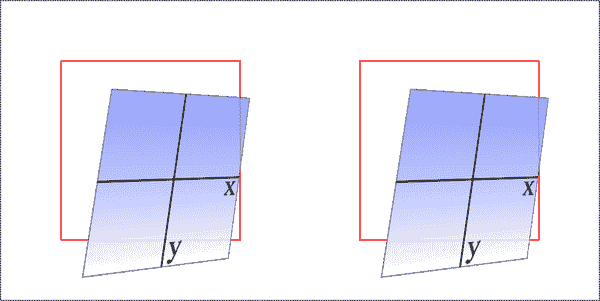

###### 图 17-19。一个经过`matrix3d()`变换的元素及其功能等效

### 关于最终状态等效的说明

需要记住的是，`matrix()`函数的最终状态及其等效的转换函数链只能被认为是相同的。这与“元素旋转”讨论的原因相同：因为`393deg`的旋转角度最终显示的旋转与`33deg`的角度相同。如果你正在对变换进行动画处理，这一点很重要，因为前者将导致元素在动画中进行滚筒翻滚，而后者不会。`matrix()`版本的最终状态也不会包含滚筒翻滚，而是始终使用最短可能的旋转达到最终状态。

为了说明这意味着什么，考虑以下，一个转换链及其`matrix()`等效形式：

```
rotate(200deg) translate(24px,25px) skewX(-10deg)
matrix(-0.939693, -0.34202, 0.507713, -0.879385, -14.0021, -31.7008)
```

注意 200 度的旋转。我们自然地将其解释为顺时针旋转 200 度，这也确实如此。然而，如果这两个转换进行动画处理，它们将表现出不同的效果：串联函数版本将确实顺时针旋转 200 度，而`matrix()`版本将逆时针旋转 160 度。两者最终会到达同一个位置，但是它们的到达方式不同。

即使在你可能认为它们不会有差异的情况下，也可能出现其他差异。再次强调，这是因为`matrix()`转换总是采用最短可能的路线到达最终状态，而转换链可能不会。（事实上，它可能不会。）考虑这些表面上等效的转换：

```
rotate(160deg) translate(24px,25px) rotate(-30deg) translate(-100px)
matrix(-0.642788, 0.766044, -0.766044, -0.642788, 33.1756, -91.8883)
```

如常，它们最终到达同一个地方。然而，在动画时，元素会采用不同的路径达到该最终状态。乍一看可能不明显有差异，但差异确实存在。

如果你不对转换进行动画处理，这一切都无关紧要，但仍然是一个重要的区别，因为你永远不知道何时会决定开始进行动画处理。（希望在阅读第十八章和第十九章后！）

## 设置元素透视

如果你在三维空间中转换一个元素，很可能希望它具有一些透视效果。*透视*可以使得前后深度显现，你可以调整应用到元素的透视程度。

指定透视作为一个距离可能有点奇怪。毕竟，`perspective(200px)`看起来很奇怪，因为你实际上不能沿着 z 轴测量像素。然而，我们就是这样。你提供了一个长度，围绕该值构建深度的幻觉。

较小的数字会创建更极端的透视效果，就像你靠近元素一样。较大的数字会创建更温和的透视效果，就像通过远处的变焦镜头查看元素一样。*非常*高的透视值会创建等距效果，看起来和没有透视效果一样。

这是有一定道理的。你可以将透视视为一个金字塔，其顶点位于透视原点（默认为未变换元素位置的中心），其底部为你正在查看的浏览器窗口。顶点与底部之间的较短距离将创建一个较浅的金字塔，因此会产生更极端的扭曲。这在图 17-20 中有所说明，其中展示了代表 200 像素、800 像素和 2000 像素透视距离的假设金字塔。

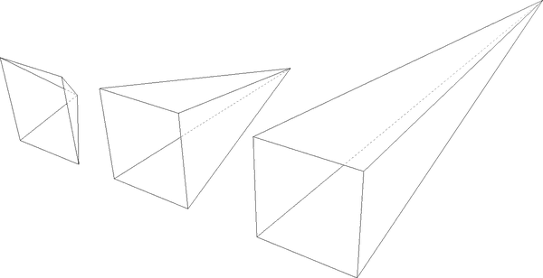

###### 图 17-20\. 不同视角的金字塔

在[苹果的 Safari 文档](https://developer.apple.com/library/archive/documentation/InternetWeb/Conceptual/SafariVisualEffectsProgGuide/Using2Dand3DTransforms/Using2Dand3DTransforms.html)中写道，透视值在`300px`以下会产生极端扭曲，`2000px`以上会产生“非常轻微”的扭曲，而`500px`到`1000px`之间会产生“适度的透视”。图 17-21 展示了相同旋转的一系列元素，不同的透视值下展示的效果。

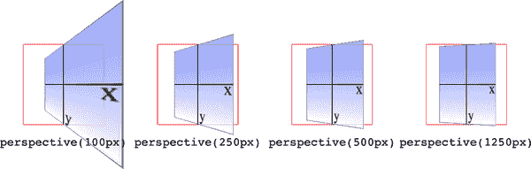

###### 图 17-21\. 不同透视值的效果

透视值必须始终为正数，非零长度。任何其他值都会导致`perspective()`函数被忽略。还要注意其在函数列表中的位置。如果你查看图 17-21 的代码，`perspective()`函数出现在`rotateY()`函数之前：

```
#ex1 {transform: perspective(100px) rotateY(-45deg);}
#ex2 {transform: perspective(250px) rotateY(-45deg);}
#ex3 {transform: perspective(500px) rotateY(-45deg);}
#ex4 {transform: perspective(1250px) rotateY(-45deg);}
```

如果你反转顺序，旋转会在应用透视之前发生，所以图 17-21 中的四个示例看起来完全相同。因此，如果你计划通过变换函数列表应用透视值，请确保它首先出现，或者至少出现在依赖它的任何变换之前。这提醒我们，编写`transform`函数的顺序非常重要。

# 更多变换属性

除了基本的`transform`属性和像`rotate`这样的独立变换属性外，还有一些相关的属性帮助定义元素变换原点、用于“场景”的透视等等。

## 移动变换的原点

到目前为止，我们所有的变换都有一个共同点：我们使用了元素的精确中心作为*变换原点*。例如，当旋转元素时，它围绕其中心旋转，而不是围绕角落旋转。这是默认行为，但通过属性`transform-origin`，你可以改变它。

语法定义看起来确实晦涩和令人困惑，但实际上非常简单。使用 `transform-origin`，你需要提供两个或三个长度或关键词来定义变换应该围绕的点：首先是水平方向，然后是垂直方向，可选地是沿 z 轴的长度。对于水平和垂直轴，你可以使用简单的英文关键词如 `top` 和 `right`，百分比、长度，或者关键词和百分比或长度值的组合。对于 z 轴，不能使用简单的英文关键词或百分比，但可以使用任何长度值。像素是迄今为止最常见的单位。

长度值被视为从元素的左上角开始的距离。因此，`transform-origin: 5em 22px` 将使变换原点位于元素左侧内部 5 em，并且距离元素顶部下方 22 像素处。同样地，`transform-origin: 5em 22px -200px` 将使其位于左侧内部 5 em，下方 22 像素处，并且在元素的未变换位置的背后 200 像素处。

百分比是相对于元素的边界框的对应轴和大小计算的，作为相对于元素左上角的偏移量。例如，`transform-origin: 67% 40%` 将使变换原点位于元素左侧的 67% 处，距离元素顶部的 40% 处。图 17-22 展示了一些起始点计算的例子。

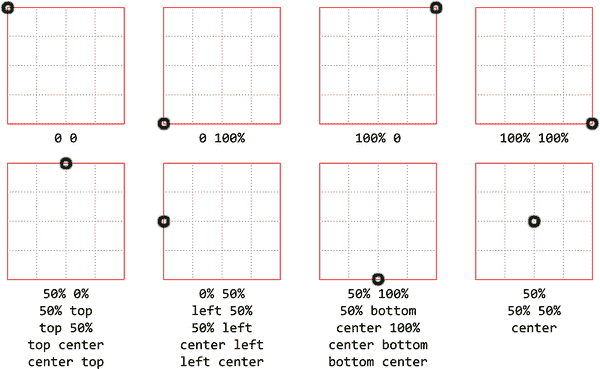

###### 图 17-22\. 不同的起始点计算

好了，如果你改变起始点，会发生什么？用二维旋转最容易理解这一点。假设你将一个元素向右旋转 45 度。其最终位置将取决于其起始点。图 17-23 展示了几个变换起点的效果；在每种情况下，变换起点都用圆圈标记。

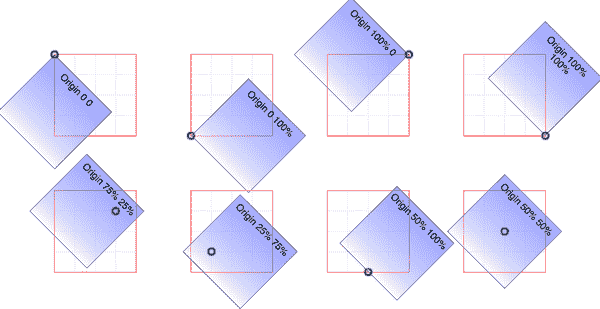

###### 图 17-23\. 使用不同的变换起点的旋转效果

起始点对于其他变换类型也很重要，例如倾斜和缩放。使用中心作为起始点缩小元素将导致各边等比例收缩，而使用右下角作为起始点缩小元素将导致元素向该角收缩。类似地，相对于中心倾斜元素将产生与相对于右上角倾斜相同的形状，但形状的放置位置将不同。一些示例显示在图 17-24 中；同样地，每个变换起点都用圆圈标记。

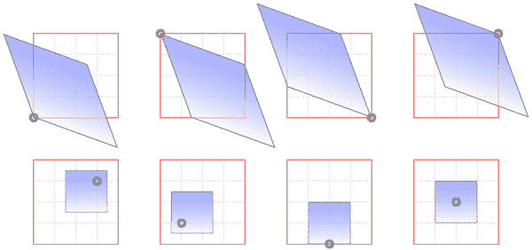

###### 图 17-24\. 使用不同的变换起点的倾斜和缩放效果

唯一不受变换原点改变影响的变换类型是平移。如果你用`translate()`或其类似的方法如`translateX()`和`translateY()`，或`translate`属性来移动一个元素，不管变换原点在哪里，元素最终都会停留在同一个位置。如果你计划做的只是移动，设置变换原点是不相关的。但是如果除了平移还要做其他事情，变换原点就很重要了。明智地使用它。

## 选择变换的框

我们前面的部分是写成变换原点始终相对于外部边缘计算的形式，这确实是 HTML 的默认设置，但 SVG 中并非总是如此。你可以至少在理论上通过`transform-box`属性进行更改。

两个值与在 HTML 上样式化时直接相关：

`border-box`

使用元素的边框框（由外边界定义）作为变换的参考框。

`content-box`

使用元素的内容框作为变换的参考框。

剩下的三个是为 SVG 目的设计的，尽管它们也可以应用于 HTML 上下文：

`fill-box`

使用元素的对象边界框作为变换的参考框。

`stroke-box`

使用元素的描边边界框作为变换的参考框。

`view-box`

使用元素的最近 SVG 视口作为参考框。

在 SVG 上下文中使用`fill-box`会导致对相应元素进行变换，正如我们从 HTML 中所期望的那样。另一方面，默认的`view-box`会导致所有变换都相对于由 SVG 的`viewBox`属性建立的坐标系统的原点进行计算。这种差异在图 17-25 中有所说明，该图是以下 SVG 文件及其包含的 CSS 的结果：

```
<svg xmlns="http://www.w3.org/2000/svg"
     width="500" height="200"
     fill="none" stroke="#000">
  <defs>
    <style>
      g rect {transform-origin: 0 0; transform: rotate(20deg);}
      g rect:nth-child(1) {transform-box: view-box;}
      g rect:nth-child(2) {transform-box: fill-box;}
    </style>
  </defs>
  <rect width="100%" height="100%" stroke-dasharray="4 3" />
  <rect x="100" y="50" width="100" height="100" />
  <rect x="300" y="50" width="100" height="100" />
  <g stroke-width="3" fill="#FFF8">
    <rect x="100" y="50" width="100" height="100" />
    <rect x="300" y="50" width="100" height="100" />
  </g>
</svg>
```

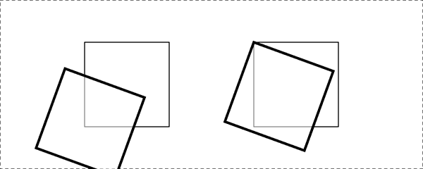

###### 图 17-25\. 围绕 SVG 原点和其自身原点旋转的方块

第一个方块位于左侧，从其起始点旋转 20 度，旋转中心为整个 SVG 文件的左上角（虚线框的左上角）。这是因为此方块的`transform-box`值为`view-box`。第二个方块的`transform-box`为`fill-box`，因此它使用自己的填充框的左上角——在 HTML 中我们称之为背景区域——作为旋转中心。

## 选择一个 3D 样式

如果你正在设置通过三维元素进行变换——比如使用`translate3d()`或`rotateY()`——你可能期望元素呈现为在三维空间中的样子。`transform-style`属性有助于实现这一点。

假设你想把一个元素“靠近”你的眼睛，然后稍微倾斜一点，加入适度的透视效果。你可能会使用类似这样的规则：

```
div#inner {transform: perspective(750px) translateZ(60px) rotateX(45deg);}

<div id="outer">
outer
<div id="inner">inner</div>
</div>
```

所以，你这样做，得到的结果如图 17-26 所示——大体上是你可能期望的。

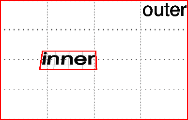

###### 图 17-26\. 一个 3D 转换的内部`<div>`

但是，当你决定将外部`<div>`旋转到一侧时，突然间一切都变得毫无意义了。内部`<div>`并不在你预想的位置。事实上，它看起来就像是粘贴在外部`<div>`前面的一幅图片。

好吧，这正是问题所在，因为`transform-style`的默认值是`flat`。内部`div`以其前移、后倾的状态绘制，这被应用到外部`<div>`的前面，就像一幅图片一样。因此，当你像图 17-27 中所示旋转外部`<div>`时，这幅扁平的图片也会随之旋转：

```
div#outer {transform: perspective(750px) rotateY(60deg) rotateX(-20deg);}
div#inner {transform: perspective(750px) translateZ(60px) rotateX(45deg);}
```

然而，将值更改为`preserve-3d`，结果会大不相同。内部`div`将作为完整的 3D 对象绘制，相对于其父级外部`<div>`在空间中浮动，*而不是*像粘贴在外部`<div>`前面的图片。你可以在图 17-27 中看到这种变化的结果：

```
div#outer {transform: perspective(750px) rotateY(60deg) rotateX(-20deg);
    transform-style: preserve-3d;}
div#inner {transform: perspective(750px) translateZ(60px) rotateX(45deg);}
```

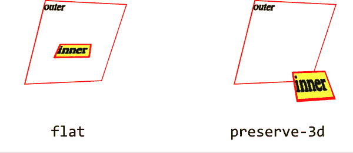

###### 图 17-27\. 扁平与保留 3D 转换样式的效果

`transform-style`的一个重要方面是它可能会被其他属性覆盖。原因是这些其他属性的某些值要求以扁平化的方式呈现元素及其子元素才能工作。在这种情况下，`transform-style`的值被强制设为`flat`，无论你之前声明了什么。

因此，为了避免这种覆盖行为，请确保以下属性在任何具有 3D 转换子元素的 3D 转换容器元素上设置为列出的值：

+   `overflow: visible`

+   `filter: none`

+   `clip: auto`

+   `clip-path: none`

+   `mask-image: none`

+   `mask-border-source: none`

+   `mix-blend-mode: normal`

+   `isolation: auto`

这些都是这些属性的默认值，只要你不试图改变保留的 3D 元素的任何值，那么一切都没问题！但是，如果你发现编辑某些 CSS 突然使你可爱的 3D 变换变平了，其中一个属性可能是罪魁祸首。

## 改变透视

有两个属性用于定义透视的处理方式：一个用于定义透视距离，如前面章节中讨论的`perspective()`函数；另一个用于定义透视的原点。

### 定义一个透视组

首先，让我们考虑`perspective`属性，它接受一个长度来定义透视金字塔的深度。乍一看，它看起来就像是之前讨论的`perspective()`函数，但存在一些关键的差异。

举个快速的例子，如果你想创建一个非常深的透视效果，模仿使用变焦镜头的效果，你可以声明类似于`perspective: 2500px`。对于一个浅的透视深度，模仿特写镜头的效果，你可以声明`perspective: 200px`。

那么这与`perspective()`函数有何不同呢？当你使用`perspective()`时，你为具有该规则的每个元素定义透视效果。因此，如果你写了`transform: perspective(800px) rotateY(-50grad);`，那么你将该透视应用于每个具有此规则的元素。

另一方面，使用`perspective`属性，你为接收该属性的元素的所有子元素创建了一个共享的透视。这里有一个区别的示例，如图 17-28 所示：

```
div {transform-style: preserve-3d; border: 1px solid gray; width: 660px;}
img {margin: 10px;}
#func {perspective: none;}
#func img {transform: perspective(800px) rotateX(-50grad);}
#prop {perspective: 800px;}
#prop img {transform: rotateX(-50grad);}
```

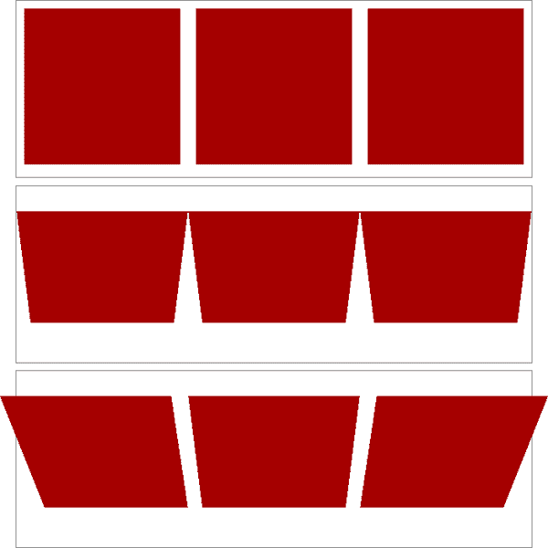

###### 图 17-28。没有透视，独立的`perspective()`，以及共享的`perspective`

在图 17-28 中，我们首先看到一行未经转换的图像。在第二行中，每个图像都向我们旋转了 50 gradians（相当于 45 度），但每个图像都有自己独立的透视。

在第三行图像中，没有一个具有独立的透视。相反，它们都是在包含它们的`<div>`上设置了`perspective: 800px;`后所定义的共享透视中绘制的。由于它们都在共享的透视中运行，它们看起来“正确”——即，如果我们有三张物理图片安装在透明玻璃上，并绕其中心水平轴旋转向我们，我们会如预期那样看到它们。

这是`perspective`的关键区别，即属性和`perspective()`函数之间的差异。前者创建一个所有子元素共享的三维空间。后者仅影响应用它的元素。另一个区别是，`perspective()`函数的效果取决于在转换链中的调用顺序。`perspective`属性始终在所有其他转换之前应用，这通常是用来创建三维效果的理想方式。

在大多数情况下，你会使用`perspective`属性而不是`perspective()`函数。事实上，容器`<div>`（或其他元素）是三维变换的常见特征——它们以前用于页面布局——主要用于建立共享透视。在上面的例子中，`<div id="two">`完全是为了充当透视容器而存在。另一方面，如果没有它，我们就无法完成我们所做的事情。

### 移动透视的原点

当在三维空间中转换元素时，将使用透视效果。（请参见前面章节中的`transform-style`和`perspective`。）透视将有一个原点，也被称为*消失点*，你可以使用`perspective-origin`属性更改其位置。

使用`perspective-origin`，你定义了视线汇聚的点，与`perspective`类似，该点是相对于父容器定义的。

与大多数三维变换属性一样，这种效果比描述更容易展示。考虑以下 CSS 和标记示例，如图 17-29 所示：

```
#container {perspective: 850px; perspective-origin: 50% 0%;}
#ruler {height: 50px; background: #DED url(tick.gif) repeat-x;
    rotate: x 60deg;
    transform-origin: 50% 100%;}

<div id="container">
    <div id="ruler"></div>
</div>
```

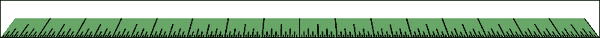

###### Figure 17-29\. 一个基本的“标尺”

我们有一个重复的背景图像，上面有一个标尺上的刻度，包含它们的 `<div>` 被向我们倾斜了 60 度。所有线条都指向一个共同的消失点，即容器 `<div>` 的顶部中心（由于 `perspective-origin` 的值是 `50% 0%`）。

现在考虑同样的设置，但使用不同的透视原点（图 17-30）。

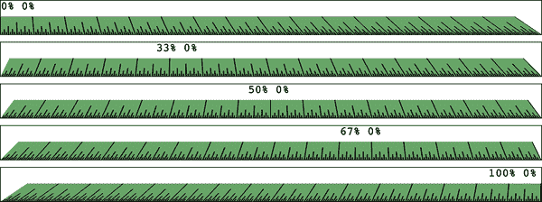

###### Figure 17-30\. 带有不同透视原点的基本“标尺”

如您所见，移动透视原点会改变 3D 变换元素的渲染效果。请注意，这些效果仅因为我们为 `perspective` 提供了一个值才能生效。如果 `perspective` 的值是默认的 `none`，则 `perspective-origin` 给定的任何值都将被忽略。这是有道理的，因为当没有透视时，就不可能有透视原点！

## 处理背面

多年来，你一直在布局元素，可能从未想过：“如果我们能看到元素的背面会是什么样子？”有了 3D 变换，如果有一天你真的看到了元素的背面，CSS 已经为你准备好了。发生的情况取决于 `backface-visibility` 属性。

与我们已经讨论过的许多其他属性和功能不同，这个属性非常简单。它只是确定当元素面向观众时，是否渲染其背面。仅此而已。

所以，假设你翻转了两个元素，一个元素的 `backface-visibility` 设置为默认值 `visible`，另一个设置为 `hidden`。你将得到如 图 17-31 所示的结果：

```
span {border: 1px solid red; display: inline-block;}
img {vertical-align: bottom;}
img.flip {rotate: x 180deg; display: inline-block;}
img#show {backface-visibility: visible;}
img#hide {backface-visibility: hidden;}

<span></span>
<span></span>
<span></span>
```

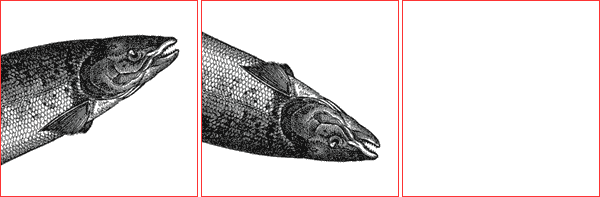

###### Figure 17-31\. 可见和隐藏的背面

如您所见，第一幅图像保持不变。第二幅图像沿其 x 轴翻转，因此我们从背面看到它。第三幅图像也已经翻转，但因为其背面已被隐藏，所以我们根本看不见它。

这个属性在几种情况下都很有用。在最简单的情况下，您有两个表示 UI 元素两侧的元素翻转的情况——比如一个带有其背面设置的搜索区域和偏好设置，或者一张照片的背面有一些信息。让我们考虑后一种情况。CSS 和标记可能看起来像这样：

```
section {position: relative;}
img, div {position: absolute; top: 0; left: 0; backface-visibility: hidden;}
div {rotate: y 180deg;}
section:hover {rotate: y 180deg; transform-style: preserve-3d;}

<section>
    
    <div class="info">(…info goes here…)</div>
</section>
```

（如果有一个动画旋转，使卡片在 3D 空间中翻转，这将会更加有趣。）

此示例的变体使用相同的标记，但稍微不同的 CSS 来显示图像翻转后的背面。这可能更符合预期，因为它使信息看起来就像真的写在图像的背面一样。这导致了 图 17-32 所示的最终结果：

```
section {position: relative;}
img, div {position: absolute; top: 0; left: 0;}
div {rotate: y 180deg; backface-visibility: hidden;
    background: rgba(255,255,255,0.85);}
section:hover {rotate: y 180deg; transform-style: preserve-3d;}
```

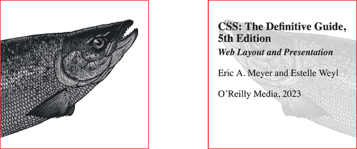

###### Figure 17-32\. 正面是照片，背面是信息

我们要做的一切只是将 `backface-visibility: hidden` 从 `` 和 `<div>` 都应用到 `<div>` 上。因此，当 `<div>` 翻转时，其反面被隐藏，但图像的反面则不是（嗯，还有使用半透明背景，这样我们可以看到文本和翻转后的图像）。

# 摘要

具有在二维和三维空间中转换元素的能力，CSS 变换为设计师提供了强大的功能。从创建有趣的二维变换组合，到创建完全仿三维的界面，变换在设计空间中开辟了大量新领域。一些属性之间存在依赖关系，这对于并非每个 CSS 作者一开始就能自然理解的事情，但通过实践后变得轻车熟路。

作者们经常使用变换来进行动画处理，例如卡片翻转、元素平滑缩放和旋转等。在接下来的两章中，我们将详细讨论这些过渡和动画是如何定义的。
