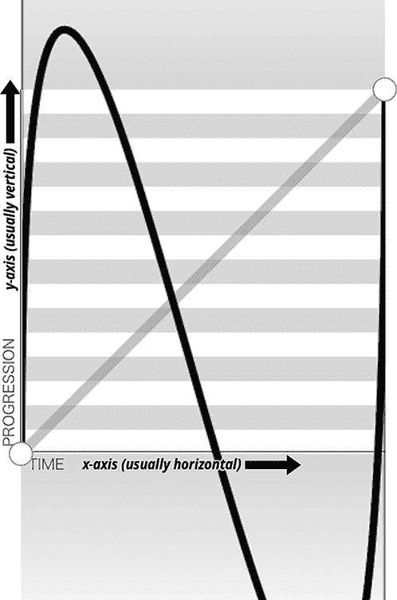

# 第十九章：动画

在上一章介绍的 CSS 过渡中，简单的动画是由 DOM 状态的变化触发的，并从开始状态过渡到结束状态。CSS *动画* 类似于过渡，因为 CSS 属性值随时间变化，但动画可以更精确地控制这些变化的方式。具体来说，CSS 关键帧动画让我们决定动画是否重复，以及如何重复，还可以详细控制动画的每个阶段等。虽然过渡触发隐含的属性值变化，但动画则在应用关键帧动画时明确执行。

使用 CSS 动画，您可以更改元素的非预设或后置状态的属性值。在动画元素上设置的属性值不一定需要是动画过程中的一部分。例如，使用过渡时，从黑色到白色只会动画过各种灰色阶段。但是在动画中，该元素不必在动画期间始终是黑色、白色或甚至中间色。

虽然您*可以*通过灰度过渡，但您也可以将元素变为黄色，然后从黄色动画到橙色。或者，您可以通过各种颜色进行动画，从黑色开始，到白色结束，但在此过程中穿过整个彩虹。

###### 提示

查找播放符号  ，以了解在线示例是否可用。本章中的所有示例都可以在 [*https://meyerweb.github.io/csstdg5figs/19-animation*](https://meyerweb.github.io/csstdg5figs/19-animation) 找到。

# 适应癫痫和前庭障碍

###### 警告

虽然您可以使用动画创建不断变化的内容，*但是重复快速变化的内容可能会导致某些用户癫痫发作*。请始终记住这一点，并确保您的网站对癫痫和其他癫痫症状的用户具有较好的可访问性。

我们通常不会以警告开始一章，但在这种情况下确实有必要。视觉变化，特别是快速的视觉变化，可能会触发容易引起癫痫的用户的医疗紧急情况。它们还可能会导致容易患前庭障碍（晕动病）的用户感到严重不适。

为了减少或消除这种风险，请使用 `prefers-reduced-motion` 媒体查询（参见第二十一章）。这允许您在用户为其浏览器或操作系统设置了“减少运动”或类似偏好时应用样式。可以考虑如下方法：

```
@media (prefers-reduced-motion) {
  * {animation: none !important; transition: none !important;}
}
```

这将禁用所有动画和过渡效果，假设没有指定其他 `!important` 的动画（它们不应该有）。这并不是一个微妙或完美的解决方案，但这是第一步。您可以通过将所有动画和过渡效果放在一个媒体块中，以便为不启用运动减少功能的用户隔离，来反转此方法，如下所示：

```
@media not (prefers-reduced-motion) {
  /* all animations and transitions */
}
```

并非所有动画都危险或令人迷失方向，对所有用户至少进行一些动画可能是必要的。过渡和动画在告知用户发生了什么变化和引导他们关注特定内容方面非常有帮助。在这种情况下，使用`prefers-reduced-motion`来减少对理解 UI 至关重要的动画，并关闭那些不必要的动画。

# 定义关键帧

要对元素进行动画处理，需要引用关键帧动画的名称；为了*这样做*，我们需要一个命名的关键帧动画。第一步是使用`@keyframes` at 规则定义这个可重用的 CSS 关键帧动画，从而为我们的动画命名。

`@keyframes` at 规则包括*动画标识符*或名称，以及一个或多个*关键帧块*。每个关键帧块包含一个或多个带有属性-值对声明块的关键帧选择器。整个`@keyframes` at 规则指定了单次完整动画的行为。动画可以零次或多次迭代，主要取决于`animation-iteration-count`属性值，我们将在“声明动画迭代次数”中讨论。

每个关键帧块包含一个或多个*关键帧选择器*。这些是沿动画持续时间的百分比时间位置；它们声明为百分比或使用关键字`from`或`to`。以下是动画的通用结构：

```
@keyframes animation_identifier {
  keyframe_selector {
    property: value;
    property: value;
  }
  keyframe_selector {
    property: value;
    property: value;
  }
}
```

下面是几个基本示例：

```
@keyframes fadeout {
    from {
        opacity: 1;
    }
    to {
        opacity: 0;
    }
}

@keyframes color-pop {
    0% {
        color: black;
        background-color: white;
    }
    33% { /* one-third of the way through the animation */
        color: gray;
        background-color: yellow;
    }
    100% {
        color: white;
        background-color: orange;
    }
}
```

所示的第一组关键帧将元素的`opacity`设置为`1`（完全不透明），并将其动画化为`0`不透明度（完全透明）。第二组关键帧将元素的前景动画化为黑色，背景为白色，然后将前景从黑色动画到灰色，然后是白色，背景从白色动画到黄色，然后是橙色。

注意，关键帧不指定动画应该持续多长时间——这由专门用于此目的的 CSS 属性处理。而是它们说，“从这种状态过渡到那种状态”或“在总动画的这些百分比点上达到这些各种状态”。这就是为什么关键帧选择器总是百分比，或者`from`和`to`。如果尝试使用时间值（如`1.5s`）作为关键帧选择器，将使其无效。

# 设置关键帧动画

在关键帧集的大括号中，包含一系列带有 CSS 块的关键帧选择器，声明您要动画化的属性。一旦定义了关键帧，您可以通过使用`animation-name`属性将动画“附加”到元素来“激活”它。我们将很快讨论该属性，在“调用命名动画”中。

从 at 规则声明开始，后跟动画名称和大括号：

```
@keyframes nameOfAnimation {
...
}
```

创建的名称是标识符或字符串。最初，关键帧名称必须是标识符，但规范和浏览器也支持带引号的字符串。

标识符是未引用的，并且有特定的规则。你可以使用任何字符 `a-z`、`A-Z` 和 `0-9`，连字符 (`-`)，下划线 (`_`)，以及 ISO 10646 字符集中的任何字符 U+00A0 及以上。ISO 10646 是通用字符集；这意味着你可以使用 Unicode 标准中匹配正则表达式 `[-_a-zA-Z0-9\u00A0-\u10FFFF]` 的任何字符。标识符不能以数字（0–9）开头，也不应以两个连字符开头（尽管某些浏览器允许这样）。一个连字符是可以的，只要它后面不跟随数字，除非你用反斜杠转义数字或连字符。

如果你的动画名称中包含任何转义字符，请确保用反斜杠 (`\`) 转义它们。例如，`Q&A!` 必须写成 `Q\&A\!`。名称 `✎` 可以保留为 `✎`（不，这不是拼写错误），而 `✎` 也是一个有效的名称。但是，如果你要在标识符中使用任何不是字母或数字的键盘字符，比如 `!`、`@`、`#`、`$` 等，记得用反斜杠转义它们。

此外，在动画名称中不要使用本章中涵盖的任何关键字。例如，我们稍后将讨论的各种动画属性的可能值包括 `none`、`paused`、`running`、`infinite`、`backwards` 和 `forwards`。尽管规范没有禁止使用动画属性关键字作为动画名称，但这很可能会破坏你的动画效果，特别是在使用 `animation` 简写属性时（在 “汇总” 中讨论）。因此，尽管你可以合法地将你的动画命名为 `paused`（或其他关键字），我们*强烈建议*不要这样做。

# 定义关键帧选择器

*关键帧选择器* 定义了动画过程中我们想要动画化的属性值。如果你想要在动画开始时设置一个数值，你需要在 `0%` 处声明它。如果你想在动画结束时设置一个不同的数值，你需要在 `100%` 处声明属性值。如果你想要在动画进行到三分之一时设置一个数值，你需要在 `33%` 处声明它。这些标记是由关键帧选择器定义的。

关键帧选择器由一个逗号分隔的百分比值或关键字 `from` 或 `to` 的列表组成。关键字 `from` 等同于 `0%`。关键字 `to` 等同于 `100%`。关键帧选择器用于指定动画时段内关键帧所代表的百分比。关键帧本身由在选择器上声明的属性值块指定。百分比值必须使用 `%` 单位。换句话说，`0` 作为关键帧选择器是无效的：

```
@keyframes W {
    from {  /* equivalent to 0% */
      left: 0;
      top: 0;
    }
    25%, 75% {
      top: 100%;
    }
    50% {
      top: 50%;
    }
    to {  /* equivalent to 100% */
      left: 100%;
      top: 0;
    }
}
```

当此`@keyframes`动画命名为`W`并附加到非静态定位元素时，会使该元素沿着 W 形路径移动。`W`有五个关键帧：分别位于`0%`、`25%`、`50%`、`75%`和`100%`的标记。`from`是`0%`标记，而`to`是`100%`标记。

因为我们为`25%`和`75%`标记设置的属性值相同，所以我们可以将这两个关键帧选择器放在一个逗号分隔的列表中。这与常规选择器非常相似，你可以用逗号将它们组合在一起。无论你将这些选择器保留在一行（如示例中）还是将每个选择器放在自己的一行中，都取决于个人偏好。

注意，关键帧选择器不需要按升序列出。在前面的示例中，我们在同一行上有`25%`和`75%`，然后是`50%`标记。为了可读性，强烈建议从`0%`到`100%`的标记递进。然而，就像本例中的`75%`关键帧所示，这并不是必需的。你可以从最后一个开始定义你的关键帧，然后从第一个开始，或者随意打乱它们，或者任何你认为适合的方式。

## 省略`from`和`to`值

如果没有指定`0%`或`from`关键帧，则用户代理（浏览器）会构建一个`0%`关键帧。隐式的`0%`关键帧使用被动画化属性的原始值，就好像在元素上未应用动画时声明了具有相同属性值的`0%`关键帧一样，即除非另一个动画正在该元素上动画化相同的属性（详情见“调用命名动画”）。同样地，如果未定义`100%`或`to`关键帧且未应用其他动画，则浏览器将使用元素在未设置动画时的值创建一个伪`100%`关键帧。

假设我们有一个`background-color`的变化动画：

```
@keyframes change_bgcolor {
    45% { background-color: green; }
    55% { background-color: blue; }
}
```

如果元素原本设置了`background-color: red`，则动画就好像如下所示：

```
@keyframes change_bgcolor {
    0%   { background-color: red; }
    45%  { background-color: green; }
    55%  { background-color: blue; }
    100% { background-color: red; }
}
```

或者，记住我们可以将多个相同的关键帧作为逗号分隔的列表包含，这个伪动画也可以像这里显示的那样编写：

```
@keyframes change_bgcolor {
    0%, 100% { background-color: red; }
    45%  { background-color: green; }
    55%  { background-color: blue; }
}
```

注意，`background-color: red;`的声明不是原始关键帧动画的一部分；它们只是为了清晰起见在此处填写。我们可以在许多元素上包含这个`change_bgcolor`动画，且感知到的动画会根据非动画状态下元素`background-color`属性的值而有所不同。因此，具有黄色背景的元素将从黄色动画到绿色再到蓝色，然后回到黄色。

尽管我们一直在使用百分比的整数值作为百分比，但非整数百分比值（例如`33.33%`）是完全有效的。负百分比、大于`100%`的值以及不是百分比或关键字`to`或`from`的值都是无效的，并将被忽略。

## 重复关键帧属性

就像 CSS 的其余部分一样，具有相同关键帧值的关键帧声明块中的值是级联的。因此，可以通过两次声明`to`或`100%`来编写先前的`W`动画，从而覆盖`left`属性的值：

```
@keyframes W {
  from, to {
    top: 0;
    left: 0;
  }
  25%, 75% {
    top: 100%;
  }
  50% {
    top: 50%;
  }
  to {
    left: 100%;
  }
}
```

请注意，在第一个代码块的关键帧选择器中，`to`与`from`一起声明？这为`to`关键帧设置了`top`和`left`。然后，最后一个关键帧块中覆盖了`to`的`left`值。

## 可动画化属性

值得注意的是，并非所有属性都可以*动画化*。如果在动画的关键帧中列出了无法动画化的属性，它们会被简单地忽略。（同样，浏览器完全不认识的属性和值也会被忽略，就像 CSS 的其他部分一样。）

###### 注意

中点规则的例外包括`animating-timing-function`和`visibility`，这些在下一节中讨论。

只要可动画化属性在至少一个具有与非动画化属性值不同的值的块中包含，并且这两个值之间有可计算的中点，该属性就会动画化。

如果动画设置在两个属性值之间，这两个值之间没有可计算的中点，那么属性可能无法正确或根本无法动画化。例如，不应该声明元素的高度在`height: auto`和`height: 300px`之间进行动画，因为`auto`和`300px`之间没有明确定义的中点。元素仍会动画化，但浏览器会在动画的一半时从预动画状态跳到后动画状态。因此，对于 1 秒的动画，元素将在动画的 500 毫秒处从`auto`高度跳到`300px`高度。 其他属性可能会在相同的动画长度内动画化；例如，如果更改背景颜色，它会在动画过程中平滑过渡。只有不能在其间进行动画的属性会在一半时跳跃。

如果您为每个要动画化的属性声明了 0%和 100%的值，则动画的行为将更可预测。例如，如果在动画中声明了`border-radius: 50%;`，您可能也想声明`border-radius: 0%;`，因为`border-radius`的默认值是`none`而不是`0`，`none`与其他值之间没有中点。考虑以下两个动画之间的差异：

```
@keyframes round {
    100% {
        border-radius: 50%;
    }
}
@keyframes square_to_round {
    0% {
        border-radius: 0%;
    }
    100% {
        border-radius: 50%;
    }
}
```

`round` 动画将从元素的原始 `border-radius` 值动画到 `border-radius: 50%` 的值。`square_to_round` 动画将从 `border-radius: 0%` 动画到 `border-radius: 50%`。如果元素起始为方形角，两个动画将完全相同。但是如果元素起始为圆角，`square_to_round` 将在开始动画之前跳转到矩形角。

## 使用非可动画属性，这些属性不会被忽略

例外情况中点规则包括 `visibility` 和 `animation-timing-function`。

`visibility` 属性是可动画化的，即使 `visibility:` `hidden` 和 `visibility: visible` 之间没有中点。当您从 `hidden` 动画到 `visible` 时，可见性值在声明变化的关键帧上瞬间跳转。因此，您不会得到从可见到隐藏或反之的平滑淡入淡出效果。状态会瞬间变化。

虽然 `animation-timing-function` 实际上并非可动画化属性，但当包含在关键帧块中时，动画时间将在动画的该点切换到新声明的值，仅适用于该关键帧选择器块内的属性。动画时间的变化不是动画的；它只是简单地切换到这些属性的新值，并且仅持续到下一个关键帧。这使得您可以在一个关键帧与另一个关键帧之间变化时间函数。（详见“更改动画的内部时间”。）

## 脚本化 @keyframes 动画

CSSKeyframesRule API 允许查找、追加和删除关键帧规则。您可以使用 `appendRule(`*`n`*`)` 或 `deleteRule(`*`n`*`)` 改变给定 `@keyframes` 声明中关键帧块的内容，其中 *`n`* 是该关键帧的完整选择器。您可以使用 `findRule(`*`n`*`)` 返回关键帧的内容。考虑以下情况：

```
@keyframes W {
  from, to { top: 0; left: 0; }
  25%, 75% { top: 100%; }
  50%      { top: 50%; }
  to       { left: 100%; }
}
```

`appendRule()`、`deleteRule()` 和 `findRule()` 方法以完整的关键帧选择器作为参数，如下所示：

```
// Get the selector and content block for a keyframe
var aRule = myAnimation.findRule('25%, 75%').cssText;

// Delete the 50% keyframe
myAnimation.deleteRule('50%');

// Add a 53% keyframe to the end of the animation
myAnimation.appendRule('53% {top: 50%;}');
```

语句 `myAnimation.findRule('25%, 75%').cssText` 中，`myAnimation` 指向关键帧动画，则返回与 `25%, 75%` 匹配的关键帧。它不会匹配任何仅使用 `25%` 或 `75%` 的块。如果 `myAnimation` 指向 `W` 动画，则 `myAnimation.findRule('25%, 75%').cssText` 返回 `25%, 75% { top: 100%; }`。

类似地，`myAnimation.deleteRule('50%')` 将删除最后一个 `50%` 关键帧 — 如果我们有多个 `50%` 关键帧，则列出的最后一个将首先被删除。相反，`myAnimation.appendRule('53% {top: 50%;}')` 在 `@keyframes` 块的最后一个关键帧之后追加一个 `53%` 关键帧。

CSS 有四个动画事件：`animationstart`，`animationend`，`animationiteration`和`animationcancel`。前两者发生在动画开始和结束时，最后一个在迭代结束和下一次迭代开始之间触发。任何定义了有效关键帧规则的动画都会生成开始和结束事件，即使是空的关键帧规则的动画也是如此。`animationiteration`事件仅在动画有多个迭代时发生，因为如果`animationend`事件与之同时发生，则`animationiteration`事件不会触发。`animationcancel`事件在运行中的动画在达到最后关键帧之前停止时触发。

# 对元素进行动画处理

一旦您创建了关键帧动画，就可以将该动画应用于元素和/或伪元素。CSS 提供了许多动画属性来将关键帧动画附加到元素并控制其进度。至少，您需要为元素动画包含动画的名称，并在希望动画可见时指定持续时间。（如果没有持续时间，动画将在零时间内完成。）

您可以通过两种方式将动画属性附加到元素：分别包含所有动画属性，或者使用`animation`简写属性（或简写和长手写结合）。让我们从单独的属性开始。

## 调用命名动画

`animation-name`属性的值是要应用于所选元素的关键帧动画名称的逗号分隔列表。这些名称是您在`@keyframes`规则中创建的未引用的标识符或引用的字符串（或两者的混合）。

默认值是`none`，这意味着未对所选元素应用任何动画。`none`值可用于覆盖 CSS 层叠中的任何其他动画。（这也是为什么你不想将你的动画命名为`none`，除非你是一个受虐狂。）

使用在“省略 from 和 to 值”中定义的`change_bgcolor`关键帧动画，我们有以下内容：

```
 div {
     animation-name: change_bgcolor;
 }
```

这个简单规则将`change_bgcolor`动画应用到所有`<div>`元素上，无论页面上有多少个或多少个。要应用多个动画，请包含多个逗号分隔的动画名称：

```
 div {
    animation-name: change_bgcolor, round, W;
 }
```

如果包含的关键帧标识符之一不存在，则动画系列不会失败；相反，失败的动画将被忽略，并且有效的动画将被应用。虽然最初被忽略，但如果该关键帧动画随后作为有效动画存在时，将被应用。考虑以下情况：

```
 div {
    animation-name: change_bgcolor, spin, round, W;
 }
```

在这个例子中，假设没有定义`spin`关键帧动画。`spin`动画将不会被应用，而`change_bgcolor`、`round`和`W`动画将会发生。如果通过脚本存在`spin`关键帧动画，则会在那时应用。

如果一个元素应用了多个动画，并且这些动画具有重复的属性，则后面的动画会覆盖先前动画中的属性值。例如，如果两个不同的关键帧动画同时应用了超过两个背景颜色更改，那么排在后面的动画将覆盖动画列表中先前动画的背景属性声明，但*仅当*这些属性（在本例中为背景颜色）同时被动画化时。欲了解更多，请参阅“动画、特异性和优先级顺序”。

例如，假设如下，并进一步假设动画发生在 10 秒内：

```
div {animation-name: change_bgcolor, bg-shift;}

@keyframes bg-shift {
    0%, 100% {background-color: cyan;}
    35% {background-color: orange;}
    55% {background-color: red;}
    65% {background-color: purple;}
}
@keyframes change_bgcolor {
    0%, 100% {background-color: yellow;}
    45% {background-color: green;}
    55% {background-color: blue;}
}
```

背景颜色将从青色渐变到橙色，再到红色，最后到紫色，然后再回到青色，这要归功于`bg-shift`。因为它在动画列表中排在最后，所以其关键帧优先生效。每当多个动画在同一时间点为同一属性指定行为时，`animation-name`值列表中排在最后的动画将生效。

有趣的是，如果强制动画中省略了`from`（`0%`）或`to`（`100%`）关键帧会发生什么。例如，让我们移除`bg-shift`中定义的第一个关键帧：

```
div {animation-name: change_bgcolor, bg-shift;}

@keyframes bg-shift {
    35% {background-color: orange;}
    55% {background-color: red;}
    65% {background-color: purple;}
}
@keyframes change_bgcolor {
    0%, 100% {background-color: yellow;}
    45% {background-color: green;}
    55% {background-color: blue;}
}
```

现在，在`bg-shift`的开始和结束处没有定义背景颜色。在这种情况下，当未指定`0%`或`100%`关键帧时，用户代理会通过使用正在动画化的属性的计算值来构建`0%`/`100%`关键帧。

这些只是在两个不同的关键帧块试图改变同一属性值时的考虑。在这种情况下，该属性是`background-color`。另一方面，如果一个关键帧块动画化了`background-color`，而另一个动画化了`padding`，则这两个动画不会发生冲突，背景颜色和填充都会一起动画化。

仅仅将动画应用到一个元素并不足以使元素可见动画化。为了实现动画效果，动画必须在一段时间内发生。为此，我们有`animation-duration`属性。

## 定义动画长度

`animation-duration`属性定义了单个动画迭代应该花费的时间，单位可以是秒（`s`）或毫秒（`ms`）。

`animation-duration`属性定义了动画完成所有关键帧循环所需的时间长度，单位可以是秒（`s`）或毫秒（`ms`）。如果不声明`animation-duration`，动画将仍然以`0s`的持续时间运行，尽管动画是不可察觉的，`animationstart`和`animationend`仍将被触发。`animation-duration`不允许负时间值。

在指定持续时间时，必须包括秒（`s`）或毫秒（`ms`）单位。如果有多个动画，可以为每个动画包括不同的`animation-duration`，通过包括逗号分隔的多个时间持续值：

```
div {
   animation-name: change_bgcolor, round, W;
   animation-duration: 200ms, 100ms, 0.5s;
}
```

如果在持续时间的逗号分隔列表中提供了无效值（例如`animation-duration: 200ms, 0, 0.5s`），整个声明将失败，并且会表现为声明了`animation-duration: 0s`一样；`0`不是有效的时间值。

通常，对于提供的每个`animation-name`，您会想要包含一个`animation-duration`值。如果只有一个持续时间，所有动画将持续相同的时间。在逗号分隔的属性值列表中，如果`animation-duration`值少于`animation-name`值，不会失败：而是作为一个组重复这些值。假设我们有以下情况：

```
div {
    animation-name: change_bgcolor, spin, round, W;
    animation-duration: 200ms, 5s;
       /* same effect as '200ms, 5s, 200ms, 5s' */
}
```

`change_bgcolor`和`round`动画将持续`200ms`，`spin`和`W`动画将持续`5s`。

如果`animation-duration`值多于`animation-name`值，额外的值将被忽略。如果其中一个动画不存在，动画序列和动画持续时间不会失败；失败的动画及其持续时间将被忽略：

```
div {
    animation-name: change_bgcolor, spinner, round, W;
    animation-duration: 200ms, 5s, 100ms, 0.5s;
}
```

在这个例子中，持续时间`5s`与`spinner`相关联。不过，`spinner`并不存在，因此`5s`和`spinner`都将被忽略。如果`spinner`动画出现，它将应用于`<div>`元素，并持续 5 秒。

## 声明动画迭代

只需包含所需的`animation-name`将导致动画播放一次，仅一次，在动画结束时重置到初始状态。如果希望比默认的一次更多或更少地迭代动画，请使用`animation-iteration-count`属性。

默认情况下，动画将只播放一次（因为默认值为`1`）。如果为`animation-iteration-count`指定了其他值，并且`animation-delay`属性没有负值，则动画将重复指定属性值的次数，该值可以是任意数字或关键字`infinite`。以下声明将导致它们的动画分别重复 2 次、5 次和 13 次：

```
animation-iteration-count: 2;
animation-iteration-count: 5;
animation-iteration-count: 13;
```

如果 `animation-iteration-count` 的值不是整数，则动画仍会运行，但会在最后一次迭代中间截断。例如，`animation-iteration-count: 1.25` 会使动画运行一次并且四分之一次，即第二次迭代进行到 25% 的时候结束。如果值为 `0.25`，则在 8 秒动画中大约播放 25% 的时间后结束，总共 2 秒。

不允许使用负数。如果提供了无效的值，则默认值 `1` 会导致默认的单次迭代。

有趣的是，`0` 是 `animation-iteration-count` 属性的有效值。当设置为 `0` 时，动画仍然会发生，但不执行任何次数。这类似于设置 `animation-duration: 0s`：它会触发 `animationstart` 和 `animationend` 事件。

如果你要将多个动画附加到一个元素或伪元素上，请在 `animation-name`、`animation-duration` 和 `animation-iteration-count` 的值中包含逗号分隔的列表：

```
.flag {
    animation-name: red, white, blue;
    animation-duration: 2s, 4s, 6s;
    animation-iteration-count: 3, 5;
}
```

`iteration-count` 值（和所有其他动画属性值）将按逗号分隔的 `animation-name` 属性值的顺序赋值。多余的值将被忽略。缺少的值会导致现有值重复，就像前述情况中的 `animation-iteration-count` 一样。

前面的例子中名称值比计数值多，因此计数值将重复：`red` 和 `blue` 将迭代三次，而 `white` 将迭代五次。名称值和持续时间值数量相同，因此持续时间值不会重复。`red` 动画持续 2 秒，迭代三次，因此总计运行 6 秒。`white` 动画持续 4 秒，迭代五次，总计运行 20 秒。`blue` 动画每次迭代 6 秒，重复三次，总共动画了 18 秒。

无效的值会使整个声明无效，导致每个动画只播放一次。

如果我们希望所有三个动画在相同的时间结束，即使它们的持续时间不同，我们可以通过 `animation-iteration-count` 控制：

```
.flag {
    animation-name: red, white, blue;
    animation-duration: 2s, 4s, 6s;
    animation-iteration-count: 6, 3, 2;
}
```

在这个例子中，`red`、`white` 和 `blue` 动画每个持续 12 秒，因为每种情况下持续时间和迭代次数的乘积总共为 12 秒。

你还可以用关键词 `infinite` 替代数字，表示动画将永远迭代，或者直到某些条件使其停止，比如移除动画名称、从 DOM 中移除元素或者暂停播放状态。

## 设置动画方向

使用`animation-direction`属性，您可以控制动画是从 0%关键帧到 100%关键帧，还是从 100%关键帧到 0%关键帧进行。您还可以定义所有迭代是否按相同方向进行，或者设置每隔一个动画周期以相反方向进行。

`animation-direction`属性定义了动画通过关键帧的进度方向。它有四个可能的值：

`normal`

动画的每个迭代都从 0%关键帧进展到 100%关键帧；这个值是默认值。

`reverse`

将每个迭代设置为以反向关键帧顺序播放，始终从 100%关键帧进展到 0%关键帧。反转动画方向还会反转`animation-timing-function`（在“更改动画的内部时间”中描述）。

`alternate`

第一个迭代（以及每个后续的奇数迭代）从 0%到 100%进行，而第二个迭代（以及每个后续的偶数周期）将反向进行，从 100%到 0%进行。只有当你有多个迭代时才会产生影响。

`alternate-reverse`

与`alternate`值类似，只是它是反向的。第一个迭代（以及每个后续的奇数迭代）将从 100%到 0%进行，而第二个迭代（以及每个后续的偶数周期）将反向进行，从 100%到 0%进行：

```
.ball {
    animation-name: bouncing;
    animation-duration: 400ms;
    animation-iteration-count: infinite;
    animation-direction: alternate-reverse;
}
@keyframes bouncing {
    from {
        transform: translateY(500px);
    }
    to {
        transform: translateY(0);
    }
}
```

在这个例子中，我们弹跳一个球，但我们想从扔它而不是向上抛它开始：我们希望它在下落和上升之间交替，而不是上升和下降，所以`animation-direction: alternate-reverse`是我们需求的最合适的值。

这是一个制作球反弹的基本方法。当球反弹时，它们在达到最高点时移动最慢，在达到最低点时移动最快。我们在这里包含这个例子是为了说明`alternate-reverse`动画方向。我们将重新审视弹跳动画，通过添加时间（在“更改动画的内部时间”中）使其更加逼真。我们还将讨论当动画以反向迭代时，`animation-timing-function`如何反转。

## 延迟动画

`animation-delay`属性定义了动画附加到元素后在开始第一次动画迭代之前浏览器等待的时间。

默认情况下，动画在附加到元素时立即开始迭代，延迟为 0 秒。`animation-delay`为正值将延迟动画的开始，直到属性值所列时间已过。

`animation-delay`的负值是允许的，并且能产生有趣的效果。负延迟会立即执行动画，但会在所附的动画的中途开始动画元素。例如，如果在一个元素上设置了`animation-delay: -4s`和`animation-duration: 10s`，动画会立即开始，但会大约从第一个动画的 40%处开始，并在之后的 6 秒结束。

我们说*大约*，因为动画不一定会准确地从 40%关键帧块开始：动画的 40%标记发生的时间取决于`animation-timing-function`的值。如果设置了`animation-timing-function: linear`，动画状态将从动画的 40%处开始：

```
div {
  animation-name: move;
  animation-duration: 10s;
  animation-delay: -4s;
  animation-timing-function: linear;
}

@keyframes move {
  from {
    transform: translateX(0);
  }
  to {
    transform: translateX(1000px);
  }
}
```

在这个`linear`动画示例中，我们有一个持续 10 秒的动画，延迟为-4 秒。在这种情况下，动画将立即开始，从动画的 40%处开始，`<div>`元素向右移动 400 像素，持续时间仅为 6 秒。

如果动画设置为发生 10 次，延迟为-600 毫秒，动画持续时间为 200 毫秒，元素将立即开始动画，即在第四次迭代开始时：

```
.ball {
  animation-name: bounce;
  animation-duration: 200ms;
  animation-delay: -600ms;
  animation-iteration-count: 10;
  animation-timing-function: ease-in;
  animation-direction: alternate;
}
@keyframes bounce {
  from {
    transform: translateY(0);
  }
  to {
    transform: translateY(500px);
  }
}
```

而不是以正常方向开始进行 2000 毫秒（200 毫秒 × 10 = 2000 毫秒，或 2 秒）的动画，球将以 1400 毫秒（或 1.4 秒）的动画时间立即开始，但在第四次迭代的开始处，并且是在反向方向上。

动画从反向开始，因为`animation-direction`设置为`alternate`，意味着每个偶数次迭代从 100%关键帧到 0%关键帧。第四次迭代，即偶数次迭代，是第一个可见的迭代。

在这种情况下，动画将立即抛出`animationstart`事件。`animationend`事件将在 1400 毫秒时发生。球会被抛起，而不是弹跳，产生六次`animationiteration`事件，分别在 200、400、600、800、1000 和 1200 毫秒后。虽然迭代次数设置为 10，但只有六次`animationiteration`事件，因为由于负的`animation-delay`，有三次迭代不会发生，并且最后一次迭代与`animationend`事件同时结束。请记住，当`animationiteration`事件与`animationend`事件同时发生时，`animationiteration`事件不会发生。

在继续之前，让我们深入了解动画事件。

## 探索动画事件

三种类型的动画事件是`animationstart`、`animationiteration`和`animationend`。每个事件都有三个只读属性：`animationName`、`elapsedTime`和`pseudoElement`。

`animationstart`事件在动画开始时触发：在`animation-delay`（如果存在）过期后触发，如果没有设置延迟，则立即触发。如果存在负的`animation-delay`值，则`animationstart`将立即触发，`elapsedTime`等于延迟的绝对值。

`animationend`事件在动画结束时触发。如果`animation-iteration-count`设置为`infinite`，则只要`animation-duration`设置为大于`0`的时间，`animationend`事件就永远不会触发。如果`animation-duration`设置或默认为 0 秒，即使迭代次数为无限，`animationstart`和`animationend`也会几乎同时发生，且顺序如上。

```
.noAnimationEnd {
    animation-name: myAnimation;
    animation-duration: 1s;
    animation-iteration-count: infinite;
}
.startAndEndSimultaneously {
    animation-name: myAnimation;
    animation-duration: 0s;
    animation-iteration-count: infinite;
}
```

`animationiteration`事件在迭代之间触发。`animationend`事件在不同时发生的迭代的结束时触发；因此，`animationiteration`和`animationend`事件不会同时触发。

```
.noAnimationIteration {
    animation-name: myAnimation;
    animation-duration: 1s;
    animation-iteration-count: 1;
}
```

在`.noAnimationIteration`示例中，将`animation-iteration-count`设置为一次时，动画在第一次迭代结束时结束。每当`animationiteration`事件与`animationend`事件同时发生时，`animationend`事件会发生，但`animationiteration`事件不会发生。

当省略`animation-iteration-count`属性或其值为`1`或更少时，不会触发`animationiteration`事件。只要一个迭代完成（即使是部分迭代）并且另一个迭代开始，如果后续迭代的持续时间大于`0s`，将触发`animationiteration`事件。

```
.noAnimationIteration {
    animation-name: myAnimation;
    animation-duration: 1s;
    animation-iteration-count: 4;
    animation-delay: -3s;
}
```

当动画由于负的`animation-delay`而迭代的周期少于`animation-iteration-count`中列出的周期时，未发生的周期没有`animationiteration`事件。前面的示例代码没有`animationiteration`事件，因为前三个周期不会发生（由于`-3s`的`animation-delay`），最后一个周期在动画结束时同时完成。

在该示例中，`animationstart`事件的`elapsedTime`为`3`，因为它等于延迟的绝对值。

### 动画串联

你可以使用`animation-delay`来串联动画，使下一个动画在前一个动画结束后立即开始：

```
.rainbow {
    animation-name: red, orange, yellow, blue, green;
    animation-duration: 1s, 3s, 5s, 7s, 11s;
    animation-delay: 3s, 4s, 7s, 12s, 19s;
}
```

在这个示例中，`red`动画在延迟 3 秒后开始，并持续 1 秒，这意味着`animationend`事件在第 4 秒发生。这个示例在每个后续动画开始时都会接续前一个动画。这被称为*CSS 动画链接*。

在第二个动画上包含 4 秒的延迟，`orange`动画将在第 4 秒标记处开始插值`@keyframe`属性值，立即在`red`动画结束时开始`orange`动画。`orange`动画在第 7 秒结束，它持续 3 秒，从第三个或`yellow`动画上设置的延迟开始，使得`yellow`动画在`orange`动画结束后立即开始。

这是在单个元素上链接动画的一个示例。你也可以使用`animation-delay`属性来链接不同元素的动画：

```
li:first-of-type {
    animation-name: red;
    animation-duration: 1s;
    animation-delay: 3s;
}
li:nth-of-type(2) {
    animation-name: orange;
    animation-duration: 3s;
    animation-delay: 4s;
}
li:nth-of-type(3)  {
    animation-name: yellow;
    animation-duration: 5s;
    animation-delay: 7s;
}
li:nth-of-type(4) {
    animation-name: green;
    animation-duration: 7s;
    animation-delay: 12s;
}
li:nth-of-type(5) {
    animation-name: blue;
    animation-duration: 11s;
    animation-delay: 19s;
}
```

如果你想让一组列表项按顺序动画， 看起来像是动画按顺序链接，每个列表项的`animation-delay`应该是前一个动画的`animation-duration`和`animation-delay`的总和。

虽然你可以使用 JavaScript 和从一个动画的`animationend`事件来确定何时附加下一个动画（我们稍后会讨论），但是`animation-delay`属性是使用 CSS 动画属性链接动画的合适方法。有一个警告：动画是 UI 线程上的最低优先级。因此，如果你有一个占用 UI 线程的脚本在运行，根据浏览器和哪些属性正在被动画化以及元素上设置了什么属性值，浏览器可能会在等待 UI 线程可用之前让延迟过期，然后再开始更多动画。

如果你能依赖 JavaScript，另一种链接动画的方法是监听`animationend`事件来启动后续动画：

```
<script>
  document.querySelectorAll('li')[0].addEventListener( 'animationend',
    () => {
        document.querySelectorAll('li')[1].style.animationName = 'orange';
    },
    false );

  document.querySelectorAll('li')[1].addEventListener( 'animationend',
    () => {
        document.querySelectorAll('li')[2].style.animationName = 'yellow';
    },
    false );

  document.querySelectorAll('li')[2].addEventListener( 'animationend',
    () => {
        document.querySelectorAll('li')[3].style.animationName = 'green';
    },
    false );

  document.querySelectorAll('li')[3].addEventListener( 'animationend',
    () => {
        document.querySelectorAll('li')[4].style.animationName = 'blue';
    },
    false );
</script>

<style>
  li:first-of-type {
    animation-name: red;
    animation-duration: 1s;
  }
  li:nth-of-type(2) {
    animation-duration: 3s;
  }
  li:nth-of-type(3)  {
    animation-duration: 5s;
  }
  li:nth-of-type(4) {
    animation-duration: 7s;
  }
  li:nth-of-type(5)  {
    animation-duration: 11s;
  }
</style>
```

在这个示例中，前四个列表项都有一个事件处理程序，监听该列表项的`animationend`事件。当`animationend`事件发生时，事件监听器会向后续的列表项添加一个`animation-name`。

正如你在样式中看到的那样，这种动画链接方法根本不使用`animation-delay`。相反，JavaScript 事件监听器在抛出`animationend`事件时通过设置`animation-name`属性向每个元素附加动画。

您还会注意到，`animation-name`仅包含在第一个列表项中。其他列表项仅具有`animation-duration`而没有`animation-name`，因此没有附加的动画。通过 JavaScript 添加`animation-name`是附加并启动动画的方法，至少在此示例中是这样。要启动或重新启动动画，必须删除然后重新添加动画名称，此时所有动画属性均生效，包括`animation-delay`。

而不是写以下内容：

```
<script>
  document.querySelectorAll('li')[2].addEventListener( 'animationend',
    () => {
        document.querySelectorAll('li')[3].style.animationName = 'green';
    },
    false );

  document.querySelectorAll('li')[3].addEventListener( 'animationend',
    () => {
        document.querySelectorAll('li')[4].style.animationName = 'blue';
    },
    false );
</script

<style>
  li:nth-of-type(4) {
    animation-duration: 7s;
  }
  li:nth-of-type(5)  {
    animation-duration: 11s;
  }
</style>
```

我们可以写成这样：

```
<script>
  document.querySelectorAll('li')[2].addEventListener( 'animationend',
    () => {
        document.querySelectorAll('li')[3].style.animationName = 'green';
        document.querySelectorAll('li')[4].style.animationName = 'blue';
    },
  false );
</script>

<style>
  li:nth-of-type(4) {
    animation-duration: 7s;
  }
  li:nth-of-type(5)  {
    animation-delay: 7s;
    animation-duration: 11s;
  }
</style>
```

当`blue`动画名称与我们添加`green`同时添加到第五个列表项时，第五个元素上的延迟会在此时生效并开始计时。

虽然在动画过程中改变元素上的动画属性值（除名称外）不会影响动画，但添加或移除`animation-name`确实会产生影响。您无法在动画中间将动画持续时间从`100ms`更改为`400ms`。一旦已经应用了延迟，您就无法将延迟从`-200ms`切换到`5s`。但是，您可以通过删除并重新应用来停止和启动动画。在前面的 JavaScript 示例中，我们通过将动画应用于元素来启动动画。

另外，将`display: none`设置为一个元素会终止任何动画。将`display`更新回可见值会从头开始动画。如果`animation-delay`有一个正值，那么在`animationstart`事件发生和任何动画发生之前必须等待延迟时间。如果延迟是负值，则动画将在迭代的中途开始，正如任何其他应用动画一样。

### 动画迭代延迟

什么是动画迭代延迟？有时您希望动画多次发生，但想在每次迭代之间等待特定的时间。

虽然不存在动画迭代延迟属性，但可以使用`animation-delay`属性，在关键帧声明中加入延迟，或使用 JavaScript 来模拟。模拟的最佳方法取决于迭代次数、性能以及延迟是否均匀。

假设您希望您的元素增长三次，但希望在每个 1 秒的迭代之间等待 4 秒钟。您可以在关键帧定义中包含延迟，并通过它进行三次迭代：

```
.animate3times {
    background-color: red;
    animation: color_and_scale_after_delay;
    animation-iteration-count: 3;
    animation-duration: 5s;
}

@keyframes color_and_scale_after_delay {
    80% {
        transform: scale(1);
        background-color: red;
    }
    80.1% {
        background-color: green;
        transform: scale(0.5);
    }
    100% {
        background-color: yellow;
        transform: scale(1.5);
    }
}
```

注意，第一个关键帧选择器位于 80%的位置，并与默认状态匹配。  这将使您的元素动画化三次：它在 5 秒动画的 80%时间内保持默认状态（4 秒内不变化），然后在动画的最后 1 秒内从绿色变为黄色、从小变大，然后再次迭代，在三次迭代后停止。

这种方法适用于动画的任意迭代次数。不幸的是，它只在每次迭代之间的延迟相同且不想以任何其他时序重复使用动画时才是一个好的解决方案，例如 6 秒的延迟。  如果你想要改变每次迭代之间的延迟而不改变大小和颜色变化的持续时间，你必须编写一个新的`@keyframes`定义。

要在动画之间启用多个迭代延迟，我们可以创建一个单独的动画，并将三种不同延迟的效果编码到动画关键帧定义中：

```
.animate3times {
    background-color: red;
    animation: color_and_scale_3_times;
    animation-iteration-count: 1;
    animation-duration: 15s;
}

@keyframes color_and_scale_3_times {
  0%, 13.32%, 20.01%, 40%, 46.67%, 93.32% {
        transform: scale(1);
        background-color: red;
  }
    13.33%, 40.01%, 93.33% {
        background-color: green;
        transform: scale(0.5);
  }
    20%, 46.66%, 100% {
        background-color: yellow;
        transform: scale(1.5);
  }
}
```

然而，这种方法可能更难编码和维护。  它仅适用于动画的单个周期。要更改动画的数量或迭代延迟持续时间，需要另一个`@keyframes`声明。这个示例甚至比前一个更不健壮，但它确实允许在迭代之间使用不同的延迟。

一个特别允许在动画规范中的解决方案是：多次声明动画，每次使用不同的`animation-delay`值： 

```
.animate3times {
  animation: color_and_scale, color_and_scale, color_and_scale;
  animation-delay: 0, 4s, 10s;
  animation-duration: 1s;
}

@keyframes color_and_scale {
    0% {
        background-color: green;
        transform: scale(0.5);
    }
    100% {
        background-color: yellow;
        transform: scale(1.5);
    }
}
```

在这里，我们已经将动画附加了三次，每次使用不同的延迟。在这种情况下，每次动画迭代结束后才会进行下一次。

如果动画在同时进行时重叠，值将是最后声明的动画的值。与同时更改元素属性的多个动画一样，序列中最后声明的动画将覆盖列表中之前动画的任何动画。声明三个不同间隔的`color_and_scale`动画，`color_and_scale`动画的最后一次迭代的属性值将覆盖尚未结束的前几次迭代的值。 

模拟动画迭代延迟属性的最安全、最健壮且最跨浏览器友好的方法是使用 JavaScript 的动画事件。在`animationend`时从元素上分离动画，然后在迭代延迟后重新附加它。如果所有迭代延迟都相同，可以使用`setInterval`；如果它们不同，使用`setTimeout`：

```
let iteration = 0;
const el = document.getElementById('myElement');

el.addEventListener('animationend', () => {
  let time = ++iteration * 1000;

  el.classList.remove('animationClass');

  setTimeout( () => {
    el.classList.add('animationClass');
  }, time);

});
```

## 改变动画的内部时序

好的！脚本编写很有趣，但让我们回到纯 CSS 并谈论时间函数。类似于`transition-timing-function`属性，`animation-timing-function`属性描述了动画如何从一个关键帧进展到下一个。

除了步进时间函数，描述在“使用步进时间函数”中，所有时间函数都是贝塞尔曲线。就像`transition-timing-function`一样，CSS 规范提供了五个预定义的贝塞尔曲线关键字，我们在前一章中描述了这些（参见表 18-1 和图 18-3）。

一个方便的工具用于可视化贝塞尔曲线并创建自定义曲线是[Lea Verou 的贝塞尔曲线可视化器](https://cubic-bezier.com)。

默认的`ease`具有缓慢开始，然后加速，并以缓慢结束。这个函数类似于`ease-in-out`，其开始时加速度更大。`linear`时间函数，如其名称所示，创建动画以恒定速度运行。

`ease-in`时间函数创建一个缓慢开始、加速，然后突然停止的动画。相反的`ease-out`时间函数从全速开始，然后随着动画迭代的结束逐渐减速。

如果这些都不符合您的需求，您可以通过传递四个值来创建自己的贝塞尔曲线时间函数，如下所示：

```
animation-timing-function: cubic-bezier(0.2, 0.4, 0.6, 0.8);
```

虽然*x*值必须在 0 和 1 之间，但通过使用*y*值大于 1 或小于 0 的值，您可以创建一个反弹效果，使动画在值之间上下弹跳，而不是在单一方向上连续进行。考虑以下时间函数，其相当奇异的贝塞尔曲线部分显示在图 19-1 中：

```
.snake {
  animation-name: shrink;
  animation-duration: 10s;
  animation-timing-function: cubic-bezier(0, 4, 1, -4);
  animation-fill-mode: both;
}

@keyframes shrink {
  0% {
    width: 500px;
  }
  100% {
    width: 100px;
  }
}
```



###### 图 19-1\. 一个奇异的贝塞尔曲线

此`animation-timing-function`曲线使动画属性的值超出了在`0%`和`100%`关键帧中设置的值的范围。在此示例中，我们正在将一个元素从`500px`缩小到`100px`。但由于`cubic-bezier`值的影响，我们要缩小的元素实际上会比在`0%`关键帧中定义的`500px`宽度更宽，并且比在`100%`关键帧中定义的`100px`宽度更窄，如图 19-2 所示。


###### 图 19-2\. 奇异贝塞尔曲线的效果

在这种情况下，元素从`500px`的宽度开始，在`0%`关键帧中定义。然后它迅速收缩到约`40px`的宽度，比`100%`关键帧中定义的`width: 100px`还要窄。从那里开始，它慢慢扩展到约`750px`宽，这比原始的`500px`宽度还要大。然后它迅速收缩回到`width: 100px`，结束动画迭代。

你可能已经意识到，我们动画生成的曲线与贝塞尔曲线相同。正如 S 曲线超出了正常边界框一样，动画元素的宽度比我们设置的 `100px` 更窄，并且比设置的 `500px` 更宽。

贝塞尔曲线的外观像一条蛇，因为一个 *y* 坐标为正，另一个为负。如果两个值都是大于 1 的正值或者都是小于–1 的负值，贝塞尔曲线是弧形的，超过或低于设置的一个值，但不像 S 曲线那样两端都超出边界。

任何使用 `animation-timing-function` 声明的时间函数都设置了正常动画方向的时间，当动画从 `0%` 关键帧进展到 `100%` 关键帧时。当动画以反向方式运行时，从 `100%` 关键帧到 `0%` 关键帧，动画时间函数被反转。

还记得“动画方向”中的反弹球示例吗？反弹效果并不是很真实，因为原始示例默认使用 `ease` 作为其时间函数。使用 `animation-timing-function`，我们可以将 `ease-in` 应用于动画，使得球在下降时在接近 `100%` 关键帧时变得更快。当它向上反弹时，动画以相反方向进行，从 `100%` 到 `0%`，因此动画时间函数也被反转——在这种情况下是 `ease-out`，在达到顶点时减慢速度：

```
.ball {
  animation-name: bounce;
  animation-duration: 1s;
  animation-iteration-count: infinite;
  animation-timing-function: ease-in;
  animation-direction: alternate;
}

@keyframes bounce {
  0% {
    transform: translateY(0);
  }
  100% {
    transform: translateY(500px);
  }
}
```

### 使用步进时间函数

步进时间函数 `step-start`、`step-end` 和 `steps()` 不是贝塞尔曲线。它们根本不是曲线。相反，它们是 *tweening* 定义。在角色或精灵动画中，`steps()` 函数最有用。

`steps()` 函数将动画分为一系列相等长度的步骤。该函数接受两个参数：步数和变化点（稍后详细介绍）。

步数参数值必须是正整数。动画长度将被均等地分成提供的步数。例如，如果动画持续时间为 1 秒，步数为 5，则动画将被分为五个 200 毫秒的步骤，元素将在每个间隔的 200 毫秒内重新绘制到页面上，每个间隔移动动画的 20%。

要理解其工作原理，请想象一本翻页书。翻页书中的每一页都包含一幅稍有不同的绘画或图片，就像电影胶片中的一帧图像被印在每一页上一样。当快速翻动翻页书的页面时（因此得名），图片就会呈现出动画效果。通过使用图像雪碧图、`background-position` 属性和 `steps()` 时间函数，您可以使用 CSS 创建类似的动画效果。

图 19-3 展示了一个包含几个图像的雪碧图，这些图像仅略有不同，就像翻页书的各个页面上的绘画一样。


###### 图 19-3\. 舞蹈雪碧图

我们将所有略有不同的图像放入一个称为 *雪碧图* 的单个图像中。我们雪碧图中的每个图像都是我们正在创建的单个动画图像中的一帧。

然后我们创建一个容器元素，大小与我们雪碧图中单个图像的大小相同，并将雪碧图作为容器元素的背景图像。我们使用 `steps()` 时间函数来动画 `background-position`，这样我们一次只看到雪碧图中变化的单个图像实例。在 `steps()` 时间函数中的步数是我们雪碧图中图像的数量。步数定义了我们的背景图像在完成单个动画时所需的停止次数。

图 19-3 中的雪碧图包含 22 张图像，每张图像大小为 56 × 100 像素。我们雪碧图的总大小为 1,232 × 100 像素。我们将容器设置为单个图像大小：56 × 100 像素。我们将雪碧图设置为我们的背景图像：`background-position` 的初始或默认值是 `top left`，与 `0 0` 相同。我们的图像将显示在 `0 0` 处，这是一个良好的默认值。不支持 CSS 动画的浏览器（如 Opera Mini）将仅显示我们雪碧图中的第一张图像：

```
.dancer {
  height: 100px;
  width: 56px;
  background-image: url(../images/dancer.png);
  ....
}
```

关键是使用 `steps()` 来改变 `background-position` 的值，以便每帧都是雪碧图中单独图像的视图。使用 `steps()` 时间函数不是从左边滑入背景图像，而是在我们声明的步数中弹出背景图像。

所以我们创建了一个动画，简单地改变了`background-position`的左右值。图片宽度为 1,232 像素，所以我们将背景图片从`0 0`，即左上角，移动到`0 -1232px`，完全超出我们的 56 × 100 像素的 `<div>` 视口。

`-1232px 0` 的值将完全将图像移动到左侧，超出我们包含块的视口。除非 `background-repeat` 设置为沿 x 轴重复，否则它将不会在我们的 100 × 56 像素的 `<div>` 中的 100% 位置显示为背景图像。我们不希望发生这种情况！

这就是我们想要的效果：

```
@keyframes dance_in_place {
  from {
      background-position: 0 0;
  }
  to {
      background-position: -1232px 0;
  }
}

.dancer {
  ....
  background-image: url(../images/dancer.png);
  animation-name: dance_in_place;
  animation-duration: 4s;
  animation-timing-function: steps(22, end);
  animation-iteration-count: infinite;
}
```

或许看起来像是复杂动画的东西实际上非常简单：就像在翻书中，我们一次只看到精灵的一个帧。我们的关键帧动画只是移动背景。

这样就覆盖了第一个参数，即步骤数。第二个参数接受几个值之一：`step-start`、`start`、`step-end`、`end`、`jump-none`和`jump-both`。给定的值指定第一个步骤间隔的变更是在给定间隔的开始还是结束时发生。（第十八章详细描述了这些值。）

使用默认值`end`或其等效值`step-end`，变更将发生在第一步的末尾。换句话说，给定 200 毫秒的步长，动画的第一个变更将在动画总时长的 200 毫秒后才发生。使用`start`或`step-start`，第一个变更将在第一个步骤间隔的开始处发生；也就是说，动画开始时立即发生变化。Figure 19-4 提供了基于以下样式的两个值如何工作的时间轴图示：

```
@keyframes grayfade {
    from {background-color: #BBB;}
    to {background-color: #333;}
}

.slowfader  {animation: grayfade 1s steps(5,end);}
.quickfader {animation: grayfade 1s steps(5,start);}
```


###### 图 19-4。可视化开始和结束变更点

嵌入到每个时间轴中的方框表示该步骤间隔期间的背景颜色。请注意，在`end`时间轴上，第一个间隔与动画开始前的背景相同。这是因为动画等到第一帧结束后才进行第一步的颜色更改（即“Step 1”和“Step 2”之间的颜色）。

另一方面，在`start`时间轴上，第一个间隔使得颜色在间隔开始时发生变化，立即从起始背景颜色切换到“Step 1”和“Step 2”之间的颜色。这有点像提前跳过一个间隔，这种印象被这样一个事实加强：`end`时间轴上的“Step 2”背景颜色与`start`时间轴上的“Step 1”相同。

在每次动画结束时都可以看到类似的效果，其中第`start`时间轴的第五步背景与结束背景颜色相同。在`end`时间轴上，它是在“Step 4”和“Step 5”之间的点处的颜色，直到动画结束时才切换到结束背景颜色。

更改参数可能很难理清。如果有帮助的话，可以这样想：在正常的动画方向中，`start`值“跳过”了 0%关键帧，因为它在动画开始时就进行了第一个更改，而`end`值“跳过”了`100%`关键帧。

`step-start`值等于`steps(1, start)`，只显示`100%`关键帧。`step-end`值等于`steps(1, end)`，仅显示`0%`关键帧。

### 动画化时间函数

`animation-timing-function` 不是可动画属性，但可以包含在关键帧中以改变动画的当前时间。

与可动画属性不同，`animation-timing-function` 值不会随时间插值。在 `@keyframes` 定义中的关键帧中包含时，当达到该关键帧时，声明在同一关键帧内的属性的时间函数将更改为新的 `animation-timing-function` 值，如 图 19-5 所示：

```
.pencil {animation: W 3s infinite linear;}
@keyframes width {
  0% {
    width: 200px;
    animation-timing-function: linear;
  }
  50% {
    width: 350px;
    animation-timing-function: ease-in;
  }
  100% {
    width: 500px;
  }
}
```

在前面的例子中，如 图 19-5 所示，在动画的一半处，我们从 `width` 属性的线性动画进度切换到缓入动画。缓入时间函数从更改时间函数的关键帧开始。

在 `to` 或 `100%` 关键帧中指定 `animation-timing-function` 将不会影响动画。在任何其他关键帧中包含时，动画将遵循该关键帧定义中指定的 `animation-timing-function`，直到达到下一个关键帧，覆盖元素的默认或声明的 `animation-timing-function`。


###### 图 19-5\. 更改动画时间函数的中途动画

如果在关键帧中包含了 `animation-timing-function` 属性，则仅在该关键帧块中还包含该属性的属性才会受其时间函数的影响。新的时间函数将在该属性上起作用，直到达到下一个包含该属性的关键帧为止，此时它将更改为该块内声明的时间函数，或者恢复到分配给该元素的原始时间函数。以我们的 `W` 动画为例：

```
@keyframes W {
    from     { left: 0; top: 0; }
    25%, 75% { top: 100%; }
    50%      { top: 50%; }
    to       { left: 100%; top: 0; }
}
```

这遵循的概念是，概念上，当在元素或伪元素上设置动画时，就好像为每个出现在任何关键帧中的属性创建了一组关键帧，好像每个属性的动画都是独立运行的。就像 `W` 动画由两个同时运行的动画组成一样 — `W_part1` 和 `W_part2`：

```
@keyframes W_part1 {
    from, to { top: 0; }
    25%, 75% { top: 100%; }
    50%      { top: 50%; }
}
@keyframes W_part2 {
    from { left: 0; }
    to   { left: 100%; }
}
```

只有在任何关键帧中设置的 `animation-timing-function` 才会添加到仅在该关键帧定义的属性的进度中：

```
@keyframes W {
    from     { left: 0; top: 0; }
    25%, 75% { top: 100%; }
    50%      { animation-timing-function: ease-in; top: 50%; }
    to       { left: 100%; top: 0; }
}
```

前述代码将把 `animation-timing-function` 从 CSS 选择器块上设置的任何内容更改为仅对 `top` 属性为 `ease-in`，而不影响 `left` 属性，仅在动画的中间到 75% 的标记。

然而，对于以下动画，`animation-timing-function` 将没有效果，因为它被放置在一个没有属性值声明的关键帧块中：

```
@keyframes W {
    from     { left: 0; top: 0; }
    25%, 75% { top: 100%; }
    50%      { animation-timing-function: ease-in; }
    50%      { top: 50%; }
    to       { left: 100%; top: 0; }
}
```

在动画中间改变时间函数有什么用？在弹跳动画中，我们处于无摩擦的环境：球永远弹跳，永不失去动量。球下落时加速，上升时减速，因为默认情况下，随着动画从`normal`到`reverse`方向的进行，时间函数从`ease-in`反转为`ease-out`。每隔一次迭代。

实际上，存在摩擦；动量会丢失。球不会无限地继续弹跳。如果我们希望我们的弹跳球看起来自然，我们必须使其在每次碰撞时能量减少而弹跳得不那么高。为此，我们需要一个单一动画，多次弹跳，每次弹跳时动量减少，同时在每个顶点和谷底之间在`ease-in`和`ease-out`之间切换：

```
@keyframes bounce {
  0% {
    transform: translateY(0);
    animation-timing-function: ease-in;
  }
  30% {
    transform: translateY(100px);
    animation-timing-function: ease-in;
  }
  58% {
    transform: translateY(200px);
    animation-timing-function: ease-in;
  }
  80% {
    transform: translateY(300px);
    animation-timing-function: ease-in;
  }
  95% {
    transform: translateY(360px);
    animation-timing-function: ease-in;
  }
  15%, 45%, 71%, 89%, 100% {
    transform: translateY(380px);
    animation-timing-function: ease-out;
  }
}
```

这个动画在几次弹跳后高度减少，最终停止。

由于这个新动画只使用一个迭代，我们不能依赖`animation-direction`来改变我们的时间函数。我们需要确保每次弹跳都会使球失去动量，但仍会受到重力加速并在达到顶点时减速。因为我们只有一个迭代，我们通过在关键帧中包含`animation-timing-function`来控制时间。在每个顶点处，我们切换到`ease-in`，在每个谷底或弹跳处，我们切换到`ease-out`。

## 设置动画播放状态

如果需要暂停和恢复动画，`animation-play-state` 属性定义动画是运行还是暂停。

当设置为默认值`running`时，动画会正常进行。如果设置为`paused`，动画将被暂停。在`paused`状态下，动画仍然应用于元素，只是在暂停之前的进度上被冻结。如果在迭代过程中停止，正在进行动画的属性将保持在中间值。当设置回`running`时，动画将从暂停的地方重新开始，就好像控制动画的“时钟”已经停止并重新启动一样。

如果在动画的延迟阶段将属性设置为`paused`，则延迟时钟也会暂停，并在`animation-play-state`重新设置为运行时恢复。

## 动画填充模式

`animation-fill-mode` 属性使我们能够定义元素的属性值在动画持续时间之外是否继续应用。

此属性很有用，因为默认情况下，动画中的更改仅在动画本身期间应用。在动画开始之前，不会应用动画属性值。一旦动画完成，所有值将立即恢复为它们的动画前值。因此，如果您将背景从红色动画到蓝色，动画完成之前背景将保持为红色，并且在动画完成后立即恢复为红色。

类似地，如果应用了正的 `animation-delay`，动画将不会立即影响元素的属性值。相反，动画属性值将在 `animation-delay` 到期时，即在 `animationstart` 事件触发时应用。

使用 `animation-fill-mode`，我们可以定义动画在附加到元素之前和 `animationend` 事件触发后对元素产生的影响。在任何动画延迟到期期间，可以将 0%关键帧中设置的属性值应用于元素，并且这些属性值可以在 `animationend` 事件触发后继续存在。

`animation-fill-mode` 的默认值是 `none`，这意味着在动画未执行时动画没有任何效果。动画的 0%关键帧（或反向动画的 100%关键帧）的属性值在动画延迟到期并触发 `animationstart` 事件时才会应用于动画元素。

当值设置为 `backwards` 且 `animation-direction` 是 `normal` 或 `alternate` 时，将立即应用 `0%` 关键帧的属性值，无需等待 `animation-delay` 时间到期。如果 `animation-direction` 是 `reversed` 或 `reversed-alternate`，则将应用 `100%` 关键帧的属性值。

`forwards` 值意味着当动画执行完成——即按照 `animation-iteration-count` 值定义的最后迭代的最后部分，并且触发了 `animationend` 事件后——它将继续应用属性值，这些属性值是在 `animationend` 事件发生时的状态。如果 `iteration-count` 具有整数值，则此值将是 `100%` 关键帧，或者如果最后一个迭代是反向的，则是 `0%` 关键帧。

`both` 值同时应用 `backwards` 效果，即在动画附加到元素时立即应用属性值，并且 `forwards` 效果，即在 `animationend` 事件之后持续应用属性值。

如果`animation-iteration-count`是浮点值而不是整数，则最后一个迭代不会在`0%`或`100%`关键帧结束；相反，动画将在动画周期的中途结束其执行。如果`animation-fill-mode`设置为`forwards`或`both`，元素将保持在`animationend`事件发生时的属性值。例如，如果`animation-iteration-count`为`6.5`，并且`animation-timing-function`为 linear，则`animationend`事件触发时，属性在 50%标记处的值将保持不变，就好像在该点设置了`animation-play-state`为`pause`一样。

例如，考虑以下代码：

```
@keyframes move_me {
  0% {
    transform: translateX(0);
  }
  100% {
    transform: translateX(1000px);
  }
}

.moved {
  transform: translateX(0);
  animation-name: move_me;
  animation-duration: 10s;
  animation-timing-function: linear;
  animation-iteration-count: 0.6;
  animation-fill-mode: forwards;
}
```

动画将只进行 0.6 次迭代。作为线性的 10 秒动画，它将在 60%的位置停止，即动画进行到第 6 秒时，元素向右移动 600 像素。当`animation-fill-mode`设置为`forwards`或`both`时，动画在元素被移动到右侧 600 像素时停止动画，保持元素在其原始位置的右侧 600 像素处。这将使其永久地保持平移状态，至少在动画与元素分离之前是这样。如果没有`animation-fill-mode`: `forwards`，则具有`moved`类的元素将弹回其原始的`transform: translateX(0)`，如在移动选择器代码块中定义的那样。

# 综合所有内容

`animation`简写属性允许您使用一个声明来定义元素动画的所有参数，而不是八个。`animation`属性值是各种长手动画属性的以空格分隔的值列表。如果您在元素或伪元素上设置多个动画，可以使用以逗号分隔的动画列表。

动画简写属性作为其值接受了所有其他先前的动画属性，包括`animation-duration`、`animation-timing-function`、`animation-delay`、`animation-iteration-count`、`animation-direction`、`animation-fill-mode`、`animation-play-state`和`animation-name`。例如，以下两个规则完全等效：

```
#animated {
  animation: 200ms ease-in 50ms 1 normal running forwards slidedown;
}
#animated {
  animation-name: slidedown;
  animation-duration: 200ms;
  animation-timing-function: ease-in;
  animation-delay: 50ms;
  animation-iteration-count: 1;
  animation-fill-mode: forwards;
  animation-direction: normal;
  animation-play-state: running;
}
```

我们不必在动画简写中声明所有值；未声明的任何值都设置为默认或初始值。在前面的示例中，三个属性设置为它们的默认值，因此它们并不严格必要，尽管有时将它们写入作为未来参考（或接管代码维护的人）的提醒是个好主意。

简写的顺序在两个特定方面很重要。首先，允许两个时间属性，用于<*`animation-duration`*>和<*`animation-delay`*>。当列出两个时，第一个始终是持续时间。第二个（如果存在）被解释为延迟。

其次，`animation-name`的放置位置也很重要。如果将动画属性值用作动画名称（虽然不推荐，但假设你这样做了），则`animation-name`应放置在`animation`速记中的*最后*一个属性值。关键字的第一次出现，如果它是其他任何动画属性的有效值（如`ease`或`running`），则假定它是速记动画属性的一部分，而不是`animation-name`。以下规则是等效的：

```
#failedAnimation {
    animation: paused 2s;
}

#failedAnimation {
    animation-name: none;
    animation-duration: 2s;
    animation-delay: 0;
    animation-timing-function: ease;
    animation-iteration-count: 1;
    animation-fill-mode: none;
    animation-direction: normal;
    animation-play-state: paused;
}
```

这是因为`paused`是一个有效的动画名称。尽管看起来似乎将持续时间为`2s`的名为`paused`的动画附加到元素上，但实际情况并非如此。因为在速记动画中，除`animation-name`之外的所有动画属性的可能有效值都首先与单词进行比较，所以`paused`被设置为`animation-play-state`属性的值。因为没有可识别的动画名称，所以`animation-name`的值保持默认值`none`。

这里有一个你不应该做的例子：

```
#anotherFailedAnimation {
    animation: running 2s ease-in-out forwards;
}

#anotherFailedAnimation {
    animation-name: none;
    animation-duration: 2s;
    animation-delay: 0s;
    animation-timing-function: ease-in-out;
    animation-iteration-count: 1;
    animation-fill-mode: forwards;
    animation-direction: normal;
    animation-play-state: running;
}
```

在这里，作者可能有一个名为`running`的关键帧动画。然而，浏览器看到这个术语，并将其分配给`animation-play-state`属性，而不是`animation-name`属性。因为没有声明`animation-name`，所以没有动画附加到元素上。

解决这个问题的方法如下所示：

```
#aSuccessfulIfInadvisableAnimation {
    animation: running 2s ease-in-out forwards running;
}
```

这将将第一个`running`应用于`animation-play-state`，将第二个`running`应用于`animation-name`。再次强调：*不*建议这样做。这样做可能导致混淆和错误。

根据这一切，`animation: 2s 3s 4s;`可能看起来是有效的，就好像正在设置以下内容：

```
#invalidName {
    animation-name: 4s;
    animation-duration: 2s;
    animation-delay: 3s;
}
```

但正如在“设置关键帧动画”中提到的，`4s`*不*是一个有效的标识符。除非转义，标识符不能以数字开头。为了使此动画有效，必须写成`animation: 2s 3s \4s;`。

要将多个动画附加到单个元素或伪元素上，请用逗号分隔动画：

```
.snowflake {
  animation: 3s ease-in 200ms 32 forwards falling,
             1.5s linear 200ms 64 spinning;
}
```

每个雪花将在旋转 96 秒的同时落下，每次 3 秒的下落中旋转两次。 在最后一个动画周期结束时，雪花将停留在`falling`动画的`100%`关键帧上。我们为`falling`动画声明了八个动画属性中的六个，并为旋转动画声明了五个，用逗号分隔了这两个动画。

虽然你经常会看到动画名称作为第一个值——这样更容易阅读，因为动画属性关键字作为有效的关键帧标识符可能会导致问题，但这并不是最佳实践。这就是为什么我们把动画名称放在最后的原因。

总之：使用`animation`简写是个好主意。只需记住，在该简写中，持续时间、延迟和名称的位置很重要，省略的值将被设置为它们的默认值。

还要注意，虽然`none`基本上是唯一不能作为有效动画名称的词，但使用任何动画关键词作为您的标识符从来不是一个好主意。

# 动画、特异性和优先级顺序

就特异性、级联以及哪些属性值应用于元素而言，动画优先于级联中的所有其他值。

## 特异性和!important

一般来说，使用 ID 选择器`1-0-0`附加的属性权重应优先于通过元素选择器`0-0-1`应用的属性。但是，如果通过关键帧动画更改了该属性值，新值将被应用，就好像该属性值对被添加为内联样式并覆盖了先前的值一样。

动画规范说明：“动画覆盖所有普通规则，但会被`!important`规则覆盖。”因此，在动画声明块内不要添加`!important`到属性，这样做是无效的，被添加了`!important`的属性-值组合将被忽略。

## 动画迭代和显示：none;

如果在元素上将`display`属性设置为`none`，则在该元素或其后代上迭代的任何动画都将停止，就好像动画从元素上解除绑定一样。将`display`属性更新回可见值将重新附加所有动画属性，从头开始重新启动动画：

```
.snowflake {
  animation: spin 2s linear 5s 20;
}
```

在这种情况下，雪花将旋转 20 次；每次旋转需要 2 秒钟，第一次旋转在 5 秒后开始。如果雪花元素的`display`属性在 15 秒后被设置为`none`，它将在消失之前完成 5 次旋转（在经过 5 秒延迟后执行 5 次每次 2 秒的旋转）。如果雪花的`display`属性再次改为除了`none`之外的任何其他值，则动画将从头开始：再次等待 5 秒延迟，然后开始旋转 20 次。无论第一次从视图中消失之前迭代了多少动画周期，都不会有任何影响。

## 动画和 UI 线程

CSS 动画在 UI 线程上具有*最低*优先级。如果在页面加载时附加了多个带有正值`animation-delay`的动画，延迟将如指定的那样到期，但动画可能要等到 UI 线程可用于动画时才会开始。

假设以下情况：

+   所有动画都需要 UI 线程（也就是说，它们不在 GPU 上，如“动画链”所述）。

+   您有 20 个动画，每个动画的`animation-delay`属性设置为`1s`、`2s`、`3s`、`4s`等，以便依次在前一个动画后延迟 1 秒启动每个后续动画。

+   文档或应用程序加载时间很长，从绘制动画元素到页面上的时间开始，到 JavaScript 完成下载、解析和执行，整整 11 秒钟。

给定所有这些，当 UI 线程可用时，前 11 个动画的延迟将会过期，并且这些前 11 个动画将同时开始。每个剩余的动画然后将以 1 秒间隔开始动画。

# 使用 `will-change` 属性

您可以创建如此复杂的动画，以至于它们呈现得很差，会出现卡顿或所谓的 *jank*。在这种情况下，告诉浏览器提前通过 `will-change` 属性动画化需求可能会有所帮助。

这里的基本思想是向浏览器提供关于可能需要昂贵计算的预优化提示。

###### 警告

只有在通过其他方法（例如以微妙但显著的方式简化动画）无法解决动画问题，并且您认为预优化会解决问题时，才应使用 `will-change`。如果尝试使用 `will-change` 并且没有看到值得的改善，应将其移除而不是留在原位。

默认值 `auto` 将优化工作留给浏览器，与通常一样。`scroll-position` 值表示预期文档滚动位置的动画，或至少会发生一些变化。默认情况下，浏览器通常仅考虑视口的内容及其两侧的少量内容。`scroll-position` 值可能会导致浏览器在其布局计算中引入更多视口两侧的内容。尽管这可能会产生更平滑的滚动动画，但扩展的范围可能会显著减慢视口内可见内容的渲染速度。

使用 `contents`，告诉浏览器预期元素内容的动画。这最有可能导致浏览器减少或消除视口内容的缓存。这将要求浏览器每帧从头开始重新计算页面布局。不断重新计算页面布局可能会导致页面的渲染速度低于每秒 60 帧，这通常是浏览器制造商试图达到的基准。另一方面，如果内容将被频繁更改和动画化，告诉浏览器减少缓存可能是有道理的。再次强调，只有在已经知道动画对浏览器负荷过重时才应尝试这样做——切勿提前假设。

还可以通过使用 <*`custom-ident`*> 告诉浏览器要注意的属性，这在这种情况下是指“属性”。例如，如果您有一个复杂的动画集，会改变位置、滤镜和文本阴影，并且它们被证明速度慢或有卡顿现象，您可以尝试这样做：

```
will-change: top, left, filter, text-shadow;
```

如果这使动画变得平滑，逐个移除属性以查看平滑度是否保持是值得的。例如，你可能会发现移除`top`和`left`属性并不影响新的平滑度，但移除`filter`或`text-shadow`会导致卡顿问题再次出现。在这种情况下，将其保留为`will-change: filter, text-shadow`。

还要记住，像`font`或`background`这样列出简写属性会导致所有长手属性被视为可更改。因此，以下两条规则是等效的：

```
.textAn {will-change: font;}

.textAn {will-change: font-family, font-size, font-weight, font-style,
     font-variant, line-height;}
```

这就是为什么在几乎任何情况下，简写属性不应列在`will-change`中的原因。而是要识别正在进行动画的长手属性，并将其列出。

# 打印动画

当打印动画元素时，应打印其最终状态。你无法在纸上看到元素动画；但是，例如，如果动画导致元素具有`border-radius`为`50%`，打印的元素将具有`border-radius`为`50%`。

# 总结

正如我们希望本章所展示的那样，动画可以成为用户界面以及设计的装饰部分的强大补充。无论动画是简单的、复杂的、短暂的还是长久的，所有这些方面都掌握在你的手中。

总是要谨慎行事，因为动画可能会对一些用户产生负面影响，无论他们是否患有前庭障碍或仅对运动敏感。幸运的是，`prefers-reduced-motion`可以减少或消除不希望动画的用户的动画。
