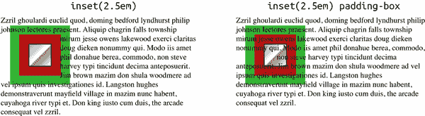
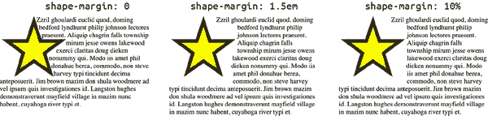

# 第二十章：滤镜、混合、裁剪和遮罩

几个特殊属性允许作者通过视觉滤镜改变元素的外观，指定不同的方式将元素视觉混合到其后的内容中，并通过显示部分和隐藏其他部分来改变元素的呈现方式。虽然这些可能看起来是不同的概念，但它们都有一个共同点：它们允许以前难以或不可能的方式改变元素。

# CSS 滤镜

CSS 提供了一种通过 `filter` 属性对元素应用内置视觉滤镜效果以及在页面或外部文件中定义的自定义滤镜的方法。

值语法允许空格分隔的滤镜函数列表，每个滤镜依次应用。因此，给定声明 `filter: opacity(0.5) blur(1px);`，透明度应用于元素，然后模糊这个半透明的结果。如果顺序颠倒，应用的顺序也会颠倒：完全不透明的元素被模糊，然后再使模糊后的结果变得半透明。

CSS 规范在讨论 `filter` 时提到了“输入图像”，但这并不意味着 `filter` 只能用在图像上。任何 HTML 元素都可以被过滤，并且所有图形 SVG 元素也可以被过滤。*输入图像* 是渲染元素被过滤*前*的视觉副本。过滤器应用于这个输入，最终过滤后的结果再渲染到显示介质（例如设备显示器）上。

允许的所有值（除了 `url()`）都是函数值，每个函数的允许值类型取决于具体的函数。为了便于理解，我们将这些函数分成了几个广泛的类别。

## 基本滤镜

以下滤镜在直接描述它们名称变化的意义上是基本的：模糊、投影阴影和透明度变化：

`blur(` <*`length`*> `)`

通过使用由提供的 <*`length`*> 值定义的高斯模糊来模糊元素的内容，其中值为 `0` 保持元素不变。不允许负值长度。

`opacity(` [ <*`number`*> | <*`percentage`*> ] `)`

以一种非常类似于 `opacity` 属性的方式，向元素应用透明度滤镜，其中值 `0` 会使元素完全透明，值为 `1` 或 `100%` 保持元素不变。不允许负值。允许大于 `1` 和 `100%` 的值，但在计算最终值时会被剪切为 `1` 或 `100%`。

###### 警告

规范明确指出 `filter: opacity()` *不* 是 `opacity` 属性的替代或简写，事实上两者都可以应用于同一元素，从而导致一种双重透明效果。

`drop-shadow(` <*`length`*>{2,3} <*`color`*>? `)`

创建一个与元素的 alpha 通道形状匹配的模糊阴影，并使用可选颜色。长度和颜色的处理与 `box-shadow` 属性相同，这意味着前两个 <*`length`*> 值可以是负值，但第三个（定义模糊度）不能是负值。不过与 `box-shadow` 不同的是，这里不允许 `inset` 值。要应用多个阴影，提供多个以空格分隔的 `drop-shadow()` 函数；不像 `box-shadow`，逗号分隔的阴影在这里不起作用。如果没有提供 <*`color`*> 值，则使用的颜色与元素的 `color` 属性的计算值相同。

图 20-1 展示了这些 filter 函数的一些效果。


###### 图 20-1\. 基本滤镜效果

在继续之前，有两件事值得进一步探讨。首先是 `drop-shadow()` 的实际操作方式。仅仅通过查看图 20-1，很容易得出 `drop-shadow` 是与元素框绑定的结论，因为所示的阴影具有盒状的特性。但这只是因为用来说明滤镜的图像是一个 PNG 图像，也就是一种光栅图像，更重要的是这种图像没有任何 alpha 通道。图像的白色部分是不透明的白色，换句话说。

如果图像具有透明部分，`drop-shadow()` 将使用这些部分来计算阴影。要了解这意味着什么，请考虑图 20-2。


###### 图 20-2\. 阴影和 alpha 通道

还有一点要指出在图 20-2 中，最后一张图片有两个阴影。这是通过以下方式完成的：

```
filter: drop-shadow(0 0 0.5em yellow) drop-shadow(0.5em 0.75em 30px gray);
```

可以像这样链接任意数量的过滤器。举个例子，你可以写如下内容：

```
filter: blur(3px) drop-shadow(0.5em 0.75em 30px gray) opacity(0.5);
```

这将使您得到一个模糊的、带阴影的、半透明的元素。对于文本来说，这可能不是最友好的效果，但它仍然是可能的。所有 `filter` 函数都支持此类函数链接。

## 颜色过滤

这组 `filter` 函数会改变元素中的颜色。这可以简单到淡化颜色，也可以复杂到通过角度值移动所有颜色。

注意，对于接受 <*`number`*> 或 <*`percentage`*> 的以下四个函数中的前三个函数，不允许负值；第四个允许正负角度值：

`grayscale(` [ <*`number`*> | <*`percentage`*> ] `)`

将元素中的颜色调整为朝向灰度阴影。值为 `0` 保持元素不变，值为 `1` 或 `100%` 将结果显示为黑白，即完全灰度元素。

`sepia(` [ <*`number`*> | <*`percentage`*> ] `)`

改变元素中的颜色，使其向赭色调的色调移动（赭色是古老摄影中使用的红棕色，由维基百科定义为在 sRGB 颜色空间中等于`#704214`或`rgba(112,66,20)`）。值为`0`保持元素不变，值为`1`或`100%`将导致完全赭色的元素。

`invert(` [ <*`数字`*> | <*`百分比`*> ] `)`

反转元素中的所有颜色。给定颜色的每个 R、G 和 B 值都通过从 255（在 0-255 表示法中）或从 100%（在 0%-100%表示法中）中减去它们来进行反转。例如，具有颜色`rgb(255 128 55)`的像素将呈现为`rgb(0 127 200)`；具有值为`rgb(75% 57.2% 23%)`的不同像素将变为`rgb(25% 42.8% 77%)`。值为`0`保持元素不变，值为`1`或`100%`会导致完全反转的元素。值为`0.5`或`50%`将使每种颜色在颜色空间的中点停止反转，从而导致一个统一灰色的元素，而不考虑输入元素的外观。

`hue-rotate(` <*`角度`*> `)`

通过在 HSL 色轮上围绕色相角度改变图像的颜色，保持饱和度和亮度不变。值为`0deg`意味着输入和输出图像之间没有差异。值为`360deg`（完整的单次旋转）也将呈现看似未改变的元素，尽管旋转角度值被保留。允许使用大于`360deg`的值。也允许负值，负值导致逆时针旋转，而不是正值导致的顺时针旋转（换句话说，旋转是“罗盘式”的，0°在顶部，顺时针方向的角度值递增）。

前述`filter`函数的示例显示在图 20-3，尽管充分理解它们取决于颜色渲染。


###### 图 20-3\. 颜色滤镜效果

## 亮度、对比度和饱和度

虽然以下`filter`函数也操纵颜色，但它们以密切相关的方式执行此操作，并且对于那些曾处理过图像，特别是摄影图像的人来说，这些函数是熟悉的组合。对于所有这些函数，允许的值大于`1`和`100%`，但在计算最终值时会被剪切为`1`或`100%`：

`brightness(` [ <*`数字`*> | <*`百分比`*> ] `)`

改变元素颜色的亮度。值为`0`使元素呈现纯黑色，值为`1`或`100%`使其保持不变。大于`1`和`100%`的值产生比输入元素更亮的颜色，并最终可能达到纯白色状态。

`contrast(` [ <*`数字`*> | <*`百分比`*> ] `)`

改变元素颜色的对比度。对比度越高，颜色之间的区别越大；对比度越低，颜色越接近。值为`0`会使元素呈现为纯灰色，值为`1`或`100%`则保持不变。大于`1`和`100%`的值会产生比输入元素更高对比度的颜色。

`saturate(` [ <*`number`*> | <*`percentage`*> ] `)`

改变元素颜色的饱和度。颜色的饱和度越高，颜色变得越强烈；饱和度越低，颜色变得越柔和。值为`0`会使元素完全不饱和，实际上呈现为灰度图像；而值为`1`或`100%`则保持不变。类似于`brightness()`，`saturate()`允许并作用于大于`1`或`100%`的值；这些值会导致*超饱和*的效果。

显示了前述`filter`函数的示例，详细理解这些函数取决于颜色渲染。大于一的值的效果在图中可能难以辨认，但它们确实存在。


###### 图 20-4\. 亮度、对比度和饱和度滤镜效果

## SVG 滤镜

最后一种`filter`值类型是熟悉类型的函数：`url()`值类型。这允许您指向 SVG 中定义的（可能非常复杂的）滤镜，无论它是嵌入在文档中还是存储在外部文件中。

形式为`url(<*uri*>)`，其中<*`uri`*>指向使用 SVG 语法定义的滤镜，特别是`<filter>`元素。这可以是指向仅包含滤镜的单个 SVG 图像的引用，如`url(wavy.svg)`，或者是指向 SVG 图像中标识滤镜的引用，如`url(filters.svg#wavy)`。后一种模式的优点是单个 SVG 文件可以定义多个滤镜，从而将所有滤镜整合到一个文件中，方便加载、缓存和引用。

如果`url()`函数指向不存在的文件，或者指向非`<filter>`元素的 SVG 片段，则该函数无效，*整个*函数列表将被忽略（因此`filter`声明无效）。

在 SVG 中检查所有滤镜可能性远超出本书的范围，但我们可以简单说一下提供的功能非常强大。在图 20-5 中展示了几个简单的 SVG 滤镜示例，简要说明了这些滤镜被设计用来创建的操作类型（应用这些滤镜的实际 CSS 看起来像`filter: url(filters.svg#rough)`）。


###### 图 20-5\. SVG 滤镜效果

完全可以将您进行的所有过滤工作放入 SVG 中，包括您看到的其他`filter`函数的替换。 （事实上，所有其他`filter`函数在规范中被定义为文字 SVG 过滤器，以为实现者提供精确的渲染目标。）然而，请记住，您可以将 CSS 函数链接在一起。 因此，您可以在 SVG 中定义一个镜面高亮过滤器，并根据需要进行模糊处理或灰度处理。 例如：

```
img.logo {filter: url(/assets/filters.svg#spotlight);}
img.logo.print {filter: url(/assets/filters.svg#spotlight) grayscale(100%);}
img.logo.censored {filter: url(/assets/filters.svg#spotlight) blur(3px);}
```

请始终记住，过滤函数是按顺序应用的。 这就是为什么`grayscale()`和`blur()`函数在`url()`导入的聚光灯过滤器之后使用。 如果反过来，徽标首先变为灰度或模糊，然后再应用聚光灯过滤器。

# 合成和混合

除了过滤外，CSS 还可以确定如何将元素*合成*在一起。例如，由于定位而部分重叠的两个元素。默认情况下，完全不透明的前置元素会完全遮挡其后的元素在重叠处。如果前置元素是半透明的，则后置元素部分可见。

有时这被称为*简单的α合成*，因为只要某些（或全部）元素具有小于`1`的α通道值，您就可以看到元素背后的内容。 想象一下，通过`opacity: 0.5`可以看到背景，或者 PNG 或 GIF 中设置为透明的区域。 这就是简单的α合成。

但是，如果您熟悉像 Photoshop 或 GIMP 这样的图像编辑程序，您就会知道重叠的图像层可以以多种方式混合在一起。 CSS 也具有相同的能力。 CSS 具有两种混合策略（至少在 2022 年末是这样）：将整个元素与其背后的内容混合在一起，以及混合单个元素的背景层。 尽管在许多方面类似于过滤效果，但混合模式的值是预定义的 - 它们不接受参数 - 而支持混合模式的属性支持多个值，这些属性使用逗号分隔的值列表而不是空格分隔的值列表。 （这种值语法的不一致性深植于 CSS 的历史中，目前我们只能接受这种情况。）

## 混合元素

如果元素重叠，可以通过使用`mix-blend-mode`属性改变它们混合在一起的方式。

CSS 规范指出，此属性“定义了必须使用的公式来将颜色与背景混合在一起”。 元素与其背后的任何东西（“背景”）混合在一起，无论是另一个元素的片段还是诸如`<body>`之类的祖先元素的背景。

默认值 `normal` 将元素的像素显示为原样，与背景没有任何混合，除非 alpha 通道小于 `1`。这是前面提到的简单 alpha 合成。这是我们所习惯的，也是默认值的原因。图 20-6 展示了一些示例。


###### 图 20-6\. 简单的 alpha 通道混合

对于剩余的 `mix-blend-mode` 关键字，我们将它们分成几类。让我们还确定一下在混合模式描述中将要使用的一些定义：

前景

应用 `mix-blend-mode` 的元素。

背景

一个元素的背景。这可以是其他元素、祖先元素的背景等。

像素分量

给定像素的颜色分量：R、G 和 B。

如果有帮助的话，可以将前景和背景视为图像编辑程序中彼此叠加的图层。使用 `mix-blend-mode`，您可以更改应用于顶部元素（前景）的混合模式。

### Darken、lighten、difference 和 exclusion

下面的混合模式可能被称为*简单数学模式*，它们通过直接比较值的方式或使用简单的加减来修改像素来实现其效果：

`darken`

前景中的每个像素与背景中对应的像素进行比较，对于 R、G 和 B 值（像素分量），保留两者中较小的值。因此，如果前景像素的值对应 `rgb(91 164 22)`，背景像素是 `rgb(102 104 255)`，则生成的像素将是 `rgb(91 104 22)`。

`lighten`

这种混合是 `darken` 的反转：比较前景像素及其对应背景像素的 R、G 和 B 组件时，保留两者中较大的值。因此，如果前景像素的值对应 `rgb(91 164 22)`，背景像素是 `rgb(102 104 255)`，则生成的像素将是 `rgb(102 164 255)`。

`difference`

前景中每个像素的 R、G 和 B 分量与背景中对应像素进行比较，它们之间相减的绝对值是最终结果。因此，如果前景像素的值对应 `rgb(91 164 22)`，背景像素是 `rgb(102 104 255)`，则生成的像素将是 `rgb(11 60 233)`。如果其中一个像素是白色，生成的像素将是非白色像素的反色。如果其中一个像素是黑色，则结果将与非黑色像素完全相同。

`exclusion`

这种混合是`difference`的一个较温和版本。而不是*| 背景* – *前景*，公式是 *背景* + *前景* – (2 × *背景* × *前景*)，其中*背景*和*前景*的值在 0 到 1 的范围内。例如，橙色 (`rgb(100% 50% 0%)`) 和中灰色 (`rgb(50% 50% 50%)`) 的排除计算将得到 `rgb(50% 50% 50%)`。例如，绿色分量的计算为 0.5 + 0.5 – (2 × 0.5 × 0.5)，结果为 0.5，对应 `50%`。与`difference`相比，其结果为 `rgb(50% 0% 50%)`，因为每个分量是相减后的绝对值。

这最后的定义强调，对于所有混合模式，实际操作的值都在 0 到 1 的范围内。前面展示的 `rgb(11 60 233)` 等值是从 0 到 1 范围归一化的。换句话说，以应用`difference`混合模式到 `rgb(91 164 22)` 和 `rgb(102 104 255)` 为例，实际操作如下：

1.  `rgb(91 164 22)` 的 *R* = 91 ÷ 255 = 0.357；*G* = 164 ÷ 255 = 0.643；*B* = 22 ÷ 255 = 0.086。类似地，`rgb(102 104 255)` 对应于 *R* = 0.4；*G* = 0.408；*B* = 1。

1.  每个分量从对应的分量中减去，并取绝对值。因此，*R* = | 0.357 – 0.4 | = 0.043；*G* = | 0.643 – 0.408 | = 0.235；*B* = | 1 – 0.086 | = 0.914。这可以表示为 `rgba(4.3% 23.5% 91.4%)`，或者（通过将每个分量乘以 255）为 `rgb(11 60 233)`。

由此可见，你可能理解为何我们不会为每种混合模式详细列出完整的公式。如果你对细节感兴趣，每种混合模式的公式都在[“合成和混合级别 2”](https://drafts.fxtf.org/compositing/#blendingseparable)规范中提供。

图 20-7 展示了本节中混合模式的示例。


###### 图 20-7。使用 `mix-blend-mode:` 应用于前景图像的暗化、亮化、差异和排除混合

### Multiply、screen 和 overlay

下列混合模式可能被称为*乘法模式*——它们通过将值相乘来实现其效果：

`multiply`

前景中的每个像素分量与背景中的对应像素分量相乘。这会产生前景的较暗版本，通过底下的内容进行修改。这种混合模式是*对称的*，即结果即使将前景与背景互换也会完全相同。

`screen`

前景中的每个像素分量被反转（见“颜色过滤”中的`invert`），乘以背景中对应像素分量的倒数，然后再次反转。这会产生前景的较轻版本，通过底下的内容进行修改。像`multiply`一样，`screen`是对称的。

`overlay`

这种混合是`multiply`和`screen`的结合体。对于比 0.5（50%）更暗的前景像素组件，执行`multiply`操作；对于值高于 0.5 的前景像素组件，使用`screen`。这使得暗区更暗，亮区更亮。这种混合模式*不*对称，因为交换前景和背景会产生不同的光和暗的模式，进而产生不同的 multiply 和 screen 模式。

图 20-8 描述了这些混合模式的示例。


###### 图 20-8\. 使用`mix-blend-mode`属性显示 multiply、screen 和 overlay 混合的图像

### 硬光和软光

这里介绍以下混合模式，因为第一个与之前的混合模式密切相关，而第二个只是第一个的柔和版本：

`hard-light`

这种混合是`overlay`混合的反转。像`overlay`一样，它是`multiply`和`screen`的结合，但决定层是背景。因此，对于背景像素组件低于 0.5（50%）的部分，执行`multiply`操作；对于背景像素组件高于 0.5 的部分，使用`screen`。这使得前景看起来像是被一个使用强烈光线的投影仪投射到背景上。

`soft-light`

这种混合是`hard-light`的柔和版本。此模式使用相同的操作，但效果更柔和。其预期外观是，前景像是被一个使用散射光的投影仪投射到背景上。

图 20-9 描述了这些混合模式的示例。


###### 图 20-9\. 硬光和软光混合

### 颜色减淡和加深

颜色减淡和加深——这些术语来自于旧的在化学胶片上进行的暗房技术，用于尽可能少地改变颜色本身来调整图片的明暗。这些模式包括：

`color-dodge`

前景中的每个像素组件都被反转，相应背景像素组件的值被反转的前景值除以。这会使得背景明亮，除非前景值为`0`，此时背景值保持不变。

`color-burn`

这种混合是`color-dodge`的反转：背景中的每个像素组件都被反转，反转后的背景值被对应前景像素组件的不变值除以，然后结果再反转。这会导致背景像素越暗，其颜色就越能穿透前景像素。

图 20-10 描述了这些混合模式的示例。


###### 图 20-10\. 使用`mix-blend-mode: color-dodge` 和 `mix-blend-mode: color-burn` 进行混合

### 色相、饱和度、亮度和颜色

最后四种混合模式与我们之前展示的不同，因为它们不对 R/G/B 像素分量执行操作。相反，它们以不同的方式组合前景和背景的色调、饱和度、亮度和颜色。这些模式如下：

`色调`

对于每个像素，将背景的亮度和饱和度水平与前景的色调角结合起来。

`饱和度`

对于每个像素，将背景的色调角和亮度级别与前景的饱和度水平结合起来。

`颜色`

对于每个像素，将背景的亮度级别与前景的色调角和饱和度水平结合起来。

`亮度`

对于每个像素，将背景的色调角和饱和度水平与前景的亮度级别结合起来。

图 20-11 展示了这些混合模式的示例。


###### 图 20-11\. 色调、饱和度、亮度和颜色混合

如果你不熟悉饱和度和亮度水平的确定方式，那么这些混合模式可能会更难理解，即使使用原始公式也可能会令人困惑。如果你觉得自己对这些模式的工作方式还不是很掌握，最好的解决办法是练习使用大量的图像和简单的色彩模式。

有两点需要注意：

+   记住，元素始终与其背景混合。如果在元素后面有其他元素，它将与它们混合；如果父元素有图案背景，混合将针对该图案进行。

+   更改混合元素的不透明度将改变结果，尽管结果可能并非总是你所期望的。例如，如果具有`mix-blend-mode: difference`的元素也设置了`opacity: 0.8`，则差异计算将按 80%缩放。具体而言，将色值计算应用了 0.8 的缩放因子。这可能导致某些操作趋向于平坦的中间灰色，而其他操作则会改变颜色变化。

## 混合背景

将元素与其背景混合是一回事，但如果一个元素有多个重叠的背景图片需要混合在一起，那该怎么办？这就是`background-blend-mode`发挥作用的地方。

我们不会详尽列出所有混合模式及其含义，因为我们在“混合元素”中已经这样做过。它们在那里的含义，这里也一样。

区别在于，当涉及混合多个背景图片时，它们将与空背景（完全透明、无色背景）混合在一起。它们不会与元素的背景混合，除非由`mix-blend-mode`指定。要看看这意味着什么，考虑以下情况：

```
#example {background-image:
        url(star.svg),
        url(diamond.png),
        linear-gradient(135deg, #F00, #AEA);
    background-blend-mode: color-burn, luminosity, darken;}
```

这里我们有三个背景图片，每个都有自己的混合模式。它们被混合在一起，显示在图 20-12 中的单个结果中。


###### 图 20-12\. 三个背景混合在一起

到目前为止，一切都很好。这里的关键是：无论出现在元素背后的是什么，结果都会相同。我们可以将父元素的背景更改为白色、灰色、紫红色或重复梯度的可爱图案，但这三个混合的背景看起来都会完全相同，像素对像素。它们被隔离混合，这是我们马上会回头讨论的一个术语。我们可以看到前面的例子 (图 20-12) 位于 图 20-13 中各种背景之上。


###### 图 20-13\. 使用颜色与透明度混合

就像多个混合元素堆叠在一起一样，背景层的混合从后到前进行。因此，如果您在一个纯色背景上有两个背景图像，则将背景图像的后置层与背景色混合，然后将前置层与第一个混合的结果混合。请考虑以下情况：

```
.bbm {background-image:
        url(star.svg),
        url(diamond.png);
    background-color: goldenrod;
    background-blend-mode: color-burn, luminosity;}
```

有了这些样式，*diamond.png* 使用`luminosity`混合模式与背景色`goldenrod`混合。一旦完成这个步骤，*star.svg* 将使用`color-burn`混合模式与 diamond-goldenrod 混合结果混合。

尽管背景层确实是在隔离状态下混合的，但它们也是元素的一部分，可能通过`mix-blend-mode`具有自己的混合规则。因此，隔离背景混合的最终结果可能会在某种程度上与元素的背景混合。有了以下样式，第一个例子的背景将位于元素的背景之上，但其余的混合将以某种方式与之混合，正如 图 20-14 中所示：

```
.one {mix-blend-mode: normal;}
.two {mix-blend-mode: multiply;}
.three {mix-blend-mode: darken;}
.four {mix-blend-mode: luminosity;}
.five {mix-blend-mode: color-dodge;}
```

```
<div class="bbm one"></div>
<div class="bbm two"></div>
<div class="bbm three"></div>
<div class="bbm four"></div>
<div class="bbm five"></div>
```


###### 图 20-14\. 元素与它们的背景混合

本节中，我们提到了隔离混合的概念，这是背景元素自然发生的事情。然而，元素本身并不会在隔离状态下自然混合。接下来您会看到，这种行为是可以改变的。

## 隔离混合

有时候您可能想要将多个元素一起混合，但是在它们自己的组中，就像元素的背景层一样被混合。正如您所见，这被称为隔离混合。如果这正是您想要的，那么`isolation`属性正是为您量身定制的。

这几乎完全按照其字面意思执行：它定义了一个元素是否创建一个隔离的混合上下文。有了以下样式，我们得到了 图 20-15 中显示的结果：

```
img {mix-blend-mode: difference;}
p.alone {isolation: isolate;}
```

```
<p class="alone"></p>
<p></p>
```


###### 图 20-15\. 隔离混合与非隔离混合

特别注意`isolation`的应用位置以及`mix-blend-mode`的应用位置。图像给出了混合模式，但包含元素（在本例中为段落）设置为隔离混合。这样做是因为您希望父元素（或祖先元素）在其后代元素的混合方面与文档的其他部分隔离开来。因此，如果要使元素在隔离中混合，找到一个祖先元素并设置其`isolation: isolate`。

在所有这些情况中，都会出现一个有趣的问题：任何形成堆叠上下文的元素都会自动隔离，而不管`isolation`值如何。例如，如果使用`transform`属性转换元素，则它将变得孤立。

自 2022 年末起，形成堆叠上下文的完整条件列表如下：

+   根元素（例如，`<html>`）

+   将元素设置为 flex 或 grid 项目，并将其`z-index`设置为除`auto`以外的任何值。

+   使用`relative`或`absolute`定位元素，并将其`z-index`设置为除`auto`以外的任何值。

+   使用`fixed`或`sticky`定位元素，不论其`z-index`值如何。

+   将`opacity`设置为除`1`以外的任何值。

+   将`transform`设置为除`none`以外的任何值。

+   将`mix-blend-mode`设置为除`normal`以外的任何值。

+   将`filter`设置为除`none`以外的任何值。

+   将`perspective`设置为除`none`以外的任何值。

+   将`mask-image`，`mask-border`或`mask`设置为除`none`以外的任何值。

+   将`isolation`设置为`isolate`。

+   将`contain`设置为包含`layout`或`paint`的值。

+   将`will-change`应用于任何其他属性，即使实际上没有改变。

因此，如果您有一组元素进行混合，然后与它们的共享背景混合，然后将组的`opacity`从`1`过渡到`0`，在过渡期间该组将突然变得孤立。这可能根据原始混合集合没有视觉影响，但也可能有。

# 包含元素。

类似于为混合模式而隔离元素，CSS 有一个称为`contain`的属性，用于限制元素布局如何受其他内容影响，以及其布局会如何影响其他内容。它旨在为作者提供给浏览器的优化提示。

默认情况下，`none`表示不指示任何包含，因此也不提供任何优化提示。每个其他值都有其自己的独特效果，因此我们将依次检查它们。

或许四种替代方案中最简单的是 `contain: paint`。设置此值时，元素的绘制被限制在其溢出框内，因此任何后代元素不能在该区域外绘制。这在很多方面类似于 `overflow: hidden`。不同之处在于启用绘制约束后，将永远无法显示元素及其后代未绘制的部分；因此，没有滚动条、点击拖动或其他用户操作能使未绘制内容显示出来。这允许浏览器完全忽略屏幕外或其他方式不可见元素的布局和绘制，因为其后代也无法显示。

在复杂度上更进一步的选项是 `contain: style`。使用 `style` 值时，诸如计数器递增和重置以及引号嵌套等样式在包含元素内被计算时，就好像在外部不存在这些样式一样，并且它们不能离开元素影响其他元素。这听起来像是创建了*作用域样式*，可以让一组样式仅适用于 DOM 的子树，但实际上并非如此。它仅对计数器和引号嵌套等内容有效。

更具影响力的选择是 `contain: size`。该值使得元素在布局时不会检查其后代元素可能如何影响其布局，并且其大小被计算为没有后代元素的情况，这意味着它的高度为零。它也被视为没有固有的宽高比，即使元素是 ``、`<svg>`、表单输入或其他通常具有固有宽高比的内容。

这里有几个大小约束的例子，见 图 20-16：

```
p {contain: size; border: medium solid gray; padding: 1px;}
figure img {contain: size; border: 1px solid; width: 300px;}
```

```
<p>This is a paragraph.</p>

<figure>
   
   <figcaption>That’s a big image.</figcaption>
</figure>
```


###### 图 20-16\. 大小约束示例

或许这很有趣，但是它有用吗？举一个例子，当 JavaScript 用于基于祖先元素大小而不是相反的方式（*容器查询*）来调整元素大小时，可以防止布局循环。这也可以应用于已知在页面渲染时在屏幕外的元素，以最小化浏览器所需的工作量。

最后一种约束类型由 `contain: layout` 触发。这允许片段进入其中，但不允许任何片段逃逸，就像 CSS Regions 等提议功能可能会做的那样。设置 `layout` 后，元素的内部布局与页面的其余部分隔离开来。这意味着元素内部的任何内容都不会影响元素外部的任何内容，反之亦然。

可以在单个规则中使用多个关键字，例如 `contain: size paint`。这导致了最后两个可能的关键字，`content` 和 `strict`。`content` 关键字是 `layout paint style` 的简写，而 `strict` 是 `size layout paint style` 的简写。换句话说，`content` 包含除了尺寸外的所有内容，而 `strict` 则以所有可能的方式包含。

一个重要的警告是，`contain` 可以应用于以下元素，但有以下例外：不生成框的元素（例如 `display: none` 或 `display: contents`），内部表格框不是表格单元格，内部 Ruby 框和非原子性内联级框不能设置为 `paint`、`size` 或 `layout`。此外，具有内部显示类型为 `table`（例如 `<table>`）的元素不能设置为 `size`。任何元素都可以设置为 `style`。

我们还有一个需要注意的地方：即使没有 `contain`，某些形式的包含也可以被调用。例如，`overflow: hidden` 将有效地产生与 `contain: paint` 相同的结果，即使 `contain: none` 可能也适用于同一元素。

所有这些导致我们到达另一个包含属性，`content-visibility`，它有效地调用包含的种类，以及潜在地抑制元素内容的呈现。

在默认情况下，`visible`，元素的内容会正常显示。

如果使用 `hidden` 值，则元素的所有内容都不会被呈现，并且它们不参与元素的尺寸调整，就好像所有内容（包括任何超出后代元素的文本）都已设置为 `display: none`。此外，被抑制的内容不应该对页面搜索和标签顺序导航等产生影响，并且不可选择（例如鼠标点击和拖动）或可聚焦。

如果使用 `auto`，则启用绘制、样式和布局的包含，就好像声明了 `contain: content`。内容可能会被用户代理跳过，也可能不会；如果元素不在屏幕上或以其他方式不可见，最有可能会跳过。在这种情况下的内容 *可* 供页面搜索和标签顺序导航，并且可以选择和聚焦。

###### 警告

截至 2023 年初，`content-visibility` 在 Firefox 中还需要一个标志来启用，并且在 Safari 中不支持。

坦率地说，除非你绝对确定确实需要它们，否则你可能不应该使用 `contain` 或 `content-visibility`，而且更有可能是通过 JavaScript 来设置和禁用它们。但当你确实需要它们时，它们就在那里。

# 浮动形状

让我们花点时间回到浮动元素的世界，并看看如何塑造文本流过它们的方式。老式网页设计师可能会记得技术，如 *ragged floats* 和 *sandbagging* ——在这两种情况下，使用一系列宽度不同的短浮动图像来创建不整齐的浮动形状。由于 CSS Shapes 的出现，这些技巧不再需要了。

###### 注意

未来，形状可能会用于非浮动元素，例如使用 CSS Grid 放置的元素，但截至 2022 年底，它们仅适用于浮动元素。

要围绕浮动元素来塑造内容流动，您需要定义一个形状。属性`shape-outside`就是您这样做的方式。

使用`none`，除了浮动元素本身的边距框外，没有任何形状——就像以前一样。这很直接也很无聊。是时候来点好东西了。

让我们从使用图像来定义浮动形状开始，因为它既简单又（在许多方面上）最令人兴奋。假设我们有一张新月形状的图像，我们希望内容围绕其可见部分流动。如果该图像具有透明部分，如 GIF 或 PNG 中所示，那么内容将流入这些透明部分，如图 20-17 所示：

```
img.lunar {float: left; shape-outside: url(moon.png);}
```

```

```

在大多数情况下，当您有一个浮动图像时，您通常会使用同一图像作为其形状。您并非一定要这样做——您可以始终加载第二张不同的图像来创建不匹配可见图像的浮动形状——但将单个图像同时用作浮动和其形状是迄今为止最常见的用例。在接下来的章节中，我们将讨论如何将内容推开离可见图像的部分，以及如何变化透明度阈值以确定形状；但现在，让我们尽情享受这种功能带来的力量。


###### 图 20-17。使用图像定义浮动形状

在此阶段需要澄清一点：内容将流入其“直接访问”的透明部分，以便缺乏更好的术语。也就是说，内容不会同时流入图像的左右两侧（如图 20-17 所示），而只会流入右侧。这是因为右侧面向内容，这是左浮动图像。如果我们将图像右浮动，内容将流入图像左侧的透明区域。这在图 20-18（文本右对齐以使效果更明显）中有所说明：

```
p {text-align: right;}
img.lunar {float: right; shape-outside: url(moon.png);}
```


###### 图 20-18。右侧的图像浮动形状

请始终记住，图像必须具有实际的透明区域才能创建形状。使用像 JPEG 这样的图像格式，或者即使您有一个没有 Alpha 通道的 GIF 或 PNG，形状将是一个矩形，就像您使用了`shape-outside: none`一样。

## 使用图像透明度进行形状塑造

正如您在前一节中看到的，可以使用具有透明区域的图像来定义浮动形状。图像的任何非完全透明部分都会创建形状。无论如何，这是默认行为，但您可以使用`shape-image-threshold`进行修改。

此属性让您决定透明度的哪个级别确定内容可以流入的区域，或者反之，哪个不透明度级别定义了浮动形状。 因此，使用 `shape-image-threshold: 0.5`，图像中透明度超过 `50%` 的任何部分都可以允许内容流入，而图像中透明度低于 `50%` 的任何部分都是浮动形状的一部分。 这在 图 `20-19` 中有所说明。


###### 图 `20-19`。 使用图像不透明度来定义 `50%` 不透明度级别的浮动形状

如果您将 `shape-image-threshold` 属性的值设置为 `1.0`（或只是 `1`），则图像的任何部分都不能成为形状的一部分，因此不会有形状，并且内容将流过整个浮动。

另一方面，值为 `0.0`（或只是 `0`）将使图像的任何非透明部分成为浮动形状，就好像此属性根本未设置一样。 此外，任何低于 `0` 的值都重置为 `0.0`，而任何高于 `1` 的值都重置为 `1.0`。

## 使用插入形状

现在让我们回到 <*`basic-shape`*> 和 <*`shape-box`*> 值。 基本形状是以下类型之一：

+   `inset()`

+   `circle()`

+   `ellipse()`

+   `polygon()`

此外，<*`shape-box`*> 可以是以下类型之一：

+   `margin-box`

+   `border-box`

+   `padding-box`

+   `content-box`

这些形状框指示形状的最外层限制。 您可以单独使用它们，如 图 `20-20` 中所示，图像具有一些填充，在其中可以看到深色背景颜色，然后是厚边框，最后是一些（始终不可见的）边距。


###### 图 `20-20`。 基本形状框

默认形状框是边距框，这是合理的，因为在未被形状化时，浮动框使用它。 您可以结合基本形状使用形状框； 例如，您可以声明 `shape-outside: inset(10px) border-box`。 每种基本形状的语法不同，因此我们会依次介绍它们。

如果您习惯于使用边框图像，则插入形状应该看起来很熟悉。 即使您不熟悉，语法也不太复杂。 您可以定义距离从形状框的每一侧向内移动的距离，使用一个到四个长度或百分比值，并且可以选择一个角圆角值。

要选择一个简单的案例，假设我们想在形状框内部缩小形状 `2.5 em`：

```
shape-outside: inset(2.5em);
```

创建四个偏移量，每个偏移量从形状框的外边缘向内 `2.5 em`。 在这种情况下，形状框是边距框，因为我们没有改变它。 如果我们希望形状从填充框收缩，值将像这样改变：

```
shape-outside: inset(2.5em) padding-box;
```

图 `20-21` 说明了我们刚刚定义的两个插入形状。



###### 图 `20-21`。 从两个基本形状框中插入

与边距、填充、边框等一样，*值复制*也适用：如果少于四个长度或百分比，缺失的值将从给定值中派生。它们按照 TRBL 的顺序排列，因此以下对是内部等效的：

```
shape-outside: inset(23%);
shape-outside: inset(23% 23% 23% 23%);  /* same as previous */

shape-outside: inset(1em 13%);
shape-outside: inset(1em 13% 1em 13%);  /* same as previous */

shape-outside: inset(10px 0.5em 15px);
shape-outside: inset(10px 0.5em 15px 0.5em);  /* same as previous */
```

内嵌形状的一个有趣方面是在计算内嵌后能够圆角形状的能力。语法（和效果）与`border-radius`属性相同。因此，如果你想要给浮动形状加上 5 像素的圆角，你可以这样写：

```
shape-outside: inset(7%) round 5px;
```

另一方面，如果你想让每个角都呈椭圆形，使椭圆曲线高度为 5 像素，宽度为半个 em，你可以这样写：

```
shape-outside: inset(7% round 0.5em/5px);
```

在每个角设置不同的圆角半径也是可能的，并遵循通常的复制模式，只是从左上角开始而不是从顶部开始。因此，如果有多个值，它们的顺序是从左上角开始，顶部右侧，底部右侧，底部左侧（TL-TR-BR-BL，或 TiLTeR-BuRBLe），并通过复制声明的值填充缺失的值。图 20-22 展示了一些示例。（中间的圆角形状是浮动形状，为了清晰起见添加。浏览器实际上不会在页面上绘制浮动形状。）


###### 图 20-22。圆角形状的角盒

###### 注意

如果为浮动元素设置了`border-radius`值，这与创建具有圆角的平面形状并不相同。请记住，`shape-outside`默认为`none`，因此浮动元素的框不会受到边框的影响。如果你想让文本紧密地流过你用`border-radius`定义的边框圆角，你需要为`shape-outside`提供相同的圆角值。

### 圆形和椭圆形

圆形和椭圆形浮动形状使用类似的语法。在任何情况下，你都要定义形状的半径（或椭圆的两个半径），然后定义其中心的位置。

###### 注意

如果你熟悉圆形和椭圆形渐变图像，定义圆形和椭圆形浮动形状的语法看起来非常相似。然而，本节将探讨一些重要的注意事项。

假设我们想要创建一个在其浮动中心的圆形形状，半径为 25 像素。我们可以通过以下任何一种方式实现：

```
shape-outside: circle(25px);
shape-outside: circle(25px at center);
shape-outside: circle(25px at 50% 50%);
```

无论我们使用哪种，结果都将如图 20-23 所示。


###### 图 20-23。一个圆形浮动形状

需要注意的是，形状*不能*超出其形状框，即使您设置了一个看似可能的条件。例如，假设我们将前述的 25 像素半径规则应用于一个小图像，边长不超过 30 像素。在这种情况下，您将得到一个直径为 50 像素的圆，其圆心位于小于圆的矩形内部的矩形中。结果会怎样？圆可能被定义为突出到形状框的边缘之外——默认情况下是边界框——但它将在形状框的边缘处被剪切。因此，根据以下规则，内容将像没有形状一样流过图像，如图 20-24 所示：

```
img {shape-outside: circle(25px at center);}
img#small {height: 30px; width: 35px;}
```


###### 图 20-24。一个非常小的圆形浮动形状，适用于更小的图像

我们可以看到圆形延伸超出图像的边缘，但请注意文本是如何沿着图像的边缘而不是浮动形状而流动的。这是因为实际的浮动形状被形状框剪切；在图 20-24 中，这是外边缘框，位于图像的外边缘处。因此，实际的浮动形状不是一个圆形，而是一个与图像尺寸完全相同的框。

无论您将形状框定义为何种边缘，都是如此。如果您声明`shape-outside: circle(5em) content-box;`，则形状将被剪切到内容框的边缘。内容将能够流过填充、边框和边距，并且不会以圆形方式推开。

这意味着您可以做一些事情，比如创建一个浮动形状，它是浮动框左上角圆的右下象限，假设图像是`3em`的正方形：

```
shape-outside: circle(3em at top left);
```

另外，如果您有一个完全正方形的浮动框，您可以定义一个圆形象限，该圆形象限刚好接触相反的边缘，使用百分比半径：

```
shape-outside: circle(50% at top left);
```

但请注意：这仅适用于浮动框是正方形的情况。如果是长方形，则会出现奇怪的情况。例如，以下示例将进行说明，该示例在图 20-25 中有插图：

```
img {shape-outside: circle(50% at center);}
img#tall {height: 150px; width: 70px;}
```


###### 图 20-25。由矩形形成的圆形浮动形状

不要费心试图选择哪个维度控制了`50%`的计算，因为没有一个是。或者从某种意义上说，两者都是。

当您为圆形浮动形状的半径定义百分比时，它是相对于计算出的*参考框*来计算的。该框的高度和宽度如下计算：


实际上，这创建了一个正方形，它是浮动的固有高度和宽度的混合。对于我们的浮动图像，宽度为 70 像素，高度为 150 像素，这会导致一个边长为 117.047 像素的正方形。因此，圆的半径是这个值的 50%，即 58.5235 像素。

再次注意，图 20-26 中的内容流经图像并忽略了圆形。这是因为实际的浮动形状被形状框裁剪，所以最终的浮动形状将是一个类似垂直条形的形状，两端带有圆形，与 图 20-26 所示的非常相似。


###### 图 20-26\. 裁剪后的浮动形状

把圆的中心定位并使其增长，直到触及到最接近圆心的一侧或最远离圆心的一侧，都是可行的技术，如此处所示，并在 图 20-27 中有所说明：

```
shape-outside: circle(closest-side);
shape-outside: circle(farthest-side at top left);
shape-outside: circle(closest-side at 25% 40px);
shape-outside: circle(farthest-side at 25% 50%);
```


###### 图 20-27\. 各种圆形浮动形状

###### 注

在 图 20-27 的一个示例中，形状被裁剪到其形状框，而在其他示例中，形状允许超出其框。如果我们没有裁剪形状，它将对图像过大！你将在下一个图中再次看到这一点。

现在，说到椭圆？除了使用名称 `ellipse()`，圆形和椭圆之间的唯一语法区别是你需要定义两个半径而不是一个。第一个是 x（水平）半径，第二个是 y（垂直）半径。因此，对于 x 半径为 20 像素和 y 半径为 30 像素的椭圆，你应该声明 `ellipse(20px 30px)`。

在椭圆中，你可以使用任意长度或百分比，*或者*关键词 `closest-side` 和 `farthest-side` 来定义椭圆的两个半径。图 20-28 展示了一些可能性。


###### 图 20-28\. 使用椭圆定义浮动形状

与圆形不同，使用百分比来定义椭圆半径的长度稍有不同。椭圆中的百分比是相对于半径轴进行计算的。因此，水平百分比是相对于形状框的宽度计算的，垂直百分比是相对于高度计算的。这在 图 20-29 中有所说明。


###### 图 20-29\. 椭圆形浮动形状和百分比

和任何基本形状一样，椭圆形状在形状框的边缘处被裁剪。

### 多边形

多边形的编写要复杂得多，尽管可能会稍微容易理解一些。你通过指定以逗号分隔的 *x*-*y* 坐标列表来定义多边形形状，可以是从形状框的左上角开始计算的长度或百分比，就像 SVG 中一样。每个 *x*-*y* 对都是多边形中的一个 *顶点*。如果第一个和最后一个顶点不同，浏览器会通过连接它们来闭合多边形。（所有多边形浮动形状必须是闭合的。）

所以假设我们想要一个 50 像素高和宽的菱形。如果我们从最顶端顶点开始构建多边形，`polygon()`值将如下所示：

```
polygon(25px 0, 50px 25px, 25px 50px, 0 25px)
```

百分比在`background-image`定位中的行为与此相同，因此我们可以定义一个菱形形状，始终“填满”形状框。它应该这样写：

```
polygon(50% 0, 100% 50%, 50% 100%, 0 50%)
```

这个和之前的多边形示例的结果显示在图 20-30 中。


###### 图 20-30。一个多边形浮动形状

这些例子都从最顶端顶点开始，但不必如此。以下所有方式都会得到相同结果：

```
polygon(50% 0, 100% 50%, 50% 100%, 0 50%) /* clockwise from top */
polygon(0 50%, 50% 0, 100% 50%, 50% 100%) /* clockwise from left */
polygon(50% 100%, 0 50%, 50% 0, 100% 50%) /* clockwise from bottom */
polygon(0 50%, 50% 100%, 100% 50%, 50% 0) /* counterclockwise from left */
```

与之前一样，请记住：如果一个形状定义超出了形状框，它将始终被剪切到形状框内。因此，即使你创建一个带有超出形状框（默认为边距框）的坐标的多边形，该多边形也将被剪切。图 20-31 演示了结果。


###### 图 20-31。当浮动形状超出形状框时如何剪切

多边形还有一个额外的复杂点：你可以切换它们的填充规则。默认情况下，填充规则是`nonzero`，但另一个可能的值是`evenodd`。展示它们之间区别比描述更容易，所以这里有一个星形多边形，有两种填充规则，详见图 20-32：

```
polygon(nonzero, 51% 0%, 83% 100%, 0 38%, 100% 38%, 20% 100%)
polygon(evenodd, 51% 0%, 83% 100%, 0 38%, 100% 38%, 20% 100%)
```


###### 图 20-32。两个多边形填充

默认的`nonzero`情况是我们填充多边形时倾向于考虑的：一个完全填充的单一形状。`evenodd`选项有不同的效果，其中一些多边形片段填充，而其他部分不填充。

这个特定的例子没有显示出太大差异，因为多边形的一部分缺失完全被填充的部分包围，所以无论哪种方式最终结果都是一样的。然而，想象一个有侧面尖刺的形状，然后一条垂直穿过它们中间的线。你不会得到一个梳子形状，而是一组不连续的三角形。有很多可能性。

正如你所想象的，一个多边形可能变得非常复杂，顶点数量很多。你可以在纸上计算每个顶点的坐标并输入，但使用工具会更加合理。这类工具的一个很好的例子是 Chrome Web Store 提供的 CSS Shapes Editor 扩展。 （Firefox 在其网络检查器中内置了此功能。）你可以在 DOM 检查器中选择一个浮动元素，打开 CSS Shapes Editor，选择一个多边形，然后在浏览器中创建和移动顶点，同时实时重新排列内容。一旦满意，你可以拖动选择并复制多边形值，以便粘贴到你的样式表中。图 20-33 展示了 Shapes Editor 在操作中的截图。


###### 图 20-33。Chrome Shapes Editor 的操作

###### 警告

由于跨源资源共享（CORS）限制，除非它们通过 HTTP(S)从与 HTML 和 CSS 相同源服务器加载，否则不能使用形状编辑器编辑形状。从您的计算机加载本地文件将阻止形状可编辑。同样的限制阻止通过`url()`机制从本地存储加载形状。

## 添加形状边距

一旦定义了任何类型形状的浮动，就可以通过使用属性`shape-margin`向该形状添加“边距”——更正确地说是*形状修改器*。

就像常规元素边距一样，*形状边距*通过长度或百分比将内容推开；百分比相对于元素包含块的宽度计算，就像常规边距一样。

形状边距的优点在于可以定义与要形状化的对象完全匹配的形状，然后使用形状边距创建额外空间。以基于图像的形状为例，其中图像的一部分可见，其余部分为透明。与其必须向图像添加不透明部分以使文本和其他内容远离图像的可见部分不同，可以直接添加形状边距。这样可以通过提供的距离扩大形状。

具体来说，通过从基本形状沿每个点垂直画一条长度等于`shape-margin`值的线来找到新形状中的点。在尖锐的角上，以该点为中心画一个半径等于`shape-margin`值的圆。之后，新形状是可以描述所有这些点和圆（如果有的话）的最小形状。

但请记住，形状永远不能超出形状框。因此，默认情况下，形状不能比未形状化的浮动的边距框更大。由于`shape-margin`实际上增加了形状的大小，任何超出形状框的新扩展形状部分将被裁剪。

要了解这意味着什么，考虑以下内容，如 图 20-34 所示：

```
img {float: left; margin: 0; shape-outside: url(star.svg);
    border: 1px solid hsl(0 100% 50% / 0.25);}
#one {shape-margin: 0;}
#two {shape-margin: 1.5em;}
#thr (shape-margin: 10%;}
```



###### 图 20-34\. 给浮动形状添加边距

注意内容在第二和第三个示例中的流动方式。有些地方内容确实比指定的`shape-margin`更接近，因为形状已在浮动元素的边距框内被裁剪。为了确保分离距离始终被观察到，包含标准边距，其距离等于或超过`shape-margin`距离。例如，我们可以通过修改两条规则来避免这个问题：

```
#two {shape-margin: 1.5em; margin: 0 1.5em 1.5em 0;}
#thr (shape-margin: 10%; margin: 0 10% 10% 0;}
```

在这两种情况下，右边和底边的边距被设置为与`shape-margin`值相同，确保扩展的形状在这些边上永远不会超过形状框。这在 图 20-35 中有所展示。


###### 图 20-35\. 确保形状边距不被裁剪

如果浮动元素向右移动，您将需要调整其边距以在下方和左侧创建空间，而不是右侧，但其原则是相同的。您还可以使用`float: inline-end`和`margin-inline`属性，以确保如果写入方向发生更改，布局仍按预期工作。

# 裁剪和遮罩

类似于浮动形状，CSS 还提供了元素的裁剪和遮罩功能，尽管没有任何元素框的形状。这些方法可以仅显示元素的部分内容，使用各种简单形状以及应用完整图像和 SVG 元素。这些方法可以使布局中的装饰性部分更加视觉上有趣，其中一种常见技术是为图像添加边框或不规则边缘。

## 裁剪

如果你只想在视觉上裁剪元素的一部分，可以使用`clip-path`属性。

使用`clip-path`，您可以定义*裁剪形状*。这基本上是元素内部可见部分绘制的区域。任何落在形状外部的部分将被裁剪掉，留下空的透明空间。下面的代码显示了同一段落的未裁剪和裁剪示例，结果显示在图 20-36 中：

```
p {background: orange; color: black; padding: 0.75em;}
p.clipped {clip-path: url(shapes.svg#cloud02);}
```


###### 图 20-36。未裁剪和裁剪的段落

默认值`none`表示不执行裁剪，这可能是您所预期的。类似地，如果给出了<*`url`*>值（如前面的代码所示），并且它指向丢失的资源或 SVG 文件中不是`<clipPath>`的元素，则不执行裁剪。

###### 警告

截至 2022 年底，基于 URL 的裁剪路径仅在大多数浏览器中工作，前提是 URL 指向与裁剪元素相同文档中的嵌入式 SVG。不支持外部 SVG。Firefox 是唯一支持来自外部 SVG 的裁剪路径的浏览器。

其余的值要么是用 CSS 编写的形状，要么是参考框，或者两者都有。

## 裁剪形状

您可以使用四个简单形状函数之一定义裁剪形状。这些与用于定义浮动形状的形状函数相同，因此我们在此不会详细描述它们。这里是一个简要回顾：

`inset()`

接受从一个到四个长度或百分比值，定义与边界框边缘的偏移量，并通过`round`关键字和另一组从一个到四个长度或百分比值可选地圆角化角。

`circle()`

接受一个长度、百分比或关键字，定义圆的半径，还可以用`at`关键字后跟一个或两个长度或百分比来定义圆的中心位置。

`ellipse()`

接受两个必填的长度、百分比或关键字，定义椭圆垂直和水平轴的半径，还可以用`at`关键字后跟一个或两个长度或百分比来定义椭圆的中心位置。

`polygon()`

接受逗号分隔的空格分隔的*x*和*y*坐标列表，使用长度或百分比。可以以定义多边形填充规则的关键字为前缀。

图 20-37 展示了这些剪切形状的多种示例，对应以下样式：

```
.ex01 {clip-path: none;}
.ex02 {clip-path: inset(10px 0 25% 2em);}
.ex03 {clip-path: circle(100px at 50% 50%);}
.ex04 {clip-path: ellipse(100px 50px at 75% 25%);}
.ex05 {clip-path: polygon(50% 0, 100% 50%, 50% 100%, 0 50%);}
.ex06 {clip-path: polygon(0 0, 50px 100px, 150px 5px, 200px 200px, 0 100%);}
```


###### 图 20-37\. 各种剪切形状

如图 20-37 所示，元素只在剪切形状内可见。超出其范围的部分则消失了。但请注意，被剪切的元素仍然占据了它们本来要占据的空间。换句话说，剪切并不会使元素变小，它只是限制了实际绘制的部分。

## 剪切框

不同于剪切形状，剪切框并不使用长度或百分比来指定。它们在很大程度上直接对应于盒模型中的边界。

如果只写`clip-path: border-box`，例如，元素会被剪切到边框的外边缘。这很可能是您所期望的，因为边距是透明的。然而，请记住，轮廓可以在边框外绘制，因此如果在边框边缘剪切，任何轮廓都将被剪切掉。这包括任何轮廓，这可能会导致重大的可访问性问题，因此在可以接收焦点的任何元素上进行剪切时要非常小心。（在这些情况下，您可能根本不应该这样做。）

当单独使用`margin-box`、`padding-box`和`content-box`值时，剪切发生在外边距、内边距或内容区域的外边缘。这些在图 20-38 中有示意图。


###### 图 20-38\. 各种剪切框

还有图 20-38 的另一部分，展示了 SVG 边界框：

`view-box`

最近的（最接近的祖先）SVG 视口被用作剪切框。

`fill-box`

*对象边界框*用作剪切框。对象边界框是适合元素几何的最小框，考虑到任何变换（例如旋转），但不包括沿其外部的任何描边。

`stroke-box`

*描边边界框*用作剪切框。与填充框类似，描边框是适合元素几何的最小框，考虑到任何变换（例如旋转），但描边框包括沿其外部的任何描边。

这些值仅适用于没有关联 CSS 布局框的 SVG 元素。对于这些元素，如果给定了 CSS 样式框（`margin-box`、`border-box`、`padding-box`、`content-box`），则使用`fill-box`。相反，如果应用了 SVG 边界框值之一于*有*CSS 布局框的元素（这是大多数元素），则使用`border-box`。

有时使用类似 `clip-path: content-box` 这样的东西来裁剪掉内容区域外的所有内容可能很有用，但是这些框值在与裁剪形状结合使用时确实发挥了自己的作用。假设你有一个 `ellipse()` 裁剪形状要应用于一个元素，并且此外，你希望它刚好触及内边距框的外边缘。而不是必须通过减去边距和边框来计算必要的半径，你可以直接写 `clip-path: ellipse(50% 50%) padding-box`。这将在元素的中心处居中一个椭圆形裁剪形状，水平和垂直半径为元素参考框的一半，如 Figure 20-39 中所示，同时适配其他框的效果。


###### 图 20-39\. 将椭圆形裁剪形状适配到各种框中

注意到椭圆在 `margin-box` 示例中被截断了吗？那是因为边距是不可见的，所以虽然部分内容落在椭圆形裁剪区域内，但实际上我们看不到这些部分，除非元素上有阴影或外边框图片。

有趣的是，边界框关键字只能与裁剪形状一起使用，*不能*与基于 SVG 的裁剪路径一起使用。与 SVG 边界框相关的关键字仅在通过 CSS 裁剪 SVG 图像时应用。

## 使用 SVG 路径进行裁剪

如果你恰好有一个 SVG 路径方便使用，或者你对自己编写路径感到舒适，你可以将其用于定义 `clip-path` 属性中的裁剪形状。语法如下：

```
clip-path: path("…");
```

用 SVG 的 `d` 或 `points` 属性替换那个省略号，这将给你一个裁剪形状。以下是这种属性的示例：

```
<path d="M 500,0 L 1000,250 L 500,500 L 0,250"/>
```

这将从点 *x*=500，*y*=0 开始绘制一个菱形，直到 *x*=1000，*y*=250，等等，形成一个宽度为 1,000 像素，高度为 500 像素的菱形。如果应用于精确为 1,000 像素乘以 500 像素的图像，你将得到 Figure 20-40 中显示的结果。


###### 图 20-40\. 使用 SVG 裁剪路径裁剪的图像

使用以下内容可以得到与 Figure 20-40 中显示的相同的裁剪形状：

```
clip-path: polygon(50% 0, 100% 50%, 50% 100%, 0% 50%);
```

这里的区别在于，在多边形中使用百分比值定义的裁剪路径要比要求图像精确为 1,000 像素宽和 500 像素高的路径坐标更为强大。这是因为截至 2022 年末，所有 SVG 路径坐标都以绝对单位表示，不能像 `polygon()` 形状那样声明为图像高度和宽度的百分比。

###### 注意

这只是对在 CSS 中使用 SVG 路径能力的简要介绍，因为描述路径形状的所有方式远远超出了本书的范围。如果你想了解更多，请阅读 [*Using SVG with CSS3 & HTML5*](https://learning.oreilly.com/library/view/using-svg-with/9781491921968) 一书，作者是 Amelia Bellamy-Royds 等人（O’Reilly）。

# 蒙版

当我们说 *遮罩* 时，至少在这个上下文中，我们指的是一个形状，内部的东西是可见的，而外部是不可见的。因此，遮罩在概念上与裁剪路径非常相似。主要的区别有两点：首先，使用遮罩时，您只能使用图像来定义显示或裁剪的元素区域；其次，有更多的属性可用于遮罩，允许您执行诸如位置、大小和重复遮罩图像等操作。

###### 警告

截至 2022 年底，Chromium 家族支持大多数遮罩属性，但仅支持 `-webkit-` 前缀。因此，例如，Chrome 和 Edge 支持 `-webkit-mask-image` 而非 `mask-image`。

## 定义遮罩

应用遮罩的第一步是指向用于定义遮罩的图像。这通过 `mask-image` 实现，可以接受任何类型的图像。

假设图像引用有效，`mask-image` 将为浏览器提供要用作遮罩的图像。

我们将从一个简单的情况开始：将一个图像应用于另一个图像，两者高度和宽度相同。Figure 20-41 显示了两张单独的图像，同时第一张图像被第二张图像遮罩。


###### 图 20-41\. 一个简单的图像遮罩

如图所示，第二张图像中不透明部分显示第一张图像，透明部分则不显示。半透明部分则同时显示第一张图像的半透明效果。

下面是生成 Figure 20-41 所示结果的基本代码：

```
img.masked {mask-image: url(theatre-masks.svg);}
```

CSS 并不要求您仅将遮罩图像应用于其他图像。您可以将几乎任何元素与图像一起使用作为遮罩，该图像可以是光栅图像（GIF、JPG、PNG）或矢量图像（SVG）。如果有选择，后者通常是更好的选择。您甚至可以使用渐变构建自己的图像，无论是线性还是径向，重复或其他方式。

下列样式将显示为 Figure 20-42 所示：

```
*.masked.theatre {mask-image: url(i/theatre-masks.svg);}
*.masked.compass {mask-image: url(i/Compass_masked.png);}
*.masked.lg-fade {mask-image:
	repeating-linear-gradient(135deg, #000 0 1em, transparent 3em 4em);
}
```


###### 图 20-42\. 多样的图像遮罩

一个重要的要点是，当遮罩剪裁元素的部分时，它会将 *所有* 部分都裁剪掉。最好的例子是，当您应用一个遮罩图像来剪裁元素的外边缘时，列表项上的标记很容易变得不可见。Figure 20-43 显示了一个示例，这是以下操作的结果：

```
*.masked {mask-image: url(i/Compass_masked.png);}
```

```
<ol class="masked">
    <li>One</li>
    <li>Two</li>
    <li>Three</li>
    <li>Four</li>
    <li>Five</li>
</ol>
```


###### 图 20-43\. 一个 PNG 图像，其中透明区域遮罩了一个无序列表

另一个选项允许您直接指向 SVG 中的 `<mask>` 元素来使用它定义的遮罩。这类似于从属性 `clip-path` 指向 `<clipPath>` 或其他 SVG 元素。以下是遮罩的定义示例：

```
<svg>
	<mask id="hexlike">
	   <path fill="#FFFFFF"
             d="M 50,0 L 100,25 L 100,75 L 50,100 L 0,75 L 0,25" />
	</mask>
</svg>
```

将 SVG 直接嵌入到 HTML 文件中时，可以像这样引用该遮罩：

```
.masked {mask-image: url(#hexlike);}
```

如果 SVG 在外部文件中，可以通过以下方式从 CSS 中引用它：

```
.masked {mask-image: url(masks.svg#hexlike);}
```

使用图像作为遮罩与使用 SVG `<mask>` 的不同之处在于，SVG 遮罩是基于亮度而不是 alpha 透明度的。可以通过 `mask-mode` 属性来反转这种差异。

## 更改遮罩的模式

刚才已经看到两种将图像用作遮罩的方法。通过将带有 alpha 通道的图像应用于另一个元素来实现遮罩。还可以通过使用遮罩图像的每个部分的亮度来定义遮罩。使用 `mask-mode` 属性可以在这两种选项之间切换。

三个值中的两个值很直观：`alpha` 意味着应使用图像的 alpha 通道来计算遮罩，而 `luminance` 意味着应使用亮度级别。差异在于 图 20-44 中有所体现，该图是以下代码的结果：

```
img.theatre {mask-image: url(i/theatre-masks.svg);}
img.compass {mask-image: url(i/Compass_masked.png);}
img.lum {mask-mode: luminance;}
```

```


```

当使用 `luminance` 计算遮罩时，亮度处理方式类似于使用 alpha 值进行遮罩。考虑 alpha 值遮罩的工作方式：任何不透明度为 0 的部分会隐藏被遮罩元素的相应部分。不透明度为 1 的部分（完全不透明）显示被遮罩元素的相应部分。

基于亮度的遮罩处理也是如此。亮度为 1 的遮罩部分显示被遮罩元素的相应部分。亮度为 0（完全黑色）的遮罩部分隐藏被遮罩元素的相应部分。但要注意，任何完全透明的遮罩部分*也*被视为亮度为 0。这就是为什么剧场面具图像的阴影部分不显示任何遮罩图像的原因：其 alpha 值大于 0。


###### 图 20-44。Alpha 和亮度遮罩模式

第三个（也是默认的）数值是 `match-source`，结合了 `alpha` 和 `luminance`，根据实际的源图像来选择使用哪一个，如下所示：

+   如果源是 <*`image`*> 类型，则使用 `alpha`。 <*`image`*> 可以是诸如 PNG 或可见 SVG、CSS 渐变或通过 `element()` 函数引用的页面部分的图像。

+   如果源是 SVG `<mask>` 元素，则使用 `luminance`。

## 调整和重复遮罩

到目前为止，几乎所有的示例都经过精心设计，以使每个遮罩的大小与其遮罩的元素大小相匹配。（这就是为什么我们一直将遮罩应用于图像。）在许多情况下，遮罩图像的大小可能与被遮罩元素的大小不同。CSS 有几种处理方式，从 `mask-size` 开始。

如果你曾经调整过背景图像的尺寸，那么你完全知道如何调整遮罩的尺寸，因为值的语法*完全*相同，行为也是如此。例如，考虑下面的样式，其效果如 图 20-45 所示：

```
p {mask-image: url(i/hexlike.svg);}
p:nth-child(1) {mask-size: 100% 100%;}
p:nth-child(2) {mask-size: 50% 100%;}
p:nth-child(3) {mask-size: 2em 3em;}
p:nth-child(4) {mask-size: cover;}
p:nth-child(5) {mask-size: contain;}
p:nth-child(6) {mask-size: 200% 50%;}
```


###### 图 20-45。调整遮罩尺寸

如果你曾经调整过背景大小，这些应该马上就能让你熟悉起来。如果没有，详细了解“调整背景图片大小”以探索更多可能性。

同样，正如背景的模式可以通过`background-repeat`进行更改或抑制一样，遮罩图像也可以通过`mask-repeat`受到影响。

这里提供的值与`background-repeat`相同。图 20-46 展示了一些示例，基于以下样式：

```
p {mask-image: url(i/theatre-masks.svg);}
p:nth-child(1) {mask-repeat: no-repeat; mask-size: 10% auto;}
p:nth-child(2) {mask-repeat: repeat-x; mask-size: 10% auto;}
p:nth-child(3) {mask-repeat: repeat-y; mask-size: 10% auto;}
p:nth-child(4) {mask-repeat: repeat; mask-size: 30% auto;}
p:nth-child(5) {mask-repeat: repeat round; mask-size: 30% auto;}
p:nth-child(6) {mask-repeat: space no-repeat; mask-size: 21% auto;}
```


###### 图 20-46\. 重复遮罩

## 定位遮罩

鉴于遮罩图像的大小和重复与背景图像的大小和重复相似，您可能会认为定位原始遮罩图像的方法与`background-position`类似，以及原点框的定义与`background-origin`类似。而这一切都是正确的。

如果您曾经定位过背景图像，那么您就知道如何定位遮罩图像。以下是几个示例，详见图 20-47：

```
p {mask-image: url(i/Compass_masked.png);
	mask-repeat: no-repeat; mask-size: 67% auto;}
p:nth-child(1) {mask-position: center;}
p:nth-child(2) {mask-position: top right;}
p:nth-child(3) {mask-position: 33% 80%;}
p:nth-child(4) {mask-position: 5em 120%;}
```


###### 图 20-47\. 定位遮罩

默认情况下，遮罩图像的原点框是外边框边缘。如果您希望将其移动到更深的内部，或在 SVG 上下文中定义特定的原点框，则`mask-origin`的作用类似于背景的`background-origin`。

想要了解完整内容，请参阅“更改定位框”，但快速示例请参见图 20-48。


###### 图 20-48\. 更改原点框

## 裁剪和合成遮罩

另一个属性与背景相似，那就是`mask-clip`，遮罩版本的`background-clip`。

所有这些操作只是将整体遮罩剪裁到受遮罩元素的特定区域。换句话说，它限制了元素可见部分的显示区域。图 20-49 展示了以下样式的结果：

```
p {padding: 2em; border: 2em solid purple; margin: 2em;
	mask-image: url(i/Compass_masked.png);
	mask-repeat: no-repeat; mask-size: 125%;
	mask-position: center;}
p:nth-child(1) {mask-clip: border-box;}
p:nth-child(2) {mask-clip: padding-box;}
p:nth-child(3) {mask-clip: content-box;}
```


###### 图 20-49\. 裁剪遮罩

最后一个长手遮罩属性`mask-composite`非常有趣，因为它可以根本改变多个遮罩之间的相互作用方式。

###### 警告

截至 2023 年初，`mask-composite`仅由 Firefox 支持，但所有浏览器（包括 Firefox）都支持前缀形式`-webkit-mask-composite`。

如果您对合成操作不熟悉，需要看一张图解。请参阅图 20-50。


###### 图 20-50\. 合成操作

在操作中位于顶部的图像称为*源图像*，而底部的图像称为*目标图像*。

对于四种操作中的三种操作，即 `add`、`intersect` 和 `exclude`，无论图像是源还是目标，其结果都相同。但对于 `subtract`，问题是：从哪个图像中减去哪个？答案是：从目标中减去源。

在组合多个蒙版时，源和目标之间的区分也变得重要。在这些情况下，组合顺序是从后到前，每个后续层都是源，其下面已经组合好的层是目标。

要了解原因，请考虑 图 20-51，它显示了三个重叠蒙版如何组合在一起，以及随着其顺序和组合操作的更改，结果如何变化。

图形被构造成将最底部的蒙版放在底部，最顶部的放在其他两个之上，并将结果蒙版放在最顶部。因此，在第一列中，三角形和圆形通过排除操作进行组合。然后，使用加法操作将结果形状与正方形组合。这导致了显示在第一列顶部的蒙版。

只需记住，在进行减法复合时，底部形状从位于其上方的形状中减去。因此，在第三列中，三角形和圆形的加法被从它们上方的正方形中减去。这通过 `mask-composite: add, subtract` 来实现。


###### 图 20-51\. 复合蒙版

## 将所有内容结合起来

所有前述的蒙版属性都汇集在简写属性 `mask` 中。

像所有其他蒙版属性一样，`mask` 接受一个逗号分隔的蒙版列表。每个蒙版中的值的顺序可以是任意的，除了蒙版尺寸，它始终跟随位置，并由斜杠（`/`）分隔。

因此，以下规则是等效的：

```
#example {
    mask-image: url(circle.svg), url(square.png), url(triangle.gif);
    mask-repeat: repeat-y, no-repeat;
    mask-position: top right, center, 25% 67%;
    mask-composite: subtract, add;
    mask-size: auto, 50% 33%, contain;
}
#example {
    mask:
      url(circle.svg) repeat-y top right / auto subtract,
      url(square.png) no-repeat center / 50% 33% add,
      url(triangle.gif) repeat-y 25% 67% / contain;
}
```

三角形和正方形被加在一起，然后将这个加性复合物的结果从圆形中减去。结果显示在 图 20-52 中，应用于一个正方形元素（左侧的青色形状）和一个宽于高的形状（右侧的金黄色形状）。


###### 图 20-52\. 两个蒙版

## 设置蒙版类型

当您使用 CSS 样式化 SVG 元素，并且希望设置 SVG `<mask>` 类型时，`mask-type` 就派上用场了。

此属性类似于 `mask-mode`，只是没有 `match-source` 的等效项。您只能选择 `luminance` 或 `alpha`。

有趣的是，如果为用于掩蔽元素的 `<mask>` 元素设置了 `mask-type`，并且为该掩蔽元素声明了 `mask-mode`，则 `mask-mode` 优先。例如，请考虑以下规则：

```
svg #mask {mask-type: alpha;}
img.masked {mask: url(#mask) no-repeat center/cover luminance;}
```

给定这些规则，遮罩图像将具有亮度合成的遮罩，而不是 alpha 合成。如果`mask-mode`值保持默认值`match-source`，那么将使用`mask-type`的值。

## 边框图像遮罩

定义剪切路径和元素遮罩的同一规范，CSS 遮罩也定义了用于以与边框图像属性相似的方式应用遮罩图像的属性。实际上，除了一个例外，边框图像和边框遮罩之间的属性是直接对应的，值也相同。请参考“图像边框”以了解这些属性的工作原理，但这里有一些快速回顾。

请记住，如果没有任何边框，这些属性将不会产生任何可见效果。要应用边框然后对其进行遮罩，您必须首先声明边框的样式，至少是这样。如果您打算使遮罩边框宽度为 10 像素，您需要类似以下内容：

```
border: 10px solid;
```

一旦建立了这一点，您就可以开始遮罩边框。

###### 注意

截至 2022 年底，所有这些属性在 Chromium 和 WebKit 浏览器中都支持`-webkit-mask-box-image-*`，而不是规范中使用的名称。实际支持的名称在接下来的属性摘要框中有说明，但示例使用标准（无前缀）属性名称。另请注意：截至目前，Gecko（Firefox）系列不支持任何形式的边框遮罩。

`mask-border-source`属性指定要用作遮罩的图像。这可以是 URL、渐变或其他支持的<*`image`*>值类型。一旦设置了遮罩图像，您可以继续进行诸如将其切片成部分、为遮罩定义独特宽度等操作。

`mask-border-slice`属性建立了一组四个切片线，这些线覆盖在边框上，它们的位置决定了遮罩将如何被切片用于边框区域的八个部分：顶部、右侧、底部和左侧边缘，以及左上、右上、右下和左下角。该属性最多接受四个值，按顺序定义从顶部、右侧、底部和左侧边缘的偏移量。

###### 注意

截至 2022 年底，`mask-border-slice`没有逻辑属性等效项。如果对此属性的提议添加`logical`关键字或类似内容被采纳并实施，那么将可以以书写流相对方式使用`mask-border-slice`。

考虑以下内容，在图 20-53 中有示意图：

```
#one {mask-border-slice: 25%;}
#two {mask-border-slice: 10% 20%;}
#thr {mask-border-slice: 10 20 15 30;}
```


###### 图 20-53。一些遮罩边框切片模式

你可能认为数值偏移需要给定长度单位来定义距离，但实际情况并非如此。数字值在用于遮罩的图像坐标系统中进行解释。对于像 PNG 这样的光栅图像，坐标系统将是图像的像素。在 SVG 图像中，则使用 SVG 文件定义的坐标系统。

使用可选的`fill`关键字会导致遮罩图像的中心部分应用到边框区域内的元素上。默认情况下，它不会被使用，允许元素的填充和内容完全可见。如果你通过添加`fill`来使用它，则遮罩图像在四个切片线内的部分将被拉伸到元素的内容和填充上，并应用到它们上。请参考下面的说明，图示在图 20-54 中。

```
p {mask-border-image: url(circles.png);}
p.one {mask-border-slice: 33%;}
p.two {mask-border-slice: 33% fill;}
```


###### 图 20-54。应用遮罩填充

###### 警告

截至 2022 年底，浏览器中支持前缀属性的错误导致元素的内容和填充完全隐藏，除非使用`fill`关键字。因此，为了使用边框遮罩并显示元素的内容，你需要完全填充遮罩图像的中心，并使用`fill`。

此属性允许你为边框遮罩的四个边缘切片定义宽度（或单独的宽度）。如果切片实际大小与声明的大小不符，它们将被调整大小以适应。例如，遮罩图像可能会被切片然后按以下方式调整大小：

```
mask-border-slice: 33%; mask-border-width: 1em;
```

这使你能够以一种方式切割遮罩图像，然后根据上下文需要调整其大小，或者定义一个通用的遮罩图像大小，无论其出现的上下文如何。

使用`mask-border-outset`，你可以将遮罩推到边框区域外。只有在你已经用`border-image-outset`将边框图像推到边框区域外并希望也将遮罩应用于该边框图像，或者已经对元素应用了轮廓并希望也遮罩它时，这很有用。如果两者都不是真的，则边框外的遮罩区域将仅遮罩边距区域，而该区域已经是透明的，因此不会明显改变。

###### 警告

截至 2022 年底，支持前缀属性的浏览器不仅将片段推向外部，还会根据给定的量扩展中心区域，从而放大中心片段覆盖的掩膜区域。此行为在撰写本文时并未调用或显然未得到规范支持，很可能是一个错误（除非此行为最终被 CSS 工作组决定以回溯方式纠正）。

到目前为止，我们唯一的边框掩码示例使用了一个完全适合其掩码元素的掩码图像。这种情况不太可能发生，因为元素可以被任意数量的因素调整大小。默认情况下，将每个切片拉伸以适应其边框区域的部分，但也可能存在其他选项。图 20-55 说明了这些选项（为清晰起见，中心区域已被移除）。


###### 图 20-55\. 各种掩码图像重复方式

如图 20-55 所示，`mask-border-repeat`可以接受一个或两个重复值。如果给出一个，它应用于边框区域的所有边。如果给出两个，则第一个应用于边框区域的水平边，第二个应用于垂直边。

边框掩码具有一种样式方面，即使用`mask-border-mode`属性设置的图像边框没有的。

`mask-border-mode`属性设置掩码模式是基于透明度还是亮度。有关差异的更多细节，请参阅本章前面讨论的`mask-mode`属性。

`mask-border`属性将所有先前的边框掩码属性合并为一个便捷的简写形式。

# 对象适配与定位

另一种掩码的变化仅适用于像图像这样的替换元素。使用`object-fit`，你可以改变替换元素填充其元素框的方式 — 或者甚至让它完全不填充该框。

如果你曾经使用过`background-size`，那么这些值可能看起来很熟悉。它们也做类似的事情，只是用于替换元素。

例如，假设一个 50 × 50 像素的图像。我们可以通过 CSS 像这样改变它的大小：

```
img {width: 250px; height: 150px;}
```

默认期望是这些样式声明将使 50 × 50 的图像拉伸为 250 × 150。如果`object-fit`是其默认值`fill`，那么确实如此。

更改`object-fit`的值，将导致其他行为的发生。下面的示例在图 20-56 中进行了说明：

```
img {width: 250px; height: 150px; background: silver; border: 3px solid;}
img:nth-of-type(1) {object-fit: none;}
img:nth-of-type(2) {object-fit: fill;}
img:nth-of-type(3) {object-fit: cover;}
img:nth-of-type(4) {object-fit: contain;}
```


###### 图 20-56\. 四种对象适配方式

在第一个例子中，`none`，``元素绘制为 250 像素宽，150 像素高。但是图像本身绘制为 50 × 50 像素（其固有大小），因为它被指定*不*适合元素框。第二个例子中，`fill`，是默认行为，如前所述。这是唯一可能扭曲图像的值，因为尺寸是元素的尺寸，而不是图像的固有大小。

在第三个例子中，`cover`，图像被缩放直到元素框没有任何部分“未覆盖” — 但图像本身保持其固有的宽高比。换句话说，图像保持为正方形。在这种情况下，``元素的最长轴是`250px`长，因此图像被放大为 250 × 250 像素。然后将该 250 × 250 图像放置在 250 × 150 的``元素中。

第四个实例 `contain` 类似，只是图像只大到足以触及 `` 元素的两侧。这意味着图像为 150 × 150 像素，并放置到其 `` 元素的 250 × 150 像素框中。

重申一下，在 图 20-56 中所看到的是四个 `` 元素。这些图像周围没有包装器 `<div>`、`<span>` 或其他元素。边框和背景色是 `` 元素的一部分。放置在 `` 元素内的图像根据 `object-fit` 进行调整。然后，`` 元素的元素框就像是对其中适合的图像的简单遮罩一样起作用。（然后您可以使用本章早些时候介绍的属性来对元素框进行遮罩和裁剪。）

`object-fit` 的第五个值，未在 图 20-56 中表示，是 `scale-down`。`scale-down` 的意思是“做与 `none` 或 `contain` 相同的事情，以尽可能更小的尺寸为准。” 这使得图像始终保持其固有尺寸，除非 `` 元素变得太小，此时会像 `contain` 一样缩小。这在 图 20-57 中有所说明，其中每个 `` 元素都标有其给定的 `height` 值；每种情况下的 `width` 都为 `100px`。


###### 图 20-57\. 多种 `scale-down` 场景

因此，如果替换元素比其适合的元素框大或小，我们如何影响其在该框内的对齐？使用 `object-position` 就是答案。

此处的值语法与 `mask-position` 或 `background-position` 相同，允许您在其元素框内定位替换元素，如果未设置为 `object-fit: fill` 的话。因此，给定以下 CSS，我们可以得到 图 20-58 中所示的结果：

```
img {width: 200px; height: 100px; background: silver; border: 1px solid;
     object-fit: none;}
img:nth-of-type(2) {object-position: top left;}
img:nth-of-type(3) {object-position: 67% 100%;}
img:nth-of-type(4) {object-position: left 142%;}
```


###### 图 20-58\. 多种 `object-position` 值的示例

请注意，第一个示例中的值是 `50% 50%`，即使在 CSS 代码中没有这个值。这说明 `object-position` 的默认值是 `50% 50%`。接下来的两个示例展示了各种 `object-position` 值如何在 `` 元素框内移动图像。

如最后一个示例所示，可以将一个未缩放的替换元素（如图像）移动，使其部分被其元素框裁剪。这类似于将背景图像或蒙版定位，使其在元素边界处被裁剪。

对于比元素框大或小的替换元素，例如 `object-fit: cover`，也可以定位，尽管结果可能与 `object-fit: none` 很不同。以下 CSS 将产生类似 图 20-59 中所示的结果：

```
img {width: 200px; height: 100px; background: silver; border: 1px solid;
     object-fit: cover;}
img:nth-of-type(2) {object-position: top left;}
img:nth-of-type(3) {object-position: 67% 100%;}
img:nth-of-type(4) {object-position: left 142%;}
```


###### 图 20-59\. 定位覆盖对象

如果这些结果中有任何让您困惑的地方，请查看“背景图像定位”以获取更多详细信息。

# 总结

利用 CSS 作者可用的所有效果，我们可以获得无限种类的结果，因此可以创造出无限多种元素的创意呈现方式。不论是通过滤镜改变元素的外观，改变元素与背景混合的方式，剪裁或遮罩元素的部分，还是改变图像填充元素框的方式，现在您的选择空前丰富。
