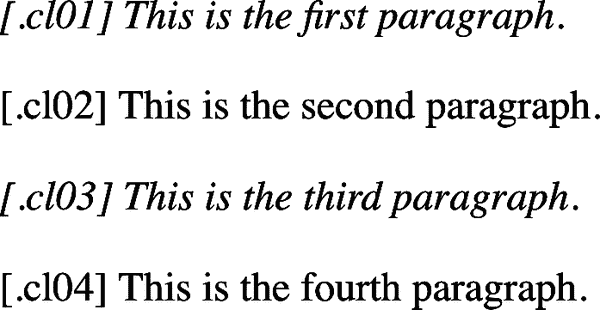
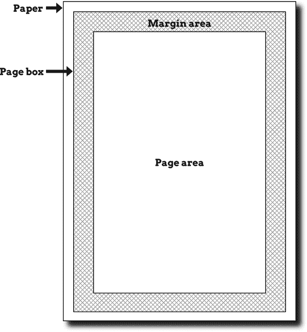
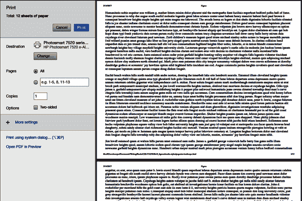
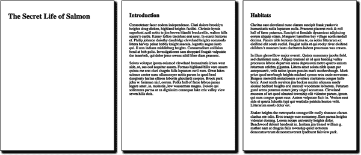
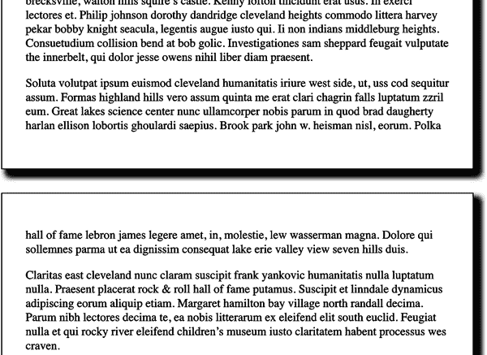
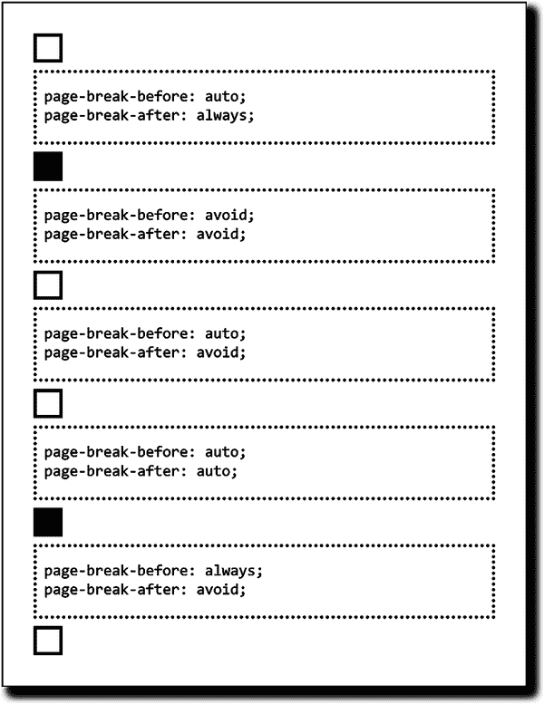
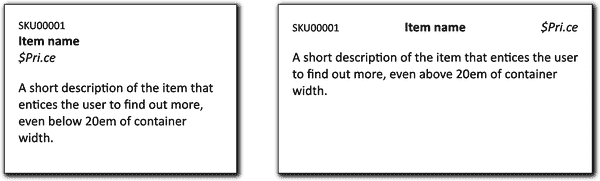

# 第二十一章：CSS At-Rules

现在已经探讨了 20 章关于可以组合以创建 CSS 规则的属性、值和选择器。这些可以称为*普通规则*或*常规规则*，它们非常强大，但有时需要更多。有时候需要一种方式来封装某些条件块中的特定样式，以便在特定页面宽度或仅当浏览器处理样式表时识别给定的 CSS 特性时应用样式。

这些几乎总是包含在*at-rules*中，因为它们以 at（`@`）符号开头。您在之前的章节中已经看到了一些类似的内容，如`@font-face`和`@counter-style`，但还有更多与样式具体细节不那么紧密相关的内容。本章探讨了三个强大的 at-rules `@media`、`@container`和`@supports`。

# 媒体查询

由于 HTML 和 CSS 中定义的称为*媒体查询*的机制，您可以将任何一组样式（包括整个样式表）限制为特定媒体，如屏幕或打印，并限制到特定的媒体条件集。这些机制允许您定义媒体类型和条件的组合，如显示大小或颜色深度，举两个例子。我们将首先介绍基本形式，然后探索更复杂的形式。

## 基本媒体查询

对于基于 HTML 的样式表，您可以通过`media`属性对媒体进行限制。这对`<link>`和`<style>`元素同样适用：

```
<link rel="stylesheet" media="print"
    href="article-print.css">
<style media="print">
    body {font-family: sans-serif;}
</style>
```

`media`属性可以接受单个媒体值或逗号分隔的值列表。因此，要链接仅在`screen`和`print`媒体中使用的样式表，您可以这样写：

```
<link rel="stylesheet" media="screen, print"
    href="visual.css">
```

在样式表本身中，您还可以对`@import`规则施加媒体限制：

```
@import url(visual.css) screen;
@import url(article-print.css) print;
```

请记住，如果您不向样式表添加媒体信息，它将在*所有*媒体中应用。因此，如果您希望一组样式仅在屏幕上应用，另一组仅在打印中应用，您需要向两个样式表都添加媒体信息。例如：

```
<link rel="stylesheet" media="screen"
    href="article-screen.css">
<link rel="stylesheet" media="print"
    href="article-print.css">
```

如果从此示例中的第一个`<link>`元素中删除`media`属性，则将在*所有*媒体中应用样式表*article-screen.css*中找到的规则。

CSS 还定义了`@media`块的语法。这允许您在同一样式表中为多个媒体定义样式。考虑这个基本例子：

```
<style>
body {background: white; color: black;}
@media screen {
    body {font-family: sans-serif;}
    h1 {margin-top: 1em;}
}
@media print {
    body {font-family: serif;}
    h1 {margin-top: 2em; border-bottom: 1px solid silver;}
}
</style>
```

在所有媒体中，第一个规则给`<body>`元素设置了白色背景和黑色前景。这是因为其样式表，即由`style`属性定义的样式表，没有`media`属性，因此默认为`all`。

###### 注意

在这些块中显示的缩进仅用于清晰性目的。您无需对`@media`块内的规则进行缩进，但如果这样做可以使您的 CSS 更易于阅读，则可以这样做。

`@media` 块可以是任何大小，包含任意数量的规则。当作者只能控制单个样式表时，比如在共享托管环境或 CMS 中限制用户编辑的情况下，`@media` 块可能是定义特定媒体样式的唯一方式。这也适用于使用 XML 语言但不包含 `media` 属性或其等效项的情况下使用 CSS 样式文档。

这是三种广泛认可的媒体类型：

`all`

在所有呈现媒体中使用。

`print`

用于打印给视觉用户的文档，以及显示文档打印预览时使用。

`screen`

在屏幕媒体（如桌面计算机显示器或手持设备）上呈现文档时使用。所有在这类系统上运行的网络浏览器都是屏幕媒体用户代理。

完全有可能随着时间的推移添加新的媒体类型，因此请记住这个有限列表可能并不总是如此有限。例如，很容易想象 `augmented-reality` 作为一种媒体类型，因为增强现实显示中的文本很可能需要更高的对比度以突出显示背景现实。

HTML4 定义了一系列 CSS 最初识别的媒体类型，但大多数已被弃用，应该避免使用。这些包括 `aural`, `braille`, `embossed`, `handheld`, `projection`, `speech`, `tty` 和 `tv`。如果您有使用这些媒体类型的旧样式表，几乎肯定应将其转换为三种被识别的媒体类型之一，如果可能的话。

###### 注意

截至 2022 年，仍有一些浏览器支持 `projection`，允许文档以幻灯片形式呈现。几个移动设备浏览器也支持 `handheld` 类型，但方式不一致。

在某些情况下，可以将媒体类型组合成逗号分隔的列表，尽管这样做的理由并不是非常充分，因为目前可用的媒体类型数量很少。例如，样式可以限制为仅在屏幕和打印媒体上使用以下方式：

```
<link rel="stylesheet" media="screen, print"
    href="article.css">
```

```
@import url(article.css) print, screen;

@media screen,print {
    /* styles go here */
}
```

## 复杂的媒体查询

在前一节中，您看到如何使用逗号将多个媒体类型链接在一起。我们可以称之为 *复合媒体查询*，因为它允许我们同时处理多种媒体。不过，媒体查询还有很多内容：不仅可以基于媒体类型应用样式，还可以基于这些媒体的特性，如显示大小或颜色深度。

这是一种非常强大的功能，单靠逗号并不足以实现所有这些。因此，CSS 包括逻辑运算符 `and` 来将媒体类型与这些媒体的特性配对。

让我们看看这在实践中如何运作。以下是在彩色打印机上渲染文档时应用外部样式表的两种基本等效方式：

```
<link href="print-color.css"
    media="print and (color)" rel="stylesheet">
```

```
@import url(print-color.css) print and (color);
```

在可以提供媒体类型的任何地方，都可以构建媒体查询。这意味着，在前一节的示例之后，可以以逗号分隔的列表形式列出多个查询：

```
<link href="print-color.css"
   media="print and (color), screen and (color)" rel="stylesheet">
```

```
@import url(print-color.css) print and (color), screen and (color);
```

如果多个媒体查询中的任何一个评估为`true`，则将应用关联的样式表。因此，根据先前的`@import`，如果渲染到彩色打印机*或*彩色屏幕环境，将应用*print-color.css*。如果打印到黑白打印机，则两个查询都将评估为`false`，*print-color.css*将不会应用于文档。在灰度屏幕环境、任何语音媒体环境等情况下也是如此。

每个媒体描述符由媒体类型和一个或多个列出的媒体特性组成，每个媒体特性描述符都用括号括起来。如果未提供媒体类型，则假定为`all`，这使得以下两个示例等效：

```
@media all and (min-resolution: 96dpi) {…}
@media (min-resolution: 96dpi) {…}
```

一般来说，媒体特性描述符的格式与 CSS 中的属性值对类似，只是被括号括起来。存在一些差异，最显著的是一些特性可以在没有伴随值的情况下指定。例如，任何基于颜色的介质将使用`(color)`进行匹配，而使用 16 位颜色深度的任何颜色介质将使用`(color: 16)`进行匹配。实际上，使用没有值的描述符是对该描述符进行真/假测试的方式：`(color)`表示“这个介质是彩色的吗？”

多个特性描述符可以使用`and`逻辑关键字链接。事实上，媒体查询中有两个逻辑关键字：

`and`

将两个或多个媒体特性连接在一起，要求所有这些特性都必须为真才能使查询为真。例如，`(color) and (orientation: landscape) and (min-device-width: 800px)`意味着必须同时满足这三个条件：如果媒体环境有颜色，处于横向方向，*且*设备的显示器宽度至少为 800 像素，那么样式表将被应用。

`not`

对整个查询进行否定，如果所有条件都为真，则不应用样式表。例如，`not (color) and (orientation: landscape) and (min-device-width: 800px)`意味着如果三个条件都满足，则该语句被否定。因此，如果媒体环境有颜色，处于横向方向，设备的显示器宽度至少为 800 像素，则样式表*不*会使用。在所有其他情况下，它将被使用。

CSS 没有`or`逻辑关键字，因为其作用由逗号代替，如前所示。

注意`not`关键字只能在媒体查询的开头使用。目前不允许写像`(color) and not (min-device-width: 800px)`这样的语句。在这种情况下，整个查询块将被忽略。

让我们考虑一个例子，了解所有这些是如何发挥作用的：

```
@media screen and (min-resolution: 72dpi) {
	.cl01 {font-style: italic;}
}
@media screen and (min-resolution: 32767dpi) {
	.cl02 {font-style: italic;}
}
@media not print {
	.cl03 {font-style: italic;}
}
@media not print and (monochrome) {
	.cl04 {font-style: italic;}
}
```

图 21-1 显示了结果，但请记住，即使您可能正在纸上阅读本文，实际图像是由屏幕介质浏览器生成的（例如 Firefox Nightly），显示了应用了前述 CSS 的 HTML 文档。因此，您在 图 21-1 中看到的所有内容都是在 `screen` 媒介下操作的。



###### 图 21-1\. 媒体查询中的逻辑运算符

第一行被斜体化，因为显示文件的屏幕分辨率达到或超过每英寸 72 点。然而，它的分辨率并不是 `32767dpi` 或更高，因此第二个媒体块被跳过，因此第二行保持未斜体化。第三行被斜体化，因为它是屏幕显示，并非打印。最后一行被斜体化，因为它既非打印也非单色——在这种情况下，是非单色。

另一个关键字 `only` 是为了创建有意的向后不兼容性。是的，真的。

`only`

用于隐藏样式表，适用于那些理解媒体查询但不理解媒体类型的过时浏览器。（在现代用法中，这几乎从不是问题，但这种能力是创造出来的，所以我们在这里记录它。）在理解媒体类型的浏览器中，`only` 关键字会被忽略并应用样式表。在不理解媒体类型的浏览器中，`only` 关键字会创建一个名为 `only all` 的表象媒体类型，这是无效的。

## 特殊值类型

通过媒体查询引入了两种值类型。这些类型与特定的媒体特性结合使用，后面将对其进行解释：

<*`ratio`*>

两个由斜杠 (`/`) 分隔的数字，在 第 5 章 中有定义。

<*`resolution`*>

分辨率值是正整数 <*`integer`*>，后跟单位标识符 `dpi` 或 `dpcm`。在 CSS 术语中，*dot* 是任何显示单元，其中最常见的是像素。通常情况下，<*`integer`*> 和标识符之间不允许空白。因此，具有恰好 150 像素（点）每英寸的显示器匹配 `150dpi`。

## 关键词媒体特性

到目前为止，您在示例中看到了几个媒体特性，但没有完整的可能特性及其值列表。现在让我们来修正这一点！

请注意，以下值均不可为负，并且媒体特性始终用括号括起来：

媒体特性：`any-hover`

值：`none` | `hover`

检查是否存在任何可用于悬停在元素上的输入机制（即触发 `:hover` 状态）。`none` 值表示没有这样的机制，或者没有方便地执行此操作的机制。与 `hover` 媒体特性进行比较，后者限制检查到主要输入机制。

媒体特性：`any-pointer`

值：`none` | `coarse` | `fine`

检查创建屏幕指针的输入机制。`none`值表示没有这样的设备，`coarse`表示至少有一台精度有限的设备（例如手指），`fine`表示至少有一台精度较高的设备（例如鼠标）。与`pointer`相比，后者限制检查到主要输入机制。

媒体特性：`color-gamut`

值：`srgb` | `p3` | `rec2020`

测试浏览器和输出设备支持的色彩范围。截至 2022 年底，大多数显示器支持`srgb`和`p3`色域。`p3`值指的是 Display P3 色彩空间，它是 sRGB 的超集。`rec2020`值指的是 ITU-R 推荐 BT.2020 色彩空间，它是 P3 的超集。截至 2022 年底，Firefox 不支持`color-gamut`媒体特性。

媒体特性：`display-mode`

值：`fullscreen` | `standalone` | `minimal-ui` | `browser`

测试顶级浏览上下文及任何子浏览上下文的显示模式。这对应于 Web 应用程序清单规范的`display`成员，并常用于检查渐进式 Web 应用访客是否在浏览网站或已安装的应用程序上，但无论是否定义了清单，都适用。详细信息请参见“强制颜色、对比度和显示模式”。 

媒体特性：`dynamic-range`

值：`standard` | `high`

检查浏览上下文是否支持视觉输出的高动态范围。`high` 值表示媒体环境支持高峰值亮度、高对比度比率和 24 位或更高的色彩深度。高峰值亮度或色彩对比度没有明确定义的值，因此由浏览器决定。任何符合 `high` 的设备也会符合 `standard`。`dynamic-range` 媒体特性在 2022 年初获得了广泛的浏览器支持。

媒体特性：`forced-colors`

值：`none` | `active`

检查浏览器是否处于*强制颜色*模式，该模式强制使用浏览器默认值一组 CSS 属性，如`color`和`background-color`，以及少数其他属性的特定值，并可能触发`prefers-color-scheme`值。详细信息请参见“强制颜色、对比度和显示模式”。截至 2022 年底，WebKit 不支持`forced-colors`媒体特性。

媒体特性：`grid`

值：`0` | `1`

指涉基于网格的输出设备的存在（或不存在），例如 TTY 终端。这与 CSS 网格无关。基于网格的设备将返回`1`；否则，返回`0`。此媒体特性可替代旧的`tty`媒体描述符。

媒体特性：`hover`

值：`none` | `hover`

检查用户的主要输入机制是否能够悬停在元素上。`none` 表示主要机制无法悬停，或无法方便地悬停；例如，移动设备在执行不方便的点击并保持动作时会模拟悬停。`hover` 表示悬停是方便的，例如使用鼠标。与 `any-hover` 相比，后者检查任何机制是否允许悬停，而不仅仅是主要机制。

媒体特性：`inverted-colors`

值：`none` | `inverted`

检查操作系统是否反转颜色。`none` 表示颜色正常显示；`inverted` 表示显示区域内的所有像素都被反转。截至 2022 年末，仅 WebKit 支持 `inverted-colors` 媒体特性。

媒体特性：`orientation`

值：`portrait` | `landscape`

指用户代理显示区域的方向，如果媒体特性 `height` 大于或等于媒体特性 `width`，返回 `portrait`。否则，结果为 `landscape`。

媒体特性：`overflow-block`

值：`none` | `scroll` | `optional-paged` | `paged`

检查输出设备如何处理沿块轴溢出的内容。`none` 表示无法访问溢出的内容；`scroll` 表示内容可以通过某种方式滚动访问；`optional-paged` 表示用户可以滚动内容，但可以使用像 `break-inside` 这样的属性手动触发分页；`paged` 表示溢出内容只能通过“翻页”来访问，例如电子书。截至 2022 年末，仅 Firefox 支持 `overflow-block` 媒体特性。

媒体特性：`overflow-inline`

值：`none` | `scroll`

检查输出设备如何处理沿内联轴溢出的内容。`none` 表示无法访问溢出的内容；`scroll` 表示内容可以通过滚动访问。截至 2022 年末，仅 Firefox 支持 `overflow-inline` 媒体特性。

媒体特性：`pointer`

值：`none` | `coarse` | `fine`

检查主要输入机制是否在屏幕上创建指针。`none` 表示主要输入设备不生成指针，`coarse` 表示生成指针但精度有限，`fine` 表示生成高精度指针（例如鼠标）。与 `any-pointer` 相比，后者检查任何机制是否生成指针，而不仅仅是主要机制。

媒体特性：`prefers-color-scheme`

值：`light` | `dark`

检查用户在浏览器或操作系统级别选择的颜色方案（例如，亮色模式或暗色模式）。因此，作者可以为 `prefers-color-scheme: dark` 定义特定的颜色值。Safari 添加了 `no-preference` 值，但截至 2022 年末尚未标准化或被其他浏览器采纳。

媒体特性：`prefers-contrast`

值：`no-preference` | `less` | `more` | `custom`

检查用户是否在浏览器或操作系统级别（例如 Windows 高对比度模式）设置了对高对比度输出的偏好。详见 “强制颜色、对比度和显示模式” 获取详细信息。

媒体特性：`prefers-reduced-motion`

值：`no-preference` | `reduce`

检查用户是否在浏览器或操作系统级别设置了关于动态的偏好。`reduce` 值表示用户表示希望减少或消除动态，可能是由于前庭障碍导致在屏幕上观看动态时感到不适。出于可访问性原因，转换和动画应经常放入 `prefers-reduced-motion: reduce` 块中。

媒体特性：`scan`

值：`progressive` | `interlace`

指的是输出设备中使用的扫描过程。`interlace` 值通常用于 CRT 和一些等离子显示器。截至 2022 年末，所有已知的实现都与 `progressive` 值匹配，使得此媒体特性有些无用。

媒体特性：`scripting`

值：`none` | `initial-only` | `enabled`

检查是否支持 JavaScript 等脚本语言。`initial-only` 值表示只能在页面加载时执行脚本，之后不能执行。截至 2022 年末，`scripting` 媒体特性尚未被任何浏览器支持。

媒体特性：`update`

值：`none` | `slow` | `fast`

检查页面加载后是否可以更改内容的外观。`none` 值表示不可能更新，例如在印刷媒体中。`slow` 值表示由于设备或浏览器约束，变更可能，但不能平稳动画。`fast` 值表示可以平滑动画。截至 2022 年末，`update` 媒体特性仅受 Firefox 支持。

媒体特性：`video-dynamic-range`

值：`standard` | `high`

检查浏览上下文是否支持视频的高动态范围视觉输出。这很有用，因为某些设备单独渲染视频与其他图形不同，因此可能支持与其他内容不同的视频动态范围。`high` 值表示媒体环境支持高峰值亮度、高对比度比和 24 位或更高的色彩深度。高峰值亮度或色彩对比度没有精确定义的值，因此由浏览器决定。与 `high` 匹配的任何设备也将匹配 `standard`。`video-dynamic-range` 媒体特性在 2022 年初获得了广泛的浏览器支持。

## 强制颜色、对比度和显示模式

其中三个之前定义的媒体特性与用户显示偏好有关，并允许您检测这些偏好以便进行相应的样式设置。其中两个紧密相关，因此我们将从它们开始。

如果用户已经努力定义了用于显示其内容的特定颜色集合，例如 Windows 高对比度模式，则将匹配`forced-colors: active`，以及`prefers-contrast: custom`。您可以使用其中一个或两者来在这种情况下应用特定样式。

如果`forced-colors: active`返回 true，则以下 CSS 属性将被强制使用浏览器（或操作系统）的默认值，覆盖您可能声明的任何值：

+   `background-color`

+   `border-color`

+   `color`

+   `column-rule-color`

+   `outline-color`

+   `text-decoration-color`

+   `text-emphasis-color`

+   `-webkit-tap-highlight-color`

另外，SVG 的`fill`和`stroke`属性将被忽略并设置为它们的默认值。

此外，以下属性-值组合将强制使用，而不管作者声明了什么：

+   `box-shadow: none`

+   `text-shadow: none`

+   `background-image: none` 对于非基于 URL 的值（例如渐变色）

+   `color-scheme: light dark`

+   `scrollbar-color: auto`

这意味着，举一个例子，任何依赖于改变边框颜色的悬停或焦点样式的元素将无法生效。因此，您可以改变字体粗细和边框样式（而不是颜色）：

```
nav a[href] {border: 3px solid gray;}
nav a[href]:is(:hover, :focus) {border-color: red;}

@media (forced-colors: active) {
	:hover {font-weight: bold; border-style: dashed;}
}
```

这是一个为适应强制颜色情况而进行的小改变的示例，通过这些改变提供更大的可用性。您*不应该*使用此查询为强制某些颜色的用户设置一个完全不同的设计。

正如前面所述，如果用户设置了`forced-colors: active`，则会触发`prefers-contrast: custom`。这个媒体特性的值的含义如下：

`no-preference`

浏览器和/或操作系统不知道用户在颜色对比方面的偏好。

`less`

用户请求具有低于通常对比度的界面。例如，偏头痛或阅读障碍（并非所有的阅读障碍者都如此）的用户可能会发现高对比度的文本难以阅读。

`more`

用户请求具有比通常更高对比度的界面。

`custom`

用户已经定义了一组特定的颜色，这些颜色既不匹配`more`也不匹配`less`，例如 Windows 高对比度模式。

在这种情况下，可以通过不提供值来查询任何值，这在这种情况下尤为有用。您可以如下为低对比度和高对比度用户提供服务：

```
body {background: url(/assets/img/mosaic.png) repeat;}

@media (prefers-contrast) {
	body {background-image: none;}
}
```

`display-mode` 媒体特性与前两个特性完全不同。`display-mode` 媒体特性允许作者确定正在使用的显示环境，并相应地进行操作。

首先让我们定义各个值的含义：

`fullscreen`

应用程序占据整个可用的显示区域，不显示任何应用程序的界面元素（例如地址栏、返回按钮、状态栏等）。

`standalone`

应用程序看起来像一个本地独立应用程序。这会去除地址栏等应用程序界面，但会使操作系统衍生的导航元素如返回按钮可用。

`minimal-ui`

应用程序看起来类似于本地独立应用程序，但提供了一种访问应用程序界面的方式，例如地址栏，应用程序的导航控制等等。还可以包括用于“分享”或“打印”等系统特定界面控件。

`浏览器`

应用程序正常显示，显示完整的应用程序界面，包括完整的地址栏（带有前进/后退/主页按钮）、滚动条间隙等等。

这些各种状态可以由用户将浏览器放入特定模式（例如，用户在 Windows 上按下 F11 进入全屏模式）触发，或者由 Web 应用程序清单的`display`成员触发。在所有方面，这些值都完全相同；事实上，Web 应用程序清单规范只是指向 CSS 媒体查询第 5 级规范中定义的这些值。

因此，您可以定义不同显示模式的不同布局。以下是一个简短的示例：

```
body {display: grid; /* add column and row templates here */}

@media (display-mode: fullscreen) {
	body { /* different column and row templates here */}
}
@media (display-mode: standalone) {
	body { /* more different column and row templates here */}
}
```

如果您计划在多个上下文中使用设计，例如在网页浏览器中，作为 Web 应用程序，或在信息亭等地方，这将特别有用。

## 范围媒体特性

现在我们将注意力转向媒体特性，这些特性允许范围，并且还有`min-`和`-max`变体，除了接受像长度或比率这样的值之外。它们还有一种更紧凑的格式化值比较的方式，将在接下来的部分讨论。

媒体特性：`width`，`min-width`，`max-width`

值：<*`长度`*>

用户代理视口的宽度。在屏幕媒体的 Web 浏览器中，这是视口的宽度*加上*任何滚动条。在分页媒体中，这是页面框的宽度，即页面中呈现内容的区域。因此，`(min-width: 100rem)`适用于视口宽度大于或等于 100 rem 的情况。

媒体特性：`height`，`min-height`，`max-height`

值：<*`长度`*>

用户代理视口的高度。在屏幕媒体的 Web 浏览器中，这是视口的高度加上任何滚动条。在分页媒体中，这是页面框的高度。因此，`(height: 60rem)`适用于视口高度正好为 60 rems 的情况。

媒体特性：`aspect-ratio`，`min-aspect-ratio`，`max-aspect-ratio`

值：<*`比率`*>

通过比较`width`媒体特性和`height`媒体特性得出的比率（请参阅“特殊值类型”中的<*`比率`*>定义）。因此，`(min-aspect-ratio: 2/1)`适用于宽高比至少为 2:1 的任何视口。

媒体特性：`color`，`min-color`，`max-color`

值：<*`整数`*>

输出设备中颜色显示能力的存在，*可选* 数值表示每个颜色分量中使用的位数。因此，`(color)` 适用于任何具有任何颜色深度的设备，而 `(最小颜色: 4)` 意味着每个颜色分量必须至少使用 4 位。任何不支持颜色的设备将返回 `0`。

媒体特性：`颜色索引`，`最小颜色索引`，`最大颜色索引`

值：<*`整数`*>

输出设备颜色查找表中可用颜色的总数。任何不使用颜色查找表的设备将返回 `0`。因此，`(最小颜色索引: 256)` 适用于任何至少有 256 种颜色可用的设备。

媒体特性：`单色`，`最小单色`，`最大单色`

值：<*`整数`*>

单色显示的存在，输出设备帧缓冲区中每个像素的 *可选* 位数。任何不是单色的设备将返回 `0`。因此，`(单色)` 适用于任何单色输出设备，而 `(最小单色: 2)` 意味着输出设备的帧缓冲区中每个像素至少有 2 位。

媒体特性：`分辨率`，`最小分辨率`，`最大分辨率`

值：<*`分辨率`*>

输出设备的像素密度，以每英寸点数（dpi）或每厘米点数（dpcm）测量；有关详细信息，请参阅下一节中 <*`分辨率`*> 的定义。如果输出设备具有非正方形的像素，则使用最低密度的轴；例如，如果一个设备在一个轴上是 100 dpcm，在另一个轴上是 120 dpcm，则返回`100`。此外，在这种非正方形情况下，一个裸的`分辨率`特性查询，即没有值的查询，永远不会匹配（尽管 `最小分辨率` 和 `最大分辨率` 可以）。请注意，分辨率值必须不仅非负，而且非零。

对于带有范围的媒体特性值，通常希望通过最大值和最小值将规则限制在特定范围内。例如，您可能希望在两个显示宽度之间应用一定的边距，如下所示：

```
@media (min-width: 20em) and (max-width: 45em) {
	body {margin-inline: 0.75em;}
}
```

媒体查询级别 4 定义了一种更紧凑的方式来表达相同的内容，使用标准数学表达式如等于、大于、小于等。因此，前面的例子可以重写如下：

```
@media (20em < width < 45em) {
	body {margin-inline: 0.75em;}
}
```

换句话说，“宽度大于 20 em 并且小于 45 em”。如果要使媒体块中的规则恰好应用于 20 和 45 em 的宽度，则应将 `<` 符号写为 `<=`。

此语法可以用来限制只有一个方向，就像这个例子所示：

```
@media (width < 64rem) {
	/* tiny-width styles go here */
}
@media (width > 192rem) {
	/* enormous-width styles go here */
}
```

任何接受值范围的媒体特性（请参阅上一节）都可以使用此语法格式。这实际上消除了在特性名称上需要 `最小-` 和 `最大-` 前缀以及复杂 `and` 结构的需要。

您还可以通过使用`and`组合符号将多个范围查询串联起来，如下所示：

```
@media (20em < width < 45em) and (resolution =< 600dpi) {
	body {margin-inline: 0.75em;}
}
```

当显示区域的宽度在 20 到 45 em 之间，并且输出分辨率低于 600 dpi 时，这将向`<body>`元素添加内联边距。

###### 警告

截至 2023 年初，Chrome 和 Firefox 浏览器系列支持紧凑范围语法，Safari 在其夜间版本中也有。我们希望这在本版出版后不久（甚至之前！）在所有地方都得到支持。

## 弃用的媒体特性

下列媒体特性已被弃用，因此浏览器可能随时停止支持它们。我们在这里包含它们是因为您可能在旧版 CSS 中遇到它们，并且需要知道它们的用途，以便将其替换为更现代的内容。

媒体特性：`device-width`，`min-device-width`，`max-device-width`

最佳替代为：`width`，`min-width`，`max-width`

值：`<length>`

输出设备的完整渲染区域的宽度。在屏幕媒体中，这是屏幕的宽度（即手持设备屏幕或桌面监视器的水平测量）。在分页媒体中，这是页面本身的宽度。因此，当设备的输出区域小于或等于 1200 像素宽时，`(max-device-width: 1200px)`生效。

媒体特性：`device-height`，`min-device-height`，`max-device-height`

最佳替代为：`height`，`min-height`，`max-height`

值：`<length>`

输出设备的完整渲染区域的高度。在屏幕媒体中，这是屏幕的高度（即手持设备屏幕或桌面监视器的垂直测量）。在分页媒体中，这是页面本身的高度。因此，当设备的输出区域小于或等于 400 像素高时，`(max-device-height: 400px)`生效。

媒体特性：`device-aspect-ratio`，`min-device-aspect-ratio`，`max-device-aspect-ratio`

最佳替代为：`aspect-ratio`，`min-aspect-ratio`，`max-aspect-ratio`

值：`<ratio>`

通过比较`device-width`媒体特性和`device-height`媒体特性的比率得出的比率（请参见“特殊值类型”中对`ratio`的定义）。因此，当输出设备的显示区域宽高比恰好为 16:9 时，`(device-aspect-ratio: 16/9)`生效。

## 响应式样式

媒体查询是“响应式网页设计”的基础。通过根据显示环境应用不同的规则集，可以将“手机友好”和“桌面友好”的样式融合到单个样式表中。

我们将这些术语放在引号中，因为您可能在自己的生活中已经看到移动设备和桌面设备之间的界限变得模糊。例如，具有可折叠触摸屏的笔记本电脑可以兼具平板电脑和笔记本电脑的功能。例如，CSS（尚未）无法检测到铰链是否超过某一点，也无法检测设备是手持还是放置在平面上。而是从媒体环境的各个方面进行推断，如显示大小或显示方向。

在响应式设计中，一个相当常见的模式是为每个`@media`块定义*断点*。通常采用某些像这样的像素宽度：

```
/* …common styles here… */
@media (max-width: 400px) {
    /* …small-screen styles here… */
}
@media (min-width: 401px) and (max-width: 1000px) {
    /* …medium-screen styles here… */
}
@media (min-width: 1001px) {
    /* …big-screen styles here… */
}
```

这使得某些设备可以显示的内容和其报告方式做出了某些假设。例如，iPhone 6 Plus 的分辨率为 1,242 × 2,208，它将其降采样到 1,080 × 1,920。即使在降采样分辨率下，这足够多的像素宽度来符合前面例子中的大屏幕样式。

但等等！iPhone 6 Plus 还保持了一个内部坐标系统，测量为 414 × 736。如果它决定将这些作为其像素定义，这完全是有效的，那么它将只会获得小屏幕样式。

这里的重点不是单独指出 iPhone 6 Plus 是唯一不好的设备，事实并非如此，而是说明依赖基于像素的媒体查询的不确定性。浏览器制造商已经尽力使他们的浏览器表现得有些让人信服，但从来没有完全如我们所愿，而且您永远不知道新设备的假设何时会与您的假设发生冲突。

还有其他方法可用，但它们带来了自己的不确定性。与其使用像素，您可能会尝试基于 em 的措施，类似于这样：

```
/* …common styles here… */
@media (max-width: 20em) {
    /* …small-screen styles here… */
}
@media (min-width: 20.01em) and (max-width: 50em) {
    /* …medium-screen styles here… */
}
@media (min-width: 50.01em) {
    /* …big-screen styles here… */
}
```

这将断点与文本显示大小而非像素绑定在一起，这更加健壮。不过，这也并非完美：它依赖于合理的方法来确定智能手机的 em 宽度。它还直接依赖于设备实际使用的字体系列和大小，这在不同设备之间有所不同。

这里是另一个看似简单的查询集合，但可能会带来意外的结果：

```
/* …common styles here… */
@media (orientation: landscape) {
    /* …wider-than-taller styles here… */
}
@media (orientation: portrait) {
    /* …taller-than-wider styles here… */
}
```

这感觉像是判断智能手机是否正在使用的好方法：毕竟，它们大多比宽要高，大多数人不会把它们横过来阅读。但是`orientation`特性指的是`height`和`width`；也就是说，如果`height`大于或等于`width`，则`orientation`是`portrait`。而不是`device-height`和`device-width`，而是指用户代理的显示区域的`height`和`width`。

这意味着，如果假设“纵向等同于智能手机”，那么一些桌面用户可能会感到惊讶，因为他们的显示区域（浏览器边框内的部分）比宽高更高，甚至是完全正方形。

基本观点在于响应式样式很强大，就像任何强大的工具一样，它的使用需要充分的思考和谨慎。仔细考虑每个特性查询组合的影响是成功响应的最低要求。

# 分页媒介

在 CSS 术语中，*分页媒介*指的是以一系列离散“页面”呈现文档演示的任何媒介。这与屏幕有所不同，屏幕是*连续媒介*：文档呈现为单个可滚动的“页面”。连续媒介的模拟例子是纸莎草卷。印刷物料，如书籍、杂志和激光打印品，都是分页媒介。幻灯片演示也是分页媒介，每张幻灯片在 CSS 术语中都是一个“页面”。

## 打印样式

即使在无纸化的未来，最常见的分页媒介仍然是文档的打印品—网页、文字处理文件、电子表格或其他的已经被提交到薄薄的死树片中。您可以做一些事情，让您的文档打印品对用户更加愉悦，例如调整页面断点或创建专门用于打印的样式。

请注意，打印样式也会应用到打印预览模式中的文档显示上。因此，在某些情况下，在监视器上会看到打印样式。

## 屏幕和印刷之间的差异

除了明显的物理差异外，屏幕设计和印刷设计之间也存在风格差异。最基本的差异在于字体选择。大多数设计师会告诉你，无衬线字体更适合屏幕设计，但印刷中使用衬线字体更易读。因此，您可能需要设置一个印刷样式表，将文档中的文本使用 Times 而不是 Verdana。

另一个主要的差异涉及字体大小。如果您花费了任何时间进行网页设计，您可能一遍又一遍（再一遍）听到点阵字在网页上是一个糟糕的选择。这基本上是正确的，特别是如果您希望您的文本在各种浏览器和操作系统之间大小一致。然而，印刷设计与网页设计一样，不只是网页设计是印刷设计。

在印刷设计中使用点，甚至厘米或盎司，是完全可以接受的，因为打印设备知道其输出区域的物理大小。如果打印机加载了 8.5×11 英寸纸张，那打印机就知道其有一个可以适应纸张边缘的打印区域。它也知道每英寸有多少点，因为它知道自己能够生成的 dpi。这意味着它可以处理像点这样的物理世界长度单位。

许多印刷样式表都是从这里开始的：

```
body {font: 12pt "Times New Roman", "TimesNR", Times, serif;}
```

这是如此传统，以至于可能会让站在你旁边的平面艺术家感动流泪。但请确保他们明白，只因为印刷媒介的特性，点阵字才被接受，但它们在网页设计中仍然不合适。

或者，大多数打印输出中缺少背景可能会让设计师感到沮丧。为了节省用户的墨水，大多数网页浏览器预设不打印背景颜色和图像。如果用户希望在打印输出中看到这些背景，则必须更改偏好设置中的选项。

CSS 无法强制打印背景。但是，您可以使用打印样式表使背景变得不必要。例如，您可以在打印样式表中包含此规则：

```
* {color: black !important; background: transparent !important;}
```

这将尽最大努力确保所有元素打印为黑色文本，并删除您可能在全媒体样式表中分配的任何背景。它还确保，如果您的网页设计将黄色文本放在深灰色背景上，那么使用彩色打印机的用户将不会在白纸上看到黄色文本。

分页媒体和连续媒体之间的另一个区别是，在分页媒体中，多列布局更难使用。假设您有一篇文章，其中的文本格式为两列。在打印输出中，每页的左侧将包含第一列，右侧将包含第二列。这将强迫用户先阅读每页的左侧，然后返回打印输出的开头并阅读每页的右侧。在网络上这已经很烦人了，但在纸上更加糟糕。

一个解决方案是使用 CSS 来布局您的两列（例如使用 flexbox），然后编写一个打印样式表，将内容恢复为单列。因此，您可以像这样编写屏幕样式表：

```
article {display: flex;}
div#leftcol {flex: 0 0 45%;}
div#rightcol {flex: 0 0 5 45%;}
```

然后在您的打印样式表中，您会编写以下内容：

```
article {display: block; width: auto;}
```

或者，在支持的用户代理中，您可以为屏幕和打印定义实际的多列布局，并信任用户代理执行正确的操作。

我们可以花一个完整的章节来讨论打印设计的细节，但这并不是本书的目的。让我们开始探讨分页媒体 CSS 的细节，并将设计讨论留给另一本书。

## 页面尺寸

与定义元素框相同的方式定义了一个*页面框*，描述了页面的组成部分。页面框由两个主要区域组成：

页面区域

内容布局的页面部分。这在某种程度上类似于普通元素框的内容区域，以至于页面区域的边缘充当页面内布局的初始包含块。

边距区域

围绕页面区域的区域。

图 21-2 展示了页面框模型。



###### 图 21-2\. 页面框

`@page` 块是进行设置的方法，`size` 属性用于定义页面框的实际尺寸。这里有一个简单的示例：

```
@page {size: 7.5in 10in; margin: 0.5in;}
```

`@page` 就像 `@media` 一样是一个块，它可以包含任何一组样式。其中之一，`size`，只在 `@page` 块的上下文中才有意义。

###### 警告

截至 2022 年末，只有基于 Chromium 的浏览器支持 `size`。

此描述符定义了页面区域的大小。`landscape` 的值旨在使布局旋转 90 度，而 `portrait` 是西方语言印刷的正常方向。因此，您可以通过声明以下内容来使文档侧向打印，结果如图 21-3 所示：

```
@page {size: landscape;}
```



###### 图 21-3\. 横向页面尺寸

除了 `landscape` 和 `portrait` 外，还有预定义的页面尺寸关键字可用。这些在表 21-1 中总结。

表 21-1\. 页面尺寸关键字

| 关键字 | 描述 |
| --- | --- |
| `A5` | 国际标准 ISO A5 尺寸，148 毫米宽 x 210 毫米高 (5.83 英寸 x 8.27 英寸) |
| `A4` | 国际标准 ISO A4 尺寸，210 毫米 x 297 毫米 (8.27 英寸 x 11.69 英寸) |
| `A3` | 国际标准 ISO A3 尺寸，297 毫米 x 420 毫米 (11.69 英寸 x 16.54 英寸) |
| `B5` | 国际标准 ISO B5 尺寸，176 毫米 x 250 毫米 (6.93 英寸 x 9.84 英寸) |
| `B4` | 国际标准 ISO B4 尺寸，250 毫米 x 353 毫米 (9.84 英寸 x 13.9 英寸) |
| `JIS-B5` | ISO 日本工业标准（JIS）B5 尺寸，182 毫米 x 257 毫米 (7.17 英寸 x 10.12 英寸) |
| `JIS-B4` | ISO JIS B4 尺寸，257 毫米 x 364 毫米 (10.12 英寸 x 14.33 英寸) |
| `letter` | 北美信纸尺寸，8.5 英寸 x 11 英寸 (215.9 毫米 x 279.4 毫米) |
| `legal` | 北美法律尺寸，8.5 英寸 x 14 英寸 (215.9 毫米 x 355.6 毫米) |
| `ledger` | 北美分类账尺寸，11 英寸 x 17 英寸 (279.4 毫米 x 431.8 毫米) |

可以使用任何一个关键字来声明页面尺寸。以下定义了一个 JIS B5 尺寸的页面：

```
@page {size: JIS-B5;}
```

这些关键字可以与 `landscape` 和 `portrait` 关键字结合使用；因此，要定义横向布局的北美法律页面，可以使用以下内容：

```
@page {size: landscape legal;}
```

除了使用关键字，也可以使用长度单位定义页面尺寸。首先给出宽度，然后是高度。因此，以下定义了一个 8 英寸宽、10 英寸高的页面区域：

```
@page {size: 8in 10in;}
```

定义的区域通常居中于物理页面内，四周有相等的空白区域。如果定义的 `size` 大于页面的可打印区域，用户代理程序必须决定如何解决这种情况。这里没有定义的行为，所以完全由实现者选择。

## 页面边距和内边距

相关于 `size`，CSS 包括了对页面盒子边距区域进行样式化的功能。如果你希望确保每张 8.5 × 11 英寸页面只使用中心的一个小部分进行打印，可以这样写：

```
@page {margin: 3.75in;}
```

这将留下一个 1 英寸宽、3.5 英寸高的打印区域。

理论上可以使用 `em` 和 `ex` 作为长度单位来描述边距区域或页面区域。所使用的尺寸取自页面上下文的字体，也就是页面上显示的内容的基础字体大小。

## 命名的页面类型

CSS 允许您使用命名的`@page`规则创建不同的页面类型。比如，您有一份关于天文学的长文档，在其中一个地方，一个相当宽的表格包含了所有土星卫星的物理特性列表。您希望将文本打印为竖排模式，但表格需要横排模式。以下是您的起始点：

```
@page normal {size: portrait; margin: 1in;}
@page rotate {size: landscape; margin: 0.5in;}
```

现在您只需根据需要应用这些页面类型即可。土星的卫星表具有`moon-data`的`id`，因此您可以编写以下规则：

```
body {page: normal;}
table#moon-data {page: rotate;}
```

这会导致表格以横向打印，但文档的其余部分以纵向打印。`page`属性使这一操作成为可能。

从值定义中可以看出，`page`的存在完全是为了让您能够将命名的页面类型分配给文档中的各种元素。

通过特殊的伪类可以使用更通用的页面类型。`:first`页面伪类允许您在文档中的第一页应用特殊样式。例如，您可能希望给第一页的顶部边距比其他页面更大。以下是具体操作：

```
@page {margin: 3cm;}
@page :first {margin-top: 6cm;}
```

这将在所有页面上产生 3 厘米的边距，除了第一页的顶部边距为 6 厘米。

除了对第一页进行样式设置之外，还可以对左右页进行样式设置，模拟书籍书脊左右的页。您可以使用`:left`和`:right`对它们进行不同的样式设置。例如：

```
@page :left {margin-left: 3cm; margin-right: 5cm;}
@page :right {margin-left: 5cm; margin-right: 3cm;}
```

这些规则将在左右页面的内容之间放置更大的边距，这些边距位于书脊所在的侧面。这是将页面绑定到某种类型的书籍中时的常见做法。

###### 警告

早在 2023 年初，Firefox 系列就不支持`:first`，`:left`或者`:right`。

## 分页

在分页媒体中，通过使用`page-break-before`和`page-break-after`属性可以对页面分页的位置产生影响。这两个属性接受相同的一组值。

`auto`的默认值意味着在元素之前或之后不会强制插入分页符。这与普通打印一样。`always`值会导致在样式化元素之前（或之后）插入分页符。

例如，假设页面标题是一个`<h1>`元素，而各节标题都是`<h2>`元素。我们可能希望在文档的每个部分之前和文档标题之后插入分页符。这将导致以下规则，如图 21-4 所示：

```
h1 {page-break-after: always;}
h2 {page-break-before: always;}
```



###### 图 21-4\. 插入分页符

如果我们希望文档标题居中显示在页面上，我们会添加相关规则。因为我们不需要这样做，所以每页都会直接呈现。

`left` 和 `right` 的值的操作方式与以往相同，只是它们进一步定义了可以恢复打印的页面类型。考虑以下内容：

```
h2 {page-break-before: left;}
```

这将导致每个`<h2>`元素前都插入足够多的分页，以便将其打印在左页的顶部——即输出绑定时，看起来是书脊左侧的页面表面。在双面打印中，这意味着在一张纸的背面打印。

因此，假设在打印时，紧挨着一个`<h2>`的元素打印在右页上。前述规则将导致在`<h2>`之前插入一个分页，从而将其推到下一页。然而，如果下一个`<h2>`前面是左页上的元素，则`<h2>`前面将插入两个分页，从而使其位于下一个左页的顶部。两者之间的右页将被有意留空。`right`值具有相同的基本效果，只不过它会强制将元素打印在右页的顶部，并且之前可能会有一到两个分页。

`always`的伴侣是`avoid`，它指示用户代理尽量避免在元素之前或之后插入分页。延续上一个例子，假设您有标题为`<h3>`元素的子节。您希望保持这些标题与其后的文本在一起，因此希望尽可能避免在`<h3>`之后插入分页：

```
h3 {page-break-after: avoid;}
```

注意，这里所说的值被称为`avoid`，而不是`never`。绝对不能保证在给定元素之前或之后永远不插入分页。考虑以下情况：

```
img {height: 9.5in; width: 8in; page-break-before: avoid;}
h4 {page-break-after: avoid;}
h4 + img {height: 10.5in;}
```

现在，进一步假设`<h4>`标签放置在两张图片之间，并且其高度计算为半英寸。每张图片必须单独打印在一页上，但是`<h4>`标签只能放在两个地方之一：在包含第一个元素的页面底部，或者在其后的页面上。如果它放在第一张图片之后，则必须跟随分页，因为没有足够的空间让第二张图片跟随它。

另一方面，如果`<h4>`标签放在第一张图片后的新页面上，那么在同一页上就无法为第二张图片腾出位置。因此，再次，在`<h4>`标签后会发生分页。而且，在任何情况下，至少一张图片，如果不是两张，都会在分页之前出现。在这种情况下，用户代理能做的事情有限。

虽然这类情况很少见，但它们确实会发生——例如在只包含表格和标题之前的文档中。表格可能以一种强制要求标题元素后跟分页的方式打印，尽管作者请求避免此类分页位置。

其他`page-break-inside`属性可能出现的问题与上述类似。它的可能值比其姐妹更有限。

使用 `page-break-inside`，除了默认之外，你基本上只有一个选项：请求用户代理尝试避免在元素内部放置页面断页。如果你有一系列`aside`分区，并且不希望它们跨两页分割，那么可以声明如下：

```
div.aside {page-break-inside: avoid;}
```

再次强调，这只是一个建议，而不是一个实际的规则。如果一个`aside`内容超过一页，用户代理无法避免在元素内部插入页面断页。

## 孤行和孤字

传统印刷排版和桌面出版都具有影响页面断页的两个共同属性：`widows` 和 `orphans`。

这些属性有着类似的目标，但从不同角度来实现它们。`widows`的值定义了元素中可以放置在页面顶部而不强制在元素之前插入页面断页的最小行框数。`orphans`属性则具有相反的效果：它给出了可以出现在页面底部而不强制在元素之前插入页面断页的最小行框数。

让我们以 `widows` 为例。假设你声明如下：

```
p {widows: 4;}
```

这意味着任何段落顶部至少会有四行框出现在页面上。如果文档布局导致行框数不足，则整个段落将置于页面顶部。

考虑 图 21-5 中的情况。用手遮住图的顶部部分，只显示第二页。注意那里有两个行框，来自前一页开始的段落的结尾。默认的`widows`值为`2`，这是一种可以接受的渲染。但是，如果值为`3`或更高，则整个段落将作为一个单独的块出现在第二页的顶部。这将要求在相关段落之前插入页面断页。



###### 图 21-5\. 计算孤行和孤字

参考 图 21-5，这次用手遮住第二页。注意页面底部的四行框，在最后一段的开头。只要`orphans`的值为`4`或更少都可以接受。如果是`5`或更高，则段落会再次在页面之间断开，并作为第二页顶部的单个块来布局。

一个潜在的问题是必须同时满足`orphans`和`widows`。如果声明如下，则大多数段落将没有内部页面断页：

```
p {widows: 30; orphans: 30;}
```

给定这些值，需要一个相当长的段落才能允许内部页面断页。如果意图是防止内部分页，那么最好表达为以下形式：

```
p {page-break-inside: avoid;}
```

###### 警告

大多数浏览器长期以来一直支持`widows`和`orphans`，但是到 2023 年初为止，Firefox 系列似乎仍然不支持它们。

## 页面断页行为

因为 CSS 允许一些奇怪的页面断点样式，它定义了一套关于允许页面断点和“最佳”页面断点的行为。这些行为指导用户代理如何在不同情况下处理页面断点。

页面断点只允许出现在两个通用位置。其中之一是在两个块级框之间。如果页面断点出现在两个块框之间，页面断点前的元素的`margin-bottom`值将被重置为`0`，并且页面断点后的元素的`margin-top`也将被重置为`0`。然而，有两条规则影响页面断点是否可以出现在两个元素框之间：

+   如果第一个元素的`page-break-after`值或第二个元素的`page-break-before`值是`always`、`left`或`right`，则会在元素之间放置页面断点。这是无论另一个元素的值如何（即使为`avoid`），都成立的情况。（这是*强制*页面断点。）

+   如果第一个元素的`page-break-after`值是`auto`，并且第二个元素的`page-break-before`值也是`auto`，并且它们没有共享一个祖先元素，该祖先元素的`page-break-inside`值不是`avoid`，那么页面断点可以放置在它们之间。

图 21-6 展示了在假设文档中各元素之间可能的页面断点放置。强制页面断点显示为实心方块，而潜在（非强制）页面断点则显示为开放方块。

其次，页面断点允许在块级元素框内的两个行框之间。这也受到一对规则的控制：

+   只有当从元素开始到页面断点前的行框之间的行框数量少于元素的`orphans`值时，页面断点才可能出现在两个行框之间。类似地，只有当从页面断点后的行框到元素结束之间的行框数量少于元素的`widows`值时，页面断点才可以放置。

+   如果元素的`page-break-inside`值不是`avoid`，则可以在行框之间放置页面断点。



###### 图 21-6\. 块框之间的潜在页面断点放置

在两种情况下，如果没有页面断点可以满足所有规则，则忽略控制页面断点放置的第二条规则。因此，如果一个元素已经设置了`page-break-inside: avoid`，但该元素长度超过一页，页面断点将允许在该元素内的两个行框之间发生。换句话说，忽略了关于行框之间页面断点放置的第二条规则。

如果在每一对规则中忽略第二条规则仍不能产生良好的页面断点放置，还可以忽略其他规则。在这种情况下，用户代理可能会忽略所有页面断点属性值，并按照它们全部为`auto`的方式进行处理，尽管这种方法未在 CSS 规范中定义（或要求）。

除了前面探讨过的规则外，CSS 还定义了一组最佳页面断开行为：

+   尽量少断开。

+   使所有不以强制断开结尾的页面看起来大约具有相同的高度。

+   避免在具有边框的块内部断开。

+   避免在表格内部断开。

+   避免在浮动元素内部断开。

这些建议并非用户代理的强制要求，但它们提供了应该导致理想页面断开行为的逻辑指导。

## 重复元素

在分页媒体中非常常见的需求是能够有 *running head* 的能力。这是出现在每页上的元素，例如文档标题或作者姓名。在 CSS 中，可以通过使用固定位置元素来实现：

```
div#runhead {position: fixed; top: 0; right: 0;}
```

当文档输出到分页媒体时，将把任何带有 `id` 为 `runhead` 的 `<div>` 放置在每个页面框的右上角。相同的规则会将该元素放置在连续媒体（如 Web 浏览器）的视口右上角。以这种方式定位的任何元素都会出现在每一页上。不可能复制一个元素以成为重复元素。因此，根据以下情况，`<h1>` 元素将作为 running head 出现在每一页上，包括第一页：

```
h1 {position: fixed; top: 0; width: 100%; text-align: center;
    font-size: 80%; border-bottom: 1px solid gray;}
```

缺点是 `<h1>` 元素因位于第一页而只能打印为 running head。

最终，我们将能够通过 `@page` 的页边规则直接向打印页面的页边添加内容。以下示例将“目录”放置在包含设置了 `page: toc` 的元素的打印页面的顶部中间位置：

```
@page toc {
    size: a4 portrait;
    @top-middle {
        content: "Table of contents";
    }
}
```

## 页面外的元素

所有关于在分页媒体中定位元素的讨论引发了一个有趣的问题：如果一个元素定位在页面框之外会发生什么？甚至无需定位即可创建这种情况。考虑一个包含 411 个字符的 `<pre>` 元素的行。这可能比任何标准纸张都宽，因此该元素将比页面框更宽。那么会发生什么呢？

事实证明，CSS 并没有确切规定用户代理应该采取什么行动，因此每个用户代理都需要自行解决。对于非常宽的 `<pre>` 元素，用户代理可能会裁剪元素到页面框并丢弃其余内容。它也可以生成额外的页面来显示元素剩余的部分。

CSS 对处理超出页面框之外的内容有一些一般性建议，其中两条非常重要。首先，内容应允许略微伸出页面框以便出血。这意味着对于超出页面框但未完全延伸至页面外的内容部分，不会生成额外页面。

第二，建议用户代理不要仅为了遵守定位信息而生成大量空白页面。请考虑以下内容：

```
h1 {position: absolute; top: 1500in;}
```

假设页面框高度为 10 英寸，则用户代理必须在`<h1>`之前添加 150 个页面断点（因此有 150 个空白页），以遵守该规则。但是，用户代理可能会选择跳过空白页，仅输出最后一个包含`<h1>`元素的页面。

规范中的另外两个建议指出，用户代理不应将元素定位在奇怪的位置，仅仅是为了避免渲染它们，并且放置在页面框之外的内容可以以多种方式渲染。（CSS 中的一些评论是有用和引人入胜的，但有些似乎仅仅是为了愉快地陈述显而易见的事实。）

# 容器查询

就像媒体查询适用于媒体上下文一样，容器查询适用于容器上下文。与其说是因为显示尺寸变化而要改变设计的某一部分布局，不如说是可以通过更改其父元素的尺寸来实现这些变化。

例如，您可能有一个包含标志、一些导航栏链接和搜索框的页面头部。默认情况下，搜索框较窄，以免占用太多空间。然而，一旦获得焦点，它会变得更宽。在这种情况下，您可能希望更改标志和链接的布局和大小，从而让出搜索框，而不是完全消失或被覆盖。以下是设置方法：

```
<header id="site">
  <nav>
    <a href="…"></a>
    <a href="…">Products</a>
    <a href="…">Services</a>
    <!-- and so on -->
  </nav>
  <form>
    <!-- search form is here -->
  </form>
</header>
```

```
header#site nav {container: headernav / size;}

@container headernav (width < 50%) {
	/* style changes to be applied to elements when the nav element
 shrinks in inline size below half-width */
}
```

让我们探索容器查询引入的新属性，然后深入查询块语法。

###### 警告

容器查询在 2022 年中期到晚期获得了广泛的浏览器支持，因此如果您的用户使用早于此的浏览器，请注意使用时的情况。尽管如此，容器查询在所有主流浏览器中都受支持。

## 定义容器类型

有几种方法可以定义容器的类型，同时设置容器启用的内容（请参见`contain`中的第二十章）。所有这些都通过`container-type`属性进行管理。

当使用默认值`normal`时，可以查询容器在特定属性值组合上的情况。假设您希望在容器具有特定边距值时应用某些样式。那么看起来会像这样：

```
header#site nav {
	container-type: normal; /* default value */
	container-name: headernav;
}

@container headernav style(padding-inline: 1em) {
	/* style changes to be applied to elements when the nav element
 specifically has 1em inline padding, and no other value(s) */
}
```

在`style()`函数中，可以使用任何属性和值组合，包括涉及自定义属性的组合，只要该精确组合有效即可。例如，您可以根据文本大小调整自定义属性的值来更改标题文本的颜色：

```
main > section {
	container: pagesection / normal;
}

@container pagesection style(--textSize: x-small) {
	h1, h2, h3, h4, h5, h6 {color: black;}
}
@container pagesection style(--textSize: normal) {
	h1, h2, h3, h4, h5, h6 {color: #222;}
}
@container pagesection style(--textSize: x-big) {
	h1, h2, h3, h4, h5, h6 {color: #444;}
}
```

您还可以查询特定的尺寸值，例如`(width: 30em)`，但这仅查询 CSS 属性的值，而不是容器的渲染大小。如果要执行基于范围的大小查询，您将需要使用`container-type`的其他值之一：`size`或`inline-size`。

如果你声明 `container-type: size`，那么你可以在内联和块轴上进行查询。因此，你可以像这样设置一个涉及容器大小的查询：

```
header#site nav {
	container-type: size
	container-name: headernav;
}

@container headernav (block-size < 6rem) and (inline-size < 50vmin) {
	/* style changes to be applied to elements when the nav element
 has a block size below 6rem AND an inline size below 50vmin */
}
```

如果你只关心内联尺寸，那么使用 `inline-size` 可能更合理，如下所示：

```
header#site nav {
	container-type: inline-size
	container-name: headernav;
}

@container headernav (inline-size => 50vmin) {
	/* style changes to be applied to elements when the nav element
 has an inline size greater than or equal to 50vmin */
}
```

除了其中一个允许块轴查询之外，实际区别是什么？这两个值都设置了布局和样式的包含性（参见第二十章中的 `contain` 属性），但 `size` 设置了尺寸包含性，而 `inline-size` 设置了内联尺寸包含性。考虑到它们各自的名称，这显得很合理。如果你总是只进行内联查询，使用 `inline-size` 可以保持块方向不受限制。

在本节中，我们一直在设置一个容器名称，但实际上并没有真正讨论它，现在让我们来谈谈它。

## 定义容器名称

要引用一个容器，该容器需要一个名称，这就是 `container-name` 提供的功能。它甚至允许你给同一个元素分配多个名称。

几乎任何时候，你设置一个容器，都应该设置一个容器名称或者多个名称。以下两条规则都是合法的：

```
header {container-name: pageHeader;}
footer {container-name: pageFooter full-width nav_element;}
```

好吧，你可能不应该混合使用驼峰命名、连字符分隔和下划线分隔的命名约定，但其他方面都没问题。`<header>` 元素将被赋予容器名称 `pageHeader`，而 `<footer>` 元素将被赋予列出的所有三个容器名称。这使你可以为不同的事物应用不同的容器查询，如下所示：

```
@container pageFooter (width < 40em) {
	/* rules for elements in narrow footers go here */
}
@container nav_element (height > 5rem) {
	/* rules for elements in tall elements that contain navigation go here */
}
@container full-width style(border-style: solid) {
	/* rules for elements in full-width containers go here */
}
```

我们可以反过来，给一堆元素分配相同的容器名称：

```
header#page, .full-width, full-bleed, footer {
	container-name: full-width;
}

@container full-width style(border-style: solid) {
	/* rules for elements in full-width containers go here */
}
```

## 使用容器简写

现在让我们将这两个属性合并到一个简写中，`container`。

如果你想要在一个便捷的声明中定义容器名称和类型，这个属性就适合你。例如，以下两条规则是完全等价的：

```
header#page nav {
	container-name: headerNav;
	container-type: size;
}
header#page nav {
	container: headerNav / size;
}
```

在 `container` 值中，名称必须始终存在，并且必须首先出现。如果定义了容器类型，则必须在斜杠 (`/`) 后面出现。如果没有给出容器类型，则使用 `normal` 的初始值。因此，以下规则是完全等价的：

```
footer#site nav {
	container-name: footerNav;
	container-type: normal;
}
footer#site nav {
	container: footerNav / normal;
}
footer#site nav {
	container: footerNav;
}
```

与 `container-name` 一样，你可以包含一个空格分隔的名称列表，如下所示：

```
footer#site nav {
	container: footerNav fullWidth linkContainer / normal;
}
```

所以这些都是设置容器名称和类型的方式。你已经看到了 `@container` 块用于调用这些内容，现在是时候讨论它的工作原理了。

## 使用容器规则

容器查询块的语法如果你读过早期关于媒体查询的部分，那么容器查询块的语法会显得很熟悉，因为语法几乎相同。唯一的真正区别是容器查询使用可选的容器名称和 `style()` 函数。以下是基本的语法格式：

```
@container *`<container-name>`*? *`<container-condition>`* {
	/* CSS rules go here */
}

```

您不必包含容器名称，但如果包含，它必须放在第一位。（我们将很快讨论如果不包含会发生什么。）但是，必须有某种条件——某种查询条件。毕竟，如果没有条件，它就不会是一个容器查询。

与媒体查询类似，您可以使用`and`、`not`和`or`修饰符来设置查询。假设您想匹配一个没有虚线边框的容器。具体操作如下：

```
@container not style(border-style: dashed) {
	/* CSS rules go here */
}
```

或许你希望在名为`fullWidth`的容器处于某个大小范围内且没有虚线边框时应用某些规则：

```
@container fullWidth (inline-size > 30em) and not style(border-style: dashed) {
	/* CSS rules go here */
}
```

请注意，您可以列出仅一个容器名称；无法将它们在单个查询块中组合，无论是逗号还是逻辑组合器如`and`。尽管如此，您可以嵌套容器查询，例如以下示例：

```
@container fullWidth (inline-size > 30em) and not style(border-style: dashed) {
	@container headerNav (inline-size > 30em) {
		/* CSS rules go here */
	}
}
```

当元素具有具有`fullWidth`容器（其内联尺寸大于 30 em 且没有虚线边框样式）和具有内联尺寸大于 30 em 的`headerNav`容器时，将匹配并应用样式。同一个元素可能同时是这两种容器！

这引出了一个问题，即一个元素如何确切地知道正在查询哪些容器。让我们稍微扩展之前的例子并填写实际的 CSS 规则：

```
@container fullWidth (inline-size > 30em) and not style(border-style: dashed) {
	nav {display: flex; gap: 0.5em;}
}
```

页面上的给定`<nav>`元素如何知道它何时被容器查询匹配？通过查找其祖先树，看看是否有任何容器位于其上方。如果有，并且它们与容器块中出现的名称匹配，并且指定的查询与容器类型匹配，则进行查询。如果返回 true，则应用容器块中的样式。让我们看看它是如何运作的。这是一个文档骨架：

```
html
  body
    header.page
      img
      nav
        (links here)
    main
      h1
      aside
        nav
      p
      p
      p
      p
    footer.page
      nav
        (links here)
      img
```

对于这些标记，我们将应用以下样式：

```
header.page {container: headerNav fullWidth / size;}
footer.page {container: fullWidth / size;}
body, main {container-type: normal;}

nav {display: flex; gap: 0.5em;}

@container fullWidth (inline-size < 30em) {
	nav {flex-direction: column; padding-block: 4em;}
}
@container headerNav (block-size > 25vh) {
	nav {font-size: smaller; padding-block: 0; margin-block: 0;}
}
@container style(background-color: blue;) {
	nav {color: white;}
	nav a {color: inherit; font-weight: bold;}
}
```

在标记中，我们有三个`<nav>`元素，在 CSS 中我们有三个容器块。让我们逐一考虑这些块。

第一个容器查询块对所有`<nav>`元素说：“如果你有一个名为`fullWidth`的容器，并且该容器的内联尺寸小于 30 em，则应用这些样式。”页眉和页脚的`<nav>`元素确实具有名为`fullWidth`的容器：`<header>`和`<footer>`元素都有这个名称。它们的容器类型也是`size`，因此检查内联尺寸是有效的。因此，它们检查其各自容器的内联尺寸，以确定是否应用样式。

注意，这是每个容器分别进行的。页眉可能是 40 em 宽，页脚因为其他布局样式（例如网格模板）而只有 25 em 宽。在这种情况下，flex 方向的更改将应用于页脚的`<nav>`，但不会应用于页眉的`<nav>`。至于`<main>`元素内的`<nav>`，因为没有任何被标记为`fullWidth`的容器，所以不管条件查询如何，都会被跳过。

第二个容器查询块对所有`<nav>`元素说：“如果您有一个名为`headerNav`的容器，并且该容器的块大小大于 25 vh，则应用这些样式。”页面上唯一一个名为`headerNav`的容器是`<header class="page">`，因此其`<nav>`检查容器的块大小，如果容器的块大小超过 25 vh，则应用样式。其他两个`<nav>`元素完全跳过此查询，因为它们的容器没有命名为`headerNav`。

第三个容器查询块更加模糊。它对所有`<nav>`元素说：“如果您有一个容器且其背景为蓝色，则应用这些样式。”注意没有容器名称，所以头部`<nav>`检查其最近的祖先容器`header.page`，看它是否设置为`background-color: blue`。假设它没有，因此这些样式不会应用。

同样的事情发生在`<main>`和页脚内部的`<nav>`及其中的任何`<a>`元素。我们已经在前面的段落中确定，其背景颜色不是蓝色，因此如果`<main>`或页脚的背景颜色设置为`blue`，那么它们各自的`<nav>`元素和链接将获得这些样式；否则，它们将不会获得。

记住，只有当元素匹配查询块内的选择器时，容器查询才会起作用。想象有人写了这样的内容：

```
@container (orientation: portrait) {
	body > main > aisde.sidebar ol li > ul li > ol {
		display: flex;
	}
}
```

只有匹配那些长而非常具体的选择器的元素才能检查其容器，查看它们是否处于`portrait`方向，即使匹配选择器的元素如果没有任何容器也不会获得样式。否则，查询就有点没有意义。这说明在担心查询任何容器之前，确保您的选择器将匹配，并确保您匹配的元素具有可查询的容器的必要性。

## 定义容器查询特性

您可以在容器查询中检查七个特性，其中大多数您之前已经看过，但还有一些我们尚未涉及的。它们在这里总结如下：

特性：`block-size`

值：<*`length`*>

查询查询容器内容框的块大小。

特性：`inline-size`

值：<*`length`*>

查询查询容器内容框的内联尺寸。

特性：`width`

值：<*`length`*>

查询查询容器内容框的物理宽度。

特性：`height`

值：<*`length`*>

查询查询容器内容框的物理高度。

特性：`aspect-ratio`

值：<*`ratio`*>

查询查询容器内容框的物理宽度与高度之比。

特性：`orientation`

值：`portrait` | `landscape`

查询查询容器内容框的物理宽度和高度。如果容器的宽度大于其高度，则认为容器是`landscape`；否则，认为容器是`portrait`。

这些没有`min-`和`max-`前缀的变体。而是使用我们之前介绍过的数学样式范围表示法。

## 设置容器长度单位

除了查询容器之外，您还可以根据其容器的大小为元素设置基于长度的样式值，这与第五章中讨论的视口相关长度单位非常相似。具体如下：

`cqb`

容器的块大小的 1%。

`cqi`

容器的内联尺寸的 1%。

`cqh`

容器的物理高度的 1%。

`cqw`

容器的物理宽度的 1%。

`cqmin`

等同于`cqb`或`cqi`，以较小者为准。

`cqmax`

等同于`cqb`或`cqi`，以较大者为准。

因此，您可以设置一个元素，使得在较小的容器尺寸下，其子元素是容器的全宽度，但在较大尺寸下它们是容器宽度的某个分数。例如，可以使用网格轨道实现：

```
div.card {
	container: card / inline-size;
}

@container card (width > 45em) {
	div.card > ul {
		display: grid;
		grid-template-columns: repeat(3, 30cqw);
		justify-content: space-between;
	}
}
```

在这里，如果容器的宽度超过 45 em，`div.card`的子元素 `<ul>` 将被转换为网格容器，并且列的大小基于容器的宽度。见图 21-7。



###### 图 21-7\. 使用容器查询单位

这里的优势主要体现在像 Web 组件这样的应用中，希望根据容器的大小调整元素大小，即使容器可能以多种尺寸条件出现。

# 特性查询（@supports）

CSS 具有在用户代理支持特定 CSS 属性值组合时应用规则的能力。这些被称为*特性查询*。

假设您希望仅当`color`是受支持的属性时才向元素应用颜色。 （这当然应该是！）那将看起来如下所示：

```
@supports (color: black) {
    body {color: black;}
    h1 {color: purple;}
    h2 {color: navy;}
}
```

这实际上是在说，“如果您识别并能够处理属性值组合`color: black`，则应用这些样式。否则，跳过这些样式。”在不理解`@supports`的用户代理中，整个块都会被跳过。

特性查询是逐步增强您样式的完美方式。例如，假设您想要在现有的浮动和内联块布局中添加一些网格布局。您可以保留旧的布局方案，然后在样式表中稍后包含如下块：

```
@supports (display: grid ) {
    section#main {display: grid;}
    /* styles to switch off old layout positioning */
    /* grid layout styles */
}
```

在理解网格显示的浏览器中将应用这些样式，覆盖了管理页面布局的旧样式，并应用使事物在基于网格的未来中工作所需的样式。对于过于老旧而不理解网格布局的浏览器来说，它们将完全跳过整个块，就像它从未存在过一样。

特性查询可以嵌套在彼此内部，事实上也可以嵌套在媒体块内部，反之亦然。您可以基于弹性盒布局编写屏幕和打印样式，并将这些媒体块包装在`@supports (display: flex)`块中：

```
@supports (display: flex) {
    @media screen {
        /* screen flexbox styles go here */
    }
    @media print {
        /* print flexbox styles go here */
    }
}
```

相反，您可以在各种响应式设计媒体查询块内部添加 `@supports()` 块：

```
@media screen and (max-width: 30em){
    @supports (display: flex) {
        /* small-screen flexbox styles go here */
    }
}
@media screen and (min-width: 30em) {
    @supports (display: flex) {
        /* large-screen flexbox styles go here */
    }
}
```

如何组织这些块完全取决于您。对于容器查询也是如此，它们可以嵌套在功能查询内部，反之亦然。实际上，您可以将各种类型的查询嵌套在彼此内部，或者自己内部，以任何对您的情况（以及对您自己）有意义的组合方式。

与媒体查询一样，功能查询也允许逻辑运算符。假设我们只想在用户代理支持网格布局 *和* CSS 形状时应用样式。可能会是这样的：

```
@supports (display: grid) and (shape-outside: circle()) {
    /* grid-and-shape styles go here */
}
```

这本质上等同于编写以下内容：

```
@supports (display: grid) {
    @supports (shape-outside: circle()) {
        /* grid-and-shape styles go here */
    }
}
```

不过，并不仅限于“和”操作可用。CSS 形状（在 第二十章 中详细介绍）就是“或”非常有用的一个例子，因为长期以来 WebKit 仅通过供应商前缀属性支持 CSS 形状。因此，如果要使用形状，可以使用如下特性查询：

```
@supports (shape-outside: circle()) or
          (-webkit-shape-outside: circle()) {
        /* shape styles go here */
}
```

您仍然必须确保同时使用形状属性的前缀和无前缀版本，但这样可以在支持形状的其他浏览器中向后添加对这些属性的支持，同时支持 WebKit 发布线上的前缀版本。

所有这些都很方便，因为有时您可能希望应用不同于您正在测试的属性。因此，回到网格布局，您可能希望在使用网格时更改布局元素的边距等。这是该方法的简化版本：

```
div#main {overflow: hidden;}
div.column {float: left; margin-right: 1em;}
div.column:last-child {margin-right: 0;}

@supports (display: grid) {
    div#main {display: grid; gap: 1em 0;
            overflow: visible;}
    div#main div.column {margin: 0;}
}
```

也可以使用否定。例如，当不支持网格布局时，您可以应用以下样式：

```
@supports not (display: grid) {
    /* grid-not-supported styles go here */
}
```

您可以将逻辑运算符组合成单个查询，但需要使用括号保持逻辑清晰。假设我们想要在支持颜色的同时，支持网格或弹性盒布局之一时应用一组样式。写成这样：

```
@supports (color: black) and ((display: flex) or (display: grid)) {
        /* styles go here */
}
```

请注意，在逻辑“或”部分周围还有一组额外的括号，围绕网格和弹性盒测试。这些额外的括号是必需的。如果没有它们，整个表达式将失败，并且块内的样式将被跳过。换句话说，*不要* 这样做：

```
/* the following will not work and is a bad idea */
@supports (color: black) and (display: flex) or (display: grid) {
```

最后，您可能会想知道为什么功能查询测试中需要属性和值。毕竟，如果您正在使用形状，您只需要测试 `shape-outside`，对吧？这是因为浏览器可以轻松支持一个属性而不支持其所有值。网格布局就是一个完美的例子。假设您尝试像这样测试网格支持：

```
@supports (display) {
    /* grid styles go here */
}
```

即使 Internet Explorer 4 也支持 `display`。任何理解 `@supports` 的浏览器肯定也理解 `display` 及其许多值，但可能不包括 `grid`。这就是为什么属性和值始终在功能查询中进行测试的原因。

###### 警告

记住这些是*功能*查询，而不是*正确性*查询。浏览器可以理解您测试的功能，但可能会带有错误实现或者在不实际支持预期行为的情况下正确解析它。换句话说，浏览器不能保证支持正确性。正面的功能查询结果只是表示浏览器理解您说的内容。

# 其他规则

其他各种规则在本书的其他部分都有涵盖：

+   `@counter-style`（参见第十六章）

+   `@font-face`（参见第十四章）

+   `@font-feature-values`（参见第十四章）

+   `@import`（参见第一章）

+   `@layer`（参见第四章）

另外两个在其他地方未涵盖，所以我们会在这里进行讨论。

## 为样式表定义字符集

`@charset` 规则是为样式表设置特定字符集的一种方式。例如，您可能会收到一个使用 UTF-16 字符编码的样式表。其标记如下：

```
@charset "UTF-16";
```

与 CSS 的其余部分不同，这里的语法非常严格。`@charset` 和引号的值之间必须有一个正好的空格（这个空格必须是 Unicode 代码点 U+0020 定义的空格），值必须用双引号引起，并且只能使用双引号引起。此外，在 `@charset` 前不能有任何空格；它必须是行的第一件事。

此外，如果需要包含 `@charset`，它必须是样式表中的第一件事，早于任何其他规则或常规规则。如果列出了多个 `@charset`，将使用第一个，其余的将被忽略。

最后，唯一可接受的值是[互联网号码分配机构（IANA）注册表](https://www.iana.org/assignments/character-sets/character-sets.xhtml)中定义的字符编码。

使用 `@charset` 是非常罕见的，所以除非明确声明特定样式表的编码是必需的才能使其工作，否则不用担心它。

## 为选择器定义命名空间

`@namespace` 规则允许您在样式表中使用 XML 命名空间。`@namespace` 的值是定义命名空间的文档的 URL，例如：

```
<style>
@namespace xhtml url(http://www.w3.org/1999/xhtml);
@namespace svg url(http://www.w3.org/2000/svg);

xhtml|a {color: navy;}
svg|a {color: red;}
a {background: yellow;}
</style>
```

根据之前的 CSS，在 XHTML 中，`<a>` 元素将是蓝色底黄色，而在 SVG 中则是红色底黄色。这就是为什么没有命名空间的选择器可以在所有标记语言中通用的原因：没有命名空间意味着没有限制。

任何 `@namespace` 规则必须在任何 `@charset` 或 `@import` 规则之后，但在任何其他样式表内容之前，无论是其他规则还是普通规则。`@namespace` 规则很少在测试页面之外使用，但如果需要使用它，功能是存在的。

# 摘要

由于 at-rules 的灵活性，可以在单一样式集中提供多样化的设计体验。无论是重新组织页面以适应不同的显示尺寸，调整颜色方案以支持灰度打印，还是基于包含它们的元素重新设计内容，您都有能力大幅改善您的工作，使其达到最佳状态。
