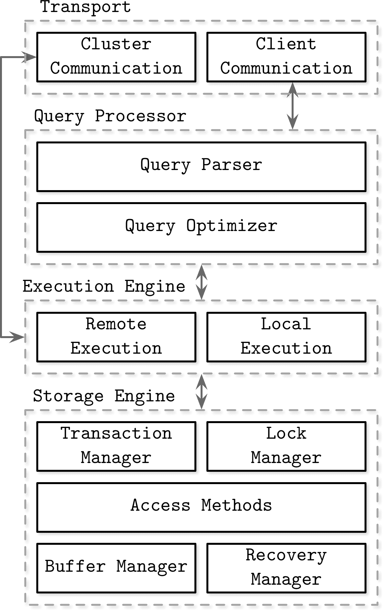
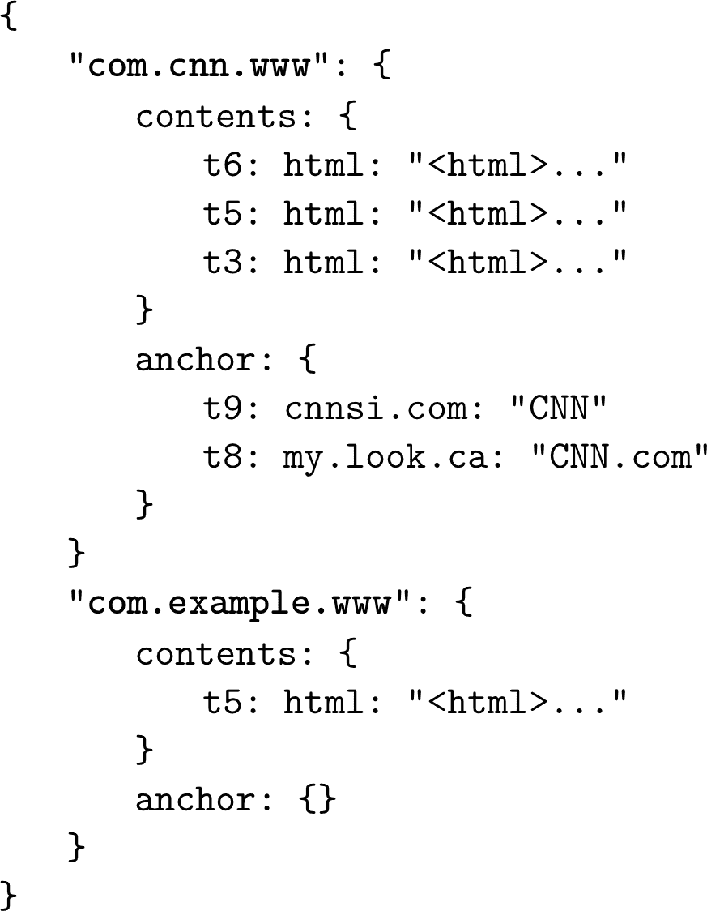
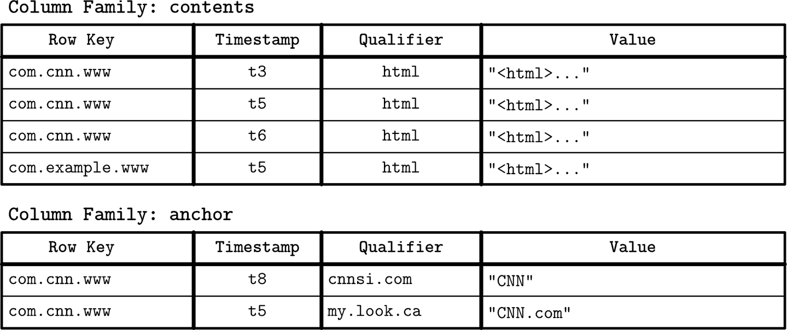
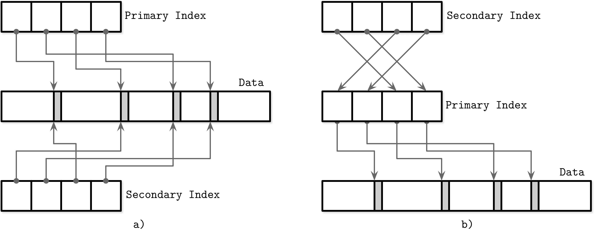

# 第一章：介绍与概述

数据库管理系统可以服务不同的目的：有些主要用于临时的*热*数据，有些作为长期存储的*冷*存储，有些允许复杂的分析查询，有些仅允许通过键访问值，有些优化用于存储时间序列数据，还有些高效存储大型二进制数据块。为了理解这些差异并进行区分，我们首先进行简要分类和概述，这有助于我们理解进一步讨论的范围。

术语有时可能不明确，并且在没有完整上下文的情况下很难理解。例如，*列*存储和*宽列*存储之间的区别几乎没有或没有关联，或者*聚集*索引和*非聚集*索引如何与*索引组织表*相关联。本章旨在消除这些术语的歧义，并找出它们的精确定义。

我们首先概述数据库管理系统的架构（参见“DBMS 架构”），并讨论系统组件及其责任。接着，我们讨论数据库管理系统在存储介质（参见“基于内存与基于磁盘的 DBMS”）和布局（参见“列式与行式 DBMS”）方面的区别。

这两组内容并未提供数据库管理系统的完整分类法，而且还有许多其他分类方式。例如，一些来源将 DBMS 分为三大类：

在线事务处理（OLTP）数据库

这些处理大量用户请求和事务。查询通常是预定义的且短暂存在。

在线分析处理（OLAP）数据库

这些处理复杂的聚合。OLAP 数据库通常用于分析和数据仓库，能够处理复杂的、长时间运行的特定查询。

混合事务和分析处理（HTAP）

这些数据库结合了 OLTP 和 OLAP 存储的特性。

还有许多其他术语和分类：键值存储、关系型数据库、文档导向存储和图数据库。由于假定读者已对它们的功能有高层次的知识和理解，因此这些概念在此不做定义。因为我们讨论的概念在大多数提到的存储类型中以某种方式广泛适用，所以完整的分类法对进一步讨论来说并不必要或重要。

本书第一部分专注于存储和索引结构，我们需要理解高级数据组织方法，以及数据与索引文件之间的关系（参见“数据文件和索引文件”）。

最后，在“缓冲、不可变性和排序”中，我们讨论了三种广泛使用的开发高效存储结构的技术，以及应用这些技术如何影响它们的设计和实施。

# DBMS 架构

没有关于数据库管理系统设计的通用蓝图。每个数据库都稍有不同，并且组件边界有些难以看到和定义。即使这些边界在纸上存在（例如，在项目文档中），在代码中看似独立的组件可能由于性能优化、处理边缘情况或架构决策而耦合在一起。

描述数据库管理系统架构的来源（例如[[HELLERSTEIN07]](app01.html#HELLERSTEIN07)、[[WEIKUM01]](app01.html#WEIKUM01)、[[ELMASRI11]](app01.html#ELMASRI11)和[[GARCIAMOLINA08]](app01.html#GARCIAMOLINA08)），不同地定义组件及其之间的关系。在图 1-1 中展示的架构展示了这些表现中的一些共同主题。

数据库管理系统采用*客户端/服务器模型*，其中数据库系统实例（*节点*）扮演服务器角色，应用程序实例扮演客户端角色。

客户端请求通过*传输*子系统到达。请求以查询形式出现，通常用某种查询语言表达。传输子系统还负责与数据库集群中的其他节点进行通信。



###### 图 1-1\. 数据库管理系统的架构

收到请求后，传输子系统将查询交给*查询处理器*，后者解析、解释并验证它。稍后进行访问控制检查，因为只有在解释查询之后才能完全进行。

解析后的查询被传递给*查询优化器*，它首先消除查询中不可能和冗余的部分，然后尝试根据内部统计数据（索引基数、近似交集大小等）和数据位置（集群中哪些节点保存数据及其传输成本）找到最有效的执行方式。优化器处理查询解析所需的关系操作，通常呈现为依赖树，并进行优化，如索引排序、基数估计和选择访问方法等。

查询通常以*执行计划*（或*查询计划*）的形式呈现：必须执行的操作序列，以使其结果被认为是完整的。由于可以使用不同的执行计划来满足相同的查询，这些计划在效率上可能有所不同，优化器选择最佳可用计划。

执行计划由*执行引擎*执行，该引擎汇总了本地和远程操作的结果。*远程执行*可能涉及向集群中的其他节点写入和读取数据，以及复制。

本地查询（直接来自客户端或其他节点）由*存储引擎*执行。存储引擎具有几个负责的组件：

事务管理器

该管理器调度事务并确保它们不会使数据库处于逻辑不一致状态。

锁管理器

该管理器在运行事务时锁定数据库对象，确保并发操作不会违反物理数据完整性。

存取方法（存储结构）

这些管理器管理访问和组织磁盘上的数据。存取方法包括堆文件和诸如 B 树（参见“无处不在的 B 树”）或 LSM 树（参见“LSM 树”）等存储结构。

缓冲管理器

该管理器在内存中缓存数据页面（参见“缓冲管理”）。

恢复管理器

该管理器维护操作日志并在发生故障时恢复系统状态（参见“恢复”）。

事务管理器和锁管理器共同负责并发控制（参见“并发控制”）：它们确保逻辑和物理数据完整性，同时尽可能高效地执行并发操作。

# 基于内存与磁盘的数据库管理系统

数据库系统在内存和磁盘上存储数据。*内存数据库管理系统*（有时称为*主存储器 DBMS*）主要将数据存储在内存中，并使用磁盘进行恢复和日志记录。*基于磁盘的* DBMS 将*大多数*数据存储在磁盘上，并使用内存缓存磁盘内容或作为临时存储。两种类型的系统在一定程度上使用磁盘，但主存储器数据库几乎完全将内容存储在 RAM 中。

访问内存比访问磁盘快几个数量级，¹因此将内存用作主要存储是非常合理的，在内存价格下降时，这样做也变得更经济实惠。但是，与 SSD 和 HDD 等持久存储设备相比，RAM 价格仍然较高。

主存储器数据库系统与基于磁盘的系统不仅在主要存储介质上有所不同，还在使用的数据结构、组织和优化技术上有所不同。

数据库使用内存作为主要数据存储的主要原因是性能更好，访问成本较低，并且访问粒度更细。相比之下，为磁盘编程要简单得多。操作系统抽象了内存管理，允许我们考虑分配和释放任意大小的内存块。在磁盘上，我们必须手动管理数据引用、序列化格式、释放的内存和碎片化。

内存数据库增长的主要限制因素是 RAM 的易失性（即缺乏持久性）和成本。由于 RAM 内容不是持久的，软件错误、崩溃、硬件故障和电源中断可能导致数据丢失。有方法可以确保持久性，如不间断电源和电池备份 RAM，但它们需要额外的硬件资源和运营经验。实际上，这一切都归结为磁盘更易于维护且价格显著较低的事实。

非易失性存储器（Non-Volatile Memory，NVM）技术的可用性和流行度增长后，情况可能会发生变化（参见[[ARULRAJ17]](app01.html#ARULRAJ17)）。NVM 存储减少或完全消除（具体取决于技术）读写延迟的不对称性，进一步提高了读写性能，并允许按字节寻址访问。

## 内存存储的持久性

内存数据库系统通过在磁盘上保留备份来提供持久性，并防止易失性数据的丢失。一些数据库将数据完全存储在内存中，没有任何持久性保证，但我们不在本书的范围内讨论它们。

在操作可以被视为完成之前，其结果必须写入顺序日志文件。我们在“恢复”中详细讨论预写式日志。为了在启动或崩溃后避免重放完整的日志内容，内存存储保留一个*备份副本*。备份副本作为一个有序的基于磁盘的结构进行维护，并且对该结构的修改通常是异步的（与客户端请求解耦），并批量应用以减少 I/O 操作的数量。在恢复过程中，可以从备份和日志中恢复数据库内容。

日志记录通常会批量应用于备份。在处理完日志记录批次后，备份会保持一个特定时间点的数据库*快照*，并且可以丢弃到此时间点的日志内容。这个过程称为*检查点*。通过使磁盘上的数据库保持最新的日志条目，而不需要客户端阻塞等待备份更新，检查点减少了恢复时间。

###### 注意

不能说内存数据库等同于具有大页缓存的磁盘数据库（参见“缓冲管理”）。尽管页面在内存中被*缓存*，但序列化格式和数据布局会产生额外开销，并且不允许内存存储可以实现的同样程度的优化。

基于磁盘的数据库使用专门的存储结构，优化了磁盘访问。在内存中，可以相对较快地跟随指针，并且随机内存访问比随机磁盘访问快得多。基于磁盘的存储结构通常采用宽而短的树形结构（参见“用于基于磁盘存储的树”），而基于内存的实现可以从更大的数据结构池中选择，并执行在磁盘上否则不可能或难以实现的优化[[GARCIAMOLINA92]](app01.html#GARCIAMOLINA92)。类似地，在磁盘上处理可变大小数据需要特别注意，而在内存中通常只需通过指针引用该值。

对于某些用例，可以合理假设整个数据集将放入内存中。某些数据集受其真实世界表示的限制，例如学校的学生记录、公司的客户记录或在线商店的库存。每条记录占用的空间不超过几 KB，并且其数量是有限的。

# 列式与行式数据库管理系统

大多数数据库系统存储一组*数据记录*，由*表*中的*列*和*行*组成。*字段*是列和行的交集：某种类型的单个值。属于同一列的字段通常具有相同的数据类型。例如，如果我们定义一个表来存储用户记录，所有姓名都将是相同类型且属于同一列。属于同一记录的逻辑上属于同一集合的值（通常由键标识）构成了一行。

数据库分类的一种方法是根据数据在磁盘上的存储方式：行式或列式。表可以水平分区（将属于同一行的值存储在一起），也可以垂直分区（将属于同一列的值存储在一起）。图 1-2 展示了这种区别：(a)展示了按列分区的值，(b)展示了按行分区的值。


###### 图 1-2\. 列向和行向存储中的数据布局

举例说明行向数据库管理系统非常丰富：[MySQL](https://dev.mysql.com)、[PostgreSQL](https://www.postgresql.org)以及大多数传统关系数据库。两个开创性的开源列式存储系统是[MonetDB](https://databass.dev/links/109)和[C-Store](https://databass.dev/links/110)（C-Store 是[Vertica](https://databass.dev/links/111)的开源前身）。

## 行向数据布局

*面向行的数据库管理系统*将数据存储在记录或*行*中。它们的布局与表格数据表示非常接近，其中每行具有相同的字段集合。例如，面向行的数据库可以有效地存储用户条目，包括姓名、出生日期和电话号码：

```
| ID | Name  | Birth Date  | Phone Number   |
| 10 | John  | 01 Aug 1981 | +1 111 222 333 |
| 20 | Sam   | 14 Sep 1988 | +1 555 888 999 |
| 30 | Keith | 07 Jan 1984 | +1 333 444 555 |
```

这种方法非常适用于多个字段构成记录（例如，姓名、出生日期和电话号码），由键（在此示例中为单调递增的数字）唯一标识。表示单个用户记录的所有字段通常一起读取。创建记录时（例如，用户填写注册表单时），我们也会一起写入它们。同时，每个字段也可以单独修改。

由于面向行的存储在需要按行访问数据时最为有用，将整行存储在一起可以提高空间局部性² [[DENNING68]](app01.html#DENNING68)。

因为在磁盘等持久介质上访问数据通常是以块为单位进行的（换句话说，磁盘访问的最小单位是块），单个块将包含所有列的数据。这对于希望访问整个用户记录的情况非常有利，但使得访问多个用户记录的单个字段（例如，仅获取电话号码的查询）的查询变得更加昂贵，因为也会调入其他字段的数据。

## 列式数据布局

*列向数据库管理系统* 将数据按*列*（即按列）分区，而不是按行存储。在这种方法中，同一列的值在磁盘上被连续存储（与前面的例子中连续存储行相对）。例如，如果我们存储历史股票市场价格，报价将被一起存储。将不同列的值存储在单独的文件或文件段中，可以通过列高效地进行查询，因为可以一次性读取，而不是消耗整行并丢弃未查询的列的数据。

列向存储非常适合分析工作负载，如查找趋势、计算平均值等。在处理复杂聚合时，逻辑记录可以包含多个字段，但其中一些字段（在此示例中为价格报价）具有不同的重要性，并经常一起使用。

从逻辑角度来看，代表股票市场报价的数据仍然可以表示为表格：

```
| ID | Symbol | Date        | Price     |
| 1  | DOW    | 08 Aug 2018 | 24,314.65 |
| 2  | DOW    | 09 Aug 2018 | 24,136.16 |
| 3  | S&P    | 08 Aug 2018 | 2,414.45  |
| 4  | S&P    | 09 Aug 2018 | 2,232.32  |
```

然而，物理基于列的数据库布局看起来完全不同。属于同一列的值被紧密地放在一起：

```
Symbol: 1:DOW; 2:DOW; 3:S&P; 4:S&P
Date:   1:08 Aug 2018; 2:09 Aug 2018; 3:08 Aug 2018; 4:09 Aug 2018
Price:  1:24,314.65; 2:24,136.16; 3:2,414.45; 4:2,232.32
```

为了重构数据元组，这对于连接、过滤和多行聚合可能很有用，我们需要在列级别保留一些元数据，以确定它与其他列的数据点相关联。如果您明确执行此操作，每个值将必须保存一个键，这会引入重复并增加存储数据量。一些列存储使用隐式标识符（*虚拟 ID*）并使用值的位置（换句话说，它的偏移量）将其映射回相关值 [[ABADI13]](app01.html#ABADI13)。

在过去几年中，可能由于对在不断增长的数据集上运行复杂分析查询的需求日益增加，我们看到了许多新的面向列的文件格式，例如[Apache Parquet](https://databass.dev/links/112)，[Apache ORC](https://databass.dev/links/113)，[RCFile](https://databass.dev/links/114)，以及诸如[Apache Kudu](https://databass.dev/links/115)，[ClickHouse](https://databass.dev/links/116)等面向列的存储系统。

## 区别和优化

不能简单地说行存储和列存储之间的区别仅在于数据存储方式。选择数据布局只是列式存储优化步骤中的一步。

在一次运行中读取同一列的多个值显著提高了缓存利用率和计算效率。在现代 CPU 上，可以使用矢量化指令来处理多个数据点，每个 CPU 指令³ [[DREPPER07]](app01.html#DREPPER07)。

将相同数据类型的值存储在一起（例如，数字与其他数字，字符串与其他字符串）可以获得更好的压缩比。我们可以根据数据类型使用不同的压缩算法，并针对每种情况选择最有效的压缩方法。

要决定是使用列式存储还是行式存储，您需要了解您的*访问模式*。如果读取的数据以记录形式消耗（即请求大部分或所有列），并且工作负载主要由点查询和范围扫描组成，则行式方法可能会产生更好的结果。如果扫描跨多行，或者计算部分列的聚合，考虑列式方法是值得的。

## 宽列存储

列式数据库不应与*宽列存储*混淆，例如[BigTable](https://databass.dev/links/117)或[HBase](https://databass.dev/links/118)，在这些系统中，数据表示为多维映射，列分组为*列族*（通常存储相同类型的数据），并且在每个列族内，数据以行方式存储。这种布局最适合存储通过键或键序列检索的数据。

来自 Bigtable 论文的一个典型例子[[CHANG06]](app01.html#CHANG06)是 Webtable。Webtable 存储网页内容的快照，它们的属性以及特定时间戳下它们之间的关系。页面由反向 URL 标识，并且所有属性（如页面*内容*和*锚点*，表示页面之间的链接）都由这些快照的时间戳标识。简化起见，可以将其表示为嵌套映射，正如图 1-3 所示。



###### 图 1-3\. Webtable 的概念结构

数据存储在多维排序映射中，具有分层索引：我们可以通过其反向 URL 和其内容或锚文本的时间戳来定位与特定网页相关的数据。每一行由其*行键*索引。相关列被分组在一起，例如本例中的*列族*—`contents` 和 `anchor`—它们分别存储在磁盘上。列族内的每个列由*列键*标识，它是列族名称和限定符的组合（例如本例中的 `html`、`cnnsi.com`、`my.look.ca`）。列族通过时间戳存储多个数据版本。此布局使我们能够快速定位更高级别的条目（在本例中为网页）及其参数（内容版本和链接到其他页面）。

虽然理解宽列存储的概念表示非常有用，但它们的物理布局有所不同。列族数据布局的示意图显示在图 1-4 中：列族分开存储，但在每个列族中，属于同一键的数据存储在一起。



###### 图 1-4\. Webtable 的物理结构

# 数据文件和索引文件

数据库系统的主要目标是存储数据并快速访问它。但是数据是如何组织的？为什么我们需要数据库管理系统而不只是一堆文件？文件组织如何提高效率？

数据库系统确实使用文件来存储数据，但不依赖于文件系统目录和文件的层次结构来定位记录，而是使用特定于实现的格式组成文件。使用专门的文件组织而不是平面文件的主要原因是：

存储效率

文件组织的方式最小化了每个存储数据记录的存储开销。

访问效率

记录可以在尽可能少的步骤中找到。

更新效率

记录更新以最小化磁盘上的更改次数进行。

数据库系统将由多个字段组成的*数据记录*存储在表中，每个表通常表示为一个单独的文件。可以使用*搜索键*查找表中的每条记录。为了定位记录，数据库系统使用*索引*：辅助数据结构，允许在每次访问时有效地定位数据记录，而无需扫描整个表。索引是使用识别记录的字段子集构建的。

数据库系统通常将*数据文件*和*索引文件*分开：数据文件存储数据记录，而索引文件存储记录元数据，并用它来定位数据文件中的记录。索引文件通常比数据文件小。文件被划分为*页*，通常每页大小为单个或多个磁盘块。页可以组织为记录序列或*插槽页*（参见“插槽页”）。

新记录（插入）和对现有记录的更新由键/值对表示。大多数现代存储系统*不会*显式地从页面中删除数据。相反，它们使用*删除标记*（也称为*墓碑*），其中包含删除元数据，例如键和时间戳。通过垃圾收集回收由其更新或删除标记阴影的记录所占用的空间，该过程读取页面，将活动（即非阴影）记录写入新位置，并丢弃阴影记录。

## 数据文件

数据文件（有时称为*主文件*）可以作为*索引组织表*（IOT）、*堆组织表*（堆文件）或*哈希组织表*（哈希文件）实现。

堆文件中的记录不需要遵循任何特定顺序，大多数情况下它们按写入顺序排列。这样做的好处是，当附加新页面时，不需要额外的工作或文件重新组织。堆文件需要额外的索引结构，指向存储数据记录的位置，以使它们可以被搜索。

在哈希文件中，记录存储在存储桶中，键的哈希值确定记录属于哪个存储桶。存储桶中的记录可以按追加顺序存储，或者按键排序以提高查找速度。

索引组织表（IOT）在索引本身中存储数据记录。由于记录按键顺序存储，因此可以通过顺序扫描其内容来实现范围扫描。

在索引中存储数据记录使我们可以至少减少一次磁盘查找，因为在遍历索引并定位搜索的键后，我们不必访问单独的文件以查找相关的数据记录。

当记录存储在单独的文件中时，索引文件保存*数据条目*，唯一标识数据记录并包含足够的信息以定位它们在数据文件中的位置。例如，我们可以存储文件*偏移量*（有时称为*行定位器*）、数据文件中数据记录的位置，或者在哈希文件的情况下存储的存储桶 ID。在索引组织表中，数据条目包含实际的数据记录。

## 索引文件

索引是一种在磁盘上组织数据记录的结构，有助于进行高效的检索操作。索引文件以专门的结构组织，将键映射到数据文件中记录的位置，这些位置是由这些键（在堆文件的情况下）或主键（在索引组织表的情况下）标识的记录所存储的位置。

在*主要*（数据）文件上的索引称为*主索引*。在大多数情况下，我们还可以假设主索引是建立在主键或一组标识为主键的键上的。所有其他索引称为*次要*。

次要索引可以直接指向数据记录，也可以仅存储其主键。指向数据记录的指针可以保存到堆文件或索引组织表的偏移量。多个次要索引可以指向同一记录，允许通过不同的字段标识单个数据记录并通过不同的索引定位。虽然主索引文件每个搜索键只保存一个唯一条目，但次要索引可能会保存多个搜索键的条目 [[GARCIAMOLINA08]](app01.html#GARCIAMOLINA08)。

如果数据记录的顺序遵循搜索键的顺序，则称此索引为*聚集*（也称为聚簇）。在聚集的情况下，数据记录通常存储在同一文件中或在*聚集文件*中，其中键的顺序被保留。如果数据存储在单独的文件中，并且其顺序不遵循键的顺序，则称索引为*非聚集*（有时称为非聚簇）。

图 1-5 展示了这两种方法之间的区别：

+   a) 一个索引组织的表，其中数据记录直接存储在索引文件中。

+   b) 一个存储偏移量的索引文件和一个单独存储数据记录的文件。


###### 图 1-5\. 将数据记录存储在索引文件中与存储数据文件偏移量之间的比较（索引段显示为白色；存储数据记录的段显示为灰色）

###### 注意

索引组织的表按索引顺序存储信息，并且定义上是聚集的。主索引通常是*大多数*聚集的。次要索引定义上是非聚集的，因为它们用于通过非主键键来访问。聚集索引可以是索引组织的或具有单独的索引和数据文件。

许多数据库系统具有固有且显式的*主键*，即一组唯一标识数据库记录的列。在未指定主键时，存储引擎可以创建*隐式*主键（例如，MySQL InnoDB 添加一个新的自增列并自动填充其值）。

此术语在不同类型的数据库系统中使用：关系数据库系统（如 MySQL 和 PostgreSQL）、基于 Dynamo 的 NoSQL 存储（如[Apache Cassandra](https://databass.dev/links/119)和[Riak](https://databass.dev/links/120)）、以及文档存储（如 MongoDB）。可能会有一些项目特定的命名，但大多数情况下都能明确映射到这些术语。

## 主索引作为间接引用

数据库社区对于数据记录是直接引用（通过文件偏移量）还是通过主键索引引用存在不同意见。⁴

这两种方法都有各自的优缺点，并且最好在完整实现的范围内进行讨论。通过直接引用数据，我们可以减少磁盘寻址次数，但在维护过程中更新记录或重新定位时必须付出更新指针的成本。使用主索引作为间接方式可以减少指针更新的成本，但在读取路径上有更高的成本。

更新仅仅几个索引可能适用于大部分读取工作负载，但是对于写入密集型工作负载和多个索引，这种方法效果不佳。为了减少指针更新的成本，一些实现采用主键进行间接寻址，而不是使用载荷偏移。例如，MySQL InnoDB 使用主索引，并执行两次查找：在次要索引中进行一次查找，在主索引中进行一次查询 [[TARIQ11]](app01.html#TARIQ11)。这样做会增加主索引查找的开销，而不是直接从次要索引的偏移量出发。

图 1-6 显示了这两种方法的不同之处：

+   a) 两个索引直接引用次要索引文件中的数据条目。

+   b) 次要索引通过主索引的间接层定位数据条目。



###### 图 1-6\. 直接引用数据元组（a）与使用主索引作为间接寻址（b）

还可以采用混合方法，同时存储数据文件偏移量和主键。首先，检查数据偏移量是否仍然有效，如果已更改，则通过主键索引支付额外的成本，并在找到新偏移量后更新索引文件。

# 缓冲、不可变性和顺序

存储引擎基于某些数据结构。然而，这些结构并未描述缓存、恢复、事务性以及存储引擎在其上添加的其他功能的语义。

在接下来的章节中，我们将从 B-Tree 开始讨论（见 “普遍存在的 B-Tree”），并尝试理解为什么会有这么多 B-Tree 的变体，以及为什么新的数据库存储结构不断出现。

存储结构具有三个常见变量：它们使用 *缓冲*（或避免使用），使用 *不可变*（或可变）文件，以及 *有序*（或无序）存储值。本书讨论的大多数存储结构的区别和优化与这三个概念之一相关。

缓冲

这定义了存储结构是否选择在将一定量的数据写入磁盘之前在内存中收集它。当然，每种磁盘结构都必须以*某种*程度使用缓冲，因为从磁盘传输和传出的最小数据单元是一个*块*，最好写入完整的块。在这里，我们讨论的是可避免的缓冲，存储引擎实施者*选择*这样做。本书讨论的第一个优化之一是向 B-Tree 节点添加内存缓冲区，以分摊 I/O 成本（见“延迟加载 B-Tree”）。然而，这不是我们可以应用缓冲的唯一方式。例如，两部分组成的 LSM 树（见“两部分组成的 LSM 树”），尽管与 B-Tree 相似，但以完全不同的方式使用缓冲，并结合了缓冲与不可变性。

可变性（或不可变性）

这定义了存储结构是否读取文件的部分内容，更新它们，并将更新后的结果写回文件中相同位置。不可变结构是*追加式*的：一旦写入，文件内容就不再修改。相反，修改被追加到文件末尾。实现不可变性还有其他方式。其中一种是*写时复制*（见“写时复制 B-Tree”），其中修改的页，持有记录的更新版本，写入到文件的*新*位置，而不是原始位置。通常，LSM 与 B-Tree 之间的区别被描述为不可变对抗就地更新存储，但也有一些结构（例如，“Bw-Tree”）受到 B-Tree 启发却是不可变的。

排序

这定义了*数据记录*是否按照键顺序存储在磁盘页中。换句话说，排序紧密的键存储在磁盘上的连续段中。排序通常决定我们是否能高效地扫描记录的*范围*，而不仅仅是定位单个数据记录。无序存储数据（通常按插入顺序），为某些写入时优化打开了可能性。例如，Bitcask（见“Bitcask”）和 WiscKey（见“WiscKey”）直接将数据记录存储在追加只文件中。

当然，简要讨论这三个概念是不足以展示它们的力量的，我们将在本书的其余部分继续讨论这些内容。

# 总结

在本章中，我们讨论了数据库管理系统的架构并介绍了其主要组件。

为了突显基于磁盘的结构及其与基于内存的结构的区别，我们讨论了基于内存和基于磁盘的存储。我们得出结论，磁盘结构对两种存储类型都很重要，但用途不同。

为了理解访问模式如何影响数据库系统设计，我们讨论了基于列和基于行的数据库管理系统以及区分它们的主要因素。为了开启一场关于*数据存储方式*的讨论，我们涵盖了数据和索引文件。

最后，我们介绍了三个核心概念：缓冲、不变性和顺序。在本书中，我们将使用它们来突出使用这些概念的存储引擎的特性。

¹ 您可以在[*https://people.eecs.berkeley.edu/~rcs/research/interactive_latency.html*](https://people.eecs.berkeley.edu/~rcs/research/interactive_latency.html)找到多年来磁盘、内存访问延迟以及许多其他相关数字的可视化和比较。

² 空间局部性是局部性原则之一，指出如果访问了一个内存位置，则将来会访问其附近的内存位置。

³ 矢量化指令，或称单指令多数据（SIMD），描述了一类 CPU 指令，可对多个数据点执行相同操作。

⁴ 引发讨论的原始帖子颇具争议且偏颇，但您可以参考[比较 MySQL 和 PostgreSQL 索引与存储格式的演示](https://databass.dev/links/121)，该演示也引用了原始来源。
