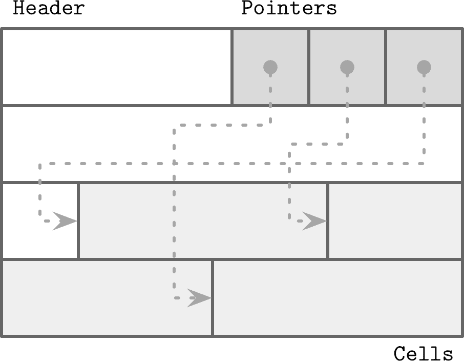

# 第三章：文件格式

在涵盖 B-Tree 的基本语义后，我们现在可以探讨 B-Tree 及其他结构在磁盘上的具体实现方式。我们访问磁盘的方式与访问主存的方式不同：从应用程序开发者的角度来看，内存访问大多是透明的。由于虚拟内存[[BHATTACHARJEE17]](app01.html#BHATTACHARJEE17)，我们不必手动管理偏移量。磁盘访问是通过系统调用完成的（参见[*https://databass.dev/links/54*](https://databass.dev/links/54)）。通常我们需要指定目标文件内的偏移量，然后将磁盘上的表示解释为适合主存的形式。

这意味着高效的磁盘结构必须考虑到这种区别。为此，我们必须设计一个易于构建、修改和解释的文件格式。在本章中，我们将讨论通用原则和实践，帮助我们设计各种类型的磁盘结构，不仅限于 B-Tree。

B-Tree 有许多实现可能性，这里我们讨论几种有用的技术。细节可能在实现之间有所不同，但一般原则保持不变。理解 B-Tree 的基本机制，如分裂和合并，是必要的，但对于实际实现来说是不够的。有许多因素必须共同作用，才能使最终结果有用。

在磁盘结构中管理指针的语义与内存中的有所不同。将磁盘 B-Tree 视为页面管理机制是很有用的：算法必须组合和导航*页面*。页面及其指针必须相应计算和放置。

由于 B-Tree 大部分复杂性来自可变性，我们讨论了页面布局、分裂、重定位和其他适用于可变数据结构的概念的细节。稍后，在讨论 LSM 树时（见“LSM Trees”），我们侧重于排序和维护，因为这是 LSM 复杂性的主要来源。

# 动机

创建文件格式在许多方面与我们在具有无管理内存模型的语言中创建数据结构类似。我们分配一个数据块并按照需要切割它，使用固定大小的原语和结构。如果我们想引用较大的内存块或具有可变大小的结构，我们使用指针。

具有无管理内存模型的语言允许我们在需要时分配更多内存（在合理范围内），而无需考虑是否有可用的连续内存段，是否碎片化，或释放后会发生什么。在磁盘上，我们必须自己处理垃圾收集和碎片化问题。

在内存中，数据布局远比在磁盘上重要得多。为了使驻留在磁盘上的数据结构高效，我们需要以能够快速访问数据的方式布局数据，并考虑持久存储介质的特性，设计二进制数据格式，并找到有效地序列化和反序列化数据的方法。

任何曾经使用过像 C 这样的低级语言而没有额外库的人都知道它的限制。结构体有预定义的大小，并且必须显式分配和释放。手动实现内存分配和跟踪更加困难，因为只能操作预定义大小的内存段，并且必须跟踪哪些段已经释放，哪些还在使用中。

将数据存储在主内存中时，大多数关于内存布局的问题不存在，更容易解决，或者可以使用第三方库解决。例如，处理可变长度字段和超大数据要简单得多，因为我们可以使用内存分配和指针，而不需要以任何特殊方式布局它们。尽管开发人员有时会设计专门的主内存数据布局来利用 CPU 缓存行、预取等硬件相关特性，但这主要是为了优化目的而已[[FOWLER11]](app01.html#FOWLER11)。

尽管操作系统和文件系统会承担部分责任，但实现在磁盘上的数据结构需要注意更多细节，并有更多陷阱。

# 二进制编码

要高效地将数据存储在磁盘上，需要使用紧凑且易于序列化和反序列化的格式进行编码。谈到二进制格式时，您经常听到*布局*这个词。因为我们没有像`malloc`和`free`这样的原语，只有`read`和`write`，我们必须以不同的方式考虑访问并相应地准备数据。

在这里，我们讨论了创建高效页面布局所使用的主要原则。这些原则适用于任何二进制格式：您可以使用类似的指导原则创建文件和序列化格式或通信协议。

在我们能将记录组织成页面之前，我们需要了解如何用二进制形式表示键和数据记录，如何将多个值组合成更复杂的结构，以及如何实现可变大小类型和数组。

## 原始类型

键和值具有*类型*，如`整数`、`日期`或`字符串`，可以用它们的原始二进制形式表示（序列化和反序列化）。

大多数数值数据类型都表示为固定大小的值。在处理多字节数值时，使用相同的*字节顺序*（*字节序*）进行编码和解码非常重要。字节序决定字节的顺序：

大端序

顺序从最高有效字节（MSB）开始，然后是按*降序*重要性顺序的字节。换句话说，MSB 具有*最低*地址。

小端序

字节序从最不显著字节（LSB）开始，按 *增加的* 重要性顺序排列。

图 3-1 阐明了这一点。十六进制的 32 位整数 `0xAABBCCDD`，其中 `AA` 是最高有效字节，使用大端序和小端序字节顺序显示。


###### 图 3-1\. 大端序和小端序字节顺序。最高有效字节显示为灰色。地址 `a` 从左向右增长。

例如，为了根据相应的字节顺序重建 64 位整数，RocksDB 使用特定于平台的定义来帮助识别目标[平台字节顺序](https://databass.dev/links/55)。¹ 如果目标平台的字节顺序与值的字节顺序不匹配（[`EncodeFixed64WithEndian`](https://databass.dev/links/56) 查找 `kLittleEndian` 值并将其与值的字节顺序进行比较），它将使用 [`EndianTransform`](https://databass.dev/links/57) 反向逐字节读取值，并将其追加到结果中。

记录由诸如数字、字符串、布尔值及其组合之类的原始类型组成。但是，在通过网络传输或将其存储到磁盘时，我们只能使用字节序列。这意味着为了发送或写入记录，我们必须对其进行 *序列化*（将其转换为可解释的字节序列），并在接收或读取后使用之前，必须对其进行 *反序列化*（将字节序列转换回原始记录）。

在二进制数据格式中，我们总是从原始类型开始，作为构建更复杂结构的基础。不同的数值类型在大小上可能有所不同。`byte` 值为 8 位，`short` 是 2 字节（16 位），`int` 是 4 字节（32 位），`long` 是 8 字节（64 位）。

浮点数（例如 `float` 和 `double`）由它们的 *符号*、*分数* 和 *指数* 表示。[IEEE 二进制浮点数算术标准](https://ieeexplore.ieee.org/document/30711)（IEEE 754）标准描述了广泛接受的浮点数表示。32 位 `float` 表示单精度值。例如，浮点数 `0.15652` 的二进制表示如图 3-2 所示。前 23 位表示分数，接下来的 8 位表示指数，1 位表示符号（表示数是否为负）。


###### 图 3-2\. 单精度浮点数的二进制表示

由于浮点数值是通过分数计算得出的，所以该表示得出的数字只是一个近似值。讨论完整的转换算法超出本书的范围，我们只涵盖表示的基础知识。

`double` 表示双精度浮点值 [[SAVARD05]](app01.html#SAVARD05)。大多数编程语言都有用于将浮点值编码和解码为它们的二进制表示的方法。

## 字符串和可变大小数据

所有基本数值类型都有固定大小。将更复杂的值组合在一起很像 C 语言中的`struct`²。您可以将基本值组合成结构，并使用固定大小数组或指向其他内存区域的指针。

字符串和其他可变大小数据类型（例如固定大小数据的数组）可以序列化为一个数字，表示数组或字符串的长度，然后是 `size` 字节：实际数据。对于字符串，这种表示通常称为*UCSD 字符串*或[*Pascal 字符串*](https://databass.dev/links/59)，以流行的 Pascal 编程语言实现命名。我们可以用伪代码表示如下：

```
String
{
    size    uint_16
    data    byte[size]
}
```

替代 Pascal 字符串的是*空终止字符串*，读者以字节为单位逐字节消耗字符串，直到达到字符串结束符号为止。Pascal 字符串方法有几个优点：它允许在常数时间内找到字符串的长度，而不是通过字符串内容迭代，而且可以通过从内存中切片 `size` 字节并将字节数组传递给字符串构造函数来组成特定于语言的字符串。

## 位压缩数据：布尔值、枚举和标志

布尔值可以通过使用单个字节表示，或者将 `true` 和 `false` 编码为 `1` 和 `0` 值来表示。由于布尔值只有两个值，因此将整个字节用于其表示是浪费的，开发人员经常将布尔值批量组合在一起，每个布尔值仅占据一个位。我们说每个 `1` 位被*设置*，每个 `0` 位被*未设置*或*空*。

[枚举](https://databass.dev/links/60)，简称为*枚举类型*，可以表示为整数，并且经常用于二进制格式和通信协议中。枚举用于表示经常重复的低基数值。例如，我们可以使用枚举来编码 B-Tree 节点类型：

```
enum NodeType {
   ROOT,     // 0x00h
   INTERNAL, // 0x01h
   LEAF      // 0x02h
};
```

另一个密切相关的概念是*标志*，类似于压缩布尔值和枚举的组合。标志可以表示非互斥的命名布尔参数。例如，我们可以使用标志来表示页面是否包含值单元格，值是否固定大小或可变大小，以及此节点是否关联有溢出页面。因为每个位代表一个标志值，所以我们只能使用二的幂值作为掩码（因为二的幂在二进制中始终只有一个设置位；例如，`2³ == 8 == 1000b`，`2⁴ == 16 == 0001 0000b`等）：

```
int IS_LEAF_MASK         = 0x01h; // bit #1
int VARIABLE_SIZE_VALUES = 0x02h; // bit #2
int HAS_OVERFLOW_PAGES   = 0x04h; // bit #3
```

就像紧凑布尔值一样，可以使用位掩码和位操作符从打包值中读取和写入标志值。例如，为了设置负责其中一个标志的位，我们可以使用位或(`|`)和位掩码。除了位掩码，还可以使用位移(`<<`)和位索引。要取消设置位，可以使用位与(`&`)和位取反运算符(`~`)。要测试位`n`是否设置，可以将位与的结果与`0`进行比较：

```
// Set the bit
flags |= HAS_OVERFLOW_PAGES;
flags |= (1 << 2);

// Unset the bit
flags &= ~HAS_OVERFLOW_PAGES;
flags &= ~(1 << 2);

// Test whether or not the bit is set
is_set = (flags & HAS_OVERFLOW_PAGES) != 0;
is_set = (flags & (1 << 2)) != 0;
```

# 一般原则

通常情况下，设计文件格式时，首先决定如何进行寻址：文件是否将被分割成相同大小的页面，这些页面由单个或多个连续的块表示。大多数就地更新存储结构使用相同大小的页面，因为这显著简化了读取和写入访问。追加写存储结构通常也按页面方式写入数据：记录一个接一个地追加，一旦页面在内存中填满，就会被刷新到磁盘上。

文件通常以固定大小的*头部*开始，并且可能以固定大小的*尾部*结束，这些部分包含了应该快速访问的辅助信息，或者是解码文件剩余部分所需的信息。文件的其余部分被分割成页面。图 3-3 简要显示了这种文件组织方式。


###### 图 3-3\. 文件组织

许多数据存储都有固定的模式，指定表格可以容纳的字段数量、顺序和类型。采用固定模式有助于减少存储在磁盘上的数据量：我们可以使用它们的位置标识符，而不是重复写入字段名称。

如果我们想为公司目录设计一个格式，存储每位员工的姓名、出生日期、税号和性别，我们可以采用几种方法。我们可以将固定大小的字段（如出生日期和税号）存储在结构的开头，然后是可变大小的字段：

```
Fixed-size fields:
| (4 bytes) employee_id                |
| (4 bytes) tax_number                 |
| (3 bytes) date                       |
| (1 byte)  gender                     |
| (2 bytes) first_name_length          |
| (2 bytes) last_name_length           |

Variable-size fields:
| (first_name_length bytes) first_name |
| (last_name_length bytes) last_name   |
```

现在，要访问`first_name`，我们可以在固定大小区域之后切片`first_name_length`字节。要访问`last_name`，可以通过检查其前面的可变大小字段的大小来定位其起始位置。为了避免涉及多个字段的计算，我们可以将*偏移量*和*长度*编码到固定大小区域。在这种情况下，可以单独定位任何可变大小字段。

构建更复杂的结构通常涉及构建层次结构：由原始数据组成的字段，由字段组成的单元格，由单元格组成的页面，由页面组成的部分，由部分组成的区域等等。在这里没有必须遵循的严格规则，一切都取决于您需要为其创建格式的数据类型。

数据库文件通常由多个部分组成，查找表帮助导航并指向这些部分的起始偏移量，这些偏移量可以写入文件头部、尾部或者单独的文件中。

# 页面结构

数据库系统将数据记录存储在数据和索引文件中。这些文件被划分为称为*页*的固定大小单元，通常每个页的大小为多个文件系统块。页的大小通常介于 4 到 16 KB 之间。

让我们看一个关于磁盘上 B-Tree 节点的例子。从结构的角度来看，在 B-树中，我们区分*叶节点*（包含键和数据记录对）和*非叶节点*（包含键和指向其他节点的指针）。每个 B-树节点占据一个或多个链接在一起的页，因此在 B-树的上下文中，术语*节点*、*页*（甚至*块*）通常是可以互换使用的。

最初的 B-Tree 论文[[BAYER72]](app01.html#BAYER72)描述了一种简单的固定大小数据记录页组织，其中每个页仅仅是三元组的串联，如图 3-4 所示：键由`k`表示，相关值由`v`表示，指向子页面的指针由`p`表示。


###### 图 3-4\. 固定大小记录的页面组织

这种方法易于理解，但也有一些缺点：

+   在右侧以外的任何位置添加键都需要重新定位元素。

+   它不允许高效地管理或访问变大小的记录，并且仅适用于固定大小的数据。

# 利用槽页

在存储变大小记录时，主要问题是自由空间的管理：回收已删除记录占用的空间。如果尝试将大小为`n`的记录放入以前占用大小为`m`的空间中，除非`m == n`或者我们可以找到另一个大小恰好为`m - n`的记录，否则这个空间将保持未使用状态。类似地，如果大小为`m`的段不能用于存储大小为`k`的记录（如果`k`大于`m`），那么它将在不回收未使用空间的情况下插入。

为了简化变大小记录的空间管理，我们可以将页面分割为固定大小的段。但是，如果这样做，我们也会浪费空间。例如，如果使用的段大小为 64 字节，除非记录大小是 64 的倍数，否则我们会浪费`64 - (n 取模 64)`字节，其中`n`是插入记录的大小。换句话说，除非记录大小是 64 的倍数，其中一个块将只部分填充。

简单地重写页面并移动记录可以进行空间回收，但是我们需要保留记录偏移量，因为超出页面指针可能正在使用这些偏移量。在尽量减少空间浪费的同时执行这些操作是非常可取的。

总结一下，我们需要一个页面格式，允许我们：

+   以最小的开销存储变大小记录。

+   回收已删除记录占用的空间。

+   引用页面中的记录时，不考虑它们的确切位置。

为了高效存储诸如字符串、二进制大对象（BLOBs）等可变大小记录，我们可以使用一种称为*插槽页面*（即带有插槽的页面）的组织技术[[SILBERSCHATZ10]](app01.html#SILBERSCHATZ10)或*插槽目录*[[RAMAKRISHNAN03]](app01.html#RAMAKRISHNAN03)。这种方法被许多数据库使用，例如，[PostgreSQL](https://databass.dev/links/61)。

我们将页面组织成一组*插槽*或*单元*，并将指针和单元拆分为两个独立的内存区域，分别位于页面的不同侧。这意味着我们只需要重新组织指向单元的指针以保留顺序，删除记录可以通过将其指针置空或删除它来完成。

插槽页面有一个固定大小的页眉，其中包含页面和单元的重要信息（请参阅“页面页眉”）。单元的大小可能不同，并且可以包含任意数据：键、指针、数据记录等。图 3-5 显示了插槽页面的组织方式，其中每个页面都有一个维护区域（页眉）、单元和指向它们的指针。



###### 图 3-5\. 插槽页面

让我们看看这种方法如何解决我们在本节开头提到的问题：

+   最小的开销：插槽页面所产生的唯一开销是一个指针数组，用于存储记录的确切位置的偏移量。

+   空间回收：可以通过碎片整理和重写页面来回收空间。

+   动态布局：从页面外部，插槽只通过其 ID 进行引用，因此确切位置是页面内部的。

# 单元布局

使用标志、枚举和原始值，我们可以开始设计单元布局，然后将单元组合成页面，并从页面组成树。在单元级别上，我们区分键单元和键值单元。键单元包含一个分隔键和指向页面之间两个相邻指针之间的指针。键值单元包含与它们相关联的键和数据记录。

我们假设页面中的所有单元都是统一的（例如，所有单元只能保存键或键和值；同样，所有单元保存的数据要么是固定大小的，要么是可变大小的，但不会混合）。这意味着我们可以在页面级别上存储一次描述单元的元数据，而不是在每个单元中重复它。

要组成一个键单元，我们需要知道：

+   单元类型（可以从页面元数据中推断出）

+   键的大小

+   指向此单元指向的子页面的 ID

+   键的字节数

变长键单元布局可能看起来像这样（固定大小的键单元在单元级别上没有大小指定符号）：

```
0                4               8
+----------------+---------------+-------------+
| [int] key_size | [int] page_id | [bytes] key |
+----------------+---------------+-------------+
```

我们将固定大小的数据字段组合在一起，后跟`key_size`字节。这不是绝对必要的，但可以简化偏移量计算，因为所有固定大小的字段可以通过使用静态的、预先计算的偏移量进行访问，并且我们只需要为可变大小的数据计算偏移量。

键-值单元格存储数据记录，而不是子页面 ID。否则，它们的结构类似：

+   单元格类型（可从页面元数据推断）

+   密钥大小

+   值大小

+   键字节

+   数据记录字节

```
0              1                5 ...
+--------------+----------------+
| [byte] flags | [int] key_size |
+--------------+----------------+

5                  9                    .. + key_size
+------------------+--------------------+----------------------+
| [int] value_size |     [bytes] key    | [bytes] data_record  |
+------------------+--------------------+----------------------+
```

您可能已经注意到这里的*偏移*和*页面 ID*之间的区别。由于页面具有固定大小，并由页面缓存管理（参见“缓冲管理”），我们只需存储页面 ID，稍后再使用查找表将其转换为文件中实际偏移量。*单元格偏移*是页面本地的，并且相对于页面起始偏移量：这样我们可以使用更小基数的整数来保持表示更紧凑。

# 将单元格组合成插槽页

要将单元格组织成页面，我们可以使用我们在“页面结构”中讨论的*插槽页*技术。我们将单元格追加到页面的右侧（朝其末端），并在页面的左侧保留单元格偏移/指针，如图 3-6 所示。


###### 图 3-6\. 偏移和单元格增长方向

键可以无序插入，并且通过按键顺序对单元格偏移指针进行排序保持其逻辑排序顺序。这种设计允许以最小的努力追加单元格到页面，因为在插入、更新或删除操作期间无需重新定位单元格。

让我们举一个页面保存名称的例子。向页面添加了两个名称，它们的插入顺序是：*汤姆* 和 *莱斯利*。如您在图 3-7 中所见，它们的*逻辑*顺序（在本例中为字母顺序）与*插入*顺序（它们追加到页面的顺序）*不*匹配。单元格按插入顺序排列，但偏移量被重新排序以允许使用二进制搜索。


###### 图 3-7\. 随机顺序追加记录：汤姆，莱斯利

现在，我们想在此页面上再添加一个名字：*罗恩*。新数据被追加到页面空闲空间的上边界，但单元格偏移必须保持词典排序键顺序：*莱斯利*，*罗恩*，*汤姆*。为此，我们必须重新排序单元格偏移量：在*插入点*之后的指针被向右移动，以为罗恩单元格腾出空间，如图 3-8 所示。


###### 图 3-8\. 追加一个记录：罗恩

# 管理可变大小数据

从页面中删除一个项目不必删除实际的单元格并移动其他单元格以重新占用已释放的空间。相反，可以将单元格标记为已删除，并在内存中更新一个*可用性列表*，包括释放的内存量和指向已释放值的指针。可用性列表存储释放段的偏移量及其大小。在插入新单元格时，我们首先检查可用性列表，查找是否有一个可以容纳它的段。您可以在 图 3-9 中看到带有可用段的碎片页面示例。


###### 图 3-9\. 碎片页面和可用性列表。已占用的页面显示为灰色。虚线表示来自可用性列表的未占用内存区域的指针。

SQLite 将未占用的段称为*freeblocks*，并在页面头部存储指向第一个[页面头部的 freeblock](https://databass.dev/links/62)的指针。此外，它还存储页面内可用字节的总数，以快速检查是否可以在碎片整理后将新元素放入页面中。

适合度是基于*策略*计算的：

首次适配

这可能会导致更大的开销，因为重用第一个合适的片段后剩余的空间可能太小，无法容纳其他任何单元，因此会被浪费。

最佳适配

为了最佳适配，我们试图找到一个片段，插入后留下的余量最小。

如果我们找不到足够的连续字节来放置新单元格，但有足够的碎片字节可用，将读取和重写活动单元格，对页面进行碎片整理，并为新写入回收空间。如果即使碎片整理后仍然没有足够的空闲空间，我们必须创建一个溢出页面（参见“溢出页面”）。

###### 注意

为了改善局部性（特别是在键的大小较小时），一些实现在叶级别上分别存储键和值。将键保持在一起可以提高搜索期间的局部性。找到搜索的键后，可以在相应索引的值单元格中找到其值。对于可变大小的键，这要求我们计算并存储额外的值单元格指针。

总之，为了简化 B-Tree 布局，我们假设每个节点占用单个页面。页面包括固定大小的页头、单元格指针块和单元格。单元格包含键和指向子节点或关联数据记录页面的指针。B-Tree 使用简单的指针层次结构：页面标识符用于定位树文件中的子节点，单元格偏移量用于定位页面内的单元格。

# 版本控制

数据库系统不断发展，开发人员努力添加功能，并修复错误和性能问题。因此，二进制文件格式可能会发生变化。大多数情况下，任何存储引擎版本都必须支持多种序列化格式（例如，当前版本和一个或多个向后兼容性的旧格式）。为了支持这一点，我们必须能够找出所面对的文件版本。

可以通过几种方式实现这一点。例如，Apache Cassandra 在文件名中使用版本前缀。这样，您甚至可以在不打开文件的情况下知道文件的版本。从 4.0 版本开始，数据文件名具有`na`前缀，例如*na-1-big-Data.db*。旧文件具有不同的前缀：以 3.0 版本编写的文件具有`ma`前缀。

或者，版本可以存储在单独的文件中。例如，[PostgreSQL](https://databass.dev/links/63)将版本存储在*PG_VERSION*文件中。

版本还可以直接存储在索引文件头中。在这种情况下，头部的一部分（或整个头部）必须以不随版本更改的格式进行编码。找出文件使用的版本后，我们可以创建一个版本特定的读取器来解释内容。一些文件格式使用魔术数字来识别版本，我们将在“魔术数字”中详细讨论。

# 校验

磁盘上的文件可能会因软件错误和硬件故障而损坏或损坏。为了预防这些问题并避免将损坏的数据传播到其他子系统甚至节点，我们可以使用校验和和循环冗余检查（CRC）。

一些来源没有区分加密和非加密哈希函数、CRC 和校验和。它们的共同点是将大量数据减少到一个小数字，但它们的用途、目的和保证不同。

校验和提供了最弱的保证形式，并且无法检测多位数据的损坏。它们通常通过使用 XOR 与奇偶校验或求和来计算 [[KOOPMAN15]](app01.html#KOOPMAN15)。

CRC 可以帮助检测突发错误（例如，当多个连续位被损坏时）。它们的实现通常使用查找表和多项式除法 [[STONE98]](app01.html#STONE98)。检测多位错误至关重要，因为通信网络和存储设备中的大部分故障表现为这种方式。

###### 警告

非加密哈希和 CRC 不应用于验证数据是否被篡改。为此，您应始终使用专为安全而设计的强加密哈希。CRC 的主要目标是确保数据没有意外和偶然的更改。这些算法并非旨在抵抗对数据的攻击和有意的更改。

在将数据写入磁盘之前，我们会计算其校验和并与数据一起写入。在读取时，我们再次计算校验和并与写入的校验和进行比较。如果校验和不匹配，则表示数据已损坏，我们不应使用读取的数据。

由于在整个文件上计算校验和通常是不切实际的，并且我们不太可能每次访问时都读取整个内容，因此页面校验和通常是在页面上计算并放置在页面头部。这样一来，校验和可以更加健壮（因为它们是在数据的一个小子集上执行的），并且如果损坏仅限于单个页面，则不必丢弃整个文件。

# 摘要

在本章中，我们学习了关于二进制数据组织的知识：如何序列化原始数据类型，将它们组合成单元，将这些单元构建成分槽页，并导航这些结构。

我们学习了如何处理变长数据类型，如字符串、字节序列和数组，并组成特殊的单元来保存其中包含的值的大小。

我们讨论了分槽页格式，这种格式允许我们通过单元 ID 从页外引用单个单元，按插入顺序存储记录，并通过排序单元偏移保留键顺序。

这些原则可以用于组成用于磁盘结构和网络协议的二进制格式。

¹ 根据平台（macOS、Solaris、Aix 或其中一个 BSD 变体或 Windows），`kLittleEndian` 变量设置为平台是否支持小端序。

² 值得注意的是，编译器可以在结构体中添加填充，这也依赖于架构。这可能会破坏对确切字节偏移和位置的假设。您可以在这里阅读更多关于结构体填充的信息：[*https://databass.dev/links/58*](https://databass.dev/links/58)。
