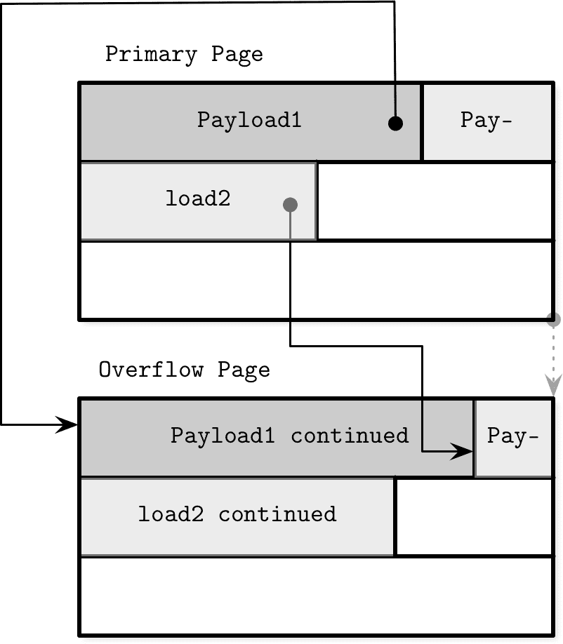
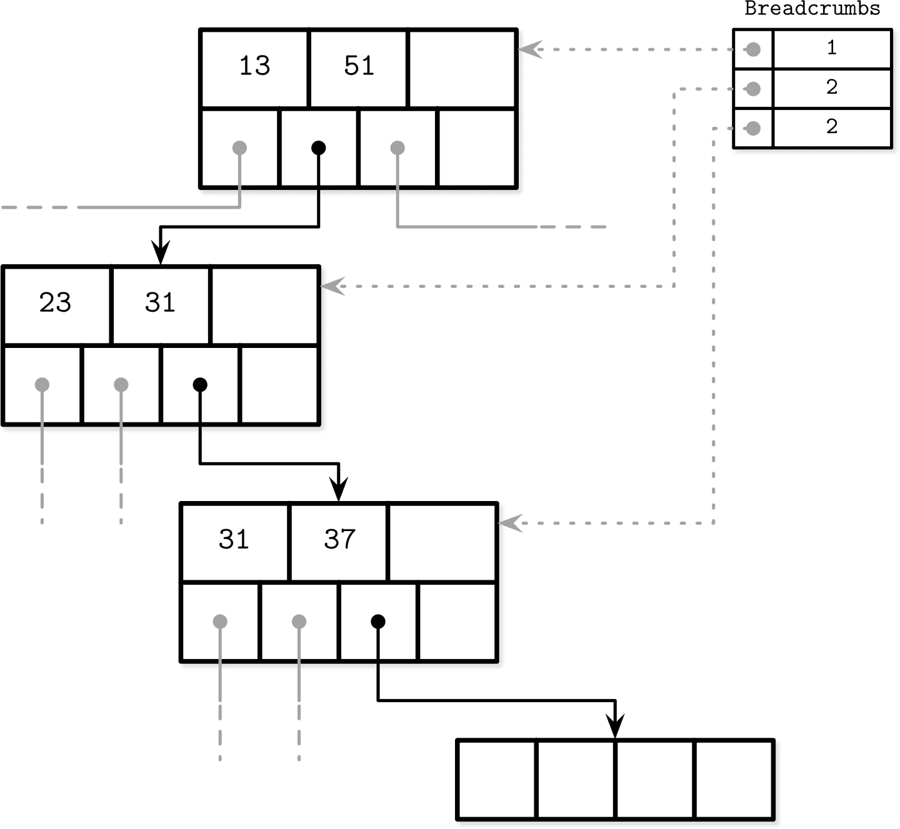
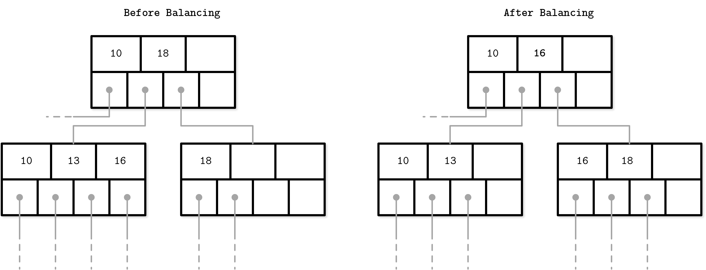
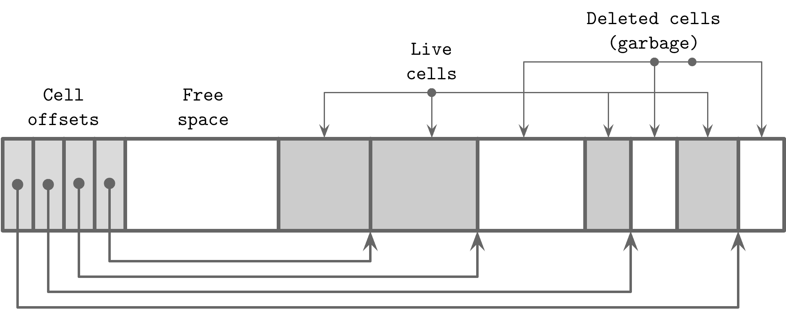

# 第四章：实现 B-树

在前一章中，我们讨论了二进制格式组合的一般原则，并学习了如何创建单元格、构建层次结构，并使用指针将它们连接到页面。这些概念适用于就地更新和仅追加存储结构。在本章中，我们讨论了一些特定于 B-树的概念。

本章节分为三个逻辑组。首先，我们讨论组织：如何建立键和指针之间的关系，以及如何实现页面之间的头部和链接。

接下来，我们讨论了在从根到叶的下降过程中发生的过程，即如何执行二进制搜索，如何收集面包屑并跟踪父节点，以防后续需要拆分或合并节点。

最后，我们讨论了优化技术（重新平衡、仅右追加和批量加载）、维护过程和垃圾回收。

# 页面头

页面头包含关于页面的信息，可用于导航、维护和优化。通常包含描述页面内容和布局的标志、页面中单元格的数量、标记空白空间的下限和上限偏移量（用于附加单元格偏移量和数据），以及其他有用的元数据。

例如，[PostgreSQL](https://databass.dev/links/12) 在头部存储页面大小和布局版本。在 [MySQL InnoDB](https://databass.dev/links/13) 中，页面头包含堆记录的数量、层级和一些其他特定于实现的值。在 [SQLite](https://databass.dev/links/14) 中，页面头存储单元格数量和最右指针。

## 魔法数字

文件或页面头部经常放置一个魔法数字值。通常是一个多字节块，包含一个常量值，可用于信号化该块表示页面、指定其类型或识别其版本。

魔法数字经常用于验证和健全性检查 [[GIAMPAOLO98]](app01.html#GIAMPAOLO98)。在随机偏移处的字节序列恰好匹配魔法数字的可能性非常小。如果匹配，则偏移可能是正确的。例如，在写入过程中，我们可以将 `50 41 47 45`（`PAGE` 的十六进制表示）放入头部以验证页面是否正确加载和对齐。在读取过程中，通过将读取头部的四个字节与预期的字节序列进行比较来验证页面。

## 兄弟链接

一些实现存储向前和向后的链接，指向左右兄弟页面。这些链接帮助定位相邻节点，而无需返回父节点。这种方法增加了拆分和合并操作的复杂性，因为必须更新兄弟偏移量。例如，当非最右节点被拆分时，其右兄弟的后向指针（之前指向被拆分的节点）必须重新绑定以指向新创建的节点。

在图 4-1 中，您可以看到为了定位兄弟节点，除非兄弟节点已链接，否则必须参考父节点。此操作可能一直上升到根，因为直接的父节点只能帮助处理*它的*子节点。如果直接在头部存储兄弟链接，我们可以简单地跟随它们来定位同一级别上的前一个或下一个节点。

###### 图 4-1\. 通过跟随父链接（a）与兄弟链接（b）定位兄弟节点

存储兄弟链接的一个缺点是在拆分和合并时必须更新它们。由于更新必须在兄弟节点而不是在拆分/合并节点中发生，可能需要额外的锁定。我们在“Blink-Trees”中讨论了在并发 B-树实现中兄弟链接的用处。

## 最右指针

B-树分隔键具有严格的不变性：它们用于将树分割为子树并导航它们，因此子页面的指针总是比键多一个。这解释了“计数键”中提到的`+1`。

在“分隔键”中，我们描述了分隔键的不变性。在许多实现中，节点看起来更像是图 4-2 所显示的：每个分隔键都有一个子指针，而最后一个指针单独存储，因为它不与任何键对应。您可以将此与图 2-10 进行比较。

###### 图 4-2\. 最右指针

此额外的指针可以存储在头部中，例如在[SQLite](https://databass.dev/links/16)中实现的方式。

如果最右边的子节点被拆分，并且新单元追加到其父节点中，则必须重新分配最右边的子节点指针。如图 4-3 所示，在拆分后，追加到父节点的单元（显示为灰色）包含了提升的键，并指向拆分的节点。新节点的指针被分配到之前的最右边指针位置。SQLite 中描述并实现了类似的方法。¹

###### 图 4-3\. 节点拆分期间的最右指针更新。提升的键显示为灰色。

## 节点高键

我们可以采用略有不同的方法，将右边的指针与节点的*高键*一起存储在单元中。高键表示当前节点下可能存在的最高键。这种方法被 PostgreSQL 采用，称为 B^(link)-Trees（有关此方法的并发影响，请参阅“Blink-Trees”）。

B-树有`N`个键（用`K[i]`表示）和`N + 1`个指针（用`P[i]`表示）。在每个子树中，键的范围由`K[i-1] ≤ K[s] < K[i]`界定。隐含地，`K[0] = -∞`不出现在节点中。

B^(link)-Trees 向每个节点添加 `K[N+1]` 键。它指定了可以存储在指针 `P[N]` 所指向的子树中的键的上限，因此也是当前子树中可以存储的值的上限。两种方法都显示在 Figure 4-4 中：(a) 显示了一个没有高键的节点，(b) 显示了一个带有高键的节点。

###### Figure 4-4\. B-Trees 没有高键 (a) 和有高键 (b)

在这种情况下，指针可以成对存储，并且每个单元格可以有相应的指针，这可能会简化右侧指针处理，因为不需要考虑那么多边缘情况。

在 Figure 4-5 中，您可以看到两种方法的示意页面结构以及这些情况下搜索空间如何不同：在第一种情况下，搜索范围延伸到 `+∞`，而在第二种情况下，搜索范围延伸到 `K[3]` 的上限。

###### Figure 4-5\. 使用 +∞ 作为虚拟键 (a) 与存储高键 (b)

## 溢出页面

节点大小和树的分支值是固定的，不会动态改变。要找到一个在所有情况下都最优的值是很困难的：如果树中存在可变大小的值，并且它们足够大，那么只有少数值可以适应页面。如果值很小，我们将浪费预留的空间。

B-Tree 算法规定每个节点保留特定数量的项。由于某些值的大小不同，我们可能会遇到这样的情况：根据 B-Tree 算法，节点尚未*满*，但包含此节点的固定大小*页*上已经*没有更多的空闲空间*。调整页面大小需要将已写入的数据复制到新的区域，通常是不切实际的。然而，我们仍然需要找到一种方法来增加或扩展页面大小。

为了实现可变大小的节点而无需将数据复制到新的连续区域，我们可以从多个链接页面构建节点。例如，默认页面大小为 4K，在插入几个值后，其数据大小已经超过了 4K。节点允许以 4K 递增地增长，因此我们分配一个 4K 扩展页面，并将其从原始页面链接过来。这些链接的页面扩展被称为*溢出页面*。为了清晰起见，在本节的范围内我们称原始页面为*主要页面*。

大多数 B-Tree 实现仅允许在 B-Tree 节点中直接存储固定数量的有效负载字节，并将其余部分*溢出*到溢出页面。这个值是通过将节点大小除以分支数来计算的。使用这种方法，我们不会出现页面没有空闲空间的情况，因为它始终至少有 `max_payload_size` 字节。有关 SQLite 中溢出页面的更多信息，请参阅 [SQLite 源代码库](https://databass.dev/links/16)；还可以查看 [MySQL InnoDB 文档](https://databass.dev/links/17)。

当插入的负载大于`max_payload_size`时，会检查节点是否已经有任何关联的溢出页。如果已经存在溢出页并且有足够的空间可用，额外的字节从负载中溢出到那里。否则，将分配一个新的溢出页。

在图 4-6 中，您可以看到一个主页和一个溢出页，记录从主页指向溢出页，其中它们的负载继续。

###### 图 4-6\. 溢出页

溢出页需要额外的簿记，因为它们可能像主页一样碎片化，我们必须能够回收这些空间以写入新数据，或者如果不再需要，则丢弃溢出页。

当分配第一个溢出页时，其页 ID 存储在主页的头部。如果单个溢出页不够，多个溢出页通过在上一个头部中存储下一个溢出页 ID 进行链接。为了找到给定负载的溢出部分，可能需要遍历多个页。

由于键通常具有高基数，存储部分键是有意义的，因为大部分比较可以在主页上的修剪键部分上进行。

对于数据记录，我们必须找到它们的溢出部分以返回给用户。不过，这并不重要，因为这是一个不经常发生的操作。如果所有数据记录都超大，值得考虑为大值使用专门的 blob 存储。

# 二分查找

我们已经讨论了 B-树查找算法（参见“B-树查找算法”），并提到我们使用二分查找算法在节点内定位搜索键。二分查找仅适用于排序数据。如果键未排序，则无法进行二分查找。这就是为什么保持键的顺序并维护排序不变性至关重要。

二分查找算法接收一个已排序项目的数组和一个搜索键，并返回一个数字。如果返回的数字是正数，我们知道搜索键已找到，并指定其在输入数组中的位置。负返回值表明搜索键不在输入数组中，并提供*插入点*。

插入点是第一个元素的索引，该元素*大于*给定键。该数字的绝对值是搜索键可以插入以保持顺序的索引。插入可以通过从插入点开始移动元素一个位置来完成，以便为插入的元素腾出空间[[SEDGEWICK11]](app01.html#SEDGEWICK11)。

高层次的大多数搜索不会导致精确匹配，我们对搜索方向感兴趣，在这种情况下，我们必须找到第一个大于搜索键的值，并跟随相关子树的相应子链接。

## 二分查找与间接指针

B-Tree 页面中的单元格按插入顺序存储，只有单元格偏移保留逻辑元素顺序。要通过页面单元格执行二分查找，我们选择中间单元格偏移，跟随其指针定位单元格，将此单元格的键与搜索的键进行比较，决定搜索应继续向左还是向右，递归地继续这个过程，直到找到搜索的元素或插入点，如图 4-7 所示。

###### 图 4-7\. 使用间接指针进行二分查找。搜索的元素显示为灰色。虚线箭头表示通过单元格指针进行二分查找。实线表示访问，按照单元格指针进行比较单元格值与搜索键的必要访问。

# 分裂和合并的传播

正如我们在前几章中讨论的那样，B-Tree 的分裂和合并可能会传播到更高的级别。为此，我们需要能够从分裂的叶子或一对合并的叶子逆向遍历链到根节点。

B-Tree 节点可能包括父节点指针。由于从较高级别引用时总是将较低级别页面加载到内存中，因此甚至不需要将此信息持久化到磁盘上。

就像兄弟指针（参见“兄弟链接”）一样，当父节点发生变化时，必须更新父指针。这种情况在分隔键与页面标识符在节点间转移时都会发生：在父节点分裂、合并或重新平衡时。

一些实现（例如，[WiredTiger](https://databass.dev/links/20)）使用父指针进行叶子遍历，以避免在使用兄弟指针时可能出现的死锁（参见[[MILLER78]](app01.html#MILLER78)，[[LEHMAN81]](app01.html#LEHMAN81)）。算法类似于我们在图 4-1 中看到的，使用父指针而不是兄弟指针来遍历叶节点。

要定位和找到兄弟节点，可以从父节点的指针开始，递归地向下到达较低级别。每当我们在遍历所有共享父节点的兄弟节点后到达父节点末尾时，搜索会继续向上递归，最终达到根节点，然后继续向下到达叶级别。

## 面包屑

可以不存储和维护父节点指针，而是在插入时跟踪路径到目标叶节点，然后在插入期间进行级联分裂或在删除期间进行合并时，按照逆序跟踪父节点链。

在可能导致 B-Tree 结构变化的操作（插入或删除）期间，我们首先从根到叶遍历树，找到目标节点和插入点。由于我们并不总是事先知道操作是否会导致分裂或合并（至少在定位到目标叶节点之前不知道），因此我们必须收集 *面包屑*。

面包屑包含从根节点开始跟随的节点的引用，并在传播分裂或合并时以反向回溯它们。这个过程中最自然的数据结构是堆栈。例如，PostgreSQL 将面包屑存储在一个名为 BTStack 的内部堆栈中。²

如果节点被分裂或合并，可以使用面包屑来找到被移动到父节点的键的插入点，并沿着树向上遍历以传播结构变化到更高级别的节点（如果有必要的话）。此堆栈保存在内存中。

图 4-8 展示了从根到叶子的遍历示例，收集包含指向访问节点和单元索引的面包屑。如果目标叶节点被分裂，堆栈顶部的项目将被弹出以定位其直接父节点。如果父节点有足够的空间，则在其上附加一个新单元格到面包屑的单元索引处（假设索引仍然有效）。否则，父节点也会被分裂。这个过程递归地继续，直到堆栈为空并且我们已经到达根，或者在该层没有分裂发生。

###### 图 4-8\. 查找期间收集的面包屑，包含遍历的节点和单元索引。虚线表示到访节点的逻辑链接。面包屑表中的数字表示跟随的子指针的索引。

# 重新平衡

一些 B-Tree 的实现尝试通过 *重新平衡* 元素在层内的位置或将元素从占用较多的节点移动到占用较少的节点，来延迟分裂和合并操作以摊销其成本。这有助于提高节点的占用率，并可能在较高的重新平衡维护成本下减少树中的层数。

在插入和删除操作期间可以执行负载平衡 [[GRAEFE11]](app01.html#GRAEFE11)。为了提高空间利用率，我们可以在溢出时将一些元素转移到其中一个兄弟节点，并为插入腾出空间。类似地，在删除期间，我们可以选择从相邻节点移动一些元素，以确保节点至少半满时，而不是合并兄弟节点。

B*树将数据在邻居节点之间分配，直到两个兄弟节点都满[[KNUTH98]](app01.html#KNUTH98)。然后，算法不再将单个节点分成两个半空节点，而是将两个节点分成三个节点，每个节点都是三分之二满。SQLite 在[实现](https://databass.dev/links/22)中使用了这种变体。这种方法通过推迟拆分来提高平均占用率，但需要额外的跟踪和平衡逻辑。更高的利用率还意味着搜索更有效率，因为树的高度较小，在搜索到达叶子节点的路径上需要遍历的页面较少。

图 4-9 展示了在邻居节点之间分配元素的情况，左边的兄弟节点包含的元素比右边的多。从占用更多的节点移动元素到占用较少的节点。由于平衡改变了兄弟节点的最小/最大不变量，我们必须更新父节点的键和指针以保持它。

###### 图 4-9\. B-Tree 平衡：在占用更多的节点和占用较少的节点之间分配元素

负载平衡是许多数据库实现中使用的一种有用技术。例如，SQLite 实现了[*balance-siblings*算法](https://databass.dev/links/23)，它与本节描述的内容有些相似。平衡可能会给代码增加一些复杂性，但由于其用例是孤立的，可以在后期作为优化来实现。

# 仅右侧追加

许多数据库系统使用自增单调递增值作为主索引键。这种情况为优化提供了机会，因为所有插入都发生在索引的末尾（最右边的叶子节点），所以大多数拆分发生在每个级别的最右节点上。此外，由于键是单调递增的，考虑到追加与更新和删除的比例较低，非叶页面也比随机排序键的情况下碎片化较少。

PostgreSQL 将这种情况称为[*fastpath*](https://databass.dev/links/24)。当插入的键严格大于右侧页的第一个键，并且右侧页有足够的空间来容纳新插入的条目时，新条目将插入到缓存的右侧叶子节点的适当位置，并且可以跳过整个读取路径。

SQLite 有一个类似的概念，并称其为[*quickbalance*](https://databass.dev/links/25)。当条目插入到最右端并且目标节点已满（即插入时成为树中最大的条目），而不是重新平衡或分割节点，它会分配新的最右节点并将其指针添加到父节点（有关在 SQLite 中实现平衡的更多信息，请参阅“Rebalancing”）。尽管这会使新创建的页面几乎为空（而不是节点分割时的一半空），但很可能这个节点很快就会被填满。

## **批量加载**

如果我们有预排序的数据并且希望批量加载它，或者必须重建树（例如碎片整理），我们可以进一步采用仅向右追加的想法。由于用于树创建的数据已经排序，在批量加载期间，我们只需要将项目追加到树中最右边的位置。

在这种情况下，我们完全可以避免分割和合并，并且可以从底部向上组合树，逐层写出，或者在我们已经有足够指向已写出的低级节点的指针后，立即写出高级节点。

实现批量加载的一种方法是按页对叶级别的预排序数据进行写入（而不是插入单个元素）。在写入叶页之后，我们将其第一个键传播到父节点，并使用常规算法构建更高的 B 树级别[[RAMAKRISHNAN03]](app01.html#RAMAKRISHNAN03)。由于附加键按排序顺序给出，因此在此情况下所有的分割都发生在最右边的节点上。

由于 B 树总是从底部（叶子）级别开始构建，可以在组合任何高级节点之前写出完整的叶子级别。这样做允许在构建高级别时手头上有所有子指针。这种方法的主要好处在于我们无需在磁盘上执行任何分割或合并，并且同时在构建过程中只需保留树的最小部分（即当前填充叶子节点的所有父节点）在内存中。

不可变 B 树可以以相同的方式创建，但与可变 B 树不同，它们不需要为后续修改的空间开销，因为对树的所有操作都是最终的。所有页面都可以完全填充，提高占用率并实现更好的性能。

# **压缩**

存储原始的未压缩数据可能会引入显著的开销，许多数据库提供了压缩方法以节省空间。这里的明显折衷是在访问速度和压缩比之间：更大的压缩比可以提高数据大小，允许您在单次访问中获取更多数据，但可能需要更多的 RAM 和 CPU 周期来进行压缩和解压缩。

压缩可以在不同的粒度级别进行。尽管压缩整个文件可能会产生更好的压缩比，但在整个文件更新时，应用受限，并且通常更精细的压缩更适合较大的数据集。压缩整个索引文件既不切实际，也难以有效实现：为了处理特定页面，必须访问整个文件（或包含压缩元数据的部分），解压缩并使其可用。

另一种选择是逐页压缩数据。这与我们讨论的算法非常匹配，因为到目前为止我们讨论的算法使用固定大小的页面。页面可以独立地进行压缩和解压缩，允许将压缩与页面加载和刷新结合起来。然而，在这种情况下，一个压缩的页面可能仅占据磁盘块的一小部分，并且由于通常以磁盘块为单位进行传输，可能需要分页额外字节[[RAY95]](app01.html#RAY95)。在图 4-10 中，您可以看到一个压缩页面（a）占用的空间少于磁盘块。当加载这个页面时，我们还会分页加载属于其他页面的额外字节。像同一图像中的（b）跨越多个磁盘块的页面，我们需要读取额外的块。

###### 图 4-10\. 压缩和块填充

另一种方法是仅对数据进行压缩，可以按行（压缩整个数据记录）或按列（单独压缩列）压缩。在这种情况下，页面管理和压缩是解耦的。

在编写本书时，大多数开源数据库都有可插拔的压缩方法，使用可用库如[Snappy](https://databass.dev/links/26)、[zLib](https://databass.dev/links/27)、[lz4](https://databass.dev/links/28)等。

由于压缩算法根据数据集和潜在目标（例如压缩比、性能或内存开销）产生不同的结果，本书不会详细比较和实施细节。有许多概述可用于评估不同块大小的不同压缩算法（例如[Squash 压缩基准](https://databass.dev/links/29)），通常关注四个指标：内存开销、压缩性能、解压性能和压缩比。在选择压缩库时考虑这些指标至关重要。

# 真空和维护

到目前为止，我们主要讨论了 B 树中用户操作。然而，还有其他与查询并行进行的过程，这些过程维护存储完整性、回收空间、减少开销并保持页面顺序。在后台执行这些操作允许我们节省时间，避免在插入、更新和删除期间付出清理的代价。

所述的分槽页设计（见“分槽页”）需要对页面进行维护以保持良好状态。例如，在内部节点的连续分裂和合并或在叶级别的插入、更新和删除之后，页面可能会有足够的*逻辑*空间但不具有足够的*连续*空间，因为它是碎片化的。图 4-11 展示了这种情况的一个例子：页面仍然有一些逻辑空间可用，但是它是碎片化的，并且在头部/单元指针和单元之间的两个已删除（垃圾）记录之间保留了一些剩余的自由空间。

###### 图 4-11\. 一个碎片化页面的示例

B-树从根级别进行导航。可以通过从根节点向下跟随指针到达的数据记录是*活跃*的（可寻址的）。不可寻址的数据记录称为*垃圾*：这些记录在任何地方都没有引用，不能读取或解释，因此其内容可以视为已置空。

在图 4-11 中可以看到这种区别：仍然有指向它们的指针的单元是可寻址的，而已移除或覆盖的单元则不是。出于性能考虑，垃圾区域通常跳过零填充，因为最终这些区域会被新数据覆盖。

## 更新和删除引起的碎片化

让我们考虑在什么情况下页面会处于非可寻址数据的状态并且必须进行压缩。在叶级别，删除仅从头部中移除单元偏移量，但单元本身保持不变。完成此操作后，该单元不再是*可寻址*的，其内容不会出现在查询结果中，因此无需将其置空或移动相邻的单元。

当页面分裂时，仅修剪偏移量，并且由于页面的其余部分不可寻址，因此偏移量被截断的单元不可访问，因此它们在新数据到达时将被覆盖，或在真空过程启动时进行垃圾收集。

###### 注意

一些数据库依赖于垃圾收集，并且保留已删除和更新的单元以进行多版本并发控制（见“多版本并发控制”）。这些单元在并发执行的事务完成之前仍然可以访问，并且可以在没有其他线程访问它们时立即收集。一些数据库维护跟踪*幽灵*记录的结构，这些记录在所有可能看到它们的事务完成后立即收集[[WEIKUM01]](app01.html#WEIKUM01)。

由于删除仅丢弃单元偏移量而不重新定位剩余单元或物理删除目标单元以占用释放的空间，因此释放的字节可能分散在页面上。在这种情况下，我们称页面*碎片化*并且需要进行碎片整理。

要进行写入，我们通常需要一块连续的空闲字节块，其中单元可以适合。 为了将释放的片段重新组合并修复此情况，我们必须*重新编写*页面。

插入操作按其插入顺序留下元组。 这对性能影响不大，但具有自然排序的元组可以帮助在顺序读取期间进行缓存预取。

更新主要适用于叶级别：内部页面键用于导航，仅定义子树边界。 另外，更新是按键基础进行的，并且通常不会导致树的结构更改，除了创建溢出页面。 然而，在叶级别，更新操作不会改变单元顺序，并且试图避免页面重写。 这意味着存储多个版本的单元，其中只有一个是可寻址的。

## 页面碎片整理

负责空间回收和页面重写的过程称为*紧缩*、*真空*或仅称为*维护*。 如果页面没有足够的空闲物理空间（以避免创建不必要的溢出页面），则可以在写入时同步进行页面重写，但是紧缩通常被称为遍历页面的一个独特异步过程，执行垃圾收集并重写其内容。

此过程回收占用空间的死单元，并按其逻辑顺序重写单元。 当重新编写页面时，它们也可能被重新定位到文件中的新位置。 未使用的内存中页面变得可用，并返回到页面缓存。 新可用的磁盘页面的 ID 被添加到*空闲页面列表*（有时称为*空闲列表*^（[3]（ch04.html＃idm46466888661080）））。 必须持久化此信息以便在节点崩溃和重新启动时存活，并确保不会丢失或泄漏空闲空间。

# 概述

在本章中，我们讨论了特定于磁盘 B-Tree 实现的概念，例如：

页面头

通常存储哪些信息。

最右指针

这些未与分隔键配对，以及如何处理它们。

高键

确定可以存储在节点中的最大允许键。

溢出页面

允许您使用固定大小页面存储超大和可变大小的记录。

之后，我们详细讨论了从根到叶遍历相关的细节：

+   如何使用间接指针执行二进制搜索

+   如何使用父指针或面包屑跟踪树层次结构

最后，我们介绍了一些优化和维护技术：

重新平衡

移动相邻节点之间的元素以减少分裂和合并的次数。

仅右侧追加

附加新的最右单元而不是分裂它的假设是它会迅速填满。

批量加载

一种从排序数据有效地构建 B-Tree 的技术。

垃圾收集

一个重写页面、按键顺序放置单元并回收不可寻址单元占用空间的过程。

这些概念应该弥合基本的 B 树算法与真实世界实现之间的差距，帮助你更好地理解基于 B 树的存储系统如何工作。

¹ 你可以在项目仓库的`balance_deeper`函数中找到该算法，[项目仓库链接](https://databass.dev/links/15)。

² 你可以在项目仓库中详细了解：[*https://databass.dev/links/21*](https://databass.dev/links/21)。

³ 例如，SQLite 维护一个未被数据库使用的页面列表，其中*trunk*页面以链表形式存储，并保存了释放页面的地址。
