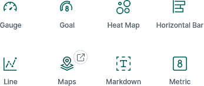
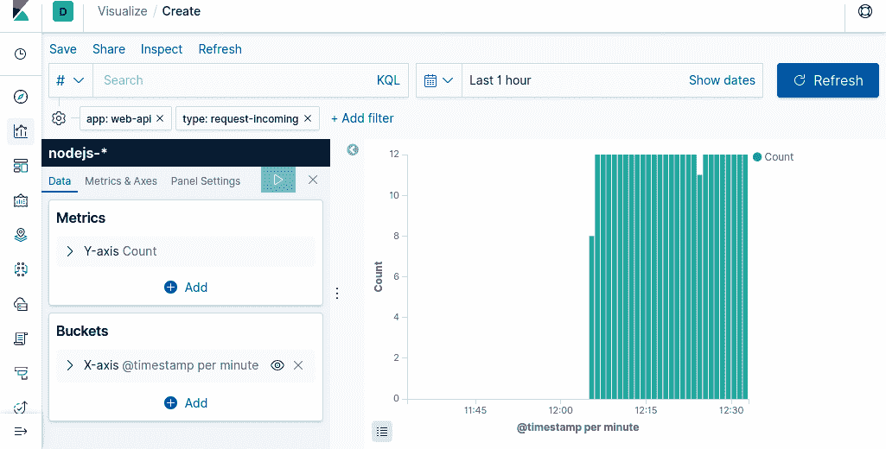
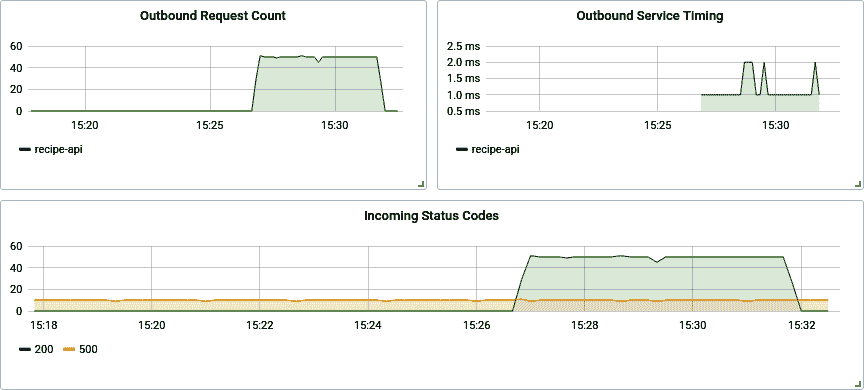
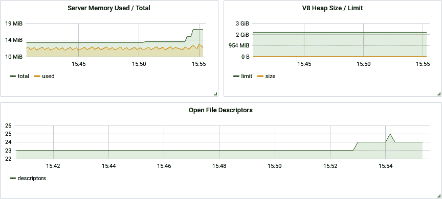
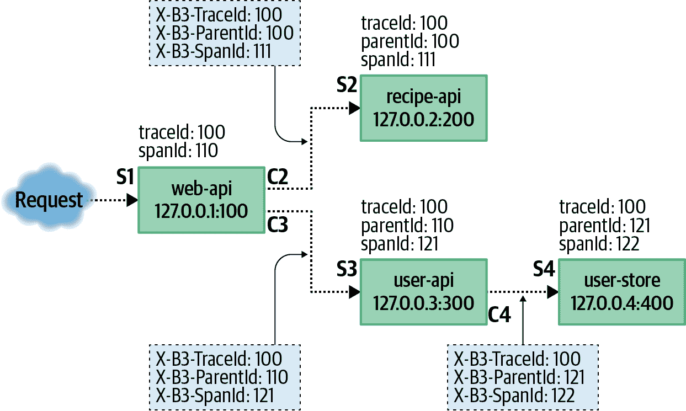
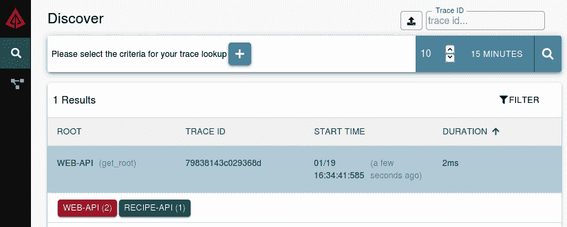
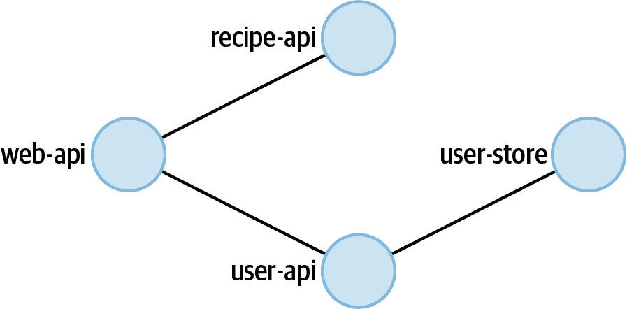

# 第四章。可观察性

本章专注于观察在远程机器上运行的 Node.js 服务。在本地，像调试器或`console.log()`这样的工具使得这个过程非常直接。然而，一旦服务在远方运行，你就需要借助不同的工具集。

在本地调试时，通常关注的是单个请求。你可能会问自己：“当我将这个值传递给请求时，为什么我在响应中得到那个值？”通过记录函数的内部工作原理，你可以深入了解函数为何表现出意外的方式。本章还探讨了对调试单个请求有用的技术。“使用 ELK 进行日志记录”介绍了日志生成，这是一种类似于使用`console.log()`打印信息的方式。稍后，“使用 Zipkin 进行分布式请求跟踪”介绍了一种跟踪请求的工具，它会关联不同服务生成的相关日志。

在处理生产流量时，通常需要深入了解通常不被视为严重错误的情况。例如，你可能会问：“为什么在 2020 年 4 月之前创建的用户的 HTTP 请求要慢 100 毫秒？”单个请求的这种时序可能并不令人担忧，但当考虑到多个请求的总体度量时，你可以发现性能下降的趋势。“使用 Graphite、StatsD 和 Grafana 进行度量”更详细地介绍了这一点。

这些工具大多数以某种仪表板 passively 显示信息，工程师稍后可以查阅以确定问题的根源。“使用 Cabot 进行警报”介绍了如何在应用程序性能低于某个阈值时向开发人员发送警告，从而使工程师能够在问题发生之前防止停机。

到目前为止，这些概念都是被动的，开发人员必须查看从应用程序捕获的数据。有时需要更主动的方法。“健康检查”介绍了应用程序如何确定其是否健康并能够提供请求，或者是否不健康并应该被终止。

# 环境

*环境*是区分应用程序实例和数据库之间运行的概念的概念。它们的重要性有多种原因，包括选择要将流量路由到哪些实例，保持度量和日志的分离（这在本章中尤为重要），为安全性隔离服务，以及在将应用程序代码检出到生产环境之前获得其稳定性的信心。

各个环境应该相互隔离。如果你控制自己的硬件，这可能意味着在不同的物理服务器上运行不同的环境。如果你将应用程序部署到云上，这更可能意味着设置不同的 VPCs（虚拟私有云）——这是 AWS 和 GCP 都支持的概念。

至少，任何应用程序都需要至少一个*生产*环境。这个环境负责处理公共用户的请求。然而，你可能需要比这更多的环境，特别是当你的应用程序在复杂性上增长时。

作为一个惯例，Node.js 应用程序通常使用`NODE_ENV`环境变量来指定实例运行的环境。可以通过不同的方式设置这个值。对于测试，可以像以下示例一样手动设置，但对于生产使用，无论你使用哪种部署工具，都会抽象化这个过程：

```
$ export NODE_ENV=production
$ node server.js
```

选择*部署*到不同环境的代码的哲学，使用的分支和合并策略，甚至选择哪种 VCS（版本控制系统），这些都超出了本书的范围。但是，最终会选择代码库的特定快照来部署到特定环境。

选择支持的*环境*也很重要，也超出了本书的范围。通常公司至少会有以下环境：

开发环境

用于本地开发。其他服务可能知道忽略与该环境相关的消息。不需要生产环境所需的一些后备存储；例如，日志可能会写入*stdout*，而不是传输到收集器。

暂存环境

表示*生产*环境的精确副本，如机器规格和操作系统版本。可能会通过每晚的 cron 作业将生产环境的匿名数据库快照复制到*暂存*数据库。

生产环境

处理真实生产流量的地方。可能比*暂存*运行更多服务实例；例如，也许*暂存*运行两个应用程序实例（始终运行多于一个），但*生产*运行八个。

环境字符串必须在所有应用程序中保持一致，无论是使用 Node.js 编写的应用程序还是其他平台的应用程序。这种一致性将避免许多头痛。如果一个团队称环境为*暂存*，而另一个称其为*预发布*，那么查询相关消息的日志就会变得容易出错。

环境值不一定用于配置，例如，有一个查找映射，其中环境名称与数据库的主机名相关联。理想情况下，任何动态配置应通过环境变量提供。相反，环境值主要用于与可观察性相关的事物。例如，日志消息应该附加环境，以帮助将任何日志与给定的环境关联起来，如果一个日志服务确实跨环境共享，这一点尤为重要。“应用程序配置”深入探讨了配置。

# 记录日志使用 ELK

*ELK*，或更具体地说，*ELK 栈*，是对由[Elastic](https://elastic.co)构建的三个开源工具 *Elasticsearch*、*Logstash* 和 *Kibana* 的引用。当这些强大的工具组合在一起时，它们通常是在本地收集日志的首选平台。单独地，每个工具都有不同的用途：

Elasticsearch

一个具有强大查询语法的数据库，支持自然文本搜索等功能。在这本书涵盖的情况之外，它在许多其他情况下也很有用，如果您需要构建搜索引擎，值得考虑。它通过 HTTP API 暴露，并具有默认端口`:9200`。

Logstash

用于从多个来源摄取和转换日志的服务。您将创建一个接口，以便它可以通过用户图协议（UDP）摄取日志。它没有默认端口，因此我们将只使用`:7777`。

Kibana

一个用于构建可视化存储在 Elasticsearch 中的数据的仪表板的 Web 服务。它通过端口`:5601`暴露了一个 HTTP Web 服务。

图 4-1 描述了这些服务及其关系，以及它们如何在即将的示例中使用 Docker 封装。


###### 图 4-1\. ELK 栈

预计您的应用程序将传输格式良好的 JSON 日志，通常是一个或两个级别深的对象。这些对象包含有关所记录消息的通用元数据，例如时间戳、主机和 IP 地址，以及消息本身的特定信息，例如级别/严重性、环境和可读消息。有多种配置 ELK 来接收这些消息的方法，例如将日志写入文件并使用 Elastic 的 Filebeat 工具来收集它们。本节中使用的方法将配置 Logstash 监听传入的 UDP 消息。

## 通过 Docker 运行 ELK

为了亲自动手，您将运行一个包含所有三个服务的单个 Docker 容器。 （请确保已安装 Docker——有关更多信息，请参阅 Appendix B。）这些示例不会启用磁盘持久性。在更大的组织中，每个这些服务在专用机器上安装时都会表现更好，并且当然，持久性是至关重要的。

为了配置 Logstash 监听 UDP 消息，首先必须创建一个配置文件。此文件的内容可在 Example 4-1 中找到，并可以放置在 *misc/elk/udp.conf* 的新目录中。创建文件后，您将通过使用 `-v` 卷标志将其可用于运行在 Docker 容器内部的 Logstash 服务。

##### Example 4-1\. *misc/elk/udp.conf*

```
input {
  udp {
    id => "nodejs_udp_logs"
    port => 7777
    codec => json
  }
}
output {
  elasticsearch {
    hosts => ["localhost:9200"]
    document_type => "nodelog"
    manage_template => false
    index => "nodejs-%{+YYYY.MM.dd}"
  }
}
```

###### 注意

为了简洁起见，这些示例使用 UDP 发送消息。这种方法不具备其他方法的一些特性，比如传递保证或反压力支持，但它减少了应用程序的开销。请务必为您的用例研究最佳工具。

创建文件后，您可以使用 Example 4-2 中的命令运行容器。如果在基于 Linux 的系统上运行 Docker，则需要在容器正确运行之前运行 `sysctl` 命令，并且如果需要，可以省略 `-e` 标志。否则，如果在 macOS 上运行 Docker，则跳过 `sysctl` 标志。

##### Example 4-2\. 在 Docker 中运行 ELK

```
$ sudo sysctl -w vm.max_map_count=262144 # Linux Only
$ docker run -p 5601:5601 -p 9200:9200 \
  -p 5044:5044 -p 7777:7777/udp \
  -v $PWD/misc/elk/udp.conf:/etc/logstash/conf.d/99-input-udp.conf \
  -e MAX_MAP_COUNT=262144 \
  -it --name distnode-elk sebp/elk:683
```

此命令从 Dockerhub 下载文件并配置服务，可能需要几分钟才能运行。一旦您的控制台稍微安静下来，请在浏览器中访问 *http://localhost:5601*。如果看到成功消息，则服务现在已准备好接收消息。

## 从 Node.js 传输日志

对于这个示例，您将再次开始修改一个现有的应用程序。将 Example 1-7 中创建的 *web-api/consumer-http-basic.js* 文件复制到 *web-api/consumer-http-logs.js* 作为起点。接下来，修改文件使其看起来像 Example 4-3 中的代码。

##### Example 4-3\. *web-api/consumer-http-logs.js*

```
#!/usr/bin/env node 
// npm install fastify@3.2 node-fetch@2.6 middie@5.1 const server = require('fastify')();
const fetch = require('node-fetch');
const HOST = process.env.HOST || '127.0.0.1';
const PORT = process.env.PORT || 3000;
const TARGET = process.env.TARGET || 'localhost:4000';
const log = require('./logstash.js'); 

(async () => {
  await server.register(require('middie')); 
  server.use((req, res, next) => { 
    log('info', 'request-incoming', { 
      path: req.url, method: req.method, ip: req.ip,
      ua: req.headers['user-agent'] || null });
    next();
  });
  server.setErrorHandler(async (error, req) => {
    log('error', 'request-failure', {stack: error.stack, 
      path: req.url, method: req.method, });
    return { error: error.message };
  });
  server.get('/', async () => {
    const url = `http://${TARGET}/recipes/42`;
    log('info', 'request-outgoing', {url, svc: 'recipe-api'}); 
    const req = await fetch(url);
    const producer_data = await req.json();
    return { consumer_pid: process.pid, producer_data };
  });
  server.get('/error', async () => { throw new Error('oh no'); });
  server.listen(PORT, HOST, () => {
    log('verbose', 'listen', {host: HOST, port: PORT}); 
  });
})();
```


新的 *logstash.js* 文件现在正在加载。


`middie` 包允许 Fastify 使用通用中间件。


一个用于记录传入请求的中间件。


传递请求数据的记录器调用。


用于记录错误的通用中间件。


记录有关出站请求的信息。


记录有关服务器启动的信息。

此文件记录了一些关键信息。首先记录了服务器启动的时间。第二组信息通过一个通用的中间件处理程序。它记录了任何传入请求的数据，包括路径、方法、IP 地址和用户代理。这类似于传统 Web 服务器的访问日志。最后，应用程序跟踪到*recipe-api*服务的出站请求。

*logstash.js*文件的内容可能更有趣。npm 上有许多库可用于将日志传输到 Logstash（`@log4js-node/logstashudp`就是其中之一）。这些库支持几种传输方法，包括 UDP。由于发送日志的机制如此简单，你将从头开始重现一个版本。这对教育目的非常有用，但对于生产应用程序，从 npm 中选择一个功能齐全的包会更好。

创建一个名为*web-api/logstash.js*的新文件。与迄今为止创建的其他 JavaScript 文件不同，这个文件不会直接执行。将示例 4-4 中的内容添加到此文件。

##### 示例 4-4\. *web-api/logstash.js*

```
const client = require('dgram').createSocket('udp4'); 
const host = require('os').hostname();
const [LS_HOST, LS_PORT] = process.env.LOGSTASH.split(':'); 
const NODE_ENV = process.env.NODE_ENV;

module.exports = function(severity, type, fields) {
  const payload = JSON.stringify({ 
    '@timestamp': (new Date()).toISOString(),
    "@version": 1, app: 'web-api', environment: NODE_ENV,
    severity, type, fields, host
  });
  console.log(payload);
  client.send(payload, LS_PORT, LS_HOST);
};
```


内置的`dgram`模块发送 UDP 消息。


Logstash 位置存储在`LOGSTASH`中。


日志消息中发送了多个字段。

这个基本的 Logstash 模块导出一个应用代码调用的函数来发送日志。许多字段是自动生成的，比如`@timestamp`，它表示当前时间。`app`字段是正在运行的应用程序的名称，不需要被调用者覆盖。其他字段，如`severity`和`type`，是应用程序经常更改的字段。`fields`字段表示应用程序可能想提供的额外的键/值对。

`severity`字段（在其他日志框架中通常称为*日志级别*）指的是日志的重要性。大多数日志包支持以下六个值，最初由 npm 客户端流行起来：*error*、*warn*、*info*、*verbose*、*debug*、*silly*。使用更“完整”的日志包通常通过环境变量设置日志阈值。例如，通过将最小严重性设置为*verbose*，任何具有更低严重性的消息（即*debug*和*silly*）将被丢弃。过于简单的*logstash.js*模块不支持此功能。

一旦负载被构建，它就会被转换为 JSON 字符串并打印到控制台以帮助了解正在发生的事情。最后，进程尝试将消息传输到 Logstash 服务器（应用程序无法知道消息是否已传递；这是 UDP 的缺点）。

现在已创建了两个文件，是时候测试应用程序了。运行 示例 4-5 中的命令。这将启动一个新的 *web-api* 服务实例，以及前一个 *recipe-api* 服务的一个实例，并将一系列请求发送到 *web-api*。一旦 *web-api* 启动，将立即发送一个日志，并且每个传入的 HTTP 请求将发送两个额外的日志。请注意，`watch` 命令将持续执行同一行后面的命令，并且需要在单独的终端窗口中运行。

##### 示例 4-5\. 运行 *web-api* 并生成日志

```
$ NODE_ENV=development LOGSTASH=localhost:7777 \
  node web-api/consumer-http-logs.js
$ node recipe-api/producer-http-basic.js
$ brew install watch # required for macOS
$ watch -n5 curl http://localhost:3000
$ watch -n13 curl http://localhost:3000/error
```

这不是很激动人心吗？嗯，并不完全是。现在您将进入 Kibana 并查看发送的日志。让`watch`命令在后台继续运行；在您使用 Kibana 时，它们将保持数据的新鲜。

## 创建 Kibana 仪表板

现在应用程序正在将数据发送到 Logstash，并且 Logstash 正在将数据存储在 Elasticsearch 中，是时候打开 Kibana 并探索这些数据了。打开您的浏览器并访问 [*http://localhost:5601*](http://localhost:5601)。此时，您应该会看到 Kibana 仪表板的欢迎界面。

在仪表板中，点击左侧的最后一个选项卡，标题为 [管理](http://localhost:5601/app/kibana#/management)。接下来，找到 Kibana 选项部分，然后点击索引模式选项。点击创建索引模式。对于步骤 1，输入一个索引模式为 `nodejs-*`。您应该会看到下方显示一个小的“成功！”消息，因为 Kibana 正在将您的查询与结果相关联。点击下一步。对于步骤 2，点击时间过滤器下拉菜单，然后点击 `@timestamp` 字段。最后，点击创建索引模式。您现在已创建了一个名为 `nodejs-*` 的索引，可以用来查询这些值。

点击左侧的第二个选项卡，标题为 [可视化](http://localhost:5601/app/kibana#/visualize)。接下来，点击屏幕中央的创建新可视化按钮。您将看到几种不同的选项来创建可视化，包括图 4-2 中显示的选项，但现在只需点击垂直条形图选项。



###### 图 4-2\. Kibana 可视化

选择刚创建的 `nodejs-*` 索引。完成后，您将被带到一个新的屏幕来微调可视化。默认的图表并不太有趣；它只显示一个条形图，显示与 `nodejs-*` 索引匹配的所有日志的计数。但这不会持续太久。

现在的目标是创建一个图表，显示 *web-api* 服务接收传入请求的速率。首先添加一些过滤器，以缩小结果范围，只包含适用的条目。点击屏幕左上角附近的添加过滤器链接。在字段下拉菜单中输入值 `type`。在操作字段中，将其设置为 `is`。在值字段中输入值 `request-incoming`，然后点击保存。接下来再次点击添加过滤器，并重复上述操作，但这次将字段设置为 `app`，操作设置为 `is`，值设置为 `web-api`。

对于指标部分，保留显示计数，因为它应显示请求的数量，并且匹配的日志消息与真实请求一一对应。

对于桶部分，应更改为按时间分组。点击添加桶链接，选择 X 轴。在聚合下拉菜单中，选择日期直方图。点击位于指标部分上方的带有播放符号的蓝色按钮（标题为应用更改），图表将更新。默认设置为按 `@timestamp` 分组，并具有自动间隔，这是不错的。

在右上角有一个下拉菜单，可以更改查询日志的时间范围。点击下拉菜单，将其配置为显示最近一小时内的日志，然后点击右侧大的刷新按钮。如果一切顺利，您的屏幕应该看起来像 图 4-3。



###### 图 4-3\. Kibana 中随时间变化的请求

完成图表后，点击 Kibana 屏幕顶部的保存链接。将可视化命名为 *web-api* *传入请求*。接下来，创建一个类似的可视化，但这次将 *type* 字段设置为 `request-outgoing`，并将其命名为 *web-api* *传出请求*。最后，创建第三个可视化，将 *type* 字段设置为 `listen`，并将其命名为 *web-api* *服务器启动*。

接下来，您将为这三个可视化创建一个仪表板。选择侧边栏中的第三个选项标题为仪表板。然后，点击创建新仪表板。将出现一个模态窗口，其中包含您的三个可视化。点击每个可视化，它将被添加到仪表板中。添加完每个可视化后，关闭模态窗口。点击屏幕顶部的保存链接，并将仪表板保存为 *web-api* *概述*。

恭喜！您已创建包含从应用程序提取的信息的仪表板。

## 运行特定查询

有时您需要对正在记录的数据运行任意查询，而不需要相关的仪表板。这在一次性调试情况下非常有帮助。在本节中，您将编写任意查询，以提取关于应用程序错误的信息。

单击左侧边栏中的第一个选项卡，标题为 Discover。这是一个方便的查询运行场所，无需将其提交到仪表板中。默认情况下，屏幕顶部的搜索字段显示所有最近接收到的消息的列表。单击屏幕顶部的搜索字段内部。然后，输入以下查询到搜索字段并按 Enter 键：

```
app:"web-api" AND (severity:"error" OR severity:"warn")
```

此查询的语法是用*Kibana* *查询语言*（KQL）编写的。基本上，它包含三个子句。它要求获取属于*web-api*应用程序且*severity*级别设置为*error*或*warn*（换句话说，非常重要的事情）的日志。

单击列表中某个日志条目旁边的箭头符号。这将展开单个日志条目，并允许您查看与日志关联的整个 JSON 负载。能够查看这种任意日志消息的能力是日志记录功能的强大所在。借助这个工具，您现在能够查找从服务中记录的所有错误。

通过记录更多数据，您将能够深入了解特定错误情况的详细信息。例如，您可能会发现，在某些情况下（例如用户通过`PUT /recipe`更新食谱时），应用程序内的特定端点受到错误的影响。通过访问堆栈跟踪以及有关请求的足够上下文信息，您随后可以在本地重新创建条件，重现错误，并提出修复方案。

###### 警告

本节介绍了从应用程序内部传输日志，这是一个固有的异步操作。不幸的是，当进程崩溃时生成的日志可能不会及时发送。许多部署工具可以读取*stdout*中的消息，并代表应用程序将它们传输，这增加了它们被传送的可能性。

本节讨论了存储日志的问题。当然，这些日志可以用来在图表中显示数字信息，但这不一定是最有效的系统，因为日志存储复杂对象。下一节，“使用 Graphite、StatsD 和 Grafana 进行指标监控”，将使用不同的工具集来存储更有趣的数字数据。

# 使用 Graphite、StatsD 和 Grafana 进行指标监控

“使用 ELK 进行日志记录”介绍了从运行中的 Node.js 进程传输日志。这些日志格式化为 JSON，可根据每个日志进行索引和搜索。这非常适合阅读与特定运行进程相关的消息，例如阅读变量和堆栈跟踪。然而，有时您可能并不一定关心单个数字数据的情况，而是想了解数据的聚合情况，通常这些值随着时间的推移而增长和减少。

本节探讨发送*指标*。指标是与时间相关的数值数据。这可以包括请求速率、*2XX* 与 *5XX* HTTP 响应的数量、应用程序与后端服务之间的延迟、内存和磁盘使用情况，甚至像美元收入或取消支付等业务统计信息。可视化这些信息对于理解应用程序健康状况和系统负载至关重要。

就像在日志部分一样，这里将使用一组工具而不是单一的工具。然而，这个堆栈并没有像 ELK 那样引人注目的缩写，通常可以替换不同的组件。本节考虑的堆栈是 *Graphite*、*StatsD* 和 *Grafana*：

石墨

一个服务（*Carbon*）和时间序列数据库（*Whisper*）的组合。它还配备了一个 UI（*Graphite Web*），不过通常使用更强大的 Grafana 界面。

StatsD

一个使用 Node.js 构建的守护进程，用于收集指标。它可以监听 TCP 或 UDP 上的统计信息，然后将聚合发送到后端，如 Graphite。

Grafana

一个 web 服务，查询时间序列后端（如 Graphite），并在可配置的仪表板中显示信息。

图 4-4 展示了这些服务的图示及其关系。Docker 的边界代表了接下来示例将使用的内容。


###### 图 4-4\. 石墨、StatsD 和 Grafana

就像在日志部分一样，这些示例将使用 UDP 传输数据。由于指标的快速生成特性，使用 UDP 将有助于防止应用程序被压倒。

## 通过 Docker 运行

示例 4-6 启动了两个独立的 Docker 容器。第一个容器 *graphiteapp/graphite-statsd* 包含 StatsD 和 Graphite。该容器暴露了两个端口。Graphite UI/API 通过端口 `:8080` 暴露，而 StatsD UDP 指标收集器通过 `:8125` 暴露。第二个容器 *grafana/grafana* 包含 Grafana。为该容器暴露了一个用于 web 界面的端口 `:8000`。

##### 示例 4-6\. 运行 StatsD + Graphite 和 Grafana

```
$ docker run \
  -p 8080:80 \
  -p 8125:8125/udp \
  -it --name distnode-graphite graphiteapp/graphite-statsd:1.1.6-1
$ docker run \
  -p 8000:3000 \
  -it --name distnode-grafana grafana/grafana:6.5.2
```

一旦容器启动并运行，打开网页浏览器访问 Grafana 仪表板[*http://localhost:8000/*](http://localhost:8000/)。此时会要求您登录。默认登录凭据为 *admin* / *admin*。成功登录后，您将被提示更改密码。这个密码将用于管理 Grafana，但不会在代码中使用。

一旦设置了密码，您将进入一个向导来配置 Grafana。下一步是配置 Grafana 以与 Graphite 映像通信。点击“添加数据源”按钮，然后点击 Graphite 选项。在 Graphite 配置屏幕上，输入 表 4-1 中显示的值。

表格 4-1\. 配置 Grafana 使用 Graphite

| 名称 | Dist 节点 图形 |
| --- | --- |
| URL | http://<LOCAL_IP>:8080 |
| 版本 | 1.1.x |

###### 注意

由于 Docker 容器的运行方式，您将无法在 `<LOCAL_IP>` 占位符中使用 `localhost`。而是需要使用您的本地 IP 地址。如果您使用 Linux，请尝试运行 **`hostname -I`**，如果您使用 macOS，请尝试运行 `ipconfig getifaddr en0`。如果您在笔记本电脑上运行，并且您的 IP 地址发生了变化，您需要重新配置 Grafana 中的数据源，以使用新的 IP 地址，否则将无法获取数据。

输入数据后，点击保存并测试。如果看到消息“数据源正在工作”，那么 Grafana 能够与 Graphite 通信，您可以点击返回按钮。如果收到 HTTP 错误 Bad Gateway，请确保 Graphite 容器正在运行，并且已正确输入设置。

现在 Graphite 和 Grafana 已经可以互相通信，是时候修改其中一个 Node.js 服务，开始发送指标了。

## 从 Node.js 传输指标

[StatsD 使用的协议](https://github.com/statsd/statsd) 极其简单，可以说比 Logstash UDP 使用的协议还要简单。递增名为 `foo.bar.baz` 的指标的示例消息如下：

```
foo.bar.baz:1|c
```

此类交互可以非常容易地使用 `dgram` 模块重新构建，就像前一节一样。但是，此代码示例将使用现有的包。市面上有几种包可供选择，但本示例使用 `statsd-client` 包。

再次开始，通过重建消费者服务的一个版本来实现。将在 示例 1-7 中创建的 *web-api/consumer-http-basic.js* 文件复制到 *web-api/consumer-http-metrics.js* 作为起点。然后，在那里修改文件，使其类似于 示例 4-7。确保运行 `npm install` 命令获取所需的包。

##### 示例 4-7\. *web-api/consumer-http-metrics.js*（上半部分）

```
#!/usr/bin/env node 
// npm install fastify@3.2 node-fetch@2.6 statsd-client@0.4.4 middie@5.1 const server = require('fastify')();
const fetch = require('node-fetch');
const HOST = '127.0.0.1';
const PORT = process.env.PORT || 3000;
const TARGET = process.env.TARGET || 'localhost:4000';
const SDC = require('statsd-client');
const statsd = new (require('statsd-client'))({host: 'localhost',
  port: 8125, prefix: 'web-api'}); 

(async () => {
  await server.register(require('middie'));
  server.use(statsd.helpers.getExpressMiddleware('inbound', { 
    timeByUrl: true}));
  server.get('/', async () => {
    const begin = new Date();
    const req = await fetch(`http://${TARGET}/recipes/42`);
    statsd.timing('outbound.recipe-api.request-time', begin); 
    statsd.increment('outbound.recipe-api.request-count'); 
    const producer_data = await req.json();

    return { consumer_pid: process.pid, producer_data };
  });
  server.get('/error', async () => { throw new Error('oh no'); });
  server.listen(PORT, HOST, () => {
    console.log(`Consumer running at http://${HOST}:${PORT}/`);
  });
})();
```


指标名称以 `web-api` 为前缀。


一个通用的中间件，自动跟踪入站请求。


这追踪到 *recipe-api* 的感知时机。


外发请求的数量也有记录。

这组新变更涉及几件事情。首先，它需要 `statsd-client` 包，并配置到监听 `localhost:8125` 的 StatsD 服务的连接。它还配置了包以使用 `web-api` 的前缀值。此值代表报告指标的服务名称（同样，如果您对 *recipe-api* 进行类似更改，您将相应设置其前缀）。Graphite 通过使用层次结构来命名指标，因此从此服务发送的指标将都有相同的前缀，以区分其它服务发送的指标。

代码使用了`statsd-client`包提供的通用中间件。如方法名称所示，它最初是为*Express*设计的，但是 Fastify 大多数支持相同的中间件接口，因此该应用程序可以重用它。第一个参数是另一个前缀名称，`inbound`意味着此处发送的指标与传入请求相关联。

接下来，手动跟踪两个值。第一个是*web-api*认为*recipe-api*花费的时间量。请注意，此时间始终应比*recipe-api*认为响应花费的时间长。这是由于通过网络发送请求的开销。此时间值写入名为`outbound.recipe-api.request-time`的指标。该应用程序还跟踪发送的请求数量，提供为`outbound.recipe-api.request-count`。在此处甚至可以更加细化。例如，对于生产应用程序，还可以跟踪*recipe-api*响应的状态代码，这将使失败率增加可见。

接下来，分别在不同的终端窗口中运行以下命令。这将启动您新创建的服务，运行生产者的一个副本，运行 Autocannon 以获取一系列良好的请求流，并触发一些错误请求：

```
$ NODE_DEBUG=statsd-client node web-api/consumer-http-metrics.js
$ node recipe-api/producer-http-basic.js
$ autocannon -d 300 -R 5 -c 1 http://localhost:3000
$ watch -n1 curl http://localhost:3000/error
```

这些命令将生成一系列数据，通过 StatsD 传递到 Graphite。现在您已经有了一些数据，可以准备创建一个仪表板来查看它。

## 创建一个 Grafana 仪表板

作为*web-api*服务的所有者，至少需要提取三组不同的指标来衡量其健康状况。这包括传入的请求，尤其是区分 200 和 500 的请求。还包括*recipe-api*作为上游服务回复所花费的时间。最后一组所需信息是*recipe-api*服务的请求速率。如果确定*web-api*服务运行缓慢，您可以利用这些信息发现*recipe-api*服务正在拖慢其速度。

切换回带有 Grafana 界面的网络浏览器。侧边栏有一个大加号符号；点击它进入[新仪表板](http://localhost:8000/dashboard/new)界面。在这个界面上，您会看到一个新面板矩形。里面有一个添加查询按钮。点击该按钮进入查询编辑器界面。

在新屏幕上，你会看到顶部是一个空图表，下方是用于描述图表的输入框。界面允许你使用两个字段描述查询。第一个字段称为 Series，你可以在其中输入层级指标名称。第二个字段称为 Functions。这两个字段都提供了匹配指标名称的自动完成功能。首先，从 Series 字段开始。点击 Series 标签旁边的“select metric”文本，然后从下拉菜单中选择 `stats_count`。接着再次点击“select metric”，选择 `web-api`。依此类推，选择 `inbound`，`response_code`，最后选择 `*`（`*` 是通配符，匹配任何值）。此时，图表已更新，应显示两组条目。

目前图表标签还不够友好。它们显示的是整个层次结构名称，而不是易于阅读的值 200 和 500。可以使用 *Function* 来解决这个问题。点击 Functions 标签旁边的加号，然后点击 Alias，再点击 aliasByNode()。这将插入函数，并自动提供一个默认参数 4。这是因为查询中的星号在层次指标名称中是第四个条目（从零开始计数）。图表标签已更新，只显示 200 和 500。

在 Series 和 Functions 字段面板右上角，有一个铅笔图标，带有标题为 Toggle text edit mode 的工具提示。点击它，图形条目将转换为文本版本。这对于快速编写查询非常有帮助。你应该得到如下数值：

```
aliasByNode(stats_counts.web-api.inbound.response_code.*, 4)
```

在左侧列，点击标题为 General 的齿轮图标。在这个屏幕上，你可以修改关于此图表的通用设置。点击 Title 字段，并输入值 Incoming Status Codes。完成后，点击屏幕左上角的大箭头。这将从面板编辑屏幕返回到仪表板编辑屏幕。此时，你的仪表板将只有一个面板。

接下来，在屏幕右上角点击 Add panel 按钮，然后再次点击 Add query 按钮。这将允许你向仪表板添加第二个面板。下一个面板将跟踪查询 *recipe-api* 所需的时间。创建适当的 Series 和 Functions 条目以重现以下内容：

```
aliasByNode(stats.timers.web-api.outbound.*.request-time.upper_90, 4)
```

###### 注意

StatsD 会为你生成一些指标名称。例如，`stats.timers` 是 StatsD 的前缀，`web-api.outbound.recipe-api.request-time` 是应用程序提供的，而该前缀下的与计时相关的指标名称（如 `upper_90`）则是由 StatsD 计算得出的。在这种情况下，查询关注的是 TP90 的计时数值。

由于此图表测量时间而不是通用计数器，因此应修改单位（此信息以毫秒为单位）。点击左侧的第二个选项卡，其工具提示为“可视化”。然后，向下滚动到标有 Axes 的部分，找到标题为 Left Y 的组，并点击单位下拉菜单。选择时间，然后点击毫秒（ms）。图表将随之使用正确的单位进行更新。

再次点击第三个 General 标签，将面板标题设置为 Outbound Service Timing。再次点击返回箭头，返回到仪表板编辑屏幕。

最后，再次点击添加面板按钮，并开始创建最后一个面板。此面板标题为 Outbound Request Count，不需要任何特殊单位，并使用以下查询：

```
aliasByNode(stats_counts.web-api.outbound.*.request-count, 3)
```

最后点击返回按钮，返回仪表板编辑屏幕。在屏幕右上角，点击保存仪表板图标，将仪表板命名为 Web API 概述，并保存仪表板。仪表板现在已保存，并将与一个 URL 相关联。如果您正在为您的组织永久安装的 Grafana 实例，这个 URL 将是一个永久链接，您可以将其提供给他人，并将其添加到您项目的 README 中。

随意拖动面板并调整大小，直到达到美观的效果。在屏幕右上角，您还可以更改时间范围。将其设置为“最近 15 分钟”，因为您可能没有比这更早的数据。完成后，您的仪表板应该看起来类似于 图 4-5。



###### 图 4-5\. 完成的 Grafana 仪表板

## Node.js 健康指标

有关正在运行的 Node.js 进程的一些通用健康信息，也值得收集到仪表板中。通过在 *web-api/consumer-http-metrics.js* 文件末尾添加来自 示例 4-8 的代码来修改您的文件。重新启动服务，并关注正在生成的数据。这些新的指标表示随时间而变化的值，更适合表示为 *Gauges*。

##### 示例 4-8\. *web-api/consumer-http-metrics.js*（后半部分）

```
const v8 = require('v8');
const fs = require('fs');

setInterval(() => {
  statsd.gauge('server.conn', server.server._connections); 

  const m = process.memoryUsage(); 
  statsd.gauge('server.memory.used', m.heapUsed);
  statsd.gauge('server.memory.total', m.heapTotal);

  const h = v8.getHeapStatistics(); 
  statsd.gauge('server.heap.size', h.used_heap_size);
  statsd.gauge('server.heap.limit', h.heap_size_limit);

  fs.readdir('/proc/self/fd', (err, list) => {
    if (err) return;
    statsd.gauge('server.descriptors', list.length); 
  });

  const begin = new Date();
  setTimeout(() => { statsd.timing('eventlag', begin); }, 0); 
}, 10_000);
```


与服务器的连接数


进程堆利用率


V8 堆利用率


打开文件描述符，具有讽刺意味的使用文件描述符


事件循环延迟

此代码将每隔 10 秒轮询 Node.js 的核心，获取有关进程的关键信息。作为对您新发现的 Grafana 技能的练习，创建五个新仪表板，包含这些新捕获的数据。在度量命名空间层次结构中，仪表度量从 `stats.gauges` 开始，而计时器从 `stats.timers` 开始。

第一组数据，以 `server.conn` 提供，是到 Web 服务器的活动连接数。大多数 Node.js Web 框架以某种方式公开此值；请查看您选择的框架的文档。

还捕获了有关进程内存使用情况的信息。这被记录为两个值，`server.memory.used` 和 `server.memory.total`。在为这些值创建图表时，它们的单位应设置为数据/字节，Grafana 足够智能以显示更具体的单位，如 MB。然后可以基于 V8 堆大小和限制创建一个非常类似的面板。

事件循环滞后指标显示应用程序调用函数所需的时间，该函数被安排在从调用 `setTimeout()` 开始到零毫秒的时间内运行。该图表应以毫秒为单位显示值。一个健康的事件循环应该在零到二之间。不堪重负的服务可能会开始花费数十毫秒。

最后，打开的文件描述符数量可能表明 Node.js 应用程序存在泄漏。有时文件会被打开但不会被关闭，这可能导致服务器资源的消耗，并导致进程崩溃。

添加了新面板后，您的仪表板可能会像 图 4-6 那样。保存修改后的仪表板，以防丢失您的更改。



###### 图 4-6\. 更新后的 Grafana 仪表板

本节仅涵盖了使用 StatsD、Graphite 和 Grafana 堆栈的基础知识。还有许多未涵盖的查询功能，包括其他形式的可视化，如如何手动为单个时间序列条目着色（例如对于 2XX 使用绿色，对于 4XX 使用黄色，对于 5XX 使用红色）等等。

# 使用 Zipkin 进行分布式请求追踪

“使用 ELK 进行日志记录” 研究了存储来自 Node.js 进程的日志。这些日志包含有关进程内部操作的信息。同样，“使用 Graphite、StatsD 和 Grafana 进行度量” 研究了存储数字度量。这些度量对于查看应用程序的数字数据总体，如端点的吞吐量和失败率，非常有用。然而，这些工具都不允许将特定外部请求与其可能生成的所有内部请求关联起来。

例如，考虑到到目前为止涵盖的服务的稍微复杂版本。不仅有 *web-api* 和 *recipe-api* 服务，还有额外的 *user-api* 和 *user-store* 服务。*web-api* 仍然像以前一样调用 *recipe-api* 服务，但现在 *web-api* 还会调用 *user-api* 服务，后者将进一步调用 *user-store* 服务。在这种情况下，如果任何一个服务产生 500 错误，该错误将传播并导致整体请求失败，显示为 500 错误。到目前为止使用的工具如何找到特定错误的原因？

如果你知道一个错误发生在周二下午 1:37，你可能会想要查看 ELK 存储的日志，时间从下午 1:36 到 1:38。老实说，我自己也做过这件事。不幸的是，如果日志量很大，这可能意味着要筛选成千上万条单独的日志条目。更糟糕的是，同时发生的其他错误可能会“混淆视听”，使人难以知道哪些日志实际上与错误请求相关联。

在非常基础的层面上，通过传递 *request ID* 可以将组织内更深的请求与单个外部入站请求关联起来。这是在收到第一个请求时生成的唯一标识符，然后在上游服务之间传递。然后，与此请求相关的任何日志将包含某种 `request_id` 字段，可以使用 Kibana 进行过滤。这种方法解决了关联请求的难题，但失去了有关相关请求层次结构的信息。

*Zipkin*，有时也称为 *OpenZipkin*，是一种旨在缓解类似情况的工具。Zipkin 是一个运行并公开 HTTP API 的服务。此 API 接受描述请求元数据的 JSON 负载，因为它们由客户端发送和服务器接收。Zipkin 还定义了一组从客户端传递到服务器的标头。这些标头允许进程将客户端的出站请求与服务器的入站请求关联起来。还会发送时间信息，这样 Zipkin 可以显示请求层次结构的图形时间线。

## 如何使用 Zipkin？

在前述涉及四个服务的情景中，服务之间的关系经过四次请求。在这种情况下，将发送七条消息到 Zipkin 服务。图 4-7 包含服务关系、传递消息和额外标头的可视化。



###### 图 4-7。示例请求和 Zipkin 数据

这本书迄今为止多次重复的一个概念是，客户端将感知请求的一个延迟，而服务器将感知另一个延迟。客户端始终认为请求时间比服务器长。这是由于消息在网络上传输的时间，以及其他难以测量的因素，例如 Web 服务器包在用户代码开始测量时间之前自动解析 JSON 请求所需的时间。

Zipkin 允许您测量客户端和服务器之间的意见差异。这就是为什么在示例情况中的四个请求，如 Figure 4-7 中标记为实线箭头，会导致发送到 Zipkin 的七条不同消息。以 S1 结尾的第一条消息仅包含一个 *服务器消息*。在这种情况下，第三方客户端未报告其感知时间，因此只有服务器消息。对于以 S2、S3 和 S4 结尾的三个请求，存在相应的 *客户端消息*，即 C2、C3 和 C4。

不同的客户端和服务器消息可以从不同的实例异步发送，并且可以以任何顺序接收。然后，Zipkin 服务将它们拼接在一起，并使用 Zipkin Web UI 可视化请求层次结构。C2 消息看起来会像这样：

```
[{
  "id":       "0000000000000111",
  "traceId":  "0000000000000100",
  "parentId": "0000000000000110",
  "timestamp": 1579221096510000,
  "name": "get_recipe", "duration": 80000, "kind": "CLIENT",
  "localEndpoint": {
    "serviceName": "web-api", "ipv4": "127.0.0.1", "port": 100
  },
  "remoteEndpoint": { "ipv4": "127.0.0.2", "port": 200 },
  "tags": {
    "http.method": "GET", "http.path": "/recipe/42", "diagram": "C2"
  }
}]
```

这些消息可以被应用程序排队，并偶尔以批处理方式刷新到 Zipkin 服务，这就是为什么根 JSON 条目是一个数组的原因。在 Example 4-9 中，仅传输了单条消息。

客户端消息和服务器消息对最终包含相同的 `id`、`traceId` 和 `parentId` 标识符。`timestamp` 字段表示客户端或服务器首次感知到请求开始的时间，`duration` 表示服务认为请求持续的时间。这两个字段都是以微秒为单位进行测量。Node.js 的 *wall clock*，可通过 `Date.now()` 获取，只有毫秒级的精度，因此通常将其乘以 1,000。¹ `kind` 字段设置为 `CLIENT` 或 `SERVER`，取决于记录请求的哪一侧。`name` 字段表示端点的名称，应具有有限的值集（换句话说，不要使用标识符）。

`localEndpoint` 字段表示发送消息的服务（具有 `SERVER` 消息的服务器或具有 `CLIENT` 消息的客户端）。服务在此提供自己的名称，监听的端口以及自己的 IP 地址。`remoteEndpoint` 字段包含有关其他服务的信息（`SERVER` 消息可能不知道客户端的 `port`，甚至可能不知道客户端的 `name`）。

`tags` 字段包含有关请求的元数据。在此示例中，提供了关于 HTTP 请求的信息，如 `http.method` 和 `http.path`。对于其他协议，会附加不同的元数据，例如 gRPC 服务和方法名称。

在 Table 4-2 中重新创建了七条不同消息中发送的标识符。

Table 4-2\. 从 Figure 4-7 报告的值

| Message | `id` | `parentId` | `traceId` | `kind` |
| --- | --- | --- | --- | --- |
| S1 | 110 | N/A | 100 | SERVER |
| C2 | 111 | 110 | 100 | CLIENT |
| S2 | 111 | 110 | 100 | SERVER |
| C3 | 121 | 110 | 100 | CLIENT |
| S3 | 121 | 110 | 100 | SERVER |
| C4 | 122 | 121 | 100 | CLIENT |
| S4 | 122 | 121 | 100 | SERVER |

除了发送到服务器的消息外，Zipkin 的另一个重要部分是从客户端到服务器发送的元数据。不同的协议对发送此元数据有不同的标准。对于 HTTP，元数据通过标头发送。这些标头由 C2、C3 和 C4 提供，并由 S2、S3 和 S4 接收。这些标头每个都有不同的含义：

`X-B3-TraceId`

Zipkin 将所有相关请求称为一个*trace*。这个值是 Zipkin 的*request ID*的概念。这个值在所有相关请求之间传递，不变。

`X-B3-SpanId`

一个*span*代表一个单独的请求，从客户端和服务器的视角看（如 C3/S3）。客户端和服务器将使用相同的 span ID 发送消息。一个跟踪中可以有多个 span，形成树结构。

`X-B3-ParentSpanId`

*parent span*用于将子 span 与父 span 关联起来。对于起始的外部请求，该值缺失，但对于更深层次的请求，该值存在。

`X-B3-Sampled`

这是用于确定是否将特定跟踪报告给 Zipkin 的机制。例如，组织可以选择仅跟踪 1%的请求。

`X-B3-Flags`

这可以用来告诉下游服务，这是一个调试请求。建议服务随后增加其日志详细程度。

每个服务为每个出站请求创建一个新的 span ID。然后，当前 span ID 作为出站请求中的父 ID 提供。这就是关系层次结构形成的方式。

现在您已经了解了 Zipkin 的复杂性，是时候运行 Zipkin 服务的本地副本并修改应用程序与其交互了。

## 通过 Docker 运行 Zipkin

Docker 提供了一个便利的平台来运行服务。与本章涵盖的其他工具不同，Zipkin 提供了一个 API 和一个使用相同端口的 UI。Zipkin 默认使用`9411`端口。

运行此命令下载并启动 Zipkin 服务：²

```
$ docker run -p 9411:9411 \
  -it --name distnode-zipkin \
  openzipkin/zipkin-slim:2.19
```

## 从 Node.js 传输跟踪

对于本例，您将再次从修改现有应用程序开始。将在 Example 1-7 中创建的*web-api/consumer-http-basic.js*文件复制到*web-api/consumer-http-zipkin.js*，作为起点。修改文件以看起来像 Example 4-9 中的代码。

##### Example 4-9\. *web-api/consumer-http-zipkin.js*

```
#!/usr/bin/env node 
// npm install fastify@3.2 node-fetch@2.6 zipkin-lite@0.1 const server = require('fastify')();
const fetch = require('node-fetch');
const HOST = process.env.HOST || '127.0.0.1';
const PORT = process.env.PORT || 3000;
const TARGET = process.env.TARGET || 'localhost:4000';
const ZIPKIN = process.env.ZIPKIN || 'localhost:9411';
const Zipkin = require('zipkin-lite');
const zipkin = new Zipkin({ 
  zipkinHost: ZIPKIN,
  serviceName: 'web-api', servicePort: PORT, serviceIp: HOST,
  init: 'short' 
});
server.addHook('onRequest', zipkin.onRequest()); 
server.addHook('onResponse', zipkin.onResponse());

server.get('/', async (req) => {
  req.zipkin.setName('get_root'); 

  const url = `http://${TARGET}/recipes/42`;
  const zreq = req.zipkin.prepare(); 
  const recipe = await fetch(url, { headers: zreq.headers });
  zreq.complete('GET', url);
  const producer_data = await recipe.json();

  return {pid: process.pid, producer_data, trace: req.zipkin.trace};
});

server.listen(PORT, HOST, () => {
  console.log(`Consumer running at http://${HOST}:${PORT}/`);
});
```


需要导入并实例化`zipkin-lite`包。


*web-api* 接受外部请求并可以生成跟踪 ID。


当请求开始和完成时，会调用钩子。


每个端点都需要指定其名称。


出站请求需要手动进行仪器化。

###### 注意

这些示例使用了`zipkin-lite`包。此包需要手动仪器化，即开发者必须调用不同的钩子来与该包进行交互。我选择它来帮助演示 Zipkin 报告过程的不同部分。对于生产应用程序，官方的 Zipkin 包[`zipkin`](https://www.npmjs.com/package/zipkin)将是更好的选择。

消费者服务代表了外部客户端将要通信的第一个服务。因此，已启用`init`配置标志。这将允许服务生成一个新的跟踪 ID。理论上，可以配置反向代理来生成初始标识符值。`serviceName`、`servicePort`和`serviceIp`字段各自用于向 Zipkin 报告有关正在运行的服务的信息。

`zipkin-lite`包允许在请求中插入`onRequest`和`onResponse`钩子。首先运行`onRequest`处理程序，记录请求开始的时间并注入`req.zipkin`属性，该属性可以在请求的整个生命周期中使用。随后调用`onResponse`处理程序，计算请求的总体时间并向 Zipkin 服务器发送`SERVER`消息。

在请求处理程序中，需要完成两件事情。第一件事是设置端点的名称，通过调用`req.zipkin.setName()`来完成。第二件事是对发送的每个出站请求应用适当的头部，并计算请求所花费的时间。首先调用`req.zipkin.prepare()`来完成这一步。当调用此方法时，记录另一个时间值并生成新的 span ID。将这个 ID 和其他必要的头部信息提供给返回值，将其分配给变量`zreq`。

然后通过`zreq.headers`将这些头部提供给请求。一旦请求完成，调用`zreq.complete()`，传入请求方法和 URL。完成后，计算总共花费的时间，并向 Zipkin 服务器发送`CLIENT`消息。

接下来，生产服务也应该进行修改。这很重要，因为不仅应该报告客户端感知的时间（在本例中为 *web-api*），还应该报告服务器视角的时间（*recipe-api*）。将 示例 1-6 中创建的 *recipe-api/producer-http-basic.js* 文件复制到 *recipe-api/producer-http-zipkin.js* 作为起点。修改文件使其看起来像 示例 4-10 中的代码。大部分文件可以保持不变，因此只显示必要的更改部分。

##### 示例 4-10\. *recipe-api/producer-http-zipkin.js*（已截断）

```
const PORT = process.env.PORT || 4000;
const ZIPKIN = process.env.ZIPKIN || 'localhost:9411';
const Zipkin = require('zipkin-lite');
const zipkin = new Zipkin({
  zipkinHost: ZIPKIN,
  serviceName: 'recipe-api', servicePort: PORT, serviceIp: HOST,
});
server.addHook('onRequest', zipkin.onRequest());
server.addHook('onResponse', zipkin.onResponse());

server.get('/recipes/:id', async (req, reply) => {
  req.zipkin.setName('get_recipe');
  const id = Number(req.params.id);
```

示例 4-10 不作为根服务，因此忽略了 `init` 配置标志。如果直接收到请求，它不会生成追踪 ID，不像 *web-api* 服务那样。同时，请注意，即使示例未使用，相同的 `req.zipkin.prepare()` 方法也适用于这个新的 *recipe-api* 服务。在实现你拥有的服务中引入 Zipkin 时，你应该尽可能地向上游服务传递 Zipkin 标头。

请确保在两个项目目录中运行 **`npm install zipkin-lite@0.1`** 命令。

创建完这两个新的服务文件后，请运行它们，然后通过运行以下命令生成对 *web-api* 的请求：

```
$ node recipe-api/producer-http-zipkin.js
$ node web-api/consumer-http-zipkin.js
$ curl http://localhost:3000/
```

`curl` 命令的输出中现在应该有一个名为 `trace` 的新字段。这是传递给服务之间请求系列的追踪 ID。该值应为 16 个十六进制字符，在我的情况下，我收到的值是 `e232bb26a7941aab`。

## 可视化请求树

请求数据已发送到你的 Zipkin 服务器实例。现在是时候打开网页界面，看看数据如何可视化了。在浏览器中打开以下 URL：

```
http://localhost:9411/zipkin/
```

现在你应该能看到 Zipkin 网页界面。它目前可能不太激动人心。左侧边栏包含两个链接。第一个像放大镜一样，是当前的发现屏幕。第二个链接类似网络节点，指向依赖关系屏幕。屏幕顶部有一个加号，用于指定要搜索的请求。使用此工具，你可以指定诸如服务名称或标签等条件。但现在你可以忽略这些。屏幕右上角有一个简单的搜索按钮，点击放大镜图标即可执行搜索。

图 4-8 展示了在执行搜索后界面应该看起来的样子。假设你只运行了一次 `curl` 命令，你应该只能看到一个条目。



###### 图 4-8\. Zipkin discover 界面

单击条目以进入时间轴视图页面。此页面以两列显示内容。左列显示请求的时间轴。水平轴表示时间。时间轴顶部的单位显示自第一个具有给定跟踪 ID 的`SERVER`跟踪开始以来经过的时间。垂直行表示请求的深度；随着每个后续服务发出另一个请求，将添加新行。

对于您的时间轴，您应该看到两行。第一行由*web-api*生成，并有一个名为*get_root*的调用。第二行由*recipe-api*生成，并有一个名为*get_recipe*的调用。基于先前提到的具有额外的*user-api*和*user-store*的系统的更复杂版本的时间轴，显示在图 4-9 中。


###### 图 4-9\. 示例 Zipkin 跟踪时间轴

单击第二行。右列将更新以显示有关请求的附加元数据。注解栏显示了您点击的跨度的时间轴。根据请求的速度，您将看到两到四个点。最左侧和最右侧的点表示客户端感知请求所需的时间。如果请求足够慢，您应该会看到两个内部点，这些点表示服务器感知请求所需的时间。由于这些服务速度很快，点可能重叠，并且会被 Zipkin 界面隐藏。

标签部分显示与请求关联的标签。这可用于调试哪些端点需要最长时间来处理，以及哪些服务实例（通过使用 IP 地址和端口）是罪魁祸首。

## 可视化微服务依赖关系

Zipkin 界面还可以用来显示其接收到的请求的聚合信息。单击侧边栏中的依赖项链接以进入依赖项屏幕。屏幕应该大部分是空白的，顶部有一个选择器用于指定时间范围并执行搜索。默认值应该是合适的，因此单击放大镜图标执行搜索。

屏幕随即更新，显示出两个节点。Zipkin 已经搜索了与时间范围匹配的不同跨度。利用这些信息，它已确定了服务之间的关联关系。对于这两个示例应用程序，界面并不是那么有趣。在左侧，您应该看到表示*web-api*（请求发起的地方）的节点，而在右侧，您应该看到表示*recipe-api*（堆栈中最深的服务）的节点。小点从屏幕左侧移动到右侧，显示两个节点之间流量的相对量。

如果您在组织中使用 Zipkin 与许多不同的服务，您将看到服务之间关系更复杂的地图。图 4-10 是更复杂示例中四个服务之间关系的一个例子。



###### 图 4-10\. Zipkin 依赖视图示例

假设组织中的每个服务都使用 Zipkin，这样的图表将是理解服务之间相互连接的强大工具。

# 健康检查

"负载均衡和健康检查" 讲述了如何配置 HAProxy 自动将运行中的服务实例从候选实例池中移除并重新添加，以便路由请求。HAProxy 可以通过向您选择的端点发出 HTTP 请求并检查状态码来实现此功能。这样的端点也对检查服务的*liveness*（即新部署的服务已完成启动阶段，并准备接收请求，比如建立数据库连接）非常有用。Kubernetes 在第七章中也可以利用这样的 liveness 检查。了解应用程序是否健康通常是非常有用的。

通常情况下，应用程序如果能够正确响应请求并且没有不良副作用，就可以被视为健康。如何衡量这一点的具体方法会根据应用程序的不同而变化。如果一个应用程序需要连接数据库，而连接丢失，那么该应用程序可能无法处理接收到的请求。（请注意，您的应用程序应该尝试重新连接数据库；这在"数据库连接弹性"中有所涵盖。）在这种情况下，应用程序声明自身不健康是有意义的。

另一方面，有些特性存在一些灰色地带。例如，如果一个服务无法建立到缓存服务的连接，但仍能连接到数据库并处理请求，那么可能可以宣布自己健康。在这种情况下的灰色地带是响应时间。如果服务无法再实现其 SLA，那么继续运行可能会成为风险，因为这可能会给您的组织带来损失。在这种情况下，宣布服务*降级*可能是有道理的。

如果降级服务宣布自己不健康，会发生什么情况？某种部署管理工具可能会重新启动服务。但是，如果问题是缓存服务停机，那么可能会重新启动每个服务。这可能导致没有服务可用来提供请求。此场景将在 “使用 Cabot 进行警报” 中进行覆盖。目前，认为缓慢/降级的服务是健康的。

健康检查通常定期运行。有时会由外部服务的请求触发，例如 HAProxy 发起的 HTTP 请求（默认每两秒执行一次）。有时会在内部触发，例如通过 `setInterval()` 调用，在向外部发现服务（如 *Consul*）报告健康状态之前检查应用程序的健康状况（可能每 10 秒运行一次）。无论如何，运行健康检查的开销都不应太高，以至于进程被减速或数据库被压垮。

## 构建健康检查

在本节中，您将为一个相当无聊的服务构建健康检查。此应用程序将同时连接到类似于持久数据存储的 PostgreSQL 数据库，以及代表缓存的 Redis 连接。

在开始编写代码之前，您需要运行两个后端服务。运行 Example 4-11 中的命令来启动 Postgres 和 Redis 的副本。您需要在新的终端窗口中运行每个命令。可以使用 Ctrl + C 来终止任何一个服务。

##### Example 4-11\. 运行 Postgres 和 Redis

```
$ docker run \
  --rm \
  -p 5432:5432 \
  -e POSTGRES_PASSWORD=hunter2 \
  -e POSTGRES_USER=tmp \
  -e POSTGRES_DB=tmp \
  postgres:12.3
$ docker run \
  --rm \
  -p 6379:6379 \
  redis:6.0
```

接下来，从头开始创建一个名为 *basic-http-healthcheck.js* 的新文件。将内容从 Example 4-12 插入到您新创建的文件中。

##### Example 4-12\. *basic-http-healthcheck.js*

```
#!/usr/bin/env node 
// npm install fastify@3.2 ioredis@4.17 pg@8.3 const server = require('fastify')();
const HOST = '0.0.0.0';
const PORT = 3300;
const redis = new (require("ioredis"))({enableOfflineQueue: false}); 
const pg = new (require('pg').Client)();
pg.connect(); // Note: Postgres will not reconnect on failure 
server.get('/health', async (req, reply) => {
  try {
    const res = await pg.query('SELECT $1::text as status', ['ACK']);
    if (res.rows[0].status !== 'ACK') reply.code(500).send('DOWN');
  } catch(e) {
    reply.code(500).send('DOWN'); 
  }
  // ... other down checks ...
  let status = 'OK';
  try {
    if (await redis.ping() !== 'PONG') status = 'DEGRADED';
  } catch(e) {
    status = 'DEGRADED'; 
  }
  // ... other degraded checks ...
  reply.code(200).send(status);
});

server.listen(PORT, HOST, () => console.log(`http://${HOST}:${PORT}/`));
```


Redis 离线时请求将失败。


如果无法访问 Postgres，则完全失败。


如果无法访问 Redis，则在降级状态下通过。

该文件利用了 `ioredis` 包来连接和查询 Redis。它还使用了 `pg` 包来处理 PostgreSQL。当实例化 `ioredis` 时，它会默认连接到本地运行的服务，这就是为什么不需要连接详细信息。`enableOfflineQueue` 标志指定当 Node.js 进程无法连接到 Redis 实例时是否应将命令排队。它默认为 `true`，意味着请求可以排队。由于 Redis 被用作缓存服务而不是主要数据存储，所以该标志应设置为 `false`。否则，排队访问缓存的请求可能比连接到真实数据存储要慢。

`pg` 包默认连接到本地运行的 Postgres 实例，但仍然需要一些连接信息。这些信息将使用环境变量提供。

此健康检查端点首先配置为检查运行所需的关键特性。如果其中任何特性缺失，端点将立即失败。在本例中，仅适用于 Postgres 检查，但真实应用程序可能会有更多检查。随后运行会导致服务降级的检查。在此情况下，仅适用于 Redis 检查。这些检查通过查询后端存储并检查其合理响应来工作。

请注意，降级的服务将返回 200 状态码。例如，HAProxy 可以配置为仍然将请求定向到此服务。如果服务降级，则可能会生成警报（参见“使用 Cabot 进行警报”）。弄清楚*为什么*缓存不起作用不是我们应用程序应该关心的事情。问题可能是 Redis 本身崩溃了或存在网络问题。

现在服务文件准备就绪，请运行以下命令启动服务：

```
$ PGUSER=tmp PGPASSWORD=hunter2 PGDATABASE=tmp \
  node basic-http-healthcheck.js
```

已提供了作为环境变量的 Postgres 连接变量，并由底层 `pg` 包使用。在生产代码中，显式命名这些变量是更好的方法，这些变量仅用于简洁性。

现在您的服务正在运行，现在是时候尝试使用健康检查了。

## 测试健康检查

进程运行并连接到数据库后，应考虑其是否处于健康状态。执行以下请求以检查应用程序的状态：

```
$ curl -v http://localhost:3300/health
```

响应应包含消息 `OK` 并具有相关的 200 状态码。

现在我们可以模拟降级情况。将注意力转向 Redis 服务，并按下 Ctrl + C 杀死进程。您将看到一些错误消息从 Node.js 进程中打印出来。它们将快速开始，然后由于 `ioredis` 模块在尝试重新连接到 Redis 服务器时使用*指数退避*而变慢。这意味着它会快速重试，然后减慢速度。

现在应用程序不再连接到 Redis，再次运行相同的 `curl` 命令。这次，响应体应包含消息 `DEGRADED`，尽管仍然具有 200 状态码。

切换回您之前运行 Redis 的终端窗口。重新启动 Redis 服务，切换回您运行 `curl` 的终端，并再次运行请求。根据您的时间安排，您可能仍会收到 `DEGRADED` 消息，但一旦 `ioredis` 能够重新建立连接，最终将收到 `OK` 消息。

注意，以这种方式终止 Postgres 会导致应用程序崩溃。`pg`库不像`ioredis`提供相同的自动重连功能。需要向应用程序添加额外的重连逻辑来使其正常工作。“数据库连接韧性”中包含了一个示例。

# 使用 Cabot 进行警报

有些问题简单地通过自动终止和重启进程来解决是不可能的。与前一节提到的状态服务相关的问题，如下线的 Redis 服务，就是一个例子。升高的 5XX 错误率是另一个常见的例子。在这些情况下，通常需要提醒开发者找出问题的根本原因并加以修复。如果这类错误会导致收入损失，那么半夜唤醒开发者就成为必要。

在这些情况下，手机通常是唤醒开发者的最佳媒介，通常通过触发实际的电话来实现。其他消息格式，如电子邮件、聊天室消息和短信，通常没有令人烦恼的响铃声，往往无法满足开发者的警报需求。

在这一部分，你将设置一个[*Cabot*](https://cabotapp.com)实例，这是一个用于轮询应用程序健康状态和触发警报的开源工具。Cabot 支持多种健康检查形式，例如查询 Graphite 并将报告的值与阈值进行比较，以及 ping 主机。Cabot 还支持发出 HTTP 请求，这正是本节所涵盖的内容。

在这一部分，你还将创建一个免费的*Twilio*试用账户。Cabot 可以使用此账户发送短信和打电话。如果你不想创建 Twilio 账户，可以跳过这一部分。在那种情况下，你将只能看到一个仪表板从愉快的绿色变成愤怒的红色。

本节中的示例将让你在 Cabot 中创建一个单一用户，并且该用户将接收所有警报。实际情况中，组织会设置排班计划，通常称为值班轮换。在这些情况下，接收警报的人员将依赖于排班。例如，第一周可能是 Alice，第二周是 Bob，第三周是 Carol，然后又回到 Alice。

###### 注意

在真实组织中的另一个重要特性是所谓的*运行手册*。运行手册通常是 wiki 中的一页，与特定警报相关联。运行手册包含如何诊断和修复问题的信息。这样，当工程师在凌晨 2 点收到*数据库延迟*警报时，他们可以了解如何访问数据库并运行查询。对于这个示例，你不需要创建运行手册，但在实际情况下务必做到如此。

## 创建 Twilio 试用账户

此时，请前往[*https://twilio.com*](https://twilio.com)，并创建一个试用账户。创建账户时，你将获得两个数据，这些数据是配置 Cabot 所需的。第一条信息称为*Account SID*。这是一个以`AC`开头并包含一串十六进制字符的字符串。第二条信息是*Auth Token*。这个值看起来只是普通的十六进制字符。

使用界面时，你还需要配置一个*Trial Number*。这是一个虚拟电话号码，你可以在这个项目中使用。电话号码以加号和国家代码开头，后面跟着号码的其余部分。你需要在项目中使用这个号码，包括加号和国家代码。你收到的号码可能看起来像*+15551234567*。

最后，你需要将你个人手机的电话号码配置为 Twilio 的*Verified Number*/*Verified Caller ID*。这样你就可以确认该电话号码属于你，而你并不只是利用 Twilio 向陌生人发送垃圾短信。这是 Twilio 试用账户的一项限制。验证你的电话号码后，你可以配置 Cabot 向其发送短信。

## 通过 Docker 运行 Cabot

Cabot 比本章涵盖的其他服务更复杂一些。它需要多个 Docker 镜像，而不仅仅是一个单一的镜像。因此，你需要使用*Docker Compose*启动多个容器，而不是使用 Docker 启动单个容器。运行以下命令拉取 git 仓库，并检出一个已知与此示例兼容的提交：

```
$ git clone git@github.com:cabotapp/docker-cabot.git cabot
$ cd cabot
$ git checkout 1f846b96
```

接下来，在这个仓库中创建一个位于*conf/production.env*的新文件。请注意，这并不是你在*distributed-node*目录中创建的其他项目文件。将示例 4-13 中的内容添加到这个文件中。

##### 示例 4-13\. *config/production.env*

```
TIME_ZONE=America/Los_Angeles 
ADMIN_EMAIL=admin@example.org
CABOT_FROM_EMAIL=cabot@example.org
DJANGO_SECRET_KEY=abcd1234
WWW_HTTP_HOST=localhost:5000
WWW_SCHEME=http

# GRAPHITE_API=http://<YOUR-IP-ADDRESS>:8080/ 

TWILIO_ACCOUNT_SID=<YOUR_TWILIO_ACCOUNT_SID> 
TWILIO_AUTH_TOKEN=<YOUR_TWILIO_AUTH_TOKEN>
TWILIO_OUTGOING_NUMBER=<YOUR_TWILIO_NUMBER>
```


将此值设置为你的[TZ 时区](https://en.wikipedia.org/wiki/List_of_tz_database_time_zones)。


为了额外的学分，配置一个使用你的 IP 地址的 Graphite 源。


如果你不使用 Twilio，请省略这些行。请确保在电话号码前加上加号和国家代码。

###### 提示

如果你愿意尝试，配置`GRAPHITE_API`行以使用你在“使用 Graphite、StatsD 和 Grafana 进行指标监控”中创建的相同的 Graphite 实例。稍后，在使用 Cabot 界面时，你可以选择对哪些指标创建警报。这对于获取指标（如请求时间）并在其超过一定阈值（如 200 毫秒）时发出警报非常有用。但为简洁起见，本节不涵盖设置步骤，你可以省略该行。

配置 Cabot 完成后，运行以下命令启动 Cabot 服务：

```
$ docker-compose up
```

这将导致几个 Docker 容器开始运行。在终端中，您会看到每个镜像下载完成后的进度，以及每个容器运行时的彩色输出。一切安定下来后，您就可以继续下一步了。

## 创建健康检查

作为示例，使用您在前一节中创建的 *basic-http-healthcheck.js* 文件（示例 4-12）。执行该文件，并按照 示例 4-11 中配置的方式运行 Postgres 服务。完成后，Cabot 可以配置为使用 Node.js 服务公开的 */health* 端点。

现在 Node.js 服务正在运行，请使用您的 Web 浏览器打开 Cabot Web 服务，访问 [*http://localhost:5000*](http://localhost:5000)。

首先，您将被提示创建一个管理员账户。使用默认用户名 `admin`。接下来，输入您的电子邮件地址和密码，然后点击创建。然后，您将被提示登录。在用户名字段输入 `admin`，再次输入密码，然后点击登录。最后，您将进入不包含任何条目的服务屏幕。

在空的服务屏幕上，点击大加号符号，以跳转到 [新服务](http://localhost:5000/service/create/) 屏幕。然后，将 表 4-3 中的信息输入到创建服务表单中。

表 4-3\. 在 Cabot 中创建服务的字段

| 名称 | Dist Node Service |
| --- | --- |
| 网址 | http://<LOCAL_IP>:3300/ |
| 需通知的用户 | admin |
| 警报 | Twilio 短信 |
| 启用警报 | 已选中 |

同样，您需要将 `<LOCAL_IP>` 替换为您的 IP 地址。输入信息后，点击提交按钮。这将带您到一个屏幕，您可以在那里查看 [Dist Node Service](http://localhost:5000/service/1/) 的概述。

在此屏幕上，向下滚动至 Http 检查部分，并点击加号图标，以跳转到 [新检查](https://oreil.ly/voFxA) 屏幕。在此屏幕上，将 表 4-4 中的信息输入到“创建检查”表单中。

表 4-4\. 在 Cabot 中创建 HTTP 检查的字段

| 名称 | Dist Node HTTP Health |
| --- | --- |
| 终端 | http://<LOCAL_IP>:3300/health |
| 状态码 | 200 |
| 重要性 | 关键 |
| 活跃 | 已选中 |
| 服务集 | Dist Node Service |

输入信息后，点击提交按钮。这将带您回到 [Dist Node Service](http://localhost:5000/service/1/) 的概述屏幕。

接下来，需要配置`admin`账户以使用 Twilio SMS 接收警报。在屏幕右上角，点击管理员下拉菜单，然后点击“Profile settings”。在左侧边栏，点击“Twilio Plugin”链接。这个表单会要求你输入你的电话号码。输入你的电话号码，以加号和国家代码开头。这个号码应该与你之前在 Twilio 账户中验证的号码匹配。完成后，点击“Submit”按钮。

设置完手机号码后，点击顶部导航栏中的“Checks”链接。这将带你到 [Checks](http://localhost:5000/check/1/) 列表页面，页面上应该只包含你创建的一个条目。点击单个条目，[Dist Node HTTP Health](http://localhost:5000/check/1/)，将带你到健康检查历史列表。此时，你应该只能看到一两个条目，因为它们每五分钟运行一次。这些条目旁边应该有一个绿色的“成功”标签。点击右上角的圆形箭头图标以触发另一个健康检查。

现在切换回你的 Node.js 服务正在运行的终端窗口。使用 Ctrl + C 终止它。然后切换回 Cabot 并点击图标再次运行测试。这次测试将失败，并且你将在列表中看到一个新的带有红色背景和“失败”字样的条目。

你还应该收到一条包含警报信息的文本消息。我收到的消息显示在这里：

```
Sent from your Twilio trial account - Service
Dist Node Service reporting CRITICAL status:
http://localhost:5000/service/1/
```

如果 Cabot 在某个真实服务器上正确安装并且有真实的主机名，文本消息将包含一个可以在你的手机上打开的有效链接。然而，由于 Cabot 可能在你的笔记本电脑上运行，这个 URL 在这种情况下就没什么意义了。

点击屏幕顶部的“Services”链接，然后再次点击“Dist Node Service”链接。在这个屏幕上，你现在会看到显示服务状态的图表，以及一个标语，表明服务是关键的，就像在图 4-11 中一样。现在点击“Acknowledge alert”按钮以暂停 20 分钟的警报。这对于给你解决问题的时间而不断地被警报通知是非常有用的。现在是时候修复失败的服务了。


###### 图 4-11\. Cabot 服务状态截图

切换回你运行 Node.js 进程的终端，然后再次启动它。然后切换回浏览器。导航回你创建的 HTTP 检查。点击图标再次触发检查。这次检查应该成功，并且将切换回一个绿色的“成功”消息。

Cabot 以及其他警报工具提供了将不同用户分配给不同服务的功能。这一点非常重要，因为组织内的不同团队将拥有不同的服务。当您创建 HTTP 警报时，也可以提供一个正则表达式来应用于正文。这可以用来区分降级服务和不健康服务。然后可以配置 Cabot，使不健康的服务警报工程师，而仅在 UI 中突出显示降级服务。

现在，您已完成 Cabot Docker 容器的操作。切换到运行 Cabot 的窗口，按 Ctrl + C 以终止它。然后运行以下命令从系统中删除这些容器：

```
$ docker rm cabot_postgres_1 cabot_rabbitmq_1 \
  cabot_worker_1 cabot_beat_1 cabot_web_1
```

¹ 请注意，`process.hrtime()` 只能用于获取相对时间，不能用于获取具有微秒精度的当前时间。

² 这个示例不会将数据持久化到磁盘，不适合生产使用。
