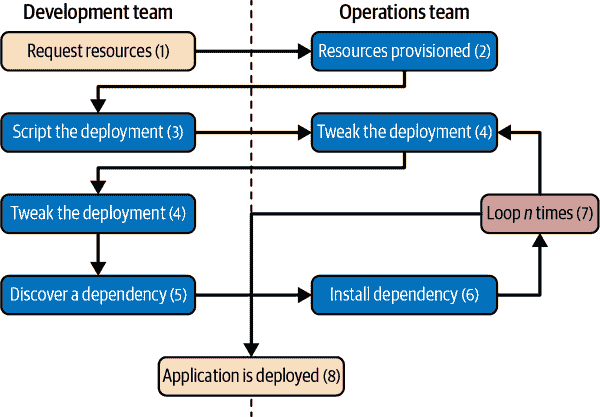
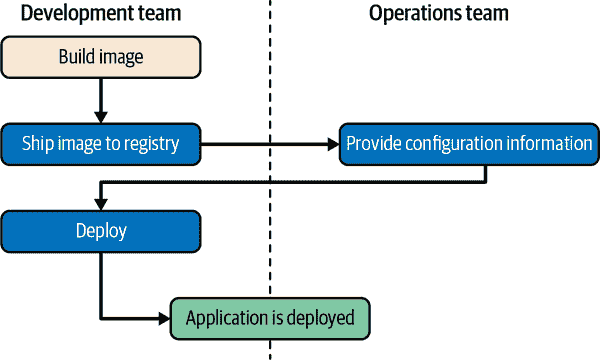
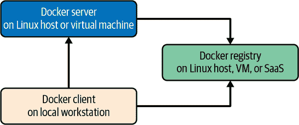
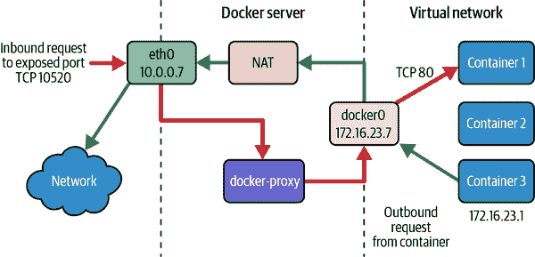
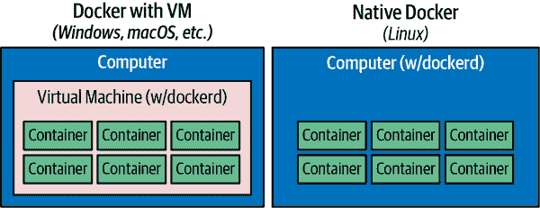

# 第二章：Docker 的概览

在你深入配置和安装 Docker 之前，需要进行广泛的调研来解释 Docker 的含义及其带来的益处。它是一项强大的技术，但在其核心并不是非常复杂。在这一章中，我们将涵盖 Docker 和 Linux 容器的工作原理，它们的强大之处，以及你可能使用它们的一些理由。如果你正在阅读本书，你可能已经有了使用容器的理由，但在你深入之前增加对其的理解从来不会有什么坏处。

别担心 —— 这一章不会占用你太长时间。在下一章中，我们将直接开始安装并在你的系统上运行 Docker。

# 过程简化

因为 Docker 是一款软件，也许不明显的是，如果它被采纳和实施得当，它也可能对公司和团队的流程产生重大积极影响。所以，让我们深入了解一下 Docker 和 Linux 容器如何简化工作流程和沟通。通常这从部署的故事开始。传统上，将一个应用程序部署到生产环境的周期通常看起来像下面这样（见 图 2-1）：

1.  应用程序开发者从运维工程师那里请求资源。

1.  资源被配置并交给开发者。

1.  开发者通过脚本和工具进行部署。

1.  运维工程师和开发者反复调整部署。

1.  开发者会发现额外的应用程序依赖关系。

1.  运维工程师致力于安装额外的要求。

1.  重复执行步骤 4 至 6 *n* 次。

1.  应用程序已被部署。

###### 图 2-1\. 传统的部署工作流程（没有 Docker）

我们的经验表明，当你遵循传统流程时，将全新的应用程序部署到生产环境可能需要一周时间，特别是对于一个复杂的新系统。这并不高效，即使 DevOps 实践试图消除许多障碍，它通常仍然需要大量的工作和团队之间的沟通。这个过程既具有技术挑战，也很昂贵，更糟糕的是，它可能会限制开发团队未来承担的创新类型。如果部署新软件很困难、耗时且依赖于其他团队的资源，那么开发者可能会选择将所有内容都集成到现有的应用程序中，以避免承受新部署的惩罚，或者更糟的是，他们可能会避免解决需要新开发工作的问题。

像[Heroku](https://www.heroku.com)这样的一键部署系统向开发人员展示了如果你能控制应用程序及其大部分依赖关系时世界会是什么样子。与开发人员讨论部署问题时，经常会提到在 Heroku 或类似系统上事情有多么容易。如果你是一名运维工程师，你可能听到过有关内部系统与“一键式”解决方案如 Heroku 在速度上有多慢的抱怨，后者建立在 Linux 容器技术之上。

Heroku 不仅仅是一个容器引擎，而是一个完整的环境。虽然 Docker 并不试图包含 Heroku 中包含的一切，但它提供了责任的清晰分离和依赖关系的封装，这导致了类似的生产力提升。Docker 还允许比 Heroku 更精细的控制，通过让开发人员控制一切，甚至到确切的文件和软件包版本，这些与他们的应用程序一起运行。一些构建在 Docker 之上的工具和编排器（例如 Kubernetes、Docker Swarm 模式和 Mesos）旨在复制像 Heroku 这样的系统的简单性。尽管这些平台包裹了更多的 Docker 功能，提供了更强大和复杂的环境，但仅使用 Docker 的简单平台仍然提供了所有核心流程优势，而不增加更大系统的复杂性。

作为一家公司，Docker 采用了“电池包含但可移除”的方法。这意味着它的工具包含了大多数人完成工作所需的一切，同时仍然是由可互换部件构建而成，可以轻松地替换以支持定制解决方案。通过使用镜像仓库作为交接点，Docker 允许将构建应用程序镜像的责任与容器的部署和运行分开。实际上，开发团队可以构建带有所有依赖关系的应用程序，在开发和测试环境中运行它，然后将完全相同的应用程序和依赖项捆绑包装到生产中。由于这些捆绑看起来在外观上都一样，运维工程师可以构建或安装标准工具来部署和运行应用程序。所描述的循环在图 2-1 中看起来类似于以下内容（在图 2-2 中有示例）：

1.  开发人员构建 Docker 镜像并将其推送到注册表。

1.  运维工程师为容器提供配置细节并配置资源。

1.  开发人员触发部署。

###### 图 2-2\. 一个 Docker 部署工作流程

Docker 允许在开发和测试周期中发现所有依赖问题，因此这种方式变为可能。当应用程序准备好进行首次部署时，这项工作已经完成。通常不需要在开发和运维团队之间频繁传递。在一个完善的流水线中，这完全可以消除除开发团队以外的任何人参与新服务的创建和部署的需要。这样做起来更加简单，也节省了很多时间。更好的是，它通过在发布前测试部署环境，带来了更加健壮的软件。

# 广泛的支持和采用

Docker 得到了广泛支持，在大多数大型公共云中都提供了一些直接支持。例如，Docker 和 Linux 容器已经通过多个产品在亚马逊网络服务 (AWS) 中得到了使用，比如亚马逊弹性容器服务 (Amazon ECS)，亚马逊弹性 Kubernetes 服务 (Amazon EKS)，亚马逊 Fargate 和亚马逊弹性 Beanstalk。Linux 容器也可以在 Google 应用引擎 (GAE)，Google Kubernetes 引擎，红帽 OpenShift，IBM Cloud，Microsoft Azure 等平台上使用。在 DockerCon 2014 上，Google 的 Eric Brewer 宣布 Google 将支持 Docker 作为其主要的内部容器格式。这不仅仅是对这些公司的良好公关，对 Docker 社区来说意味着大量资金开始支持 Docker 平台的稳定性和成功。

进一步扩大其影响力，Docker 的 Linux 容器镜像格式已成为云服务提供商之间的通用语言，为“一次编写，到处运行”云应用程序提供了潜力。当 Docker 发布其 `libswarm` 开发库时，Orchard 的一名工程师演示了将 Linux 容器同时部署到不同云服务提供商的异构环境中。在此之前，这种编排并不容易，因为每个云服务提供商都提供了不同的 API 或工具集来管理实例，而这些实例通常是可以通过 API 管理的最小单位。2014 年 Docker 提出的承诺现在已经完全成为主流，因为大公司继续在平台、支持和工具上投入资金。由于大多数提供商在容器编排以及容器运行时本身方面都提供了某种形式的 Docker 和 Linux 容器支持，因此 Docker 在常见生产环境中几乎可以支持任何类型的工作负载。如果您所有的工具都围绕 Docker 和 Linux 容器构建，那么您的应用程序可以以与云无关的方式部署，从而提供了以前无法实现的新灵活性。

2017 年，[Docker 将其 `containerd` 运行时捐赠给了](https://thenewstack.io/docker-donate-container-runtime-containerd-cloud-native-computing-foundation) [Cloud Native Computing Foundation (CNCF)](https://www.cncf.io)，并于 2019 年提升为成熟项目状态。

今天，在开发、交付和生产中使用 Linux 容器的规模比以往任何时候都要大。2022 年，我们看到 Docker 开始在服务器市场上失去份额，新版本的 Kubernetes 不再需要 Docker 守护程序，但即使这些 Kubernetes 的发布版本也非常依赖于最初由 Docker 开发的 `containerd` 运行时。Docker 在许多开发者和 CI/CD 工作流中仍然具有非常强大的影响力。

那么，操作系统供应商的支持和采用情况如何呢？Docker 客户端可以直接在大多数主流操作系统上运行，服务器可以在 Linux 或 Windows Server 上运行。绝大多数生态系统都围绕 Linux 服务器构建，但其他平台的支持越来越广泛。通行的道路是并且很可能将继续围绕运行 Linux 容器的 Linux 服务器展开。

###### 注意

在 64 位版本的 Windows Server 2016+ 上，可以原生地（无需虚拟机）运行 Windows 容器。然而，64 位版本的 Windows 10+ 专业版仍然需要 Hyper-V 来提供用于 Windows 容器的 Windows Server 内核。我们将在 “Windows 容器” 中详细讨论这个问题。

还值得注意的是，Windows 可以通过利用 WSL 2（Windows Subsystem for Linux，版本 2）在虚拟机外运行 Linux 容器。

为了支持在开发环境中对 Docker 工具的不断增长的需求，Docker 发布了适用于 macOS 和 Windows 的易于使用的实现。这些实现看起来在本地运行，但仍然利用了一个小型的 Linux 虚拟机来提供 Docker 服务器和 Linux 内核。Docker 传统上是在 Ubuntu Linux 发行版上开发的，但现在几乎所有的 Linux 发行版和其他主要操作系统都在可能的情况下提供支持。例如，Red Hat 完全投入到容器中，其所有平台都对 Docker 提供一流的支持。随着 Linux 领域容器的普及，我们现在有了像 Red Hat 的 Fedora CoreOS 这样专门用于 Linux 容器工作负载的发行版。

在 Docker 发布后的最初几年，一些竞争对手和服务提供商对 Docker 的专有镜像格式表示了担忧。Linux 上的容器并没有一个标准的镜像格式，因此 Docker 公司根据其业务需求创建了自己的格式。

服务提供商和商业供应商特别不愿意建立可能受制于具有重叠利益的公司的平台。正因如此，Docker 作为一家公司在那段时间面临了一些公开挑战。为了获得一些善意并支持市场上更广泛的采用，Docker 公司决定在 2015 年 6 月帮助赞助[Open Container Initiative (OCI)](https://www.opencontainers.org)。从那次努力中发布的第一个完整规范是在 2017 年 7 月发布的，它在很大程度上基于 Docker 镜像格式的第 2 版。现在可以申请 OCI 认证，既适用于容器镜像又适用于容器运行时。

这是主要的高级 OCI 认证运行时：

+   [`containerd`](https://containerd.io)是现代版本的 Docker 和 Kubernetes 中的默认高级运行时。

这些低级 OCI 认证运行时可以被`containerd`用来管理和创建容器：

+   [`runc`](https://github.com/opencontainers/runc)通常作为`containerd`的默认低级运行时使用。

+   [`crun`](https://github.com/containers/crun)是用 C 语言编写的，旨在快速且具有较小的内存占用。

+   [Kata Containers](https://katacontainers.io)来自 Intel、Hyper 和 OpenStack Foundation，是一个虚拟化运行时，可以运行容器和虚拟机的混合体。

+   来自 Google 的[gVisor](https://github.com/google/gvisor)是一个完全在用户空间实现的沙盒运行时。

+   [Nabla Containers](https://nabla-containers.github.io)提供另一种沙盒运行时，旨在显著减少 Linux 容器的攻击面。

在部署容器和编排整个容器系统的空间也在继续扩展。其中许多是开源的，并且可以在本地部署，也可以作为云端或软件即服务（SaaS）提供商的提供物，无论是在他们的云端还是你的云端。鉴于继续投入 Linux 容器空间的资金量，很可能 Docker 将继续在现代互联网中发挥重要作用。

# 架构

Docker 是一项强大的技术，通常意味着具有高复杂性的工具和流程。在幕后，Docker 确实很复杂；然而，它面向用户的基本结构确实是一个简单的客户端/服务器模型。Docker API 后面有几个组件，包括 `containerd` 和 `runc`，但基本的系统交互是客户端通过 API 与服务器通信。在这个简单的外观背后，Docker 大量利用内核机制，如 iptables、虚拟桥接、Linux 控制组 (cgroups)、Linux 命名空间、Linux 能力、安全计算模式、各种文件系统驱动程序等。我们将在第十一章讨论其中一些。现在，我们将介绍客户端和服务器的工作方式，并对 Docker 中 Linux 容器下的网络层进行简要介绍。

## 客户端/服务器模型

最简单的是将 Docker 视为由两部分组成：客户端和服务器/守护进程（参见图 2-3）。可选地，还有一个称为*注册表*的第三组件，用于存储 Docker 映像及其元数据。服务器负责构建、运行和管理您的容器的持续工作，您可以使用客户端告诉服务器要做什么。Docker [守护进程](https://en.wikipedia.org/wiki/Daemon_(computing))可以在基础架构中的任意数量的服务器上运行，单个客户端可以连接任意数量的服务器。客户端驱动所有通信，但在被客户端告知时，Docker 服务器可以直接与镜像注册表通信。客户端负责告诉服务器要做什么，而服务器则专注于托管和管理容器化应用程序。

###### 图 2-3\. Docker 客户端/服务器模型

Docker 在结构上与一些其他客户端/服务器软件有所不同。它有一个 `docker` 客户端和一个 `dockerd` 服务器，但与其完全单片化不同，服务器背后还通过 `containerd-shim-runc-v2` 等组件代表客户端协调几个其他组件，用于与 `runc` 和 `containerd` 交互。然而，Docker 通过简单的服务器 API 干净地隐藏了任何复杂性，因此在大多数情况下，您可以将其视为一个简单的客户端和服务器。每个 Docker 主机通常会运行一个 Docker 服务器，可以管理任意数量的容器。然后，您可以使用 `docker` 命令行工具与服务器通信，无论是从服务器本身还是（如果正确安全）从远程客户端。我们稍后会详细讨论这一点。

## 网络端口和 Unix 套接字

`docker` 命令行工具和 `dockerd` 守护进程可以通过 Unix 套接字和网络端口进行通信。Docker 公司已向 [互联网编号分配机构 (IANA)](https://www.iana.org) 注册了三个端口，供 Docker 守护程序和客户端使用：TCP 端口 2375 用于未加密流量，端口 2376 用于加密 SSL 连接，端口 2377 用于 Docker Swarm 模式。在需要使用不同设置的场景中，可以轻松配置不同的端口。Docker 安装程序的默认设置是仅使用 Unix 套接字与本地 Docker 守护程序进行通信。这确保系统默认采用可能的最安全安装。虽然这也是可以轻松配置的，但强烈建议不要在 Docker 中使用网络端口，因为 Docker 守护程序内部缺乏用户认证和基于角色的访问控制。Unix 套接字在不同操作系统上的路径可能不同，但在大多数情况下，可以在此找到：*/var/run/docker.sock*。如果您对其他位置有强烈偏好，通常可以在安装时指定此位置，或者稍后更改服务器配置并重新启动守护进程。如果没有特别要求，那么默认设置可能适合您。与大多数软件一样，如果不需要更改，遵循默认设置将节省大量麻烦。

###### 提示

最近版本的 Docker Desktop 可能会在用户的主目录内的 *.docker/run/* 中创建 *docker.sock* 文件，然后简单地将 *_/var/run/docker.sock* 链接到此位置。

## 强大的工具集

导致 Docker 广泛采用的许多因素之一是其简单而强大的工具集。自首次发布以来，由于 Docker 社区的努力，其功能已不断扩展。Docker 提供的工具支持构建 Docker 镜像、基本部署到单个 Docker 守护进程、称为 Swarm 模式的分布式模式，以及管理远程 Docker 服务器所需的所有功能。除了包含的 Swarm 模式外，社区还专注于管理整个 Docker 服务器群集，并调度和编排容器部署。

###### 注意

当本书中谈论 [Docker Swarm 或 Swarm 模式](https://docs.docker.com/engine/swarm) 时，我们指的是 Docker 客户端和服务器内置的 Swarm 功能，它利用了另一个称为 SwarmKit 的底层库。在搜索互联网文章时，您可能会发现有关旧版独立版 Docker Swarm 的引用，该版本现在通常被称为 [Docker Swarm “Classic”](https://github.com/docker-archive/classicswarm)。

Docker 还推出了自己的编排工具集，包括[Compose](https://github.com/docker/compose)、[Docker Desktop](https://www.docker.com/products/docker-desktop)和[Swarm mode](https://docs.docker.com/engine/swarm)，为开发人员提供了一致的部署方案。尽管 Docker 在生产编排领域的产品被 Google 的 Kubernetes 遮掩，但需要注意的是，[Kubernetes 在 2022 年初发布 v1.24 之前广泛依赖于 Docker](https://kubernetes.io/blog/2020/12/02/dockershim-faq)。但 Docker 的编排工具仍然很有用，特别是 Compose 在本地开发中特别方便。

因为 Docker 提供了命令行工具和远程 REST API，所以很容易在任何语言中添加更多的工具。命令行工具非常适合 shell 脚本编写，客户端可以做的任何事情也可以通过 REST API 编程方式完成。Docker CLI 如此著名，以至于许多其他 Linux 容器 CLI 工具，如 [`podman`](https://podman.io) 和 [`nerdctl`](https://github.com/containerd/nerdctl)，模仿其参数以实现兼容性和易用性采纳。

## Docker 命令行工具

命令行工具 `docker` 是大多数人与 Docker 交互的主要界面。Docker 客户端是一个[Go 程序](https://golang.org)，可以在所有常见的架构和操作系统上编译和运行。这个命令行工具作为主要 Docker 发行版的一部分在各种平台上都可以使用，并且可以直接从 Go 源代码编译。你通常可以使用 Docker 命令行工具做以下一些事情，但不限于：

+   构建容器镜像

+   从注册表拉取镜像到 Docker 守护程序或将其推送到注册表

+   在 Docker 服务器上启动容器，可以是前台或后台

+   从远程服务器检索 Docker 日志

+   在远程服务器上交互式地运行容器内正在运行的命令

+   监控关于你的容器的统计数据

+   获取容器中的进程列表

你可能已经看到这些如何组合成一个用于构建、部署和观察应用程序的工作流程。但 Docker 命令行工具并不是与 Docker 交互的唯一方式，也不一定是最强大的方式。

## Docker 引擎 API

像许多现代软件的其他部分一样，Docker 守护程序具有 API。这实际上是 Docker 命令行工具用来与守护程序通信的方式。但由于 API 是公开文档的，外部工具直接使用 API 是相当常见的。这提供了一个方便的机制，允许任何工具创建、检查和管理 Docker 守护程序管理下的所有镜像和容器。虽然初学者可能不会最初想要直接与 Docker API 交互，但它是一个非常有用的工具。随着您的组织随着时间的推移越来越多地采用 Docker，您会发现 API 是这些工具的一个很好的集成点。

[API](https://dockr.ly/2wxCHnx)的详细文档位于 Docker 网站上。随着生态系统的成熟，针对所有流行语言已经出现了稳健的 Docker API 库的实现。Docker 维护着 Python 和 Go 的[SDKs](https://dockr.ly/2wxCHnx)，还有由第三方维护的其他值得考虑的库。例如，多年来我们使用了这些[Go](https://github.com/fsouza/go-dockerclient)和[Ruby](https://github.com/upserve/docker-api)库，并发现它们既稳健又在新版本的 Docker 发布时迅速更新。

大多数可以通过 Docker 命令行工具完成的事情都可以相对轻松地通过 API 支持。有两个显著的例外是需要流式处理或终端访问的端点：运行远程 shell 或以交互模式执行容器。在这些情况下，通常更容易使用这些可靠的客户端库或命令行工具。

## 容器网络

尽管 Linux 容器主要由在主机系统上运行的进程组成，但它们在网络层通常表现得与其他进程非常不同。Docker 最初支持了单一的网络模型，但现在支持了处理大多数应用需求的强大的配置组合。大多数人在默认配置下运行其容器，称为*桥接模式*。让我们看看它是如何工作的。

理解桥接模式最简单的方法是将您的每个 Linux 容器视为私有网络上的主机。Docker 服务器充当虚拟桥接，而容器则是其后的客户端。桥接只是一个网络设备，将一侧的流量转发到另一侧。因此，您可以将其视为一个小型虚拟网络，其中每个容器像连接到该网络的主机一样运行。实际实现（见 图 2-4）是每个容器都有一个连接到 Docker 桥接的虚拟以太网接口，并分配给虚拟接口的 IP 地址。Docker 允许您绑定和显露主机上的单个或一组端口给容器，以便外部世界可以通过这些端口访问您的容器。流量主要由 [vpnkit](https://github.com/moby/vpnkit) 库管理。

Docker 从未使用的 [RFC 1918](https://www.rfc-editor.org/rfc/rfc1918) 私有子网块中分配私有子网。它检测主机上未使用的网络块，并为虚拟网络分配其中之一。这通过服务器上的 `docker0` 接口桥接到主机的本地网络。这意味着，默认情况下，所有容器都在同一个网络上，并可以直接相互通信。但要访问主机或外部世界，则通过 `docker0` 虚拟桥接接口。

###### 图 2-4\. 典型 Docker 服务器上的网络

有多种方式可以配置 Docker 的网络层，从分配您自己的网络块到配置自定义桥接接口。人们通常使用默认机制运行，但在需要更复杂或特定于应用程序的情况下，还有其他选择。您可以在 [文档](https://dockr.ly/2otp461) 中找到关于 Docker 网络的更多详细信息，我们将在 第 11 章 中涵盖更多细节。

###### 注意

在开发 Docker 工作流程时，您应该从默认的网络方法开始。您可能会发现，您不希望或不需要这个默认的虚拟网络。每个容器的网络是可配置的，您可以通过使用 `docker container run` 的 `--net=host` 开关完全关闭容器的整个虚拟网络层。在这种模式下运行时，Linux 容器使用主机自己的网络设备和地址，没有虚拟接口或桥接被预配。请注意，主机网络具有您可能需要考虑的安全性影响。还有其他可能性的网络拓扑，可以在 第 11 章 中讨论。

# 充分利用 Docker

像大多数工具一样，Docker 有许多优秀的用例，也有一些不那么好的用例。例如，你可以用锤子打开玻璃罐。但这也有其缺点。理解如何最好地使用这个工具，甚至简单地确定它是否是合适的工具，可以让你更快地找到正确的路径。

首先，Docker 的架构专注于无状态或状态外部化到数据存储（如数据库或缓存）的应用程序。这些是最容易容器化的。Docker 强制执行一些对于这类应用程序有益的开发原则，稍后我们将讨论这点的强大之处。但这意味着在 Docker 中放置数据库引擎之类的操作有点像逆水行舟。并不是说你不能这样做，甚至不应该这样做；只是这不是 Docker 的最明显的用例，所以如果你从这个开始，你可能会在早期感到失望。现在在 Docker 中运行良好的数据库通常是以这种方式部署的，但这并不是简单的路径。一些适合初学者使用 Docker 的好应用包括 Web 前端、后端 API 和短期运行的任务，比如通常由 `cron` 处理的维护脚本。

如果你首先专注于在容器中运行无状态或外部状态应用程序的理解，那么你将有一个基础来考虑其他用例。我们强烈建议先从无状态应用程序开始，并从中积累经验，然后再考虑其他用例。社区正在不断努力以更好地支持 Docker 中的有状态应用程序，并且在这个领域可能会有很多发展。

## 容器不是虚拟机。

一个很好的方法来开始塑造你对如何利用 Docker 的理解是将 Linux 容器视为非虚拟机（VMs），而是非常轻量级的包装器，包裹着一个单一的 Unix 进程。在实际实施中，这个进程可能会衍生出其他进程，但另一方面，一个静态编译的二进制文件可能是容器中全部的内容（查看“外部依赖”获取更多信息）。容器也是短暂的：它们可能会更容易地出现和消失，远比传统的虚拟机快。

虚拟机从设计上是真实硬件的替代品，你可以将其放入机架并在那里使用几年。由于它们抽象了真实服务器，虚拟机通常具有长期的生命周期。即使在云中，公司经常根据需求启动和关闭虚拟机，它们通常也会有几天或更长时间的运行生命周期。另一方面，特定的容器可能会存在几个月，或者它可能被创建，运行一分钟的任务，然后被销毁。所有这些都是可以接受的，但这与虚拟机通常用于的方式根本不同。

在帮助加深这种区分的过程中，如果您在 Mac 或 Windows 系统上运行 Docker，则利用 Linux 虚拟机来运行`dockerd`，即 Docker 服务器。然而，在 Linux 上，`dockerd`可以本地运行，因此系统中无需运行虚拟机（参见 图 2-5）。

###### 图 2-5\. 典型的 Docker 安装

## 有限的隔离

容器彼此之间是隔离的，但这种隔离可能比您预期的要有限。虽然您可以限制它们的资源，但默认的容器配置仅使它们在主机系统上共享 CPU 和内存，就像您期望的那样与 Unix 进程共同放置。这意味着除非对其进行限制，否则容器可能会在您的生产机器上竞争资源。对 CPU 和内存使用的限制是通过 Docker 鼓励的，但在大多数情况下，它们不像虚拟机那样成为默认选项。

很多情况下，许多容器共享一个或多个常见的文件系统层。这是 Docker 中更强大的设计决策之一，但这也意味着，如果您更新了共享的映像，可能还需要重新构建和部署仍在使用旧映像的容器。

容器化进程仅仅是在 Docker 服务器上的进程。它们与主机操作系统上的 Linux 内核实例上运行的进程相同。所有容器进程都会显示在 Docker 服务器的正常`ps`输出中。这与虚拟化管理程序完全不同，后者通常包括为每个虚拟机运行一个完全独立的操作系统内核实例。

这种轻量级的封装可能会导致诱人的选项，即从主机公开更多资源，例如共享文件系统以允许状态存储。但是，在将主机资源进一步公开到容器之前，除非它们专门由容器使用，您应该认真考虑。我们将稍后讨论容器的安全性，但通常情况下，您可能会考虑通过应用[安全增强型 Linux (SELinux)](https://www.redhat.com/en/topics/linux/what-is-selinux)或[AppArmor](https://apparmor.net)策略来进一步强制执行隔离，而不是牺牲现有的屏障。

###### 警告

默认情况下，许多容器使用 UID 0 来启动进程。因为容器是*被包含的*，这看起来很安全，但实际上并不是很安全。因为一切都在同一个内核上运行，许多类型的安全漏洞或简单的配置错误都可能导致容器的`root`用户未经授权地访问主机的系统资源、文件和进程。请参考“安全性”以讨论如何减轻这种情况。

## 容器轻量化

我们稍后会更详细地讨论这个工作原理，但创建一个新容器可能占用很少的磁盘空间。快速测试表明，从现有镜像创建的新容器只需 12 千字节的磁盘空间。这非常轻量。另一方面，从黄金镜像创建的新虚拟机可能需要数百或数千兆字节，因为至少需要完整的操作系统安装在该磁盘上。另一方面，新容器之所以如此小，是因为它只是对分层文件系统镜像的引用以及一些关于配置的元数据。默认情况下，不会为容器分配数据的副本。容器只是现有系统上的进程，可能只需要从磁盘读取信息，因此在容器独占使用数据之前，可能不需要复制任何数据。

容器的轻量性意味着你可以在创建另一个虚拟机太重或需要真正短暂性的情况下使用它们。例如，你可能不会启动整个虚拟机来从远程位置运行`curl`命令访问网站，但你可能会为此目的启动一个新的容器。

## 走向不可变基础设施

通过在容器内部部署大部分应用程序，你可以通过向不可变基础设施转移来简化配置管理故事，即组件完全被替换而不是在原地更改。在现实中，要维护一个真正幂等的配置管理代码库是多么困难，不难理解为何不可变基础设施的概念越来越受欢迎。随着配置管理代码库的增长，它可能变得像大型、单片式的遗留应用程序一样笨重和难以维护。

使用 Docker，可以部署一个非常轻量的 Docker 服务器，几乎不需要配置管理，或者在许多情况下根本不需要。你只需通过部署和重新部署容器来简单地处理所有应用管理。当服务器需要对 Docker 守护程序或 Linux 内核进行重要更新时，你可以简单地启动一个带有变更的新服务器，在那里部署你的容器，然后停用或重新安装旧服务器。

基于容器的 Linux 发行版如[红帽的 Fedora CoreOS](https://getfedora.org/en/coreos)就是围绕这一原则设计的。但与其要求你停用实例不同，Fedora CoreOS 可以完全更新自身并切换到更新的操作系统。你的配置和工作负载主要留在容器中，你几乎不需要对操作系统进行太多配置。

由于在部署和配置服务器方面有着清晰的分离，许多基于容器的生产系统正在使用诸如[HashiCorp 的 Packer](https://www.packer.io/intro/index.html) 这样的工具来构建云虚拟服务器镜像，然后利用 Docker 几乎或完全避免配置管理系统。

## 无状态应用

一个容器化效果良好的应用的典型例子是将其状态保存在数据库中的 Web 应用程序。无状态应用通常设计为立即响应单个自包含请求，并且不需要在一个或多个客户端的请求之间跟踪信息。你也许会在容器中运行类似临时的[Memcached](https://memcached.org) 实例。不过，如果考虑你的 Web 应用程序，它可能有一些你依赖的本地状态，比如配置文件。这可能看起来不像是很多状态，但如果把这些配置嵌入到镜像中，意味着你限制了镜像的重用性，并且增加了在不同环境中部署的挑战，因为需要维护多个针对不同部署目标的镜像。

在许多情况下，将应用程序容器化的过程意味着将配置状态转移到可以在运行时传递给应用程序的环境变量中。而不是把配置信息固定到容器中，你可以在部署容器时应用配置。这使得你能够轻松地在生产环境或者演示环境中使用相同的容器运行应用程序。在大多数公司中，这些环境可能需要许多不同的配置设置，比如应用程序使用的各种外部服务的连接 URL。

使用容器，你可能会发现在优化下你的容器化应用程序的同时，不断减少其大小，使其仅包含运行所需的基本要素。我们发现，将需要以分布方式运行的任何东西视为容器可以引导出一些有趣的设计决策。例如，如果有一个收集数据、处理数据并返回结果的服务，你可以在许多服务器上配置容器来运行任务，然后在另一个容器上聚合响应。

## 外部化状态

如果 Docker 对于无状态应用程序效果最好，那么在需要时如何最好地存储状态呢？例如，配置通常通过环境变量传递。Docker 原生支持环境变量，并将它们存储在构成容器配置的元数据中。这意味着重新启动容器将确保每次都将相同的配置传递给您的应用程序。它还使得在运行时轻松观察容器的配置，这可以大大简化调试过程，尽管在环境变量中暴露秘密信息存在一些安全问题。还可以将应用程序配置存储和检索到外部数据存储中，比如[Consul](https://www.consul.io)或[PostgreSQL](https://www.postgresql.org)。

数据库通常是扩展应用程序存储状态的地方，而 Docker 并不会干扰容器化应用程序进行这样的操作。然而，需要存储文件的应用程序面临一些挑战。将数据存储到容器的文件系统中性能不佳，会受到空间限制，并且在容器重新创建时不会保留状态。如果重新部署一个有状态的服务而不利用容器外部的存储，将会丢失所有状态。在将需要存储文件系统状态的应用程序放入 Docker 之前，应仔细考虑。如果您决定在这些情况下从 Linux 容器中受益，最好设计一个解决方案，其中状态可以存储在一个集中位置，无论容器运行在哪个主机上都可以访问。在某些情况下，这可能意味着使用像亚马逊简单存储服务（Amazon S3）、OpenStack Swift 或本地块存储，甚至在容器内挂载 EBS 卷或 iSCSI 磁盘。[Docker 卷插件](https://docs.docker.com/engine/extend/plugins_volume)提供了一些额外的选项，并在第十一章中简要讨论了它们。

###### 提示

尽管可以在主机的本地文件系统上外部化状态，但社区通常不建议这样做，并且应视为高级用例。强烈建议您首先使用不需要持久状态的应用程序。通常不鼓励这样做有多个原因，但几乎所有情况下的原因都是因为它引入了容器和主机之间的依赖关系，这些依赖关系会干扰 Docker 作为真正动态、横向可扩展的应用程序交付服务的使用。如果您的容器在本地主机文件系统上维护状态，则只能部署到托管该本地文件系统的系统上。可以动态挂载的远程卷是一个不错的解决方案，但也是一个高级用例。

# Docker 工作流程

像许多工具一样，Docker 强烈推荐一种特定的工作流。这是一种非常有效的工作流，非常适合许多公司的组织方式，但可能与你或你的团队目前的做法有所不同。通过将我们自己组织的工作流程适应 Docker 方法，我们可以自信地说，这是对你组织中许多团队产生广泛积极影响的一种改变。如果工作流程实施得当，它可以帮助你实现减少团队间沟通开销的承诺。

## 修订控制

Docker 提供的第一个功能是两种形式的修订控制。其中一种用于跟踪每个 Docker 镜像所包含的文件系统层，另一种是针对这些镜像的标记系统。

### 文件系统层

Linux 容器由堆叠的文件系统层组成，每一层由唯一的哈希标识，构建过程中的每组新变更都叠加在先前的变更之上。这样做的好处在于，当你进行新的构建时，只需要重建跟随你部署变更的层。这样可以节省时间和带宽，因为容器以层的形式进行传输，你无需传输服务器已存储的层。如果你使用过许多传统部署工具进行部署，你会知道每次部署都可能重复向服务器传输数百兆相同的数据。这非常低效，更糟糕的是，你不能确定各个部署之间到底有什么变化。由于分层效应以及 Linux 容器包含所有应用程序依赖项的特性，使用 Docker，你可以更加自信地发布变更到生产环境。

简单来说，一个 Docker 镜像包含运行你的应用程序所需的所有内容。如果你修改了一行代码，肯定不希望浪费时间重新构建每个依赖项进入新的镜像中。通过利用构建缓存，Docker 可以确保只重新构建受代码更改影响的层。

### 镜像标签

Docker 提供的第二种修订控制方式使得回答一个重要问题变得简单：之前部署的应用程序版本是什么？这并不总是容易回答的问题。对于非容器化应用程序，有许多解决方案，从为每个发布创建 Git 标签，到部署日志，到带有标记的构建以供部署使用等等。例如，如果你正在使用 [Capistrano](https://capistranorb.com) 协调部署，它会通过在服务器上保留一定数量的先前版本，并使用符号链接将其中一个设为当前版本来处理这个问题。

但在任何规模化生产环境中，每个应用程序都有处理部署修订版的独特方式。其中许多应用程序做同样的事情，但有些可能不同。更糟糕的是，在异构语言环境中，应用程序之间的部署工具通常完全不同，并且很少共享。因此，“上一个版本是什么？”这个问题可能会因询问的人和所指的应用程序而有不同的答案。Docker 有一个内置机制来处理这个问题：使用镜像标签作为标准构建步骤。您可以轻松地在服务器上保留多个应用程序修订版，因此进行回滚变得微不足道。这不是火箭科学，也不是在其他部署工具中难以找到的功能，但是使用容器镜像，可以轻松地在所有应用程序中标准化，每个人都可以对应用程序的标记有相同的期望。这使得团队之间的沟通更容易，工具更简单，因为应用发布有一个真正的来源。

###### 警告

在许多在线示例和本书中，您会看到人们为容器镜像使用`latest`标签。当您刚开始使用和编写示例时，这很有用，因为它始终会获取最新构建的镜像。但是由于这是一个浮动标签，在大多数生产工作流程中使用`latest`是一个非常糟糕的主意，因为您的依赖项可能会在您不知情的情况下更新，而且无法回滚到`latest`，因为旧版本不再是标记为`latest`的版本。它还使得很难验证是否在不同的服务器上运行相同的镜像。经验法则是：在生产环境中不要使用`latest`标签。甚至从上游镜像使用`latest`标签也不是一个好主意，原因如上。

强烈建议您使用能够唯一标识用于构建的确切源代码提交的东西来标记您的 CI/CD 构建。在`git`工作流程中，这可以是与提交相关的 git 哈希。一旦您准备释放一个镜像，建议使用[语义化版本](https://semver.org)为您的镜像提供标签，如 1.4.3、2.0.0 等。

锁定版本需要更多的工作来保持其更新，但它也会防止在构建和部署过程中发生许多不幸和不合时宜的惊喜。

## 构建

在许多组织中，构建应用程序是一门黑艺术，只有少数人知道所有操作和参数来生成一个格式良好、可交付的工件。部署新应用程序的重大成本之一是确保构建正确。Docker 并不能解决所有这些问题，但它确实提供了标准化的工具配置和工具集来进行构建。这使得人们更容易学习如何构建您的应用程序，并使新构建能够快速运行起来。

Docker 命令行工具包含一个`build`标志，它将消耗一个*Dockerfile*并生成一个 Docker 镜像。*Dockerfile*中的每个命令都会在镜像中生成一个新的层，因此通过查看*Dockerfile*本身，很容易理解构建将要做什么。所有这些标准化的重要部分是，任何曾经使用过*Dockerfile*的工程师都可以直接参与并修改任何其他应用程序的构建。由于 Docker 镜像是一个标准化的构件，无论使用的开发语言或基础镜像是什么，或者需要多少层次，构建背后的所有工具都是相同的。*Dockerfile*通常被提交到版本控制系统中，这也意味着跟踪构建的变化变得简单。现代的多阶段 Docker 构建还允许您将构建环境与最终构件镜像分开定义，这就像为生产容器定义“配置能力”一样提供了巨大的便利性。

许多 Docker 构建只需一次调用`docker image build`命令并生成单个构件，即容器镜像。因为通常情况下构建的大部分逻辑完全包含在*Dockerfile*中，所以很容易为任何团队在构建系统（如[Jenkins](https://jenkins-ci.org)）中创建标准构建任务。作为进一步的构建流程标准化，许多公司（例如 eBay）已经将 Linux 容器标准化为从*Dockerfile*进行镜像构建的工具。像[Travis CI](https://travis-ci.com)和[CodeShip](https://codeship.com)这样的 SaaS 构建服务也全面支持 Docker 构建。

自动化创建支持不同底层计算架构（如 x86 和 ARM）的多个镜像也是可能的，这是通过在 Docker 中利用新的[BuildKit](https://github.com/moby/buildkit)支持实现的。

## 测试

虽然 Docker 本身不包括用于测试的内置框架，但构建容器的方式为使用 Linux 容器进行测试带来了一些优势。

测试生产应用程序可以采用多种形式，从单元测试到在半实时环境中进行完整集成测试。Docker 通过保证测试通过的构件就是部署到生产环境的构件来促进更好的测试。这可以得到保证，因为我们可以使用 Docker SHA 或自定义标签，以确保我们始终将应用程序的相同版本一致地部署到生产环境。

由于容器设计上包含了所有依赖关系，因此在容器上运行的测试非常可靠。如果一个单元测试框架表示在容器镜像上测试成功，你可以确信，在部署时不会出现例如基础库版本问题的情况。这对大多数其他技术来说并不容易，甚至 Java WAR 文件，例如，也不包括对应用服务器本身的测试。同样的 Java 应用在 Linux 容器中部署时通常也会包含像 Tomcat 这样的应用服务器，整个堆栈可以在进入生产之前进行烟火测试。

在 Linux 容器中运行应用程序的另一个好处是，在那些通过类似 API 远程通信的多个应用程序的地方，一个应用程序的开发人员可以轻松地针对当前标记为所需环境（如生产或分段）的另一个服务版本进行开发。每个团队的开发人员不必成为其他服务如何工作或部署的专家，只需开发自己的应用程序即可。如果将这个扩展到具有无数微服务的服务导向架构，Linux 容器对于需要处理微服务间 API 调用的开发人员或 QA 工程师来说是一个真正的生命线。

在生产环境中运行 Linux 容器的组织中，一个常见的做法是进行自动化集成测试，拉取一组经过版本化的不同服务的 Linux 容器，与当前部署的版本匹配。新服务随后可以与将要部署的完全相同版本进行集成测试。在异构语言环境中，这样做以前需要大量定制工具支持，但由于 Linux 容器提供的标准化，现在实现起来相当简单。

## 打包

Docker 构建生成的镜像可以看作是一个单一的构建产物，尽管在技术上它们可能由多个文件系统层组成。无论你的应用程序使用哪种语言编写，或者在哪个 Linux 发行版上运行，构建的结果都是一个分层的 Docker 镜像。所有这些都由 Docker 工具处理和构建。这种构建镜像就像 Docker 命名的船运集装箱隐喻：一个单一的、可传输的单元，通用工具可以处理，无论它包含什么内容。这是非常强大的，因为它大大促进了应用程序之间工具重用，意味着别人的现成容器工具也能与你的构建镜像一起工作。

传统上需要大量定制配置才能部署到新主机或开发系统的应用，在 Docker 上变得非常可移植。一旦构建了容器，它就可以轻松地部署到具有相同架构上运行 Docker 服务器的任何系统上。

## 部署

部署由不同商店中的许多种工具处理，这里不可能列出它们。其中一些工具包括 shell 脚本，[Capistrano](https://capistranorb.com)，[Fabric](https://www.fabfile.org)，[Ansible](https://www.ansible.com) 和内部定制工具。根据我们与多团队组织的经验，通常每个团队都有一两个人知道如何进行部署以使其正常工作。一旦出现问题，团队就依赖于他们来让它再次运行起来。正如您现在可能期望的那样，Docker 大部分时间都不成问题。内置工具支持简单的一行部署策略，以将构建部署到主机并启动。标准的 Docker 客户端一次仅处理到一个主机的部署，但有大量的工具可用，使得在 Docker 集群或其他兼容的 Linux 容器主机中部署变得非常简单。由于 Docker 提供的标准化，您的构建可以部署到这些系统中的任何一个，开发团队的复杂性很低。

## Docker 生态系统

多年来，围绕 Docker 形成了一个广泛的社区，由开发人员和系统管理员共同推动。类似于 DevOps 运动，这促进了通过将代码应用于运维问题来改进工具。在 Docker 提供的工具中存在空白的地方，其他公司和个人也站了出来。其中许多工具也是开源的。这意味着它们是可扩展的，可以被任何其他公司修改以适应其需求。

###### 注意

Docker 是一家商业公司，已将其大部分核心 Docker 源代码贡献给开源社区。强烈鼓励公司加入社区，并回馈开源努力。如果您正在寻找核心 Docker 工具的支持版本，可以在[Docker 网站](https://www.docker.com/support)了解更多信息。

### 编排

Docker 核心发行版和 Linux 容器体验的第一个重要工具类别是增加功能的工具，包括编排和大规模部署工具。早期的大规模部署工具如 [New Relic’s Centurion](https://github.com/newrelic/centurion)，[Spotify’s Helios](https://github.com/spotify/helios)，以及 [Ansible Docker 工具集](https://oreil.ly/V8X_f)¹ 仍然像传统部署工具一样工作，但利用容器作为分发工件。它们采用相对简单、易于实施的方法。你可以获得 Docker 的许多优点，而不增加太多复杂性，但这些工具中的许多已被更强大和更灵活的工具（比如 Kubernetes）取代。

像 [Kubernetes](https://kubernetes.io) 或 [Apache Mesos](https://mesos.apache.org) 与 [Marathon 调度器](https://mesosphere.github.io/marathon) 这样的全自动调度器是更强大的选择，它们几乎完全控制了一组主机的池。其他商业产品也广泛可用，如 [HashiCorp’s Nomad](https://www.nomadproject.io)，[Mesosphere’s DC/OS（数据中心操作系统）](https://dcos.io)，以及 [Rancher](https://rancher.com)²。自由和商业选项的生态系统继续快速增长。

### 不可变的原子主机

另一个可以利用来增强 Docker 使用体验的想法是不可变的原子主机。传统上，服务器和虚拟机是组织精心组装、配置和维护的系统，以提供支持广泛使用模式的各种功能。更新通常必须通过非原子操作应用，主机配置可能会分歧，导致系统出现意外行为。在今天的世界中，大多数正在运行的系统是通过就地打补丁和更新来更新的。相比之下，在软件部署的世界中，大多数人部署整个应用的完整副本，而不是尝试向运行中的系统应用补丁。容器的吸引力部分在于它们帮助使应用比传统部署模型更加原子化。

如果你能将核心容器模式扩展到操作系统中，会怎样？与其依赖配置管理尝试更新、打补丁和合并 OS 组件的变更，不如简单地下载一个新的轻量级 OS 镜像并重新启动服务器。然后，如果出现问题，可以轻松地回滚到之前使用的确切镜像。

这是基于 Linux 的原子主机发行版（例如[红帽的 Fedora CoreOS](https://getfedora.org/en/coreos)，[Bottlerocket OS](https://github.com/bottlerocket-os/bottlerocket)等）的核心理念之一。不仅应该能够轻松拆卸和重新部署应用程序，而且整个软件堆栈也应该适用相同的哲学。这种模式有助于为整个堆栈提供非常高的一致性和韧性。

不可变或[原子主机](https://gist.github.com/jzb/0f336c6f23a0ba145b0a)的典型特征包括最小的足迹、专注于支持 Linux 容器和 Docker 的设计，以及可以通过多主机编排工具在裸金属和常见虚拟化平台上轻松控制的原子操作系统更新和回滚。

在第三章中，我们将讨论如何在开发过程中轻松使用这些不可变主机。如果您还将这些主机用作部署目标，则此过程在您的开发和生产环境之间创造了前所未有的软件堆栈对称性。

### 附加工具

Docker 不仅仅是一个独立的解决方案。它拥有庞大的功能集，但总会有一些情况需要比它本身提供的更多。有一个广泛的工具生态系统，可以改进或增强 Docker 的功能。一些优秀的生产工具利用 Docker API，比如[Prometheus](https://prometheus.io)用于监控和[Ansible](https://www.ansible.com)用于简单编排。其他工具利用了 Docker 的插件架构。插件是符合规范的可执行程序，用于接收和返回数据给 Docker。

###### 警告

许多 Docker 插件被认为是遗留的，并正在被更好的方法取代。在决定要使用的插件之前，请务必进行充分的研究，以确保它是最佳选项，并且不会不受支持或迅速被替换。

还有许多其他优秀的工具，它们要么与 API 交互，要么作为插件运行。这些工具在各种云提供商上使与 Docker 的集成更加轻松。随着社区的不断创新，生态系统也在不断增长。在这个领域，有新的解决方案和工具不断涌现。如果您发现在您的环境中遇到问题，请查看生态系统！

# 总结

这就是 Docker 的快速介绍。稍后我们将深入探讨 Docker 的架构，介绍更多社区工具的使用示例，并探索设计强大的容器平台背后的一些思考。但您可能已经迫不及待想要尝试它们了，所以下一章我们将安装并运行 Docker。

¹ 完整网址：[*https://docs.ansible.com/ansible/latest/collections/community/docker/docsite/scenario_guide.html#ansible-collections-community-docker-docsite-scenario-guide*](https://docs.ansible.com/ansible/latest/collections/community/docker/docsite/scenario_guide.html#ansible-collections-community-docker-docsite-scenario-guide)

² 其中一些商业产品提供其平台的免费版本。
