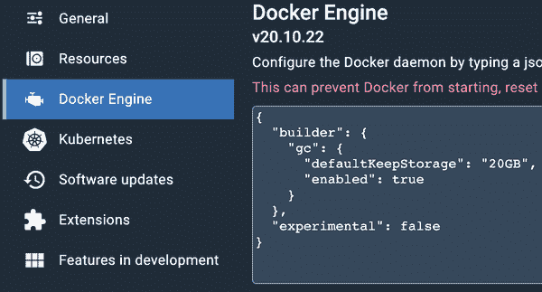

# 第三章：安装 Docker

现在，您希望大致了解 Docker 是什么以及它不是什么，现在是动手工作的时候了。让我们安装 Docker，这样我们就可以开始使用它了。安装 Docker 所需的步骤因您用于开发的平台和用于生产中托管应用程序的 Linux 发行版而异。

在本章中，我们将讨论在大多数现代桌面操作系统上设置完全可工作的 Docker 开发环境所需的步骤。首先，我们将在您的本机开发平台上安装 Docker 客户端，然后在 Linux 上运行 Docker 服务器。最后，我们将测试安装以确保其按预期工作。

虽然 Docker 客户端可以在 Windows 和 macOS 上运行以控制 Docker 服务器，但 Linux 容器只能在 Linux 系统上构建和启动。因此，非 Linux 系统需要一个虚拟机或远程服务器来托管基于 Linux 的 Docker 服务器。本章后面将讨论 Docker 社区版、Docker 桌面版和 Vagrant，它们提供了一些解决这个问题的方法。在“Windows 容器”部分，我们也会具体讨论在 Windows 系统上原生运行 Windows 容器的可能性，但本书大部分关注点将放在 Linux 容器上。

###### 注意

随着技术的发展，Docker 生态系统正在迅速变化，以变得更加强大并解决更广泛的问题。本书和其他地方讨论的一些功能可能会被弃用。要了解已标记为弃用并最终删除的功能，请参阅[文档](https://docs.docker.com/engine/deprecated)。

###### 提示

我们假设您在书中的大多数代码示例中使用传统的 Unix shell。您也可以使用 PowerShell，但请注意，某些命令可能需要调整以在该环境中运行。

如果您处于需要使用代理的环境，请确保为 Docker 正确配置了[代理](https://docs.docker.com/network/proxy)。

# Docker 客户端

Docker 客户端原生支持 64 位版本的 Linux、Windows 和 macOS。

大多数流行的 Linux 发行版可以追溯到 Debian 或 Red Hat。Debian 系统使用 deb 软件包格式和[高级包工具 (`apt`)](https://wiki.debian.org/AptCLI)来安装大多数预打包软件。另一方面，Red Hat 系统依赖于 RPM 包管理器 (`rpm`) 文件和[Yellowdog 更新程序修改版 (`yum`)](https://en.wikipedia.org/wiki/Yum_(software))，或者[Dandified `yum` (`dnf`)](https://goo.gl/TdkGRS)来安装类似的软件包。经常用于需要非常小的 Linux 占用空间的环境的 Alpine Linux，依赖于[Alpine 软件包管理器 (`apk`)](https://wiki.alpinelinux.org/wiki/Package_management)来管理软件包。

在 macOS 和 Microsoft Windows 上，本机 GUI 安装程序提供了安装和维护预打包软件的最简单方法。[macOS 上的 Homebrew](https://brew.sh) 和 [Windows 上的 Chocolatey](https://chocolatey.org) 也是技术用户中非常流行的选择。

###### 警告

在本节中，我们将讨论安装 Docker 的几种方法。请确保您在列表中选择最符合您需求的第一个。如果您不熟悉如何正确切换它们，安装多个可能会导致问题。

选择其中之一：Docker Desktop、Docker 社区版、OS 包管理器或 Vagrant。

您始终可以在 Docker 网站上找到最新的[安装文档](https://docs.docker.com/get-docker)。

## Linux

强烈建议您在首选 Linux 发行版的现代版本上运行 Docker。尽管在一些旧版本上也可以运行 Docker，但稳定性可能是一个重大问题。通常需要 3.8 或更高版本的内核，并建议您使用所选发行版的最新稳定版本。以下步骤假设您正在使用 Ubuntu 或 Fedora Linux 发行版的最新稳定版本。

###### 提示

尽管我们没有在此处详细介绍，[Linux 上的 Docker Desktop](https://docs.docker.com/desktop/linux/install) 已发布，并可以在 Linux 上使用，如果您希望在本地虚拟机上运行 Docker 守护程序，而不是直接在系统上运行。

### Ubuntu Linux 22.04 (64 位)

让我们看一下在 64 位版本的 Ubuntu Linux 22.04 上安装 Docker 所需的步骤。

###### 注意

要获取最新的指令或涵盖其他版本的 Ubuntu，请参阅[Docker 社区版适用于 Ubuntu](https://dockr.ly/2NwNbuw)。

前两个命令将确保您不在运行旧版本的 Docker。由于软件包已经多次更名，因此您需要指定几种可能性：

```
$ sudo apt-get remove docker docker.io containerd runc
$ sudo apt-get remove docker-engine
```

###### 注意

可以安全地忽略显示“无法定位软件包”或“软件包未安装”的`apt-get`错误。

接下来，您需要添加 Docker 社区版所需的软件依赖和*apt*存储库。这样可以帮助我们获取并安装 Docker 的软件包，并验证它们已签名：

```
$ sudo apt-get update
$ sudo apt-get install \
    ca-certificates \
    curl \
    gnupg \
    lsb-release
$ sudo mkdir -p /etc/apt/keyrings
$ curl -fsSL https://download.docker.com/linux/ubuntu/gpg |\
    sudo gpg --dearmor -o /etc/apt/keyrings/docker.gpg
$ sudo chmod a+r /etc/apt/keyrings/docker.gpg
$ echo \
    "deb [arch=$(dpkg --print-architecture) \
 signed-by=/etc/apt/keyrings/docker.gpg] \
 https://download.docker.com/linux/ubuntu \
 $(lsb_release -cs) stable" |\
    sudo tee /etc/apt/sources.list.d/docker.list > /dev/null
```

现在您已经设置了存储库，请运行以下命令来安装 Docker：

```
$ sudo apt-get update
$ sudo apt-get install \
    docker-ce \
    docker-ce-cli \
    containerd.io \
    docker-compose-plugin
```

假设您没有收到任何错误消息，现在 Docker 已经安装完成！

### Fedora Linux 36 (64 位)

现在让我们看一下在 64 位版本的 Fedora Linux 36 上安装 Docker 所需的步骤。

###### 注意

要获取最新的指令或涵盖其他版本的 Fedora，请参阅[Docker 社区版适用于 Fedora](https://dockr.ly/2NwNdTa)。

第一个命令将确保您不在运行旧版本的 Docker。由于在 Ubuntu 系统上，该软件包已经多次更名，因此您需要指定几种可能性：

```
$ sudo dnf remove -y \
    docker \
    docker-client \
    docker-client-latest \
    docker-common \
    docker-latest \
    docker-latest-logrotate \
    docker-logrotate \
    docker-selinux \
    docker-engine-selinux \
    docker-engine
```

接下来，您需要添加 Docker 社区版所需的软件依赖和*dnf*存储库：

```
$ sudo dnf -y install dnf-plugins-core
$ sudo dnf config-manager \
    --add-repo \
    https://download.docker.com/linux/fedora/docker-ce.repo
```

现在您可以安装当前版本的 Docker Community Edition：

```
$ sudo dnf install -y \
    docker-ce \
    docker-ce-cli \
    containerd.io \
    docker-compose-plugin
```

## macOS, Mac OS X

要在 macOS 上安装 Docker，请使用官方的 Docker Desktop 安装程序。

### 图形界面安装程序

下载[最新的 Docker Desktop for Mac 安装程序](https://dockr.ly/2wyTpCO)，然后双击下载的程序图标。按照安装程序的所有提示完成安装。Docker Desktop for macOS 依赖于[xhyve](https://github.com/machyve/xhyve)项目和 Apple 的[Hypervisor 框架](https://developer.apple.com/documentation/hypervisor)，为 Linux 服务器组件提供本地轻量级虚拟化层，这是启动能够构建 Docker 镜像和运行容器的 Linux 虚拟机所必需的。

### Homebrew 安装

您也可以使用流行的[Homebrew](https://docs.brew.sh/Installation)包管理系统在 macOS 上安装 Docker CLI 工具。如果选择这种方式，建议您考虑安装 Vagrant 以创建和管理您的 Linux VM。我们将在“基于非 Linux VM 的服务器”中稍后讨论这一点。

## Microsoft Windows 11

下面是在 Windows 11 上安装 Docker Desktop 的步骤。

###### 提示

在安装 Docker Desktop 之前，强烈建议您先设置好[Windows 子系统用于 Linux (WSL2)](https://docs.microsoft.com/en-us/windows/wsl/install)，然后在 Docker Desktop 安装程序中选择任何可用选项，以启用并默认使用 WSL2。

Docker Desktop for Windows 可利用[Hyper-V](https://oreil.ly/vt6-o)¹为 Linux 服务器组件提供本地虚拟化层，但在处理 Linux 容器时，[WSL2](https://docs.microsoft.com/en-us/windows/wsl/install)应该能为您提供最顺畅的体验。

下载[最新的 Docker Desktop for Windows 安装程序](https://dockr.ly/2C0n7H0)，然后双击下载的程序图标。按照安装程序的所有提示完成安装。

### Chocolatey 安装

您也可以使用流行的[Chocolatey](https://docs.chocolatey.org/en-us/choco/setup)包管理系统在 Windows 上安装 Docker CLI 工具。如果选择这种方式，建议您考虑安装 Vagrant 以创建和管理您的 Linux VM。我们将在“基于非 Linux VM 的服务器”中稍后讨论这一点。

###### 注意

[Docker 网站](https://docs.docker.com/engine/install)提供了其他环境的安装说明。

# Docker 服务器

Docker 服务器是与客户端分离的单独二进制文件，用于管理 Docker 典型用途的大多数工作。接下来，我们将探讨管理 Docker 服务器的最常见方式。

###### 注意

Docker Desktop 和 Docker 社区版已为您设置了服务器，因此如果您选择了这条路线，除了确保服务器（`dockerd`）正在运行外，您无需执行其他操作。在 Windows 和 macOS 上，这通常意味着启动 Docker 应用程序。在 Linux 上，您可能需要运行以下`systemctl`命令来启动服务器。

## 基于 systemd 的 Linux

当前的 Fedora 和 Ubuntu 版本使用[`systemd`](https://www.freedesktop.org/wiki/Software/systemd)来管理系统上的进程。因为您已经安装了 Docker，您可以通过键入以下内容来确保服务器在每次启动系统时启动：

```
$ sudo systemctl enable docker
```

这告诉`systemd`启用`docker`服务，并在系统启动或切换到默认运行级别时启动它。要启动 Docker 服务器，请输入以下命令：

```
$ sudo systemctl start docker
```

## 非 Linux 虚拟机服务器

如果您在 Docker 工作流中使用 Microsoft Windows 或 macOS，则需要一个虚拟机，以便您可以设置一个用于测试的 Docker 服务器。Docker Desktop 非常方便，因为它使用这些平台上的本地虚拟化技术为您设置此虚拟机。如果您运行较旧版本的 Windows 或由于其他原因无法使用 Docker Desktop，则应该考虑使用[Vagrant](https://www.vagrantup.com)来帮助您创建和管理 Docker 服务器 Linux 虚拟机。

除了使用 Vagrant 之外，您还可以根据需要选择其他虚拟化工具，如[Lima on macOS](https://github.com/lima-vm/lima)或任何标准虚拟化程序，来设置本地 Docker 服务器。

### Vagrant

Vagrant 支持多个虚拟化平台，通常可用于模拟甚至最复杂的环境。

在 Docker 开发中利用 Vagrant 的常见用例是支持在与生产环境匹配的映像上进行测试。Vagrant 支持从广泛的发行版如[Red Hat Enterprise Linux](https://www.redhat.com/en/technologies/linux-platforms/enterprise-linux)和[Ubuntu](https://ubuntu.com)到精细的原子主机发行版如[Fedora CoreOS](https://getfedora.org/en/coreos)。

您可以通过[下载一个自包含包](https://www.vagrantup.com/downloads.html)来轻松在大多数平台上安装 Vagrant。

###### 警告

此 Vagrant 示例并不安全，也不意味着推荐。相反，它只是演示了设置远程 Docker 服务器 VM 所需的基本要求。保护服务器至关重要。

在可能的情况下，使用 Docker Desktop 进行开发通常是更好的选择。

您需要在系统上完全安装一个如下所示的虚拟化程序（hypervisor）：

+   [VirtualBox](https://www.virtualbox.org/wiki/Downloads)

    +   免费提供

    +   支持大多数架构上的多平台

+   [VMware Workstation Pro/Fusion](https://oreil.ly/4uNsR)²

    +   商业软件

    +   支持大多数架构上的多平台

+   [HyperV](https://oreil.ly/agPTI)³

    +   商业软件

    +   支持大多数架构的 Windows 系统

+   [KVM](https://www.linux-kvm.org)

    +   免费提供

    +   支持大多数架构的 Linux 系统

默认情况下，Vagrant 假设你在使用 VirtualBox 虚拟化器，但你可以在使用`vagrant`命令时通过使用[`--provider`标志](https://learn.hashicorp.com/tutorials/vagrant/getting-started-providers)来更改它。

在下面的示例中，你将创建一个基于 Ubuntu 的 Docker 主机运行 Docker 守护程序。然后，你将创建一个名为*docker-host*的主机目录，并进入该目录：

```
$ mkdir docker-host
$ cd docker-host
```

为了使用 Vagrant，你需要[找到一个与你的配置工具和架构兼容的 Vagrant Box（VM 镜像）](https://app.vagrantup.com/boxes/search)。在这个例子中，我们将使用适用于 Virtual Box 虚拟化器的 Vagrant Box。

###### 注意

Virtual Box 仅在 Intel/AMD x86(64)系统上工作，我们使用的 Vagrant Box 专门为 AMD64 系统构建。

接下来，创建一个名为*Vagrantfile*的新文件，并添加以下内容：

```
puts (<<-EOT)
 -----------------------------------------------------------------
 [WARNING] This exposes an unencrypted Docker TCP port on the VM!!

 This is NOT secure and may expose your system to significant risk
 if left running and exposed to the broader network.
 -----------------------------------------------------------------

EOT

$script = <<-SCRIPT
echo \'{"hosts": ["tcp://0.0.0.0:2375", "unix:///var/run/docker.sock"]}\' | \
sudo tee /etc/docker/daemon.json
sudo mkdir -p /etc/systemd/system/docker.service.d
echo -e \"[Service]\nExecStart=\nExecStart=/usr/bin/dockerd\" | \
sudo tee /etc/systemd/system/docker.service.d/docker.conf
sudo systemctl daemon-reload
sudo systemctl restart docker
SCRIPT

Vagrant.configure(2) do |config|

  # Pick a compatible Vagrant Box
  config.vm.box = 'bento/ubuntu-20.04'

  # Install Docker if it is not already on the VM image
  config.vm.provision :docker

  # Configure Docker to listen on an unencrypted local port
  config.vm.provision "shell",
    inline: $script,
    run: "always"

  # Port-forward the Docker port to
  # 12375 (or another open port) on our host machine
  config.vm.network "forwarded_port",
    guest: 2375,
    host: 12375,
    protocol: "tcp",
    auto_correct: true

end
```

你可以通过运行以下命令来获取这个文件的完整副本：

```
$ git clone https://github.com/bluewhalebook/\
docker-up-and-running-3rd-edition.git --config core.autocrlf=input
$ cd docker-up-and-running-3rd-edition/chapter_03/vagrant
$ ls Vagrantfile
```

###### 注意

你可能需要从`git clone`命令中移除“\”，并将 URL 重新组合成单行。这是因为命令在标准打印页面上过长，只要在标准 Unix shell 中没有前导或尾随空格，这应该是有效的。

确保你在带有*Vagrantfile*的目录中，并运行以下命令来启动 Vagrant 虚拟机。

###### 警告

这个设置只是提供了一个简单的示例。它并不安全，不应在不确保服务器无法从广域网络访问的情况下保持运行。

Docker 提供了[关于如何使用 SSH 或 TLS 客户端证书保护 Docker 端点的文档](https://docs.docker.com/engine/security/protect-access)，并提供了有关[Docker 守护程序攻击面](https://docs.docker.com/engine/security/#docker-daemon-attack-surface)的额外信息。

```
$ vagrant up
…
Bringing machine 'default' up with 'virtualbox' provider…
==> default: Importing base box 'bento/ubuntu-20.04'…
==> default: Matching MAC address for NAT networking…
==> default: Checking if box 'bento/ubuntu-20.04' version '…' is up to date…
==> default: A newer version of the box 'bento/ubuntu-20.04' for provider…
==> default: available! You currently have version '…'. The latest is version
==> default: '202206.03.0'. Run `vagrant box update` to update.
==> default: Setting the name of the VM: vagrant_default_1654970697417_18732
==> default: Clearing any previously set network interfaces…
…
==> default: Running provisioner: docker…
 default: Installing Docker onto machine…
==> default: Running provisioner: shell…
 default: Running: inline script
 default: {"hosts": ["tcp://0.0.0.0:2375", "unix:///var/run/docker.sock"]}
 default: [Service]
 default: ExecStart=
 default: ExecStart=/usr/bin/dockerd
```

###### 提示

在 macOS 上，你可能会看到如下错误：

`VBoxManage: error: Details: code NS_ERROR_FAILURE (0x80004005), component MachineWrap, interface IMachine`

这是因为 macOS 的安全特性。快速搜索应该会引导你找到一个描述修复方法的[在线帖子](https://scriptcrunch.com/solved-vboxmanage-error-component-machinewrap)。

一旦虚拟机运行起来，你应该可以通过运行以下命令连接到 Docker 服务器，并告诉 Docker 客户端应该用`-H`参数连接到哪里：

```
$ docker -H 127.0.0.1:12375 version
Client:
 Cloud integration: v1.0.24
 Version:           20.10.14
 API version:       1.41
…

Server: Docker Engine - Community
 Engine:
 Version:          20.10.17
 API version:      1.41 (minimum version 1.12)
…
```

输出将为你提供有关组成 Docker 客户端和服务器的各种组件版本信息。

每次运行 Docker 命令时传递 IP 地址和端口不是理想的方式，但幸运的是，通过使用 `docker context` 命令可以设置 Docker 以了解多个 Docker 服务器。首先，让我们检查并查看当前正在使用的上下文。请注意带有星号 (*) 的条目，该条目表示当前上下文：

```
$ docker context list
NAME       TYPE … DOCKER ENDPOINT             …
default *  moby … unix:///var/run/docker.sock …
…
```

您可以为 Vagrant VM 创建一个新的上下文，然后通过运行以下一系列命令使其激活：

```
$ docker context create vagrant --docker host=tcp://127.0.0.1:12375
vagrant
Successfully created context "vagrant"

$ docker context use vagrant
vagrant
```

如果现在重新列出所有上下文，您应该会看到类似于这样的输出：

```
$ docker context list
NAME       TYPE … DOCKER ENDPOINT             …
default    moby … unix:///var/run/docker.sock …
vagrant *  moby … tcp://127.0.0.1:12375       …
…
```

在当前设置为 `vagrant` 的上下文中，运行 `docker version` 而不使用额外的 `-H` 参数仍将连接到正确的 Docker 服务器，并返回与以前相同的信息。

要连接基于 Vagrant 的虚拟机上的 shell，您可以运行以下命令：

```
$ vagrant ssh
…
Welcome to Ubuntu 20.04.3 LTS (GNU/Linux 5.4.0-91-generic x86_64)
…
vagrant@vagrant:~$ exit
```

在有时间来确保此设置安全之前，最好先关闭虚拟机并将上下文设置回原始状态：

```
$ vagrant halt
…
==> default: Attempting graceful shutdown of VM…

$ docker version
Cannot connect to … daemon at tcp://127.0.0.1:12375\. Is the … daemon running?

$ docker context use default
default
```

###### 提示

如果您使用的是 macOS，您可能想看看[Colima](https://github.com/abiosoft/colima)，它可以非常方便地启动和管理灵活的 Docker 或 Kubernetes 虚拟机。

# 测试设置

一旦您设置好工作的客户端和服务器，您就可以准备测试一切是否正常工作。您应该能够在本地系统上运行以下任一命令之一，告诉 Docker 守护进程下载该发行版的最新官方容器，然后使用运行中的 Unix shell 进程启动它。

此步骤很重要，以确保所有组件都正确安装并按预期进行通信。它展示了 Docker 的一个特性：我们可以运行基于任何喜欢的 Linux 发行版的容器。在接下来的几步中，我们将运行基于 Ubuntu、Fedora 和 Alpine Linux 的 Linux 容器。您不需要运行它们所有来证明它可行；运行其中一个就足够了。

###### 注意

如果您在 Linux 系统上使用 Docker 客户端，默认情况下可能只有*root*用户具有 Docker 访问权限，因此您可能需要在每个 `docker` 命令前加上 `sudo`。

大多数 Docker 安装会创建一个 `docker` 组，用于管理谁可以访问 `dockerd` Unix 套接字。您可以将您的用户添加到该组，以便您不再需要使用[`sudo` 命令](https://man7.org/linux/man-pages/man8/sudo.8.html)。

## Ubuntu

让我们尝试使用最新的 Ubuntu Linux 基础镜像启动容器：

```
$ docker container run --rm -ti docker.io/ubuntu:latest /bin/bash

root@aa9b72ae1fea:/#
```

###### 提示

使用 `docker container run` 的功能与使用 `docker run` 是相同的。

## Fedora

在此示例中，我们使用最新的 Fedora Linux 基础镜像启动容器：

```
$ docker container run --rm -ti docker.io/fedora:latest /bin/bash

[root@5c97201e827b /]# exit
```

## Alpine Linux

最后，我们可以测试使用最新的 Alpine Linux 基础镜像启动容器：

```
$ docker container run --rm -ti docker.io/alpine:latest /bin/sh

/ # exit
```

###### 注意

`docker.io/ubuntu:latest`、`docker.io/fedora:latest` 和 `docker.io/alpine:latest` 都表示 Docker 镜像仓库，后跟镜像名称和镜像标签。

# 探索 Docker 服务器

虽然 Docker 服务器通常会自动安装、启用和运行，但了解到[在 Linux 系统上手动运行 Docker 守护程序](https://docs.docker.com/engine/reference/commandline/dockerd)也是非常简单的，只需输入类似这样的命令：

```
$ sudo dockerd -H unix:///var/run/docker.sock \
  --config-file /etc/docker/daemon.json
```

###### 注意

本节假设你正在实际运行 Docker 守护程序的 Linux 服务器或虚拟机上。如果你在 Windows 或 Mac 上使用 Docker Desktop，你将无法轻松地与 `dockerd` 可执行文件交互，因为它是有意隐藏的，但我们马上会向你展示一个小技巧。

此命令启动 Docker 守护程序，创建并监听一个 Unix 域套接字 (`-H unix:///var/run/docker.sock`)，并从 */etc/docker/daemon.json* 中读取其余的配置。你不太可能需要自己启动 Docker 服务器，但这就是幕后发生的事情。在非 Linux 系统上，你通常会有一个托管 Docker 服务器的基于 Linux 的虚拟机。Docker Desktop 在后台为你设置了这个虚拟机。

###### 注意

如果你已经在运行 Docker，再次执行守护程序将失败，因为不能两次使用同一网络端口。

在大多数情况下，很容易通过 SSH 进入你的新 Docker 服务器并查看周围的情况，但 Docker Desktop 在非 Linux 系统上的无缝体验意味着很难意识到 Docker Desktop 正在利用本地虚拟机运行 Docker 守护程序。由于 Docker Desktop VM 设计得非常小且非常稳定，它不运行 SSH 守护程序，因此访问起来有些棘手。

如果你好奇或者确实有需要访问底层虚拟机，可以做到，但需要一些高级知识。我们稍后会详细讨论`nsenter`命令，但现在，如果你想查看虚拟机（或底层主机），可以运行以下命令：

```
$ docker container run --rm -it --privileged --pid=host debian \
  nsenter -t 1 -m -u -n -i sh

/ # cat /etc/os-release
PRETTY_NAME="Docker Desktop"

/ # ps | grep dockerd
 1540 root      1:05 /usr/local/bin/dockerd
 --containerd /var/run/desktop-containerd/containerd.sock
 --pidfile /run/desktop/docker.pid
 --swarm-default-advertise-addr=eth0
 --host-gateway-ip 192.168.65.2

/ # exit
```

此命令使用特权的 Debian 容器，其中包含 `nsenter` 命令，用于操作 Linux 内核命名空间，以便我们可以访问底层虚拟机或主机的文件系统。

###### 警告

此容器具有特权，允许我们访问底层主机，但你不应该养成在添加单个能力或系统调用权限时使用特权容器的习惯。我们将在“安全性”中进一步讨论这个问题。

如果你能使用 Docker 服务器端点，此命令将让你访问底层主机。

Docker 守护程序的配置通常存储在 */etc/docker/daemon.json* 中，但你可能会注意到在 Docker Desktop VM 中的某个地方像 */containers/services/docker/rootfs/etc/docker/daemon.json*。Docker 对所有设置使用合理的默认值，因此此文件可能非常小或者完全不存在。如果你正在使用 Docker Desktop，可以通过单击 Docker 图标并选择 Preferences… → Docker Engine，在图 3-3 中显示的方式编辑此文件。



###### 图 3-3\. Docker Desktop 服务器配置

# 总结

现在你已经有一个运行中的 Docker 设置，可以开始查看更多超出基本安装机制的内容。在下一章中，你将探索如何构建和管理 Docker 镜像，这些镜像是你使用 Docker 启动的每个容器的基础。

###### 提示

在本书的其余部分，当你在命令行上看到 `docker`，假设你需要正确的配置，无论是作为 Docker 上下文、环境变量，还是通过 `-H` 命令行标志告诉 `docker` 客户端如何连接到 `dockerd` 服务器进程。

¹ 完整网址: [*https://learn.microsoft.com/en-us/virtualization/hyper-v-on-windows/about*](https://learn.microsoft.com/en-us/virtualization/hyper-v-on-windows/about)

² 完整网址: [*https://www.vmware.com/products/workstation-pro.html*](https://www.vmware.com/products/workstation-pro.html)

³ 完整网址: [*https://docs.microsoft.com/en-us/virtualization/hyper-v-on-windows/quick-start/enable-hyper-v*](https://docs.microsoft.com/en-us/virtualization/hyper-v-on-windows/quick-start/enable-hyper-v)
