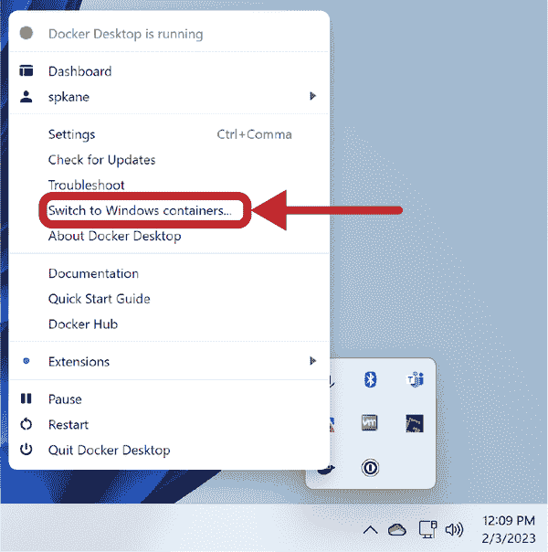
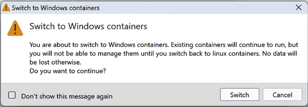

# 第五章：使用容器

在上一章中，我们学习了如何构建一个 Docker 镜像以及在容器中运行结果图像所需的基本步骤。在这一章中，我们首先将了解容器技术的历史，然后深入探讨运行容器和探索 Docker 命令的详细配置、资源和权限的内容。

# 什么是容器？

你可能对像 VMware 或 KVM 这样的虚拟化系统很熟悉，它们允许你在虚拟化层上运行完整的 Linux 内核和操作系统，通常称为*hypervisor*。这种方法提供了非常强大的工作负载隔离，因为每个虚拟机都托管着自己的操作系统内核，该内核位于硬件虚拟化层之上的一个单独的内存空间中。

容器在根本上是不同的，因为它们都共享一个单一的内核，并且工作负载之间的隔离完全在该内核中实现。这被称为*操作系统虚拟化*。

[`libcontainer` README](https://github.com/opencontainers/runc/blob/main/libcontainer/README.md) 提供了一个很好的、简短的容器定义：

> 容器是一个自包含的执行环境，它共享主机系统的内核，并且（可选地）与系统中的其他容器隔离开来。

容器的一个主要优点是资源效率，因为对于每个隔离的工作负载，你不需要一个完整的操作系统实例。由于你共享一个内核，所以在隔离的任务和底层的真实硬件之间少了一层间接。当一个进程在容器内运行时，只有一小部分代码坐落在内核中管理容器。与虚拟机相比，这有很大的不同。在虚拟机中，第二层将会运行。在虚拟机中，进程对硬件或 hypervisor 的调用将需要在处理器上特权模式之间进行两次跳转，从而明显地减慢许多调用。

###### 注

[libcontainer](https://github.com/opencontainers/runc/tree/main/libcontainer) 是一个 Go 库，旨在为应用程序提供管理 Linux 容器的标准接口。

但是容器的方法意味着你只能运行与底层内核兼容的进程。例如，与 VMware 或 KVM 等技术提供的硬件虚拟化不同，Windows 应用程序无法在 Linux 主机上的 Linux 容器中本地运行。但是，Windows 应用程序可以在 Windows 主机上的 Windows 容器中运行。因此，容器最好被视为一种特定于操作系统的技术，其中你可以运行与容器服务器的内核兼容的任何你喜欢的应用程序或守护进程。在考虑容器时，你应该尽量放弃你可能已经了解的有关虚拟机的知识，并将容器概念化为在服务器上运行的正常进程的封装。

###### 注意

除了能在虚拟机内运行容器外，完全可以在容器内运行虚拟机。如果这样做，确实可以在运行在 Linux 容器内的 Windows 虚拟机中运行 Windows 应用程序。

## 容器的历史

通常情况下，一项革命性技术往往是一个老技术终于引起关注的结果。技术发展如波浪般起伏，上世纪六十年代的一些概念如今再度流行起来。同样，Docker 是一项较新的技术，其易用性使其迅速成为热门，但它并非孤立存在。Docker 的许多基础理念源自过去三十年在几个不同领域的工作。我们可以轻松追溯容器的概念演变，从上世纪七十年代末添加到 Unix 内核的一个简单系统调用，到如今支持许多大型互联网公司如谷歌、Twitter 和 Meta 的现代容器工具。快速了解这项技术如何演进并导致 Docker 的诞生是值得的，因为理解这一点有助于将其置于你熟悉的其他技术背景中。

容器并非新概念。它们是隔离和封装正在运行系统的一部分的一种方法。在这一领域，最古老的技术包括最早的批处理系统。在使用这些早期计算机时，系统一次只能运行一个程序，直到前一个程序完成或预定义的时间段结束后，才切换到运行另一个程序。这种设计强制实现了隔离：你可以确保你的程序不会干扰其他程序，因为一次只能运行一件事。虽然现代计算机仍在不断切换任务，但对大多数用户来说，这是非常快速且完全不可察觉的。

我们认为今天容器的种子在 1979 年种下，当时在 Version 7 Unix 中加入了 `chroot` 系统调用。`chroot` 限制了进程对底层文件系统的视图，仅限于单个子树。`chroot` 系统调用通常用于保护操作系统免受像 FTP、BIND 和 Sendmail 这样的不受信任的服务器进程的影响，这些进程可能会公开暴露并易受到威胁。

在 1980 年代和 1990 年代，出于安全原因，各种 Unix 变种创建了强制访问控制。¹ 这意味着你可以在同一个 Unix 内核上运行具有严格控制域的系统。每个域中的进程对系统的视图极其有限，防止它们在域之间进行交互。一个实现了这一理念的流行商业 Unix 版本是基于 BSDI Unix 的 Sidewinder 防火墙，但大多数主流 Unix 实现无法实现这一点。

2000 年，随着 FreeBSD 4.0 的发布，引入了一个名为`jail`的新命令，旨在允许共享环境托管提供商轻松且安全地在其进程和属于每个客户的进程之间创建隔离。FreeBSD 的`jail`扩展了`chroot`的能力，并限制了进程在底层系统和其他受限进程中的操作。

2004 年，Sun 发布了 Solaris 10 的早期版本，其中包括 Solaris 容器，后来演变为 Solaris Zones。这是容器技术的第一个主要商业实现，并且今天仍然用于支持许多商业容器实现。2005 年，Virtuozzo 公司发布了用于 Linux 的 OpenVZ，随后在 2007 年 HP 发布了用于 HP-UX 的安全资源分区（后来更名为 HP-UX 容器）。

像谷歌这样的公司，必须处理广泛互联网消费和/或托管不受信任的用户代码，从 2000 年代初开始推动容器技术，以确保可靠和安全地在全球数据中心分发其应用程序。少数公司在内部使用自己维护的带有容器支持的修补过的 Linux 内核，但随着 Linux 社区内对这些特性需求的显现，谷歌将其支持容器的一些工作贡献到了主流 Linux 内核中，2008 年，在 Linux 内核的 2.6.24 版本中发布了 Linux 容器（LXC）。Linux 容器的显著增长直到 2013 年才真正开始，当时在 Linux 内核的 3.8 版本中包含了用户命名空间，并在一个月后发布了 Docker。

如今，容器几乎无处不在。Docker 和 OCI 图像提供了一个重要且不断增长的软件打包格式，用于交付到生产环境，并为许多生产系统提供基础，包括但不限于 Kubernetes 和大多数“无服务器”云技术。

###### 注意

所谓的无服务器技术实际上并不是真正的无服务器；它们只是依赖于其他人的服务器来完成工作，这样应用程序所有者就不必担心硬件和操作系统的管理。

# 创建一个容器

到目前为止，我们一直使用方便的`docker container run`命令来启动容器。但是，`docker container run`实际上是一个方便的命令，将两个单独的步骤合并为一个。它的第一步是从底层镜像创建一个容器。我们可以使用`docker container create`命令单独完成这一步。`docker container run`的第二步是执行容器，我们也可以使用`docker container start`命令单独执行这一步。

`docker container create` 和 `docker container start` 命令都包含了有关如何初始设置容器的所有选项。在 第四章 中，我们演示了使用 `docker container run` 命令可以使用 `-p/--publish` 参数将底层容器中的网络端口映射到主机上，并且可以使用 `-e/--env` 将环境变量传递到容器中。

这只是开始接触到在创建容器时可以配置的一系列事物。所以让我们看看一些 `docker` 支持的选项。

## 基本配置

让我们从探索一些告诉 Docker 在创建容器时如何配置的方式开始。

### 容器名称

当你创建一个容器时，它是从底层镜像构建的，但各种命令行参数可以影响最终的设置。在 *Dockerfile* 中指定的设置始终作为默认值使用，但你可以在创建时覆盖其中的许多设置。

默认情况下，[Docker 随机为你的容器命名](https://github.com/moby/moby/blob/master/pkg/namesgenerator/names-generator.go)，通常是将一个形容词与一个名人的名字结合起来。这样会生成诸如 *ecstatic-babbage* 和 *serene-albattani* 这样的名称。如果你想为你的容器指定一个特定的名称，可以使用 `--name` 参数：

```
$ docker container create --name="awesome-service" ubuntu:latest sleep 120
```

创建此容器后，你可以使用 `docker container start awesome-service` 启动它。它将在 120 秒后自动退出，但你可以在此之前通过运行 `docker container stop awesome-service` 停止它。我们稍后将在本章更深入地介绍每个命令。

###### 警告

在 Docker 主机上只能有一个具有特定名称的容器。如果连续两次运行上述命令，将会出错。你必须使用 `docker container rm` 删除先前的容器，或者更改新容器的名称。

### 标签

正如在 第四章 中提到的，标签是可以作为元数据应用于 Docker 镜像和容器的键/值对。当创建新的 Linux 容器时，它们会自动继承其父镜像的所有标签。

你也可以向容器添加新的标签，以便为单个容器应用可能特定于其的元数据：

```
$ docker container run --rm -d --name has-some-labels \
  -l deployer=Ahmed -l tester=Asako \
  ubuntu:latest sleep 1000
```

之后，你可以使用像 `docker container ls` 这样的命令基于这些元数据搜索和过滤容器：

```
$ docker container ls -a -f label=deployer=Ahmed
CONTAINER ID  IMAGE         COMMAND       … NAMES
845731631ba4  ubuntu:latest "sleep 1000"  … has-some-labels
```

你可以使用 `docker container inspect` 命令查看容器的所有标签：

```
$ docker container inspect has-some-labels
…
```

```
        "Labels": {
            "deployer": "Ahmed",
            "tester": "Asako"
        },
```

```
…
```

此容器运行命令 `sleep 1000`，因此在 1,000 秒后将停止运行。

### 主机名

默认情况下，当启动容器时，Docker 会将主机上的某些系统文件（包括*/etc/hostname*）复制到主机上容器的配置目录中，然后使用绑定挂载将该文件的副本链接到容器中。我们可以像这样启动一个默认容器，没有特殊配置：

```
$ docker container run --rm -ti ubuntu:latest /bin/bash
```

此命令使用`docker container run`命令，在后台运行`docker container create`和`docker container start`。由于我们希望能够与将要为演示目的创建的容器进行交互，我们传入了一些有用的参数。`--rm`参数告诉 Docker 在退出时删除容器，`-t`参数告诉 Docker 分配一个伪 TTY，`-i`参数告诉 Docker 这将是一个交互式会话，并且我们希望保持 STDIN 打开。如果镜像中没有定义`ENTRYPOINT`，那么命令中的最后一个参数将是我们希望在容器内运行的可执行文件和命令行参数，本例中是常用的`/bin/bash`。如果镜像中定义了`ENTRYPOINT`，那么最后一个参数将作为命令行参数列表传递给`ENTRYPOINT`进程的命令。

###### 注意

你可能已经注意到上一段提到了`-i`和`-t`，但命令中使用的是`-ti`参数。这背后有很多 Unix 历史可以解释为什么会这样，但如果你感兴趣，可以在网上找到一个[快速概述](https://nullprogram.com/blog/2020/08/01)。

如果现在在生成的容器中运行`mount`命令，我们将看到类似这样的结果：

```
root@ebc8cf2d8523:/# mount
overlay on / type overlay (rw,relatime,lowerdir=…,upperdir=…,workdir…)
proc on /proc type proc (rw,nosuid,nodev,noexec,relatime)
tmpfs on /dev type tmpfs (rw,nosuid,mode=755)
shm on /dev/shm type tmpfs (rw,nosuid,nodev,noexec,relatime,size=65536k)
mqueue on /dev/mqueue type mqueue (rw,nosuid,nodev,noexec,relatime)
devpts on /dev/pts type devpts (rw,nosuid,noexec,relatime,…,ptmxmode=666)
sysfs on /sys type sysfs (ro,nosuid,nodev,noexec,relatime)
/dev/sda9 on /etc/resolv.conf type ext4 (rw,relatime,data=ordered)
/dev/sda9 on /etc/hostname type ext4 (rw,relatime,data=ordered)
/dev/sda9 on /etc/hosts type ext4 (rw,relatime,data=ordered)
devpts on /dev/console type devpts (rw,nosuid,noexec,relatime,…,ptmxmode=000)
proc on /proc/sys type proc (ro,nosuid,nodev,noexec,relatime)
proc on /proc/sysrq-trigger type proc (ro,nosuid,nodev,noexec,relatime)
proc on /proc/irq type proc (ro,nosuid,nodev,noexec,relatime)
proc on /proc/bus type proc (ro,nosuid,nodev,noexec,relatime)
tmpfs on /proc/kcore type tmpfs (rw,nosuid,mode=755)
root@ebc8cf2d8523:/#
```

###### 注意

当你看到任何类似*root@hashID*的提示示例时，意味着你正在容器内运行命令，而不是在本地主机上。

有时容器将配置为使用不同的主机名（例如，在 CLI 上使用`--name`参数），但默认情况下是容器 ID 的哈希值。

使用`--user`选项可以更改容器内部使用的用户，但默认情况下将使用*root*用户。

容器中有很多绑定挂载，但在这种情况下，我们对此感兴趣：

```
/dev/sda9 on /etc/hostname type ext4 (rw,relatime,data=ordered)
```

虽然每个容器的设备编号都不同，但我们关心的部分是挂载点为*/etc/hostname*。这将容器的*/etc/hostname*链接到 Docker 为容器准备的主机名文件，默认情况下包含容器的 ID，并且没有完全合格的域名。

我们可以通过运行以下命令在容器中检查这一点：

```
root@ebc8cf2d8523:/# hostname -f
ebc8cf2d8523
root@ebc8cf2d8523:/# exit
```

###### 注意

完成后不要忘记通过`exit`命令退出容器 Shell 返回本地主机。

要特别设置主机名，我们可以使用`--hostname`参数传递更具体的值：

```
$ docker container run --rm -ti --hostname="mycontainer.example.com" \
    ubuntu:latest /bin/bash
```

然后，在容器内部，我们将看到完全合格的主机名定义如请求：

```
root@mycontainer:/# hostname -f
mycontainer.example.com
root@mycontainer:/# exit
```

### 域名服务

就像 */etc/hostname* 一样，配置域名服务（DNS）解析的 *resolv.conf* 文件是通过主机和容器之间的绑定挂载来管理的：

```
/dev/sda9 on /etc/resolv.conf type ext4 (rw,relatime,data=ordered)
```

###### 注意

您可以在 [在线](https://sslhow.com/understanding-etc-resolv-conf-file-in-linux) 找到有关 *resolve.conf* 文件的详细信息。

默认情况下，这是 Docker 主机的 *resolv.conf* 文件的精确副本。如果您不希望这样，可以在容器中使用 `--dns` 和 `--dns-search` 参数的组合来覆盖此行为：

```
$ docker container run --rm -ti --dns=8.8.8.8 --dns=8.8.4.4 \
    --dns-search=example1.com --dns-search=example2.com \
    ubuntu:latest /bin/bash
```

###### 注意

如果您希望完全不设置搜索域，那么可以使用 `--dns-search=.`。

在容器内部，您仍然会看到一个绑定挂载，但文件内容不再反映主机的 *resolv.conf*；相反，它现在看起来是这样的：

```
root@0f887071000a:/# more /etc/resolv.conf
nameserver 8.8.8.8
nameserver 8.8.4.4
search example1.com example2.com
root@0f887071000a:/# exit
```

### MAC 地址

您可以配置容器的媒体访问控制（MAC）地址，这也是另一个重要的信息。

没有任何配置时，容器将获得一个以 *02:42:ac:11* 前缀开头的计算出的 MAC 地址。

如果您需要明确将其设置为一个值，可以运行类似这样的命令：

```
$ docker container run --rm -ti --mac-address="a2:11:aa:22:bb:33" \
  ubuntu:latest /bin/bash
```

通常情况下，您不需要这样做。但有时您希望为您的容器保留一组特定的 MAC 地址，以避免与使用与 Docker 相同的私有块的其他虚拟化层冲突。

###### 警告

在自定义 MAC 地址设置时要非常小心。如果两个系统广播相同的 MAC 地址，可能会导致网络上的 ARP 冲突。如果您确实有这样的强烈需求，请尽量将本地管理的地址范围保持在一些官方范围内，例如 *x2-xx-xx-xx-xx-xx*、*x6-xx-xx-xx-xx-xx*、*xA-xx-xx-xx-xx-xx* 和 *xE-xx-xx-xx-xx-xx*（其中 *x* 是任何有效的十六进制字符）。

## 存储卷

有时，分配给容器的默认磁盘空间或容器的临时性质并不适合手头的工作，因此您需要一种可以在容器部署之间持久存在的存储。

###### 警告

通常不建议从 Docker 主机挂载存储，因为这会将您的容器与特定的 Docker 主机绑定在一起以获取其持久状态。但对于临时缓存文件或其他半临时状态的情况，这是有道理的。

在这种情况下，您可以利用 `--mount/-v` 命令将主机服务器上的目录和单个文件挂载到容器中。在 `--mount/-v` 参数中使用完全限定路径是很重要的。以下示例将 */mnt/session_data* 挂载到容器内部的 */data*：

```
$ docker container run --rm -ti \
  --mount type=bind,target=/mnt/session_data,source=/data \
  ubuntu:latest /bin/bash

root@0f887071000a:/# mount | grep data
/dev/sda9 on /data type ext4 (rw,relatime,data=ordered)
root@0f887071000a:/# exit
```

###### 提示

对于绑定挂载，您可以使用 `-v` 参数来缩短命令。在使用 `-v` 参数时，您会注意到源文件和目标文件/目录之间用冒号（:）分隔。

还需注意，默认情况下挂载的卷是读写的。您可以通过在`--mount`参数末尾添加`,readonly`或在`-v`参数末尾添加`:ro`来轻松使`docker`挂载文件或目录为只读。

```
$ docker container run --rm -ti \
  -v /mnt/session_data:/data:ro \
  ubuntu:latest /bin/bash
```

此命令正常工作时，主机挂载点和容器内的挂载点都无需预先存在。如果主机挂载点尚不存在，则将其创建为目录。如果您尝试指向文件而不是目录，则可能会遇到问题。

在挂载选项中，可以看到文件系统像预期的那样以读写方式挂载到*/data*。

如果容器应用程序设计为写入*/data*，那么这些数据将在*/mnt/session_data*中对主机文件系统可见，并且在停止此容器并使用相同卷挂载启动新容器时，这些数据仍然可用。

可以告诉 Docker，容器的根卷应该以只读方式挂载，这样容器内的进程就无法向根文件系统写入任何内容。这可以防止像日志文件这样的东西在生产环境中填满容器分配的磁盘，开发人员可能对此不了解。与挂载卷一起使用时，可以确保数据仅写入到预期位置。

在上一个示例中，我们只需在命令中添加`--read-only=true`即可实现此目的：

```
$ docker container run --rm -ti --read-only=true -v /mnt/session_data:/data \
    ubuntu:latest /bin/bash

root@df542767bc17:/# mount | grep " / "
overlay on / type overlay (ro,relatime,lowerdir=…,upperdir=…,workdir=…)
root@df542767bc17:/# mount | grep data
/dev/sda9 on /data type ext4 (rw,relatime,data=ordered)
root@df542767bc17:/# exit
```

如果仔细查看根目录的挂载选项，您会注意到它们以`ro`选项挂载，这使其为只读。但是，*/session_data*挂载仍然以`rw`选项挂载，以便我们的应用程序可以成功写入其设计为写入的一个卷。

有时需要将*/tmp*等目录设置为可写，即使容器的其余部分是只读的。对于这种用例，您可以使用`docker container run`命令中的`--mount type=tmpfs`参数，以便将*tmpfs*文件系统挂载到容器中。*tmpfs*文件系统完全存储在内存中。它们非常快，但也是临时的，并且会利用额外的系统内存。这些*tmpfs*目录中的任何数据在停止容器时都会丢失。以下示例显示使用 256 MB *tmpfs*文件系统在*/tmp*处挂载容器：

```
$ docker container run --rm -ti --read-only=true \
  --mount type=tmpfs,destination=/tmp,tmpfs-size=256M \
  ubuntu:latest /bin/bash

root@25b4f3632bbc:/# df -h /tmp
Filesystem      Size  Used Avail Use% Mounted on
tmpfs           256M     0  256M   0% /tmp
root@25b4f3632bbc:/# grep /tmp /etc/mtab
tmpfs /tmp tmpfs rw,nosuid,nodev,noexec,relatime,size=262144k 0 0
root@25b4f3632bbc:/# exit
```

###### 警告

尽可能设计容器为无状态是很重要的。管理存储会创建不必要的依赖关系，并且可以使部署场景变得更加复杂。

## 资源配额

当人们讨论在云中工作时必须经常应对的问题类型时，“喧闹的邻居”通常是问题列表中的前几位。这个术语所指的基本问题是，与您的物理系统上运行的其他应用程序相比，它们对您的性能和资源可用性可能会产生显著影响。

虚拟机的优点在于您可以轻松而且非常严格地控制分配给虚拟机的内存、CPU 等资源。当使用 Docker 时，您必须利用 Linux 内核中的 cgroup 功能来控制可用于 Linux 容器的资源。`docker container create`和`docker container run`命令直接支持在创建容器时配置 CPU、内存、交换空间和存储 I/O 限制。

###### 注意

约束通常在创建容器时应用。如果您需要更改它们，可以使用`docker container update`命令或部署一个具有调整的新容器。

这里有一个重要的警告。虽然 Docker 支持各种资源限制，但您必须在内核中启用这些功能，以便 Docker 利用它们。您可能需要在启动时将这些功能添加为命令行参数到您的内核中。要确定您的内核是否支持这些限制，请运行`docker system info`。如果您缺少任何支持，底部将会收到警告信息，例如：

```
WARNING: No swap limit support
```

###### 注意

关于为您的内核配置 cgroup 支持的详细信息因发行版而异，因此如果您需要帮助配置，请参阅[Docker 文档](https://oreil.ly/Z70ZO)³。

### CPU 份额

Docker 有几种方法可以限制容器中应用程序的 CPU 使用率。最初的方法仍然广泛使用，称为*CPU shares*。我们还将介绍其他选项。

系统中所有 CPU 核心的计算能力被视为完整的份额池。Docker 分配数字 1024 来表示完整的池。通过配置容器的 CPU 份额，您可以决定容器可以使用 CPU 的时间。如果您希望容器最多使用系统计算能力的一半，则分配 512 份额。这些不是排他性份额，这意味着将所有 1024 份额分配给一个容器并不会阻止其他所有容器运行。而是一个提示调度程序关于每次调度时每个容器应该运行多长时间的提示。如果我们有一个分配了 1024 份额（默认）的容器和两个分配了 512 份额的容器，它们将同样次数被调度。但是如果每个进程的正常 CPU 时间为 100 微秒，那么分配 512 份额的容器每次运行 50 微秒，而分配 1024 份额的容器每次运行 100 微秒。

让我们稍微探讨一下这在实践中是如何运作的。在接下来的例子中，我们将使用一个包含[`stress`命令](https://linux.die.net/man/1/stress)的新 Docker 镜像来推动系统的极限。

当我们在没有 cgroup 约束的情况下运行`stress`时，它将使用我们指定的所有资源。以下命令通过创建两个 CPU 绑定进程、一个 I/O 绑定进程和两个内存分配进程来创建大约五的负载平均数。在所有以下示例中，我们都在一个拥有两个 CPU 的系统上运行。

请注意，在以下命令中，容器映像名称之后的所有内容都与`stress`命令相关，而不是`docker`命令：

```
$ docker container run --rm -ti spkane/train-os \
  stress -v --cpu 2 --io 1 --vm 2 --vm-bytes 128M --timeout 120s
```

###### 警告

这应该是在任何现代计算机系统上运行的合理命令，但请注意，它将会对主机系统造成压力。因此，请不要在无法承受额外负载甚至可能由于资源匮乏导致的可能故障的地方执行此操作。

如果您在 Docker 主机上运行`top`或`htop`命令，在两分钟运行结束时，您可以看到由`stress`程序创建的负载对系统的影响：

```
$ top -bn1 | head -n 15
top - 20:56:36 up 3 min,  2 users,  load average: 5.03, 2.02, 0.75
Tasks:  88 total,   5 running,  83 sleeping,   0 stopped,   0 zombie
%Cpu(s): 29.8 us, 35.2 sy, 0.0 ni, 32.0 id, 0.8 wa, 1.6 hi, 0.6 si, 0.0 st
KiB Mem:   1021856 total,   270148 used,   751708 free,    42716 buffers
KiB Swap:        0 total,        0 used,        0 free.    83764 cached Mem

 PID USER      PR  NI    VIRT    RES    SHR S  %CPU %MEM     TIME+ COMMAND
 810 root      20   0    7316     96      0 R  44.3  0.0   0:49.63 stress
 813 root      20   0    7316     96      0 R  44.3  0.0   0:49.18 stress
 812 root      20   0  138392  46936    996 R  31.7  4.6   0:46.42 stress
 814 root      20   0  138392  22360    996 R  31.7  2.2   0:46.89 stress
 811 root      20   0    7316     96      0 D  25.3  0.0   0:21.34 stress
 1 root      20   0  110024   4916   3632 S   0.0  0.5   0:07.32 systemd
 2 root      20   0       0      0      0 S   0.0  0.0   0:00.04 kthreadd
 3 root      20   0       0      0      0 S   0.0  0.0   0:00.11 ksoftir…
```

###### 注意

在非 Linux 系统上使用 Docker Desktop 的用户可能会发现 Docker 已将 VM 文件系统设置为只读，并且不包含许多用于监视 VM 的实用工具。对于这些演示，您希望能够监视各种进程的资源使用情况，可以通过执行类似以下操作来解决：

```
$ docker container run --rm -it --pid=host alpine sh
/ # apk update
/ # apk add htop
/ # htop -p $(pgrep stress | tr '\n' ',')
/ # exit
```

注意，在启动`htop`时，前面的`htop`命令会报错，除非在启动`htop`时正在运行`stress`，因为`pgrep`命令不会返回任何进程。

每次运行新的`stress`实例时，您也需要退出并重新运行`htop`。

如果您想再次运行相同的`stress`命令，并且只使用半数可用的 CPU 时间，可以像这样操作：

```
$ docker container run --rm -ti --cpu-shares 512 spkane/train-os \
  stress -v --cpu 2 --io 1 --vm 2 --vm-bytes 128M --timeout 120s
```

`--cpu-shares 512`是执行魔术的标志，为该容器分配了 512 个 CPU 分享。在不是非常繁忙的系统上，可能看不到这个参数的效果。这是因为除非系统资源受到限制，否则容器在有工作要做时会继续被调度为相同的时间片长度。因此，在我们的情况下，在主机系统上运行`top`命令的结果可能看起来相同，除非您运行了更多的容器来给 CPU 其他事务处理。

###### 警告

与虚拟机不同，Docker 基于 cgroup 的 CPU 分享限制可能会产生意想不到的后果。它们不是硬限制；它们是相对限制，类似于`nice`命令。例如，一个容器被限制为一半的 CPU 分享，但在一个不是很忙碌的系统上。由于 CPU 不忙，对 CPU 分享的限制只会有限的影响，因为调度池中没有竞争。当部署第二个使用大量 CPU 的容器到同一系统时，突然间第一个容器的限制效果就会显现出来。在约束容器和分配资源时要仔细考虑这一点。

### CPU 固定

也可以将容器固定到一个或多个 CPU 核心上。这意味着此容器的工作仅在已分配给此容器的核心上调度。如果您想要在应用程序之间硬分配 CPU，或者如果您有需要固定到特定 CPU 的应用程序，比如缓存效率等，这是非常有用的。

在以下示例中，我们正在运行一个固定到两个 CPU 中的第一个 CPU 核心的 stress 容器，并设置了 512 CPU 分享：

```
$ docker container run --rm -ti \
  --cpu-shares 512 --cpuset-cpus=0 spkane/train-os \
  stress -v --cpu 2 --io 1 --vm 2 --vm-bytes 128M --timeout 120s
```

###### 警告

`--cpuset-cpus` 参数是从零开始索引的，因此您的第一个 CPU 核心是 0。如果您告诉 Docker 使用主机系统上不存在的 CPU 核心，您将收到 `Cannot start container` 错误。在一个双 CPU 示例主机上，您可以通过使用 `--cpuset-cpus=0-2` 进行测试。

如果您再次运行 `top` 命令，您应该注意到用户空间中 CPU 时间百分比（`us`）比以前低，因为我们已将两个 CPU 密集型进程限制到一个单独的 CPU 上：

```
%Cpu(s): 18.5 us, 22.0 sy, 0.0 ni, 57.6 id, 0.5 wa, 1.0 hi, 0.3 si, 0.0 st
```

###### 注意

当您使用 CPU pinning 时，容器上的额外 CPU 共享限制仅考虑运行在相同核心集上的其他容器。

使用 Linux 内核中的 CPU 完全公平调度器（CFS），您可以通过在使用 `docker container run` 启动容器时将 `--cpu-quota` 标志设置为有效值来改变给定容器的 CPU 配额。

### 简化 CPU 配额

虽然 CPU 分享是 Docker 中管理 CPU 限制的原始机制，但 Docker 自进化以来已经有了很大发展，现在它使用户生活更轻松的一种方式是极大地简化了如何设置 CPU 配额。现在，您不再需要自己尝试设置正确的 CPU 分享和配额，只需告诉 Docker 您希望容器可用多少 CPU，它将执行必要的数学运算来正确设置底层的 cgroups。

`--cpus` 命令可以设置为介于 0.01 和 Docker 服务器上 CPU 核心数之间的浮点数：

```
$ docker container run --rm -ti --cpus=".25" spkane/train-os \
  stress -v --cpu 2 --io 1 --vm 2 --vm-bytes 128M --timeout 60s
```

如果您尝试设置一个过高的值，您将收到 Docker（而不是 `stress` 应用程序）的错误消息，该消息将给出您必须使用的正确 CPU 核心范围：

```
$ docker container run --rm -ti --cpus="40.25" spkane/train-os \
  stress -v --cpu 2 --io 1 --vm 2 --vm-bytes 128M --timeout 60s
docker: Error response from daemon: Range of CPUs is from
 0.01 to 4.00, as there are only 4 CPUs available.
See 'docker container run --help'.
```

`docker container update` 命令可用于动态调整一个或多个容器的资源限制。例如，您可以同时调整两个容器的 CPU 分配，如下所示：

```
$ docker container update --cpus="1.5" 092c5dc85044 92b797f12af1
```

###### 提示

Docker 与 Linux 相同视 CPU。超线程和核心由 Linux 解释，并通过特殊文件 */proc/cpuinfo* 公开。当您在 Docker 中使用 `--cpus` 命令时，您指的是希望容器访问的此文件中的条目数，无论它们是指标准核心还是超线程核心。

### 内存

我们可以控制容器可以访问的内存量，方式与限制 CPU 类似。然而，有一个基本区别：尽管限制 CPU 只影响应用程序对 CPU 时间的优先级，但内存限制是一个*硬*限制。即使在一个没有限制的系统上，有 96 GB 的空闲内存，如果我们告诉一个容器只能访问 24 GB，那么它只能使用 24 GB，而不管系统上的空闲内存有多少。由于 Linux 上虚拟内存系统的工作方式，可以为容器分配比系统实际 RAM 更多的内存。在这种情况下，容器将像普通的 Linux 进程一样使用交换空间。

让我们通过将`--memory`选项传递给`docker container run`命令来启动一个带有内存约束的容器：

```
$ docker container run --rm -ti --memory 512m spkane/train-os \
  stress -v --cpu 2 --io 1 --vm 2 --vm-bytes 128M --timeout 10s
```

当您仅使用`--memory`选项时，您正在设置容器将访问的 RAM 和交换空间量。因此，通过在这里使用`--memory 512m`，我们将容器限制为 512 MB 的 RAM 和 512 MB 的额外交换空间。Docker 支持`b`、`k`、`m`或`g`，分别表示字节、千字节、兆字节或千兆字节。如果您的系统在某种方式下运行 Linux 和 Docker，并且具有多个 TB 的内存，则不幸的是，您将不得不以 GB 为单位指定它。

如果您希望单独设置交换空间或完全禁用它，则还需要使用`--memory-swap`选项。这定义了容器可用的总内存和交换空间量。如果我们重新运行以前的命令，如下所示：

```
$ docker container run --rm -ti --memory 512m --memory-swap=768m \
    spkane/train-os stress -v --cpu 2 --io 1 --vm 2 --vm-bytes 128M \
    --timeout 10s
```

然后我们告诉内核，此容器可以访问 512 MB 的内存和 256 MB 的额外交换空间。将`--memory-swap`选项设置为`-1`将允许容器使用底层系统上可用的所有交换空间，并且如果`--memory-swap`和`--memory`设置为相同的正值，则容器将无法访问交换空间。

###### 警告

与 CPU 份额不同，内存是一个硬限制！这很好，因为约束对容器的影响不会突然在系统部署另一个容器时显现。但这意味着您需要小心，确保限制与容器的需求紧密匹配，因为没有任何余地。内存不足的容器会导致内核表现得就像系统内存不足一样。它将尝试找到一个进程以杀死它，以便释放空间。这是一个常见的失败案例，其中容器的内存限制设置得太低。此问题的显著标志是容器退出码为 137，以及在 Docker 服务器的`dmesg`输出中看到的内核内存不足（OOM）消息。

那么，如果容器达到其内存限制会发生什么？好吧，让我们试试修改我们以前的某个命令，并显著降低内存：

```
$ docker container run --rm -ti --memory 100m spkane/train-os \
  stress -v --cpu 2 --io 1 --vm 2 --vm-bytes 128M --timeout 10s
```

虽然我们的其他`stress`容器运行结束时会显示如下一行：

```
stress: info: [17] successful run completed in 10s
```

我们看到，此次运行迅速失败，并显示类似于以下内容的行：

```
stress: FAIL: [1] (451) failed run completed in 0s
```

这是因为容器尝试分配超出允许的内存，Linux 的 OOM 杀手被调用并开始终止 cgroup 内的进程以释放内存。在此情况下，我们的容器具有一个单父进程生成了几个子进程，当 OOM 杀手终止其中一个子进程时，父进程将清理所有内容并以错误退出。

###### 警告

Docker 具有一些功能，允许您通过使用`docker container run`命令的`--oom-kill-disable`和`--oom-score-adj`参数来调整和禁用 Linux 的 OOM 杀手，但几乎不推荐用于任何用例。

如果您访问 Docker 服务器，可以通过运行`dmesg`查看与此事件相关的内核消息。输出将类似于以下内容：

```
[ 4210.403984] stress invoked oom-killer: gfp_mask=0x24000c0 …
[ 4210.404899] stress cpuset=5bfa65084931efabda59d9a70fa8e88 …
[ 4210.405951] CPU: 3 PID: 3429 Comm: stress Not tainted 4.9 …
[ 4210.406624] Hardware name:   BHYVE, BIOS 1.00 03/14/2014
…
[ 4210.408978] Call Trace:
[ 4210.409182]  [<ffffffff94438115>] ? dump_stack+0x5a/0x6f
….
[ 4210.414139]  [<ffffffff947f9cf8>] ? page_fault+0x28/0x30
[ 4210.414619] Task in /docker-ce/docker/5…3
killed as a result of limit of /docker-ce/docker/5…3
[ 4210.416640] memory: usage 102380kB, limit 102400kB, failc …
[ 4210.417236] memory+swap: usage 204800kB, limit 204800kB,  …
[ 4210.417855] kmem: usage 1180kB, limit 9007199254740988kB, …
[ 4210.418485] Memory cgroup stats for /docker-ce/docker/5…3:
cache:0KB rss:101200KB rss_huge:0KB mapped_file:0KB dirty:0KB
writeback:11472KB swap:102420KB inactive_anon:50728KB
active_anon:50472KB inactive_file:0KB active_file:0KB unevictable:0KB
…
[ 4210.426783] Memory cgroup out of memory: Kill process 3429…
[ 4210.427544] Killed process 3429 (stress) total-vm:138388kB,
anon-rss:44028kB, file-rss:900kB, shmem-rss:0kB
[ 4210.442492] oom_reaper: reaped process 3429 (stress), now
anon-rss:0kB, file-rss:0kB, shmem-rss:0kB
```

此 OOM 事件也将由 Docker 记录，并可以通过`docker system events`查看：

```
$ docker system events
2018-01-28T15:56:19.972142371-08:00 container oom \
 d0d803ce32c4e86d0aa6453512a9084a156e96860e916ffc2856fc63ad9cf88b \
 (image=spkane/train-os, name=loving_franklin)
```

### 块 I/O

许多容器只是无状态应用程序，并且不需要块 I/O 限制。但是，Docker 还通过 cgroups 机制支持几种不同的限制块 I/O 的方式。

第一种方法是对容器的块设备 I/O 使用应用一些优先级。您可以通过操纵`blkio.weight` cgroup 属性的默认设置来启用此功能。此属性可以设置为 0（禁用）或介于 10 和 1,000 之间的数字，默认为 500。此限制有点像 CPU 份额，系统将所有可用的 I/O 分割为每个 cgroup 切片内的每个进程/容器的权重总和除以 1,000，并根据分配的权重决定每个进程/容器可用的 I/O 量。

要在容器上设置此权重，您需要通过`docker container run`命令传递`--blkio-weight`参数，并指定有效值。您还可以使用`--blkio-weight-device`选项针对特定设备进行设置。

与 CPU 份额一样，实际调整权重是难以正确实现的，但通过限制容器通过其 cgroup 可用的每秒最大字节数或操作数，我们可以大大简化这一过程。以下设置使我们能够控制：

```
--device-read-bps     Limit read rate (bytes per second) from a device
--device-read-iops    Limit read rate (IO per second) from a device
--device-write-bps    Limit write rate (bytes per second) to a device
--device-write-iops   Limit write rate (IO per second) to a device
```

您可以通过运行以下一些使用 Linux I/O 测试工具[`bonnie`](https://www.coker.com.au/bonnie)的命令来测试这些对容器性能的影响：

```
$ time docker container run --rm -ti spkane/train-os:latest bonnie++ \
    -u 500:500 -d /tmp -r 1024 -s 2048 -x 1
…
real  0m27.715s
user  0m0.027s
sys   0m0.030s

$ time docker container run -ti --rm --device-write-iops /dev/vda:256 \
    spkane/train-os:latest bonnie++ -u 500:500 -d /tmp -r 1024 -s 2048 -x 1
…
real  0m58.765s
user  0m0.028s
sys   0m0.029s

$ time docker container run -ti --rm --device-write-bps /dev/vda:5mb \
    spkane/train-os:latest bonnie++ -u 500:500 -d /tmp -r 1024 -s 2048 -x 1
…
```

###### 提示

PowerShell 用户应该能够使用[`Measure-Command`](https://learn.microsoft.com/en-us/powershell/module/microsoft.powershell.utility/measure-command?view=powershell-7.3)函数来替代这些示例中使用的 Unix `time`命令。

根据我们的经验，`--device-read-iops`和`--device-write-iops`参数是设置块 I/O 限制的最有效方式，也是我们推荐的方式。

### ulimits

在 Linux cgroups 出现之前，有另一种方法可以对进程可用的资源施加限制：通过`ulimit`命令应用用户限制。这种机制仍然可用，并且对于传统上使用它的所有[用例](https://www.linuxhowtos.org/Tips%20and%20Tricks/ulimit.htm)仍然很有用。

下面的代码列出了通过设置软限制和硬限制可以通常约束的系统资源类型，通过`ulimit`命令：

```
$ ulimit -a
core file size (blocks, -c) 0
data seg size (kbytes, -d) unlimited
scheduling priority (-e) 0
file size (blocks, -f) unlimited
pending signals (-i) 5835
max locked memory (kbytes, -l) 64
max memory size (kbytes, -m) unlimited
open files (-n) 1024
pipe size (512 bytes, -p) 8
POSIX message queues (bytes, -q) 819200
real-time priority (-r) 0
stack size (kbytes, -s) 10240
cpu time (seconds, -t) unlimited
max user processes (-u) 1024
virtual memory (kbytes, -v) unlimited
file locks (-x) unlimited
```

可以配置 Docker 守护程序以应用您希望应用于每个容器的默认用户限制。以下命令告诉 Docker 守护程序以 50 个打开文件的软限制和 150 个打开文件的硬限制启动所有容器：

```
$ sudo dockerd --default-ulimit nofile=50:150
```

然后，您可以通过使用`--ulimit`参数传递值来覆盖特定容器上的这些 ulimits：

```
$ docker container run --rm -d --ulimit nofile=150:300 nginx
```

在创建容器时，还有一些其他高级命令可供使用，但这涵盖了许多更常见的用例。[Docker 客户端文档](https://dockr.ly/2ME0ygi)列出了所有可用选项，并且在每个 Docker 发布中都会更新。

# 启动容器

在深入讨论容器和约束细节之前，我们使用`docker container create`命令创建了我们的容器。该容器只是闲置在那里，没有做任何事情。有一个配置但没有运行的进程。当我们准备启动容器时，可以使用`docker container start`命令来启动。

假设我们需要运行 Redis 的副本，这是一个常见的键/值存储。我们不会对这个 Redis 容器做任何操作，但它是一个轻量级的长期运行进程，并且作为我们在实际环境中可能进行的操作的示例。我们可以首先创建容器：

```
$ docker container create -p 6379:6379 redis:2.8
Unable to find image 'redis:7.0' locally
7.0: Pulling from library/redis
3f4ca61aafcd: Pull complete
…
20bf15ad3c24: Pull complete
Digest: sha256:8184cfe57f205ab34c62bd0e9552dffeb885d2a7f82ce4295c0df344cb6f0007
Status: Downloaded newer image for redis:7.0
092c5dc850446324e4387485df7b76258fdf9ed0aedcd53a37299d35fc67a042
```

命令的结果是一些输出，其中最后一行是为容器生成的完整哈希值。我们可以使用这个长哈希来启动它，但如果我们没有记下它，我们也可以使用以下命令列出系统上的所有容器，无论它们是否正在运行：

```
$ docker container ls -a --filter ancestor=redis:2.8
CONTAINER ID IMAGE     COMMAND                CREATED        … NAMES
092c5dc85044 redis:7.0 "docker-entrypoint.s…" 46 seconds ago elegant_wright
```

我们可以通过按照我们使用的镜像过滤输出并检查容器的创建时间来确认我们容器的身份。然后，我们可以使用以下命令启动容器：

```
$ docker container start 092c5dc85044
```

###### 注意

大多数 Docker 命令将使用容器名称、完整哈希、短哈希，甚至只需要足够的哈希来使其唯一。在上一个示例中，容器的完整哈希是`092c5dc850446324e…a37299d35fc67a042`，但大多数命令输出中显示的短哈希是`092c5dc85044`。这个短哈希由完整哈希的前 12 个字符组成。在前一个示例中，运行`docker container start 6b7`也可以正常工作。

应该已经启动了容器，但由于其在后台运行，我们不一定知道是否出了问题。为了验证它是否在运行，我们可以运行以下命令：

```
$ docker container ls
CONTAINER ID  IMAGE      COMMAND                …  STATUS       …
092c5dc85044  redis:7.0  "docker-entrypoint.s…" …  Up 2 minutes …
```

然后，就是它：如预期运行。我们可以通过状态显示 `Up` 以及容器运行的时间长短来判断。

# 自动重新启动容器

在许多情况下，我们希望容器在退出后重新启动。某些容器生命周期非常短暂，快速启动和停止。但是对于生产应用程序来说，例如，您希望告诉它们运行后始终处于运行状态。如果您运行的是更复杂的系统，调度程序可能会为您执行此操作。

在简单情况下，我们可以通过将 `--restart` 参数传递给 `docker container run` 命令来告诉 Docker 代表我们管理重启。它接受四个值：`no`、`always`、`on-failure` 或 `unless-stopped`。如果将 `restart` 设置为 `no`，则容器在退出后永远不会重新启动。如果设置为 `always`，则容器在退出时将无条件重新启动，不考虑退出代码。如果 `restart` 设置为 `on-failure`，则每当容器以非零退出代码退出时，Docker 将尝试重新启动容器。如果将 `restart` 设置为 `on-failure:3`，Docker 将尝试在放弃之前重新启动容器三次。`unless-stopped` 是最常见的选择，除非通过像 `docker container stop` 这样的方式明确停止容器，否则将重新启动容器。

我们可以通过重新运行上次的内存受限压力容器（不带 `--rm` 参数，但带 `--restart` 参数）来实现此目的：

```
$ docker container run -ti --restart=on-failure:3 --memory 100m \
  spkane/train-os stress -v --cpu 2 --io 1 --vm 2 --vm-bytes 128M \
  --timeout 120s
```

在这个示例中，我们将看到第一次运行的输出在控制台上出现后再消失。如果容器死掉后立即运行 `docker container ls`，我们很可能会看到 Docker 已经重新启动了容器：

```
$ docker container ls
…  IMAGE           …  STATUS                …
…  spkane/train-os …  Up Less than a second …
```

它将继续失败，因为我们没有为其提供足够的内存以正确运行。经过三次尝试后，Docker 将放弃，我们将看到 `docker container ls` 输出中的容器消失。

# 停止容器

容器可以随时停止和启动。您可能会认为启动和停止容器类似于暂停和恢复正常进程，但实际上并非完全相同。停止时，进程不是暂停状态，而是退出状态。当容器停止时，它将不再显示在正常的 `docker container ls` 输出中。在重新启动时，Docker 将尝试启动关闭时运行的所有容器。如果需要阻止容器继续执行任何额外工作而不实际停止进程，则可以使用 `docker container pause` 和 `unpause` 暂停 Linux 容器，稍后将更详细地讨论。现在，让我们停止一下之前启动的 Redis 容器：

```
$ docker container stop 092c5dc85044
$ docker container ls
CONTAINER ID IMAGE COMMAND CREATED STATUS PORTS NAMES
```

现在我们已经停止了容器，在运行的容器列表中什么都没有了！我们可以通过容器 ID 将其重新启动，但记住这点会很不方便。因此，`docker container ls` 还有一个附加选项 `(-a)`，显示所有容器，而不仅仅是运行中的容器：

```
$ docker container ls -a
CONTAINER ID  IMAGE     STATUS                   …
092c5dc85044  redis:7.0 Exited (0) 2 minutes ago …
…
```

现在`STATUS`字段显示我们的容器以状态码 0（无错误）退出。我们可以使用相同的配置重新启动它：

```
$ docker container start 092c5dc85044
092c5dc85044

$ docker container ls -a
CONTAINER ID  IMAGE     STATUS        …
092c5dc85044  redis:7.0 Up 14 seconds …
…
```

啊，我们的容器已经重新启动并配置好了，就像之前一样。

###### 注意

请记住，即使未启动，容器作为 Docker 系统中的一块配置存在。这意味着只要容器未被删除，您可以重新启动它而无需重新创建它。尽管内存和临时文件系统（tmpfs）内容已丢失，但容器的所有其他文件系统内容和元数据，包括环境变量和端口绑定，在重新启动容器时仍然保存并将保持不变。

到目前为止，我们可能已经大谈特谈过容器只是与服务器上的任何其他进程基本相同地交互的进程树的概念。但在这里再次指出这一点是很重要的，因为这意味着我们可以向容器中的进程发送 Unix 信号，然后它们可以响应。在前面的`docker container stop`示例中，我们发送给容器一个`SIGTERM`信号，并等待容器正常退出。容器遵循与 Linux 上任何其他进程组接收到的相同的进程组信号传播。

正常情况下，`docker container stop`会发送`SIGTERM`给进程。如果你想在一定时间后强制终止容器，可以使用`-t`参数，像这样：

```
$ docker container stop -t 25 092c5dc85044
```

这告诉 Docker 首先像以前一样发送`SIGTERM`信号，但如果容器在 25 秒内未停止（默认为 10 秒），则告诉 Docker 发送`SIGKILL`信号来强制终止它。

尽管`stop`是关闭容器的最佳方式，但有时它不起作用，你需要强制结束容器，就像你可能需要对容器外的任何进程做的那样。

# 终止容器

当一个进程表现不良时，`docker container stop`可能无法解决问题。你可能希望容器立即退出。

在这些情况下，您可以使用`docker container kill`。正如您所期望的那样，它看起来与`docker container stop`非常相似：

```
$ docker container start 092c5dc85044
092c5dc85044

$ docker container kill 092c5dc85044
092c5dc85044
```

现在，`docker container ls`命令显示容器已停止运行，正如预期的那样：

```
$ docker container ls
CONTAINER ID IMAGE COMMAND CREATED STATUS PORTS NAMES
```

只因为它被杀死而不是停止，并不意味着你不能再次启动它。你可以像对待一个正常停止的容器一样，发出`docker container start`命令。有时候，你可能想向容器发送另一个信号，而不是`stop`或`kill`。与 Linux 的`kill`命令一样，`docker container kill`支持发送任何 Unix 信号。假设我们想发送一个`USR1`信号给我们的容器，告诉它执行一些像重新连接远程日志会话之类的操作。我们可以这样做：

```
$ docker container start 092c5dc85044
092c5dc85044

$ docker container kill --signal=USR1 092c5dc85044
092c5dc85044
```

如果我们的容器进程设计为使用`USR1`信号执行某些操作，现在将执行该操作。可以使用此方法向容器发送任何标准 Unix 信号。

# 暂停和取消暂停容器

有几个原因可能不希望完全停止容器。我们可能希望将其暂停，保留其分配的资源，并在进程表中保留其条目。这可能是因为我们正在对其文件系统进行快照以创建新镜像，或者只是因为我们需要主机上一些 CPU 一段时间。如果您习惯于正常的 Unix 进程处理方式，您可能会想知道这是如何工作的，因为容器化的进程只是进程。

暂停利用[cgroup freezer](https://www.kernel.org/doc/Documentation/cgroup-v1/freezer-subsystem.txt)，基本上只是阻止进程被调度，直到您取消冻结。这将防止容器执行任何操作，同时保持其整体状态，包括内存内容。与停止容器不同，停止时进程会通过`SIGSTOP`信号得知它们正在停止，而暂停容器不会向容器发送任何关于其状态变化的信息。这是一个重要的区别。几个 Docker 命令也会在内部使用暂停和取消暂停。以下是如何暂停容器：

```
$ docker container start 092c5dc85044
092c5dc85044

$ docker container pause 092c5dc85044
092c5dc85044
```

###### 注意

若要在 Windows 中暂停和取消暂停容器，必须使用 Hyper-V 或 WSL2 作为底层虚拟化技术。

如果查看正在运行的容器列表，现在可以看到 Redis 容器状态显示为`(Paused)`：

```
$ docker container ls
CONTAINER ID  IMAGE     … STATUS                  …
092c5dc85044  redis:7.0 … Up 25 seconds (Paused)  …
```

尝试在此暂停状态下使用容器将失败。它存在，但没有任何运行中的内容。现在我们可以使用`docker container unpause`命令恢复容器：

```
$ docker container unpause 092c5dc85044
092c5dc85044

$ docker container ls
CONTAINER ID  IMAGE     … STATUS        …
092c5dc85044  redis:7.0 … Up 55 seconds …
```

现在恢复运行，并且`docker container ls`正确地反映了新状态。现在它显示`Up 55 seconds`，因为即使容器处于暂停状态，Docker 仍然认为它在运行。

# 清理容器和镜像

在运行所有这些命令来构建镜像、创建容器并运行它们之后，我们在系统上积累了大量的镜像层和容器文件夹。

我们可以使用`docker container ls -a`命令列出系统上的所有容器，然后删除列表中的任何容器。在删除镜像本身之前，必须停止使用该镜像的所有容器。假设我们已经完成了这些操作，可以使用`docker container rm`命令删除它：

```
$ docker container stop 092c5dc85044
092c5dc85044ls

$ docker container rm 092c5dc85044
092c5dc85044
```

###### 注意

使用`docker container rm`命令和`-f`或`--force`标志可以删除正在运行的容器。

我们可以通过以下方式列出系统上的所有镜像：

```
$ docker image ls
REPOSITORY       TAG     IMAGE ID      CREATED       SIZE
ubuntu           latest  5ba9dab47459  3 weeks ago   188.3MB
redis            7.0     0256c63af7db  2 weeks ago   117MB
spkane/train-os  latest  78fb082a4d65  4 months ago  254MB
```

然后，我们可以通过运行以下命令来删除一个镜像及其所有相关的文件系统层：

```
$ docker image rm 0256c63af7db
```

###### 警告

如果尝试删除正在容器中使用的镜像，将会收到`Conflict, cannot delete`错误。您应该先停止和删除容器。

有时，在开发周期中特别是在完全清除系统中所有镜像或容器时，这是有意义的。运行 `docker system prune` 命令是最简单的方法：

```
$ docker system prune
WARNING! This will remove:
 - all stopped containers
 - all networks not used by at least one container
 - all dangling images
 - all build cache
Are you sure you want to continue? [y/N] y
Deleted Containers:
cbbc42acfe6cc7c2d5e6c3361003e077478c58bb062dd57a230d31bcd01f6190
…
Deleted Images:
deleted: sha256:bec6ec29e16a409af1c556bf9e6b2ec584c7fb5ffbfd7c46ec00b30bf …
untagged: spkane/squid@sha256:64fbc44666405fd1a02f0ec731e35881465fac395e7 …
…
Total reclaimed space: 1.385GB
```

###### 提示

若要删除所有未使用的镜像，而不仅仅是悬空的镜像，请尝试 `docker system prune -a`。

也可以编写更具体的命令来实现类似的目标。

若要删除 Docker 主机上的所有容器，请使用以下命令：

```
$ docker container rm $(docker container ls -a -q)
```

要删除 Docker 主机上的所有镜像，可以使用以下命令完成任务：

```
$ docker image rm $(docker images -q)
```

`docker container ls` 和 `docker images` 命令都支持 `filter` 参数，可以轻松调整删除命令以适应特定情况。

若要删除所有退出状态为非零的容器，可以使用此过滤器：

```
$ docker container rm $(docker container ls -a -q --filter 'exited!=0')
```

若要删除所有未标记的镜像，可以键入以下内容：

```
$ docker image rm $(docker images -q -f "dangling=true")
```

###### 注意

您可以阅读 [官方 Docker 文档](https://docs.docker.com/engine/reference/commandline/ps/#filtering) 来探索过滤选项。目前，可以选择的过滤器非常少，但随着时间的推移可能会增加更多过滤器。

您还可以通过使用管道（|）和其他类似技术将命令串联起来，制作自己非常创造性的过滤器。

在经常部署的生产系统中，有时会出现旧容器或未使用的镜像仍然存在并占用磁盘空间的情况。将 `docker system prune` 命令脚本化以按计划运行（例如在 `cron` 下运行或通过 `systemd` 定时器运行）可能会很有用。

# Windows 容器

到目前为止，我们完全专注于 Linux 容器的 Docker 命令，因为这是最常见的用例，并在所有 Docker 平台上都能工作。然而，自 2016 年以来，Microsoft Windows 平台已经支持运行包括本机 Windows 应用程序的 Windows 容器，并可以通过常规的 Docker 命令集进行管理。

本书不专注于 Windows 容器，因为它们在生产容器中仍然只占很小一部分，并且与 Docker 生态系统的其他部分不完全兼容，因为它们需要 Windows 特定的容器映像。然而，它们是 Docker 世界中增长和重要的一部分，所以我们将简要介绍它们的工作原理。事实上，除了容器的实际内容之外，几乎所有其他内容都与 Linux 容器相同。在本节中，我们将快速演示如何在 Windows 10+ 上通过 Hyper-V 和 Docker 运行 Windows 容器的示例。

###### 提示

要使此功能正常工作，您必须在兼容的 64 位版 Windows 10 或更高版本上使用 Docker Desktop。

您需要做的第一件事是将 Docker 从 Linux 容器切换到 Windows 容器。为此，请右键单击任务栏中的 Docker 鲸鱼图标，选择“切换到 Windows 容器…”，然后确认切换（见图 5-1 和 5-2）。



###### 图 5-1\. 切换到 Windows 容器



###### 图 5-2\. 切换到 Windows 容器确认

这个过程可能需要一些时间，尽管通常几乎是立即完成的。不幸的是，没有通知显示切换已完成。如果再次右键单击 Docker 图标，现在应该看到“切换到 Linux 容器…”替换了原始选项。

###### 注意

如果第一次右键单击 Docker 图标时，它显示“切换到 Linux 容器…”，那么你已经配置为 Windows 容器。

我们可以通过打开 [PowerShell](https://oreil.ly/SiTXP)⁴ 并尝试运行以下命令来测试一个简单的 Windows 容器：

```
PS C:\> docker container run --rm -it mcr.microsoft.com/powershell `
 pwsh -command `
 'Write-Host "Hello World from Windows `($IsWindows`)"'

Hello World from Windows (True)
```

这将下载并启动一个 [PowerShell 基础容器](https://hub.docker.com/_/microsoft-powershell)，然后使用脚本打印 `Hello World from Windows (True)` 到屏幕上。

###### 注意

如果前面命令的输出打印 `Hello World from Windows (false)`，那么你还没有切换到 Windows 容器模式，或者你正在非 Windows 平台上运行此命令。

如果你想构建一个完成大致相同任务的 Windows 容器镜像，可以创建以下的 *Dockerfile*：

```
# escape=`
FROM mcr.microsoft.com/powershell
SHELL ["pwsh", "-command"]

RUN Add-Content C:\helloworld.ps1 `
      'Write-Host "Hello World from Windows"'

CMD ["pwsh", "C:\\helloworld.ps1"]
```

当你构建这个 *Dockerfile* 时，它将基于 `mcr.microsoft.com/` `powershell` 创建镜像，创建一个小的 PowerShell 脚本，然后配置镜像以在启动容器时运行该脚本。

###### 警告

你可能注意到，在前述 *Dockerfile* 的 `CMD` 行中，我们不得不用额外的反斜杠（`\`）转义反斜杠。这是因为 Docker 的根源是 Unix，而反斜杠在 Unix shell 中有特殊意义。因此，尽管我们已经通过 [SHELL 指令](https://docs.docker.com/engine/reference/builder/#shell-form-entrypoint-example) 将 *Dockerfile* 的转义字符设置为与 PowerShell 默认使用的相匹配的字符，我们仍然需要转义一些反斜杠，以确保 Docker 不会误解它们。

如果现在构建这个 *Dockerfile*，你会看到类似于这样的结果：

```
PS C:\> docker image build -t windows-helloworld:latest .

Sending build context to Docker daemon  2.048kB
Step 1/4 : FROM mcr.microsoft.com/powershell
 ---> 7d8f821c04eb
Step 2/4 : SHELL ["pwsh", "-command"]
 ---> Using cache
 ---> 1987fb489a3d
Step 3/4 : RUN Add-Content C:\helloworld.ps1
 'Write-Host "Hello World from Windows"'
 ---> Using cache
 ---> 37df47d57bf1
Step 4/4 : CMD ["pwsh", "C:\\helloworld.ps1"]
 ---> Using cache
 ---> 03046ff628e4
Successfully built 03046ff628e4
Successfully tagged windows-helloworld:latest
```

现在，如果你运行生成的镜像，你会看到这个：

```
PS C:\> docker container run --rm -ti windows-helloworld:latest

Hello World from Windows
```

Microsoft 维护了关于 [Windows 容器的良好文档](https://oreil.ly/fYMHl)⁵，其中还包括一个 [构建启动 .NET 应用程序容器的示例](https://oreil.ly/WG2W2).⁶

###### 提示

在 Windows 平台上，还需要了解，通过在专用且非常轻量级的 Hyper-V VM 内启动容器，可以获得改进的隔离性。你只需简单地在 `docker container create` 和 `docker container run` 命令中添加 `--isolation=hyperv` 选项即可完成此操作。尽管这样做会稍微降低性能和资源效率，但显著提高了容器的隔离性。你可以在[文档](https://learn.microsoft.com/en-us/virtualization/windowscontainers/manage-containers/hyperv-container)中了解更多详情。

即使你计划主要使用 Windows 容器，在本书的其余部分中，为了确保所有示例的正常运行，请切换回 Linux 容器。阅读完毕并准备好开始构建容器后，你随时可以再次切换回来。

###### 小贴士

请记住，你可以右键点击 Docker 图标，然后选择“切换到 Linux 容器…”来重新启用 Linux 容器。

# 总结

在下一章中，我们将继续探讨 Docker 带来的内容。目前，值得进行一些自己的实验。我们建议你练习一些我们在这里介绍的容器控制命令，以便熟悉命令行选项和整体语法。现在是一个很好的时机，尝试设计和构建一个小镜像，然后将其作为新容器启动。当你准备好继续时，请前往第六章！

¹ SELinux 是当前的一种实现方式。

² 通常位于 */var/lib/docker/containers* 下。

³ 完整网址：[*https://docs.docker.com/engine/install/linux-postinstall/#your-kernel-does-not-support-cgroup-swap-limit-capabilities*](https://docs.docker.com/engine/install/linux-postinstall/#your-kernel-does-not-support-cgroup-swap-limit-capabilities)

⁴ 完整网址：[*https://learn.microsoft.com/en-us/powershell/scripting/overview?view=powershell-7.3&viewFallbackFrom=powershell-6*](https://learn.microsoft.com/en-us/powershell/scripting/overview?view=powershell-7.3&viewFallbackFrom=powershell-6)

⁵ 完整网址：[*https://learn.microsoft.com/en-us/virtualization/windowscontainers/about*](https://learn.microsoft.com/en-us/virtualization/windowscontainers/about)

⁶ 完整网址：[*https://learn.microsoft.com/en-us/virtualization/windowscontainers/quick-start/building-sample-app*](https://learn.microsoft.com/en-us/virtualization/windowscontainers/quick-start/building-sample-app)
