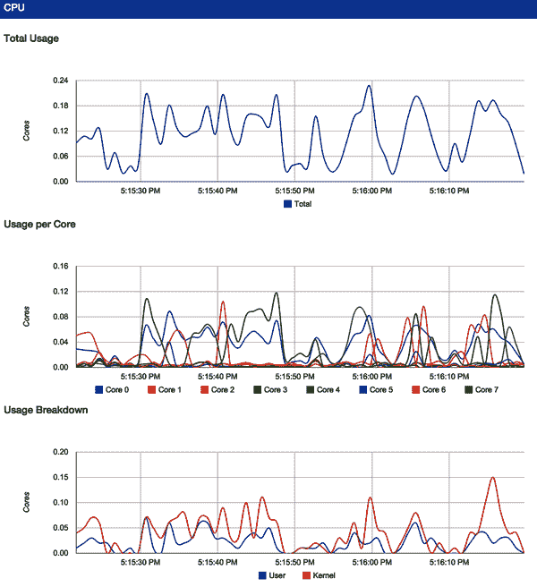
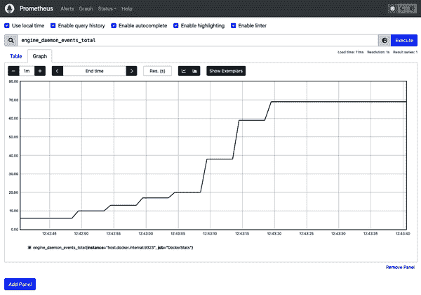

# 第六章：探索 Docker

现在您已经有了一些使用容器和镜像的经验，我们可以探索 Docker 的其他能力。在本章中，我们将继续使用 `docker` 命令行工具与您配置的运行中的 `dockerd` 服务器交互，同时介绍一些其他基本命令。

Docker 提供了几个额外的命令来轻松执行一些其他任务：

+   打印 Docker 版本

+   查看服务器信息

+   下载镜像更新

+   检查容器

+   进入运行中的容器

+   返回结果

+   查看日志

+   监控统计信息

+   还有很多其他内容……

让我们一起查看这些以及一些增强 Docker 本地功能的额外社区工具。

# 打印 Docker 版本

如果您已经完成了上一章，那么您的 Linux 服务器或虚拟机上已经安装了一个可工作的 Docker 守护程序，并且您已经启动了一个基础容器来确保一切正常运行。如果您还没有完成这些设置，并且想要尝试本书剩余部分的步骤，您需要先按照第三章中的安装步骤进行设置。

使用 Docker 最简单的事情之一是打印各个组件的版本。这听起来可能不是很重要，但这是一个有用的工具，因为 Docker 是由多个组件构建而成，它们的版本直接决定了您能够使用的功能。知道如何显示版本还将帮助您解决客户端和服务器之间某些类型的连接问题。例如，Docker 客户端可能会给您一个关于不匹配 API 版本的神秘消息，了解 Docker 版本后，您就能知道哪个组件需要更新。这个命令与远程 Docker 服务器通信，所以如果客户端因任何原因无法连接服务器，客户端将报告错误，然后仅打印客户端版本信息。如果发现您遇到连接问题，您应该重新查看上一章的步骤。

###### 注意

如果您在解决问题或者不想使用 `docker` 客户端连接到远程系统时，您可以直接登录到 Docker 服务器，并从服务器上的 shell 运行 `docker` 命令。在大多数 Docker 服务器上，这将需要 `root` 权限或者连接到 Docker 正在监听的 Unix 域套接字的 `docker` 组成员身份。

由于我们刚刚同时安装了所有 Docker 组件，当我们运行 `docker version` 时，我们应该看到所有版本都匹配：

```
$ docker version
Client:
 Cloud integration: v1.0.24
 Version:           20.10.17
 API version:       1.41
 Go version:        go1.17.11
 Git commit:        100c701
 Built:             Mon Jun  6 23:04:45 2022
 OS/Arch:           darwin/amd64
 Context:           default
 Experimental:      true

Server: Docker Desktop 4.10.1 (82475)
 Engine:
 Version:          20.10.17
 API version:      1.41 (minimum version 1.12)
 Go version:       go1.17.11
 Git commit:       a89b842
 Built:            Mon Jun  6 23:01:23 2022
 OS/Arch:          linux/amd64
 Experimental:     false
 containerd:
 Version:          1.6.6
 GitCommit:        10c12954828e7c7c9b6e0ea9b0c02b01407d3ae1
 runc:
 Version:          1.1.2
 GitCommit:        v1.1.2-0-ga916309
 docker-init:
 Version:          0.19.0
 GitCommit:        de40ad0
```

注意我们有不同部分表示客户端和服务器。在这种情况下，我们有一个匹配的客户端和服务器，因为我们刚刚一起安装它们。但是需要注意的是，这种情况并不总是如此。希望在您的生产系统中，您能够确保大多数系统运行相同版本。但是在开发环境和构建系统中，具有稍微不同版本的情况并不罕见。

API 客户端和库通常可以在大量 Docker 版本上工作，具体取决于它们所需的 API 版本。在`Server`部分中，我们可以看到当前 API 版本是 1.41，并且它将服务的最低 API 版本是 1.12。这些信息在您与第三方客户端合作时非常有用，现在您知道如何验证这些信息了。

# 服务器信息

通过 Docker 客户端，我们还可以了解很多关于 Docker 服务器的信息。稍后我们会详细讨论所有这些内容的含义，但是您可以了解到 Docker 服务器正在运行哪种文件系统后端，它的内核版本是多少，它运行的操作系统是什么，安装了哪些插件，正在使用哪种运行时，以及当前存储了多少容器和镜像。`docker system info`将为您提供类似于以下内容的信息，为了简洁起见，这里进行了缩写：

```
$ docker system info
Client:
…
 Plugins:
 buildx: Docker Buildx (Docker Inc., v0.8.2)
 compose: Docker Compose (Docker Inc., v2.6.1)
 extension: Manages Docker extensions (Docker Inc., v0.2.7)
 sbom: View the packaged-based Software Bill Of Materials (SBOM) …
 scan: Docker Scan (Docker Inc., v0.17.0)

Server:
 Containers: 11
…
 Images: 6
 Server Version: 20.10.17
 Storage Driver: overlay2
…
 Plugins:
 Volume: local
 Network: bridge host ipvlan macvlan null overlay
 Log: awslogs fluentd gcplogs gelf journald json-file local logentries …
…
 Runtimes: io.containerd.runc.v2 io.containerd.runtime.v1.linux runc
 Default Runtime: runc
…
 Kernel Version: 5.10.104-linuxkit
 Operating System: Docker Desktop
 OSType: linux
 Architecture: x86_64
…
```

根据您的 Docker 守护程序设置方式，显示可能会有所不同。不必担心这一点；这只是为了给您一个示例。在这里，我们可以看到我们的服务器是运行 5.10.104 Linux 内核和支持`overlay2`文件系统驱动的 Docker Desktop 版本。我们在服务器上还有一些镜像和容器。在全新安装时，这个数字应该是零。

这里需要指出插件的信息。它告诉我们这个 Docker 安装支持的所有内容。在刚安装时，情况看起来会差不多，这取决于 Docker 随附的新插件。Docker 本身由许多不同的插件组成，它们共同工作。这很强大，因为这意味着也可以安装社区成员贡献的其他几个插件。即使您只想确保 Docker 已识别最近添加的插件，了解安装了哪些插件也很有用。

在大多数安装中，*/var/lib/docker* 将是用于存储镜像和容器的默认根目录。如果需要更改此设置，可以编辑 Docker 启动脚本以启动守护进程，并使用`--data-root`参数指向新的存储位置。要手动测试这一点，可以运行类似以下命令：

```
$ sudo dockerd \
    -H unix:///var/run/docker.sock \
    --data-root="/data/docker"
```

###### 注意

默认情况下，[Docker 服务器的配置文件](https://oreil.ly/jp7iK)¹可以在*/etc/docker/daemon.json*中找到。我们讨论的大多数传递给`dockerd`的参数可以在这个文件中永久设置。如果你使用的是 Docker Desktop，建议你在 Docker Desktop 的用户界面中修改这个文件。

我们稍后会详细讨论运行时，但在这里你可以看到我们安装了三个运行时。`runc`运行时是默认的 Docker 运行时。如果你考虑 Linux 容器，你通常是在考虑`runc`构建的容器类型。在这台服务器上，我们还安装了`io.containerd.runc.v2`和`io.containerd.runtime.v1.linux`运行时。我们将在第十一章进一步讨论一些其他运行时。

# 下载镜像更新

我们将在以下示例中使用一个 Ubuntu 基础镜像。即使你已经拉取过`ubuntu:latest`基础镜像一次，你可以再次`pull`它，它将自动获取自上次运行以来发布的任何更新。

这是因为`latest`是一个标签，按照约定应该表示容器的最新构建版本。然而，`latest`标签备受争议，因为它并没有永久固定到特定的镜像上，并且在不同项目中可能有不同的含义。有些人使用它指向最新的稳定版本，有些人用它指向他们 CI/CD 系统产生的最后一次构建，还有些人干脆拒绝给他们的镜像打`latest`标签。尽管如此，它仍然被广泛使用，并且在预生产环境中使用它的便利性超过了真实版本提供的保证的缺失：

调用`docker image pull`看起来是这样的：

```
$ docker image pull ubuntu:latest

latest: Pulling from library/ubuntu
405f018f9d1d: Pull complete
Digest: sha256:b6b83d3c331794420340093eb706a6f152d9c1fa51b262d9bf34594887c2c7ac
Status: Downloaded newer image for ubuntu:latest
docker.io/library/ubuntu:latest
```

这个命令只会下载自上次运行命令以来发生变化的层级。根据你上次拉取镜像的时间、注册表中推送的变更以及目标镜像包含的层级数量，你可能会看到一个更长或更短的列表，甚至是一个空列表。

###### 提示

值得记住的是，即使你拉取了`latest`，Docker 也不会自动为你保持本地镜像的更新。你需要自己负责更新。然而，如果你部署了基于更新版的`ubuntu:latest`的镜像，Docker 客户端会在部署过程中下载缺失的层级，就像你期望的那样。请记住，这是 Docker 客户端的行为，其他库或 API 工具可能不会以这种方式行为。强烈建议你始终使用固定版本标签而不是`latest`标签来部署生产代码。这有助于确保你获得你期望的版本，并且没有意外的惊喜。

除了通过`latest`标签或其他版本号标签引用注册表中的项目外，你还可以通过它们的内容可寻址标签引用它们，看起来像这样：

```
sha256:b6b83d3c331794420340093eb706a6f152d9c1fa51b262d9bf34594887c2c7ac
```

这些哈希是基于镜像内容的哈希总和生成的，是非常精确的标识符。这是确保获取您期望的确切版本时，远远比版本标签更安全的方式，因为这些标签不能像版本标签那样被移动。从注册表中拉取它们的语法非常相似，但请注意标签中的 `@`：

```
$ docker image pull ubuntu@sha256:b6b83d3c331794420340093eb706a6f152d…
```

与大多数 Docker 命令不同，您可能会缩短哈希，但在这里不能使用 SHA-256 哈希。您必须使用完整的哈希。

# 检查一个容器

一旦您创建了一个容器，无论是正在运行还是没有运行，现在可以使用 `docker` 命令来查看它的配置。这通常在调试中非常有用，还提供了一些其他可以用来识别容器的信息。

作为这个例子，继续启动一个容器：

```
$ docker container run --rm -d -t ubuntu /bin/bash
3c4f916619a5dfc420396d823b42e8bd30a2f94ab5b0f42f052357a68a67309b
```

我们可以使用 `docker container ls` 列出所有正在运行的容器，以确保一切都按预期运行，并复制容器 ID：

```
$ docker container ls
CONTAINER ID  IMAGE         COMMAND     … STATUS        …  NAMES
3c4f916619a5  ubuntu:latest "/bin/bash" … Up 31 seconds …  angry_mestorf
```

在这种情况下，我们的 ID 是 `3c4f916619a5`。我们还可以使用 `angry_mestorf`，这是分配给我们的容器的动态名称。然而，许多底层工具需要唯一的容器 ID，所以养成首先查看它的习惯是很有用的。正如我们之前提到的，如显示的那样，ID 是截断（或短）版本，但 Docker 在长版本和短版本之间是可以互换使用的。与许多版本控制系统一样，这个哈希只是更长哈希的前缀。内核在内部使用一个 64 字节的哈希来标识容器。但是这对人类来说是痛苦的，所以 Docker 支持缩短的哈希。

`docker container inspect` 的输出非常详细，所以我们将在下面的代码块中精简为几个值值得注意。您应该查看完整的输出，以查看您认为有趣的其他内容：

```
$ docker container inspect 3c4f916619a5
```

```
[{
    "Id": "3c4f916619a5dfc420396d823b42e8bd30a2f94ab5b0f42f052357a68a67309b",
    "Created": "2022-07-17T17:26:53.611762541Z",
    …
    "Args": [],
    …
    "Image": "sha256:27941809078cc9b2802deb2b0bb6feed6c…7f200e24653533701ee",
    …
    "Config": {
        "Hostname": "3c4f916619a5",
        …
        "Env": [
          "PATH=/usr/local/sbin:/usr/local/bin:/usr/sbin:/usr/bin:/sbin:/bin"
        ],
        "Cmd": [
            "/bin/bash"
        ],
        …
        "Image": "ubuntu",
        …
    },
    …
}]
```

注意那个长长的 `"Id"` 字符串。那是这个容器的完整唯一标识符。幸运的是，我们可以使用短版本，即使这仍然不是特别方便。我们还可以看到容器创建的确切时间比 `docker container ls` 给出的时间要精确得多。

这里还显示了一些其他有趣的东西：容器中的顶层命令、在创建时传递给它的环境、基于的镜像以及容器内部的主机名。所有这些在容器创建时都是可配置的，如果需要的话。例如，通过环境变量传递配置给容器的通常方法，所以通过 `docker container inspect` 查看容器配置的能力，在调试时可以揭示很多信息。

您可以通过运行类似 `docker container stop 3c4f916619a5` 的命令停止当前容器。

# 探索 Shell

让我们只用一个交互式的 `bash` shell 来运行一个容器，这样我们可以四处看看。我们将像之前那样运行以下类似的内容：

```
$ docker container run --rm -it ubuntu:22.04 /bin/bash
```

这将会运行一个 Ubuntu 22.04 LTS 容器，并将 bash shell 设置为顶层进程。通过指定 `22.04` 标签，我们可以确保获得特定版本的镜像。那么，当我们启动该容器时，会运行哪些进程呢？

```
root@35fd1ad27228:/# ps -ef
UID        PID  PPID  C STIME TTY          TIME CMD
root         1     0  0 17:45 pts/0    00:00:00 /bin/bash
root         9     1  0 17:47 pts/0    00:00:00 ps -ef
```

哇，这真不多，是吧？事实证明，当我们告诉 `docker` 启动 `bash` 时，除此之外我们什么也没有得到。我们身处一个完整的 Linux 发行版镜像中，但没有其他进程会自动为我们启动。我们只得到了我们所请求的内容。在今后的操作中，记住这一点是很重要的。

###### 警告

Linux 容器默认不像完整的虚拟机那样在后台启动任何东西。它们比虚拟机轻量得多，因此不会启动 `init` 系统。当然，如果需要，你可以运行一个完整的 `init` 系统，或者内置在 Docker 中的 [`tini init` 系统](https://github.com/krallin/tini)，但你必须明确请求。我们将在第七章中更详细地讨论这个问题。

这就是我们在容器中运行 shell 的方式。随意探索并看看容器内还有什么其他有趣的东西。你可能只能使用有限的一组命令。不过，由于你位于基础的 Ubuntu 发行版中，你可以通过 `apt-get update`，然后 `apt-get install…` 来下载更多的软件包。但是这些应用程序只会存在于此容器的生命周期内。你修改的是容器的顶层层，而不是基础镜像！容器本质上是短暂的，因此你在容器内所做的任何操作都不会超出其生命周期。

当你在容器中完成操作后，确保使用 `exit` 命令退出 shell，这样容器就会自然停止：

```
root@35fd1ad27228:/# exit
```

# 返回结果

如果为了运行一个命令并获取结果而启动一个完整的虚拟机，效率会有多低呢？通常情况下，你不会希望这样做，因为这将非常耗时，并且需要启动一个完整的操作系统来执行一个简单的命令。但是 Docker 和 Linux 容器的工作方式不同于虚拟机：容器非常轻量化，不需要像操作系统那样启动。运行像是快速后台作业并等待退出代码的操作是 Linux 容器的正常用例。你可以把它看作是一种远程访问容器化系统的方式，并且可以访问容器内的任何单个命令，并能够将数据传输到其中并返回退出代码。

这在许多场景下非常有用：例如，您可能会远程运行系统健康检查，或者有一系列通过 Docker 启动以处理工作负载并返回的机器上的进程。`docker` 命令行工具会代理结果到本地机器。如果以前台模式运行远程命令并且没有指定其他操作，`docker` 将重定向其 `stdin` 到远程进程，并将远程进程的 `stdout` 和 `stderr` 输出到您的终端。要实现此功能，我们只需在前台运行命令，并在远程不分配 TTY 的情况下。这也是默认配置！不需要任何命令行选项。

当我们运行这些命令时，Docker 创建一个新的容器，在容器的命名空间和 cgroups 中执行我们请求的命令，然后删除容器，以便在调用之间不会留下任何正在运行或占用不必要的磁盘空间。以下代码应该让您对可以执行的类型有一个大致的了解：

```
$ docker container run --rm ubuntu:22.04 /bin/false
$ echo $?
1
```

```
$ docker container run --rm ubuntu:22.04 /bin/true
$ echo $?
0
```

```
$ docker container run --rm ubuntu:22.04 /bin/cat /etc/passwd

root:x:0:0:root:/root:/bin/bash
daemon:x:1:1:daemon:/usr/sbin:/usr/sbin/nologin
…
nobody:x:65534:65534:nobody:/nonexistent:/usr/sbin/nologin
_apt:x:100:65534::/nonexistent:/usr/sbin/nologin

$ docker container run --rm ubuntu:22.04 /bin/cat /etc/passwd | wc -l

19
```

在这里，我们在远程服务器上执行了 `/bin/false`，它将始终以 `1` 的状态退出。请注意 `docker` 如何将该结果代理到我们的本地终端。为了证明它返回其他结果，我们还运行了 `/bin/true`，它将始终返回 `0`。就是这样。

然后我们实际上要求 `docker` 在远程容器上运行 `cat /etc/passwd`。我们得到的是包含在该容器文件系统中 */etc/passwd* 文件的打印输出。因为这只是标准输出的常规输出，我们可以像处理其他任何东西一样将其管道传递到本地命令中。

###### 警告

前面的代码将输出通过管道传递给本地的 `wc` 命令，而不是容器中的 `wc` 命令。管道本身不会传递到容器中。如果您想将整个命令（包括管道）传递到服务器端，您需要在远程端调用一个完整的 shell 并传递带引号的命令，如 `bash -c "<your command> | <something else>"`。在前面的代码中，这将是 `docker container run ubuntu:22.04 /bin/` `bash -c "` `/bin/cat /etc/passwd | wc -l"`。

# 进入运行中的容器

您可以很容易地在基于几乎任何镜像的新容器中运行 shell，就像我们之前使用 `docker container run` 所演示的那样。但是，在已经运行您的应用程序的现有容器内部获取新的 shell 并不相同。每次使用 `docker container run`，都会得到一个新的容器。但是，如果您有一个正在运行应用程序的现有容器，并且需要从容器内部调试它，您需要其他方法。

使用 `docker container exec` 是 Docker 的本地方式在容器中获取新的交互式进程，但还有一种更适合 Linux 的方式，称为 `nsenter`。我们将在本节中查看 `docker container exec`，稍后在 `nsenter` 中介绍 `nsenter`。

###### 注意

你可能会想知道为什么要这样做。在开发中，当你积极地构建和测试你的应用程序时，这是非常有用的。这是[开发容器](https://containers.dev)在像[Visual Studio Code](https://code.visualstudio.com/docs/devcontainers/containers)这样的 IDE 中使用的机制。

在生产环境中，SSH 登录到生产服务器并不被认为是一个好的做法，这大致相同；但在某些情况下，看看实际环境内发生了什么非常重要，这时可以帮助你解决问题。

## docker container exec

首先，让我们看看最简单和最佳的进入运行中容器的方法。`dockerd`服务器和`docker`命令行工具支持通过`docker container exec`命令在运行中的容器中远程执行新进程。因此，让我们在后台模式下启动一个容器，然后使用`docker container exec`进入它并调用一个 shell。

你调用的命令不一定要是一个 shell：可以在容器内运行单独的命令，并在容器外查看它们的结果，使用`docker container exec`。但如果你想进入容器查看情况，shell 是最简单的方法。

要运行`docker container exec`，我们需要我们容器的 ID。对于这个演示，让我们创建一个只运行`sleep`命令 600 秒的容器：

```
$ docker container run -d --rm  ubuntu:22.04 sleep 600
9f09ac4bcaa0f201e31895b15b479d2c82c30387cf2c8a46e487908d9c285eff
```

这个容器的短 ID 是`9f09ac4bcaa0`。现在我们可以使用它来使用`docker container exec`进入容器。这个命令行，毫不奇怪地，看起来非常像`docker container run`的命令行。我们请求一个交互式会话和一个伪终端，使用`-i`和`-t`标志：

```
$ docker container exec -it 9f09ac4bcaa0 /bin/bash
root@9f09ac4bcaa0:/#
```

请注意，我们得到了一个命令行回显，告诉我们我们正在运行的容器的 ID。这对于跟踪我们所在位置非常有用。现在我们可以运行一个普通的 Linux `ps`命令，看看我们的容器内还有什么正在运行。我们应该能看到在容器最初启动时创建的`sleep`进程：

```
root@9f09ac4bcaa0:/# ps -ef
UID        PID  PPID  C STIME TTY          TIME CMD
root         1     0  0 20:22 ?        00:00:00 sleep 600
root         7     0  0 20:23 pts/0    00:00:00 /bin/bash
root        15     7  0 20:23 pts/0    00:00:00 ps -ef
```

当完成时，键入`exit`以退出容器。

###### 警告

你也可以通过`docker container exec`在后台运行额外的进程。你可以像使用`docker container run`一样使用`-d`选项。但是除了调试之外，你应该仔细考虑这样做，因为这会导致镜像部署的可重复性丧失。其他人将不得不知道如何通过`docker container exec`传递参数以获得所需的功能。如果你想这样做，重建容器镜像以可重复地启动这两个进程可能会带来更大的收益。如果需要通知容器内的软件执行某些操作，比如旋转日志或重新加载配置，最好使用`docker container kill -s <SIGNAL>`与标准 Unix 信号名称传递信息给容器内的进程。

## docker volume

Docker 支持一个 `volume` 子命令，可以列出存储在根目录中的所有卷，然后发现关于它们的附加信息，包括它们在服务器上物理存储的位置。

这些卷不是绑定挂载的；相反，它们是提供一种持久化数据的有用方法的特殊数据容器。

如果我们运行一个普通的 `docker` 命令来绑定挂载一个目录，我们会注意到它不会创建任何 Docker 卷：

```
$ docker volume ls
DRIVER              VOLUME NAME

$ docker container run --rm -d -v /tmp:/tmp ubuntu:latest sleep 120
6fc97c50fb888054e2d01f0a93ab3b3db172b2cd402fc1cd616858b2b5138857

$ docker volume ls
DRIVER              VOLUME NAME
```

但是，您可以轻松地通过类似这样的命令创建一个新的卷：

```
$ docker volume create my-data
```

如果然后列出所有的卷，您应该会看到类似这样的内容：

```
$ docker volume ls

DRIVER              VOLUME NAME
local               my-data

$ docker volume inspect my-data
```

```
[
    {
        "CreatedAt": "2022-07-31T16:19:42Z",
        "Driver": "local",
        "Labels": {},
        "Mountpoint": "/var/lib/docker/volumes/my-data/_data",
        "Name": "my-data",
        "Options": {},
        "Scope": "local"
    }
]
```

现在，您可以通过运行以下命令启动一个附加了此数据卷的容器：

```
 $ docker container run --rm \
     --mount source=my-data,target=/app \
     ubuntu:latest touch /app/my-persistent-data
```

该容器在数据卷中创建了一个文件，然后立即退出。

如果我们现在将该数据卷挂载到另一个容器，我们将看到我们的数据仍然存在：

```
$ docker container run --rm \
    --mount source=my-data,target=/app \
    fedora:latest ls -lFa /app/my-persistent-data

-rw-r--r-- 1 root root 0 Jul 31 16:24 /app/my-persistent-data
```

最后，当您完成时，可以通过运行以下命令删除数据卷：

```
$ docker volume rm my-data

my-data
```

###### 注意

如果您尝试删除一个被容器使用的卷（无论它是正在运行还是未运行），您将会收到如下错误：

```
Error response from daemon: unable to remove volume:
    remove my-data: volume is in use - [
    d0763e6e8d79e55850a1d3ab21e9d…,
    4b40d52978ea5e784e66ddca8bc22…]
```

这些命令应该帮助您详细探索您的容器。一旦我们在第十一章中更详细地解释了命名空间，您将更好地理解所有这些部分如何交互和组合以创建一个容器。

# 日志记录

日志记录是任何生产应用程序的关键部分。当出现问题时，日志可以是恢复服务的关键工具，因此需要做好。有一些常见的方式，我们期望在 Linux 系统上与应用程序日志交互，有些更好，有些不如。如果您在一台机器上运行应用程序进程，您可能期望输出被记录到一个本地日志文件中，您可以通过它来阅读。或者也许您期望输出简单地记录到内核缓冲区中，从那里可以读取 `dmesg`。或者，就像许多现代 Linux 发行版中使用 `systemd` 一样，您可能期望从 `journalctl` 中获取日志。由于容器的限制以及 Docker 的构造方式，如果没有您的一些配置，这些方式都不会起作用。但这没关系，因为日志记录在 Docker 中有一流的支持。

Docker 在几个关键方面使日志记录变得更加简单。首先，它捕获了容器中应用程序的所有普通文本输出。任何发送到容器中的 `stdout` 或 `stderr` 的内容都会被 Docker 守护程序捕获，并流式传输到可配置的日志后端。其次，像 Docker 的许多其他部分一样，这个系统是可插拔的，有许多强大的选项作为插件供您选择。但是，让我们暂时不要深入讨论。

## docker container logs

我们将从最简单的 Docker 使用案例开始：默认的日志记录机制。虽然这种机制有一些限制，我们马上会解释，但对于大多数常见的用例，它工作得很好，并且非常方便。如果您在开发中使用 Docker，这可能是您唯一使用的日志策略。此日志方法从一开始就存在，并且得到了很好的理解和支持。该机制是 `json-file` 方法。`docker container logs` 命令向大多数用户公开了这一点。

顾名思义，当您运行默认的 `json-file` 日志插件时，Docker 守护程序将您的应用程序日志流式传输到每个容器的一个 JSON 文件中。这使我们可以随时检索任何容器的日志。

我们可以通过启动 `nginx` 容器来显示一些日志：

```
$ docker container run --rm -d --name nginx-test --rm nginx:latest
```

然后：

```
$ docker container logs nginx-test
…
2022/07/31 16:36:05 [notice] 1#1: using the "epoll" event method
2022/07/31 16:36:05 [notice] 1#1: nginx/1.23.1
2022/07/31 16:36:05 [notice] 1#1: built by gcc 10.2.1 20210110 (Debian 10.2.1-6)
2022/07/31 16:36:05 [notice] 1#1: OS: Linux 5.10.104-linuxkit
…
```

这很好，因为 Docker 允许您随时从命令行远程获取日志。这对低容量日志记录非常有用。

###### 注意

要将日志输出限制为更近期的日志，请使用 `--since` 选项，仅显示指定 RFC 3339 日期（例如，2002-10-02T10:00:00-05:00）、Unix 时间戳（例如，1450071961）、标准时间戳（例如，20220731）或 Go 时长字符串（例如，5m45s）。您还可以使用 `--tail` 后跟您希望追踪的行数。

支持此日志的实际文件位于 Docker 服务器本身，默认情况下在 */var/lib/docker/containers/`<container_id>`/*，其中 `*<container_id>*` 将被实际的容器 ID 替换。如果您查看名为 `*<container_id>*-json.log` 的文件，您将看到它是一个每行代表一个 JSON 对象的文件。它看起来会像这样：

```
{"log":"2022/07/31 16:36:05 [notice] 1#1: using the \"epoll\" event method\n",
  "stream":"stderr","time":"2022-07-31T16:36:05.189234362Z"}
```

那个 `log` 字段就是发送到所讨论进程的 `stdout` 的内容；`stream` 字段告诉我们这是 `stdout` 而不是 `stderr`，Docker 守护程序接收到它的精确时间在 `time` 字段中提供。这是一种不常见的日志格式，但它是结构化的而不是原始流，如果以后要对日志做任何处理，则非常有益。

就像日志文件一样，您也可以使用 `docker container logs -f` 实时追踪 Docker 日志：

```
$ docker container logs -f nginx-test
…
2022/07/31 16:36:05 [notice] 1#1: start worker process 35
2022/07/31 16:36:05 [notice] 1#1: start worker process 36
2022/07/31 16:36:05 [notice] 1#1: start worker process 37
2022/07/31 16:36:05 [notice] 1#1: start worker process 38
```

这看起来与通常的 `docker container logs` 没什么两样，但客户端会继续等待并显示从服务器接收到的新消息，就像 Linux 命令行中的 `tail -f`。您可以随时键入 Ctrl-C 退出日志流：

```
---
$ docker container stop nginx-test
---
```

###### 提示

通过配置类似于 `--log-opt tag="{{.ImageName}}/{{.ID}}"` 的标签日志选项，可以将默认的日志标签（每行日志都以此标签开头）更改为更有用的内容。默认情况下，Docker 日志将以容器 ID 的前 12 个字符作为标签。

对于单主机日志记录，这种机制效果相当不错。它的缺点在于日志轮转、一旦轮转后远程访问日志、以及高容量日志的磁盘空间使用。尽管是由 JSON 文件支持，但如果这种解决方案适合你，大多数生产应用程序可以使用这种方式记录日志。但是，如果你有一个更复杂的环境，你可能需要更强大和具有集中日志功能的解决方案。

###### 警告

默认设置中，`dockerd` 不会自动启用日志轮转。如果在生产环境中运行，建议通过命令行或者 *daemon.json* 配置文件指定 `--log-opt` `max-size` 和 `--log-opt` `max-file` 设置。这些设置分别限制了日志轮转前的最大文件大小和要保留的日志文件的最大数量。除非你同时设置了 `max-size` 来告诉 Docker 何时轮转日志，否则 `max-file` 是无效的。启用后，`docker container logs` 机制将仅返回当前日志文件中的数据。

## 更高级的日志记录

在默认机制不足以应对的情况下（在大规模使用时，可能会出现这种情况），Docker 还支持可配置的日志后端。这些插件列表正在不断增加。目前支持的包括我们早些描述的 `json-file`，以及 `syslog`、`fluentd`、`journald`、`gelf`、`awslogs`、`splunk`、`gcplogs`、`local` 和 `logentries`，它们用于将日志发送到各种流行的日志框架和服务。

这里列出了一个庞大的插件列表。目前支持的最简单的选项，用于在大规模上运行 Docker，是直接将容器日志通过 `syslog` 发送。你可以在 Docker 命令行中使用 `--log-driver=syslog` 选项指定它，或者在 *daemon.json* 文件中为所有容器设置为默认值。

###### 提示

*daemon.json* 文件是 `dockerd` 服务器的配置文件。通常可以在服务器的 */etc/docker/* 目录中找到这个文件。对于 Docker Desktop 用户，可以在 UI 的 Preferences → Docker Engine 中编辑此文件。如果更改了此文件，需要重新启动 Docker Desktop 或 `dockerd` 守护进程。

同样有几个第三方插件可用。我们从第三方插件中看到了不同的结果，主要是因为它们使 Docker 的安装和维护变得复杂。但是，你可能会发现有一个适合你系统的第三方实现，值得安装和维护的麻烦。

###### 警告

所有日志驱动程序都适用一些注意事项。例如，Docker 一次只能支持一个日志驱动程序。这意味着你可以使用 `syslog` 或 `gelf` 日志驱动程序，但不能与 `json-file` 驱动程序同时使用。除非你运行 `json-file` 或 `journald`，否则将失去使用 `docker container logs` 命令的能力！这可能会出乎意料，并且在更改驱动程序时是一个重要的考虑因素。

一些插件设计用于将日志发送到远程端点，并保留本地的 JSON 复制以供 `docker container logs` 命令使用，但您需要确定要使用的插件是否支持此功能。对于每个驱动程序来说，要注意很多潜在问题，但您应该牢记日志的可靠传递与可能破坏 Docker 部署之间的权衡。建议使用基于 UDP 的解决方案或其他非阻塞选项。

传统上，大多数 Linux 系统都有某种形式的 syslog 接收器，无论是 `syslog`、`rsyslog` 还是其他许多选项。这种协议以其各种形式已存在很长时间，并且在大多数部署中得到了相当好的支持。从传统的 Linux 或 Unix 环境迁移到 Docker 时，许多公司已经拥有 syslog 基础设施，这通常也是最简单的迁移路径。

###### 注意

许多较新的 Linux 发行版基于 `systemd` 初始化系统，因此默认使用 `journald` 进行日志记录，这与 `syslog` 不同。

尽管 syslog 是一种传统解决方案，但它也存在问题。Docker syslog 驱动支持 TLS、TCP 和 UDP 连接选项，听起来很不错，但您应该对通过 TCP 或 TLS 从 Docker 流式传输日志到远程日志服务器持谨慎态度。问题在于它们都在基于连接的 TCP 会话之上运行，并且 Docker 尝试在容器启动时连接到远程日志服务器。如果连接失败，它将阻塞容器启动。如果您将其作为默认的日志记录机制运行，这可能随时影响到任何部署。

这对生产系统来说并不是特别可用的状态，因此建议如果打算使用 `syslog` 驱动，则使用 UDP 选项进行 syslog 日志记录。这意味着您的日志不会加密，并且不能保证传递。关于日志记录有各种哲学观点，您需要在日志需求与系统可靠性之间取得平衡。我们倾向于建议在可靠性方面出错，但如果您在安全审计环境中运行，则可能有不同的优先级。

###### 提示

您可以通过设置类似于 `--log-opt syslog-address=udp://192.168.42.42:123` 的日志选项 `syslog-address`，直接将日志记录到单个容器的远程 syslog 兼容服务器。

关于大多数日志插件需要注意的最后一个警告是：它们默认是阻塞的，这意味着日志回压可能会影响您的应用程序。您可以通过设置`--log-opt mode=non-blocking`来更改此行为，然后设置日志的最大缓冲区大小为`--log-opt max-buffer-size=4m`之类的值。一旦设置了这些参数，当缓冲区填满时，应用程序将不再阻塞。相反，内存中最旧的日志行将被丢弃。同样，可靠性需要与您的业务需要接收所有日志进行权衡。

###### 警告

一些第三方库和程序会因各种（有时是意外的）原因写入文件系统。如果您试图设计不直接向容器文件系统写入的清洁容器，则应考虑使用我们在第四章讨论的`--read-only`和`--mount type=tmpfs`选项来运行`docker container`。不推荐在容器内部写入日志。这使得日志难以获取，阻止它们在容器生命周期之外被保留，并且可能会对 Docker 文件系统后端造成严重影响。

# 监控 Docker

对于生产系统来说，最重要的要求之一是它们必须是可观察和可测量的。如果你对系统行为一无所知，那么这样的生产系统将无法为你服务。在现代运维环境中，我们希望监控所有有意义的事物，并尽可能报告尽可能多的有用统计信息。Docker 支持容器健康检查，并通过`docker container stats`和`docker system events`提供一些基本的报告功能。我们将会展示这些功能，然后看看来自 Google 的社区提供的一些漂亮的图形输出，然后我们将查看 Docker 的一个当前实验性特性，该特性将容器指标导出到 Prometheus 监控系统中。

## 容器统计信息

让我们从 Docker 自带的 CLI 工具开始。`docker` CLI 具有一个端点，用于查看运行容器的重要统计信息。这个命令行工具可以从该端点流式传输，并每隔几秒报告一次一个或多个列出的容器的基本统计信息，显示正在发生的事情。`docker container stats`类似于 Linux 的`top`命令，接管当前终端并更新屏幕上的相同行以显示当前信息。这很难在打印中显示，所以我们只给出一个例子，但默认情况下每隔几秒更新一次。

### 命令行统计信息

启动一个活动容器：

```
$ docker container run --rm -d --name stress \
    docker.io/spkane/train-os:latest \
    stress -v --cpu 2 --io 1 --vm 2 --vm-bytes 128M --timeout 60s
```

然后运行`stats`命令查看新容器：

```
$ docker container stats stress
CONTAINER ID NAME   CPU %   MEM USAGE/LIMIT   MEM % NET I/O   BLOCK I/O PIDS
1a9f52f0855f stress 476.50% 36.09MiB/7.773GiB 0.45% 1.05kB/0B 0B/0B     6
```

您可以随时输入 Ctrl-C 退出`stats`流。

###### 提示

您可以使用`--no-stream`选项获取一个单点时间的统计信息集，该选项不会更新，并在命令完成后将您返回到命令行。

让我们把这个相当密集的输出分解成几个易于处理的部分。我们有以下内容：

+   容器的 ID（但不包括名称）。

+   它当前消耗的 CPU 量。百分之百相当于一个完整的 CPU 核心。

+   它正在使用的内存量，以及它被允许使用的最大量。

+   网络和块 I/O 统计。

+   容器内部活跃进程的数量。

其中一些对于调试来说会比其他的更有用，所以让我们看看你可以用它们做些什么。

这里更有帮助的一个输出部分是内存使用百分比与为容器设置的限制之间的比例。运行生产容器时的一个常见问题是过于激进的内存限制可能导致 Linux 内核的 OOM 杀手一遍又一遍地停止容器。`stats` 命令可以帮助你识别和解决这类问题。

关于 I/O 统计，如果你将所有应用程序都运行在容器中，那么这个摘要可以非常清楚地显示系统的 I/O 流向何处。在容器出现之前，这个任务要困难得多！

容器内部活跃进程的数量也有助于调试。如果你有一个应用程序在生成子进程但没有清理它们，这很快就能暴露出来。

`docker container stats` 的一个很棒的特性是它可以在单个摘要中展示所有容器，而不仅仅是一个。即使在你认为你了解它们在做什么的主机上，这可能会非常具有启发性。

这一切都非常有用且易于理解，因为它是以人类可读的方式格式化并在命令行上可用。但是 Docker API 上还有一个额外的端点提供的信息比客户端显示的要多得多。到目前为止，我们在本书中避免直接使用 API，但在这种情况下，API 提供的数据比客户端更丰富，所以我们将使用 `curl` 发送一个 API 请求来看看我们的容器在做什么。它不像阅读起来那么美好，但是提供了更多的详细信息。

###### 注意

记住，`docker` 客户端可以做的基本上所有事情都可以直接通过 Docker API 完成。这意味着如果有需要，你可以在你的应用程序中以编程方式做非常类似的事情。

“统计 API 端点” 中的例子是直接调用 API 的一个很好的介绍。

### 统计 API 端点

我们将在 API 上命中的 `/stats/` 端点会继续向我们流式传输统计信息，只要我们保持连接打开。由于作为人类我们不容易解析 JSON，我们只会请求一行，然后使用工具 `jq` 来“漂亮打印”它。为了使此命令正常工作，你需要安装 `jq`（版本 2.6 或更高）。如果你没有安装 `jq`，但仍然想看到 JSON 输出，可以跳过到 `jq` 的管道，但会得到简单且难看的 JSON。如果你已经有一个喜欢的 JSON 美化打印程序，随意使用那个代替。

大多数 Docker 守护程序只会在 Unix 域套接字上提供 API，而不会在 TCP 上发布。因此，我们将从 Docker 服务器主机本身使用`curl`调用 API。如果您计划在生产环境中监视此端点，您需要在 TCP 端口上公开 Docker API。这不是我们推荐的做法，但[Docker 文档](https://dockr.ly/2Lzuox2)会指导您完成这一步骤。

###### 注意

如果您不在 Docker 服务器上或者在本地使用 Docker Desktop，您可能需要检查`DOCKER_HOST`环境变量的内容，使用类似`echo $DOCKER_HOST`的命令，以发现您正在使用的 Docker 服务器的主机名或 IP 地址。

首先，启动一个容器，您可以从中读取统计信息：

```
$ docker container run --rm -d --name stress \
    docker.io/spkane/train-os:latest \
    stress -v --cpu 2 --io 1 --vm 2 --vm-bytes 128M --timeout 60s
```

现在容器正在运行，您可以通过运行类似`curl`加上您容器的名称或哈希来获取有关容器的 JSON 格式的持续统计信息流。

###### 注意

在以下示例中，我们正在针对 Docker 套接字运行`curl`，但如果可用的话，您也可以轻松地针对 Docker 端口运行它。

```
$ curl --no-buffer -XGET --unix-socket /var/run/docker.sock \
    http://docker/containers/stress/stats
```

###### 注意

这个 JSON 统计流不会自行停止。因此，现在我们可以使用 Ctrl-C 键组合来停止它。

要获取一组统计信息，我们可以运行类似于这样的命令：

```
$ curl -s -XGET --unix-socket /var/run/docker.sock \
    http://docker/containers/stress/stats | head -n 1 | jq
```

最后，如果我们有[jq](https://stedolan.github.io/jq)或另一个能够漂亮打印 JSON 的工具，我们可以使这个输出变得人类可读，如下所示：

```
$ curl -s -XGET --unix-socket /var/run/docker.sock \
    http://docker/containers/stress/stats | head -n 1 | jq
```

```
{
  "read": "2022-07-31T17:41:59.10594836Z",
  "preread": "0001-01-01T00:00:00Z",
  "pids_stats": {
    "current": 6,
    "limit": 18446744073709552000
  },
  "blkio_stats": {
    "io_service_bytes_recursive": [
      {
        "major": 254,
        "minor": 0,
        "op": "read",
        "value": 0
      },
…
    ]
  },
  "num_procs": 0,
  "storage_stats": {},
  "cpu_stats": {
    "cpu_usage": {
      "total_usage": 101883204000,
      "usage_in_kernelmode": 43818021000,
      "usage_in_usermode": 58065183000
…
    },
  },
  "memory_stats": {
    "usage": 183717888,
    "stats": {
      "active_anon": 0,
      "active_file": 0,
…
    },
    "limit": 8346021888
  },
  "name": "/stress",
  "id": "9be7c9de26864ac97e07fc3d8e3ffb5bb52cc2ba49f569d4ba8d407f8747851f",
  "networks": {
    "eth0": {
      "rx_bytes": 1046,
      "rx_packets": 9,
…
    }
  }
}
```

其中包含*大量*的信息。我们已经削减了内容，以防止浪费任何不必要的树木或电子，但即便如此，仍有很多需要消化的内容。主要思想是让您看到 API 关于每个容器的可用数据量。我们不会花太多时间详细介绍，但您可以获得相当详细的内存使用信息，以及块 I/O 和 CPU 使用信息。

如果您正在进行自己的监控，这也是一个很好的端点。然而，缺点是每个容器只有一个端点，因此您无法通过一次调用获取有关所有容器的统计信息。

## 容器健康检查

与任何其他应用程序一样，当您启动一个容器时，它有可能会启动并运行，但实际上永远不会进入一个健康状态，从而无法接收流量。生产系统也会出现故障，您的应用程序在其生命周期中的某个时刻可能会变得不健康，因此您需要能够处理这种情况。

许多生产环境都有标准化的方法来检查应用程序的健康状况。不幸的是，跨组织之间并没有明确的标准来执行这项任务，许多公司也不太可能以相同的方式执行。因此，监控系统已经被构建来处理这种复杂性，以便它们可以在许多不同的生产系统中工作。这是一个明显的地方，标准化将是一个巨大的胜利。

为了帮助简化这个复杂性并标准化一个通用接口，Docker 添加了一个健康检查机制。遵循航运集装箱的隐喻，Linux 容器无论内部是什么，对外界看起来应该都是一样的，所以 Docker 的健康检查机制不仅标准化了容器的健康检查，还保持了容器内外部分离。这意味着来自 Docker Hub 或其他共享存储库的容器可以实现一个标准化的健康检查机制，在任何设计用于运行生产容器的 Docker 环境中都可以工作。

健康检查是构建时的配置项，可以在*Dockerfile*中使用`HEALTHCHECK`定义创建。这个指令告诉 Docker 守护程序可以在容器内运行哪个命令来确保容器处于健康状态。只要命令以零（0）的代码退出，Docker 就会认为容器是健康的。任何其他退出代码将向 Docker 表明容器处于非健康状态，此时调度程序或监控系统可以采取适当的措施。

我们将在接下来的几章中使用以下项目来探索 Docker Compose。但是目前，它包含了一个有关 Docker 健康检查的实用示例。继续下载代码的副本，然后进入*rocketchat-hubot-demo/mongodb/docker/*目录：

```
$ git clone https://github.com/spkane/rocketchat-hubot-demo.git \
    --config core.autocrlf=input
$ cd rocketchat-hubot-demo/mongodb/docker
```

在这个目录中，你会看到一个*Dockerfile*和一个名为`docker-healthcheck`的脚本。如果查看*Dockerfile*，你会看到以下内容：

```
FROM docker.io/bitnami/mongodb:4.4
# Newer Upstream Dockerfile:
# https://github.com/bitnami/containers/blob/
# f9fb3f8a6323fb768fd488c77d4f111b1330bd0e/bitnami/mongodb
# /5.0/debian-11/Dockerfile

COPY docker-healthcheck /usr/local/bin/

# Useful Information:
# https://docs.docker.com/engine/reference/builder/#healthcheck
# https://docs.docker.com/compose/compose-file/#healthcheck
HEALTHCHECK CMD ["docker-healthcheck"]
```

它非常简短，因为我们是基于[上游 Mongo 镜像](https://oreil.ly/Is1yt)²，而我们的镜像继承了许多东西，包括入口点、默认命令和要公开的端口。

###### 注意

Bitnami 在 2023 年初显著重构了他们的容器存储库，因此这个链接指向一个稍新的*Dockerfile*版本，针对的是 MongoDB 5.0。在这个示例中，我们使用的是 MongoDB 4.4，但这个链接仍然能够传达出重要的信息。

```
EXPOSE 27017
ENTRYPOINT [ "/opt/bitnami/scripts/mongodb/entrypoint.sh" ]
CMD [ "/opt/bitnami/scripts/mongodb/run.sh" ]
```

###### 提示

注意，即使容器和底层进程仍在启动过程中，Docker 也会将流量转发到容器的端口。

因此，在我们的*Dockerfile*中，我们只添加了一个能够健康检查我们容器的脚本，并定义了一个运行该脚本的健康检查命令。

你可以像这样构建容器：

```
$ docker image build -t mongo-with-check:4.4 .
 => [internal] load build definition from Dockerfile                      0.0s
 => => transferring dockerfile: 37B                                       0.0s
 => [internal] load .dockerignore                                         0.0s
 => => transferring context: 2B                                           0.0s
 => [internal] load metadata for docker.io/bitnami/mongodb:4.4            0.5s
 => [internal] load build context                                         0.0s
 => => transferring context: 40B                                          0.0s
 => CACHED [1/2] FROM docker.io/bitnami/mongodb:4.4@sha256:9162…ae209     0.0s
 => [2/2] COPY docker-healthcheck /usr/local/bin/                         0.0s
 => exporting to image                                                    0.0s
 => => exporting layers                                                   0.0s
 => => writing image sha256:a6ef…da808                                    0.0s
 => => naming to docker.io/library/mongo-with-check:4.4                   0.0s
```

然后运行容器并查看`docker container ls`的输出：

```
$ docker container run -d --rm --name mongo-hc mongo-with-check:4.4
5a807c892428ab0641232c82bd477fc8d1142c9e15c27d5946b8bfe7056e2695

$ docker container ls
… IMAGE                   … STATUS                      PORTS     …
… mongo-with-check:4.4 … Up 1 second (health: starting) 27017/tcp …
```

您应该注意到`STATUS`列现在在括号中有一个`health`部分。最初，这将显示`health: starting`，因为容器正在启动。您可以使用`docker container run`的`--health-start-period`参数更改 Docker 等待容器初始化的时间。一旦容器启动并且健康检查成功，状态将变为`healthy`。这个容器可能需要 40 秒以上才能转换为健康状态：

```
$ docker container ls
… IMAGE                   … STATUS               PORTS     …
… mongo-with-check:4.4 … Up 32 seconds (healthy) 27017/tcp …
```

您可以直接查询此状态，使用`docker container inspect`命令：

```
$ docker container inspect --format='{{.State.Health.Status}}' mongo-hc
healthy

$ docker container inspect --format='{{json .State.Health}}' mongo-hc | jq
```

```
{
  "Status": "healthy",
  "FailingStreak": 0,
  "Log": [
    …
  ]
}
```

如果您的容器开始失败其健康检查，状态将变为`unhealthy`，然后您可以确定如何处理这种情况：

```
$ docker container ls
… IMAGE                   … STATUS                PORTS     …
… mongo-with-check:4.4 … Up 9 minutes (unhealthy) 27017/tcp …
```

此时，您可以通过简单运行`docker container stop mongo-hc`来停止容器。

###### 提示

与大多数系统一样，您可以配置关于健康检查的许多细节，包括 Docker 检查健康的频率（`--health-interval`）、需要多少次失败才会导致容器标记为不健康（`--health-retries`）等等。如果需要，甚至可以完全禁用健康检查（`--no-healthcheck`）。

这个功能非常有用，您应该强烈考虑在所有容器中使用它。这将帮助您提高环境的可靠性和您对其运行情况的可见性。它也受到许多生产调度程序和监控系统的支持，因此应该很容易实现。

###### 警告

像往常一样，健康检查的实用性很大程度上取决于其编写质量以及准确地确定服务状态的能力。

## docker 系统事件

`dockerd`守护程序在容器生命周期周围内部生成一个事件流。这是系统各部分了解其他部分正在发生什么的方式。您还可以利用这个流来查看 Docker 服务器上容器的生命周期事件。正如您现在可能期望的那样，这是在`docker`CLI 工具中作为另一个命令行参数实现的。运行此命令时，它将阻塞并持续向您传送消息。在幕后，这是对 Docker API 的一个长时间的 HTTP 请求，以 JSON 块的形式返回消息。`docker`CLI 工具解码它们并将一些数据打印到终端上。

这个事件流在监控场景或触发额外操作方面非常有用，比如想在作业完成时收到警报。出于调试目的，它允许您查看容器何时死亡，即使 Docker 后来重新启动它。在未来，这可能是您直接针对 API 实现一些工具的地方。

在一个终端中，继续运行`events`命令：

```
$ docker system events
```

您会注意到什么都没有发生。

在另一个终端中，继续启动以下短暂存在的容器：

```
$ docker container run --rm --name sleeper debian:latest sleep 5
```

在运行`events`命令的原始终端中，您现在应该看到类似于这样的内容：

```
…09:59.606… container create d6… (image=debian:latest, name=sleeper)
…09:59.610… container attach d6… (image=debian:latest, name=sleeper)
…09:59.631… network connect ea… (container=d60b…, name=bridge, type=bridge)
…09:59.827… container start d6… (image=debian:latest, name=sleeper)
…10:04.854… container die d6… (exitCode=0, image=debian:latest, name=sleeper)
…10:04.907… network disconnect ea… (container=d60b…, name=bridge, type=bridge)
…10:04.922… container destroy d6… (image=debian:latest, name=sleeper)
```

你可以随时输入 Ctrl-C 来退出事件流。

###### 提示

与 Docker 统计信息一样，你可以使用`curl`通过类似`curl --no-buffer -XGET --unix-socket /var/run/docker.sock [*http://docker/events*](http://docker/events)`的命令访问 Docker 系统事件。

在这个例子中，我们运行了一个短暂存在的容器，只是简单地计数了 5 秒，然后退出。

`container create`、`container attach`、`network connect`和`container start`事件是将容器置于运行状态所需的所有步骤。当容器退出时，事件流将记录`container die`、`network disconnect`和`container destroy`消息。每一个步骤都标志着完全拆除容器的一部分。Docker 还友好地告诉我们容器正在运行的镜像的 ID。例如，这对于将部署与事件相关联非常有用，因为部署通常涉及新的镜像。

如果你的服务器上的容器无法持续运行，那么`docker system events`流对于查看发生了什么以及何时发生的情况非常有帮助。但是如果你当时没有在观看它，Docker 会非常友好地缓存一些事件，并且你仍然可以在一段时间后获取它们。你可以使用`--since`选项来显示一段时间后的事件，或者使用`--until`选项来显示一段时间前的事件。你也可以同时使用两者来限制窗口，以便在调查的问题可能发生的狭窄时间范围内使用。这两个选项都接受 ISO 时间格式，就像前面的例子中的格式一样（例如，2018-02-18T14:03:31-08:00）。

###### 提示

有一些特定的事件类型，你应该特别注意监控：

`container oom`

当容器内存耗尽时出现

`container exec_create`

`container exec_start`

`container exec_die`

当有人使用`docker container exec`进入容器时出现，这可能表示安全事件

## cAdvisor

`docker container stats`和`docker system events`很有用，但是它们目前还不能为我们生成图表。而当我们试图查看趋势时，图表非常有帮助。当然，其他人已经填补了部分这方面的空白。当你开始探索监控 Docker 的选项时，你会发现许多主要的监控工具现在都提供了一些功能，帮助你提高对容器性能和持续状态的可见性。

除了 Datadog、GroundWork 和 New Relic 等公司提供的商业工具外，还有许多免费的开源工具可供选择，例如 Prometheus 或者甚至是 Nagios。我们将在“Prometheus 监控”中讨论 Prometheus。在 Docker 推出后不久，Google 将其内部的容器监控工具作为一个维护良好的开源项目发布在 GitHub 上，称为[cAdvisor](https://github.com/google/cadvisor)。虽然 cAdvisor 可以在 Docker 之外运行，但现在你可能不会感到意外，cAdvisor 最简单的实现方式是将其作为 Linux 容器简单运行。

要在大多数 Linux 系统上安装 cAdvisor，您只需运行此代码。

###### 警告

此命令旨在直接在 Linux Docker 服务器上运行。当从 Windows 或 macOS 系统运行时，其功能将无法正常工作。

```
$ docker container run \
  --volume=/:/rootfs:ro \
  --volume=/var/run:/var/run:ro \
  --volume=/sys:/sys:ro \
  --volume=/var/lib/docker/:/var/lib/docker:ro \
  --volume=/dev/disk/:/dev/disk:ro \
  --publish=8080:8080 \
  --detach=true \
  --name=cadvisor \
  --privileged \
  --rm \
  --device=/dev/kmsg \
  gcr.io/cadvisor/cadvisor:latest

Unable to find image 'cadvisor/cadvisor:latest' locally
Pulling repository cadvisor/cadvisor
f0643dafd7f5: Download complete
…
ba9b663a8908: Download complete
Status: Downloaded newer image for cadvisor/cadvisor:latest
f54e6bc0469f60fd74ddf30770039f1a7aa36a5eda6ef5100cddd9ad5fda350b
```

###### 注意

在基于 Red Hat Enterprise Linux (RHEL) 的系统上，您可能需要在这里显示的`docker container run`命令中添加以下行：`--volume=/cgroup:/cgroup \`。

完成这些步骤后，您就可以访问端口为 8080 的 Docker 主机，查看 cAdvisor 的 Web 界面（例如，*http://172.17.42.10:8080/*）以及主机和各个容器的各种详细图表（参见图 6-1）。



###### 图 6-1\. cAdvisor CPU 图表（示例）

cAdvisor 提供了一个 REST API 端点，您可以通过监控系统轻松查询详细信息：

```
$ curl http://172.17.42.10:8080/api/v2.1/machine/
```

您可以在[官方文档](https://github.com/google/cadvisor/blob/master/docs/api_v2.md)中找到有关 cAdvisor API 的详细信息。

cAdvisor 提供的详细信息应该足以满足您的大部分图形和监控需求。

# Prometheus 监控

[Prometheus](https://prometheus.io) 监控系统已经成为监控分布式系统的流行解决方案。它主要基于拉取模型，定期从端点获取统计信息。Docker 提供了一个为 Prometheus 构建的端点，可以轻松地将容器统计信息集成到 Prometheus 监控系统中。在撰写本文时，该端点目前处于试验阶段，并且未在`dockerd`服务器中默认启用。我们简要体验了一下，看起来效果不错，是一个相当不错的解决方案，我们会为您展示。需要指出的是，这个解决方案是用于监控`dockerd`服务器，与其他暴露容器信息的解决方案有所不同。

要将指标导出到 Prometheus，我们需要重新配置`dockerd`服务器以启用实验功能，并将指标监听器暴露在我们选择的端口上。这很好，因为我们无需在 TCP 监听器上暴露整个 Docker API 来获取系统的指标，这在安全性上是一种胜利，虽然需要稍微多一点的配置。为此，我们可以在命令行上提供`--experimental`和`--metrics-addr=`选项，或者我们可以将它们放入 *daemon.json* 文件中，该文件用于配置守护程序自身。由于许多当前的发行版运行`systemd`，并且在那里更改配置高度依赖于您的安装方式，我们将使用 *daemon.json* 选项，因为它更具可移植性。我们将在 Ubuntu Linux 22.04 LTS 上演示此操作。在这个发行版上，通常初始时该文件是不存在的。因此，让我们使用您喜欢的编辑器放置一个。

###### 提示

如前所述，可以在 UI 的 Preferences → Docker Engine 中编辑 Docker Desktop 的 *daemon.json* 文件。如果更改了此文件，则需要重新启动 Docker Desktop 或 `dockerd` 守护程序。

调整或添加以下行到 *daemon.json* 文件中：

```
{
  "experimental": true,
  "metrics-addr": "0.0.0.0:9323"
}
```

现在你应该有一个只包含你刚刚粘贴的内容，没有别的内容的文件。

###### 警告

当你在网络上提供服务时，你需要考虑可能引入的安全风险。我们认为公开指标的好处值得权衡，但你应该仔细考虑在你的场景中可能带来的后果。例如，在公共互联网上公开指标在几乎所有情况下可能都不是一个好主意。

当我们重新启动 Docker 时，我们现在将在端口 9323 上的所有地址上拥有一个监听器。这就是 Prometheus 将连接以获取指标的地方。但首先，我们需要重新启动 `dockerd` 服务器。Docker Desktop 会自动为您处理重启，但如果您在 Linux Docker 服务器上，则可以运行类似 `sudo systemctl restart docker` 来重新启动守护程序。如果您在重启过程中没有收到任何错误返回，则说明您在 *daemon.json* 文件中可能设置了一些不正确的内容。

现在，您可以使用 `curl` 测试指标端点：

```
$ curl -s http://localhost:9323/metrics | head -15

# HELP builder_builds_failed_total Number of failed image builds
# TYPE builder_builds_failed_total counter
builder_builds_failed_total{reason="build_canceled"} 0
builder_builds_failed_total{reason="build_target_not_reachable_error"} 0
builder_builds_failed_total{reason="command_not_supported_error"} 0
builder_builds_failed_total{reason="dockerfile_empty_error"} 0
builder_builds_failed_total{reason="dockerfile_syntax_error"} 0
builder_builds_failed_total{reason="error_processing_commands_error"} 0
builder_builds_failed_total{reason="missing_onbuild_arguments_error"} 0
builder_builds_failed_total{reason="unknown_instruction_error"} 0
# HELP builder_builds_triggered_total Number of triggered image builds
# TYPE builder_builds_triggered_total counter
builder_builds_triggered_total 0
# HELP engine_daemon_container_actions_seconds The number of seconds it
# takes to process each container action
# TYPE engine_daemon_container_actions_seconds histogram
```

如果您在本地运行此操作，则应该会得到非常相似的输出。它可能不完全相同，但只要您得到的不是错误消息，那就没问题。

现在我们有一个地方，Prometheus 可以获取我们的统计数据了。但我们需要在某个地方运行 Prometheus，对吧？我们可以轻松地通过启动一个容器来实现这一点。但首先，我们需要写一个简单的配置。我们将其放在 */tmp/prometheus/prometheus.yaml* 中。你可以使用你喜欢的编辑器将以下内容放入文件中：

```
# Scrape metrics every 5 seconds and name the monitor 'stats-monitor'
global:
  scrape_interval: 5s
  external_labels:
    monitor: 'stats-monitor'

# We're going to name our job 'DockerStats' and we'll connect to the docker0
# bridge address to get the stats. If your docker0 has a different IP address
# then use that instead. 127.0.0.1 and localhost will not work.
scrape_configs:
  - job_name: 'DockerStats'
    static_configs:
    - targets: ['172.17.0.1:9323']
```

###### 注意

对于 Docker Desktop，你也可以使用 `host.docker.internal:9323` 或 `gateway.docker.internal:9323` 来替换这里显示的 `172.17.0.1:9323`。这两个主机名将指向容器的 IP 地址。

如文件中所述，在这里你应该使用你的 `docker0` 桥接口的 IP 地址，或者你的 `ens3` 或 `eth0` 接口的 IP 地址，因为 `localhost` 和 `127.0.0.1` 从容器中不可路由。我们在这里使用的地址是 `docker0` 的通常默认地址，所以这可能是适合你的正确地址。

现在我们已经写好了，我们需要使用这个配置启动容器：

```
$ docker container run --rm -d -p 9090:9090 \
    -v /tmp/prometheus/prometheus.yaml:/etc/prometheus.yaml \
    prom/prometheus --config.file=/etc/prometheus.yaml
```

这将运行容器并将我们制作的配置文件挂载到容器中，以便它能找到监视我们的 Docker 端点所需的设置。如果它干净地启动，您现在应该能够打开浏览器并导航到主机的端口 9090。在那里，你将得到一个 Prometheus 窗口，类似于 Figure 6-2。

在下图中，你会看到我们选择了一个指标，`engine_daemon_events_total`，并在短时间内对其进行了图示。你可以轻松查询下拉菜单中的任何其他指标。进一步的工作和探索 Prometheus 将允许你基于这些指标定义警报和警报策略。同样，监控的内容不仅仅是 `dockerd` 服务器。你还可以从你的应用程序中暴露 Prometheus 指标。如果你感兴趣并想了解更高级的内容，可能会看看 [dockprom](https://github.com/stefanprodan/dockprom)，它利用 Grafana 创建漂亮的仪表板，还能查询 Docker API `/stats` 端点中的容器指标。



###### 图 6-2. Prometheus 事件图（示例）

# 探索

这应该能为你提供开始运行容器所需的所有基础知识。你可能值得从 Docker Hub 注册中心下载一个或两个容器，并自己探索一下，以便习惯我们刚学到的命令。使用 Docker，你可以做的事情还有很多，包括但不限于以下几点：

+   使用 `docker container cp` 在容器内外复制文件

+   使用 `docker image save` 将镜像保存为 tarball

+   使用 `docker image import` 从 tarball 加载镜像

Docker 拥有庞大的功能集，随着时间的推移，你会逐渐熟悉这些功能。每个新版本都会增加更多功能。我们将在后面详细介绍许多其他命令和功能，但请记住，Docker 的全部功能集非常庞大。

# 总结

在下一章中，我们将深入探讨 Docker 的更多技术细节，了解 Docker 是如何工作的，以及如何利用这些知识来调试你的容器化应用程序。

¹ 完整网址：[*https://docs.docker.com/engine/reference/commandline/dockerd/#daemon-configuration-file*](https://docs.docker.com/engine/reference/commandline/dockerd/#daemon-configuration-file)

² 完整网址：[*https://github.com/bitnami/containers/blob/f9fb3f8a6323fb768fd488c77d4f111b1330bd0e/bitnami/mongodb/5.0/debian-11/Dockerfile*](https://github.com/bitnami/containers/blob/f9fb3f8a6323fb768fd488c77d4f111b1330bd0e/bitnami/mongodb/5.0/debian-11/Dockerfile)
