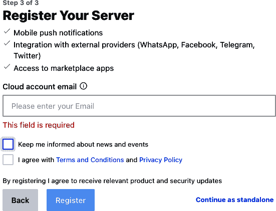
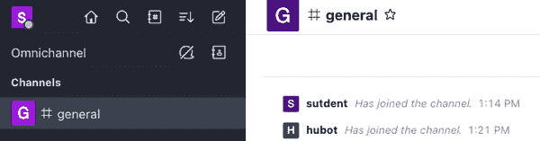

# 第八章。探索 Docker Compose

到此为止，您应该已经对`docker`命令有了良好的掌握，并且知道如何使用它来构建、启动、监视和调试您的应用程序。一旦您熟悉了单个容器的工作方式，不久您将想要分享您的项目，并开始构建更复杂的项目，这些项目需要多个容器才能正常运行。特别是在开发环境中，运行一整套容器可以轻松地模拟许多生产环境在您的本地机器上。

然而，如果您正在运行一整套容器，每个容器都需要使用正确的设置来确保底层应用程序被正确配置并按预期运行。每次都正确设置这些参数可能很具有挑战性，特别是当您不是最初编写应用程序的人时。为了在开发过程中提供帮助，人们通常会尝试编写可以一致构建和运行多个容器的 shell 脚本。尽管这样做是有效的，但对于新手来说可能难以理解，并且随着项目的变化难以维护。在不同项目之间也不一定可重复。

为了解决这个问题，Docker 公司发布了一个主要面向开发人员的工具，称为 Docker Compose。该工具包含在 Docker Desktop 中，但您也可以按照[在线安装说明](https://docs.docker.com/compose/install)安装它。

###### 注意

Docker Compose 最初是一个用 Python 编写的独立应用程序，通过`docker-compose`命令运行。这个命令被称为 Docker Compose 版本 1，并最近被 Docker Compose 版本 2 取代。Docker Compose v2 完全重写为 Go 语言，作为 Docker 客户端插件。如果`docker compose version`返回结果，则表示您已安装了插件。如果没有，请务必立即安装。

Docker Compose 是一个非常有用的工具，可以简化传统上非常繁琐和容易出错的各种开发任务。它可以轻松帮助开发人员快速启动复杂的应用程序堆栈，编译应用程序而无需设置复杂的本地开发环境，等等。

在本章中，我们将介绍如何最大限度地利用 Compose。在所有后续示例中，我们将使用 GitHub 存储库。如果您想在我们进行示例时运行示例，请运行以下命令下载代码，如果您尚未在第六章中执行此操作：

```
$ git clone https://github.com/spkane/rocketchat-hubot-demo.git \
    --config core.autocrlf=input
```

###### 注意

在这个例子中，下面的一些行被截断以适应页面边距的 shell 脚本和*docker-compose.yaml*文件。如果您打算自己尝试这些示例，请确保使用此 Git 存储库中的文件。

这个仓库包含我们启动完整 Web 服务所需的配置，包括一个 MongoDB 数据存储、开源的 Rocket.Chat 通讯服务器、一个 Hubot [ChatOps](https://goo.gl/hKT3QW) 机器人，以及一个 `zmachine-api` 实例，提供一些令人惊喜的娱乐价值。

# 配置 Docker Compose

在我们深入使用 `docker compose` 命令之前，看一下使用 shell 脚本构建和部署本地服务的即兴工具是很有用的。这个输出很长，也很详细，但重要的是要证明 Docker Compose 为什么是对 shell 脚本的巨大飞跃。

###### 警告

我们不建议运行这个 shell 脚本。这只是一个示例，在你的环境中可能无法正常工作，或者会使事情变得很奇怪。

```
#!/bin/bash

# This is here just to keep people from really running this.
exit 1

# The actual script
#
# Note: This has not been updated to directly mirror the docker-compose file
#       since it is just intended to make a point.

set -e
set -u

if [ $# -ne 0 ] && [ ${1} == "down" ]; then
  docker rm -f hubot || true
  docker rm -f zmachine || true
  docker rm -f rocketchat || true
  docker rm -f mongo-init-replica || true
  docker rm -f mongo || true
  docker network rm botnet || true
  echo "Environment torn down…"
  exit 0
fi

# Global Settings
export PORT="3000"
export ROOT_URL="http://127.0.0.1:3000"
export MONGO_URL="mongodb://mongo:27017/rocketchat"
export MONGO_OPLOG_URL="mongodb://mongo:27017/local"
export MAIL_URL="smtp://smtp.email"
export RESPOND_TO_DM="true"
export HUBOT_ALIAS=". "
export LISTEN_ON_ALL_PUBLIC="true"
export ROCKETCHAT_AUTH="password"
export ROCKETCHAT_URL="rocketchat:3000"
export ROCKETCHAT_ROOM=""
export ROCKETCHAT_USER="hubot"
export ROCKETCHAT_PASSWORD="bot-pw!"
export BOT_NAME="bot"
export EXTERNAL_SCRIPTS="hubot-help,hubot-diagnostics,hubot-zmachine"
export HUBOT_ZMACHINE_SERVER="http://zmachine:80"
export HUBOT_ZMACHINE_ROOMS="zmachine"
export HUBOT_ZMACHINE_OT_PREFIX="ot"

docker build -t spkane/mongo:4.4 ./mongodb/docker

docker push spkane/mongo:4.4
docker pull spkane/zmachine-api:latest
docker pull rocketchat/rocket.chat:5.0.4
docker pull rocketchat/hubot-rocketchat:latest

docker rm -f hubot || true
docker rm -f zmachine || true
docker rm -f rocketchat || true
docker rm -f mongo-init-replica || true
docker rm -f mongo || true

docker network rm botnet || true

docker network create -d bridge botnet

docker container run-d \
  --name=mongo \
  --network=botnet \
  --restart unless-stopped \
  -v $(pwd)/mongodb/data/db:/data/db \
  spkane/mongo:4.4 \
  mongod --oplogSize 128 --replSet rs0
sleep 5
docker container run-d \
  --name=mongo-init-replica \
  --network=botnet \
  spkane/mongo:4.4 \
  'mongo mongo/rocketchat --eval "rs.initiate({ _id: ''rs0'', members: [ { … '
sleep 5
docker container run-d \
  --name=rocketchat \
  --network=botnet \
  --restart unless-stopped  \
  -v $(pwd)/rocketchat/data/uploads:/app/uploads \
  -p 3000:3000 \
  -e PORT=${PORT} \
  -e ROOT_URL=${ROOT_URL} \
  -e MONGO_URL=${MONGO_URL} \
  -e MONGO_OPLOG_URL=${MONGO_OPLOG_URL} \
  -e MAIL_URL=${MAIL_URL} \
  rocketchat/rocket.chat:5.0.4
docker container run-d \
  --name=zmachine \
  --network=botnet \
  --restart unless-stopped  \
  -v $(pwd)/zmachine/saves:/root/saves \
  -v $(pwd)/zmachine/zcode:/root/zcode \
  -p 3002:80 \
  spkane/zmachine-api:latest
docker container run-d \
  --name=hubot \
  --network=botnet \
  --restart unless-stopped  \
  -v $(pwd)/hubot/scripts:/home/hubot/scripts \
  -p 3001:8080 \
  -e RESPOND_TO_DM="true" \
  -e HUBOT_ALIAS=". " \
  -e LISTEN_ON_ALL_PUBLIC="true" \
  -e ROCKETCHAT_AUTH="password" \
  -e ROCKETCHAT_URL="rocketchat:3000" \
  -e ROCKETCHAT_ROOM="" \
  -e ROCKETCHAT_USER="hubot" \
  -e ROCKETCHAT_PASSWORD="bot-pw!" \
  -e BOT_NAME="bot" \
  -e EXTERNAL_SCRIPTS="hubot-help,hubot-diagnostics,hubot-zmachine" \
  -e HUBOT_ZMACHINE_SERVER="http://zmachine:80" \
  -e HUBOT_ZMACHINE_ROOMS="zmachine" \
  -e HUBOT_ZMACHINE_OT_PREFIX="ot" \
  rocketchat/hubot-rocketchat:latest
echo "Environment setup…"
exit 0
```

到了这一步，你可能可以轻松地跟随这个脚本的大部分内容。正如你可能已经注意到的，这读起来很麻烦，不太灵活，编辑起来也很痛苦，在几个地方可能会意外失败。如果我们遵循 shell 脚本的最佳实践，并在此处理所有可能的错误，以确保它是可重复的，那么它的长度也会是现在的两到三倍。而且，如果不花费大量工作来提取常见功能进行错误处理，每次像这样有一个新项目时，你也需要重写大部分逻辑。这并不是处理你每次使用时都需要工作的流程的好方法。这就是好工具的作用所在。你可以通过 Docker Compose 实现相同的效果，同时使其更加可重复，并且更易于阅读、理解和维护。

与这个混乱的、很容易重复出错的 shell 脚本相比，Docker Compose 通常通过一个单一的、声明性的 [YAML](https://yaml.org) 文件来配置每个项目，命名为 *docker-compose.yaml*。这个配置文件非常容易阅读，并且能够以非常可重复的方式工作，使得每个用户在运行时都有相同的体验。在这里，你可以看到一个示例 *docker-compose.yaml* 文件，可以用来替换上述脆弱的 shell 脚本：

```
version: '3'
services:
  mongo:
    build:
      context: ../mongodb/docker
    image: spkane/mongo:4.4
    restart: unless-stopped
    environment:
      MONGODB_REPLICA_SET_MODE: primary
      MONGODB_REPLICA_SET_NAME: rs0
      MONGODB_PORT_NUMBER: 27017
      MONGODB_INITIAL_PRIMARY_HOST: mongodb
      MONGODB_INITIAL_PRIMARY_PORT_NUMBER: 27017
      MONGODB_ADVERTISED_HOSTNAME: mongo
      MONGODB_ENABLE_JOURNAL: "true"
      ALLOW_EMPTY_PASSWORD: "yes"
    # Port 27017 already exposed by upstream
    # See the newer upstream Dockerfile:
    # https://github.com/bitnami/containers/blob/
    # f9fb3f8a6323fb768fd488c77d4f111b1330bd0e/bitnami/
    # mongodb/5.0/debian-11/Dockerfile#L52
    networks:
      - botnet
  rocketchat:
    image: rocketchat/rocket.chat:5.0.4
    restart: unless-stopped
    labels:
      traefik.enable: "true"
      traefik.http.routers.rocketchat.rule: Host(`127.0.0.1`)
      traefik.http.routers.rocketchat.tls: "false"
      traefik.http.routers.rocketchat.entrypoints: http
    volumes:
      - "../rocketchat/data/uploads:/app/uploads"
    environment:
      ROOT_URL: http://127.0.0.1:3000
      PORT: 3000
      MONGO_URL: "mongodb://mongo:27017/rocketchat?replicaSet=rs0"
      MONGO_OPLOG_URL: "mongodb://mongo:27017/local?replicaSet=rs0"
      DEPLOY_METHOD: docker
    depends_on:
      mongo:
        condition: service_healthy
    ports:
      - 3000:3000
    networks:
      - botnet
  zmachine:
    image: spkane/zmachine-api:latest
    restart: unless-stopped
    volumes:
      - "../zmachine/saves:/root/saves"
      - "../zmachine/zcode:/root/zcode"
    depends_on:
      - rocketchat
    expose:
      - "80"
    networks:
      - botnet
  hubot:
    image: rocketchat/hubot-rocketchat:latest
    restart: unless-stopped
    volumes:
      - "../hubot/scripts:/home/hubot/scripts"
    environment:
      RESPOND_TO_DM: "true"
      HUBOT_ALIAS: ". "
      LISTEN_ON_ALL_PUBLIC: "true"
      ROCKETCHAT_AUTH: "password"
      ROCKETCHAT_URL: "rocketchat:3000"
      ROCKETCHAT_ROOM: ""
      ROCKETCHAT_USER: "hubot"
      ROCKETCHAT_PASSWORD: "bot-pw!"
      BOT_NAME: "bot"
      EXTERNAL_SCRIPTS: "hubot-help,hubot-diagnostics,hubot-zmachine"
      HUBOT_ZMACHINE_SERVER: "http://zmachine:80"
      HUBOT_ZMACHINE_ROOMS: "zmachine"
      HUBOT_ZMACHINE_OT_PREFIX: "ot"
    depends_on:
      - zmachine
    ports:
      - 3001:8080
    networks:
      - botnet
networks:
  botnet:
    driver: bridge
```

*docker-compose.yaml* 文件使得描述每个服务的所有重要需求及其彼此之间如何通信变得非常容易。而且，我们得到了很多验证和逻辑检查，这些甚至在我们的 shell 脚本中也没有时间编写，而且我们可能会偶尔出错，无论我们多么小心。

那么，我们在那个 YAML 文件中告诉 Compose 做了什么呢？我们文件的第一行简单地告诉 Docker Compose 这个文件是为哪个版本的 [Compose 配置语言](https://docs.docker.com/compose/compose-file) 设计的：

```
version: '3'
```

我们的文档其余部分分为两个部分：`services` 和 `networks`。

首先，让我们快速查看 `networks` 部分。在这个 *docker-compose.yaml* 文件中，我们定义了一个单一命名的 Docker 网络：

```
networks:
  botnet:
    driver: bridge
```

这是一个非常简单的配置，告诉 Docker Compose 创建一个名为 `botnet` 的单一网络，使用（默认的）桥接驱动程序，它将 Docker 网络与主机的网络堆栈桥接。

`services` 部分是配置的最重要部分，告诉 Docker Compose 您要启动哪些应用程序。在这里，`services` 部分定义了五个服务：`mongo`、`mongo-init-replica`、`rocketchat`、`zmachine` 和 `hubot`。然后，每个命名服务都包含部分，告诉 Docker 如何构建、配置和启动该服务。

如果您查看 `mongo` 服务，您会发现第一个子节称为 `build`，其中包含一个 `context` 键。这告知 Docker Compose 可以构建此镜像，并且构建所需的文件位于 *../../mongodb/docker* 目录中，这是比包含 *docker-compose.yaml* 文件的目录高两级的目录：

```
    build:
      context: ../../mongodb/docker
```

如果您查看 *mongodb/docker* 目录中的 *Dockerfile*，您将看到这个：

```
FROM mongo:4.4

COPY docker-healthcheck /usr/local/bin/

# Useful Information:
# https://docs.docker.com/engine/reference/builder/#healthcheck
# https://docs.docker.com/compose/compose-file/#healthcheck
HEALTHCHECK CMD ["docker-healthcheck"]
```

看一下 `HEALTHCHECK` 行。这告诉 Docker 应运行哪个命令来检查容器的健康状况。Docker 不会根据此健康检查采取行动，但它会报告健康状况，以便其他组件可以利用这些信息。如果您感兴趣，请随时查看 *mongodb/docker* 目录中的 `docker-healthcheck` 脚本。

接下来的设置 `image` 定义了要应用于构建或下载（如果不构建镜像）并运行的镜像标签：

```
    image: spkane/mongo:4.4
```

通过 `restart` 选项，您告诉 Docker 您希望它何时重新启动您的容器。在大多数情况下，您希望 Docker 在您没有明确停止它们时重新启动您的容器：

```
    restart: unless-stopped
```

接下来，您将看到一个 `environment` 部分。这是您可以定义要传递到容器中的任何环境变量的地方：

```
    environment:
      MONGODB_REPLICA_SET_MODE: primary
      MONGODB_REPLICA_SET_NAME: rs0
      MONGODB_PORT_NUMBER: 27017
      MONGODB_INITIAL_PRIMARY_HOST: mongodb
      MONGODB_INITIAL_PRIMARY_PORT_NUMBER: 27017
      MONGODB_ADVERTISED_HOSTNAME: mongo
      MONGODB_ENABLE_JOURNAL: "true"
      ALLOW_EMPTY_PASSWORD: "yes"
```

对于 `mongo` 服务的最后一个子节 `networks`，告诉 Docker Compose 应将此容器附加到哪个网络：

```
    networks:
      - botnet
```

现在，让我们转到 `rocketchat` 服务。此服务没有 `build` 子节；相反，它只定义了一个镜像标签，告诉 Docker Compose 不能构建此镜像，必须尝试拉取并启动具有定义标签的现有 Docker 镜像。

您将在此服务中注意到的第一个新子节称为 `volumes`。

大多数服务至少有一些数据在开发过程中应该是持久的，尽管容器的临时性质。为了实现这一点，最简单的方法是将本地目录挂载到容器中。`volumes` 部分允许您列出所有想要挂载到容器中的本地目录，并定义它们的目标位置。此命令将把 *../rocketchat/data/uploads* 绑定挂载到容器内部的 */app/uploads*：

```
    volumes:
      - "../rocketchat/data/uploads:/app/uploads"
```

###### 警告

您可能已经注意到，我们没有为 MongoDB 定义一个 `volume`，这可能看起来有点违反直觉。尽管绑定挂载的卷对于存储数据库文件很有用，但 MongoDB 将无法写入到原生的 Windows 文件系统中，因此我们将其排除在外，以实现最广泛的兼容性，并让数据库在此开发用例中写入容器内部。

这样做的主要结果是，当您使用像 `docker compose down` 这样的命令删除容器时，MongoDB 实例中的所有数据都将丢失。

我们可以通过使用 [数据卷容器](https://docs.docker.com/storage/volumes/#create-and-manage-volumes) 轻松解决这个 MongoDB 存储问题，但这个示例特别使用绑定挂载来处理卷。

###### 提示

在几乎所有情况下，您不应在生产环境中使用基于主机的本地存储来存储容器。这在开发中可能非常方便，因为您使用的是单个主机，但在生产环境中，您的容器通常会部署到有空间和资源的任何节点，并且无法访问存储在单个主机文件系统上的文件。在生产环境中，如果需要有状态存储，您必须利用网络存储、Kubernetes 持久卷等。

在 `rocketchat` 服务的 `environment` 部分，您会看到 `MONGO_URL` 的值不使用 IP 地址或完全限定域名。这是因为所有这些服务都在同一个 Docker 网络上运行，并且 Docker Compose 配置每个容器，使其可以通过其服务名称找到其他容器。这意味着我们可以轻松地配置像这样的 URL，只需简单地指向我们需要连接的容器的服务名称和内部端口。而且，如果重新排列这些内容，这些名称将继续指向我们堆栈中正确的容器。它们也很好，因为它们使读者非常明确地了解该容器的依赖关系是什么：

```
    environment:
      …
      MONGO_URL: "mongodb://mongo:27017/rocketchat?replicaSet=rs0"
      …
```

###### 提示

*docker-compose.yaml* 文件还可以使用 `${VARIABLE_NAME}` 格式引用环境变量，这样可以在不实际存储它们在此文件中的情况下引入秘密。Docker Compose 还支持一个 [*.env*](https://docs.docker.com/compose/env-file) 文件，这对于处理在开发者之间变化的秘密和环境变量非常有用。

`depends_on` 部分定义了一个容器，必须在此容器启动之前才能启动。默认情况下，`docker compose` 仅确保容器正在运行，而不是健康运行；然而，您可以利用 Docker 中的 `HEALTHCHECK` 功能以及 Docker Compose 中的条件语句，要求依赖的服务在 Docker Compose 启动新服务之前处于健康状态。重要的是要记住，这只影响启动阶段。Docker 将报告稍后变得不健康的服务，但除非容器退出，否则不会采取任何措施来纠正情况，在这种情况下，如果配置为这样做，Docker 将重新启动容器：

```
    depends_on:
      mongo:
        condition: service_healthy
```

###### 注意

我们在 “容器健康检查” 中详细讨论了 Docker 的健康检查功能。您还可以在 [Docker](https://dockr.ly/2MYnLZL) 和 [Docker Compose](https://dockr.ly/2wt366J) 的文档中找到更多信息。

`ports` 子部分允许您定义要从容器映射到主机的所有端口：

```
    ports:
      - 3000:3000
```

`zmachine` 服务仅使用了一个名为 `expose` 的新子部分。该部分允许我们告诉 Docker，我们希望将此端口暴露给 Docker 网络上的其他容器，而不暴露给底层主机。这就是为什么您不提供主机端口来映射此端口的原因：

```
    expose:
      - "80"
```

您可能注意到，尽管我们为 `zmachine` 暴露了一个端口，但我们没有在 `mongo` 服务中暴露端口。暴露 `mongo` 端口不会有害，但我们不需要这样做，因为上游的 [`mongo` *Dockerfile*](https://github.com/docker-library/mongo/blob/58bdba62b65b1d1e1ea5cbde54c1682f120e0676/3.2/Dockerfile#L95) 已经暴露了它。这有时会有点难以理解。在构建的镜像上运行 `docker image history` 可以帮助理解这一点。

这里我们使用了一个足够复杂的示例，以便让您了解 Docker Compose 的一些强大功能，但这并不是详尽无遗的。在 *docker-compose.yaml* 文件中，您可以配置很多其他内容，包括安全设置、资源配额等等。您可以在[官方 Docker Compose 文档](https://docs.docker.com/compose/compose-file)中找到关于 Compose 配置的详细信息。

# 启动服务

我们在 YAML 文件中为我们的应用程序配置了一组服务。这告诉 Compose 我们要启动什么以及如何配置它。因此，让我们开始运行它！要运行我们的第一个 Docker Compose 命令，我们需要确保我们与 *docker-compose.yaml* 文件位于同一目录中：

```
$ cd rocketchat-hubot-demo/compose
```

一旦您进入正确的目录，您可以通过运行以下命令确认配置是否正确：

```
$ docker compose config
```

如果一切正常，该命令将打印出您的配置文件。如果有问题，命令将打印出详细的错误信息，如下所示：

```
services.mongo Additional property builder is not allowed
```

您可以使用 `build` 选项构建所需的任何容器。将跳过使用镜像的任何服务：

```
$ docker compose build

 => [internal] load build definition from Dockerfile                      0.0s
 => => transferring dockerfile: 32B                                       0.0s
 => [internal] load .dockerignore                                         0.0s
 => => transferring context: 2B                                           0.0s
 => [internal] load metadata for docker.io/bitnami/mongodb:4.4            1.2s
 => [auth] bitnami/mongodb:pull token for registry-1.docker.io            0.0s
 => [internal] load build context                                         0.0s
 => => transferring context: 40B                                          0.0s
 => [1/2] FROM docker.io/bitnami/mongodb:4.4@sha256:9162…ae209            0.0s
 => CACHED [2/2] COPY docker-healthcheck /usr/local/bin/                  0.0s
 => exporting to image                                                    0.0s
 => => exporting layers                                                   0.0s
 => => writing image sha256:a6ef…da808                                    0.0s
 => => naming to docker.io/spkane/mongo:4.4                               0.0s
```

可以通过运行以下命令在后台启动您的网络服务：

```
$ docker compose up -d

[+] Running 5/5
 ⠿ Network compose_botnet                  Created                        0.0s
 ⠿ Container compose-mongo-1               Healthy                       62.0s
 ⠿ Container compose-rocketchat-1          Started                       62.3s
 ⠿ Container compose-zmachine-1            Started                       62.5s
 ⠿ Container compose-hubot-1               Started                       62.6s
```

Docker Compose 将网络和容器名称以项目名称作为前缀。默认情况下，这是包含您的 *docker-compose.yaml* 文件的目录名称。由于此命令在名为 *compose* 的目录中运行，您可以看到所有内容以`compose`作为项目名称开头。

###### 警告

*Windows 用户*：当您首次启动服务时，Windows 可能会提示您授权 *vpnkit*，而 Docker Desktop for Windows 也可能会提示您分享磁盘。您必须点击“允许访问”和“分享”按钮，以确保网络和卷共享正常工作，并且一切正常启动。

一旦所有服务启动完成，我们可以快速查看所有服务的日志（参见图 8-1）：

```
$ docker compose logs
```


###### 图 8-1\. `docker compose logs` 输出

在此处打印的日志不易看清，但如果您在跟随操作，请注意所有日志都按服务进行了颜色编码，并且按 Docker 接收日志行的时间进行了交织。这样可以更轻松地跟踪发生的事情，即使多个服务同时记录消息。

Rocket.Chat 可能需要一些时间来设置数据库并准备接受连接。一旦 Rocket.Chat 日志打印包含 `SERVER RUNNING` 的行，一切就准备就绪了：

```
$ docker compose logs rocketchat | grep "SERVER RUNNING"

compose-rocketchat-1  | |                SERVER RUNNING                |
```

此时，我们已成功启动了一个相当复杂的应用程序，它由一堆容器堆栈组成。我们现在来看一下这个简单的应用程序，这样您就可以看到我们构建的内容，并更全面地了解 Compose 工具。虽然下一部分与 Docker 本身没有直接关系，但旨在向您展示使用 Docker Compose 设置复杂且功能齐全的网络服务有多么容易。

# 探索 Rocket.Chat

###### 注意

在本节中，我们将暂时偏离 Docker，转而看一看 Rocket.Chat。我们将花几页时间介绍它，以便您了解足够多的信息，希望您能开始感受到使用 Docker Compose 设置复杂环境有多么容易。如果愿意，可以跳转到 “使用 Docker Compose 进行练习”。

我们很快将深入探讨设置背后发生的情况。但为了有效地做到这一点，我们现在应该花一点时间探索我们构建的应用程序堆栈。[Rocket.Chat](https://rocket.chat)，我们使用 Docker Compose 启动的主要应用程序，是一个开源的聊天客户端/服务器应用程序。要查看其工作原理，让我们启动一个网络浏览器，并导航至 [*http://127.0.0.1:3000*](http://127.0.0.1:3000)。

当您到达目标时，您会看到 Rocket.Chat 的管理信息屏幕（参见图 8-2）。


###### 图 8-2\. Rocket.Chat 管理信息界面

填写表格如下：

+   全名：**`student`**

+   用户名：**`student`**

+   电子邮件：**`student@example.com`**

+   密码：**`student-pw!`**

然后点击蓝色的“下一步”按钮。

然后你会看到组织信息界面（参见图 8-3）。


###### 图 8-3\. Rocket.Chat 组织信息界面

此表格的具体内容并不关键，但你可以填写类似以下的内容：

+   组织名称：**`培训`**

+   组织类型：**`社区`**

+   组织行业：**`教育`**

+   组织规模：**`1-10 人`**

+   国家：**`美国`**

然后点击蓝色的“下一步”按钮。

此时，您会看到注册您的服务器界面（参见图 8-4）。



###### 图 8-4\. Rocket.Chat 注册您的服务器界面

你可以简单地删除和取消所有选择，然后点击小蓝色的“继续作为独立站点”链接。接下来，你会看到独立服务器配置界面（参见图 8-5）。


###### 图 8-5\. Rocket.Chat 独立服务器配置界面

点击蓝色的“确认”按钮。

###### 警告

如果你使用的是 `localhost` 或者其他非 127.0.0.1 来访问 Rocket.Chat，可能会弹出一个窗口询问是否要更新 `SITE_URL`。在大多数情况下，可以允许它更新该值，以便与你使用的匹配。

恭喜你，现在你已经成功登录到一个完全功能的聊天客户端，但你的工作还没有完成。Docker Compose 配置启动了一个 [Hubot](https://hubot.github.com) 聊天助手和神秘的 zmachine，让我们来看看它们。

由于 Rocket.Chat 服务器是全新的，我们的机器人还没有可用的用户。让我们来解决这个问题。

首先点击左侧边栏顶部，那里有一个紫色盒子里面带有字母 *S*。点击弹出菜单中的管理（参见图 8-6）。


###### 图 8-6\. Rocket.Chat 管理侧边栏

在管理面板中，点击用户（参见图 8-7）。


###### 图 8-7\. Rocket.Chat 用户界面

在屏幕右上角，点击“新建”按钮以显示添加用户界面（参见图 8-8）。


###### 图 8-8\. Rocket.Chat 添加用户界面

填写表格如下：

+   名称：**`hubot`**

+   用户名：**`hubot`**

+   电子邮件：**`hubot@example.com`**

+   点击：**`已验证`（蓝色）**

+   密码：**`bot-pw!`**

+   角色：**`机器人`**

+   禁用：**`发送欢迎电子邮件`（灰色）**

点击保存以创建用户。

为了确保机器人能够登录，我们还需要禁用默认启用的双因素身份验证。为此，请在浏览器左侧的管理侧边栏底部单击“设置”（图 8-9）。


###### 图 8-9\. Rocket.Chat 管理设置

显示设置屏幕（图 8-10）。


###### 图 8-10\. Rocket.Chat 帐户设置

在新的文本搜索栏中，输入 `**totp**`，然后在帐户下点击打开按钮。

您现在应该看到一个长长的设置列表（图 8-11）。


###### 图 8-11\. Rocket.Chat TOTP 设置

滚动到双因素身份验证部分，展开它，然后取消选择“启用双因素身份验证”选项。

完成此操作后，请单击“保存更改”。

在管理面板左侧顶部，单击 X 关闭面板（图 8-12）。


###### 图 8-12\. Rocket.Chat 关闭管理面板

在左侧面板的“频道”下，点击“general”（图 8-13）。



###### 图 8-13\. Rocket.Chat 通用频道

最后，如果您在频道中尚未看到消息“Hubot 已加入频道”，请告诉 Docker Compose 重新启动 Hubot 容器。这将强制 Hubot 再次尝试登录聊天服务器，现在已经有一个用户可以使用该服务：

```
$ docker compose restart hubot
Restarting unix_hubot_1 … done
```

如果一切按计划进行，您现在应该能够返回网页浏览器并在聊天窗口中发送命令给 Hubot。

###### 注意

当 Hubot 登录服务器时，应自动加入“General”频道，但以防万一，您可以在“General”频道中发送以下消息，显式邀请 Hubot：

```
/invite @hubot
```

您可能会收到来自内部管理员 `rocket.cat` 的消息，内容是“@hubot 已经在这里了。” 这完全正常。

用于配置 Hubot 的环境变量将其别名定义为一个句点。现在您可以尝试输入 `. help` 来测试机器人是否响应。如果一切正常，您应该会收到机器人理解并响应的命令列表：

```
> . help
. adapter - Reply with the adapter
. echo <text> - Reply back with <text>
. help - Displays all of the help commands that this bot knows about.
. help <query> - Displays all help commands that match <query>.
. ping - Reply with pong
. time - Reply with current time
…
```

最后，请尝试输入以下内容：

```
. ping
```

Hubot 应该会回复 `PONG`。

如果您键入：

```
. time
```

然后 Hubot 将告诉您服务器上的时间设置。

所以，作为最后的转移，尝试通过在聊天窗口中键入 `/create zmachine` 创建一个新的聊天频道。现在，您应该能够在左侧边栏中点击新的 `zmachine` 频道，并使用聊天命令 `/invite @hubot` 邀请 Hubot。

###### 注意

当您这样做时，Hubot 可能会说：

```
There's no game for zmachine!
```

这没有什么好担心的。

接下来，尝试在聊天窗口中输入以下命令，以玩一个基于聊天的著名游戏 [*巨洞探险*](https://en.wikipedia.org/wiki/Interactive_fiction#Adventure) 的版本：

```
. z start adventure

more
look
go east
examine keys
get keys

. z save firstgame
. z stop
. z start adventure
. z restore firstgame

inventory
```

###### 警告

交互式小说可能会让人上瘾，是一个巨大的时间消耗。您已经被警告了。话虽如此，如果您对此感兴趣并希望了解更多信息，请查看以下一些资源：

+   [交互式小说的定义](https://en.wikipedia.org/wiki/Interactive_fiction)

+   [模拟器](https://davidgriffith.gitlab.io/frotz)

+   [开发](https://ganelson.github.io/inform-website)

+   [游戏](https://oreil.ly/IrOLh)¹

+   [竞赛](https://ifcomp.org)

现在您已经看到了如何配置、启动和管理复杂的 Web 服务的简单方法，这些服务需要多个组件来完成其工作，使用 Docker Compose。在接下来的部分中，我们将探讨 Docker Compose 包含的更多功能。

###### 注意

通过提供 MongoDB 与预配置的 Rocket.Chat 数据库，您可以避免大部分 Rocket.Chat 设置，但是去除此示例中的任何魔术是很重要的，以便更清楚地展示所有组件如何配合。

# 使用 Docker Compose 进行练习

现在，您已经运行了完整的 Rocket.Chat 堆栈，并了解了应用程序的运行方式，我们可以深入挖掘一些服务运行的细节。一些常见的 Docker 命令也暴露为 Compose 命令，但是针对的是特定的堆栈，而不是主机上的单个容器或所有容器。您可以运行 `docker compose top` 来查看您的容器及其内运行的进程的概述：

```
$ docker compose top

compose-hubot-1
UID  PID   … CMD
1001 73342 … /usr/bin/qemu-x86_64 /bin/sh /bin/sh -c node -e "console.l…"
1001 73459 … /usr/bin/qemu-x86_64 /usr/local/bin/node node node_modules/…

compose-mongo-1
UID  PID   … CMD
1001 71243 … /usr/bin/qemu-x86_64 /opt/bitnami/mongodb/bin/mongod /opt/…

compose-rocketchat-1
UID   PID   … CMD
65533 71903 … /usr/bin/qemu-x86_64 /usr/local/bin/node node main.js

compose-zmachine-1
UID  PID   … CMD
root 71999 … /usr/bin/qemu-x86_64 /usr/local/bin/node node /root/src/server.js
root 75078 … /usr/bin/qemu-x86_64 /root/src/../frotz/dfrotz /root/src/…
```

类似于您通常使用`docker container exec`命令进入运行中的 Linux 容器一样，您可以通过 Docker Compose 工具使用`docker compose exec`命令在容器内运行命令。由于`docker compose`是一个较新的工具，它提供了一些方便的快捷方式来替代标准的`docker`命令。对于`docker compose exec`来说，您不需要传入`-i -t`，而且可以使用 Docker Compose 服务名称，而不是记住容器的 ID 或名称：

```
$ docker compose exec mongo bash

I have no name!@0078134f9370:/$ mongo
MongoDB shell version v4.4.15
connecting to: mongodb://127.0.0.1:27017/?compressors=disabled&…
Implicit session: session { "id" : UUID("daec9543-bb9c-4e8c-ba6b…") }
MongoDB server version: 4.4.15
…
rs0:PRIMARY> exit
bye
I have no name!@0078134f9370:/$ exit
exit
```

###### 提示

`docker compose logs` 和 `docker compose exec` 可能是用于故障排除最有用的命令。如果 Docker Compose 无法构建您的映像或根本无法启动您的容器，您将需要回退到标准的 `docker` 命令来调试您的映像和容器，正如我们在 “故障排除破损的构建” 和 “进入正在运行的容器” 中讨论的那样。

您还可以使用 Docker Compose `start` 和 `stop`，在大多数环境中，`pause` 和 `unpause` 一个单独的容器或所有容器，具体取决于您的需求：

```
$ docker compose stop zmachine
[+] Running 1/1
 ⠿ Container compose-zmachine-1  Stopped                                  0.3s
$ docker compose start zmachine
[+] Running 2/2
 ⠿ Container compose-mongo-1     Healthy                                  0.5s
 ⠿ Container compose-zmachine-1  Started                                  0.4s
$ docker compose pause
[+] Running 4/0
 ⠿ Container compose-mongo-1       Paused                                 0.0s
 ⠿ Container compose-zmachine-1    Paused                                 0.0s
 ⠿ Container compose-rocketchat-1  Paused                                 0.0s
 ⠿ Container compose-hubot-1       Paused                                 0.0s
$ docker compose unpause
[+] Running 4/0
 ⠿ Container compose-zmachine-1    Unpaused                               0.0s
 ⠿ Container compose-hubot-1       Unpaused                               0.0s
 ⠿ Container compose-rocketchat-1  Unpaused                               0.0s
 ⠿ Container compose-mongo-1       Unpaused                               0.0s
```

最后，当您想要清理并删除 Docker Compose 创建的所有容器时，可以运行以下命令：

```
$ docker compose down
[+] Running 5/5
 ⠿ Container compose-hubot-1       Removed                               10.4s
 ⠿ Container compose-zmachine-1    Removed                                0.1s
 ⠿ Container compose-rocketchat-1  Removed                                0.6s
 ⠿ Container compose-mongo-1       Removed                                0.9s
 ⠿ Network compose_botnet          Removed                                0.1s
```

###### 警告

当您使用`docker compose down`命令删除 MongoDB 容器时，MongoDB 实例中的所有数据都将丢失。

# 管理配置

Docker Compose 提供了几个重要的功能，可以帮助您显著提高*docker-compose.yaml*文件的灵活性。在本节中，我们将探讨如何避免将许多配置值硬编码到您的*docker-compose.yaml*文件中，同时仍然使它们默认情况下易于使用。

## 默认值

如果我们查看*docker-compose.yaml*文件中*services:rocketchat:environment*部分，我们将看到类似于以下内容：

```
    environment:
      RESPOND_TO_DM: "true"
      HUBOT_ALIAS: ". "
      LISTEN_ON_ALL_PUBLIC: "true"
      ROCKETCHAT_AUTH: "password"
      ROCKETCHAT_URL: "rocketchat:3000"
      ROCKETCHAT_ROOM: ""
      ROCKETCHAT_USER: "hubot"
      ROCKETCHAT_PASSWORD: "bot-pw!"
      BOT_NAME: "bot"
      EXTERNAL_SCRIPTS: "hubot-help,hubot-diagnostics,hubot-zmachine"
      HUBOT_ZMACHINE_SERVER: "http://zmachine:80"
      HUBOT_ZMACHINE_ROOMS: "zmachine"
      HUBOT_ZMACHINE_OT_PREFIX: "ot"
```

现在，如果我们查看同一目录中的*docker-compose-defaults.yaml*文件，我们将看到该部分看起来像这样：

```
    environment:
      RESPOND_TO_DM: ${HUBOT_RESPOND_TO_DM:-true}
      HUBOT_ALIAS: ${HUBOT_ALIAS:-. }
      LISTEN_ON_ALL_PUBLIC: ${HUBOT_LISTEN_ON_ALL_PUBLIC:-true}
      ROCKETCHAT_AUTH: ${HUBOT_ROCKETCHAT_AUTH:-password}
      ROCKETCHAT_URL: ${HUBOT_ROCKETCHAT_URL:-rocketchat:3000}
      ROCKETCHAT_ROOM: ${HUBOT_ROCKETCHAT_ROOM:-}
      ROCKETCHAT_USER: ${HUBOT_ROCKETCHAT_USER:-hubot}
      ROCKETCHAT_PASSWORD: ${HUBOT_ROCKETCHAT_PASSWORD:-bot-pw!}
      BOT_NAME: ${HUBOT_BOT_NAME:-bot}
      EXTERNAL_SCRIPTS: ${HUBOT_EXTERNAL_SCRIPTS:-hubot-help,
                          hubot-diagnostics,hubot-zmachine}
      HUBOT_ZMACHINE_SERVER: ${HUBOT_ZMACHINE_SERVER:-http://zmachine:80}
      HUBOT_ZMACHINE_ROOMS: ${HUBOT_ZMACHINE_ROOMS:-zmachine}
      HUBOT_ZMACHINE_OT_PREFIX: ${HUBOT_ZMACHINE_OT_PREFIX:-ot}
```

这是一种称为[*变量插值*](https://docs.docker.com/compose/compose-file/#interpolation)的技术，Docker Compose 直接从许多常见的 Unix shell（如`bash`）中借用了它。

在原始文件中，环境变量`ROCKETCHAT_PASSWORD`硬编码为值`"bot-pw!"`：

```
      ROCKETCHAT_PASSWORD: "bot-pw!"
```

通过使用这种新方法，我们声明希望将`ROCKETCHAT_PASSWORD`设置为用户环境中设置了`HUBOT_ROCKETCHAT_PASSWORD`变量的值，如果没有设置，则`ROCKETCHAT_PASSWORD`应该设置为默认值`bot-pw!`：

```
      ROCKETCHAT_PASSWORD: ${HUBOT_ROCKETCHAT_PASSWORD:-bot-pw!}
```

这为我们提供了很大的灵活性，因为我们现在几乎可以使所有内容都可配置，同时为最常见的用例提供合理的默认值。我们可以通过使用新文件运行`docker compose up`来轻松测试这一点：

```
$ docker compose -f docker-compose-defaults.yaml up -d

[+] Running 5/5
 ⠿ Network compose_botnet          Created                                0.0s
 ⠿ Container compose-mongo-1       Healthy                               31.0s
 ⠿ Container compose-rocketchat-1  Started                               31.2s
 ⠿ Container compose-zmachine-1    Started                               31.5s
 ⠿ Container compose-hubot-1       Started                               31.8s
```

默认情况下，这将导致我们之前启动的完全相同的堆栈。但是，现在我们可以通过在运行我们的`docker compose`命令之前在终端中简单地设置一个或多个环境变量来轻松进行更改：

```
$ docker compose -f docker-compose-defaults.yaml down
…

$ docker compose -f docker-compose-defaults.yaml config | \
    grep ROCKETCHAT_PASSWORD

 ROCKETCHAT_PASSWORD: bot-pw!

$ HUBOT_ROCKETCHAT_PASSWORD="my-unique-pw" docker compose \
    -f docker-compose-defaults.yaml config | \
    grep ROCKETCHAT_PASSWORD

 ROCKETCHAT_PASSWORD: my-unique-pw
```

###### 提示

在这些示例中，Docker Compose 将空环境变量与设置为空字符串的环境变量完全相同对待。如果空字符串是您用例中的有效值，则您将希望修改变量替换行的格式，使其看起来像这样：`${VARIABLE_NAME-default-value}`。我们建议阅读[此功能的文档](https://docs.docker.com/compose/compose-file/#interpolation)，以便了解所有可能性。

这非常好，但是如果我们不想提供任何默认值，而是想强制用户设置某些内容，该怎么办呢？我们也可以很容易地做到这一点。

###### 警告

有些读者可能对我们将密码作为命令行的一部分传递感到不适，因为这些密码可能在系统进程列表中可见等等，但不用担心——我们将在几分钟内解决这个问题。

## 强制值

要设置一个必填值，我们只需稍微修改变量替换行。看起来将默认密码传递进去似乎是一个坏主意，所以让我们继续并要求该值为必填项。

在*docker-compose-defaults.yaml*文件中，`ROCKETCHAT_PASSWORD`被定义为这样：

```
      ROCKETCHAT_PASSWORD: ${HUBOT_ROCKETCHAT_PASSWORD:-bot-pw!}
```

在更新的*docker-compose-env.yaml*文件中，我们可以看到它被定义为这样：

```
      ROCKETCHAT_PASSWORD:
        ${HUBOT_ROCKETCHAT_PASSWORD:?HUBOT_ROCKETCHAT_PASSWORD must be set!}
```

而不是包含默认值，这种方法在变量未在环境中设置为非空字符串时定义了一个错误字符串。如果我们现在尝试简单地启动这些服务，将会收到错误消息：

```
$ docker compose -f docker-compose-env.yaml up -d

invalid interpolation format for
 services.hubot.environment.ROCKETCHAT_PASSWORD.
You may need to escape any $ with another $.
required variable HUBOT_ROCKETCHAT_PASSWORD is missing a value:
 HUBOT_ROCKETCHAT_PASSWORD must be set!
```

输出为我们提供了一些关于可能出错的提示，但最后两行非常清晰，最终消息正是我们定义的确切错误消息，因此可以根据情况设置为最有意义的内容。

如果我们继续输入我们自己的密码，那么一切都会正常启动：

```
$ HUBOT_ROCKETCHAT_PASSWORD="a-b3tt3r-pw" docker compose \
    -f docker-compose-env.yaml up -d

[+] Running 5/5
 ⠿ Network compose_botnet          Created                      0.0s
 ⠿ Container compose-mongo-1       Healthy                     31.0s
 ⠿ Container compose-rocketchat-1  Started                     31.3s
 ⠿ Container compose-zmachine-1    Started                     31.5s
 ⠿ Container compose-hubot-1       Started                     31.8s

$ docker compose -f docker-compose-env.yaml down
…
```

## dotenv 文件

传递单个环境变量并不难，但如果您需要传递许多自定义值，甚至一个真正的秘密，那么在本地终端中设置它们并不理想。这就是*.env*（dotenv）文件非常有用的地方。

*.env*文件是一个[特殊文件标准](https://www.dotenv.org/docs/security/env)，旨在被需要特定于本地环境的附加配置信息的程序解析。

在上述用例中，我们必须设置一个密码来启动我们的 Docker Compose 环境。我们可以每次传入环境变量，但至少有几个理由不是很理想。如果我们能以某种对单用户环境合理安全且使我们的生活更轻松且减少错误的方式设置它，那将是很好的。

本质上，*.env*文件只是一个键值对列表。由于这个文件是特定于本地环境的，通常至少包含一个秘密，因此我们应该首先确保永远不会意外地将这些文件提交到我们的版本控制系统中。要做到这一点，使用`git`，我们只需确保我们的*.gitignore*文件包含*.env*，在这种情况下，它已经包含了：

```
$ grep .env ../.gitignore
.env
```

假设我们在单用户系统上，现在可以在包含我们的*docker-compose.yaml*文件的同一目录中安全地创建一个*.env*文件。

作为示例，让我们继续并让我们的*.env*文件的内容看起来像这样：

```
HUBOT_ROCKETCHAT_PASSWORD=th2l@stPW!
```

我们可以在这个文件中添加许多键值对，但为了保持简单，我们只关注这个密码。如果您在创建这个文件后运行`git status`，您应该注意到`git`完全忽略了新文件，这正是我们想要的：

```
$ git status
On branch main
Your branch is up to date with 'origin/main'.

nothing to commit, working tree clean
```

###### 注意

*.env*文件不是 Unix shell 脚本。在这种格式与您可能在标准 shell 脚本中定义变量的方式之间有微妙但重要的区别。最重要的区别是，在大多数情况下，您不应该用引号括起值。

在上一节中，当我们运行`docker compose -f docker-compose-env.yaml up -d`时，没有设置`HUBOT_ROCKETCHAT_PASSWORD`，我们遇到了一个错误，但是如果我们在创建了*.env*文件后再试一次，一切应该都会正常工作：

```
$ docker compose -f docker-compose-env.yaml up -d

[+] Running 5/5
 ⠿ Network compose_botnet          Created                      0.0s
 ⠿ Container compose-mongo-1       Healthy                     31.1s
 ⠿ Container compose-rocketchat-1  Started                     31.3s
 ⠿ Container compose-zmachine-1    Started                     31.5s
 ⠿ Container compose-hubot-1       Started                     31.8s
```

让我们确认已经分配给`ROCKETCHAT_PASSWORD`的值是否与我们在*.env*文件中设置的值相同：

```
$ docker compose \
    -f docker-compose-env.yaml config | \
    grep ROCKETCHAT_PASSWORD

 ROCKETCHAT_PASSWORD: th2l@stPW!
```

我们可以看到该值确实设置为我们在*.env*文件中定义的值。这是因为 Docker Compose 始终会读取位于与我们正在使用的*docker-compose.yaml*文件相同目录中的*.env*文件中定义的键/值对。

在此处影响优先级的理解非常重要。Docker Compose 首先会读取*docker-compose.yaml*文件中设置的所有默认值。然后它会读取*.env*文件，并覆盖文件中定义的任何默认值。最后，它会查看在本地环境中设置的任何环境变量，并使用这些变量覆盖先前定义的值。

这意味着文件中的默认设置应该是最常见的设置，然后每个用户可以在本地*.env*文件中定义他们的常见更改，并在需要对特定用例进行不寻常更改时依赖于本地环境变量。使用这些功能与 Docker Compose 一起可以确保您可以构建一个非常可重复的流程，同时仍具有足够的灵活性来涵盖大多数常见工作流程。

###### 提示

Docker Compose 还有一些我们没有涵盖的附加功能，比如[覆盖文件](https://docs.docker.com/compose/extends)。随着您对 Docker Compose 的使用越来越多，值得您花时间查阅[文档](https://docs.docker.com/compose)，以了解可能对项目有用的任何其他功能。

# 总结

现在您应该对使用 Docker Compose 可以实现的功能有了很好的了解，以及如何使用这个工具来减少重复操作并增加开发环境的可重复性。

在下一章中，我们将探讨一些工具，这些工具可帮助您在数据中心内部和云中扩展 Docker。

¹ 完整 URL：[*https://ifarchive.org/indexes/if-archiveXgamesXzcode.html*](https://ifarchive.org/indexes/if-archiveXgamesXzcode.html)
