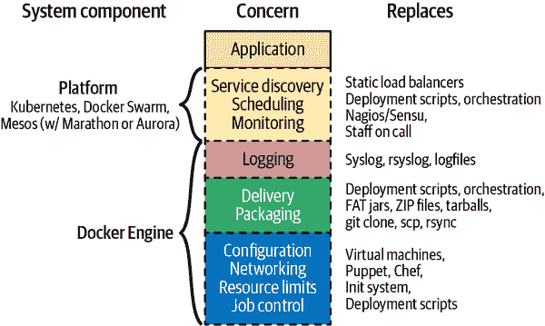
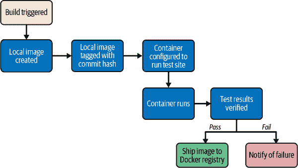

# 第九章：通往生产容器的道路

现在，我们已经探讨了在单个主机上启动一堆容器的工具，接下来我们需要看看在大规模生产环境中如何做到这一点。在本章中，我们的目标是向您展示如何根据我们自己的经验将容器引入生产环境。您可能需要根据您的应用程序和环境进行多方面的调整，但这应该为您提供一个坚实的起点，帮助您理解 Docker 的实际理念。

# 达到生产环境

将应用程序从构建和配置的阶段部署到运行在生产系统上的阶段，是从零到生产过程中最充满挑战的步骤之一。传统上这一过程很复杂，但是通过货运集装箱模型大大简化了。如果你能想象在集装箱出现之前，把货物装上要过海的船是什么样子，你就能体会到大多数传统部署系统的样子。在那种旧的航运模式中，各种大小不一的箱子、板条箱、桶和各种其他包装物都是手工装载到船上的。然后必须由人手动卸载，以便知道哪些部分需要先卸载，以防整堆物品像 [Jenga](https://en.wikipedia.org/wiki/Jenga) 拼图一样倒塌。

这一切都因为货运集装箱的出现而改变：现在我们有了标准化的、尺寸已知的箱子。这些集装箱可以按照逻辑顺序打包和卸载，整组物品可以按时一起到达。航运业建立了高效管理这些箱子的机制。Docker 的部署模型非常类似。所有的 Linux 容器支持相同的外部接口，工具只需将它们放在它们应该放置的服务器上，而不必关心里面装的是什么。

在新模型中，当我们有了运行中的应用程序构建时，我们不需要编写太多定制工具来启动部署。如果我们只想将它发送到一个服务器，`docker` 命令行工具将为我们处理大部分工作。如果我们想要将其发送到更多的服务器，则需要查看更广泛的容器生态系统中更高级的工具。无论哪种情况，您的应用程序都需要了解一些事项和考虑一些问题，然后才能将您的容器化应用程序带到生产环境。

在使用 Docker 将应用程序部署到生产环境时，您将遵循以下步骤：

1.  在开发机上本地构建和测试 Docker 镜像。

1.  为测试和部署构建您的官方镜像，通常使用持续集成（CI）或构建系统。

1.  将镜像推送到注册表。

1.  将您的 Docker 镜像部署到服务器，然后配置和启动容器。

随着你的工作流程的发展，最终你将把所有这些步骤合并成一个流畅的工作流程：

1.  组织构建、测试和镜像存储以及将容器部署到生产服务器。

但故事远不止于此。在最基本的层面上，一个生产故事必须包括三个方面：

+   这必须是一个可重复的过程。每次调用它时，它都需要做同样的事情。理想情况下，它将为所有你的应用做同样的事情。

+   它需要为你处理配置。你必须能够在特定环境中定义应用程序的配置，然后保证它会在每次部署时传送该配置。

+   它必须提供一个可启动的可执行构件。

要实现这一点，有几件事情你需要考虑。我们将通过提供一个框架来帮助你思考你的应用在其环境中的情况。

# Docker 在生产环境中的角色

我们已经介绍了 Docker 带来的许多功能，并讨论了一些通用的生产策略。在我们深入探讨生产容器之前，让我们看看 Docker 如何适应传统和更现代的生产环境。如果你正在从更传统的系统转向 Docker，你可以选择将哪些部分委托给 Docker，部署工具，或者更大的平台，比如 Kubernetes 或基于云的容器系统，或者甚至决定留在更传统的基础设施上。我们已成功地将多个系统从传统部署转换为容器化系统，并有许多好的解决方案。但了解所需的组件以及现代和更传统变体的构成将使你做出明智的选择。

在图 9-1 中，我们描述了生产系统中需要考虑的几个问题，以及解决这些问题的现代组件，以及它们可能在更传统环境中替代的系统。我们将这些问题分为 Docker 本身解决的问题和我们所谓的*平台*所解决的问题。平台是一个通常包围着一组服务器的系统，并为 Linux 容器管理提供一个通用接口。这可能是一个统一的系统，如 Kubernetes 或 Docker Swarm，或者它可能由组件组成，这些组件结合在一起形成一个平台。在过渡到具有调度程序的完全容器化系统期间，平台可能同时扮演多种角色。因此，让我们看看每个问题是如何相互关联的。



###### 图 9-1\. Docker 在生产系统中的角色

在 图 9-1 中，您可以看到应用程序位于堆栈顶部。在生产系统中，它依赖于其下的所有关注点。在某些情况下，您的环境可能会明确地调用这些关注点，而在其他情况下，它们可能由您并非认为填充该关注点的东西来处理。但您的生产应用程序将以某种方式依赖于这些关注点中的大多数，并且需要在生产环境中加以解决。如果您希望从现有环境过渡到基于 Linux 容器的环境，则需要考虑如何提供当前的这些解决方案以及如何在新系统中进行处理。

我们将从熟悉的领域开始，然后从底部到顶部进行。那个熟悉的领域就是您的应用程序。您的应用程序位于顶部！其他所有内容都在那里以向您的应用程序提供功能。毕竟，应用程序提供业务价值，而其他所有内容都旨在使这成为可能，在规模和可靠性上进行支持，并在应用程序之间标准化其工作方式。尽管底部项目的顺序是有意的，但并非每个层次都向上面的层次提供功能。它们都是向应用程序本身提供功能。

因为 Linux 容器和 Docker 可以简化许多这些功能，容器化您的系统将使许多这些选择变得更加容易。随着我们接近堆栈的平台部分，我们将有更多需要考虑的内容，但了解位于其下的所有内容将使这个过程变得更加可管理。

让我们从应用程序作业控制开始。

## 作业控制

作业控制是现代部署的基本要求。这是关注点图中蓝色块的一部分。基本上，没有任何形式的系统都无法进行作业控制。这是我们传统上更多地留给操作系统或者更具体地说是 Linux 初始化系统（如 `systemd`、System V `init`、`runit`、BSD `rc` 脚本等）的一部分。我们告诉操作系统要运行一个进程，然后我们配置在重新启动它、重新加载其配置和管理应用程序生命周期时的行为。

当我们希望启动或停止应用程序时，我们依赖这些系统来处理。在某些情况下，我们还依赖它们更强大地保持应用程序的运行，例如在应用程序崩溃时重新启动它。不同的应用程序需要不同的作业控制。在传统的 Linux 系统中，您可能使用 `cron` 定时启动和停止作业。`systemd` 可能负责在应用程序崩溃时重新启动您的应用程序。但是，系统如何处理这些操作取决于该系统的具体情况，有许多不同的实现方法可供选择，这并不理想。

如果我们正在转向集装箱模型，我们希望能够从外部更多或更少地以相同的方式处理所有作业。我们可能需要一些关于它们的元数据来使它们做正确的事情，但我们不想查看容器内部。Docker 引擎提供了一组强大的围绕作业控制的基元，例如`docker container start`、`docker container stop`、`docker container run`和`docker container kill`，这些映射到应用程序生命周期中的大多数关键步骤。所有围绕 Docker 容器构建的平台，包括 Kubernetes，在这些生命周期行为上也遵循这些行为。我们将这放在关注点堆栈的底部，因为这基本上是 Docker 为您的应用程序提供的最低抽象。即使我们不使用 Docker 的任何其他部分，这也是一个巨大的胜利，因为对于所有应用程序和运行 Docker 容器的所有平台来说都是相同的。

## 资源限制

位于作业控制之上的是资源限制。在 Linux 系统中，如果需要的话，可以直接使用[Linux 控制组（cgroups）](https://www.kernel.org/doc/html/latest/admin-guide/cgroup-v2.html)来管理资源限制，一些生产环境确实已经这样做了。但更传统的做法是依赖于像[`ulimit`](https://linuxconfig.org/limit-user-environment-with-ulimit-linux-command)和应用运行环境的不同设置，比如 Java、Ruby 或 Python 虚拟机。在云系统中，一个早期的成功之处是我们可以启动单独的虚拟服务器来限制单个业务应用程序周围的资源。这是一个很好的创新：不再有吵闹的邻居应用程序。然而，与容器相比，这是一种相当粗糙的控制。

使用 Linux 容器，您可以通过 cgroups 轻松地为您的容器应用一系列广泛的资源控制。在生产环境中，您可以自行决定是否限制应用程序对内存、磁盘空间或 I/O 的访问。然而，我们强烈建议您一旦熟悉了应用程序的需求，就花时间做这些。如果不这样做，您将无法利用容器化应用程序的核心功能之一：在同一台机器上运行多个应用程序，基本上不会相互干扰。正如我们所讨论的，Docker 为您提供了这一功能，这是使容器有价值的核心部分。您可以查看 Docker 用于管理这些资源的具体参数在第五章。

## 网络

有关 Docker 网络的详细信息在第十一章中有很多内容，我们在这里不会过多触及，但你的容器化系统需要管理连接网络上的应用程序。Docker 提供了丰富的网络配置选项。你应该在生产环境中选择一种机制，并在所有容器中标准化使用该机制。试图混合使用这些机制不是一条通往成功的容易路径。如果你正在运行像 Kubernetes 这样的平台，那么这些决策中的一些将会被代替。但好消息是，通常情况下，网络如何构建的复杂性不是容器中应用程序关注的问题。请考虑 Docker 或更大的平台会为你提供这些功能，只要你遵循一些规则，你的应用程序在本地机器上作为容器内部运行时，与在生产环境中的运行方式基本相同：

1.  依赖于 Docker 或你的平台动态映射端口，并告知应用程序它们映射到哪里。这通常以环境变量的形式提供给应用程序。

1.  避免使用像 FTP 或 RTSP 这样映射随机端口用于返回流量的协议。在容器化平台中支持这一点非常困难。

1.  依赖于 Docker 或生产运行时为你的容器提供的 DNS。

如果你遵循这些规则，那么通常你的应用程序可以相对独立于其部署位置。大多数生产环境都会提供定义实际配置并在运行时应用它们的能力。Docker Compose、Docker Swarm 模式、Kubernetes 和云服务提供的运行时（如 ECS），都会为你处理这些事务。

## 配置

所有应用程序都需要以某种方式访问它们的配置。对于一个应用程序，有两个级别的配置。最低级别是它期望其周围的 Linux 环境如何配置。容器通过提供一个*Dockerfile*来处理这个问题，我们可以重复构建相同的环境。在更传统的系统中，我们可能会使用像 Chef、Puppet 或 Ansible 这样的配置管理系统来做这件事。在容器化的世界中，你仍然可以使用这些系统，但通常不会用它们来为应用程序提供依赖项。这项工作归 Docker 和*Dockerfile*负责。即使*Dockerfile*的内容因应用程序的不同而不同，但机制和工具都是一样的——这是一个巨大的胜利。

配置的下一级是直接应用于应用程序的配置。我们之前详细讨论过这个问题。Docker 的本地机制是使用环境变量，这在所有现代平台上都适用。一些系统特别是使依赖于更传统的配置文件更加容易。特别是 Kubernetes，它使得依赖于文件相对容易，但如果您真正希望一个可移植的、容器本地化的应用程序，我们建议不要这样做。我们发现这可能会显著影响应用程序的可观察性，并劝阻您依赖这个支架。有关环境变量背后推理的更多内容请参阅第十三章。

## 包装和交付

我们在这里将包装和交付放在一起讨论。这是一个容器化系统比传统系统具有重大优势的领域。在这里，我们无需费尽想象力就能看到与运输集装箱模型的相似之处：我们有一个一致的包装，即容器镜像，以及一个标准化的方式将它们传送到目的地——Docker 的注册中心以及`image pull`和`image push`功能。在更传统的系统中，我们可能已经构建了手工制作的部署工具，其中一些工具希望我们能够在应用程序中进行标准化。但如果我们需要一个多语言环境，这将会带来麻烦。在您的容器化环境中，您需要考虑如何将您的应用程序打包成镜像以及如何存储这些镜像。

对于后者来说，最简单的路径是订阅托管的商业镜像注册表服务。如果您的公司可以接受这一点，那么您应该考虑这一点。包括亚马逊在内的几个云提供商都有您可以部署在您环境内的镜像托管服务，这是另一个很好的选择。当然，您也可以构建和维护内部私有注册表，就像我们在“运行私有注册表”中所讨论的那样。提供给您的生态系统中有广泛的服务提供商可供选择，您应该调查您的选择。

## 日志记录

日志记录位于你可以依赖 Docker 在容器化环境中提供的关注点和平台需要管理的关注点的边界。这是因为，正如我们在第六章详细说明的那样，Docker 可以收集所有容器的日志并将其发送至某个地方。但默认情况下，这个地方甚至不在本地系统之外。对于规模有限的环境来说可能很好，如果本地主机存储足够好的话，你可以在那里停止考虑这个问题。但是你的平台将负责处理来自大量应用程序和多个系统的日志，因此你可能希望将这些日志集中到一个显著提高可见性和简化故障排除的系统中。在设计时，请参考第六章以获取更多关于日志记录的详细信息。一些系统如 Kubernetes，在收集日志方面持有自己的观点。但从应用程序的角度来看，你只需要确保它们发送到`stdout`或`stderr`，让 Docker 或平台处理其余部分即可。

## 监控

系统的第一部分并非由 Docker 或 Linux 容器一般整齐地捆绑起来，但仍然通过 Docker 带来的标准化得到改进。像在第六章讨论的那样，以标准化的方式进行应用程序健康检查意味着简化了监控应用程序健康状况的流程。在许多系统中，平台本身处理监控，调度程序将动态关闭不健康的容器，并可能将工作负载移至不同服务器或重新启动同一系统上的工作负载。在旧系统中，容器通常由现有系统如 Nagios、Zabbix 或其他传统监控系统监控。正如我们在第六章展示的那样，还有一些新的选项，包括像 Prometheus 这样的系统。应用程序性能监控（APM）供应商如 New Relic、Datadog 或 Honeycomb，都对 Linux 容器及其所包含的应用程序提供了一流的支持。因此，如果你的应用程序已经由其中之一进行监控，那么你可能不需要做太多改动。

在旧系统中，通常是工程师被调度并响应问题，并做出如何处理失败应用程序的决策。在动态系统中，这项工作通常转移到属于平台内部的更自动化的过程中。在过渡期间，你的系统可能会同时拥有两者，同时向自动化系统转移，只有当平台真的无法干预时，工程师才会被调度。无论如何，人类仍然需要作为最后的防线。但是当事情出错时，容器化系统要处理起来要容易得多，因为这些机制在应用程序间是标准化的。

## 调度

你如何决定哪些服务运行在哪些服务器上？由于 Docker 提供了很好的机制，容器易于移动。这打开了更好资源利用、更好的可靠性、自愈服务和动态扩展的多种可能性。但是，某些东西必须做出这些决策。

在旧系统中，通常使用专用服务器处理每个服务。你经常会在部署脚本中配置一系列服务器，并且每次部署时，同一组服务器都会接收新的应用程序。每服务器一服务的模型推动了私有数据中心中早期虚拟化的发展。云系统通过将服务器切割成商品化虚拟服务器，鼓励了每服务器一服务的模型。像 AWS 中的自动扩展处理了这种动态行为的部分。但是，如果你转向容器，许多服务可能在同一虚拟服务器上运行，服务器级别的扩展和动态行为就不再适用了。

### 分布式调度器

分布式调度器利用 Docker 让你几乎可以像操作单个计算机一样思考整个服务器网络。这里的想法是，你定义一些关于如何运行应用程序的策略，然后让系统决定在哪里运行以及运行多少个实例。如果服务器或应用程序出现问题，你可以让调度器在任何可用的健康资源上重新启动，以满足应用程序的要求。这更符合 Docker 公司创始人[Solomon Hykes](https://www.linkedin.com/in/solomonhykes)对 Docker 的最初愿景：一种无需担心如何运输应用程序的方式。通常，在这种模型中的零停机部署是通过[蓝绿部署风格](https://martinfowler.com/bliki/BlueGreenDeployment.html)完成的，即在旧一代应用程序旁边启动新一代应用程序，然后逐步将工作从旧堆栈迁移到新堆栈。

现在，使用了[由 Kelsey Hightower 所提出的著名隐喻](https://youtu.be/HlAXp0-M6SY?t=10m23s)，调度器就像是为你玩俄罗斯方块，动态地在服务器上放置服务，以达到最佳匹配。

尽管 Kubernetes 不是第一个（Mesos 和 Cloud Foundry 等平台荣耀归于它们），但是今天，Kubernetes，这个来自 Google 于 2014 年的项目，无疑是基于容器的调度器的领导者。早期的 Kubernetes 发布借鉴了 Google 从其内部 Borg 系统中学到的经验，并将其带给了开源社区。它从一开始就建立在 Docker 和 Linux 容器上，不仅支持 Docker 的 `containerd`，还支持几种其他容器运行时——所有这些都使用 Docker 容器。Kubernetes 是一个庞大的系统，有许多组件在运作。有许多不同的商业和基于云的 Kubernetes 发行版。云原生计算基金会为确保每个发行版在更广泛的 Kubernetes 社区内符合某些标准提供认证。这个领域仍在迅速变化，虽然 Kubernetes 功能强大，但它是一个积极发展的目标，难以跟进。如果你正在从头开始构建一个全新的系统，你可能会强烈考虑 Kubernetes。如果没有其他经验，如果你在云上运行，你的提供者的实现可能是最简单的路径。虽然我们鼓励你考虑它用于任何复杂系统，但 Kubernetes 不是唯一的选择。

Docker Swarm 模式于 2015 年由 Docker, Inc. 推出，并从头开始构建为 Docker 本地系统。如果你正在寻找一个非常简单的编排工具，完全基于 Docker 平台，并由单一供应商支持，那么它可能是一个吸引人的选择。Docker Swarm 模式在市场上并没有得到广泛采用，由于 Docker 在其工具中大量整合 Kubernetes，这条路线可能不像以前那样清晰了。

### 编排

当我们谈论调度程序时，我们通常不仅谈论它们匹配作业到资源的能力，还谈论它们的编排能力。通过这样，我们指的是能够在整个系统中命令和组织应用程序和部署的能力。你的调度程序可能会动态移动作业，或允许你在每个服务器上专门运行任务。在旧系统中，这更常见地由特定的编排工具处理。

在大多数现代容器系统中，包括调度在内的所有编排任务都由核心集群软件处理，无论是 Kubernetes、Swarm、云提供商的专有容器管理系统，还是其他系统。

在平台提供的所有功能中，调度无疑是最强大的功能。当将应用程序迁移到容器中时，调度对应用程序的影响最大。许多传统应用程序没有设计为在服务发现和资源分配发生变化时正常运行，并且需要进行大量修改才能在真正动态的环境中正常工作。因此，您迁移到容器化系统不一定意味着最初就转向调度平台。通常，将应用程序容器化并在传统系统内运行，然后逐步转向更动态的调度系统是通往生产容器的最佳路径。这可能意味着最初在当前部署应用程序的服务器上以容器的形式运行您的应用程序，一旦运行良好，再引入调度器。

## **服务发现**

您可以将服务发现看作是应用程序在网络上找到所有其他所需服务和资源的机制。几乎没有不依赖于任何其他内容的应用程序。无状态的静态网站可能是唯一不需要任何服务发现的系统。几乎所有其他系统都需要了解周围系统的信息，并需要一种发现这些信息的方式。大多数情况下，这涉及多个系统，但它们通常紧密耦合。

在传统系统中，你可能不会把它们看作这样，但负载均衡器是服务发现的主要手段之一。负载均衡器用于可靠性和扩展性，同时也跟踪与特定服务相关的所有终端点。有时这是手动配置的，有时更加动态，但其他系统找到服务的终端点的方式是使用负载均衡器的已知地址或名称。这是一种服务发现的形式，在旧系统中普遍采用负载均衡器来实现这一点。即使在现代环境中，它们也经常用于此目的，即使它们看起来与传统的负载均衡器差异很大。在旧系统中进行服务发现的其他方式包括静态数据库配置或应用程序配置文件。

正如您在图 9-1 中看到的那样，Docker 在您的环境中不解决服务发现问题，除非使用 Docker Swarm 模式。对于绝大多数系统，服务发现留给平台处理。这意味着这是您需要在更动态的系统中解决的第一件事情。容器本质上容易移动，这可能会破坏围绕静态部署应用程序构建的传统系统。每个平台处理这个问题的方式不同，您需要了解什么对您的系统最有效。

###### **注意**

[Docker Swarm（经典 Swarm）](https://github.com/docker-archive/classicswarm) 和 [Docker Swarm mode](https://docs.docker.com/engine/swarm) 并不相同。我们将在 第十章 中更详细地讨论 Docker Swarm mode。

你可能熟悉的一些服务发现机制示例包括以下内容：

+   具有众所周知地址的负载均衡器

+   轮询 DNS

+   DNS SRV 记录

+   动态 DNS 系统

+   多播 DNS

+   具有众所周知地址的覆盖网络

+   没有翻译要求，保留原文。

+   Apple 的 [Bonjour 协议](https://en.wikipedia.org/wiki/Bonjour_(software))

+   [Apache ZooKeeper](https://zookeeper.apache.org)

+   [HashiCorp 的 Consul](https://www.consul.io)

+   [etcd](https://etcd.io)

这是一个庞大的列表，比这更多的选项还有很多。其中一些系统不仅仅是服务发现，这可能会使问题变得更加复杂。一个可能更接近你理解这个概念的服务发现例子是 Docker Compose 在 第八章 中使用的链接机制。该机制依赖于 `dockerd` 服务器提供的 DNS 系统，允许 Docker Compose 中的一个服务引用另一个对等服务的名称并返回正确的容器 IP 地址。在其最简单的形式下，Kubernetes 也有类似的系统，可以通过注入环境变量来实现。但这些都是现代系统中最简单的发现形式。

通常情况下，你会发现这些系统的接口依赖于为服务设置的众所周知的名称和/或端口。你可能会调用 *http://service-a.example.com* 来访问一个众所周知的服务名为 service A。或者你可能会调用 *http://services.example.com:service-a-port* 来访问相同的服务名和端口。现代环境通常会以不同的方式处理这些问题。通常，在新系统中，这个过程会被管理得非常无缝。对于新应用程序从平台向传统系统调用可能不太容易。通常来说，最佳的初始系统（虽然不一定是长期系统）是为旧环境中的系统提供动态配置的易于访问的负载均衡器。如果你在使用 Kubernetes，它提供了 `Ingress` 路由，这可能是一种值得考虑的路径。

其中一些示例包括以下内容：

+   Kubernetes 的 [`Ingress` 控制器](https://oreil.ly/7ucPN)¹ 包括 [Traefik](https://oreil.ly/RbuvY)² 或者 [Contour](https://projectcontour.io) 等

+   [Linkerd](https://linkerd.io) 服务网格

+   独立的 [Sidecar 服务发现](https://github.com/NinesStack/sidecar)，使用 Lyft 的 [Envoy](https://github.com/envoyproxy/envoy) 代理

+   [Istio](https://istio.io) 服务网格和 Lyft 的 Envoy

如果您正在运行混合现代和传统系统，将流量引入新的容器化系统通常是更难解决的问题，也是您应该首先考虑的问题。

## 生产环境总结

许多人将从使用简单的 Docker 编排工具开始。然而，随着容器数量的增加以及部署容器的频率增加，分布式调度器的吸引力很快就会显现出来。像 Kubernetes 这样的工具允许您将单个服务器和整个数据中心抽象为资源池，以运行基于容器的任务。

毫无疑问，在部署领域还有许多其他值得关注的项目。但这些项目是目前引用最多并且具有最多公开信息的。这是一个快速发展的领域，因此值得四处寻找，看看有哪些新工具正在推出。

无论如何，您应该首先启动一个 Linux 容器基础设施，然后再查看外部工具。Docker 的内置工具可能对您来说已经足够好了。我们建议使用最轻量级的工具来完成工作，但是具有灵活性是一个很好的处境，并且 Linux 容器正逐渐得到越来越强大的支持。

# Docker 和 DevOps 流水线

因此，一旦我们考虑并实现了所有这些功能，我们的生产环境应该非常稳健。但是我们怎么知道它是否有效？Docker 的一个关键承诺是能够在与生产环境完全相同的操作环境中测试您的应用程序及其所有依赖项。它不能保证您已经正确测试了像数据库这样的外部依赖项，也不提供任何神奇的测试框架，但它可以确保您的库和其他代码依赖项都一起进行了测试。更改底层依赖关系是事情出错的一个关键地方，即使是对于具有强大测试纪律的组织也是如此。通过 Docker，您可以构建镜像，在开发环境中运行它，然后在持续集成管道中测试相同的镜像，然后再将其部署到生产服务器上。

测试您的容器化应用程序并不比测试应用程序本身复杂得多，只要您的测试环境设计用于管理 Linux 容器工作负载。接下来，让我们来看一个如何实现这一点的示例。

## 快速概述

让我们为一个虚构公司绘制一个生产环境的示例。我们将尝试描述与许多公司类似的环境，并加入 Docker 以进行说明。

我们虚构公司的环境拥有一组运行 Docker 守护程序和各种应用程序的生产服务器。有多个构建和测试工作器与管道协调服务器绑定。目前我们会忽略部署，一旦我们的虚构应用程序经过测试并准备好发布，我们再来讨论它。

图 9-2 展示了测试容器化应用程序的常见工作流程，包括以下步骤：

1.  通过外部手段触发构建，例如从源代码仓库的 Webhook 调用或开发人员手动触发。

1.  构建服务器启动容器镜像构建。

1.  镜像是在本地服务器上创建的。

1.  镜像被标记为构建或版本号或提交哈希。

1.  基于新构建的镜像配置的新容器，用于运行测试套件。

1.  测试套件针对容器运行，并且结果由构建服务器捕获。

1.  构建标记为通过或失败。

1.  通过的构建被发送到镜像注册表或其他存储机制。

你会注意到，这与测试应用程序的常见模式并没有太大不同。至少，你需要有一个能够启动测试套件的作业。我们在这里添加的步骤只是首先创建一个容器镜像并在容器内部调用测试套件。



###### 图 9-2\. Docker 测试工作流程图

让我们看看这在我们虚构公司部署的应用程序中是如何工作的。我们刚刚更新了我们的应用程序，并将最新的代码推送到我们的 Git 仓库。我们有一个提交后钩子，每次提交时都会触发构建，因此该作业在运行`dockerd`守护进程的构建服务器上启动，该服务器也在运行。作业在构建服务器上分配任务给测试工作者。工作者没有运行`dockerd`，但已安装了`docker`命令行工具。因此，我们对远程`dockerd`守护进程运行我们的`docker image build`，在远程 Docker 服务器上生成新的镜像。

###### 注意

你应该像在生产中一样构建你的容器镜像。如果需要为测试做出让步，它们应该是外部提供的开关，可以通过环境变量或命令行参数提供。整个想法是测试你将要发布的确切构建，因此这一点至关重要。

一旦镜像构建完成，我们的测试作业将创建并运行一个基于新生产镜像的新容器。我们的镜像配置为在生产中运行应用程序，但是我们需要为测试运行不同的命令。没问题！Docker 让我们可以简单地在`docker container run`命令的末尾提供命令来做到这一点。在生产中，我们的虚拟容器将启动`supervisor`，然后启动`nginx`实例和一些 Ruby Unicorn Web 服务器实例。但是对于测试，我们不需要`nginx`，也不需要运行我们的 Web 应用程序。相反，我们的构建作业像这样调用容器：

```
$ docker container run -e ENVIRONMENT=testing -e API_KEY=12345 \
    -it awesome_app:version1 /opt/awesome_app/test.sh
```

我们调用了`docker container run`，但这里我们也做了一些额外的事情。我们将一些环境变量传递到容器中：`ENVIRONMENT`和`API_KEY`。这些可以是新的变量，也可以是 Docker 已为我们导出的变量的覆盖。我们还请求了一个特定的标签—在本例中是`version1`。这将确保我们在正确的镜像上构建，即使另一个构建正在同时运行。然后，我们重写了容器在*Dockerfile*的`CMD`行中配置的启动命令。相反，我们调用我们的测试脚本*/opt/awesome_app/test.sh*。虽然在这个例子中不是必需的，但是请注意，在某些情况下，您需要覆盖*Dockerfile*的`ENTRYPOINT`（`--entrypoint`）以运行与该容器的默认命令不同的内容。

###### 提示

始终将精确的 Docker 标签（通常是版本或提交哈希）传递到测试作业中。如果始终使用`latest`，则无法保证另一个作业在您的构建启动后不会移动该标签。如果使用尽可能精确的标签，那么您可以确保测试的是正确的应用程序构建。

这里要强调的一个关键点是，`docker container run`将退出与在容器中调用的命令的退出状态相同。这意味着我们只需查看退出状态即可查看我们的测试是否成功。如果您的测试套件设计良好，这可能就足够了。如果您需要运行多个步骤，或者不能依赖退出代码，处理这种情况的一种方法是将测试运行的所有输出捕获到文件中，然后筛选输出以查找状态消息。我们的虚构构建系统正是这样做的。我们将测试套件的输出写入文件，并且我们的*test.sh*在最后一行上打印出`Result: SUCCESS!`或`Result: FAILURE!`来表示我们的测试是否通过。如果您需要依赖此机制，请确保查找一些在您正常的测试套件输出中不会偶然出现的输出字符串。例如，如果我们需要查找“success”，那么我们应该限制在文件的最后一行查找，并且可能还要确保整行匹配我们通常期望的确切输出。在这种情况下，我们只查看文件的最后一行，并找到了我们的成功字符串，因此我们标记构建为通过。

在容器特定步骤中，还有一个额外的步骤。我们希望获取已通过的构建并将该镜像推送到我们的注册表。注册表是构建和部署之间的交换点。它还允许我们与同行和可能构建在其之上的其他构建共享镜像。但现在，让我们将其视为我们放置和标记成功构建的地方。我们的构建脚本现在将执行`docker image tag`来给镜像打上正确的构建标签（可能包括`latest`），然后执行`docker image push`将构建推送到注册表。

就是这样！正如你所见，与测试普通应用程序相比，并没有太多的复杂性。我们利用了 Docker 的客户端/服务器模型，在不同的服务器上调用测试，并将我们的测试打包成一个整合的 shell 脚本来生成我们的输出状态。总体来说，这与大多数其他现代构建系统方法非常相似。

最关键的一点是，我们虚构公司的系统确保他们只发布那些在相同 Linux 发行版、相同库和相同构建设置下通过测试套件的应用程序。然后，该容器还可能被测试以确保没有模拟的数据库或缓存等外部依赖。这些并不能保证成功，但它们让我们比那些没有建立在容器技术上的生产部署系统更接近成功。

###### 注意

如果你正在使用 Jenkins 进行持续集成，或者正在寻找一个测试 Docker 扩展性的好方法，那么值得研究的 Docker、Mesos 和 Kubernetes 的[插件](https://plugins.jenkins.io)有很多。现在许多托管的商业平台也提供容器化的 CI 环境，包括[CircleCI](https://circleci.com)和[GitHub Actions](https://github.blog/2022-02-02-build-ci-cd-pipeline-github-actions-four-steps)。

## 外部依赖

那么我们忽略的外部依赖怎么办？像数据库、或者我们需要在容器中运行测试的 Memcached 或 Redis 实例？如果我们虚构的公司的应用程序需要数据库来运行，或者需要 Memcached 或 Redis 实例，我们需要解决这些外部依赖以获得一个干净的测试环境。使用容器模型来支持这些依赖将是一个不错的选择。通过像[Docker Compose](https://github.com/docker/compose)这样的工具，你可以做到这一点，我们在第八章中详细描述了这一点。在 Docker Compose 中，我们的构建作业可以表达一些容器之间的依赖关系，然后 Compose 会无缝地将它们连接起来。

能够在类似应用程序将要生存的环境中测试您的应用程序是一个巨大的优势。Compose 使得这一点非常容易设置。您仍然需要依赖于您自己语言的测试框架进行测试，但是环境确实很容易编排。

# 总结

现在我们已经调查了容器化应用程序如何与外部环境交互，以及在每个领域的边界在哪里，我们已经准备好探讨如何构建 Docker 集群来支持许多现代技术运营的全球、始终在线和按需的特性。

¹ 完整网址：[*https://kubernetes.io/docs/concepts/services-networking/ingress*](https://kubernetes.io/docs/concepts/services-networking/ingress)

² 完整网址：[*https://doc.traefik.io/traefik/providers/kubernetes-ingress*](https://doc.traefik.io/traefik/providers/kubernetes-ingress)
