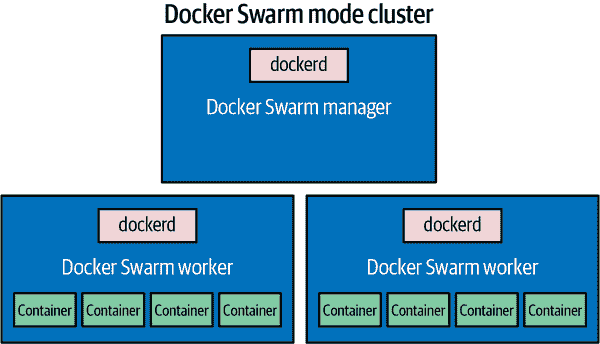
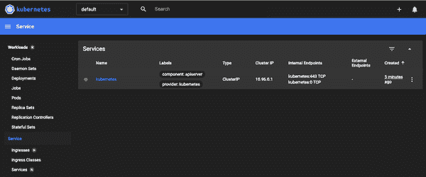
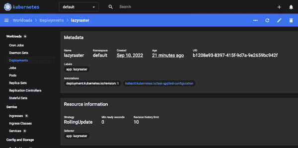

# 第十章：规模化容器

容器的一个主要优势是其能够将底层硬件和操作系统抽象化，使得您的应用程序不受限于任何特定主机或环境。这有助于在您的数据中心内水平扩展无状态应用程序，也可以跨多个云提供商进行扩展，而无需遇到许多传统障碍。与运输容器的隐喻一致，在一个云上的容器看起来像在另一个云上的容器一样。

许多组织发现 Linux 容器的即插即用云部署吸引人，因为他们可以获得可扩展容器平台的许多即时好处，而无需完全自行构建。尽管如此，构建自己的云平台或数据中心的门槛实际上相当低，我们将很快介绍一些可选方案。

所有主要的公共云提供商都致力于原生支持 Linux 容器在其服务中的运行。一些最大的努力包括以下内容：

+   [亚马逊弹性容器服务](https://aws.amazon.com/ecs)

+   [Google Cloud Run](https://cloud.google.com/run)

+   [Azure 容器应用](https://azure.microsoft.com/en-us/services/container-apps)

许多相同的公司还拥有强大的托管 Kubernetes 服务，比如这些：

+   [亚马逊弹性 Kubernetes 服务](https://aws.amazon.com/eks)

+   [Google Kubernetes Engine](https://cloud.google.com/kubernetes-engine)

+   [Azure Kubernetes 服务](https://azure.microsoft.com/en-us/services/kubernetes-service)

在公共云中的 Linux 实例上安装 Docker 很简单。但将 Docker 部署到服务器通常只是创建完整生产环境的第一步。您可以完全自行操作，或者使用来自主要云服务提供商、Docker 公司以及更广泛的容器社区的许多工具。大部分工具在公共云或您自己的数据中心中同样有效。

在调度器和更复杂的工具系统领域，我们有很多选择可以复制大部分来自公共云提供商的功能。即使在公共云中运行，有一些令人信服的理由可以选择在自己的 Linux 容器环境中运行，而不是使用现成的服务。

在本章中，我们将介绍一些运行 Linux 容器的选择，首先是更简单的 Docker Swarm 模式，然后深入一些更高级的工具，比如 Kubernetes 以及一些较大的云服务提供商。所有这些示例都应该让您了解如何利用 Docker 为应用程序工作负载提供极其灵活的平台。

# Docker Swarm 模式

在构建 Docker 引擎形式的容器运行时之后，Docker 的工程师们开始解决编排一组独立的 Docker 主机并有效地装载这些主机的容器的问题。从这项工作中演变出来的第一个工具被称为 Docker Swarm。正如我们之前解释的那样，有些令人困惑的是，现在有两个被称为“Swarm”的东西，都来自 Docker 公司。

最初的独立 Docker Swarm 现在通常被称为[Docker Swarm（经典版）](https://github.com/docker-archive/classicswarm)，但是有第二个“Swarm”实现，更具体地称为[Swarm 模式](https://docs.docker.com/engine/swarm)。这不是一个独立的产品，而是内置在 Docker 客户端中的功能。内置的 Swarm 模式比原始的 Docker Swarm 能力更强大，意图完全替代它。Swarm 模式的主要优势是不需要您单独安装任何东西。您已经在运行 Docker 的系统中具备了这种集群功能！这是我们将在这里关注的 Docker Swarm 实现。希望现在您知道有两个不同的 Docker Swarm 实现，您不会被互联网上的矛盾信息所困扰了。

Docker Swarm 模式背后的理念是向 `docker` 客户端工具呈现一个统一的界面，但这个界面由整个集群支持，而不是单个 Docker 守护程序。Swarm 主要用于通过 Docker 工具管理集群计算资源。自首次发布以来，它已经有了很大的发展，现在包含多个调度器插件，具有不同的容器分配策略，并且内置了一些基本的服务发现功能。但它仍然只是更复杂解决方案中的一个构建模块。

Swarm 集群可以包含一个或多个管理器，它们充当 Docker 集群的中央管理中心。最好设置一个奇数数量的管理器。每次只有一个管理器会充当集群的领导者。当您向 Swarm 添加更多节点时，您将它们合并成一个统一的集群，可以轻松使用 Docker 工具进行控制。

让我们启动一个 Swarm 集群。首先，您需要三个或更多可以在网络上相互通信的 Linux 服务器。每个服务器都应该运行来自官方 Docker 软件仓库的最新版本的 Docker Community Edition。

###### 提示

参考第三章获取关于在 Linux 上安装 `docker-ce` 包的详细信息。

对于本示例，我们将使用三台运行 `docker-ce` 的 Ubuntu 服务器。您需要做的第一件事就是 `ssh` 到您想要用作 Swarm 管理器的服务器上，然后使用 Swarm 管理器的 IP 地址运行 `swarm init` 命令：

```
$ ssh 172.17.4.1
…

ubuntu@172.17.4.1:$ sudo docker swarm init --advertise-addr 172.17.4.1

Swarm initialized: current node (hypysglii5syybd2zew6ovuwq) is now a manager.

To add a worker to this swarm, run the following command:

 docker swarm join --token SWMTKN-1-14……a4o55z01zq 172.17.4.1:2377

To add a manager to this swarm, run 'docker swarm join-token manager'
and follow the instructions.
```

###### 警告

有一些步骤是你必须采取的，以便安全地配置 Docker Swarm 模式集群，这里我们不涉及。在任何长期运行的系统上运行 Docker Swarm 模式之前，确保你了解选项并采取了适当的措施来保护环境。

###### 提示

在本章的许多示例中，你必须使用正确的 IP 地址来管理和工作节点。

这个步骤将初始化 Swarm 管理器，并为想要加入集群的节点提供所需的令牌。请将此令牌保存在安全的地方，比如密码管理器中。如果你丢失了这个令牌，也不用太担心；你总可以通过在管理器上运行以下命令再次获取它：

```
sudo docker swarm join-token --quiet worker
```

你可以通过运行本地的`docker`客户端，指向新管理节点的 IP 地址，来检查到目前为止的进展：

```
$ docker -H 172.17.4.1 system info
```

```
…
Swarm: active
  NodeID: l9gfcj7xwii5deveu3raf4782
  Is Manager: true
  ClusterID: mvdaf2xsqwjwrb94kgtn2mzsm
  Managers: 1
  Nodes: 1
  Default Address Pool: 10.0.0.0/8
  SubnetSize: 24
  Data Path Port: 4789
  Orchestration:
   Task History Retention Limit: 5
  Raft:
   Snapshot Interval: 10000
   Number of Old Snapshots to Retain: 0
   Heartbeat Tick: 1
   Election Tick: 10
  Dispatcher:
   Heartbeat Period: 5 seconds
  CA Configuration:
   Expiry Duration: 3 months
   Force Rotate: 0
  Autolock Managers: false
  Root Rotation In Progress: false
  Node Address: 172.17.4.1
  Manager Addresses:
   172.17.4.1:2377
…
```

你还可以使用以下命令列出当前集群中的所有节点：

```
$ docker -H 172.17.4.1 node ls

ID      HOSTNAME      STATUS AVAILABILITY MANAGER STATUS ENGINE VERSION
l9…82 * ip-172-17-4-1 Ready  Active       Leader         20.10.7
```

目前，你可以将这两个额外的服务器添加为 Swarm 集群的工作节点。如果你要扩展生产环境，Swarm 使这变得非常简单：

```
$ ssh 172.17.4.2 \
    "sudo docker swarm join --token SWMTKN-1-14……a4o55z01zq 172.17.4.1:2377"

This node joined a swarm as a worker.

$ ssh 172.17.4.3 \
    "sudo docker swarm join --token SWMTKN-1-14……a4o55z01zq 172.17.4.1:2377"

This node joined a swarm as a worker.
```

###### 提示

添加额外的管理节点很重要，操作与添加工作节点一样简单。你只需传入管理节点加入令牌，而不是工作节点加入令牌。你可以通过在任何活动节点上运行`docker swarm join-token manager`来获取此令牌。

如果你重新运行`docker node ls`，你现在应该会看到你的集群中总共有三个节点，只有一个节点被标记为`Leader`：

```
$ docker -H 172.17.4.1 node ls

ID      HOSTNAME      STATUS AVAILABILITY MANAGER STATUS ENGINE VERSION
l9…82 * ip-172-17-4-1 Ready  Active       Leader         20.10.7
3d…7b   ip-172-17-4-2 Ready  Active                      20.10.7
ip…qe   ip-172-17-4-3 Ready  Active                      20.10.7
```

这就是在 Swarm 模式下启动和运行 Swarm 集群所需的全部步骤（图 10-1）！



###### 图 10-1\. 简单的 Docker Swarm 模式集群

接下来你应该创建一个网络供你的服务使用。Swarm 中有一个名为`ingress`的默认网络，但为了更好的隔离，创建额外的网络非常简单：

```
$ docker -H 172.17.4.1 network create --driver=overlay default-net

ckwh5ph4ksthvx6843ytrl5ik

$ docker -H 172.17.4.1 network ls

NETWORK ID     NAME              DRIVER    SCOPE
494e1a1bf8f3   bridge            bridge    local
xqgshg0nurzu   default-net       overlay   swarm
2e7d2d7aaf0f   docker_gwbridge   bridge    local
df0376841891   host              host      local
n8kjd6oa44fr   ingress           overlay   swarm
b4720ea133d6   none              null      local
```

到目前为止，我们只是启动了基本组件，到目前为止我们还没有部署任何实际的业务逻辑。现在让我们将第一个服务部署到集群中。你可以使用如下命令：

```
$ docker -H 172.17.4.1 service create --detach=true --name quantum \
    --replicas 2 --publish published=80,target=8080 --network default-net \
    spkane/quantum-game:latest

tiwtsbf270mh83032kuhwv07c
```

我们启动的服务会启动容器，托管[*量子游戏*](https://github.com/stared/quantum-game)。这是一款基于浏览器的解谜游戏，使用真实的量子力学。我们希望这个例子比另一个 Hello World 更有趣！

###### 警告

虽然在许多示例中我们使用了`latest`标签，但在生产环境中你永远不应该使用这个标签。对于本书来说，使用这个标签非常方便，因为我们可以轻松地更新代码，但这个标签是不稳定的，无法在长时间内固定在特定版本上。这意味着如果你使用`latest`，你的部署将无法重复！它还可能导致一个情况，即在所有服务器上运行的应用程序版本不同。

让我们通过运行`docker service ps`命令来查看那些容器最终在哪里。

```
$ docker -H 172.17.4.1 service ps quantum

ID    NAME      IMAGE       NODE          DESIRED… CURRENT… ERROR PORTS
rk…13 quantum.1 spkane/qua… ip-172-17-4-1 Running  Running…
lz…t3 quantum.2 spkane/qua… ip-172-17-4-2 Running  Running…
```

Swarm 模式在节点之间使用路由网格自动将流量路由到能够处理请求的容器上。当您在`docker service create`命令中指定一个发布端口时，网格使得可以在三个节点的任何一个上命中这个端口，并将您路由到 Web 应用程序。请注意，尽管您只运行了两个实例，但我们说的是任何*三*个节点都可以。传统上，您可能还需要设置一个单独的反向代理层来完成这一点，但在 Swarm 模式中它已经包含在内了。

为了验证这一点，您现在可以通过将 Web 浏览器指向任何一个节点的 IP 地址来测试服务：

```
http://172.17.4.1/
```

如果一切按预期工作，您应该会看到[《量子游戏》](https://quantumgame.io)的第一个拼图板：

```
To get a list of all the services, we can use +service ls+:
```

```
$ docker -H 172.17.4.1 service ls

ID    NAME    MODE       REPLICAS IMAGE                      PORTS
iu…9f quantum replicated 2/2      spkane/quantum-game:latest *:80->8080/tcp
```

这为我们提供了最常需要的信息的摘要视图，但有时这还不够。就像 Docker 为容器保留了很多其他元数据一样，它也为服务保留了很多其他详细信息。我们可以使用`service inspect`来获取关于服务的详细信息：

```
$ docker -H 172.17.4.1 service inspect --pretty quantum
```

```
ID:    iuoh6oxrec9fk67ybwuikutqa
Name:    quantum
Service Mode:  Replicated
 Replicas:  2
Placement:
UpdateConfig:
 Parallelism:  1
 On failure:  pause
 Monitoring Period: 5s
 Max failure ratio: 0
 Update order:      stop-first
RollbackConfig:
 Parallelism:  1
 On failure:  pause
 Monitoring Period: 5s
 Max failure ratio: 0
 Rollback order:    stop-first
ContainerSpec:
 Image:    spkane/quantum-game:latest@sha256:1f57…4a8c
 Init:    false
Resources:
Networks: default-net
Endpoint Mode:  vip
Ports:
  PublishedPort = 80
  Protocol = tcp
  TargetPort = 8080
  PublishMode = ingress
```

这里有很多信息，所以让我们指出一些更重要的事情。首先，我们可以看到这是一个具有两个副本的复制服务，就像我们在`service ls`命令中看到的一样。我们还可以看到 Docker 每隔 5 秒对服务进行健康检查。运行对服务的更新将使用`stop-first`方法，这意味着它将首先将我们的服务减少到*N*−1，然后启动一个新实例将我们带回*N*。您可能希望始终在*N*+1 模式下运行，以便在生产环境中进行更新时不会出现节点宕机。您可以使用`service update`命令的`--update-order=start-first`选项来更改这一点。在回滚场景中，它将表现出相同的行为，我们可以使用`--rollback-order=start-first`来同样更改。

在实际场景中，我们不仅需要能够启动我们的服务，还需要能够对其进行扩展和缩减。如果我们不得不重新部署来完成这些操作，那将是一件很糟糕的事情，更不用说可能会引入任意数量的其他问题了。幸运的是，Swarm 模式使得通过一个简单的命令就能轻松扩展我们的服务变得很容易。要将运行的实例数量从两个增加到四个，您只需运行以下命令：

```
$ docker -H 172.17.4.1 service scale --detach=false quantum=4

quantum scaled to 4
overall progress: 4 out of 4 tasks
1/4: running   [==================================================>]
2/4: running   [==================================================>]
3/4: running   [==================================================>]
4/4: running   [==================================================>]
verify: Service converged
```

###### 注意

我们在上一个命令中使用了`--detach=false`，这样更容易看到正在发生的事情。

现在，我们可以使用`service ps`来显示 Swarm 已经按我们的要求执行了操作。这是我们之前运行的同一个命令，但现在我们应该有更多的副本在运行了！但等等，我们不是要求比节点数更多的副本吗？

```
$ docker -H 172.17.4.1 service ps quantum

ID    NAME      IMAGE        NODE          DESIRED… CURRENT… ERROR PORTS
rk…13 quantum.1 spkane/quan… ip-172-17-4-1 Running  Running…
lz…t3 quantum.2 spkane/quan… ip-172-17-4-2 Running  Running…
mh…g8 quantum.3 spkane/quan… ip-172-17-4-3 Running  Running…
cn…xb quantum.4 spkane/quan… ip-172-17-4-1 Running  Running…
```

您会注意到您在同一台主机上运行了两个服务。您是否预期到了这一点？这对于主机的弹性可能不是理想的选择，但默认情况下，Swarm 会优先确保您获得您请求的实例数量，而不是在可能的情况下跨主机分布单个容器。如果节点不足，您将在每个节点上获取多个副本。在实际情况下，当您失去整个节点时，您需要仔细考虑放置和扩展。您的应用程序在减少规模时是否仍然为用户服务？

当您需要部署软件的新版本时，您将希望使用`docker service update`命令。此命令有很多选项，但以下是一个示例：

```
$ docker -H 172.17.4.1 service update --update-delay 10s \
    --update-failure-action rollback --update-monitor 5s \
    --update-order start-first --update-parallelism 1 \
    --detach=false \
    --image spkane/quantum-game:latest-plus quantum

quantum
overall progress: 4 out of 4 tasks
1/4: running   [==================================================>]
2/4: running   [==================================================>]
3/4: running   [==================================================>]
4/4: running   [==================================================>]
verify: Service converged
```

运行此命令将导致 Swarm 逐个更新您的服务容器，在每次更新之间暂停。完成后，您应该能够在新的私人或无痕浏览会话中打开服务的 URL（以避开浏览器的本地缓存），并看到游戏背景现在是绿色而不是蓝色。

很好，您现在已成功应用了更新，但如果出现问题怎么办？我们可能需要部署先前的版本以恢复工作正常。现在，您可以使用我们之前稍作提到的`service rollback`命令，回滚到先前的版本，正确的蓝色背景如下：

```
$ docker -H 172.17.4.1 service rollback quantum

quantum
rollback: manually requested rollback
overall progress: rolling back update: 4 out of 4 tasks
1/4: running   [>                                                  ]
2/4: running   [>                                                  ]
3/4: running   [>                                                  ]
4/4: running   [>                                                  ]
verify: Service converged
```

对于无状态服务来说，这几乎是一个理想的回滚机制。您无需跟踪先前的版本；Docker 会为您做这些事情。您只需告诉它回滚，它就会从其内部存储中提取先前的元数据并执行回滚。就像在部署期间一样，Docker 可以健康检查您的容器，以确保回滚操作正常工作。

###### 注意

此回滚机制将始终返回到上次部署的版本，因此如果连续多次运行它，它将在两个版本之间切换。

基于`docker service`构建的命令称为`docker stack`，它使您能够将特别设计的*docker-compose.yaml*文件部署到 Docker Swarm 模式或 Kubernetes 集群中。如果您返回并检查我们在第八章中使用的 Git 存储库，我们可以将该容器堆栈的修改版本部署到当前的 Swarm 模式集群中：

```
$ git clone https://github.com/spkane/rocketchat-hubot-demo.git \
    --config core.autocrlf=input
```

在该存储库内部有一个名为*stack*的目录，其中包含我们之前使用过的*docker-compose.yaml*文件的修改版本：

```
$ cd rocketchat-hubot-demo/stack
```

如果您希望在 Swarm 模式集群中启动此设置，可以运行以下命令：

```
$ docker -H 172.17.4.1 stack deploy --compose-file docker-compose-stack.yaml \
    rocketchat

Creating network rocketchat_default
Creating service rocketchat_hubot
Creating service rocketchat_mongo
Creating service rocketchat_rocketchat
Creating service rocketchat_zmachine
```

现在，您可以列出集群中的堆栈，并查看堆栈添加了哪些服务：

```
$ docker -H 172.17.4.1 stack ls

NAME         SERVICES   ORCHESTRATOR
rocketchat   4          Swarm

$ docker -H 172.17.4.1 service ls

ID    NAME         …  …  IMAGE                              PORTS
iu…9f quantum      … 2/2 spkane/quantum-game:latest         *:80->8080/tcp
nh…jd …_hubot      … 1/1 rocketchat/hubot-rocketchat:latest *:3001->8080/tcp
gw…qv …_mongo      … 1/1 spkane/mongo:4.4
m3…vd …_rocketchat … 1/1 rocketchat/rocket.chat:5.0.4       *:3000->3000/tcp
lb…91 …_zmachine   … 1/1 spkane/zmachine-api:latest
```

###### 注意

这个 stack 是为基本演示目的而设计的，并没有经过对此用例的充分测试；不过，它应该能让您了解如何组装类似的东西。

你可能注意到，所有容器启动需要一些时间，并且 Hubot 将继续重启。这是预期的，因为 Rocket.Chat 还没有配置好。有关 Rocket.Chat 的设置详见 第八章。

此时，你可以将你的网页浏览器指向 Swarm 节点上的 3000 端口（例如，在这些示例中为 *http://172.17.4.1:3000/*），你应该能看到 Rocket.Chat 的初始设置页面。

你可以查看由堆栈管理的所有容器，使用`docker stack ps`：

```
$ docker -H 172.17.4.1 stack ps -f "desired-state=running" rocketchat

ID    NAME           IMAGE                    NODE … CURRENT STATE           …
b5…1h …_hubot.1      rocketchat/hubot-rocket… …-1  … Running 14 seconds ago
eq…88 …_mongo.1      spkane/mongo:4.4         …-2  … Running 11 minutes ago
5x…8u …_rocketchat.1 rocketchat/rocket.chat:… …-3  … Running 11 minutes ago
r5…x4 …_zmachine.1   spkane/zmachine-api:lat… …-4  … Running 12 minutes ago
```

当你完成后，可以执行以下命令来销毁这个堆栈：

```
$ docker -H 172.17.4.1 stack rm rocketchat

Removing service rocketchat_hubot
Removing service rocketchat_mongo
Removing service rocketchat_rocketchat
Removing service rocketchat_zmachine
Removing network rocketchat_default
```

###### 注意

如果你试图立即重新启动所有服务，可能会遇到一些意外错误。只需稍等片刻，等集群完成对旧网络的拆除，问题就会解决。

那么，如果你的其中一台服务器遇到问题需要下线怎么办？在这种情况下，你可以使用`docker node update`命令的`--availability`选项轻松地将单个节点上的所有服务排空。

让我们再次查看集群中的节点：

```
 docker -H 172.17.4.1 node ls

ID      HOSTNAME      STATUS AVAILABILITY MANAGER STATUS ENGINE VERSION
l9…82 * ip-172-17-4-1 Ready  Active       Leader         20.10.7
3d…7b   ip-172-17-4-2 Ready  Active                      20.10.7
ip…qe   ip-172-17-4-3 Ready  Active                      20.10.7
```

让我们也检查一下我们的容器目前在哪里运行：

```
$ docker -H 172.17.4.1 service ps -f "desired-state=running" quantum

ID    NAME        IMAGE       NODE          DESIRED… CURRENT… ERROR   PORTS
sc…1h quantum.1   spkane/qua… ip-172-17-4-1 Running  Running…
ax…om quantum.2   spkane/qua… ip-172-17-4-2 Running  Running…
p4…8h quantum.3   spkane/qua… ip-172-17-4-3 Running  Running…
g8…tw quantum.4   spkane/qua… ip-172-17-4-1 Running  Running…
```

###### 提示

在前面的命令中，我们使用了一个过滤器，以便输出仅显示当前运行的进程。默认情况下，Docker 还会以树形格式显示先前运行的容器，以便您可以在输出中看到更新和回滚等情况。

如果你确定 172.17.4.3 上的服务器需要停机，你可以通过修改 Swarm 中的`availability`状态为`drain`来排空该节点的任务，并将它们迁移到另一台主机：

```
$ docker -H 172.17.4.1 node update --availability drain ip-172-17-4-3

ip-172-17-4-3
```

如果我们检查节点，可以看到可用性现在已设置为`drain`：

```
$ docker -H 172.17.4.1 node inspect --pretty ip-172-17-4-3
```

```
ID:      ipohyw73hvf70td9licnls9qe
Hostname:                ip-172-17-4-3
Joined at:               2022-09-04 16:59:52.922451346 +0000 utc
Status:
 State:      Ready
 Availability:           Drain
 Address:    172.17.4.3
Platform:
 Operating System:  linux
 Architecture:    x86_64
Resources:
 CPUs:      2
 Memory:    7.795GiB
Plugins:
 Log:    awslogs, fluentd, gcplogs, gelf, journald, json-file, local,
         logentries, splunk, syslog
 Network:    bridge, host, ipvlan, macvlan, null, overlay
 Volume:    local
Engine Version:    20.10.7
TLS Info:
 TrustRoot:
…

 Issuer Subject:  …
 Issuer Public Key:  …
```

你可能想知道这对服务有什么影响。我们告诉其中一个节点停止运行服务的副本，它们要么消失了，要么迁移到其他地方。它做了什么呢？我们可以再次查看服务的详细信息，看到该主机上的所有运行容器已经移动到另一个节点：

```
$ docker -H 172.17.4.1 service ps -f "desired-state=running" quantum

ID    NAME        IMAGE       NODE          DESIRED… CURRENT… ERROR   PORTS
sc…1h quantum.1   spkane/qua… ip-172-17-4-1 Running  Running…
ax…om quantum.2   spkane/qua… ip-172-17-4-2 Running  Running…
p4…8h quantum.3   spkane/qua… ip-172-17-4-2 Running  Running…
g8…tw quantum.4   spkane/qua… ip-172-17-4-1 Running  Running…
```

此时，安全地关闭节点并进行所需的任何工作，使其恢复健康。当你准备好将节点重新添加到 Swarm 集群时，可以运行以下命令：

```
$ docker -H 172.17.4.1 node update --availability active ip-172-17-4-3

ip-172-17-4-3
```

目前我们不再检查节点，但如果你想看看这是什么样子，随时可以重新运行`node inspect`命令。

###### 警告

当你将节点重新添加到集群时，容器不会自动平衡！不过，新的部署或更新应该会导致容器均匀分布在节点上。

当你完成后，可以使用以下命令删除你的服务和网络：

```
$ docker -H 172.17.4.1 service rm quantum

quantum

$ docker -H 172.17.4.1 network rm default-net

default-net
```

然后验证它们确实完全消失了：

```
$ docker -H 172.17.4.1 service ps quantum

no such service: quantum

$ docker -H 172.17.4.1 network ls

NETWORK ID     NAME              DRIVER    SCOPE
494e1a1bf8f3   bridge            bridge    local
2e7d2d7aaf0f   docker_gwbridge   bridge    local
df0376841891   host              host      local
n8kjd6oa44fr   ingress           overlay   swarm
b4720ea133d6   none              null      local
```

目前就这些了！此时，如果你不再需要，可以安全地关闭所有作为 Swarm 集群一部分的服务器。

那是一场风暴之旅，但它涵盖了在 Docker Engine 中使用 Swarm 模式的基础知识，并应该帮助你开始构建自己的 Docker 集群，无论你决定在哪里使用它们。

# Kubernetes

现在让我们花些时间来了解一下 Kubernetes。自从 2014 年[DockerCon](https://events.docker.com/events/dockercon)期间向公众发布以来，Kubernetes 迅速发展，现在可能是最广泛采用的容器平台之一。它虽然不是今天最古老或最成熟的产品——这一荣誉归 Mesos，它在 2009 年首次推出，当时容器尚未广泛使用——但 Kubernetes 是专为容器化工作负载而构建的，具有丰富的功能组合，功能不断发展，并且拥有一个非常强大的社区，包括许多早期的 Docker 和 Linux 容器采用者。这种组合在多年来显著增加了其受欢迎程度。在 2017 年的 DockerCon EU 上，Docker, Inc.宣布 Kubernetes 支持将会整合到 Docker Engine 工具本身。Docker Desktop 能够快速部署单节点 Kubernetes 集群，并且客户端可以为开发目的部署容器堆栈。这为那些在本地使用 Docker 但要部署到 Kubernetes 的开发人员提供了一个很好的桥梁。

像 Linux 本身一样，Kubernetes 有几种发行版，包括免费和商业版本。现在有各种各样的发行版可用，并且受到不同程度的支持。Kubernetes 的广泛采用意味着现在它有一些非常好的本地开发安装工具。

###### 提示

本书中关于 Kubernetes 的覆盖旨在提供一些关于如何将你的 Linux 容器工作流与 Kubernetes 集成的基本指导，但我们在这里不会详细介绍 Kubernetes 生态系统。我们强烈推荐阅读[*Kubernetes: Up & Running*, 作者是 Brendan Burns 等人（O’Reilly）](https://www.oreilly.com/library/view/kubernetes-up-and/9781098110192)，或者其他一些优秀的资料，以熟悉所有相关的概念和术语。

## Minikube

Minikube 是最早用于管理本地 Kubernetes 安装的工具之一，也是我们将在这里重点介绍的第一个工具。在使用 Minikube 时学到的大部分概念可以应用于任何 Kubernetes 实现，包括我们将在 Minikube 之后讨论的选项，因此这是一个很好的起点。

###### 提示

运行本地 Kubernetes 集群的其他选项有很多。我们从`minikube`开始，因为它所生成的容器或虚拟机是一个标准的单节点 Kubernetes 安装。除了本节中将讨论的工具之外，我们强烈推荐探索[k3s](https://k3s.io)、[k3d](https://k3d.io)、[k0s](https://k0sproject.io)和[microk8s](https://microk8s.io)。

### 什么是 Minikube？

Minikube 是 Kubernetes 的一个完整分发版本，用于单个实例。它管理你计算机上的一个容器或虚拟机，提供一个可用的 Kubernetes 安装，并允许你使用与生产系统相同的所有工具。从范围上讲，它有点像 Docker Compose：它允许你在本地启动一个完整的堆栈。不过，它比 Compose 更进一步，因为它具有所有的生产 API。因此，如果你在生产中运行 Kubernetes，你可以在你的桌面上拥有一个在功能上相对接近，虽然不是在规模上相同的环境。

Minikube 相当独特，因为所有的分发都受一个单独的二进制文件控制，你下载并在本地运行它。它会自动检测你本地的容器化或虚拟机管理器，并设置和运行一个包含所有必要 Kubernetes 服务的容器或虚拟机。这意味着开始使用它非常简单。

所以让我们安装它！

### 安装 Minikube

大多数安装在所有平台上都是相同的，因为一旦你安装了工具，它们将是你访问运行 Kubernetes 安装的虚拟机的入口。要开始，请直接跳转到适用于你操作系统的部分。一旦你启动并运行了工具，你就可以按照共享的文档进行操作了。

为了有效使用 Minikube，我们需要两个工具：`minikube` 和 `kubectl`。对于我们简单的安装过程，我们将利用这两个命令都是静态二进制文件且没有外部依赖的事实，这使得它们易于安装。

###### 注意

安装 Minikube 还有几种其他方法。我们将展示在每个平台上我们认为是最简单的路径。如果你对如何安装这些应用程序有强烈的偏好，请随意使用你喜欢的方法。例如，在 Windows 上，你可能更喜欢使用[Chocolatey 包管理器](https://chocolatey.org)，或者在 Linux 上使用[Snap 包系统](https://snapcraft.io)。

#### macOS

就像在第三章中一样，你需要在你的系统上安装 Homebrew。如果没有，请回到第三章并确保你已经设置好了。一旦你做到了，安装`minikube`客户端就非常简单：

```
$ brew install minikube
```

这将导致 Homebrew 下载并安装 Minikube。根据你的配置，它会看起来像这样：

```
==> Downloading https://ghcr.io/v2/homebrew/core/kubernetes-cli/…/1.25.0
Already downloaded: …/Homebrew/downloads/…kubernetes-cli…manifest.json
==> Downloading https://ghcr.io/v2/homebrew/core/kubernetes-cli/blobs/sha256…
Already downloaded: …/Homebrew/downloads/…kubernetes-cli--1.25…bottle.tar.gz
==> Downloading https://ghcr.io/v2/homebrew/core/minikube/manifests/1.26.1
Already downloaded: …/Homebrew/downloads/…minikube-1.26.1.…_manifest.json
==> Downloading https://ghcr.io/v2/homebrew/core/minikube/blobs/sha256:…
Already downloaded: …/Homebrew/downloads/…minikube--1.26.1…bottle.tar.gz
==> Installing dependencies for minikube: kubernetes-cli
==> Installing minikube dependency: kubernetes-cli
==> Pouring kubernetes-cli--1.25.0.arm64_monterey.bottle.tar.gz  /opt/homebrew/Cellar/kubernetes-cli/1.25.0: 228 files, 52.8MB
==> Installing minikube
==> Pouring minikube--1.26.1.arm64_monterey.bottle.tar.gz
==> Caveats
Bash completion has been installed to:
  /opt/homebrew/etc/bash_completion.d
==> Summary  /opt/homebrew/Cellar/minikube/1.26.1: 9 files, 70.6MB
==> Running `brew cleanup minikube`…
Disable this behavior by setting HOMEBREW_NO_INSTALL_CLEANUP.
Hide these hints with HOMEBREW_NO_ENV_HINTS (see `man brew`).
==> Caveats
==> minikube
Bash completion has been installed to:
  /opt/homebrew/etc/bash_completion.d
```

那就是了！让我们测试一下，确保它在你的路径中：

```
$ which minikube
/opt/homebrew/bin/minikube
```

###### 注意

在*arm64*系统上，Homebrew 安装到*/opt/homebrew/bin*而不是*/usr/local/bin*。

如果你没有得到响应，你需要确保你的`PATH`环境变量中包含*/usr/local/bin*和*/opt/homebrew/bin*。假设通过了，现在你已经安装了`minikube`工具。

`kubectl`应该已经自动安装了，因为它是`minikube`的一个依赖项，但你也可以使用`brew`显式地安装它。通常情况下，Homebrew 中的`kubectl`版本将与当前`minikube`的发布版本匹配，因此使用`brew install`应该有助于避免不匹配：

```
$ brew install kubernetes-cli
```

我们将像测试`minikube`一样测试它：

```
$ which kubectl
/opt/homebrew/bin/kubectl
```

一切就绪！

#### Windows

与在 Windows 上安装 Docker Desktop 一样，你可能想要安装 Hyper-V 或另一个支持的虚拟化平台来运行 Kubernetes VM。要安装`minikube`，你只需下载二进制文件并将其放置在你的`PATH`中的一个位置，以便你可以在命令行上执行它。你可以从 GitHub 上下载[minikube 的最新发布版本](https://github.com/kubernetes/minikube/releases/latest)。你会想要将你下载的 Windows 可执行文件重命名为*minikube.exe*，否则你可能需要进行比你想象中更多的输入！

###### 提示

你可以在[Minikube 安装文档](https://minikube.sigs.k8s.io/docs/start)中找到有关 Windows 安装过程和该二进制可执行文件的更多详细信息。

然后，你需要获取最新的 Kubernetes CLI 工具`kubectl`来与你的分发版交互。不幸的是，没有一个*/latest*路径用于下载它。因此，为了确保你有最新版本，你需要从网站上[获取最新版本](https://storage.googleapis.com/kubernetes-release/release/stable.txt)，然后将其插入到 URL 中，就像这样：

*https://storage.googleapis.com/kubernetes-release/release/<VERSION>/bin/windows/amd64/kubectl.exe*.

下载完成后，你需要确保它可以从你的`PATH`中访问，以便于后续的探索工作。

#### Linux

在 Linux 上，你需要安装 Docker，并考虑安装 KVM（Linux 的基于内核的虚拟机）或 VirtualBox，这样`minikube`就可以为你创建和管理一个 Kubernetes 虚拟机。因为`minikube`只是一个单一的二进制文件，一旦安装了它，就不需要安装任何其他包。而且，由于`minikube`是一个静态链接的二进制文件，它应该可以在你想要运行它的任何发行版上工作。尽管我们可以将所有安装工作放在一行中进行，但我们将其分解成几个步骤，以便更容易理解和排查故障。请注意，在撰写本文时，二进制文件托管在*googleapis*上，通常会保持非常稳定的 URL。所以，我们开始吧：

```
# Download the file, save as 'minikube'
$ curl -Lo minikube \
  https://storage.googleapis.com/minikube/releases/latest/minikube-linux-amd64

# Make it executable
$ chmod +x minikube

# Move it to /usr/local/bin
$ sudo mv minikube /usr/local/bin/
```

你需要确保*/usr/local/bin*在你的路径中。既然我们已经有了`minikube`，我们还需要获取`kubectl`，我们可以这样做：

```
# Get the latest version number
$ KUBE_VERSION=$(curl -s \
    https://storage.googleapis.com/kubernetes-release/release/stable.txt)

# Fetch the executable
$ curl -LO \
    https://storage.googleapis.com/kubernetes-release/\
release/$(KUBE_VERSION)/bin/linux/amd64/kubectl

# Make it executable
$ chmod +x kubectl

# Move it to /usr/local/bin
$ sudo mv kubectl /usr/local/bin/
```

###### 注意

示例中的一个 URL 已经延续到下一行，以适应页面的边界。你可能需要重新组装 URL 并删除反斜杠，以使命令在你的环境中正常工作。

安装完成，我们已经准备好了。

### 运行 Kubernetes

现在我们有了`minikube`工具，可以用它来启动我们的 Kubernetes 集群。这通常相当简单。通常情况下，您不需要事先进行任何配置。在这个例子中，您会看到`minikube`决定使用*docker driver*，尽管还有其他可以选择的驱动程序。

要启动`minikube`，请继续运行以下命令：

```
$ minikube start

  minikube v1.26.1 on Darwin 12.5.1 (arm64)
  Automatically selected the docker driver. Other choices: parallels, ssh, …
  Using Docker Desktop driver with root privileges
  Starting control plane node minikube in cluster minikube
  Pulling base image …
  Downloading Kubernetes v1.24.3 preload …
    > preloaded-images-k8s-v18-v1…: 342.82 MiB / 342.82 MiB  100.00% 28.22 M
    > gcr.io/k8s-minikube/kicbase: 348.00 MiB / 348.00 MiB  100.00% 18.13 MiB
    > gcr.io/k8s-minikube/kicbase: 0 B [________________________] ?% ? p/s 16s
  Creating docker container (CPUs=2, Memory=4000MB) …
  Preparing Kubernetes v1.24.3 on Docker 20.10.17 …
    ▪ Generating certificates and keys …
    ▪ Booting up control plane …
    ▪ Configuring RBAC rules …
  Verifying Kubernetes components…
    ▪ Using image gcr.io/k8s-minikube/storage-provisioner:v5
  Enabled addons: storage-provisioner, default-storageclass
  Done! kubectl is now configured to use "minikube" cluster and
     "default" namespace by default
```

那么我们刚刚做了什么？Minikube 在一个命令中包含了很多内容。在这种情况下，我们启动了一个单独的 Linux 容器，在我们的本地系统上提供了一个功能齐全的 Kubernetes 安装。如果我们使用了`minikube`的虚拟化驱动程序之一，那么我们将在单个容器上创建一个运行 Kubernetes 的完整虚拟机，而不是一个完整的 VM。

它随后在主机上的 Linux 容器内运行 Kubernetes 的所有必要组件。您可以轻松探索`minikube`容器或 VM，看看您得到了什么：

```
$ minikube ssh

docker@minikube:~$
```

在您的 Kubernetes 集群上，您可能不经常使用 SSH 进入命令行。但是我们想要查看安装了什么，并了解到当我们运行`minikube`时，我们正在控制运行许多进程的环境。让我们看看在我们的 Kubernetes 集群上 Docker 实例上正在运行什么：

```
docker@minikube:~$ docker container ls

…ID   IMAGE       COMMAND               …  NAMES
48…cf ba…57      "/storage-provisioner" … k8s_storage-provisioner_storage-…
4e…8d ed…e8      "/coredns -conf /etc…" … k8s_coredns_coredns-6d4b75cb6d-…
1d…3d …pause:3.6 "/pause"               … k8s_POD_coredns-6d4b75cb6d-…
82…d3 7a…dc      "/usr/local/bin/kube…" … k8s_kube-proxy_kube-proxy-…
27…10 …pause:3.6 "/pause"               … k8s_POD_kube-proxy-zb6w2_kube-…
15…ce …pause:3.6 "/pause"               … k8s_POD_storage-provisioner_kube-…
ff…3d f9…55      "kube-controller-man…" … k8s_kube-controller-manager_kube-…
33…c5 …pause:3.6 "/pause"               … k8s_POD_kube-controller-manager-…
30…97 a9…df      "etcd --advertise-cl…" … k8s_etcd_etcd-minikube_kube-…
f5…41 53…a6      "kube-apiserver --ad…" … k8s_kube-apiserver_kube-apiserver-…
5b…08 8f…73      "kube-scheduler --au…" … k8s_kube-scheduler_kube-scheduler-…
87…cc …pause:3.6 "/pause"               … k8s_POD_kube-apiserver-…
5a…14 …pause:3.6 "/pause"               … k8s_POD_etcd-minikube_kube-…
6f…0c …pause:3.6 "/pause"               … k8s_POD_kube-scheduler-…
```

我们不会深入探讨每个组件是什么，但是现在您应该可以看到机制是如何工作的了。此外，由于这些组件只是容器，具有版本控制，并且可以从上游容器存储库中拉取，因此升级这些组件也非常容易。

请继续退出您在 Minikube 系统上的 shell：

```
docker@minikube:~$ exit
```

#### minikube 命令

出于空间和时间的考虑，我们不会列出所有`minikube`命令。我们鼓励您在不使用任何选项的情况下运行它，查看输出并尝试使用可用的功能。话虽如此，让我们快速浏览一些最有趣的命令。在安装应用程序堆栈的过程中，我们稍后会涵盖更多内容，但是这里有一个快速概述。

为了查看系统内部发生了什么，我们之前使用了`minikube ssh`，这对于直接调试或检查系统非常有用。如果没有直接访问 Minikube 系统，我们始终可以使用另一个`minikube`命令检查集群状态：

```
$ minikube status

minikube
type: Control Plane
host: Running
kubelet: Running
apiserver: Running
kubeconfig: Configured
```

这显示我们的一切看起来都很好。另外两个有用的命令包括：

| Command | Action |
| --- | --- |
| `minikube ip` | 检索 Minikube VM 的 IP 地址。 |
| `minikube update-check` | 检查您的 Minikube 版本是否与最新版本兼容。 |

要应用升级，您只需使用与最初安装相同的机制。

至关重要的是，`minikube status`命令还向我们显示`kubeconfig`已正确配置。我们将需要它来让`kubectl`知道如何连接到我们的集群。

我们使用`minikube start`启动了 Kubernetes 集群。正如您所期望的那样，遵循 Docker CLI 参数的风格，`minikube stop`将停止所有 Kubernetes 组件和 Linux 容器或虚拟机。要完全清理您的环境，您也可以通过运行`minikube delete`来删除集群。

### Kubernetes 仪表板

现在我们已经启动并运行了 Minikube，我们不仅可以使用命令行工具进行交互，还安装了一个完整的 Kubernetes 仪表板供我们探索。我们可以通过`minikube dashboard`命令访问它。请继续运行它——它应该会在您的 Web 浏览器中打开指向 Kubernetes 仪表板的正确 IP 地址和端口！仪表板上有很多内容，我们无法覆盖所有内容，但请随意点击并探索。根据您之前对 Kubernetes 的接触经验，仪表板侧边栏中的一些术语可能对您来说很熟悉，但其中许多可能完全陌生。如果您没有电脑在身边，图 10-2 显示了在仪表板侧栏的服务链接中看到的空 Minikube 安装的屏幕截图。



###### 图 10-2\. Kubernetes 仪表板（示例）

如果您在左侧边栏的集群下面的 Nodes 链接中探索，您应该会看到集群中的单个节点，名为`minikube`。这是我们启动的容器或虚拟机，而仪表板，就像其他组件一样，是托管在我们之前连接到 Minikube 系统时看到的其中一个容器中的。

###### 注意

Kubernetes 通过`kubectl`命令暴露了几乎所有在仪表板上看到的内容，这使得它非常适合使用 shell 脚本进行脚本化。

例如，运行`kubectl get services`或`kubectl get nodes`应该会显示与您在仪表板上看到的相同的信息。

在浏览时，您可能会注意到 Kubernetes 本身显示为系统中的一个组件，就像您的应用程序一样。

###### 注意

您需要键入 Ctrl-C 来退出`minikube dashboard`进程并返回到您的终端提示符。

### Kubernetes 容器和 Pod

现在我们已经搭建并运行了一个 Kubernetes 集群，并且您已经看到在本地执行此操作有多么简单，我们需要停下来讨论 Kubernetes 在容器抽象之上增加的一个概念。Kubernetes 出自 Google 运行其庞大平台的经验。Google 遇到了几乎所有可能出现在生产平台中的情况，并且不得不解决管理大规模安装时遇到的各种问题。在这个过程中，Google 创建了一套复杂的新抽象概念。Kubernetes 采纳了其中许多概念，因此有着自己的完整术语表。我们不打算深入所有这些内容，但理解其中最核心的新抽象概念至关重要——这个概念位于容器之上的层次，被称为 *pod*。

###### 注

*Pod* 这个术语的来源是因为 Docker 的吉祥物是鲸鱼 Moby，而鲸鱼的群体被称为 *pod*。

在 Kubernetes 的术语中，一个 **pod** 是一个或多个共享相同 cgroups 和命名空间的容器。您还可以使用 cgroups 和命名空间将同一 pod 内的容器彼此隔离。Pod 的目的是封装所有需要一起部署以创建一个功能单元的进程或应用程序，调度器随后可以管理这些单元。Pod 中的所有容器可以在 `localhost` 上彼此通信，这消除了彼此发现的任何需求。那么，为什么不只部署一个包含所有应用程序的大容器呢？与大容器相比，Pod 的优势在于您仍然可以单独限制每个应用程序的资源，并利用公共 Linux 容器库来构建您的应用程序。

另外，Kubernetes 管理员经常利用 pod 抽象，在 pod 启动时让一个容器运行，以确保其他容器的配置正确，维护共享资源或向其他人通告应用程序等。这使您可以比将所有内容组合到同一个容器中更精细地管理容器。Pod 抽象的另一个好处是能够共享挂载卷。

pod 的生命周期很像 Linux 容器。它们基本上是暂时的，并且根据应用程序或其运行的主机的生命周期可以重新部署到新主机上。在面向外部世界时，pod 中的容器甚至共享相同的 IP 地址，这意味着它们在网络级别看起来像一个单一实体。就像你每个容器只运行一个应用程序实例一样，你通常在一个 pod 内运行给定容器的一个实例。想要简单理解 pod 的最简单方法是，它们是一组 Linux 容器，它们一起工作，就像它们是一个容器一样，多数情况下。如果只需要一个容器，那么你仍然会得到一个由 Kubernetes 部署的 pod，但该 pod 只包含一个容器。这样做的好处是，从 Kubernetes 调度程序的角度来看，只有一个抽象：pod。容器由构建 pod 的运行时组件以及你用来定义它们的配置管理。

pod 和容器之间的一个关键区别是，你不会在构建步骤中构建 pod。它们是一个运行时的抽象，在 JSON 或 YAML 清单中定义，并且仅存在于 Kubernetes 内部。因此，你构建你的 Linux 容器并将它们发送到注册表，然后使用 Kubernetes 定义和部署你的 pods。实际上，你通常也不会直接描述一个 pod；工具会通过部署的概念为你生成它。但是 pod 是 Kubernetes 集群中执行和调度的单位。这其中还有很多内容，但这是基本概念，通过一个简单的例子可能更容易理解。pod 的抽象比以个别容器的形式思考你的系统更复杂，但它确实非常强大。

### 让我们部署一些东西

当在 Kubernetes 中处理 pod 时，我们通常通过*部署*的抽象来管理它们。部署只是一个 pod 定义，带有一些额外的信息，包括健康监控和复制配置。它包含了 pod 的定义以及一些关于它的元数据。所以让我们看一个基本的部署，并让它运行起来。

在 Kubernetes 上可以部署的最简单的东西是一个只包含一个容器的 pod。我们将使用[`httpbin`](https://httpbin.org) 应用程序来探索 Kubernetes 上部署的基础知识，并将我们的部署命名为 `hello-minikube`。

我们曾使用过 `minikube` 命令，但要在 Kubernetes 上完成任务，我们现在需要利用之前安装的 `kubectl` 命令：

```
$ kubectl create deployment hello-minikube \
    --image=kennethreitz/httpbin:latest --port=80

deployment.apps/hello-minikube created
```

要查看它对我们的影响，我们可以使用 `kubectl get all` 命令来列出现在我们集群中最重要的对象：

```
$ kubectl get all

NAME                                 READY   STATUS    RESTARTS   AGE
pod/hello-minikube-ff49df9b8-svl68   1/1     Running   0          2m39s

NAME                 TYPE        CLUSTER-IP   EXTERNAL-IP   PORT(S)   AGE
service/kubernetes   ClusterIP   10.96.0.1    <none>        443/TCP   98m

NAME                             READY   UP-TO-DATE   AVAILABLE   AGE
deployment.apps/hello-minikube   1/1     1            1           2m39s

NAME                                       DESIRED   CURRENT   READY   AGE
replicaset.apps/hello-minikube-ff49df9b8   1         1         1       2m39s
```

使用这个命令，Kubernetes 创建了一个部署，一个 ReplicaSet 来管理扩展，以及一个 pod。我们希望确保我们的 pod 显示 `STATUS` 为 `Running`。如果你的 pod 没有运行，请耐心等待并运行几次命令，直到看到状态变化。`service/kubernetes` 条目是代表 Kubernetes 本身的正在运行的服务。但是我们的服务在哪里？我们还不能到达它。实质上，它处于 Linux 容器的相同状态，如果你没有告诉它暴露任何端口的话。因此，我们需要告诉 Kubernetes 为我们做这件事：

```
$ kubectl expose deployment hello-minikube --type=NodePort
service/hello-minikube exposed
```

现在这已经创建了一个我们可以访问和交互的服务。*服务* 是一个应用程序的一个或多个部署的包装器，并可以告诉我们如何联系该应用程序。在这种情况下，我们得到一个 `NodePort`，它在集群中的每个节点上暴露一个端口，可以路由到底层的 pods。让我们让 Kubernetes 告诉我们如何到达它：

```
$ kubectl get services

NAME           TYPE      CLUSTER-IP     EXTERNAL-IP PORT(S)        AGE
hello-minikube NodePort  10.105.184.177 <none>      80:32557/TCP   8s
kubernetes     ClusterIP 10.96.0.1      <none>      443/TCP        107m
```

您可能认为现在可以连接到 *http://10.105.184.177:8080* 来访问我们的服务。但是由于 Minikube 运行的容器或虚拟机的原因，这些地址无法从您的主机系统访问。因此，我们需要让 `minikube` 告诉我们在哪里找到这个服务：

```
$ minikube service hello-minikube --url
http://192.168.99.100:30616
```

###### 提示

在某些配置中，您可能会看到这样的消息：

```
 Because you are using a Docker driver on darwin,
   the terminal needs to be open to run it.

```

这表明从主机到 Kubernetes 服务的网络透明地连线目前不可能，而且在探索应用程序时，您需要保持命令的运行。您可以使用本地的 Web 浏览器或打开另一个终端来运行诸如 `curl` 的命令。

当您完成时，您可以在原始终端会话中键入 Ctrl-C 来终止 `minikube service` 命令。

这个命令的好处，像许多其他 Kubernetes 命令一样，在正常情况下它是可脚本化和命令行友好的。如果我们想要在命令行上用 `curl` 打开它，通常只需在我们的请求中包含 `minikube` 命令调用即可：

```
$ curl -H foo:bar $(minikube service hello-minikube --url)/get
```

```
{
  "args": {},
  "headers": {
    "Accept": "*/*",
    "Foo": "bar",
    "Host": "127.0.0.1:56695",
    "User-Agent": "curl/7.85.0"
  },
  "origin": "172.17.0.1",
  "url": "http://127.0.0.1:56695/get"
}
```

`httpbin` 是一个简单的 HTTP 请求和响应 API，可用于测试和确认 HTTP 服务。虽然不是世界上最令人兴奋的应用程序，但可以看到我们能够通过 `curl` 联系到我们的服务并从中获取响应。

这是最简单的用例。我们没有进行太多配置，依赖 Kubernetes 使用其默认设置。在下一步中，我们将查看更复杂的内容。但首先，让我们关闭我们的新服务和部署。这需要两个命令：一个用于移除服务，另一个用于删除它：

```
$ kubectl delete service hello-minikube
service "hello-minikube" deleted

$ kubectl delete deployment hello-minikube
deployment.apps "hello-minikube" deleted

$ kubectl get all

NAME                 TYPE        CLUSTER-IP   EXTERNAL-IP   PORT(S)   AGE
service/kubernetes   ClusterIP   10.96.0.1    <none>        443/TCP   138m
```

### 部署一个现实的堆栈

现在让我们部署一个更接近生产环境的东西。我们将部署一个应用程序，该应用程序可以从 S3 存储桶中获取 PDF 文档，在本地磁盘上缓存它们，并根据请求将单个页面转换为 PNG 图像，使用缓存的文档。为了运行这个应用程序，我们希望将缓存文件写入容器之外的某个地方。我们希望它们放在一个更加永久和稳定的地方。这一次，我们希望能够重复操作，这样我们就不需要通过一系列需要记住并希望每次都能正确执行的命令来部署我们的应用程序。Kubernetes，与 Docker Compose 类似，让我们能够在一个或多个 YAML 文件中定义我们的堆栈，这些文件包含我们关心的所有定义。这是您在生产环境中所需的，并且类似于您在其他生产工具中看到的内容。

我们现在将创建的服务将被称为`lazyraster`（即“按需光栅化”），每当您在 YAML 定义中看到它时，您将知道我们指的是我们的应用程序。我们的持久卷将被称为`cache-data`。同样，Kubernetes 拥有一个我们无法完全涵盖的庞大词汇表，但为了清楚地说明我们正在查看的内容，我们需要介绍另外两个概念：`PersistentVolume` 和 `PersistentVolumeClaim`。`PersistentVolume` 是我们在集群内部署的物理资源。Kubernetes 支持多种类型的卷，从节点上的本地存储到 AWS 上的 [Amazon Elastic Block Store (Amazon EBS) volumes](https://docs.aws.amazon.com/AWSEC2/latest/UserGuide/AmazonEBS.html) 和其他云提供商上的类似卷，还支持 [Network File System (NFS)](https://en.wikipedia.org/wiki/Network_File_System) 和其他更现代的网络文件系统。`PersistentVolume` 存储具有与我们的应用程序或部署独立的生命周期的数据。这使我们能够存储在应用程序部署之间持续存在的数据。对于我们的缓存来说，这就是我们将要使用的内容。`PersistentVolumeClaim` 是 `PersistentVolume` 物理资源与需要使用它的应用程序之间的链接。我们可以在索赔上设置策略，允许单个读/写索赔或多个读取索赔。对于我们的应用程序，我们只需要一个单个的读/写索赔到我们的 `cache-data` `PersistentVolume`。

###### 提示

如果您想了解我们在这里谈论的一些概念的更多细节，Kubernetes 项目维护了一个术语表，其中包含操作 Kubernetes 所涉及的所有术语的 [词汇表](https://kubernetes.io/docs/reference/glossary/?fundamental=true)。这可能非常有帮助。术语表中的每个条目也链接到其他页面上更详细的详细信息。

您可以通过运行以下命令查看本节中将要使用的文件：

```
$ git clone \
    https://github.com/bluewhalebook/\
docker-up-and-running-3rd-edition.git --config core.autocrlf=input

Cloning into 'docker-up-and-running-3rd-edition'…
…

$ cd docker-up-and-running-3rd-edition/chapter_10/kubernetes
```

###### 注意

示例中的 URL 已经延续到下一行，以适应页边距。您可能需要重新组装 URL 并删除反斜杠，以使命令正常工作。

我们将从名为 *lazyraster-service.yaml* 的清单 YAML 文件开始。完整清单包含多个由 `---` 分隔的 YAML 文档。我们将在此单独讨论每个部分。

### 服务定义

```
apiVersion: v1
kind: Service
metadata:
  name: lazyraster
  labels:
    app: lazyraster
spec:
  type: NodePort
  ports:
    - port: 8000
      targetPort: 8000
      protocol: TCP
  selector:
    app: lazyraster
```

第一部分定义了我们的 `Service`。稍后我们将看到的第二部分和第三部分分别定义了我们的 `PersistentVolumeClaim` 和实际的 `Deployment`。我们告诉 Kubernetes 我们的服务将被称为 `lazyraster`，并且将暴露在端口 8000 上，这映射到容器中的实际 8000 端口。我们用 `NodePort` 机制暴露了这一点，它简单地确保我们的应用在每个主机上的同一端口上暴露，类似于 `docker container run` 的 `--publish` 标志。这在 `minikube` 中非常有帮助，因为我们将只运行一个实例，而 `NodePort` 类型使我们可以像之前一样从我们的计算机访问它变得容易。与 Kubernetes 的许多部分一样，除了 `NodePort` 外还有几个选项，您可能会找到适合生产环境的理想机制。`NodePort` 对于 `minikube` 来说很好，但对于更静态配置的负载均衡器也可能很有效。

回到我们的 `Service` 定义。`Service` 将通过 `selector` 与 `Deployment` 连接，我们在 `spec` 部分中应用它。Kubernetes 广泛使用标签作为推理类似组件和帮助将它们全部绑在一起的方式。标签是任意定义的键值对，然后可以查询以识别系统中的部件。这里的 `selector` 告诉 Kubernetes 查找具有标签 `app: lazyraster` 的 `Deployment`。注意，我们也将相同的标签应用于 `Service` 本身。如果以后我们想要识别所有组件，这非常有帮助，但是 `selector` 部分将 `Deployment` 与我们的 `Service` 绑定在一起。所以现在我们有了一个 `Service`，但它还没有做任何事情。我们需要更多的定义来使 Kubernetes 做我们想要的事情。

### 持久卷声明定义

```
apiVersion: v1
kind: PersistentVolumeClaim
metadata:
  name: cache-data-claim
  labels:
    app: lazyraster
spec:
  accessModes:
    - ReadWriteOnce
  resources:
    requests:
      storage: 100Mi
```

接下来的部分定义了我们的`PersistentVolumeClaim`，同样也定义了支持它的`PersistentVolume`。`PersistentVolumeClaim`是一种命名卷并声明您有权以特定方式访问该特定卷的方式。请注意，我们这里没有定义`PersistentVolume`。这是因为 Kubernetes 正在为我们做这项工作，使用它所谓的*动态卷分配*。在我们的情况下，使用非常简单：我们想要对一个卷进行读/写声明，让 Kubernetes 为我们把它放在一个卷容器中。但是，您可以想象一种情况，即应用程序将部署到云提供商中，并且动态分配将真正发挥其作用。在这种情况下，我们不希望必须单独调用以使我们的卷在云中为我们创建。我们希望 Kubernetes 处理这些事务。这就是动态卷分配的全部内容。在这里，它只是为我们创建一个容器来保存我们的持久数据，并在我们声明要求时将其挂载到我们的 pod 中。在这一部分，我们没有做太多事情，除了命名它，要求 100 MB 的数据，并告诉 Kubernetes 它是一个只读/写的一次性挂载卷。

###### 注意

Kubernetes 中有许多可能的卷提供程序。哪些提供程序适合您部分取决于您正在运行的提供程序或云服务。当您准备投入生产时，您应该看一看，看看哪些选项对您最有意义。

### 部署定义

```
apiVersion: apps/v1
kind: Deployment
metadata:
  name: lazyraster
  labels:
    app: lazyraster
spec:
  selector:
    matchLabels:
      app: lazyraster
  strategy:
    type: RollingUpdate
  template:
    metadata:
      labels:
        app: lazyraster
    spec:
      containers:
      - image: relistan/lazyraster:demo
        name: lazyraster
        env:
        - name: RASTER_RING_TYPE
          value: memberlist
        - name: RASTER_BASE_DIR
          value: /data
        ports:
        - containerPort: 8000
          name: lazyraster
        volumeMounts:
        - name: cache-data
          mountPath: /data
      volumes:
      - name: cache-data
        persistentVolumeClaim:
          claimName: cache-data-claim
```

`Deployment`为我们创建了 pod，并使用 Linux 容器来运行我们的应用程序。我们为应用程序定义了一些元数据，包括其名称和一个标签，就像我们为其他定义所做的那样。我们还在这里应用了另一个`selector`来查找我们绑定的其他资源。在`strategy`部分，我们说我们希望进行`RollingUpdate`，这是一种策略，它导致我们的 pod 在部署过程中一个接一个地被循环。我们还可以选择`Recreate`，它将简单地销毁所有现有的 pod，然后在之后创建新的 pod。

在`template`部分，我们定义了如何生成此部署的副本。容器定义包括 Docker 镜像名称、要映射的端口、要挂载的卷以及`lazyraster`应用程序需要的一些环境变量。`spec`的最后一部分要求我们有一个名为`cache-data-claim`的`PersistentVolumeClaim`。

应用程序定义就是这样了。现在让我们启动它吧！

###### 注意

这里有许多更多的选项和丰富的指令集，您可以在这里指定，告诉 Kubernetes 如何处理您的应用程序。我们已经介绍了一些简单的选项，但我们鼓励您探索 Kubernetes 文档以了解更多信息。

### 部署应用程序

在继续之前，让我们使用`kubectl`命令来查看我们的 Kubernetes 集群中有什么：

```
$ kubectl get all

NAME                 TYPE        CLUSTER-IP   EXTERNAL-IP   PORT(S)   AGE
service/kubernetes   ClusterIP   10.96.0.1    <none>        443/TCP   160m
```

目前我们只定义了一个名为`service/kubernetes`的服务。在 Kubernetes 中广泛使用的命名约定是使用对象`Kind`的类型作为对象的前缀，有时会缩写为两个或三个字母的缩写。有时你会看到`service`表示为`svc`。如果你好奇的话，可以通过运行命令`kubectl api-resources`来查看所有资源及其简称。所以让我们继续将我们的服务、部署和卷放入集群中吧！

```
$ kubectl apply -f ./lazyraster-service.yaml

service/lazyraster created
persistentvolumeclaim/cache-data-claim created
deployment.apps/lazyraster created
```

那个输出看起来像我们预期的：我们有一个服务、一个持久卷索赔和一个部署。所以现在让我们看看集群中有什么：

```
$ kubectl get all

NAME                              READY   STATUS    RESTARTS   AGE
pod/lazyraster-644cb5c66c-zsjxd   1/1     Running   0          17s

NAME               TYPE      CLUSTER-IP     EXTERNAL-IP PORT(S)        AGE
service/kubernetes ClusterIP 10.96.0.1      <none>      443/TCP        161m
service/lazyraster NodePort  10.109.116.225 <none>      8000:32544/TCP 17s

NAME                         READY   UP-TO-DATE   AVAILABLE   AGE
deployment.apps/lazyraster   1/1     1            1           17s

NAME                                    DESIRED   CURRENT   READY   AGE
replicaset.apps/lazyraster-644cb5c66c   1         1         1       17s
```

你可以看到幕后发生了更多的事情。还有，我们的卷或持久卷索赔在哪里？我们必须单独请求它：

```
$ kubectl get pvc

NAME             STATUS VOLUME    CAPACITY ACCESS MODES STORAGECLASS AGE
cache-data-claim Bound  pvc-1a…41 100Mi    RWO          standard     65s
```

###### 提示

`kubectl get all`并不做任何这样的事情。更恰当地说，它应该被命名为`get all-of-the-most-common-resources`，但你可以获取几个其他资源。Kubernetes 项目提供了一个方便的[速查表](https://kubernetes.io/docs/reference/kubectl/cheatsheet)，以使其更易于发现。

那么`get all`输出中出现的`replicaset.apps`是什么呢？那是一个 ReplicaSet。ReplicaSet 是 Kubernetes 的一部分，负责确保我们的应用始终运行正确数量的实例，并保持它们的健康状态。通常我们不需要担心 ReplicaSet 内部发生的事情，因为我们创建的部署会为我们管理它。如果需要的话，你可以自己管理 ReplicaSet，但大多数情况下你不需要或者不想这样做。

我们没有告诉`kubectl`要多少个实例，所以我们得到了一个。我们可以看到期望状态和当前状态都匹配。我们稍后再看看这个。但首先，让我们连接到我们的应用程序，看看我们有什么：

```
$ minikube service --url lazyraster
http://192.168.99.100:32185
```

你可能会得到一个不同的 IP 地址和端口。没关系！这是非常动态的东西。这就是为什么我们使用`minikube`命令来为我们管理它。

还记得`minikube`会在你探索`lazyraster`服务时警告你需要保持`service`命令运行。所以获取返回的地址，打开你的网页浏览器，并将其粘贴到 URL 栏中，像这样：*http://<192.168.99.100:32185>/documents/docker-up-and-running-public/sample.pdf?page=1*。你需要将 IP 和端口替换到 URL 中以使其对你有效。

您需要连接到互联网，因为 `lazyraster` 应用程序将会访问互联网，从公共 S3 存储桶获取一个 PDF 文档，然后进行所谓的 *光栅化* 过程，将文档的第一页渲染为 PNG 图像。如果一切正常，您应该能看到这本书早期版本的封面的副本！这本特定的 PDF 有两页，因此您可以尝试将参数更改为 `?page=2`。如果这样做，您可能会注意到渲染速度比第一页要快得多。这是因为应用程序正在使用我们的持久卷缓存数据。您还可以指定 `width=2048`，或者请求 JPEG 格式而不是 PNG 格式。您可以像这样将封面渲染为一个非常大的 JPEG：

*http://<192.168.99.100:32185>/documents/docker-up-and-running-public/sample.pdf?page=1&imageType=image/jpeg&width=2048*

如果您有一个公共 S3 存储桶，并且其中还有其他 PDF 文档，您可以简单地在 URL 中将存储桶名称替换为 `docker-up-and-running-public`，以访问您的存储桶。如果您想进一步测试这个应用程序，请查看 [GitHub 上 *Nitro*/*lazyraster* 仓库](https://github.com/Nitro/lazyraster)。

### 扩展操作

在现实生活中，您不仅仅部署应用程序；还要运行它们。定时工作负载的一个巨大优势是能够根据系统可用的资源约束随意扩展或缩减它们。在我们的情况下，我们只有一个 Minikube 节点，但是我们仍然可以扩展我们的服务，以更好地处理负载并在部署期间提供更多可靠性。您可以想象，Kubernetes 允许轻松地扩展和缩减。对于我们的服务，我们只需一个命令即可完成。然后我们将再次查看 `kubectl` 输出以及我们之前介绍的 Kubernetes 仪表板，以证明服务已扩展。

在 Kubernetes 中，我们要扩展的不是服务，而是部署。这是其样子：

```
$ kubectl scale --replicas=2 deploy/lazyraster
deployment.apps/lazyraster scaled
```

太好了，这次有反应了！但我们得到了什么呢？

```
$ kubectl get deployment/lazyraster

NAME         READY   UP-TO-DATE   AVAILABLE   AGE
lazyraster   2/2     2            2           16m
```

现在我们有两个应用程序实例在运行。让我们看看日志内容：

```
$ kubectl logs deployment/lazyraster

Found 2 pods, using pod/lazyraster-644cb5c66c-zsjxd
Trying to clear existing Lazyraster cached files (if any) in the background…
Launching Lazyraster service…
time="2022-09-10T21:14:16Z" level=info msg="Settings -----------------…
time="2022-09-10T21:14:16Z" level=info msg="  * BaseDir: /data"
time="2022-09-10T21:14:16Z" level=info msg="  * HttpPort: 8000"
…
time="2022-09-10T21:14:16Z" level=info msg="  * LoggingLevel: info"
time="2022-09-10T21:14:16Z" level=info msg="--------------------------…
…
time="2022-09-10T21:14:16Z" level=info msg="Listening on tcp://:6379"
…
```

我们要求部署的日志，但 Kubernetes 告诉我们有两个 Pod 正在运行，所以它只是选择其中一个来显示日志。我们可以看到复制正在启动。如果我们想指定一个特定的实例来查看，我们可以使用 `kubectl get pods` 的输出来找到那个 Pod，并使用类似 `kubectl logs pod/lazyraster-644cb5c66c-zsjxd` 的命令获取该 Pod 的日志。

现在我们有几个应用程序副本在运行。这在 Kubernetes 仪表板上是什么样子？让我们通过 `minikube dashboard` 导航到那里。一旦到达那里，我们将从左侧边栏选择“工作负载 - 部署”，然后点击 `lazyraster` 部署，这将显示一个看起来像 Figure 10-3 的屏幕。



###### 图 10-3\. `lazyraster` 服务仪表板（示例）

我们鼓励你在 Kubernetes 仪表板中多点击几下，看看还有什么其他信息。有了你在这里学到的概念，很多事情现在应该更清晰了，你可能还可以自行探索更多。同样，`kubectl` 还有许多其他可用选项，其中许多在真实生产系统中可能会用到。我们之前讨论的[速查表](https://kubernetes.io/docs/reference/kubectl/cheatsheet)在这里确实是一个救命稻草！

如常，你可以随时键入 Ctrl-C 退出运行中的 `minikube dashboard` 命令。

### kubectl API

我们还没有向你展示 API，正如我们之前与 Docker 讨论的那样，拥有一个简单的 API 以供脚本编写、编程和其他一般操作需求非常有用。你可以编写程序直接与 Kubernetes API 交互，但对于本地开发和其他简单用例，你可以使用 `kubectl` 作为 Kubernetes 的一个良好代理，并提供了一个可以通过 `curl` 和 JSON 命令行工具访问的清晰 API。以下是一个你可以做的示例：

```
$ kubectl proxy
Starting to serve on 127.0.0.1:8001
```

现在我们已经让 `kubectl` 本身在本地系统上提供了一个 Web API！你需要进一步了解可能性，但让我们让它显示 `lazyraster` 应用程序的各个实例。我们可以通过在浏览器中打开以下 URL 或在另一个终端窗口中使用 `curl` 来实现：*http://localhost:8001/api/v1/namespaces/default/endpoints/lazyraster*。

这里输出很多，但我们关心的部分是 `subsets` 部分：

```
{
…
  "subsets": [
    {
      "addresses": [
        {
          "ip": "172.17.0.5",
          "nodeName": "minikube",
          "targetRef": {
            "kind": "Pod",
            "namespace": "default",
            "name": "lazyraster-644cb5c66c-zsjxd",
            "uid": "9631395d-7e68-47fa-bb9f-9641d724d8f7"
          }
        },
        {
          "ip": "172.17.0.6",
          "nodeName": "minikube",
          "targetRef": {
            "kind": "Pod",
            "namespace": "default",
            "name": "lazyraster-644cb5c66c-pvcmj",
            "uid": "e909d424-7a91-4a74-aed3-69562b74b422"
          }
        }
      ],
      "ports": [
        {
          "port": 8000,
          "protocol": "TCP"
        }
      ]
    }
  ]
}
```

这里有趣的地方在于我们可以看到两个实例都在 Minikube 主机上运行，并且它们具有不同的 IP 地址。如果我们正在构建一个需要知道应用程序的其他实例运行位置的云原生应用程序，这将是一个很好的方法。

你可以随时键入 Ctrl-C 退出运行中的 `kubectl proxy` 进程，然后可以通过运行以下命令来删除部署及其所有组件。Kubernetes 可能需要一两分钟来删除所有内容并返回到终端提示符：

```
$ kubectl delete -f ./lazyraster-service.yaml

service "lazyraster" deleted
persistentvolumeclaim "cache-data-claim" deleted
deployment.apps "lazyraster" deleted
```

最后，如果你目前已经完成了 Minikube 集群中的所有工作，你可以继续删除它：

```
$ minikube delete

  Deleting "minikube" in docker …
  Deleting container "minikube" …
  Removing /Users/spkane/.minikube/machines/minikube …
  Removed all traces of the "minikube" cluster.
```

###### 提示

Kubernetes 是一个非常庞大的系统，有着广泛的社区参与。我们仅仅展示了 Minikube 的冰山一角，但如果你感兴趣，还有许多其他 Kubernetes 发行版和工具可以探索。

## Docker Desktop-集成 Kubernetes

Docker Desktop 自带对一个集成的单节点 Kubernetes 集群的支持，可以通过在应用程序首选项中简单启用选项来运行。

集成的 Kubernetes 集群不易配置，但对于那些只需验证当前 Kubernetes 安装的基本功能的用户来说，它提供了一个非常便捷的选项。

要启用 Docker Desktop 内置的 Kubernetes 功能，请启动 Docker Desktop，然后从任务栏/菜单栏中的 Docker 鲸鱼图标打开首选项。然后选择 Kubernetes 选项卡，点击启用 Kubernetes，最后点击“应用并重启”按钮以对 VM 进行所需的更改。第一次这样做时，Docker 将利用[`kubeadm`](https://kubernetes.io/docs/reference/setup-tools/kubeadm)命令来设置 Kubernetes 集群。

###### 注意

如果你对 Docker Desktop 集成的 Kubernetes 如何设置感兴趣，Docker 有一篇很好的[博文](https://www.docker.com/blog/how-kubernetes-works-under-the-hood-with-docker-desktop)，详细介绍了其中一些细节。

这将创建一个名为`docker-desktop`的新`kubectl`上下文，并应自动切换到该上下文。

你可以通过运行以下命令来确认当前设置的上下文：

```
$ kubectl config current-context

docker-desktop
```

如果你需要更改当前的上下文，可以像这样操作：

```
$ kubectl config use-context docker-desktop --namespace=default

Switched to context "docker-desktop".
```

最后，如果你想完全取消当前上下文，可以使用以下命令：

```
$ kubectl config unset current-context

Property "current-context" unset.
```

一旦这个集群运行起来，你可以通过`kubectl`命令与它交互，就像任何其他 Kubernetes 集群一样。每当你关闭 Docker Desktop 时，这也会关闭 Kubernetes 集群。

如果你想完全禁用这个 Kubernetes 集群，回到首选项面板，选择 Kubernetes 选项卡，并取消选择启用 Kubernetes。

## 类型

我们最后要讨论的选项是`kind`，这是一个非常简单但非常有用的工具，允许你管理一个由一个或多个在 Docker 中运行的 Linux 容器组成的 Kubernetes 集群。工具名称`kind`是一个首字母缩略词，意思是“Kubernetes in Docker”，但也指的是 Kubernetes 中的对象类型在 API 中由一个名为`Kind`的字段标识。

###### 注意

你会发现在网络上搜索这个工具可能有点困难，但你总是可以在其主要[网站](https://kind.sigs.k8s.io)上找到该工具和文档。

`kind`提供了一个很好的折中方案，介于嵌入到 Docker VM 中的简单化 Kubernetes 集群和有时过于复杂的`minikube` VM 之间。`kind`作为一个单一的二进制文件分发，并可以通过你喜欢的包管理器安装，或者简单地访问[`kind`项目发布页面](https://github.com/kubernetes-sigs/kind/releases)，下载最新的适合你系统的版本。如果你手动下载二进制文件，请确保将其重命名为`kind`，复制到路径中的某个目录，并确保它具有正确的权限，以便用户可以运行它。

一旦`kind`安装完成，你可以通过运行以下命令尝试用它创建你的第一个集群：

```
$ kind create cluster --name test

Creating cluster "test" …
 ✓ Ensuring node image (kindest/node:v1.25.3) 
 ✓ Preparing nodes 
 ✓ Writing configuration 
 ✓ Starting control-plane 
 ✓ Installing CNI 
 ✓ Installing StorageClass 
Set kubectl context to "kind-test"
You can now use your cluster with:

kubectl cluster-info --context kind-test

Thanks for using kind!  
```

默认情况下，这个命令将启动一个表示单节点 Kubernetes 集群的单个 Docker 容器，使用`kind`当前支持的最新稳定 Kubernetes 版本。

`kind`已将 Kubernetes 当前上下文设置为指向集群，因此我们可以立即开始运行`kubectl`命令：

```
$ kubectl cluster-info

Kubernetes control plane is running at https://127.0.0.1:56499
CoreDNS is running at
https://127.0.0.1:56499/api/v1/namespaces/kube-system/services/kube-dns:dns/proxy

To further debug and diagnose cluster problems, use 'kubectl cluster-info dump'.
```

通过运行以下命令，您可以查看`kubectl`连接到 Kubernetes 服务器时使用的信息的摘要版本：

```
$ kubectl config view --minify
```

```
apiVersion: v1
clusters:
- cluster:
    certificate-authority-data: DATA+OMITTED
    server: https://127.0.0.1:56499
  name: kind-test
contexts:
- context:
    cluster: kind-test
    user: kind-test
  name: kind-test
current-context: kind-test
kind: Config
preferences: {}
users:
- name: kind-test
  user:
    client-certificate-data: REDACTED
    client-key-data: REDACTED
```

`kind`具有一些[高级功能](https://kind.sigs.k8s.io/docs/user/quick-start/#advanced)，通常可以通过在启动集群时使用`--config`参数传入配置文件来控制。

您可能会发现以下某些功能很有用：

+   更改正在使用的 Kubernetes 版本

+   启动多个工作节点

+   启动多个控制平面节点进行高可用性测试

+   映射 Docker 与本地主机系统之间的端口

+   启用和禁用[Kubernetes 功能开关](https://kubernetes.io/docs/reference/command-line-tools-reference/feature-gates)

+   使用`kind export logs`导出控制平面组件日志

+   更多内容

###### 提示

当使用`kind`时需要记住的一件事情是，Kubernetes 正在一个或多个容器内运行，当您使用类似 Docker Desktop 的东西时，这些容器可能运行在 Linux 虚拟机内。这可能意味着在启动集群时需要设置一些额外的端口转发。这可以通过`kind`配置中的`extraPortMappings`设置来完成。

在这一点上，您可以通过运行以下命令删除集群：

```
$ kind delete cluster --name test

Deleting cluster "test" …
```

# Amazon ECS 和 Fargate

最受欢迎的云提供商之一是亚马逊，通过他们的 AWS 提供的服务。自 2014 年中期以来，[AWS Elastic Beanstalk](https://amzn.to/2wNa1rL)就支持原生运行容器。但是该服务仅将单个容器分配给亚马逊实例，这意味着对于短暂或轻量级容器并非理想选择。然而，亚马逊的 Elastic Compute Cloud (Amazon EC2)本身是托管自己的 Docker 环境的绝佳平台，由于 Docker 功能强大，您不一定需要在实例之上添加太多内容来提高工作效率。但是，亚马逊花费了大量工程时间建立了一项服务，将容器视为一等公民：Amazon Elastic Container Service (Amazon ECS)。近年来，亚马逊通过 Elastic Kubernetes Services (EKS)和 AWS Fargate 等产品进一步增强了对此支持。

###### 注意

Fargate 只是亚马逊用于 ECS 功能的一个市场标签，使 AWS 能够自动管理容器集群中的所有节点，从而让您专注于部署服务。

ECS 是一组工具，协调多个 AWS 组件。使用 ECS，您可以选择是否在其上运行 Fargate 工具。如果选择运行 Fargate，则无需处理太多工作。如果不运行 Fargate，则除了集群节点处理工作负载外，还需要向运行 Docker 和 Amazon 特殊 ECS 代理的集群添加一个或多个 EC2 实例。无论哪种情况，您都会启动集群，然后将容器推送到其中。

我们刚提到的[Amazon ECS 代理](https://github.com/aws/amazon-ecs-agent)与 ECS 服务配合工作，协调您的集群并将容器调度到您的主机上。当您管理传统的非 Fargate ECS 集群时，您将直接接触到这一点。

## 核心 AWS 设置

本节的其余部分假设您可以访问 AWS 账户并对服务有一些熟悉。您可以在[*https://aws.amazon.com/free*](https://aws.amazon.com/free)了解定价并创建新账户。Amazon 提供免费服务层，如果您尚未拥有付费账户，则可能足够您进行实验。设置完 AWS 账户后，您将需要至少一个管理用户、一个密钥对、一个 Amazon 虚拟私有云（AWS VPC）和环境中的默认安全组。如果您尚未设置这些内容，请按照[Amazon 文档](https://amzn.to/2FcPDSL)中的说明进行操作。

## IAM 角色设置

Amazon 的身份和访问管理（Amazon IAM）角色用于控制用户在您的云环境中可以执行的操作。在继续使用 ECS 之前，我们需要确保可以授予访问正确操作的权限。要使用 ECS，您必须创建一个名为`ecsInstanceRole`的角色，并附加`AmazonEC2ContainerServiceRole`托管角色。最简单的方法是登录到[AWS 控制台](https://console.aws.amazon.com)，然后导航到[身份和访问管理](https://console.aws.amazon.com/iam/home)：

###### 提示

检查确保您尚未具有适当的角色。如果已存在，则应再次检查其是否已正确设置，因为这些方向在多年间已有所更改。

1.  在左侧边栏中，点击角色。

1.  然后，点击“创建角色”按钮。

1.  在 AWS 服务下，选择弹性容器服务。

1.  在“选择您的用例”下，选择弹性容器服务。

1.  点击“下一步：权限”。

1.  点击“下一步：审核”。

1.  在角色名称中，键入**`ecsInstanceRole`**。

1.  点击“创建角色”。

如果您有兴趣将容器配置存储在 S3 对象存储桶中，请查看 Amazon ECS 容器代理配置[文档](https://amzn.to/2PNapOL)。

## AWS CLI 设置

Amazon 提供了命令行工具，使得与其基于 API 的基础设施工作变得容易。您需要安装最新版本的 AWS CLI 工具。Amazon 提供了[详细文档](https://amzn.to/1PCpPNA)来覆盖其工具的安装，但基本步骤如下。

### 安装

这里我们将涵盖在几种不同的操作系统上的本地安装，但请注意，您也可以通过[Docker 容器](https://docs.aws.amazon.com/cli/latest/userguide/getting-started-docker.html#cliv2-docker-install)来运行 AWS CLI！您可以随意跳到您关心的部分。如果您好奇或者只是喜欢安装说明，请务必将它们全部阅读！

macOS

在第三章中，我们讨论了安装 Homebrew。如果您之前已经这样做了，您可以使用以下命令安装 AWS CLI：

```
$ brew update
$ brew install awscli
```

Windows

Amazon 为 Windows 提供了一个标准的 MSI 安装程序，可从 Amazon S3 下载适合您体系结构的版本：

+   [32-bit Windows](https://s3.amazonaws.com/aws-cli/AWSCLI32.msi)

+   [64-bit Windows](https://s3.amazonaws.com/aws-cli/AWSCLI64.msi)

其他

Amazon CLI 工具是用 Python 编写的。因此，在大多数平台上，您可以通过 Python 的`pip`软件包管理器运行以下命令来安装这些工具：

```
$ pip install awscli --upgrade --user
```

一些平台默认情况下不会安装`pip`。在这种情况下，您可以使用`easy_install`软件包管理器，如下所示：

```
$ easy_install awscli
```

### 配置

快速验证您的 AWS CLI 版本至少为 1.7.0，运行以下命令：

```
$ aws --version

aws-cli/1.14.50 Python/3.6.4 Darwin/17.3.0 botocore/1.9.3
```

要配置 AWS CLI 工具，请确保您可以访问您的 AWS 访问密钥 ID 和 AWS 秘密访问密钥，然后运行`configure`命令。系统会提示您输入身份验证信息和一些首选默认值：

```
$ aws configure

AWS Access Key ID [None]: EXAMPLEEXAMPLEEXAMPLE
AWS Secret Access Key [None]: ExaMPleKEy/7EXAMPL3/EXaMPLeEXAMPLEKEY
Default region name [None]: us-east-1
Default output format [None]: json
```

在此时，测试 CLI 工具是否正常工作是一个非常好的主意。您可以通过运行以下命令轻松实现，列出您帐户中的 IAM 用户：

```
$ aws iam list-users
```

假设一切按计划进行，并且您选择了 JSON 作为默认输出格式，您应该会得到类似这样的输出：

```
{
    "Users": [
        {
            "Path": "/",
            "UserName": "administrator",
            "UserId": "ExmaPL3ExmaPL3ExmaPL3Ex",
            "Arn": "arn:aws:iam::936262807352:user/myuser",
            "CreateDate": "2021-04-08T17:22:23+00:00",
            "PasswordLastUsed": "2022-09-05T15:56:21+00:00"
        }
    ]
}
```

## 容器实例

安装所需工具后，首先要做的事情是创建至少一个集群，以便您的 Docker 主机在上线时可以注册到该集群中。

###### 注意

默认集群被形象地命名为*default*。如果您保留此名称，您在接下来的许多命令中不需要指定`--cluster-name`。

安装所需工具后，首先要做的事情是在容器服务中创建一个集群。一旦集群启动运行，您将在集群中启动您的任务。针对这些示例，您应该首先创建一个名为`fargate-testing`的集群：

```
$ aws ecs create-cluster --cluster-name fargate-testing
```

```
{
    "cluster": {
        "clusterArn": "arn:aws:ecs:us-east-1:1…2:cluster/fargate-testing",
"clusterName": "fargate-testing",
        "status": "ACTIVE",
        "registeredContainerInstancesCount": 0,
        "runningTasksCount": 0,
        "pendingTasksCount": 0,
        "activeServicesCount": 0,
        "statistics": [],
        "tags": [],
        "settings": [
            {
                "name": "containerInsights",
                "value": "disabled"
            }
        ],
        "capacityProviders": [],
        "defaultCapacityProviderStrategy": []
    }
}
```

在 AWS Fargate 发布之前，您需要创建运行`docker`和`ecs-agent`的 AWS EC2 实例，并将它们添加到您的集群中。如果您愿意，您仍然可以使用这种方法（`EC2 launch type`），但是 Fargate 可以更轻松地运行动态集群，可以根据工作负载流畅地进行扩展。

## 任务

现在我们的容器集群已经设置好，我们需要开始让它工作。为此，我们需要创建至少一个任务定义。Amazon ECS 将术语*任务定义*定义为一组组合在一起的容器列表。

要创建您的第一个任务定义，请打开您喜欢的编辑器，复制以下 JSON，并将其保存为*webgame-task.json*，如下所示：

```
{
  "containerDefinitions": [
    {
      "name": "web-game",
      "image": "spkane/quantum-game",
      "cpu": 0,
      "portMappings": [
        {
          "containerPort": 8080,
          "hostPort": 8080,
          "protocol": "tcp"
        }
      ],
      "essential": true,
      "environment": [],
      "mountPoints": [],
      "volumesFrom": []
    }
  ],
  "family": "fargate-game",
  "networkMode": "awsvpc",
  "volumes": [],
  "placementConstraints": [],
  "requiresCompatibilities": [
    "FARGATE"
  ],
  "cpu": "256",
  "memory": "512"
}
```

###### 提示

您还可以通过运行以下内容查看这些文件及其他几个文件：

```
git clone \
 https://github.com/bluewhalebook/\
docker-up-and-running-3rd-edition.git \
 --config core.autocrlf=input
```

URL 已经继续到下一行，以适应页面边缘。您可能需要重新组合 URL 并删除反斜杠，以使命令正常工作。

在这个任务定义中，我们表示我们要创建一个名为`fargate-game`的任务系列，运行一个名为`web-game`的单个容器，该容器基于[*Quantum* web game](https://github.com/stared/quantum-game)。

###### 提示

Fargate 限制了您可以在此配置中设置的一些选项，包括`networkMode`以及`cpu`和`memory`设置。您可以从官方[AWS 文档](https://amzn.to/2PkliGR)中了解有关任务定义选项的更多信息。

在这个任务定义中，我们定义了一些有关容器内存和 CPU 使用的约束，除此之外，还告诉 Amazon 此容器是否对任务至关重要。当您在任务中定义了多个容器且并非所有容器都是成功任务的必需部分时，`essential`标志就非常有用。如果`essential`为 true 并且容器无法启动，则任务中定义的所有容器都将被终止，并且任务将被标记为失败。我们还可以使用任务定义来定义几乎所有包含在*Dockerfile*或`docker container run`命令行中的典型变量和设置。

要将此任务定义上传到 Amazon，您需要运行类似于以下内容的命令：

```
$ aws ecs register-task-definition --cli-input-json file://./webgame-task.json
```

```
{
    "taskDefinition": {
        "taskDefinitionArn": "arn:aws:ecs:…:task-definition/fargate-game:1",
        "containerDefinitions": [
            {
                "name": "web-game",
                "image": "spkane/quantum-game",
                "cpu": 0,
                "portMappings": [
                    {
                        "containerPort": 8080,
                        "hostPort": 8080,
                        "protocol": "tcp"
                    }
                ],
                "essential": true,
                "environment": [],
                "mountPoints": [],
                "volumesFrom": []
            }
        ],
        "family": "fargate-game",
        "networkMode": "awsvpc",
        "revision": 1,
        "volumes": [],
        "status": "ACTIVE",
        "requiresAttributes": [
            {
                "name": "com.amazonaws.ecs.capability.docker-remote-api.1.18"
            },
            {
                "name": "ecs.capability.task-eni"
            }
        ],
        "placementConstraints": [],
        "compatibilities": [
            "EC2",
            "FARGATE"
        ],
        "requiresCompatibilities": [
            "FARGATE"
        ],
        "cpu": "256",
        "memory": "512",
        "registeredAt": "2022-09-05T09:10:18.184000-07:00",
        "registeredBy": "arn:aws:iam::…:user/me"
    }
}
```

然后，我们可以通过运行以下内容列出所有我们的任务定义：

```
$ aws ecs list-task-definitions
```

```
{
    "taskDefinitionArns": [
        "arn:aws:ecs:us-east-1:…:task-definition/fargate-game:1",
    ]
}
```

现在，您可以通过运行接下来显示的命令来创建您集群中的第一个任务。命令中的`count`参数允许您定义要部署到集群中的此任务的副本数量。对于此工作，一个副本就足够了。

您需要修改以下命令以引用来自您的 AWS VPC 的有效子网 ID 和安全组 ID。 您可以在 [AWS 控制台](https://console.aws.amazon.com/vpc/home) 或使用 AWS CLI 命令 `aws ec2 describe-subnets` 和 `aws ec2 describe-security-groups` 中找到这些信息。 您还可以告知 AWS 使用类似以下的网络配置为您的任务分配公共 IP 地址：

```
awsvpcConfiguration={subnets=[subnet-abcd1234],
                     securityGroups=[sg-abcd1234],
                     assignPublicIp=ENABLED}
```

如果您使用公共子网，则可能需要分配公共 IP 地址：

```
$ aws ecs create-service --cluster fargate-testing --service-name \
    fargate-game-service --task-definition fargate-game:1 --desired-count 1 \
    --launch-type "FARGATE" --network-configuration \
    "awsvpcConfiguration={subnets=[subnet-abcd1234],\
 securityGroups=[sg-abcd1234]}"
```

```
{
    "service": {
        "serviceArn": "arn:aws:ecs:…:service/fargate-game-service",
        "serviceName": "fargate-game-service",
        "clusterArn": "arn:aws:ecs:…:cluster/fargate-testing",
        "loadBalancers": [],
        "serviceRegistries": [],
        "status": "ACTIVE",
        "desiredCount": 1,
        "runningCount": 0,
        "pendingCount": 0,
        "launchType": "FARGATE",
        "platformVersion": "LATEST",
        "platformFamily": "Linux",
        "taskDefinition": "arn:aws:ecs:…:task-definition/fargate-game:1",
        "deploymentConfiguration": {
            "deploymentCircuitBreaker": {
                "enable": false,
                "rollback": false
            },
            "maximumPercent": 200,
            "minimumHealthyPercent": 100
        },
        "deployments": [
            {
                "id": "ecs-svc/…",
                "status": "PRIMARY",
                "taskDefinition": "arn:aws:ecs:…definition/fargate-game:1",
                "desiredCount": 1,
                "pendingCount": 0,
                "runningCount": 0,
                "failedTasks": 0,
                "createdAt": "2022-09-05T09:14:51.653000-07:00",
                "updatedAt": "2022-09-05T09:14:51.653000-07:00",
                "launchType": "FARGATE",
                "platformVersion": "1.4.0",
                "platformFamily": "Linux",
                "networkConfiguration": {
…
                },
                "rolloutState": "IN_PROGRESS",
                "rolloutStateReason": "ECS deployment ecs-svc/… in progress."
            }
        ],
        "roleArn": "…aws-service-role/ecs.amazonaws.com/AWSServiceRoleForECS",
        "events": [],
        "createdAt": "2022-09-05T09:14:51.653000-07:00",
        "placementConstraints": [],
        "placementStrategy": [],
        "networkConfiguration": {
…
        },
        "schedulingStrategy": "REPLICA",
        "createdBy": "arn:aws:iam::…:user/me",
        "enableECSManagedTags": false,
        "propagateTags": "NONE",
        "enableExecuteCommand": false
    }
}
```

###### 提示

Fargate 和 `awsvpc` 网络要求您为 ECS 拥有服务链接角色。 在先前的输出中，您应该看到以此结束的一行：

```
"role/aws-service-role/ecs.amazonaws.com/
AWSServiceRoleForECS"
```

大多数情况下，这将为您自动生成，但您可以使用以下命令手动创建它：

```
$ aws iam create-service-linked-role \
    --aws-service-name ecs.amazonaws.com
```

您现在可以使用以下命令列出集群中的所有服务：

```
$ aws ecs list-services --cluster fargate-testing
```

```
{
    "serviceArns": [
        "arn:aws:ecs:us-west-2:…:service/fargate-testing/fargate-game-service"
    ]
}
```

要检索有关服务的所有详细信息，请运行以下命令：

```
$ aws ecs describe-services --cluster fargate-testing \
    --services fargate-game-service
```

```
{
    "services": [
        {
…
            "deployments": [
                {
                    "id": "ecs-svc/…",
                    "status": "PRIMARY",
                    "taskDefinition": "arn:…:task-definition/fargate-game:1",
                    "desiredCount": 1,
                    "pendingCount": 1,
                    "runningCount": 0,
                    "createdAt": "2022-09-05T09:14:51.653000-07:00",
                    "updatedAt": "2022-09-05T09:14:51.653000-07:00",
                    "launchType": "FARGATE",
                    "platformVersion": "1.4.0",
                    "platformFamily": "Linux",
                    "networkConfiguration": {
…
                    },
                    "rolloutState": "IN_PROGRESS",
                    "rolloutStateReason": "ECS deployment ecs-svc/…progress."
                }
            ],
            "roleArn": "…role/ecs.amazonaws.com/AWSServiceRoleForECS",
            "events": [
                {
                    "id": "83bd5c2eed5d4866bb7ec8c3c938666c",
                    "createdAt": "2022-09-05T09:14:54.950000-07:00",
                    "message": "(…game-service) has started 1 tasks: (…)."
                }
            ],
…
        }
    ],
    "failures": []
}
```

此输出将向您展示有关服务中所有任务的大量信息。 在本例中，我们目前只运行一个单一任务。

###### 注意

`task-definition` 值是一个名称，后跟一个数字（`fargate-game:1`）。 数字是修订版。 如果您编辑任务并使用 `aws ecs register-task-definition` 命令重新注册它，您将获得一个新的修订版，这意味着您将希望在各种命令中引用该新修订版，例如 `aws ecs update-service`。 如果您不更改该数字，则将继续使用较旧的 JSON 启动容器。 这种版本控制使得回滚更改和测试新修订版而不影响所有未来实例变得非常容易。

如果要查看集群中正在运行的各个任务，可以运行以下命令：

```
$ aws ecs list-tasks --cluster fargate-testing
```

```
{
    "taskArns": [
        "arn:aws:ecs:…:task/fargate-testing/83bd5c2eed5d4866bb7ec8c3c938666c"
    ]
}
```

由于您目前的集群只有一个单一任务，因此此列表非常小。

要获取有关单个任务的更多详细信息，您可以在从您的集群中正确替换任务 ID 后运行以下命令：

```
$ aws ecs describe-tasks --cluster fargate-testing \
  --task 83bd5c2eed5d4866bb7ec8c3c938666c
```

```
{
    "tasks": [
        {
            "attachments": [
                {
…
                    "details": [
…
                        {
                            "name": "networkInterfaceId",
                            "value": "eni-00a40225208c9411a"
                        },
…
                        {
                            "name": "privateIPv4Address",
                            "value": "172.31.42.184"
                        }
                    ]
                }
            ],
            "attributes": [
…
            ],
            "availabilityZone": "us-west-2b",
            "clusterArn": "arn:aws:ecs:us-west-2:…:cluster/fargate-testing",
            "connectivity": "CONNECTED",
            "connectivityAt": "2022-09-05T09:23:46.929000-07:00",
            "containers": [
                {
                    "containerArn": "arn:…:container/fargate-testing/…",
                    "taskArn": "arn:…:task/fargate-testing/…",
                    "name": "web-game",
                    "image": "spkane/quantum-game",
                    "runtimeId": "83bd…998",
                    "lastStatus": "RUNNING",
                    "networkInterfaces": [
                        {
                            "attachmentId": "ddab…373a",
                            "privateIpv4Address": "172.31.42.184"
                        }
                    ],
                    "healthStatus": "UNKNOWN",
                    "cpu": "0"
                }
            ],
            "cpu": "256",
            "createdAt": "2022-09-05T09:23:42.700000-07:00",
            "desiredStatus": "RUNNING",
            "enableExecuteCommand": false,
            "group": "service:fargate-game-service",
            "healthStatus": "UNKNOWN",
            "lastStatus": "RUNNING",
            "launchType": "FARGATE",
            "memory": "512",
            "overrides": {
                "containerOverrides": [
                    {
                        "name": "web-game"
                    }
                ],
                "inferenceAcceleratorOverrides": []
            },
            "platformVersion": "1.4.0",
            "platformFamily": "Linux",
            "pullStartedAt": "2022-09-05T09:59:36.554000-07:00",
            "pullStoppedAt": "2022-09-05T09:59:46.361000-07:00",
            "startedAt": "2022-09-05T09:59:48.546000-07:00",
            "startedBy": "ecs-svc/…",
            "tags": [],
            "taskArn": "arn:aws:…:task/fargate-testing/83bd…666c",
            "taskDefinitionArn": "arn:aws:…:task-definition/fargate-game:1",
            "version": 4,
            "ephemeralStorage": {
                "sizeInGiB": 20
            }
        }
    ],
    "failures": []
}
```

如果注意到 `lastStatus` 键显示值为 `PENDING`，这很可能意味着您的服务仍在启动中。 您可以再次描述任务以确保其已完成过渡到 `RUNNING` 状态。 验证 `lastStatus` 键已设置为 `RUNNING` 后，您应该能够测试您的容器。

###### 提示

根据网络设置不同，您的任务可能无法下载映像。 如果您看到此类错误：

`"stoppedReason": "CannotPullContainerError: inspect image has been retried 5 time(s): failed to resolve ref \"docker.io/spkane/quantum-game:latest\": failed to do request: Head [*https://registry-1.docker.io/v2/spkane/quantum-game/manifests/latest*](https://registry-1.docker.io/v2/spkane/quantum-game/manifests/latest): dial tcp 54.83.42.45:443: i/o timeout"`

然后，您应该阅读此 [故障排除指南](https://oreil.ly/FYo9Z).¹

## 测试任务

您需要在系统上安装一个现代网络浏览器，以连接到容器并测试网络游戏。

在先前的输出中，您会注意到示例任务的`privateIPv4Address`列为`172.31.42.184`。您的地址可能会有所不同。

###### 小贴士

如果您需要关于任务的网络设置和它正在运行的 EC2 实例的更多信息，您可以从`aws ecs describe-tasks`输出中获取`networkInterfaceId`，然后将其附加到`aws ec2 describe-network-interfaces --network-interface-ids`命令，以获取您所需的所有信息，包括如果您为该服务配置了`PublicIp`值。

确保您连接到可以访问主机的公共或私有 IP 地址的网络，然后启动您的网络浏览器并导航到该 IP 地址的端口 8080。

在示例中，这个私有 URL 将如下所示：

```
http://172.31.42.184:8080/
```

如果一切正常，您将会看到*Quantum Game*的谜题板。

游戏的官方版本可以在[*https://quantumgame.io*](https://quantumgame.io)找到。

###### 注意

如果您在这一点上分心并停止阅读几个小时来解决一些谜题并同时学习一些量子力学，我们完全理解。书本不会介意！放下它，玩些谜题，稍后再拾起。

## 停止任务

对了，我们有一个正在运行的任务。现在让我们来看看如何停止它。要做到这一点，您需要知道任务 ID。获取任务 ID 的一种方法是重新列出在您的集群中运行的所有任务：

```
$ aws ecs list-tasks --cluster fargate-testing
```

```
{
    "taskArns": [
        "arn:aws:ecs:…:task/fargate-testing/83bd5c2eed5d4866bb7ec8c3c938666c"
    ]
}
```

您还可以从服务信息中获取它：

```
$ aws ecs describe-services --cluster fargate-testing \
    --services fargate-game-service
```

```
{
…
                {
                    "id": "6b7f…0384",
                    "createdAt": "2022-09-05T09:59:23.917000-07:00",
                    "message": "…: (task 83bd5c2eed5d4866bb7ec8c3c938666c)."
                }
…
}
```

最后，我们可以通过运行以下带有正确任务 ID 的命令来停止任务：

```
$ aws ecs stop-task --cluster fargate-testing \
    --task 83bd5c2eed5d4866bb7ec8c3c938666c
```

```
{
        "desiredStatus": "STOPPED",
…
        "lastStatus": "RUNNING",
…
        "stopCode": "UserInitiated",
        "stoppedReason": "Task stopped by user",
        "stoppingAt": "2022-09-05T10:29:05.110000-07:00",
…
}
```

如果您再次使用相同的任务 ID 描述任务，则现在应该看到`lastStatus`键设置为`STOPPED`：

```
$ aws ecs describe-tasks --cluster fargate-testing \
    --task 83bd5c2eed5d4866bb7ec8c3c938666c
```

```
{
…
            "desiredStatus": "STOPPED",
…
            "lastStatus": "STOPPED",
…
}
```

列出我们集群中的所有任务应该返回一个空集：

```
$ aws ecs list-tasks --cluster fargate-testing
```

```
{
    "taskArns": []
}
```

此时，您可以开始创建更复杂的任务，将多个容器联系在一起，并依赖 ECS 和 Fargate 工具来根据需要启动主机并将任务部署到您的集群中。

如果您想要拆除其余的 ECS 环境，可以运行以下命令：

```
$ aws ecs delete-service --cluster fargate-testing \
  --service fargate-game-service  --force
…

$ aws ecs delete-cluster --cluster fargate-testing
…
```

# 总结

在本章中，我们确实向您展示了许多选项！您可能永远不会需要使用所有这些选项，因为其中许多选项重叠。但是，每个选项都对应着关于生产系统应该如何构建以及哪些问题最重要的独特视角。在探索所有这些工具之后，您应该对可以选择的各种选项来构建生产 Linux 容器环境有一个相当不错的理解。

所有这些工具的基础是 Docker 的高度可移植的 Linux 容器镜像格式，以及它可以将底层 Linux 系统的许多内容抽象化，这使得您可以轻松地在数据中心和任意多个云提供商之间流畅地迁移应用程序。现在，您只需选择最适合您和您的组织的方法，然后实施它。

与此同时，让我们跳到下一章，探索 Docker 生态系统中一些最技术性的主题，包括安全性、网络和存储。

¹ 完整网址：[*https://docs.aws.amazon.com/AmazonECS/latest/developerguide/task_cannot_pull_image.html*](https://docs.aws.amazon.com/AmazonECS/latest/developerguide/task_cannot_pull_image.html)
